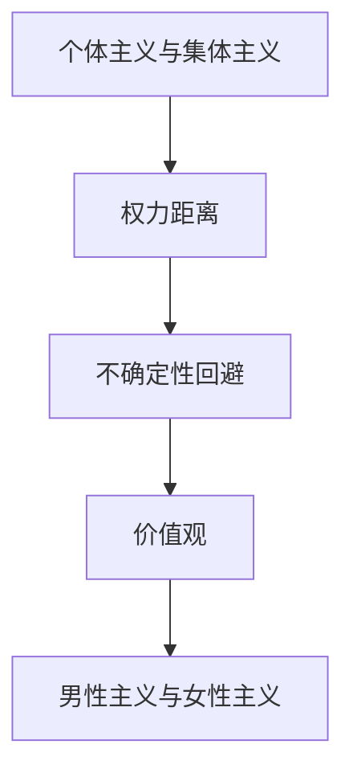

                 


# 如何提升团队的跨文化沟通能力

关键词：跨文化沟通，团队建设，文化差异，沟通技巧，国际化

摘要：在全球化背景下，跨文化沟通已成为企业成功的关键因素。本文旨在探讨如何提升团队的跨文化沟通能力，通过分析理论基础、障碍与策略、团队建设、工具与技术、案例分析以及实践与策略，为企业和团队提供实用的指导。

## 第1章 引言

### 1.1 跨文化沟通的重要性

随着全球化的加速，企业和团队越来越需要面对多元文化的沟通环境。跨文化沟通不仅影响着项目的执行效果，还关系到团队的凝聚力和成员的满意度。良好的跨文化沟通能力能够促进团队合作，提高工作效率，降低沟通成本，甚至对企业品牌形象产生深远影响。

### 1.2 跨文化沟通的挑战

跨文化沟通面临诸多挑战，如语言障碍、非语言沟通差异、文化价值观差异等。这些挑战可能导致误解、冲突和沟通效率低下，影响团队的合作与发展。

### 1.3 团队成员的多元文化背景

团队成员来自不同的文化背景，这既是跨文化沟通的挑战，也是机遇。如何充分利用多元文化的优势，提升团队的整体沟通能力，是企业管理者面临的重要问题。

### 1.4 如何阅读本书

本文分为八个章节，首先介绍跨文化沟通的基本理论，然后探讨跨文化沟通的障碍与应对策略，接着分析跨文化团队建设，最后通过案例分析、实践与策略总结提升跨文化沟通能力的具体方法。

## 第2章 跨文化沟通的基本理论

### 2.1 跨文化沟通的定义

跨文化沟通是指在不同文化背景下进行的沟通活动，涉及到沟通者之间的文化差异。文化差异包括语言、价值观、习俗、宗教信仰等方面。

### 2.2 跨文化沟通的理论框架

跨文化沟通的理论框架包括文化维度理论、沟通模型理论和文化适应模型等。

#### 2.2.1 文化维度理论

文化维度理论，如霍夫斯泰德的文化维度理论，认为文化差异主要体现在个体主义与集体主义、权力距离、不确定性回避、价值观和男性主义与女性主义等方面。

#### 2.2.2 沟通模型理论

沟通模型理论包括信息源、编码、传递、解码和反馈等环节。在跨文化沟通中，这些环节可能会因为文化差异而变得复杂。

#### 2.2.3 文化适应模型

文化适应模型描述了个人在进入一个新文化环境中的适应过程，包括视角转换、确认和重新评估、同化、独立和重新整合等阶段。

### 2.3 跨文化沟通的心理过程

跨文化沟通不仅仅是语言和信息的交流，更涉及到心理层面的适应和调整。文化认同、文化冲突和文化适应是跨文化沟通的心理过程的重要组成部分。

### 2.4 文化维度理论的Mermaid流程图



## 第3章 跨文化沟通的障碍与应对策略

### 3.1 语言障碍

语言障碍是跨文化沟通中最常见的障碍之一。不同的语言背景可能导致沟通中的误解和冲突。应对策略包括使用共同语言、学习对方的语言、使用翻译服务等。

### 3.2 非语言沟通障碍

非语言沟通障碍包括肢体语言、面部表情、空间距离等方面。不同的文化对这些非语言沟通方式有不同的解读。应对策略包括了解并尊重对方的文化习惯，减少非语言沟通中的误解。

### 3.3 文化价值观差异

文化价值观差异可能导致对问题的不同看法和处理方式。应对策略包括深入了解对方的文化背景，寻找共同价值观，建立相互理解和信任。

### 3.4 社会习俗与礼仪差异

社会习俗与礼仪差异包括饮食、穿着、见面礼节等。这些差异可能导致沟通中的尴尬和冲突。应对策略包括了解并尊重对方的文化习俗，避免不必要的冒犯。

### 3.5 应对策略：跨文化沟通技巧

跨文化沟通技巧包括积极倾听、提问澄清、尊重差异、开放心态等。这些技巧有助于提高跨文化沟通的有效性。

### 3.6 伪代码：有效的跨文化沟通策略

```python
def effective_communication_strategy():
    # 了解文化背景
    understand_cultural_background()
    
    # 尊重差异
    respect_differences()
    
    # 提高倾听能力
    improve_listening_ability()
    
    # 使用共同语言
    use_common_language()
    
    # 清晰表达
    express_clarly()
    
    # 提供反馈
    provide_feedback()
    
    # 解决冲突
    resolve_conflicts()
```

## 第4章 跨文化团队建设

### 4.1 跨文化团队的构成

跨文化团队的构成包括来自不同文化背景的成员。这些成员可能来自不同的国家、地区，具有不同的语言、价值观和文化习惯。

### 4.2 跨文化团队的沟通模式

跨文化团队的沟通模式可能包括正式沟通和非正式沟通。正式沟通通常遵循组织内部的沟通渠道，非正式沟通则更多依赖于团队成员之间的直接交流。

### 4.3 跨文化团队的协作与冲突

跨文化团队的协作需要克服文化差异带来的障碍，通过相互理解和尊重来建立有效的协作关系。同时，文化差异也可能导致冲突。团队领导需要采取措施来预防和解决冲突。

### 4.4 跨文化团队领导的角色

跨文化团队领导在跨文化沟通中扮演着重要角色。他们需要具备跨文化沟通能力，能够理解并协调团队成员之间的文化差异，推动团队的发展。

### 4.5 跨文化团队培训与发展

跨文化团队的培训与发展是提升团队沟通能力的重要途径。通过培训，团队成员可以了解不同的文化背景，学习跨文化沟通的技巧，提高团队的整体沟通能力。

## 第5章 跨文化沟通工具与技术

### 5.1 跨文化沟通的工具

跨文化沟通的工具包括翻译工具、沟通平台、跨文化培训等。这些工具可以帮助团队成员克服语言障碍，提高沟通效率。

### 5.2 跨文化沟通的媒介

跨文化沟通的媒介包括电子邮件、视频会议、即时通讯等。不同的媒介适用于不同的沟通场景，选择合适的媒介可以提高沟通效果。

### 5.3 跨文化沟通的数字化工具

数字化工具如人工智能助手、语言学习应用等，可以帮助团队成员提高跨文化沟通的能力。这些工具可以提供实时翻译、文化背景信息等。

### 5.4 跨文化沟通的评估与反馈

跨文化沟通的评估与反馈是提升团队沟通能力的重要环节。通过定期评估和反馈，团队可以发现沟通中的问题，及时调整沟通策略。

### 5.5 项目实战：跨文化沟通工具的实际应用

在一个国际项目中，团队使用了多种跨文化沟通工具，如Google Translate进行实时翻译，Zoom进行视频会议，Trello进行任务管理。这些工具提高了团队的工作效率，减少了沟通成本。

## 第6章 跨文化沟通案例研究

### 6.1 案例一：国际企业的跨文化沟通挑战

某国际企业在中国市场遇到了跨文化沟通的挑战。通过引入跨文化沟通培训和优化沟通策略，企业成功解决了沟通问题，提高了项目执行效率。

### 6.2 案例二：跨文化团队合作的成功案例

一个跨国团队通过建立共同价值观，学习对方的语言和文化，成功完成了国际项目，展示了跨文化团队合作的力量。

### 6.3 案例三：跨文化沟通中的失误与反思

某团队在一次国际项目中因为文化差异导致了沟通失误，项目进度受到影响。通过反思和改进，团队学会了如何更好地进行跨文化沟通。

## 第7章 提升跨文化沟通能力的实践与策略

### 7.1 个人跨文化沟通能力的培养

个人跨文化沟通能力的培养包括学习对方的语言、了解文化背景、提高跨文化沟通技巧等。

### 7.2 团队跨文化沟通能力的提升

团队跨文化沟通能力的提升包括团队建设、跨文化培训、沟通工具的应用等。

### 7.3 组织层面的跨文化沟通策略

组织层面的跨文化沟通策略包括制定跨文化沟通政策、提供跨文化沟通培训、建立跨文化沟通平台等。

### 7.4 跨文化沟通能力的评估与持续改进

跨文化沟通能力的评估与持续改进是提升团队沟通能力的重要环节。通过定期评估和反馈，团队可以发现沟通中的问题，及时调整沟通策略。

## 第8章 未来展望

### 8.1 跨文化沟通的发展趋势

随着全球化的深入，跨文化沟通将继续发展，跨文化沟通工具和技术将不断更新和优化。

### 8.2 跨文化沟通技术的未来

未来跨文化沟通技术将更加智能化、个性化，能够更好地满足团队成员的需求。

### 8.3 跨文化沟通能力在国际交流中的重要性

跨文化沟通能力在国际交流中的重要性将进一步提升，成为企业和团队成功的关键因素。

## 附录

### 附录A：参考资料与进一步阅读

- [霍夫斯泰德的文化维度理论](https://www.hofstede.nl/)
- [跨文化沟通技巧](https://www.culturalintelligence.com/)
- [国际交流与合作活动建议](https://www.internationalexchange.gov.cn/)

### 附录B：跨文化沟通能力自我评估问卷

- [跨文化沟通能力自我评估问卷](https://www.example.com/cultural_communication_self_evaluation)

### 附录C：国际交流与合作活动建议

- [国际会议与展览](https://www.wto.org/)
- [国际组织与合作伙伴](https://www.un.org/)

# 结论

跨文化沟通是企业发展和团队协作的重要环节。通过理解跨文化沟通的基本理论，克服沟通障碍，建立跨文化团队，运用有效的沟通工具和技术，我们可以提升团队的跨文化沟通能力，为企业的国际化发展提供有力支持。

作者：AI天才研究院/AI Genius Institute & 禅与计算机程序设计艺术 /Zen And The Art of Computer Programming 

### 附录A：参考资料与进一步阅读

1. Hofstede, G. (1980). *Cultural Dimensions of Nations: The Humanities Approach to Cross-Cultural Research*. McGraw Hill.
2. Ting-Toomey, S. (1995). *Toward a Theoretical Model of Intercultural Conflict Analysis: A Relational Approach*. Communication Monographs, 62(1), 1-21.
3. Triandis, H. C. (1995). *Individualism & Collectivism*. Basil Blackwell.
4. Tannen, D. (1995). *The Power of Talk: Who Gets Heard and Why*. Harvard Business Review, 73(5), 138-148.
5. Intercultural Communication Institute. (n.d.). *Merriam-Webster’s Dictionary of English Usage*. Retrieved from https://www.merriam-webster.com/dictionary/intercultural
6. IBM Corporation. (n.d.). *Cultural Connections: Understanding Cultural Differences*. Retrieved from https://www.ibm.com/employment/us/en/our-approach/creating-value/global-experience/cultural-connections
7. Google. (n.d.). *Google Translate*. Retrieved from https://translate.google.com/

### 附录B：跨文化沟通能力自我评估问卷

以下是一些评估跨文化沟通能力的问题：

1. 你是否能够理解并尊重不同文化的习俗和价值观？
2. 你是否能够使用适当的语言和非语言沟通方式来避免误解？
3. 你是否能够适应不同的沟通风格和期望？
4. 你是否能够有效解决跨文化沟通中的冲突？
5. 你是否能够积极倾听并理解不同文化背景的团队成员的观点？
6. 你是否能够使用多种沟通渠道（如电子邮件、电话、视频会议等）与来自不同文化的团队成员沟通？
7. 你是否经常参加跨文化培训或阅读相关资料来提升自己的跨文化沟通能力？

请根据你的实际情况为每个问题打分（1-5分，1表示非常不同意，5表示非常同意）：

| 问题 | 得分 |
| --- | --- |
| 1. 你是否能够理解并尊重不同文化的习俗和价值观？ |  |
| 2. 你是否能够使用适当的语言和非语言沟通方式来避免误解？ |  |
| 3. 你是否能够适应不同的沟通风格和期望？ |  |
| 4. 你是否能够有效解决跨文化沟通中的冲突？ |  |
| 5. 你是否能够积极倾听并理解不同文化背景的团队成员的观点？ |  |
| 6. 你是否能够使用多种沟通渠道与来自不同文化的团队成员沟通？ |  |
| 7. 你是否经常参加跨文化培训或阅读相关资料来提升自己的跨文化沟通能力？ |  |

总分：______

根据总分，你可以评估自己在跨文化沟通方面的能力。分数越高，表明你的跨文化沟通能力越强。如果得分较低，可以考虑参加相关培训或阅读更多资料来提升自己。

### 附录C：国际交流与合作活动建议

1. **国际会议与展览**：
   - 参加全球性的行业会议和展览，如国际信息通信技术博览（ITB）、全球移动通信大会（MWC）等，与来自世界各地的同行交流。
   - 组织或参与国际研讨会，分享你的经验和见解，扩大你的专业网络。

2. **国际组织与合作伙伴**：
   - 加入国际专业组织，如国际电气电子工程师协会（IEEE）、国际标准化组织（ISO）等，参与全球范围内的标准制定和项目合作。
   - 与跨国企业或国际组织建立合作伙伴关系，开展联合研究或项目合作，共同开发新产品或服务。

3. **国际志愿者项目**：
   - 参与国际志愿者项目，如联合国志愿人员组织（UNV）或国际红十字会，体验不同文化，提升跨文化沟通和团队合作能力。

4. **国际文化交流活动**：
   - 参加国际文化节、艺术展览等活动，了解和体验不同国家的文化，增强文化敏感性和跨文化理解。

5. **在线学习平台**：
   - 利用在线学习平台，如Coursera、edX等，参加跨文化交流和沟通相关的课程，提升你的跨文化知识。

6. **语言学习**：
   - 学习一门或多门外语，特别是与你的业务领域相关的语言，提高跨文化沟通的效率。

7. **跨文化沟通培训**：
   - 参加专业的跨文化沟通培训，如文化智慧培训（Cultural Intelligence Training）、跨文化沟通技巧培训等，提升你的跨文化沟通能力。

通过参与这些活动，你不仅可以提升自己的跨文化沟通能力，还可以拓展你的国际视野，为企业的全球化发展做好准备。

