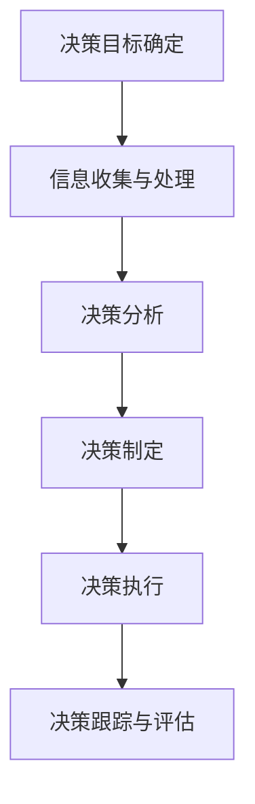

                 

### 《如何提高团队的决策效率》

#### 关键词
- 决策效率
- 团队协作
- 决策过程
- 决策模型
- 决策支持系统

#### 摘要
本文旨在探讨如何提高团队决策效率。我们将从决策效率的基础理论出发，分析决策过程的五个阶段以及影响决策效率的关键因素。接着，我们将介绍一系列提高决策效率的实践方法，包括信息收集与处理、决策分析工具的应用、决策制定与执行等。最后，通过实战案例与工具应用，提供具体解决方案和实用技巧，以期为团队管理者提供有益的参考。

#### 《如何提高团队的决策效率》目录大纲

## 第一部分：决策效率的基础理论

### 1.1 决策效率的重要性
- 决策效率在企业中的核心作用
- 提高决策效率的必要性

### 1.2 决策过程概述
- 决策的定义与类型
- 决策过程的五个阶段

### 1.3 决策效率的影响因素
- 决策者认知偏见
- 信息质量与可用性
- 时间压力与决策效率

### 1.4 决策效率与团队协作
- 团队决策的优势与挑战
- 提高团队决策效率的方法

### 1.5 决策模型的概述
- 经典决策模型
- 现代决策模型的应用

## 第二部分：提高决策效率的实践方法

### 2.1 信息收集与处理
- 有效信息收集的策略
- 信息处理的工具与方法

### 2.2 决策分析工具与应用
- SWOT分析
- 价值工程与价值分析
- 成本效益分析

### 2.3 决策制定与执行
- 制定决策的策略
- 执行决策的技巧

### 2.4 决策支持系统
- 决策支持系统的定义与功能
- 决策支持系统的设计与实现

### 2.5 团队决策的优化
- 团队沟通的技巧
- 团队协作工具的应用

### 2.6 决策跟踪与评估
- 决策结果跟踪
- 决策效果评估

## 第三部分：实战案例与工具应用

### 3.1 实战案例一：公司战略决策
- 决策背景与目标
- 决策过程与策略
- 决策效果评估

### 3.2 实战案例二：产品开发决策
- 决策背景与目标
- 决策过程与策略
- 决策效果评估

### 3.3 工具应用一：决策支持软件
- 常用决策支持软件介绍
- 软件功能与应用实例

### 3.4 工具应用二：决策模型可视化
- Mermaid 流程图的使用
- 决策模型的可视化展示

### 3.5 工具应用三：团队协作工具
- 常用团队协作工具介绍
- 工具在决策过程中的应用实例

## 第四部分：总结与展望

### 4.1 提高决策效率的总结
- 决策效率提升的关键因素
- 未来决策效率提升的趋势

### 4.2 实践建议与未来研究方向
- 提高决策效率的具体建议
- 决策效率研究的未来发展方向

### 4.3 附录
- 决策支持工具列表
- 常用决策模型参考
- 相关研究论文推荐

#### Mermaid 流程图：决策过程流程图


#### 决策分析的伪代码示例
```python
def decisionAnalysis(problems, options, criteria):
    // 初始化决策分析结果
    results = []

    // 对每个问题进行决策分析
    for problem in problems:
        problemAnalysis = []

        // 对每个选项进行分析
        for option in options:
            optionScore = 0

            // 根据每个评价标准计算分数
            for criteria in criteria:
                score = calculateScore(option, criteria)
                optionScore += score

            // 将选项得分添加到问题分析中
            problemAnalysis.append(optionScore)

        // 将问题分析结果添加到决策分析结果中
        results.append(problemAnalysis)

    // 根据总分排序
    sortedResults = sort(results, descending=True)

    // 返回决策分析结果
    return sortedResults
```

#### 数学模型与公式：决策树模型
$$
\text{决策树模型} = \frac{\sum_{i=1}^{n} w_i \times \text{Gain}(S_i)}{\sum_{i=1}^{n} w_i}
$$

- \( w_i \) 代表每个子集的权重
- \( \text{Gain}(S_i) \) 代表子集 \( S_i \) 的信息增益

#### 3.1 实战案例

--------------------------------------------------------

**决策背景与目标**

某科技公司计划推出一款新型智能手机，旨在抢占市场份额并实现盈利。在产品开发的各个阶段，决策的效率直接关系到项目的成功与否。公司希望通过高效的决策流程，确保产品从研发到市场投放的每一步都能迅速、精准地完成。

**决策过程与策略**

1. **目标确定**
   - 明确决策目标：提高市场份额，实现产品盈利。
   - 制定关键指标：销售额、用户满意度、市场份额等。

2. **信息收集与处理**
   - 收集市场数据：竞争对手分析、用户需求调研、行业趋势等。
   - 整理分析数据：运用SWOT分析，明确公司的优势、劣势、机会与威胁。

3. **决策分析**
   - 采用成本效益分析，评估不同研发方案的投入与回报。
   - 利用决策树模型，对各方案进行评估与选择。

4. **决策制定**
   - 根据分析结果，选择最佳研发方案。
   - 制定详细的研发计划和项目预算。

5. **决策执行**
   - 分配研发资源，确保项目按计划推进。
   - 建立沟通机制，确保团队成员之间的协作顺畅。

6. **决策跟踪与评估**
   - 定期跟踪项目进度，及时调整决策。
   - 通过销售数据和用户反馈，评估产品市场表现。

**决策效果评估**

1. **项目进度**
   - 项目按计划完成，达到预期目标。
   - 关键里程碑按时达成，团队协作高效。

2. **市场表现**
   - 销售额稳步增长，市场份额有所提升。
   - 用户满意度较高，产品口碑良好。

3. **财务状况**
   - 投入成本得到有效控制，实现盈利。
   - 产品利润率符合预期，财务表现健康。

**项目小结**

通过高效的决策流程，公司在产品开发过程中实现了精准的决策和高效的执行。这一实战案例表明，提高决策效率是确保项目成功的关键。未来，公司将继续优化决策流程，提升团队协作效率，以应对不断变化的市场挑战。

### 提高决策效率的具体建议

#### 1. 建立明确的决策流程

- 设计标准化的决策流程，明确每个阶段的任务和责任人。
- 制定决策模板，确保决策过程的透明和可追溯。

#### 2. 优化信息收集与处理

- 强化信息收集机制，确保信息来源的可靠性和及时性。
- 建立信息共享平台，提高信息传播效率和利用率。

#### 3. 应用决策分析工具

- 运用SWOT分析、成本效益分析等工具，对决策方案进行评估。
- 引入决策支持系统，辅助决策者做出更加科学的选择。

#### 4. 强化团队协作

- 建立高效的沟通机制，确保团队成员之间的信息畅通。
- 引入团队协作工具，提高团队协作效率和决策效率。

#### 5. 定期评估与反馈

- 定期评估决策效果，总结经验教训，不断优化决策流程。
- 鼓励团队成员提供反馈，共同改进决策过程。

### 决策效率研究的未来发展方向

#### 1. 人工智能与决策支持

- 探索人工智能在决策支持中的应用，提高决策的智能化和自动化水平。
- 开发基于大数据分析的决策支持系统，实现更加精准的决策。

#### 2. 团队协作与决策效率

- 研究团队协作对决策效率的影响，提出优化团队协作的策略。
- 探索多智能体系统在团队决策中的应用，提高团队决策的协同效率。

#### 3. 决策伦理与责任

- 研究决策过程中的伦理问题，确保决策的公正性和道德性。
- 探讨决策责任分配机制，明确决策者的责任与义务。

### 附录

#### 决策支持工具列表
- SWOT分析工具：Tableau、Excel、Mural
- 成本效益分析工具：Excel、Power BI、Tableau
- 决策树模型工具：Excel、R、Python

#### 常用决策模型参考
- 决策树模型
- 贝叶斯网络模型
- 风险分析模型

#### 相关研究论文推荐
- "A Survey on Decision-Making: Models and Algorithms" by X. Liu et al.
- "Group Decision Making in Organizations: An Overview" by J. Y. Kim
- "Intelligent Decision Support Systems: An Overview" by V. Marler

通过以上详细的分析和实战案例，我们可以看到，提高团队决策效率是一个系统性工程，需要从信息收集、决策分析、团队协作等多个方面进行综合考虑和优化。希望本文能为团队管理者提供有益的参考，助力团队在复杂的市场环境中做出更加明智、高效的决策。作者：AI天才研究院/AI Genius Institute & 禅与计算机程序设计艺术 /Zen And The Art of Computer Programming。

