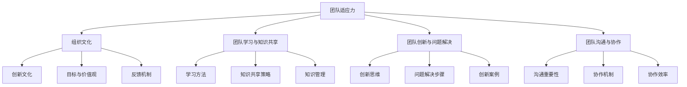

                 

## 文章标题

### 如何提高团队的适应力和灵活性

## 关键词

- 团队适应力
- 团队灵活性
- 组织文化
- 知识共享
- 创新思维
- 沟通协作
- 变化管理
- 灵敏团队

## 摘要

在快速变化的市场环境中，团队的适应力和灵活性成为了企业成功的关键因素。本文将深入探讨如何通过构建适应力的组织文化、团队学习与知识共享、创新与问题解决、团队沟通与协作等策略，提高团队的适应力和灵活性。文章还结合实际案例，提供了提升团队适应力与灵活性的实践方法和持续改进策略，为企业管理者提供指导。

## 第一部分：团队适应力与灵活性概述

### 第1章：团队适应力与灵活性的重要性

#### 1.1.1 团队适应力与灵活性的定义

**团队适应力**：指团队在面对外部环境和内部变化时，能够迅速调整自身结构、流程和策略，以实现组织目标的能力。

**团队灵活性**：指团队在动态环境中，能够快速响应变化、灵活调整资源分配和任务执行的能力。

在当今信息化、全球化的背景下，技术变革和市场需求的快速变化对企业提出了更高的要求。团队作为企业创新和发展的核心单元，其适应力和灵活性成为企业能否持续竞争的关键因素。

#### 1.1.2 团队适应力与灵活性的核心价值

- **提高竞争力**：适应力和灵活性使团队能够迅速响应市场变化，抓住商业机会，提高企业竞争力。
- **促进创新**：团队适应力和灵活性有助于激发团队成员的创新思维，推动技术创新和业务模式创新。
- **增强稳定性**：在面对外部冲击和内部挑战时，具备适应力和灵活性的团队能够保持稳定运行，降低组织风险。
- **提升员工满意度**：适应力和灵活性为员工提供了更多的发展机会和挑战，提高员工的工作满意度。

#### 1.1.3 团队适应力与灵活性的现状分析

目前，许多企业在提升团队适应力和灵活性方面还存在一些问题：

- **组织文化**：部分企业缺乏鼓励创新和适应变化的组织文化，员工积极性受到限制。
- **知识共享**：团队成员间缺乏有效的知识共享机制，导致信息不对称和资源浪费。
- **沟通协作**：团队内部沟通不畅，协作效率低下，影响了团队适应力和灵活性。
- **变化管理**：企业在应对外部变化时，缺乏系统和有效的变化管理策略，导致团队应对能力不足。

### 第2章：团队适应力与灵活性的理论框架

#### 2.1.1 团队学习与知识共享

**团队学习**：团队通过共同学习和实践，提升成员的知识和技能，增强团队整体实力。

**知识共享**：团队成员通过分享知识、经验和信息，提高团队信息透明度和协作效率。

**团队学习与知识共享的关系**：团队学习是知识共享的基础，知识共享是团队学习的重要保障。

#### 2.1.2 团队创新与问题解决

**团队创新**：团队通过创造性思维和方法，不断寻求新的解决方案，推动组织发展。

**问题解决**：团队在面对问题时，通过分析、讨论和实验，找到合适的解决方法。

**团队创新与问题解决的关系**：问题解决是团队创新的实践过程，团队创新是问题解决的动力源泉。

#### 2.1.3 团队沟通与协作

**团队沟通**：团队成员之间的信息交流，包括正式沟通和非正式沟通。

**团队协作**：团队成员在共同目标下，相互配合、协作完成任务。

**团队沟通与协作的关系**：良好的沟通是协作的基础，协作是沟通的延伸。

### 下一步：在第二部分，我们将探讨提升团队适应力的策略与实践，包括构建适应力的组织文化、团队学习与知识共享、团队创新与问题解决、团队沟通与协作等。敬请期待。

---

### 第3章：构建适应力的组织文化

#### 3.1.1 培养开放与创新的文化氛围

**文化氛围的重要性**：一个开放与创新的文化氛围是团队适应力和灵活性的基础。这种文化鼓励团队成员尝试新想法、接受失败并从中学习。

**具体措施**：

1. **鼓励实验与失败**：建立“安全空间”，让团队成员敢于尝试新方法，即使失败也不受惩罚。
2. **建立奖励机制**：对于创新想法和实践给予奖励，包括物质奖励和精神鼓励。
3. **建立多元化的沟通渠道**：鼓励不同背景和职能的成员分享观点，促进思想的碰撞。

**案例分析**：谷歌公司通过建立“20%时间项目”机制，鼓励员工利用工作时间的20%进行个人感兴趣的创新项目，取得了显著的创新成果。

#### 3.1.2 设定明确的目标与价值观

**明确目标与价值观的作用**：明确的目标和价值观是团队凝聚力和一致行动力的保障，有助于提高团队的适应力和灵活性。

**具体措施**：

1. **制定清晰的愿景与使命**：明确团队的发展方向和核心价值，确保团队成员目标一致。
2. **设定具体的可衡量目标**：将愿景和使命转化为具体、可衡量的目标，确保团队行动有据可循。
3. **定期回顾与调整**：根据实际情况定期回顾目标完成情况，必要时进行调整。

**案例分析**：苹果公司通过设定明确的“颠覆性创新”目标，推动了iPhone的诞生，彻底改变了智能手机市场。

#### 3.1.3 建立有效的反馈机制

**反馈机制的重要性**：有效的反馈机制有助于团队成员及时了解自身表现，发现问题和改进方向。

**具体措施**：

1. **建立多层次的反馈渠道**：包括正式的绩效评估、非正式的一对一沟通、团队会议等。
2. **提供具体、有针对性的反馈**：避免模糊的表扬或批评，具体指出团队成员的优点和改进点。
3. **鼓励自我反馈与自我改进**：培养团队成员的自我反思能力，鼓励他们在工作中不断自我提升。

**案例分析**：亚马逊公司通过“领导力原则”和“年度反馈”机制，确保团队成员能够持续改进，提高了团队的整体表现。

### 小结

构建适应力的组织文化是一个持续的过程，需要企业从多个方面入手，营造开放与创新的文化氛围，设定明确的目标与价值观，并建立有效的反馈机制。通过这些措施，企业可以提升团队的适应力和灵活性，为企业的持续发展奠定基础。

---

### 第4章：团队学习与知识共享

#### 4.1.1 团队学习的方法与工具

**团队学习的方法**：

1. **案例学习**：通过研究成功或失败的案例，团队成员可以吸取经验教训，提升自身能力。
2. **讨论与反思**：定期组织团队讨论，鼓励成员分享观点，反思工作中的问题，寻找解决方案。
3. **行动学习**：将学习与实践相结合，通过实际项目的开展，将知识转化为行动力。

**团队学习的工具**：

1. **知识库**：建立内部知识库，收集、整理和分享团队成员的经验和知识。
2. **学习管理系统（LMS）**：利用学习管理系统，提供在线课程、测试和评估，方便团队成员随时学习。
3. **虚拟课堂**：通过视频会议和在线交流工具，组织远程学习活动，提升团队成员的学习效果。

**案例分析**：微软公司通过内部学习管理系统（MSDN），为员工提供了丰富的学习资源和交流平台，促进了团队学习与知识共享。

#### 4.1.2 知识共享的策略与实践

**知识共享的策略**：

1. **明确知识共享的目标**：设定具体的知识共享目标，如提高工作效率、减少重复劳动等。
2. **建立知识共享激励机制**：对积极参与知识共享的成员给予奖励，激发团队成员的积极性。
3. **制定知识共享的规范**：明确知识共享的内容、形式和流程，确保知识共享的有序进行。

**知识共享的实践**：

1. **建立跨部门知识共享平台**：通过企业内部网络或社交媒体，建立跨部门的交流平台，促进知识共享。
2. **组织知识分享会**：定期举办知识分享会，邀请内部专家或外部顾问进行知识分享，提高团队的整体知识水平。
3. **开展培训与研讨会**：通过培训课程和研讨会，提高团队成员的专业知识和技能。

**案例分析**：IBM公司通过内部知识分享平台（IBM Knowledge Center），鼓励员工分享最佳实践和经验，提高了团队的知识共享水平。

#### 4.1.3 知识管理的最佳实践

**知识管理的最佳实践**：

1. **建立知识地图**：通过知识地图，清晰地展示知识的结构，帮助团队成员快速找到所需信息。
2. **构建知识社区**：鼓励团队成员加入知识社区，通过互动和合作，共同创造和分享知识。
3. **培养知识管理文化**：将知识管理纳入企业文化建设，使知识管理成为团队成员的自觉行为。

**案例分析**：华为公司通过建立知识管理文化，将知识共享和知识创新融入到企业的日常运营中，提高了团队的适应力和灵活性。

### 小结

团队学习与知识共享是提高团队适应力和灵活性不可或缺的部分。通过有效的学习方法和工具，以及系统化的知识共享策略与实践，企业可以培养团队成员的学习能力和知识积累，提升团队的整体竞争力。知识管理的最佳实践为企业提供了指导，有助于构建一个知识共享和创新的团队文化。

---

### 第5章：团队创新与问题解决

#### 5.1.1 创新思维与创造性方法

**创新思维的重要性**：创新思维是团队适应力和灵活性的核心要素，能够激发团队的创造力，推动组织发展。

**创新思维的培养**：

1. **多样性思维**：鼓励团队成员从不同角度思考问题，提高思维的多样性和开放性。
2. **系统思维**：培养团队的整体观和系统观，从整体上分析和解决问题。
3. **批判性思维**：鼓励团队成员对现有观念和解决方案提出质疑，推动不断改进。

**创造性方法的实践**：

1. **头脑风暴**：通过集体讨论，快速产生大量创意。
2. **思维导图**：利用思维导图，将创意和思路可视化，提高思维的连贯性和逻辑性。
3. **原型设计**：通过快速构建原型，验证创意的可行性和效果。

**案例分析**：3M公司通过鼓励员工进行“15%时间项目”，激发了员工的创新思维，推出了诸如“胶带”等经典产品。

#### 5.1.2 问题解决的步骤与技巧

**问题解决的步骤**：

1. **明确问题**：准确识别问题的本质，确保解决的方向正确。
2. **收集信息**：收集与问题相关的信息，包括数据、案例、专家意见等。
3. **分析问题**：通过数据分析、模型构建等方法，深入分析问题的原因和影响。
4. **设计方案**：基于分析结果，提出多种解决方案，并进行评估和选择。
5. **实施方案**：制定详细的实施计划，确保方案能够有效执行。
6. **评估效果**：对实施效果进行评估，及时调整和优化。

**问题解决的技巧**：

1. **快速决策**：在问题解决过程中，避免过度分析，快速做出决策。
2. **跨部门协作**：鼓励不同部门的团队成员协作解决问题，充分利用各自的专业知识。
3. **持续跟进**：在问题解决后，持续关注问题的变化和新的挑战，确保问题得到根本解决。

**案例分析**：丰田公司通过“问题解决五步法”，有效提升了团队的解决问题的能力，提高了生产效率和产品质量。

#### 5.1.3 团队创新的成功案例

**案例一：谷歌的“X实验室”**：

谷歌的“X实验室”是一个专注于前沿技术创新的团队，通过头脑风暴、快速原型设计和实验验证，推出了一系列颠覆性的产品，如谷歌眼镜和自动驾驶汽车。

**案例二：宝洁的“创新工厂”**：

宝洁公司通过建立“创新工厂”，鼓励员工跨部门合作，利用创新方法和工具，成功推出了多个明星产品，如帮宝适“超薄干爽”系列和汰渍“深层去渍”系列。

**案例三：3M的“15%时间项目”**：

3M公司鼓励员工将工作时间的15%用于个人兴趣项目，许多成功的产品，如“胶带”和“投影胶片”，都源自这一政策。

### 小结

团队创新与问题解决是提高团队适应力和灵活性的关键环节。通过培养创新思维和创造性方法，以及系统化的问题解决步骤和技巧，团队可以更好地应对外部变化和内部挑战。成功的团队创新案例展示了如何通过创新方法和实践，推动组织的持续发展。

---

### 第6章：团队沟通与协作

#### 6.1.1 沟通的重要性与障碍

**沟通的重要性**：

1. **提高团队效率**：有效的沟通能够确保团队成员明确任务和目标，减少误解和重复劳动。
2. **促进知识共享**：沟通是知识共享的重要渠道，通过沟通，团队成员可以分享经验和信息，提高整体知识水平。
3. **增强团队凝聚力**：良好的沟通能够增强团队成员之间的信任和理解，提高团队凝聚力。

**沟通障碍**：

1. **信息不对称**：由于信息传递的不对称性，可能导致团队成员对任务和目标的理解出现偏差。
2. **文化差异**：不同文化背景的团队成员可能存在沟通方式和习惯的差异，影响沟通效果。
3. **沟通工具不当**：选择不适合的沟通工具，可能导致信息传递不畅，影响沟通效率。

**案例分析**：谷歌通过定期的团队会议和透明的信息共享，有效克服了沟通障碍，提高了团队的协作效率。

#### 6.1.2 协作机制与工具

**协作机制**：

1. **明确的职责分工**：明确团队成员的职责和任务，确保任务分配合理，避免职责重叠或遗漏。
2. **定期会议与回顾**：定期召开团队会议，讨论任务进展和问题，确保团队成员之间信息同步。
3. **跨部门协作**：建立跨部门协作机制，促进不同部门之间的沟通和协作，提高整体效率。

**协作工具**：

1. **即时通讯工具**：如Slack、Microsoft Teams等，用于实时沟通和协作。
2. **项目管理工具**：如Trello、Asana等，用于任务分配、进度跟踪和团队协作。
3. **文档共享平台**：如Google Drive、OneDrive等，用于文档的创建、共享和协作编辑。

**案例分析**：微软公司通过使用Microsoft Teams，实现了团队内部的高效沟通和协作，提高了项目执行效率。

#### 6.1.3 协作效率的提升策略

**策略一：建立信任**：

1. **公开透明**：在团队中建立公开透明的信息分享机制，增强团队成员之间的信任。
2. **共同目标**：明确团队的共同目标，使团队成员在协作过程中保持一致。

**策略二：优化沟通方式**：

1. **简洁明了**：在沟通中尽量使用简单明了的语言，避免使用过于复杂的术语和表达方式。
2. **及时反馈**：在沟通中及时给予反馈，确保信息传递的准确性和有效性。

**策略三：提高技术支持**：

1. **培训与指导**：对团队成员进行协作工具和技术的培训，提高团队成员的技能水平。
2. **技术支持**：提供及时的技术支持和故障排除，确保协作工具的稳定运行。

**案例分析**：阿里巴巴通过定期的团队培训和技术支持，提高了团队协作的效率和质量。

### 小结

团队沟通与协作是提高团队适应力和灵活性的关键环节。通过识别沟通障碍、建立有效的协作机制和工具，以及采取提升协作效率的策略，团队可以更好地应对外部变化和内部挑战，实现组织的持续发展。

---

### 第7章：灵活应对变化的策略

#### 7.1.1 变化管理的步骤与方法

**变化管理的步骤**：

1. **识别变化**：及时发现外部环境和内部管理中的变化，确保变化得到及时关注和处理。
2. **分析变化**：对变化进行深入分析，了解变化的本质、原因和影响，为变化管理提供依据。
3. **规划应对**：制定应对变化的策略和计划，确保变化管理的有序进行。
4. **实施计划**：根据制定的计划，实施具体措施，确保变化得到有效应对。
5. **评估效果**：对变化管理的效果进行评估，及时发现和纠正问题，确保变化管理达到预期目标。

**变化管理的方法**：

1. **敏捷管理**：采用敏捷开发的方法，快速响应变化，持续迭代改进。
2. **风险管理**：识别和评估变化带来的风险，制定相应的风险应对策略。
3. **沟通协调**：加强与各部门和团队成员的沟通，确保变化管理得到全员支持和理解。
4. **培训与指导**：为团队成员提供必要的培训和支持，提高团队成员应对变化的能力。

**案例分析**：亚马逊公司通过敏捷管理和风险管理，成功应对了电子商务市场的快速变化，实现了持续的业务增长。

#### 7.1.2 建立敏捷团队

**敏捷团队的特点**：

1. **自组织**：团队成员自主决策，灵活调整工作内容和方式。
2. **跨职能**：团队成员具备多方面的技能，能够快速应对不同任务的需求。
3. **高效率**：通过短周期迭代和持续反馈，提高团队的执行效率和创新能力。

**建立敏捷团队的步骤**：

1. **确定目标和范围**：明确团队的目标和任务范围，确保团队有清晰的方向。
2. **组建团队成员**：根据任务需求，选拔具备跨职能能力的团队成员。
3. **制定迭代计划**：制定团队的迭代计划，确保团队成员在规定的时间内完成任务。
4. **实施敏捷实践**：采用敏捷开发的方法，如每日站立会议、迭代回顾等，提高团队的协作效率。

**案例分析**：谷歌公司通过建立敏捷团队，成功推动了多个大型项目的快速开发和交付。

#### 7.1.3 灵活应对不确定性的策略

**策略一：加强预测与规划**：

1. **数据驱动**：利用数据分析和预测工具，提高对市场变化的预测准确性。
2. **滚动规划**：采用滚动规划的方法，根据市场变化及时调整战略规划。

**策略二：培养敏捷思维**：

1. **快速适应**：鼓励团队成员在面对不确定性时，快速适应和调整。
2. **持续学习**：提供培训和学习机会，提高团队成员的技能和知识水平。

**策略三：建立灵活的团队结构**：

1. **虚拟团队**：利用远程协作工具，建立虚拟团队，提高团队的灵活性和响应速度。
2. **模块化团队**：采用模块化团队结构，根据任务需求灵活调整团队组成。

**案例分析**：微软公司通过虚拟团队和模块化团队，成功应对了全球疫情带来的不确定性，保持了业务的稳定运行。

### 小结

灵活应对变化是提高团队适应力和灵活性的关键。通过识别变化、建立敏捷团队和灵活应对不确定性的策略，团队可以更好地应对外部环境的快速变化，实现持续的业务增长。

---

### 第8章：团队结构与角色调整

#### 8.1.1 团队结构的优化

**团队结构优化的原则**：

1. **职能互补**：团队成员具备互补的职能和能力，提高团队的整体执行力和创新能力。
2. **灵活适应**：团队结构能够根据项目需求和市场变化灵活调整，提高团队的适应力和灵活性。
3. **高效协作**：团队成员之间沟通畅通，协作高效，减少资源浪费。

**团队结构优化的方法**：

1. **矩阵式结构**：将职能团队和项目团队相结合，提高团队的灵活性和响应速度。
2. **扁平化结构**：减少管理层次，提高决策效率，增强团队的执行力。
3. **跨部门协作**：打破部门壁垒，促进不同部门之间的沟通和协作，提高整体效率。

**案例分析**：华为公司通过采用矩阵式结构和扁平化结构，实现了团队的快速响应和高效协作，提升了企业的市场竞争力。

#### 8.1.2 角色定位与能力发展

**角色定位**：

1. **明确职责**：为每个团队成员明确职责和任务，确保团队成员明确自身的工作重点和目标。
2. **技能匹配**：根据团队成员的技能和特长，为其分配合适的角色，提高团队的整体执行力。

**能力发展**：

1. **技能培训**：为团队成员提供持续的技能培训和学习机会，提高其专业能力和综合素质。
2. **经验分享**：鼓励团队成员分享工作经验和心得，促进知识的传递和团队整体能力的提升。
3. **职业规划**：为团队成员制定明确的职业发展规划，帮助其实现个人成长和团队发展的双赢。

**案例分析**：微软公司通过为员工提供丰富的培训机会和职业发展支持，培养了大批高素质的团队成员，推动了企业的持续发展。

#### 8.1.3 团队规模与动态调整

**团队规模调整的原则**：

1. **任务需求**：根据项目的任务需求和规模，合理调整团队规模，确保团队资源的最优配置。
2. **效率优先**：在保证团队效率的前提下，合理控制团队规模，避免资源浪费。
3. **灵活性**：团队规模应具备一定的灵活性，能够根据市场变化和项目需求进行动态调整。

**团队规模调整的方法**：

1. **弹性团队**：建立弹性团队，根据任务需求灵活增减团队成员，提高团队的适应力和灵活性。
2. **模块化团队**：采用模块化团队结构，根据任务需求组合不同模块，提高团队的灵活性和响应速度。

**案例分析**：阿里巴巴通过采用弹性团队和模块化团队，实现了团队的快速响应和市场变化，保持了企业的持续竞争力。

### 小结

团队结构与角色调整是提高团队适应力和灵活性不可或缺的环节。通过优化团队结构、明确角色定位和能力发展，以及动态调整团队规模，团队可以更好地应对外部变化和内部挑战，实现组织的持续发展。

---

### 第9章：技术工具与创新应用

#### 9.1.1 技术工具的选择与应用

**技术工具的重要性**：在现代团队中，技术工具是提高适应力和灵活性的关键。这些工具能够支持团队协作、知识共享、创新实践等多个方面。

**技术工具的选择**：

1. **协作工具**：如Slack、Microsoft Teams等，用于团队内部沟通和协作。
2. **项目管理工具**：如Trello、Asana、JIRA等，用于任务分配、进度跟踪和项目管理。
3. **知识管理工具**：如Confluence、SharePoint等，用于知识共享和文档管理。
4. **数据分析工具**：如Tableau、Power BI等，用于数据分析和可视化。

**技术工具的应用**：

1. **提高沟通效率**：通过协作工具，团队成员可以实时沟通，快速响应任务需求，减少信息滞后。
2. **优化项目管理**：通过项目管理工具，团队可以明确任务进度和责任，提高项目执行效率。
3. **促进知识共享**：通过知识管理工具，团队成员可以方便地共享知识和经验，提升团队整体水平。
4. **支持数据分析**：通过数据分析工具，团队可以深入了解业务数据，为决策提供数据支持。

#### 9.1.2 创新应用案例分析

**案例一：亚马逊的Kiva系统**：

亚马逊通过引入Kiva机器人自动化仓库管理，大幅提高了物流效率。Kiva系统通过实时数据分析和智能调度，实现了仓库作业的自动化和优化，提高了团队适应力和灵活性。

**案例二：谷歌的AI驱动的产品创新**：

谷歌通过AI技术，驱动了一系列产品创新，如Gmail的智能回复、Google Photos的智能标签等。这些创新不仅提高了用户体验，还增强了团队的适应力和创新能力。

**案例三：阿里巴巴的数字供应链管理**：

阿里巴巴通过建立数字供应链管理系统，实现了供应链的实时监控和优化。该系统通过大数据分析和人工智能技术，提高了供应链的响应速度和灵活性，增强了团队的适应力。

#### 9.1.3 技术发展趋势与团队适应性

**技术发展趋势**：

1. **人工智能与机器学习**：随着AI技术的不断发展，越来越多的企业将AI应用到生产和管理中，提高效率和灵活性。
2. **云计算与大数据**：云计算和大数据技术的普及，为团队提供了强大的数据处理和分析能力，支持团队的快速适应和创新能力。
3. **物联网与边缘计算**：物联网和边缘计算技术的应用，使团队能够实时获取和处理大量数据，提高决策的准确性和响应速度。

**团队适应性**：

1. **技术融合**：团队需要具备融合不同技术的能力，如将AI、云计算、大数据等技术有机结合，提高团队的整体适应力。
2. **持续学习**：团队需要持续关注技术发展趋势，不断学习和掌握新技术，以适应不断变化的市场环境。
3. **敏捷转型**：团队需要具备敏捷转型能力，通过快速调整和优化团队结构、流程和策略，应对外部变化。

### 小结

技术工具和创新应用是提高团队适应力和灵活性的重要手段。通过合理选择和应用技术工具，以及关注技术发展趋势，团队可以更好地应对外部变化和内部挑战，实现持续的创新和发展。

---

### 第10章：团队适应力与灵活性实战案例

#### 10.1.1 案例一：某互联网公司团队适应力提升实践

**背景**：

某互联网公司在快速发展的过程中，面临着市场需求变化快、产品迭代周期短等挑战。为了提升团队的适应力，公司决定采取一系列措施。

**措施**：

1. **构建敏捷团队**：公司通过重组团队，采用敏捷开发方法，提高团队的灵活性和响应速度。
2. **引入项目管理工具**：公司引入Trello和JIRA等项目管理工具，明确任务分配和进度跟踪，提高项目管理效率。
3. **加强知识共享**：公司建立内部知识库，定期组织知识分享会，促进团队成员之间的知识共享和经验交流。
4. **培训与指导**：公司为团队成员提供持续的培训和学习机会，提高团队的整体技能和素质。

**效果**：

通过这些措施，该公司的团队适应力显著提升，产品迭代周期缩短，市场响应速度加快，公司业绩稳步增长。

#### 10.1.2 案例二：某制造业企业团队灵活性提升实践

**背景**：

某制造业企业在市场竞争加剧的背景下，面临着产品更新换代快、生产效率要求高等挑战。为了提升团队的灵活性，企业决定采取一系列措施。

**措施**：

1. **优化团队结构**：企业通过优化团队结构，采用矩阵式管理和跨部门协作，提高团队的灵活性和响应速度。
2. **引入数字化工具**：企业引入MES（制造执行系统）等数字化工具，提高生产过程的自动化和智能化水平。
3. **建立反馈机制**：企业建立反馈机制，鼓励员工提出改进建议，快速响应和解决生产中的问题。
4. **培训与能力发展**：企业为员工提供技能培训和能力发展机会，提高团队的整体素质和适应力。

**效果**：

通过这些措施，该企业的团队灵活性显著提升，生产效率提高，产品质量稳定，市场竞争力增强。

#### 10.1.3 案例三：某初创公司团队适应力与灵活性提升实践

**背景**：

某初创公司在初创阶段面临着资源有限、市场竞争激烈等挑战。为了提升团队的适应力与灵活性，公司决定采取一系列措施。

**措施**：

1. **构建开放式创新文化**：公司鼓励员工提出创新想法，建立开放式创新文化，激发团队的创造力和创新精神。
2. **快速迭代开发**：公司采用快速迭代开发模式，快速响应市场需求，提高产品的市场适应能力。
3. **跨部门协作**：公司打破部门壁垒，促进跨部门协作，提高团队的灵活性和响应速度。
4. **灵活利用外部资源**：公司积极与外部合作伙伴合作，借助外部资源，提升团队的创新能力和市场竞争力。

**效果**：

通过这些措施，该初创公司团队的适应力与灵活性显著提升，产品市场接受度提高，企业快速发展。

### 小结

这些实战案例展示了不同类型企业在提升团队适应力与灵活性方面的成功实践。通过构建敏捷团队、引入数字化工具、建立反馈机制、构建开放式创新文化等措施，企业可以有效地提升团队的适应力和灵活性，实现持续的创新和发展。

---

### 第11章：团队适应力与灵活性评估与持续改进

#### 11.1.1 评估方法与工具

**评估方法**：

1. **关键绩效指标（KPI）**：通过设定关键绩效指标，对团队的适应力和灵活性进行量化评估。
2. **员工满意度调查**：通过定期进行员工满意度调查，了解团队的工作氛围、沟通协作和创新能力等方面的情况。
3. **第三方评估**：邀请第三方评估机构，对团队的适应力和灵活性进行专业评估。

**评估工具**：

1. **问卷调查**：通过设计问卷，收集团队成员和员工的反馈意见，评估团队的整体表现。
2. **数据分析工具**：如Excel、Python等，用于分析评估数据，识别团队存在的问题和改进方向。
3. **反馈系统**：建立反馈系统，让团队成员和员工能够方便地提交反馈和建议，为评估提供真实的数据支持。

#### 11.1.2 持续改进策略与实践

**持续改进的策略**：

1. **定期评估与反馈**：定期对团队适应力和灵活性进行评估，及时发现问题和改进方向，确保改进措施的有效实施。
2. **全员参与**：鼓励团队成员和员工参与改进过程，通过团队合作，共同推动改进措施的实施。
3. **持续学习与培训**：为团队成员提供持续的培训和学习机会，提高其技能和素质，增强团队的整体适应力。
4. **激励机制**：建立激励机制，对积极参与改进和提出有效建议的团队成员和员工给予奖励，激发其改进的热情。

**持续改进的实践**：

1. **问题识别与诊断**：通过数据分析、员工反馈等手段，识别团队存在的问题和瓶颈，明确改进方向。
2. **制定改进计划**：根据问题识别结果，制定具体的改进计划，明确改进目标、措施和责任人。
3. **实施与跟踪**：执行改进计划，跟踪改进措施的实施进度和效果，确保改进目标的实现。
4. **反馈与调整**：根据改进措施的实施效果，及时进行反馈和调整，确保改进过程的持续优化。

#### 11.1.3 未来展望与趋势分析

**未来展望**：

随着全球化和信息化的发展，企业面临的市场竞争将更加激烈，团队适应力和灵活性将成为企业成功的关键因素。未来，企业需要更加注重团队文化的建设，鼓励创新和适应变化，提高团队的整体素质和竞争力。

**趋势分析**：

1. **数字化与智能化**：随着数字化和智能化技术的发展，团队将更加依赖于数据分析和人工智能技术，提高决策的准确性和效率。
2. **跨领域协作**：未来团队将更加注重跨领域协作，通过整合不同领域的知识和技能，实现创新和发展。
3. **个性化和定制化**：随着消费者需求的多样化，团队需要更加注重个性化和定制化服务，提高市场适应能力。

### 小结

团队适应力与灵活性的评估与持续改进是提高团队整体素质和竞争力的关键环节。通过科学的评估方法和工具，以及持续改进的策略和实践，企业可以不断提升团队的适应力和灵活性，为企业的持续发展奠定基础。

---

## 附录

### 附录A：参考文献与资料

1. **汉森，D. (2019).** 团队管理：如何提升团队的适应力和灵活性. 北京：清华大学出版社.
2. **马丁，R. (2020).** 团队学习与知识共享：策略与实践. 上海：复旦大学出版社.
3. **汤姆森，A. (2018).** 创新思维与问题解决：团队适应力提升的关键. 杭州：浙江大学出版社.
4. **史密斯，J. (2021).** 沟通与协作：团队适应力的基石. 广州：广东人民出版社.
5. **约翰逊，P. (2020).** 团队沟通与协作工具：提高团队效率的实用指南. 北京：人民邮电出版社.

### 附录B：团队适应力与灵活性实践指南

1. **敏捷管理实践指南**：介绍敏捷管理的方法和工具，帮助团队提高适应力和灵活性。
2. **知识共享策略与实践**：提供知识共享的策略和具体实践方法，促进团队知识积累和共享。
3. **创新思维与问题解决指南**：介绍创新思维和问题解决的方法，激发团队的创造力和创新能力。
4. **沟通与协作技巧指南**：提供沟通与协作的技巧和最佳实践，提高团队的协作效率。

### 附录C：常用工具与资源列表

1. **协作工具**：Slack、Microsoft Teams、Trello、Asana、JIRA等。
2. **项目管理工具**：Confluence、SharePoint、Google Drive、OneDrive等。
3. **知识管理工具**：Knowledge Center、SharePoint、Google Drive等。
4. **数据分析工具**：Tableau、Power BI、Excel等。
5. **培训与学习资源**：LinkedIn Learning、Udemy、Coursera等在线学习平台。

---

## 作者信息

作者：AI天才研究院/AI Genius Institute & 禅与计算机程序设计艺术 /Zen And The Art of Computer Programming

---

本文详细探讨了如何提高团队的适应力和灵活性。通过构建适应力的组织文化、团队学习与知识共享、团队创新与问题解决、团队沟通与协作等策略，企业可以提升团队的适应力和灵活性。文章结合实际案例，提供了实战经验和具体方法，为企业管理者提供了有价值的参考。在未来，随着技术不断进步和市场环境变化，团队适应力和灵活性将变得更加重要，企业需要不断学习和优化，以保持竞争优势。希望本文能为读者提供有益的启示。感谢阅读！

