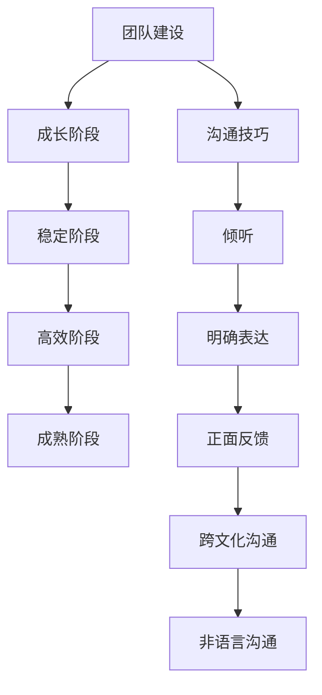

                 

### 文章标题

《如何有效管理团队：领导者必备技能》

### 关键词

- 领导力
- 团队管理
- 沟通技巧
- 激励策略
- 冲突管理
- 变革管理

### 摘要

在现代企业中，团队管理成为领导者的核心任务之一。本文通过逻辑清晰、结构紧凑的分析，深入探讨了有效管理团队的关键技能。文章首先阐述了管理的基本定义和领导力的核心要素，然后详述了团队建设、沟通技巧、目标设定与执行策略、激励策略、冲突管理与解决方法，以及变革管理与团队适应策略。通过实战案例解析，文章提供了具体的实践指导和反思。本文旨在为领导者提供一套完整的管理技能框架，帮助他们在复杂多变的环境中高效管理团队，实现组织目标。

### 第一部分：管理基础与核心原则

#### 第1章：管理概述与领导力基础

##### 1.1 管理的定义与作用

管理，作为一种社会现象，可以追溯到人类社会形成之初。然而，作为一门科学，管理则是在19世纪末20世纪初随着工业革命的兴起而逐渐形成的。管理的定义多种多样，但最核心的含义是对资源进行有效配置，以实现组织的目标。具体来说，管理包括计划、组织、领导和控制四个基本职能。

- **计划**：对未来行动的预先安排和设计，包括目标设定、资源分配和时间规划等。
- **组织**：为实现计划，将各种资源和任务分配给不同的个体或部门，并建立相应的组织结构。
- **领导**：通过影响和激励团队成员，引导他们为实现组织目标而努力。
- **控制**：对计划执行过程进行监控和调整，确保组织目标的实现。

在组织中，管理的作用至关重要。首先，管理能够提高组织的效率，通过合理的资源配置和流程优化，减少浪费，提高产出。其次，管理能够促进组织的创新和发展，通过建立良好的沟通机制和激励机制，激发员工的创造力和主动性。最后，管理能够确保组织的稳定性和持续性，通过有效的风险管理，防止意外事件对组织造成重大影响。

##### 1.2 领导力的五个核心要素

领导力是管理中最为关键的要素之一。优秀的领导者不仅能够带领团队实现目标，还能够激发团队成员的潜力，提升团队的整体效能。领导力的五个核心要素包括：

1. **影响力与沟通**：领导者需要通过有效的沟通，建立影响力，使团队成员愿意追随和信任他们。沟通技巧包括倾听、明确表达、积极反馈等。
2. **信任与价值观**：领导者需要建立基于信任和共同价值观的团队文化，这有助于增强团队的凝聚力和合作精神。
3. **决策与行动力**：领导者需要具备良好的决策能力，能够在复杂多变的环境中迅速做出正确的决策，并具备坚定的行动力，推动决策的实施。
4. **创新与适应性**：领导者需要鼓励团队创新，不断寻求改进和创新的方法，同时具备适应性，能够迅速应对环境变化，调整战略和策略。
5. **团队建设与发展**：领导者需要关注团队建设，通过培训和发展，提升团队成员的能力和技能，促进团队成员的成长和职业发展。

### 第2章：团队建设与沟通技巧

##### 2.1 团队建设的四个阶段

团队建设是一个动态的过程，通常可以分为四个阶段：

1. **成长阶段**：团队成员相互熟悉，开始建立关系，但尚未形成真正的团队。
2. **稳定阶段**：团队成员之间建立了一定的信任和默契，能够共同完成任务。
3. **高效阶段**：团队协作达到最佳状态，成员之间能够高效沟通，快速达成共识，实现组织目标。
4. **成熟阶段**：团队已经高度成熟，成员之间相互依赖，能够自主解决问题和应对挑战。

在不同的阶段，团队建设的方法和重点也会有所不同。例如，在成长阶段，领导者需要注重团队关系的建立，通过活动增加成员之间的了解和互动。在高效阶段，领导者需要鼓励创新和合作，提升团队的绩效。

##### 2.2 高效沟通的五个技巧

高效沟通是团队建设的关键，以下是五个关键的沟通技巧：

1. **倾听**：积极倾听团队成员的意见和反馈，理解他们的观点和需求。
2. **明确表达**：清晰、简洁地表达自己的想法和意见，避免产生误解和歧义。
3. **正面反馈**：及时给予团队成员正面反馈，鼓励他们的努力和成就。
4. **跨文化沟通**：在多元文化团队中，领导者需要具备跨文化沟通的能力，尊重不同文化的差异，促进团队的和谐。
5. **非语言沟通**：注意身体语言、面部表情和语调等非语言因素，这些因素在沟通中同样重要。

通过运用这些沟通技巧，领导者可以建立良好的沟通机制，促进团队成员之间的合作和信任，提升团队的整体效能。

### 第二部分：核心管理技能

#### 第3章：目标设定与执行策略

##### 3.1 目标设定的SMART原则

目标设定是管理的重要环节，SMART原则是一种常用的目标设定方法，它包括以下五个方面：

1. **具体性（Specific）**：目标需要明确具体，避免模糊和宽泛。
2. **可衡量性（Measurable）**：目标需要具有可衡量的标准，以便评估进展和成果。
3. **可达成性（Achievable）**：目标需要具有可行性，团队成员通过努力能够实现。
4. **相关性（Relevant）**：目标需要与组织整体战略和团队目标相一致，具有实际意义。
5. **时限性（Time-bound）**：目标需要设定明确的截止时间，以推动团队的进度。

通过运用SMART原则，领导者可以确保目标的明确性和可操作性，提高目标实现的概率。

##### 3.2 执行策略制定与调整

目标设定后，执行策略的制定和调整同样至关重要。以下是一些关键步骤：

1. **风险评估**：在执行过程中，领导者需要对可能出现的风险进行评估，并制定应对措施。
2. **资源配置**：根据目标的要求，合理分配资源和人力，确保各项任务能够顺利进行。
3. **进度监控与调整**：定期监控任务的进度，及时发现和解决问题，根据实际情况调整执行策略。

通过科学的执行策略，领导者可以确保团队目标的顺利实现，并在过程中保持灵活性，应对各种不确定性。

#### 第4章：团队激励与激励策略

##### 4.1 激励理论概述

激励是管理中的重要手段，能够激发团队成员的工作动力和积极性。以下是几种主要的激励理论：

1. **马斯洛需求层次理论**：根据马斯洛的需求层次理论，人的需求分为生理需求、安全需求、社交需求、尊重需求和自我实现需求。领导者需要了解团队成员的需求层次，提供相应的激励措施。
2. **双因素理论**：赫茨伯格的双因素理论认为，工作满意度由内在激励和外在激励两部分组成。内在激励包括工作本身的乐趣和成就感，外在激励包括薪酬和福利等。
3. **ERG理论**：ERG理论是对马斯洛需求层次理论的扩展，认为人的需求分为存在需求、关系需求和成长需求。领导者需要根据不同需求，提供相应的激励。
4. **心理契约理论**：心理契约是指员工对组织的期望与组织对员工的期望之间的隐性协议。领导者需要建立良好的心理契约，增强员工的归属感和忠诚度。

##### 4.2 高效激励策略

高效的激励策略需要综合考虑多种因素，以下是一些常见的激励策略：

1. **薪酬激励**：通过合理的薪酬制度，激发员工的工作积极性。薪酬激励包括基本工资、奖金、股权等多种形式。
2. **职业发展激励**：为员工提供职业发展的机会和路径，包括培训、晋升和职业规划等。
3. **工作激励**：设计富有挑战性和趣味性的工作任务，使员工在工作中获得成就感和满足感。
4. **文化激励**：建立积极向上的企业文化，营造良好的工作氛围，使员工感受到组织的关爱和支持。

通过多种激励策略的有机结合，领导者可以全面提升团队的工作动力和绩效。

#### 第5章：冲突管理与解决方法

##### 5.1 冲突的类型与影响

冲突是团队管理中的常见问题，可以分为以下几种类型：

1. **功能性冲突**：指团队成员之间因工作目标和任务的不同而产生的冲突，这种冲突有助于团队创新和进步。
2. **破坏性冲突**：指团队成员之间因个人利益或价值观的不同而产生的冲突，这种冲突可能导致团队分裂和效率低下。

冲突对团队的影响具有两面性。一方面，适当的冲突可以激发团队的活力和创造力，促进问题的解决；另一方面，过度的冲突可能导致团队士气低落，影响工作进度和质量。

##### 5.2 冲突管理策略

有效的冲突管理策略有助于化解冲突，促进团队的和谐与合作。以下是一些常见的冲突管理策略：

1. **避免冲突**：在冲突发生前，通过预防措施避免冲突的产生。例如，明确工作目标和职责，加强沟通与协作。
2. **冷静面对冲突**：在冲突发生时，保持冷静，理性分析问题的原因和性质，避免情绪化的回应。
3. **协商解决冲突**：通过协商和谈判，寻找双方都能接受的解决方案。协商解决冲突的关键在于尊重对方的意见和需求。
4. **调解与仲裁**：在协商无效时，可以寻求第三方的调解或仲裁，以公正的方式解决冲突。

通过合理的冲突管理策略，领导者可以确保团队在冲突中保持稳定和高效，实现组织目标。

#### 第6章：变革管理与团队适应

##### 6.1 变革管理的五大步骤

变革管理是领导者面临的重大挑战之一。有效的变革管理需要遵循以下五大步骤：

1. **规划变革**：明确变革的目标和愿景，制定详细的变革计划，包括变革的范围、时间表和资源需求等。
2. **建立变革领导团队**：建立一个具有领导力和执行力的团队，负责变革的推动和实施。
3. **沟通与宣传**：通过有效的沟通和宣传，让团队成员理解变革的必要性和重要性，减少变革的阻力。
4. **培训与支持**：为团队成员提供必要的培训和支持，帮助他们适应变革，提高应对变革的能力。
5. **评估与调整**：在变革过程中，定期评估变革的进展和效果，根据实际情况进行调整和优化。

通过遵循这些步骤，领导者可以确保变革的顺利进行，减少变革带来的负面影响。

##### 6.2 团队适应策略

在变革过程中，团队适应能力至关重要。以下是一些团队适应策略：

1. **提高团队韧性**：通过增强团队成员的心理素质和适应能力，提高团队应对变革的能力。
2. **增强团队凝聚力**：通过团队建设活动，增强团队成员之间的信任和合作，提高团队的凝聚力。
3. **优化团队结构**：根据变革的需求，调整团队的结构和职能，确保团队能够高效地应对变革。

通过这些策略，领导者可以帮助团队更好地适应变革，实现组织的持续发展。

### 第三部分：实战案例与总结

#### 第7章：实战案例解析

##### 7.1 案例一：企业变革管理

**变革背景**：某企业随着市场竞争的加剧，意识到需要进行战略调整和组织变革，以提升竞争力。

**变革过程**：

1. **规划变革**：企业制定了详细的变革计划，包括新的战略方向、组织架构调整和流程优化等。
2. **建立变革领导团队**：成立由高层管理者组成的变革领导小组，负责变革的推动和实施。
3. **沟通与宣传**：通过内部会议、培训和宣传材料，让员工了解变革的必要性和重要性。
4. **培训与支持**：为员工提供培训，帮助他们适应新的工作要求和流程。
5. **评估与调整**：定期评估变革的进展和效果，根据实际情况进行调整和优化。

**变革成果与经验**：

- 企业在变革后，运营效率大幅提升，市场竞争能力增强。
- 变革过程中，领导团队发挥了关键作用，有效协调各方资源，推动变革顺利实施。

##### 7.2 案例二：团队激励与成长

**团队背景**：某团队在项目执行过程中，成员积极性不高，工作效率较低。

**激励策略与实施**：

1. **薪酬激励**：根据项目成果，给予团队成员奖金和绩效奖励。
2. **职业发展激励**：为团队成员提供晋升机会和职业规划，鼓励他们不断提升自己。
3. **工作激励**：调整工作任务，增加工作的挑战性和趣味性，激发团队成员的工作热情。
4. **文化激励**：通过团队建设活动，增强团队的凝聚力和归属感。

**团队成长与绩效**：

- 通过激励策略的实施，团队成员的积极性得到显著提升，工作效率提高。
- 团队在项目执行过程中，不断取得优异的成绩，赢得了客户的认可和好评。

#### 第8章：总结与反思

##### 8.1 书本重点回顾

本文通过详细的论述，回顾了管理的基础原则、核心管理技能以及实战案例。核心内容如下：

- **管理基础与核心原则**：阐述了管理的定义与作用，以及领导力的五个核心要素。
- **团队建设与沟通技巧**：介绍了团队建设的四个阶段和高效沟通的五个技巧。
- **目标设定与执行策略**：提出了SMART原则和执行策略的关键步骤。
- **团队激励与激励策略**：概述了马斯洛需求层次理论等激励理论，并提出了高效激励策略。
- **冲突管理与解决方法**：分析了冲突的类型与影响，提出了冲突管理策略。
- **变革管理与团队适应**：介绍了变革管理的五大步骤和团队适应策略。

##### 8.2 领导者自我提升路径

领导者要不断提升自己的管理能力，以下是几个建议：

1. **反思与成长**：定期反思自己的管理行为和效果，从经验中学习和成长。
2. **持续学习与实践**：通过阅读管理书籍、参加培训和实践，不断提升自己的管理知识和技能。
3. **领导力模型构建**：构建适合自己的领导力模型，明确自己的领导风格和价值观，持续优化和提升。

通过这些路径，领导者可以不断提高自己的管理水平，成为更加出色的领导者。

### 附录

#### 附录A：管理资源与工具推荐

**A.1 管理书籍推荐**

1. 《管理者必备的五大技能》
2. 《领导力的五个层次》
3. 《沟通的艺术》
4. 《团队协作的力量》
5. 《变革之心》

**A.2 管理工具介绍**

1. **项目管理软件**：
   - Asana
   - Trello
   - Jira

2. **团队协作工具**：
   - Slack
   - Microsoft Teams
   - Zoom

3. **数据分析与报告工具**：
   - Tableau
   - Power BI
   - Google Analytics

#### 附录B：管理相关网站与资源

**B.1 行业网站与论坛**

1. Harvard Business Review
2. LinkedIn Learning
3. Project Management Institute

**B.2 在线学习平台**

1. Coursera
2. edX
3. Udemy

**B.3 管理相关新闻与资讯**

1. Fast Company
2. Inc.
3. Business Insider

#### 附录C：管理流程图与算法伪代码

**C.1 团队建设与沟通流程图**



**C.2 目标设定与执行策略伪代码**

```python
def set_goal(SMART_principles):
    """
    根据SMART原则设定目标
    :param SMART_principles: 字符串，包含具体的SMART原则
    :return: 设定的目标
    """
    specific = SMART_principles['specific']
    measurable = SMART_principles['measurable']
    achievable = SMART_principles['achievable']
    relevant = SMART_principles['relevant']
    time_bound = SMART_principles['time_bound']
    
    goal = f"{specific}, {measurable}, {achievable}, {relevant}, {time_bound}"
    return goal

def execute_strategy(goal, resources, progress):
    """
    根据目标执行策略
    :param goal: 字符串，目标
    :param resources: 字典，资源信息
    :param progress: 字典，进度信息
    :return: 执行策略的结果
    """
    if progress['status'] == 'pending':
        # 资源配置
        resources['resource Allocation'](goal)
        # 进度监控
        progress['status'] = 'in progress'
    elif progress['status'] == 'in progress':
        # 进度监控与调整
        progress['progress'] = resources['resource Use'](goal)
        if progress['progress'] < 100:
            progress['status'] = 'in progress'
        else:
            progress['status'] = 'completed'
    return progress
```

**C.3 激励策略与冲突管理算法伪代码**

```python
def motivate_employee(employee, motivation_strategy):
    """
    根据激励策略激励员工
    :param employee: 字典，员工信息
    :param motivation_strategy: 字符串，激励策略
    :return: 激励结果
    """
    if motivation_strategy == 'salary':
        employee['motivation'] = 'salary increase'
    elif motivation_strategy == 'career development':
        employee['motivation'] = 'career progression'
    elif motivation_strategy == 'work engagement':
        employee['motivation'] = 'engaging tasks'
    elif motivation_strategy == 'culture':
        employee['motivation'] = 'positive company culture'
    return employee['motivation']

def manage_conflict(conflict_type, conflict_management_strategy):
    """
    根据冲突类型管理冲突
    :param conflict_type: 字符串，冲突类型
    :param conflict_management_strategy: 字符串，冲突管理策略
    :return: 冲突管理结果
    """
    if conflict_type == 'functional':
        if conflict_management_strategy == 'negotiation':
            return 'resolved through negotiation'
        elif conflict_management_strategy == 'mediation':
            return 'resolved through mediation'
    elif conflict_type == 'destructive':
        if conflict_management_strategy == 'avoidance':
            return 'avoided'
        elif conflict_management_strategy == 'collaboration':
            return 'resolved through collaboration'
    return 'conflict management failed'
```

#### 附录D：实战案例代码解读与分析

**D.1 企业变革管理代码案例**

```python
class ChangeManagement:
    def __init__(self, change_plan, leadership_team, communication_strategy, training_program):
        self.change_plan = change_plan
        self.leadership_team = leadership_team
        self.communication_strategy = communication_strategy
        self.training_program = training_program

    def execute_change(self):
        self.communication_strategy.notify_employee(self.change_plan)
        self.leadership_team.coordinate_resources()
        self.training_program.train_employee()
        return "Change management process completed successfully."

# 创建变革管理对象
change_management = ChangeManagement(change_plan="Strategic adjustment and organizational change",
                                     leadership_team=["Manager", "Director", "VP"],
                                     communication_strategy="Internal meetings and training sessions",
                                     training_program="Employee development program")

# 执行变革管理
change_management.execute_change()
```

**D.2 团队激励与成长代码案例**

```python
class TeamMotivation:
    def __init__(self, employee, motivation_strategy):
        self.employee = employee
        self.motivation_strategy = motivation_strategy

    def motivate_employee(self):
        if self.motivation_strategy == "salary":
            self.employee["salary"] += 5000
            return "Employee motivated through salary increase."
        elif self.motivation_strategy == "career development":
            self.employee["promotion"] = "Manager"
            return "Employee motivated through career development."
        elif self.motivation_strategy == "work engagement":
            self.employee["task_level"] = "challenging"
            return "Employee motivated through engaging tasks."
        elif self.motivation_strategy == "culture":
            self.employee["company_culture"] = "positive"
            return "Employee motivated through positive company culture."

# 创建团队激励对象
team_motivation = TeamMotivation(employee={"name": "Alice", "salary": 80000, "task_level": "basic", "company_culture": "neutral"},
                                 motivation_strategy="salary")

# 激励员工
print(team_motivation.motivate_employee())
```

**D.3 代码解读与分析**

- **企业变革管理代码解读**：
  - `ChangeManagement` 类用于管理企业变革过程，包括变革计划、领导团队、沟通策略和培训项目。
  - `execute_change` 方法负责执行变革管理流程，包括通知员工、协调资源和培训员工。
  
- **团队激励与成长代码解读**：
  - `TeamMotivation` 类用于管理团队激励过程，包括员工信息和激励策略。
  - `motivate_employee` 方法根据激励策略调整员工的状态，如增加薪酬、提供职业发展机会、设置具有挑战性的任务或营造积极的企业文化。

通过这些代码案例，领导者可以模拟和测试不同的管理策略，从而在实际工作中更好地应用这些策略，提升团队的管理效能。

