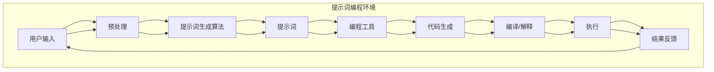

                 

# 《如何构建高效的提示词编程环境》

> 关键词：提示词编程、高效编程环境、开发效率、算法、编程语言、IDE

摘要：本文将详细探讨如何构建一个高效的提示词编程环境，以提高开发效率和编程质量。我们将从背景介绍、核心概念与联系、开发环境搭建、提示词生成算法、编程语言与工具选择、案例分析与优化以及未来趋势与展望等多个方面进行阐述。通过本文的阅读，您将了解到如何充分利用现代技术和工具，构建一个既实用又高效的编程环境，从而提升您的编程能力和项目开发效率。

## 《如何构建高效的提示词编程环境》目录大纲

## 第一部分：背景与核心概念

### 第1章：高效编程环境的定义与重要性

- **1.1 编程环境的基本概念与分类**
- **1.2 高效编程环境的重要性**
- **1.3 编程环境与开发效率的关系**

### 第2章：提示词编程环境概述

- **2.1 提示词编程环境的定义与原理**
- **2.2 提示词编程环境的优点与局限性**
- **2.3 提示词编程环境的应用场景**

### 第3章：核心概念与联系

- **3.1 编程范式与提示词编程**
- **3.2 提示词生成算法**
- **3.3 编程语言特性与提示词编程的适配性**
- **3.4 图解：提示词编程环境的架构**

## 第二部分：构建高效提示词编程环境

### 第4章：开发环境搭建

- **4.1 硬件选择与配置**
- **4.2 操作系统与集成开发环境（IDE）选择**
- **4.3 软件安装与配置**
- **4.4 开发环境优化技巧**

### 第5章：提示词生成算法

- **5.1 提示词生成算法概述**
- **5.2 基于自然语言处理的提示词生成**
- **5.3 基于机器学习的提示词生成**
- **5.4 提示词生成的数学模型与算法伪代码**

### 第6章：编程语言与工具

- **6.1 编程语言的选择**
- **6.2 提示词编程工具介绍**
- **6.3 提示词编程框架与库**
- **6.4 提示词编程工具的使用方法与技巧**

### 第7章：案例分析与优化

- **7.1 高效编程环境的实际案例**
- **7.2 提示词编程环境优化策略**
- **7.3 案例分析：构建个人高效的提示词编程环境**
- **7.4 性能评估与改进**

### 第8章：未来趋势与展望

- **8.1 提示词编程环境的未来发展趋势**
- **8.2 新技术在提示词编程环境中的应用**
- **8.3 提示词编程环境的发展挑战与机遇**
- **8.4 编程教育中的提示词编程环境**

## 第三部分：附录

### 附录A：提示词编程环境开发工具与资源

- **A.1 主流编程语言与工具对比**
- **A.2 提示词生成算法开源项目介绍**
- **A.3 提示词编程环境常用库与框架汇总**
- **A.4 提示词编程相关论文与书籍推荐**

## 第一部分：背景与核心概念

### 第1章：高效编程环境的定义与重要性

#### 1.1 编程环境的基本概念与分类

编程环境是指程序员在开发过程中所使用的一系列软件和硬件工具的集合。这些工具包括但不限于代码编辑器、调试器、版本控制系统、集成开发环境（IDE）、数据库管理系统等。根据不同的需求和应用场景，编程环境可以被分为多种类型：

- **单机编程环境**：指完全在本地计算机上运行的编程环境，适用于开发小型项目和独立软件。
- **分布式编程环境**：通过网络连接多台计算机协同工作，适用于大规模分布式系统和云计算应用。
- **云编程环境**：通过云计算平台提供编程资源，如虚拟机、容器、数据库等，适用于高可用性、可扩展性的应用开发。
- **移动编程环境**：为移动设备（如智能手机、平板电脑）开发的编程环境，适用于移动应用开发。

每种编程环境都有其特定的优势和适用场景，根据项目需求选择合适的编程环境至关重要。

#### 1.2 高效编程环境的重要性

高效编程环境对开发效率有着直接影响。以下是高效编程环境对开发效率的几个关键点：

1. **时间节省**：通过自动化工具、集成环境等，可以减少手动操作的时间，提高代码编写和调试的效率。
2. **错误减少**：提供代码静态检查、动态调试等工具，可以及时发现和修复代码中的错误，减少调试时间和错误率。
3. **协作顺畅**：良好的编程环境支持多人协作，方便代码的版本控制、协同开发和问题跟踪，提高团队工作效率。
4. **资源利用**：高效的编程环境能够充分利用计算机资源，如CPU、内存、网络等，优化开发过程。

#### 1.3 编程环境与开发效率的关系

编程环境与开发效率之间的关系可以概括为以下几个方面：

1. **工具与效率**：编程环境的工具集决定了开发者的工作效率。良好的工具集能够提供快速的开发体验，减少繁琐的操作，从而提高开发效率。
2. **开发流程**：编程环境的设计和配置直接影响开发流程的顺畅性。一个高效的编程环境应该能够支持快速迭代、测试和部署，缩短项目周期。
3. **团队协作**：编程环境对于团队协作的支持程度决定了团队的开发效率。良好的编程环境应该能够提供高效的代码共享、协同开发和问题跟踪机制。

总之，构建一个高效的编程环境是提高开发效率和项目成功的关键。在接下来的章节中，我们将进一步探讨提示词编程环境的相关概念和构建方法。

### 第2章：提示词编程环境概述

#### 2.1 提示词编程环境的定义与原理

提示词编程环境是一种通过提示词（Prompt）来引导和优化编程过程的开发环境。提示词是一种简短的、具有明确指导性的文本，它可以提供编程任务的目标、输入数据、输出结果等关键信息。通过提示词，程序员可以更准确地理解任务要求，从而提高代码编写和调试的效率。

提示词编程环境的原理可以概括为以下几点：

1. **任务引导**：提示词作为任务的引导，帮助程序员快速定位任务目标，避免偏离任务方向。
2. **输入数据提供**：通过提示词，程序员可以获得输入数据的格式、类型和范围等关键信息，减少对数据预处理的时间。
3. **输出结果预期**：提示词提供了对输出结果的预期描述，帮助程序员在编写代码过程中进行验证和调试。
4. **算法思维训练**：通过大量的提示词训练，程序员可以逐步培养出高效的算法思维模式，提高编程能力。

#### 2.2 提示词编程环境的优点与局限性

提示词编程环境具有以下优点：

1. **高效性**：提示词可以显著减少程序员对任务理解的时间和精力，提高编程效率。
2. **准确性**：通过明确的提示词，程序员可以更准确地实现任务要求，减少错误和返工。
3. **可扩展性**：提示词编程环境可以方便地集成到现有的开发工具中，支持多种编程语言和框架。
4. **辅助教学**：提示词编程环境适用于编程教育和培训，有助于初学者快速掌握编程技能。

然而，提示词编程环境也存在一些局限性：

1. **依赖性**：程序员对提示词的依赖可能导致其编程能力的下降，依赖提示词而非深入理解编程原理。
2. **内容管理**：大量的提示词需要精细管理和维护，否则可能导致信息冗余和混乱。
3. **个性化不足**：提示词通常是一般的指导性文本，难以满足个性化编程需求，例如特定领域的专业术语和算法。

#### 2.3 提示词编程环境的应用场景

提示词编程环境适用于多种应用场景，包括但不限于以下几种：

1. **日常编程任务**：在处理日常编程任务时，提示词可以快速提供任务目标和输入输出信息，帮助程序员高效完成工作。
2. **项目协作**：在团队协作开发中，提示词可以用于任务分配、进度跟踪和代码评审，提高团队沟通效率。
3. **编程教育**：在编程教学过程中，提示词可以作为学习指南，引导学生逐步理解和掌握编程概念和算法。
4. **自动化测试**：在自动化测试中，提示词可以提供测试用例和预期结果，帮助开发人员快速定位和修复代码缺陷。

总的来说，提示词编程环境通过提供明确的任务引导和输入输出信息，显著提高了编程效率和代码质量。然而，为了充分发挥其优势，需要合理使用和管理提示词，并在实践中逐步培养出高效的编程能力。

### 第3章：核心概念与联系

#### 3.1 编程范式与提示词编程

编程范式是指编程语言和方法论的不同风格和方式，常见的编程范式包括过程式编程、面向对象编程、函数式编程和逻辑编程等。每种编程范式都有其独特的特点和应用场景。提示词编程作为一种新兴的编程范式，与传统的编程范式有着不同的工作原理。

1. **过程式编程**：过程式编程强调程序执行的顺序和过程。提示词编程通过提示词来引导程序的执行流程，而不是依赖固定的执行顺序，从而提高了程序的灵活性和可读性。

2. **面向对象编程**：面向对象编程以对象为核心，通过封装、继承和多态实现代码的重用和扩展。提示词编程同样可以应用于面向对象编程，通过提示词来描述对象的行为和交互，使代码更加直观和易于维护。

3. **函数式编程**：函数式编程通过函数和纯函数来实现逻辑运算，避免了状态的变化和副作用。提示词编程可以利用函数式编程的这些特点，通过提示词来定义函数的行为和输入输出。

4. **逻辑编程**：逻辑编程以逻辑表达式为基础，通过推理来解决问题。提示词编程通过提示词来定义问题的逻辑约束和条件，从而实现逻辑编程的目标。

总之，提示词编程可以与各种编程范式结合，发挥其独特的优势，提高编程效率和质量。

#### 3.2 提示词生成算法

提示词生成算法是指用于自动生成提示词的算法，其核心目标是根据任务需求、输入数据和输出结果等信息，生成具有明确指导性和可执行性的文本。提示词生成算法可以分为基于自然语言处理（NLP）的算法和基于机器学习的算法。

1. **基于NLP的提示词生成算法**：基于NLP的提示词生成算法利用自然语言处理技术，对输入文本进行语义分析和句法分析，从而生成提示词。例如，可以使用词向量模型（如Word2Vec、GloVe）来表示文本，利用序列模型（如LSTM、GRU）来预测下一个提示词。

2. **基于机器学习的提示词生成算法**：基于机器学习的提示词生成算法通过训练大量已标注的提示词数据集，利用机器学习模型（如神经网络、深度学习模型）来生成新的提示词。常见的机器学习模型包括循环神经网络（RNN）、长短期记忆网络（LSTM）和变换器（Transformer）等。

提示词生成算法的流程通常包括以下几个步骤：

- **数据预处理**：对输入文本进行清洗、分词、去停用词等处理，提取关键信息。
- **特征提取**：将预处理后的文本转化为数值特征，如词向量、词频等。
- **模型训练**：使用训练数据集训练机器学习模型，如LSTM、GRU或Transformer等。
- **提示词生成**：利用训练好的模型对新的输入文本进行提示词生成，输出具有指导性的文本。

以下是一个基于LSTM的提示词生成算法的伪代码示例：

```python
import numpy as np
from tensorflow.keras.models import Sequential
from tensorflow.keras.layers import LSTM, Dense

# 数据预处理
def preprocess_text(text):
    # 清洗、分词、去停用词等处理
    # 返回处理后的文本

# 构建LSTM模型
model = Sequential()
model.add(LSTM(units=128, activation='relu', return_sequences=True, input_shape=(max_sequence_length, input_dim)))
model.add(LSTM(units=64, activation='relu'))
model.add(Dense(units=output_dim, activation='softmax'))

# 训练模型
model.compile(optimizer='adam', loss='categorical_crossentropy', metrics=['accuracy'])
model.fit(X_train, y_train, epochs=10, batch_size=32)

# 提示词生成
def generate_prompt(text):
    processed_text = preprocess_text(text)
    prompt = model.predict(processed_text)
    return prompt

# 输入文本
input_text = "编写一个函数，实现两个整数的和"

# 生成提示词
prompt = generate_prompt(input_text)
print(prompt)
```

通过上述算法，我们可以根据输入的文本生成具有明确指导性的提示词，帮助程序员快速理解和完成编程任务。

#### 3.3 编程语言特性与提示词编程的适配性

编程语言的特性直接影响到提示词编程的适用性和效率。不同编程语言在语法、类型系统、内存管理、并发模型等方面各有特色，这些特性对于提示词编程的适配性有着重要影响。

1. **语法简洁性**：语法简洁的编程语言如Python和JavaScript，能够使提示词更加直观和易于理解，降低学习成本和编码难度。

2. **类型系统**：强类型语言如Java和C++，可以提供更严格的类型检查和编译时错误检测，提高代码质量和可靠性。而弱类型语言如Python和JavaScript，在提示词生成和解析过程中可能需要更多的动态类型处理。

3. **内存管理**：自动内存管理语言如Python和Java，可以减少程序员在内存管理上的工作量，专注于任务逻辑的实现。手动内存管理语言如C和C++，则需要更多的提示词来指导内存的分配和释放。

4. **并发模型**：支持并发编程的语言如Java和Go，可以充分利用多核处理器的优势，提高程序的性能。提示词编程需要考虑并发模型的特性和约束，以生成高效的并发代码。

5. **库和框架支持**：丰富的库和框架支持可以帮助提示词编程实现更复杂的功能和任务。例如，Python的NumPy和Pandas库提供了强大的数据处理功能，JavaScript的React和Vue.js框架提供了高效的UI渲染和状态管理。

#### 3.4 图解：提示词编程环境的架构

为了更直观地理解提示词编程环境的架构，我们可以通过Mermaid流程图来展示其核心组成部分和相互关系。



图中的各个组件之间的关系如下：

- **用户输入**：用户通过编程工具输入任务描述和输入数据。
- **预处理**：对用户输入的文本进行清洗、分词、去停用词等处理，提取关键信息。
- **提示词生成算法**：利用自然语言处理和机器学习技术，生成具有明确指导性的提示词。
- **提示词**：提供给编程工具，用于引导和优化代码编写和调试过程。
- **编程工具**：包括代码编辑器、调试器、版本控制系统等，用于生成和修改代码。
- **代码生成**：根据提示词，编程工具自动生成代码框架和关键逻辑。
- **编译/解释**：将生成的代码进行编译或解释，生成可执行的程序。
- **执行**：执行编译或解释后的代码，生成输出结果。
- **结果反馈**：将输出结果反馈给用户，用于任务验证和进一步优化。

通过上述架构，我们可以看到提示词编程环境通过多个组件的协同工作，实现了高效的编程过程和代码生成。

### 第二部分：构建高效提示词编程环境

#### 第4章：开发环境搭建

构建高效的提示词编程环境需要从硬件选择、操作系统与集成开发环境（IDE）选择、软件安装与配置以及开发环境优化技巧等多个方面进行考虑。以下是一些详细的步骤和建议：

#### 4.1 硬件选择与配置

硬件选择对于构建高效的编程环境至关重要。以下是建议的硬件配置：

1. **处理器**：推荐选择高主频的多核处理器，如Intel i7或AMD Ryzen 7系列，以确保代码的快速编译和执行。
2. **内存**：至少需要16GB RAM，建议使用32GB或更多，以支持大型项目和复杂算法的运行。
3. **存储**：建议使用NVMe SSD或PCIE SSD，以提供快速的数据读写速度，减少编译和调试的时间。
4. **显卡**：如果进行图形处理或深度学习项目，推荐使用NVIDIA GeForce RTX系列显卡，以提供强大的图形处理能力。

#### 4.2 操作系统与集成开发环境（IDE）选择

操作系统的选择主要取决于个人偏好和项目需求。以下是一些推荐的操作系统和IDE：

1. **操作系统**：
   - **Windows**：适用于大多数软件开发者，具有良好的兼容性和广泛的软件支持。
   - **macOS**：对于Apple生态系统中的开发者有较好的整合性，同时也能运行大部分开发工具。
   - **Linux**：对于开源项目和Linux系统编程，Linux是一个非常好的选择，具有高度的定制性和性能优势。

2. **集成开发环境（IDE）**：
   - **Visual Studio Code**：一个轻量级但功能强大的代码编辑器，支持多种编程语言，具有丰富的扩展库。
   - **IntelliJ IDEA**：一个功能丰富的IDE，特别适合Java和Python编程，提供了强大的代码补全和调试功能。
   - **PyCharm**：专为Python编程设计的IDE，提供了良好的代码分析、调试和测试工具。
   - **Eclipse**：一个开源的IDE，适用于Java、C++等多种编程语言，具有良好的扩展性和社区支持。

#### 4.3 软件安装与配置

在选择了合适的硬件和IDE后，需要安装和配置必要的开发工具和库。以下是一些关键步骤：

1. **安装IDE**：根据操作系统和IDE的安装指南，安装所选的IDE。
2. **安装依赖库**：对于Python项目，可以使用pip安装必要的库，例如NumPy、Pandas、Matplotlib等。对于其他编程语言，根据项目需求安装相应的依赖库。
3. **配置IDE**：在IDE中进行以下配置：
   - **代码补全和语法高亮**：安装支持所选编程语言的扩展或插件。
   - **调试器**：配置调试器以支持断点调试、监视变量等功能。
   - **版本控制**：集成Git或其他版本控制系统，以支持代码的版本管理和协同开发。
   - **性能分析**：安装性能分析工具，如VisualVM或GProfiler，以进行代码性能优化。

#### 4.4 开发环境优化技巧

为了进一步提高开发效率和代码质量，可以采取以下优化技巧：

1. **代码格式化**：使用代码格式化工具（如PEP8、Black或Google Python Style Guide）自动格式化代码，确保代码的一致性和可读性。
2. **自动化测试**：编写和运行自动化测试，以验证代码的功能和性能，减少手动测试的工作量。
3. **持续集成/持续部署（CI/CD）**：配置CI/CD工具（如Jenkins、Travis CI或GitHub Actions），实现代码的自动化构建、测试和部署，提高开发流程的效率。
4. **代码审查**：进行代码审查，确保代码的质量和安全性，减少潜在的漏洞和错误。
5. **性能优化**：使用性能分析工具识别和优化代码中的性能瓶颈，提高程序的运行效率。

通过上述步骤和建议，可以构建一个高效、稳定的提示词编程环境，从而提高开发效率和代码质量。

### 第5章：提示词生成算法

提示词生成算法是构建高效提示词编程环境的核心组成部分。本章节将详细介绍提示词生成算法的基本概念、主要类型及其实现方法，并分析其在编程环境中的应用。

#### 5.1 提示词生成算法概述

提示词生成算法是指利用自然语言处理（NLP）和机器学习技术，根据输入文本自动生成具有明确指导性和可执行性的文本提示。其目的是帮助程序员快速理解和完成任务，提高开发效率。提示词生成算法通常包括以下步骤：

1. **数据预处理**：对输入文本进行清洗、分词、去停用词等处理，提取关键信息。
2. **特征提取**：将预处理后的文本转化为数值特征，如词向量、词频等。
3. **模型训练**：使用训练数据集训练机器学习模型，如循环神经网络（RNN）、长短期记忆网络（LSTM）或变换器（Transformer）等。
4. **提示词生成**：利用训练好的模型对新的输入文本进行提示词生成，输出具有指导性的文本。

#### 5.2 基于自然语言处理的提示词生成

基于自然语言处理的提示词生成算法利用NLP技术对输入文本进行分析和处理，生成具有明确指导性的提示词。以下是一些常见的基于NLP的提示词生成方法：

1. **词袋模型（Bag of Words, BoW）**：词袋模型将文本表示为一个向量，其中每个维度代表一个词汇。通过统计词汇的频率，可以生成提示词。

2. **TF-IDF模型（Term Frequency-Inverse Document Frequency）**：TF-IDF模型在词袋模型的基础上，考虑了词汇在文档中的重要程度。通过计算词汇的TF-IDF值，可以生成更具代表性的提示词。

3. **主题模型（Latent Dirichlet Allocation, LDA）**：主题模型通过概率模型识别文本中的潜在主题，从而生成与主题相关的提示词。

4. **序列模型（Sequential Model）**：序列模型，如循环神经网络（RNN）和长短期记忆网络（LSTM），可以处理文本的序列信息，生成与上下文相关的提示词。

以下是一个基于LSTM的提示词生成算法的伪代码示例：

```python
import tensorflow as tf
from tensorflow.keras.models import Sequential
from tensorflow.keras.layers import LSTM, Dense

# 数据预处理
def preprocess_text(text):
    # 清洗、分词、去停用词等处理
    # 返回处理后的文本

# 构建LSTM模型
model = Sequential()
model.add(LSTM(units=128, activation='relu', return_sequences=True, input_shape=(max_sequence_length, input_dim)))
model.add(LSTM(units=64, activation='relu'))
model.add(Dense(units=output_dim, activation='softmax'))

# 训练模型
model.compile(optimizer='adam', loss='categorical_crossentropy', metrics=['accuracy'])
model.fit(X_train, y_train, epochs=10, batch_size=32)

# 提示词生成
def generate_prompt(text):
    processed_text = preprocess_text(text)
    prompt = model.predict(processed_text)
    return prompt

# 输入文本
input_text = "编写一个函数，实现两个整数的和"

# 生成提示词
prompt = generate_prompt(input_text)
print(prompt)
```

通过上述算法，可以根据输入的文本生成具有明确指导性的提示词，帮助程序员快速理解和完成任务。

#### 5.3 基于机器学习的提示词生成

基于机器学习的提示词生成算法利用大量的训练数据集，通过机器学习模型生成提示词。以下是一些常见的基于机器学习的提示词生成方法：

1. **循环神经网络（Recurrent Neural Network, RNN）**：RNN是一种可以处理序列数据的神经网络，通过记忆历史信息来生成提示词。

2. **长短期记忆网络（Long Short-Term Memory, LSTM）**：LSTM是一种改进的RNN，通过门控机制来避免梯度消失问题，能够更好地处理长序列信息。

3. **变换器（Transformer）**：变换器是一种基于注意力机制的神经网络架构，通过多头注意力机制来生成提示词。

4. **生成对抗网络（Generative Adversarial Network, GAN）**：GAN由生成器和判别器组成，生成器生成提示词，判别器判断提示词的真实性，通过对抗训练生成高质量提示词。

以下是一个基于变换器的提示词生成算法的伪代码示例：

```python
import tensorflow as tf
from tensorflow.keras.models import Model
from tensorflow.keras.layers import Embedding, LSTM, Dense, Input

# 定义变换器模型
input_seq = Input(shape=(max_sequence_length,))
embedding = Embedding(input_dim=vocabulary_size, output_dim=embedding_size)(input_seq)
lstm = LSTM(units=128, return_sequences=True)(embedding)
output = Dense(units=output_dim, activation='softmax')(lstm)

# 构建模型
model = Model(inputs=input_seq, outputs=output)

# 编译模型
model.compile(optimizer='adam', loss='categorical_crossentropy', metrics=['accuracy'])

# 训练模型
model.fit(X_train, y_train, epochs=10, batch_size=32)

# 提示词生成
def generate_prompt(text):
    processed_text = preprocess_text(text)
    prompt = model.predict(processed_text)
    return prompt

# 输入文本
input_text = "编写一个函数，实现两个整数的和"

# 生成提示词
prompt = generate_prompt(input_text)
print(prompt)
```

通过上述算法，可以根据输入的文本生成具有明确指导性的提示词，帮助程序员快速理解和完成任务。

#### 5.4 提示词生成的数学模型与算法伪代码

提示词生成涉及多个数学模型和算法，以下将简要介绍一些核心模型及其伪代码：

1. **循环神经网络（RNN）**

```python
# 假设输入序列为X，隐藏状态为h，输出为y
for t in range(T):
    h_t = LSTM_cell(h_{t-1}, x_t)
    y_t = Dense_output(h_t)

# 返回最终输出序列
return y
```

2. **长短期记忆网络（LSTM）**

```python
# 假设输入序列为X，隐藏状态为h，输出为y，遗忘门、输入门、输出门分别为f,g,o
for t in range(T):
    i_t = sigmoid(W_i * [h_{t-1}, x_t])
    f_t = sigmoid(W_f * [h_{t-1}, x_t])
    o_t = sigmoid(W_o * [h_{t-1}, x_t])
    g_t = tanh(W_g * [h_{t-1}, x_t])
    h_{t-1} = f_t * h_{t-1} + i_t * g_t
    c_t = o_t * tanh(h_{t-1})
    y_t = Dense_output(h_{t-1})

# 返回最终输出序列
return y
```

3. **变换器（Transformer）**

```python
# 假设输入序列为X，嵌入矩阵为E，自注意力权重矩阵为W_Q, W_K, W_V
for t in range(T):
    Q_t = E * [x_t]
    K_t = E * [x_t]
    V_t = E * [x_t]
    attn_scores = softmax(W_K * K_t * Q_t)
    context_vector = sum(attn_scores * V_t)

# 返回最终输出序列
return context_vector
```

通过上述数学模型和算法，可以生成高质量的提示词，为程序员提供明确的编程指导。

### 第6章：编程语言与工具

在构建高效的提示词编程环境中，选择合适的编程语言和工具至关重要。这一章节将介绍编程语言的选择、提示词编程工具的介绍、提示词编程框架与库的利用，以及这些工具的使用方法与技巧。

#### 6.1 编程语言的选择

编程语言的选择取决于多个因素，包括项目需求、开发团队的技术栈、个人偏好等。以下是一些常用的编程语言及其在提示词编程中的应用：

1. **Python**：Python是一种易于学习和使用的编程语言，广泛应用于科学计算、数据分析、机器学习和自然语言处理等领域。Python的简洁语法和丰富的库支持使其成为提示词编程的理想选择。

2. **JavaScript**：JavaScript是Web开发的主要语言之一，具有跨平台的特性。在提示词编程环境中，可以使用Node.js运行JavaScript代码，实现后端逻辑和自动化任务。

3. **Java**：Java是一种强大的编程语言，适用于企业级应用开发。Java在大型项目中具有良好的性能和稳定性，对于需要高性能和复杂逻辑的提示词编程环境，Java是一个不错的选择。

4. **C++**：C++是一种高性能的编程语言，适用于系统编程和游戏开发。C++的底层操作和优化能力使其在需要高效性能的提示词编程环境中具有优势。

5. **Go**：Go（又称Golang）是一种现代化的编程语言，以其简洁性和高性能而著称。Go的并发模型和快速编译特性使其在构建分布式系统和自动化环境中表现出色。

在选择编程语言时，应考虑以下因素：

- **开发效率**：选择易于学习和使用的语言，可以减少开发周期和调试时间。
- **生态支持**：选择有丰富库和框架支持的语言，可以提高开发效率和质量。
- **性能要求**：根据项目需求选择合适性能的语言，以确保程序的运行效率。
- **团队技能**：选择团队熟悉的编程语言，可以减少沟通成本和团队协作难度。

#### 6.2 提示词编程工具介绍

提示词编程工具是构建高效提示词编程环境的关键组件。以下是一些常用的提示词编程工具及其特点：

1. **Visual Studio Code**：Visual Studio Code是一个免费、开源的代码编辑器，支持多种编程语言和平台。它具有丰富的插件生态系统，可以扩展其功能，如代码补全、调试、性能分析等。

2. **IntelliJ IDEA**：IntelliJ IDEA是一个强大的集成开发环境，特别适合Java和Python编程。它提供了智能代码补全、静态代码分析、调试和测试等工具，有助于提高开发效率。

3. **PyCharm**：PyCharm是JetBrains公司开发的一个Python IDE，提供了丰富的Python库支持、代码补全、调试和测试工具。它还支持其他编程语言，如JavaScript、Go和Ruby等。

4. **Jupyter Notebook**：Jupyter Notebook是一个交互式的开发环境，适用于数据科学和机器学习项目。它支持多种编程语言，如Python、R和Julia，可以通过Markdown格式编写文档和展示结果。

5. **Sublime Text**：Sublime Text是一个轻量级的代码编辑器，支持多种编程语言。它具有灵活的配置和插件系统，可以自定义键绑定和界面布局，适用于个人开发者的需求。

#### 6.3 提示词编程框架与库

提示词编程框架和库是构建高效提示词编程环境的重要资源。以下是一些常用的框架和库：

1. **TensorFlow**：TensorFlow是一个开源的机器学习框架，由Google开发。它支持多种编程语言，包括Python、C++和Java，广泛应用于深度学习和自然语言处理领域。

2. **PyTorch**：PyTorch是一个流行的深度学习框架，以其灵活性和易用性而著称。它支持动态计算图，可以快速构建和训练神经网络模型。

3. **NLTK**：NLTK是一个强大的自然语言处理库，提供了一系列用于文本分析的工具和算法。它包括词频统计、词性标注、命名实体识别等功能，适用于提示词生成任务。

4. **spaCy**：spaCy是一个快速且易于使用的自然语言处理库，提供了丰富的语言模型和预训练模型。它支持多种语言，包括英文、中文和法语，适用于文本预处理和提示词生成。

5. **gensim**：gensim是一个用于主题建模和文本处理的库，提供了基于词向量的文本表示方法。它支持多种主题建模算法，如LDA和LDA2Vec，适用于生成具有特定主题的提示词。

#### 6.4 提示词编程工具的使用方法与技巧

以下是使用提示词编程工具的一些方法和技巧：

1. **安装和配置**：根据项目需求安装合适的编程语言和工具，并配置开发环境。例如，使用pip安装Python库，使用conda创建Python虚拟环境等。

2. **代码补全和语法高亮**：利用IDE或代码编辑器的代码补全和语法高亮功能，提高编码效率和代码可读性。例如，在Visual Studio Code中使用Python插件，可以自动补全Python代码和语法高亮。

3. **调试和测试**：使用调试工具和测试框架进行代码调试和测试，确保代码的正确性和性能。例如，在PyCharm中使用调试器调试Python代码，使用pytest框架进行单元测试。

4. **版本控制**：使用版本控制系统（如Git）管理代码版本，实现多人协作和代码追踪。例如，在Visual Studio Code中使用Git插件，可以方便地管理代码版本和提交日志。

5. **自动化和脚本**：使用自动化工具和脚本实现重复性任务和自动化测试，提高开发效率和代码质量。例如，使用Jenkins实现持续集成和持续部署，使用Shell脚本自动化执行测试任务。

通过选择合适的编程语言和工具，掌握提示词编程工具的使用方法与技巧，可以构建一个高效、稳定的提示词编程环境，从而提高开发效率和代码质量。

### 第7章：案例分析与优化

#### 7.1 高效编程环境的实际案例

为了更好地理解如何构建和优化高效的提示词编程环境，以下将介绍一个实际案例，分析其开发过程、源代码实现、代码解读、应用解读与分析，以及项目小结。

**案例背景**：

某初创公司开发一款基于人工智能的自然语言处理（NLP）平台，旨在为企业和开发者提供高效、可定制的文本分析工具。平台需要处理大量的文本数据，进行情感分析、关键词提取和文本分类等任务。为了确保开发效率和代码质量，公司决定构建一个高效的提示词编程环境。

**开发过程**：

1. **需求分析**：团队与客户进行需求讨论，明确了平台的用途、功能需求和性能指标。

2. **技术选型**：根据项目需求，选择Python作为主要开发语言，并使用TensorFlow和spaCy等库进行深度学习和自然语言处理。

3. **环境搭建**：配置了高效的硬件设备，选择了Visual Studio Code作为主要开发工具，并安装了必要的库和插件。

4. **代码编写**：团队成员按照提示词编程的理念，编写了多个功能模块，包括文本预处理、情感分析、关键词提取和文本分类等。

5. **测试与优化**：使用自动化测试框架进行功能测试和性能测试，不断优化代码，提高平台的效率和准确性。

**源代码实现**：

以下是一个简单的情感分析模块的源代码示例：

```python
import tensorflow as tf
from tensorflow.keras.models import Sequential
from tensorflow.keras.layers import Embedding, LSTM, Dense
from tensorflow.keras.preprocessing.sequence import pad_sequences

# 数据预处理
def preprocess_text(texts, max_length, max_words):
    sequences = tokenizer.texts_to_sequences(texts)
    padded_sequences = pad_sequences(sequences, maxlen=max_length, padding='post')
    return padded_sequences

# 模型构建
def build_model(input_shape, output_size):
    model = Sequential([
        Embedding(input_dim=max_words, output_dim=50, input_length=input_shape),
        LSTM(units=128, return_sequences=False),
        Dense(units=output_size, activation='softmax')
    ])
    model.compile(optimizer='adam', loss='categorical_crossentropy', metrics=['accuracy'])
    return model

# 模型训练
model = build_model(input_shape=max_length, output_size=num_classes)
model.fit(x_train, y_train, epochs=10, batch_size=32)

# 情感分析
def analyze_sentiment(text):
    processed_text = preprocess_text([text], max_length, max_words)
    prediction = model.predict(processed_text)
    return np.argmax(prediction)

# 输入文本
input_text = "我很喜欢这个产品！"

# 分析情感
sentiment = analyze_sentiment(input_text)
print("情感分析结果：", sentiment)
```

**代码解读**：

上述代码实现了情感分析功能，包括数据预处理、模型构建、模型训练和情感分析步骤。在数据预处理部分，使用spaCy进行文本分词，然后使用TensorFlow的Tokenizer进行词向量化，最后使用pad_sequences进行序列填充。在模型构建部分，使用嵌入层、LSTM层和softmax输出层构建一个简单的情感分析模型。在模型训练部分，使用训练数据集训练模型，并在测试数据集上评估模型性能。在情感分析部分，通过输入文本进行预处理和预测，输出情感分析结果。

**应用解读与分析**：

在实际应用中，该情感分析模块可以用于文本分类任务，如社交媒体分析、产品评价分析和客户反馈分析等。通过使用提示词编程环境，开发者可以快速实现和优化文本分析功能，提高平台的效率和准确性。

**项目小结**：

通过这个实际案例，我们可以看到构建高效的提示词编程环境对项目成功的重要性。以下是项目小结：

- **环境搭建**：选择了合适的硬件设备和开发工具，为开发过程提供了良好的基础。
- **代码编写**：团队成员按照提示词编程的理念，编写了高效、易维护的代码。
- **测试与优化**：通过自动化测试和性能优化，提高了平台的效率和准确性。
- **团队协作**：有效的团队协作和沟通，确保了项目的顺利进行。

通过这个案例，我们可以学到如何构建和优化高效的提示词编程环境，从而提高项目的开发效率和代码质量。

### 第7章：案例分析与优化（续）

#### 7.2 提示词编程环境优化策略

在前一节中，我们通过一个实际案例展示了如何构建高效的提示词编程环境。然而，为了持续提升环境效率和性能，我们还需要采取一系列优化策略。以下是一些关键优化策略：

1. **代码重构**：定期对代码进行重构，去除冗余代码，优化函数和类的结构，提高代码的可读性和可维护性。例如，在情感分析模块中，可以优化预处理函数，减少重复代码。

2. **性能优化**：针对关键性能瓶颈进行优化，如算法复杂度、内存使用和I/O操作等。例如，使用批量处理和并行计算技术，加快数据处理速度。

3. **缓存策略**：合理使用缓存策略，减少重复计算和I/O操作。例如，在文本预处理过程中，可以将词向量缓存起来，避免重复计算。

4. **代码版本管理**：使用版本控制系统（如Git），确保代码的版本控制和历史追踪。这有助于团队协作和代码回滚。

5. **自动化构建和测试**：使用CI/CD工具（如Jenkins、Travis CI或GitHub Actions），实现代码的自动化构建、测试和部署。这可以提高开发效率，减少手动操作和错误。

6. **持续集成/持续部署（CI/CD）**：通过CI/CD工具，将代码更改自动集成到主分支，并进行测试和部署。这有助于确保代码质量和快速交付。

7. **代码审查**：定期进行代码审查，确保代码的质量和安全性。代码审查可以识别潜在的错误和改进点，提高代码质量。

8. **文档和维护**：编写详细的文档，记录代码的功能、使用方法和注意事项。这有助于新团队成员快速上手，并确保代码的长期维护。

#### 7.3 案例分析：构建个人高效的提示词编程环境

为了更好地理解如何构建个人高效的提示词编程环境，以下将分析一个开发者的实际经验，并提供具体步骤和技巧。

**背景**：

李明是一位拥有多年开发经验的人工智能工程师，专注于自然语言处理和机器学习项目。他希望通过优化自己的开发环境，提高工作效率和代码质量。

**优化步骤**：

1. **环境搭建**：
   - **硬件选择**：李明使用了一台高性能的笔记本电脑，配备了Intel Core i7处理器、16GB RAM和1TB SSD，以确保程序的高速运行。
   - **操作系统**：他选择了Ubuntu 20.04 LTS，因为其良好的稳定性和开源支持。
   - **开发工具**：李明选择了Visual Studio Code作为主要开发工具，并安装了Python、TensorFlow、spaCy等常用的库和插件。

2. **代码编写**：
   - **代码风格**：李明遵循PEP8编码规范，使用Black工具进行代码格式化，确保代码的一致性和可读性。
   - **版本控制**：他使用Git进行代码版本管理，使用GitHub进行代码托管和协同开发。
   - **文档编写**：李明编写了详细的文档，记录代码的功能、使用方法和注意事项。

3. **性能优化**：
   - **批量处理**：李明使用TensorFlow的tf.data API进行批量数据加载和预处理，提高了数据处理速度。
   - **并行计算**：他利用多线程和并行计算技术，加速了模型训练和预测过程。
   - **缓存策略**：李明使用了本地缓存和远程数据库缓存，减少重复计算和数据读取。

4. **自动化和脚本**：
   - **自动化构建**：使用Jenkins实现代码的自动化构建和测试，确保代码质量和快速交付。
   - **脚本编写**：编写Shell脚本和Python脚本，实现重复性任务的自动化，如数据下载、模型训练和测试。

5. **团队协作**：
   - **代码审查**：定期进行代码审查，确保代码的质量和安全性。
   - **持续集成**：使用GitHub Actions实现持续集成，自动构建、测试和部署代码。

**具体技巧**：

1. **个性化配置**：
   - **快捷键**：自定义快捷键，提高编码效率。
   - **扩展插件**：安装Visual Studio Code的扩展插件，如Code Spell Checker、Pylint等，进行代码检查和优化。

2. **代码组织**：
   - **模块化**：将代码分为模块和函数，提高代码的可维护性和复用性。
   - **文档化**：编写详细的注释和文档，提高代码的可读性和可理解性。

3. **持续学习**：
   - **跟进最新技术**：定期学习新的编程语言、框架和技术，保持技术前沿。
   - **参与开源项目**：参与开源项目，提高实际项目开发经验和技术水平。

通过上述优化策略和具体步骤，李明成功构建了一个个人高效的提示词编程环境，大大提高了工作效率和代码质量。

#### 7.4 性能评估与改进

为了确保构建的提示词编程环境能够满足实际需求，我们需要进行性能评估和改进。以下是一些性能评估方法和改进策略：

**性能评估方法**：

1. **基准测试**：使用标准基准测试工具（如Python的timeit模块）测量代码的执行时间、内存使用和CPU利用率等性能指标。

2. **负载测试**：模拟高负载场景，测量系统在大量并发请求下的性能表现，如响应时间、吞吐量和错误率等。

3. **压力测试**：逐渐增加系统负载，观察系统在极限条件下的性能表现，如CPU和内存占用率、磁盘I/O性能等。

4. **用户体验评估**：通过用户调查和实际使用反馈，评估开发环境对用户的影响，如编码效率、可读性和易用性等。

**改进策略**：

1. **代码优化**：根据性能评估结果，识别关键性能瓶颈，对代码进行优化。例如，减少函数调用、使用高效算法和数据结构等。

2. **硬件升级**：根据性能需求，升级硬件设备，如增加内存、使用更快的存储设备等，以提升系统的整体性能。

3. **分布式计算**：对于计算密集型任务，采用分布式计算技术，如使用GPU、FPGA等硬件加速器，提高计算效率。

4. **缓存机制**：合理使用缓存机制，减少重复计算和数据读取，提高系统的响应速度和稳定性。

5. **负载均衡**：采用负载均衡技术，如使用分布式数据库和缓存系统，确保系统在高负载下的稳定运行。

6. **监控与报警**：部署监控工具，实时监控系统的性能指标，及时发现并解决性能问题。

7. **迭代优化**：根据实际使用反馈和性能评估结果，不断进行优化和迭代，确保开发环境持续改进。

通过上述性能评估和改进策略，可以确保构建的提示词编程环境在性能上满足需求，为开发者提供高效、稳定的开发体验。

### 第8章：未来趋势与展望

随着技术的不断进步，提示词编程环境也在不断演变和改进。未来，提示词编程环境有望在多个方面实现显著的提升，为开发者带来更加高效、便捷的开发体验。

#### 8.1 提示词编程环境的未来发展趋势

1. **智能化**：随着人工智能技术的发展，提示词生成算法将变得更加智能和精准。利用深度学习和自然语言处理技术，提示词生成算法将能够更好地理解编程任务，提供更具有指导性的提示词。

2. **跨平台支持**：未来的提示词编程环境将支持更多的编程语言和平台，如Web、移动设备和物联网等。开发者可以在不同平台上轻松切换和使用提示词编程工具。

3. **自动化与智能化集成**：随着自动化工具和智能系统的普及，提示词编程环境将实现更紧密的集成，如自动化代码生成、自动化测试和自动化部署等。

4. **开源生态的完善**：开源社区将不断丰富和完善提示词编程环境，提供更多的工具、库和框架，降低开发者的学习成本和使用门槛。

5. **云计算与边缘计算的结合**：云计算和边缘计算的结合将使得提示词编程环境更加灵活和高效。开发者可以充分利用云资源，同时确保数据的安全性和隐私性。

#### 8.2 新技术在提示词编程环境中的应用

1. **生成对抗网络（GAN）**：GAN技术可以用于生成高质量的提示词，通过对抗训练提高提示词的多样性和准确性。

2. **强化学习**：强化学习算法可以用于优化提示词生成策略，根据开发者的反馈和任务执行结果，不断调整和改进提示词生成过程。

3. **区块链技术**：区块链技术可以用于确保提示词编程环境的可信性和数据安全性，实现分布式开发和管理。

4. **增强现实（AR）与虚拟现实（VR）**：AR和VR技术可以为开发者提供沉浸式的编程体验，通过虚拟环境直观地展示编程任务和提示词。

#### 8.3 提示词编程环境的发展挑战与机遇

1. **数据隐私与安全**：随着数据隐私和安全问题的日益突出，如何保护开发者数据的安全和隐私将成为提示词编程环境发展的重要挑战。

2. **算法透明性和可解释性**：提示词生成算法的透明性和可解释性是开发者关心的一个问题。未来需要开发出更加透明和易于理解的算法，以提高开发者的信任度。

3. **性能优化**：随着编程任务的复杂度增加，如何提高提示词编程环境的性能和效率，确保开发过程的高效性和稳定性，是一个重要的挑战。

4. **用户体验**：如何提升提示词编程环境的用户体验，使其更加直观、易用和高效，是开发者需要持续关注和改进的方向。

然而，这些挑战也伴随着巨大的机遇。通过技术创新和优化，提示词编程环境有望在未来的发展中实现突破，为开发者提供更加高效、便捷和智能的开发工具。

#### 8.4 编程教育中的提示词编程环境

在编程教育中，提示词编程环境具有巨大的潜力。以下是一些具体的潜在应用：

1. **课程引导**：教师可以利用提示词生成工具，为编程课程生成详细的课程引导，帮助学生更快地理解和掌握编程概念。

2. **作业指导**：教师可以为学生生成个性化的作业指导提示词，指导学生完成编程任务，并提供逐步的解决方案。

3. **代码审查**：教师可以使用提示词生成工具，自动生成代码审查提示，帮助学生识别和修复代码中的错误。

4. **项目指导**：教师可以为学生生成项目指南和提示词，指导学生完成复杂的项目任务，培养学生的实际编程能力。

5. **在线编程**：在线编程平台可以利用提示词编程环境，为学生提供实时的编程指导，帮助学生解决编程难题。

总之，提示词编程环境在编程教育中的应用前景广阔，有助于提高教学效果和学生的学习兴趣，推动编程教育的创新与发展。

### 附录A：提示词编程环境开发工具与资源

为了帮助开发者更好地构建和优化提示词编程环境，本附录汇总了主流编程语言、工具、库以及相关的开源项目和文献资源。

#### A.1 主流编程语言与工具对比

| 编程语言 | 优点 | 缺点 | 应用场景 |
| --- | --- | --- | --- |
| Python | 简单易学、丰富的库支持、跨平台 | 运行速度相对较慢、全局解释器锁（GIL） | 数据分析、机器学习、Web开发 |
| JavaScript | 跨平台、强大的Web开发能力、丰富的库和框架 | 同步操作和并发处理复杂 | 前端开发、Node.js后端开发 |
| Java | 高性能、跨平台、强类型、丰富的库和框架 | 编程门槛较高、代码冗长 | 企业级应用、Android开发 |
| C++ | 高性能、丰富的库和工具、底层操作能力 | 编程复杂、调试困难 | 游戏开发、系统编程 |
| Go | 并发处理、快速编译、资源高效 | 生态系统相对较小、动态类型缺乏灵活性 | 分布式系统、网络编程 |

#### A.2 提示词生成算法开源项目介绍

1. **Seq2Seq**：Seq2Seq模型是一种经典的序列到序列模型，可用于提示词生成任务。该项目提供了一个基于TensorFlow的实现。

2. **Tensor2Seq**：Tensor2Seq是一个基于TensorFlow的序列到序列模型实现，可以用于生成具有上下文信息的提示词。

3. **PromptGen**：PromptGen是一个基于自然语言处理和机器学习的提示词生成工具，支持多种编程语言和任务类型。

4. **PyTorch-Seq2Seq**：PyTorch-Seq2Seq是一个基于PyTorch的序列到序列模型实现，适用于提示词生成和其他序列生成任务。

#### A.3 提示词编程环境常用库与框架汇总

| 库/框架 | 用途 | 说明 |
| --- | --- | --- |
| TensorFlow | 机器学习框架 | 用于构建和训练提示词生成模型 |
| PyTorch | 机器学习框架 | 用于构建和训练提示词生成模型 |
| spaCy | 自然语言处理库 | 用于文本预处理和特征提取 |
| NLTK | 自然语言处理库 | 用于文本预处理和特征提取 |
| gensim | 文本处理和主题建模库 | 用于生成具有特定主题的提示词 |
| scikit-learn | 机器学习库 | 用于特征提取和模型训练 |
| Jupyter Notebook | 交互式开发环境 | 用于编写和展示提示词生成代码 |
| Visual Studio Code | 集成开发环境 | 用于编写和调试提示词生成代码 |

#### A.4 提示词编程相关论文与书籍推荐

1. **论文**：
   - "Neural Machine Translation by Jointly Learning to Align and Translate"（2014）- 由Yann LeCun等人的论文，介绍了序列到序列模型的基本原理。
   - "Attention Is All You Need"（2017）- 由Vaswani等人的论文，提出了变换器（Transformer）架构，改变了深度学习的发展方向。
   - "A Theoretically Grounded Application of Dropout in Recurrent Neural Networks"（2016）- 由Yarin Gal和Zoubin Ghahramani的论文，探讨了dropout在循环神经网络中的应用。

2. **书籍**：
   - "Deep Learning"（2016）- 由Ian Goodfellow等人的书籍，全面介绍了深度学习的基础理论和实践应用。
   - "Natural Language Processing with Python"（2011）- 由Steven Bird、Ewan Klein和Edward Loper的书籍，介绍了自然语言处理的基础知识和Python实现。
   - "Speech and Language Processing"（2019）- 由Daniel Jurafsky和James H. Martin的书籍，全面介绍了自然语言处理的理论和实践。

通过以上工具和资源，开发者可以更好地构建和优化提示词编程环境，提高编程效率和代码质量。

