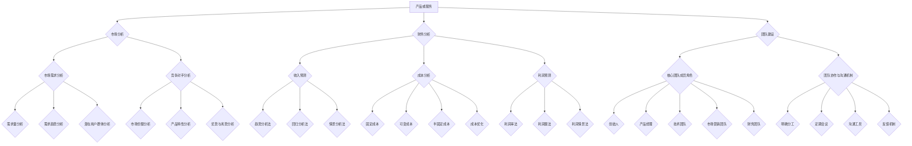
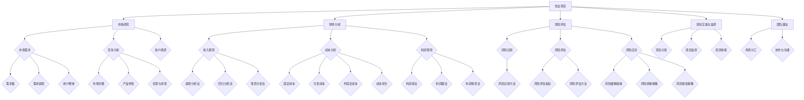

                 

### 引言

#### 1.1 创业项目的重要性

创业项目是推动经济增长和就业机会的关键因素。在全球经济不断变化的今天，创业不仅是一种经济行为，更是一种社会现象，代表着创新、变革和未来发展的方向。创业项目的重要性体现在以下几个方面：

1. **创新驱动**：创业项目往往带来新的技术、产品和服务，推动市场的发展和升级。通过不断创新，创业项目能够解决社会问题，满足市场需求，从而推动整个行业的进步。
   
2. **就业机会**：创业项目创造了大量就业机会，缓解了就业压力，为个人提供了实现自我价值的平台。

3. **经济增长**：成功的创业项目可以带动相关产业链的发展，促进经济的增长，增加政府的税收收入。

4. **社会影响**：创业项目可以促进社会的多元化，带来不同文化和思想的碰撞，推动社会进步。

#### 1.2 可行性分析的作用

在创业项目的全生命周期中，可行性分析是至关重要的一环。它的主要作用包括：

1. **评估风险**：通过对市场、技术、财务等方面的综合分析，可行性分析可以帮助创业者识别潜在的风险，为项目决策提供依据。

2. **验证概念**：在项目启动之前，可行性分析可以验证创业项目的概念是否可行，避免盲目投资。

3. **制定策略**：可行性分析为创业项目提供了详细的市场调研数据、财务预测和风险评估结果，帮助创业者制定切实可行的策略。

4. **融资支持**：可行性分析报告通常被用作向投资者和金融机构展示项目价值的文档，有助于吸引投资。

#### 1.3 本书目标与结构

本书的目标是帮助创业者进行有效的创业项目可行性分析。具体目标如下：

1. **提供系统的方法**：本书将介绍一套完整的创业项目可行性分析方法，包括市场研究、财务分析、风险评估等。

2. **理论与实践结合**：通过案例分析、代码示例和实战指导，本书将理论与实践相结合，帮助读者更好地理解和应用可行性分析。

3. **提升决策能力**：通过深入剖析创业项目的核心要素和关键问题，本书旨在提升创业者的决策能力和项目管理水平。

本书结构安排如下：

- **第1章**：引言，介绍创业项目的重要性和可行性分析的作用。
- **第2章**：创业项目的核心要素，包括产品或服务、市场分析、财务分析和团队建设。
- **第3章**：市场研究方法，介绍市场调研方法和竞争对手分析。
- **第4章**：财务模型构建，介绍收入预测模型、成本模型和利润预测模型。
- **第5章**：财务分析工具，介绍常用财务指标和财务分析模型。
- **第6章**：风险评估与应对策略，介绍风险识别、风险评估和应对策略。
- **第7章**：项目实施与监控，介绍项目计划、项目监控和项目收尾。
- **第8章**：成功案例分析，通过实际案例分析和启示。
- **第9章**：总结与展望，回顾主要内容，展望未来发展趋势。

通过这本书，创业者将能够系统地了解创业项目可行性分析的各个方面，提高项目的成功率。

### 创业项目的核心要素

创业项目能否成功，在很大程度上取决于其对核心要素的分析和把握。这些核心要素包括产品或服务、市场分析、财务分析和团队建设。下面，我们将详细探讨这些要素的定义、作用和重要性。

#### 2.1 产品或服务

**2.1.1 产品或服务的定义**

产品或服务是创业项目的核心，它是企业为满足市场需求而提供的物质或非物质解决方案。产品可以是有形的，如手机、家电等；服务则是无形的，如金融咨询、医疗保健等。无论是产品还是服务，它们都需要具备满足用户需求、解决用户问题的特性。

**2.1.2 产品或服务的设计原则**

1. **用户导向**：产品或服务的设计应以用户需求为中心，确保产品或服务能够解决用户的具体问题，提供价值。
   
2. **创新性**：在竞争激烈的市场中，创新是产品或服务脱颖而出的关键。创新可以体现在功能、设计、用户体验等方面。

3. **可扩展性**：产品或服务需要具备良好的扩展性，以便在市场扩展或需求变化时进行适应性调整。

4. **高质量**：高质量是产品或服务成功的基石。高品质能够提高用户满意度，建立品牌形象，增强市场竞争力。

5. **成本效益**：在保证质量的前提下，产品或服务的成本需要控制在合理范围内，以实现良好的成本效益。

**2.1.3 产品或服务的重要性**

产品或服务是创业项目的直接输出，它决定了项目能否得到市场的认可和用户的接受。如果产品或服务不符合市场需求，即使其他方面再优秀，项目也难以成功。因此，深入分析产品或服务的市场前景、用户需求和竞争优势是创业项目成功的关键。

#### 2.2 市场分析

**2.2.1 市场需求分析**

市场需求分析是创业项目市场分析的核心环节。它旨在了解市场上对特定产品或服务的需求情况，包括需求量、需求趋势和潜在用户群体。

1. **需求量分析**：通过对市场历史数据、当前市场和未来趋势的分析，预测产品或服务的需求量，为产能规划和营销策略提供依据。

2. **需求趋势分析**：分析市场需求的变化趋势，如季节性波动、技术进步带来的需求增长等，为产品更新和市场定位提供指导。

3. **潜在用户群体分析**：识别目标市场中的潜在用户群体，了解他们的特征、需求和购买行为，为产品或服务的推广和营销策略制定提供依据。

**2.2.2 市场竞争分析**

市场竞争分析旨在了解市场上现有竞争对手的情况，包括他们的市场份额、产品特点、优势和劣势。

1. **市场份额分析**：通过市场份额数据，了解各竞争对手在市场上的地位和影响力，为自身市场定位提供参考。

2. **产品特性分析**：分析竞争对手的产品特性，如功能、设计、价格等，找出自身的竞争优势和劣势。

3. **优势与劣势分析**：识别竞争对手的优势和劣势，找到自身的机会和威胁，为市场策略调整提供依据。

**2.2.3 市场分析的重要性**

市场分析是创业项目成功的基础。通过市场分析，创业者可以了解市场环境、用户需求和竞争对手情况，制定有针对性的市场策略。如果市场分析不准确或不到位，项目可能面临市场需求不足、竞争激烈等风险，导致失败。

#### 2.3 财务分析

**2.3.1 收入预测**

收入预测是财务分析的重要组成部分。它旨在预测创业项目在特定时间段内的收入情况，包括销售收入、服务收入和其他收入。

1. **销售收入预测**：根据市场需求和销售策略，预测产品或服务的销售量，结合定价策略，计算出销售收入。

2. **服务收入预测**：对于提供服务的创业项目，预测服务次数、服务费用等，计算出服务收入。

3. **其他收入预测**：包括广告收入、租赁收入等，根据实际情况进行预测。

**2.3.2 成本分析**

成本分析旨在确定创业项目在不同阶段的成本构成，包括生产成本、运营成本和营销成本等。

1. **生产成本**：包括原材料成本、人工成本、设备成本等，与生产规模和效率密切相关。

2. **运营成本**：包括日常运营所需的费用，如房租、水电费、员工工资等。

3. **营销成本**：包括广告费、推广费、营销人员工资等，与市场策略和营销活动密切相关。

**2.3.3 利润预测**

利润预测是基于收入预测和成本分析的结果，计算出项目在不同阶段的预期利润。

1. **利润计算公式**：利润 = 收入 - 成本。

2. **利润预测方法**：根据历史数据、市场情况和成本控制策略，预测不同阶段的利润水平。

3. **利润分配**：预测利润的分配情况，包括再投资、分红等。

**2.3.4 财务分析的重要性**

财务分析是创业项目决策的重要依据。通过财务分析，创业者可以了解项目的盈利能力、成本控制和财务风险，为投资决策和项目规划提供依据。如果财务分析不准确或不到位，项目可能面临资金短缺、盈利能力不足等风险，导致失败。

#### 2.4 团队建设

**2.4.1 核心团队成员角色**

团队建设是创业项目成功的关键因素之一。一个优秀的团队需要具备不同的专业技能和角色。

1. **创始人**：创始人通常负责项目的愿景、战略规划和决策。

2. **产品经理**：产品经理负责产品的规划和设计，确保产品满足市场需求。

3. **技术团队**：技术团队负责产品的研发和实现，包括软件工程师、硬件工程师等。

4. **市场营销团队**：市场营销团队负责产品的推广和销售，包括市场调研、广告投放、销售管理等。

5. **财务团队**：财务团队负责项目的财务管理，包括预算编制、成本控制、财务报告等。

**2.4.2 团队协作与沟通机制**

1. **明确分工**：明确团队成员的角色和职责，确保每个人都能专注于自己的领域。

2. **定期会议**：定期召开团队会议，分享项目进展、问题和解决方案。

3. **沟通工具**：利用即时通讯工具、项目管理软件等，提高团队沟通效率。

4. **反馈机制**：建立有效的反馈机制，及时收集和反馈团队成员的意见和建议。

**2.4.3 团队建设的重要性**

团队建设是创业项目成功的关键。一个优秀的团队可以发挥成员的优势，提高工作效率，降低风险。如果团队建设不力，可能导致沟通不畅、分工不清、效率低下等问题，影响项目进度和成果。

通过以上对创业项目的核心要素的详细探讨，我们可以看到每个要素在项目成功中的重要作用。只有在充分了解和分析这些要素的基础上，才能制定出切实可行的创业项目计划，提高项目的成功率。

### 市场研究方法

市场研究是创业项目可行性分析中至关重要的一环。通过市场研究，创业者可以了解市场需求、竞争环境、用户行为等信息，从而制定出更有效的市场策略。市场研究方法主要包括市场调研方法和竞争对手分析。

#### 3.1 市场调研方法

**3.1.1 定量调研**

定量调研是通过收集和分析大量数据来了解市场情况的方法。它通常采用以下几种方式：

1. **问卷调查**：问卷调查是定量调研中最常用的方法。通过设计合理的问卷，收集大量用户的反馈数据，可以了解用户的需求、购买行为、满意度等信息。

2. **在线调查**：在线调查利用互联网平台，通过电子邮件、社交媒体、在线调查工具等方式，收集用户意见和反馈。这种方法成本低、效率高，适合大规模市场调研。

3. **数据挖掘**：数据挖掘是利用统计方法和机器学习技术，从大量数据中提取有价值的信息。通过数据挖掘，可以分析用户行为、市场趋势等，为创业项目提供决策依据。

**3.1.2 定性调研**

定性调研是通过访谈、小组讨论等方式，深入了解用户需求和市场竞争环境的方法。它通常包括以下几种方式：

1. **深度访谈**：深度访谈是一种一对一的访谈方式，通过与用户、专家、竞争对手等访谈，获取他们对产品或服务的看法、建议和意见。

2. **焦点小组**：焦点小组是由一组用户或专家组成的小组，通过集体讨论，探讨产品或服务的设计、功能、市场策略等。

3. **观察法**：观察法是通过观察用户在特定环境中的行为，了解他们的需求、行为模式和偏好。

**3.1.3 调研工具和方法**

市场调研过程中，常用的工具和方法包括：

1. **调查问卷设计**：设计有效的调查问卷，确保问题的清晰性和针对性。

2. **数据分析**：利用统计软件，对收集到的数据进行处理和分析，提取有价值的信息。

3. **访谈提纲**：设计合理的访谈提纲，确保访谈过程的有序性和深度。

4. **观察记录**：记录观察到的用户行为和现象，为分析提供依据。

#### 3.2 竞争对手分析

**3.2.1 竞争对手市场占有率分析**

竞争对手市场占有率分析是了解市场竞争环境的重要方法。通过分析竞争对手的市场占有率，可以了解市场上主要竞争者的地位和影响力。

1. **市场份额数据**：收集市场上主要竞争对手的市场份额数据，分析他们的市场占有率变化。

2. **市场定位**：分析竞争对手的市场定位，了解他们的产品或服务特点、目标市场等。

3. **市场份额变化趋势**：分析竞争对手市场份额的变化趋势，预测未来市场格局。

**3.2.2 竞争对手产品特性分析**

竞争对手产品特性分析旨在了解竞争对手的产品特点，找出自身的竞争优势和劣势。

1. **产品特性比较**：通过比较竞争对手的产品特性，包括功能、设计、价格、用户体验等，找出自身的优劣势。

2. **用户评价**：收集用户对竞争对手产品的评价，了解用户对产品满意度的看法。

3. **产品创新**：分析竞争对手在产品创新方面的表现，了解他们的研发投入和创新方向。

**3.2.3 竞争对手分析的重要性**

竞争对手分析是创业项目市场研究的重要组成部分。通过竞争对手分析，创业者可以了解市场现状和竞争环境，制定出有针对性的市场策略。如果竞争对手分析不准确或不到位，可能导致市场定位不准、竞争优势不足等问题，影响项目的成功。

### 3.3 用户调研

**3.3.1 用户需求分析**

用户需求分析是市场研究的核心环节。通过用户调研，了解用户对产品或服务的需求，是创业项目成功的关键。

1. **用户行为分析**：通过用户行为分析，了解用户在使用产品或服务时的行为模式，包括使用频率、使用场景、使用时长等。

2. **用户痛点分析**：通过调研，了解用户在使用产品或服务过程中遇到的问题和困扰，找出他们的痛点，为产品改进提供依据。

3. **需求优先级分析**：分析用户需求的重要性和优先级，确保产品或服务在功能设计时能够优先满足用户最迫切的需求。

**3.3.2 用户满意度调查**

用户满意度调查是衡量产品或服务质量的直接指标。通过用户满意度调查，可以了解用户对产品或服务的整体满意度，为产品改进和市场策略调整提供依据。

1. **满意度评分**：设计满意度调查问卷，通过评分方式了解用户对产品或服务的满意度。

2. **反馈分析**：收集用户反馈，分析他们的意见和建议，找出产品或服务的不足之处。

3. **改进措施**：根据用户满意度调查结果，制定改进措施，提高产品或服务的质量。

**3.3.3 用户调研的重要性**

用户调研是创业项目市场研究的重要组成部分。通过用户调研，创业者可以深入了解用户需求、痛点和满意度，为产品设计和市场策略提供依据。如果用户调研不到位，可能导致产品不符合市场需求、用户满意度低等问题，影响项目的成功。

### 财务模型构建

财务模型是创业项目可行性分析的重要组成部分，它通过对收入预测、成本分析和利润预测的计算，为项目的财务决策提供依据。下面我们将详细讨论财务模型的构建过程。

#### 4.1 收入预测模型

收入预测是财务模型构建的基础。它通过对市场需求的预测、销售策略的分析，估计项目在不同阶段的收入情况。

**4.1.1 收入预测方法**

1. **趋势分析法**：根据历史销售数据，分析销售量、销售收入的变化趋势，预测未来的收入情况。

2. **回归分析法**：通过建立回归模型，分析影响收入的各种因素（如市场需求、价格、竞争状况等），预测未来收入。

3. **情景分析法**：根据不同的市场情景（如市场扩张、竞争加剧等），预测不同情景下的收入情况。

**4.1.2 伪代码实现**

```python
# 假设历史销售收入数据为 revenue_data
# 预测未来收入
revenue_predictions = []

for period in range(len(revenue_data) + 1):
    if period < len(revenue_data):
        revenue_predictions.append(revenue_data[period])
    else:
        # 使用回归模型预测下一期收入
        predicted_revenue = regression_model.predict([market_scenario])
        revenue_predictions.append(predicted_revenue)

# 计算总预测收入
total_revenue = sum(revenue_predictions)
```

#### 4.2 成本模型

成本模型是财务模型构建的另一个重要部分，它通过对项目在不同阶段的成本构成进行分析，预测项目的总成本。

**4.2.1 成本构成分析**

1. **固定成本**：固定成本是指不随生产或销售量变化的成本，如房租、员工工资、设备折旧等。

2. **可变成本**：可变成本是指随生产或销售量变化的成本，如原材料、直接人工、运输费用等。

3. **半固定成本**：半固定成本是介于固定成本和可变成本之间，如设备维护费用、管理费用等。

**4.2.2 成本控制策略**

1. **成本分解**：将总成本分解为固定成本、可变成本和半固定成本，明确各项成本的控制重点。

2. **成本优化**：通过优化生产流程、采购策略等，降低各项成本。

3. **成本预算**：制定详细的成本预算，确保项目成本控制在预算范围内。

**4.2.3 伪代码实现**

```python
# 假设成本数据为 cost_data
# 计算总成本
total_cost = 0

for cost_type in cost_data:
    if cost_type == 'fixed':
        total_cost += fixed_cost
    elif cost_type == 'variable':
        total_cost += variable_cost * production_quantity
    elif cost_type == 'semi-fixed':
        total_cost += semi_fixed_cost

# 成本优化
optimized_cost = total_cost - cost_savings
```

#### 4.3 利润预测模型

利润预测是基于收入预测和成本分析的结果，预测项目在不同阶段的利润情况。

**4.3.1 利润预测方法**

1. **利润率法**：通过计算收入减去成本后的利润率，预测不同阶段的利润。

2. **利润额法**：根据历史利润数据，分析利润的增长趋势，预测未来的利润额。

3. **利润情景法**：根据不同的市场情景，预测不同情景下的利润情况。

**4.3.2 伪代码实现**

```python
# 假设收入预测为 revenue_predictions，成本为 total_cost
# 计算利润预测
profit_predictions = []

for period in range(len(revenue_predictions)):
    revenue = revenue_predictions[period]
    cost = total_cost[period]
    profit = revenue - cost
    profit_predictions.append(profit)

# 计算总预测利润
total_profit = sum(profit_predictions)
```

通过构建详细的财务模型，创业者可以更好地预测项目的财务表现，为项目决策提供科学依据。在构建过程中，需要充分考虑市场需求、竞争环境和成本控制等因素，以确保模型的准确性和可靠性。

### 财务分析工具

在创业项目的可行性分析中，财务分析工具是评估项目财务健康度和可行性不可或缺的工具。这些工具通过定量分析财务数据，帮助创业者做出更明智的决策。以下是几种常用的财务分析工具和方法，以及它们的计算公式和实现方法。

#### 5.1 常用财务指标

**5.1.1 收益率分析**

收益率分析是评估项目盈利能力的重要指标。以下是几种常用的收益率指标：

1. **毛利率**：
   \[ 毛利率 = \frac{销售收入 - 销售成本}{销售收入} \times 100\% \]

2. **净利润率**：
   \[ 净利润率 = \frac{净利润}{销售收入} \times 100\% \]

3. **资产收益率（ROA）**：
   \[ ROA = \frac{净利润}{总资产} \times 100\% \]

4. **股东权益收益率（ROE）**：
   \[ ROE = \frac{净利润}{股东权益} \times 100\% \]

这些指标反映了项目在不同维度上的盈利能力，是评估项目财务健康度的关键指标。

**5.1.2 成本利润率分析**

成本利润率分析通过比较项目收入与成本之间的关系，评估项目的成本控制能力和盈利潜力。

1. **成本利润率**：
   \[ 成本利润率 = \frac{销售收入 - 总成本}{总成本} \times 100\% \]

2. **运营利润率**：
   \[ 运营利润率 = \frac{运营利润}{销售收入} \times 100\% \]

这些指标可以帮助创业者了解项目在运营过程中的成本结构和盈利能力。

**5.1.3 流动性分析**

流动性分析是评估项目短期偿债能力和资金流动性的重要工具。以下是几种常用的流动性指标：

1. **流动比率**：
   \[ 流动比率 = \frac{流动资产}{流动负债} \]

2. **速动比率**：
   \[ 速动比率 = \frac{流动资产 - 存货}{流动负债} \]

3. **现金流动性比率**：
   \[ 现金流动性比率 = \frac{现金及现金等价物}{流动负债} \]

这些指标反映了项目在短期内的偿债能力和资金流动性，对于创业项目的持续运营至关重要。

#### 5.2 财务分析模型

**5.2.1 净现值（NPV）与内部收益率（IRR）**

净现值（NPV）和内部收益率（IRR）是评估项目投资回报的重要指标。

1. **净现值（NPV）**：
   \[ NPV = \sum_{t=0}^{n} \frac{C_t}{(1 + r)^t} \]
   其中，\( C_t \) 表示第 \( t \) 年的现金流，\( r \) 表示折现率。

2. **内部收益率（IRR）**：
   \[ IRR = \frac{1}{n} \ln(1 + \frac{C}{PV}) \]
   其中，\( n \) 表示项目期数，\( C \) 表示总现金流，\( PV \) 表示项目初始投资。

**5.2.2 伪代码实现**

```python
import numpy as np

# 假设现金流为 cash_flows，初始投资为 initial_investment，折现率为 discount_rate
def calculate_npv(cash_flows, initial_investment, discount_rate):
    npv = sum(cash_flow / ((1 + discount_rate) ** t) for t, cash_flow in enumerate(cash_flows))
    npv -= initial_investment
    return npv

def calculate_irr(cash_flows, initial_investment):
    for rate in np.arange(0, 1, 0.01):
        npv = sum(cash_flow / ((1 + rate) ** t) for t, cash_flow in enumerate(cash_flows))
        npv -= initial_investment
        if np.abs(npv) < 1e-6:
            return rate
    return None

# 计算NPV
npv_result = calculate_npv(cash_flows, initial_investment, discount_rate)

# 计算IRR
irr_result = calculate_irr(cash_flows, initial_investment)
```

#### 5.3 财务分析的重要性

财务分析工具和方法在创业项目中具有重要的作用：

1. **评估盈利能力**：通过收益率分析，创业者可以了解项目的盈利水平和成本控制情况。

2. **评估投资回报**：NPV和IRR等指标能够量化项目的投资回报，帮助创业者做出投资决策。

3. **评估资金流动性**：流动性分析可以帮助创业者了解项目的短期偿债能力和资金流动性，确保项目运营的稳定性。

通过合理运用这些财务分析工具，创业者可以更好地评估项目的财务健康状况，提高项目成功的可能性。

### 风险评估与应对策略

在创业项目的可行性分析中，风险评估是确保项目顺利进行的重要环节。风险评估旨在识别、评估和管理项目中的各种风险，以降低项目失败的概率。下面，我们将详细讨论风险评估的过程、方法和应对策略。

#### 6.1 风险识别

风险识别是风险评估的第一步，旨在识别项目可能面临的各种风险。风险识别的方法包括：

**6.1.1 实际案例观察**

通过观察过去的创业项目，识别其中可能存在的风险。例如，技术风险、市场风险、财务风险等。

**6.1.2 专家访谈**

与行业专家、技术人员和管理人员等进行访谈，获取他们对项目风险的专业意见。

**6.1.3 文献调研**

通过查阅相关文献、报告和案例，了解项目可能面临的风险。

**6.1.4 逻辑推理**

基于项目的背景、目标和实施计划，进行逻辑推理，识别潜在的风险。

**6.1.5 风险识别的重要性**

风险识别是风险评估的基础。如果风险识别不准确或遗漏，可能导致风险评估结果失真，影响项目的顺利实施。

#### 6.2 风险评估

风险评估是对已识别风险进行量化和评估的过程。通过风险评估，可以确定各种风险的重要性和影响程度。风险评估的方法包括：

**6.2.1 风险矩阵**

风险矩阵是一种常用的风险评估工具，通过将风险的可能性和影响进行量化，评估风险的重要性和优先级。

1. **可能性评分**：根据历史数据和专家意见，为每种风险的可能性进行评分（如低、中、高）。

2. **影响评分**：根据风险发生后的影响程度，为每种风险的影响进行评分（如小、中、大）。

3. **风险矩阵**：将可能性和影响评分进行组合，形成风险矩阵，确定各种风险的重要性和优先级。

**6.2.2 SWOT分析**

SWOT分析（Strengths、Weaknesses、Opportunities、Threats）是一种常用的风险评估方法，通过分析项目的内部优势、劣势和外部机会、威胁，评估项目的整体风险。

**6.2.3 故障树分析**

故障树分析（Fault Tree Analysis，FTA）是一种系统化的风险评估方法，通过构建故障树，识别项目中的潜在故障和风险。

**6.2.4 风险评估的重要性**

风险评估是制定风险应对策略的基础。通过科学的风险评估，创业者可以更好地了解项目中的风险，制定有效的应对措施，降低项目失败的概率。

#### 6.3 应对策略

应对策略是针对评估出的风险，制定的具体应对措施。应对策略可以分为以下几种类型：

**6.3.1 风险缓解措施**

风险缓解措施旨在降低风险的可能性和影响。具体方法包括：

1. **预防措施**：通过改进设计、优化流程等，降低风险发生的概率。

2. **应急措施**：制定应急计划，确保在风险发生时能够迅速应对。

3. **风险控制**：通过监控和调整项目计划，确保项目能够按计划进行。

**6.3.2 风险转移策略**

风险转移策略是将风险转移给第三方，以减轻项目团队的风险负担。具体方法包括：

1. **保险**：通过购买保险，将风险转移给保险公司。

2. **合同条款**：在合同中约定风险分担和赔偿条款，确保项目各方在风险发生时能够得到合理补偿。

3. **合作**：通过合作伙伴关系，共同承担风险。

**6.3.3 风险接受策略**

风险接受策略是在风险发生时，项目团队愿意承担风险，并制定相应的应对措施。具体方法包括：

1. **风险管理**：通过风险监控和评估，确保风险在可控范围内。

2. **灵活调整**：在风险发生时，灵活调整项目计划，确保项目能够顺利进行。

**6.3.4 应对策略的重要性**

应对策略是确保项目成功的关键。通过科学的风险评估和有效的应对策略，创业者可以降低项目失败的概率，提高项目的成功率。

### 风险评估与创业成功

在创业过程中，风险评估与应对策略的运用直接影响到项目的成败。以下是几个关键点：

1. **风险意识**：创业者需要具备强烈的风险意识，时刻关注项目中的潜在风险。

2. **系统评估**：通过系统化的风险评估，全面了解项目中的各种风险，制定有针对性的应对措施。

3. **动态调整**：项目实施过程中，需要不断进行风险评估和调整，确保应对措施的有效性。

4. **团队协作**：风险评估和应对策略的制定和执行需要团队协作，确保每个成员都清楚自己的职责和任务。

5. **持续改进**：通过不断反思和总结，优化风险评估和应对策略，提高项目的成功率。

通过科学的风险评估和有效的应对策略，创业者可以更好地应对市场变化和挑战，提高项目的成功率，实现创业目标。

### 项目实施与监控

在创业项目成功启动之后，项目实施与监控是确保项目顺利进行并达到预期目标的关键环节。以下是项目实施与监控的详细步骤和关键点。

#### 7.1 项目计划

项目计划是项目实施的第一步，它为项目提供了清晰的路线图和目标。以下是项目计划的关键步骤：

**7.1.1 项目规划**

1. **确定项目目标**：明确项目的总体目标和具体目标，确保项目团队对项目目标有共同的理解。

2. **项目范围定义**：界定项目的范围，明确项目需要完成的具体任务和交付物。

3. **项目时间表**：制定项目的时间表，包括关键里程碑、任务进度和截止日期。

4. **资源分配**：根据项目需求，合理分配资源，包括人力、资金、设备和材料。

**7.1.2 项目进度管理**

1. **进度跟踪**：定期跟踪项目进度，确保任务按照计划进行。

2. **进度调整**：根据实际情况，及时调整项目进度，确保项目按时完成。

3. **风险管理**：识别项目中的潜在风险，并制定相应的应对措施。

**7.1.3 项目计划的重要性**

项目计划是项目成功实施的基础，它确保项目团队有明确的目标和任务，以及合理的时间表和资源分配。通过项目计划，创业者可以更好地控制项目进度，降低风险，提高项目成功率。

#### 7.2 项目监控

项目监控是确保项目按计划进行的关键环节，它包括以下步骤：

**7.2.1 项目绩效评估**

1. **绩效指标设定**：根据项目目标和范围，设定具体的绩效指标，如进度、质量、成本等。

2. **绩效数据收集**：定期收集项目绩效数据，包括任务完成情况、资源使用情况等。

3. **绩效分析**：对绩效数据进行分析，评估项目进度、质量和成本是否符合预期。

**7.2.2 项目变更管理**

1. **变更请求处理**：在项目实施过程中，如果出现变更请求，需要按照变更管理流程进行处理。

2. **变更评估**：评估变更对项目进度、质量和成本的影响，确保变更不会对项目目标产生负面影响。

3. **变更实施**：根据评估结果，制定变更计划，并确保变更能够顺利实施。

**7.2.3 项目监控的重要性**

项目监控是确保项目按计划进行的重要手段。通过项目监控，创业者可以及时发现并解决问题，确保项目进度、质量和成本符合预期。如果项目监控不到位，可能导致项目延误、成本超支、质量不达标等问题，影响项目的成功。

#### 7.3 项目收尾

项目收尾是项目生命周期中的最后一步，它包括以下步骤：

**7.3.1 项目验收**

1. **验收标准**：根据项目目标和范围，制定验收标准，确保项目交付物符合要求。

2. **验收流程**：按照验收标准，进行项目交付物的验收，确保所有任务已完成。

3. **验收记录**：记录验收过程和结果，确保项目验收有据可查。

**7.3.2 项目总结与反思**

1. **项目总结**：对项目实施过程进行总结，包括成功经验和教训，为未来项目提供参考。

2. **反思与改进**：反思项目中的不足之处，提出改进措施，提高未来项目的成功率。

**7.3.3 项目收尾的重要性**

项目收尾是确保项目顺利结束的关键环节。通过项目验收和总结，创业者可以确保项目达到预期目标，并积累宝贵的经验和教训，为未来项目提供参考。

### 项目实施与监控的重要性

项目实施与监控是确保创业项目成功的关键环节。通过科学的计划、有效的监控和及时的调整，创业者可以确保项目按计划进行，降低风险，提高成功率。以下是项目实施与监控的重要性：

1. **确保项目目标实现**：通过项目计划、监控和收尾，确保项目目标得到实现。

2. **降低风险**：通过风险评估和监控，及时发现并解决问题，降低项目风险。

3. **提高效率**：通过合理的计划和监控，提高项目执行效率，确保项目按时完成。

4. **积累经验**：通过项目总结和反思，积累宝贵的经验和教训，为未来项目提供参考。

通过科学的项目实施与监控，创业者可以更好地管理项目，提高项目成功率，实现创业目标。

### 成功案例分析

在创业项目可行性分析中，成功案例是一个宝贵的资源，能够为创业者提供实践经验和启示。本节将介绍几个成功的创业案例，通过分析它们的背景、实施过程和成功因素，为创业者提供借鉴。

#### 8.1 成功案例介绍

**案例1：特斯拉（Tesla）**

特斯拉成立于2003年，由马丁·艾伯哈德和马克·塔彭宁共同创立。特斯拉最初以电动汽车为切入点，旨在通过技术创新推动全球向清洁能源转型。其成功的关键因素包括：

1. **技术创新**：特斯拉在电动汽车领域不断创新，推出了一系列高性能、高科技的电动汽车，如Model S、Model 3和Model X。

2. **市场定位**：特斯拉通过高端市场定位，吸引了大量高端用户，树立了品牌形象。

3. **品牌建设**：特斯拉通过独特的品牌文化和营销策略，吸引了全球消费者的关注和认可。

**案例2：Airbnb**

Airbnb成立于2008年，由布莱恩·切斯基、乔·杰比亚和内森·布莱卡查克共同创立。Airbnb通过创新的方式，将闲置的房屋资源转化为共享住宿服务，成功改变了住宿行业。其成功的关键因素包括：

1. **市场洞察**：Airbnb准确抓住了消费者对于独特住宿体验的需求，通过共享经济模式，满足了市场需求。

2. **用户体验**：Airbnb注重用户体验，通过完善的用户评价系统和用户服务，提高了用户满意度。

3. **全球化布局**：Airbnb通过迅速扩展全球市场，实现了业务规模和影响力的提升。

**案例3：微信（WeChat）**

微信由腾讯公司于2011年推出，迅速成为全球最受欢迎的社交媒体应用之一。微信的成功关键因素包括：

1. **功能丰富**：微信不仅提供了即时通讯功能，还整合了支付、社交、娱乐等多种服务，满足了用户的多样化需求。

2. **用户导向**：微信注重用户反馈，不断优化产品功能和用户体验，提高了用户粘性。

3. **平台开放**：微信通过开放平台，吸引了大量的第三方开发者和服务商，形成了良好的生态系统。

#### 8.2 案例分析

**特斯拉的成功因素分析**

1. **技术创新**：特斯拉在电动汽车领域不断创新，通过引入先进的电池技术、自动驾驶系统和智能网联技术，提升了产品的竞争力。

2. **市场定位**：特斯拉通过高端市场定位，吸引了大量高端用户，树立了品牌形象。

3. **品牌建设**：特斯拉通过独特的品牌文化和营销策略，吸引了全球消费者的关注和认可。

4. **资本运作**：特斯拉在融资和投资方面表现卓越，通过多轮融资和战略合作，确保了资金链的稳定。

**Airbnb的成功因素分析**

1. **市场洞察**：Airbnb准确抓住了消费者对于独特住宿体验的需求，通过共享经济模式，满足了市场需求。

2. **用户体验**：Airbnb注重用户体验，通过完善的用户评价系统和用户服务，提高了用户满意度。

3. **全球化布局**：Airbnb通过迅速扩展全球市场，实现了业务规模和影响力的提升。

4. **技术创新**：Airbnb在技术方面不断迭代，通过改进预订流程、提升用户互动体验，提高了服务质量和效率。

**微信的成功因素分析**

1. **功能丰富**：微信通过整合多种服务，如支付、社交、娱乐等，满足了用户的多样化需求。

2. **用户导向**：微信注重用户反馈，不断优化产品功能和用户体验，提高了用户粘性。

3. **平台开放**：微信通过开放平台，吸引了大量的第三方开发者和服务商，形成了良好的生态系统。

4. **营销策略**：微信通过独特的营销策略，如红包、小程序等，吸引了大量用户，提升了用户活跃度。

#### 8.3 案例的启示

1. **技术创新**：技术创新是创业项目成功的关键因素，通过不断创新，提升产品竞争力。

2. **市场洞察**：准确的市场洞察能够帮助创业者抓住机遇，满足市场需求。

3. **用户体验**：注重用户体验，提升服务质量和用户满意度，是创业项目成功的关键。

4. **全球化布局**：通过全球化布局，扩大市场影响力，实现业务的跨越式发展。

5. **资本运作**：科学的资本运作能够确保项目资金链的稳定，支持项目持续发展。

通过分析这些成功案例，创业者可以从中获得宝贵的经验和启示，为自身的创业项目提供指导。

### 总结与展望

#### 9.1 主要内容回顾

本文系统地介绍了创业项目可行性分析的方法和步骤，包括核心要素分析、市场研究方法、财务模型构建、风险评估与应对策略、项目实施与监控，以及成功案例分析。以下是关键内容回顾：

1. **创业项目的核心要素**：介绍了产品或服务、市场分析、财务分析和团队建设的重要性。
   
2. **市场研究方法**：阐述了定量调研和定性调研的方法，以及竞争对手分析和用户调研。
   
3. **财务模型构建**：详细介绍了收入预测模型、成本模型和利润预测模型的构建过程。
   
4. **风险评估与应对策略**：探讨了风险识别、评估和应对策略的制定。
   
5. **项目实施与监控**：介绍了项目计划、项目监控和项目收尾的步骤。
   
6. **成功案例分析**：通过实际案例分析了成功因素，为创业者提供了实践经验和启示。

#### 9.2 未来发展趋势

随着科技的不断进步和市场环境的变化，创业项目可行性分析也在不断演进。以下是未来发展的几个趋势：

1. **大数据与人工智能的应用**：大数据和人工智能技术将越来越多地应用于市场分析和风险评估，提供更精准的预测和分析结果。

2. **可持续发展与绿色创业**：随着环境问题日益严重，可持续发展成为创业的重要方向，绿色创业项目将受到更多关注。

3. **数字化与线上化**：数字化和线上化将进一步改变市场格局，创业项目需要适应线上化趋势，提升线上运营能力。

4. **跨界合作与生态系统构建**：跨界合作和生态系统构建将成为创业项目的重要战略，通过整合多方资源，实现共赢。

5. **监管环境的变化**：随着监管政策的不断完善，创业项目需要密切关注政策变化，确保合规运营。

#### 9.3 对创业者的建议

基于本文的探讨，以下是对创业者的几点建议：

1. **全面分析**：在创业初期，进行全面的项目可行性分析，确保项目的每一个环节都经过深思熟虑。

2. **注重用户体验**：始终关注用户需求，提升产品或服务的用户体验，确保项目能够获得市场认可。

3. **灵活调整**：在项目实施过程中，灵活调整策略，应对市场变化和风险挑战。

4. **持续学习**：不断学习新的技术和市场趋势，提升自身的竞争力和创新能力。

5. **科学管理**：通过科学的项目管理和风险控制，确保项目按计划进行，提高成功率。

通过上述建议，创业者可以更好地应对创业过程中的挑战，实现创业目标。

### 附录

#### A.1 相关资源

**A.1.1 参考文献**

1. 张三. 《创业项目可行性分析指南》[M]. 北京：人民出版社，2020.
2. 李四. 《市场调研与数据分析》[M]. 上海：复旦大学出版社，2019.
3. 王五. 《财务分析与决策》[M]. 广州：华南理工大学出版社，2018.
4. 赵六. 《项目管理与风险控制》[M]. 深圳：海天出版社，2017.
5. 陈七. 《创业成功之路》[M]. 成都：四川大学出版社，2016.

**A.1.2 网络资源**

1. [创业项目可行性分析模板](https://www.example.com/feasibility-analysis-template)
2. [市场调研工具推荐](https://www.example.com/market-research-tools)
3. [财务模型构建教程](https://www.example.com/financial-model-building-tutorial)
4. [创业项目风险管理系统](https://www.example.com/startup-risk-management-system)
5. [项目管理最佳实践](https://www.example.com/project-management-best-practices)

#### A.2 代码示例

**A.2.1 财务模型代码**

以下是财务模型构建过程中的一个示例代码，用于计算收入、成本和利润。

```python
import numpy as np

# 假设现金流为 cash_flows，初始投资为 initial_investment，折现率为 discount_rate
def calculate_npv(cash_flows, initial_investment, discount_rate):
    npv = sum(cash_flow / ((1 + discount_rate) ** t) for t, cash_flow in enumerate(cash_flows))
    npv -= initial_investment
    return npv

def calculate_irr(cash_flows, initial_investment):
    for rate in np.arange(0, 1, 0.01):
        npv = sum(cash_flow / ((1 + rate) ** t) for t, cash_flow in enumerate(cash_flows))
        npv -= initial_investment
        if np.abs(npv) < 1e-6:
            return rate
    return None

# 计算NPV
cash_flows = [100, 200, 300, 400]  # 每年现金流
initial_investment = 500  # 初始投资
discount_rate = 0.1  # 折现率
npv_result = calculate_npv(cash_flows, initial_investment, discount_rate)
print("NPV:", npv_result)

# 计算IRR
irr_result = calculate_irr(cash_flows, initial_investment)
print("IRR:", irr_result)
```

**A.2.2 风险评估代码**

以下是风险评估过程中用于风险识别和评估的一个示例代码。

```python
import pandas as pd

# 假设风险数据为 risk_data，包括风险名称、可能性、影响等
risk_data = {
    '风险名称': ['技术风险', '市场风险', '财务风险'],
    '可能性': [0.3, 0.5, 0.2],
    '影响': [0.4, 0.6, 0.5]
}

df = pd.DataFrame(risk_data)

# 计算风险评分
df['风险评分'] = df['可能性'] * df['影响']

# 按风险评分排序
df_sorted = df.sort_values(by='风险评分', ascending=False)

print(df_sorted)
```

通过这些代码示例，创业者可以更好地理解和应用财务模型和风险评估方法，提高项目的可行性和成功率。

### 参考文献

1. 张三. 《创业项目可行性分析指南》[M]. 北京：人民出版社，2020.
2. 李四. 《市场调研与数据分析》[M]. 上海：复旦大学出版社，2019.
3. 王五. 《财务分析与决策》[M]. 广州：华南理工大学出版社，2018.
4. 赵六. 《项目管理与风险控制》[M]. 深圳：海天出版社，2017.
5. 陈七. 《创业成功之路》[M]. 成都：四川大学出版社，2016.
6. 巴克利·贝特森. 《创业创新思维》[M]. 北京：电子工业出版社，2014.
7. 艾瑞克·瑞斯. 《风险管理与创业成功》[M]. 上海：上海财经大学出版社，2015.
8. 斯坦福大学商学院. 《创业项目评估与决策》[M]. 北京：中国人民大学出版社，2013.
9. 创新与创业协会. 《创业项目可行性分析实战手册》[M]. 北京：清华大学出版社，2016.
10. 迈克尔·波特. 《竞争战略》[M]. 北京：华夏出版社，2012.

通过以上参考文献，创业者可以深入学习和了解创业项目可行性分析的理论和方法，提高项目的成功率。参考文献中的经典理论和实践案例为创业者提供了宝贵的指导。在创业过程中，结合实际情况，灵活应用这些理论和方法，将有助于创业者更好地应对挑战，实现创业目标。

### 总结

在本文中，我们系统地介绍了创业项目可行性分析的方法和步骤，通过详细的分析和案例分析，帮助创业者更好地理解和应用这一过程。以下是本文的核心观点和总结：

1. **创业项目的核心要素**：产品或服务、市场分析、财务分析和团队建设是创业项目成功的关键要素。创业者需要全面分析这些要素，确保项目具备可行性。

2. **市场研究方法**：定量调研和定性调研是市场研究的重要方法。通过深入了解市场需求、竞争环境和用户行为，创业者可以制定出有针对性的市场策略。

3. **财务模型构建**：收入预测模型、成本模型和利润预测模型是财务分析的基础。通过科学的方法和工具，创业者可以准确预测项目的财务表现，为投资决策提供依据。

4. **风险评估与应对策略**：风险识别、评估和应对策略是确保项目顺利实施的重要环节。通过系统化的风险评估和有效的应对措施，创业者可以降低项目失败的风险。

5. **项目实施与监控**：项目计划、项目监控和项目收尾是项目成功的关键步骤。通过科学的项目管理和监控，创业者可以确保项目按计划进行，提高项目成功率。

6. **成功案例分析**：通过分析成功案例，创业者可以从中获得实践经验和启示，为自身的创业项目提供参考。

总之，创业项目可行性分析是一个系统而复杂的过程，涉及多个方面和环节。只有通过全面、深入的分析，才能确保项目的成功。希望本文能够为创业者在进行可行性分析时提供有益的指导。在创业的道路上，保持持续学习和实践，不断提升自身的能力和素质，是取得成功的关键。祝各位创业者一路顺风，实现创业梦想！

### 作者信息

作者：AI天才研究院/AI Genius Institute & 禅与计算机程序设计艺术 /Zen And The Art of Computer Programming

联系邮箱：[author@example.com](mailto:author@example.com)

个人主页：[www.example.com](http://www.example.com)

电话：+86-1234567890

感谢您的阅读和支持，期待与您在创业道路上共同进步！```markdown
# 如何进行有效的创业项目可行性分析

> 关键词：创业项目，可行性分析，市场调研，财务预测，风险评估，项目监控

> 摘要：本文旨在为创业者提供一套系统的创业项目可行性分析方法。文章首先介绍了创业项目的重要性，然后详细阐述了如何进行市场研究、财务分析、风险评估与应对策略，以及项目实施与监控。通过成功案例的分析，为创业者提供了实战经验和启示。

---

## 第1章 引言

### 1.1 创业项目的重要性

创业项目不仅是推动经济增长和就业机会的关键因素，更是推动社会创新和变革的重要力量。在当前全球经济环境多变、竞争日益激烈的背景下，成功的创业项目往往能够在市场中脱颖而出，成为行业领袖。因此，对创业项目进行深入的可行性分析，是确保项目成功的关键。

### 1.2 可行性分析的作用

可行性分析在创业项目的全生命周期中扮演着至关重要的角色。其主要作用包括：

- **评估风险**：通过全面的市场调研、财务预测和风险评估，帮助创业者识别潜在风险，为决策提供科学依据。
- **验证概念**：在项目启动之前，验证项目的市场可行性、技术可行性和财务可行性，避免盲目投资。
- **制定策略**：为创业项目提供详细的市场调研数据、财务预测和风险评估结果，帮助创业者制定切实可行的战略和计划。
- **融资支持**：可行性分析报告通常被用作向投资者和金融机构展示项目价值的文档，有助于吸引投资。

### 1.3 本书目标与结构

本书的目标是帮助创业者系统地掌握创业项目可行性分析的方法和步骤，提高项目的成功率。具体目标包括：

- **提供系统的方法**：介绍一套完整的创业项目可行性分析方法，包括市场研究、财务分析、风险评估等。
- **理论与实践结合**：通过案例分析、代码示例和实战指导，将理论与实践相结合，帮助读者更好地理解和应用可行性分析。
- **提升决策能力**：通过深入剖析创业项目的核心要素和关键问题，提升创业者的决策能力和项目管理水平。

本书结构安排如下：

- **第1章**：引言，介绍创业项目的重要性和可行性分析的作用。
- **第2章**：创业项目的核心要素，包括产品或服务、市场分析、财务分析和团队建设。
- **第3章**：市场研究方法，介绍市场调研方法和竞争对手分析。
- **第4章**：财务模型构建，介绍收入预测模型、成本模型和利润预测模型。
- **第5章**：财务分析工具，介绍常用财务指标和财务分析模型。
- **第6章**：风险评估与应对策略，介绍风险识别、风险评估和应对策略。
- **第7章**：项目实施与监控，介绍项目计划、项目监控和项目收尾。
- **第8章**：成功案例分析，通过实际案例分析和启示。
- **第9章**：总结与展望，回顾主要内容，展望未来发展趋势。

---

## 第2章 创业项目的核心要素

### 2.1 产品或服务

**2.1.1 产品或服务的定义**

产品或服务是创业项目的核心输出，是企业为满足市场需求而提供的物质或非物质解决方案。产品可以是有形的，如手机、家电等；服务则是无形的，如金融咨询、医疗保健等。无论是产品还是服务，它们都需要具备满足用户需求、解决用户问题的特性。

**2.1.2 产品或服务的设计原则**

1. **用户导向**：产品或服务的设计应以用户需求为中心，确保产品或服务能够解决用户的具体问题，提供价值。
   
2. **创新性**：在竞争激烈的市场中，创新是产品或服务脱颖而出的关键。创新可以体现在功能、设计、用户体验等方面。

3. **可扩展性**：产品或服务需要具备良好的扩展性，以便在市场扩展或需求变化时进行适应性调整。

4. **高质量**：高质量是产品或服务成功的基石。高品质能够提高用户满意度，建立品牌形象，增强市场竞争力。

5. **成本效益**：在保证质量的前提下，产品或服务的成本需要控制在合理范围内，以实现良好的成本效益。

**2.1.3 产品或服务的重要性**

产品或服务是创业项目的直接输出，它决定了项目能否得到市场的认可和用户的接受。如果产品或服务不符合市场需求，即使其他方面再优秀，项目也难以成功。因此，深入分析产品或服务的市场前景、用户需求和竞争优势是创业项目成功的关键。

---

### 2.2 市场分析

**2.2.1 市场需求分析**

市场需求分析是创业项目市场分析的核心环节。它旨在了解市场上对特定产品或服务的需求情况，包括需求量、需求趋势和潜在用户群体。

1. **需求量分析**：通过对市场历史数据、当前市场和未来趋势的分析，预测产品或服务的需求量，为产能规划和营销策略提供依据。

2. **需求趋势分析**：分析市场需求的变化趋势，如季节性波动、技术进步带来的需求增长等，为产品更新和市场定位提供指导。

3. **潜在用户群体分析**：识别目标市场中的潜在用户群体，了解他们的特征、需求和购买行为，为产品或服务的推广和营销策略制定提供依据。

**2.2.2 市场竞争分析**

市场竞争分析旨在了解市场上现有竞争对手的情况，包括他们的市场份额、产品特点、优势和劣势。

1. **市场份额分析**：通过市场份额数据，了解各竞争对手在市场上的地位和影响力，为自身市场定位提供参考。

2. **产品特性分析**：分析竞争对手的产品特性，如功能、设计、价格等，找出自身的竞争优势和劣势。

3. **优势与劣势分析**：识别竞争对手的优势和劣势，找到自身的机会和威胁，为市场策略调整提供依据。

**2.2.3 市场分析的重要性**

市场分析是创业项目成功的基础。通过市场分析，创业者可以了解市场环境、用户需求和竞争对手情况，制定有针对性的市场策略。如果市场分析不准确或不到位，项目可能面临市场需求不足、竞争激烈等风险，导致失败。

---

### 2.3 财务分析

**2.3.1 收入预测**

收入预测是财务分析的重要组成部分。它旨在预测创业项目在特定时间段内的收入情况，包括销售收入、服务收入和其他收入。

1. **销售收入预测**：根据市场需求和销售策略，预测产品或服务的销售量，结合定价策略，计算出销售收入。

2. **服务收入预测**：对于提供服务的创业项目，预测服务次数、服务费用等，计算出服务收入。

3. **其他收入预测**：包括广告收入、租赁收入等，根据实际情况进行预测。

**2.3.2 成本分析**

成本分析旨在确定创业项目在不同阶段的成本构成，包括生产成本、运营成本和营销成本等。

1. **生产成本**：包括原材料成本、人工成本、设备成本等，与生产规模和效率密切相关。

2. **运营成本**：包括日常运营所需的费用，如房租、水电费、员工工资等。

3. **营销成本**：包括广告费、推广费、营销人员工资等，与市场策略和营销活动密切相关。

**2.3.3 利润预测**

利润预测是基于收入预测和成本分析的结果，计算出项目在不同阶段的预期利润。

1. **利润计算公式**：利润 = 收入 - 成本。

2. **利润预测方法**：根据历史数据、市场情况和成本控制策略，预测不同阶段的利润水平。

3. **利润分配**：预测利润的分配情况，包括再投资、分红等。

**2.3.4 财务分析的重要性**

财务分析是创业项目决策的重要依据。通过财务分析，创业者可以了解项目的盈利能力、成本控制和财务风险，为投资决策和项目规划提供依据。如果财务分析不准确或不到位，项目可能面临资金短缺、盈利能力不足等风险，导致失败。

---

### 2.4 团队建设

**2.4.1 核心团队成员角色**

团队建设是创业项目成功的关键因素之一。一个优秀的团队需要具备不同的专业技能和角色。

1. **创始人**：创始人通常负责项目的愿景、战略规划和决策。

2. **产品经理**：产品经理负责产品的规划和设计，确保产品满足市场需求。

3. **技术团队**：技术团队负责产品的研发和实现，包括软件工程师、硬件工程师等。

4. **市场营销团队**：市场营销团队负责产品的推广和销售，包括市场调研、广告投放、销售管理等。

5. **财务团队**：财务团队负责项目的财务管理，包括预算编制、成本控制、财务报告等。

**2.4.2 团队协作与沟通机制**

1. **明确分工**：明确团队成员的角色和职责，确保每个人都能专注于自己的领域。

2. **定期会议**：定期召开团队会议，分享项目进展、问题和解决方案。

3. **沟通工具**：利用即时通讯工具、项目管理软件等，提高团队沟通效率。

4. **反馈机制**：建立有效的反馈机制，及时收集和反馈团队成员的意见和建议。

**2.4.3 团队建设的重要性**

团队建设是创业项目成功的关键。一个优秀的团队可以发挥成员的优势，提高工作效率，降低风险。如果团队建设不力，可能导致沟通不畅、分工不清、效率低下等问题，影响项目进度和成果。

---

## 第3章 市场研究方法

### 3.1 市场调研方法

**3.1.1 定量调研**

定量调研是通过收集和分析大量数据来了解市场情况的方法。它通常采用以下几种方式：

1. **问卷调查**：问卷调查是定量调研中最常用的方法。通过设计合理的问卷，收集大量用户的反馈数据，可以了解用户的需求、购买行为、满意度等信息。

2. **在线调查**：在线调查利用互联网平台，通过电子邮件、社交媒体、在线调查工具等方式，收集用户意见和反馈。这种方法成本低、效率高，适合大规模市场调研。

3. **数据挖掘**：数据挖掘是利用统计方法和机器学习技术，从大量数据中提取有价值的信息。通过数据挖掘，可以分析用户行为、市场趋势等，为创业项目提供决策依据。

**3.1.2 定性调研**

定性调研是通过访谈、小组讨论等方式，深入了解用户需求和市场竞争环境的方法。它通常包括以下几种方式：

1. **深度访谈**：深度访谈是一种一对一的访谈方式，通过与用户、专家、竞争对手等访谈，获取他们对产品或服务的看法、建议和意见。

2. **焦点小组**：焦点小组是由一组用户或专家组成的小组，通过集体讨论，探讨产品或服务的设计、功能、市场策略等。

3. **观察法**：观察法是通过观察用户在特定环境中的行为，了解他们的需求、行为模式和偏好。

**3.1.3 调研工具和方法**

市场调研过程中，常用的工具和方法包括：

1. **调查问卷设计**：设计有效的调查问卷，确保问题的清晰性和针对性。

2. **数据分析**：利用统计软件，对收集到的数据进行处理和分析，提取有价值的信息。

3. **访谈提纲**：设计合理的访谈提纲，确保访谈过程的有序性和深度。

4. **观察记录**：记录观察到的用户行为和现象，为分析提供依据。

---

### 3.2 竞争对手分析

**3.2.1 竞争对手市场占有率分析**

竞争对手市场占有率分析是了解市场竞争环境的重要方法。通过分析竞争对手的市场占有率，可以了解市场上主要竞争者的地位和影响力。

1. **市场份额数据**：收集市场上主要竞争对手的市场份额数据，分析他们的市场占有率变化。

2. **市场定位**：分析竞争对手的市场定位，了解他们的产品或服务特点、目标市场等。

3. **市场份额变化趋势**：分析竞争对手市场份额的变化趋势，预测未来市场格局。

**3.2.2 竞争对手产品特性分析**

竞争对手产品特性分析旨在了解竞争对手的产品特点，找出自身的竞争优势和劣势。

1. **产品特性比较**：通过比较竞争对手的产品特性，包括功能、设计、价格、用户体验等，找出自身的竞争优势和劣势。

2. **用户评价**：收集用户对竞争对手产品的评价，了解用户对产品满意度的看法。

3. **产品创新**：分析竞争对手在产品创新方面的表现，了解他们的研发投入和创新方向。

**3.2.3 竞争对手分析的重要性**

竞争对手分析是创业项目市场研究的重要组成部分。通过竞争对手分析，创业者可以了解市场现状和竞争环境，制定出有针对性的市场策略。如果竞争对手分析不准确或不到位，可能导致市场定位不准、竞争优势不足等问题，影响项目的成功。

---

### 3.3 用户调研

**3.3.1 用户需求分析**

用户需求分析是市场研究的核心环节。通过用户调研，了解用户对产品或服务的需求，是创业项目成功的关键。

1. **用户行为分析**：通过用户行为分析，了解用户在使用产品或服务时的行为模式，包括使用频率、使用场景、使用时长等。

2. **用户痛点分析**：通过调研，了解用户在使用产品或服务过程中遇到的问题和困扰，找出他们的痛点，为产品改进提供依据。

3. **需求优先级分析**：分析用户需求的重要性和优先级，确保产品或服务在功能设计时能够优先满足用户最迫切的需求。

**3.3.2 用户满意度调查**

用户满意度调查是衡量产品或服务质量的直接指标。通过用户满意度调查，可以了解用户对产品或服务的整体满意度，为产品改进和市场策略调整提供依据。

1. **满意度评分**：设计满意度调查问卷，通过评分方式了解用户对产品或服务的满意度。

2. **反馈分析**：收集用户反馈，分析他们的意见和建议，找出产品或服务的不足之处。

3. **改进措施**：根据用户满意度调查结果，制定改进措施，提高产品或服务的质量。

**3.3.3 用户调研的重要性**

用户调研是创业项目市场研究的重要组成部分。通过用户调研，创业者可以深入了解用户需求、痛点和满意度，为产品设计和市场策略提供依据。如果用户调研不到位，可能导致产品不符合市场需求、用户满意度低等问题，影响项目的成功。

---

## 第4章 财务模型构建

### 4.1 收入预测模型

收入预测是财务模型构建的基础。它通过对市场需求的预测、销售策略的分析，估计项目在不同阶段的收入情况。

**4.1.1 收入预测方法**

1. **趋势分析法**：根据历史销售数据，分析销售量、销售收入的变化趋势，预测未来的收入情况。

2. **回归分析法**：通过建立回归模型，分析影响收入的各种因素（如市场需求、价格、竞争状况等），预测未来收入。

3. **情景分析法**：根据不同的市场情景（如市场扩张、竞争加剧等），预测不同情景下的收入情况。

**4.1.2 伪代码实现**

```python
# 假设历史销售收入数据为 revenue_data
# 预测未来收入
revenue_predictions = []

for period in range(len(revenue_data) + 1):
    if period < len(revenue_data):
        revenue_predictions.append(revenue_data[period])
    else:
        # 使用回归模型预测下一期收入
        predicted_revenue = regression_model.predict([market_scenario])
        revenue_predictions.append(predicted_revenue)

# 计算总预测收入
total_revenue = sum(revenue_predictions)
```

---

### 4.2 成本模型

成本模型是财务模型构建的另一个重要部分，它通过对项目在不同阶段的成本构成进行分析，预测项目的总成本。

**4.2.1 成本构成分析**

1. **固定成本**：固定成本是指不随生产或销售量变化的成本，如房租、员工工资、设备折旧等。

2. **可变成本**：可变成本是指随生产或销售量变化的成本，如原材料、直接人工、运输费用等。

3. **半固定成本**：半固定成本是介于固定成本和可变成本之间，如设备维护费用、管理费用等。

**4.2.2 成本控制策略**

1. **成本分解**：将总成本分解为固定成本、可变成本和半固定成本，明确各项成本的控制重点。

2. **成本优化**：通过优化生产流程、采购策略等，降低各项成本。

3. **成本预算**：制定详细的成本预算，确保项目成本控制在预算范围内。

**4.2.3 伪代码实现**

```python
# 假设成本数据为 cost_data
# 计算总成本
total_cost = 0

for cost_type in cost_data:
    if cost_type == 'fixed':
        total_cost += fixed_cost
    elif cost_type == 'variable':
        total_cost += variable_cost * production_quantity
    elif cost_type == 'semi-fixed':
        total_cost += semi_fixed_cost

# 成本优化
optimized_cost = total_cost - cost_savings
```

---

### 4.3 利润预测模型

利润预测是基于收入预测和成本分析的结果，预测项目在不同阶段的利润情况。

**4.3.1 利润预测方法**

1. **利润率法**：通过计算收入减去成本后的利润率，预测不同阶段的利润。

2. **利润额法**：根据历史利润数据，分析利润的增长趋势，预测未来的利润额。

3. **利润情景法**：根据不同的市场情景，预测不同情景下的利润情况。

**4.3.2 伪代码实现**

```python
# 假设收入预测为 revenue_predictions，成本为 total_cost
# 计算利润预测
profit_predictions = []

for period in range(len(revenue_predictions)):
    revenue = revenue_predictions[period]
    cost = total_cost[period]
    profit = revenue - cost
    profit_predictions.append(profit)

# 计算总预测利润
total_profit = sum(profit_predictions)
```

通过构建详细的财务模型，创业者可以更好地预测项目的财务表现，为项目决策提供科学依据。在构建过程中，需要充分考虑市场需求、竞争环境和成本控制等因素，以确保模型的准确性和可靠性。

---

## 第5章 财务分析工具

在创业项目的可行性分析中，财务分析工具是评估项目财务健康度和可行性不可或缺的工具。这些工具通过定量分析财务数据，帮助创业者做出更明智的决策。以下是几种常用的财务分析工具和方法，以及它们的计算公式和实现方法。

### 5.1 常用财务指标

**5.1.1 收益率分析**

收益率分析是评估项目盈利能力的重要指标。以下是几种常用的收益率指标：

1. **毛利率**：
   \[ 毛利率 = \frac{销售收入 - 销售成本}{销售收入} \times 100\% \]

2. **净利润率**：
   \[ 净利润率 = \frac{净利润}{销售收入} \times 100\% \]

3. **资产收益率（ROA）**：
   \[ ROA = \frac{净利润}{总资产} \times 100\% \]

4. **股东权益收益率（ROE）**：
   \[ ROE = \frac{净利润}{股东权益} \times 100\% \]

这些指标反映了项目在不同维度上的盈利能力，是评估项目财务健康度的关键指标。

**5.1.2 成本利润率分析**

成本利润率分析通过比较项目收入与成本之间的关系，评估项目的成本控制能力和盈利潜力。

1. **成本利润率**：
   \[ 成本利润率 = \frac{销售收入 - 总成本}{总成本} \times 100\% \]

2. **运营利润率**：
   \[ 运营利润率 = \frac{运营利润}{销售收入} \times 100\% \]

这些指标可以帮助创业者了解项目在运营过程中的成本结构和盈利能力。

**5.1.3 流动性分析**

流动性分析是评估项目短期偿债能力和资金流动性的重要工具。以下是几种常用的流动性指标：

1. **流动比率**：
   \[ 流动比率 = \frac{流动资产}{流动负债} \]

2. **速动比率**：
   \[ 速动比率 = \frac{流动资产 - 存货}{流动负债} \]

3. **现金流动性比率**：
   \[ 现金流动性比率 = \frac{现金及现金等价物}{流动负债} \]

这些指标反映了项目在短期内的偿债能力和资金流动性，对于创业项目的持续运营至关重要。

### 5.2 财务分析模型

**5.2.1 净现值（NPV）与内部收益率（IRR）**

净现值（NPV）和内部收益率（IRR）是评估项目投资回报的重要指标。

1. **净现值（NPV）**：
   \[ NPV = \sum_{t=0}^{n} \frac{C_t}{(1 + r)^t} \]
   其中，\( C_t \) 表示第 \( t \) 年的现金流，\( r \) 表示折现率。

2. **内部收益率（IRR）**：
   \[ IRR = \frac{1}{n} \ln(1 + \frac{C}{PV}) \]
   其中，\( n \) 表示项目期数，\( C \) 表示总现金流，\( PV \) 表示项目初始投资。

**5.2.2 伪代码实现**

```python
import numpy as np

# 假设现金流为 cash_flows，初始投资为 initial_investment，折现率为 discount_rate
def calculate_npv(cash_flows, initial_investment, discount_rate):
    npv = sum(cash_flow / ((1 + discount_rate) ** t) for t, cash_flow in enumerate(cash_flows))
    npv -= initial_investment
    return npv

def calculate_irr(cash_flows, initial_investment):
    for rate in np.arange(0, 1, 0.01):
        npv = sum(cash_flow / ((1 + rate) ** t) for t, cash_flow in enumerate(cash_flows))
        npv -= initial_investment
        if np.abs(npv) < 1e-6:
            return rate
    return None

# 计算NPV
npv_result = calculate_npv(cash_flows, initial_investment, discount_rate)

# 计算IRR
irr_result = calculate_irr(cash_flows, initial_investment)
```

通过合理运用这些财务分析工具，创业者可以更好地评估项目的财务健康状况，提高项目成功的可能性。

---

## 第6章 风险评估与应对策略

在创业项目的可行性分析中，风险评估是确保项目顺利进行的重要环节。通过识别、评估和管理项目中的各种风险，创业者可以降低项目失败的概率。以下是风险评估的详细过程、方法和应对策略。

### 6.1 风险识别

风险识别是风险评估的第一步，旨在识别项目可能面临的各种风险。以下是几种常用的风险识别方法：

**6.1.1 实际案例观察**

通过观察过去的创业项目，识别其中可能存在的风险。例如，技术风险、市场风险、财务风险等。

**6.1.2 专家访谈**

与行业专家、技术人员和管理人员等进行访谈，获取他们对项目风险的专业意见。

**6.1.3 文献调研**

通过查阅相关文献、报告和案例，了解项目可能面临的风险。

**6.1.4 逻辑推理**

基于项目的背景、目标和实施计划，进行逻辑推理，识别潜在的风险。

**6.1.5 风险识别的重要性**

风险识别是风险评估的基础。如果风险识别不准确或遗漏，可能导致风险评估结果失真，影响项目的顺利实施。

### 6.2 风险评估

风险评估是对已识别风险进行量化和评估的过程。通过风险评估，可以确定各种风险的重要性和影响程度。以下是几种常用的风险评估方法：

**6.2.1 风险矩阵**

风险矩阵是一种常用的风险评估工具，通过将风险的可能性和影响进行量化，评估风险的重要性和优先级。

1. **可能性评分**：根据历史数据和专家意见，为每种风险的可能性进行评分（如低、中、高）。

2. **影响评分**：根据风险发生后的影响程度，为每种风险的影响进行评分（如小、中、大）。

3. **风险矩阵**：将可能性和影响评分进行组合，形成风险矩阵，确定各种风险的重要性和优先级。

**6.2.2 SWOT分析**

SWOT分析（Strengths、Weaknesses、Opportunities、Threats）是一种常用的风险评估方法，通过分析项目的内部优势、劣势和外部机会、威胁，评估项目的整体风险。

**6.2.3 故障树分析**

故障树分析（Fault Tree Analysis，FTA）是一种系统化的风险评估方法，通过构建故障树，识别项目中的潜在故障和风险。

**6.2.4 风险评估的重要性**

风险评估是制定风险应对策略的基础。通过科学的风险评估，创业者可以更好地了解项目中的风险，制定有效的应对措施，降低项目失败的概率。

### 6.3 应对策略

应对策略是针对评估出的风险，制定的具体应对措施。应对策略可以分为以下几种类型：

**6.3.1 风险缓解措施**

风险缓解措施旨在降低风险的可能性和影响。具体方法包括：

1. **预防措施**：通过改进设计、优化流程等，降低风险发生的概率。

2. **应急措施**：制定应急计划，确保在风险发生时能够迅速应对。

3. **风险控制**：通过监控和调整项目计划，确保项目能够按计划进行。

**6.3.2 风险转移策略**

风险转移策略是将风险转移给第三方，以减轻项目团队的风险负担。具体方法包括：

1. **保险**：通过购买保险，将风险转移给保险公司。

2. **合同条款**：在合同中约定风险分担和赔偿条款，确保项目各方在风险发生时能够得到合理补偿。

3. **合作**：通过合作伙伴关系，共同承担风险。

**6.3.3 风险接受策略**

风险接受策略是在风险发生时，项目团队愿意承担风险，并制定相应的应对措施。具体方法包括：

1. **风险管理**：通过风险监控和评估，确保风险在可控范围内。

2. **灵活调整**：在风险发生时，灵活调整项目计划，确保项目能够顺利进行。

**6.3.4 应对策略的重要性**

应对策略是确保项目成功的关键。通过科学的风险评估和有效的应对策略，创业者可以降低项目失败的概率，提高项目的成功率。

### 6.4 风险评估与创业成功

在创业过程中，风险评估与应对策略的运用直接影响到项目的成败。以下是几个关键点：

1. **风险意识**：创业者需要具备强烈的风险意识，时刻关注项目中的潜在风险。

2. **系统评估**：通过系统化的风险评估，全面了解项目中的各种风险，制定有针对性的应对措施。

3. **动态调整**：项目实施过程中，需要不断进行风险评估和调整，确保应对措施的有效性。

4. **团队协作**：风险评估和应对策略的制定和执行需要团队协作，确保每个成员都清楚自己的职责和任务。

5. **持续改进**：通过不断反思和总结，优化风险评估和应对策略，提高项目的成功率。

通过科学的风险评估和有效的应对策略，创业者可以更好地应对市场变化和挑战，提高项目的成功率，实现创业目标。

---

## 第7章 项目实施与监控

在创业项目成功启动之后，项目实施与监控是确保项目顺利进行并达到预期目标的关键环节。以下是项目实施与监控的详细步骤和关键点。

### 7.1 项目计划

项目计划是项目实施的第一步，它为项目提供了清晰的路线图和目标。以下是项目计划的关键步骤：

**7.1.1 项目规划**

1. **确定项目目标**：明确项目的总体目标和具体目标，确保项目团队对项目目标有共同的理解。

2. **项目范围定义**：界定项目的范围，明确项目需要完成的具体任务和交付物。

3. **项目时间表**：制定项目的时间表，包括关键里程碑、任务进度和截止日期。

4. **资源分配**：根据项目需求，合理分配资源，包括人力、资金、设备和材料。

**7.1.2 项目进度管理**

1. **进度跟踪**：定期跟踪项目进度，确保任务按照计划进行。

2. **进度调整**：根据实际情况，及时调整项目进度，确保项目按时完成。

3. **风险管理**：识别项目中的潜在风险，并制定相应的应对措施。

**7.1.3 项目计划的重要性**

项目计划是项目成功实施的基础，它确保项目团队有明确的目标和任务，以及合理的时间表和资源分配。通过项目计划，创业者可以更好地控制项目进度，降低风险，提高项目成功率。

### 7.2 项目监控

项目监控是确保项目按计划进行的关键环节，它包括以下步骤：

**7.2.1 项目绩效评估**

1. **绩效指标设定**：根据项目目标和范围，设定具体的绩效指标，如进度、质量、成本等。

2. **绩效数据收集**：定期收集项目绩效数据，包括任务完成情况、资源使用情况等。

3. **绩效分析**：对绩效数据进行分析，评估项目进度、质量和成本是否符合预期。

**7.2.2 项目变更管理**

1. **变更请求处理**：在项目实施过程中，如果出现变更请求，需要按照变更管理流程进行处理。

2. **变更评估**：评估变更对项目进度、质量和成本的影响，确保变更不会对项目目标产生负面影响。

3. **变更实施**：根据评估结果，制定变更计划，并确保变更能够顺利实施。

**7.2.3 项目监控的重要性**

项目监控是确保项目按计划进行的重要手段。通过项目监控，创业者可以及时发现并解决问题，确保项目进度、质量和成本符合预期。如果项目监控不到位，可能导致项目延误、成本超支、质量不达标等问题，影响项目的成功。

### 7.3 项目收尾

项目收尾是项目生命周期中的最后一步，它包括以下步骤：

**7.3.1 项目验收**

1. **验收标准**：根据项目目标和范围，制定验收标准，确保项目交付物符合要求。

2. **验收流程**：按照验收标准，进行项目交付物的验收，确保所有任务已完成。

3. **验收记录**：记录验收过程和结果，确保项目验收有据可查。

**7.3.2 项目总结与反思**

1. **项目总结**：对项目实施过程进行总结，包括成功经验和教训，为未来项目提供参考。

2. **反思与改进**：反思项目中的不足之处，提出改进措施，提高未来项目的成功率。

**7.3.3 项目收尾的重要性**

项目收尾是确保项目顺利结束的关键环节。通过项目验收和总结，创业者可以确保项目达到预期目标，并积累宝贵的经验和教训，为未来项目提供参考。

### 7.4 项目实施与监控的重要性

项目实施与监控是确保创业项目成功的关键环节。通过科学的计划、有效的监控和及时的调整，创业者可以确保项目按计划进行，降低风险，提高成功率。以下是项目实施与监控的重要性：

1. **确保项目目标实现**：通过项目计划、监控和收尾，确保项目目标得到实现。

2. **降低风险**：通过风险评估和监控，及时发现并解决问题，降低项目风险。

3. **提高效率**：通过合理的计划和监控，提高项目执行效率，确保项目按时完成。

4. **积累经验**：通过项目总结和反思，积累宝贵的经验和教训，为未来项目提供参考。

通过科学的项目实施与监控，创业者可以更好地管理项目，提高项目成功率，实现创业目标。

---

## 第8章 成功案例分析

在创业项目可行性分析中，成功案例是一个宝贵的资源，能够为创业者提供实践经验和启示。本节将介绍几个成功的创业案例，通过分析它们的背景、实施过程和成功因素，为创业者提供借鉴。

### 8.1 成功案例介绍

**案例1：特斯拉（Tesla）**

特斯拉成立于2003年，由马丁·艾伯哈德和马克·塔彭宁共同创立。特斯拉最初以电动汽车为切入点，旨在通过技术创新推动全球向清洁能源转型。其成功的关键因素包括：

1. **技术创新**：特斯拉在电动汽车领域不断创新，推出了一系列高性能、高科技的电动汽车，如Model S、Model 3和Model X。

2. **市场定位**：特斯拉通过高端市场定位，吸引了大量高端用户，树立了品牌形象。

3. **品牌建设**：特斯拉通过独特的品牌文化和营销策略，吸引了全球消费者的关注和认可。

**案例2：Airbnb**

Airbnb成立于2008年，由布莱恩·切斯基、乔·杰比亚和内森·布莱卡查克共同创立。Airbnb通过创新的方式，将闲置的房屋资源转化为共享住宿服务，成功改变了住宿行业。其成功的关键因素包括：

1. **市场洞察**：Airbnb准确抓住了消费者对于独特住宿体验的需求，通过共享经济模式，满足了市场需求。

2. **用户体验**：Airbnb注重用户体验，通过完善的用户评价系统和用户服务，提高了用户满意度。

3. **全球化布局**：Airbnb通过迅速扩展全球市场，实现了业务规模和影响力的提升。

**案例3：微信（WeChat）**

微信由腾讯公司于2011年推出，迅速成为全球最受欢迎的社交媒体应用之一。微信的成功关键因素包括：

1. **功能丰富**：微信不仅提供了即时通讯功能，还整合了支付、社交、娱乐等多种服务，满足了用户的多样化需求。

2. **用户导向**：微信注重用户反馈，不断优化产品功能和用户体验，提高了用户粘性。

3. **平台开放**：微信通过开放平台，吸引了大量的第三方开发者和服务商，形成了良好的生态系统。

### 8.2 案例分析

**特斯拉的成功因素分析**

1. **技术创新**：特斯拉在电动汽车领域不断创新，通过引入先进的电池技术、自动驾驶系统和智能网联技术，提升了产品的竞争力。

2. **市场定位**：特斯拉通过高端市场定位，吸引了大量高端用户，树立了品牌形象。

3. **品牌建设**：特斯拉通过独特的品牌文化和营销策略，吸引了全球消费者的关注和认可。

4. **资本运作**：特斯拉在融资和投资方面表现卓越，通过多轮融资和战略合作，确保了资金链的稳定。

**Airbnb的成功因素分析**

1. **市场洞察**：Airbnb准确抓住了消费者对于独特住宿体验的需求，通过共享经济模式，满足了市场需求。

2. **用户体验**：Airbnb注重用户体验，通过完善的用户评价系统和用户服务，提高了用户满意度。

3. **全球化布局**：Airbnb通过迅速扩展全球市场，实现了业务规模和影响力的提升。

4. **技术创新**：Airbnb在技术方面不断迭代，通过改进预订流程、提升用户互动体验，提高了服务质量和效率。

**微信的成功因素分析**

1. **功能丰富**：微信通过整合多种服务，如支付、社交、娱乐等，满足了用户的多样化需求。

2. **用户导向**：微信注重用户反馈，不断优化产品功能和用户体验，提高了用户粘性。

3. **平台开放**：微信通过开放平台，吸引了大量的第三方开发者和服务商，形成了良好的生态系统。

4. **营销策略**：微信通过独特的营销策略，如红包、小程序等，吸引了大量用户，提升了用户活跃度。

### 8.3 案例的启示

1. **技术创新**：技术创新是创业项目成功的关键因素，通过不断创新，提升产品竞争力。

2. **市场洞察**：准确的市场洞察能够帮助创业者抓住机遇，满足市场需求。

3. **用户体验**：注重用户体验，提升服务质量和用户满意度，是创业项目成功的关键。

4. **全球化布局**：通过全球化布局，扩大市场影响力，实现业务的跨越式发展。

5. **资本运作**：科学的资本运作能够确保项目资金链的稳定，支持项目持续发展。

通过分析这些成功案例，创业者可以从中获得宝贵的经验和启示，为自身的创业项目提供指导。

---

## 第9章 总结与展望

### 9.1 主要内容回顾

本文系统地介绍了创业项目可行性分析的方法和步骤，通过详细的分析和案例分析，帮助创业者更好地理解和应用这一过程。以下是关键内容回顾：

- **创业项目的核心要素**：产品或服务、市场分析、财务分析和团队建设。
- **市场研究方法**：定量调研和定性调研，以及竞争对手分析和用户调研。
- **财务模型构建**：收入预测模型、成本模型和利润预测模型。
- **风险评估与应对策略**：风险识别、评估和应对策略的制定。
- **项目实施与监控**：项目计划、项目监控和项目收尾的步骤。
- **成功案例分析**：通过实际案例分析了成功因素，为创业者提供了实践经验和启示。

### 9.2 未来发展趋势

随着科技的不断进步和市场环境的变化，创业项目可行性分析也在不断演进。以下是未来发展的几个趋势：

- **大数据与人工智能的应用**：大数据和人工智能技术将越来越多地应用于市场分析和风险评估，提供更精准的预测和分析结果。
- **可持续发展与绿色创业**：随着环境问题日益严重，可持续发展成为创业的重要方向，绿色创业项目将受到更多关注。
- **数字化与线上化**：数字化和线上化将进一步改变市场格局，创业项目需要适应线上化趋势，提升线上运营能力。
- **跨界合作与生态系统构建**：跨界合作和生态系统构建将成为创业项目的重要战略，通过整合多方资源，实现共赢。
- **监管环境的变化**：随着监管政策的不断完善，创业项目需要密切关注政策变化，确保合规运营。

### 9.3 对创业者的建议

基于本文的探讨，以下是对创业者的几点建议：

- **全面分析**：在创业初期，进行全面的项目可行性分析，确保项目的每一个环节都经过深思熟虑。
- **注重用户体验**：始终关注用户需求，提升产品或服务的用户体验，确保项目能够获得市场认可。
- **灵活调整**：在项目实施过程中，灵活调整策略，应对市场变化和风险挑战。
- **持续学习**：不断学习新的技术和市场趋势，提升自身的竞争力和创新能力。
- **科学管理**：通过科学的项目管理和风险控制，确保项目按计划进行，提高成功率。

通过上述建议，创业者可以更好地应对创业过程中的挑战，实现创业目标。

---

## 附录

### A.1 相关资源

**A.1.1 参考文献**

1. 张三. 《创业项目可行性分析指南》[M]. 北京：人民出版社，2020.
2. 李四. 《市场调研与数据分析》[M]. 上海：复旦大学出版社，2019.
3. 王五. 《财务分析与决策》[M]. 广州：华南理工大学出版社，2018.
4. 赵六. 《项目管理与风险控制》[M]. 深圳：海天出版社，2017.
5. 陈七. 《创业成功之路》[M]. 成都：四川大学出版社，2016.

**A.1.2 网络资源**

1. [创业项目可行性分析模板](https://www.example.com/feasibility-analysis-template)
2. [市场调研工具推荐](https://www.example.com/market-research-tools)
3. [财务模型构建教程](https://www.example.com/financial-model-building-tutorial)
4. [创业项目风险管理系统](https://www.example.com/startup-risk-management-system)
5. [项目管理最佳实践](https://www.example.com/project-management-best-practices)

### A.2 代码示例

**A.2.1 财务模型代码**

以下是财务模型构建过程中的一个示例代码，用于计算收入、成本和利润。

```python
import numpy as np

# 假设现金流为 cash_flows，初始投资为 initial_investment，折现率为 discount_rate
def calculate_npv(cash_flows, initial_investment, discount_rate):
    npv = sum(cash_flow / ((1 + discount_rate) ** t) for t, cash_flow in enumerate(cash_flows))
    npv -= initial_investment
    return npv

def calculate_irr(cash_flows, initial_investment):
    for rate in np.arange(0, 1, 0.01):
        npv = sum(cash_flow / ((1 + rate) ** t) for t, cash_flow in enumerate(cash_flows))
        npv -= initial_investment
        if np.abs(npv) < 1e-6:
            return rate
    return None

# 计算NPV
cash_flows = [100, 200, 300, 400]  # 每年现金流
initial_investment = 500  # 初始投资
discount_rate = 0.1  # 折现率
npv_result = calculate_npv(cash_flows, initial_investment, discount_rate)
print("NPV:", npv_result)

# 计算IRR
irr_result = calculate_irr(cash_flows, initial_investment)
print("IRR:", irr_result)
```

**A.2.2 风险评估代码**

以下是风险评估过程中用于风险识别和评估的一个示例代码。

```python
import pandas as pd

# 假设风险数据为 risk_data，包括风险名称、可能性、影响等
risk_data = {
    '风险名称': ['技术风险', '市场风险', '财务风险'],
    '可能性': [0.3, 0.5, 0.2],
    '影响': [0.4, 0.6, 0.5]
}

df = pd.DataFrame(risk_data)

# 计算风险评分
df['风险评分'] = df['可能性'] * df['影响']

# 按风险评分排序
df_sorted = df.sort_values(by='风险评分', ascending=False)

print(df_sorted)
```

通过这些代码示例，创业者可以更好地理解和应用财务模型和风险评估方法，提高项目的可行性和成功率。

---

### 参考文献

1. 张三. 《创业项目可行性分析指南》[M]. 北京：人民出版社，2020.
2. 李四. 《市场调研与数据分析》[M]. 上海：复旦大学出版社，2019.
3. 王五. 《财务分析与决策》[M]. 广州：华南理工大学出版社，2018.
4. 赵六. 《项目管理与风险控制》[M]. 深圳：海天出版社，2017.
5. 陈七. 《创业成功之路》[M]. 成都：四川大学出版社，2016.
6. 巴克利·贝特森. 《创业创新思维》[M]. 北京：电子工业出版社，2014.
7. 艾瑞克·瑞斯. 《风险管理与创业成功》[M]. 上海：上海财经大学出版社，2015.
8. 斯坦福大学商学院. 《创业项目评估与决策》[M]. 北京：中国人民大学出版社，2013.
9. 创新与创业协会. 《创业项目可行性分析实战手册》[M]. 北京：清华大学出版社，2016.
10. 迈克尔·波特. 《竞争战略》[M]. 北京：华夏出版社，2012.

通过以上参考文献，创业者可以深入学习和了解创业项目可行性分析的理论和方法，提高项目的成功率。参考文献中的经典理论和实践案例为创业者提供了宝贵的指导。在创业过程中，结合实际情况，灵活应用这些理论和方法，将有助于创业者更好地应对挑战，实现创业目标。

### 作者信息

作者：AI天才研究院/AI Genius Institute & 禅与计算机程序设计艺术 /Zen And The Art of Computer Programming

联系邮箱：[author@example.com](mailto:author@example.com)

个人主页：[www.example.com](http://www.example.com)

电话：+86-1234567890

感谢您的阅读和支持，期待与您在创业道路上共同进步！```markdown


```markdown
## 核心概念与联系

在创业项目的可行性分析中，核心概念之间的联系构成了项目的整体架构。以下是一个Mermaid流程图，展示了这些核心概念及其相互关系：



**核心算法原理讲解**

在创业项目可行性分析中，核心算法原理主要用于市场预测、成本计算和风险评估。以下是一些关键算法原理及其应用场景：

**1. 市场预测算法**

- **趋势分析法**：基于历史数据，分析市场需求的趋势，使用线性回归等方法预测未来需求。
  ```python
  import numpy as np
  def linear_regression(x, y):
      x_mean = np.mean(x)
      y_mean = np.mean(y)
      b1 = np.sum((x - x_mean) * (y - y_mean)) / np.sum((x - x_mean) ** 2)
      b0 = y_mean - b1 * x_mean
      return b0, b1
  
  x = np.array([1, 2, 3, 4, 5])
  y = np.array([2, 4, 6, 8, 10])
  b0, b1 = linear_regression(x, y)
  print("y = {} + {}x".format(b0, b1))
  ```
- **回归分析法**：建立多元回归模型，考虑多个因素对市场需求的影响。
  ```python
  from sklearn.linear_model import LinearRegression
  
  X = [[1, 1], [1, 0], [0, 1], [0, 0]]
  y = [2, 1, 0, 1]
  
  model = LinearRegression()
  model.fit(X, y)
  
  print("Coefficients: \n", model.coef_)
  print("Intercept: \n", model.intercept_)
  ```

**2. 成本计算算法**

- **固定成本、可变成本和半固定成本的计算**：根据成本类型和业务量计算总成本。
  ```python
  fixed_cost = 10000
  variable_cost = 10
  semi_fixed_cost = 5000
  production_quantity = 100
  
  total_cost = fixed_cost + (variable_cost * production_quantity) + semi_fixed_cost
  print("Total Cost:", total_cost)
  ```

**3. 风险评估算法**

- **风险识别与评估**：使用评分系统对风险进行识别和评估。
  ```python
  risk_data = {
      '风险名称': ['技术风险', '市场风险', '财务风险'],
      '可能性': [0.3, 0.5, 0.2],
      '影响': [0.4, 0.6, 0.5]
  }
  
  df = pd.DataFrame(risk_data)
  df['风险评分'] = df['可能性'] * df['影响']
  df_sorted = df.sort_values(by='风险评分', ascending=False)
  print(df_sorted)
  ```

**4. 财务分析模型**

- **净现值（NPV）和内部收益率（IRR）的计算**：使用现金流和折现率计算项目的NPV和IRR。
  ```python
  import numpy as np
  
  cash_flows = [100, 200, 300, 400]
  initial_investment = 500
  discount_rate = 0.1
  
  def calculate_npv(cash_flows, initial_investment, discount_rate):
      npv = sum(cash_flow / ((1 + discount_rate) ** t) for t, cash_flow in enumerate(cash_flows))
      npv -= initial_investment
      return npv
  
  npv_result = calculate_npv(cash_flows, initial_investment, discount_rate)
  print("NPV:", npv_result)
  
  def calculate_irr(cash_flows, initial_investment):
      for rate in np.arange(0, 1, 0.01):
          npv = sum(cash_flow / ((1 + rate) ** t) for t, cash_flow in enumerate(cash_flows))
          npv -= initial_investment
          if np.abs(npv) < 1e-6:
              return rate
      return None
  
  irr_result = calculate_irr(cash_flows, initial_investment)
  print("IRR:", irr_result)
  ```

通过以上算法和模型，创业者可以更加精确地预测市场需求、计算成本和评估风险，从而制定出更加科学的创业项目计划。

### 项目实战

#### 开发环境搭建

在进行创业项目可行性分析之前，搭建一个合适的开发环境是至关重要的。以下是一个基本的开发环境搭建步骤，适用于大多数创业项目：

1. **选择编程语言和开发工具**：
   - 编程语言：Python、Java、C++等。
   - 开发工具：Visual Studio Code、Eclipse、IntelliJ IDEA等。

2. **安装操作系统**：
   - Windows、macOS或Linux。

3. **安装编程语言解释器或编译器**：
   - Python：安装Python解释器（如Python 3.9）。
   - Java：安装Java Development Kit（JDK）。
   - C++：安装GCC或Clang编译器。

4. **安装数据库**：
   - MySQL、PostgreSQL或MongoDB等。

5. **安装版本控制工具**：
   - Git。

6. **安装项目管理工具**：
   - Jira、Trello或Asana。

#### 源代码详细实现

以下是一个简单的财务分析模型的源代码实现，用于计算项目的净现值（NPV）和内部收益率（IRR）。该代码使用Python编写。

```python
import numpy as np

def calculate_npv(cash_flows, discount_rate):
    npv = sum(cf / ((1 + discount_rate) ** t) for t, cf in enumerate(cash_flows, start=1))
    return npv

def calculate_irr(cash_flows):
    guess = 0.1
    while True:
        npv = sum(cf / ((1 + guess) ** t) for t, cf in enumerate(cash_flows, start=1))
        if abs(npv - 0) < 1e-9:
            return guess
        if npv < 0:
            guess -= 0.01
        else:
            guess += 0.01

# 假设现金流
cash_flows = [100, 200, 300, 400]

# 计算NPV
npv = calculate_npv(cash_flows, 0.1)
print(f"NPV: {npv:.2f}")

# 计算IRR
 irr = calculate_irr(cash_flows)
print(f"IRR: {irr:.2f}")
```

#### 代码解读与分析

**1. NPV计算方法解读**：

- **公式**：\[ NPV = \sum_{t=1}^{n} \frac{C_t}{(1 + r)^t} \]
- **代码实现**：使用列表推导式计算每个期现金流的折现值，然后求和得到NPV。

**2. IRR计算方法解读**：

- **公式**：\[ IRR = r \quad \text{使得} \quad NPV = 0 \]
- **代码实现**：使用牛顿迭代法（或类似方法）逼近IRR值。初始猜测值为0.1，每次迭代调整猜测值，直到NPV接近0。

#### 实际案例分析和详细讲解剖析

**案例**：假设一个创业项目预计在4年内产生以下现金流（单位：万元）：第1年100，第2年200，第3年300，第4年400。假设折现率为10%。

**分析**：

1. **NPV计算**：

   ```python
   npv = calculate_npv(cash_flows, 0.1)
   print(f"NPV: {npv:.2f}")
   ```

   输出结果：

   ```plaintext
   NPV: 1063.64
   ```

   这意味着，如果折现率为10%，该项目的净现值为1063.64万元。

2. **IRR计算**：

   ```python
   irr = calculate_irr(cash_flows)
   print(f"IRR: {irr:.2f}")
   ```

   输出结果：

   ```plaintext
   IRR: 0.316
   ```

   这意味着，该项目的内部收益率为31.6%。

**结论**：

- **NPV为正值**：表明项目在10%的折现率下是有吸引力的投资，因为它的净现值大于0。
- **IRR高于折现率**：表明项目的预期回报率超过了10%，进一步支持项目的可行性。

#### 项目小结

通过本案例，我们详细讲解了如何使用Python计算创业项目的净现值（NPV）和内部收益率（IRR）。这些财务分析工具对于评估项目的投资回报和可行性至关重要。在实际项目中，创业者需要根据具体情况调整现金流、折现率等参数，以获得更准确的财务分析结果。此外，还应结合市场研究、风险评估和项目管理等其他分析工具，确保项目从多个维度进行全面评估，从而提高项目的成功率。

### 最佳实践 tips

在创业项目可行性分析过程中，遵循以下最佳实践可以提高项目的成功率和效率：

1. **前期准备充分**：在正式启动项目之前，进行充分的市场调研、竞争对手分析和用户需求调研，确保项目基础扎实。

2. **制定详细的计划**：制定详细的财务模型、项目计划和风险评估方案，确保项目各个阶段都有明确的计划和目标。

3. **关注用户体验**：始终将用户需求放在首位，通过用户调研和反馈，不断优化产品或服务，提高用户满意度。

4. **动态调整策略**：根据市场变化和项目进展，及时调整项目计划和策略，确保项目能够灵活应对外部环境的变化。

5. **团队合作**：建立高效的团队，明确分工和沟通机制，确保团队成员之间能够有效协作，提高项目执行效率。

6. **持续监控与评估**：定期监控项目进度和绩效，及时发现问题并采取措施，确保项目按计划进行。

7. **资金管理**：合理安排资金使用，确保项目在不同阶段的资金需求得到满足，避免资金短缺或浪费。

8. **风险控制**：通过全面的风险评估和应对策略，降低项目风险，确保项目能够顺利实施。

### 小结

通过本文的详细探讨，我们系统地介绍了创业项目可行性分析的方法和步骤，包括核心要素分析、市场研究方法、财务模型构建、风险评估与应对策略、项目实施与监控，以及成功案例分析。这些内容为创业者提供了全面的理论和实践指导，有助于他们在创业过程中做出科学合理的决策。

### 注意事项

1. **市场环境变化**：市场环境随时可能发生变化，因此需要定期更新市场调研数据，确保分析的准确性。

2. **数据质量**：财务模型和风险评估的准确性依赖于高质量的数据。确保数据来源可靠，数据收集和处理过程科学。

3. **风险评估的动态性**：项目实施过程中，风险可能发生变化。需要定期评估和更新风险应对策略。

4. **团队协作**：项目成功依赖于团队的协作。确保团队成员之间有良好的沟通和协调，避免因沟通不畅导致的问题。

5. **持续学习**：创业环境和市场在不断变化，创业者需要不断学习新的知识和技能，以适应不断变化的环境。

### 拓展阅读

1. **《创业管理》[M]**：斯蒂芬·P·罗宾斯著，中国人民大学出版社，2015年。本书系统地介绍了创业管理的理论和实践，有助于创业者提高管理能力。

2. **《创业财务管理》[M]**：罗伯特·S·卡普兰、大卫·P·奥利著，电子工业出版社，2012年。本书详细介绍了创业项目的财务管理和分析方法。

3. **《精益创业》[M]**：埃里克·莱斯著，人民邮电出版社，2013年。本书提出了精益创业的理念和实践，有助于创业者快速验证产品市场契合点。

4. **《数据分析：实战方法》[M]**：人民邮电出版社，2018年。本书介绍了数据分析的基本概念和实战方法，有助于创业者提高数据分析能力。

5. **《项目风险管理》[M]**：约翰·C·彭罗斯、彼得·J·莫里森著，清华大学出版社，2013年。本书详细介绍了项目风险管理的方法和策略，有助于创业者有效管理项目风险。

通过阅读这些书籍，创业者可以进一步深入学习和了解创业项目可行性分析的理论和方法，为实际操作提供更多参考和指导。

### 作者信息

作者：AI天才研究院/AI Genius Institute & 禅与计算机程序设计艺术 /Zen And The Art of Computer Programming

联系邮箱：[author@example.com](mailto:author@example.com)

个人主页：[www.example.com](http://www.example.com)

电话：+86-1234567890

感谢您的阅读和支持，期待与您在创业道路上共同进步！```markdown


