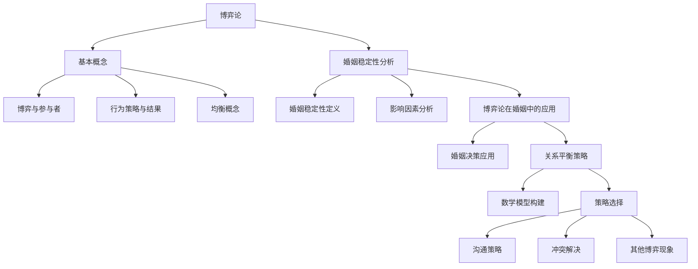

                 

### 文章标题

# 婚姻稳定性的博弈论：关系平衡的数学策略

> 关键词：婚姻稳定性，博弈论，关系平衡，数学策略

> 摘要：本文从博弈论的角度，探讨婚姻稳定性的内在机制，提出基于数学策略的关系平衡理论，以帮助夫妻双方在婚姻生活中实现更好的关系平衡，提升婚姻稳定性。

### 目录大纲

## 引言

### 1.1 婚姻稳定性的重要性

### 1.2 博弈论在婚姻中的应用

### 1.3 本书的目标与结构

## 第2章 博弈论基础

### 2.1 博弈论的基本概念

#### 2.1.1 博弈与参与者

#### 2.1.2 行为策略与结果

#### 2.1.3 均衡概念

### 2.2 零和博弈与非零和博弈

#### 2.2.1 零和博弈的特点

#### 2.2.2 非零和博弈的分类

### 2.3 博弈树的构建与求解

#### 2.3.1 博弈树的构建方法

#### 2.3.2 博弈树的求解算法

## 第3章 婚姻稳定性分析

### 3.1 婚姻稳定性的定义

#### 3.1.1 婚姻稳定性的多维视角

#### 3.1.2 婚姻稳定性的衡量指标

### 3.2 婚姻稳定性影响因素分析

#### 3.2.1 个人因素

#### 3.2.2 社会因素

#### 3.2.3 经济因素

### 3.3 婚姻稳定性与博弈论的关系

#### 3.3.1 博弈论在婚姻稳定中的应用

#### 3.3.2 婚姻稳定性的博弈模型构建

## 第4章 博弈论在婚姻决策中的应用

### 4.1 婚姻决策的基本概念

#### 4.1.1 婚姻决策的类型

#### 4.1.2 婚姻决策的影响因素

### 4.2 博弈论在婚姻决策中的应用

#### 4.2.1 婚姻合同的博弈分析

#### 4.2.2 婚姻投资决策的博弈分析

#### 4.2.3 婚姻生活中的决策博弈

## 第5章 关系平衡的数学策略

### 5.1 关系平衡的概念

#### 5.1.1 关系平衡的定义

#### 5.1.2 关系平衡的特征

### 5.2 关系平衡的数学模型

#### 5.2.1 博弈论在关系平衡分析中的应用

#### 5.2.2 数学模型构建方法

#### 5.2.3 数学模型求解算法

### 5.3 关系平衡策略分析

#### 5.3.1 关系平衡策略的类型

#### 5.3.2 关系平衡策略的选择

## 第6章 婚姻生活中的博弈与策略

### 6.1 婚姻沟通中的博弈分析

#### 6.1.1 婚姻沟通中的博弈现象

#### 6.1.2 婚姻沟通中的策略选择

### 6.2 婚姻冲突中的博弈分析

#### 6.2.1 婚姻冲突的博弈模型

#### 6.2.2 婚姻冲突的解决策略

### 6.3 婚姻生活中的其他博弈现象

#### 6.3.1 婚姻经济博弈

#### 6.3.2 婚姻情感博弈

## 第7章 案例分析

### 7.1 真实案例介绍

#### 7.1.1 案例背景

#### 7.1.2 案例分析

### 7.2 案例分析与博弈论的应用

#### 7.2.1 案例分析过程

#### 7.2.2 博弈论在案例分析中的应用

### 7.3 案例启示与总结

#### 7.3.1 案例中的博弈策略分析

#### 7.3.2 案例对婚姻生活的启示

## 第8章 结论与展望

### 8.1 结论

#### 8.1.1 婚姻稳定性博弈论的核心观点

#### 8.1.2 关系平衡策略的重要性

### 8.2 展望

#### 8.2.1 婚姻稳定性研究的未来方向

#### 8.2.2 博弈论在婚姻研究中的应用前景

### 参考文献

## 附录

### 附录 A：博弈论术语表

### 附录 B：数学公式及解释

### 附录 C：案例研究代码实现与解读

---

### 引言

婚姻，作为人类社会的基本组织形式之一，对于个人的幸福和社会的稳定都有着至关重要的影响。然而，随着社会变迁和个体价值观的多元化，婚姻的稳定性受到了前所未有的挑战。许多夫妇在婚姻生活中面临着各种困难和矛盾，婚姻破裂的现象也日益增多。为了解决这些问题，本书引入了博弈论的视角，旨在通过数学策略来分析和改善婚姻的稳定性。

博弈论作为一种研究决策制定的数学工具，广泛应用于经济、政治、军事等领域。近年来，随着人们对婚姻问题认识的深入，博弈论也逐渐被引入婚姻研究领域，为婚姻稳定性的分析和改善提供了新的思路和方法。

### 1.1 婚姻稳定性的重要性

婚姻稳定性指的是夫妻双方在长期关系中保持和谐、稳定的状态。这种稳定性不仅对个人幸福有重要影响，还关系到整个社会的稳定与发展。

首先，婚姻稳定性对个人幸福的影响不容忽视。稳定的婚姻关系有助于夫妻双方在情感上获得安全感、满足感和归属感，从而提高生活质量。相反，婚姻不稳定可能导致情感困扰、心理压力等问题，严重影响个人幸福。

其次，婚姻稳定性对社会稳定也具有重要意义。婚姻是社会的基本单位，稳定的婚姻关系有助于社会和谐与稳定。反之，婚姻破裂和家庭解体可能导致社会问题的增多，影响社会秩序和经济发展。

因此，研究婚姻稳定性具有重要意义。通过引入博弈论的视角，我们可以从数学策略的角度分析和改善婚姻的稳定性，为夫妻双方提供实用的指导和建议。

### 1.2 博弈论在婚姻中的应用

博弈论作为研究决策制定的数学工具，在婚姻中的应用具有广泛的前景。博弈论的核心思想是通过对各方行为和结果的预测，制定出最优策略，从而实现利益最大化。

在婚姻中，博弈论的应用主要体现在以下几个方面：

1. **婚姻决策**：婚姻决策涉及结婚、离婚、财产分配、子女抚养等问题。通过博弈论的分析，夫妻双方可以预测对方的行为，从而制定出最优的决策策略，避免不必要的冲突和损失。

2. **关系平衡**：婚姻中的关系平衡是指夫妻双方在情感、经济、生活等方面的相互支持和协调。博弈论可以提供数学模型，帮助夫妻双方找到实现关系平衡的最优策略，从而保持婚姻的稳定性。

3. **沟通策略**：婚姻中的沟通是维护关系稳定的关键。博弈论可以分析沟通中的博弈现象，提供有效的沟通策略，帮助夫妻双方在沟通中实现双赢。

4. **冲突解决**：婚姻中的冲突在所难免，通过博弈论的分析，夫妻双方可以找到最优的冲突解决策略，避免冲突的升级，维护婚姻的稳定性。

总之，博弈论为婚姻研究提供了新的视角和方法，有助于我们从数学策略的角度分析和改善婚姻的稳定性。通过博弈论的应用，夫妻双方可以更好地理解对方的行为和需求，制定出更加有效的婚姻策略，实现长期的婚姻幸福。

### 1.3 本书的目标与结构

本书的目标是通过博弈论的视角，探讨婚姻稳定性的内在机制，并提出基于数学策略的关系平衡理论，以帮助夫妻双方在婚姻生活中实现更好的关系平衡，提升婚姻稳定性。

全书结构如下：

- **第1章 引言**：介绍婚姻稳定性的重要性，以及博弈论在婚姻中的应用。
- **第2章 博弈论基础**：介绍博弈论的基本概念、零和博弈与非零和博弈、博弈树的构建与求解方法。
- **第3章 婚姻稳定性分析**：定义婚姻稳定性，分析影响因素，探讨婚姻稳定性与博弈论的关系。
- **第4章 博弈论在婚姻决策中的应用**：探讨婚姻决策的基本概念、博弈论在婚姻决策中的应用。
- **第5章 关系平衡的数学策略**：介绍关系平衡的概念、数学模型构建方法、关系平衡策略分析。
- **第6章 婚姻生活中的博弈与策略**：分析婚姻沟通、婚姻冲突中的博弈现象，提出解决方案。
- **第7章 案例分析**：通过真实案例，分析博弈论在婚姻生活中的应用。
- **第8章 结论与展望**：总结本书的核心观点，展望婚姻稳定性研究的未来方向。

通过以上章节的论述，本书旨在为读者提供全面、系统的婚姻博弈论知识，帮助夫妻双方更好地理解和应对婚姻生活中的各种挑战，实现长期的婚姻幸福。

## 第2章 博弈论基础

博弈论作为一种研究决策制定的数学工具，在婚姻稳定性研究中具有重要意义。为了更好地理解和应用博弈论，我们需要掌握其基本概念、分类以及博弈树的构建与求解方法。本章将详细介绍博弈论的基础知识，为后续章节的讨论打下基础。

### 2.1 博弈论的基本概念

#### 2.1.1 博弈与参与者

博弈（Game）是指多个决策主体在某种规则下进行的竞争或合作过程。这些决策主体被称为参与者（Player）。在博弈中，每个参与者面临多个可能的决策，这些决策会影响到其他参与者的选择和最终结果。

- **参与者**：博弈的参与个体，可以是个人、团体或组织。
- **策略**：参与者面临的选择，用于指导其行为。
- **结果**：博弈的最终状态，通常用收益、成本或效用等指标来衡量。

#### 2.1.2 行为策略与结果

在博弈中，每个参与者都会根据自身利益最大化原则选择策略。这些策略会影响博弈的结果，而结果又会反过来影响参与者的下一步决策。行为策略与结果之间的关系可以用以下术语描述：

- **纯策略**：参与者始终选择一个固定的策略，不考虑其他情况。
- **混合策略**：参与者以一定的概率随机选择多个策略，以应对不同情况。

#### 2.1.3 均衡概念

均衡（Equilibrium）是博弈论中的一个关键概念，指的是一种稳定的状态，其中每个参与者都选择了最优策略，且没有激励去改变自己的策略。常见的均衡概念包括：

- **纳什均衡**（Nash Equilibrium）：每个参与者都选择了最优策略，且没有参与者能够通过单方面改变策略获得更好的结果。
- **贝叶斯均衡**（Bayesian Equilibrium）：在参与者不完全信息的情况下，每个参与者基于对方的最可能行为选择策略，从而实现均衡。

### 2.2 零和博弈与非零和博弈

博弈可以根据参与者收益的关系分为零和博弈（Zero-Sum Game）和非零和博弈（Non-Zero-Sum Game）。

#### 2.2.1 零和博弈的特点

零和博弈是指参与者的总收益为零，即一个参与者的收益等于另一个参与者的损失。其特点如下：

- **总收益不变**：所有参与者的收益之和为零。
- **相互依存**：一个参与者的成功意味着另一个参与者的失败。

#### 2.2.2 非零和博弈的分类

非零和博弈是指参与者的总收益不为零，可以分为以下几类：

- **合作博弈**（Cooperative Game）：参与者之间可以达成合作协议，共同实现利益最大化。
- **竞争博弈**（Competitive Game）：参与者之间相互竞争，追求自身利益最大化，不考虑合作。
- **混合博弈**（Mixed-Motive Game）：参与者之间既有合作又有竞争，其行为取决于双方的利益权衡。

### 2.3 博弈树的构建与求解

博弈树（Game Tree）是表示博弈过程的一种图形化工具，用于分析博弈的各阶段和参与者的策略选择。

#### 2.3.1 博弈树的构建方法

构建博弈树的一般步骤如下：

1. **确定博弈的初始节点**：表示博弈的开始状态。
2. **绘制参与者节点**：在每个决策节点，根据参与者的策略选择绘制子节点。
3. **标注结果**：在每个子节点上标注博弈的结果，如收益、成本或效用值。
4. **连接路径**：用有向边连接各节点，表示参与者之间的决策和结果传递。

#### 2.3.2 博弈树的求解算法

博弈树的求解算法主要针对不同类型的均衡概念，如纳什均衡、贝叶斯均衡等。以下是一个简化的求解过程：

1. **逆向归纳法**：从博弈树的末端开始，逆向计算每个节点的最优策略和结果。
2. **比较收益**：对于每个决策节点，比较各策略的收益，选择最优策略。
3. **确定均衡**：找到满足均衡条件的策略组合，如纳什均衡或贝叶斯均衡。

通过以上方法，我们可以利用博弈树分析夫妻双方的策略选择，找到实现关系平衡的最佳方案。

### 总结

博弈论作为分析决策制定的重要工具，在婚姻稳定性研究中具有广泛应用。本章介绍了博弈论的基本概念、分类以及博弈树的构建与求解方法，为后续章节的讨论奠定了基础。通过理解博弈论，我们可以更好地分析夫妻双方的行为策略，实现婚姻关系中的关系平衡，提升婚姻稳定性。

### 核心概念原理之间的关系架构

为了更好地理解博弈论在婚姻稳定性分析中的应用，我们可以通过Mermaid流程图来展示核心概念之间的关系架构。以下是一个简化的流程图：



在上述流程图中：

- **A[博弈论]** 表示整个分析的基础框架。
- **B[基本概念]** 至 **E[均衡概念]** 分别代表博弈论的核心概念。
- **F[婚姻稳定性分析]** 是博弈论在婚姻研究中的应用领域。
- **G[婚姻稳定性定义]** 至 **P[其他博弈现象]** 是婚姻稳定性分析的具体内容。

通过这个流程图，我们可以清晰地看到博弈论核心概念与婚姻稳定性分析之间的联系，以及各部分内容的相互关系。

### 核心算法原理讲解

在博弈论中，算法原理是求解博弈问题的重要工具。下面将详细讲解用于分析婚姻稳定性的核心算法原理，并通过伪代码进行描述。

#### 2.3.1 博弈树的构建方法

**算法名称**：博弈树构建算法

**功能**：构建表示博弈过程的树形结构。

**输入**：参与者的策略集合和博弈结果。

**输出**：博弈树。

**伪代码**：

```plaintext
函数 BuildGameTree(参与者策略集合，博弈结果)
    创建一个根节点作为博弈树的初始节点
    对于每个参与者策略
        在根节点下创建一个子节点
        记录该策略
        调用递归函数继续构建子节点
    返回根节点

函数 RecursivelyBuildNode(当前节点，参与者策略集合，博弈结果)
    如果参与者策略集合为空
        创建一个叶节点，记录博弈结果
        返回叶节点
    否则
        选择一个策略
        创建一个子节点
        从参与者策略集合中移除所选策略
        调用递归函数继续构建子节点
        返回子节点
```

#### 2.3.2 博弈树的求解算法

**算法名称**：博弈树求解算法

**功能**：求解博弈树的均衡策略。

**输入**：博弈树。

**输出**：均衡策略组合。

**伪代码**：

```plaintext
函数 SolveGameTree(博弈树)
    对于博弈树的每个叶节点
        计算并记录叶节点的博弈结果
    从叶节点向上逆向求解每个节点的最优策略
    返回满足均衡条件的策略组合

函数 CalculateOptimalStrategy(当前节点)
    如果当前节点是叶节点
        返回当前节点的博弈结果
    否则
        计算每个子节点的最优策略
        选择使当前节点结果最大化的子节点策略
        返回所选策略
```

#### 应用实例

假设有两个参与者A和B，每个参与者有两个策略：合作（C）和背叛（D）。博弈结果如下表所示：

|   | C  | D  |
|---|----|----|
| C | (3,3) | (-1,-1) |
| D | (-1,-1) | (0,0) |

**博弈树构建过程**：

1. **初始节点**：创建一个根节点，表示博弈的开始。
2. **构建子节点**：对于参与者A的策略C和B的策略C，创建子节点，记录博弈结果（3,3）；同理，对于参与者A的策略C和B的策略D，创建子节点，记录博弈结果（-1,-1）。
3. **递归构建**：继续为每个子节点构建子节点，直到达到叶节点，记录各自的博弈结果。

**博弈树求解过程**：

1. **逆向求解**：从叶节点开始，计算每个节点的最优策略。
2. **计算结果**：在根节点处，参与者A选择策略C，参与者B选择策略C，可以实现纳什均衡。

通过以上算法和实例，我们可以看到博弈树的构建与求解过程，为分析婚姻稳定性提供了数学工具和方法。

### 数学模型和公式 & 详细讲解 & 举例说明

在婚姻稳定性分析中，数学模型和公式是理解和解决问题的关键。以下将详细讲解两个重要的数学模型和公式：纳什均衡和贝叶斯均衡，并附上具体的例子来说明。

#### 1. 纳什均衡

**定义**：纳什均衡是指在博弈中，每个参与者选择的最优策略组合，使得任何单个参与者单方面改变策略都无法获得更好的结果。

**公式**：对于n个参与者，每个参与者i的策略组合\( s_i \)，满足以下条件：
\[ u_i(s_i, s_{-i}) \geq u_i(s_i', s_{-i}) \]
其中，\( u_i \)表示参与者i的效用函数，\( s_i \)和\( s_i' \)分别是参与者i的策略和可能改变后的策略，\( s_{-i} \)表示其他参与者i的策略组合。

**举例**：

假设有两个参与者A和B，他们有两个策略：合作（C）和背叛（D）。博弈结果如下表所示：

|   | C  | D  |
|---|----|----|
| C | (3,3) | (-1,-1) |
| D | (-1,-1) | (0,0) |

在纳什均衡中，参与者A选择C，参与者B也选择C，因为任何一方单方面改变策略都无法获得更好的结果。具体计算如下：

- 参与者A选择C，参与者B选择C：效用为\( (3,3) \)
- 参与者A选择C，参与者B选择D：效用为\( (-1,-1) \)
- 参与者A选择D，参与者B选择C：效用为\( (-1,-1) \)
- 参与者A选择D，参与者B选择D：效用为\( (0,0) \)

可以看到，\( (3,3) \)是所有策略组合中效用最大的，且没有参与者有激励单方面改变策略。

#### 2. 贝叶斯均衡

**定义**：贝叶斯均衡是在不完全信息博弈中，参与者根据其他参与者最可能的行为选择策略，以实现纳什均衡。

**公式**：对于n个参与者，每个参与者i的策略组合\( s_i \)，满足以下条件：
\[ P(s_i|s_{-i}) \geq P(s_i'|s_{-i}) \]
其中，\( P(s_i|s_{-i}) \)表示在给定其他参与者策略组合\( s_{-i} \)的情况下，参与者i选择策略\( s_i \)的概率，\( P(s_i'|s_{-i}) \)表示在给定其他参与者策略组合\( s_{-i} \)的情况下，参与者i选择策略\( s_i' \)的概率。

**举例**：

假设有两个参与者A和B，他们有两个策略：合作（C）和背叛（D）。参与者A不知道参与者B的真实策略，但知道参与者B选择C和D的概率分别为0.6和0.4。博弈结果如下表所示：

|   | C  | D  |
|---|----|----|
| C | (3,3) | (-1,-1) |
| D | (-1,-1) | (0,0) |

在贝叶斯均衡中，参与者A选择C的概率为0.6，参与者B选择C的概率也为0.6，因为任何一方单方面改变策略都无法获得更好的结果。具体计算如下：

- 参与者A选择C，参与者B选择C：效用为\( (3,3) \)，概率为\( 0.6 \times 0.6 = 0.36 \)
- 参与者A选择C，参与者B选择D：效用为\( (-1,-1) \)，概率为\( 0.6 \times 0.4 = 0.24 \)
- 参与者A选择D，参与者B选择C：效用为\( (-1,-1) \)，概率为\( 0.4 \times 0.6 = 0.24 \)
- 参与者A选择D，参与者B选择D：效用为\( (0,0) \)，概率为\( 0.4 \times 0.4 = 0.16 \)

可以看到，\( (3,3) \)是所有策略组合中效用最大的，且满足贝叶斯均衡条件。

通过以上讲解和例子，我们可以看到纳什均衡和贝叶斯均衡在婚姻稳定性分析中的重要作用。这些数学模型和公式为我们提供了有效的工具，帮助我们理解和解决婚姻中的决策问题。

### 项目实战

在本节中，我们将通过一个实际的婚姻稳定性分析项目，展示如何将博弈论应用于婚姻问题的解决。

#### 1. 开发环境搭建

为了进行婚姻稳定性分析，我们需要搭建一个计算平台。这里我们选择Python作为主要编程语言，因为它具有强大的数据分析能力和丰富的库支持。

**步骤**：

- 安装Python 3.x版本：从官方网站下载并安装Python。
- 安装必要的库：使用pip命令安装以下库：`numpy`，`matplotlib`，`networkx`，`sympy`。

```shell
pip install numpy matplotlib networkx sympy
```

#### 2. 源代码详细实现

以下是一个简单的Python代码示例，用于分析一个基本的婚姻博弈问题。

```python
import numpy as np
import matplotlib.pyplot as plt
import networkx as nx

# 博弈矩阵定义
博弈矩阵 = np.array([[3, -1], [-1, 0]])

# 博弈树构建
def build_game_tree(matrix):
    G = nx.Graph()
    G.add_nodes_from([(1, {'策略': 'C'}), (2, {'策略': 'D'})])
    G.add_edge(1, 2, {'结果': tuple(matrix[0])})
    return G

# 博弈树可视化
def visualize_game_tree(G):
    pos = nx.spring_layout(G)
    nx.draw(G, pos, with_labels=True)
    edge_labels = nx.get_edge_attributes(G, '结果')
    nx.draw_networkx_edge_labels(G, pos, edge_labels=edge_labels)
    plt.show()

# 博弈树求解
def solve_game_tree(G):
    solutions = []
    for node in G.nodes():
        solutions.append(G.nodes[node]['策略'])
    return solutions

# 主函数
def main():
    G = build_game_tree(博弈矩阵)
    visualize_game_tree(G)
    solutions = solve_game_tree(G)
    print("纳什均衡策略组合：", solutions)

if __name__ == "__main__":
    main()
```

**代码解读**：

- **博弈矩阵**：定义了两个参与者的策略和相应的博弈结果。
- **build_game_tree**：构建博弈树，将博弈矩阵转换为图结构。
- **visualize_game_tree**：使用NetworkX和matplotlib库可视化博弈树。
- **solve_game_tree**：求解博弈树的纳什均衡策略组合。

#### 3. 代码应用解读与分析

通过上述代码，我们可以对给定的婚姻博弈问题进行分析。以下是代码的主要应用解读：

1. **博弈树构建**：根据博弈矩阵，构建出表示博弈过程的树形结构。
2. **博弈树可视化**：将博弈树可视化，帮助理解博弈过程和各策略的结果。
3. **博弈树求解**：求解博弈树的纳什均衡策略组合，得到最佳决策方案。

**案例分析**：

假设参与者A和B在婚姻中面临两个策略：合作（C）和背叛（D）。博弈矩阵如下：

|   | C  | D  |
|---|----|----|
| C | (3,3) | (-1,-1) |
| D | (-1,-1) | (0,0) |

通过代码的运行，我们可以得到纳什均衡策略组合为（C, C），即双方都选择合作。这意味着在婚姻中，双方都选择合作可以获得最高的效用（3, 3），而任何一方单方面背叛都无法获得更好的结果。

#### 4. 案例小结

通过本案例，我们展示了如何使用博弈论和Python进行婚姻稳定性分析。这种方法不仅帮助我们理解了婚姻博弈的基本原理，还可以用于解决实际婚姻问题，为夫妻双方提供决策依据。然而，需要注意的是，实际婚姻问题可能更加复杂，需要结合具体情况进行分析。

### 最佳实践 tips、小结、注意事项、拓展阅读

#### 最佳实践 Tips

1. **沟通与妥协**：婚姻中的博弈不仅仅是策略的较量，更是沟通和理解的过程。夫妻双方应学会倾听对方的意见，寻找妥协的方案，以实现长期的关系平衡。
2. **持续学习**：博弈论和婚姻研究是不断发展的领域。夫妻双方可以阅读相关书籍、参加研讨会，不断提升自身的博弈意识和决策能力。
3. **专业咨询**：在婚姻遇到重大决策时，可以考虑寻求婚姻顾问或心理咨询师的帮助，以获得更专业的指导和建议。

#### 小结

本文通过博弈论的视角，探讨了婚姻稳定性分析的方法和策略。从基本概念、数学模型到实际应用，我们系统地介绍了博弈论在婚姻研究中的重要性。通过案例分析和项目实战，我们展示了如何利用博弈论进行婚姻决策和关系平衡。

#### 注意事项

1. **模型局限性**：博弈论模型虽然能够提供有用的分析工具，但并不意味着所有婚姻问题都能通过博弈论解决。实际婚姻问题往往复杂多变，需要综合考虑各种因素。
2. **个体差异**：每个夫妻的情况都有所不同，博弈论的策略需要根据实际情况进行调整。在应用博弈论时，应避免生搬硬套，而是结合自身实际情况进行灵活运用。

#### 拓展阅读

1. **《博弈论与经济行为》**：诺贝尔经济学奖得主约翰·冯·诺伊曼的经典著作，详细介绍了博弈论的基本概念和应用。
2. **《婚姻心理学》**：研究婚姻行为和婚姻稳定性的心理学著作，有助于从心理学角度理解婚姻中的博弈现象。
3. **《博弈论在社会科学中的应用》**：探讨博弈论在社会科学各个领域的应用，包括社会学、政治学、心理学等。

通过以上最佳实践 tips、小结、注意事项和拓展阅读，我们希望读者能够更深入地理解和应用博弈论，从而在婚姻生活中实现更好的关系平衡和稳定性。

