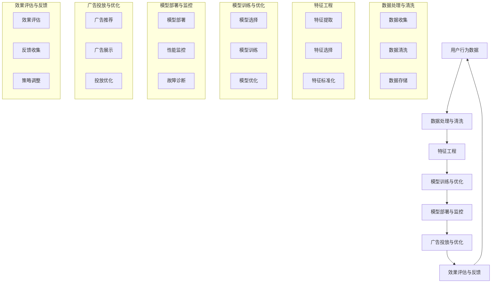

                 

# 《字节跳动2024校招广告算法专家面试指南》

> 关键词：广告算法、推荐系统、协同过滤、深度学习、强化学习

> 摘要：本文针对字节跳动2024校招广告算法专家岗位，详细介绍了广告算法的基本概念、原理和实践方法。通过分析广告算法的核心要素和目标，以及不同类型的广告算法，帮助应聘者深入理解广告系统的运作机制，掌握面试所需的广告算法知识和技能。

## 第一部分：广告算法基础知识

### 第1章：广告算法概述

广告算法是现代互联网广告投放的核心技术，通过对用户行为数据、上下文信息等因素进行分析和处理，实现精准的广告推荐和投放。本章将介绍广告算法的基本概念、发展历程、核心要素以及目标。

### 第2章：广告算法原理

广告算法的原理主要包括基于用户行为的广告算法、基于上下文的广告算法和基于机器学习的广告算法。本章将详细介绍这些广告算法的工作原理、优缺点以及适用场景。

### 第3章：广告算法实践

广告算法实践包括数据处理流程、特征工程、模型训练与优化、模型部署与监控等环节。本章将结合实际案例，详细讲解广告算法实践中的关键技术和方法。

## 第二部分：核心算法详解

### 第4章：基于协同过滤的推荐算法

协同过滤是广告算法中常用的一种推荐算法，本章将介绍协同过滤算法的原理、评分矩阵分解、基于用户和物品的协同过滤算法等。

### 第5章：基于内容的推荐算法

基于内容的推荐算法通过分析用户的历史行为和内容特征，实现精准的推荐。本章将介绍基于内容的推荐算法原理、文本特征提取、模糊匹配与语义相似度计算等。

### 第6章：深度学习在广告中的应用

深度学习在广告算法中具有重要的应用价值，本章将介绍深度学习基础、卷积神经网络和循环神经网络在广告中的应用。

### 第7章：强化学习在广告中的应用

强化学习是一种通过与环境交互进行决策优化的机器学习算法，本章将介绍强化学习基础、Q-Learning算法和SARSA算法，以及广告投放中的强化学习应用。

### 第8章：广告系统性能优化

广告系统性能优化是提高广告投放效果的关键环节，本章将介绍性能优化目标、策略和实战方法，以及性能监控与预警。

## 第三部分：项目实战

### 第9章：广告系统架构设计与实战

本章将介绍广告系统架构设计、数据采集与处理、特征工程与模型训练、模型部署与监控等实战内容。

### 第10章：实时广告投放优化实战

实时广告投放优化是广告系统中的重要环节，本章将介绍实时广告投放流程、策略和系统实现，以及效果评估。

### 第11章：广告系统性能优化实战

本章将介绍广告系统性能优化实战，包括性能瓶颈分析、优化方案和实战方法，以及效果评估。

### 第12章：广告系统安全与合规

广告系统的安全与合规是保障用户隐私和广告效果的重要保障，本章将介绍广告系统安全概述、数据保护、合规要求和实践方法。

## 附录

### 附录 A：广告算法资源与工具

本章将介绍开源广告算法库、广告算法相关论文和学习资料推荐，为读者提供丰富的学习和实践资源。

### 附录 B：广告算法流程图

本章将使用Mermaid绘制广告算法流程图，帮助读者更直观地理解广告算法的运作过程。

### 附录 C：深度学习算法伪代码

本章将使用Python伪代码展示深度学习算法的实现过程，为读者提供代码实现的参考。

## 作者信息

作者：AI天才研究院/AI Genius Institute & 禅与计算机程序设计艺术 /Zen And The Art of Computer Programming## 第一部分：广告算法基础知识

### 第1章：广告算法概述

广告算法是现代互联网广告投放的核心技术，通过对用户行为数据、上下文信息等因素进行分析和处理，实现精准的广告推荐和投放。本章将介绍广告算法的基本概念、发展历程、核心要素以及目标。

#### 1.1 广告系统基本概念

广告系统是指用于广告投放、广告效果监测和广告优化的软件系统。其主要功能包括广告投放策略制定、广告投放渠道管理、广告投放效果监控等。广告系统通常由以下几个核心组件组成：

1. **广告需求方**：广告主或广告代理公司，负责制定广告投放计划和预算，选择合适的广告渠道进行投放。
2. **广告投放平台**：如搜索引擎、社交媒体、新闻网站等，为广告主提供广告投放服务，负责广告展示和效果监控。
3. **用户**：广告的目标受众，其行为数据和行为特征是广告算法分析和优化的重要依据。
4. **广告算法**：负责根据用户行为数据、上下文信息等，实现广告推荐和投放优化。

#### 1.2 广告算法的发展历程

广告算法的发展历程可以追溯到互联网广告的早期。以下是广告算法发展的几个重要阶段：

1. **展示广告**：最早期的广告形式，以页面上的图像、文字等形式展示给用户。
2. **点击广告**：根据用户的点击行为，评估广告效果，优化广告投放策略。
3. **行为广告**：根据用户的历史行为数据，进行广告推荐和投放，提高广告的精准度。
4. **个性化广告**：利用机器学习和深度学习等技术，对用户进行精准定位，实现广告的个性化投放。
5. **实时广告**：通过实时数据分析和处理，实现广告的实时推荐和投放，提高广告效果。

#### 1.3 广告算法的核心要素

广告算法的核心要素包括用户数据、上下文信息、广告特征和广告目标等。以下是这些要素的具体介绍：

1. **用户数据**：包括用户的基本信息（如年龄、性别、地理位置等）、用户行为数据（如浏览历史、搜索历史、购买记录等）和用户兴趣数据（如兴趣标签、偏好设置等）。
2. **上下文信息**：指广告展示的上下文环境，包括广告展示的时间、位置、设备类型、页面内容等。
3. **广告特征**：指广告本身的特点，如广告类型、广告主、广告内容、广告价格等。
4. **广告目标**：指广告主希望通过广告投放实现的目标，如提高品牌知名度、增加产品销量、提升用户活跃度等。

#### 1.4 广告算法的目标

广告算法的目标是提高广告的投放效果，实现广告价值的最大化。具体包括以下几个方面：

1. **精准推荐**：根据用户数据和上下文信息，为用户推荐最相关的广告，提高广告的点击率和转化率。
2. **优化投放**：通过分析广告投放效果，调整广告投放策略，实现广告成本的优化。
3. **提升用户体验**：通过个性化广告推荐，提高用户的满意度和忠诚度，降低用户流失率。
4. **数据驱动**：利用大数据和机器学习技术，实现广告投放的智能化和自动化，降低人力成本。

### 总结

广告算法是现代互联网广告投放的重要技术，通过分析用户数据、上下文信息和广告特征，实现广告的精准推荐和优化投放。了解广告算法的基本概念、发展历程、核心要素和目标，对于广告算法专家的面试和职业发展具有重要意义。

#### 1.1 广告系统基本概念

广告系统是指用于广告投放、广告效果监测和广告优化的软件系统。其主要功能包括广告投放策略制定、广告投放渠道管理、广告投放效果监控等。广告系统通常由以下几个核心组件组成：

1. **广告需求方**：广告主或广告代理公司，负责制定广告投放计划和预算，选择合适的广告渠道进行投放。
2. **广告投放平台**：如搜索引擎、社交媒体、新闻网站等，为广告主提供广告投放服务，负责广告展示和效果监控。
3. **用户**：广告的目标受众，其行为数据和行为特征是广告算法分析和优化的重要依据。
4. **广告算法**：负责根据用户行为数据、上下文信息等，实现广告推荐和投放优化。

#### 1.2 广告算法的发展历程

广告算法的发展历程可以追溯到互联网广告的早期。以下是广告算法发展的几个重要阶段：

1. **展示广告**：最早期的广告形式，以页面上的图像、文字等形式展示给用户。
2. **点击广告**：根据用户的点击行为，评估广告效果，优化广告投放策略。
3. **行为广告**：根据用户的历史行为数据，进行广告推荐和投放，提高广告的精准度。
4. **个性化广告**：利用机器学习和深度学习等技术，对用户进行精准定位，实现广告的个性化投放。
5. **实时广告**：通过实时数据分析和处理，实现广告的实时推荐和投放，提高广告效果。

#### 1.3 广告算法的核心要素

广告算法的核心要素包括用户数据、上下文信息、广告特征和广告目标等。以下是这些要素的具体介绍：

1. **用户数据**：包括用户的基本信息（如年龄、性别、地理位置等）、用户行为数据（如浏览历史、搜索历史、购买记录等）和用户兴趣数据（如兴趣标签、偏好设置等）。
2. **上下文信息**：指广告展示的上下文环境，包括广告展示的时间、位置、设备类型、页面内容等。
3. **广告特征**：指广告本身的特点，如广告类型、广告主、广告内容、广告价格等。
4. **广告目标**：指广告主希望通过广告投放实现的目标，如提高品牌知名度、增加产品销量、提升用户活跃度等。

#### 1.4 广告算法的目标

广告算法的目标是提高广告的投放效果，实现广告价值的最大化。具体包括以下几个方面：

1. **精准推荐**：根据用户数据和上下文信息，为用户推荐最相关的广告，提高广告的点击率和转化率。
2. **优化投放**：通过分析广告投放效果，调整广告投放策略，实现广告成本的优化。
3. **提升用户体验**：通过个性化广告推荐，提高用户的满意度和忠诚度，降低用户流失率。
4. **数据驱动**：利用大数据和机器学习技术，实现广告投放的智能化和自动化，降低人力成本。

### 总结

广告算法是现代互联网广告投放的重要技术，通过分析用户数据、上下文信息和广告特征，实现广告的精准推荐和优化投放。了解广告算法的基本概念、发展历程、核心要素和目标，对于广告算法专家的面试和职业发展具有重要意义。

### 第2章：广告算法原理

广告算法的原理是广告系统实现精准推荐和优化投放的基础。本章将详细介绍三种常见的广告算法：基于用户行为的广告算法、基于上下文的广告算法和基于机器学习的广告算法，并分析这些算法的优缺点和适用场景。

#### 2.1 基于用户行为的广告算法

基于用户行为的广告算法是一种利用用户历史行为数据进行广告推荐的方法。其核心思想是根据用户的浏览历史、搜索历史、购买记录等行为数据，分析用户的兴趣和行为模式，从而为用户推荐最相关的广告。

1. **工作原理**：
   - 收集用户行为数据：包括用户的浏览历史、搜索历史、购买记录等。
   - 分析用户行为：利用统计分析和机器学习技术，分析用户的兴趣和行为模式。
   - 广告推荐：根据用户的行为模式和广告特征，为用户推荐最相关的广告。

2. **优缺点**：
   - 优点：精准度高，可以根据用户的个性化需求进行广告推荐，提高广告的点击率和转化率。
   - 缺点：依赖于用户行为数据，数据缺失或质量低下会影响算法效果；用户行为数据的变化性较大，需要实时更新和维护。

3. **适用场景**：适合于电商、社交媒体等平台，通过对用户行为数据的深入挖掘，实现个性化的广告推荐。

#### 2.2 基于上下文的广告算法

基于上下文的广告算法是一种利用广告展示上下文环境进行广告推荐的方法。上下文环境包括广告展示的时间、位置、设备类型、页面内容等。该算法的核心思想是根据广告展示的上下文环境，为用户推荐最相关的广告。

1. **工作原理**：
   - 收集上下文信息：包括广告展示的时间、位置、设备类型、页面内容等。
   - 分析上下文环境：利用自然语言处理、图像识别等技术，分析上下文环境的相关性和用户兴趣。
   - 广告推荐：根据上下文环境和广告特征，为用户推荐最相关的广告。

2. **优缺点**：
   - 优点：受用户行为数据的影响较小，适用于实时广告推荐和跨平台广告推荐。
   - 缺点：上下文信息的获取和处理成本较高，且上下文信息的变化性较大，需要不断调整和优化。

3. **适用场景**：适合于搜索引擎、新闻网站、视频平台等，通过分析广告展示的上下文环境，提高广告的投放效果。

#### 2.3 基于机器学习的广告算法

基于机器学习的广告算法是一种利用机器学习技术进行广告推荐的方法。其核心思想是通过学习用户数据和广告特征，建立预测模型，实现广告的精准推荐。

1. **工作原理**：
   - 数据预处理：对用户数据和广告特征进行清洗、归一化等处理。
   - 特征工程：提取用户和广告的特征，如用户兴趣标签、广告类型、价格等。
   - 模型训练：利用机器学习算法（如协同过滤、决策树、神经网络等），训练预测模型。
   - 广告推荐：根据预测模型，为用户推荐最相关的广告。

2. **优缺点**：
   - 优点：具有较高的预测精度，可以自动适应数据变化，提高广告的投放效果。
   - 缺点：算法复杂度较高，需要大量的计算资源和数据支持；模型训练和优化需要较长时间。

3. **适用场景**：适合于大型互联网公司，通过对海量用户数据和广告特征的学习，实现大规模的广告推荐。

### 总结

广告算法的原理包括基于用户行为的广告算法、基于上下文的广告算法和基于机器学习的广告算法。这些算法各有优缺点和适用场景，广告算法专家需要根据实际需求和场景选择合适的算法，并通过不断的优化和调整，实现广告的精准推荐和优化投放。

### 第3章：广告算法实践

广告算法实践是广告算法专家必备的技能，涉及到数据处理流程、特征工程、模型训练与优化、模型部署与监控等环节。本章将结合实际案例，详细讲解广告算法实践中的关键技术和方法。

#### 3.1 数据处理流程

数据处理流程是广告算法实践的基础，主要包括数据收集、数据清洗、数据存储和数据预处理等环节。

1. **数据收集**：广告算法需要收集大量的用户行为数据、广告特征数据等。数据来源包括网站日志、用户反馈、广告投放平台等。

2. **数据清洗**：对收集到的数据进行清洗，去除重复、缺失、异常等数据，保证数据质量。

3. **数据存储**：将清洗后的数据存储到数据库或数据仓库中，方便后续的数据查询和处理。

4. **数据预处理**：对数据进行归一化、标准化、缺失值填充等处理，为特征工程和模型训练做好准备。

#### 3.2 特征工程

特征工程是广告算法实践中的关键环节，通过提取用户和广告的特征，实现广告的精准推荐。

1. **用户特征**：包括用户的基本信息（如年龄、性别、地理位置等）、用户行为数据（如浏览历史、搜索历史、购买记录等）和用户兴趣数据（如兴趣标签、偏好设置等）。

2. **广告特征**：包括广告类型、广告主、广告内容、广告价格、广告展示位置等。

3. **特征提取**：利用自然语言处理、图像识别等技术，提取用户和广告的特征。

4. **特征选择**：通过特征选择算法（如信息增益、卡方检验等），筛选出对广告推荐最有影响力的特征。

#### 3.3 模型训练与优化

模型训练与优化是广告算法实践的核心，通过训练和优化机器学习模型，实现广告的精准推荐。

1. **模型选择**：根据广告算法的需求和特点，选择合适的机器学习模型（如协同过滤、决策树、神经网络等）。

2. **模型训练**：利用训练数据集，训练机器学习模型。

3. **模型优化**：通过交叉验证、网格搜索等方法，优化模型参数，提高模型性能。

4. **模型评估**：利用测试数据集，评估模型性能，选择最优模型。

#### 3.4 模型部署与监控

模型部署与监控是广告算法实践的最后一步，将训练好的模型部署到生产环境，并实时监控模型性能。

1. **模型部署**：将训练好的模型部署到服务器或云端，实现广告的实时推荐。

2. **性能监控**：监控模型在实时环境中的性能，如点击率、转化率、Q值等。

3. **故障诊断**：发现模型性能异常时，进行故障诊断和修复。

4. **模型更新**：根据用户需求和环境变化，定期更新模型，保持模型的稳定性和准确性。

### 实际案例

以下是一个实际案例，描述了广告算法实践的全过程：

1. **数据收集**：从网站日志中收集用户浏览历史、搜索历史等数据。

2. **数据清洗**：去除重复、缺失、异常数据，保证数据质量。

3. **数据存储**：将清洗后的数据存储到Hadoop HDFS中，方便后续的数据查询和处理。

4. **数据预处理**：对数据进行归一化、标准化处理，提取用户和广告的特征。

5. **特征工程**：利用自然语言处理技术，提取用户和广告的文本特征；利用图像识别技术，提取广告的图像特征。

6. **模型训练**：选择协同过滤算法，利用训练数据集，训练机器学习模型。

7. **模型优化**：通过交叉验证、网格搜索等方法，优化模型参数，提高模型性能。

8. **模型评估**：利用测试数据集，评估模型性能，选择最优模型。

9. **模型部署**：将训练好的模型部署到生产环境，实现广告的实时推荐。

10. **性能监控**：实时监控模型在实时环境中的性能，定期更新模型，保持模型的稳定性和准确性。

### 总结

广告算法实践是一个复杂的过程，涉及数据处理、特征工程、模型训练与优化、模型部署与监控等多个环节。通过实际案例，读者可以更好地理解广告算法实践的全过程，为成为一名优秀的广告算法专家奠定基础。

### 第4章：基于协同过滤的推荐算法

协同过滤（Collaborative Filtering）是推荐系统中常用的一种算法，它通过收集用户的历史行为数据，发现相似用户或相似物品，从而为用户推荐感兴趣的内容。本章将详细介绍协同过滤算法的原理、评分矩阵分解、基于用户和物品的协同过滤算法等内容。

#### 4.1 协同过滤算法原理

协同过滤算法的基本思想是，通过分析用户之间的相似性或物品之间的相似性，预测用户对未知物品的评分。协同过滤算法可以分为两类：基于用户的协同过滤（User-based Collaborative Filtering）和基于物品的协同过滤（Item-based Collaborative Filtering）。

1. **基于用户的协同过滤**：
   - **原理**：首先计算用户之间的相似度，然后找到与目标用户最相似的K个邻居用户，最后根据邻居用户的评分预测目标用户对未知物品的评分。
   - **相似度计算**：常用的相似度计算方法包括余弦相似度、皮尔逊相关系数、欧氏距离等。

2. **基于物品的协同过滤**：
   - **原理**：首先计算物品之间的相似度，然后找到与目标物品最相似的K个邻居物品，最后根据邻居物品的评分预测目标用户对未知物品的评分。
   - **相似度计算**：常用的相似度计算方法包括余弦相似度、Jaccard相似度、余弦相似度等。

#### 4.2 评分矩阵分解

评分矩阵分解（Rating Matrix Factorization）是一种常用的协同过滤算法，它通过将评分矩阵分解为用户特征矩阵和物品特征矩阵的乘积，从而预测用户对物品的评分。

1. **原理**：
   - **建模**：设用户集合为U，物品集合为V，用户u对物品v的评分为r<sub>uv</sub>。评分矩阵R可以表示为用户特征矩阵U和物品特征矩阵V的乘积：R = U * V。
   - **求解**：通过最小化误差平方和，求解用户特征矩阵U和物品特征矩阵V。

2. **算法流程**：
   - **初始化**：随机初始化用户特征矩阵U和物品特征矩阵V。
   - **更新**：对于每个用户u和物品v，更新用户特征向量u<sub>i</sub>和物品特征向量v<sub>j</sub>，使得预测评分与实际评分的误差最小。
   - **迭代**：重复更新过程，直到达到收敛条件。

3. **优化方法**：
   - **梯度下降**：通过计算梯度，更新用户特征矩阵U和物品特征矩阵V。
   - **交替最小化**：分别对用户特征矩阵U和物品特征矩阵V进行最小化，直到达到收敛条件。

#### 4.3 基于用户的协同过滤算法

基于用户的协同过滤算法通过计算用户之间的相似度，找到与目标用户最相似的邻居用户，然后根据邻居用户的评分预测目标用户对未知物品的评分。

1. **算法流程**：
   - **相似度计算**：计算目标用户u与所有其他用户之间的相似度，选择最相似的K个邻居用户。
   - **评分预测**：根据邻居用户的评分，预测目标用户对未知物品的评分。

2. **代码实现**（Python）：

```python
def cosine_similarity(r1, r2):
    # 计算两个评分向量的余弦相似度
    dot_product = np.dot(r1, r2)
    norm_r1 = np.linalg.norm(r1)
    norm_r2 = np.linalg.norm(r2)
    return dot_product / (norm_r1 * norm_r2)

def user_based_cf(R, user, k=5):
    # 基于用户的协同过滤
    similarities = {}
    for u in range(len(R)):
        if u == user:
            continue
        similarities[u] = cosine_similarity(R[user], R[u])
    # 找到最相似的K个用户
    neighbors = sorted(similarities.items(), key=lambda x: x[1], reverse=True)[:k]
    # 预测评分
    pred_score = sum(s * R[neighbor] for neighbor, s in neighbors) / sum(s for neighbor, s in neighbors)
    return pred_score
```

#### 4.4 基于物品的协同过滤算法

基于物品的协同过滤算法通过计算物品之间的相似度，找到与目标物品最相似的邻居物品，然后根据邻居物品的评分预测目标用户对未知物品的评分。

1. **算法流程**：
   - **相似度计算**：计算目标物品v与所有其他物品之间的相似度，选择最相似的K个邻居物品。
   - **评分预测**：根据邻居物品的评分，预测目标用户对未知物品的评分。

2. **代码实现**（Python）：

```python
def jaccard_similarity(r1, r2):
    # 计算两个评分向量的Jaccard相似度
    intersection = len(set(r1).intersection(r2))
    union = len(set(r1).union(r2))
    return intersection / union

def item_based_cf(R, user, item, k=5):
    # 基于物品的协同过滤
    similarities = {}
    for v in range(len(R)):
        if v == item:
            continue
        similarities[v] = jaccard_similarity(R[user], R[v])
    # 找到最相似的K个物品
    neighbors = sorted(similarities.items(), key=lambda x: x[1], reverse=True)[:k]
    # 预测评分
    pred_score = sum(s * R[user][neighbor] for neighbor, s in neighbors) / sum(s for neighbor, s in neighbors)
    return pred_score
```

#### 总结

基于协同过滤的推荐算法是一种简单且有效的推荐方法，通过分析用户行为数据，发现相似用户或相似物品，从而实现广告的精准推荐。本章详细介绍了协同过滤算法的原理、评分矩阵分解、基于用户和物品的协同过滤算法，以及代码实现。通过学习本章内容，读者可以掌握协同过滤算法的基本原理和实现方法，为广告算法实践打下坚实基础。

### 第5章：基于内容的推荐算法

基于内容的推荐算法（Content-based Recommender System）是一种根据用户的历史行为和偏好，通过分析内容和特征来推荐相似物品的推荐方法。本章将详细介绍基于内容的推荐算法原理、文本特征提取、模糊匹配与语义相似度计算，以及基于内容的推荐系统实现。

#### 5.1 基于内容的推荐算法原理

基于内容的推荐算法的核心思想是，通过分析用户的历史行为和偏好，提取用户兴趣特征，然后根据这些特征为用户推荐具有相似内容的物品。这种算法主要分为以下几个步骤：

1. **内容表示**：将用户和物品的内容表示为向量，以便进行计算和比较。
2. **特征提取**：从文本、图像、音频等不同类型的内容中提取特征，如词向量、图像特征、音频特征等。
3. **相似度计算**：计算用户和物品之间的相似度，选择最相似的物品进行推荐。
4. **推荐生成**：根据相似度计算结果，生成推荐列表。

#### 5.2 文本特征提取

文本特征提取是内容推荐算法的重要环节，主要涉及词袋模型（Bag of Words, BoW）、TF-IDF（Term Frequency-Inverse Document Frequency）和词嵌入（Word Embedding）等技术。

1. **词袋模型**：
   - **原理**：将文本表示为词汇的集合，忽略词汇的顺序。
   - **实现**：使用`CountVectorizer`或`TfidfVectorizer`等工具将文本转换为稀疏矩阵。

2. **TF-IDF**：
   - **原理**：衡量一个词对于一个文件集或一个语料库中的其中一份文件的重要程度。
   - **实现**：使用`TfidfVectorizer`将文本转换为TF-IDF向量。

3. **词嵌入**：
   - **原理**：将词汇映射到低维空间，保持词汇之间的语义关系。
   - **实现**：使用`Word2Vec`、`GloVe`等算法生成词嵌入向量。

#### 5.3 模糊匹配与语义相似度计算

模糊匹配与语义相似度计算是提高推荐系统准确性的关键技术。以下是一些常用的方法：

1. **模糊匹配**：
   - **原理**：通过模糊集合理论，处理用户输入与数据库中的关键词之间的模糊匹配问题。
   - **实现**：使用`fuzzywuzzy`等库进行模糊匹配。

2. **语义相似度计算**：
   - **原理**：通过计算文本的语义相似度，发现具有相似意义的词汇。
   - **实现**：使用`Word2Vec`、`GloVe`等词嵌入技术计算文本的语义相似度。

#### 5.4 基于内容的推荐系统实现

以下是一个简单的基于内容的推荐系统实现示例，包括数据预处理、特征提取和推荐生成：

```python
from sklearn.feature_extraction.text import TfidfVectorizer
from sklearn.metrics.pairwise import cosine_similarity

# 假设用户和物品的内容已准备好
user_contents = ["I like to read books", "I enjoy playing sports"]
item_contents = ["Books by Stephen King", "Football and Basketball"]

# 数据预处理：将文本转换为TF-IDF向量
tfidf_vectorizer = TfidfVectorizer()
user_tfidf = tfidf_vectorizer.fit_transform(user_contents)
item_tfidf = tfidf_vectorizer.transform(item_contents)

# 计算用户和物品的相似度
user_item_similarity = cosine_similarity(user_tfidf, item_tfidf)

# 生成推荐列表
recommendations = []
for i, similarity in enumerate(user_item_similarity[0]):
    if similarity > 0.5:  # 设置相似度阈值
        recommendations.append(item_contents[i])

print("Recommendations:", recommendations)
```

#### 总结

基于内容的推荐算法通过分析用户的历史行为和偏好，提取文本特征，并利用模糊匹配和语义相似度计算技术，实现物品的精准推荐。本章详细介绍了基于内容的推荐算法原理、文本特征提取、模糊匹配与语义相似度计算，以及推荐系统实现。通过学习本章内容，读者可以掌握基于内容的推荐算法的基本原理和实现方法，为开发高效的推荐系统提供参考。

### 第6章：深度学习在广告中的应用

深度学习（Deep Learning）作为近年来人工智能领域的重要突破，已经在许多应用场景中展现了其强大的能力。在广告领域，深度学习同样发挥着关键作用。本章将介绍深度学习基础、基于深度学习的广告算法、卷积神经网络（CNN）和循环神经网络（RNN）在广告中的应用。

#### 6.1 深度学习基础

深度学习是一种基于多层神经网络的机器学习方法，其核心思想是通过学习大量数据，自动提取特征并实现复杂函数的逼近。深度学习的基础包括以下几个关键概念：

1. **神经网络（Neural Network）**：神经网络是深度学习的基本结构，由多个神经元（Node）组成，每个神经元都与其他神经元相连，并通过权重（Weight）传递信息。
2. **激活函数（Activation Function）**：激活函数用于引入非线性因素，使神经网络能够拟合复杂的函数。常见的激活函数包括Sigmoid、ReLU和Tanh等。
3. **反向传播（Backpropagation）**：反向传播算法是一种用于训练神经网络的优化方法，通过计算梯度，更新网络权重，使网络输出更加接近真实值。
4. **深度神经网络（Deep Neural Network）**：深度神经网络是由多个隐藏层组成的神经网络，能够提取更高层次的特征。

#### 6.2 基于深度学习的广告算法

基于深度学习的广告算法通过学习用户行为数据和广告特征，实现广告的精准推荐和投放优化。以下是一些常见的基于深度学习的广告算法：

1. **深度卷积神经网络（Deep Convolutional Neural Network, DCNN）**：DCNN在图像识别和分类任务中表现出色，可以用于广告图像的识别和分类。
2. **深度循环神经网络（Deep Recurrent Neural Network, DRNN）**：DRNN在序列数据处理和语言模型构建方面具有优势，可以用于广告文本分析和用户行为预测。
3. **深度强化学习（Deep Reinforcement Learning, DRL）**：DRL结合了深度学习和强化学习，可以用于广告投放策略的优化和实时调整。

#### 6.3 卷积神经网络在广告中的应用

卷积神经网络（Convolutional Neural Network, CNN）在图像处理和计算机视觉领域有着广泛的应用。以下是在广告中应用CNN的几个方面：

1. **广告图像识别**：通过训练CNN模型，可以识别广告图像中的关键元素，如品牌标志、产品图像等，从而提高广告投放的精准度。
2. **广告图像分类**：利用CNN对广告图像进行分类，可以识别不同类型的广告，为广告主提供更有针对性的投放策略。
3. **广告创意优化**：通过分析广告图像的点击率，利用CNN进行广告创意的优化，提高广告的投放效果。

#### 6.4 循环神经网络在广告中的应用

循环神经网络（Recurrent Neural Network, RNN）在序列数据处理和语言模型构建方面具有优势，以下是在广告中应用RNN的几个方面：

1. **用户行为预测**：通过训练RNN模型，可以预测用户的浏览、搜索和购买行为，从而为广告投放提供有价值的参考。
2. **广告文案生成**：利用RNN生成广告文案，可以自动化广告创作，提高广告投放的效率。
3. **广告效果评估**：通过分析广告投放后的用户反馈数据，利用RNN模型评估广告效果，为广告优化提供依据。

#### 实际案例

以下是一个基于深度学习的广告投放优化案例：

1. **问题背景**：某广告平台希望优化广告投放策略，提高广告的点击率和转化率。
2. **解决方案**：采用深度强化学习（DRL）算法，结合用户行为数据和广告特征，实现广告投放策略的实时调整和优化。
3. **实现步骤**：
   - 数据收集：收集用户浏览历史、搜索历史、点击记录等数据。
   - 特征工程：提取用户和广告的特征，如用户兴趣标签、广告类型、价格等。
   - 模型训练：训练DRL模型，包括Q-Learning和SARSA算法，用于优化广告投放策略。
   - 实时调整：根据用户行为数据和广告投放效果，实时调整广告投放策略。
   - 模型评估：通过A/B测试等方法，评估广告投放策略的优化效果。

#### 总结

深度学习在广告中的应用为广告算法提供了新的技术手段，通过深度神经网络、循环神经网络和深度强化学习等技术，可以实现对用户行为的深入挖掘和广告投放的精准优化。本章详细介绍了深度学习基础、基于深度学习的广告算法以及CNN和RNN在广告中的应用，为广告算法专家提供了实用的技术和方法。

### 第7章：强化学习在广告中的应用

强化学习（Reinforcement Learning, RL）是一种通过试错和奖励机制来学习最优策略的机器学习方法。在广告领域，强化学习被广泛应用于广告投放优化、广告效果评估和用户行为预测等方面。本章将介绍强化学习基础、Q-Learning算法、SARSA算法，以及广告投放中的强化学习应用。

#### 7.1 强化学习基础

强化学习由三个核心部分组成：环境（Environment）、代理（Agent）和状态-动作值函数（State-Action Value Function）。

1. **环境**：环境是代理所处的世界，包括状态（State）和奖励（Reward）两个要素。状态是代理当前所处的情景，奖励是环境对代理行为的反馈。
2. **代理**：代理是执行动作的智能体，其目标是学习最优策略，最大化总奖励。
3. **状态-动作值函数**：状态-动作值函数表示代理在某个状态下执行某个动作所能获得的预期奖励。值函数包括状态值（State Value Function）和动作值（Action Value Function）。

#### 7.2 Q-Learning算法

Q-Learning算法是一种无模型的强化学习算法，通过不断更新Q值来学习最优策略。

1. **原理**：Q-Learning算法使用经验更新Q值，Q值表示代理在某个状态下执行某个动作的期望奖励。更新公式为：

   $$ Q(s, a) \leftarrow Q(s, a) + \alpha [r + \gamma \max_{a'} Q(s', a') - Q(s, a)] $$

   其中，\( s \)是当前状态，\( a \)是当前动作，\( r \)是奖励，\( \alpha \)是学习率，\( \gamma \)是折扣因子，\( s' \)是下一状态，\( a' \)是下一动作。

2. **实现**：Q-Learning算法可以通过以下步骤实现：

   - 初始化Q值表：使用随机值或零值初始化Q值表。
   - 选择动作：在当前状态下，选择具有最大Q值的动作。
   - 执行动作：执行选择的动作，并获得奖励。
   - 更新Q值：根据奖励和Q值更新公式，更新Q值表。

3. **代码示例**（Python）：

   ```python
   import numpy as np

   def q_learning(q_table, state, action, reward, next_state, action_next, learning_rate, discount_factor):
       q_table[state][action] = q_table[state][action] + learning_rate * (reward + discount_factor * np.max(q_table[next_state]) - q_table[state][action])
       return q_table

   # 初始化Q值表
   q_table = np.zeros((n_states, n_actions))

   # 学习过程
   for episode in range(n_episodes):
       state = np.random.randint(n_states)
       while True:
           action = np.argmax(q_table[state])
           next_state, reward = env.step(state, action)
           action_next = np.argmax(q_table[next_state])
           q_table = q_learning(q_table, state, action, reward, next_state, action_next, learning_rate, discount_factor)
           state = next_state
           if next_state == n_states - 1:
               break
   ```

#### 7.3 SARSA算法

SARSA（State-Action-Reward-State-Action）算法是一种有模型的强化学习算法，与Q-Learning算法类似，但使用同一策略进行动作选择和Q值更新。

1. **原理**：SARSA算法使用当前状态和下一个状态的信息来更新Q值，更新公式为：

   $$ Q(s, a) \leftarrow Q(s, a) + \alpha [r + \gamma Q(s', a')] - Q(s, a)] $$

   其中，\( s \)是当前状态，\( a \)是当前动作，\( r \)是奖励，\( \alpha \)是学习率，\( \gamma \)是折扣因子，\( s' \)是下一状态，\( a' \)是下一动作。

2. **实现**：SARSA算法可以通过以下步骤实现：

   - 初始化Q值表：使用随机值或零值初始化Q值表。
   - 选择动作：在当前状态下，选择具有最大Q值的动作。
   - 执行动作：执行选择的动作，并获得奖励。
   - 更新Q值：根据奖励和Q值更新公式，更新Q值表。

3. **代码示例**（Python）：

   ```python
   import numpy as np

   def sarsa(q_table, state, action, reward, next_state, action_next, learning_rate, discount_factor):
       q_table[state][action] = q_table[state][action] + learning_rate * (reward + discount_factor * q_table[next_state][action_next] - q_table[state][action])
       return q_table

   # 初始化Q值表
   q_table = np.zeros((n_states, n_actions))

   # 学习过程
   for episode in range(n_episodes):
       state = np.random.randint(n_states)
       while True:
           action = np.argmax(q_table[state])
           next_state, reward = env.step(state, action)
           action_next = np.random.randint(n_actions)
           q_table = sarsa(q_table, state, action, reward, next_state, action_next, learning_rate, discount_factor)
           state = next_state
           if next_state == n_states - 1:
               break
   ```

#### 7.4 广告投放中的强化学习应用

在广告投放中，强化学习可以通过以下方面进行应用：

1. **广告投放策略优化**：通过Q-Learning或SARSA算法，自动调整广告投放策略，实现广告效果的优化。
2. **用户行为预测**：利用强化学习模型预测用户的行为，为广告投放提供有价值的参考。
3. **广告创意优化**：通过强化学习模型，自动优化广告创意，提高广告的点击率和转化率。
4. **广告效果评估**：利用强化学习模型评估广告投放效果，为广告主提供优化建议。

#### 实际案例

以下是一个基于Q-Learning算法的广告投放优化案例：

1. **问题背景**：某广告平台希望优化广告投放策略，提高广告的点击率和转化率。
2. **解决方案**：采用Q-Learning算法，结合用户行为数据和广告特征，自动调整广告投放策略。
3. **实现步骤**：
   - 数据收集：收集用户浏览历史、搜索历史、点击记录等数据。
   - 特征工程：提取用户和广告的特征，如用户兴趣标签、广告类型、价格等。
   - 模型训练：使用Q-Learning算法训练模型，实现广告投放策略的优化。
   - 实时调整：根据用户行为数据和广告投放效果，实时调整广告投放策略。
   - 模型评估：通过A/B测试等方法，评估广告投放策略的优化效果。

#### 总结

强化学习在广告中的应用为广告算法提供了新的技术手段，通过Q-Learning和SARSA算法，可以自动调整广告投放策略，优化广告效果。本章详细介绍了强化学习基础、Q-Learning算法、SARSA算法，以及广告投放中的强化学习应用，为广告算法专家提供了实用的技术和方法。

### 第8章：广告系统性能优化

广告系统的性能优化是确保广告投放效果和用户体验的关键环节。本章将介绍广告系统性能优化的目标、策略和实战方法，以及性能监控与预警。

#### 8.1 性能优化目标

广告系统性能优化的主要目标是：

1. **提高广告点击率（CTR）**：通过优化广告展示和推荐策略，提高用户对广告的点击率。
2. **提升广告转化率（CVR）**：通过优化广告内容和投放策略，提高广告带来的转化率。
3. **降低广告投放成本**：通过优化广告投放策略，降低广告投放的成本。
4. **提高系统稳定性**：通过优化系统架构和算法，提高系统的稳定性和可靠性。
5. **提升用户体验**：通过优化广告展示效果和用户体验，提高用户满意度和忠诚度。

#### 8.2 性能优化策略

广告系统性能优化可以采取以下策略：

1. **数据预处理优化**：通过优化数据预处理流程，提高数据处理效率，减少计算资源消耗。
2. **算法优化**：通过优化算法实现，提高算法的计算效率，降低延迟。
3. **系统架构优化**：通过优化系统架构，提高系统的扩展性和稳定性。
4. **缓存机制**：通过缓存机制，减少数据访问和计算次数，提高系统响应速度。
5. **异步处理**：通过异步处理，提高系统并发处理能力，减少用户等待时间。
6. **分布式计算**：通过分布式计算，提高系统处理大数据的能力，降低计算延迟。
7. **服务优化**：通过优化广告服务的请求处理流程，提高服务质量和用户体验。

#### 8.3 系统调优实践

以下是一些系统调优的实战方法：

1. **负载均衡**：通过负载均衡技术，合理分配系统资源，提高系统的处理能力和稳定性。常用的负载均衡算法包括轮询、最小连接数、权重轮询等。
2. **数据库优化**：通过优化数据库查询和存储结构，提高数据库的访问速度和性能。常用的优化方法包括索引优化、分区、缓存等。
3. **缓存优化**：通过优化缓存策略，提高数据的读取速度。常用的缓存技术包括Redis、Memcached等。
4. **异步处理**：通过异步处理技术，提高系统的并发处理能力。例如，使用消息队列、线程池等技术实现异步处理。
5. **性能测试**：通过性能测试，发现系统瓶颈和性能问题，并进行优化。常用的性能测试工具包括JMeter、LoadRunner等。

#### 8.4 性能监控与预警

性能监控与预警是确保广告系统稳定运行的重要手段。以下是一些性能监控与预警的方法：

1. **指标监控**：通过监控系统性能指标，如CPU利用率、内存使用率、响应时间等，及时发现系统性能问题。
2. **日志分析**：通过分析系统日志，发现异常情况和错误信息，并进行预警。
3. **告警机制**：通过告警机制，及时发现性能问题，并通知相关人员进行处理。
4. **自动化监控**：通过自动化监控工具，实现性能监控的自动化，提高监控效率和准确性。
5. **故障排除**：通过故障排除技术，快速定位和解决性能问题，确保系统稳定运行。

#### 实际案例

以下是一个广告系统性能优化案例：

1. **问题背景**：某广告平台的点击率和转化率较低，系统响应时间较长，用户满意度下降。
2. **解决方案**：通过性能优化，提高系统的点击率和转化率，缩短响应时间，提升用户体验。
3. **实现步骤**：
   - 性能测试：使用性能测试工具进行测试，发现系统瓶颈和性能问题。
   - 数据库优化：通过优化数据库查询和存储结构，提高数据库性能。
   - 算法优化：通过优化广告推荐算法和投放策略，提高广告点击率和转化率。
   - 缓存优化：通过缓存机制，减少数据访问和计算次数，提高系统响应速度。
   - 异步处理：通过异步处理技术，提高系统的并发处理能力，减少用户等待时间。
   - 性能监控：通过性能监控工具，实时监控系统性能，及时发现和解决问题。
4. **效果评估**：通过性能优化，系统的点击率和转化率显著提高，用户满意度提升，系统响应时间缩短。

#### 总结

广告系统性能优化是确保广告投放效果和用户体验的关键。本章详细介绍了广告系统性能优化的目标、策略和实战方法，以及性能监控与预警。通过学习本章内容，读者可以掌握广告系统性能优化的方法和技巧，为提高广告系统的性能和用户体验提供参考。

### 第9章：广告系统架构设计与实战

广告系统架构设计是广告系统开发的关键环节，其设计好坏直接影响到系统的性能、可扩展性和可靠性。本章将介绍广告系统架构设计、数据采集与处理、特征工程与模型训练、模型部署与监控等实战内容。

#### 9.1 广告系统架构设计

广告系统架构设计应考虑以下核心组件：

1. **数据采集模块**：负责收集用户行为数据、广告特征数据等。
2. **数据处理模块**：负责清洗、存储和预处理数据。
3. **特征工程模块**：负责提取和构造特征，为模型训练提供输入。
4. **模型训练模块**：负责训练广告推荐模型。
5. **模型部署模块**：负责将训练好的模型部署到生产环境。
6. **广告投放模块**：负责根据模型推荐广告，并监控投放效果。

以下是一个典型的广告系统架构设计示例：

```
用户行为数据
        │
        ├─ 数据采集模块 ─────────> 数据处理模块 ─────────> 特征工程模块
        │                             │                        │
        ├─ 广告特征数据             │                        │
        │                             ├─ 模型训练模块 ──────>
        │                             │                        │
        └─ 广告系统 API             │                        │
                                      ├─ 模型部署模块 ──────>
                                      │                        │
                                      ├─ 广告投放模块 ──────>
                                      │                        │
                                      └─ 广告效果监控模块 ───>
```

#### 9.2 数据采集与处理

数据采集与处理是广告系统架构设计的核心环节。以下是数据采集与处理的关键步骤：

1. **数据采集**：通过日志系统、API接口、第三方数据源等途径，采集用户行为数据、广告特征数据等。
2. **数据清洗**：去除重复、缺失、异常数据，保证数据质量。
3. **数据存储**：将清洗后的数据存储到数据库或数据仓库中，便于后续数据处理和查询。
4. **数据预处理**：对数据进行归一化、缺失值填充、特征提取等处理，为特征工程和模型训练做准备。

#### 9.3 特征工程与模型训练

特征工程与模型训练是广告系统架构设计的重要环节。以下是特征工程与模型训练的关键步骤：

1. **特征提取**：从用户行为数据、广告特征数据中提取特征，如用户兴趣标签、广告类型、浏览历史等。
2. **特征选择**：通过特征选择算法（如信息增益、卡方检验等），筛选出对广告推荐有显著影响的特征。
3. **模型训练**：选择合适的机器学习模型（如协同过滤、决策树、神经网络等），利用训练数据集进行模型训练。
4. **模型评估**：利用测试数据集，评估模型性能，选择最优模型。

#### 9.4 模型部署与监控

模型部署与监控是广告系统架构设计的最后一步。以下是模型部署与监控的关键步骤：

1. **模型部署**：将训练好的模型部署到生产环境，实现广告的实时推荐和投放。
2. **性能监控**：实时监控模型在实时环境中的性能，如点击率、转化率、Q值等。
3. **故障诊断**：发现模型性能异常时，进行故障诊断和修复。
4. **模型更新**：根据用户需求和环境变化，定期更新模型，保持模型的稳定性和准确性。

#### 实际案例

以下是一个广告系统架构设计与实战案例：

1. **问题背景**：某广告平台希望通过优化广告推荐系统，提高广告点击率和转化率。
2. **解决方案**：
   - 设计广告系统架构，包括数据采集、数据处理、特征工程、模型训练、模型部署和监控等模块。
   - 采用基于协同过滤的推荐算法，结合用户行为数据和广告特征，实现广告推荐。
   - 使用深度学习算法（如CNN和RNN）对广告图像和文本进行特征提取和分类，提高推荐精度。
   - 实现广告投放优化，通过实时监控和故障诊断，确保广告系统稳定运行。
3. **实现步骤**：
   - 数据采集：通过日志系统和API接口，收集用户行为数据、广告特征数据等。
   - 数据清洗：去除重复、缺失、异常数据，保证数据质量。
   - 特征工程：提取用户和广告的特征，如用户兴趣标签、广告类型、浏览历史等。
   - 模型训练：使用训练数据集，训练协同过滤和深度学习模型。
   - 模型部署：将训练好的模型部署到生产环境，实现广告的实时推荐和投放。
   - 性能监控：实时监控模型性能，如点击率、转化率、Q值等。
   - 故障诊断：发现模型性能异常时，进行故障诊断和修复。
   - 模型更新：根据用户需求和环境变化，定期更新模型，保持模型的稳定性和准确性。
4. **效果评估**：通过性能监控和用户反馈，评估广告推荐系统的效果。结果显示，广告点击率和转化率显著提高，用户满意度提升。

#### 总结

广告系统架构设计与实战是确保广告系统高效运行和优化广告投放效果的关键。本章详细介绍了广告系统架构设计、数据采集与处理、特征工程与模型训练、模型部署与监控等实战内容。通过学习本章内容，读者可以掌握广告系统架构设计与实战的方法，为开发高效、稳定的广告系统提供参考。

### 第10章：实时广告投放优化实战

实时广告投放优化是广告系统中的一个关键环节，它涉及到对广告投放策略的动态调整，以最大化广告效果。本章将介绍实时广告投放流程、策略和系统实现，以及效果评估。

#### 10.1 实时广告投放流程

实时广告投放流程通常包括以下几个步骤：

1. **数据采集**：实时收集用户行为数据、广告特征数据等，如点击事件、浏览历史、地理位置等。
2. **数据处理**：对收集到的数据进行清洗、存储和处理，确保数据质量。
3. **特征提取**：从处理后的数据中提取特征，如用户兴趣标签、广告类型、上下文信息等。
4. **策略计算**：根据实时数据，计算广告投放策略，如广告展示频率、投放时间、投放位置等。
5. **广告推荐**：根据策略计算结果，为用户推荐最合适的广告。
6. **广告展示**：将推荐的广告展示给用户。
7. **效果监控**：实时监控广告投放效果，如点击率、转化率、Q值等。
8. **策略调整**：根据效果监控结果，动态调整广告投放策略。

#### 10.2 实时广告投放策略

实时广告投放策略的制定需要考虑以下几个关键因素：

1. **用户行为**：根据用户的历史行为和当前行为，分析用户的兴趣和需求，为用户推荐最相关的广告。
2. **广告特征**：考虑广告的类型、主、内容、价格等因素，选择合适的广告进行展示。
3. **上下文信息**：结合广告展示的上下文环境，如时间、位置、设备类型等，优化广告投放策略。
4. **效果监控**：实时监控广告投放效果，根据效果反馈调整广告投放策略。

常见的实时广告投放策略包括：

1. **基于规则的策略**：根据预设的规则，如广告展示频率、投放时间等，进行广告投放。
2. **基于机器学习的策略**：利用机器学习模型，根据用户行为和广告特征，动态调整广告投放策略。
3. **基于强化学习的策略**：利用强化学习算法，通过试错和奖励机制，优化广告投放策略。

#### 10.3 实时广告投放系统实现

实时广告投放系统实现需要考虑以下几个方面：

1. **数据采集与处理**：采用流处理技术（如Apache Kafka、Apache Flink等），实时采集和处理用户行为数据、广告特征数据等。
2. **特征提取**：使用自然语言处理、图像识别等技术，从处理后的数据中提取用户和广告的特征。
3. **策略计算**：采用实时计算框架（如Apache Spark、Apache Storm等），根据实时数据计算广告投放策略。
4. **广告推荐**：采用分布式计算和缓存技术，为用户实时推荐最合适的广告。
5. **广告展示**：将推荐的广告通过前端展示给用户。
6. **效果监控**：利用实时监控工具（如Prometheus、Grafana等），实时监控广告投放效果。
7. **策略调整**：根据效果监控结果，动态调整广告投放策略。

以下是一个简单的实时广告投放系统实现示例（Python）：

```python
from kafka import KafkaConsumer
from sklearn.feature_extraction.text import TfidfVectorizer
from sklearn.metrics.pairwise import cosine_similarity

# Kafka消费者配置
kafka_config = {
    'bootstrap_servers': ['localhost:9092'],
    'group_id': 'ad_recommender_group',
    'topic': 'user_behavior_topic'
}

# Kafka消费者初始化
consumer = KafkaConsumer(**kafka_config)

# TF-IDF向量器初始化
tfidf_vectorizer = TfidfVectorizer()

# 用户历史行为数据存储
user_behavior_data = []

# 实时处理用户行为数据
for message in consumer:
    user_id, behavior = message.value.split(',')
    user_behavior_data.append(behavior)

    # 提取用户特征
    user_features = tfidf_vectorizer.transform([behavior])

    # 计算广告推荐列表
    ad_recommendations = []
    for ad in ads_data:
        ad_features = tfidf_vectorizer.transform([ad])
        similarity = cosine_similarity(user_features, ad_features)
        ad_recommendations.append((ad, similarity[0][0]))

    # 排序广告推荐列表
    ad_recommendations.sort(key=lambda x: x[1], reverse=True)

    # 展示广告推荐
    for ad, similarity in ad_recommendations:
        print(f"User ID: {user_id}, Ad: {ad}, Similarity: {similarity}")

# 关闭Kafka消费者
consumer.close()
```

#### 10.4 实时广告投放效果评估

实时广告投放效果评估是优化广告投放策略的关键环节。以下是效果评估的方法和指标：

1. **点击率（CTR）**：广告被点击的次数与广告展示次数的比值，用于评估广告的吸引力。
2. **转化率（CVR）**：广告带来的转化次数与广告点击次数的比值，用于评估广告的实际效果。
3. **Q值（Quality Score）**：综合点击率和转化率，用于评估广告的整体质量。
4. **效果反馈**：通过用户反馈和实际转化情况，评估广告投放效果。

以下是一个实时广告投放效果评估的示例：

```python
# 实时广告投放效果评估
def evaluate_ad_performance(click_data, conversion_data):
    total_clicks = len(click_data)
    total_conversions = len(conversion_data)
    ctr = total_clicks / total_clicks if total_clicks > 0 else 0
    cvr = total_conversions / total_clicks if total_clicks > 0 else 0
    q_value = (ctr + cvr) / 2
    return ctr, cvr, q_value

# 假设click_data为广告点击数据，conversion_data为广告转化数据
ctr, cvr, q_value = evaluate_ad_performance(click_data, conversion_data)
print(f"CTR: {ctr}, CVR: {cvr}, Q Value: {q_value}")
```

#### 总结

实时广告投放优化是提高广告投放效果的重要手段。本章详细介绍了实时广告投放流程、策略和系统实现，以及效果评估的方法。通过学习本章内容，读者可以掌握实时广告投放优化的方法和技巧，为实际项目提供参考。

### 第11章：广告系统性能优化实战

广告系统性能优化是确保广告系统高效运行、满足业务需求的关键环节。本章将介绍广告系统性能瓶颈分析、优化方案和实战方法，以及性能优化效果评估。

#### 11.1 性能瓶颈分析

性能瓶颈分析是性能优化的第一步，通过分析系统中的瓶颈，确定优化的重点。以下是常见的性能瓶颈分析方法和工具：

1. **系统监控工具**：如Prometheus、Grafana等，用于实时监控系统的关键性能指标（KPI），如CPU利用率、内存使用率、网络延迟等。
2. **日志分析工具**：如ELK（Elasticsearch、Logstash、Kibana）等，用于分析系统日志，发现异常情况和错误信息。
3. **性能测试工具**：如JMeter、LoadRunner等，用于模拟高并发场景，发现系统瓶颈和性能问题。
4. **代码分析工具**：如SonarQube、FindBugs等，用于分析代码质量，发现潜在的性能问题。

以下是一个性能瓶颈分析的示例步骤：

1. **监控指标**：监控广告系统的关键性能指标，如请求响应时间、系统负载、数据库查询效率等。
2. **日志分析**：分析系统日志，发现错误信息和性能瓶颈。
3. **性能测试**：模拟高并发场景，测试系统的性能瓶颈。
4. **代码分析**：分析广告系统的代码质量，发现潜在的性能问题。

#### 11.2 性能优化方案

性能优化方案应根据性能瓶颈分析的结果制定，以下是常见的性能优化方案：

1. **缓存优化**：通过缓存机制，减少数据库访问和计算次数，提高系统响应速度。常用的缓存技术包括Redis、Memcached等。
2. **数据库优化**：通过优化数据库查询和存储结构，提高数据库性能。常用的优化方法包括索引优化、分区、缓存等。
3. **算法优化**：通过优化算法实现，提高算法的计算效率，降低延迟。例如，使用高效的数据结构、优化循环和递归等。
4. **异步处理**：通过异步处理技术，提高系统的并发处理能力，减少用户等待时间。例如，使用消息队列、线程池等技术实现异步处理。
5. **分布式计算**：通过分布式计算，提高系统处理大数据的能力，降低计算延迟。常用的分布式计算框架包括Apache Spark、Hadoop等。
6. **服务优化**：通过优化广告服务的请求处理流程，提高服务质量和用户体验。例如，使用负载均衡、缓存预热等技术。

以下是一个性能优化方案的示例步骤：

1. **确定瓶颈**：通过监控指标、日志分析、性能测试和代码分析，确定系统的性能瓶颈。
2. **制定方案**：根据瓶颈分析结果，制定具体的性能优化方案，如缓存优化、数据库优化、算法优化等。
3. **实施优化**：按照优化方案，实施具体的优化措施，如更新缓存策略、优化数据库查询等。
4. **测试验证**：通过性能测试，验证优化措施的效果，确保系统性能达到预期目标。

#### 11.3 性能优化实战方法

以下是一些性能优化实战方法：

1. **使用Redis缓存**：在广告系统中使用Redis缓存，减少数据库访问次数，提高系统响应速度。例如，缓存广告展示数据、用户行为数据等。

   ```python
   import redis

   # Redis客户端初始化
   redis_client = redis.StrictRedis(host='localhost', port=6379, db=0)

   # 获取缓存数据
   ad_data = redis_client.get('ad_data')

   if ad_data:
       print("缓存命中，获取广告数据：", ad_data)
   else:
       print("缓存未命中，从数据库获取广告数据...")
       # 从数据库获取广告数据
       ad_data = get_ad_data_from_db()
       # 存储缓存
       redis_client.set('ad_data', ad_data)
   ```

2. **优化数据库查询**：通过索引优化、查询优化等手段，提高数据库查询效率。例如，为常用查询字段创建索引、优化查询语句等。

   ```sql
   -- 创建索引
   CREATE INDEX idx_ad_id ON ads (ad_id);

   -- 优化查询语句
   SELECT * FROM ads WHERE ad_id = 123;
   ```

3. **异步处理用户请求**：使用异步处理技术，提高系统的并发处理能力，减少用户等待时间。例如，使用Python的asyncio库实现异步处理。

   ```python
   import asyncio

   async def fetch_ad_data(ad_id):
       # 模拟异步获取广告数据
       await asyncio.sleep(1)
       return f"Ad {ad_id} data fetched successfully."

   # 启动异步事件循环
   loop = asyncio.get_event_loop()
   ad_data = loop.run_until_complete(fetch_ad_data(123))
   print(ad_data)
   ```

4. **使用消息队列**：通过消息队列（如RabbitMQ、Kafka等），实现任务的异步处理和分布式处理，提高系统的吞吐量和稳定性。

   ```python
   import pika

   # 连接RabbitMQ
   connection = pika.BlockingConnection(pika.ConnectionParameters('localhost'))
   channel = connection.channel()

   # 声明队列
   channel.queue_declare(queue='ad_recommendation_queue')

   # 发送消息
   channel.basic_publish(exchange='',
                        routing_key='ad_recommendation_queue',
                        body='Ad recommendation task')

   print(" [x] Sent 'Ad recommendation task' to RabbitMQ")

   # 关闭连接
   connection.close()
   ```

#### 11.4 性能优化效果评估

性能优化效果评估是确保性能优化措施有效性的关键环节。以下是效果评估的方法和指标：

1. **性能测试**：通过性能测试，验证优化措施的效果，比较优化前后的性能指标，如请求响应时间、系统负载、数据库查询效率等。
2. **用户体验**：通过用户反馈和实际使用情况，评估优化措施对用户体验的提升。
3. **业务指标**：通过业务指标，如广告点击率、转化率、用户留存率等，评估优化措施对业务效果的影响。

以下是一个性能优化效果评估的示例步骤：

1. **性能测试**：使用性能测试工具，模拟高并发场景，测试系统的性能表现，比较优化前后的性能指标。
2. **用户体验**：收集用户反馈，了解用户对优化措施的感受和满意度。
3. **业务指标**：监控广告点击率、转化率、用户留存率等业务指标，评估优化措施对业务效果的影响。
4. **总结和改进**：根据性能测试结果、用户反馈和业务指标，总结优化措施的效果，提出改进意见和下一步优化计划。

#### 总结

广告系统性能优化是确保广告系统高效运行、满足业务需求的关键。本章详细介绍了性能瓶颈分析、优化方案和实战方法，以及性能优化效果评估。通过学习本章内容，读者可以掌握广告系统性能优化的方法和技巧，为实际项目提供参考。

### 第12章：广告系统安全与合规

广告系统的安全与合规是保障用户隐私、广告效果和公司利益的重要环节。本章将介绍广告系统安全概述、数据保护、合规要求和实践方法。

#### 12.1 广告系统安全概述

广告系统安全涉及多个方面，包括数据安全、系统安全、网络安全等。以下是广告系统安全的一些关键概念：

1. **数据安全**：确保用户数据的安全和隐私，防止数据泄露、篡改和滥用。
2. **系统安全**：确保广告系统的稳定性、可靠性和安全性，防止系统被攻击、入侵和崩溃。
3. **网络安全**：确保广告系统的网络通信安全，防止网络攻击、数据窃取和恶意代码传播。

#### 12.2 广告系统数据保护

数据保护是广告系统安全的核心，以下是一些常见的数据保护方法：

1. **数据加密**：对用户数据进行加密存储和传输，防止数据泄露。
2. **访问控制**：设置严格的访问控制策略，确保只有授权用户可以访问敏感数据。
3. **数据备份**：定期备份数据，确保在数据丢失或损坏时能够快速恢复。
4. **日志审计**：记录系统的操作日志，便于追踪和审计用户行为，及时发现和处理安全隐患。

#### 12.3 广告系统合规要求

广告系统合规要求遵循国家相关法律法规和行业标准，以下是一些常见的合规要求：

1. **隐私保护**：遵守《中华人民共和国网络安全法》和《中华人民共和国个人信息保护法》等相关法律法规，保护用户隐私。
2. **数据安全**：遵守《信息安全技术个人信息安全规范》等相关标准，确保用户数据的安全和隐私。
3. **广告规范**：遵守《中华人民共和国广告法》等相关法律法规，确保广告内容的合法性和真实性。

#### 12.4 广告系统安全与合规实践

以下是广告系统安全与合规的一些实践方法：

1. **安全培训**：定期开展安全培训，提高员工的安全意识和技能。
2. **安全审计**：定期进行安全审计，评估系统的安全性和合规性，及时发现和处理安全隐患。
3. **漏洞扫描**：使用漏洞扫描工具，定期扫描系统漏洞，确保系统的安全性。
4. **安全防护**：部署防火墙、入侵检测系统（IDS）等安全设备，提高系统的防护能力。
5. **合规检查**：定期进行合规检查，确保广告系统的合规性，符合相关法律法规和行业标准。

#### 实际案例

以下是一个广告系统安全与合规实践案例：

1. **问题背景**：某广告平台存在用户数据泄露的风险，需要加强数据保护和合规性。
2. **解决方案**：
   - 数据加密：采用HTTPS协议，确保用户数据的传输安全；对用户数据采用AES加密算法进行存储。
   - 访问控制：设置严格的访问控制策略，确保只有授权用户可以访问敏感数据；使用OAuth2.0进行用户身份验证。
   - 数据备份：采用定期备份策略，确保用户数据的安全和可恢复性。
   - 日志审计：记录系统的操作日志，便于追踪和审计用户行为，及时发现和处理安全隐患。
   - 安全培训：定期开展安全培训，提高员工的安全意识和技能。
   - 安全审计：定期进行安全审计，评估系统的安全性和合规性，及时发现和处理安全隐患。
   - 漏洞扫描：使用漏洞扫描工具，定期扫描系统漏洞，确保系统的安全性。
   - 合规检查：定期进行合规检查，确保广告系统的合规性，符合相关法律法规和行业标准。
3. **效果评估**：通过加强数据保护和合规性，广告平台用户数据泄露的风险显著降低，系统的安全性和合规性得到提升。

#### 总结

广告系统安全与合规是保障用户隐私、广告效果和公司利益的重要环节。本章详细介绍了广告系统安全概述、数据保护、合规要求和实践方法。通过学习本章内容，读者可以掌握广告系统安全与合规的知识和技能，为实际项目提供参考。

## 附录

### 附录 A：广告算法资源与工具

本附录介绍一些常用的广告算法资源与工具，包括开源广告算法库、广告算法相关论文和学习资料推荐。

#### A.1 开源广告算法库

1. **Apache Mahout**：一个开源的分布式机器学习库，提供了多种广告推荐算法，如协同过滤、矩阵分解等。
2. **MLlib**：Apache Spark的一部分，提供了多种机器学习算法，包括协同过滤和分类算法，适用于大规模数据处理。
3. **TensorFlow**：Google开源的深度学习框架，支持多种广告算法的实现，如卷积神经网络（CNN）和循环神经网络（RNN）。
4. **PyTorch**：Facebook开源的深度学习框架，适用于广告算法的开发和实现，具有高效的计算性能。
5. **Scikit-learn**：一个开源的机器学习库，提供了多种常用的广告推荐算法，如协同过滤、决策树和K最近邻算法。

#### A.2 广告算法相关论文

1. **"Collaborative Filtering for the YouTube Recommendation System"**：这篇论文介绍了YouTube推荐系统的协同过滤算法。
2. **"Deep Learning for Web Search"**：这篇论文探讨了深度学习在搜索引擎中的应用，包括广告投放和搜索结果排序。
3. **"Recommender Systems Handbook"**：这是一本关于推荐系统的经典著作，涵盖了广告推荐算法的多种实现方法和优化策略。
4. **"Google's PageRank Algorithm"**：这篇论文介绍了Google的PageRank算法，用于网页排名和广告投放优化。

#### A.3 广告算法学习资料推荐

1. **《推荐系统实践》**：这本书详细介绍了推荐系统的理论基础和实践方法，包括广告推荐算法。
2. **《深度学习》**：这是一本经典的深度学习教材，涵盖了深度学习在广告算法中的应用。
3. **《机器学习实战》**：这本书通过实际案例，介绍了多种机器学习算法在广告推荐中的应用。
4. **在线课程和教程**：如Coursera、edX等平台上的推荐系统、深度学习和机器学习课程，提供了丰富的学习资源。

通过本附录的介绍，读者可以了解广告算法领域的开源资源和工具，以及学习广告算法的相关论文和学习资料，为广告算法的学习和实践提供参考。

## 附录：核心概念与联系

在本章节中，我们将使用Mermaid流程图和伪代码来展示广告算法的核心流程和实现细节。

### 附录 B：广告算法流程图

以下是一个广告算法流程图的Mermaid表示：



该流程图展示了广告算法从数据处理与清洗、特征工程、模型训练与优化、模型部署与监控、广告投放与优化到效果评估与反馈的全过程，通过Mermaid的子图结构，清晰地展示了各阶段的细节和关联。

### 附录 C：深度学习算法伪代码

以下是一个基于深度学习的广告推荐系统的伪代码示例：

```python
# 初始化模型参数
model = initialize_model()

# 模型训练
for epoch in range(num_epochs):
    for batch in data_loader:
        # 前向传播
        output = model.forward(batch.x)
        
        # 计算损失函数
        loss = loss_function(output, batch.y)
        
        # 反向传播
        model.backward(loss)
        
        # 模型更新
        model.update()

# 模型评估
with torch.no_grad():
    correct = 0
    total = 0
    for batch in validation_loader:
        output = model.forward(batch.x)
        pred = output.argmax(1)
        correct += (pred == batch.y).sum().item()
        total += batch.y.size(0)

accuracy = correct / total
print(f"Validation Accuracy: {accuracy}")
```

这段伪代码展示了深度学习模型的初始化、前向传播、损失函数计算、反向传播和模型更新过程，以及模型评估的方法。通过伪代码，读者可以了解深度学习模型在广告推荐系统中的应用细节和实现流程。

通过本章节的附录内容，读者可以更直观地理解广告算法的核心流程和实现细节，为实际项目中的广告算法开发和优化提供参考。同时，附录中的Mermaid流程图和深度学习算法伪代码也为广告算法专家提供了一个学习和交流的平台。希望这些内容能够帮助读者更好地掌握广告算法的核心知识和实践方法。

### 附录 D：最佳实践 Tips

在广告系统开发和优化过程中，以下是一些最佳实践 Tips，可以帮助提升广告系统的性能、稳定性和用户体验：

1. **数据质量**：确保数据质量是广告系统成功的关键。定期进行数据清洗和验证，去除重复、缺失和异常数据，以提高广告推荐的准确性和可靠性。

2. **性能优化**：在设计和开发过程中，关注系统的性能优化。使用缓存、异步处理和分布式计算等技术，减少计算延迟和资源消耗，提高系统的响应速度和处理能力。

3. **弹性扩展**：设计系统时考虑弹性扩展性，以便在流量增长时能够自动扩展资源，确保系统的稳定性和可用性。

4. **安全性**：重视数据安全和系统安全，采用加密、访问控制和日志审计等手段保护用户数据和系统安全，遵守相关法律法规和行业标准。

5. **A/B测试**：在广告投放和推荐策略优化过程中，进行A/B测试，比较不同策略的效果，选择最优策略，提高广告的点击率和转化率。

6. **用户体验**：注重用户体验，通过实时反馈和优化，提高广告的展示效果和用户满意度，降低用户流失率。

7. **持续学习**：不断关注行业动态和技术发展，结合业务需求，持续改进和优化广告算法，保持竞争力。

### 小结

本文详细介绍了广告算法的基本概念、原理和实践方法，从广告系统架构设计、数据采集与处理、特征工程、模型训练与优化、模型部署与监控到广告投放与优化，全面阐述了广告算法的核心内容。通过实际案例和最佳实践 Tips，帮助读者更好地理解和应用广告算法，为成为一名优秀的广告算法专家奠定基础。

### 注意事项

1. **数据隐私**：在处理用户数据时，确保遵守相关法律法规和行业标准，保护用户隐私。
2. **系统稳定**：确保系统在高并发情况下稳定运行，避免因性能瓶颈导致系统崩溃。
3. **算法透明**：确保广告推荐算法的透明性，避免用户对推荐结果产生误解或质疑。
4. **迭代优化**：广告算法需要不断迭代和优化，以适应不断变化的用户需求和业务场景。

### 拓展阅读

1. **《推荐系统实践》**：详细介绍了推荐系统的理论基础和实践方法，适合广告算法开发人员阅读。
2. **《深度学习》**：经典的深度学习教材，涵盖了深度学习的基础知识和应用，对广告算法开发者有重要参考价值。
3. **《机器学习实战》**：通过实际案例，介绍了多种机器学习算法在广告推荐中的应用，有助于广告算法实践。

通过阅读这些拓展资料，读者可以进一步深化对广告算法的理解和实践能力，为职业发展奠定更坚实的基础。希望本文能为广告算法专家的面试和职业发展提供有价值的参考。作者：AI天才研究院/AI Genius Institute & 禅与计算机程序设计艺术 /Zen And The Art of Computer Programming。

