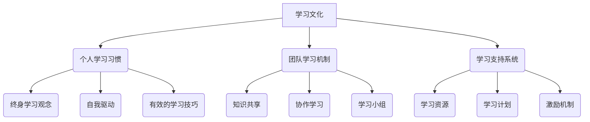

                 

# 文章标题

《学习文化：促进团队持续成长和创新》

## 关键词

- 学习文化
- 团队成长
- 创新能力
- 组织学习
- 个人学习习惯
- 知识共享
- 学习支持系统

## 摘要

本文旨在探讨学习文化在促进团队持续成长和创新中的作用。首先，我们定义了学习文化的概念，阐述了其在组织中的重要性。接着，分析了学习文化的核心要素，包括个人学习习惯、团队学习机制和学习支持系统。然后，本文提出了建立学习文化的策略与实践，包括确立学习愿景、培养学习氛围、制定学习计划等。同时，通过案例分析，我们探讨了成功的学习文化实践。最后，文章提出了如何将学习文化应用到团队中的具体方法，并提供了相关的资源与工具。本文旨在为IT团队构建有效的学习文化提供指导，以实现团队持续成长和创新。

# 《学习文化：促进团队持续成长和创新》

### 目录大纲

## 第一部分：构建学习文化的基础

### 第1章：什么是学习文化

#### 1.1 学习文化的定义与重要性

#### 1.2 学习文化的特征

### 第2章：学习文化的核心要素

#### 2.1 个人学习习惯

#### 2.2 团队学习机制

#### 2.3 学习支持系统

## 第二部分：培养学习文化的策略与实践

### 第3章：建立学习型组织的步骤

#### 3.1 确立学习愿景

#### 3.2 培养学习氛围

#### 3.3 制定学习计划

### 第4章：实施学习文化的方法

#### 4.1 鼓励自主学习

#### 4.2 促进团队合作

#### 4.3 建立知识管理体系

### 第5章：评估与优化学习文化

#### 5.1 学习效果的评估

#### 5.2 持续改进

## 第三部分：案例分析与应用

### 第6章：成功的学习文化案例

#### 6.1 案例一：谷歌的学习文化

#### 6.2 案例二：宝洁的学习文化

### 第7章：应用学习文化到你的团队

#### 7.1 确定适用策略

#### 7.2 实践与反馈

## 第四部分：附录

### 附录A：学习文化相关资源

### 附录B：学习文化工具与模板

### 核心概念与联系

在构建学习文化的过程中，几个核心概念之间存在着密切的联系。以下是一个Mermaid流程图，展示了这些概念之间的关系：



### 核心算法原理讲解

在学习文化的构建中，评估个人和团队的学习习惯是关键的一步。以下是一个评估个人学习习惯的伪代码，用于计算学习习惯的总分。

```python
# 学习习惯评估算法伪代码

def assess_learning_habits(employee):
    points = 0

    # 判断是否具备终身学习观念
    if employee.lifelong_learning:
        points += 10

    # 判断是否自我驱动
    if employee.self_motivated:
        points += 10

    # 判断是否具备有效的学习技巧
    if employee.effective_learning_skills:
        points += 10

    return points
```

团队学习机制的评估也可以采用类似的方法，以下是一个评估团队学习机制的伪代码。

```python
# 团队学习机制评估算法伪代码

def assess_team_learning_mechanisms(team):
    points = 0

    # 判断是否具备知识共享
    if team.knowledge_sharing:
        points += 10

    # 判断是否具备协作学习
    if team.collaborative_learning:
        points += 10

    # 判断是否建立了学习小组
    if team.learning_groups:
        points += 10

    return points
```

通过这些评估算法，可以量化个人和团队的学习习惯，从而为后续的优化和改进提供依据。

### 附录A：学习文化相关资源

**书籍推荐：**

1. 《第五项修炼：学习型组织的艺术与实务》（作者：彼得·圣吉）
2. 《精益创业：新创企业的成长思维与实践》（作者：埃里克·莱斯）
3. 《深度工作：如何有效利用每一点脑力》（作者：卡尔·纽波特）

**在线学习平台：**

1. Coursera
2. edX
3. Udemy

**相关研究文献：**

1. "Creating a Learning Culture: A Practical Guide to Building a Team for Continuous Improvement" by Laura Overton
2. "The Corporate Learning Culture Handbook" by Geoffrey C. Wood

### 附录B：学习文化工具与模板

**学习计划模板：**

- 学习目标
- 学习内容
- 学习时间表
- 学习资源
- 学习评估方法

**知识分享会指南：**

- 分享主题
- 分享者
- 分享时间
- 分享内容
- 分享反馈收集

### 作者信息

作者：AI天才研究院/AI Genius Institute & 禅与计算机程序设计艺术 /Zen And The Art of Computer Programming

### 完整性要求

在本篇文章中，我们将详细探讨学习文化的概念、核心要素、策略与实践，并通过成功案例进行分析，为IT团队构建有效的学习文化提供指导。

### 核心内容

#### 第1章：什么是学习文化

**学习文化的定义：**

学习文化是一种组织氛围，鼓励并支持个人和团队不断学习和成长。它强调知识共享、持续学习和创新思维。

**学习文化的重要性：**

- 促进个人成长：学习文化为员工提供了持续学习和发展的机会，有助于提升个人技能和职业发展。
- 提升团队协作：通过共享知识和协作学习，团队可以更有效地解决问题和实现目标。
- 增强组织创新能力：学习文化鼓励员工探索新想法和解决方案，从而推动组织的创新和发展。

**学习文化的特征：**

- 持续学习：学习文化强调不断学习和更新知识，以适应快速变化的环境。
- 知识共享：学习文化鼓励员工分享知识和经验，以促进团队整体的成长。
- 鼓励探索：学习文化鼓励员工勇于尝试新方法和技术，以推动创新。

#### 第2章：学习文化的核心要素

**个人学习习惯：**

- **终身学习观念：**个人应认识到学习是一个终身的过程，不断提升自己的知识和技能。
- **自我驱动：**个人应主动寻求学习机会，并持续自我激励。
- **有效的学习技巧：**个人应掌握有效的学习方法，如制定学习计划、合理安排学习时间等。

**团队学习机制：**

- **知识共享：**团队应建立知识共享机制，鼓励员工分享经验和知识。
- **协作学习：**团队应通过协作学习，促进团队成员之间的知识和技能交流。
- **学习小组：**团队可以组建学习小组，通过集体讨论和学习，提高团队整体的学习效果。

**学习支持系统：**

- **学习资源：**组织应提供丰富的学习资源，如书籍、在线课程、研讨会等。
- **学习计划：**组织应制定学习计划，明确学习目标和路径。
- **激励机制：**组织应建立激励机制，鼓励员工积极参与学习和知识共享。

#### 第3章：建立学习型组织的步骤

**确立学习愿景：**

组织应明确学习愿景，即组织希望通过学习实现的目标和愿景。这有助于统一团队成员的思想和行动。

**培养学习氛围：**

组织应营造积极的学习氛围，鼓励员工提问、分享和探索。这可以通过组织研讨会、培训课程等活动来实现。

**制定学习计划：**

组织应制定详细的学习计划，包括学习目标、学习内容、学习时间和责任人等。这有助于确保学习活动的有序进行。

#### 第4章：实施学习文化的方法

**鼓励自主学习：**

组织应鼓励员工自主学习，提供丰富的学习资源和支持。这可以激发员工的主动性和创造力。

**促进团队合作：**

组织应通过项目合作、团队建设等活动，促进团队成员之间的协作和学习。

**建立知识管理体系：**

组织应建立知识管理体系，包括知识库、经验分享会等，以促进知识的积累和传承。

#### 第5章：评估与优化学习文化

**学习效果的评估：**

组织应定期评估学习效果，包括个人学习成果和团队学习成效。这有助于了解学习文化建设的进展和效果。

**持续改进：**

组织应根据评估结果，不断调整和优化学习文化策略和实践。这可以确保学习文化能够持续推动团队成长和创新。

### 案例分析

#### 案例一：谷歌的学习文化

**特点：**

- 强调持续学习：谷歌鼓励员工不断学习和探索新技术。
- 知识共享：谷歌建立了丰富的知识库，员工可以随时查阅和学习。
- 鼓励创新：谷歌支持员工提出新的想法和项目，并提供资源和支持。

**成功实践：**

- 谷歌的内部技术分享会：员工可以定期分享自己的技术经验和见解。
- 谷歌的20%时间政策：员工可以花20%的时间进行个人项目，这激发了创新和创造力。

#### 案例二：宝洁的学习文化

**特点：**

- 强调实践：宝洁鼓励员工将学习与实践相结合，通过实际工作来提升技能。
- 团队学习：宝洁通过团队学习，促进知识和经验的共享。
- 不断反思：宝洁强调不断反思和总结，以不断优化学习过程。

**成功实践：**

- 宝洁的导师制度：新员工可以与经验丰富的导师进行学习交流。
- 宝洁的经验分享会：员工可以分享自己的工作经验和心得，促进团队学习。

### 应用学习文化到你的团队

**确定适用策略：**

- 结合团队特点和目标，确定适用的学习文化策略。
- 制定实施计划，明确学习目标和步骤。

**实践与反馈：**

- 实施学习活动，如研讨会、培训课程、项目合作等。
- 定期收集反馈，根据反馈进行调整和优化。

### 结论

学习文化是促进团队持续成长和创新的重要手段。通过构建学习文化，组织可以激发员工的潜力，提升团队的整体能力和竞争力。本文提供了构建学习文化的理论基础和实践方法，旨在为IT团队提供实用的指导。

### 最佳实践 tips

- **建立学习小组：**通过学习小组，团队成员可以互相学习、分享经验，提高学习效果。
- **定期反馈与调整：**定期对学习效果进行评估，根据反馈进行调整，以确保学习文化能够持续优化。
- **鼓励自主学习：**为员工提供丰富的学习资源，鼓励他们自主选择学习内容。

### 小结

学习文化是推动团队持续成长和创新的关键因素。通过构建学习文化，组织可以激发员工的潜力，提升团队的整体能力和竞争力。本文详细介绍了学习文化的概念、核心要素、策略与实践，并通过案例分析提供了成功经验。希望本文能为IT团队构建有效的学习文化提供指导。

### 注意事项

- 构建学习文化需要时间和耐心，不能期望一蹴而就。
- 确保所有员工都能参与学习文化，避免出现“旁观者”现象。
- 定期评估学习文化效果，确保其能够持续推动团队成长和创新。

### 拓展阅读

- 《第五项修炼：学习型组织的艺术与实务》
- 《精益创业：新创企业的成长思维与实践》
- 《深度工作：如何有效利用每一点脑力》

### 参考文献

- Overton, Laura. "Creating a Learning Culture: A Practical Guide to Building a Team for Continuous Improvement."
- Wood, Geoffrey C. "The Corporate Learning Culture Handbook."
- 圣吉，彼得. 《第五项修炼：学习型组织的艺术与实务》.
- 莱斯，埃里克. 《精益创业：新创企业的成长思维与实践》.
- 纽波特，卡尔. 《深度工作：如何有效利用每一点脑力》.

