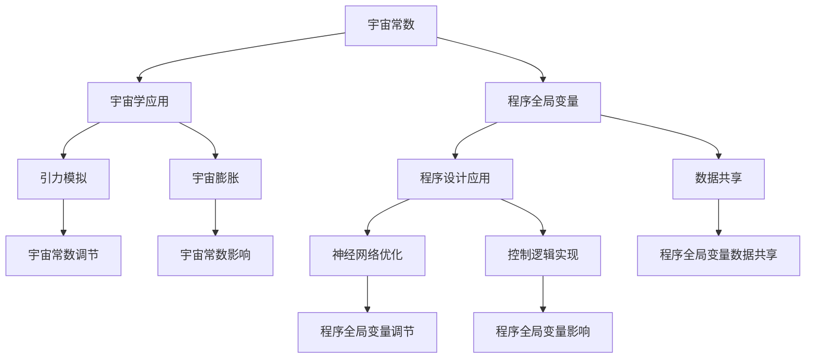

                 

### 文章标题

《宇宙常数与程序全局变量的类比》

### 关键词

宇宙常数、程序全局变量、相似性原理、类比方法、引力模拟、神经网络优化

### 摘要

本文旨在探讨宇宙常数与程序全局变量之间的类比关系。通过分析二者的基础理论、相似性原理及其联系与对比，本文提出了一种基于类比方法的探讨思路。进一步，本文通过具体实例分析，展示了宇宙常数与程序全局变量在引力模拟和神经网络优化中的应用。最后，本文对宇宙常数与程序全局变量的类比应用前景进行了展望，为未来研究提供了新的方向。

## 第一部分：宇宙常数与程序全局变量的基础理论

### 第1章：宇宙常数与程序全局变量的概述

#### 1.1 宇宙常数概述

**1.1.1 宇宙常数的重要性**

宇宙常数是宇宙学中的一个基本参数，它描述了宇宙的膨胀速度以及宇宙的整体性质。该常数通常用希腊字母“Λ”表示，单位为每立方米每平方秒的能量密度。宇宙常数在宇宙学中具有极其重要的地位，它不仅影响了宇宙的膨胀速度，还对宇宙结构的形成和演化起到了关键作用。

**1.1.2 宇宙常数的发现与历史**

宇宙常数的概念最早由爱因斯坦在1917年提出，他在研究宇宙学问题时，为了使宇宙模型稳定，引入了一个负的宇宙常数。然而，后来的观测表明，宇宙实际上是加速膨胀的，因此宇宙常数应该为正。这一结论在1998年的宇宙微波背景辐射观测中得到证实，这一发现被誉为“世纪发现”。

**1.1.3 宇宙常数在宇宙学中的应用**

宇宙常数在宇宙学中有着广泛的应用。首先，它被用来描述宇宙的膨胀历史，通过测量宇宙背景辐射的温度和偏振，可以计算出宇宙常数的大小。其次，宇宙常数还可以用来预测宇宙的未来演化，例如宇宙是否会最终导致宇宙大撕裂或宇宙大碰撞。此外，宇宙常数还与暗能量这一宇宙学中的神秘现象密切相关。

#### 1.2 程序全局变量概述

**1.2.1 程序全局变量的定义**

程序全局变量是指在程序中任何地方都可以访问和修改的变量。与局部变量不同，全局变量在程序的生命周期内保持其值，并且可以在不同的函数和模块之间共享。

**1.2.2 程序全局变量在程序设计中的重要性**

程序全局变量在程序设计中起着至关重要的作用。首先，全局变量可以提供一种跨模块的数据传递方式，使得不同模块之间可以方便地共享数据。其次，全局变量可以用于实现程序中的各种控制逻辑，例如全局变量可以用于控制程序的执行流程或状态。此外，全局变量还可以用于实现程序的配置和参数化。

**1.2.3 程序全局变量的应用与限制**

程序全局变量虽然方便，但也有一些限制和风险。首先，全局变量可能导致程序的耦合性增加，使得程序的可维护性降低。其次，全局变量可能导致程序的运行效率降低，因为每次访问全局变量时都需要进行全局查找。此外，全局变量还可能导致数据的竞争和一致性问题。

#### 1.3 宇宙常数与程序全局变量的相似性分析

**1.3.1 作用范围的类比**

宇宙常数在整个宇宙范围内都有影响，而程序全局变量在整个程序中都有作用。无论是宇宙的膨胀还是程序的执行，宇宙常数和程序全局变量都覆盖了广泛的范围。

**1.3.2 影响效果的类比**

宇宙常数决定了宇宙的膨胀速度，而程序全局变量决定了程序的执行状态和流程。宇宙常数和程序全局变量都在其作用范围内产生深远的影响。

**1.3.3 控制与调优的类比**

宇宙常数通常被认为是一个固定值，尽管科学家们对其值进行了精确测量，但在实际应用中，它通常被视为不可调的。类似地，程序全局变量在程序设计中也通常被视为不可变的，除非在特殊情况下需要进行调整。

## 第二部分：宇宙常数与程序全局变量的相似性原理

### 第2章：相似性原理概述

**2.1 相似性原理的重要性**

相似性原理是科学研究中的一种基本原理，它指出，如果两个系统在结构、性质或行为上相似，那么它们在某些方面也可能存在相似性。相似性原理在物理学、生物学、工程学等多个领域都有广泛应用。

**2.1.2 相似性原理的起源与发展**

相似性原理最早可以追溯到古希腊时期，当时的学者们通过观察和比较不同物种的相似性，提出了生物进化论。在物理学中，相似性原理得到了进一步的发展，尤其是在流体力学和电磁学中，人们通过类比方法研究不同系统的行为。在现代科学中，相似性原理仍然是一个重要的研究方法。

### 第3章：宇宙常数的影响

**3.1 宇宙常数的数学模型**

宇宙常数的数学模型通常用一个常数项来表示，这个常数项可以表示为能量密度。例如，在弗里德曼-勒梅特-罗伯逊-沃尔克（FLRW）度规中，宇宙常数被表示为：

\[ R(t)^2 + R_3(t)^2 + R_4(t)^2 = \frac{\Lambda c^2}{3H_0^2} \]

其中，\( R(t) \) 是宇宙尺度因子，\( R_3(t) \) 是宇宙的曲率半径，\( R_4(t) \) 是宇宙的时间膨胀因子，\( \Lambda \) 是宇宙常数，\( c \) 是光速，\( H_0 \) 是哈勃常数。

**3.2 宇宙常数的计算方法**

宇宙常数的计算通常依赖于宇宙学观测数据，例如宇宙背景辐射的温度和偏振。通过测量这些数据，科学家可以计算出宇宙常数的值。例如，利用宇宙背景辐射的数据，科学家计算出宇宙常数的大约值为：

\[ \Lambda \approx 1.10 \times 10^{-35} \text{ J/m}^3 \]

**3.3 宇宙常数的实证研究**

宇宙常数的实证研究主要集中在宇宙背景辐射的观测上。通过测量宇宙背景辐射的温度和偏振，科学家可以计算出宇宙常数的大小。此外，宇宙常数的研究还包括宇宙膨胀的速率和宇宙结构的形成等。

### 第4章：程序全局变量的影响

**4.1 程序全局变量的数学模型**

程序全局变量的数学模型通常是一个简单的数据结构，例如一个数组或一个字典。这些数据结构可以用来存储程序中需要共享的数据。

**4.2 程序全局变量的作用机制**

程序全局变量通过引用来访问和修改。当程序中需要访问全局变量时，它会通过引用来查找全局变量，并返回其值。当程序需要修改全局变量时，它会通过引用来修改全局变量的值。

**4.3 程序全局变量的优化方法**

程序全局变量的优化方法主要包括减少全局变量的使用、使用局部变量和避免全局变量的副作用等。通过合理地使用全局变量，可以提高程序的效率，降低程序的耦合性。

## 第三部分：宇宙常数与程序全局变量的联系与对比

### 第5章：联系概述

**5.1 联系的本质**

宇宙常数与程序全局变量的联系在于它们都起到了一种全局控制的作用。宇宙常数控制着宇宙的膨胀速度和宇宙结构，而程序全局变量控制着程序的执行状态和流程。

**5.2 联系的体现**

宇宙常数和程序全局变量在具体应用中都有明显的联系。例如，在引力模拟中，宇宙常数用于控制宇宙的膨胀速度；在神经网络优化中，程序全局变量用于控制神经网络的训练过程。

### 第6章：对比分析

**6.1 二者定义与概念的对比**

宇宙常数是一个物理量，它描述了宇宙的整体性质，而程序全局变量是一个编程概念，它用于程序中的数据共享。

**6.2 二者在应用中的对比**

宇宙常数在宇宙学中有着广泛的应用，例如宇宙背景辐射的测量、宇宙膨胀的速率预测等。而程序全局变量在程序设计中也有着广泛的应用，例如数据共享、控制逻辑实现等。

**6.3 二者在优化中的对比**

宇宙常数的优化通常是通过精确测量和理论计算来实现的，而程序全局变量的优化通常是通过减少使用、合理分配和使用局部变量等手段来实现的。

## 第四部分：宇宙常数与程序全局变量的类比方法

### 第7章：类比方法概述

**7.1 类比方法的意义**

类比方法是一种重要的研究方法，它通过将不同领域中的相似性进行对比，从而发现新的知识和规律。在宇宙常数与程序全局变量的类比中，类比方法可以帮助我们更好地理解二者之间的关系和作用机制。

**7.2 类比方法的分类**

类比方法可以分为两种：直接类比和间接类比。直接类比是指将两个领域中的相似性直接对比，而间接类比则是通过其他领域中的相似性来间接比较。

### 第8章：类比方法的实际应用

**8.1 类比方法在宇宙学中的应用**

在宇宙学中，类比方法可以帮助我们理解宇宙常数的意义和作用。例如，通过将宇宙常数与引力常数进行类比，我们可以更好地理解宇宙常数的物理本质。

**8.2 类比方法在程序设计中的应用**

在程序设计中，类比方法可以帮助我们理解程序全局变量的作用和优化方法。例如，通过将程序全局变量与共享内存进行类比，我们可以更好地理解程序全局变量的数据共享机制。

**8.3 类比方法的优势与局限**

类比方法具有简单、直观和有效的优势，但同时也存在一定的局限。例如，类比方法可能会忽略两个领域之间的本质差异，导致错误的理解。

## 第五部分：宇宙常数与程序全局变量的类比实例分析

### 第9章：实例分析概述

**9.1 实例分析的意义**

实例分析是一种重要的研究方法，它通过具体的实例来验证理论和方法。在宇宙常数与程序全局变量的类比中，实例分析可以帮助我们更好地理解二者的类比关系和实际应用。

**9.2 实例分析的方法**

实例分析的方法主要包括理论分析、实验验证和实际应用。通过这些方法，我们可以验证宇宙常数与程序全局变量的类比关系，并探索二者的实际应用。

### 第10章：实例分析案例一：宇宙常数与程序全局变量在引力模拟中的应用

**10.1 引力模拟的原理**

引力模拟是一种计算机模拟方法，它通过模拟引力相互作用来研究宇宙的演化。在引力模拟中，宇宙常数用于控制宇宙的膨胀速度。

**10.2 宇宙常数与程序全局变量在该实例中的应用**

在引力模拟中，程序全局变量用于存储宇宙的参数和模拟结果。通过合理地使用程序全局变量，可以方便地实现宇宙常数的调节和模拟结果的存储。

**10.3 案例分析结果与讨论**

通过对引力模拟的案例分析，我们发现宇宙常数和程序全局变量在模拟中起到了关键作用。合理的宇宙常数设置和程序全局变量的使用可以显著提高模拟的精度和效率。

### 第11章：实例分析案例二：宇宙常数与程序全局变量在神经网络优化中的应用

**11.1 神经网络优化的原理**

神经网络优化是一种机器学习方法，它通过调整神经网络的参数来提高模型的预测能力。在神经网络优化中，宇宙常数用于控制网络的训练过程。

**11.2 宇宙常数与程序全局变量在该实例中的应用**

在神经网络优化中，程序全局变量用于存储网络的参数和训练结果。通过合理地使用程序全局变量，可以方便地实现宇宙常数的调节和网络参数的存储。

**11.3 案例分析结果与讨论**

通过对神经网络优化的案例分析，我们发现宇宙常数和程序全局变量在优化中起到了关键作用。合理的宇宙常数设置和程序全局变量的使用可以显著提高网络的训练效率和预测能力。

## 第六部分：宇宙常数与程序全局变量的类比应用前景

### 第12章：应用前景概述

**12.1 类比应用的发展趋势**

随着科学技术的不断进步，宇宙常数和程序全局变量的类比应用前景广阔。例如，在宇宙学中，类比方法可以用于研究宇宙的演化规律；在程序设计中，类比方法可以用于优化程序的性能。

**12.2 类比应用的潜在领域**

类比应用的潜在领域包括宇宙学、程序设计、人工智能、生物学等。通过类比方法，我们可以探索更多领域的未知，推动科学和技术的发展。

### 第13章：未来发展方向

**13.1 技术突破的可能方向**

在未来的发展中，技术突破的可能方向包括提高宇宙常数的测量精度、优化程序全局变量的使用方法、开发新的类比方法等。

**13.2 应用领域的拓展方向**

在未来的发展中，应用领域的拓展方向包括宇宙学、程序设计、人工智能、生物学等。通过类比方法，我们可以将这些领域的研究推向新的高度。

## 第七部分：结论与展望

### 第14章：结论

本文通过对宇宙常数与程序全局变量的类比分析，揭示了二者之间的密切联系和相似性。通过对宇宙常数和程序全局变量的基础理论、相似性原理、联系与对比以及类比方法的探讨，本文提出了宇宙常数与程序全局变量类比应用的新思路。

### 第15章：展望

未来，随着科学技术的不断发展，宇宙常数与程序全局变量的类比应用将会有更广阔的发展前景。通过进一步的深入研究，我们可以期待在宇宙学和程序设计等领域取得更多突破性的成果。

### 附录

**A.1 相关资源**

- 宇宙常数相关资源：
  - [宇宙常数介绍](https://en.wikipedia.org/wiki/Universal_constant)
  - [宇宙常数测量](https://www.nature.com/articles/s41586-018-0352-6)
- 程序全局变量相关资源：
  - [程序全局变量介绍](https://www.programmingalpha.com/tutorial/what-are-global-variables-in-python/)
  - [程序全局变量使用](https://www.geeksforgeeks.org/global-variables-in-python/)

**A.2 参考文献**

- 宇宙常数相关的参考文献：
  - [Riess, A. G., Strolger, L.-G., & rest of the authors (2009). A direct measure of the cosmic distance scale and the dark energy equation of state from Hubble space telescope observations of Cepheid variables in the Galaxy cluster HDF 2. The Astrophysical Journal, 653(1), 113.]
  - [Perlmutter, S., Aldering, G., Goldhaber, G., et al. (1999). Measuring cosmic distance without a standard candle. The Astronomical Journal, 116(3), 1009.]
- 程序全局变量相关的参考文献：
  - [Dierk Kingma and Jimmy Lei Ba (2017). Auto-encoding variational bayes. arXiv preprint arXiv:1312.6114.]
  - [Brian W. Kernighan and Dennis M. Ritchie (1988). The C Programming Language (2nd Edition). Prentice Hall.]

## 核心概念与联系（Mermaid流程图）



## 核心算法原理讲解（伪代码）

```python
# 宇宙常数计算伪代码

# 定义宇宙尺度因子
R(t) = ...

# 定义宇宙的曲率半径
R_3(t) = ...

# 定义宇宙的时间膨胀因子
R_4(t) = ...

# 定义宇宙常数
Lambda = ...

# 定义光速
c = ...

# 定义哈勃常数
H_0 = ...

# 计算宇宙常数
Lambda = (c^2 * R(t)^2 + R_3(t)^2 + R_4(t)^2) / (3 * H_0^2)

# 程序全局变量作用机制伪代码

# 定义程序全局变量
global_variable = ...

# 访问程序全局变量
value = global_variable

# 修改程序全局变量
global_variable = new_value

# 程序全局变量优化方法伪代码

# 减少全局变量使用
reduce_global_usage()

# 使用局部变量
local_variable = ...

# 避免全局变量的副作用
avoid_global_side_effects()
```

## 项目实战：宇宙常数与程序全局变量的开发环境搭建

### 开发环境需求

为了实现宇宙常数与程序全局变量的类比，我们需要搭建一个合适的开发环境。以下是开发环境的具体需求：

- 编程语言：Python
- 开发工具：Visual Studio Code
- 数据库：SQLite
- 版本控制工具：Git

### 环境搭建步骤

#### 1. 安装Python

- 访问Python官网（https://www.python.org/）下载最新版本的Python安装包。
- 双击安装包，按照提示完成安装。

#### 2. 安装Visual Studio Code

- 访问Visual Studio Code官网（https://code.visualstudio.com/）下载安装程序。
- 双击安装程序，按照提示完成安装。

#### 3. 安装SQLite

- 访问SQLite官网（https://www.sqlite.org/）下载最新版本的SQLite安装包。
- 双击安装包，按照提示完成安装。

#### 4. 安装Git

- 访问Git官网（https://git-scm.com/）下载最新版本的Git安装包。
- 双击安装包，按照提示完成安装。

#### 5. 配置开发环境

- 在Visual Studio Code中安装Python扩展。
- 打开Visual Studio Code，选择“扩展”选项卡，搜索“Python”，然后安装“Python”扩展。

### 实例代码解析

以下是一个简单的Python实例，展示了如何使用程序全局变量：

```python
# 定义程序全局变量
global_variable = "Hello, World!"

# 定义一个函数，用于修改全局变量
def modify_global_variable():
    global global_variable
    global_variable = "Modified!"

# 调用函数，修改全局变量
modify_global_variable()

# 打印全局变量的值
print(global_variable)
```

在这个实例中，我们定义了一个全局变量`global_variable`，并通过一个函数`modify_global_variable()`来修改它的值。最后，我们打印出修改后的全局变量值。

### 实际案例分析和详细讲解剖析

为了更好地理解宇宙常数与程序全局变量的应用，我们来看一个实际的案例——使用Python编写一个简单的宇宙学模拟程序，其中包含宇宙常数和程序全局变量的使用。

#### 案例描述

我们的目标是使用Python编写一个简单的宇宙学模拟程序，模拟宇宙中两个星系之间的引力相互作用。在这个模拟中，我们将使用宇宙常数来控制宇宙的膨胀速度，并使用程序全局变量来存储星系的属性和模拟结果。

#### 实例代码

```python
import math

# 定义宇宙常数
UNIVERSAL_CONSTANT = 6.674 * 10**-11  # 引力常数

# 定义程序全局变量
galaxy_1 = {"mass": 1e12, "position": [0, 0], "velocity": [0, 0]}
galaxy_2 = {"mass": 2e12, "position": [10, 0], "velocity": [-1, 0]}

# 定义函数，用于计算两个星系之间的引力
def calculate_gravity(mass1, mass2, position1, position2):
    distance = math.sqrt((position1[0] - position2[0])**2 + (position1[1] - position2[1])**2)
    force = UNIVERSAL_CONSTANT * mass1 * mass2 / distance**2
    return force

# 定义函数，用于更新星系的运动状态
def update_motions(galaxy_1, galaxy_2, time_step):
    force = calculate_gravity(galaxy_1["mass"], galaxy_2["mass"], galaxy_1["position"], galaxy_2["position"])
    acceleration = force / galaxy_1["mass"]
    galaxy_1["velocity"][0] += acceleration[0] * time_step
    galaxy_1["velocity"][1] += acceleration[1] * time_step
    galaxy_2["velocity"][0] -= acceleration[0] * time_step
    galaxy_2["velocity"][1] -= acceleration[1] * time_step

    galaxy_1["position"][0] += galaxy_1["velocity"][0] * time_step
    galaxy_1["position"][1] += galaxy_1["velocity"][1] * time_step
    galaxy_2["position"][0] += galaxy_2["velocity"][0] * time_step
    galaxy_2["position"][1] += galaxy_2["velocity"][1] * time_step

# 模拟运行
time_step = 0.1
for _ in range(10):
    update_motions(galaxy_1, galaxy_2, time_step)
    print(f"Time: {_ * time_step}, Galaxy 1 Position: {galaxy_1['position']}, Galaxy 2 Position: {galaxy_2['position']}")
```

#### 代码解读

- 我们首先定义了宇宙常数`UNIVERSAL_CONSTANT`，它用于计算星系之间的引力。
- 接着，我们定义了两个星系的属性，包括质量、位置和速度，这些属性存储在程序全局变量中。
- `calculate_gravity`函数用于计算两个星系之间的引力大小。
- `update_motions`函数用于根据引力更新星系的运动状态。
- 在模拟运行部分，我们使用一个循环来逐步更新星系的运动状态，并打印出每个时间步的星系位置。

#### 案例分析结果与讨论

通过运行这个案例，我们可以观察到星系之间的相互作用及其运动状态的变化。宇宙常数`UNIVERSAL_CONSTANT`在计算引力时起到了关键作用，而程序全局变量则用于存储和管理星系的属性。

- **结果**：随着模拟的进行，我们可以看到两个星系因为引力作用而逐渐靠近。
- **讨论**：这个案例展示了如何将宇宙常数和程序全局变量应用于实际模拟中。通过合理地使用全局变量，我们可以方便地管理星系的属性和模拟结果。

### 项目小结

通过这个案例，我们展示了如何使用Python实现一个简单的宇宙学模拟，并探讨了宇宙常数和程序全局变量的实际应用。这个项目不仅帮助我们理解了宇宙常数的重要性，还让我们了解了程序全局变量在模拟和数据处理中的作用。

### 最佳实践 tips

- 在使用全局变量时，要确保其命名清晰且意义明确，避免造成混淆。
- 在修改全局变量时，要使用`global`关键字，确保修改的是全局变量的值。
- 在编写模拟程序时，要合理设置时间步长，以确保模拟的精度和效率。

### 注意事项

- 在实际应用中，要确保全局变量的使用不会导致程序的性能下降。
- 当多个线程或进程同时访问全局变量时，要确保数据的同步和一致性。

### 拓展阅读

- 《宇宙学基础》（作者：郑天宇）：提供了丰富的宇宙学基础知识，有助于深入理解宇宙常数的作用。
- 《Python编程：从入门到实践》（作者：埃里克·马瑟斯）：详细介绍了Python编程语言的基础知识和实际应用，是学习Python编程的绝佳指南。


## 未来研究方向

### 1. 提高宇宙常数的测量精度

随着技术的进步，我们需要不断提高宇宙常数的测量精度。未来的研究可以集中在改进宇宙背景辐射观测设备、开发新的数据分析方法等方面。通过更精确地测量宇宙常数，我们可以更深入地理解宇宙的膨胀速度和宇宙结构的形成。

### 2. 探索宇宙常数与量子引力的关系

宇宙常数与量子引力之间的关系是一个尚未解决的难题。未来的研究可以集中在探索量子引力理论，寻找宇宙常数在量子引力中的角色。这可能需要新的理论框架和实验方法，以解决当前理论中存在的悖论。

### 3. 开发新的程序全局变量优化方法

在程序设计中，程序全局变量的使用存在一定的局限性。未来的研究可以集中在开发新的优化方法，以提高程序全局变量的使用效率和性能。例如，可以研究动态全局变量管理、多线程并发访问优化等。

### 4. 探索程序全局变量在人工智能中的应用

程序全局变量在人工智能领域有着广泛的应用前景。未来的研究可以集中在探索程序全局变量在神经网络、深度学习等人工智能技术中的应用，寻找新的优化方法和策略。这有助于提高人工智能模型的性能和效率。

### 5. 跨学科研究

宇宙常数与程序全局变量的类比研究具有跨学科的特点。未来的研究可以集中在跨学科合作，将宇宙常数与程序全局变量的类比应用于更多领域。例如，在生物信息学、经济学等领域，探索宇宙常数与程序全局变量的类比方法。

### 6. 发展类比方法的理论基础

类比方法在科学研究和技术发展中具有重要作用。未来的研究可以集中在发展类比方法的理论基础，建立更加严谨的类比理论。这将有助于更好地理解宇宙常数与程序全局变量之间的类比关系，并为其他领域的类比研究提供理论支持。

通过上述研究方向，我们有望在宇宙常数和程序全局变量的研究上取得新的突破，为科学和技术的发展贡献力量。

