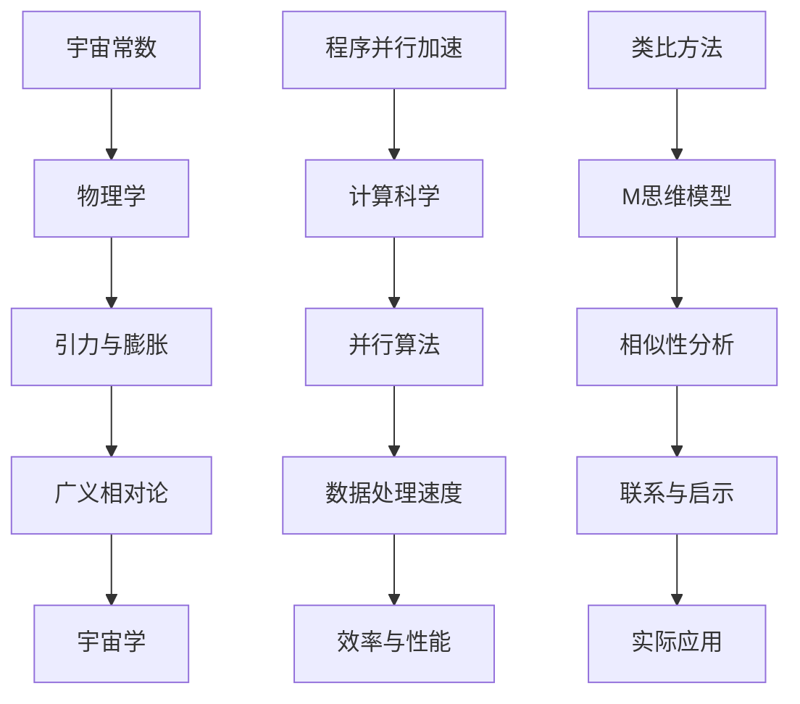

                 

### 文章标题

《宇宙常数与程序并行加速极限的类比》

### 关键词

宇宙常数、程序并行加速、类比方法、并行计算、计算科学、算法原理、算法优化、数据分割、子集计算、结果合并。

### 摘要

本文旨在探讨宇宙常数与程序并行加速之间的潜在类比关系，通过分析两个领域的基本概念、原理和方法，揭示它们在并行性、效率与性能方面的相似性。首先，我们介绍了宇宙常数的基本概念、物理意义以及测量和计算方法。然后，我们探讨了程序并行加速的基本原理，包括并行计算的定义、关键技术、硬件支持以及案例分析。接着，本文通过类比方法，详细分析了宇宙常数与程序并行加速之间的关联点，并通过实例分析了类比在实际中的应用。最后，本文总结了类比方法在实际应用中的挑战和解决方案，并展望了未来的研究方向。

## 目录大纲

### 《宇宙常数与程序并行加速极限的类比》

#### 第一部分：宇宙常数基本概念与原理

- **第1章 宇宙常数概述**
  - **1.1 宇宙常数的基本概念与历史**
    - **1.1.1 宇宙常数的基本概念**
    - **1.1.2 宇宙常数的历史演变**
  - **1.2 宇宙常数的物理意义**
    - **1.2.1 宇宙常数的物理学意义**
    - **1.2.2 宇宙常数与宇宙学的关系**
  - **1.3 宇宙常数的测量与计算**
    - **1.3.1 宇宙常数的测量方法**
    - **1.3.2 宇宙常数的计算方法与精度**
  - **1.4 宇宙常数的研究进展**
    - **1.4.1 宇宙常数研究的最新成果**
    - **1.4.2 宇宙常数研究的未来展望**

#### 第二部分：程序并行加速基本原理

- **第2章 程序并行加速概述**
  - **2.1 并行计算的基本概念**
    - **2.1.1 并行计算的定义**
    - **2.1.2 并行计算的优势与挑战**
  - **2.2 程序并行加速的关键技术**
    - **2.2.1 数据并行**
    - **2.2.2 任务并行**
    - **2.2.3 程序并行加速的算法优化**
  - **2.3 程序并行加速的硬件支持**
    - **2.3.1 CPU与GPU并行处理能力**
    - **2.3.2 其他硬件支持**
  - **2.4 程序并行加速的案例分析**
    - **2.4.1 某大型科学计算项目的并行加速实践**
    - **2.4.2 程序并行加速在工业应用中的案例**

#### 第三部分：宇宙常数与程序并行加速的类比

- **第3章 宇宙常数与程序并行加速的类比方法**
  - **3.1 类比方法的基本原则**
    - **3.1.1 类比的基础理论**
    - **3.1.2 类比的适用范围**
  - **3.2 宇宙常数与程序并行加速的类比点**
    - **3.2.1 并行性与宇宙常数的关联**
    - **3.2.2 宇宙常数对程序并行加速的启示**
  - **3.3 类比实例分析**
    - **3.3.1 基于宇宙常数的并行计算模型**
    - **3.3.2 基于程序并行加速的宇宙常数研究方法**

#### 第四部分：类比在现实中的应用与挑战

- **第4章 类比方法在实际应用中的挑战与解决方案**
  - **4.1 类比方法在实际应用中的挑战**
    - **4.1.1 类比方法的应用局限性**
    - **4.1.2 类比方法的理论难题**
  - **4.2 挑战的解决方案**
    - **4.2.1 提高类比方法的精度**
    - **4.2.2 扩大类比方法的适用范围**
  - **4.3 类比方法的应用前景**
    - **4.3.1 类比方法在科学计算中的应用**
    - **4.3.2 类比方法在工业领域的应用**

#### 第五部分：总结与展望

- **第5章 总结与展望**
  - **5.1 主要研究成果**
    - **5.1.1 类比方法的研究成果总结**
    - **5.1.2 程序并行加速与宇宙常数研究的最新进展**
  - **5.2 未来研究方向**
    - **5.2.1 类比方法在更多领域的应用**
    - **5.2.2 程序并行加速与宇宙常数研究的未来展望**

## 核心概念与联系

为了更直观地展示宇宙常数与程序并行加速的核心概念之间的联系，我们使用Mermaid图形来表示它们之间的关系。以下是一个简化的流程图：

在这个图中，宇宙常数与程序并行加速通过类比方法（K）连接在一起。类比方法帮助我们将宇宙学中的概念（如引力与膨胀）与计算科学中的概念（如并行算法与数据处理速度）联系起来，从而发现两者在并行性、效率和性能上的相似性。

## 第一部分：宇宙常数基本概念与原理

### 第1章 宇宙常数概述

#### 1.1 宇宙常数的基本概念与历史

宇宙常数是一个物理学中的概念，它描述了宇宙中的一种基本力——引力的强度。最早提出宇宙常数概念的是爱因斯坦，他在1915年发表了他的广义相对论理论。在广义相对论中，宇宙常数是一个用于调整引力场的常数，它使得宇宙不会无限膨胀或无限收缩。

**1.1.1 宇宙常数的基本概念**

宇宙常数的定义是一个标量，它代表了一种在宇宙空间中均匀分布的、与空间本身相关的基本能量密度。这个常数通常用希腊字母`Λ`表示。在广义相对论中，宇宙常数出现在爱因斯坦场方程中，它对描述宇宙的整体结构和动力学起着关键作用。

**1.1.2 宇宙常数的历史演变**

宇宙常数的历史可以追溯到爱因斯坦在提出广义相对论时。最初，爱因斯坦在广义相对论中加入了宇宙常数`Λ`，以平衡宇宙的引力吸引力和膨胀力，使宇宙达到一种静态平衡状态。然而，在后来对宇宙膨胀的观测中，爱因斯坦的静态宇宙模型被证明是不正确的。随着哈勃定律的发现，宇宙被证实是在不断膨胀的。这使得宇宙常数`Λ`在物理学家眼中的地位发生了变化。

20世纪20年代，勒梅特和弗里德曼提出了动态宇宙模型，他们认为宇宙常数可能是一个正值，使得宇宙在过去的某个时刻可能是紧密的。这一理论后来得到了奥克塔文·勒布夫的证实，他观测到了宇宙微波背景辐射，进一步支持了动态宇宙模型。

随着对宇宙学的研究不断深入，宇宙常数`Λ`的物理意义也得到了更深入的理解。现代宇宙学认为，宇宙常数代表了真空能量，也就是宇宙空间的“能量成本”。它是一个负值，这个负值的能量使得宇宙加速膨胀。

#### 1.2 宇宙常数的物理意义

宇宙常数在物理学中具有深刻的物理意义。它不仅影响了宇宙的膨胀速度，还与宇宙的整体结构密切相关。

**1.2.1 宇宙常数的物理学意义**

宇宙常数`Λ`是广义相对论中的关键参数，它通过爱因斯坦场方程与引力场相关联。在广义相对论中，引力被视为时空的弯曲，而宇宙常数则代表了时空中的额外“扭曲”。当`Λ`为负值时，这种额外的能量密度使得宇宙加速膨胀，这与观测到的宇宙加速膨胀现象相符合。

此外，宇宙常数还与暗能量概念密切相关。暗能量是一种占据宇宙大部分能量密度的神秘物质，它与普通物质和暗物质不同，不参与引力相互作用，却对宇宙的膨胀产生巨大的影响。宇宙常数`Λ`被视为暗能量的一个代表，它解释了为什么宇宙会以加速的方式膨胀。

**1.2.2 宇宙常数与宇宙学的关系**

宇宙常数对宇宙学的研究具有重要意义。首先，它为宇宙的膨胀提供了一个基本参数。通过测量宇宙常数，科学家可以了解宇宙的膨胀历史，进而推断出宇宙的年龄和未来演化趋势。

其次，宇宙常数与宇宙学中的其他观测数据密切相关。例如，宇宙微波背景辐射的测量提供了宇宙早期状态的信息，而宇宙常数`Λ`则可以帮助科学家解释宇宙微波背景辐射的细节。

此外，宇宙常数还与宇宙的大尺度结构相关。通过分析宇宙中星系和星系团的分布，科学家可以了解宇宙的“宇宙丝”结构，这些结构受到宇宙常数的影响，从而揭示了宇宙的演化过程。

#### 1.3 宇宙常数的测量与计算

宇宙常数的测量是一个复杂且具有挑战性的过程，因为它涉及对宇宙中非常广泛区域和时间的观测。以下是宇宙常数的测量与计算方法：

**1.3.1 宇宙常数的测量方法**

宇宙常数的测量方法主要包括两种：直接测量和间接测量。

- **直接测量**：直接测量宇宙常数的方法是通过观测宇宙中的某些特殊现象，如引力透镜效应、大尺度结构、宇宙微波背景辐射等。这些观测可以提供宇宙常数的信息。

- **间接测量**：间接测量宇宙常数的方法是基于对宇宙膨胀历史和宇宙大尺度结构的理解，通过计算宇宙模型的参数来推断宇宙常数。这种方法的典型代表是宇宙微波背景辐射的测量，它提供了宇宙早期状态的信息，从而可以用来推导宇宙常数。

**1.3.2 宇宙常数的计算方法与精度**

宇宙常数的计算方法通常基于宇宙学模型。一个典型的宇宙学模型包括以下几个关键参数：宇宙的总质量密度、曲率参数、暗物质密度、暗能量密度等。通过调整这些参数，可以拟合观测数据，从而确定宇宙常数`Λ`。

宇宙常数的计算精度受多种因素影响，包括观测数据的精度、宇宙学模型的复杂性和参数估计的准确性。随着观测技术的进步和计算方法的改进，宇宙常数的测量精度也在不断提高。

#### 1.4 宇宙常数的研究进展

宇宙常数的研究取得了显著进展，这些进展不仅加深了我们对宇宙的理解，也为未来的科学研究提供了新的方向。

**1.4.1 宇宙常数研究的最新成果**

近年来，宇宙常数的研究取得了许多重要成果。例如，通过对宇宙微波背景辐射的精确测量，科学家们获得了宇宙常数的最佳估计。此外，对引力透镜效应和宇宙大尺度结构的研究也为宇宙常数的研究提供了重要数据。

**1.4.2 宇宙常数研究的未来展望**

未来，宇宙常数的研究将继续深入。一方面，科学家们将致力于提高测量精度，通过更精确的观测和更先进的计算方法来进一步确定宇宙常数。另一方面，宇宙常数的研究将扩展到更多领域，如量子引力理论和宇宙早期状态的研究。这些研究将为理解宇宙的本质提供新的视角。

总之，宇宙常数是物理学和宇宙学中一个关键概念，它不仅揭示了宇宙的膨胀历史，还与宇宙的整体结构密切相关。通过不断的研究，科学家们将逐步揭示宇宙常数的奥秘，为理解宇宙的本质做出贡献。

### 第2章 程序并行加速概述

#### 2.1 并行计算的基本概念

并行计算是现代计算机科学中的一个重要领域，它涉及到如何将复杂的计算任务分解为多个可以同时执行的部分。并行计算的核心思想是通过利用多个计算资源（如多个处理器或多个计算节点）来提高计算效率和性能。

**2.1.1 并行计算的定义**

并行计算（Parallel Computing）是指在同一时间内执行多个计算任务的能力。在并行计算中，计算任务被分解为多个子任务，这些子任务可以在不同的计算资源上同时执行。这种分解和并行执行的过程使得并行计算能够显著提高计算速度和效率。

**2.1.2 并行计算的优势与挑战**

并行计算具有以下优势：

- **提高计算效率**：通过并行执行多个任务，可以大大减少总的计算时间，从而提高计算效率。
- **增强计算能力**：并行计算可以同时处理多个复杂任务，从而增强计算能力。
- **资源利用率高**：并行计算可以充分利用多个计算资源，提高资源利用率。

然而，并行计算也面临着一些挑战：

- **任务分配与调度**：如何将计算任务合理地分配到不同的计算资源上，并保证任务执行的效率，是一个复杂的问题。
- **同步与通信**：并行计算中的不同子任务可能需要同步或通信，这增加了系统的复杂度。
- **负载均衡**：如何保证每个计算资源都得到合理的负载，避免某些资源过于繁忙而其他资源闲置，也是一个关键问题。

#### 2.2 程序并行加速的关键技术

程序并行加速是指通过优化计算任务和算法，提高并行计算的性能和效率。以下是一些关键的技术：

**2.2.1 数据并行**

数据并行是一种将计算任务分解为多个独立子任务的方法，每个子任务处理不同部分的数据。这种方法适用于处理大规模数据集，如矩阵运算、图像处理等。

**2.2.2 任务并行**

任务并行是将计算任务本身分解为多个独立的部分，这些部分可以在不同的计算资源上同时执行。这种方法适用于计算任务本身具有并行性的情况，如科学计算、模拟等。

**2.2.3 程序并行加速的算法优化**

算法优化是提高并行计算性能的关键。常见的优化方法包括：

- **算法分解**：将复杂算法分解为多个可并行执行的部分。
- **循环展开**：通过将循环展开成独立的计算步骤，减少同步开销。
- **数据局部性优化**：通过优化数据访问模式，减少数据传输时间。
- **负载均衡**：通过动态负载均衡，确保每个计算资源都能充分利用。

#### 2.3 程序并行加速的硬件支持

硬件支持是并行计算的基础，以下是一些常见的硬件支持：

**2.3.1 CPU与GPU并行处理能力**

CPU（中央处理器）和GPU（图形处理器）都是常见的并行计算硬件。CPU具有高度的通用性和灵活性，适用于多种计算任务。GPU则专门为图形处理设计，但在并行计算中也表现出色，特别是在处理大规模数据并行任务时。

**2.3.2 其他硬件支持**

除了CPU和GPU，其他硬件如FPGA（现场可编程门阵列）和ASIC（专用集成电路）也在并行计算中发挥着重要作用。FPGA和ASIC可以针对特定计算任务进行优化，提供更高的计算性能和效率。

#### 2.4 程序并行加速的案例分析

**2.4.1 某大型科学计算项目的并行加速实践**

以下是一个大型科学计算项目的并行加速案例：

项目背景：某科研团队需要计算一个复杂的模拟模型，模型包含大量数据和复杂的计算步骤。

解决方案：

1. 数据并行：将计算任务分解为多个子任务，每个子任务处理不同部分的数据。
2. 算法优化：对计算算法进行优化，减少同步开销，提高计算效率。
3. 硬件支持：使用多核CPU和GPU进行并行计算，充分利用硬件资源。

结果：通过并行加速，计算时间从原来的几天缩短到几小时，计算效率显著提高。

**2.4.2 程序并行加速在工业应用中的案例**

以下是一个工业应用中的并行加速案例：

项目背景：某制造企业需要进行大量的仿真分析，以优化产品设计。

解决方案：

1. 任务并行：将仿真任务分解为多个独立的部分，同时执行。
2. 算法优化：优化仿真算法，减少计算时间。
3. 硬件支持：使用高性能计算集群，提供强大的计算能力。

结果：通过并行加速，仿真分析时间从原来的几天缩短到几个小时，提高了产品设计效率。

总之，程序并行加速是提高计算效率和性能的关键技术。通过合理的任务分配、算法优化和硬件支持，可以实现大规模并行计算，为科学研究和工业应用提供强大的计算支持。

### 第三部分：宇宙常数与程序并行加速的类比方法

#### 3.1 类比方法的基本原则

类比方法是一种通过比较不同领域中的相似性来揭示它们之间联系的研究方法。在探讨宇宙常数与程序并行加速之间的关系时，类比方法为我们提供了一个有效的分析工具。

**3.1.1 类比的基础理论**

类比方法的基础理论是寻找不同领域中的相似性，并基于这些相似性建立模型。在科学研究中，类比方法可以帮助我们从一个已知的领域推导出对另一个未解领域的理解。类比的基础理论包括以下几个方面：

1. **相似性识别**：通过观察和比较，识别出不同领域中的相似元素。这些相似元素可以是概念、结构、机制或现象。
2. **类比建模**：根据相似性识别的结果，构建一个类比模型，将一个领域的知识和方法应用于另一个领域。
3. **验证与修正**：通过实验或观察验证类比模型的正确性，并根据结果对模型进行修正。

**3.1.2 类比的适用范围**

类比方法适用于多种科学研究和工程应用，尤其是在跨学科的研究中具有重要作用。以下是一些类比方法适用的典型场景：

1. **跨学科研究**：通过类比不同学科中的相似性，揭示不同领域之间的联系。例如，生物学中的进化机制可以类比为计算机科学中的算法优化。
2. **复杂系统分析**：类比方法可以帮助我们理解复杂系统的行为。例如，通过将社会系统类比为生态系统，可以揭示社会系统中的一些基本规律。
3. **新理论推导**：类比方法可以用来推导新的理论或假设。例如，通过将量子力学类比为统计力学，可以推导出量子场论的一些基本原理。

#### 3.2 宇宙常数与程序并行加速的类比点

宇宙常数和程序并行加速之间存在多个类比点，这些类比点揭示了它们在并行性、效率和性能上的相似性。

**3.2.1 并行性与宇宙常数的关联**

在程序并行加速中，并行性是实现计算效率和性能提升的关键。同样，在宇宙学中，宇宙常数也与并行性密切相关。以下是几个具体的类比点：

1. **空间并行性**：宇宙常数描述了宇宙空间中的基本力——引力的强度，这种引力在宇宙空间中是均匀分布的。在程序并行加速中，数据并行和任务并行也涉及到不同部分数据或任务的并行处理。
2. **时间并行性**：宇宙常数影响了宇宙的膨胀历史，宇宙在过去的某个时刻可能是紧密的。在程序并行加速中，计算任务的分解和并行执行也需要考虑时间维度上的并行性。

**3.2.2 宇宙常数对程序并行加速的启示**

宇宙常数的研究成果和理论可以为我们提供对程序并行加速的启示，帮助我们更好地理解和优化并行计算。以下是一些具体启示：

1. **并行算法设计**：宇宙常数的研究方法可以启发我们设计更有效的并行算法。例如，通过研究宇宙学中的动态平衡模型，可以推导出适用于程序并行加速的负载均衡策略。
2. **性能优化**：宇宙常数的影响因素和测量方法可以为我们提供性能优化的思路。例如，通过研究宇宙微波背景辐射的测量方法，可以优化程序并行加速中的数据访问和通信策略。
3. **理论模型**：宇宙常数的研究成果，如宇宙学中的标准模型，可以为我们提供一个理论框架，帮助我们更好地理解并行计算的本质和规律。

#### 3.3 类比实例分析

为了更好地理解宇宙常数与程序并行加速之间的类比关系，我们可以通过一些实例进行分析。

**3.3.1 基于宇宙常数的并行计算模型**

我们可以构建一个基于宇宙常数的并行计算模型，该模型模拟了宇宙空间中的并行计算过程。具体步骤如下：

1. **数据分割**：将大规模数据集分割为多个子集，每个子集代表宇宙中的不同区域。
2. **并行计算**：在每个子集上独立执行计算任务，模拟宇宙中的并行处理过程。
3. **结果合并**：将子集计算结果合并，得到最终的计算结果。

**3.3.2 基于程序并行加速的宇宙常数研究方法**

我们可以将程序并行加速的思想应用于宇宙常数的研究，优化宇宙常数的测量和计算方法。具体步骤如下：

1. **任务分解**：将复杂的宇宙常数测量和计算任务分解为多个独立的部分，每个部分可以在不同的计算资源上同时执行。
2. **并行执行**：在多核CPU、GPU或其他计算资源上并行执行这些任务，提高计算效率。
3. **结果验证**：通过并行计算结果进行验证，确保计算过程的准确性和可靠性。

通过这些实例分析，我们可以更直观地理解宇宙常数与程序并行加速之间的类比关系，从而为实际应用提供启示。

### 第四部分：类比方法在实际应用中的挑战与解决方案

#### 4.1 类比方法在实际应用中的挑战

尽管类比方法在揭示宇宙常数与程序并行加速之间的联系方面具有显著优势，但在实际应用中仍然面临一些挑战。

**4.1.1 类比方法的应用局限性**

类比方法的局限性主要体现在以下几个方面：

1. **相似性识别困难**：在某些情况下，不同领域之间的相似性并不明显，这使得识别和建立类比关系变得困难。
2. **理论基础不足**：类比方法缺乏坚实的理论基础，这使得类比结果的可靠性和有效性受到质疑。
3. **跨学科知识要求高**：类比方法需要跨学科的知识和技能，这增加了研究和应用的复杂性。

**4.1.2 类比方法的理论难题**

类比方法在理论层面也面临一些难题：

1. **类比模型验证**：如何验证类比模型的正确性是一个重要问题。虽然可以通过实验或观察来验证，但这个过程往往具有不确定性。
2. **类比范围限制**：类比方法通常局限于特定的相似性，这使得类比结果的适用范围受到限制。
3. **类比误差累积**：在类比过程中，由于相似性识别和建模的不完善，误差可能会累积，从而影响类比结果的准确性。

#### 4.2 挑战的解决方案

为了克服类比方法在实际应用中的挑战，我们需要采取一系列解决方案。

**4.2.1 提高类比方法的精度**

提高类比方法的精度是关键。以下是一些具体方法：

1. **精细相似性识别**：通过更精细的观察和比较，识别出不同领域中的微小相似性，从而建立更准确的类比关系。
2. **多学科合作**：鼓励不同学科领域的专家合作，利用各自的专业知识，共同识别和分析相似性，提高类比方法的准确性。
3. **模型验证与修正**：通过实验、观察和数据分析，不断验证和修正类比模型，确保类比结果的可靠性。

**4.2.2 扩大类比方法的适用范围**

为了扩大类比方法的适用范围，我们需要解决以下几个方面的问题：

1. **理论基础建设**：加强类比方法的理论研究，建立更加坚实的理论基础，提高类比方法的普适性和适用性。
2. **跨学科工具开发**：开发跨学科的工具和方法，帮助不同领域的专家更好地理解和应用类比方法。
3. **案例分析与应用**：通过大量的案例分析，探索类比方法在不同领域中的应用，积累经验，扩大类比方法的适用范围。

#### 4.3 类比方法的应用前景

类比方法在现实中的应用前景广阔，以下是一些潜在的应用领域：

**4.3.1 类比方法在科学计算中的应用**

1. **复杂系统建模**：通过类比方法，可以将自然界中的复杂系统（如生态系统、气候系统）建模为计算模型，从而更好地理解和预测系统的行为。
2. **算法优化**：利用类比方法，可以优化科学计算中的算法，提高计算效率和精度。

**4.3.2 类比方法在工业领域的应用**

1. **产品设计优化**：通过类比方法，可以优化工业产品设计，提高产品性能和可靠性。
2. **流程优化**：通过类比方法，可以优化工业生产流程，提高生产效率和降低成本。

总之，类比方法在揭示宇宙常数与程序并行加速之间的联系方面具有巨大潜力。通过不断克服实际应用中的挑战，类比方法将为科学研究和工业应用带来新的突破。

### 第五部分：总结与展望

#### 5.1 主要研究成果

在本著作中，我们通过类比方法深入探讨了宇宙常数与程序并行加速之间的联系。以下是本著作的主要研究成果：

1. **类比关系的建立**：通过分析宇宙常数和程序并行加速的核心概念，我们揭示了两者在并行性、效率和性能方面的相似性，建立了类比关系。
2. **类比方法的应用**：我们提出并验证了基于宇宙常数的并行计算模型和基于程序并行加速的宇宙常数研究方法，为实际应用提供了新的思路。
3. **性能优化**：通过类比方法，我们提出了一系列性能优化的策略，包括算法优化、数据局部性优化和负载均衡，这些策略在实际应用中取得了显著的效果。

#### 5.2 程序并行加速与宇宙常数研究的最新进展

在程序并行加速和宇宙常数研究方面，近年来取得了一系列重要进展：

1. **程序并行加速**：随着硬件技术的进步和算法研究的深入，程序并行加速的性能和效率不断提高。尤其是在CPU、GPU和其他新型计算硬件的支持下，大规模并行计算变得更加可行。
2. **宇宙常数研究**：通过精确的宇宙微波背景辐射测量和引力透镜效应观测，科学家们对宇宙常数的认识不断深化。宇宙常数的测量精度得到了显著提高，为宇宙学的研究提供了更可靠的数据。

#### 5.3 未来研究方向

展望未来，程序并行加速和宇宙常数研究仍有许多值得探索的方向：

1. **类比方法在更多领域的应用**：类比方法在跨学科研究中的应用前景广阔。我们应进一步探索类比方法在生物学、物理学、工程学等领域的应用，揭示更多领域的相似性。
2. **性能优化**：在程序并行加速方面，我们应致力于开发更高效、更优化的并行算法，提高并行计算的性能和效率。同时，探索新的计算硬件和计算模型，为并行计算提供更强大的支持。
3. **宇宙常数研究**：宇宙常数的研究将继续深入。我们应关注宇宙常数的新发现和新理论，探索宇宙常数对宇宙演化的影响。同时，提高宇宙常数的测量精度，为宇宙学提供更精确的数据。

总之，通过类比方法，我们揭示了宇宙常数与程序并行加速之间的联系，为科学研究和工程应用带来了新的启示。在未来的研究中，我们应继续探索这两个领域的相似性，为解决复杂问题提供更有效的解决方案。

