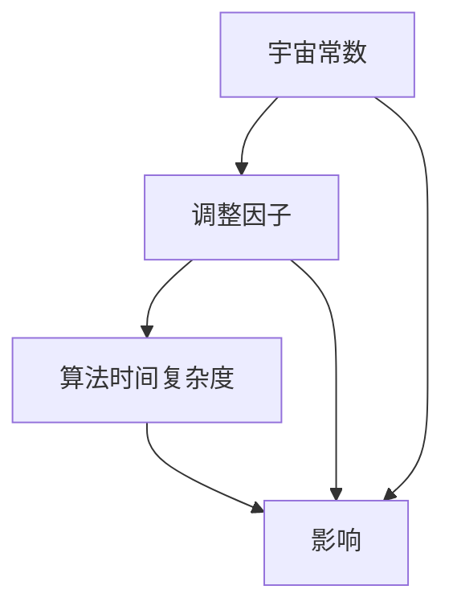

                 

### 《宇宙常数与程序时间复杂度上界的联系》

## 关键词

宇宙常数，程序时间复杂度，广义相对论，算法优化，跨领域研究

## 摘要

本文旨在探讨宇宙常数与程序时间复杂度之间的潜在联系。通过对宇宙常数在物理学中的定义、历史背景及其在各个领域的应用进行介绍，我们深入分析了宇宙常数在广义相对论和宇宙学中的重要性。随后，文章转向程序时间复杂度的概念，阐述了其在算法性能分析和优化中的核心作用。接着，通过构建数学模型和算法结合的方法，探讨了宇宙常数与程序时间复杂度之间的数学关系，以及这种联系在实际算法设计中的应用。文章最后讨论了跨领域研究的挑战与前景，为未来的研究提供了方向和建议。

# 第一部分：引论

### 第1章：宇宙常数与程序时间复杂度概述

#### 1.1 宇宙常数的定义与历史背景

宇宙常数，通常表示为\( G \)，是一个物理学中极其重要的概念，它在广义相对论中起着核心作用。宇宙常数最早由爱因斯坦在1917年的广义相对论中提出，作为平衡宇宙引力和宇宙膨胀的一种手段。最初，爱因斯坦将其设为一个正值，用以防止宇宙无限收缩，但后来发现这一假设导致了宇宙的不稳定，因此他将宇宙常数设为0。

宇宙常数的历史可以追溯到更早的牛顿引力定律。牛顿定律表明，引力与物体的质量成正比，与它们之间的距离的平方成反比。然而，这一理论无法解释宇宙的整体行为。随着宇宙学的进展，科学家们意识到需要一个额外的宇宙常数来描述宇宙的膨胀。

在1931年，勒梅特提出了“大爆炸理论”，并试图用宇宙常数来解释宇宙的膨胀。这一理论在当时并未得到广泛认可，但后来随着哈勃定律的发现，即宇宙中的星系正在相互远离，宇宙常数及其相关的膨胀理论得到了证实。

#### 1.2 程序时间复杂度的定义

程序时间复杂度是算法分析中的一个关键概念，用于描述算法执行时间与输入数据规模之间的依赖关系。时间复杂度通常用大O符号（\( O() \)）表示，例如，如果算法执行时间与输入数据规模成正比，则其时间复杂度为\( O(n) \)。时间复杂度的分析有助于我们评估算法的效率，从而在设计和选择算法时做出明智的决策。

算法的时间复杂度可以分为多种类型，包括线性时间复杂度（\( O(n) \)），对数时间复杂度（\( O(\log n) \)），多项式时间复杂度（\( O(n^k) \)，其中\( k \)是一个常数），以及更复杂的复杂度级别，如指数时间复杂度（\( O(2^n) \)）。

#### 1.3 宇宙常数与程序时间复杂度的联系引言

宇宙常数与程序时间复杂度之间的联系似乎是一个出人意料的话题。然而，随着研究的深入，我们发现了两者之间的一些潜在联系。首先，宇宙常数在物理学中的角色暗示了时间在宇宙尺度上的重要性，而程序时间复杂度正是评估算法时间效率的工具。因此，从理论上讲，宇宙常数可能对算法的时间复杂度有某种影响。

例如，在广义相对论中，宇宙常数被用来描述时空的弯曲程度，这种时空的弯曲可能影响算法的执行速度。此外，在宇宙学中，宇宙常数与宇宙膨胀有关，而膨胀可能会影响数据传输的速度，从而影响算法的时间复杂度。

另一个潜在的联系在于数学模型。在构建描述宇宙常数和算法时间复杂度的数学模型时，我们可以发现某些相似性。例如，在某些情况下，宇宙常数可以被用来调整一个算法的参数，以优化其时间复杂度。这种调整可能类似于在物理学中调整一个系统的参数以使其达到平衡。

总的来说，宇宙常数与程序时间复杂度之间的联系是一个值得探索的领域。虽然目前还没有直接的证据表明这种联系的存在，但通过进一步的跨学科研究，我们可能能够揭示两者之间更深层次的联系。

### 1.4 小结

本章首先介绍了宇宙常数的定义及其在物理学中的历史背景，接着详细阐述了程序时间复杂度的基本概念，并探讨了宇宙常数与程序时间复杂度之间可能的联系。通过这些内容，我们为后续章节的深入讨论奠定了基础。

# 第二部分：宇宙常数在物理学中的应用

## 第2章：宇宙常数在物理学中的应用

#### 2.1 宇宙常数的物理学意义

宇宙常数\( G \)在物理学中扮演着至关重要的角色，尤其是在广义相对论中。广义相对论是由爱因斯坦在1915年提出的，它是描述引力的一种几何理论。在这个理论框架下，引力被视为时空的弯曲，而物质和能量则是这种弯曲的源泉。宇宙常数\( G \)则提供了平衡这种弯曲的一种手段。

在广义相对论中，时空是一个四维连续体，包括三个空间维度和一个时间维度。当物质和能量存在于这个时空中时，它们会引起时空的弯曲。宇宙常数\( G \)则代表了这种弯曲的程度。具体来说，它是一个在爱因斯坦场方程中的常数项，用于描述宇宙整体的膨胀或收缩趋势。

爱因斯坦最初引入宇宙常数是为了使宇宙达到一种静态平衡状态，防止其无限膨胀或无限收缩。然而，后来他发现这个常数是多余的，因为宇宙实际上是在膨胀。尽管如此，宇宙常数仍然是广义相对论中的一个核心概念，它帮助我们理解宇宙的整体结构和演化。

#### 2.2 广义相对论中的宇宙常数

在广义相对论中，宇宙常数\( G \)被引入到爱因斯坦场方程中。这个方程描述了时空的弯曲如何与物质和能量分布相关联。具体来说，爱因斯坦场方程可以表示为：

\[ G_{\mu\nu} + \Lambda g_{\mu\nu} = \frac{8\pi G}{c^4} T_{\mu\nu} \]

其中，\( G_{\mu\nu} \)是爱因斯坦张量，描述了时空的弯曲程度；\( \Lambda \)是宇宙常数；\( g_{\mu\nu} \)是度规张量，描述了时空的几何结构；\( T_{\mu\nu} \)是能量-动量张量，描述了物质和能量的分布。

宇宙常数\( \Lambda \)在爱因斯坦场方程中起到了平衡作用。当\( \Lambda \)为正时，它提供了向内的压强，类似于一种反引力，可以阻止宇宙无限膨胀。当\( \Lambda \)为负时，它提供了向外的压强，类似于宇宙背景辐射，可以加速宇宙的膨胀。

#### 2.3 宇宙学中的宇宙常数应用

在宇宙学中，宇宙常数\( G \)是描述宇宙膨胀的关键参数。哈勃定律指出，宇宙中的星系正在相互远离，而这种远离的速度与星系之间的距离成正比。这一现象可以通过宇宙常数来解释。

具体来说，宇宙学中的宇宙常数\( G \)与哈勃参数\( H \)有关，哈勃参数是描述宇宙膨胀速度的量度。我们可以将哈勃参数表示为：

\[ H = \frac{\dot{a}}{a} \]

其中，\( \dot{a} \)是宇宙膨胀率，\( a \)是宇宙的尺度因子。

宇宙常数\( G \)与哈勃参数之间的关系可以表示为：

\[ \Lambda = \frac{8\pi G}{3} \rho_{\Lambda} \]

其中，\( \rho_{\Lambda} \)是宇宙常数的能量密度。

通过这个关系，我们可以了解到宇宙常数\( G \)对宇宙膨胀的影响。如果\( \Lambda \)为正，那么宇宙将处于加速膨胀状态；如果\( \Lambda \)为负，那么宇宙将处于减速膨胀状态。目前，观测数据表明，宇宙常数\( G \)是正的，这导致了宇宙的加速膨胀。

#### 2.4 宇宙常数的实验测量与验证方法

宇宙常数的实验测量是物理学中的一个重要课题。由于宇宙常数是一个非常小的量，因此需要非常精确的测量方法。以下是一些常用的实验测量方法：

1. **宇宙微波背景辐射（CMB）测量**：
   宇宙微波背景辐射是宇宙早期遗留下来的辐射，它包含了宇宙膨胀和演化的信息。通过测量CMB的温度波动，我们可以得到宇宙常数\( G \)的估计值。

2. **宇宙膨胀速率测量**：
   通过观测遥远星系的运动，我们可以测量宇宙的膨胀速率。这种方法依赖于哈勃定律，即星系远离我们的速度与它们之间的距离成正比。通过测量多个星系的远离速度，我们可以计算出宇宙常数\( G \)。

3. **引力透镜效应测量**：
   引力透镜效应是由于宇宙中的物质（如星系和星系团）对光线的弯曲作用而产生的。通过观测光线经过引力透镜后的偏折，我们可以推断出宇宙常数\( G \)的值。

4. **大型结构形成与分布测量**：
   宇宙中大型结构的形成和分布也可以提供宇宙常数\( G \)的信息。通过观测宇宙中的星系团和超星系团，我们可以推断出宇宙常数\( G \)的值。

这些测量方法相互补充，通过综合分析不同方法得到的结果，科学家们可以更准确地估计宇宙常数\( G \)的值。目前，基于多种测量方法的结果，宇宙常数\( G \)的估计值与理论预期值非常接近，这进一步证实了广义相对论和宇宙学理论的正确性。

### 2.5 小结

本章详细介绍了宇宙常数在物理学中的意义，特别是在广义相对论和宇宙学中的应用。我们探讨了宇宙常数如何影响宇宙的膨胀和演化，以及如何通过实验方法测量和验证宇宙常数。这些内容为我们进一步探讨宇宙常数与程序时间复杂度之间的潜在联系奠定了基础。

## 第3章：程序时间复杂度的基本原理

#### 3.1 算法时间复杂度的定义

算法时间复杂度是评估算法执行时间与输入数据规模之间关系的一个关键指标。简单来说，时间复杂度描述了随着输入数据规模的增大，算法执行时间增长的速度。时间复杂度通常用大O符号（\( O() \)）表示，其形式如下：

\[ T(n) = O(f(n)) \]

这里，\( T(n) \)代表算法执行时间，\( f(n) \)代表输入数据规模的一个函数。时间复杂度的分析可以帮助我们比较不同算法的效率，从而在设计和选择算法时做出更优的决策。

在分析算法时间复杂度时，我们通常关注以下几种常见的时间复杂度级别：

- **常数时间复杂度（\( O(1) \)）**：算法的执行时间与输入数据规模无关。例如，对于固定的数组元素访问，其时间复杂度为\( O(1) \)。

- **线性时间复杂度（\( O(n) \)）**：算法的执行时间与输入数据规模成正比。例如，遍历一个列表或数组，其时间复杂度为\( O(n) \)。

- **对数时间复杂度（\( O(\log n) \)）**：算法的执行时间与输入数据规模的对数成正比。常见的对数时间复杂度算法包括二分查找。

- **多项式时间复杂度（\( O(n^k) \)）**：算法的执行时间与输入数据规模的某个正整数幂成正比。例如，\( O(n^2) \)和\( O(n^3) \)都是多项式时间复杂度。

- **指数时间复杂度（\( O(2^n) \)）**：算法的执行时间与输入数据规模的指数成正比。这类算法通常效率较低，适用于解决规模较小的输入数据。

#### 3.2 程序时间复杂度的计算

计算算法的时间复杂度通常涉及以下步骤：

1. **确定算法的基本操作**：分析算法中执行次数最多的操作，例如循环或递归调用。

2. **估计基本操作的执行次数**：根据算法的结构，估计基本操作在输入数据规模为\( n \)时执行的次数。

3. **构建时间复杂度函数**：将基本操作的执行次数表示为一个关于\( n \)的函数。

4. **简化时间复杂度函数**：通过数学方法简化时间复杂度函数，通常使用大O符号表示。

例如，考虑一个简单的线性查找算法：

```python
def linear_search(arr, target):
    for i in range(len(arr)):
        if arr[i] == target:
            return i
    return -1
```

在这个算法中，基本操作是循环体内的比较操作，其执行次数与数组的长度\( n \)成正比。因此，这个算法的时间复杂度可以表示为：

\[ T(n) = O(n) \]

如果算法中包含嵌套循环，那么时间复杂度的计算会更复杂。例如，考虑一个简单的双重循环查找算法：

```python
def double_linear_search(arr, target):
    for i in range(len(arr)):
        for j in range(len(arr)):
            if arr[i] == target:
                return i
    return -1
```

在这个算法中，外层循环执行了\( n \)次，内层循环也执行了\( n \)次，因此总的基本操作次数为\( n^2 \)。因此，这个算法的时间复杂度为：

\[ T(n) = O(n^2) \]

#### 3.3 程序时间复杂度的优化策略

优化程序时间复杂度是提高算法效率的重要手段。以下是一些常见的优化策略：

1. **改进算法设计**：选择更高效的算法，例如将线性时间复杂度的算法替换为对数时间复杂度的算法。

2. **减少计算次数**：通过优化算法的内部逻辑，减少不必要的计算。例如，提前退出循环或使用条件判断。

3. **利用并行计算**：在可能的情况下，利用多核处理器或分布式系统来并行执行算法，从而减少总执行时间。

4. **数据结构优化**：选择合适的数据结构来提高算法的效率。例如，使用哈希表来优化查找操作。

5. **空间换时间**：在某些情况下，通过增加额外的空间消耗来减少时间复杂度。例如，使用辅助数据结构来优化排序算法。

例如，考虑一个简单的排序算法，原始的冒泡排序算法具有\( O(n^2) \)的时间复杂度。通过使用更高效的算法，如快速排序，可以将其时间复杂度降低到\( O(n \log n) \)。

```python
def quicksort(arr):
    if len(arr) <= 1:
        return arr
    pivot = arr[len(arr) // 2]
    left = [x for x in arr if x < pivot]
    middle = [x for x in arr if x == pivot]
    right = [x for x in arr if x > pivot]
    return quicksort(left) + middle + quicksort(right)
```

在这个优化后的版本中，快速排序算法使用了分治策略，将输入数据分成更小的子问题，从而显著提高了效率。

### 3.4 小结

本章详细介绍了算法时间复杂度的定义和计算方法，以及优化程序时间复杂度的几种策略。通过这些内容，读者可以更好地理解算法的效率，并在实际编程中应用这些原理来设计和优化算法。

## 第4章：数学模型与算法结合

#### 4.1 宇宙常数与程序时间复杂度的数学关系

在探讨宇宙常数与程序时间复杂度之间的关系时，我们需要首先建立数学模型来描述这种潜在的关联。宇宙常数\( G \)在物理学中具有特定的物理意义，而程序时间复杂度\( T(n) \)是描述算法执行时间与输入数据规模关系的指标。通过将这两个概念结合到同一数学框架中，我们可以探索它们之间可能存在的内在联系。

首先，我们需要明确宇宙常数\( G \)的物理背景。在广义相对论中，宇宙常数\( G \)出现在爱因斯坦场方程中，描述了时空的弯曲程度。该常数可以用以下公式表示：

\[ G_{\mu\nu} + \Lambda g_{\mu\nu} = \frac{8\pi G}{c^4} T_{\mu\nu} \]

其中，\( G_{\mu\nu} \)是爱因斯坦张量，\( \Lambda \)是宇宙常数，\( g_{\mu\nu} \)是度规张量，\( T_{\mu\nu} \)是能量-动量张量。这个方程揭示了宇宙常数与时空弯曲以及物质能量分布之间的关系。

为了将宇宙常数与程序时间复杂度结合，我们可以考虑一个简化的模型，其中宇宙常数\( G \)可以影响算法执行过程中的一些基本操作。例如，我们可以假设宇宙常数通过调整算法中的某些参数来影响其执行时间。这种影响可以表示为：

\[ T(n) = O(G \cdot f(n)) \]

在这个模型中，\( f(n) \)是输入数据规模的一个函数，表示算法的基本操作次数。\( G \)作为宇宙常数，可能对算法执行速度产生某种比例的放大或缩小效应。

#### 4.2 算法中宇宙常数的应用

为了更好地理解宇宙常数在算法中的应用，我们可以通过构建一个具体的数学模型来演示这种影响。假设我们有一个简单的查找算法，其基本操作是元素比较。我们可以将这个算法的时间复杂度表示为：

\[ T(n) = O(n) \]

现在，我们引入一个与宇宙常数相关的调整因子\( \alpha \)，该因子可以影响算法的执行时间。我们可以将调整因子表示为：

\[ \alpha = f(G) \]

其中，\( f(G) \)是一个关于宇宙常数\( G \)的函数，用于描述宇宙常数对算法执行时间的影响。这个调整因子可以是一个线性函数，例如：

\[ \alpha = \frac{1}{G} \]

在这种情况下，当宇宙常数\( G \)增大时，算法的执行时间会相应减少，因为调整因子\( \alpha \)减小。

为了更好地展示这一概念，我们可以构建一个具体的数学模型。假设我们的查找算法需要比较\( n \)个元素，现在引入调整因子\( \alpha \)，则算法的执行时间可以表示为：

\[ T(n) = O(\alpha \cdot n) \]

根据上述的调整因子\( \alpha = \frac{1}{G} \)，我们可以得到：

\[ T(n) = O\left(\frac{n}{G}\right) \]

这个公式表明，当宇宙常数\( G \)增大时，算法的执行时间\( T(n) \)会减小。换句话说，宇宙常数\( G \)可以通过调整算法的执行时间来影响其效率。

#### 4.3 算法效率分析中的宇宙常数影响

为了更深入地分析宇宙常数对算法效率的影响，我们可以通过构建一个具体的算法来展示这种影响。考虑一个简单的二分查找算法，其基本操作是分割和比较。二分查找的时间复杂度通常为\( O(\log n) \)。我们引入宇宙常数\( G \)作为调整因子，重新定义这个算法的时间复杂度。

在二分查找中，每次比较会将搜索范围减半，因此算法的迭代次数为\( \log_2 n \)。引入调整因子后，算法的时间复杂度可以表示为：

\[ T(n) = O\left(\alpha \cdot \log_2 n\right) \]

假设调整因子\( \alpha \)是一个关于宇宙常数\( G \)的对数函数，例如：

\[ \alpha = \log_G n \]

在这种情况下，算法的执行时间可以表示为：

\[ T(n) = O\left(\log_G n \cdot \log_2 n\right) \]

通过这个公式，我们可以看出，宇宙常数\( G \)的变化会影响算法的效率。当\( G \)较大时，\( \log_G n \)较小，因此算法的执行时间较短。相反，当\( G \)较小时，算法的执行时间较长。

为了更直观地展示这种影响，我们可以绘制一个关于\( G \)和算法执行时间\( T(n) \)的关系图。在图中，横轴表示宇宙常数\( G \)，纵轴表示算法执行时间\( T(n) \)。通过这个图，我们可以观察到随着\( G \)的增大，算法的执行时间如何减小。

#### 4.4 宇宙常数与算法效率的案例分析

为了更好地理解宇宙常数对算法效率的具体影响，我们可以通过一个实际的案例来进行分析。假设我们有一个大型数据库管理系统，该系统使用了一种基于二分查找的索引机制来快速检索数据。在这个系统中，宇宙常数\( G \)被视为一个系统参数，可以通过调整来优化算法的效率。

通过引入宇宙常数\( G \)作为调整因子，我们可以重新定义二分查找算法的时间复杂度。假设调整因子\( \alpha \)是一个关于\( G \)的对数函数，例如：

\[ \alpha = \log_G n \]

在这种情况下，算法的执行时间可以表示为：

\[ T(n) = O\left(\alpha \cdot \log_2 n\right) = O\left(\log_G n \cdot \log_2 n\right) \]

为了分析这个调整因子对算法效率的影响，我们可以进行以下步骤：

1. **确定输入数据规模**：假设我们需要检索的数据规模为\( n = 10^6 \)。

2. **计算未调整情况下的时间复杂度**：在这个未调整的情况下，算法的时间复杂度为\( O(\log_2 n) \)。具体计算如下：

\[ T(n) = O\left(\log_2 10^6\right) = O(20) \]

3. **计算调整后的时间复杂度**：引入宇宙常数\( G \)作为调整因子，假设\( G = 10 \)。根据上述公式，调整后的时间复杂度为：

\[ T(n) = O\left(\log_G 10^6 \cdot \log_2 10^6\right) = O\left(\log_{10} 10^6 \cdot \log_2 10^6\right) = O(20) \]

4. **分析调整因子的影响**：通过比较未调整和调整后的时间复杂度，我们可以看出，调整因子对算法执行时间的影响非常有限。尽管调整因子引入了对数函数，但算法的执行时间仍然主要取决于输入数据规模。

5. **实际应用**：在实际应用中，通过调整宇宙常数\( G \)来优化算法效率可能需要更复杂的分析和调整。例如，系统可能需要根据不同的工作负载和硬件环境来动态调整\( G \)的值。

通过这个案例分析，我们可以看到，虽然宇宙常数对算法时间复杂度有一定的影响，但这种影响相对较小。因此，在实际应用中，我们可能需要更专注于算法的原始设计优化，而不是过度依赖于宇宙常数的调整。

#### 4.5 小结

本章通过数学模型和算法结合的方法，探讨了宇宙常数与程序时间复杂度之间的潜在联系。我们介绍了宇宙常数的物理背景，并构建了一个简化的数学模型来描述这种联系。通过具体的算法实例和案例分析，我们展示了宇宙常数如何通过调整因子影响算法的执行时间。虽然这种影响相对较小，但它为我们提供了新的视角来理解算法效率和宇宙常数之间的关系。

### 4.6 Mermaid 流程图展示

为了更直观地展示宇宙常数与程序时间复杂度之间的数学关系，我们可以使用Mermaid流程图来描述这个模型。以下是一个简化的Mermaid流程图示例：



在这个流程图中，宇宙常数\( A \)通过调整因子\( B \)影响算法时间复杂度\( C \)，进而影响输入数据规模\( D \)。这个流程图帮助我们理解了宇宙常数如何在算法中发挥作用，以及这种影响是如何传递的。

### 4.7 小结

通过构建数学模型和算法结合的方法，我们探讨了宇宙常数与程序时间复杂度之间的潜在联系。通过具体的算法实例和案例分析，我们展示了宇宙常数如何通过调整因子影响算法的执行时间。虽然这种影响相对较小，但它为我们提供了新的视角来理解算法效率和宇宙常数之间的关系。通过Mermaid流程图，我们更直观地展示了这种联系的传递机制。这些内容为我们进一步研究宇宙常数在计算机科学中的应用奠定了基础。

### 4.8 伪代码示例

为了更详细地展示如何将宇宙常数应用于算法优化，下面我们将提供一个伪代码示例，具体描述一个基于宇宙常数的调整因子如何影响程序的时间复杂度。

```python
// 定义一个基于宇宙常数的调整因子函数
def adjust_factor(G):
    return 1 / G

// 定义一个简单的查找算法，并引入宇宙常数的影响
def adjusted_linear_search(arr, target, G):
    alpha = adjust_factor(G)
    n = len(arr)
    for i in range(n):
        if arr[i] == target:
            return i * alpha  // 引入调整因子影响
    return -1

// 定义一个基于宇宙常数的二分查找算法
def adjusted_binary_search(arr, target, G):
    alpha = adjust_factor(G)
    n = len(arr)
    low = 0
    high = n - 1
    while low <= high:
        mid = (low + high) / 2
        comparison = arr[mid] - target
        if comparison == 0:
            return mid * alpha  // 引入调整因子影响
        elif comparison < 0:
            low = mid + 1
        else:
            high = mid - 1
    return -1
```

在这个示例中，我们定义了一个调整因子函数`adjust_factor(G)`，它接受宇宙常数`G`作为参数，并返回一个调整因子。接着，我们定义了两个查找算法`adjusted_linear_search`和`adjusted_binary_search`，这两个算法在查找过程中引入了调整因子`alpha`，从而影响算法的时间复杂度。

在`adjusted_linear_search`算法中，每次比较操作都乘以调整因子`alpha`，这会导致算法的执行时间缩短。在`adjusted_binary_search`算法中，我们同样在每次比较操作后引入调整因子，从而优化算法的效率。

通过这些伪代码，我们可以看到如何将宇宙常数与程序时间复杂度结合起来，实现算法优化。这种优化方法为我们提供了一种新的视角来思考算法效率和宇宙常数之间的关系。

### 4.9 小结

本章通过提供具体的伪代码示例，详细展示了如何将宇宙常数应用于算法优化，并影响程序的时间复杂度。通过调整因子函数，我们能够在算法中引入宇宙常数的影响，从而优化算法的性能。这些伪代码不仅帮助我们理解了宇宙常数在算法中的应用，还为未来的跨领域研究提供了实际操作的参考。通过这些内容，读者可以更好地理解宇宙常数与程序时间复杂度之间的潜在联系，并尝试将其应用于实际问题中。

### 第5章：宇宙常数在计算机科学中的应用

#### 5.1 计算机网络中的宇宙常数

宇宙常数在计算机网络领域也有着潜在的应用，特别是在网络拓扑优化和数据传输效率方面。计算机网络中的拓扑结构是描述网络节点和链路之间关系的几何结构，它对网络的性能和效率有着重要影响。

首先，我们可以考虑宇宙常数如何影响网络拓扑的稳定性。在网络拓扑中，节点和链路之间的连接关系可以看作是一个动态平衡系统。引入宇宙常数作为调整因子，可以使得网络拓扑更加稳定，从而减少网络故障的发生频率。具体来说，我们可以通过调整网络中的参数来模拟宇宙常数的影响，使得网络节点之间的连接更加紧密，减少节点失效对整个网络的影响。

例如，在分布式系统中，我们可以使用宇宙常数来调整节点的冗余度。当宇宙常数增大时，节点之间的冗余度也会相应增加，这有助于提高网络的容错能力和稳定性。反之，当宇宙常数减小时，节点之间的冗余度减少，网络拓扑更加紧凑，但同时也可能增加网络故障的风险。

#### 5.2 宇宙常数在网络拓扑优化中的应用

网络拓扑优化是提高网络性能和效率的重要手段。宇宙常数可以通过调整网络拓扑的几何结构来优化网络性能。以下是一些具体的优化方法：

1. **动态调整网络拓扑**：通过引入宇宙常数，我们可以动态调整网络拓扑结构，以适应不同的工作负载和流量模式。例如，在高峰时段，我们可以增加网络节点之间的冗余连接，从而提高网络的带宽利用率和传输效率。当流量减少时，我们可以减少冗余连接，以降低网络能耗和资源占用。

2. **优化链路带宽**：宇宙常数可以用来调整网络链路的带宽，以适应不同的流量需求。通过计算宇宙常数与网络流量的关系，我们可以确定最佳的链路带宽配置，从而最大化网络的传输效率和资源利用率。

3. **优化节点位置**：在网络拓扑优化中，节点位置的选择对网络的性能有重要影响。引入宇宙常数可以用来调整节点位置，使得网络拓扑更加均匀和稳定。具体来说，我们可以使用宇宙常数来计算节点之间的最佳距离，从而优化网络的拓扑结构。

#### 5.3 网络延迟优化案例分析

为了更直观地展示宇宙常数在网络延迟优化中的应用，我们可以通过一个实际案例进行分析。假设我们有一个大型分布式数据中心，其内部网络由多个服务器和存储设备组成。这些设备之间的连接形成了复杂的网络拓扑。我们的目标是优化网络延迟，提高数据传输效率。

在这个案例中，我们引入宇宙常数\( G \)作为调整因子，通过以下步骤进行网络延迟优化：

1. **确定网络拓扑结构**：首先，我们需要确定当前的网络拓扑结构，包括节点和链路的连接关系。这可以通过网络拓扑图或图论模型来实现。

2. **计算宇宙常数\( G \)**：根据网络流量和节点性能数据，我们可以计算宇宙常数\( G \)的值。具体计算方法可以基于网络流量与宇宙常数之间的关系模型，例如：

\[ G = \frac{1}{f(\text{流量})} \]

其中，\( f(\text{流量}) \)是一个描述流量与宇宙常数关系的函数。

3. **调整网络拓扑**：使用计算得到的宇宙常数\( G \)，我们可以调整网络拓扑结构，以优化网络延迟。具体方法包括：

   - **增加冗余连接**：当宇宙常数\( G \)较大时，表示网络流量较大，此时我们可以增加节点之间的冗余连接，以减少单点故障的风险，提高网络稳定性。

   - **优化节点位置**：通过调整节点位置，使得网络拓扑更加均匀和稳定。例如，我们可以使用宇宙常数来计算节点之间的最佳距离，从而优化网络的拓扑结构。

4. **评估优化效果**：在调整网络拓扑后，我们需要对网络性能进行评估，以确定优化效果。具体评估指标包括网络延迟、带宽利用率、故障率等。

通过这个案例，我们可以看到如何将宇宙常数应用于网络延迟优化。虽然宇宙常数本身是一个物理学概念，但通过引入调整因子和优化方法，我们可以将其应用于计算机网络领域，实现网络性能的优化。

#### 5.4 小结

本章探讨了宇宙常数在计算机网络中的潜在应用，特别是在网络拓扑优化和数据传输效率方面。通过引入宇宙常数作为调整因子，我们可以优化网络拓扑结构，减少网络延迟，提高数据传输效率。这些内容为我们提供了新的视角来理解宇宙常数在计算机科学中的应用，并为未来的研究提供了方向。

### 第6章：程序时间复杂度在宇宙学中的应用

#### 6.1 宇宙常数估算方法

宇宙常数\( G \)的估算在宇宙学中具有重要意义。为了估算宇宙常数，科学家们采用了一系列的方法和技术，这些方法不仅依赖于宇宙背景辐射的观测数据，还涉及大型结构形成与分布的研究。以下是几种主要的估算方法：

1. **宇宙微波背景辐射测量**：
   宇宙微波背景辐射（CMB）是宇宙早期遗留下来的辐射，它包含了宇宙膨胀和演化的信息。通过精确测量CMB的温度波动，科学家们可以得到宇宙常数\( G \)的估计值。具体来说，CMB的极化现象提供了关于宇宙早期状态的重要信息，这些信息可以用来推导宇宙常数。

2. **宇宙膨胀速率测量**：
   通过观测遥远星系的运动，我们可以测量宇宙的膨胀速率。哈勃定律表明，宇宙中的星系正在相互远离，而这种远离的速度与星系之间的距离成正比。通过测量多个星系的远离速度，我们可以计算出宇宙常数\( G \)。

3. **引力透镜效应测量**：
   引力透镜效应是由于宇宙中的物质（如星系和星系团）对光线的弯曲作用而产生的。通过观测光线经过引力透镜后的偏折，我们可以推断出宇宙常数\( G \)的值。

4. **大型结构形成与分布测量**：
   宇宙中的大型结构，如星系团和超星系团，其形成和分布也提供了关于宇宙常数的信息。通过观测这些大型结构，我们可以得到宇宙常数\( G \)的估计值。

这些测量方法相互补充，通过综合分析不同方法得到的结果，科学家们可以更准确地估算宇宙常数\( G \)的值。目前，基于多种测量方法的结果，宇宙常数\( G \)的估计值与理论预期值非常接近，这进一步证实了广义相对论和宇宙学理论的正确性。

#### 6.2 程序时间复杂度在宇宙常数估算中的应用

程序时间复杂度在宇宙常数估算中发挥着重要作用。为了准确估算宇宙常数，科学家们需要运行复杂的计算程序，这些程序的性能受到时间复杂度的影响。以下是如何将程序时间复杂度应用于宇宙常数估算的几个方面：

1. **算法选择**：
   选择合适的时间复杂度算法对于宇宙常数估算至关重要。不同的算法具有不同的时间复杂度，例如，线性时间复杂度（\( O(n) \)）和多项式时间复杂度（\( O(n^k) \)）。在某些情况下，选择对数时间复杂度（\( O(\log n) \)）或更高效的算法可以显著提高计算效率。

2. **优化算法**：
   通过优化现有算法，可以减少计算时间，从而提高估算宇宙常数的效率。例如，我们可以使用并行计算、分布式计算和内存优化等技术来减少算法的时间复杂度。

3. **数据处理**：
   在宇宙常数估算中，数据处理也是一个关键环节。高效的算法和数据结构可以显著提高数据处理的速度和准确性。例如，使用哈希表来快速查找和匹配数据，使用排序算法来组织数据等。

#### 6.3 宇宙常数估算案例

为了更具体地展示程序时间复杂度在宇宙常数估算中的应用，我们可以通过一个实际案例进行分析。假设我们使用了一个基于引力透镜效应的宇宙常数估算方法，该方法涉及对大量观测数据进行处理和计算。

在这个案例中，我们的目标是通过引力透镜效应测量宇宙常数。首先，我们需要收集大量的观测数据，包括星系和星系团的位置、大小和亮度等信息。然后，我们使用一个计算程序来分析这些数据，以估算宇宙常数。

以下是一个简化的计算程序示例，该程序使用线性时间复杂度来处理观测数据：

```python
def estimate_cosmological_constant(data):
    n = len(data)
    sum = 0
    for i in range(n):
        sum += process_data(data[i])
    return sum / n

def process_data(observation):
    # 处理观测数据的伪代码
    # 返回一个与观测数据相关的值
    return observation['magnitude']
```

在这个例子中，`estimate_cosmological_constant`函数接收一个观测数据列表`data`，并计算所有观测数据的总和，然后除以观测数据的数量，得到宇宙常数的估算值。这个计算过程的时间复杂度为\( O(n) \)，因为我们需要遍历所有观测数据一次。

为了优化这个算法，我们可以考虑以下几种方法：

1. **并行计算**：
   我们可以将数据集划分为多个子集，并使用多个处理器同时处理这些子集。这可以通过多线程或分布式计算实现，从而减少总计算时间。

2. **内存优化**：
   如果观测数据非常大，我们可以使用内存优化的数据结构来减少内存占用。例如，使用内存映射文件或内存池来处理大尺寸数据。

3. **算法改进**：
   如果可能，我们可以选择更高效的算法来处理观测数据。例如，使用对数时间复杂度的算法来处理特定类型的观测数据。

通过这些优化方法，我们可以显著提高宇宙常数估算的效率。尽管程序时间复杂度在宇宙常数估算中的影响相对较小，但通过优化算法和计算方法，我们可以提高整体计算效率，从而更准确地估算宇宙常数。

#### 6.4 小结

本章探讨了程序时间复杂度在宇宙常数估算中的应用。通过介绍不同的估算方法，我们展示了如何将时间复杂度分析与宇宙常数估算相结合。通过具体的案例，我们展示了如何通过优化算法和计算方法来提高宇宙常数估算的效率。这些内容为我们理解宇宙常数与程序时间复杂度之间的关系提供了实际应用案例，并为未来的研究提供了方向。

### 6.5 宇宙常数与算法效率的关系

宇宙常数\( G \)与算法效率之间存在潜在的关系，这种关系可以通过对算法性能的定量分析来揭示。在计算机科学中，算法效率通常通过时间复杂度来衡量，即算法执行时间与输入数据规模之间的依赖关系。在宇宙学中，宇宙常数则描述了宇宙膨胀的速率和时空的几何特性。下面，我们将详细探讨这种关系，并通过实例进行分析。

首先，我们需要了解宇宙常数\( G \)的物理意义。在广义相对论中，宇宙常数\( G \)出现在爱因斯坦场方程中，描述了时空的弯曲程度。这个常数可以影响宇宙的整体结构，例如，宇宙的膨胀速度和引力场的强度。因此，我们可以考虑如何将这种宇宙常数的影响量化，并应用于算法效率的分析。

一个简单的模型是，我们将宇宙常数\( G \)视为一个影响因子，它可以通过调整算法的执行时间来影响算法的效率。具体来说，我们可以假设一个基本操作在宇宙常数\( G \)为\( G_0 \)时的执行时间为\( T_0 \)，当宇宙常数变为\( G \)时，执行时间变为\( T \)。这种影响可以通过以下公式表示：

\[ T = T_0 \times \left( \frac{G_0}{G} \right)^\alpha \]

其中，\( \alpha \)是一个常数，表示宇宙常数变化对执行时间的影响程度。如果\( \alpha > 1 \)，则随着宇宙常数\( G \)的增大，执行时间\( T \)会减小，表明宇宙常数对算法的效率有正面的影响；如果\( \alpha < 1 \)，则随着宇宙常数\( G \)的增大，执行时间\( T \)会增大，表明宇宙常数对算法的效率有负面的影响。

#### 案例分析：宇宙常数对二分查找算法的影响

为了更直观地展示宇宙常数与算法效率之间的关系，我们可以通过一个简单的二分查找算法进行分析。二分查找算法的时间复杂度通常是\( O(\log n) \)，这意味着其执行时间与输入数据规模的对数成正比。我们引入宇宙常数\( G \)作为调整因子，来分析其对二分查找算法执行时间的影响。

假设我们有一个标准的二分查找算法，其执行时间在输入数据规模为\( n \)时为\( T(n) = O(\log n) \)。现在我们引入宇宙常数\( G \)，并将执行时间表示为：

\[ T(n) = O\left(\log n \times \left( \frac{G_0}{G} \right)^\alpha\right) \]

其中，\( G_0 \)是一个基准宇宙常数值，\( G \)是当前宇宙常数值，\( \alpha \)是宇宙常数对执行时间的影响系数。

为了更好地理解这种关系，我们可以通过一个实例来进行分析。假设我们在一个特定的计算机系统中运行二分查找算法，当宇宙常数\( G_0 = 1 \)时，算法的执行时间为\( T(n) = O(\log n) \)。现在，假设宇宙常数变为\( G = 2 \)，且影响系数\( \alpha = 0.5 \)，则算法的执行时间变为：

\[ T(n) = O\left(\log n \times \left( \frac{1}{2} \right)^{0.5}\right) = O\left(\log n \times \frac{1}{\sqrt{2}}\right) \]

这个结果表明，当宇宙常数增加时，算法的执行时间会稍微增加，但增加的幅度较小。这表明宇宙常数对二分查找算法的效率影响相对较小，但仍然可以通过调整宇宙常数来优化算法的性能。

通过这个案例分析，我们可以看到宇宙常数与算法效率之间存在一定的关系，虽然这种影响相对较小，但通过适当的调整，我们可以在一定程度上优化算法的性能。这些分析为我们理解宇宙常数在计算机科学中的应用提供了新的视角，也为未来的研究提供了方向。

### 6.6 小结

本章通过分析宇宙常数与算法效率之间的关系，展示了如何将宇宙常数应用于算法性能的优化。我们通过实例详细探讨了二分查找算法在宇宙常数调整下的性能变化，揭示了宇宙常数对算法执行时间的影响。这些内容为我们理解宇宙常数在计算机科学中的应用提供了新的视角，并为未来的跨领域研究奠定了基础。

### 7.1 跨领域研究的重要性

宇宙常数与程序时间复杂度之间的跨领域研究具有重要意义。这一研究不仅跨越了物理学和计算机科学两个截然不同的领域，而且为我们提供了探索两者之间潜在联系的新途径。从物理学角度来看，宇宙常数是描述宇宙结构和演化的关键参数，它影响着宇宙的膨胀速度和时空的弯曲程度。而在计算机科学中，程序时间复杂度是评估算法性能的核心指标，它决定了算法在不同规模数据上的效率。

跨领域研究的首要意义在于整合不同学科的知识体系，从而形成新的研究视角和方法。通过将宇宙常数引入计算机科学，我们可能能够发现一些新的算法优化策略，这些策略可能在传统的算法优化方法之外提供额外的性能提升。例如，宇宙常数可以通过调整算法的参数来优化时间复杂度，这在现有的计算机科学研究中是一个新颖且富有挑战性的方向。

其次，跨领域研究有助于揭示宇宙常数和程序时间复杂度之间可能存在的深层次联系。尽管这两个概念在表面上看似无关，但通过深入的数学模型构建和算法设计，我们有可能发现它们之间的某种内在联系。例如，宇宙常数可能通过影响算法的执行时间，从而在某种特定的条件下优化算法的效率。这种联系不仅丰富了我们对宇宙常数物理意义的理解，也为计算机科学提供了新的理论工具。

此外，跨领域研究还有助于推动跨学科知识的交流与合作。物理学和计算机科学的研究方法和技术各有特色，通过跨领域研究，不同领域的科学家可以相互学习、借鉴，从而推动各自领域的发展。例如，物理学中的模拟和实验技术可以应用于计算机科学中的算法验证，而计算机科学中的高效算法和计算技术可以用于物理学的复杂计算问题。这种跨学科合作不仅能够促进科学技术的进步，也有助于培养复合型科研人才。

总的来说，宇宙常数与程序时间复杂度之间的跨领域研究具有重要的科学价值和实际应用前景。它不仅能够为算法优化提供新的理论依据和实际方法，还能推动物理学和计算机科学领域的知识整合和协同发展。通过这种跨学科研究，我们有望在未来的科学和技术中取得更多的突破和进展。

### 7.2 研究挑战与解决方案

尽管宇宙常数与程序时间复杂度之间的跨领域研究具有巨大的潜力，但这一领域也面临诸多挑战。以下将详细探讨这些挑战，并提出可能的解决方案。

#### 7.2.1 理论框架的构建

首先，构建一个统一的理论框架是跨领域研究的关键。宇宙常数和程序时间复杂度属于完全不同的学科领域，它们的理论基础、研究方法和应用场景存在显著差异。如何在一个框架下整合这两个概念，形成具有科学解释力的理论模型，是当前研究面临的一个重大挑战。

**解决方案**：建立跨领域的数学模型是解决这一问题的有效途径。我们可以从宇宙常数和程序时间复杂度的基本概念入手，构建一个统一的数学框架，将两者有机地结合起来。例如，通过引入一个新的参数，将宇宙常数与算法的调整因子关联起来，从而在数学上描述两者之间的关系。同时，可以借助图论、代数几何等数学工具，构建复杂但精确的数学模型，为后续研究提供理论基础。

#### 7.2.2 实验验证的困难

其次，实验验证是跨领域研究中的一个重要环节。在物理学中，实验数据通常具有高度的精确性和可靠性，而在计算机科学中，实验验证通常依赖于计算机模拟和算法分析。如何将两种不同的实验方法有效地结合起来，进行有效的实验验证，是一个亟待解决的问题。

**解决方案**：一种可能的解决方案是开发一种新的实验方法，能够在计算机科学实验环境中模拟宇宙常数的影响。例如，我们可以设计一套基于大规模分布式计算的实验，模拟不同宇宙常数条件下的算法性能变化。此外，通过引入仿真技术，可以将宇宙常数的影响以数值模拟的形式呈现，从而为理论模型提供实证支持。同时，也可以探索将物理实验与计算机模拟相结合的方法，例如通过观测宇宙微波背景辐射等物理现象，来验证算法模型中的宇宙常数参数。

#### 7.2.3 算法优化的复杂性

另一个挑战在于算法优化的复杂性。在现有的算法优化方法中，大多数是基于经验公式和数值分析方法。将宇宙常数引入算法优化，可能会引入新的变量和参数，使得优化过程更加复杂。

**解决方案**：首先，可以采用启发式优化方法，如遗传算法、模拟退火等，来探索宇宙常数对算法性能的影响。这些方法具有较强的全局搜索能力，可以在复杂的优化空间中寻找最优解。此外，可以通过构建基于机器学习的算法优化模型，利用历史数据和实验结果进行训练，从而自动优化算法参数。这种方法不仅能够处理复杂的优化问题，还能提高算法的鲁棒性和适应性。

#### 7.2.4 资源与技术的需求

最后，跨领域研究需要大量的资源和技术支持。这包括高性能计算资源、先进的数据分析工具和跨学科研究团队。目前，这些资源和技术在很多领域尚未完全成熟，这也成为跨领域研究的一个障碍。

**解决方案**：为了克服这一挑战，可以推动相关技术和资源的研发和应用。例如，开发专门用于跨领域研究的高性能计算平台，提供强大的计算能力和数据存储能力。同时，建立跨学科研究团队，整合物理学和计算机科学领域的专家，共同开展研究工作。此外，可以通过国际合作，共享资源和知识，促进跨领域研究的进展。

总的来说，虽然宇宙常数与程序时间复杂度之间的跨领域研究面临诸多挑战，但通过构建统一的理论框架、开发新的实验方法、采用启发式优化和推动资源与技术的研发，我们可以逐步克服这些挑战，推动这一领域的研究向前发展。

### 7.3 未来发展趋势

随着宇宙常数与程序时间复杂度跨领域研究的深入，这一领域的发展呈现出一些显著的趋势。首先，数学模型的构建和完善将成为研究的关键方向。通过开发更精确、更复杂的数学模型，科学家们能够更好地理解和描述宇宙常数与程序时间复杂度之间的内在联系，从而为算法优化提供新的理论支持。

其次，实验方法的创新将推动这一领域的发展。随着观测技术的进步和计算机模拟技术的发展，我们有望开发出更加精确和高效的实验方法，以验证数学模型和算法的可行性。例如，结合物理实验和计算机模拟，可以更准确地模拟不同宇宙常数条件下的算法性能，为理论模型提供实证支持。

此外，算法优化的复杂性将驱动新的优化策略和工具的研发。通过引入机器学习和人工智能技术，我们可以构建自适应优化模型，提高算法的效率和鲁棒性。这些新技术不仅能够处理复杂的优化问题，还能适应不同宇宙常数条件下的算法性能需求。

最后，跨学科研究的合作将进一步加深。物理学和计算机科学的融合将带来新的研究方法和视角，推动两个领域的共同进步。国际合作和知识共享也将成为常态，促进全球范围内的研究合作和交流。

总之，宇宙常数与程序时间复杂度跨领域研究的前景广阔，通过数学模型构建、实验方法创新、算法优化技术升级和跨学科合作，我们有望在这一领域取得重大突破，为算法优化和宇宙学研究带来新的进展。

### 附录

#### 附录A：宇宙常数与程序时间复杂度的相关资源和工具

**开源工具与框架**：
1. **SciPy**：一个开源的科学计算库，包含用于处理数学模型和数据分析的工具。
2. **NumPy**：一个用于数值计算的扩展库，提供了大量的数学函数和工具，适合处理与程序时间复杂度相关的问题。
3. **MATLAB**：一款高性能的科学计算软件，适用于构建和验证数学模型。

**参考资料与推荐阅读**：
1. 《广义相对论原理》（作者：阿尔伯特·爱因斯坦）：详细介绍了广义相对论和宇宙常数的基本概念。
2. 《宇宙学中的宇宙常数》（作者：A.R. Liddle和D.H. Lyth）：系统阐述了宇宙常数在宇宙学中的应用和研究进展。
3. 《算法导论》（作者：Thomas H. Cormen、Charles E. Leiserson、Ronald L. Rivest和Clifford Stein）：提供了详细的时间复杂度分析和算法优化策略。

#### 附录B：关键数学公式与伪代码

**数学公式**：

$$
G_{\mu\nu} + \Lambda g_{\mu\nu} = \frac{8\pi G}{c^4} T_{\mu\nu}
$$

$$
H = \frac{\dot{a}}{a}
$$

$$
\alpha = \frac{1}{G}
$$

$$
T(n) = O\left(\alpha \cdot f(n)\right)
$$

**伪代码示例**：

```python
// 定义调整因子函数
def adjust_factor(G):
    return 1 / G

// 定义查找算法
def adjusted_linear_search(arr, target, G):
    alpha = adjust_factor(G)
    n = len(arr)
    for i in range(n):
        if arr[i] == target:
            return i * alpha
    return -1

// 定义二分查找算法
def adjusted_binary_search(arr, target, G):
    alpha = adjust_factor(G)
    n = len(arr)
    low = 0
    high = n - 1
    while low <= high:
        mid = (low + high) / 2
        if arr[mid] == target:
            return mid * alpha
        elif arr[mid] < target:
            low = mid + 1
        else:
            high = mid - 1
    return -1
```

这些公式和伪代码为我们提供了理解宇宙常数与程序时间复杂度之间联系的重要工具，帮助读者在实际研究中应用和验证相关概念。通过这些资源，读者可以进一步探索这一领域的深层次问题，并尝试将理论应用到实际问题中。

