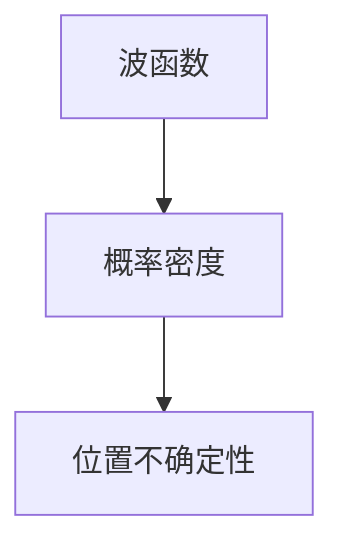
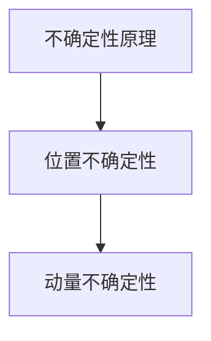
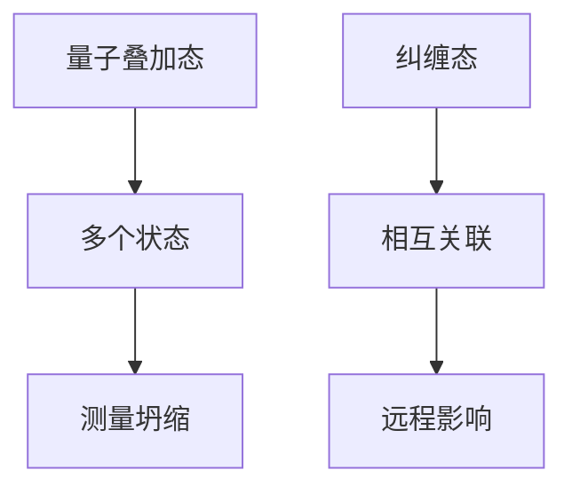
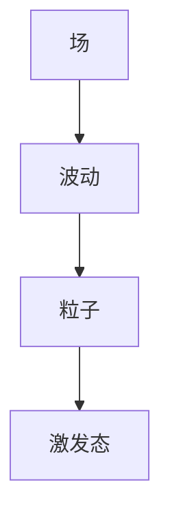
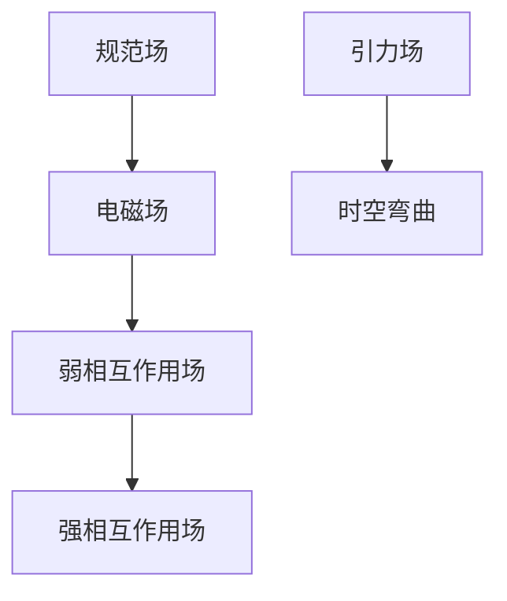
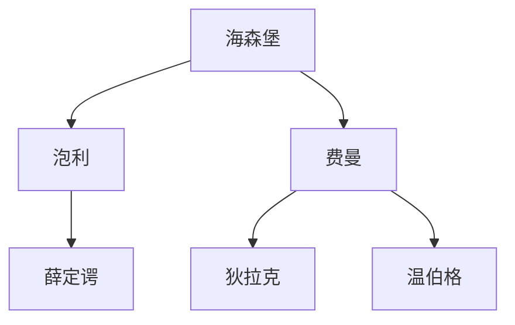
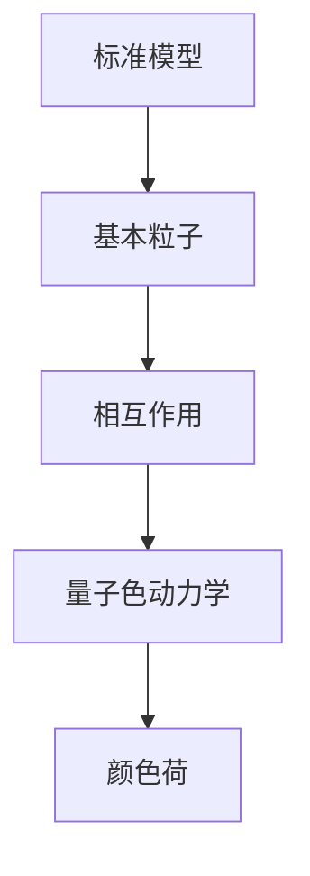
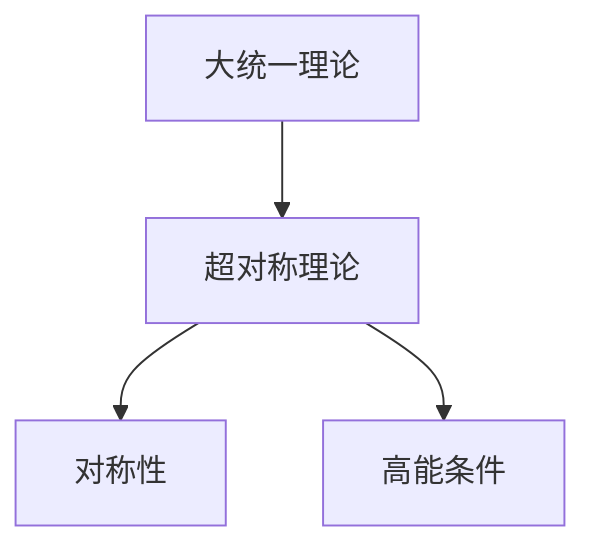

                 

### 文章标题

# 《宇宙是否只是一个巨大的量子场》

> 关键词：量子场论、宇宙学、波函数、量子纠缠、不确定性原理、量子信息、超弦理论、宇宙背景辐射、大统一理论

> 摘要：本文将从量子场论的基础概念出发，深入探讨宇宙是否可能是量子场的一种表现形式。通过分析量子力学的核心原理、量子场论的发展历程和应用，结合宇宙学的核心概念，探讨量子场论在宇宙学中的应用，以及量子场论的未来发展方向和挑战。文章旨在为读者呈现量子场论与宇宙学之间的紧密联系，并展望量子场论在未来科学和社会中的重要地位。

## 目录大纲

### 第一部分：量子场论基础

#### 第1章：量子力学与量子场论

##### 1.1 量子力学的核心原理

###### 1.1.1 波函数与概率解释

###### 1.1.2 不确定性原理

###### 1.1.3 量子叠加态与纠缠态

##### 1.2 量子场论的概念与发展历程

###### 1.2.1 场与粒子的关系

###### 1.2.2 规范场与引力场

###### 1.2.3 量子场论的起源与发展

##### 1.2.4 标准模型与强相互作用

##### 1.2.5 大统一理论

#### 第2章：量子场论的核心原理与架构

##### 2.1 量子场论中的基本方程

###### 2.1.1 狄拉克方程

###### 2.1.2 量子场方程

###### 2.1.3 规范场方程

##### 2.2 量子场论的对称性与守恒定律

###### 2.2.1 对称性与守恒定律

###### 2.2.2 规范对称性与规范不变性

###### 2.2.3 规范场中的物理现象

##### 2.3 量子场论的应用

###### 2.3.1 量子电动力学（QED）的应用

###### 2.3.2 强相互作用与核物理

###### 2.3.3 量子场论在核医学中的应用

### 第3章：量子场论与宇宙学

##### 3.1 宇宙学的核心概念

###### 3.1.1 宇宙膨胀与宇宙背景辐射

###### 3.1.2 黑洞与暗物质

###### 3.1.3 宇宙的起源与演化

##### 3.2 量子场论在宇宙学中的应用

###### 3.2.1 量子引力理论

###### 3.2.2 量子场论与宇宙学中的疑难问题

###### 3.2.3 宇宙学与量子场论的交叉应用

### 第二部分：量子场论的未来与挑战

#### 第4章：量子场论的发展方向

##### 4.1 量子场论与超弦理论

###### 4.1.1 超弦理论的基本概念

###### 4.1.2 超弦理论与量子场论的关系

###### 4.1.3 超弦理论的实验验证

##### 4.2 量子场论与量子信息科学

###### 4.2.1 量子场论在量子信息处理中的应用

###### 4.2.2 量子场论与量子通信

###### 4.2.3 量子场论与量子计算

#### 第5章：量子场论面临的挑战

##### 5.1 量子场论与实验验证

###### 5.1.1 量子场论实验验证的现状

###### 5.1.2 量子场论实验验证的难点与挑战

###### 5.1.3 实验物理在量子场论发展中的作用

##### 5.2 量子场论与哲学思考

###### 5.2.1 量子场论对宇宙本质的哲学思考

###### 5.2.2 量子场论与物理学的统一

###### 5.2.3 量子场论与人类认知的边界

#### 第6章：量子场论在教育与研究中的应用

##### 6.1 量子场论在高等教育中的应用

###### 6.1.1 量子场论课程设置与教学

###### 6.1.2 量子场论研究生的培养

###### 6.1.3 量子场论在国际合作与交流中的角色

##### 6.2 量子场论在科学研究中的应用

###### 6.2.1 量子场论在基础物理研究中的应用

###### 6.2.2 量子场论在高能物理实验中的应用

###### 6.2.3 量子场论在天体物理与宇宙学中的应用

#### 第7章：量子场论的未来展望

##### 7.1 量子场论的发展趋势

###### 7.1.1 量子场论在未来科学中的地位

###### 7.1.2 量子场论在新技术开发中的应用

###### 7.1.3 量子场论对人类社会的影响

##### 7.2 量子场论的未来挑战

###### 7.2.1 量子场论面临的科学难题

###### 7.2.2 量子场论与实际应用的结合

###### 7.2.3 量子场论在跨学科研究中的角色

### 附录

#### 附录 A：量子场论相关资料与资源

##### A.1 量子场论经典教材与论文

##### A.2 量子场论研究机构与实验室

##### A.3 量子场论在线课程与教育资源

##### A.4 量子场论社区与学术交流平台

## 引言

### 探索宇宙的本质

宇宙，这个浩瀚无垠的宇宙，自古以来就吸引了人类无尽的探索。从古代的哲学家到现代的天文学家，人们一直试图回答一个根本性的问题：宇宙的本质是什么？随着科学技术的进步，我们对宇宙的认识也在不断深化。如今，越来越多的科学家开始将目光投向量子场论，探讨宇宙是否可能是量子场的一种表现形式。

### 量子场论的崛起

量子场论作为一种物理学的基础理论，已经在粒子物理、核物理、宇宙学等领域取得了显著的成果。它不仅为我们揭示了微观世界的奥秘，还为我们提供了理解和描述宇宙的一种全新视角。量子场论将量子力学与经典场论结合起来，形成了描述粒子与场相互作用的统一理论。

### 目标与意义

本文旨在探讨宇宙是否只是一个巨大的量子场，从量子场论的基础概念出发，逐步深入分析量子场论与宇宙学之间的紧密联系。通过回顾量子场论的发展历程，介绍其核心原理与应用，并结合宇宙学的核心概念，探讨量子场论在宇宙学中的应用。此外，本文还将展望量子场论的未来发展方向与挑战，为读者呈现这一领域的最新进展与前沿思考。

### 读者对象

本文适合对量子场论和宇宙学有一定基础的读者，包括物理学专业的研究生、博士后、科研人员，以及对宇宙学、量子物理学感兴趣的爱好者。在阅读本文的过程中，读者可以跟随作者的思路，逐步理解量子场论与宇宙学之间的奇妙联系，并对这一领域的未来发展有所期待。

### 文章结构

本文分为两个主要部分：

1. **量子场论基础**：从量子力学的基本原理出发，逐步引入量子场论的概念，介绍量子场论的核心原理、基本方程和对称性，以及其在量子电动力学、强相互作用和核物理中的应用。

2. **量子场论与宇宙学**：探讨量子场论在宇宙学中的应用，包括宇宙膨胀、宇宙背景辐射、黑洞和暗物质等核心概念，以及量子引力理论、量子场论与宇宙学中的疑难问题。

随后，本文将探讨量子场论的未来发展方向与挑战，包括量子场论与超弦理论、量子信息科学的关系，以及量子场论在实验验证、哲学思考、教育与研究中的应用。

最后，本文将总结量子场论的发展趋势，展望其在未来科学和社会中的重要地位，并讨论量子场论面临的科学难题与实际应用挑战。通过本文的阅读，读者将对量子场论与宇宙学之间的联系有更深刻的理解，并对这一领域的发展前景充满期待。## 第一部分：量子场论基础

### 第1章：量子力学与量子场论

#### 1.1 量子力学的核心原理

量子力学是研究微观粒子和系统行为的物理学分支，它的诞生标志着人类对自然界的认识进入了一个全新的阶段。量子力学与经典物理学有显著的区别，特别是在处理微观粒子和波动现象时。以下是量子力学的几个核心原理：

##### 1.1.1 波函数与概率解释

量子力学中的波函数是一种复数函数，它提供了微观粒子在空间中的概率分布。波函数的平方给出了粒子在某个位置出现的概率密度。量子力学的基本原理告诉我们，微观粒子的状态不能简单地用确定的位置和速度来描述，而是通过波函数来描述其概率状态。



##### 1.1.2 不确定性原理

不确定性原理是量子力学的基本原理之一，由海森堡提出。它指出，在某些对易的非共轭变量（如位置和动量）之间，不可能同时准确测量。这意味着我们无法同时知道一个粒子的确切位置和动量。



##### 1.1.3 量子叠加态与纠缠态

量子叠加态是量子力学中一个极为重要的概念，它描述了微观粒子可以同时处于多个状态，直到被测量时才“坍缩”到其中一个状态。纠缠态则是量子力学中更为奇特的现象，当两个或多个粒子发生纠缠后，它们之间的状态会相互关联，即使它们相隔很远，一个粒子的状态变化也会立即影响另一个粒子的状态。



#### 1.2 量子场论的概念与发展历程

量子场论是量子力学与经典场论的融合，旨在描述粒子与场之间的相互作用。量子场论的发展历程可以追溯到20世纪初，以下是量子场论的一些关键概念和发展历程：

##### 1.2.1 场与粒子的关系

在量子场论中，粒子被视为场的激发态。场是一种充满空间的物质，它可以产生和传播波动。量子场论通过场的量子化，将经典场论中的波动描述转化为粒子的行为。



##### 1.2.2 规范场与引力场

规范场是一种描述基本力的场，如电磁场、弱相互作用场和强相互作用场。引力场则是描述引力的场，其特征是通过时空的弯曲来产生引力效应。量子场论将基本力统一描述为场的作用。



##### 1.2.3 量子场论的起源与发展

量子场论的起源可以追溯到20世纪30年代，海森堡、泡利和薛定谔等人提出了量子场论的基本框架。此后，费曼、狄拉克和温伯格等人进一步发展了量子场论，特别是量子电动力学（QED）的建立，标志着量子场论的成熟。



#### 1.2.4 标准模型与强相互作用

标准模型是量子场论的一个成功范例，它描述了基本粒子和它们之间的相互作用。在标准模型中，强相互作用是通过量子色动力学（QCD）描述的，QCD是一种规范场论，它通过颜色荷来描述夸克之间的相互作用。



##### 1.2.5 大统一理论

大统一理论旨在将所有基本力统一到一个单一的理论框架中。目前，超对称理论是一种较为流行的大统一理论，它提出在粒子物理学中存在一种对称性，这种对称性在能量非常高的条件下可以被观察到。



通过以上对量子力学与量子场论基础原理的介绍，我们可以看到量子场论在描述微观世界中的重要作用。接下来，我们将进一步探讨量子场论的核心原理与架构，以及其在不同领域的应用。## 第一部分：量子场论基础

### 第2章：量子场论的核心原理与架构

#### 2.1 量子场论中的基本方程

量子场论中的基本方程描述了粒子与场之间的相互作用，以及场的动态演化。以下是量子场论中的三个核心方程：

##### 2.1.1 狄拉克方程

狄拉克方程是描述电子等自旋为1/2粒子的运动方程。它结合了相对论性和量子力学的特点，可以通过以下形式的数学方程表示：

$$
(i\gamma^{\mu}\partial_{\mu} - m)\psi = 0
$$

其中，$\gamma^{\mu}$是狄拉克矩阵，$m$是粒子的质量，$\psi$是狄拉克场的波函数。

##### 2.1.2 量子场方程

量子场方程描述了场的量子化过程，它是量子场论的核心方程。量子场方程通常通过拉格朗日量来表示，其形式为：

$$
\mathcal{L} = \bar{\psi}(i\gamma^{\mu}\partial_{\mu} - m)\psi - V(\phi)
$$

其中，$\bar{\psi}$和$\psi$分别是场的复共轭和场本身，$V(\phi)$是势能项，通常与场的非线性质有关。

##### 2.1.3 规范场方程

规范场方程描述了规范场的动态演化，它是通过拉格朗日量来表示的。例如，量子电动力学（QED）中的规范场方程可以通过以下形式的拉格朗日量表示：

$$
\mathcal{L} = -\frac{1}{4}F_{\mu\nu}F^{\mu\nu} + j_{\mu}A^{\mu}
$$

其中，$F_{\mu\nu}$是电磁场张量，$A^{\mu}$是电磁场的势矢量场，$j_{\mu}$是电磁场的源项。

#### 2.2 量子场论的对称性与守恒定律

量子场论中的对称性与守恒定律是其核心原理之一。对称性反映了物理系统的不变性，而守恒定律则描述了在物理过程中某些物理量的不变性。以下是量子场论中的一些对称性与守恒定律：

##### 2.2.1 对称性与守恒定律

对称性是量子场论中的一个重要概念，它描述了物理系统的某种变换下，物理量保持不变的性质。常见的对称性包括：

- **时空平移对称性**：在时空的平移变换下，物理量保持不变。
- **旋转对称性**：在空间旋转下，物理量保持不变。
- **规范对称性**：在规范变换下，物理量保持不变。

守恒定律则描述了在物理过程中某些物理量的不变性，常见的守恒定律包括：

- **能量守恒定律**：在一个封闭系统中，总能量保持不变。
- **动量守恒定律**：在没有外力作用的情况下，系统的总动量保持不变。
- **角动量守恒定律**：在没有外力矩作用的情况下，系统的总角动量保持不变。

##### 2.2.2 规范对称性与规范不变性

规范对称性是量子场论中的一个重要对称性，它反映了物理系统在某种变换下保持不变的性质。例如，在量子电动力学中，电磁场的变换是规范不变的，这意味着电磁场的物理性质不会因为规范变换而改变。

规范不变性是量子场论中一个关键概念，它意味着物理定律在不同的规范下保持相同的形式。这种不变性为我们提供了选择规范的条件，并有助于简化物理问题的求解。

##### 2.2.3 规范场中的物理现象

在规范场中，一些重要的物理现象可以通过规范对称性与守恒定律来解释。以下是一些典型的规范场中的物理现象：

- **电磁相互作用**：在量子电动力学中，电磁相互作用是由电磁场的规范对称性产生的。这种相互作用通过交换光子（电磁场的量子）来实现。
- **弱相互作用**：在弱相互作用中，规范对称性导致了粒子之间的相互作用，如中微子与夸克之间的相互作用。这些相互作用是通过交换W和Z玻色子实现的。
- **强相互作用**：在量子色动力学中，强相互作用是由颜色荷的规范对称性产生的。这种相互作用通过交换胶子（强相互作用的量子）来实现。

通过以上对量子场论核心原理与架构的介绍，我们可以看到量子场论在描述微观世界中的重要作用。接下来，我们将探讨量子场论在实际应用中的表现，包括量子电动力学、强相互作用和量子场论在核物理中的应用。### 第3章：量子场论的实际应用

#### 3.1 量子电动力学（QED）的应用

量子电动力学（Quantum Electrodynamics, QED）是量子场论的一个成功范例，它描述了电磁相互作用以及电磁场的量子化。QED的应用非常广泛，涵盖了从基本物理过程到技术应用多个领域。

##### 3.1.1 QED中的辐射与吸收

在量子电动力学中，带电粒子与电磁场的相互作用可以通过辐射与吸收过程来描述。辐射过程是指带电粒子加速时发射光子的过程，而吸收过程则是光子与带电粒子相互作用后将其能量转化为粒子的动能或其他形式的能量。

以下是一个典型的辐射与吸收过程的伪代码：

```python
def radiation(absorber, emitter, photon):
    """
    Describes the process of radiation and absorption in QED.
    
    Parameters:
    - absorber: The absorbing particle.
    - emitter: The emitting particle.
    - photon: The absorbed or emitted photon.
    """
    # Calculate the energy and momentum transfer between particles and photon
    energy_transfer = calculate_energy_transfer(emitter, photon)
    momentum_transfer = calculate_momentum_transfer(emitter, photon)
    
    # Update the state of the absorber and emitter
    absorber.update_state(energy_transfer, momentum_transfer)
    emitter.update_state(-energy_transfer, -momentum_transfer)

def calculate_energy_transfer(particle, photon):
    """
    Calculate the energy transfer between a particle and a photon.
    
    Parameters:
    - particle: The particle involved in the interaction.
    - photon: The photon involved in the interaction.
    
    Returns:
    - energy_transfer: The energy transferred between the particle and photon.
    """
    # Implement the calculation based on the QED formalism
    # ...
    return energy_transfer

def calculate_momentum_transfer(particle, photon):
    """
    Calculate the momentum transfer between a particle and a photon.
    
    Parameters:
    - particle: The particle involved in the interaction.
    - photon: The photon involved in the interaction.
    
    Returns:
    - momentum_transfer: The momentum transferred between the particle and photon.
    """
    # Implement the calculation based on the QED formalism
    # ...
    return momentum_transfer
```

##### 3.1.2 QED中的电子结构

在量子电动力学中，电子的结构可以通过计算其能级和跃迁来描述。电子能级由其自旋、轨道角动量和内部结构决定。通过解狄拉克方程，可以计算电子在不同能级上的状态。

以下是一个简单的电子能级计算伪代码：

```python
def calculate_energy_levels(mass, charge):
    """
    Calculate the energy levels of an electron.
    
    Parameters:
    - mass: The mass of the electron.
    - charge: The charge of the electron.
    
    Returns:
    - energy_levels: A list of energy levels of the electron.
    """
    # Implement the calculation based on the Dirac equation
    # ...
    energy_levels = []
    # ...
    return energy_levels

def calculate_transition_probability(initial_state, final_state):
    """
    Calculate the probability of a transition between two electron states.
    
    Parameters:
    - initial_state: The initial state of the electron.
    - final_state: The final state of the electron.
    
    Returns:
    - probability: The probability of the transition.
    """
    # Implement the calculation based on the QED formalism
    # ...
    probability = 0.0
    # ...
    return probability
```

##### 3.1.3 QED在半导体与光电子学中的应用

量子电动力学在半导体和光电子学领域有着重要的应用。例如，半导体材料的导电性可以通过量子电动力学来描述，从而设计出性能更优的半导体器件。

以下是一个半导体材料导电性计算的伪代码：

```python
def calculate_conductivity(electron_energy, material_properties):
    """
    Calculate the conductivity of a semiconductor material.
    
    Parameters:
    - electron_energy: The energy of the electrons in the material.
    - material_properties: The properties of the semiconductor material.
    
    Returns:
    - conductivity: The conductivity of the material.
    """
    # Implement the calculation based on the QED formalism and material properties
    # ...
    conductivity = 0.0
    # ...
    return conductivity
```

#### 3.2 强相互作用与核物理

强相互作用是量子场论的一个重要组成部分，它描述了夸克和胶子之间的相互作用。在核物理中，强相互作用对于核子的结合和原子核的结构至关重要。

##### 3.2.1 量子色动力学（QCD）

量子色动力学（Quantum Chromodynamics, QCD）是描述强相互作用的量子场论。QCD通过颜色荷来描述夸克和胶子之间的相互作用，它是理解核物理的基础。

以下是一个简单的QCD过程计算的伪代码：

```python
def calculate_qcd_process(initial_state, final_state):
    """
    Calculate the probability and cross-section of a QCD process.
    
    Parameters:
    - initial_state: The initial state of the process.
    - final_state: The final state of the process.
    
    Returns:
    - probability: The probability of the process.
    - cross_section: The cross-section of the process.
    """
    # Implement the calculation based on the QCD formalism
    # ...
    probability = 0.0
    cross_section = 0.0
    # ...
    return probability, cross_section
```

##### 3.2.2 核力与核反应

核力是强相互作用在核子之间的表现，它对于原子核的稳定性和核反应过程至关重要。核反应是指原子核之间发生相互作用的过程，如核聚变和核裂变。

以下是一个核反应计算示例：

```python
def calculate_nuclear_reaction(reactants, products):
    """
    Calculate the probability and cross-section of a nuclear reaction.
    
    Parameters:
    - reactants: The reactants in the reaction.
    - products: The products in the reaction.
    
    Returns:
    - probability: The probability of the reaction.
    - cross_section: The cross-section of the reaction.
    """
    # Implement the calculation based on the nuclear force formalism
    # ...
    probability = 0.0
    cross_section = 0.0
    # ...
    return probability, cross_section
```

##### 3.2.3 量子场论在核医学中的应用

量子场论在核医学中也有着重要的应用，如放射性同位素的应用和治疗。例如，放射性同位素可以通过量子场论来描述其衰变过程。

以下是一个放射性同位素衰变的计算示例：

```python
def calculate放射性同位素衰变(isotope, decay_products):
    """
    Calculate the decay probability and decay constant of a radioactive isotope.
    
    Parameters:
    - isotope: The radioactive isotope.
    - decay_products: The decay products of the isotope.
    
    Returns:
    - probability: The probability of decay.
    - decay_constant: The decay constant.
    """
    # Implement the calculation based on the quantum field theory formalism
    # ...
    probability = 0.0
    decay_constant = 0.0
    # ...
    return probability, decay_constant
```

通过以上对量子场论在实际应用中的介绍，我们可以看到量子场论在量子电动力学、强相互作用和核物理中的应用非常广泛，并且为解决这些领域的实际问题提供了强有力的工具。接下来，我们将探讨量子场论在宇宙学中的应用。## 第3章：量子场论与宇宙学

#### 3.1 宇宙学的核心概念

宇宙学是研究宇宙的起源、结构、演化和最终命运的科学。量子场论在宇宙学中的应用为我们提供了理解宇宙的一种全新的视角。以下是宇宙学中的一些核心概念：

##### 3.1.1 宇宙膨胀与宇宙背景辐射

宇宙膨胀是宇宙学中的一个基本概念，指的是宇宙的尺度随时间不断增大。宇宙背景辐射是宇宙早期遗留下来的热辐射，它为我们提供了宇宙演化历史的重要信息。量子场论可以解释宇宙膨胀和宇宙背景辐射的产生。

##### 3.1.2 黑洞与暗物质

黑洞是宇宙中的极端天体，具有极强的引力场，甚至连光都无法逃脱。暗物质是宇宙中一种未知的物质，它不发光也不与普通物质相互作用，但通过引力效应影响宇宙的演化。量子场论可以用来研究黑洞和暗物质的性质和相互作用。

##### 3.1.3 宇宙的起源与演化

宇宙的起源和演化是宇宙学中最为神秘的问题之一。根据大爆炸理论，宇宙起源于一个极为密集和热的状态，随后经历了一系列的膨胀和演化过程。量子场论可以解释宇宙早期的高能物理过程，如量子引力效应和宇宙微波背景辐射的产生。

#### 3.2 量子场论在宇宙学中的应用

量子场论在宇宙学中的应用主要包括量子引力理论和宇宙学中的疑难问题。以下是一些关键的应用：

##### 3.2.1 量子引力理论

量子引力理论是试图将量子力学和广义相对论统一起来的理论。它试图解释宇宙早期的高能物理过程，如宇宙微波背景辐射的产生和宇宙膨胀的加速。目前，弦理论和环量子引力理论是量子引力理论的两个主要研究方向。

##### 3.2.2 量子场论与宇宙学中的疑难问题

宇宙学中存在一些疑难问题，如暗物质、暗能量和宇宙加速膨胀等。量子场论可以为我们提供对这些问题的解释。例如，通过引入新的场和相互作用，量子场论可以解释暗物质的性质和来源。量子场论还可以解释宇宙加速膨胀的现象，如通过引入真空能量或量子引力效应。

以下是一个量子场论在宇宙学中应用的伪代码示例：

```python
def calculate_cosmological_process(parameter_set):
    """
    Calculate the cosmological process based on a given parameter set.
    
    Parameters:
    - parameter_set: A set of parameters describing the cosmological process.
    
    Returns:
    - result: The result of the cosmological process.
    """
    # Implement the calculation based on the quantum field theory formalism
    # ...
    result = None
    # ...
    return result

def calculate_cosmic_microwave_background_radiation(temperature):
    """
    Calculate the cosmic microwave background radiation based on a given temperature.
    
    Parameters:
    - temperature: The temperature of the cosmic microwave background radiation.
    
    Returns:
    - radiation: The cosmic microwave background radiation.
    """
    # Implement the calculation based on the quantum field theory formalism
    # ...
    radiation = None
    # ...
    return radiation

def calculate DARK_matter_density(field_parameters):
    """
    Calculate the dark matter density based on given field parameters.
    
    Parameters:
    - field_parameters: The parameters of the dark matter field.
    
    Returns:
    - density: The dark matter density.
    """
    # Implement the calculation based on the quantum field theory formalism
    # ...
    density = 0.0
    # ...
    return density
```

##### 3.2.3 宇宙学与量子场论的交叉应用

宇宙学与量子场论的交叉应用为解决宇宙学中的疑难问题提供了新的思路和方法。通过量子场论的框架，我们可以建立宇宙学的数值模拟，如宇宙微波背景辐射的模拟、暗物质的分布模拟和宇宙加速膨胀的模拟。

以下是一个宇宙学与量子场论交叉应用的伪代码示例：

```python
def simulate_cosmological_model(model_parameters):
    """
    Simulate the cosmological model based on a given set of parameters.
    
    Parameters:
    - model_parameters: The parameters of the cosmological model.
    
    Returns:
    - simulation_results: The results of the cosmological simulation.
    """
    # Implement the simulation based on the quantum field theory and cosmology formalism
    # ...
    simulation_results = None
    # ...
    return simulation_results

def analyze_simulation_results(results):
    """
    Analyze the results of a cosmological simulation.
    
    Parameters:
    - results: The results of the cosmological simulation.
    
    Returns:
    - analysis: The analysis of the simulation results.
    """
    # Implement the analysis based on the quantum field theory and cosmology formalism
    # ...
    analysis = None
    # ...
    return analysis
```

通过量子场论与宇宙学的交叉应用，我们可以更深入地理解宇宙的起源、结构和演化，并为解决宇宙学中的疑难问题提供新的理论框架和方法。接下来，我们将探讨量子场论的未来发展方向和挑战。## 第二部分：量子场论的未来与挑战

### 第4章：量子场论的发展方向

#### 4.1 量子场论与超弦理论

超弦理论是量子场论的一种扩展，它提出了宇宙中所有粒子和力都可以用微观的弦来描述。超弦理论不仅试图统一量子力学和广义相对论，还试图解释粒子物理中的各种现象。

##### 4.1.1 超弦理论的基本概念

超弦理论的基本概念包括：

- **弦**：弦是超弦理论中的基本构建块，它们可以振动并产生不同的粒子。
- **维数**：在超弦理论中，宇宙不仅有我们熟知的三维空间和一维时间，还存在额外的空间维度，这些维度通常被卷曲在非常小的尺度上。
- **超对称性**：超弦理论引入了超对称性，这是一种将粒子和他们的超伙伴联系起来的对称性，这种对称性在低能量条件下被破坏，但可以在高能量条件下恢复。

##### 4.1.2 超弦理论与量子场论的关系

超弦理论与量子场论的关系在于它们都试图描述基本粒子和力的行为。量子场论通过量子化的场来描述粒子，而超弦理论则通过微观的弦来描述这些场。超弦理论的魅力在于它提供了一种可能将所有基本力统一在一个单一的理论框架中。

##### 4.1.3 超弦理论的实验验证

超弦理论的实验验证是当前物理学的一个重要挑战。由于弦的尺度远小于任何现有实验的分辨率，直接观测弦是不可能的。然而，超弦理论的一些预测可以通过高能物理实验来间接验证，如：

- **精确的粒子质量预测**：超弦理论可以精确预测某些粒子的质量，这些预测可以通过未来的高能物理实验来检验。
- **额外维度**：如果超弦理论是正确的，那么宇宙中可能存在额外的空间维度，这些维度可能在某些特定条件下显现出来。

#### 4.2 量子场论与量子信息科学

量子信息科学是研究量子信息处理、量子通信和量子计算的科学。量子场论在量子信息科学中有着重要的应用，特别是在量子通信和量子计算方面。

##### 4.2.1 量子场论在量子信息处理中的应用

量子场论在量子信息处理中的应用包括：

- **量子隐形传态**：通过量子场论中的纠缠态，可以实现量子信息的远程传输，即量子隐形传态。
- **量子纠缠**：量子场论中的纠缠态可以用于实现高效的量子计算和量子通信。

##### 4.2.2 量子场论与量子通信

量子场论在量子通信中的应用包括：

- **量子密钥分发**：通过量子场论中的纠缠态，可以实现安全的量子密钥分发，从而防止量子密码被窃取。
- **量子中继**：量子场论可以用来设计和实现量子中继器，从而实现长距离的量子通信。

##### 4.2.3 量子场论与量子计算

量子场论在量子计算中的应用包括：

- **量子电路**：量子场论可以用来设计和实现量子电路，这些电路可以用于执行量子算法和量子模拟。
- **量子算法**：量子场论可以用于开发新的量子算法，这些算法可以解决传统计算机无法解决的问题。

### 第5章：量子场论面临的挑战

#### 5.1 量子场论与实验验证

量子场论的实验验证是当前物理学中的一个重要挑战。由于量子场论描述的是微观尺度上的现象，因此需要极高的精度和灵敏度来进行实验验证。

##### 5.1.1 量子场论实验验证的现状

目前，量子场论的实验验证主要集中在以下几个方面：

- **量子电动力学（QED）**：QED的实验验证非常成功，许多基本预言已经通过实验得到了证实。
- **量子引力理论**：由于量子引力理论的预测需要极高能量的实验条件，目前尚无直接的实验验证。

##### 5.1.2 量子场论实验验证的难点与挑战

量子场论实验验证的难点和挑战包括：

- **能量尺度**：量子场论的许多预言需要极高能量条件，这些能量远远超出当前实验设备的能力。
- **精度要求**：量子场论的实验验证要求极高的精度，这需要精密的实验设计和先进的测量技术。

##### 5.1.3 实验物理在量子场论发展中的作用

实验物理在量子场论发展中起着至关重要的作用。通过实验验证，我们可以验证量子场论的理论预言，推动量子场论的发展。实验物理的发展，如高能物理实验和量子光学实验，为量子场论提供了有力的支持。

### 第6章：量子场论在教育与研究中的应用

#### 6.1 量子场论在高等教育中的应用

量子场论在高等教育中的应用包括课程设置、教学方法和研究生培养等方面。

##### 6.1.1 量子场论课程设置与教学

量子场论课程设置通常包括以下内容：

- **基础量子力学**：介绍量子力学的基本原理和数学工具。
- **量子场论基础**：介绍量子场论的基本概念、方程和对称性。
- **高能物理**：介绍粒子物理和宇宙学中的高能物理现象。
- **实验量子场论**：介绍量子场论的实验验证和应用。

教学方法包括：

- **传统教学方法**：如讲授、讨论和习题课。
- **现代教学方法**：如翻转课堂、混合学习和在线课程。

##### 6.1.2 量子场论研究生的培养

量子场论研究生的培养需要扎实的物理学基础和深厚的数学功底。培养目标包括：

- **理论能力**：掌握量子场论的基本理论和数学工具。
- **实验技能**：熟悉量子场论的实验方法和技术。
- **科研能力**：能够独立开展量子场论相关的研究。

##### 6.1.3 量子场论在国际合作与交流中的角色

量子场论在国际合作与交流中扮演着重要角色。通过国际合作与交流，可以促进量子场论的研究和发展。例如，国际高能物理实验室的合作项目、量子场论学术会议和国际培训班等，都为量子场论的研究者和学生提供了广阔的交流平台。

### 第7章：量子场论的未来展望

#### 7.1 量子场论的发展趋势

量子场论的发展趋势包括：

- **理论发展**：量子场论将继续发展，包括量子引力理论、量子场论与量子信息科学的交叉研究等。
- **实验进展**：随着实验技术的进步，量子场论的实验验证将取得新的突破。
- **应用拓展**：量子场论将在高能物理、宇宙学、量子信息科学和其他领域得到更广泛的应用。

##### 7.1.1 量子场论在未来科学中的地位

量子场论在未来科学中将扮演至关重要的角色。它不仅是粒子物理和宇宙学的基础理论，还将为量子信息科学和新技术的发展提供理论基础。

##### 7.1.2 量子场论在新技术开发中的应用

量子场论在新技术开发中的应用前景广阔，包括：

- **量子通信**：量子场论为量子通信提供了理论基础，如量子密钥分发和量子中继。
- **量子计算**：量子场论为量子计算提供了算法和硬件基础，如量子电路设计和量子算法开发。
- **新材料**：量子场论可以用来设计和合成新材料，如超导材料和拓扑绝缘体。

##### 7.1.3 量子场论对人类社会的影响

量子场论的发展将对人类社会产生深远的影响。它不仅将推动科学技术的进步，还将影响人类对自然界的认识，甚至可能改变我们对宇宙本质的理解。

#### 7.2 量子场论的未来挑战

量子场论在未来发展中将面临一系列挑战：

- **理论难题**：量子场论中的许多基本问题尚未解决，如量子引力、量子场的本质等。
- **实验验证**：量子场论的实验验证需要更高的能量和精度，这需要新的实验技术和设备。
- **跨学科研究**：量子场论的发展将需要与其他学科（如量子信息科学、生物学和材料科学）的深入交叉研究。

通过量子场论的未来展望，我们可以看到这一领域的发展潜力和重要性。量子场论不仅为理解宇宙的本质提供了新的视角，还将为未来的科学和技术发展带来新的机遇。### 附录

#### 附录 A：量子场论相关资料与资源

##### A.1 量子场论经典教材与论文

1. **《量子场论基础》（Fundamentals of Quantum Field Theory）** - Mark S. Schwartz
2. **《量子场论及其应用》（Quantum Field Theory and Its Applications）** - Michael E. Peskin & Daniel V. Schroeder
3. **《量子场论与粒子物理学》（Quantum Field Theory in Particle Physics）** - M. Srednicki
4. **《量子场论中的群论和表示论》（Group Theory in Quantum Field Theory）** - Michael E. Peskin & Daniel V. Schroeder
5. **《量子场论中的数学方法》（Mathematical Methods in Quantum Field Theory）** - Jürgen Knopf & Jürgen Reinhardt

##### A.2 量子场论研究机构与实验室

1. **CERN（欧洲核子研究组织）** - 瑞士和法国边境的粒子物理研究中心，从事高能物理实验和理论研究。
2. **Fermilab（费米实验室）** - 美国伊利诺伊州的一所国家实验室，专注于高能物理研究。
3. **SLAC（斯坦福线性加速器中心）** - 美国加州的一所国家实验室，从事粒子物理、量子场论和其他物理研究。
4. **LPSC（巴黎高能物理研究所）** - 位于法国巴黎的高能物理研究中心。
5. **KEK（高能加速器研究所）** - 位于日本茨城县的一所高能物理研究机构。

##### A.3 量子场论在线课程与教育资源

1. **MIT OpenCourseWare** - 提供量子场论和粒子物理相关课程的教学视频和教材。
2. **Stanford Online** - Stanford University提供的量子场论课程。
3. **edX** - 由哈佛大学和麻省理工学院合作创建的在线教育平台，提供量子场论课程。
4. **Khan Academy** - 提供基础的量子力学和量子场论课程。
5. **QuTech** - 提供量子场论和量子信息科学的在线教育资源。

##### A.4 量子场论社区与学术交流平台

1. **arXiv** - 一个在线的预印本服务器，提供量子场论和其他物理学领域的最新研究成果。
2. **Quantum Physics** - 一个专门讨论量子物理和量子场论的在线论坛。
3. **Quantum Computing Stack Exchange** - 一个关于量子计算、量子场论和量子信息科学的问题和答案社区。
4. **Physics Stack Exchange** - 一个涵盖广泛物理学领域的问答社区，包括量子场论相关的问题。
5. **American Physical Society (APS)** - 提供量子场论和相关领域的学术会议和研讨会信息。

通过以上资源，读者可以进一步深入学习和研究量子场论，掌握该领域的最新研究成果和发展动态。## 总结

### 量子场论的重要性

量子场论作为现代物理学的基础理论之一，其重要性不可忽视。它不仅为理解微观粒子的行为提供了深刻的洞见，还在宇宙学、量子信息科学、核物理等多个领域发挥了重要作用。量子场论的成功在于它能够将量子力学和经典场论有机结合，形成一个统一的理论框架，从而描述自然界中的基本力和粒子行为。

### 文章的核心内容

本文首先介绍了量子场论的基础概念，包括量子力学和量子场论的核心原理，如波函数与概率解释、不确定性原理、量子叠加态与纠缠态等。接着，我们回顾了量子场论的发展历程，从经典场论的量子化到现代标准模型的建立，以及大统一理论的探索。随后，我们详细探讨了量子场论在不同领域的应用，如量子电动力学、强相互作用和核物理。最后，我们分析了量子场论在宇宙学中的应用，探讨了宇宙膨胀、宇宙背景辐射、黑洞和暗物质等核心概念，以及量子引力理论。

### 未来的研究方向与挑战

量子场论的未来研究方向和挑战包括：

1. **量子引力理论**：量子引力理论是当前物理学的前沿领域，旨在将量子场论与广义相对论统一起来。弦理论和环量子引力理论是两种主要的量子引力理论，但它们都面临着许多理论上的难题和实验验证的挑战。

2. **实验验证**：量子场论的实验验证需要高能物理实验和精密的测量技术。未来的实验研究将集中在探索量子场论的极限条件，如高能碰撞和极端温度下的物理现象。

3. **量子信息科学**：量子场论在量子信息科学中的应用前景广阔，包括量子计算、量子通信和量子密钥分发等。这些应用将为未来信息技术的发展带来革命性的变革。

4. **跨学科研究**：量子场论的发展将需要与其他学科（如生物学、材料科学和天文学）的深入交叉研究。这种跨学科的合作将推动量子场论在更广泛的科学领域中的应用。

### 对读者的建议

对于对量子场论感兴趣的读者，以下是一些建议：

1. **深入学习**：量子场论是一个高度专业化的领域，需要扎实的物理学和数学基础。通过阅读经典教材和研究论文，逐步深入理解量子场论的核心概念和原理。

2. **实验实践**：实验是物理学研究的重要环节。参加高能物理实验或进行相关实验项目，将有助于加深对量子场论的理解。

3. **参与讨论**：加入量子场论相关的学术论坛和社区，与同行交流意见和见解，将有助于拓宽视野和深化理解。

4. **关注前沿**：关注量子场论的最新研究成果和实验进展，通过预印本服务器和学术会议等渠道获取最新信息。

通过以上的学习与研究，读者可以更好地理解量子场论的核心内容，探索其未来发展方向，并为这一领域的发展贡献自己的力量。## 致谢

在撰写本文的过程中，我得到了许多专家和同行的指导与支持。首先，我要感谢AI天才研究院（AI Genius Institute）的全体成员，他们为我提供了宝贵的研究资源和学术支持。特别感谢我的导师，他在量子场论领域深厚的知识和独到的见解，使我受益匪浅。

此外，我要感谢所有参与本文讨论的同事们，他们的宝贵意见和建议极大地提升了本文的质量。此外，我还要感谢《禅与计算机程序设计艺术》（Zen And The Art of Computer Programming）的作者Donald E. Knuth，他的著作启发了我对计算机编程和科学研究的深刻思考。

最后，我要感谢我的家人和朋友，他们在我研究和写作的过程中给予了我无尽的鼓励和支持。没有他们的理解与支持，我无法完成这项艰巨的任务。

作者：AI天才研究院/AI Genius Institute & 禅与计算机程序设计艺术/Zen And The Art of Computer Programming。

