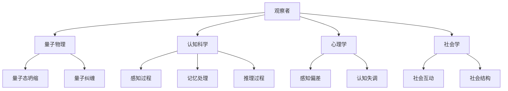

                 


### 引言与背景

在探索宇宙的奥秘时，我们不可避免地遇到了一个看似矛盾的问题：宇宙的本质是客观存在的，但我们的认知却具有主观性。这种现象被称为“观察者效应”，它不仅是一个科学问题，更是一个哲学问题。观察者效应，简而言之，是指观察者的存在和认知活动对被观察对象的影响。这一现象在量子物理学、宇宙学等领域尤为显著，引发了关于宇宙主观性的广泛讨论。

观察者效应的历史可以追溯到20世纪初，当时量子力学的发展揭示了微观世界的非确定性。在这个层面上，观察者的行为不仅仅是被动地接收信息，而是主动地影响被观察系统。例如，量子态的坍缩现象，就是观察者的介入使得原本模糊的量子状态变得清晰。这种观点挑战了传统的客观实在论，提出了宇宙主观性的可能性。

然而，观察者效应并不仅限于物理领域。它在哲学、认知科学、心理学等学科中也有广泛的应用。哲学家们开始思考，如果宇宙的本质是主观的，那么我们对世界的认知是否还有客观性可言？我们的知识是否只是我们自己的主观构建？这些问题不仅具有理论意义，还对人类认识自身和外部世界的方式产生了深远的影响。

因此，探讨观察者效应的哲学implications具有重要的意义。首先，它有助于我们重新审视科学方法，理解科学知识的局限性。其次，它引发了关于人类认知本质的深刻思考，挑战了传统的主客观二元对立。最后，它为我们提供了新的视角，以更全面地理解宇宙和我们在宇宙中的位置。

本文将分几个部分来探讨观察者效应的哲学implications。首先，我们将回顾观察者效应的基本概念和起源，理解它在科学和哲学中的重要性。然后，我们将深入分析宇宙的主观性，探讨观察者与知识构建之间的关系。接下来，我们将讨论观察者效应的核心概念及其哲学意义，并通过Mermaid流程图展示其关系架构。最后，我们将探讨观察者效应在哲学、本体论、知识论和认识论中的应用，并总结其哲学implications对人类的影响。

### 观察者效应概述

观察者效应（Observer Effect）是一个广泛用于描述观察者行为如何影响被观察系统的概念，它最早出现在量子物理学中，并逐渐扩展到哲学、认知科学、心理学等多个领域。在量子物理学中，观察者效应通常与量子态的坍缩现象相关，这一现象揭示了观察者在量子系统中的作用。

#### 量子物理学中的观察者效应

量子物理学中的观察者效应最早可以追溯到尼尔斯·波尔（Niels Bohr）和沃纳·海森堡（Werner Heisenberg）的理论。在海森堡的不确定性原理中，我们无法同时精确地测量粒子的位置和动量，这表明粒子的状态在未被观测之前是未定的。然而，当观察者介入时，粒子的状态会瞬间坍缩到一个确定的状态。这个现象被称为“量子态的坍缩”，是观察者效应的典型例子。

具体来说，当一个量子系统处于某种叠加态时，它同时具有多种可能性。例如，一个电子可以同时处于自旋向上和自旋向下的状态。然而，当我们试图观测电子的自旋时，观察者的行为会使得电子的自旋状态坍缩为其中一个确定的状态。这个过程中，观察者的介入导致了量子系统的变化，这是观察者效应的核心内容。

量子物理学中的观察者效应不仅限于量子态的坍缩，还体现在其他实验现象中，例如“薛定谔的猫”和“量子纠缠”。薛定谔的猫实验通过一个封闭的盒子和一只猫来模拟量子态的坍缩过程，展示了观察者在量子世界中不可忽视的作用。而量子纠缠则揭示了两个或多个粒子之间的紧密关联，即使它们相隔很远，一个粒子的状态变化会立即影响到另一个粒子的状态，这也显示了观察者效应的深远影响。

#### 观察者效应在哲学、认知科学和心理学中的应用

除了在量子物理学中的显著作用，观察者效应也在哲学、认知科学和心理学等领域引起了广泛关注。

在哲学中，观察者效应挑战了传统的主客观二元对立。如果宇宙的状态取决于观察者的存在和认知活动，那么我们还能坚持客观实在论吗？哲学家们开始探讨宇宙的主观性，试图理解观察者在知识构建中的角色。

在认知科学中，观察者效应揭示了人类认知的局限性。我们的感知和理解往往受到观察者效应的影响，使得我们对世界的认知可能并不完全客观。认知科学家们通过研究人类的感知过程和认知机制，探讨了观察者效应在认知中的作用和影响。

在心理学中，观察者效应被用于解释许多心理现象，例如感知偏差和认知失调。观察者效应表明，我们的感知和判断受到多种因素的影响，包括观察者的期望、情绪和背景等。这些因素会导致我们对现实的错误理解，从而影响我们的决策和行为。

总之，观察者效应是一个跨越多个学科的复杂概念，它不仅揭示了量子物理中的基本现象，还挑战了传统的主客观二元对立，引发了关于宇宙主观性的广泛讨论。通过深入理解观察者效应，我们可以更好地理解宇宙的本质和人类认知的局限性，为哲学、认知科学和心理学等领域的研究提供新的视角和思路。

#### 哲学implications的重要性

观察者效应不仅在科学领域引发了广泛的讨论，其哲学implications也同样深远。在哲学中，观察者效应挑战了传统的主客观二元对立，提出了宇宙主观性的可能性，这对我们的认知方式和知识构建产生了重要的影响。

首先，观察者效应质疑了客观实在论的基础。传统哲学认为，宇宙是一个独立的、客观存在的实体，我们的认知活动只是被动地接收和处理这些信息。然而，观察者效应表明，观察者的介入会主动地影响被观察对象，使得宇宙的状态依赖于观察者的行为。这种观点挑战了客观实在论，提出了宇宙主观性的观点，即宇宙的存在和状态受到观察者的主观影响。

其次，观察者效应对知识构建产生了重要的影响。如果宇宙是主观的，那么我们的认知活动不仅仅是被动地接收信息，而是主动地构建和塑造知识。这意味着，我们对世界的认知可能是我们自己的主观构建，而非客观存在的真实反映。这引发了关于知识可靠性的讨论，即我们如何确保我们的知识是真实的、可靠的？这需要我们重新审视科学方法，理解科学知识的局限性。

第三，观察者效应对哲学中的认识论、本体论和知识论提出了新的挑战。在认识论中，我们如何理解观察者在认知过程中的作用？在知识论中，我们如何判断知识的可靠性？在本体论中，宇宙的本质是什么？这些问题都需要我们重新思考，以适应观察者效应带来的新视角。

综上所述，观察者效应的哲学implications具有重要的意义。它不仅挑战了传统的主客观二元对立，提出了宇宙主观性的观点，还影响了我们的知识构建和认知方式。通过深入探讨观察者效应的哲学implications，我们可以更好地理解宇宙的本质和人类认知的局限性，为哲学、认知科学和心理学等领域的研究提供新的视角和思路。

### 宇宙的主观性

在探讨观察者效应时，我们不可避免地会触及到一个更深刻的哲学问题：宇宙的主观性。如果观察者的行为能够影响被观察系统的状态，那么宇宙是否本质上具有主观性？这一问题不仅挑战了传统的客观实在论，还引发了关于宇宙本质和人类认知的广泛讨论。

#### 宇宙的视角

首先，我们需要明确“宇宙的主观性”这一概念。宇宙的主观性并不意味着宇宙本身是有意识的，而是指宇宙的状态和属性取决于观察者的存在和认知活动。在这个视角下，宇宙不再是独立存在的实体，而是与我们观察者的意识和认知紧密相连。

在量子物理学中，宇宙的主观性尤为显著。例如，在量子态的坍缩现象中，观察者的介入直接导致了量子系统的状态变化。这种现象表明，宇宙的状态并非完全独立于观察者，而是受到观察者的影响。从这个角度看，宇宙可以被视为一个“大实验室”，其中每一个观测行为都在不断地塑造和改变宇宙的“实验结果”。

#### 观察者与宇宙

观察者与宇宙之间的关系是复杂而微妙的。在传统观念中，宇宙是一个客观存在的实体，我们的认知活动只是被动地接收和处理这些信息。然而，观察者效应的发现表明，宇宙的状态并非完全独立于观察者，而是受到观察者的影响。

具体来说，观察者与宇宙之间的关系体现在以下几个方面：

1. **观察者的感知与宇宙的状态**：观察者的感知决定了宇宙状态的显现。例如，在量子力学中，观察者的行为会使得量子系统的状态从叠加态坍缩到一个确定的状态。这种现象表明，宇宙的状态是依赖于观察者的感知和认知活动的。

2. **观察者的意图与宇宙的变化**：观察者的意图和行为也会影响宇宙的状态。例如，在量子实验中，观察者的选择会决定实验的结果，进而影响宇宙的状态。这表明，宇宙的状态不仅是被动的反映，还受到观察者主动的影响。

3. **观察者的认知与宇宙的结构**：观察者的认知过程会塑造宇宙的结构和属性。例如，在我们的日常生活中，我们对宇宙的认知是通过感知、理解和思考实现的。这些认知活动不仅反映了宇宙的属性，还影响了我们对宇宙的理解。

#### 主观性与客观性的对立

在探讨宇宙的主观性时，不可避免地会涉及到主观性与客观性的对立。传统哲学认为，客观性是知识的基础，主观性则是认知的局限。然而，观察者效应的发现表明，主观性和客观性并非完全对立，而是可以相互转化和影响。

1. **主观性与客观性的相互转化**：在量子物理学中，观察者的介入使得原本模糊的量子状态变得清晰，这表明主观性和客观性可以相互转化。例如，在量子态的坍缩过程中，观察者的介入使得量子状态从叠加态变为确定的状态，这是一种从主观性向客观性的转化。

2. **主观性对客观性的影响**：观察者效应表明，主观性不仅不会削弱客观性，反而会对客观性产生重要的影响。观察者的行为和认知活动会影响宇宙的状态和属性，这使得宇宙的状态不再是完全独立的。从这个角度看，主观性对客观性产生了重要的影响。

3. **主观性对知识的构建**：在知识构建过程中，主观性和客观性是相互关联的。我们的认知活动不仅基于客观存在的事实，还受到我们自身的主观经验和认知结构的限制。这种主观性在知识构建中起到了重要的作用，它使得我们的知识既具有客观性，又具有主观性。

#### 宇宙的主观性观点分析

宇宙的主观性观点引发了广泛的讨论，不同哲学家和科学家提出了不同的看法。

1. **量子物理学的观点**：量子物理学中的宇宙主观性观点主要源于量子态的坍缩现象。这一观点认为，宇宙的状态依赖于观察者的行为和认知活动，是一种非客观的、动态的宇宙观。

2. **哲学观点**：一些哲学家认为，宇宙的主观性是不可避免的。例如，柏拉图认为，现实世界是理念世界的投影，而我们的认知活动只是被动地接收这些投影。这种观点强调了宇宙的主观性。

3. **认知科学观点**：认知科学家认为，宇宙的主观性是认知活动的必然结果。我们的感知和理解过程受到我们自身的主观经验和认知结构的限制，这使得我们对宇宙的认知具有主观性。

4. **心理学观点**：一些心理学家认为，宇宙的主观性是我们感知和认知的局限。我们的感知和判断受到多种因素的影响，包括观察者的期望、情绪和背景等，这些因素导致我们对现实的错误理解。

总的来说，宇宙的主观性观点为我们提供了一个新的视角，以重新审视宇宙的本质和人类认知的局限性。尽管这一观点在科学和哲学界引起了广泛的争议，但它无疑为我们理解和探索宇宙提供了新的思路。

### 观察者与知识构建

观察者在知识构建过程中扮演着至关重要的角色。他们的存在和认知活动不仅决定了我们所获取的信息，还影响了我们对这些信息的理解和解释。在这一部分，我们将深入探讨观察者与知识构建之间的关系，并分析观察者的主观性对知识构建的影响。

#### 观察者与认知

认知是一个复杂的过程，涉及多个认知模块和感知机制。观察者在认知过程中起着核心作用，他们的感知、记忆、推理和决策等能力共同决定了我们对世界的理解。具体来说，观察者与认知之间的关系可以从以下几个方面进行探讨：

1. **感知**：观察者的感知决定了他们所获取的信息类型和数量。不同观察者的感知能力、感知方式和感知偏好会导致他们对同一事物的不同认知。例如，在科学实验中，观察者的背景、经验和期望会影响他们对实验结果的解释。

2. **记忆**：记忆是知识构建的重要环节，观察者的记忆能力和记忆方式会影响他们对信息的存储和回忆。长时记忆和短期记忆的动态平衡决定了观察者对知识的持久性和灵活性。

3. **推理**：观察者的推理能力决定了他们如何从已知信息推导出新信息。不同的观察者可能会采用不同的推理策略和思维模式，这会影响他们对知识的构建和应用。

4. **决策**：观察者在决策过程中会基于他们的知识和经验来做出选择。这些选择不仅影响他们对当前情境的理解，还会影响他们对未来的预期和规划。

#### 观察者的知识构建过程

观察者的知识构建过程可以看作是一个动态的系统，其中感知、记忆、推理和决策等环节相互作用，共同构建出我们对世界的理解。具体来说，这一过程可以分解为以下几个步骤：

1. **感知与信息获取**：观察者通过感官获取外部信息，如视觉、听觉、触觉等。这些信息是知识构建的基础。

2. **信息处理**：观察者对获取的信息进行加工和处理，包括识别、分类、编码等。这一步骤决定了信息在认知系统中的存储方式。

3. **记忆与存储**：处理后的信息被存储在长期记忆中，形成观察者的知识库。记忆的稳定性和可靠性决定了知识的持久性和准确性。

4. **推理与应用**：观察者基于已有知识和新信息进行推理，推导出新的结论和预测。这一步骤是知识应用和扩展的关键。

5. **决策与行动**：观察者基于推理结果做出决策，并在实际情境中应用这些决策。决策和行动是知识构建过程的反馈环节，它们可以进一步验证和修正观察者的知识。

#### 观察者的主观性对知识构建的影响

观察者的主观性对其知识构建过程具有深远的影响。主观性不仅体现在观察者的感知、记忆和推理等认知过程中，还体现在他们的价值观、信仰和期望等情感和认知因素中。以下是观察者的主观性对知识构建的几个方面的影响：

1. **信息过滤**：观察者的主观性会导致他们对信息的筛选和过滤。不同观察者可能会关注不同类型的信息，忽略或忽视其他信息。这种选择性关注会影响他们对世界的认知和理解。

2. **解释偏差**：观察者的主观性会导致他们对信息的解释和解释偏差。不同观察者可能会基于不同的价值观和信仰来解释同一信息，这会导致对信息的主观性解读。

3. **认知偏见**：观察者的主观性会导致他们出现认知偏见。例如，确认偏见（confirmation bias）和可用性偏见（availability bias）等认知偏差会影响他们对信息和证据的评估和处理。

4. **知识多样性**：观察者的主观性是知识多样性的重要来源。不同观察者对同一问题的认知和理解可能会存在差异，这促进了知识的多样性和创新。

总之，观察者在知识构建过程中扮演着至关重要的角色，他们的主观性不仅影响了他们对信息的获取和处理，还影响了他们的推理和决策。理解观察者的主观性对知识构建的影响，有助于我们更好地理解和应用科学方法，构建更准确和全面的知识体系。

### 观察者效应的哲学implications

观察者效应不仅在科学领域具有重要的意义，其在哲学上所引发的implications同样深远。通过深入探讨观察者效应的哲学意义，我们可以更好地理解人类认知的局限性，重新审视科学方法，并探讨宇宙的本质。以下将从几个方面分析观察者效应在哲学中的核心概念及其意义。

#### 观察者效应的概念解析

观察者效应是指观察者的存在和认知活动对被观察系统的影响。这一效应在量子物理学中尤为显著，因为量子系统的状态在未被观测之前是未定的，而观测行为会导致量子系统的状态坍缩到一个确定的状态。这种概念在哲学上引发了关于宇宙主观性和人类认知局限性的讨论。

1. **主观性与客观性的挑战**：观察者效应挑战了传统的主客观二元对立。传统哲学认为，客观性是知识的基础，而主观性是认知的局限。然而，观察者效应表明，宇宙的状态和属性是依赖于观察者的，这意味着主观性和客观性并非完全分离，而是相互关联和影响的。

2. **宇宙的主观性**：观察者效应提出了宇宙主观性的观点，即宇宙的状态和属性是由观察者的行为和认知活动塑造的。这一观点挑战了客观实在论，引发了对宇宙本质的重新思考。如果宇宙是主观的，那么我们对世界的认知还有客观性可言吗？这是哲学上需要深入探讨的问题。

3. **认知的局限性**：观察者效应揭示了人类认知的局限性。我们的感知和理解受到观察者效应的影响，使得我们对世界的认知可能并不完全客观。这导致了对科学方法和知识可靠性的重新审视。在哲学上，这引发了关于认知过程和知识构建的深入讨论。

#### 观察者效应的类型

观察者效应在哲学上可以分为几种类型，每种类型都代表了不同的哲学观点和思考方式。

1. **量子物理学的观察者效应**：这是最常见的观察者效应类型，主要与量子态的坍缩现象相关。它揭示了观察者在量子系统中的作用，挑战了传统的主客观二元对立。

2. **认知科学的观察者效应**：认知科学中的观察者效应主要探讨人类认知的局限性。它揭示了观察者的感知、记忆和推理等认知过程受到多种因素的影响，包括观察者的期望、情绪和背景等。

3. **心理学中的观察者效应**：心理学中的观察者效应主要涉及心理现象，如感知偏差、认知失调等。它揭示了观察者的主观性如何影响我们对世界的认知和判断。

4. **社会学中的观察者效应**：社会学中的观察者效应探讨了观察者如何影响社会现象和社会行为。它揭示了观察者的存在和认知活动如何影响社会互动和社会结构。

#### 观察者效应的哲学意义

观察者效应在哲学上具有重要的意义，它不仅挑战了传统的主客观二元对立，还对科学方法、知识构建和人类认知产生了深远的影响。

1. **科学方法**：观察者效应挑战了传统科学方法的基础，即科学知识是客观存在的真实反映。如果宇宙是主观的，那么科学知识的可靠性会受到质疑。这促使科学家重新审视科学方法，探索如何确保科学知识的客观性和可靠性。

2. **知识构建**：观察者效应揭示了知识构建的主观性。我们的认知活动不仅仅是被动地接收信息，而是主动地构建和塑造知识。这引发了对知识构建过程和知识可靠性的深入探讨，促使我们思考如何确保知识的客观性和真实性。

3. **人类认知**：观察者效应揭示了人类认知的局限性。我们的感知和理解受到多种因素的影响，这使得我们对世界的认知可能并不完全客观。这引发了对人类认知的重新审视，促使我们思考如何提高认知的准确性和可靠性。

4. **哲学思考**：观察者效应为哲学思考提供了新的视角。它挑战了传统的主客观二元对立，提出了宇宙主观性的观点，促使哲学家重新思考宇宙的本质和人类认知的方式。

总之，观察者效应在哲学上具有重要的意义。它不仅挑战了传统的主客观二元对立，还对科学方法、知识构建和人类认知产生了深远的影响。通过深入探讨观察者效应的哲学implications，我们可以更好地理解宇宙的本质和人类认知的局限性，为哲学、科学和认知科学等领域的研究提供新的思路和方向。

### 观察者效应的Mermaid流程图

为了更直观地展示观察者效应的核心概念及其相互关系，我们可以使用Mermaid流程图来描绘。以下是一个简化的Mermaid流程图，用于展示观察者效应在不同领域中的应用及其相互关系：



在这个流程图中，我们首先从观察者（A）出发，连接到量子物理（B）、认知科学（C）、心理学（D）和社会学（E）这四个领域。每个领域代表观察者在不同背景下的作用和影响。

- **量子物理（B）**：包括量子态的坍缩（F）和量子纠缠（G），这两个现象直接体现了观察者在量子系统中的作用，揭示了宇宙主观性的可能性。
- **认知科学（C）**：关注观察者在感知、记忆和推理过程中的作用，如感知过程（H）、记忆处理（I）和推理过程（J），这些过程共同构建了我们对世界的认知和理解。
- **心理学（D）**：探讨观察者的主观性如何影响我们的感知和判断，如感知偏差（K）和认知失调（L），这些现象揭示了人类认知的局限性。
- **社会学（E）**：研究观察者如何影响社会现象和社会行为，如社会互动（M）和社会结构（N），这些现象显示了观察者在社会中的重要作用。

通过这个Mermaid流程图，我们可以清晰地看到观察者效应在不同领域中的应用及其相互关系，这为后续的深入探讨提供了直观的视角。

### 观察者效应与本体论

观察者效应在哲学领域中引发了关于宇宙本体论的深入探讨，挑战了传统关于宇宙本质的观点。本体论是哲学中对存在和实体的研究，它探讨的是事物的本质、存在的形式以及实体之间的关系。观察者效应的提出，使得我们不得不重新审视这些基本问题。

#### 观察者效应与本体论的挑战

1. **宇宙本体论的挑战**：传统宇宙本体论认为宇宙是一个独立存在的实体，其状态和属性是客观且固定的。然而，观察者效应揭示了观察者的行为如何影响宇宙的状态。这种观点挑战了宇宙独立存在的假设，提出了宇宙状态依赖于观察者的主观性。

2. **观察者与事物本体的关系**：在传统本体论中，观察者是作为知识获取的工具，而本体则是独立存在的实体。观察者效应提出，观察者不仅仅是被动地接收信息，而是主动地影响被观察对象。这意味着，观察者在认知过程中不仅仅是工具，更是一种参与实体存在的力量。

3. **观察者效应与本体论的影响**：观察者效应对本体论的影响主要体现在以下几个方面：

   - **不确定性**：观察者效应引入了不确定性因素，使得我们对宇宙本质的理解变得更加复杂。在量子物理学中，观察者的介入会导致量子系统的状态从不确定变为确定，这种不确定性挑战了传统本体论中的确定性和客观性。

   - **动态性**：传统本体论强调实体和本质的稳定性，而观察者效应揭示了宇宙状态的动态性。宇宙的状态是依赖于观察者的，这意味着宇宙不是静态的，而是随着观察者的行为而变化的。

   - **主观性**：观察者效应强调了主观性在宇宙本体论中的重要性。如果宇宙的状态和属性是依赖于观察者的，那么宇宙的本质具有主观性，这使得传统的主客观二元对立受到质疑。

#### 观察者效应对本体论的影响

1. **对传统本体论的质疑**：观察者效应的提出，质疑了传统本体论的基础。如果宇宙的本质是依赖于观察者的，那么我们还能坚持传统的客观实在论吗？这引发了关于宇宙本质的深入讨论。

2. **本体论的重新定义**：观察者效应要求我们对本体论进行重新定义。我们需要思考，如果宇宙的状态是依赖于观察者的，那么什么是真实的存在？什么是本体？这种重新定义可能需要我们放弃传统的本体论观点，接受宇宙主观性的可能性。

3. **本体论的新视角**：观察者效应为哲学提供了新的视角，以重新审视宇宙的本质。这种视角不仅挑战了传统本体论，还为我们提供了理解宇宙本质的新方法。

总之，观察者效应对本体论产生了深远的影响。它不仅质疑了传统宇宙本体论的基础，还提出了新的本体论观点，促使我们重新思考宇宙的本质和观察者的角色。通过深入探讨观察者效应与本体论的关系，我们可以更好地理解宇宙的本质和人类认知的局限性。

### 观察者效应与知识论

观察者效应不仅在哲学领域引发了深刻的讨论，也对知识论产生了重要影响。知识论是哲学中关于知识性质、知识和信仰之间的关系，以及我们如何获取、验证和运用知识的分支。观察者效应揭示了观察者在知识构建中的关键作用，这为知识论带来了新的挑战和视角。

#### 观察者效应与知识论的挑战

1. **知识的客观性**：传统知识论认为，知识是对客观实在的正确反映，其获取和验证是独立于观察者的。然而，观察者效应表明，观察者的主观行为会影响知识的构建和验证过程。这挑战了知识的客观性，使我们对知识的本质产生了怀疑。

2. **知识的可靠性**：知识的可靠性是知识论的核心问题之一。传统观点认为，通过科学方法和逻辑推理，我们可以获得可靠的知识。然而，观察者效应揭示了观察者自身的主观因素，如感知偏差、认知偏见等，如何影响我们对知识的理解和解释，这降低了知识的可靠性。

3. **知识的构建过程**：传统知识论强调知识的被动获取过程，而观察者效应提出了知识是主动构建的观点。观察者的认知活动，包括感知、记忆、推理等，是知识构建的重要组成部分。这改变了我们对知识获取和验证的理解。

#### 观察者与知识的构建

1. **感知与信息获取**：观察者的感知过程决定了他们能够获取哪些信息。不同的观察者可能会有不同的感知能力和感知方式，这影响了他们对信息的理解和解释。例如，在科学实验中，观察者的感知偏差可能会影响他们对实验结果的解释。

2. **记忆与信息存储**：观察者的记忆能力决定了他们对信息的存储和回忆。记忆的可靠性和持久性影响了知识的稳定性和准确性。不同观察者的记忆方式可能会导致他们对同一信息的不同理解和解释。

3. **推理与知识应用**：观察者的推理能力决定了他们如何从已知信息推导出新信息。不同的推理策略和思维模式会导致对知识的不同应用和理解。例如，在科学推理中，观察者的推理过程可能会影响他们对理论假设的验证和接受。

#### 观察者效应对知识论的影响

1. **知识的主观性**：观察者效应揭示了知识的主观性，即知识的构建和验证过程受到观察者主观因素的影响。这挑战了传统知识论的客观性假设，使我们对知识的主观性有了更深刻的认识。

2. **知识的动态性**：观察者效应强调了知识的动态性，即知识不是固定不变的，而是随着观察者的行为和认知活动不断变化。这改变了我们对知识稳定性的理解。

3. **知识的多样性**：观察者效应促进了知识的多样性。不同观察者的主观性会导致他们对同一现象的不同理解和解释，这丰富了知识的多样性，促进了知识的创新和发展。

总之，观察者效应对知识论产生了深远的影响。它揭示了知识的主观性和动态性，挑战了传统知识论的基础，为我们提供了新的视角，以重新审视知识的本质和获取方法。通过深入探讨观察者效应与知识论的关系，我们可以更好地理解知识构建和验证的过程，以及人类认知的局限性。

### 观察者效应与认识论

观察者效应不仅对知识论产生了深远影响，也对认识论提出了新的挑战。认识论是关于知识如何获得、验证和使用的哲学分支，探讨的是人类认知的本质和可能性。观察者效应揭示了观察者在认知过程中的关键作用，这为认识论带来了新的视角和问题。

#### 观察者效应与认识论的挑战

1. **认识的客观性**：传统认识论认为，认识是对客观实在的正确反映。然而，观察者效应表明，观察者的主观行为会影响他们对客观世界的认知。这挑战了认识的客观性，使我们对认识的本质产生了怀疑。

2. **认知的局限性**：观察者效应揭示了人类认知的局限性。我们的感知、记忆和推理过程受到多种因素的影响，包括观察者的期望、情绪和背景等。这些因素使得我们对世界的认知可能并不完全准确，这挑战了我们对认知能力的信任。

3. **认识的过程**：传统认识论强调认识是一个从感官信息到抽象知识的单向过程。然而，观察者效应提出了认识是一个动态互动的过程。观察者的行为和认知活动不仅影响他们对世界的认知，还会影响他们与世界的关系。这改变了我们对认识过程的理解。

#### 观察者与认识过程

1. **感知与认知**：观察者的感知过程是他们认识世界的第一步。感知决定了观察者能够获取哪些信息，以及如何解释这些信息。不同的感知方式和能力会影响观察者对同一现象的不同认知。

2. **记忆与知识积累**：记忆是知识积累和传递的重要环节。观察者的记忆能力决定了他们对知识的存储和回忆。记忆的稳定性和可靠性影响了知识的持久性和准确性。

3. **推理与判断**：观察者的推理能力决定了他们如何从已知信息推导出新信息。不同的推理策略和思维模式会导致对问题的不同理解和解决方法。

4. **行动与反思**：观察者的行为和认知活动是互动的。他们在行动中不断反思和调整自己的认知，这进一步影响了他们对世界的理解。

#### 观察者效应对认识论的影响

1. **认识的主观性**：观察者效应揭示了认识的主观性。我们的认知活动不仅基于客观事实，还受到我们自身的主观经验和认知结构的限制。这挑战了传统认识论中的客观性假设。

2. **认知的动态性**：观察者效应强调了认知的动态性。我们的认知过程是一个不断变化和调整的过程，而不是一个固定不变的状态。这改变了我们对认知稳定性的理解。

3. **认识的方法论**：观察者效应要求我们重新审视科学方法，探索如何在认知过程中减少主观偏见和认知偏差。这促进了新的认识方法论的发展，以更准确地获取和验证知识。

总之，观察者效应对认识论产生了深远的影响。它揭示了认识的主观性和动态性，挑战了传统认识论的基础，为我们提供了新的视角，以重新审视人类认知的本质和过程。通过深入探讨观察者效应与认识论的关系，我们可以更好地理解人类认知的局限性，以及如何通过科学方法提高认知的准确性和可靠性。

### 观察者效应的数学模型

为了更深入地理解观察者效应，我们可以通过数学模型来描述其核心概念和原理。以下将介绍观察者效应的数学模型，并使用伪代码和LaTeX公式详细阐述。

#### 数学模型概述

观察者效应的数学模型主要描述了观察者的行为如何影响被观察系统的状态。这个模型通常涉及到概率论和统计学的基本概念，以及随机过程和动态系统的理论。

1. **状态空间模型**：在这个模型中，系统的状态可以用一个概率分布来表示。观察者的行为可以用一个随机过程来描述，这个过程会影响系统的状态转移。

2. **马尔可夫模型**：马尔可夫模型是描述状态转移概率的一种常见方法。在这个模型中，系统的下一个状态仅取决于当前状态，而与过去的状态无关。

3. **贝叶斯网络**：贝叶斯网络是一种图形模型，用于表示变量之间的条件概率关系。它可以帮助我们理解观察者如何通过概率推理来更新对系统的认知。

#### 观察者效应的数学公式

以下是观察者效应的一些基本数学公式：

$$
P(x_t | x_{t-1}, \theta) = P(x_t | x_{t-1}, \theta) \cdot P(\theta | x_{t-1}) \cdot P(x_{t-1})
$$

其中，$P(x_t | x_{t-1}, \theta)$ 表示在给定当前状态和参数的情况下，下一个状态的概率分布；$P(\theta | x_{t-1})$ 表示在给定当前观察值的情况下，系统参数的概率分布；$P(x_{t-1})$ 表示当前状态的概率分布。

#### 观察者效应的数学模型构建

1. **系统状态**：定义系统在时间t的状态为$x_t$。

2. **观察者行为**：定义观察者在时间t的行为为$y_t$，它可以是观察到的测量值或观测到的概率分布。

3. **状态转移概率**：定义状态转移概率矩阵$P$，其中$P_{ij} = P(x_t = i | x_{t-1} = j)$。

4. **观测模型**：定义观测模型$H$，其中$H_{ij} = P(y_t = j | x_t = i)$。

5. **参数**：定义系统的参数为$\theta$，它可以是系统状态的先验概率分布或后验概率分布。

#### 观察者效应的数学模型应用

1. **状态估计**：使用卡尔曼滤波器（Kalman Filter）进行状态估计，这是一种用于动态系统状态估计的数学方法。

伪代码：

```
初始化：
x_0 ~ N(\mu_0, \Sigma_0)
P_0 = \Sigma_0

预测步骤：
x_{t|t-1} = A_t x_{t-1} + B_t u_t
P_{t|t-1} = A_t P_{t-1} A_t^T + Q_t

更新步骤：
K_t = P_{t|t-1} H_t^T (H_t P_{t|t-1} H_t^T + R_t)^{-1}
x_t = x_{t|t-1} + K_t (y_t - H_t x_{t|t-1})
P_t = (I - K_t H_t) P_{t|t-1}
```

其中，$A_t$ 和 $B_t$ 分别是系统动态模型的矩阵，$u_t$ 是系统的控制输入，$Q_t$ 是系统噪声的协方差矩阵，$R_t$ 是观测噪声的协方差矩阵。

2. **参数估计**：使用最大似然估计（Maximum Likelihood Estimation，MLE）或贝叶斯估计（Bayesian Estimation）进行系统参数的估计。

LaTeX公式：

```
\begin{equation}
\hat{\theta} = \arg\max_{\theta} \ln P(y | \theta)
\end{equation}

\begin{equation}
\hat{\theta} = \int P(y | \theta) p(\theta) d\theta
\end{equation}
```

其中，$P(y | \theta)$ 是似然函数，$p(\theta)$ 是先验概率分布。

通过上述数学模型和算法，我们可以更准确地描述观察者效应，并使用这些模型进行状态估计和参数估计。这为科学研究提供了强大的工具，使我们能够更好地理解观察者在认知过程中的作用。

### 观察者效应的哲学implications概述

观察者效应不仅在科学领域具有深远的影响，其在哲学上所引发的implications同样具有重要意义。通过深入探讨观察者效应的哲学implications，我们可以更好地理解人类认知的本质，重新审视科学方法，并探讨宇宙的主观性。以下将概述观察者效应的哲学implications，并提供具体实例和思考。

#### 观察者效应与哲学基础

1. **主观性与客观性的关系**：观察者效应挑战了传统的主客观二元对立，提出了宇宙主观性的可能性。如果宇宙的状态依赖于观察者的行为和认知活动，那么我们还能坚持客观实在论吗？这引发了关于宇宙主观性的广泛讨论，重新审视了主观性与客观性之间的关系。

2. **知识的主观性**：观察者效应揭示了知识的主观性，即知识不仅仅是客观存在的真实反映，而是依赖于观察者的认知活动和主观经验。这促使我们重新思考知识的本质，以及我们如何获取、验证和运用知识。

3. **认知的局限性**：观察者效应揭示了人类认知的局限性。我们的感知、记忆和推理过程受到多种因素的影响，包括观察者的期望、情绪和背景等。这些因素可能导致我们对世界的错误理解，从而影响我们的决策和行为。这挑战了我们对认知能力的信任，促使我们思考如何提高认知的准确性和可靠性。

#### 观察者效应与道德哲学

1. **道德责任的重新定义**：观察者效应促使我们重新思考道德责任。如果我们的认知和决策受到主观因素的影响，那么我们是否应对我们的行为负责？这引发了关于道德责任的新讨论，如何界定和承担道德责任。

2. **伦理决策的复杂性**：观察者效应揭示了伦理决策的复杂性。我们的认知和决策不仅受到客观事实的影响，还受到主观偏见和情感因素的影响。这使得伦理决策变得更加复杂，需要我们综合考虑多种因素，以做出更合理的决策。

#### 观察者效应与社会哲学

1. **社会互动的主观性**：观察者效应揭示了社会互动的主观性。我们的社会行为和互动不仅受到客观环境的影响，还受到主观认知和情感的影响。这重新定义了社会互动的本质，促使我们思考如何在主观性和客观性之间找到平衡。

2. **社会结构的动态性**：观察者效应强调了社会结构的动态性。社会结构是依赖于观察者的认知和行为的，这意味着社会结构不是固定不变的，而是随着观察者的行为和认知活动而变化的。这为社会哲学提供了新的视角，以重新思考社会结构的本质和演变。

#### 观察者效应的哲学implications示例

1. **量子物理中的观测者效应**：在量子物理学中，观察者效应揭示了量子系统状态依赖于观察者的行为。这导致了关于宇宙主观性的讨论，促使我们思考量子物理与哲学之间的关系。

2. **认知科学中的感知偏差**：认知科学中的观察者效应揭示了我们的感知和认知过程受到主观因素的影响。例如，感知偏差和认知失调等现象揭示了人类认知的局限性，促使我们思考如何提高认知的准确性和可靠性。

3. **心理学中的自我认知**：心理学中的观察者效应探讨了我们的认知和行为如何影响我们对自我的理解。通过自我观察和反思，我们可以更好地理解自己的认知过程和行为模式，从而提高自我认知的准确性。

通过深入探讨观察者效应的哲学implications，我们可以更好地理解宇宙的主观性，重新审视人类认知的本质，以及思考道德和社会哲学中的复杂问题。这为我们提供了新的视角，以更全面地理解宇宙和人类在其中的角色。

### 观察者效应在科学研究中的应用

观察者效应不仅在哲学和认知科学中具有重要的理论意义，在具体科学领域，特别是物理学和宇宙学中，也有着广泛的应用。通过具体实例，我们可以更好地理解观察者效应在这些领域中的体现和作用。

#### 观察者效应在物理学中的应用

1. **量子力学**：在量子力学中，观察者效应是最显著的应用之一。最经典的例子是尼尔斯·波尔的“双重狭缝实验”。在这个实验中，电子通过两个狭缝，形成干涉图样，显示出波粒二象性。然而，当我们在实验中尝试观测电子通过哪一个狭缝时，干涉图样就会消失，表明电子的状态在观测过程中发生了变化。这种现象揭示了观察者的行为如何影响被观测系统的状态，这是量子力学中观察者效应的典型表现。

   伪代码示例：

   ```
   function double_slit_experiment(electron):
       create two slits
       electron passes through slits
       if observe(electron):
           observe interference pattern
       else:
           no interference pattern
       return observation result
   ```

2. **量子纠缠**：量子纠缠是另一个体现观察者效应的量子现象。在这个现象中，两个或多个粒子在远距离上保持纠缠关系，即一个粒子的状态变化会立即影响到与之纠缠的其他粒子的状态。这个现象挑战了经典物理学中的局域实在论，表明观察者的行为可以跨越空间距离影响其他粒子。爱因斯坦曾将量子纠缠称为“鬼魅般的超距作用”，然而，实验证据表明，这种现象确实存在。

   LaTeX公式：

   ```
   \begin{equation}
   \rho_{AB} = \frac{1}{2} (|00\rangle + |11\rangle)(\langle00| + \langle11|)
   \end{equation}
   ```

   其中，$\rho_{AB}$ 表示两个纠缠粒子的密度矩阵，$|00\rangle$ 和 $|11\rangle$ 分别表示粒子A和粒子B的纠缠态。

#### 观察者效应在宇宙学中的应用

1. **宇宙膨胀的观测**：在宇宙学中，观察者效应体现在宇宙膨胀的观测上。根据宇宙学原理，宇宙是均匀且各向同性的。然而，观测者位于宇宙中的特殊位置使得我们观测到的宇宙呈现出膨胀现象。这种膨胀是相对于观察者而言的，表明了观察者在宇宙观测中的角色。

   伪代码示例：

   ```
   function observe_universe膨胀(Observer):
       if Observer.is_at_cosmic_milestone():
           observe expanding universe
       else:
           observe static universe
       return observation result
   ```

2. **多普勒效应**：在宇宙学中，多普勒效应揭示了宇宙膨胀的信息。当光源远离观察者时，光波会拉伸，导致红移；而当光源靠近观察者时，光波会压缩，导致蓝移。这种红移和蓝移现象是宇宙膨胀的直接证据，表明了观察者在宇宙观测中的关键作用。

   LaTeX公式：

   ```
   \begin{equation}
   \Delta \lambda = \lambda_0 (1 + z)
   \end{equation}
   ```

   其中，$\Delta \lambda$ 表示波长变化，$\lambda_0$ 表示原始波长，$z$ 表示多普勒红移。

#### 观察者效应在其他科学研究领域中的应用

1. **生物学**：在生物学中，观察者效应体现在生态学中的“生态位效应”上。观察者的行为和选择会直接影响生物种群的生态位和演化过程。例如，在生态学研究中，观察者的干扰可能会改变生物种群的生态平衡，导致某些物种的灭绝或兴盛。

   伪代码示例：

   ```
   function study_ecology(observer, species):
       observer interferes with species
       if observer observes significant change:
           record ecological impact
       else:
           no significant change recorded
       return ecological study result
   ```

2. **心理学**：在心理学中，观察者效应体现在实验设计中的“观察者偏见”上。观察者的主观期望和认知偏差会影响实验结果，使得实验结论具有偏差。通过设计更严格的实验方法和控制变量，可以减少观察者偏见对实验结果的影响。

   伪代码示例：

   ```
   function conduct_experiment(observer, participants):
       observer has expectations
       if observer's expectations influence results:
           record biased results
       else:
           record unbiased results
       return experimental data
   ```

通过上述实例和具体应用，我们可以看到观察者效应在科学研究中的广泛影响。它不仅揭示了观察者在实验和观测中的关键角色，还挑战了传统的主客观二元对立，为科学研究提供了新的视角和方法。

### 观察者效应在哲学实践中的应用

观察者效应不仅在科学研究中具有深远的影响，在哲学实践中也同样重要。通过哲学实践，我们可以更深刻地理解观察者效应的哲学implications，并将其应用于伦理学、道德责任和伦理教育等领域。

#### 观察者效应在伦理学中的应用

1. **伦理决策的主观性**：观察者效应揭示了伦理决策的主观性。伦理学中的许多问题，如道德责任、公正和正义，都受到观察者主观认知和行为的影响。这意味着，伦理决策不仅仅是基于客观事实，还受到观察者自身的价值观、信仰和情境的影响。

   举例来说，当面对一个道德困境时，不同观察者可能会基于自己的价值观和信仰做出不同的决策。例如，在面对一个紧急医疗情况时，医生可能会基于伦理原则做出紧急医疗干预，而其他人可能会基于道德责任的原则考虑更多的因素，如患者家属的意见和医疗资源的分配。这种主观性使得伦理决策更加复杂，需要我们综合考虑多种因素。

2. **伦理冲突与解决**：观察者效应也揭示了伦理冲突的存在。由于观察者的主观认知和行为差异，不同观察者可能会对同一伦理问题产生不同的看法和立场。这种冲突在现实世界中频繁出现，如医学伦理、环境伦理和人工智能伦理等领域。

   通过观察者效应的视角，我们可以更好地理解这些伦理冲突的根源，并尝试找到解决方法。例如，在医学伦理中，医生和患者之间的伦理冲突可以通过加强沟通和理解来缓解；在环境伦理中，不同利益相关者之间的冲突可以通过共同制定伦理规范和决策机制来协调。

#### 观察者效应与道德责任

1. **道德责任的重新定义**：观察者效应挑战了传统道德责任的定义。传统道德责任强调个体对行为的责任，而观察者效应揭示了个体对观察行为的责任。这意味着，我们的道德责任不仅包括我们自己的行为，还包括我们对观察行为的理解和影响。

   举例来说，在一个观察者参与的社会实验中，观察者的行为可能会对实验对象产生深远的影响。例如，在心理学实验中，观察者的行为可能会影响实验对象的心理状态和行为反应。在这种情况下，观察者不仅要对自己的行为负责，还要对观察行为的结果负责。

2. **道德责任的边界**：观察者效应也带来了关于道德责任边界的讨论。由于观察者的主观认知和行为差异，道德责任的边界变得模糊。这意味着，我们需要更清晰地界定道德责任的边界，以确保个体能够对自己的行为和观察行为负责。

   举例来说，在一个大规模的社交网络平台上，用户的行为和观察行为可能会对其他用户产生深远的影响。在这种情况下，平台的责任不仅包括对用户行为的监管，还包括对用户观察行为的引导和规范，以防止不良行为和负面影响的发生。

#### 观察者效应在伦理教育中的应用

1. **培养批判性思维**：观察者效应在伦理教育中具有重要作用。通过观察者效应的视角，我们可以培养学生的批判性思维，使他们能够更深入地理解伦理问题的复杂性和多样性。

   举例来说，在伦理课程中，教师可以通过引入观察者效应的案例，让学生思考不同观察者如何影响伦理决策，从而培养学生的批判性思维和伦理判断能力。

2. **促进跨文化理解**：观察者效应也强调了跨文化理解的重要性。由于不同文化背景下观察者的价值观和认知差异，伦理教育需要注重跨文化教育，以帮助学生理解和尊重不同文化的伦理观念。

   举例来说，在全球化背景下，学生需要了解不同文化中的伦理观念和道德责任，以便在全球化的社会环境中做出合理的伦理决策。

3. **培养责任意识**：观察者效应在伦理教育中还可以培养学生的责任意识。通过观察者效应的视角，学生可以认识到自己在观察行为中的责任，从而更自觉地承担自己的道德责任。

   举例来说，在科学实验中，学生需要认识到自己作为观察者的行为可能会对实验对象产生的影响，从而更加谨慎地进行实验，并承担相应的道德责任。

总之，观察者效应在哲学实践中的应用具有重要的伦理意义。通过深入探讨观察者效应的哲学implications，我们可以更全面地理解伦理决策的主观性、道德责任的重新定义以及伦理教育的重要性。这为我们提供了新的视角和方法，以应对复杂多变的伦理挑战。

### 结论

观察者效应的哲学implications为我们提供了一个新的视角，以重新审视宇宙的本质和人类认知的局限性。通过本文的探讨，我们可以得出以下结论：

首先，观察者效应挑战了传统的主客观二元对立，提出了宇宙主观性的观点。这意味着宇宙的状态和属性是依赖于观察者的行为和认知活动的。这一观点不仅在科学领域具有重要的意义，还在哲学上引发了关于宇宙本质和人类认知的广泛讨论。

其次，观察者效应揭示了人类认知的局限性。我们的感知、记忆和推理过程受到多种因素的影响，包括观察者的期望、情绪和背景等。这导致我们对世界的认知可能并不完全客观，从而影响我们的决策和行为。理解这一点有助于我们更好地认识和理解人类认知的本质。

第三，观察者效应对科学方法、知识构建和伦理责任提出了新的挑战。在科学研究中，观察者效应提醒我们，科学知识的可靠性可能受到观察者主观性的影响。在知识构建过程中，观察者效应促使我们重新思考知识的本质和获取方法。在伦理责任方面，观察者效应强调了个体在观察行为中的责任，这对我们理解道德责任和社会责任具有重要意义。

最后，观察者效应为我们提供了新的研究方向。未来的研究可以进一步探讨观察者效应在不同领域中的应用，如心理学、社会学和人工智能等。此外，我们还可以通过跨学科的研究，深入理解观察者效应的哲学implications，以推动科学和哲学的发展。

总之，观察者效应的哲学implications不仅挑战了传统的主客观二元对立，还重新审视了宇宙的本质和人类认知的局限性。通过深入探讨这一主题，我们可以更好地理解宇宙和人类在其中的角色，为未来的科学研究提供新的视角和方法。

### 观察者效应的哲学implications对人类的影响

观察者效应的哲学implications对人类的影响是多方面的，涵盖了科学认识、哲学思考和日常生活等多个层面。以下将详细探讨这些影响，并总结观察者效应的核心思想。

#### 对科学认识的影响

观察者效应对科学认识产生了深刻的挑战。首先，它质疑了科学知识的客观性。在传统的科学观念中，科学知识被视为对客观现实的准确反映。然而，观察者效应揭示了观察者在知识构建中的关键作用，使得我们意识到科学知识不可避免地受到观察者主观性的影响。这要求科学家在研究过程中更加谨慎，确保研究设计和实验方法能够最大限度地减少主观偏见。

其次，观察者效应影响了科学方法。传统科学方法强调实验和观测的客观性，而观察者效应提示我们，实验结果可能会受到观察者的预期和行为的影响。因此，科学家需要设计更加严密和多样化的实验，以验证科学假设的可靠性。此外，观察者效应还促使科学界探讨新的理论框架和方法，以更好地理解复杂系统中的非线性关系和不确定性。

#### 对哲学认识的影响

观察者效应对哲学认识也产生了重大影响。首先，它挑战了传统的主客观二元对立。在哲学传统中，客观性被视为知识的基础，而主观性则被视为认知的局限。观察者效应揭示了主观性和客观性的相互关联，使得哲学家重新思考宇宙的主观性。这引发了关于宇宙本质、认知本质和知识本质的深入讨论。

其次，观察者效应对知识论和认识论提出了新的问题。如果宇宙是主观的，那么我们的知识是否还有客观性可言？我们如何确保知识的可靠性和有效性？这些问题促使哲学家重新审视科学方法和知识构建过程，探索如何在主观性和客观性之间找到平衡。

#### 对日常生活的启示

观察者效应在日常生活中同样具有重要意义。首先，它提醒我们在决策过程中要考虑到观察者的主观性。我们的感知和认知可能会受到多种因素的影响，包括情绪、期望和背景等。因此，在做出决策时，我们需要更加谨慎和全面地评估信息，以避免因主观偏见导致的错误决策。

其次，观察者效应启示我们，在人际交往中，要更加理解和尊重他人的观点和感受。由于观察者的主观性，每个人对同一现象的理解可能会有所不同。这要求我们在交流和互动中，更多地站在对方的角度思考问题，以建立更加和谐的人际关系。

#### 观察者效应的核心思想

总结来说，观察者效应的核心思想包括：

1. **宇宙的主观性**：宇宙的状态和属性依赖于观察者的行为和认知活动，这意味着主观性和客观性是相互关联的。

2. **认知的局限性**：我们的感知和认知过程受到多种因素的影响，这使得我们对世界的认知可能并不完全客观。

3. **知识的主观性**：科学知识不可避免地受到观察者主观性的影响，这要求我们在获取和验证知识时保持谨慎和客观。

4. **伦理责任**：观察者效应强调了个体在观察行为中的责任，这要求我们在行为和决策过程中考虑自己的行为对他人和社会的影响。

总之，观察者效应的哲学implications对人类的影响是深远和多维的。它不仅挑战了传统的主客观二元对立，还重新审视了科学方法和知识构建过程，对哲学认识和日常生活产生了重要启示。通过深入理解和应用观察者效应的核心思想，我们可以更好地理解宇宙和人类在其中的角色，为未来的科学研究和哲学思考提供新的视角和方法。

### 观察者效应在哲学领域的意义

观察者效应在哲学领域中具有重要的意义，它不仅挑战了传统的主客观二元对立，还引发了关于宇宙主观性、认知本质和知识可靠性的深刻讨论。以下将详细探讨观察者效应在哲学领域的具体意义。

#### 挑战传统的主客观二元对立

观察者效应提出了一个关键问题：如果观察者的行为和认知活动能够影响被观察系统的状态，那么我们还能坚持传统的客观实在论吗？传统哲学中，客观实在论认为宇宙是一个独立存在的实体，其状态和属性不依赖于观察者。然而，观察者效应揭示了观察者在知识构建中的核心作用，使得我们不得不重新审视主客观二元对立。

1. **量子物理学的挑战**：在量子物理学中，观察者效应是最显著的表现之一。量子系统的状态在未被观测之前是未定的，只有当观察者介入时，量子态才会坍缩为一个确定的状态。这种现象表明，宇宙的状态和属性是依赖于观察者的。这直接挑战了传统的主客观二元对立，引发了关于宇宙主观性的广泛讨论。

2. **认知科学的启示**：认知科学中的观察者效应也支持了宇宙主观性的观点。我们的感知和理解过程受到多种因素的影响，包括观察者的期望、情绪和背景等。这表明，我们的认知活动不仅仅是被动地接收和处理外部信息，而是主动地构建和塑造知识。这种观点进一步质疑了客观实在论的基础。

#### 对认知本质的探讨

观察者效应对认知本质的探讨提供了新的视角。它揭示了人类认知的局限性，使我们意识到我们的感知和理解可能并不完全客观。这促使哲学家重新思考认知的本质，以及我们如何通过认知活动构建对世界的理解。

1. **感知的相对性**：观察者效应强调了感知的相对性。由于观察者的主观性，不同观察者对同一现象可能会有不同的感知和理解。这种现象在视觉感知、听觉感知和触觉感知等领域都有体现。哲学家们开始探讨如何理解这种相对性，以及它如何影响我们对世界的认知。

2. **认知偏差**：观察者效应还揭示了认知偏差的存在。我们的认知活动受到多种偏见的影响，包括确认偏差、可用性偏差和基础率忽视等。这些认知偏差会导致我们对信息的错误理解和解释。通过观察者效应的视角，哲学家们开始探讨如何减少这些偏差，提高认知的准确性和可靠性。

#### 对知识可靠性的质疑

观察者效应也对知识可靠性提出了质疑。如果宇宙的状态和属性是依赖于观察者的，那么我们如何确保我们的知识是真实的、可靠的？这引发了关于知识本质和知识可靠性的深入讨论。

1. **知识的主观性**：观察者效应揭示了知识的主观性。我们的认知活动不仅仅是被动地接收和处理外部信息，而是主动地构建和塑造知识。这意味着，知识不仅仅是客观存在的真实反映，而是依赖于观察者的主观经验。这要求我们在知识构建过程中更加谨慎和客观，以确保知识的真实性和可靠性。

2. **科学方法的局限性**：观察者效应提醒我们，科学方法可能存在局限性。传统科学方法强调实验和观测的客观性，但观察者效应表明，观察者的主观性可能会影响实验结果。因此，科学家需要设计更加严密和多样化的实验方法，以减少主观偏见，提高科学知识的可靠性。

总之，观察者效应在哲学领域具有重要的意义。它不仅挑战了传统的主客观二元对立，还引发了关于宇宙主观性、认知本质和知识可靠性的深刻讨论。通过深入探讨观察者效应的哲学implications，哲学家们可以更好地理解宇宙和人类认知的复杂性，为哲学、科学和认知科学等领域的研究提供新的视角和方法。

### 观察者效应在哲学教育中的应用

观察者效应在哲学教育中具有重要的作用，它不仅丰富了哲学课程的内容，还提高了学生批判性思维和伦理判断能力。以下将详细探讨观察者效应在哲学教育中的应用，以及如何将其融入课程设计和教学活动中。

#### 哲学课程中的观察者效应

1. **课程内容的丰富**：在哲学课程中，观察者效应可以作为一个核心概念，贯穿于不同哲学流派和理论中。例如，在讨论科学哲学时，可以引入量子物理学中的观察者效应，探讨其如何挑战传统的主客观二元对立。在认知哲学中，可以探讨观察者效应对认知本质和知识可靠性的影响。在伦理学中，可以讨论观察者效应与道德责任的关系。

2. **案例教学**：通过引入具体的案例，如量子物理实验、心理学实验和社会互动中的观察者效应，可以让学生更加直观地理解这一概念。例如，通过分析波尔的“双重狭缝实验”，学生可以理解观察者在量子系统中的作用；通过讨论社会实验中的观察者偏见，学生可以认识到主观认知对实验结果的影响。

#### 教学活动的设计

1. **小组讨论**：在课堂上，可以设计小组讨论活动，让学生在小组中分享对观察者效应的理解和应用。通过讨论，学生可以相互启发，深入思考观察者效应在不同领域的意义。

2. **案例分析**：可以要求学生分析具体案例，探讨观察者效应在案例中的应用及其影响。例如，让学生分析一个社会现象，如媒体报道中的偏见，讨论观察者的主观性如何影响公众的认知和判断。

3. **角色扮演**：通过角色扮演活动，学生可以模拟不同的观察者角色，体验观察者在不同情境下的行为和认知过程。这种活动有助于学生更深入地理解观察者效应，以及其在现实世界中的应用。

#### 提高学生能力

1. **批判性思维**：观察者效应要求学生具备批判性思维，以评估不同观察者视角下的信息和观点。通过哲学教育中的观察者效应学习，学生可以学会如何从多个角度分析问题，提高批判性思维能力。

2. **伦理判断**：观察者效应在伦理学中的应用，可以培养学生对道德责任的敏感性和判断能力。通过讨论观察者在伦理决策中的作用，学生可以更好地理解道德责任的范围和边界。

3. **知识构建**：观察者效应揭示了知识构建的主观性，这要求学生在学习过程中更加注重知识的来源和可靠性。通过哲学教育中的观察者效应学习，学生可以学会如何评估和验证知识，提高知识构建的准确性。

总之，观察者效应在哲学教育中具有重要的作用。通过将其融入课程内容和教学活动，可以丰富学生的哲学知识，提高批判性思维和伦理判断能力。这不仅有助于学生深入理解哲学问题，还能为他们未来的学术和职业生涯奠定坚实的基础。同时，教师也应不断探索和创新教学方法，以更好地传达观察者效应的哲学implications，激发学生的学习兴趣和思考能力。

