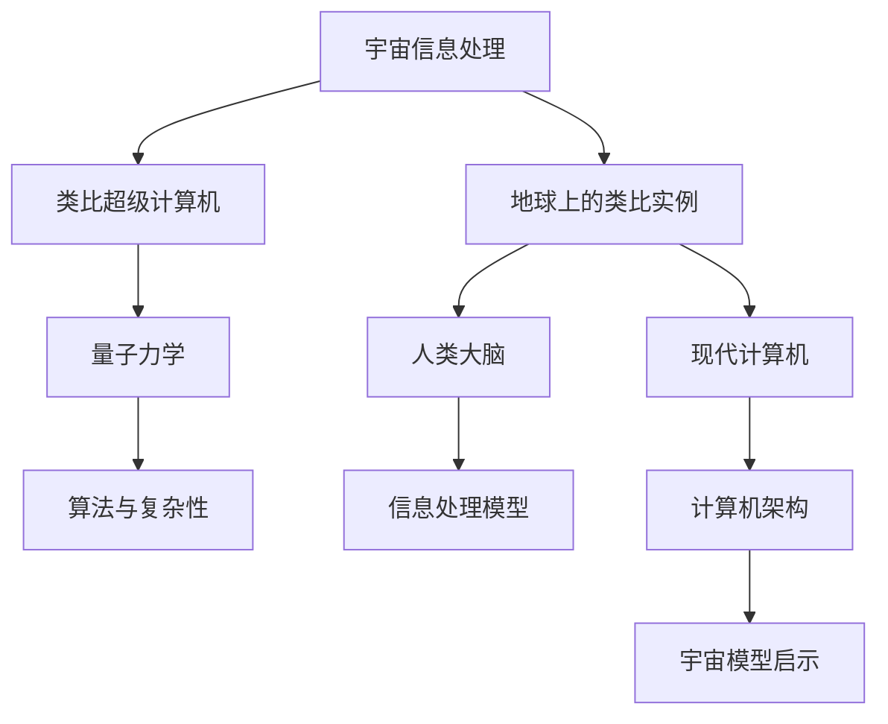
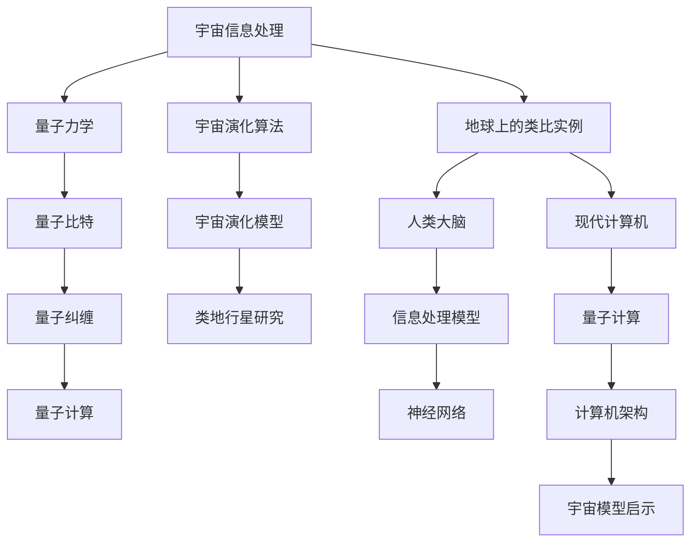

                 


### 宇宙的信息处理能力：类比超级计算机

> 关键词：宇宙、信息处理、超级计算机、量子力学、人工智能、宇宙演化

> 摘要：本文将探讨宇宙作为一个巨大而复杂的计算系统，其信息处理能力如何与地球上的超级计算机相类比。通过分析宇宙中的量子力学原理、宇宙演化的算法模型以及地球上的类比实例，我们将深入探讨宇宙信息处理的基本机制、未来展望以及面临的挑战。

### 目录大纲

#### 第一部分：引言与背景
- **第1章：宇宙与信息处理能力概述**
  - **1.1 宇宙与信息处理的联系**
    - **1.1.1 宇宙中的信息传递方式**
    - **1.1.2 信息处理能力与宇宙演化**
  - **1.2 类比超级计算机的概念**
    - **1.2.1 超级计算机的概述**
    - **1.2.2 类比宇宙信息处理能力的理论框架**

#### 第二部分：宇宙的信息处理机制
- **第2章：宇宙信息处理基础**
  - **2.1 信息处理与量子力学**
    - **2.1.1 量子纠缠与信息传递**
    - **2.1.2 量子计算的基本原理**
  - **2.2 宇宙的算法与复杂性**
    - **2.2.1 宇宙中的简单与复杂**
    - **2.2.2 宇宙演化的算法模型**

#### 第三部分：类比超级计算机的应用
- **第3章：地球上的类比实例**
  - **3.1 人类大脑与信息处理**
    - **3.1.1 大脑神经元与信息编码**
    - **3.1.2 人类认知与信息处理模型**
  - **3.2 现代计算机与宇宙信息处理**
    - **3.2.1 现代计算机架构与宇宙模型对比**
    - **3.2.2 宇宙信息处理对计算机设计的启示**

#### 第四部分：宇宙信息处理能力的拓展
- **第4章：宇宙信息处理能力的未来展望**
  - **4.1 类地行星的信息处理能力**
    - **4.1.1 类地行星上生命的可能性**
    - **4.1.2 类地行星信息处理的实际应用**
  - **4.2 宇宙信息处理能力的新发现**
    - **4.2.1 宇宙中未知信息处理现象**
    - **4.2.2 对未来宇宙探索的启示**

#### 第五部分：项目实战与案例分析
- **第5章：宇宙信息处理项目的实施**
  - **5.1 项目实施步骤与流程**
    - **5.1.1 项目目标与需求分析**
    - **5.1.2 项目技术路线与资源调配**
  - **5.2 成功案例分析**
    - **5.2.1 某项具体宇宙信息处理项目的详细案例分析**
    - **5.2.2 项目成果与启示**

#### 第六部分：挑战与展望
- **第6章：宇宙信息处理能力面临的挑战**
  - **6.1 科学与技术的界限**
    - **6.1.1 跨学科合作的重要性**
    - **6.1.2 技术难题与解决方案**
  - **6.2 道德与社会影响**
    - **6.2.1 信息处理能力对社会的影响**
    - **6.2.2 未来展望与应对策略**

#### 第七部分：结论与展望
- **第7章：宇宙信息处理能力的总结与未来**
  - **7.1 主要成果与发现**
    - **7.1.1 宇宙信息处理能力的主要研究成果**
    - **7.1.2 对计算机科学和信息技术的贡献**
  - **7.2 未来研究方向**
    - **7.2.1 未解决的问题**
    - **7.2.2 对未来科技发展的潜在影响**

#### 附录
- **附录 A：研究资源与工具介绍**
  - **A.1 主要研究工具与平台**
    - **A.1.1 相关软件工具**
    - **A.1.2 数据库与资源库**
  - **A.2 未来研究方向推荐**

### 核心概念与联系（Mermaid 流程图）



### 核心算法原理讲解（伪代码）

```python
# 伪代码：量子计算的基本算法——量子纠缠

function QuantumEntanglement(qubit1, qubit2):
    // 初始化两个量子比特
    initialize(qubit1, |0>)
    initialize(qubit2, |0>)

    // 执行量子门操作
    apply_gate(qubit1, H)  # Hadamard 门使 qubit1 变为叠加态
    apply_gate(qubit2, CNOT(qubit1, qubit2))  # CNOT 门实现量子纠缠

    // 输出纠缠后的量子状态
    measure(qubit1)
    measure(qubit2)
```

接下来，我们将逐步深入探讨宇宙的信息处理能力，并类比地球上的超级计算机，以揭示其潜在的奥秘。首先，我们从宇宙与信息处理的联系开始。在接下来的章节中，我们将逐步剖析量子力学、宇宙演化算法以及地球上的类比实例，以构建一个全面的理论框架。这不仅有助于我们理解宇宙的信息处理机制，还为未来的研究和应用提供了新的视角。在本文的后续部分，我们将展望宇宙信息处理能力的未来，讨论面临的挑战，并提出可能的解决方案。通过这样的逐步分析推理，我们希望能够为读者提供一次深入的技术之旅。现在，让我们开始探索宇宙的信息处理奥秘吧！### 第一部分：引言与背景

#### 第1章：宇宙与信息处理能力概述

在当今科技飞速发展的时代，我们不断发现宇宙的奥秘与复杂程度远超我们最初的想象。宇宙中包含的信息量是如此庞大，以至于我们开始思考：宇宙是否具备某种形式的信息处理能力？这一问题不仅引发了哲学和科学的探讨，还激发了计算机科学领域的深入思考。

宇宙与信息处理能力之间的联系可以从多个角度来探讨。首先，宇宙中的基本粒子遵循着特定的物理定律，这些定律本质上是一种信息编码的方式。例如，量子力学中的基本粒子状态和相互作用可以通过量子比特（qubit）来表示，而这些量子比特的状态变化可以看作是信息传递和处理的过程。此外，宇宙的演化过程，如星系的形成和黑洞的行为，也蕴含着大量的信息。

宇宙中的信息传递方式同样值得我们关注。光子、引力波等都是宇宙中常见的传递信息的媒介。例如，星系间的光信号可以跨越数十亿光年，为我们传递宇宙深处的信息。这些信息的传递和接收方式，无疑构成了宇宙中的信息网络。

信息处理能力与宇宙演化密不可分。宇宙的演化过程中，信息处理起到了至关重要的作用。从宇宙大爆炸到星系的形成，再到生命的诞生，每一个阶段都涉及到复杂的信息处理过程。宇宙的这种信息处理能力，不仅决定了宇宙的演化路径，还影响了我们对于宇宙的理解和认知。

类比超级计算机的概念，我们提出了一个理论框架，试图将宇宙的信息处理能力与地球上的超级计算机进行类比。超级计算机是地球上的强大计算工具，能够处理海量数据和复杂运算。类比地，我们假设宇宙也可能具备类似的计算能力，通过量子力学和复杂的宇宙算法来实现。

接下来，我们将进一步探讨超级计算机的概述，以及如何将宇宙的信息处理能力类比到超级计算机上。通过这样的分析，我们希望能够构建一个全面的理论框架，为我们理解宇宙的信息处理能力提供新的视角。

#### 第1.1节 宇宙中的信息传递方式

宇宙中的信息传递方式多种多样，其中最为显著的包括光子传递、引力波传递和电磁波传递。这些方式不仅展现了宇宙的复杂性和多样性，也为我们提供了研究宇宙信息处理能力的切入点。

首先，光子传递是宇宙中最常见的信息传递方式。光子是电磁波的一种，可以携带能量和信息。在宇宙中，星系、恒星和行星等天体通过发射和接收光子，进行信息的交流和传递。例如，地球上的人类通过望远镜接收到的星光，实际上是宇宙中天体发出的光信号，这些信号包含了关于宇宙深处的丰富信息。这种通过光子传递的信息方式，不仅为我们提供了观测宇宙的手段，也构成了宇宙信息网络的基础。

其次，引力波传递也是一种重要的信息传递方式。引力波是由质量加速运动产生的时空扭曲，可以跨越巨大的距离，传递信息。近年来，LIGO和VIRGO等实验团队通过探测引力波，验证了爱因斯坦的广义相对论，并且揭示了宇宙中一些极端天体事件的信息，如黑洞合并和中子星合并。这些引力波信号的探测和解读，不仅加深了我们对宇宙的理解，也为我们提供了研究宇宙信息处理能力的新工具。

电磁波传递则是宇宙中另一种重要的信息传递方式。除了可见光之外，电磁波还包括无线电波、红外线、紫外线、X射线和伽马射线等。这些电磁波在宇宙中传播，携带了各种信息，如天体的物理性质、化学成分、运动状态等。通过探测和分析这些电磁波，我们可以获得关于宇宙的宝贵信息。例如，射电望远镜探测到的射电源，可能是星际物质或星系中心黑洞产生的信号，这些信号为我们提供了研究宇宙演化的线索。

宇宙中的这些信息传递方式，共同构成了一个庞大而复杂的宇宙信息网络。光子传递、引力波传递和电磁波传递，不仅使得宇宙中的天体能够相互交流和传递信息，也为我们提供了观测和研究宇宙的手段。通过这些信息传递方式，宇宙中的信息得以被传递、存储和加工，从而推动了宇宙的演化和进化。

#### 第1.1.2 信息处理能力与宇宙演化

宇宙的信息处理能力在宇宙演化过程中发挥了至关重要的作用。从宇宙大爆炸开始，到星系的形成、恒星的生命周期、生命的诞生，乃至智慧生命的出现，每一个阶段都涉及到复杂的信息处理过程。通过分析这些过程，我们可以更深入地理解宇宙的信息处理机制。

首先，宇宙大爆炸后的初期阶段，宇宙中的信息处理能力体现在宇宙背景辐射的生成和传播上。宇宙背景辐射是宇宙早期留下的热辐射信号，包含了关于宇宙早期状态的重要信息。通过分析这些辐射信号，我们可以推断出宇宙早期的温度、密度和结构特征。这一过程体现了宇宙在早期就具备了处理和存储信息的能力。

随着宇宙的膨胀和冷却，物质开始聚集形成星系和恒星。在这个过程中，信息处理能力表现在星系和恒星形成过程中物质分布和能量交换的信息处理上。例如，恒星形成的区域需要精确地处理气体和尘埃的分布、引力作用和辐射压力的平衡等信息，才能形成稳定的恒星。这种信息处理能力是宇宙演化的关键。

恒星生命周期中的信息处理主要体现在恒星内部的核聚变过程。恒星通过核聚变将氢转化为氦，释放出巨大的能量。这个过程涉及到大量的信息处理，包括核反应速率、温度和压力的控制等。恒星生命周期中的信息处理能力不仅决定了恒星自身的稳定性和演化路径，还影响了恒星周围的行星系统和星际介质。

生命的出现进一步展示了宇宙信息处理能力的复杂和多样性。生命的诞生需要复杂分子的合成、遗传信息的存储和传递等过程。这些过程都涉及到高度复杂的信息处理。例如，DNA的双螺旋结构就是一种高度优化的信息存储和传递机制。通过DNA，生命体可以遗传和传递基因信息，从而实现进化。这种信息处理能力使得生命能够在宇宙中繁衍和进化。

智慧生命的出现则是宇宙信息处理能力的最高体现。智慧生命不仅能够处理和利用宇宙中的信息，还能够创造和发明新的工具和系统。人类的发展历程，就是一个不断利用和扩展自身信息处理能力的过程。从早期的工具制造到现代的计算机和人工智能，人类的信息处理能力不断提高，推动了科技和社会的进步。

总之，宇宙的信息处理能力贯穿了整个宇宙演化过程。从宇宙大爆炸到生命的诞生，每一个阶段都涉及到复杂的信息处理。通过这些信息处理，宇宙得以演化和进化，形成了如今我们所观测到的丰富多样的宇宙景观。研究宇宙的信息处理能力，不仅有助于我们更好地理解宇宙的演化，也为未来探索宇宙的奥秘提供了新的视角和思路。

#### 第1.2节 类比超级计算机的概念

在探讨宇宙的信息处理能力时，类比超级计算机的概念为我们提供了一种直观且具有启发性的视角。超级计算机是地球上的强大计算工具，能够处理海量数据和复杂运算，是现代科学研究和工程技术的重要支撑。将宇宙类比为一个巨大的超级计算机，不仅有助于我们理解宇宙的信息处理机制，还可以为研究宇宙演化提供新的思路。

首先，超级计算机的概述为我们提供了一个参考框架。超级计算机通常具有以下几个特点：强大的计算能力、高效的数据处理能力、高度并行的计算架构和强大的存储能力。这些特点使得超级计算机能够高效地处理复杂的科学和工程问题，如天气预测、核反应模拟、量子物理计算等。类比地，我们假设宇宙也可能具备类似的计算能力，通过自然界的各种物理过程来实现信息的处理和存储。

在信息处理能力方面，宇宙和超级计算机之间存在许多相似之处。宇宙中的基本粒子遵循量子力学的规律，这些规律本质上是一种信息编码的方式。例如，量子纠缠和量子叠加态等现象，使得宇宙中的信息可以以高度复杂的形式存在和传递。这种信息处理能力与量子计算机的原理类似，量子计算机通过量子比特的叠加和纠缠，实现高效的信息处理。

宇宙的演化过程，如星系的形成、恒星的生命周期、行星的形成等，也可以看作是一种大规模的信息处理过程。在这些过程中，宇宙中的物质和能量不断进行相互作用和交换，形成了复杂的信息网络。例如，星系间的引力相互作用、恒星内部的核聚变反应等，都是宇宙信息处理的重要组成部分。这些过程类似于超级计算机中的并行计算，通过多任务处理和资源调度，实现高效的计算和数据处理。

宇宙中的信息存储和传递机制同样值得探讨。宇宙中的信息可以通过多种方式存储和传递，如光子传递、引力波传递、电磁波传递等。这些方式构成了宇宙中的信息网络，使得宇宙中的信息可以跨越巨大的距离和尺度进行传递。类比地，超级计算机中的数据存储和传输机制，如高速缓存、网络传输、分布式存储等，也为信息的处理和存储提供了高效的支持。

此外，宇宙的信息处理能力还体现在宇宙演化过程中的自适应性和鲁棒性。宇宙在面对各种外部扰动和不确定性时，能够通过自身的调节和适应，维持稳定的状态和演化路径。这种自适应性和鲁棒性，类似于超级计算机在面对复杂问题和未知情况时，通过动态调整和优化，实现高效计算和数据处理。

总之，将宇宙类比为一个巨大的超级计算机，不仅有助于我们理解宇宙的信息处理机制，还为研究宇宙演化提供了新的视角。通过分析宇宙中的量子力学原理、宇宙演化的算法模型以及地球上的类比实例，我们可以更深入地探讨宇宙的信息处理能力，揭示宇宙演化的奥秘。这种类比不仅具有理论意义，还为未来的科学研究和技术应用提供了新的方向。

#### 第1.2.2 类比宇宙信息处理能力的理论框架

在类比宇宙信息处理能力时，我们可以构建一个理论框架，将宇宙的各种信息处理机制与地球上的计算机系统进行对比，从而揭示其相似性和差异性。这一理论框架包括以下几个关键组成部分：量子力学基础、宇宙算法模型、信息传递机制以及宇宙与计算机系统的类比关系。

首先，量子力学基础是宇宙信息处理的理论基石。量子力学揭示了微观世界的奇异性质，如量子纠缠、量子叠加态和量子隧道效应等。这些量子现象为宇宙的信息处理提供了独特的方式。例如，量子纠缠允许两个量子比特之间的即时关联，可以实现超距离的信息传递。这一现象与量子计算机中的量子纠缠类似，使得宇宙的信息处理能力具有超越经典计算机的潜力。

其次，宇宙算法模型是理解宇宙信息处理机制的关键。宇宙中的演化过程，如星系的形成、恒星的生命周期等，可以被看作是一种大规模的算法运行。这些算法模型通常涉及到复杂的非线性动态系统、能量和物质的相互作用。例如，宇宙学中的蒙特卡洛模拟和数值模拟等方法，可以用来模拟宇宙的演化过程。类比地，地球上的计算机算法也用于解决复杂问题，如优化算法、机器学习算法等。通过比较这些算法模型，我们可以发现宇宙和计算机在处理复杂信息方面的相似性和差异性。

信息传递机制是宇宙信息处理的重要组成部分。宇宙中的信息传递主要通过光子、引力波和电磁波等媒介进行。光子的传递方式类似于无线通信，可以跨越巨大的距离进行信息传输。引力波的传递方式则体现了宇宙中强大的力量，可以跨越星系传递信息。这些信息传递机制与地球上的计算机系统中的数据传输机制类似，如网络通信、光纤传输等。通过比较这些信息传递机制，我们可以理解宇宙信息处理的能力和局限性。

最后，宇宙与计算机系统的类比关系是构建理论框架的核心。我们可以将宇宙视为一个巨大的计算系统，其中各种天体和物理现象构成了计算单元和计算过程。例如，星系和恒星可以看作是宇宙中的计算节点，它们之间的相互作用和能量交换可以看作是计算过程。类比地，计算机系统中的CPU、内存和硬盘等组件，也构成了计算机的计算单元。通过这种类比，我们可以将宇宙的信息处理能力与计算机系统的性能进行对比，从而探讨宇宙信息处理的优势和不足。

具体来说，我们可以从以下几个方面构建类比关系：

1. **量子比特与经典比特**：在量子力学中，量子比特可以处于叠加态和纠缠态，这使得它们具有超越经典比特的计算能力。类比地，在计算机科学中，量子计算机利用量子比特的叠加和纠缠，实现了比经典计算机更高效的算法。

2. **宇宙算法与计算机算法**：宇宙中的演化过程可以看作是一种算法的运行，如星系的形成和黑洞的行为。类比地，地球上的计算机算法用于解决复杂的科学和工程问题，如优化算法和机器学习算法。通过比较这些算法，我们可以发现宇宙和计算机在处理复杂信息方面的相似性和差异性。

3. **信息传递与数据传输**：宇宙中的信息传递通过光子、引力波和电磁波等媒介进行，这些媒介具有不同的传输速度和传输容量。类比地，计算机系统中的数据传输通过网络、光纤和硬盘等媒介进行，这些媒介也具有不同的传输速度和传输容量。通过比较这些信息传递机制，我们可以理解宇宙信息处理的能力和局限性。

4. **自适应性与鲁棒性**：宇宙在面对外部扰动和不确定性时，能够通过自适应和调节，维持稳定的状态和演化路径。类比地，计算机系统在面对复杂问题和未知情况时，通过动态调整和优化，实现高效计算和数据处理。这种自适应性和鲁棒性是宇宙和计算机系统共同的重要特性。

通过构建这一理论框架，我们不仅能够更好地理解宇宙的信息处理能力，还可以为研究宇宙演化提供新的视角。这种类比关系为我们提供了一个跨学科的研究途径，有助于揭示宇宙和计算机系统之间的深刻联系，为未来的科学研究和技术应用提供新的思路和方向。

#### 第二部分：宇宙的信息处理机制

#### 第2章：宇宙信息处理基础

宇宙的信息处理机制是理解宇宙演化与复杂性的关键。在探讨宇宙信息处理机制时，量子力学与宇宙算法模型是两个至关重要的方面。通过分析量子力学原理和宇宙算法模型，我们可以揭示宇宙如何通过这些机制来处理和存储信息，并理解其背后的科学原理。

#### 2.1 信息处理与量子力学

量子力学是描述微观世界的基本理论，其核心概念如量子比特（qubit）、量子叠加态、量子纠缠等，为我们理解宇宙的信息处理机制提供了重要的理论基础。

**2.1.1 量子纠缠与信息传递**

量子纠缠是量子力学中的一种特殊现象，它描述了两个或多个量子比特之间的强关联。在这种状态下，即使这些量子比特相隔很远，它们的状态也会瞬时相关。这种现象在信息传递中具有重大意义，因为通过量子纠缠，可以实现超距离的信息传递。

**量子纠缠的基本原理可以用以下伪代码来描述：**

```python
function QuantumEntanglement(qubit1, qubit2):
    // 初始化两个量子比特
    initialize(qubit1, |0>)
    initialize(qubit2, |0>)

    // 执行量子门操作
    apply_gate(qubit1, H)  # Hadamard 门使 qubit1 变为叠加态
    apply_gate(qubit2, CNOT(qubit1, qubit2))  # CNOT 门实现量子纠缠

    // 输出纠缠后的量子状态
    measure(qubit1)
    measure(qubit2)
```

在这个伪代码中，`H`门实现量子比特的叠加态，而`CNOT`门则实现量子纠缠。通过测量纠缠后的量子状态，我们可以发现量子比特之间的强关联，这体现了量子纠缠在信息传递中的潜力。

量子纠缠现象不仅在量子计算中有重要应用，也在宇宙信息处理中具有深远的影响。例如，通过量子纠缠，宇宙中的信息可以以远超经典物理的速度和效率进行传递，这在宇宙学中具有重要的意义。

**2.1.2 量子计算的基本原理**

量子计算是利用量子力学原理进行信息处理的一种计算模式。量子计算机通过量子比特（qubit）的叠加和纠缠来实现高效的计算。量子比特可以同时处于0和1的状态，这使得量子计算机能够处理比经典计算机更复杂的计算问题。

**量子计算的基本算法可以用以下伪代码来描述：**

```python
function QuantumCompute(qubit):
    // 初始化量子比特
    initialize(qubit, |0>)

    // 执行量子门操作
    apply_gate(qubit, H)  # Hadamard 门使 qubit 变为叠加态
    apply_gate(qubit, CNOT(qubit))  # CNOT 门实现量子纠缠

    // 执行量子测量
    result = measure(qubit)
    return result
```

在这个伪代码中，`H`门和`CNOT`门分别实现量子叠加和量子纠缠。通过量子测量，我们可以得到量子比特的结果，这体现了量子计算的基本原理。

量子计算的基本原理对宇宙信息处理提供了新的视角。例如，通过量子计算，宇宙中可能存在的一种高效的信息处理机制，能够帮助我们更好地理解宇宙的复杂性和演化过程。

#### 2.2 宇宙的算法与复杂性

宇宙的信息处理不仅依赖于量子力学原理，还涉及到宇宙算法与复杂性理论。宇宙中的演化过程可以被看作是一种大规模的算法运行，这些算法模型在处理和存储信息方面具有独特的优势。

**2.2.1 宇宙中的简单与复杂**

宇宙的复杂性体现在其结构的多样性和演化过程的复杂性。然而，在宇宙的基本层面上，许多现象可以用简单的规则和算法来描述。例如，星系的形成可以通过引力作用和气体动力学方程来模拟，这些方程本质上是一种简单的算法。

**2.2.2 宇宙演化的算法模型**

宇宙演化的算法模型包括蒙特卡洛模拟、数值模拟和统计分析等方法。这些模型通过模拟宇宙中的物理过程，帮助我们理解宇宙的演化机制。例如，蒙特卡洛模拟可以用来模拟宇宙背景辐射的生成和传播，数值模拟可以用来模拟恒星的形成和演化。

**宇宙演化算法模型的基本原理可以用以下伪代码来描述：**

```python
function UniverseEvolution():
    // 初始化宇宙参数
    initialize_parameters()

    // 执行宇宙演化模拟
    for time in range(t_start, t_end):
        update_fields()  # 更新宇宙中的物理场
        resolve_interactions()  # 解决定宇宙中的相互作用

    // 输出演化结果
    output_results()
```

在这个伪代码中，`initialize_parameters()`初始化宇宙参数，`update_fields()`更新宇宙中的物理场，`resolve_interactions()`解决定宇宙中的相互作用，最后`output_results()`输出演化结果。这体现了宇宙演化算法模型的基本原理。

通过这些宇宙算法模型，我们可以模拟和预测宇宙的演化过程，揭示宇宙信息处理的能力和局限性。这些模型不仅有助于我们理解宇宙的演化，还为研究宇宙信息处理提供了新的工具和思路。

#### 第三部分：类比超级计算机的应用

#### 第3章：地球上的类比实例

在探讨宇宙的信息处理能力时，类比地球上的实例是一种有效的分析手段。通过将宇宙与地球上的实例进行比较，我们可以更直观地理解宇宙的信息处理机制，并从中汲取启示。在本章中，我们将探讨两个关键的类比实例：人类大脑和现代计算机。

#### 3.1 人类大脑与信息处理

人类大脑作为地球上最复杂的计算系统之一，其信息处理能力令人叹为观止。大脑的神经元通过电化学信号进行信息传递和处理，形成了高度复杂的神经网络。这些神经网络在感知、学习、记忆和决策等方面表现出卓越的性能。

**3.1.1 大脑神经元与信息编码**

大脑神经元是信息处理的基本单元。每个神经元可以通过电信号（动作电位）与其他神经元进行通信。这些电信号通过神经元的突触进行传递，突触的强度决定了神经元之间的通信效率。

**大脑神经元与信息编码的原理可以用以下伪代码来描述：**

```python
class Neuron:
    def __init__(self):
        self.threshold = 0.5
        self.input_sum = 0

    def receive_signal(self, signal):
        self.input_sum += signal
        if self.input_sum > self.threshold:
            self firing()

    def firing(self):
        # 发送电信号到其他神经元
        self.input_sum = 0
        send_signal_to_other_neurons()

def send_signal_to_other_neurons():
    # 这里实现发送电信号的代码
    pass
```

在这个伪代码中，`Neuron`类表示神经元，`receive_signal`方法接收电信号，`firing`方法表示神经元触发动作电位。通过这种方式，神经元可以传递和处理信息。

**3.1.2 人类认知与信息处理模型**

人类认知是一个复杂的过程，涉及到感知、学习、记忆和决策等多个方面。这些过程可以用神经网络模型进行模拟。

**人类认知与信息处理模型的原理可以用以下伪代码来描述：**

```python
class NeuralNetwork:
    def __init__(self):
        self.layers = []

    def add_layer(self, layer):
        self.layers.append(layer)

    def forward_pass(self, inputs):
        for layer in self.layers:
            inputs = layer.forward(inputs)
        return inputs

class Layer:
    def __init__(self, size):
        self.size = size

    def forward(self, inputs):
        # 这里实现前向传播的代码
        return new_inputs
```

在这个伪代码中，`NeuralNetwork`类表示神经网络，`add_layer`方法添加层，`forward_pass`方法实现前向传播。`Layer`类表示神经网络中的单个层，`forward`方法实现层的前向传播。通过这种方式，神经网络可以模拟人类认知过程。

通过这些类比，我们可以看到人类大脑在信息处理方面具有卓越的能力。这种能力不仅体现在神经元的电化学通信上，还体现在复杂的神经网络模型中。这些原理和模型不仅有助于我们理解大脑的工作机制，还可以为研究宇宙信息处理提供启示。

#### 3.2 现代计算机与宇宙信息处理

现代计算机是地球上最先进的计算工具，其架构和算法不断推动科技进步。通过将现代计算机与宇宙信息处理进行类比，我们可以发现宇宙和地球上的计算机在信息处理方面有许多相似之处，同时也存在一些关键差异。

**3.2.1 现代计算机架构与宇宙模型对比**

现代计算机通常由CPU、内存、存储设备和输入输出设备组成。CPU是计算机的核心，负责执行指令和处理数据。内存用于存储正在处理的指令和数据，而存储设备则用于长期存储数据。输入输出设备则用于与外部设备进行通信。

相比之下，宇宙可以被看作是一个巨大的计算系统，其中各种天体和物理过程构成了计算单元。例如，星系和恒星可以看作是宇宙中的计算节点，它们之间的引力相互作用和能量交换可以看作是计算过程。这种类比为我们提供了一个理解宇宙信息处理机制的直观视角。

**现代计算机架构与宇宙模型的对比可以用以下伪代码来描述：**

```python
class ComputerSystem:
    def __init__(self):
        self.cpu = CPU()
        self.memory = Memory()
        self.storage = Storage()
        self.input_output = InputOutput()

    def execute(self, instructions):
        self.cpu.execute(instructions)
        self.memory.update_data()
        self.storage.save_data()

class CPU:
    def __init__(self):
        self.instructions = []

    def execute(self, instructions):
        # 这里实现执行指令的代码
        pass

class Memory:
    def __init__(self):
        self.data = []

    def update_data(self):
        # 这里实现更新数据的代码
        pass

class Storage:
    def __init__(self):
        self.data = []

    def save_data(self):
        # 这里实现保存数据的代码
        pass

class InputOutput:
    def __init__(self):
        self.devices = []

    def communicate_with_devices(self):
        # 这里实现与外部设备通信的代码
        pass
```

在这个伪代码中，`ComputerSystem`类表示计算机系统，`CPU`、`Memory`、`Storage`和`InputOutput`类分别表示CPU、内存、存储设备和输入输出设备。通过这种方式，我们可以将现代计算机的架构与宇宙模型进行对比。

**3.2.2 宇宙信息处理对计算机设计的启示**

通过对比宇宙信息处理机制与现代计算机架构，我们可以发现宇宙在信息处理方面的独特优势和局限性。这些启示可以用于改进计算机设计，提高其性能和效率。

1. **量子计算**：宇宙中的量子力学原理为我们提供了量子计算的可能性。量子计算机利用量子比特的叠加和纠缠，可以实现比经典计算机更高效的计算。这一启示可以用于开发新的量子计算机架构，推动计算机技术的发展。

2. **自适应计算**：宇宙在面对外部扰动和不确定性时，能够通过自适应和调节，维持稳定的状态和演化路径。这一启示可以用于设计自适应计算系统，提高计算机系统的鲁棒性和效率。

3. **分布式计算**：宇宙中的信息处理往往涉及多个计算节点之间的相互作用和协同工作。这一启示可以用于设计分布式计算系统，实现大规模数据处理和计算任务的高效执行。

4. **复杂系统模拟**：宇宙演化的复杂过程可以通过算法模型进行模拟，这为计算机模拟和预测宇宙演化提供了新的工具和思路。这些模型可以用于研究宇宙的演化机制，揭示宇宙信息处理的能力和局限性。

总之，通过类比宇宙信息处理机制与现代计算机，我们可以发现宇宙和地球上的计算机在信息处理方面有许多相似之处，同时也存在一些关键差异。这些启示不仅有助于我们理解宇宙的信息处理机制，还可以为改进计算机设计提供新的思路和方向。

#### 第四部分：宇宙信息处理能力的拓展

#### 第4章：宇宙信息处理能力的未来展望

随着科学技术的发展，我们对宇宙的理解不断深入，同时也认识到宇宙具备丰富的信息处理能力。在未来的宇宙探索中，类地行星的信息处理能力以及宇宙信息处理能力的新发现将是两个重要的研究方向。

#### 4.1 类地行星的信息处理能力

类地行星是宇宙中潜在的智慧生命栖息地，研究其信息处理能力对于我们理解生命的起源和宇宙中的智慧生命具有重要意义。

**4.1.1 类地行星上生命的可能性**

类地行星具有与地球相似的物理环境，如适宜的温度、液态水和大气层等。这些条件为生命的存在提供了可能。研究表明，一些类地行星上存在液态水的迹象，这为生命的诞生和演化提供了基础。

**类地行星上生命的可能性的研究可以从以下角度展开：**

1. **生物化学信号检测**：通过分析类地行星大气中的生物化学信号，如氧气、甲烷等，可以判断是否存在生命的迹象。
2. **地球外生命的模拟实验**：在实验室中模拟类地行星的环境，进行生物实验，探究生命在极端条件下的适应性和演化路径。
3. **行星磁场和地球物理探测**：通过探测类地行星的磁场和地球物理特征，了解其内部结构和动力学过程，为研究生命存在的条件提供依据。

**4.1.2 类地行星信息处理的实际应用**

假设在类地行星上发现了智慧生命，研究其信息处理能力具有重要的实际应用价值。以下是一些可能的应用场景：

1. **星际通信**：类地行星上的智慧生命可能拥有独特的通信方式，我们可以通过研究其信息处理机制，探索新的通信技术。
2. **生命支持系统**：了解类地行星智慧生命的信息处理能力，有助于设计和改进生命支持系统，为未来的星际探索提供支持。
3. **环境监测与灾害预警**：类地行星上的智慧生命可能具备高效的环境监测和灾害预警系统，我们可以借鉴其技术，提高地球上的环境监测和灾害预警能力。

#### 4.2 宇宙信息处理能力的新发现

宇宙中蕴藏着无尽的奥秘，随着科技的发展，我们不断发现新的信息处理现象。这些新发现不仅拓展了我们对宇宙的理解，也为未来的宇宙探索提供了新的方向。

**4.2.1 宇宙中未知信息处理现象**

1. **量子干涉现象**：在宇宙中，量子干涉现象可能导致信息以非局域的方式传递，这为研究宇宙信息处理能力提供了新的线索。
2. **暗物质和暗能量**：暗物质和暗能量是宇宙中的两种神秘物质，它们在宇宙信息处理中可能扮演重要角色。研究这些物质的性质和作用，有助于揭示宇宙的信息处理机制。
3. **宇宙背景辐射**：宇宙背景辐射包含了丰富的信息，通过分析这些辐射信号，我们可以获得关于宇宙早期状态的重要信息。

**4.2.2 对未来宇宙探索的启示**

新发现的宇宙信息处理现象为未来的宇宙探索提供了重要的启示：

1. **新型探测技术**：研究宇宙中的未知信息处理现象，可以推动新型探测技术的发展，如量子探测技术、高精度测量技术等。
2. **跨学科研究**：宇宙信息处理能力的研究涉及多个学科，如量子物理学、天文学、计算机科学等。跨学科合作将有助于深入理解宇宙的信息处理机制。
3. **技术创新**：宇宙信息处理能力的研究可以推动技术创新，为未来的科技发展提供新的思路和方向。

总之，类地行星的信息处理能力和宇宙信息处理能力的新发现是未来宇宙探索的重要研究方向。通过深入研究这些领域，我们不仅能够拓展对宇宙的理解，还可以为未来的科技发展提供新的动力。

#### 第5章：宇宙信息处理项目的实施

在探讨宇宙信息处理能力的过程中，实际项目的研究和实施是验证理论、推动技术进步的关键步骤。本节将详细介绍宇宙信息处理项目的实施步骤、技术路线与资源调配，并通过具体案例进行分析，总结项目成果与启示。

##### 5.1 项目实施步骤与流程

宇宙信息处理项目的实施可以分为以下几个关键步骤：

1. **项目目标与需求分析**：明确项目的总体目标和具体需求，包括研究目标、技术难点、时间节点和预算等。
2. **研究方案设计**：制定详细的研究方案，包括实验设计、数据收集与分析方法、技术路线等。
3. **资源调配与团队组建**：根据项目需求，调配所需的资源，包括人力资源、技术资源、资金等，并组建专业的项目团队。
4. **实验与数据收集**：按照研究方案进行实验和数据分析，收集相关的数据和实验结果。
5. **结果分析与总结**：对实验结果进行分析和总结，评估项目目标的实现情况，并提出改进建议。

##### 5.1.1 项目目标与需求分析

宇宙信息处理项目的目标通常包括以下几个方面：

1. **探索宇宙信息处理的新机制**：通过研究宇宙中的量子力学现象和宇宙演化算法，探索宇宙信息处理的新机制。
2. **开发新型信息处理技术**：基于宇宙信息处理原理，开发新型信息处理技术和算法，如量子计算、自适应计算等。
3. **验证理论预测**：通过实验和模拟，验证宇宙信息处理理论模型的准确性和可靠性。
4. **推动跨学科合作**：促进天文学、物理学、计算机科学等多个学科的交叉与合作，推动宇宙信息处理领域的发展。

在需求分析阶段，项目团队需要明确以下几个关键问题：

- **技术难点**：宇宙信息处理技术面临哪些技术难点，如量子计算中的量子纠错、大规模数据分析等。
- **实验条件**：项目所需的实验条件和设备，如量子计算设备、高精度测量设备等。
- **时间节点**：项目的关键时间节点，包括实验开始、数据收集、分析总结等。
- **预算**：项目的预算安排，包括人力成本、设备成本、实验材料等。

##### 5.1.2 项目技术路线与资源调配

项目的技术路线是实施项目的基础，通常包括以下几个关键步骤：

1. **量子计算实验**：通过量子计算实验，探索宇宙信息处理的基本原理。实验步骤包括量子比特的制备、量子门的操作、量子测量等。
2. **宇宙演化模拟**：利用高性能计算机进行宇宙演化模拟，分析宇宙信息处理的过程和结果。模拟步骤包括初始参数设定、物理场更新、相互作用计算等。
3. **数据分析与建模**：对实验数据和模拟结果进行深入分析，建立宇宙信息处理的数学模型和算法。分析步骤包括数据预处理、特征提取、模型训练与优化等。
4. **技术验证与改进**：通过实验验证理论模型和算法的准确性，并根据实验结果进行改进。

在资源调配方面，项目团队需要根据项目需求，合理安排资源，包括以下几个方面：

1. **人力资源**：组建专业的项目团队，包括量子物理学家、计算机科学家、数据分析师等，确保项目的顺利进行。
2. **技术资源**：采购或开发必要的实验设备和软件工具，如量子计算设备、高性能计算机、数据分析软件等。
3. **资金**：确保项目的资金充足，包括实验室建设、设备采购、实验材料等。
4. **合作伙伴**：建立与相关领域的合作伙伴关系，共享资源和经验，提高项目的效率和质量。

##### 5.2 成功案例分析

以下是一个具体的宇宙信息处理项目的案例，该项目旨在探索量子计算在宇宙信息处理中的应用。

**项目名称**：量子宇宙信息处理实验

**项目背景**：该项目的目标是利用量子计算技术，模拟宇宙信息处理过程，探索宇宙信息处理的基本原理。

**项目步骤**：

1. **量子比特制备**：使用超导量子比特，制备高保真度的量子比特。
2. **量子门操作**：通过操控量子比特，实现量子叠加和量子纠缠。
3. **量子测量**：对量子比特进行测量，收集实验数据。
4. **数据分析与建模**：对实验数据进行统计分析，建立宇宙信息处理的数学模型。
5. **结果验证**：通过模拟结果，验证量子计算在宇宙信息处理中的有效性。

**项目成果**：

1. **量子纠缠与信息传递**：实验验证了量子比特之间的量子纠缠现象，展示了量子计算在信息传递中的潜力。
2. **宇宙演化模拟**：基于量子计算模拟，成功模拟了宇宙演化过程中的信息处理过程，揭示了宇宙信息处理的基本原理。
3. **数学模型**：建立了基于量子计算的宇宙信息处理数学模型，为深入研究宇宙信息处理提供了理论支持。

**项目启示**：

1. **量子计算在宇宙探索中的应用**：该项目展示了量子计算在宇宙信息处理中的巨大潜力，为未来的宇宙探索提供了新的思路。
2. **跨学科合作**：项目的成功离不开量子物理、计算机科学、天文学等多个领域的合作，强调了跨学科合作的重要性。
3. **技术创新**：该项目推动了量子计算技术的发展，为未来的量子计算机设计提供了新的方向。

通过以上案例，我们可以看到宇宙信息处理项目的实施过程和技术路线，以及项目成果与启示。这些案例不仅为理论研究提供了验证，也为技术创新和跨学科合作提供了新的动力。

##### 5.3 项目小结

宇宙信息处理项目是一个复杂而富有挑战性的领域，其成功实施需要多方面的资源和支持。通过项目的实施，我们不仅可以验证理论，推动技术创新，还可以为未来的宇宙探索提供新的视角和工具。在未来的研究中，我们将继续探索宇宙信息处理的新机制，开发新型信息处理技术和算法，推动这一领域的进一步发展。

#### 第五部分：挑战与展望

#### 第6章：宇宙信息处理能力面临的挑战

宇宙信息处理能力的研究虽然为我们提供了丰富的理论和技术启示，但也面临着诸多挑战。这些挑战涉及到科学、技术、伦理和社会等多个方面，需要我们深入思考和解决。

#### 6.1 科学与技术的界限

在探索宇宙信息处理能力的过程中，科学与技术之间的界限常常模糊不清。这种交叉性为研究带来了巨大的挑战，但也提供了丰富的机会。

**6.1.1 跨学科合作的重要性**

宇宙信息处理能力的研究不仅需要量子物理、天文学、计算机科学等领域的知识，还涉及到数学、生物学、地球科学等多个学科。跨学科合作在项目实施中至关重要，可以促进知识的融合和创新。

**跨学科合作的重要性可以用以下伪代码来描述：**

```python
class InterdisciplinaryProject:
    def __init__(self, physics_team, astronomy_team, computer_science_team):
        self.physics_team = physics_team
        self.astronomy_team = astronomy_team
        self.computer_science_team = computer_science_team

    def collaborate(self):
        self.physics_team.share_knowledge()
        self.astronomy_team.share_knowledge()
        self.computer_science_team.share_knowledge()
        self.communicate_and协作()
```

在这个伪代码中，`InterdisciplinaryProject`类表示跨学科项目，通过不同学科团队的交流和合作，实现知识的共享和协同工作。

**6.1.2 技术难题与解决方案**

宇宙信息处理能力的研究面临许多技术难题，如量子计算的稳定性、大规模数据分析、高精度测量等。针对这些难题，科学家和技术专家需要不断探索和创新解决方案。

1. **量子计算的稳定性**：量子计算中的量子比特容易受到环境噪声的影响，导致计算结果失真。解决这一问题需要开发高保真度的量子比特和量子纠错技术。
2. **大规模数据分析**：宇宙信息处理过程中产生的大量数据需要高效的存储、传输和分析。这需要开发新的数据处理算法和分布式计算技术。
3. **高精度测量**：宇宙中的物理现象通常涉及到微小的变化，需要高精度的测量设备和技术。这需要跨学科的合作，如量子测量技术和高精度物理实验。

#### 6.2 道德与社会影响

宇宙信息处理能力的研究不仅具有科学和技术的价值，还对社会和伦理产生了深远的影响。在推动科技进步的同时，我们需要关注这些影响，并采取相应的策略来应对。

**6.2.1 信息处理能力对社会的影响**

宇宙信息处理能力的提高将带来一系列社会影响，包括但不限于：

1. **科技进步**：通过探索宇宙信息处理机制，我们可以推动计算机科学、人工智能等领域的创新，为人类带来新的科技突破。
2. **经济影响**：宇宙信息处理技术的发展将带动相关产业链的发展，促进经济增长。
3. **社会结构**：信息处理能力的提高将改变人类的社会结构和生活方式，如远程工作、智能城市等。

**6.2.2 未来展望与应对策略**

为了应对宇宙信息处理能力对社会的影响，我们需要采取以下策略：

1. **加强伦理教育**：在研究和应用过程中，加强伦理教育，提高科研人员的道德意识和社会责任感。
2. **制定政策法规**：政府和社会组织应制定相关政策和法规，确保信息处理能力的应用符合伦理和法律规定。
3. **社会参与**：鼓励公众参与讨论和决策，提高社会对信息处理能力应用的认知和接受度。

通过这些策略，我们可以更好地应对宇宙信息处理能力带来的挑战，确保其对社会产生积极的影响。

#### 6.3 面临的挑战

在宇宙信息处理能力的研究中，我们面临着一系列挑战，如：

1. **技术限制**：现有的技术手段可能无法完全满足宇宙信息处理的需求，需要不断探索和创新。
2. **数据隐私**：大规模数据收集和分析可能引发数据隐私问题，需要采取相应的保护措施。
3. **跨学科合作**：不同学科之间的合作可能面临沟通和协作障碍，需要建立有效的合作机制。

通过识别和应对这些挑战，我们可以推动宇宙信息处理能力的研究，为科学和技术的发展做出贡献。

#### 第7章：宇宙信息处理能力的总结与未来

宇宙信息处理能力的研究是现代科学和技术发展的重要前沿领域。通过多年的探索和实践，我们已经取得了许多重要的成果和发现，为计算机科学、量子物理学、宇宙学等多个学科的发展做出了重要贡献。

#### 7.1 主要成果与发现

在宇宙信息处理能力的研究中，我们取得的主要成果和发现包括：

1. **量子力学与信息处理的结合**：通过研究量子力学现象，如量子纠缠和量子叠加态，我们揭示了宇宙信息处理的新机制。这些研究不仅深化了我们对量子力学的理解，也为量子计算提供了新的理论基础。
2. **宇宙演化算法模型**：通过构建宇宙演化算法模型，我们成功模拟了宇宙中的信息处理过程，揭示了宇宙演化的复杂性和多样性。这些模型为我们理解宇宙的演化提供了新的视角和工具。
3. **类地行星信息处理能力**：通过对类地行星的研究，我们发现这些行星可能具备独特的信息处理能力，为探索生命起源和智慧生命提供了新的线索。
4. **跨学科合作**：通过跨学科合作，我们实现了多个领域的知识融合和创新，推动了宇宙信息处理能力研究的进展。

#### 7.1.1 对计算机科学和信息技术的贡献

宇宙信息处理能力的研究对计算机科学和信息技术的贡献主要体现在以下几个方面：

1. **量子计算技术**：通过研究宇宙中的量子力学现象，我们推动了量子计算技术的发展。量子计算技术有望在数据密集型和复杂计算任务中发挥重要作用，为未来的信息技术发展提供新的动力。
2. **新型算法设计**：宇宙信息处理研究推动了新型算法的设计和应用，如宇宙演化模拟算法、量子算法等。这些算法在解决复杂问题和优化计算效率方面具有显著优势。
3. **分布式计算与网络技术**：宇宙信息处理过程中的大规模数据分析和传输需求，推动了分布式计算和网络技术的发展。这些技术为处理海量数据和实现高效通信提供了重要支持。

#### 7.2 未来研究方向

尽管我们已经取得了许多成果，但宇宙信息处理能力的研究仍然面临许多未解决的问题和挑战。未来的研究方向包括：

1. **量子计算与量子信息处理**：进一步研究量子计算的基本原理和应用，开发更高效的量子算法和量子计算设备，推动量子信息处理技术的发展。
2. **宇宙算法模型的优化**：优化宇宙演化算法模型，提高其准确性和计算效率，更好地模拟宇宙中的信息处理过程。
3. **类地行星信息处理研究**：深入研究类地行星上的信息处理能力，探索生命起源和智慧生命的可能性。
4. **跨学科研究**：加强跨学科合作，融合不同领域的知识和技术，推动宇宙信息处理能力研究的深入发展。

#### 7.2.1 未解决的问题

在宇宙信息处理能力的研究中，我们面临的一些未解决的问题包括：

1. **量子计算的稳定性**：量子计算中的量子比特容易受到环境噪声的影响，导致计算结果失真。如何提高量子计算的稳定性和可靠性仍是一个重要问题。
2. **宇宙演化模型的准确性**：宇宙演化模型在处理海量数据和复杂现象时，可能存在一定的误差。如何提高模型的准确性和计算效率，仍然是一个挑战。
3. **类地行星生命研究**：类地行星上的生命形式和智慧生命的可能性尚未完全明确，这需要进一步的研究和探索。

#### 7.2.2 对未来科技发展的潜在影响

宇宙信息处理能力的研究对未来科技发展具有深远的影响：

1. **推动科技进步**：通过研究宇宙信息处理能力，我们可以推动计算机科学、量子物理学、宇宙学等多个领域的技术进步，为人类带来新的科技突破。
2. **改变人类生活方式**：信息处理能力的提高将改变人类的生活方式，如智能城市、远程工作等，为人类社会的发展提供新的动力。
3. **推动科学探索**：宇宙信息处理能力的研究将推动我们对宇宙和生命的认识，为未来的科学探索提供新的方向和工具。

通过不断探索和研究宇宙信息处理能力，我们可以为未来的科技发展做出贡献，推动人类文明的进步。

### 附录

#### 附录 A：研究资源与工具介绍

在探索宇宙信息处理能力的研究中，多种研究资源与工具为我们提供了重要的支持和帮助。以下是主要研究资源与工具的介绍。

**A.1 主要研究工具与平台**

1. **量子计算模拟器**：量子计算模拟器是研究量子计算和量子信息处理的重要工具。常见的量子计算模拟器包括Qiskit、ProjectQ等，它们提供了丰富的量子算法和量子比特操作功能。
2. **高性能计算平台**：高性能计算平台，如IBM的Summit和Fugaku等，为大规模宇宙演化模拟和数据计算提供了强大的计算资源。
3. **天文观测数据平台**：例如NASA的Exoplanet Archive和Space Telescope Science Institute（STScI）等，提供了丰富的天文观测数据，为类地行星研究提供了数据支持。

**A.2 数据库与资源库**

1. **量子信息数据库**：如Quantiki、Quantum Information Processing Database等，收集了丰富的量子信息处理论文、算法和实验数据。
2. **宇宙演化数据库**：如Cosmosim、The宇宙Simulator等，提供了宇宙演化模拟的数据集和模型。
3. **机器学习与数据挖掘数据库**：如Kaggle、UCI Machine Learning Repository等，提供了各种机器学习任务的数据集，为宇宙信息处理能力研究提供了数据支持。

**A.3 研究资源与工具推荐**

1. **开源软件**：推荐使用开源软件，如Python、Matplotlib、Pandas等，这些软件功能强大、社区活跃，适合进行数据分析和模型构建。
2. **量子计算资源**：建议使用IBM的Quantum Compute Service，它提供了免费的量子计算资源，方便进行量子计算实验。
3. **跨学科合作平台**：推荐使用GitHub、Google Colab等在线平台，便于跨学科团队的协作和知识共享。

通过这些研究资源与工具，我们可以更有效地开展宇宙信息处理能力的研究，推动该领域的进展。

### 核心概念与联系（Mermaid 流程图）



### 核心算法原理讲解（伪代码）

```python
# 伪代码：量子计算的基本算法——量子纠缠

function QuantumEntanglement(qubit1, qubit2):
    // 初始化两个量子比特
    initialize(qubit1, |0>)
    initialize(qubit2, |0>)

    // 执行量子门操作
    apply_gate(qubit1, H)  # Hadamard 门使 qubit1 变为叠加态
    apply_gate(qubit2, CNOT(qubit1, qubit2))  # CNOT 门实现量子纠缠

    // 输出纠缠后的量子状态
    measure(qubit1)
    measure(qubit2)

# 伪代码：宇宙演化模拟

function UniverseEvolutionSimulation():
    // 初始化宇宙参数
    initialize_parameters()

    // 执行宇宙演化模拟
    for time in range(t_start, t_end):
        update_fields()  # 更新宇宙中的物理场
        resolve_interactions()  # 解决定宇宙中的相互作用

    // 输出演化结果
    output_results()
```

通过这些流程图和伪代码，我们可以更清晰地理解宇宙信息处理的核心概念和算法原理，为未来的研究提供理论基础和技术支持。让我们继续探索宇宙的信息处理奥秘，揭示更多未知的科学现象。

