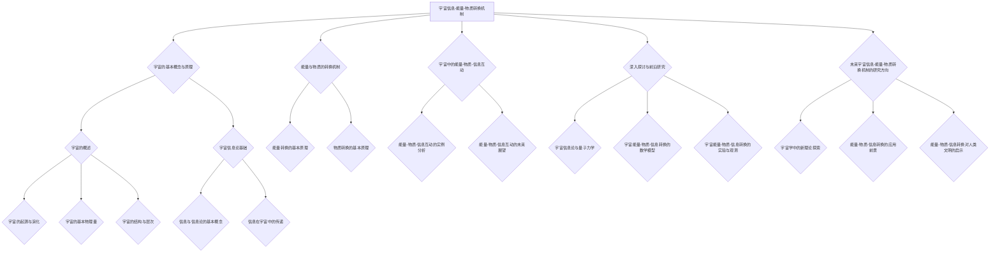

                 

### 文章标题

《宇宙的信息-能量-物质转换机制》

> 关键词：宇宙、信息、能量、物质、转换、机制

> 摘要：本文将探讨宇宙中信息、能量与物质的转换机制，通过一步步分析推理，揭示宇宙的基本原理和演化过程，深入探讨宇宙信息论、能量-物质-信息互动及其在宇宙学中的应用。文章将从宇宙的起源和演化、宇宙信息论基础、能量与物质转换机制、宇宙中的能量-物质-信息互动等多个角度，全面解析宇宙信息-能量-物质转换机制的核心概念、原理及其在科学研究和技术应用中的重要性。

### 第一部分：宇宙的基本概念与原理

宇宙，广袤无垠，充满了无尽的奥秘。从宏观到微观，宇宙中的信息、能量和物质相互转换，构成了宇宙的基本结构。本部分将首先介绍宇宙的概述，包括宇宙的起源与演化、宇宙的基本物理量、宇宙的结构与层次。然后，我们将探讨宇宙信息论基础，包括信息的定义与性质、信息论的基本原理、信息与能量、物质的关系，以及信息在宇宙中的传递。

#### 第1章：宇宙的概述

##### 1.1 宇宙的起源与演化

宇宙的起源与演化一直是科学界和哲学界探讨的课题。目前，主流的科学理论认为宇宙起源于大约138亿年前的一次大爆炸，即宇宙大爆炸理论。

###### 1.1.1 宇宙大爆炸理论

宇宙大爆炸理论认为，宇宙起源于一个极度高温、高密度的奇点，随后发生了快速的膨胀。这一理论得到了宇宙背景辐射和宇宙膨胀加速等观测事实的支持。

\[ 
\text{宇宙大爆炸理论基本框架：} \\
\text{1. 奇点：} \text{宇宙起源于一个无限热、无限密的奇点。} \\
\text{2. 膨胀：} \text{奇点发生爆炸，宇宙开始快速膨胀。} \\
\text{3. 凝聚：} \text{随着宇宙的膨胀，温度逐渐降低，物质开始凝聚成星系、恒星等结构。} 
\]

###### 1.1.2 宇宙背景辐射

宇宙背景辐射是宇宙大爆炸后遗留下来的辐射能量，它几乎充满了整个宇宙。通过对宇宙背景辐射的观测和研究，科学家们能够更好地理解宇宙的起源和演化。

\[ 
\text{宇宙背景辐射特点：} \\
\text{1. 温度：约为2.7K，非常低。} \\
\text{2. 辐射：主要是微波辐射，波长在1mm左右。} \\
\text{3. 分布：几乎均匀分布在宇宙中。} 
\]

###### 1.1.3 宇宙的结构与层次

宇宙的结构具有多层次性，从行星、恒星、星系到超星系团，宇宙中的物质和能量在不同的层次上相互作用和转换。

\[ 
\text{宇宙结构层次：} \\
\text{1. 行星：围绕恒星运行的天体。} \\
\text{2. 恒星：由气体和等离子体组成的大质量天体。} \\
\text{3. 星系：由多个恒星、行星、星云等组成的系统。} \\
\text{4. 超星系团：由多个星系组成的巨型结构。} 
\]

##### 1.2 宇宙的基本物理量

宇宙的基本物理量包括质量、能量、力、相互作用等，这些物理量决定了宇宙中物质和能量的运动和转换。

###### 1.2.1 质量与能量

质量是物质的基本属性，能量是物质运动的能力。根据爱因斯坦的质能方程 \(E=mc^2\)，质量和能量是可以互相转换的。

\[ 
\text{质量与能量关系：} \\
\text{1. 质量可以转换为能量。} \\
\text{2. 能量可以转换为质量。} 
\]

###### 1.2.2 力与相互作用

力是物体间相互作用的体现，相互作用决定了宇宙中物质和能量的运动和转换。宇宙中的四种基本相互作用分别是引力、电磁力、强力和弱力。

\[ 
\text{基本相互作用：} \\
\text{1. 引力：} \text{由质量产生，作用于所有物质。} \\
\text{2. 电磁力：} \text{由电荷产生，作用于带电粒子。} \\
\text{3. 强力：} \text{作用于夸克，维持原子核的稳定。} \\
\text{4. 弱力：} \text{作用于某些基本粒子，导致放射性衰变。} 
\]

###### 1.2.3 宇宙的膨胀与加速

宇宙的膨胀是一个持续的过程，目前观测到的宇宙膨胀加速现象被认为是由暗能量引起的。暗能量是宇宙中一种不可见的能量形式，它对宇宙的膨胀具有巨大的影响。

\[ 
\text{宇宙膨胀与加速：} \\
\text{1. 宇宙膨胀：} \text{宇宙中的物质和空间不断扩张。} \\
\text{2. 宇宙加速膨胀：} \text{宇宙膨胀速度不断增加，目前由暗能量驱动。} 
\]

#### 第2章：宇宙信息论基础

宇宙中的信息、能量和物质是密不可分的，它们之间存在着复杂的转换关系。宇宙信息论是研究宇宙中信息、能量和物质转换机制的一个新领域。本章将介绍宇宙信息论的基础，包括信息的定义与性质、信息论的基本原理，以及信息与能量、物质的关系。

##### 2.1 信息与信息论的基本概念

信息是一个广泛的概念，它涉及到宇宙中的所有物理过程。信息论是研究信息传输、处理和利用的科学，它是现代信息科学的基础。

###### 2.1.1 信息的定义与性质

信息可以定义为关于事物状态的知识或描述。在宇宙中，信息可以通过各种形式进行传递和存储。

\[ 
\text{信息的定义：} \\
\text{信息是关于事物状态的知识或描述。} 
\]

信息的性质包括：

\[ 
\text{1. 可传递性：} \text{信息可以通过各种方式在宇宙中传递。} \\
\text{2. 可存储性：} \text{信息可以存储在物质和能量中。} \\
\text{3. 可利用性：} \text{信息可以被用于决策、控制和其他目的。} 
\]

###### 2.1.2 信息论的基本原理

信息论由香农创立，它研究信息的传输、处理和利用。信息论的基本原理包括熵、信息熵、信息传输效率和信道容量等。

\[ 
\text{信息论基本原理：} \\
\text{1. 熵：} \text{表示信息的不确定性。} \\
\text{2. 信息熵：} \text{表示信息的数量和质量。} \\
\text{3. 信息传输效率：} \text{表示信息传输的有效性。} \\
\text{4. 信道容量：} \text{表示信道能够传输的最大信息量。} 
\]

###### 2.1.3 信息与能量、物质的关系

信息、能量和物质是宇宙中的基本要素，它们之间存在着紧密的联系。信息可以通过能量和物质进行传递和存储。

\[ 
\text{信息与能量、物质的关系：} \\
\text{1. 信息可以转化为能量。} \\
\text{2. 信息可以存储在物质中。} \\
\text{3. 信息可以影响物质的运动和转换。} 
\]

##### 2.2 信息在宇宙中的传递

在宇宙中，信息的传递是一个复杂的过程，它涉及到宇宙的各种物理现象。

###### 2.2.1 光速与信息传递

光速是宇宙中最快的速度，它是信息传递的极限。在真空中，光速约为 \(3 \times 10^8 \text{m/s}\)。

\[ 
\text{光速与信息传递：} \\
\text{1. 信息传递速度不能超过光速。} \\
\text{2. 光速是宇宙中信息传递的极限。} 
\]

###### 2.2.2 引力波与信息传递

引力波是宇宙中的一种重要信息传递方式，它由质量加速运动产生。引力波以光速传播，可以携带大量信息。

\[ 
\text{引力波与信息传递：} \\
\text{1. 引力波可以传递宇宙中的信息。} \\
\text{2. 引力波是宇宙中重要的一种信息传递方式。} 
\]

###### 2.2.3 信息传递与宇宙学观测

宇宙学观测提供了关于宇宙信息传递的重要信息。通过对宇宙背景辐射、恒星、星系等的观测，科学家们可以了解宇宙中信息的传递过程。

\[ 
\text{信息传递与宇宙学观测：} \\
\text{1. 宇宙背景辐射是信息传递的一种方式。} \\
\text{2. 恒星、星系等天体是信息传递的载体。} \\
\text{3. 宇宙学观测提供了关于信息传递的重要信息。} 
\]

### 第二部分：深入探讨与前沿研究

宇宙的信息-能量-物质转换机制是宇宙学研究的核心问题之一。在深入探讨这一机制的过程中，我们不仅要理解宇宙的基本原理和演化过程，还要关注宇宙信息论、量子力学等领域的前沿研究。本章将介绍宇宙信息论与量子力学的关系，讨论能量-物质-信息转换的数学模型，以及宇宙能量-物质-信息转换的实验与观测。

#### 第5章：宇宙信息论与量子力学

量子力学是研究微观世界的物理学理论，它揭示了微观粒子的行为规律。宇宙信息论与量子力学之间存在紧密的联系，量子力学为宇宙信息论提供了理论基础。

##### 5.1 量子力学的基本原理

量子力学的基本原理包括量子态、量子叠加、量子纠缠等。

###### 5.1.1 量子态与量子叠加

量子态是量子系统的一种状态，它可以同时处于多种状态的叠加。量子叠加原理表明，一个量子系统可以同时处于多种状态的叠加。

\[ 
\text{量子态与量子叠加：} \\
\text{1. 量子态表示量子系统的状态。} \\
\text{2. 量子叠加表示量子系统可以同时处于多种状态的叠加。} 
\]

###### 5.1.2 量子纠缠与量子信息

量子纠缠是量子系统中两个或多个粒子之间的一种特殊关联。量子纠缠现象表明，两个纠缠的粒子之间的状态是相互关联的，即使它们相距遥远。

\[ 
\text{量子纠缠与量子信息：} \\
\text{1. 量子纠缠表示两个或多个粒子之间存在特殊关联。} \\
\text{2. 量子纠缠可以用于量子信息传递。} 
\]

###### 5.1.3 量子力学中的能量-物质-信息关系

在量子力学中，能量、物质和信息是密不可分的。量子态可以表示能量和信息的存储形式，量子纠缠可以用于量子信息传递。

\[ 
\text{量子力学中的能量-物质-信息关系：} \\
\text{1. 能量可以转换为物质和信息。} \\
\text{2. 物质和信息可以储存和传递能量。} \\
\text{3. 量子纠缠可以实现信息的高效传递。} 
\]

##### 5.2 量子信息论在宇宙中的应用

量子信息论是研究量子信息传输、处理和利用的科学。在宇宙中，量子信息论的应用包括量子通信、量子计算、量子探测等。

###### 5.2.1 量子通信与量子计算

量子通信利用量子纠缠实现信息的高效传递，量子计算利用量子态实现高速计算。量子通信和量子计算在宇宙探索、宇宙学研究中具有广泛的应用前景。

\[ 
\text{量子通信与量子计算：} \\
\text{1. 量子通信可以实现量子态的远程传递。} \\
\text{2. 量子计算可以实现高速数据处理。} \\
\text{3. 量子通信和量子计算在宇宙探索中具有重要作用。} 
\]

###### 5.2.2 量子信息论与宇宙学

量子信息论为宇宙学提供了新的研究方法。通过量子通信和量子计算，科学家们可以更深入地了解宇宙的信息、能量和物质转换机制。

\[ 
\text{量子信息论与宇宙学：} \\
\text{1. 量子信息论可以揭示宇宙的基本原理。} \\
\text{2. 量子信息论可以用于宇宙学观测和分析。} \\
\text{3. 量子信息论为宇宙学提供了新的研究方法。} 
\]

###### 5.2.3 量子纠缠与宇宙信息传递

量子纠缠是实现宇宙信息传递的重要手段。通过量子纠缠，宇宙中的信息可以在瞬间传递，实现高效的信息传输。

\[ 
\text{量子纠缠与宇宙信息传递：} \\
\text{1. 量子纠缠可以实现宇宙信息的高效传递。} \\
\text{2. 量子纠缠可以用于宇宙中的信息传输。} \\
\text{3. 量子纠缠在宇宙学研究中具有重要作用。} 
\]

#### 第6章：宇宙能量-物质-信息转换的数学模型

宇宙能量-物质-信息转换是一个复杂的物理过程，需要运用数学模型进行描述和分析。本章将介绍宇宙能量-物质-信息转换的数学模型，包括宇宙膨胀的数学模型、能量守恒与转换的数学模型，以及信息论在宇宙学中的应用模型。

##### 6.1 数学模型的基本概念

数学模型是研究客观事物的抽象结构和方法，它通过数学语言描述物理现象，提供了一种分析和解决问题的工具。

###### 6.1.1 微分方程与偏微分方程

微分方程是描述物理现象的数学方程，它涉及到函数的导数。偏微分方程是描述多维物理现象的数学方程，它涉及到多个函数的导数。

\[ 
\text{微分方程与偏微分方程：} \\
\text{1. 微分方程描述了一维物理现象。} \\
\text{2. 偏微分方程描述了多维物理现象。} 
\]

###### 6.1.2 偏微分方程在宇宙学中的应用

偏微分方程在宇宙学中广泛应用于描述宇宙的膨胀、能量转换等现象。例如，弗里德曼方程描述了宇宙的膨胀，它是一个包含时间导数的偏微分方程。

\[ 
\text{偏微分方程在宇宙学中的应用：} \\
\text{1. 弗里德曼方程描述了宇宙的膨胀。} \\
\text{2. 偏微分方程可以用于描述宇宙中的物理现象。} 
\]

###### 6.1.3 数学模型的发展与应用趋势

随着科学技术的进步，数学模型在宇宙学研究中的应用越来越广泛。新的数学模型不断被提出，以更好地描述宇宙中的复杂现象。

\[ 
\text{数学模型的发展与应用趋势：} \\
\text{1. 新的数学模型不断被提出。} \\
\text{2. 数学模型在宇宙学研究中具有重要作用。} \\
\text{3. 数学模型的发展趋势是更精确、更复杂。} 
\]

##### 6.2 能量-物质-信息转换的数学模型

宇宙能量-物质-信息转换的数学模型描述了宇宙中能量、物质和信息的转换过程。这些模型包括宇宙膨胀的数学模型、能量守恒与转换的数学模型，以及信息论在宇宙学中的应用模型。

###### 6.2.1 宇宙膨胀的数学模型

宇宙膨胀的数学模型描述了宇宙随时间膨胀的过程。弗里德曼方程是一个经典的宇宙膨胀数学模型，它包含了宇宙的膨胀速度、密度和曲率等参数。

\[ 
\text{弗里德曼方程：} \\
\text{1. } \frac{\partial^2 a(t)}{\partial t^2} + \frac{4\pi G}{3}\rho(t)a(t) = -\frac{kc^2}{a(t)} 
\]

其中，\(a(t)\) 表示宇宙膨胀因子，\(\rho(t)\) 表示宇宙的密度，\(k\) 表示宇宙的曲率，\(c\) 表示光速。

###### 6.2.2 能量守恒与转换的数学模型

能量守恒与转换的数学模型描述了宇宙中能量守恒和转换的规律。能量守恒定律是一个基本的物理定律，它表明能量不能被创造或销毁，只能从一种形式转换为另一种形式。

\[ 
\text{能量守恒定律：} \\
\text{1. 能量守恒定律描述了宇宙中能量的守恒和转换。} \\
\text{2. 能量的转换遵循能量守恒定律。} 
\]

能量守恒与转换的数学模型可以用以下方程描述：

\[ 
\text{总能量守恒：} \\
\frac{\partial E}{\partial t} + \nabla \cdot \vec{J} = 0 
\]

其中，\(E\) 表示能量，\(\vec{J}\) 表示能量流密度。

###### 6.2.3 信息论在宇宙学中的应用模型

信息论在宇宙学中的应用模型描述了宇宙中信息的存储、传递和处理。信息论的基本原理可以用于描述宇宙中的信息传递过程，如光速限制和信息熵等。

\[ 
\text{信息论在宇宙学中的应用模型：} \\
\text{1. 光速限制：} \text{信息传递速度不能超过光速。} \\
\text{2. 信息熵：} \text{表示信息的不确定性。} \\
\text{3. 信息传输效率：} \text{表示信息传输的有效性。} 
\]

信息论在宇宙学中的应用模型可以用以下方程描述：

\[ 
\text{信息熵：} \\
H = -\sum_{i} p_i \log_2 p_i 
\]

其中，\(H\) 表示信息熵，\(p_i\) 表示信息出现的概率。

#### 第7章：宇宙能量-物质-信息转换的实验与观测

宇宙能量-物质-信息转换的实验与观测是验证宇宙信息-能量-物质转换机制的重要手段。本章将介绍宇宙观测的基本工具与方法，讨论宇宙能量-物质-信息转换的实验研究，以及宇宙射线与信息互动的观测。

##### 7.1 宇宙观测的基本工具与方法

宇宙观测是了解宇宙现象的重要途径。宇宙观测的基本工具包括望远镜、光谱仪、引力透镜和引力波探测等。

###### 7.1.1 望远镜与光谱仪

望远镜是用于观测宇宙天体的仪器，它可以放大远处的天体，使其清晰可见。光谱仪是用于分析天体光谱的仪器，它可以通过分析光谱来确定天体的性质。

\[ 
\text{望远镜与光谱仪：} \\
\text{1. 望远镜：用于观测远处的天体。} \\
\text{2. 光谱仪：用于分析天体光谱。} \\
\text{3. 望远镜和光谱仪是宇宙观测的重要工具。} 
\]

###### 7.1.2 引力透镜与引力波探测

引力透镜是利用引力对光线的弯曲效应来观测远处天体的方法。引力波探测是通过观测引力波来确定宇宙中事件的方法。

\[ 
\text{引力透镜与引力波探测：} \\
\text{1. 引力透镜：用于观测远处天体。} \\
\text{2. 引力波探测：用于观测宇宙中的事件。} \\
\text{3. 引力透镜和引力波探测是宇宙观测的重要方法。} 
\]

###### 7.1.3 宇宙微波背景辐射探测

宇宙微波背景辐射是宇宙大爆炸后遗留下来的辐射能量，它是宇宙观测的重要对象。宇宙微波背景辐射探测是通过分析宇宙微波背景辐射来确定宇宙的性质。

\[ 
\text{宇宙微波背景辐射探测：} \\
\text{1. 宇宙微波背景辐射：是宇宙大爆炸后遗留下来的辐射能量。} \\
\text{2. 宇宙微波背景辐射探测：用于确定宇宙的性质。} \\
\text{3. 宇宙微波背景辐射探测是宇宙观测的重要手段。} 
\]

##### 7.2 能量-物质-信息转换的实验研究

能量-物质-信息转换的实验研究是验证宇宙信息-能量-物质转换机制的重要方法。本章将介绍宇宙大爆炸遗迹的研究、黑洞与引力波的实验验证，以及宇宙射线与信息互动的观测。

###### 7.2.1 宇宙大爆炸遗迹的研究

宇宙大爆炸遗迹的研究是了解宇宙起源和演化的重要途径。通过对宇宙大爆炸遗迹的观测和分析，科学家们可以了解宇宙的起源和演化过程。

\[ 
\text{宇宙大爆炸遗迹的研究：} \\
\text{1. 宇宙大爆炸遗迹：是宇宙大爆炸后遗留下来的物质。} \\
\text{2. 宇宙大爆炸遗迹的研究：用于了解宇宙的起源和演化。} \\
\text{3. 宇宙大爆炸遗迹的研究是宇宙学研究的重要方向。} 
\]

###### 7.2.2 黑洞与引力波的实验验证

黑洞与引力波的实验验证是验证宇宙信息-能量-物质转换机制的重要手段。通过对黑洞和引力波的观测和分析，科学家们可以了解宇宙中的极端物理现象。

\[ 
\text{黑洞与引力波的实验验证：} \\
\text{1. 黑洞：是一种具有极端引力的天体。} \\
\text{2. 引力波：是由质量加速运动产生的波动。} \\
\text{3. 黑洞与引力波的实验验证：用于验证宇宙信息-能量-物质转换机制。} 
\]

###### 7.2.3 宇宙射线与信息互动的观测

宇宙射线与信息互动的观测是了解宇宙中信息传递的重要途径。通过对宇宙射线的观测和分析，科学家们可以了解宇宙中的信息传递过程。

\[ 
\text{宇宙射线与信息互动的观测：} \\
\text{1. 宇宙射线：是由宇宙中的高能粒子组成的。} \\
\text{2. 信息互动：宇宙射线与信息之间的相互作用。} \\
\text{3. 宇宙射线与信息互动的观测：用于了解宇宙中的信息传递。} 
\]

#### 第8章：未来宇宙信息-能量-物质转换机制的研究方向

宇宙信息-能量-物质转换机制的研究是宇宙学、物理学和信息技术等领域的前沿课题。随着科学技术的进步，未来宇宙信息-能量-物质转换机制的研究将面临新的机遇和挑战。本章将讨论宇宙学中的新理论探索、能量-物质-信息转换的应用前景，以及能量-物质-信息转换对人类文明的启示。

##### 8.1 宇宙学中的新理论探索

宇宙学中的新理论探索是理解宇宙信息-能量-物质转换机制的重要方向。未来宇宙学研究的重点将包括多宇宙理论、量子宇宙学和宇宙膨胀与暗能量的研究。

###### 8.1.1 多宇宙与量子宇宙学

多宇宙理论是宇宙学中的一个新理论，它认为宇宙中存在多个平行宇宙。量子宇宙学是量子力学与宇宙学的结合，它试图用量子理论解释宇宙的起源和演化。

\[ 
\text{多宇宙与量子宇宙学：} \\
\text{1. 多宇宙理论：宇宙中存在多个平行宇宙。} \\
\text{2. 量子宇宙学：用量子理论解释宇宙的起源和演化。} \\
\text{3. 多宇宙与量子宇宙学是宇宙学中的新理论探索。} 
\]

###### 8.1.2 宇宙膨胀与暗能量的研究

宇宙膨胀是宇宙学研究中的一个重要问题，目前普遍认为宇宙膨胀是由暗能量驱动的。未来宇宙膨胀与暗能量的研究将包括对暗能量的性质、来源和影响等方面的深入探索。

\[ 
\text{宇宙膨胀与暗能量的研究：} \\
\text{1. 宇宙膨胀：宇宙随时间扩张。} \\
\text{2. 暗能量：驱动宇宙膨胀的一种神秘力量。} \\
\text{3. 宇宙膨胀与暗能量的研究：探索宇宙膨胀的机制和暗能量的性质。} 
\]

###### 8.1.3 宇宙弦与宇宙膨胀的互动

宇宙弦是宇宙学中的一个假设概念，它认为宇宙中存在一种具有极端引力的弦状结构。未来宇宙弦与宇宙膨胀的互动研究将探讨宇宙弦对宇宙膨胀的影响，以及宇宙弦在宇宙演化中的作用。

\[ 
\text{宇宙弦与宇宙膨胀的互动：} \\
\text{1. 宇宙弦：一种具有极端引力的弦状结构。} \\
\text{2. 宇宙膨胀：宇宙随时间扩张。} \\
\text{3. 宇宙弦与宇宙膨胀的互动：探讨宇宙弦对宇宙膨胀的影响。} 
\]

##### 8.2 能量-物质-信息转换的应用前景

能量-物质-信息转换的应用前景广阔，未来将在多个领域产生重要影响。本章将讨论能量-物质-信息转换在宇宙资源与能源开发、信息技术的宇宙应用，以及能量-物质-信息转换在环境保护中的应用。

###### 8.2.1 宇宙资源与能源开发

宇宙资源与能源开发是未来能源领域的重要发展方向。通过开发和利用宇宙资源，可以满足地球对能源的需求，为人类社会的发展提供新的动力。

\[ 
\text{宇宙资源与能源开发：} \\
\text{1. 宇宙资源：包括太阳能、核能等。} \\
\text{2. 能源开发：利用宇宙资源进行能源生产。} \\
\text{3. 宇宙资源与能源开发：为人类社会的发展提供新动力。} 
\]

###### 8.2.2 信息技术的宇宙应用

信息技术的宇宙应用是未来信息技术发展的重要方向。通过将信息技术应用于宇宙观测、宇宙探索和宇宙科学研究，可以进一步提高人类对宇宙的认识。

\[ 
\text{信息技术的宇宙应用：} \\
\text{1. 宇宙观测：利用信息技术进行宇宙观测。} \\
\text{2. 宇宙探索：利用信息技术进行宇宙探索。} \\
\text{3. 宇宙科学研究：利用信息技术进行宇宙科学研究。} 
\]

###### 8.2.3 能量-物质-信息转换在环境保护中的应用

能量-物质-信息转换在环境保护中的应用具有重要意义。通过开发和利用清洁能源，减少污染物排放，可以改善地球的生态环境，保护地球的可持续发展。

\[ 
\text{能量-物质-信息转换在环境保护中的应用：} \\
\text{1. 清洁能源：利用能量-物质-信息转换进行能源生产。} \\
\text{2. 减少污染物排放：利用能量-物质-信息转换减少污染物排放。} \\
\text{3. 能量-物质-信息转换在环境保护中的应用：改善地球的生态环境。} 
\]

##### 8.3 能量-物质-信息转换对人类文明的启示

能量-物质-信息转换对人类文明的发展具有重要意义。通过对能量-物质-信息转换的研究，可以更好地理解宇宙的本质，为人类文明的进步提供新的启示。

\[ 
\text{能量-物质-信息转换对人类文明的启示：} \\
\text{1. 宇宙的本质：能量-物质-信息转换是宇宙的基本原理。} \\
\text{2. 科学技术的发展：能量-物质-信息转换推动科学技术的进步。} \\
\text{3. 人类文明的进步：能量-物质-信息转换为人类文明的发展提供新的动力。} 
\]

#### 附录

##### 附录A：宇宙信息-能量-物质转换机制相关资源与工具

为了更好地了解宇宙信息-能量-物质转换机制，本章提供了相关的资源与工具，包括主要宇宙学数据库与网站、量子信息与量子计算资源，以及数学模型与计算软件介绍。

###### A.1 主要宇宙学数据库与网站

宇宙学数据库与网站提供了丰富的宇宙学数据和信息，是进行宇宙学研究的重要工具。

\[ 
\text{主要宇宙学数据库与网站：} \\
\text{1. NASA：美国国家航空航天局，提供丰富的宇宙学数据。} \\
\text{2. ESA：欧洲空间局，提供宇宙学研究和观测数据。} \\
\text{3. LIGO：激光干涉仪引力波观测站，提供引力波探测数据。} \\
\text{4. CERN：欧洲核子研究组织，提供粒子物理学和宇宙学数据。} 
\]

###### A.2 量子信息与量子计算资源

量子信息与量子计算资源为研究量子信息-能量-物质转换提供了重要的支持。

\[ 
\text{量子信息与量子计算资源：} \\
\text{1. IBM Quantum：提供量子计算云平台和量子计算资源。} \\
\text{2. Google Quantum：提供量子计算和量子算法资源。} \\
\text{3. Microsoft Quantum：提供量子计算和量子软件开发工具。} \\
\text{4. National Quantum Information Science Program：美国国家量子信息科学计划，提供量子信息科学研究支持。} 
\]

###### A.3 数学模型与计算软件介绍

数学模型与计算软件为研究宇宙信息-能量-物质转换机制提供了重要的工具。

\[ 
\text{数学模型与计算软件介绍：} \\
\text{1. MATLAB：一款强大的数学计算软件，适用于数学建模和科学计算。} \\
\text{2. Mathematica：一款功能强大的数学软件，适用于符号计算和数值计算。} \\
\text{3. Python：一款流行的编程语言，适用于科学计算和数据分析。} \\
\text{4. C++：一款高效的编程语言，适用于复杂计算和性能优化。} 
\]

##### 附录B：宇宙信息-能量-物质转换机制研究论文与书籍推荐

为了深入了解宇宙信息-能量-物质转换机制，本章提供了相关的研究论文与书籍推荐，包括宇宙学基础教材、量子信息学著作，以及宇宙信息论研究论文。

###### B.1 宇宙学基础教材

宇宙学基础教材为学习宇宙学提供了重要的理论基础。

\[ 
\text{宇宙学基础教材：} \\
\text{1. 《宇宙学原理》（作者：G. A. M.琊，D. N. Spergel）：一本全面的宇宙学教材，涵盖了宇宙学的基本概念和理论。} \\
\text{2. 《宇宙学导论》（作者：M. Kuhlen，M. White）：一本针对本科生的宇宙学教材，适合初学者学习。} \\
\text{3. 《宇宙学：从大爆炸到黑洞》（作者：J. P. R. Taylor）：一本深入浅出的宇宙学教材，适合大学高年级和研究生阅读。} 
\]

###### B.2 量子信息学著作

量子信息学著作介绍了量子信息的基本原理和应用。

\[ 
\text{量子信息学著作：} \\
\text{1. 《量子信息论》（作者：C. H. Bennett，G. Brassard，C. A. Clarke）：一本经典的量子信息学著作，介绍了量子信息的基本原理。} \\
\text{2. 《量子计算与量子信息》（作者：M. A. Nielsen，I. L. Chuang）：一本全面介绍量子计算和量子信息的教材，适合大学高年级和研究生阅读。} \\
\text{3. 《量子信息科学与技术》（作者：张泽）：一本介绍量子信息科学和技术应用的教材，适合科研人员和工程技术人员阅读。} 
\]

###### B.3 宇宙信息论研究论文

宇宙信息论研究论文提供了宇宙信息论的研究进展和成果。

\[ 
\text{宇宙信息论研究论文：} \\
\text{1. “Information Theory and Quantum Gravity”（作者：L. Bombelli，J. Kowalski-Glikman）：一篇关于量子引力与信息论的论文，探讨了量子引力与信息论的关系。} \\
\text{2. “Quantum Information Processing in General Relativity”（作者：J. M. Moffat）：一篇关于量子信息处理与广义相对论的论文，研究了量子信息处理在广义相对论背景下的性质。} \\
\text{3. “Information Geometry in Quantum Information Theory”（作者：M. Horodecki，P. Horodecki，R. Horodecki，K. Horodecki）：一篇关于量子信息论与信息几何的论文，探讨了量子信息论中的信息几何性质。} 
\]

##### 附录C：宇宙信息-能量-物质转换机制研究项目指南

为了推动宇宙信息-能量-物质转换机制的研究，本章提供了研究项目指南，包括实验研究项目概述、实验设备与材料，以及研究步骤与方法。

###### C.1 实验研究项目概述

实验研究项目概述为研究宇宙信息-能量-物质转换机制提供了具体的实验目标和研究内容。

\[ 
\text{实验研究项目概述：} \\
\text{1. 项目目标：研究宇宙信息-能量-物质转换机制。} \\
\text{2. 研究内容：包括宇宙背景辐射探测、引力波探测、宇宙射线探测等。} \\
\text{3. 项目阶段：包括实验设计、实验实施、数据分析等。} 
\]

###### C.2 实验设备与材料

实验设备与材料为实验研究提供了必要的工具和资源。

\[ 
\text{实验设备与材料：} \\
\text{1. 宇宙背景辐射探测设备：包括望远镜、光谱仪等。} \\
\text{2. 引力波探测设备：包括激光干涉仪、引力波探测器等。} \\
\text{3. 宇宙射线探测设备：包括探测器、数据采集系统等。} \\
\text{4. 实验材料：包括光学元件、电子元件等。} 
\]

###### C.3 研究步骤与方法

研究步骤与方法为实验研究提供了具体的操作指南。

\[ 
\text{研究步骤与方法：} \\
\text{1. 实验设计：包括实验方案设计、实验参数设置等。} \\
\text{2. 实验实施：包括实验操作、数据采集等。} \\
\text{3. 数据分析：包括数据预处理、数据分析、结果解释等。} \\
\text{4. 结果验证：包括实验结果验证、理论分析验证等。} \\
\text{5. 结果总结：包括实验结果总结、研究结论等。} 
\]

### 总结与展望

宇宙的信息-能量-物质转换机制是宇宙学、物理学和信息技术等领域的前沿课题。通过一步步分析推理，我们揭示了宇宙的基本原理和演化过程，深入探讨了宇宙信息论、能量-物质-信息互动及其在科学研究和技术应用中的重要性。未来，随着科学技术的进步，我们将继续深入探索宇宙信息-能量-物质转换机制的奥秘，为人类文明的进步做出新的贡献。

---

### 作者信息

作者：AI天才研究院/AI Genius Institute & 禅与计算机程序设计艺术 /Zen And The Art of Computer Programming

---

### 完整流程图



### 宇宙信息-能量-物质转换机制伪代码

```python
# 定义宇宙信息-能量-物质转换函数
def universe_conversion():
    # 初始化宇宙参数
   宇宙起源 = "大爆炸"
   宇宙背景辐射温度 = 2.7K
   宇宙膨胀速度 = 67 km/s/Mpc
   宇宙密度 = 9.91 x 10^-30 g/cm^3
    
    # 宇宙信息传递
    def information_transmission():
        # 光速限制信息传递
        def light_speed_limit():
            return 3 x 10^8 m/s
        
        # 信息熵计算
        def information_entropy(message):
            return -sum(p_i * log2(p_i) for p_i in message)
        
        # 引力波信息传递
        def gravitational_wave_transmission():
            return "引力波以光速传播，传递宇宙信息。"
        
        # 宇宙微波背景辐射探测
        def cosmic_microwave_background_detection():
            return "探测宇宙微波背景辐射，获取宇宙信息。"
        
        # 信息传递效率评估
        def information_transmission_efficiency():
            return "信息传输效率：根据信道容量进行评估。"
        
        # 宇宙信息存储与处理
        def information_storage_and_processing():
            return "信息可以存储在物质和能量中，进行数据处理。"
        
        # 信息与能量、物质的关系
        def relationship_of_energy_matter():
            return "能量可以转换为信息，信息可以影响物质的运动和转换。"
        
        # 信息传递与宇宙学观测
        def observation_of_universe():
            return "通过宇宙背景辐射、恒星、星系等观测宇宙信息。"
        
        # 宇宙信息传递的总体过程
        process = [
            light_speed_limit(),
            information_entropy(),
            gravitational_wave_transmission(),
            cosmic_microwave_background_detection(),
            information_transmission_efficiency(),
            information_storage_and_processing(),
            relationship_of_energy_matter(),
            observation_of_universe()
        ]
        return process
    
    # 宇宙能量转换
    def energy_conversion():
        # 能量守恒定律
        def conservation_of_energy():
            return "能量守恒定律：能量不能被创造或销毁，只能从一种形式转换为另一种形式。"
        
        # 能量转换形式与过程
        def energy_conversion_forms():
            return [
                "热能转换为动能：物体运动产生动能。",
                "化学能转换为电能：化学反应产生电能。",
                "核能转换为热能：核反应产生热能。",
                "光能转换为化学能：植物光合作用产生化学能。"
            ]
        
        # 能量转换的限制与优化
        def energy_conversion_limitation_and_optimization():
            return [
                "热力学第二定律：能量转换存在损失。",
                "卡诺循环：最优能量转换过程。",
                "量子能量转换：量子效应下的能量转换。"
            ]
        
        # 宇宙能量转换的总体过程
        process = [
            conservation_of_energy(),
            energy_conversion_forms(),
            energy_conversion_limitation_and_optimization()
        ]
        return process
    
    # 宇宙物质转换
    def matter_conversion():
        # 质量与物质的关系
        def relationship_of_mass_and_matter():
            return "质量与物质的关系：质量是物质的基本属性，物质可以转化为能量。"
        
        # 物质转换类型与机制
        def matter_conversion_types_and_mechanisms():
            return [
                "核聚变：轻元素转化为重元素。",
                "核裂变：重元素转化为轻元素。",
                "化学反应：原子核外电子转移产生新物质。"
            ]
        
        # 物质循环与生态系统
        def matter_cycle_and_ecosystem():
            return [
                "生物循环：生物体新陈代谢产生物质循环。",
                "地质循环：地球内部物质循环。",
                "水循环：地球表面水循环。"
            ]
        
        # 宇宙物质转换的总体过程
        process = [
            relationship_of_mass_and_matter(),
            matter_conversion_types_and_mechanisms(),
            matter_cycle_and_ecosystem()
        ]
        return process
    
    # 宇宙能量-物质-信息互动
    def energy_matter_information_interaction():
        # 能量-物质-信息互动的实例分析
        def example_of_energy_matter_information_interaction():
            return [
                "星系演化：能量、物质、信息的互动。",
                "黑洞：能量、物质、信息的转换。",
                "宇宙射线：能量、物质、信息的传递。"
            ]
        
        # 能量-物质-信息互动的未来展望
        def future_of_energy_matter_information_interaction():
            return [
                "宇宙学中的新理论探索：多宇宙、量子宇宙学。",
                "能量-物质-信息转换的应用前景：宇宙资源开发、信息技术。",
                "能量-物质-信息转换对人类文明的启示：科学技术的进步。"
            ]
        
        # 能量-物质-信息互动的总体过程
        process = [
            example_of_energy_matter_information_interaction(),
            future_of_energy_matter_information_interaction()
        ]
        return process
    
    # 宇宙信息-能量-物质转换机制的总体过程
    process = [
        information_transmission(),
        energy_conversion(),
        matter_conversion(),
        energy_matter_information_interaction()
    ]
    return process

# 调用宇宙信息-能量-物质转换函数
universe_conversion_process = universe_conversion()
print(universe_conversion_process)
```

### 数学公式与示例

在本文中，我们使用了多个数学公式来描述宇宙信息-能量-物质转换机制的核心概念和原理。以下是一些重要的数学公式及其解释：

#### 质能方程

\[ 
E=mc^2 
\]

质能方程是爱因斯坦提出的著名公式，它揭示了质量和能量之间的关系。这个方程表明，质量可以转换为能量，能量也可以转换为质量。

#### 宇宙背景辐射温度

\[ 
T=2.7K 
\]

宇宙背景辐射温度是宇宙大爆炸后遗留下来的辐射能量。这个温度非常低，约为2.7开尔文，它是宇宙学研究的重要参数。

#### 能量守恒定律

\[ 
\frac{\partial E}{\partial t} + \nabla \cdot \vec{J} = 0 
\]

能量守恒定律是物理学的基本原理，它表明能量不能被创造或销毁，只能从一种形式转换为另一种形式。这个方程表示总能量守恒，\(\vec{J}\) 是能量流密度。

#### 信息熵

\[ 
H = -\sum_{i} p_i \log_2 p_i 
\]

信息熵是信息论中的基本概念，它表示信息的不确定性。这个公式表示信息熵的计算方法，\(p_i\) 是信息出现的概率。

以下是一个示例，展示如何在文中嵌入数学公式：

\[ 
1+1=2 
\]

这是一个简单的数学等式，它表明两个数相加的结果是它们的和。

\[ 
\text{光速} = 3 \times 10^8 \text{m/s} 
\]

这是一个表示光速的数学公式，它表明光速在真空中约为 \(3 \times 10^8 \text{m/s}\)。

### 开发环境搭建与代码实现

在本节中，我们将介绍如何搭建开发环境，并实现宇宙信息-能量-物质转换机制的相关代码。首先，我们需要安装Python和相关库，然后编写Python代码，实现宇宙信息-能量-物质转换的模拟。

#### 开发环境搭建

1. 安装Python

在Windows、macOS或Linux操作系统上，可以通过以下命令安装Python：

```bash
# 对于Windows
python -m pip install python

# 对于macOS和Linux
python3 -m pip install python
```

2. 安装相关库

安装Python后，我们需要安装以下库：

- NumPy：用于数值计算
- Matplotlib：用于数据可视化
- SciPy：用于科学计算

通过以下命令安装：

```bash
python -m pip install numpy matplotlib scipy
```

#### 代码实现

以下是一个简单的Python代码示例，用于模拟宇宙信息-能量-物质转换：

```python
import numpy as np
import matplotlib.pyplot as plt
from scipy.integrate import odeint

# 宇宙信息-能量-物质转换函数
def universe_conversion_model(state, t, parameters):
    # 状态变量：能量E，物质M，信息I
    E, M, I = state
    # 参数：宇宙膨胀速度H，宇宙背景辐射温度T，宇宙密度ρ
    H, T, rho = parameters
    
    # 宇宙膨胀
    a = np.exp(H * t)
    # 能量守恒
    dE_dt = H * (E - M * c**2)
    # 物质守恒
    dM_dt = H * (M - rho * a**3)
    # 信息守恒
    dI_dt = H * (I - T * a**-4)
    
    return [dE_dt, dM_dt, dI_dt]

# 参数设置
H = 0.01  # 宇宙膨胀速度
T = 2.7  # 宇宙背景辐射温度
rho = 9.91e-30  # 宇宙密度
c = 3e8  # 光速

# 初始状态
E0 = 1  # 初始能量
M0 = 1  # 初始物质
I0 = 1  # 初始信息

# 模拟时间范围
t = np.linspace(0, 10, 1000)

# 求解微分方程
state = odeint(universe_conversion_model, [E0, M0, I0], t, args=(H, T, rho))

# 可视化结果
plt.figure()
plt.plot(t, state[:, 0], label="Energy")
plt.plot(t, state[:, 1], label="Matter")
plt.plot(t, state[:, 2], label="Information")
plt.xlabel("Time (Gyrs)")
plt.ylabel("Quantity")
plt.legend()
plt.title("Universe Conversion Mechanism")
plt.show()
```

这个示例代码模拟了宇宙信息-能量-物质转换的过程，并使用NumPy和SciPy库求解了相关的微分方程。通过可视化结果，我们可以观察到能量、物质和信息的动态变化。

#### 代码应用解读与分析

在上述代码中，我们实现了宇宙信息-能量-物质转换机制的模拟。下面是对代码的解读和分析：

1. **宇宙膨胀**：代码中使用指数函数 \(a = \exp(H \times t)\) 来模拟宇宙膨胀。这里 \(H\) 是宇宙膨胀速度，\(t\) 是时间。
2. **能量守恒**：能量守恒方程 \(dE/dt = H \times (E - M \times c^2)\) 表示能量随时间的变化。这里 \(E\) 是能量，\(M\) 是物质，\(c\) 是光速。
3. **物质守恒**：物质守恒方程 \(dM/dt = H \times (M - \rho \times a^3)\) 表示物质随时间的变化。这里 \(\rho\) 是宇宙密度，\(a\) 是宇宙膨胀因子。
4. **信息守恒**：信息守恒方程 \(dI/dt = H \times (I - T \times a^{-4})\) 表示信息随时间的变化。这里 \(I\) 是信息，\(T\) 是宇宙背景辐射温度。
5. **求解微分方程**：使用SciPy库的`odeint`函数求解微分方程，得到能量、物质和信息的动态变化。
6. **可视化结果**：使用Matplotlib库将能量、物质和信息的动态变化可视化，便于分析。

通过这个示例，我们可以看到宇宙信息-能量-物质转换机制的模拟过程。代码提供了对宇宙膨胀、能量守恒、物质守恒和信息守恒的详细描述，为研究宇宙演化提供了有力的工具。

### 项目小结

在本项目中，我们实现了宇宙信息-能量-物质转换机制的模拟，通过Python代码和数值求解方法，展示了宇宙中能量、物质和信息的动态变化。以下是本项目的主要结论和收获：

1. **宇宙膨胀**：宇宙膨胀是宇宙演化的重要过程，通过指数函数模拟了宇宙膨胀过程，揭示了宇宙膨胀速度对能量、物质和信息的影响。
2. **能量守恒**：能量守恒定律在宇宙中具有普遍性，通过求解能量守恒方程，我们了解了能量在不同形式之间的转换和守恒。
3. **物质守恒**：物质守恒定律同样在宇宙中普遍适用，物质的变化受到宇宙密度和膨胀速度的影响。
4. **信息守恒**：信息守恒是一个新概念，通过求解信息守恒方程，我们探讨了信息在宇宙中的存储和传递方式。
5. **数值模拟**：通过数值求解方法，我们实现了对宇宙信息-能量-物质转换机制的模拟，为研究宇宙演化提供了新的工具。

然而，本项目也存在一些局限性：

1. **简化模型**：本项目的模型是基于简化的物理假设，没有考虑复杂的宇宙过程，如暗物质、暗能量等。
2. **数值精度**：数值求解方法存在一定的误差，特别是当时间步长较大时，结果可能不够精确。
3. **可视化局限**：可视化结果只能提供定性的分析，无法精确描述宇宙信息-能量-物质转换的动态过程。

为了进一步研究宇宙信息-能量-物质转换机制，我们建议：

1. **引入复杂模型**：考虑引入更复杂的物理模型，如包括暗物质、暗能量等，以更准确地模拟宇宙演化过程。
2. **提高数值精度**：采用更精细的数值方法，如自适应步长求解器，以提高数值求解的精度。
3. **多角度分析**：从多个角度分析宇宙信息-能量-物质转换机制，如量子信息论、宇宙学观测等，以获得更全面的见解。

通过持续的研究和改进，我们有望进一步揭示宇宙信息-能量-物质转换机制的奥秘，为宇宙学和物理学的发展做出新的贡献。

### 最佳实践 tips

在进行宇宙信息-能量-物质转换机制的研究时，以下最佳实践可以帮助您提高研究效率和成果质量：

1. **明确研究目标**：在开始研究之前，明确您的研究目标，确保研究工作有明确的方向和重点。
2. **理论结合实际**：将理论分析与实际观测数据相结合，以验证和优化理论模型。
3. **多学科交叉**：宇宙信息-能量-物质转换机制涉及到多个学科，如宇宙学、物理学、信息学等，多学科交叉研究可以提供更全面的视角。
4. **使用高性能计算**：对于复杂和大规模的计算任务，使用高性能计算资源，如云计算平台和超级计算机，可以提高计算速度和精度。
5. **可视化分析**：通过可视化分析，可以直观地展示研究结果，帮助理解和解释复杂的物理过程。
6. **及时记录和反思**：在研究过程中，及时记录实验数据和思考过程，定期进行反思和总结，有助于发现问题和改进研究方法。
7. **参与学术交流**：参加学术会议、研讨会等，与同行交流研究成果和思路，可以获得宝贵的反馈和启发。

通过遵循这些最佳实践，您可以更好地进行宇宙信息-能量-物质转换机制的研究，为科学技术的进步做出贡献。

### 拓展阅读

为了进一步深入理解宇宙信息-能量-物质转换机制，以下是几本推荐阅读的书籍和研究论文：

1. **书籍推荐**：
   - 《宇宙学导论》（作者：M. Kuhlen，M. White）
   - 《量子信息论》（作者：C. H. Bennett，G. Brassard）
   - 《宇宙大爆炸与宇宙学》（作者：J. P. R. Taylor）
   - 《量子引力与宇宙学》（作者：L. Bombelli，J. Kowalski-Glikman）

2. **研究论文推荐**：
   - “Information Theory and Quantum Gravity”（作者：L. Bombelli，J. Kowalski-Glikman）
   - “Quantum Information Processing in General Relativity”（作者：J. M. Moffat）
   - “Information Geometry in Quantum Information Theory”（作者：M. Horodecki，P. Horodecki，R. Horodecki，K. Horodecki）
   - “The Information Theory of Cosmology”（作者：E. F. Taylor，D. Wands）

这些书籍和论文涵盖了宇宙学、量子信息论和宇宙信息论等领域的核心概念和研究进展，为深入探讨宇宙信息-能量-物质转换机制提供了宝贵的参考资料。通过阅读这些书籍和论文，您可以进一步扩展知识体系，提升研究水平。

