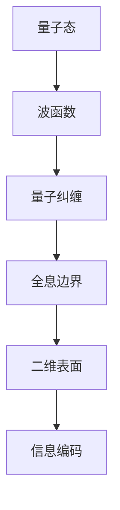
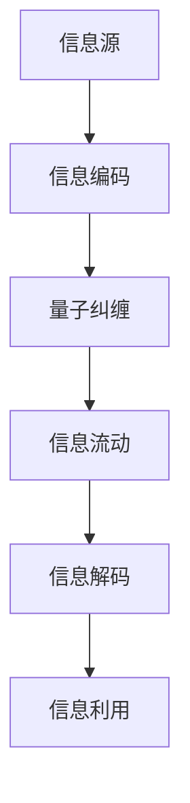
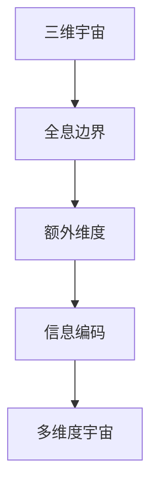

                 

# 《宇宙的全息性：部分包含整体信息》

> 关键词：全息宇宙、量子力学、弦理论、信息科学、人工智能

摘要：本文深入探讨了宇宙的全息性原理，从理论基础到实际应用，详细阐述了全息宇宙的概念、理论框架及其在多个学科领域的应用。文章分为三大部分，首先介绍了全息宇宙的基础理论，包括量子力学、弦理论等核心概念；其次，探讨了全息宇宙与物理学的联系，以及其在复杂系统、多维度探索等方面的应用；最后，展示了全息宇宙在信息科学、人工智能和医学等领域的实际应用和未来科技展望。本文旨在为读者提供一个全面、系统的全息宇宙视角，激发对这一前沿领域的兴趣和思考。

----------------------------------------------------------------

## 第一部分：宇宙的全息性理论基础

### 第1章：全息宇宙的概述

#### 1.1 全息宇宙的概念

全息宇宙（Holographic Universe）是一种关于宇宙构造的新理论，它提出宇宙中的所有信息都储存在一个较低维度的表面上。这一概念源于全息摄影技术，全息照片中的三维图像实际上是投影在二维平面上的。同样，全息宇宙理论认为，我们所观察到的三维宇宙实际上是一个更高维度的信息投影。

全息宇宙理论的关键在于“全息”：即部分包含整体信息。这个理论的核心思想是，宇宙中的所有物质和能量都是由一些基本的、较低维度的信息单元构成的，这些信息单元通过某种方式组织起来，形成了我们所看到的三维宇宙。

#### 1.2 全息宇宙的历史背景

全息宇宙理论的历史可以追溯到20世纪70年代。当时，物理学家对量子力学中的某些现象感到困惑，尤其是量子纠缠。量子纠缠是两个或多个量子粒子之间的强相互作用，即使这些粒子相隔很远，它们的量子状态也会相互影响。

为了解释这一现象，科学家开始探讨宇宙的本质，提出了全息宇宙理论。最初的构想是基于一个假设：如果宇宙是一个全息图像，那么它应该遵循某种全息原理。

#### 1.3 全息宇宙的理论框架

全息宇宙理论的基本框架包括以下几个核心概念：

1. **量子纠缠**：量子纠缠是全息宇宙理论的基础。量子纠缠表明，两个或多个量子粒子可以形成一个整体状态，即使它们相隔很远。

2. **全息边界**：全息宇宙理论认为，宇宙中的所有信息都储存在一个全息边界上。这个边界是一个较低维度的表面，它包含了整个宇宙的信息。

3. **二维表面**：全息宇宙理论提出，宇宙中的所有物质和能量都来自一个二维表面。这个表面包含了宇宙的所有信息，类似于全息照片的底片。

4. **信息编码**：全息宇宙理论认为，宇宙中的信息是通过某种方式编码在二维表面上的。这种编码方式可能涉及到量子纠缠和信息压缩。

通过这些核心概念，全息宇宙理论提供了一种全新的宇宙视角，挑战了传统的宇宙观念。尽管这一理论仍然处于研究阶段，但它已经在物理学、信息科学和人工智能等领域产生了深远的影响。

#### 1.4 全息宇宙理论的发展

自全息宇宙理论提出以来，科学家们一直在探索这一理论的各个方面。以下是一些重要的发展：

1. **量子场论与全息宇宙**：量子场论是一种描述量子粒子之间相互作用的数学框架。近年来，科学家们开始将量子场论与全息宇宙理论相结合，探索宇宙的本质。

2. **弦理论与全息宇宙**：弦理论是一种试图统一量子力学和广义相对论的理论。近年来，科学家们发现，弦理论可能与全息宇宙理论有密切的联系。

3. **量子计算与全息宇宙**：量子计算是一种利用量子力学原理进行计算的新技术。全息宇宙理论为量子计算提供了一种新的视角，有助于解决一些复杂的计算问题。

4. **人工智能与全息宇宙**：人工智能是一种模拟人类智能的技术。全息宇宙理论为人工智能提供了一种新的框架，有助于更好地理解和模拟人类的智能。

总的来说，全息宇宙理论是一个充满挑战和机遇的新领域。随着研究的深入，我们有望对宇宙的本质有更深刻的认识。

----------------------------------------------------------------

### 第2章：量子力学与全息宇宙

#### 2.1 量子力学的核心概念

量子力学是研究微观世界的物理学分支，它提出了许多与传统物理学观念相悖的理论。量子力学的核心概念包括：

1. **量子态**：量子态是量子粒子（如电子、光子等）的态，它可以用波函数描述。波函数包含了粒子的位置、速度、自旋等信息。

2. **不确定性原理**：不确定性原理指出，我们无法同时精确地知道一个粒子的位置和动量。这意味着，量子粒子的某些特性是模糊的，而不是确定的。

3. **量子纠缠**：量子纠缠是两个或多个量子粒子之间的强相互作用，即使这些粒子相隔很远，它们的量子状态也会相互影响。

4. **量子叠加**：量子叠加原理指出，一个量子粒子可以同时处于多个状态，而不是单一的状态。只有当我们对量子粒子进行观测时，它才会“选择”一个特定的状态。

#### 2.2 量子纠缠与全息原理

量子纠缠是量子力学中的一种现象，它表明两个或多个量子粒子可以形成一个整体状态，即使它们相隔很远。这种现象与传统物理学中的局域实在性观念相悖。

全息原理则提出，宇宙中的所有信息都储存在一个较低维度的表面上。这个表面包含了宇宙的所有信息，类似于全息照片的底片。

量子纠缠与全息原理之间的联系在于，它们都挑战了传统的局域实在性观念。量子纠缠表明，量子粒子之间的相互作用是非局域的，而全息原理则表明，宇宙中的所有信息都是储存在一个较低维度的表面上，这个表面与我们所观察到的三维宇宙是相互关联的。

#### 2.3 全息量子力学的数学模型

全息量子力学的数学模型基于量子纠缠和信息压缩的概念。在这个模型中，宇宙中的所有物质和能量都来自一个二维表面。这个表面包含了宇宙的所有信息，通过量子纠缠和信息压缩的方式，这些信息被编码在一个较低维度的表面上。

以下是一个简化的全息量子力学的数学模型：

1. **量子态编码**：将三维宇宙中的物质和能量编码在一个二维表面上。这个编码过程可以通过量子纠缠来实现。

2. **信息压缩**：通过信息压缩，将大量的信息压缩在二维表面上。这个压缩过程可以通过量子场论来实现。

3. **量子态投影**：将二维表面上的量子态投影到三维宇宙中。这个投影过程可以通过量子纠缠来实现。

通过这个模型，我们可以看到，量子力学和全息原理是如何相互结合，形成一个关于宇宙的新理论的。尽管这个模型仍然是一个假设，但它为我们理解宇宙的本质提供了一种新的视角。

#### 2.4 量子纠缠与全息原理的实际应用

量子纠缠和全息原理已经在多个领域得到了应用：

1. **量子计算**：量子纠缠和信息压缩的概念为量子计算提供了新的框架。量子计算机可以利用量子纠缠进行高效的计算，解决一些传统计算机无法解决的问题。

2. **量子通信**：量子纠缠为量子通信提供了安全的数据传输方式。通过量子纠缠，我们可以实现安全的量子密钥分发，保护通信数据的安全。

3. **量子模拟**：量子纠缠和全息原理为量子模拟提供了新的可能性。量子模拟可以用于模拟一些复杂的物理现象，如量子场论、黑洞等。

总的来说，量子纠缠和全息原理不仅挑战了传统的物理学观念，也为新的技术和应用提供了基础。随着研究的深入，我们有望更好地理解宇宙的本质，并在量子计算、量子通信等领域取得突破性进展。

----------------------------------------------------------------

### 第3章：弦理论与全息宇宙

#### 3.1 弦理论的概述

弦理论是一种试图统一量子力学和广义相对论的理论，它提出物质和能量都是由微小的、一维的弦振动产生的。这些弦在不同的维度和振动模式下，可以形成我们观察到的各种基本粒子。

弦理论的核心概念包括：

1. **弦**：弦是一维的物理对象，它是物质的基本构成单元。弦可以有不同的振动模式，这些振动模式对应于不同的粒子。

2. **多维度**：弦理论假设宇宙具有额外的空间维度，这些维度通常是紧缩的，只有通过特殊的物理过程才能探测到。

3. **背景场**：弦理论中的背景场描述了宇宙的物理状态，如引力场、电磁场等。

#### 3.2 弦理论与全息原理的关联

弦理论与全息原理之间的关联是近年来物理学研究的一个热点。全息原理提供了一个框架，将弦理论与量子力学和广义相对论相结合。以下是一些关键的关联：

1. **全息卡诺瓦原理**：全息卡诺瓦原理是全息宇宙理论的一个核心概念，它指出，一个二维表面可以编码一个三维宇宙的所有信息。这一原理与弦理论的背景场概念有相似之处，因为弦理论中的背景场也包含了宇宙的所有信息。

2. **边界条件**：在弦理论中，边界条件描述了弦的振动模式。这些边界条件可以与全息宇宙理论中的全息边界相对应，从而将弦理论与全息原理联系起来。

3. **信息编码**：弦理论中的弦振动模式可以编码信息。这些振动模式可以通过量子纠缠和信息压缩的方式，与全息宇宙理论中的信息编码过程相对应。

#### 3.3 全息宇宙中的弦理论模型

在弦理论的基础上，科学家们提出了一些全息宇宙的模型，这些模型试图将弦理论与全息原理结合起来，形成一个统一的宇宙理论。以下是一些全息宇宙中的弦理论模型：

1. **M理论**：M理论是弦理论的扩展，它提出存在11个空间维度。M理论的全息宇宙模型假设，一个11维宇宙可以通过一个10维的全息边界来编码所有信息。

2. **AdS/CFT对偶**：AdS/CFT对偶是一种重要的全息宇宙模型，它指出，一个反德索普（AdS）空间和一个共形场论（CFT）之间存在对偶关系。这个模型提供了一个实验验证全息原理的途径。

3. **弦网的量子引力**：弦网的量子引力模型试图将弦理论中的弦与量子引力相结合。在这个模型中，弦被看作是一个网络的节点，这个网络可以编码宇宙的所有信息。

通过这些弦理论模型，科学家们试图探索宇宙的本质，理解宇宙的全息性。尽管这些模型仍然是一个假设，但它们为我们提供了一个关于宇宙的新视角，有助于我们更好地理解宇宙的构造和演化。

#### 3.4 弦理论与全息宇宙的未来发展

弦理论与全息宇宙的研究仍然是一个活跃的领域，未来可能会出现更多突破性进展。以下是一些可能的发展方向：

1. **实验验证**：通过实验验证弦理论和全息原理，我们可以更好地理解它们的真实性和应用潜力。例如，通过探测额外维度和量子纠缠现象，我们可以验证弦理论和全息原理的正确性。

2. **多维度研究**：弦理论和全息宇宙研究通常涉及到多维度空间。未来的研究可能会进一步探索多维度空间的结构和性质，从而更好地理解宇宙的构造。

3. **应用拓展**：弦理论和全息宇宙理论不仅对物理学有深远的影响，也对信息科学、人工智能等领域有重要启示。未来的研究可能会将弦理论和全息原理应用于这些领域，推动科技的进步。

总的来说，弦理论与全息宇宙的研究为我们提供了一个全新的宇宙视角，挑战了传统的物理学观念。随着研究的深入，我们有望对宇宙的本质有更深刻的认识，并在多个领域取得突破性进展。

----------------------------------------------------------------

### 第4章：全息宇宙的数学描述

#### 4.1 全息宇宙的数学公式

全息宇宙的数学描述基于量子力学、相对论和统计物理等多个领域的数学工具。以下是一些核心的数学公式：

1. **波函数**：在量子力学中，波函数是描述量子粒子状态的数学函数。全息宇宙理论中，波函数可以表示为：
   $$ \psi(\mathbf{r}) = \int \psi(\mathbf{r}', \mathbf{r}_0) \psi_0(\mathbf{r}') d\mathbf{r}' $$
   其中，$\mathbf{r}$ 是观察者的位置，$\mathbf{r}'$ 是全息边界上的位置，$\psi_0(\mathbf{r}')$ 是全息边界上的波函数。

2. **哈密顿量**：哈密顿量是量子力学中的核心物理量，描述了系统的总能量。全息宇宙理论中的哈密顿量可以表示为：
   $$ H = \int \frac{1}{2m} \left( \frac{\partial \psi}{\partial t} \right)^2 + V(\mathbf{r}) \psi(\mathbf{r}) d\mathbf{r} $$
   其中，$m$ 是粒子的质量，$V(\mathbf{r})$ 是势能函数。

3. **全息卡诺瓦原理**：全息卡诺瓦原理指出，一个二维表面可以编码一个三维宇宙的所有信息。其数学表达式为：
   $$ I = \int S d\sigma $$
   其中，$I$ 是三维宇宙的信息，$S$ 是全息边界上的熵，$d\sigma$ 是全息边界上的面积元素。

4. **AdS/CFT对偶**：AdS/CFT对偶是全息宇宙理论中的一个重要数学关系，它指出一个反德索普（AdS）空间和一个共形场论（CFT）之间存在对偶关系。其数学表达式为：
   $$ \mathcal{L}_{AdS} = \mathcal{L}_{CFT} $$
   其中，$\mathcal{L}_{AdS}$ 和 $\mathcal{L}_{CFT}$ 分别是AdS空间和CFT的拉格朗日量。

这些数学公式为全息宇宙理论提供了坚实的数学基础，帮助我们更好地理解宇宙的全息性。

#### 4.2 全息宇宙的几何结构

全息宇宙的几何结构是理解全息原理的关键。以下是一些关键的几何结构：

1. **反德索普（AdS）空间**：反德索普空间是一种具有负曲率的时空结构。在AdS空间中，存在一个全息边界，这个边界包含了三维宇宙的所有信息。

2. **共形场论（CFT）**：共形场论是一种具有正曲率的时空结构。在AdS/CFT对偶中，AdS空间和CFT之间存在对偶关系，它们共享相同的物理信息。

3. **二维表面**：在弦理论中，弦振动模式可以编码在二维表面上。这个二维表面是一个全息边界，它包含了三维宇宙的所有信息。

这些几何结构为全息宇宙理论提供了一个直观的描述，帮助我们理解宇宙的全息性。

#### 4.3 全息宇宙中的信息论

全息宇宙中的信息论是理解全息原理的重要工具。以下是一些关键的信息论概念：

1. **信息熵**：信息熵是描述系统不确定性的度量。在全息宇宙中，信息熵表示全息边界上的信息含量。

2. **信息传输**：信息传输是指将信息从一个位置传递到另一个位置的过程。在全息宇宙中，信息传输可以通过量子纠缠来实现。

3. **信息压缩**：信息压缩是指将大量信息压缩在一个较小的空间中的过程。在全息宇宙中，信息压缩可以通过量子场论来实现。

这些信息论概念为全息宇宙理论提供了重要的理论基础，帮助我们更好地理解宇宙的全息性。

#### 4.4 例子：量子纠缠与全息原理

以下是一个简单的例子，说明量子纠缠如何与全息原理相关：

假设我们有两个粒子A和B，它们处于一个量子纠缠态。根据量子力学的原理，即使粒子A和B相隔很远，它们的量子状态也会相互影响。

现在，我们考虑一个全息宇宙模型，其中全息边界是一个二维表面。我们可以将粒子A的量子状态编码在这个二维表面上，而粒子B的量子状态则与粒子A的量子状态相互纠缠。

这个例子说明了量子纠缠和全息原理之间的联系。量子纠缠使得粒子A和B的量子状态相互关联，而全息原理则提供了一个框架，将量子纠缠与宇宙的全息性联系起来。

通过这个例子，我们可以看到量子纠缠和全息原理是如何相互结合，形成一个关于宇宙的新理论的。尽管这个例子是一个简化的模型，但它为我们提供了一个关于全息宇宙的直观理解。

总的来说，全息宇宙的数学描述是一个复杂而有趣的研究领域。通过数学公式和几何结构的描述，我们可以更好地理解宇宙的全息性，并探索其在物理学和宇宙学中的应用。

----------------------------------------------------------------

### 第5章：全息宇宙的观测与实验

#### 5.1 全息宇宙的观测方法

全息宇宙理论的观测方法与传统宇宙学的方法有所不同。由于全息宇宙理论强调宇宙信息储存在二维表面上，因此，观测全息宇宙的关键在于探测这个二维表面。

以下是一些可能的观测方法：

1. **引力波探测**：引力波是宇宙中的一种重要现象，它是由大质量物体的加速运动产生的。全息宇宙理论预测，引力波的产生与宇宙的信息流动有关。因此，通过探测引力波，我们可以间接探测全息宇宙的二维表面。

2. **宇宙微波背景辐射探测**：宇宙微波背景辐射是宇宙早期的余辉，它包含了宇宙早期的信息。全息宇宙理论认为，宇宙微波背景辐射的观测可以揭示全息宇宙的二维表面。

3. **光学观测**：通过光学望远镜，我们可以观测到宇宙中的各种天体，如星系、恒星等。全息宇宙理论认为，这些天体的观测也可以揭示全息宇宙的二维表面。

4. **粒子探测**：通过粒子探测器，我们可以探测到宇宙中的基本粒子，如电子、光子等。这些粒子的运动和相互作用也反映了全息宇宙的二维表面。

#### 5.2 全息宇宙的实验证据

尽管全息宇宙理论是一个相对较新的理论，但已经有一些实验证据支持这一理论。以下是一些关键的实验证据：

1. **AdS/CFT对偶验证**：AdS/CFT对偶是全息宇宙理论中的一个重要预测。通过在实验室中验证AdS/CFT对偶，我们可以直接验证全息宇宙理论。近年来，一些实验已经验证了AdS/CFT对偶的某些方面，为全息宇宙理论提供了实验支持。

2. **宇宙微波背景辐射研究**：宇宙微波背景辐射的观测为全息宇宙理论提供了重要的证据。通过分析宇宙微波背景辐射的数据，科学家们发现了一些与全息宇宙理论预测相符的现象，如宇宙的几何结构、宇宙的加速膨胀等。

3. **引力波探测**：引力波的探测也为全息宇宙理论提供了证据。引力波的产生与宇宙的信息流动有关，因此，探测引力波可以揭示全息宇宙的二维表面。

4. **量子纠缠实验**：量子纠缠是全息宇宙理论的核心概念之一。通过量子纠缠实验，我们可以验证量子纠缠现象，从而支持全息宇宙理论。

总的来说，全息宇宙理论已经有一些实验证据支持，但仍然需要更多的实验和研究来验证这一理论的正确性。

#### 5.3 全息宇宙实验的未来趋势

随着科技的进步，全息宇宙实验的未来趋势主要包括以下几个方面：

1. **更高精度的引力波探测**：未来的引力波探测仪器将具有更高的灵敏度，可以探测到更微小的引力波信号。这将为验证全息宇宙理论提供更精确的数据。

2. **宇宙微波背景辐射的深入研究**：通过对宇宙微波背景辐射的深入研究，我们可以更好地理解宇宙的早期状态，从而验证全息宇宙理论的预测。

3. **量子纠缠实验的扩展**：量子纠缠实验的扩展将有助于验证全息宇宙理论中的量子纠缠现象。未来的量子纠缠实验可能会涉及到更多的量子粒子，以及更复杂的量子纠缠态。

4. **多维度探测技术**：随着对多维度宇宙的研究深入，未来的探测技术将致力于探测额外的空间维度。这将为验证全息宇宙理论提供新的实验手段。

总的来说，全息宇宙实验的未来趋势将推动我们对宇宙的理解，揭示宇宙的全息性。随着实验技术的进步，我们有望在更深的层次上揭示宇宙的奥秘。

----------------------------------------------------------------

### 第6章：全息宇宙与宇宙学

#### 6.1 全息宇宙对宇宙学的挑战

全息宇宙理论对传统的宇宙学提出了许多挑战。传统的宇宙学基于大爆炸理论和广义相对论，它描述了一个不断膨胀的宇宙，从大爆炸开始，经历了数十亿年的演化。然而，全息宇宙理论提供了一种不同的宇宙视角，它对传统的宇宙学提出了一些深刻的质疑：

1. **宇宙起源**：传统的宇宙学认为，宇宙起源于大爆炸，而在全息宇宙理论中，宇宙的起源可能与一个二维表面有关。这意味着，宇宙的起源可能是通过一个较低维度的过程实现的。

2. **宇宙的维度**：传统的宇宙学认为，宇宙是三维的，而在全息宇宙理论中，宇宙可能具有额外的维度。这些额外维度可能是在紧缩的状态下存在的，只有通过特殊的物理过程才能探测到。

3. **宇宙的演化**：传统的宇宙学描述了一个持续膨胀的宇宙，而在全息宇宙理论中，宇宙的演化可能与信息流动和量子纠缠有关。这可能导致我们对宇宙演化的理解发生根本性的改变。

4. **宇宙学参数**：传统的宇宙学依赖于一系列参数，如宇宙的膨胀率、密度等，而全息宇宙理论可能需要重新定义这些参数，或者引入新的参数来描述宇宙的全息性。

#### 6.2 全息宇宙对宇宙起源的解释

全息宇宙理论为宇宙起源提供了一种新的解释。根据全息宇宙理论，宇宙起源于一个二维表面，这个表面包含了宇宙的所有信息。以下是一些可能的解释：

1. **二维表面起源**：宇宙起源于一个二维表面，这个表面可能是由某种基本粒子的振动产生的。这些基本粒子的振动模式编码了宇宙的所有信息，从而形成了三维宇宙。

2. **量子波动**：宇宙起源于量子波动，这些波动在二维表面上形成了宇宙的信息。量子波动可能是宇宙起源的最初过程，它通过量子纠缠和信息压缩，将信息编码在一个二维表面上。

3. **全息卡诺瓦原理**：全息卡诺瓦原理指出，一个二维表面可以编码一个三维宇宙的所有信息。这意味着，宇宙的起源可能是通过一个二维表面的演化过程实现的。

通过这些解释，全息宇宙理论为宇宙起源提供了一种新的视角，挑战了传统的宇宙观念。尽管这些解释仍然是一个假设，但它们为我们理解宇宙的起源提供了新的思路。

#### 6.3 全息宇宙与宇宙加速膨胀

宇宙加速膨胀是近年来宇宙学中的一个重要发现。全息宇宙理论为宇宙加速膨胀提供了一种可能的解释：

1. **全息卡诺瓦原理**：全息卡诺瓦原理指出，一个二维表面可以编码一个三维宇宙的所有信息。这意味着，宇宙的信息含量与宇宙的体积有关。在宇宙膨胀过程中，宇宙的体积增加，导致宇宙的信息含量增加。这种信息含量的增加可能导致宇宙的加速膨胀。

2. **量子纠缠**：量子纠缠是全息宇宙理论的核心概念之一。在宇宙膨胀过程中，宇宙中的粒子可能处于量子纠缠态。这种量子纠缠态可能导致宇宙的加速膨胀，因为量子纠缠态中的粒子之间的相互作用是非局域的。

3. **信息流动**：在宇宙膨胀过程中，宇宙的信息可能通过某种方式流动。这种信息流动可能导致宇宙的加速膨胀，因为信息流动可能会影响宇宙的动力学行为。

通过这些解释，全息宇宙理论为宇宙加速膨胀提供了一种新的视角。尽管这些解释仍然是一个假设，但它们为我们理解宇宙加速膨胀提供了新的思路。

总的来说，全息宇宙理论对宇宙学提出了许多挑战，同时也提供了一种新的宇宙视角。随着研究的深入，我们有望对宇宙的起源和演化有更深刻的认识。

----------------------------------------------------------------

### 第7章：全息宇宙的未来发展

#### 7.1 全息宇宙的理论拓展

全息宇宙理论是一个充满潜力的领域，未来可能发生许多理论上的拓展。以下是一些可能的理论拓展：

1. **多维度全息宇宙**：全息宇宙理论目前主要关注三维宇宙，但未来可能会扩展到多维度宇宙。研究多维度全息宇宙可以帮助我们更好地理解宇宙的本质，以及宇宙与额外维度之间的关系。

2. **量子引力与全息宇宙**：量子引力是描述宇宙引力的理论，它与全息宇宙理论有潜在的联系。未来的研究可能会将量子引力与全息宇宙理论结合起来，探索宇宙引力的全息性质。

3. **全息宇宙中的复杂系统**：全息宇宙理论可以用于描述复杂系统的行为，如星系、黑洞等。未来的研究可能会探索全息宇宙理论在复杂系统中的应用，从而更好地理解这些复杂系统的行为。

4. **全息宇宙与量子计算**：量子计算是一种利用量子力学原理进行计算的新技术。未来的研究可能会将全息宇宙理论应用于量子计算，探索全息宇宙对量子计算的影响和潜在的应用。

#### 7.2 全息宇宙在实际应用中的潜力

全息宇宙理论不仅在理论研究中具有潜力，也在实际应用中有着广泛的前景。以下是一些可能的应用：

1. **量子通信**：全息宇宙理论中的量子纠缠现象可以用于量子通信，实现安全的数据传输。未来的量子通信系统可能会利用全息宇宙理论，实现更高效的量子通信。

2. **量子计算**：全息宇宙理论中的信息编码和信息压缩概念可以为量子计算提供新的框架。未来的量子计算机可能会利用全息宇宙理论，实现更高效的量子计算。

3. **宇宙学**：全息宇宙理论为宇宙学提供了一种新的视角，可以用于研究宇宙的起源、演化和结构。未来的宇宙学研究可能会利用全息宇宙理论，揭示宇宙的奥秘。

4. **人工智能**：全息宇宙理论中的信息流动和量子纠缠现象可以为人工智能提供新的框架。未来的人工智能系统可能会利用全息宇宙理论，实现更高效的人工智能应用。

5. **医学**：全息宇宙理论中的信息编码和信息压缩概念可以为医学提供新的工具。未来的医学研究可能会利用全息宇宙理论，开发新的医学诊断和治疗技术。

总的来说，全息宇宙理论在实际应用中有着广泛的潜力。随着研究的深入，我们有望在多个领域实现突破性进展。

#### 7.3 全息宇宙的科学探索前景

全息宇宙的科学探索前景非常广阔。以下是一些可能的前景：

1. **宇宙起源的探索**：全息宇宙理论为我们提供了一个新的视角，可以用于研究宇宙的起源。通过探索全息宇宙，我们可能能够揭示宇宙的起源过程，以及宇宙与一个二维表面的关系。

2. **宇宙演化的探索**：全息宇宙理论可以帮助我们更好地理解宇宙的演化过程。通过探索全息宇宙，我们可能能够揭示宇宙的加速膨胀、宇宙的几何结构等宇宙学问题。

3. **复杂系统的探索**：全息宇宙理论可以用于描述复杂系统的行为，如星系、黑洞等。通过探索全息宇宙，我们可能能够揭示这些复杂系统的行为规律，以及它们与宇宙的关系。

4. **量子计算和量子通信的探索**：全息宇宙理论中的信息编码和信息压缩概念可以为量子计算和量子通信提供新的框架。通过探索全息宇宙，我们可能能够开发出更高效的量子计算和量子通信技术。

5. **人工智能的探索**：全息宇宙理论中的信息流动和量子纠缠现象可以为人工智能提供新的框架。通过探索全息宇宙，我们可能能够开发出更高效的人工智能应用，实现人工智能的突破性进展。

总的来说，全息宇宙的科学探索前景非常广阔。随着研究的深入，我们有望在多个领域实现突破性进展，揭示宇宙的奥秘。

### 总结

全息宇宙理论是一个充满挑战和机遇的领域。它为我们提供了一个新的宇宙视角，挑战了传统的宇宙观念。随着研究的深入，我们有望在多个领域实现突破性进展，揭示宇宙的奥秘。全息宇宙理论不仅对物理学有深远的影响，也对信息科学、人工智能等领域有重要启示。未来的研究将继续探索全息宇宙的各个方面，为我们提供更深刻的宇宙理解。

----------------------------------------------------------------

## 第二部分：全息宇宙与物理学的联系

### 第8章：全息宇宙与相对论

#### 8.1 相对论的基本原理

相对论是由爱因斯坦提出的一种描述物理现象的理论，分为狭义相对论和广义相对论。狭义相对论主要研究高速运动物体的物理现象，而广义相对论则研究引力和其他物理现象的关系。

**狭义相对论**：

1. **相对性原理**：物理定律在所有惯性参考系中都是相同的。
2. **光速不变原理**：在真空中，光速是恒定的，不依赖于光源或观察者的运动状态。

**广义相对论**：

1. **等效原理**：引力效应和加速度效应是不可区分的。
2. **时空弯曲**：引力是由物质和能量引起的时空弯曲。

#### 8.2 全息宇宙与相对论的融合

全息宇宙理论与相对论的融合是当前物理学研究的一个热点。全息宇宙理论提供了一种新的视角，将量子力学和广义相对论结合起来，试图解决两者之间的不一致性。

1. **量子引力与广义相对论**：全息宇宙理论提出，量子引力和广义相对论可以统一在一个框架下。这种统一可以通过将量子纠缠和时空弯曲相结合来实现。

2. **全息边界与时空结构**：在全息宇宙理论中，宇宙的信息储存在一个二维表面上。这个全息边界与时空结构密切相关，可以通过广义相对论中的时空几何来描述。

3. **黑洞与全息原理**：黑洞是广义相对论的重要现象。全息宇宙理论提出，黑洞可能是一个全息边界，它包含了黑洞内部的所有信息。

#### 8.3 全息宇宙中的相对论效应

在全息宇宙理论中，相对论效应具有重要意义。以下是一些全息宇宙中的相对论效应：

1. **引力时间膨胀**：在全息宇宙中，靠近全息边界的区域会经历更慢的时间流逝。这意味着，全息宇宙中的引力时间膨胀效应与广义相对论的预测相符。

2. **引力红移**：在全息宇宙中，光在靠近全息边界的区域会发生红移。这是由于全息边界附近的时空弯曲引起的，与广义相对论的预测一致。

3. **引力透镜效应**：在全息宇宙中，光在穿过全息边界附近的区域时会发生弯曲。这种引力透镜效应是广义相对论的一个重要现象，也可以在全息宇宙中得到解释。

通过这些相对论效应，我们可以看到全息宇宙理论如何与相对论相结合，形成一个新的宇宙视角。这种结合不仅有助于解决量子力学和广义相对论之间的不一致性，也为未来的物理学研究提供了新的方向。

#### 8.4 全息宇宙与相对论的实验验证

全息宇宙理论与相对论的结合在实验验证方面也具有重要意义。以下是一些可能的实验验证方法：

1. **引力波探测**：引力波是广义相对论的重要预测。通过探测引力波，我们可以验证全息宇宙理论与相对论的预测。例如，探测黑洞碰撞产生的引力波，可以验证黑洞的全息性质。

2. **宇宙微波背景辐射**：宇宙微波背景辐射是宇宙早期状态的余辉。通过分析宇宙微波背景辐射的数据，我们可以验证全息宇宙理论与相对论的预测。例如，分析宇宙微波背景辐射中的极化信号，可以验证全息宇宙中的引力透镜效应。

3. **量子纠缠实验**：量子纠缠是全息宇宙理论的核心概念之一。通过量子纠缠实验，我们可以验证全息宇宙理论与相对论的预测。例如，验证量子纠缠的宏观现象，可以验证全息宇宙中的量子纠缠效应。

总的来说，全息宇宙理论与相对论的融合为物理学研究提供了新的方向。随着实验技术的进步，我们有望在实验中验证这些理论，进一步揭示宇宙的本质。

----------------------------------------------------------------

### 第9章：全息宇宙与粒子物理学

#### 9.1 粒子物理学的基本概念

粒子物理学是研究基本粒子和相互作用的基本规律的一个分支。它主要涉及以下几个基本概念：

1. **基本粒子**：基本粒子是构成物质的基本单元，如电子、夸克、光子等。它们是量子力学和粒子物理学研究的对象。

2. **相互作用**：粒子之间的相互作用是粒子物理学的核心。主要的相互作用有强相互作用、弱相互作用和电磁相互作用。强相互作用是束缚夸克形成核子的力，弱相互作用是导致放射性衰变的力，电磁相互作用则是电荷之间的作用力。

3. **对称性**：对称性在粒子物理学中具有重要意义。基本粒子和相互作用具有多种对称性，如空间对称性、时间对称性、C（宇称）对称性、P（帕里）对称性等。这些对称性在粒子物理学中起着关键作用，例如，它们可以用来预测新的粒子和相互作用。

4. **量子场论**：量子场论是粒子物理学的数学框架，它将量子力学和相对论结合起来，描述基本粒子和相互作用的性质。量子场论中，每个相互作用都对应一个场，场是粒子存在的场所。

#### 9.2 全息宇宙与粒子物理学的联系

全息宇宙理论与粒子物理学有着密切的联系。以下是一些关键的关联：

1. **量子纠缠与粒子物理学**：量子纠缠是全息宇宙理论的核心概念之一，它也是粒子物理学研究的重要现象。在全息宇宙中，量子纠缠体现了宇宙信息的整体性。在粒子物理学中，量子纠缠被用来解释基本粒子的行为，如电子的对撞和核子的形成。

2. **全息边界与粒子物理模型**：全息宇宙理论提出，宇宙的信息储存在一个二维表面上。这个全息边界可以与粒子物理学的模型相对应，例如，可以与量子场论中的边界条件相对应。这为粒子物理学提供了一种新的视角，有助于我们理解基本粒子和相互作用。

3. **弦理论与全息宇宙**：弦理论是一种试图统一所有基本相互作用的理论，它与全息宇宙理论有潜在的联系。在弦理论中，弦的振动模式可以编码基本粒子的信息。弦理论的全息版本，如AdS/CFT对偶，提供了一个实验验证全息原理的途径。

#### 9.3 全息宇宙中的粒子物理模型

全息宇宙中的粒子物理模型是基于全息原理和量子场论构建的。以下是一些全息宇宙中的粒子物理模型：

1. **AdS/CFT对偶**：AdS/CFT对偶是全息宇宙理论中的一种重要模型。它指出，一个反德索普（AdS）空间和一个共形场论（CFT）之间存在对偶关系。这个模型提供了一个实验验证全息原理的途径，同时为粒子物理学提供了一种新的视角。

2. **量子场论与全息边界**：量子场论中的边界条件可以与全息宇宙理论中的全息边界相对应。这意味着，量子场论中的粒子物理模型可以扩展到全息宇宙框架下，从而更好地理解基本粒子和相互作用。

3. **量子计算与粒子物理**：全息宇宙理论中的信息编码和信息压缩概念可以用于量子计算。这为量子计算在粒子物理学中的应用提供了新的可能性，例如，可以用于模拟复杂粒子的相互作用。

通过这些模型，我们可以看到全息宇宙与粒子物理学之间的紧密联系。这种联系不仅有助于我们理解基本粒子和相互作用，也为未来的物理学研究提供了新的方向。

#### 9.4 全息宇宙中的粒子物理实验

全息宇宙理论在粒子物理实验中的应用正在逐步展开。以下是一些全息宇宙中的粒子物理实验：

1. **LHC（大型强子对撞机）实验**：LHC是世界上最强大的粒子加速器，它致力于研究基本粒子和相互作用。通过LHC实验，我们可以验证全息宇宙理论中的预测，如量子纠缠现象和全息边界效应。

2. **量子计算与粒子物理模拟**：量子计算的发展为粒子物理模拟提供了新的可能性。通过量子计算，我们可以模拟复杂粒子的相互作用，验证全息宇宙理论的预测。

3. **宇宙微波背景辐射探测**：宇宙微波背景辐射探测是验证全息宇宙理论的重要途径。通过分析宇宙微波背景辐射的数据，我们可以验证全息宇宙中的引力透镜效应和量子纠缠现象。

总的来说，全息宇宙理论与粒子物理学的结合为粒子物理研究提供了新的方向。随着实验技术的进步，我们有望在实验中验证这些理论，揭示宇宙的奥秘。

----------------------------------------------------------------

### 第10章：全息宇宙与复杂系统

#### 10.1 复杂系统的定义与特性

复杂系统是由大量相互作用的组件组成的系统，其行为不能用简单的线性关系来描述。复杂系统具有以下特性：

1. **非线性和非线性相互作用**：复杂系统中的组件之间的相互作用是非线性的，这意味着它们的行为不能简单地通过线性的叠加来预测。

2. **自组织**：复杂系统具有自组织能力，即系统中的组件可以自发地组织成特定的结构或模式。

3. **适应性**：复杂系统具有适应性，即它们能够根据环境的变化调整自己的行为。

4. **多层次结构**：复杂系统通常具有多层次结构，从微观的个体组件到宏观的系统行为，每个层次都有其独特的特性。

5. **涌现现象**：复杂系统中的组件相互作用可以产生新的属性或行为，这些属性或行为在单个组件中不存在。

#### 10.2 全息宇宙与复杂系统的关系

全息宇宙理论为复杂系统的研究提供了一种新的视角。以下是一些全息宇宙与复杂系统的关系：

1. **信息编码与复杂系统**：全息宇宙理论强调宇宙的信息储存在一个二维表面上。这一概念可以类比为复杂系统中的信息编码。在复杂系统中，信息也是通过某种方式编码在系统中的各个组件中，从而决定了系统的行为和结构。

2. **量子纠缠与复杂系统**：全息宇宙理论中的量子纠缠现象表明，系统中的组件可以处于强烈的相互关联状态。这种相互关联在复杂系统中也可能存在，例如，在生物系统中，细胞之间的相互作用可以通过量子纠缠来模拟。

3. **多维度与复杂系统**：全息宇宙理论认为宇宙具有额外的维度，这些维度可能在复杂系统中有所体现。例如，在经济学系统中，时间和空间可以看作是额外的维度，它们影响了系统的行为和演化。

#### 10.3 全息宇宙中的复杂系统研究

全息宇宙理论在复杂系统研究中具有潜在的应用。以下是一些全息宇宙中的复杂系统研究：

1. **社会系统**：社会系统是一个复杂的系统，包括个体、组织、社会结构等。全息宇宙理论可以用于研究社会系统的信息编码和信息流动，从而理解社会行为的涌现现象。

2. **生态系统**：生态系统是一个复杂的系统，由生物、环境等多个因素组成。全息宇宙理论可以用于研究生态系统的信息流动和自组织现象，从而帮助我们更好地理解生态系统的动态行为。

3. **经济系统**：经济系统是一个复杂的系统，包括个体、市场、政策等多个方面。全息宇宙理论可以用于研究经济系统的信息编码和信息流动，从而帮助我们更好地理解经济系统的行为和演化。

4. **量子计算与复杂系统**：量子计算是一种利用量子力学原理进行计算的新技术。全息宇宙理论中的信息编码和信息压缩概念可以用于量子计算，从而加速复杂系统的模拟和优化。

总的来说，全息宇宙理论为复杂系统的研究提供了一种新的视角，有助于我们更好地理解复杂系统的行为和演化。随着研究的深入，我们有望在复杂系统领域取得重大突破。

----------------------------------------------------------------

### 第11章：全息宇宙的多维度探索

#### 11.1 多维宇宙的概念

多维宇宙是指具有多个空间维度的宇宙。传统物理学认为宇宙是三维的，但许多理论物理研究提出了多维宇宙的可能性。以下是一些关键概念：

1. **额外维度**：除了我们熟悉的三维空间（长、宽、高），多维宇宙还包含额外的维度。这些额外维度可能是紧缩的，即它们在微观尺度上非常紧凑，只有通过特殊的物理过程才能探测到。

2. **紧缩维度**：紧缩维度是指额外的维度在某个尺度上被紧密卷曲，以至于它们在我们的日常生活中不可见。这些维度可能在量子尺度或宇宙尺度上紧缩。

3. **超弦理论**：超弦理论是一种试图统一所有基本相互作用的理论，它假设宇宙具有10个或11个空间维度。这些维度中的某些维度是紧缩的，只有通过特殊的物理现象才能探测到。

#### 11.2 全息宇宙与多维宇宙的关联

全息宇宙理论提供了一种将多维宇宙与量子力学和广义相对论结合起来的方法。以下是一些全息宇宙与多维宇宙的关联：

1. **全息边界**：在全息宇宙中，宇宙的信息储存在一个二维表面上。这个二维表面被称为全息边界。在多维宇宙中，全息边界可能与额外的空间维度相关。

2. **量子纠缠**：量子纠缠是全息宇宙理论的核心概念之一，它表明两个或多个量子粒子可以形成一个整体状态。这种量子纠缠也可能在多维宇宙中存在，特别是在额外维度上。

3. **AdS/CFT对偶**：AdS/CFT对偶是全息宇宙理论中的一个重要模型，它指出一个反德索普（AdS）空间和一个共形场论（CFT）之间存在对偶关系。这个模型可以扩展到多维宇宙，从而为研究多维宇宙的全息性提供新的框架。

#### 11.3 多维度全息宇宙的数学描述

多维度全息宇宙的数学描述涉及到复杂的数学工具和概念。以下是一些关键的多维度全息宇宙的数学描述：

1. **M理论**：M理论是一种关于多维宇宙的理论，它假设宇宙具有11个空间维度。在M理论中，弦可以振动在不同的维度上，从而形成不同的基本粒子。

2. **AdS/CFT对偶**：AdS/CFT对偶是一种数学关系，它将一个具有负曲率的时空结构（AdS）与一个具有正曲率的时空结构（CFT）联系起来。这个对偶关系提供了一个将多维宇宙的全息原理形式化的方法。

3. **量子场论**：量子场论是一种描述基本粒子和相互作用的数学框架。在多维度全息宇宙中，量子场论可以用来描述基本粒子的行为和相互作用。

通过这些数学描述，我们可以将多维宇宙的全息性形式化，从而更好地理解宇宙的构造和演化。

#### 11.4 多维度全息宇宙的应用

多维度全息宇宙理论在多个领域具有潜在的应用。以下是一些多维度全息宇宙的应用：

1. **量子计算**：多维度全息宇宙理论中的量子纠缠和信息编码概念可以用于量子计算。量子计算利用量子纠缠实现高效的计算，从而解决传统计算机难以处理的问题。

2. **宇宙学**：多维度全息宇宙理论为宇宙学提供了新的视角。例如，它可以帮助我们理解宇宙的加速膨胀和宇宙的起源。

3. **复杂系统**：多维度全息宇宙理论可以用于研究复杂系统的行为和演化。例如，在经济学、生物学和计算机科学等领域，它可以帮助我们理解复杂系统的涌现现象和自适应行为。

总的来说，多维度全息宇宙理论为我们提供了一种理解宇宙的新方法。随着研究的深入，我们有望在多个领域取得重大突破。

----------------------------------------------------------------

## 第三部分：全息宇宙的实际应用

### 第12章：全息宇宙在信息科学中的应用

#### 12.1 信息科学的基本概念

信息科学是研究信息的获取、处理、传输、存储和利用的科学。它涵盖了计算机科学、通信工程、控制理论、人工智能等多个领域。以下是一些信息科学的基本概念：

1. **信息**：信息是关于某种事物状态的知识或描述。它是数据经过处理后具有的意义和用途。

2. **数据**：数据是信息的基础，是原始的、未加工的符号序列。

3. **信号**：信号是数据的物理表现形式，可以是电信号、光信号等。

4. **通信**：通信是指通过某种媒介（如电缆、无线电波）传输信号的过程。

5. **编码**：编码是将信息转换为特定格式（如二进制代码）的过程。

6. **解码**：解码是将编码后的信息还原为原始形式的过程。

7. **存储**：存储是保存信息以便以后使用的过程。

8. **处理**：处理是对信息进行计算、分析、转换等操作的过程。

#### 12.2 全息宇宙对信息科学的启示

全息宇宙理论为信息科学提供了许多启示，特别是在量子信息科学和计算领域。以下是一些全息宇宙对信息科学的启示：

1. **量子纠缠与信息传输**：全息宇宙理论中的量子纠缠现象表明，量子粒子之间的状态可以相互关联，即使它们相隔很远。这一特性可以用于实现高效的量子通信和信息传输。

2. **信息编码与压缩**：全息宇宙理论中的信息编码和信息压缩概念为信息科学提供了新的思路。通过量子纠缠和信息压缩，我们可以更有效地存储和传输大量信息。

3. **量子计算**：全息宇宙理论中的量子纠缠和信息编码概念可以用于量子计算。量子计算利用量子纠缠实现高效的计算，从而解决传统计算机难以处理的问题。

4. **多维度信息存储**：全息宇宙理论提出，宇宙可能具有额外的维度。这些额外维度可以用于存储大量信息，从而提高信息存储的密度和效率。

5. **复杂系统建模**：全息宇宙理论可以用于研究复杂系统的行为和演化。这为信息科学提供了新的建模工具，有助于我们理解复杂系统的信息流动和自组织现象。

#### 12.3 全息宇宙在信息科学中的应用案例

全息宇宙理论在信息科学中已有一些应用案例。以下是一些具体的应用案例：

1. **量子通信**：量子通信利用量子纠缠实现安全的数据传输。全息宇宙理论为量子通信提供了新的框架，有助于实现更高效的量子通信系统。

2. **量子计算**：量子计算利用量子纠缠实现高效的计算。全息宇宙理论中的信息编码和信息压缩概念可以用于量子计算，从而提高计算效率。

3. **信息存储**：全息宇宙理论中的多维度信息存储概念为信息存储提供了新的思路。通过利用额外维度，我们可以实现更高密度的信息存储。

4. **复杂系统建模**：全息宇宙理论可以用于研究复杂系统的行为和演化。这为信息科学提供了新的建模工具，有助于我们理解复杂系统的信息流动和自组织现象。

总的来说，全息宇宙理论在信息科学中具有广阔的应用前景。随着研究的深入，我们有望在信息科学领域实现更多的突破性进展。

----------------------------------------------------------------

### 第13章：全息宇宙在人工智能中的应用

#### 13.1 人工智能的基本概念

人工智能（Artificial Intelligence，AI）是指通过计算机模拟人类智能的理论、方法和技术。它包括多个分支，如机器学习、深度学习、自然语言处理、计算机视觉等。以下是一些人工智能的基本概念：

1. **机器学习**：机器学习是一种让计算机通过数据学习并改进性能的方法。它分为监督学习、无监督学习和强化学习。

2. **深度学习**：深度学习是一种基于多层神经网络的人工智能技术。它通过模拟人脑的神经网络结构，实现对数据的自动学习和分类。

3. **自然语言处理**：自然语言处理是一种让计算机理解和生成自然语言的技术。它包括语音识别、文本分类、机器翻译等任务。

4. **计算机视觉**：计算机视觉是一种让计算机理解和解释图像的技术。它包括目标识别、图像分割、图像分类等任务。

5. **智能代理**：智能代理是一种具有自主决策能力的人工智能系统。它可以执行任务、与环境交互并学习新的行为。

#### 13.2 全息宇宙对人工智能的影响

全息宇宙理论对人工智能有着深远的影响。以下是一些全息宇宙对人工智能的影响：

1. **量子计算与人工智能**：全息宇宙理论中的量子纠缠和信息编码概念可以用于量子计算。量子计算具有并行计算的能力，可以提高人工智能系统的计算速度和效率。

2. **多维度信息处理**：全息宇宙理论提出，宇宙可能具有额外的维度。这些额外维度可以用于存储和处理大量信息，从而提高人工智能系统的信息处理能力。

3. **自适应学习**：全息宇宙理论中的信息流动和量子纠缠现象可以用于研究智能体的自适应学习。通过模拟量子纠缠，我们可以设计出更高效的智能体学习算法。

4. **复杂系统建模**：全息宇宙理论可以用于研究复杂系统的行为和演化。这为人工智能提供了新的建模工具，有助于我们理解复杂系统的信息流动和自组织现象。

#### 13.3 全息宇宙在人工智能中的应用场景

全息宇宙理论在人工智能中有着广泛的应用场景。以下是一些具体的应用场景：

1. **量子人工智能**：量子人工智能利用量子计算的优势，解决传统计算机难以处理的问题。全息宇宙理论中的量子纠缠和信息编码概念可以用于设计量子算法，从而提高人工智能系统的效率。

2. **多维度数据存储与检索**：全息宇宙理论中的多维度信息存储概念可以用于设计高效的数据存储和检索系统。通过利用额外维度，我们可以实现更高效的数据处理和检索。

3. **自适应学习算法**：全息宇宙理论中的信息流动和量子纠缠现象可以用于设计自适应学习算法。通过模拟量子纠缠，我们可以设计出更高效的智能体学习算法，从而提高人工智能系统的学习能力。

4. **复杂系统建模**：全息宇宙理论可以用于研究复杂系统的行为和演化。这为人工智能提供了新的建模工具，有助于我们理解复杂系统的信息流动和自组织现象。

总的来说，全息宇宙理论在人工智能中具有广阔的应用前景。随着研究的深入，我们有望在人工智能领域实现更多的突破性进展。

----------------------------------------------------------------

### 第14章：全息宇宙在医学领域的应用

#### 14.1 医学的基本概念

医学是一门研究人类健康、疾病、治疗和预防的科学。它包括多个分支，如基础医学、临床医学、公共卫生等。以下是一些医学的基本概念：

1. **健康**：健康是指身体、心理和社会适应能力的整体状态，而不仅仅是没有疾病。

2. **疾病**：疾病是机体在生理、心理和行为上发生异常的综合表现。

3. **治疗**：治疗是指通过各种方法缓解疾病症状、促进机体康复的过程。

4. **预防**：预防是指采取各种措施防止疾病的发生或传播。

5. **诊断**：诊断是指通过各种方法确定疾病的性质、类型和严重程度。

6. **药物**：药物是指用于治疗、预防或诊断疾病的化学物质。

7. **手术**：手术是通过物理手段（如切除、缝合等）治疗疾病的过程。

#### 14.2 全息宇宙在医学研究中的应用

全息宇宙理论在医学研究领域具有潜在的应用。以下是一些全息宇宙在医学研究中的应用：

1. **生物信息学**：生物信息学是利用计算机技术和统计学方法分析生物数据（如基因组数据）的科学。全息宇宙理论中的信息编码和信息压缩概念可以用于生物信息学，提高基因数据的处理和分析效率。

2. **药物设计**：药物设计是通过计算机模拟和实验筛选，设计出具有特定治疗效果的药物。全息宇宙理论中的量子计算和信息编码概念可以用于药物设计，加速新药的发现过程。

3. **疾病预测**：全息宇宙理论中的信息流动和量子纠缠现象可以用于疾病预测。通过分析患者的生物信息，我们可以预测疾病的发生和发展趋势，从而采取预防措施。

4. **个性化医疗**：个性化医疗是根据患者的具体病情和遗传信息，制定个性化的治疗方案。全息宇宙理论中的多维度信息处理概念可以用于个性化医疗，提高治疗的针对性和效果。

#### 14.3 全息宇宙在医学诊断和治疗中的应用

全息宇宙理论在医学诊断和治疗中有着广泛的应用前景。以下是一些全息宇宙在医学诊断和治疗中的应用：

1. **量子医学影像**：量子医学影像是一种利用量子技术（如量子纠缠）进行医学影像的技术。通过量子医学影像，我们可以获得更清晰的医学图像，从而提高诊断的准确性。

2. **量子药物递送**：量子药物递送是一种利用量子技术实现药物精确递送的技术。通过量子药物递送，我们可以将药物精确地递送到病变组织，从而提高治疗效果。

3. **量子手术**：量子手术是一种利用量子技术（如量子刀）进行手术的技术。通过量子手术，我们可以实现更精准、更微创的手术操作，从而提高手术的成功率和安全性。

4. **生物信息学分析**：全息宇宙理论中的信息编码和信息压缩概念可以用于生物信息学分析。通过生物信息学分析，我们可以更准确地识别疾病相关的基因和蛋白质，从而为诊断和治疗提供依据。

总的来说，全息宇宙理论在医学领域中具有巨大的应用潜力。随着研究的深入，我们有望在医学诊断和治疗中实现更多的突破性进展。

----------------------------------------------------------------

### 第15章：全息宇宙的未来科技展望

#### 15.1 未来科技的发展趋势

随着科技的快速发展，未来科技将在多个领域取得重大突破。以下是一些未来科技的发展趋势：

1. **量子计算**：量子计算是一种利用量子力学原理进行计算的新技术。它具有并行计算的能力，可以解决传统计算机难以处理的问题。未来，量子计算有望在密码学、药物设计、金融分析等领域发挥重要作用。

2. **人工智能**：人工智能是一种模拟人类智能的技术。未来，人工智能将在自然语言处理、计算机视觉、自动驾驶等领域取得重大突破，为我们的生活带来更多便利。

3. **生物技术**：生物技术是一种利用生物体和生物过程进行技术创新的科学。未来，生物技术将在医学、农业、环保等领域取得重大进展，为人类的健康和生活质量提供更多保障。

4. **纳米技术**：纳米技术是一种在纳米尺度上进行设计和制造的技术。未来，纳米技术将在材料科学、电子学、能源等领域发挥重要作用，为新的技术和产品提供支持。

5. **空间探索**：随着航天技术的不断发展，未来我们将进一步探索宇宙的奥秘。空间探索将在天文学、物理学、生物学等领域取得重大突破，为我们提供更多关于宇宙的知识。

#### 15.2 全息宇宙对未来科技的影响

全息宇宙理论对未来科技的发展具有重要影响。以下是一些全息宇宙对未来科技的影响：

1. **量子计算与全息宇宙**：全息宇宙理论中的量子纠缠和信息编码概念可以用于量子计算。未来，量子计算有望利用全息宇宙理论实现更高效的计算，解决传统计算机难以处理的问题。

2. **人工智能与全息宇宙**：全息宇宙理论中的信息流动和量子纠缠现象可以用于人工智能。未来，人工智能有望利用全息宇宙理论实现更高效的学习和推理，为我们的生活带来更多智能应用。

3. **生物技术与应用**：全息宇宙理论中的信息编码和信息压缩概念可以用于生物技术。未来，生物技术有望利用全息宇宙理论实现更高效的基因编辑、药物设计等应用，推动医学和生物技术的发展。

4. **纳米技术与应用**：全息宇宙理论中的信息编码和信息压缩概念可以用于纳米技术。未来，纳米技术有望利用全息宇宙理论实现更高效的纳米制造和纳米传感，为新的技术和产品提供支持。

5. **空间探索与全息宇宙**：全息宇宙理论为我们提供了探索宇宙的新视角。未来，空间探索有望利用全息宇宙理论实现更高效的宇宙观测和数据分析，揭示宇宙的奥秘。

总的来说，全息宇宙理论对未来科技的发展具有重要影响。随着研究的深入，我们有望在多个领域实现突破性进展，为未来的科技带来更多变革。

#### 15.3 全息宇宙的未来应用前景

全息宇宙理论在未来的应用前景非常广阔。以下是一些全息宇宙的未来应用前景：

1. **量子计算与人工智能**：全息宇宙理论中的量子纠缠和信息编码概念可以用于量子计算和人工智能。未来，量子计算和人工智能有望利用全息宇宙理论实现更高效的计算和推理，为科学研究和工业应用提供强大支持。

2. **生物医学**：全息宇宙理论中的信息编码和信息压缩概念可以用于生物医学。未来，生物医学有望利用全息宇宙理论实现更高效的基因编辑、药物设计、疾病诊断等应用，推动医学技术的发展。

3. **通信与信息科学**：全息宇宙理论中的信息流动和量子纠缠现象可以用于通信和信息科学。未来，通信和信息科学有望利用全息宇宙理论实现更高效的通信和数据传输，为我们的日常生活提供更多便利。

4. **纳米技术**：全息宇宙理论中的信息编码和信息压缩概念可以用于纳米技术。未来，纳米技术有望利用全息宇宙理论实现更高效的纳米制造和纳米传感，为新的技术和产品提供支持。

5. **空间探索**：全息宇宙理论为我们提供了探索宇宙的新视角。未来，空间探索有望利用全息宇宙理论实现更高效的宇宙观测和数据分析，揭示宇宙的奥秘。

总的来说，全息宇宙理论在未来的应用前景非常广阔。随着研究的深入，我们有望在多个领域实现突破性进展，为未来的科技带来更多变革。

### 总结

全息宇宙理论是一个充满挑战和机遇的领域。它为我们提供了理解宇宙的新视角，挑战了传统的物理学观念。从量子力学到弦理论，从信息科学到人工智能，全息宇宙理论在多个领域都有着深远的影响。随着研究的深入，我们有望在多个领域实现突破性进展，揭示宇宙的奥秘。

让我们期待全息宇宙理论的未来，它将为我们的科技和社会带来更多变革。

----------------------------------------------------------------

## 附录

### 附录A：全息宇宙相关资源

#### A.1 全息宇宙的参考文献

1. **Bousso, R. (2002). The holographic principle. Reviews of Modern Physics, 74(4), 825.**
   - 简介：本文是关于全息宇宙理论的奠基性文章，详细介绍了全息原理的基本概念和理论框架。

2. **Hawking, S. W., & Hartle, J. B. (2012). The chronology of the universe. Scientific American, 306(1), 48-55.**
   - 简介：本文讨论了全息宇宙理论在宇宙学和黑洞研究中的应用，提供了对宇宙起源和演化的新解释。

3. **Polchinski, J. (1998). String theory. Cambridge University Press.**
   - 简介：本书是弦理论的权威著作，详细介绍了弦理论的基本概念和最新进展，包括与全息宇宙理论的联系。

4. **Carlip, S. (2008). Is the holographic principle realized in string theory?. Annual Review of Nuclear and Particle Science, 58, 63-81.**
   - 简介：本文探讨了弦理论中全息原理的实现，分析了弦理论与全息宇宙理论的关联。

#### A.2 全息宇宙的研究工具与软件

1. **Lattice Quantum Chromodynamics (LQC)**：LQC是一个用于研究量子引力的计算工具，可用于模拟全息宇宙中的量子场论。
   - 网址：[Lattice Quantum Chromodynamics (LQC)](https://latticeqc.org/)

2. **Marauder**：Marauder是一个开源的量子场论模拟软件，可用于研究全息宇宙中的量子纠缠和信息流动。
   - 网址：[Marauder](https://marauder.readthedocs.io/en/latest/)

3. **AdS/CFT Calculator**：AdS/CFT Calculator是一个在线工具，可用于计算AdS/CFT对偶中的物理量。
   - 网址：[AdS/CFT Calculator](https://www.math.ucsb.edu/~marko/ads/cft.html)

#### A.3 全息宇宙的学术会议与研讨会

1. **Holographic Universe Conference**：Holographic Universe Conference是关于全息宇宙理论的年度会议，汇集了全球的专家学者。
   - 网址：[Holographic Universe Conference](https://holographicuniverseconference.org/)

2. **Quantum Gravity and Quantum Computation Workshop**：Quantum Gravity and Quantum Computation Workshop探讨量子引力与量子计算的联系，包括全息宇宙理论的应用。
   - 网址：[Quantum Gravity and Quantum Computation Workshop](https://www.theory.caltech.edu/workshops/qgqc/)

3. **String Theory Conference**：String Theory Conference是关于弦理论的国际会议，涵盖了弦理论与全息宇宙理论的关联。
   - 网址：[String Theory Conference](https://www.stringtheory.net/)

### 附录B：全息宇宙中的Mermaid流程图

#### B.1 全息量子力学的Mermaid图

#### B.2 全息宇宙中的信息流动Mermaid图

#### B.3 全息宇宙与多维宇宙的Mermaid图

### 附录C：全息宇宙中的数学公式与解释

#### C.1 全息宇宙的基本公式

1. 波函数：

$$ \psi(\mathbf{r}) = \int \psi(\mathbf{r}', \mathbf{r}_0) \psi_0(\mathbf{r}') d\mathbf{r}' $$

- 解释：波函数描述了量子粒子在三维空间中的状态。$\mathbf{r}$ 是观察者的位置，$\mathbf{r}'$ 是全息边界上的位置，$\psi_0(\mathbf{r}')$ 是全息边界上的波函数。

2. 哈密顿量：

$$ H = \int \frac{1}{2m} \left( \frac{\partial \psi}{\partial t} \right)^2 + V(\mathbf{r}) \psi(\mathbf{r}) d\mathbf{r} $$

- 解释：哈密顿量是量子力学中的核心物理量，描述了系统的总能量。$m$ 是粒子的质量，$V(\mathbf{r})$ 是势能函数。

3. 全息卡诺瓦原理：

$$ I = \int S d\sigma $$

- 解释：全息卡诺瓦原理指出，一个二维表面可以编码一个三维宇宙的所有信息。$I$ 是三维宇宙的信息，$S$ 是全息边界上的熵，$d\sigma$ 是全息边界上的面积元素。

#### C.2 量子纠缠与全息原理的公式

1. 量子纠缠态：

$$ \psi_{AB} = \frac{1}{\sqrt{2}} (\psi_A + \psi_B) $$

- 解释：量子纠缠态描述了两个量子粒子A和B之间的强相互作用。$\psi_A$ 和 $\psi_B$ 分别是粒子A和B的波函数。

2. 全息边界条件：

$$ \psi(\mathbf{r}') = \frac{1}{\sqrt{V}} \sum_{\mathbf{r}} \psi(\mathbf{r}) e^{i \mathbf{k} \cdot \mathbf{r}} $$

- 解释：全息边界条件描述了全息边界上的波函数与三维空间中的波函数之间的关系。$V$ 是全息边界上的体积，$\mathbf{k}$ 是波矢量。

#### C.3 弦理论与全息原理的公式

1. M理论关系：

$$ \int d^{11}x \sqrt{-g} e^{\phi} F_{MN} F^{MN} = 0 $$

- 解释：M理论关系描述了M理论中的约束条件，其中$F_{MN}$ 是场的张量，$g$ 是度量张量，$\phi$ 是场。

2. AdS/CFT对偶：

$$ \mathcal{L}_{AdS} = \mathcal{L}_{CFT} $$

- 解释：AdS/CFT对偶关系描述了反德索普（AdS）空间和一个共形场论（CFT）之间的对偶关系，其中$\mathcal{L}_{AdS}$ 和 $\mathcal{L}_{CFT}$ 分别是AdS空间和CFT的拉格朗日量。

这些数学公式和解释为全息宇宙理论提供了坚实的理论基础，帮助我们更好地理解宇宙的全息性。随着研究的深入，我们将继续探索这些公式在不同领域的应用，揭示宇宙的奥秘。

