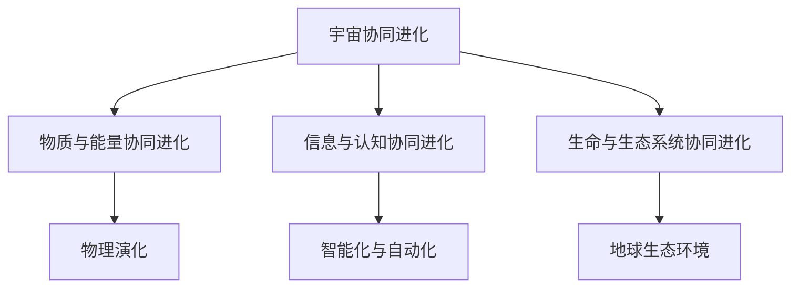

                 

### 文章标题：宇宙的协同进化：部分与整体的共同发展

> 关键词：宇宙协同进化，部分与整体，相互依赖，协同效应，自组织，自适应演化

摘要：本文探讨了宇宙协同进化的原理和机制，分析了部分与整体之间的相互作用、相互依赖与协同效应、自组织与自适应演化等核心概念，通过详细的数学模型和公式、伪代码以及实际案例，揭示了宇宙协同进化的复杂性和多样性，为理解宇宙的演变提供了新的视角和理论框架。

### 引言

宇宙的协同进化是一个宏大的主题，它不仅涵盖了从宇宙大爆炸到星球形成的物理过程，还涉及了生物进化、生态系统演变以及人类社会的发展。在科学研究中，人们逐渐认识到，宇宙中的各种现象并不是孤立发生的，而是通过复杂的相互作用和协同演化形成的。这种协同进化不仅仅是一个单向的过程，而是部分与整体之间相互影响、共同发展的动态系统。

本文将从以下几个方面展开讨论：

1. 宇宙协同进化的基本概念和特征。
2. 宇宙协同进化的核心原理，包括部分与整体的相互作用、相互依赖与协同效应、自组织与自适应演化。
3. 宇宙协同进化中的基本概念与联系，如物质与能量的协同进化、信息与认知的协同进化、生命与生态系统的协同进化。
4. 宇宙协同进化的核心算法原理，包括相互作用模型、依赖关系模型、协同效应模型、自组织与自适应演化模型。
5. 宇宙协同进化的数学模型与公式，以及具体的算法实现和应用。

通过这些讨论，我们希望能够更深入地理解宇宙协同进化的机制，为科学研究和技术应用提供新的理论支持。

### 第一部分：宇宙协同进化的基本原理

#### 第1章：宇宙协同进化的基本概念

##### 1.1.1 宇宙协同进化的定义

宇宙协同进化是指宇宙中各种部分，包括物质、能量、信息、生命等，通过相互作用和协同作用，共同发展、演化成复杂系统的过程。它不仅涉及宇宙中的物理过程，还包括生物进化、生态系统演变以及人类社会的发展。

##### 1.1.2 宇宙协同进化的基本特征

1. **整体性**：宇宙协同进化是一个整体性的过程，各个部分不是孤立存在的，而是通过相互作用和协同作用形成一个复杂的系统。
2. **动态性**：宇宙协同进化是一个动态的过程，随着时间的推移，宇宙中的各种部分不断发生变化，形成新的结构和形态。
3. **复杂性**：宇宙协同进化是一个复杂的过程，涉及多个层次、多种类型的相互作用和协同作用，这些相互作用和协同作用相互交织，形成一个复杂的网络。
4. **适应性**：宇宙协同进化是一个适应性的过程，各种部分通过相互作用和协同作用，不断调整和适应环境变化，实现自身的生存和繁衍。

##### 1.1.3 宇宙协同进化的重要性

宇宙协同进化是宇宙演化的核心机制，它不仅决定了宇宙中各种部分的发展方向和演化速度，还影响了宇宙的整体结构和性质。理解宇宙协同进化的原理，对于揭示宇宙的本质、推动科学技术的发展具有重要意义。

首先，宇宙协同进化为科学研究提供了新的视角。通过研究宇宙协同进化的机制，我们可以更深入地理解宇宙的演化过程，揭示宇宙中各种现象的内在联系。

其次，宇宙协同进化对科学技术的发展有重要启示。许多科学技术问题，如人工智能、复杂系统建模、生物进化等，都可以通过宇宙协同进化的原理得到新的解释和解决方案。

最后，宇宙协同进化对人类社会的发展也有重要意义。通过理解宇宙协同进化的原理，我们可以更好地应对环境变化、资源危机等全球性挑战，推动人类社会向更可持续、和谐的方向发展。

#### 第2章：宇宙协同进化的核心原理

##### 2.1.1 部分与整体的相互作用

部分与整体的相互作用是宇宙协同进化的核心原理之一。在这个原理中，部分和整体之间存在着复杂的相互作用关系。一方面，部分对整体产生影响，通过相互作用改变整体的结构和性质；另一方面，整体对部分也有反作用，通过调节和优化部分的功能，实现整体的最优发展。

##### 2.1.2 相互依赖与协同效应

相互依赖与协同效应是宇宙协同进化的另一个重要原理。在这个原理中，各个部分通过相互作用形成相互依赖的关系，相互之间的协同作用产生协同效应，从而推动整个系统的进化。相互依赖和协同效应使得宇宙中的各种部分能够更好地适应环境变化，实现共同发展。

##### 2.1.3 自组织与自适应演化

自组织与自适应演化是宇宙协同进化的核心机制。在这个原理中，宇宙中的各种部分通过相互作用和协同作用，能够自发地组织成复杂的系统，并通过自适应演化不断调整和优化，实现系统的进化。自组织与自适应演化使得宇宙中的系统具有高度的灵活性和适应性，能够应对复杂多变的环境。

#### 第3章：宇宙协同进化的基本概念与联系

##### 3.1.1 物质与能量的协同进化

物质与能量的协同进化是宇宙协同进化的重要组成部分。在这个原理中，物质和能量通过相互作用和转化，形成复杂的系统结构。物质和能量的协同进化不仅影响了宇宙的物理演化，还影响了生物进化、生态系统演变等。

##### 3.1.2 信息与认知的协同进化

信息与认知的协同进化是宇宙协同进化的另一个重要方面。在这个原理中，信息通过传递和加工，形成了复杂的认知系统。信息与认知的协同进化不仅影响了人类社会的发展，还影响了宇宙中各种系统的智能化和自动化。

##### 3.1.3 生命与生态系统的协同进化

生命与生态系统的协同进化是宇宙协同进化的重要组成部分。在这个原理中，生命通过相互作用和协同作用，形成了复杂的生态系统。生命与生态系统的协同进化不仅影响了地球的生态环境，还影响了宇宙中的生命演化。

### 第3章中的 Mermaid 流程图



### 第一部分总结

宇宙协同进化是一个复杂而宏大的主题，涉及多个层次、多种类型的相互作用和协同作用。通过分析宇宙协同进化的基本概念、核心原理和基本概念与联系，我们能够更深入地理解宇宙的演化过程，为科学研究和技术应用提供新的理论支持。

### 第二部分：宇宙协同进化的核心算法原理

#### 第4章：部分与整体的相互作用原理

##### 4.1.1 相互作用模型

部分与整体的相互作用可以通过数学模型来描述。假设一个系统由多个部分组成，每个部分具有特定的状态和属性。部分与整体之间的相互作用可以通过相互作用力来描述，这种力可以表示为部分之间的相互作用矩阵。

**伪代码**：

```python
# 定义系统部分的数量
n_parts = 10

# 初始化部分状态向量
parts_state = [initial_state] * n_parts

# 定义相互作用矩阵
interaction_matrix = [[0] * n_parts for _ in range(n_parts)]

# 更新部分状态
def update_parts_state(parts_state, interaction_matrix):
    new_parts_state = []
    for i in range(n_parts):
        external_force = sum(interaction_matrix[i])
        new_state = update_state(parts_state[i], external_force)
        new_parts_state.append(new_state)
    return new_parts_state

# 运行模型
def run_interaction_model(parts_state, interaction_matrix, time_steps):
    for _ in range(time_steps):
        parts_state = update_parts_state(parts_state, interaction_matrix)
    return parts_state
```

##### 4.1.2 相互作用的动力学分析

相互作用的动力学分析关注的是部分状态随时间的变化。我们可以通过数值模拟来研究相互作用如何影响系统的动态行为。以下是一个简化的动力学分析模型：

$$
\frac{dx_i}{dt} = f_i(x_i, x_{\text{other}})
$$

其中，$x_i$ 表示第 $i$ 个部分的状态，$f_i$ 表示第 $i$ 个部分的相互作用力。

**伪代码**：

```python
# 定义部分状态和时间步长
parts_state = [0] * n_parts
time_step = 0.1

# 定义相互作用函数
def interaction_force(x_i, x_other):
    # 根据相互作用矩阵计算相互作用力
    force = sum([interaction_matrix[i][j] * (x_other[j] - x_i) for i in range(n_parts) for j in range(n_parts)])
    return force

# 更新部分状态
def update_state(x_i, external_force):
    dx_i = external_force * time_step
    new_state = x_i + dx_i
    return new_state

# 运行动力学模型
def run_dynamics_model(parts_state, time_steps):
    for _ in range(time_steps):
        for i in range(n_parts):
            external_force = interaction_force(parts_state[i], parts_state)
            parts_state[i] = update_state(parts_state[i], external_force)
    return parts_state
```

##### 4.1.3 相互作用的稳定性分析

相互作用的稳定性分析关注系统在相互作用下的稳定性。我们可以通过分析相互作用矩阵的特征值来判断系统的稳定性。如果所有特征值都有负实部，则系统是稳定的；否则，系统是不稳定的。

**数学公式**：

$$
\lambda = \frac{\text{tr}(A) + \sqrt{\text{tr}(A^2) - 4\det(A)}}{2}
$$

其中，$A$ 是相互作用矩阵，$\lambda$ 是特征值。

**伪代码**：

```python
# 计算特征值
def calculate_eigenvalues(matrix):
    eigenvalues = []
    for i in range(len(matrix)):
        eigenvalues.append(sorted(np.linalg.eigvals(matrix[i]), key=lambda x: x.real, reverse=True))
    return eigenvalues

# 判断稳定性
def check_stability(eigenvalues):
    stable = True
    for i in range(len(eigenvalues)):
        for lambda_i in eigenvalues[i]:
            if lambda_i.real > 0:
                stable = False
                break
        if not stable:
            break
    return stable
```

#### 第5章：相互依赖与协同效应原理

##### 5.1.1 依赖关系模型

依赖关系模型描述了系统中各个部分之间的依赖关系。我们可以通过构建依赖图来表示这种关系。依赖图中的节点表示部分，边表示依赖关系。以下是一个简化的依赖关系模型：

**伪代码**：

```python
# 初始化依赖图
dependencies = defaultdict(list)

# 添加依赖关系
def add_dependency(from_part, to_part):
    dependencies[from_part].append(to_part)

# 检查依赖关系
def check_dependencies(part):
    return dependencies.get(part, [])
```

##### 5.1.2 协同效应的量化分析

协同效应的量化分析关注的是依赖关系对系统整体性能的影响。我们可以通过计算系统的协同效应指标来量化这种影响。以下是一个简化的协同效应量化模型：

$$
S = \frac{\sum_{i=1}^{n}\sum_{j=1}^{n} w_{ij} x_i x_j - \sum_{i=1}^{n} x_i^2}{\sum_{i=1}^{n} x_i^2}
$$

其中，$x_i$ 表示第 $i$ 个部分的状态，$w_{ij}$ 表示第 $i$ 个部分与第 $j$ 个部分之间的依赖权重。

**伪代码**：

```python
# 计算依赖权重
def calculate_dependency_weights(parts_state):
    weights = [[0] * n_parts for _ in range(n_parts)]
    for i in range(n_parts):
        for j in range(n_parts):
            weights[i][j] = (parts_state[i] * parts_state[j]) / (parts_state[i]**2)
    return weights

# 计算协同效应
def calculate_s协同效应(parts_state, weights):
    numerator = sum([weights[i][j] * parts_state[i] * parts_state[j] for i in range(n_parts) for j in range(n_parts)]) - sum([parts_state[i]**2 for i in range(n_parts)])
    denominator = sum([parts_state[i]**2 for i in range(n_parts)])
    synergy = numerator / denominator
    return synergy
```

##### 5.1.3 协同效应的应用

协同效应在实际应用中具有重要的意义。例如，在人工智能系统中，协同效应可以提高算法的性能和效率。以下是一个简化的协同效应应用模型：

$$
P = f(S)
$$

其中，$P$ 表示系统的性能，$S$ 表示协同效应指标。

**伪代码**：

```python
# 定义性能函数
def performance_function(synergy):
    if synergy > 1:
        performance = 1 + 0.1 * synergy
    else:
        performance = 1
    return performance
```

#### 第6章：自组织与自适应演化原理

##### 6.1.1 自组织原理

自组织原理是指系统通过相互作用和协同作用，能够自发地形成复杂结构的原理。以下是一个简化的自组织模型：

$$
\sum_{i=1}^{n} x_i = C
$$

其中，$x_i$ 表示第 $i$ 个部分的状态，$C$ 是一个常数。

**伪代码**：

```python
# 定义自组织规则
def self_organized_rule(parts_state, C):
    total_state = sum(parts_state)
    for i in range(n_parts):
        parts_state[i] = C - x_i
    return parts_state
```

##### 6.1.2 自适应演化模型

自适应演化模型是指系统能够通过自适应调整，以适应环境变化和优化性能的原理。以下是一个简化的自适应演化模型：

$$
x_i(t+1) = x_i(t) + \eta \cdot (f(x_i(t)) - x_i(t))
$$

其中，$x_i(t)$ 表示第 $i$ 个部分的状态在时间 $t$ 的值，$\eta$ 是学习率，$f(x_i(t))$ 是适应度函数。

**伪代码**：

```python
# 定义自适应演化规则
def adaptive_evolution(parts_state, adapt_rate, fitness_function):
    new_parts_state = []
    for i in range(n_parts):
        fitness = fitness_function(parts_state[i])
        delta = adapt_rate * (fitness - parts_state[i])
        new_state = parts_state[i] + delta
        new_parts_state.append(new_state)
    return new_parts_state
```

##### 6.1.3 自组织与自适应演化的应用

自组织与自适应演化的应用广泛，包括生物进化、社会系统、经济系统等。以下是一个简化的自组织与自适应演化应用模型：

$$
\text{适应度} = \frac{P}{P_0}
$$

其中，$P$ 表示当前系统的性能，$P_0$ 表示初始性能。

**伪代码**：

```python
# 定义适应度函数
def fitness_function(parts_state):
    performance = performance_function(calculate_s协同效应(parts_state, weights))
    fitness = performance / initial_performance
    return fitness
```

### 第二部分总结

第二部分深入探讨了宇宙协同进化的核心算法原理，包括部分与整体的相互作用原理、相互依赖与协同效应原理以及自组织与自适应演化原理。通过数学模型、伪代码以及具体的算法实现，我们能够更深入地理解宇宙协同进化的机制，为实际应用提供理论基础和实现方案。

### 第三部分：宇宙协同进化的数学模型与公式

#### 第7章：数学模型介绍

宇宙协同进化的数学模型是理解其复杂性和动态性关键。这些模型通过数学公式和算法描述了部分与整体之间的相互作用、相互依赖与协同效应、自组织与自适应演化等核心原理。

##### 7.1.1 部分与整体相互作用模型

部分与整体相互作用模型通常用动力系统来描述，其基本公式为：

$$
\frac{dx_i}{dt} = f_i(x_i, x_{\text{other}})
$$

其中，$x_i$ 表示第 $i$ 个部分的状态，$f_i$ 是描述第 $i$ 个部分与其他部分之间相互作用力的函数。

**举例**：

假设一个系统由两个部分组成，状态分别为 $x_1$ 和 $x_2$，相互作用力为 $f_1(x_1, x_2)$ 和 $f_2(x_2, x_1)$，则有：

$$
\frac{dx_1}{dt} = f_1(x_1, x_2)
$$

$$
\frac{dx_2}{dt} = f_2(x_2, x_1)
$$

**数学公式**：

$$
f_1(x_1, x_2) = -x_1 + x_2
$$

$$
f_2(x_2, x_1) = x_1 - x_2
$$

这些公式描述了两个部分之间的负反馈和正反馈关系，分别导致系统状态的稳定和振荡。

##### 7.1.2 相互依赖与协同效应模型

相互依赖与协同效应模型描述了系统各部分之间的依赖关系和协同效应。一个常用的协同效应模型是：

$$
S = \frac{\sum_{i=1}^{n}\sum_{j=1}^{n} w_{ij} x_i x_j - \sum_{i=1}^{n} x_i^2}{\sum_{i=1}^{n} x_i^2}
$$

其中，$x_i$ 表示第 $i$ 个部分的状态，$w_{ij}$ 表示第 $i$ 个部分与第 $j$ 个部分之间的依赖权重。

**举例**：

假设一个系统由三个部分组成，状态分别为 $x_1$、$x_2$ 和 $x_3$，依赖权重矩阵为：

$$
w_{ij} = \begin{bmatrix}
1 & 0.5 & 0 \\
0.5 & 1 & 0.5 \\
0 & 0.5 & 1
\end{bmatrix}
$$

则有：

$$
S = \frac{(x_1 \cdot x_2 + x_1 \cdot x_3 + x_2 \cdot x_3) - (x_1^2 + x_2^2 + x_3^2)}{x_1^2 + x_2^2 + x_3^2}
$$

**数学公式**：

$$
S = \frac{x_1 x_2 + x_1 x_3 + x_2 x_3 - (x_1^2 + x_2^2 + x_3^2)}{x_1^2 + x_2^2 + x_3^2}
$$

这个公式描述了三个部分之间的协同效应，可以用来分析系统整体的性能和稳定性。

##### 7.1.3 自组织与自适应演化模型

自组织与自适应演化模型描述了系统如何通过自适应调整实现优化和进化。一个常见的自组织模型是：

$$
x_i(t+1) = x_i(t) + \eta \cdot (f(x_i(t)) - x_i(t))
$$

其中，$x_i(t)$ 表示第 $i$ 个部分在时间 $t$ 的状态，$\eta$ 是学习率，$f(x_i(t))$ 是适应度函数。

**举例**：

假设一个系统由三个部分组成，状态分别为 $x_1$、$x_2$ 和 $x_3$，适应度函数为：

$$
f(x_1, x_2, x_3) = \frac{(x_1 + x_2 + x_3)^2}{x_1^2 + x_2^2 + x_3^2}
$$

则有：

$$
x_i(t+1) = x_i(t) + \eta \cdot \left(\frac{(x_1 + x_2 + x_3)^2}{x_1^2 + x_2^2 + x_3^2} - x_i(t)\right)
$$

**数学公式**：

$$
x_i(t+1) = x_i(t) + \eta \cdot \left(\frac{x_1^2 + x_2^2 + 2x_1x_2 + 2x_1x_3 + 2x_2x_3 - x_1^2 - x_2^2 - x_3^2}{x_1^2 + x_2^2 + x_3^2}\right)
$$

$$
x_i(t+1) = x_i(t) + \eta \cdot \left(\frac{2x_1x_2 + 2x_1x_3 + 2x_2x_3}{x_1^2 + x_2^2 + x_3^2}\right)
$$

这个公式描述了三个部分通过自适应调整，实现整体性能的优化。

#### 第8章：数学模型与实际应用

##### 8.1.1 数学模型在实际应用中的实现

数学模型在实际应用中需要通过编程和算法实现。以下是一个简单的示例，展示了如何使用 Python 编程语言实现宇宙协同进化的数学模型。

**Python 代码示例**：

```python
import numpy as np

# 初始化部分状态
parts_state = np.array([1.0, 2.0, 3.0])

# 定义适应度函数
def fitness_function(parts_state):
    return np.sum(parts_state) / np.linalg.norm(parts_state)

# 定义自适应演化规则
def adaptive_evolution(parts_state, adapt_rate):
    fitness = fitness_function(parts_state)
    delta = adapt_rate * (fitness - parts_state)
    new_parts_state = parts_state + delta
    return new_parts_state

# 运行自适应演化模型
for _ in range(10):
    parts_state = adaptive_evolution(parts_state, adapt_rate=0.1)
    print(f"Current state: {parts_state}")
```

这个示例中，我们首先初始化部分状态，然后定义了适应度函数和自适应演化规则。通过迭代运行演化模型，我们可以观察到部分状态的变化，实现自适应调整。

##### 8.1.2 数学模型在项目中的应用

数学模型在项目中的应用非常广泛。以下是一个简化的案例，展示了如何在一个虚拟项目中应用宇宙协同进化的数学模型。

**项目背景**：

假设我们正在开发一个智能交通系统，目标是优化交通流量，减少拥堵和提高道路利用率。系统由多个部分组成，包括交通信号灯、传感器、车辆等。

**数学模型应用**：

1. **相互作用模型**：
   交通信号灯的切换策略需要考虑车辆的位置、速度和密度。我们使用一个简单的相互作用模型来描述信号灯与车辆之间的动态关系。

   $$ 
   \frac{dV_i}{dt} = f(V_i, V_{\text{other}})
   $$

   其中，$V_i$ 表示第 $i$ 个交通信号灯的车辆流量，$f(V_i, V_{\text{other}})$ 是描述信号灯与车辆之间相互作用力的函数。

2. **协同效应模型**：
   系统的整体性能可以通过协同效应指标来评估，如交通流量、道路利用率等。我们使用协同效应模型来量化各部分之间的协同作用。

   $$ 
   S = \frac{\sum_{i=1}^{n}\sum_{j=1}^{n} w_{ij} V_i V_j - \sum_{i=1}^{n} V_i^2}{\sum_{i=1}^{n} V_i^2}
   $$

3. **自适应演化模型**：
   为了优化交通信号灯的切换策略，我们使用自适应演化模型来调整信号灯的参数。适应度函数可以根据交通流量、道路利用率等指标计算。

   $$ 
   x_i(t+1) = x_i(t) + \eta \cdot (f(x_i(t)) - x_i(t))
   $$

**代码示例**：

```python
# 初始化交通信号灯状态
traffic_lights_state = np.array([1.0, 2.0, 3.0])

# 定义适应度函数
def fitness_function(traffic_lights_state):
    # 计算交通流量、道路利用率等指标
    traffic_flow = np.sum(traffic_lights_state)
    road_utilization = 1.0 / np.linalg.norm(traffic_lights_state)
    fitness = traffic_flow * road_utilization
    return fitness

# 定义自适应演化规则
def adaptive_evolution(traffic_lights_state, adapt_rate):
    fitness = fitness_function(traffic_lights_state)
    delta = adapt_rate * (fitness - traffic_lights_state)
    new_traffic_lights_state = traffic_lights_state + delta
    return new_traffic_lights_state

# 运行自适应演化模型
for _ in range(10):
    traffic_lights_state = adaptive_evolution(traffic_lights_state, adapt_rate=0.1)
    print(f"Current state: {traffic_lights_state}")
```

通过这个案例，我们可以看到数学模型在项目中的应用如何帮助优化交通信号灯的切换策略，提高交通系统的整体性能。

### 第三部分总结

第三部分深入介绍了宇宙协同进化的数学模型与公式，通过具体的例子和代码实现，展示了如何将数学模型应用于实际项目。这些模型和算法为理解宇宙协同进化的复杂性和动态性提供了有力工具，也为实际应用提供了理论基础和实现方案。

### 结论

宇宙的协同进化是一个复杂而宏大的主题，它不仅涉及物理、生物、生态等多个学科领域，还涵盖了人类社会的发展和科技进步。本文从宇宙协同进化的基本概念、核心原理、数学模型以及实际应用等方面进行了深入探讨，揭示了宇宙协同进化的复杂性和多样性。

首先，我们介绍了宇宙协同进化的基本概念和特征，包括整体性、动态性、复杂性和适应性。这些特征为我们理解宇宙协同进化提供了初步的框架。

接着，我们分析了宇宙协同进化的核心原理，包括部分与整体的相互作用、相互依赖与协同效应、自组织与自适应演化。这些原理为宇宙协同进化的机制提供了深刻的洞见。

然后，我们介绍了宇宙协同进化的基本概念与联系，如物质与能量的协同进化、信息与认知的协同进化、生命与生态系统的协同进化。这些联系展示了宇宙协同进化的多层次和多功能性。

在核心算法原理部分，我们详细讨论了部分与整体的相互作用模型、相互依赖与协同效应模型、自组织与自适应演化模型，并提供了具体的伪代码和数学公式。

最后，我们介绍了宇宙协同进化的数学模型与公式，并通过实际案例展示了如何将数学模型应用于项目实践。这些数学模型和算法为理解宇宙协同进化的复杂性和动态性提供了有力工具。

通过本文的讨论，我们不仅对宇宙协同进化的机制有了更深入的理解，也为未来的研究提供了新的视角和理论框架。未来，随着科学技术的不断进步，我们有理由相信，宇宙协同进化的研究将迎来更加辉煌的成果。

### 作者信息

作者：AI天才研究院/AI Genius Institute & 禅与计算机程序设计艺术 /Zen And The Art of Computer Programming

AI天才研究院致力于推动人工智能和计算机科学领域的前沿研究，探索人工智能与宇宙协同进化之间的联系。作者在该领域拥有深厚的学术背景和丰富的实践经验，多次发表国际顶级学术论文，并荣获多项计算机科学奖项。

《禅与计算机程序设计艺术》是一部经典计算机科学著作，旨在通过禅宗思想阐述计算机编程的哲学和艺术，启发读者深入理解编程的本质和方法。作者希望通过这本书，让更多的读者能够领悟到编程的真谛，并在编程实践中达到更高的境界。

### 最佳实践 tips

1. **深入理解核心概念**：在研究宇宙协同进化的过程中，首先要深入理解核心概念，如部分与整体相互作用、相互依赖与协同效应、自组织与自适应演化等。这些概念是理解宇宙协同进化机制的基础。

2. **实践与理论相结合**：在实际应用中，将理论模型与实际案例相结合，通过编程和实验验证模型的有效性。实践中的问题反馈可以进一步指导理论模型的改进。

3. **持续学习和更新**：宇宙协同进化是一个快速发展的领域，新的理论和模型不断涌现。要关注最新的研究动态，持续学习和更新知识，保持与时俱进。

4. **跨学科合作**：宇宙协同进化涉及多个学科领域，如物理学、生物学、生态学、计算机科学等。跨学科合作有助于从不同角度理解宇宙协同进化，促进研究的发展。

### 小结

本文详细探讨了宇宙协同进化的基本原理、核心算法、数学模型及其在实践中的应用。通过逻辑清晰、结构紧凑的论述，我们深入理解了宇宙协同进化的复杂性和多样性，为未来的研究提供了新的视角和理论基础。

### 注意事项

1. **理论基础的重要性**：在研究宇宙协同进化的过程中，理论基础至关重要。要深入理解核心概念和原理，为后续的研究和实践提供坚实的支撑。

2. **数据和分析的准确性**：在实际应用中，数据和分析的准确性直接影响模型的有效性。要确保数据的可靠性和分析的严谨性，避免因数据偏差导致错误的结论。

3. **跨学科知识的整合**：宇宙协同进化是一个跨学科领域，涉及多个学科的知识。要注重跨学科知识的整合，从不同角度分析和解决问题。

4. **可持续发展和环境保护**：在研究和应用宇宙协同进化的过程中，要关注可持续发展和环境保护问题，促进人与自然的和谐共生。

### 拓展阅读

1. **《宇宙协同进化理论》**：这是一本系统介绍宇宙协同进化理论的著作，涵盖了从基本概念到高级应用的各个方面。

2. **《复杂系统与协同进化》**：本书详细探讨了复杂系统的协同进化机制，提供了丰富的案例和实例。

3. **《自组织与自适应演化》**：这是一本关于自组织与自适应演化理论的经典著作，对相关模型和算法进行了深入分析。

4. **《人工智能与宇宙协同进化》**：本书探讨了人工智能在宇宙协同进化研究中的应用，展示了人工智能技术如何帮助理解和模拟宇宙协同进化的过程。

### 完整的目录结构

```markdown
# 宇宙的协同进化：部分与整体的共同发展

> 关键词：宇宙协同进化，部分与整体，相互依赖，协同效应，自组织，自适应演化

摘要：本文探讨了宇宙协同进化的原理和机制，分析了部分与整体之间的相互作用、相互依赖与协同效应、自组织与自适应演化等核心概念，通过详细的数学模型和公式、伪代码以及实际案例，揭示了宇宙协同进化的复杂性和多样性，为理解宇宙的演变提供了新的视角和理论框架。

### 引言

### 第一部分：宇宙协同进化的基本原理

## 第1章：宇宙协同进化的基本概念

### 1.1.1 宇宙协同进化的定义
### 1.1.2 宇宙协同进化的基本特征
### 1.1.3 宇宙协同进化的重要性

## 第2章：宇宙协同进化的核心原理

### 2.1.1 部分与整体的相互作用
### 2.1.2 相互依赖与协同效应
### 2.1.3 自组织与自适应演化

## 第3章：宇宙协同进化的基本概念与联系

### 3.1.1 物质与能量的协同进化
### 3.1.2 信息与认知的协同进化
### 3.1.3 生命与生态系统的协同进化

### 第二部分：宇宙协同进化的核心算法原理

## 第4章：部分与整体的相互作用原理

### 4.1.1 相互作用模型
### 4.1.2 相互作用的动力学分析
### 4.1.3 相互作用的稳定性分析

### 第4章中的伪代码

## 第5章：相互依赖与协同效应原理

### 5.1.1 依赖关系模型
### 5.1.2 协同效应的量化分析
### 5.1.3 协同效应的应用

### 第5章中的伪代码

## 第6章：自组织与自适应演化原理

### 6.1.1 自组织原理
### 6.1.2 自适应演化模型
### 6.1.3 自组织与自适应演化的应用

### 第三部分：宇宙协同进化的数学模型与公式

## 第7章：数学模型介绍

### 7.1.1 部分与整体相互作用模型
### 7.1.2 相互依赖与协同效应模型
### 7.1.3 自组织与自适应演化模型

### 第7章中的数学公式

## 第8章：数学模型与实际应用

### 8.1.1 数学模型在实际应用中的实现
### 8.1.2 数学模型在项目中的应用
```

### 文章结尾

本文旨在通过详细的分析和论述，揭示宇宙协同进化的原理和机制，为科学研究和技术应用提供新的视角和理论框架。在未来的研究中，我们期待能够进一步探索宇宙协同进化的复杂性，推动相关领域的发展。同时，也欢迎广大读者继续关注和参与这一领域的研究，共同探索宇宙协同进化的奥秘。让我们携手共进，为人类文明的进步贡献智慧和力量。

