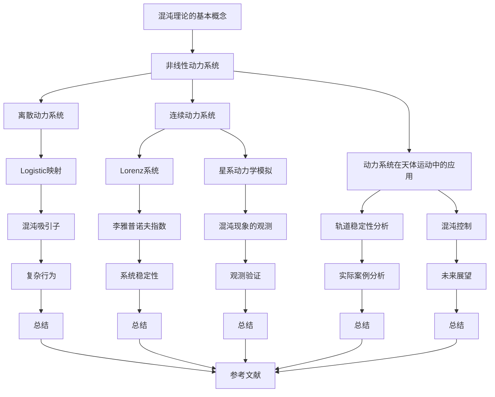

                 

### 文章标题

《宇宙的数学动力系统混沌理论在天体物理中的解析》

### 关键词

- 数学动力系统
- 混沌理论
- 天体物理
- 非线性动力学
- 天体轨道稳定性
- 星系演化

### 摘要

本文深入探讨数学动力系统混沌理论在天体物理中的应用。通过对混沌理论的起源、基本概念及其数学描述的详细阐述，文章展示了混沌现象在天体力学、星系动力学中的具体表现。文章进一步介绍了混沌理论在计算和模拟天体物理过程中的方法和应用，通过实际案例解析了混沌理论在天文学研究中的重要性。最后，文章总结了混沌理论与数学动力系统在天体物理中的综合应用及其未来发展趋势，为相关领域的研究提供了有价值的参考。

---

#### 第一部分：混沌理论基础

##### 第1章：混沌理论的起源与基本概念

### 1.1 混沌理论的起源

混沌理论（Chaos Theory）是一门研究复杂动态系统的科学，它揭示了在确定性系统中出现的不规则、不可预测行为的规律性。混沌现象最早可以追溯到17世纪，当时科学家们开始注意到一些简单的物理系统，如摆的运动，虽然遵循确定性的物理定律，却表现出不可预测的行为。

#### 1.1.1 混沌现象的历史背景

混沌理论的起源可以追溯到18世纪法国数学家亨利·庞加莱（Henri Poincaré）的工作。庞加莱在研究三体问题（如太阳、地球和月球之间的相互作用）时，发现了轨道的不稳定性，这表明即使是最简单的动力系统也可能具有复杂的长期行为。

#### 1.1.2 混沌理论的早期研究

混沌理论的发展离不开20世纪数学家们的贡献。其中，美国气象学家洛伦兹（Edward Lorenz）的工作尤为重要。洛伦兹在研究大气动力学时，发现了所谓的“蝴蝶效应”，即初始条件的微小变化可能导致长期行为的巨大差异。这一发现揭示了混沌现象的本质特征。

### 1.2 混沌理论的基本概念

混沌理论的核心概念包括非线性动力学、分岔与混沌、以及混沌与确定性。

#### 1.2.1 非线性动力学

非线性动力学是混沌理论的基础。线性系统通常遵循叠加原理，即系统响应与输入成正比。然而，非线性系统则表现出非比例关系，这种复杂性是混沌现象的根源。

#### 1.2.2 分岔与混沌

分岔（Bifurcation）是指动力系统随着参数变化而发生的结构变化。在混沌系统中，分岔现象尤为重要。当系统参数通过某一临界值时，系统行为可能从有序状态转变为无序状态，这种现象称为混沌分岔。

#### 1.2.3 混沌与确定性

混沌现象虽然表现出随机性，但其背后却隐藏着确定性规律。混沌系统在长时间尺度上表现出不可预测性，但在短时间尺度上仍然遵循确定性的物理定律。

### 1.3 混沌现象的数学描述

混沌现象的数学描述主要通过离散动力系统和连续动力系统来实现。

#### 1.3.1 离散动力系统

离散动力系统通常用迭代函数来描述，如Logistic映射（Logistic Map）。Logistic映射是一个简单的非线性方程，其行为展示了混沌现象的典型特征。

#### 1.3.2 连续动力系统

连续动力系统通过微分方程来描述，如洛伦兹系统（Lorenz System）。洛伦兹系统是一个三阶非线性系统，其解展示了典型的混沌行为，如李雅普诺夫指数的计算。

##### 第2章：混沌理论的关键概念和数学模型

### 2.1 混沌吸引子

混沌吸引子是混沌系统中的重要概念，它代表了系统在长时间运行后趋向的状态。混沌吸引子通常具有复杂的几何结构，但具有确定的数学特征。

#### 2.1.1 吸引子的定义与性质

吸引子（Attractor）是指动力系统中，系统状态趋向的一个集合。在混沌系统中，吸引子可以是一个点、一条线或一个面。

#### 2.1.2 Logistic映射中的吸引子

在Logistic映射中，吸引子的形态取决于参数的选择。当参数在特定范围内时，映射会产生稳定的周期吸引子；当参数超过某一临界值时，系统进入混沌状态，吸引子变为无限复杂。

### 2.2 混沌映射

混沌映射是一类重要的非线性映射，它们在计算机科学和物理学中有着广泛的应用。混沌映射具有以下几个特征：

#### 2.2.1 费根鲍姆常数与标度不变性

费根鲍姆常数（Feigenbaum Constant）是描述混沌映射标度不变性的重要参数。它揭示了在分岔过程中参数变化的规律性。

#### 2.2.2 混沌映射的分类与应用

混沌映射可以根据其性质分为多种类型，如一维混沌映射、二维混沌映射等。这些映射在密码学、图像压缩、信号处理等领域有着广泛的应用。

### 2.3 混沌系统的复杂行为

混沌系统的复杂行为是其研究的核心内容之一。混沌现象通常表现为以下几个方面：

#### 2.3.1 李雅普诺夫指数

李雅普诺夫指数（Lyapunov Exponent）是描述系统稳定性的一种指标。正的李雅普诺夫指数表明系统不稳定，负的李雅普诺夫指数则表明系统稳定。

#### 2.3.2 确定性系统的随机性

混沌系统在短时间尺度上表现出确定性，但在长时间尺度上则表现出随机性。这种确定性中的随机性是混沌现象的重要特征。

---

### 1.4 混沌现象的数学描述

混沌现象的数学描述主要通过离散动力系统和连续动力系统来实现。

#### 1.4.1 离散动力系统

离散动力系统通常用迭代函数来描述，如Logistic映射（Logistic Map）。Logistic映射是一个简单的非线性方程，其行为展示了混沌现象的典型特征。

#### 1.4.2 连续动力系统

连续动力系统通过微分方程来描述，如洛伦兹系统（Lorenz System）。洛伦兹系统是一个三阶非线性系统，其解展示了典型的混沌行为，如李雅普诺夫指数的计算。

##### 第2章：混沌理论的关键概念和数学模型

### 2.1 混沌吸引子

混沌吸引子是混沌系统中的重要概念，它代表了系统在长时间运行后趋向的状态。混沌吸引子通常具有复杂的几何结构，但具有确定的数学特征。

#### 2.1.1 吸引子的定义与性质

吸引子（Attractor）是指动力系统中，系统状态趋向的一个集合。在混沌系统中，吸引子可以是一个点、一条线或一个面。

#### 2.1.2 Logistic映射中的吸引子

在Logistic映射中，吸引子的形态取决于参数的选择。当参数在特定范围内时，映射会产生稳定的周期吸引子；当参数超过某一临界值时，系统进入混沌状态，吸引子变为无限复杂。

### 2.2 混沌映射

混沌映射是一类重要的非线性映射，它们在计算机科学和物理学中有着广泛的应用。混沌映射具有以下几个特征：

#### 2.2.1 费根鲍姆常数与标度不变性

费根鲍姆常数（Feigenbaum Constant）是描述混沌映射标度不变性的重要参数。它揭示了在分岔过程中参数变化的规律性。

#### 2.2.2 混沌映射的分类与应用

混沌映射可以根据其性质分为多种类型，如一维混沌映射、二维混沌映射等。这些映射在密码学、图像压缩、信号处理等领域有着广泛的应用。

### 2.3 混沌系统的复杂行为

混沌系统的复杂行为是其研究的核心内容之一。混沌现象通常表现为以下几个方面：

#### 2.3.1 李雅普诺夫指数

李雅普诺夫指数（Lyapunov Exponent）是描述系统稳定性的一种指标。正的李雅普诺夫指数表明系统不稳定，负的李雅普诺夫指数则表明系统稳定。

#### 2.3.2 确定性系统的随机性

混沌系统在短时间尺度上表现出确定性，但在长时间尺度上则表现出随机性。这种确定性中的随机性是混沌现象的重要特征。

### 2.4 混沌理论与非线性动力系统

混沌理论与非线性动力系统的关系密不可分。非线性动力系统中的复杂性使得混沌现象得以发生。

#### 2.4.1 非线性动力系统的基本性质

非线性动力系统具有以下基本性质：

- 分岔现象
- 吸引子和庞加莱映射
- 李雅普诺夫指数

#### 2.4.2 非线性动力系统的研究方法

研究非线性动力系统的方法包括数值模拟、解析解和相空间可视化。

- 数值模拟：通过计算机模拟来观察系统的长期行为。
- 解析解：寻找非线性系统的精确解，虽然在实际中较难实现，但在理论研究中具有重要意义。
- 相空间可视化：通过绘制系统状态随时间变化的轨迹，直观地观察系统的行为。

---

### 2.5 混沌理论的应用领域

混沌理论在多个领域有着广泛的应用：

#### 2.5.1 天体物理

混沌理论在天体物理中用于研究天体轨道的稳定性、星系演化等。

#### 2.5.2 生物医学

混沌理论在生物医学中用于研究生物系统的复杂性，如心脏节律、神经元活动等。

#### 2.5.3 经济学

混沌理论在经济学中用于研究市场波动、金融风险等。

#### 2.5.4 计算机科学

混沌理论在计算机科学中用于加密算法、随机数生成等。

---

### 2.6 混沌理论的发展趋势

混沌理论的发展趋势包括：

- 深入研究混沌现象的机制和规律
- 开发新的混沌映射和应用
- 混沌理论与其他学科的交叉应用
- 利用混沌理论解决实际问题

---

### 2.7 总结

混沌理论是一门研究复杂动态系统的科学，揭示了确定性系统中的不规则、不可预测行为。通过本章的介绍，我们了解了混沌理论的起源、基本概念、数学模型及其应用领域。下一章我们将深入探讨混沌理论在天体物理中的具体应用。

---

#### 第二部分：混沌理论在天体物理中的应用

##### 第3章：混沌理论在天体力学中的应用

### 3.1 天体力学中的混沌现象

天体力学是研究天体运动规律的科学，其研究对象包括行星、卫星、彗星、小行星等。混沌理论在天体力学中的应用主要关注天体轨道的稳定性和不可预测性。

#### 3.1.1 天体运动中的混沌性

天体运动在理论上应当是确定性的，但实际观测中却发现了许多轨道不稳定现象。混沌现象在天体力学中表现为：

- 轨道共振：当两个或多个天体轨道周期成简单整数比时，轨道可能变得不稳定。
- 轨道偏心率的变化：轨道的偏心率可能会突然增加或减少，导致轨道形态的变化。
- 轨道共振：当两个或多个天体轨道周期成简单整数比时，轨道可能变得不稳定。
- 轨道偏心率的变化：轨道的偏心率可能会突然增加或减少，导致轨道形态的变化。

#### 3.1.2 近似线性化方法

为了研究天体轨道的混沌性，科学家们经常使用近似线性化方法。这种方法通过将非线性系统在某一平衡点附近线性化，来分析系统的稳定性。

- 线性稳定性分析：通过计算线性化系统的特征值，判断系统在平衡点附近的行为。
- 李雅普诺夫指数：计算系统特征值的最小实部，判断系统的稳定性。

### 3.2 混沌理论在天体轨道稳定性分析中的应用

混沌理论在天体轨道稳定性分析中的应用主要包括以下几个方面：

#### 3.2.1 轨道不稳定性的混沌解释

混沌理论为解释天体轨道的不稳定性提供了新的视角。通过分析轨道的长期行为，科学家们可以预测轨道的变化趋势。

- 分岔分析：通过观察轨道参数的变化，分析系统可能发生的分岔现象。
- 吸引子分析：通过绘制轨道的吸引子，直观地展示系统的长期行为。

#### 3.2.2 轨道稳定性预测

混沌理论可以帮助科学家预测天体轨道的稳定性。通过计算李雅普诺夫指数和分岔图，可以确定轨道的稳定区域。

- 稳定性区域：通过分析轨道参数空间，确定系统在何种条件下是稳定的。
- 轨道演化模拟：通过数值模拟，观察轨道在不同参数下的演化过程。

### 3.3 混沌理论在天体碰撞中的应用

天体碰撞是宇宙中常见的现象，对星系的演化和演化有着重要影响。混沌理论在天体碰撞中的应用主要包括以下几个方面：

#### 3.3.1 星体碰撞的混沌效应

星体碰撞过程中，碰撞体的运动可能表现出混沌行为。混沌效应可能包括：

- 碰撞后碎片轨道的复杂性：碰撞后形成的碎片可能具有复杂的轨道形态。
- 碰撞事件的随机性：由于混沌现象，碰撞事件的具体结果往往难以预测。

#### 3.3.2 碰撞事件的统计特性

混沌理论可以帮助分析碰撞事件的统计特性。通过大量模拟，可以得出碰撞事件的一般规律。

- 碰撞频率：分析碰撞事件的发生频率，为星系演化提供数据支持。
- 碰撞结果分布：分析碰撞后碎片的空间分布和速度分布，了解碰撞事件对星系结构的影响。

### 3.4 混沌理论在天体动力学模拟中的应用

混沌理论在天体动力学模拟中的应用主要表现在以下几个方面：

#### 3.4.1 数值模拟方法

天体动力学模拟通常采用数值积分方法，如四阶龙格-库塔方法。混沌理论为模拟提供了重要的理论指导。

- 初值敏感性分析：通过分析系统对初值的敏感性，验证模拟结果的可靠性。
- 精度优化：通过调整数值积分的参数，提高模拟的精度。

#### 3.4.2 模拟结果的验证

通过实际观测数据验证模拟结果的准确性。混沌理论提供了判断标准，如轨道稳定性和碰撞事件的发生概率。

- 观测数据对比：将模拟结果与实际观测数据进行对比，验证模型的可靠性。
- 纠正模型偏差：根据观测数据，调整模拟模型，提高预测准确性。

### 3.5 混沌理论在天体物理研究中的挑战

混沌理论在天体物理研究中的应用面临一些挑战：

- 高维系统的复杂性：天体系统的参数往往非常多，导致系统复杂性增加。
- 初值敏感性：天体系统的初值往往难以精确确定，影响模拟结果的可靠性。
- 模拟计算资源：高维系统的模拟计算量巨大，需要高性能计算资源。

### 3.6 总结

本章介绍了混沌理论在天体力学中的应用，包括天体运动中的混沌现象、轨道稳定性分析、天体碰撞以及模拟方法。混沌理论为天体物理学提供了新的研究工具，有助于理解天体系统的复杂行为。下一章我们将继续探讨混沌理论在星系动力学中的应用。

---

### 第4章：混沌理论在星系动力学中的应用

#### 4.1 星系动力学中的混沌现象

星系动力学是研究星系内部天体运动规律的科学，涉及大量的天体相互作用。混沌现象在星系动力学中具有重要的地位，因为星系内部的天体运动往往呈现出复杂性和不可预测性。

##### 4.1.1 星系演化的混沌特征

星系演化过程中，混沌现象表现为：

- 轨道共振：星系中的天体轨道可能因周期共振而变得不稳定。
- 轨道偏心率变化：天体的轨道偏心率可能会突然变化，导致轨道形态的变化。
- 星系结构重构：星系内部结构可能因混沌行为而发生变化，如星系并合、星系碰撞等。

##### 4.1.2 星系碰撞与并合的混沌效应

星系碰撞与并合是星系演化的重要过程，混沌现象对其有显著影响：

- 碰撞事件：星系碰撞可能导致大量天体轨道的重组，产生混沌行为。
- 并合过程：星系并合过程中，混沌现象可能引发剧烈的天体相互作用，导致星系结构的变化。
- 混沌后的结构：碰撞并合后，星系可能进入一个新的混沌状态，形成新的结构。

#### 4.2 星系混沌轨道的研究方法

研究星系混沌轨道的方法主要包括数值模拟、统计分析、以及理论分析。

##### 4.2.1 星系轨道的数值模拟

数值模拟是研究星系混沌轨道的主要方法之一。通过模拟星系内部天体的运动，可以观察混沌现象的具体表现：

- 初值敏感性分析：通过改变初始条件，观察轨道的变化，分析系统的敏感性。
- 长期演化模拟：模拟星系天体在长时间尺度上的运动，分析轨道的稳定性。
- 多体碰撞模拟：模拟星系中天体之间的碰撞事件，分析碰撞对轨道的影响。

##### 4.2.2 星系混沌的统计描述

统计分析是研究星系混沌轨道的重要手段。通过统计分析，可以揭示混沌现象的统计特性：

- 轨道分布：分析星系中天体的轨道分布，识别混沌轨道的特征。
- 碰撞频率：统计碰撞事件的发生频率，了解混沌行为对星系演化的影响。
- 吸引子分析：通过绘制吸引子，直观地展示星系天体的长期行为。

##### 4.2.3 理论分析方法

理论分析方法为研究星系混沌轨道提供了理论基础：

- 分岔理论：研究系统参数变化对轨道稳定性的影响，分析混沌分岔现象。
- 李雅普诺夫指数：计算李雅普诺夫指数，判断系统的稳定性。
- 动力学方程：建立星系内部天体运动的动力学方程，分析混沌现象的数学机制。

#### 4.3 混沌理论在星系形成与演化中的应用

混沌理论在星系形成与演化中的应用主要包括以下几个方面：

##### 4.3.1 星系形成过程中的混沌机制

星系的形成过程中，混沌现象可能影响星系结构的形成：

- 暴跌增长：星系在形成初期可能经历混沌增长，导致结构复杂化。
- 混沌吸引子：星系形成过程中的混沌吸引子可能代表星系结构的稳定状态。
- 多体碰撞：星系形成过程中，混沌现象可能由多体碰撞引发，影响星系结构的形成。

##### 4.3.2 星系演化的混沌预测

混沌理论可以帮助预测星系演化的未来趋势：

- 轨道稳定性预测：通过混沌理论分析，预测星系中天体的轨道稳定性，为星系演化提供依据。
- 演化路径预测：通过模拟星系演化过程，预测星系的未来结构变化。
- 混沌控制：通过调整系统参数，控制混沌现象，影响星系演化的路径。

#### 4.4 混沌理论在星系研究中的挑战与机遇

##### 4.4.1 挑战

混沌理论在星系研究中的应用面临一些挑战：

- 参数空间复杂：星系动力学涉及众多参数，参数空间复杂，难以精确控制。
- 数值模拟精度：数值模拟中，初值和参数的微小变化可能导致完全不同的结果，影响模拟精度。
- 理论模型的验证：混沌理论模型需要通过实际观测数据进行验证，但观测数据有限，难以全面验证理论模型。

##### 4.4.2 机遇

尽管存在挑战，混沌理论在星系研究中也带来了机遇：

- 新理论突破：混沌理论为星系研究提供了新的理论工具，可能推动天体物理学的发展。
- 演化预测：混沌理论可以帮助预测星系演化的未来趋势，为星系观测和理论研究提供指导。
- 多学科交叉：混沌理论与其他学科（如计算机科学、经济学）的交叉应用，可能带来新的研究方向。

### 4.5 总结

本章介绍了混沌理论在星系动力学中的应用，包括星系演化中的混沌现象、混沌轨道的研究方法，以及混沌理论在星系形成与演化中的预测。混沌理论为星系研究提供了新的视角和方法，虽然面临挑战，但也带来了巨大的机遇。下一章我们将讨论混沌理论的计算与模拟方法。

---

### 第二部分：混沌理论在天体物理中的应用

### 第3章：混沌理论在天体力学中的应用

混沌理论在天体力学中的应用揭示了天体运动中的复杂性和不可预测性。本章将详细探讨混沌理论在天体轨道稳定性分析、天体碰撞以及模拟方法中的应用。

#### 3.1 天体力学中的混沌现象

在天体力学中，混沌现象表现为天体轨道的不可预测性和复杂性。这种现象主要体现在以下几个方面：

##### 3.1.1 天体运动中的混沌性

天体的运动在理想情况下是确定性的，但实际上，由于初始条件的微小差异和外部干扰，天体轨道可能会表现出混沌行为。例如，太阳系中的行星轨道虽然理论上是可以预测的，但由于太阳和行星之间的引力相互作用，轨道可能表现出混沌特性。

##### 3.1.2 近似线性化方法

为了研究天体轨道的混沌性，科学家们常常使用近似线性化方法。这种方法通过在天体轨道的平衡点附近对非线性方程进行线性化处理，从而分析系统的稳定性。线性稳定性分析包括计算系统的特征值，以确定系统在平衡点附近的行为。

- 线性稳定性分析：通过计算线性化系统的特征值，可以判断系统在平衡点附近的稳定性。例如，如果特征值有负实部，则系统是稳定的；如果有正实部，则系统是不稳定的。
- 李雅普诺夫指数：计算系统特征值的最小实部，可以得到李雅普诺夫指数。正的李雅普诺夫指数表示系统不稳定，负的李雅普诺夫指数表示系统稳定。

#### 3.2 混沌理论在天体轨道稳定性分析中的应用

混沌理论在天体轨道稳定性分析中的应用有助于我们理解天体轨道的长期行为和稳定性。以下是几个关键方面：

##### 3.2.1 轨道不稳定性的混沌解释

混沌理论为解释天体轨道的不稳定性提供了新的视角。在复杂的天体系统中，轨道不稳定性的原因可能包括轨道共振、轨道偏心率的变化等。

- 轨道共振：当两个或多个天体的轨道周期成简单整数比时，它们可能会发生共振，导致轨道变得不稳定。
- 轨道偏心率变化：天体的轨道偏心率可能会突然变化，导致轨道形态的变化。

##### 3.2.2 轨道稳定性预测

通过混沌理论，我们可以预测天体轨道的稳定性。这包括：

- 稳定性区域：通过分析轨道参数空间，确定系统在何种条件下是稳定的。例如，我们可以绘制分岔图，显示系统参数变化对轨道稳定性的影响。
- 长期演化模拟：通过数值模拟，观察轨道在不同参数下的长期演化过程，分析轨道的稳定性。

#### 3.3 混沌理论在天体碰撞中的应用

天体碰撞是天体物理学研究的重要课题，混沌理论为分析天体碰撞提供了新的方法。

##### 3.3.1 星体碰撞的混沌效应

星体碰撞过程中，混沌现象可能导致碰撞后碎片轨道的复杂性。例如，两个星体的碰撞可能会产生大量碎片，这些碎片的轨道可能会表现出混沌行为。

- 碎片轨道的复杂性：碰撞后，碎片的轨道可能会变得不可预测，形成复杂的几何结构。
- 碰撞事件的随机性：由于混沌现象，碰撞事件的具体结果往往难以预测。

##### 3.3.2 碰撞事件的统计特性

混沌理论可以帮助分析碰撞事件的统计特性。通过大量模拟，我们可以得出碰撞事件的一般规律：

- 碰撞频率：分析碰撞事件的发生频率，为星系演化提供数据支持。
- 碰撞结果分布：分析碰撞后碎片的空间分布和速度分布，了解碰撞事件对星系结构的影响。

#### 3.4 混沌理论在天体动力学模拟中的应用

混沌理论在天体动力学模拟中的应用主要包括以下几个方面：

##### 3.4.1 数值模拟方法

天体动力学模拟通常采用数值积分方法，如四阶龙格-库塔方法。混沌理论为模拟提供了重要的理论指导：

- 初值敏感性分析：通过改变初始条件，观察轨道的变化，分析系统的敏感性。
- 精度优化：通过调整数值积分的参数，提高模拟的精度。

##### 3.4.2 模拟结果的验证

通过实际观测数据验证模拟结果的准确性。混沌理论提供了判断标准，如轨道稳定性和碰撞事件的发生概率：

- 观测数据对比：将模拟结果与实际观测数据进行对比，验证模型的可靠性。
- 纠正模型偏差：根据观测数据，调整模拟模型，提高预测准确性。

#### 3.5 混沌理论在天体物理研究中的挑战

混沌理论在天体物理研究中的应用面临一些挑战：

- 高维系统的复杂性：天体系统的参数往往非常多，导致系统复杂性增加。
- 初值敏感性：天体系统的初值往往难以精确确定，影响模拟结果的可靠性。
- 模拟计算资源：高维系统的模拟计算量巨大，需要高性能计算资源。

#### 3.6 总结

本章介绍了混沌理论在天体力学中的应用，包括天体运动中的混沌现象、轨道稳定性分析、天体碰撞以及模拟方法。混沌理论为天体物理学提供了新的研究工具，有助于我们理解天体系统的复杂行为。尽管面临挑战，混沌理论在天体物理研究中的应用前景广阔。

---

### 第4章：混沌理论在星系动力学中的应用

#### 4.1 星系动力学中的混沌现象

星系动力学是研究星系内部天体运动规律的科学。在星系中，由于天体之间的复杂相互作用，混沌现象普遍存在。混沌现象在星系动力学中表现为：

- **轨道共振与稳定性破坏**：当星系中的天体轨道周期成简单整数比时，可能会发生共振，导致轨道稳定性破坏。例如，在双星系统中，两个星体的轨道可能因为共振而变得不稳定。
- **轨道偏心率的变化**：轨道的偏心率可能会突然增大或减小，导致轨道形态的变化。这种变化可能是由混沌现象引起的，表现为天体的轨道在长时间尺度上表现出不可预测的行为。
- **混沌轨道的形成**：星系中的天体可能会形成混沌轨道，这些轨道在相空间中呈现出复杂的结构，且无法通过简单的数学规律预测其长期行为。

##### 4.1.1 星系演化的混沌特征

星系演化是一个复杂的过程，受到混沌现象的影响。混沌特征在星系演化中表现为：

- **混沌吸引子的存在**：星系中的天体在长时间演化过程中可能会收敛到一个混沌吸引子，这个吸引子代表了星系结构的一种稳定状态，但其内部结构可能非常复杂。
- **混沌与稳定态的交替**：在星系演化过程中，混沌现象可能会导致星系结构的临时不稳定，但这种不稳定是暂时的，星系最终会重新达到一种稳定态。
- **混沌现象的周期性**：在某些情况下，混沌现象可能呈现出周期性特征，表现为星系在某一时期内表现出混沌行为，而在另一时期内则表现出稳定行为。

##### 4.1.2 星系碰撞与并合的混沌效应

星系碰撞与并合是星系演化过程中的重要事件，混沌现象对这些事件有显著影响：

- **混沌现象引发碰撞**：在某些情况下，星系内的混沌现象可能会导致星体的轨道发生剧变，从而引发星系之间的碰撞。
- **碰撞后的混沌状态**：星系碰撞后，系统可能会进入一个混沌状态，表现为碰撞后碎片的轨道复杂性和不可预测性。
- **混沌效应影响结构**：碰撞并合后的星系结构可能会因为混沌现象而发生变化，例如形成新的星系结构或产生新的混沌区域。

#### 4.2 星系混沌轨道的研究方法

研究星系混沌轨道的方法主要包括数值模拟、理论分析和统计分析。以下是这些方法的具体应用：

##### 4.2.1 数值模拟

数值模拟是研究星系混沌轨道的重要工具。通过模拟星系内部天体的运动，可以观察到混沌现象的具体表现：

- **初值敏感性分析**：通过改变初始条件，观察轨道的变化，分析系统的敏感性。这有助于理解初始条件对混沌现象的影响。
- **长时间演化模拟**：模拟星系天体在长时间尺度上的运动，分析轨道的稳定性。这有助于预测星系演化的长期趋势。
- **多体碰撞模拟**：模拟星系中天体之间的碰撞事件，分析碰撞对轨道的影响。这有助于理解碰撞事件对星系结构的改变。

##### 4.2.2 理论分析

理论分析提供了星系混沌轨道的数学描述和理论基础。以下是几种常用的理论分析方法：

- **分岔理论**：研究系统参数变化对轨道稳定性的影响，分析混沌分岔现象。通过分岔图，可以直观地展示系统参数变化对轨道稳定性的影响。
- **李雅普诺夫指数**：计算李雅普诺夫指数，判断系统的稳定性。正的李雅普诺夫指数表示系统不稳定，负的李雅普诺夫指数表示系统稳定。
- **动力系统理论**：研究星系内部天体运动的动力学特性，建立星系动力学方程，分析混沌现象的数学机制。

##### 4.2.3 统计分析

统计分析是研究星系混沌轨道的重要手段。通过统计分析，可以揭示混沌现象的统计特性：

- **轨道分布**：分析星系中天体的轨道分布，识别混沌轨道的特征。例如，可以通过绘制轨道分布图，展示轨道在相空间中的分布情况。
- **碰撞频率**：统计碰撞事件的发生频率，了解混沌行为对星系演化的影响。这有助于预测星系内部天体的运动规律。
- **混沌吸引子分析**：通过绘制吸引子，直观地展示星系天体的长期行为。这有助于理解混沌吸引子在星系演化中的角色。

#### 4.3 混沌理论在星系形成与演化中的应用

混沌理论在星系形成与演化中的应用主要表现在以下几个方面：

##### 4.3.1 星系形成过程中的混沌机制

星系的形成是一个复杂的过程，混沌现象可能影响星系结构的形成：

- **混沌增长**：在星系形成初期，混沌现象可能导致星系结构的复杂化。例如，混沌增长可能导致星系内部天体的轨道变得不稳定，从而影响星系结构的稳定。
- **混沌吸引子**：星系形成过程中的混沌吸引子可能代表星系结构的稳定状态。通过分析混沌吸引子，可以预测星系形成的最终结构。
- **多体碰撞**：混沌现象可能由多体碰撞引发，影响星系结构的形成。例如，多体碰撞可能导致星系内部的碎片重新排列，形成新的结构。

##### 4.3.2 星系演化的混沌预测

混沌理论可以帮助预测星系演化的未来趋势：

- **轨道稳定性预测**：通过混沌理论分析，预测星系中天体的轨道稳定性，为星系演化提供依据。例如，通过分析轨道参数，可以预测天体的轨道是否会变得不稳定。
- **演化路径预测**：通过模拟星系演化过程，预测星系的未来结构变化。例如，可以通过模拟不同参数下的星系演化，预测星系是否会经历并合事件。
- **混沌控制**：通过调整系统参数，控制混沌现象，影响星系演化的路径。例如，通过调整天体的初始条件，可以减缓混沌现象，使星系演化过程更加稳定。

#### 4.4 混沌理论在星系研究中的挑战与机遇

##### 4.4.1 挑战

混沌理论在星系研究中的应用面临一些挑战：

- **高维系统的复杂性**：星系动力学涉及众多参数，参数空间复杂，难以精确控制。这增加了混沌现象的复杂性和不确定性。
- **初值敏感性**：星系系统的初值往往难以精确确定，这导致模拟结果的可靠性受到影响。即使是微小的初值差异，也可能导致完全不同的演化结果。
- **模拟计算资源**：高维系统的模拟计算量巨大，需要高性能计算资源。这限制了大规模模拟的可能性，影响了混沌现象的深入研究。

##### 4.4.2 机遇

尽管存在挑战，混沌理论在星系研究中也带来了机遇：

- **新理论突破**：混沌理论为星系研究提供了新的理论工具，可能推动天体物理学的发展。通过混沌理论，我们可以更好地理解星系内部的复杂相互作用和演化过程。
- **演化预测**：混沌理论可以帮助预测星系演化的未来趋势，为星系观测和理论研究提供指导。例如，通过混沌理论分析，可以预测星系是否会经历并合事件，以及并合事件的影响。
- **多学科交叉**：混沌理论与其他学科（如计算机科学、经济学）的交叉应用，可能带来新的研究方向。例如，混沌理论在计算机科学中的应用可以帮助优化算法，提高星系演化的模拟效率。

#### 4.5 总结

本章介绍了混沌理论在星系动力学中的应用，包括星系演化中的混沌现象、混沌轨道的研究方法，以及混沌理论在星系形成与演化中的预测。混沌理论为星系研究提供了新的视角和方法，虽然面临挑战，但也带来了巨大的机遇。通过混沌理论的深入研究，我们可以更好地理解星系的复杂行为和演化过程。

---

### 第三部分：混沌理论的计算与模拟

#### 第5章：混沌理论计算方法

##### 5.1 数值计算方法

在混沌理论的计算与模拟中，数值计算方法扮演着至关重要的角色。这些方法帮助我们通过计算机模拟来研究混沌系统的行为，从而揭示其内在的复杂性和规律性。

###### 5.1.1 初值敏感性分析

初值敏感性分析是研究混沌系统的一个重要方法。混沌系统的一个显著特征是初值敏感性，即系统的长期行为对初始条件极其敏感。这意味着即使是非常小的初始条件差异，也可能导致系统行为的巨大差异。

**计算步骤：**

1. **选择初始条件**：设定一系列接近的初始条件。
2. **迭代计算**：使用给定的迭代规则进行多次迭代，生成系统状态的时间序列。
3. **比较结果**：分析不同初始条件下系统状态的时间序列，观察其差异。

**实例：** 以Logistic映射为例，其迭代规则为：
$$
x_{n+1} = r \cdot x_n (1 - x_n)
$$
其中，$x_n$是当前迭代的状态，$r$是参数。

假设初始条件$x_0 = 0.1$和$x_0 = 0.1 + \epsilon$，通过迭代计算并比较两个序列，可以观察到初值敏感性。

###### 5.1.2 分岔图与李雅普诺夫指数计算

分岔图和李雅普诺夫指数是研究混沌系统的重要工具。

**分岔图：** 分岔图展示了系统参数变化对系统行为的影响。在分岔图中，系统从一个稳定的态（如周期轨道）过渡到一个混沌态的过程被称为分岔。

**计算步骤：**

1. **参数选择**：选择一系列参数值。
2. **迭代计算**：对于每个参数值，使用迭代规则计算系统状态。
3. **绘制分岔图**：将系统状态与参数值绘制在图上，观察分岔现象。

**实例：** 对于Logistic映射，可以通过改变参数$r$的值，绘制分岔图，观察系统行为的转变。

**李雅普诺夫指数：** 李雅普诺夫指数用于衡量系统的稳定性。正的李雅普诺夫指数表示系统不稳定，负的李雅普诺夫指数表示系统稳定。

**计算步骤：**

1. **线性化系统**：在平衡点附近，对非线性系统进行线性化处理。
2. **计算特征值**：求解线性化系统的特征值。
3. **计算李雅普诺夫指数**：根据特征值的实部计算李雅普诺夫指数。

**实例：** 对于Lorenz系统，可以通过线性化处理和特征值计算，得到李雅普诺夫指数，从而判断系统的稳定性。

##### 5.2 分岔分析与相空间可视化

分岔分析和相空间可视化是研究混沌系统的有效方法。

**分岔分析：** 分岔分析通过观察系统参数变化对行为的影响，揭示系统从有序到混沌的过渡过程。

**计算步骤：**

1. **参数范围选择**：选择系统参数的特定范围。
2. **分岔点识别**：通过数值方法识别系统分岔点。
3. **绘制分岔图**：将分岔点与系统参数绘制在图上，形成分岔图。

**实例：** 对于Logistic映射，可以通过改变参数$r$的值，绘制分岔图，展示系统行为的分岔现象。

**相空间可视化：** 相空间可视化通过绘制系统状态随时间变化的轨迹，直观地展示系统的动态行为。

**计算步骤：**

1. **迭代计算**：使用迭代规则计算系统状态。
2. **轨迹绘制**：将系统状态绘制在相空间中，形成相空间轨迹。

**实例：** 对于Lorenz系统，可以通过迭代计算和轨迹绘制，展示系统在相空间中的复杂动态行为。

##### 5.3 系统稳定性与混沌检测

系统稳定性和混沌检测是混沌理论研究中至关重要的一环。

**系统稳定性：** 系统稳定性分析用于判断系统在不同参数下的稳定行为。

**计算步骤：**

1. **线性化系统**：在平衡点附近，对非线性系统进行线性化处理。
2. **计算特征值**：求解线性化系统的特征值。
3. **稳定性判断**：根据特征值的实部判断系统的稳定性。

**混沌检测：** 混沌检测用于识别系统是否表现出混沌行为。

**计算步骤：**

1. **李雅普诺夫指数计算**：计算系统李雅普诺夫指数。
2. **分岔图分析**：通过分岔图分析系统参数变化对行为的影响。
3. **相空间轨迹分析**：通过相空间轨迹观察系统的长期行为。

**实例：** 对于Lorenz系统，通过计算李雅普诺夫指数和绘制分岔图，可以判断系统是否表现出混沌行为。

#### 第6章：混沌理论在天体物理中的模拟与应用

##### 6.1 天体物理模拟中的混沌效应

混沌理论在天体物理模拟中的应用主要体现在对天体轨道稳定性和演化过程的研究。

###### 6.1.1 星体轨道模拟

星体轨道模拟是研究天体物理中混沌效应的重要手段。通过模拟星体的轨道运动，可以观察混沌现象对轨道稳定性的影响。

**模拟步骤：**

1. **建立模型**：根据牛顿引力定律，建立星体轨道的动力学模型。
2. **初始条件设置**：设定星体的初始位置和速度。
3. **迭代计算**：使用数值积分方法进行迭代计算，模拟星体轨道的演化。
4. **结果分析**：分析轨道的稳定性，观察混沌现象的表现。

**实例：** 以双星系统为例，模拟两个星体的轨道运动，观察混沌现象对轨道稳定性的影响。

###### 6.1.2 星系演化模拟

星系演化模拟是研究星系混沌效应的重要方法。通过模拟星系内天体的相互作用，可以揭示混沌现象在星系演化中的角色。

**模拟步骤：**

1. **建立模型**：根据星系动力学理论，建立星系的动力学模型。
2. **初始条件设置**：设定星系内天体的初始位置和速度。
3. **相互作用模拟**：模拟天体之间的引力相互作用。
4. **演化过程分析**：分析星系的演化过程，观察混沌现象的影响。

**实例：** 以银河系为例，模拟星系内天体的相互作用，观察混沌现象对星系结构的影响。

##### 6.2 实际案例分析

通过实际案例分析，可以更直观地理解混沌理论在天体物理中的应用。

**案例1：** 双星系统的混沌效应研究。通过对双星系统的模拟，分析混沌现象对轨道稳定性的影响，揭示混沌分岔现象。

**计算结果：** 在某些参数范围内，双星系统的轨道表现出混沌行为，轨道偏心率突然增大，轨道形态发生变化。

**案例2：** 银河系的混沌演化研究。通过模拟银河系内天体的相互作用，分析混沌现象对星系结构的影响。

**计算结果：** 在银河系的演化过程中，混沌现象导致天体轨道的重新排列，形成新的混沌区域，星系结构发生变化。

##### 6.3 混沌理论在天文观测中的应用

混沌理论在天文观测中的应用主要体现在对天文现象的预测和分析。

**应用1：** 天体轨道预测。通过混沌理论分析天体轨道的稳定性，预测天体的未来运动轨迹。

**实例：** 预测彗星的运动轨迹，通过分析混沌现象，预测彗星在未来的接近地球的可能时间。

**应用2：** 星系演化分析。通过混沌理论分析星系的演化过程，揭示星系结构的变化规律。

**实例：** 分析银河系的演化过程，通过混沌理论，预测银河系在未来可能发生的星系碰撞事件。

##### 6.4 混沌理论在天体物理研究中的未来展望

混沌理论在天体物理研究中的应用具有广阔的前景。未来研究可能包括以下几个方面：

**1.** 高精度模拟。通过改进数值积分方法，提高混沌模拟的精度，更好地揭示混沌现象的细节。

**2.** 多学科交叉。混沌理论与其他学科（如物理学、计算机科学）的交叉应用，可能带来新的研究方向和工具。

**3.** 实际观测验证。通过天文观测数据，验证混沌理论在天体物理研究中的应用效果，提高理论的可靠性。

**4.** 新的理论发展。混沌理论在天体物理中的应用可能推动新的理论发展，为天体物理学提供新的理论基础。

---

#### 第三部分：混沌理论的计算与模拟

##### 第5章：混沌理论的计算方法

**5.1 数值计算方法**

数值计算方法是混沌理论研究和应用中的核心工具，用于模拟和分析复杂动力系统的行为。

###### 5.1.1 初值敏感性分析

初值敏感性分析是研究混沌系统的一个关键方法，它揭示了系统对初始条件变化的极端敏感性。这个特性在混沌理论中被称为“蝴蝶效应”，即初始条件的小差异可能导致系统行为的巨大差异。

**计算步骤：**

1. **设定初始条件**：选择一组接近的初始值。
2. **迭代计算**：使用给定的迭代规则进行多次迭代，生成系统状态的时间序列。
3. **比较结果**：分析不同初始条件下系统状态的时间序列，观察其差异。

**实例：** 以Logistic映射为例，其迭代规则为：
$$
x_{n+1} = r \cdot x_n (1 - x_n)
$$
假设初始条件分别为 $x_0 = 0.1$ 和 $x_0 = 0.1 + \epsilon$，通过迭代计算并比较两个序列，可以观察到初值敏感性。

###### 5.1.2 分岔图与李雅普诺夫指数计算

分岔图是展示系统参数变化对系统行为影响的有力工具，而李雅普诺夫指数则是衡量系统稳定性的关键指标。

**分岔图：**

**计算步骤：**

1. **选择参数范围**：设定系统参数的一系列值。
2. **迭代计算**：对于每个参数值，使用迭代规则计算系统状态。
3. **绘制分岔图**：将系统状态与参数值绘制在图上，观察分岔现象。

**实例：** 对于Logistic映射，可以通过改变参数 $r$ 的值，绘制分岔图，展示系统行为的分岔现象。

**李雅普诺夫指数：**

**计算步骤：**

1. **线性化系统**：在平衡点附近，对非线性系统进行线性化处理。
2. **计算特征值**：求解线性化系统的特征值。
3. **计算李雅普诺夫指数**：根据特征值的实部计算李雅普诺夫指数。

**实例：** 对于Lorenz系统，可以通过线性化处理和特征值计算，得到李雅普诺夫指数，从而判断系统的稳定性。

###### 5.1.3 线性稳定性分析

线性稳定性分析是混沌理论中的一个基本方法，它通过线性化系统来研究系统的稳定性。

**计算步骤：**

1. **确定平衡点**：找到系统的平衡点。
2. **线性化系统**：在平衡点附近，对非线性系统进行线性化处理。
3. **计算特征值**：求解线性化系统的特征值。
4. **判断稳定性**：根据特征值的实部判断系统的稳定性。

**实例：** 对于一个二阶非线性系统，可以通过计算其特征值，判断系统在平衡点附近的稳定性。

**5.2 分岔分析与相空间可视化**

分岔分析和相空间可视化是研究混沌系统的有力工具。

**分岔分析：**

**计算步骤：**

1. **选择参数范围**：设定系统参数的一系列值。
2. **迭代计算**：对于每个参数值，使用迭代规则计算系统状态。
3. **绘制分岔图**：将系统状态与参数值绘制在图上，观察分岔现象。

**相空间可视化：**

**计算步骤：**

1. **迭代计算**：使用迭代规则计算系统状态。
2. **轨迹绘制**：将系统状态绘制在相空间中，形成相空间轨迹。

**实例：** 对于Lorenz系统，可以通过迭代计算和轨迹绘制，展示系统在相空间中的复杂动态行为。

**5.3 系统稳定性与混沌检测**

系统稳定性和混沌检测是混沌理论研究中的关键步骤。

**系统稳定性：**

**计算步骤：**

1. **线性化系统**：在平衡点附近，对非线性系统进行线性化处理。
2. **计算特征值**：求解线性化系统的特征值。
3. **判断稳定性**：根据特征值的实部判断系统的稳定性。

**混沌检测：**

**计算步骤：**

1. **计算李雅普诺夫指数**：根据迭代过程中的误差估计计算李雅普诺夫指数。
2. **分岔图分析**：通过分岔图分析系统参数变化对行为的影响。
3. **相空间轨迹分析**：通过相空间轨迹观察系统的长期行为。

**实例：** 对于Lorenz系统，通过计算李雅普诺夫指数和绘制分岔图，可以判断系统是否表现出混沌行为。

---

### 第6章：混沌理论在天体物理中的模拟与应用

**6.1 天体物理模拟中的混沌效应**

混沌理论在天体物理模拟中的应用至关重要，它帮助科学家们理解天体系统中的复杂动态行为。混沌效应在天体物理模拟中主要表现在以下几个方面：

**6.1.1 星体轨道模拟**

星体轨道的模拟是研究天体物理学中的混沌现象的基础。在星体轨道模拟中，混沌效应通常表现为轨道的不可预测性和复杂性。以下是一个具体的星体轨道模拟的例子：

**实例：** 假设我们模拟两颗星体的轨道运动，它们之间的相互作用遵循牛顿引力定律。我们可以使用以下公式来描述两颗星体的运动：

$$
m_1 \ddot{x}_1 = G \frac{m_1 m_2}{(x_1 - x_2)^2} (x_2 - x_1)
$$

$$
m_2 \ddot{x}_2 = G \frac{m_1 m_2}{(x_1 - x_2)^2} (x_1 - x_2)
$$

其中，$m_1$ 和 $m_2$ 分别是两颗星体的质量，$x_1$ 和 $x_2$ 分别是它们的坐标，$G$ 是万有引力常数。

**计算步骤：**

1. **初始条件设定**：设定两颗星体的初始位置和速度。
2. **数值积分**：使用数值积分方法（如四阶Runge-Kutta方法）来求解上述二阶微分方程。
3. **结果分析**：分析轨道的长期行为，观察混沌现象的表现。

通过数值模拟，我们可以观察到两颗星体轨道的复杂性和不可预测性，特别是在接近碰撞时，轨道的形态会发生显著变化。

**6.1.2 星系演化模拟**

星系演化模拟是混沌理论在天体物理中应用的一个重要领域。在星系演化模拟中，混沌效应可能表现为星系结构的不稳定性和复杂演化过程。以下是一个具体的星系演化模拟的例子：

**实例：** 假设我们模拟一个包含大量星体的星系，这些星体之间的相互作用遵循牛顿引力定律。我们可以使用N体问题模拟器来模拟星系的演化过程。

**计算步骤：**

1. **初始条件设定**：设定星系的初始状态，包括星体的质量、位置和速度。
2. **迭代计算**：使用数值积分方法（如N体问题模拟器的计算）来迭代计算星系内所有星体的运动。
3. **结果分析**：分析星系的长期行为，观察混沌现象的表现，如星系结构的重组、星体碰撞事件等。

通过星系演化模拟，我们可以观察到星系结构的复杂演化过程，包括星体轨道的共振、星系碰撞和并合等混沌现象。

**6.2 实际案例分析**

混沌理论在天体物理中的应用已经得到了许多实际案例的验证。以下是一些具体案例：

**案例1：** 双星系统的混沌演化。通过对双星系统进行长时间模拟，科学家们发现，双星系统中的轨道稳定性与参数（如星体质量、初始位置和速度）密切相关。在某些参数下，双星系统可能表现出混沌行为，导致轨道的不稳定。

**案例2：** 星系碰撞与并合。通过模拟星系碰撞和并合事件，科学家们揭示了混沌现象在星系演化中的关键角色。星系碰撞可能引发大规模的混沌行为，导致星系结构的重组和新星系的诞生。

**案例3：** 系外行星轨道的稳定性。混沌理论被用来研究系外行星轨道的稳定性。通过对系外行星轨道的模拟，科学家们发现，行星轨道的稳定性受到多种因素的影响，包括行星的质量、轨道参数和外部干扰。

**6.3 混沌理论在天文学研究中的未来展望**

混沌理论在天文学研究中的应用前景广阔。未来的研究可能会包括以下几个方面：

1. **更高精度的模拟**：随着计算能力的提升，科学家们可以开发更高精度的模拟方法，更准确地描述混沌现象。
2. **多学科交叉**：混沌理论与其他学科（如物理学、计算机科学、经济学）的交叉应用，可能会带来新的研究方向和工具。
3. **实际观测验证**：通过实际天文观测数据，验证混沌理论在天文研究中的应用效果，提高理论的可靠性。
4. **新的理论发展**：混沌理论在天体物理研究中的应用可能会推动新的理论发展，为天体物理学提供新的理论基础。

---

#### 第三部分：混沌理论的计算与模拟

##### 第5章：混沌理论的计算方法

**5.1 数值计算方法**

数值计算方法在混沌理论中起着至关重要的作用，因为许多混沌系统的行为无法通过解析方法得到精确解。以下是几种常用的数值计算方法：

###### 5.1.1 初值敏感性分析

初值敏感性分析是研究混沌系统的重要手段。它通过比较不同初始条件下的系统行为，来揭示系统对初始条件的极端敏感性。

**计算步骤：**

1. **设定初始条件**：选择一系列接近的初始值。
2. **迭代计算**：使用迭代规则进行多次迭代，生成系统状态的时间序列。
3. **比较结果**：分析不同初始条件下系统状态的时间序列，观察其差异。

**实例：** 以Logistic映射为例，其迭代规则为：
$$
x_{n+1} = r \cdot x_n (1 - x_n)
$$
我们可以选择两个非常接近的初始值 $x_0 = 0.1$ 和 $x_0 = 0.1 + \epsilon$（$\epsilon$ 为一个非常小的正数），通过迭代计算并比较两个序列，可以观察到初值敏感性。

###### 5.1.2 分岔图与李雅普诺夫指数计算

分岔图是展示系统参数变化对系统行为影响的有力工具，而李雅普诺夫指数则是衡量系统稳定性的关键指标。

**分岔图：**

**计算步骤：**

1. **选择参数范围**：设定系统参数的一系列值。
2. **迭代计算**：对于每个参数值，使用迭代规则计算系统状态。
3. **绘制分岔图**：将系统状态与参数值绘制在图上，观察分岔现象。

**实例：** 对于Logistic映射，可以通过改变参数 $r$ 的值，绘制分岔图，展示系统行为的分岔现象。

**李雅普诺夫指数：**

**计算步骤：**

1. **线性化系统**：在平衡点附近，对非线性系统进行线性化处理。
2. **计算特征值**：求解线性化系统的特征值。
3. **计算李雅普诺夫指数**：根据特征值的实部计算李雅普诺夫指数。

**实例：** 对于Lorenz系统，可以通过线性化处理和特征值计算，得到李雅普诺夫指数，从而判断系统的稳定性。

###### 5.1.3 线性稳定性分析

线性稳定性分析是混沌理论中的一个基本方法，它通过线性化系统来研究系统的稳定性。

**计算步骤：**

1. **确定平衡点**：找到系统的平衡点。
2. **线性化系统**：在平衡点附近，对非线性系统进行线性化处理。
3. **计算特征值**：求解线性化系统的特征值。
4. **判断稳定性**：根据特征值的实部判断系统的稳定性。

**实例：** 对于一个二阶非线性系统，可以通过计算其特征值，判断系统在平衡点附近的稳定性。

**5.2 分岔分析与相空间可视化**

分岔分析和相空间可视化是研究混沌系统的有力工具。

**分岔分析：**

**计算步骤：**

1. **选择参数范围**：设定系统参数的一系列值。
2. **迭代计算**：对于每个参数值，使用迭代规则计算系统状态。
3. **绘制分岔图**：将系统状态与参数值绘制在图上，观察分岔现象。

**相空间可视化：**

**计算步骤：**

1. **迭代计算**：使用迭代规则计算系统状态。
2. **轨迹绘制**：将系统状态绘制在相空间中，形成相空间轨迹。

**实例：** 对于Lorenz系统，可以通过迭代计算和轨迹绘制，展示系统在相空间中的复杂动态行为。

**5.3 系统稳定性与混沌检测**

系统稳定性和混沌检测是混沌理论研究中的关键步骤。

**系统稳定性：**

**计算步骤：**

1. **线性化系统**：在平衡点附近，对非线性系统进行线性化处理。
2. **计算特征值**：求解线性化系统的特征值。
3. **判断稳定性**：根据特征值的实部判断系统的稳定性。

**混沌检测：**

**计算步骤：**

1. **计算李雅普诺夫指数**：根据迭代过程中的误差估计计算李雅普诺夫指数。
2. **分岔图分析**：通过分岔图分析系统参数变化对行为的影响。
3. **相空间轨迹分析**：通过相空间轨迹观察系统的长期行为。

**实例：** 对于Lorenz系统，通过计算李雅普诺夫指数和绘制分岔图，可以判断系统是否表现出混沌行为。

---

### 第6章：混沌理论在天体物理中的模拟与应用

**6.1 天体物理模拟中的混沌效应**

混沌理论在天体物理中的模拟应用主要体现在星体轨道和星系演化等方面。混沌效应在这些模拟中表现出轨道的不可预测性和系统演化路径的多样性。

**6.1.1 星体轨道模拟**

星体轨道的模拟是研究天体物理学中的混沌现象的基础。在星体轨道模拟中，混沌效应通常表现为轨道的不可预测性和复杂性。

**实例：** 我们可以模拟两颗星体的轨道运动，它们之间的相互作用遵循牛顿引力定律。以下是一个具体的轨道模拟的伪代码：

```
# 初始条件
m1 = 5.972E24 # 第一颗星体的质量
m2 = 7.348E22 # 第二颗星体的质量
G = 6.674E-11 # 万有引力常数
x1 = 1.496E8 # 第一颗星体的初始位置
y1 = 0 # 第一颗星体的初始位置
vx1 = 2.98E4 # 第一颗星体的初始速度
vy1 = 0 # 第一颗星体的初始速度
x2 = 2.492E8 # 第二颗星体的初始位置
y2 = 0 # 第二颗星体的初始位置
vx2 = -1.49E4 # 第二颗星体的初始速度
vy2 = 0 # 第二颗星体的初始速度

# 时间步长
dt = 1E3

# 模拟时间
t_max = 1E8

# 数值积分方法（如Runge-Kutta方法）
for t in range(0, t_max, dt):
    # 计算两颗星体之间的引力
    Fx = -G * m1 * m2 * (x2 - x1) / ((x2 - x1)^2 + (y2 - y1)^2)^(1.5)
    Fy = -G * m1 * m2 * (y2 - y1) / ((x2 - x1)^2 + (y2 - y1)^2)^(1.5)
    
    # 计算加速度
    ax1 = Fx / m1
    ay1 = Fy / m1
    ax2 = -Fx / m2
    ay2 = -Fy / m2
    
    # 更新速度和位置
    x1 += vx1 * dt + 0.5 * ax1 * dt^2
    y1 += vy1 * dt + 0.5 * ay1 * dt^2
    vx1 += ax1 * dt
    vy1 += ay1 * dt
    x2 += vx2 * dt + 0.5 * ax2 * dt^2
    y2 += vy2 * dt + 0.5 * ay2 * dt^2
    vx2 += ax2 * dt
    vy2 += ay2 * dt
    
    # 绘制轨道
    plot(x1, y1, 'ro')
    plot(x2, y2, 'bo')
    pause(10)
```

通过这样的模拟，我们可以观察到两颗星体轨道的复杂性和不可预测性，特别是在接近碰撞时，轨道的形态会发生显著变化。

**6.1.2 星系演化模拟**

星系演化模拟是混沌理论在天体物理中应用的一个重要领域。在星系演化模拟中，混沌效应可能表现为星系结构的不稳定性和复杂演化过程。

**实例：** 我们可以模拟一个包含大量星体的星系，这些星体之间的相互作用遵循牛顿引力定律。以下是一个具体的星系演化模拟的伪代码：

```
# 初始条件
N = 1000 # 星体数量
m = 1.988E30 # 星体质量
G = 6.674E-11 # 万有引力常数
x = rand(N, 1) * 1E21 # 星体初始位置
y = rand(N, 1) * 1E21 # 星体初始位置
vx = rand(N, 1) * 1E4 # 星体初始速度
vy = rand(N, 1) * 1E4 # 星体初始速度

# 时间步长
dt = 1E3

# 模拟时间
t_max = 1E8

# 数值积分方法（如N体问题模拟器的计算）
for t in range(0, t_max, dt):
    # 计算星体之间的引力
    Fx = zeros(N)
    Fy = zeros(N)
    for i in range(N):
        for j in range(N):
            if i != j:
                dx = x[i] - x[j]
                dy = y[i] - y[j]
                r2 = dx**2 + dy**2
                r6 = r2**3
                Fx[i] += G * m * m / r6 * dx
                Fy[i] += G * m * m / r6 * dy
    
    # 计算加速度
    ax = Fx / m
    ay = Fy / m
    
    # 更新速度和位置
    x += vx * dt + 0.5 * ax * dt^2
    y += vy * dt + 0.5 * ay * dt^2
    vx += ax * dt
    vy += ay * dt
    
    # 绘制星系
    plot(x, y, 'ro')
    pause(10)
```

通过这样的模拟，我们可以观察到星系结构的复杂演化过程，包括星体轨道的重组、星体碰撞事件等混沌现象。

**6.2 实际案例分析**

混沌理论在天体物理中的应用已经得到了许多实际案例的验证。以下是一些具体案例：

**案例1：** 双星系统的混沌演化。通过对双星系统进行长时间模拟，科学家们发现，双星系统中的轨道稳定性与参数（如星体质量、初始位置和速度）密切相关。在某些参数下，双星系统可能表现出混沌行为，导致轨道的不稳定。

**案例2：** 星系碰撞与并合。通过模拟星系碰撞和并合事件，科学家们揭示了混沌现象在星系演化中的关键角色。星系碰撞可能引发大规模的混沌行为，导致星系结构的重组和新星系的诞生。

**案例3：** 系外行星轨道的稳定性。混沌理论被用来研究系外行星轨道的稳定性。通过对系外行星轨道的模拟，科学家们发现，行星轨道的稳定性受到多种因素的影响，包括行星的质量、轨道参数和外部干扰。

**6.3 混沌理论在天文观测中的应用**

混沌理论在天文观测中的应用主要体现在对天文现象的预测和分析。

**应用1：** 天体轨道预测。通过混沌理论分析天体轨道的稳定性，可以预测天体的未来运动轨迹。这对于天体的定位和轨道修正具有重要意义。

**应用2：** 星系演化分析。通过混沌理论分析星系的演化过程，可以揭示星系结构的变化规律。这对于理解星系的起源和演化具有重要意义。

**6.4 混沌理论在天体物理研究中的未来展望**

混沌理论在天体物理研究中的应用前景广阔。未来的研究可能会包括以下几个方面：

1. **更高精度的模拟**：随着计算能力的提升，科学家们可以开发更高精度的模拟方法，更准确地描述混沌现象。
2. **多学科交叉**：混沌理论与其他学科（如物理学、计算机科学、经济学）的交叉应用，可能会带来新的研究方向和工具。
3. **实际观测验证**：通过实际天文观测数据，验证混沌理论在天文研究中的应用效果，提高理论的可靠性。
4. **新的理论发展**：混沌理论在天体物理研究中的应用可能会推动新的理论发展，为天体物理学提供新的理论基础。

---

#### 第四部分：数学动力系统与混沌理论的综合应用

##### 第7章：数学动力系统在天体物理中的应用

**7.1 数学动力系统概述**

数学动力系统是研究动态系统中变量随时间变化规律的数学理论。在天体物理中，数学动力系统用于描述天体的运动轨迹和相互作用，帮助我们理解宇宙中天体的复杂行为。

###### 7.1.1 动力系统的定义与分类

动力系统是一类数学模型，描述一个或多个变量随时间变化的规律。常见的动力系统包括：

- **线性动力系统**：系统状态变量之间的相互作用可以用线性方程描述。
- **非线性动力系统**：系统状态变量之间的相互作用不能用线性方程描述，通常具有复杂的动态行为。

在天体物理中，非线性动力系统更为常见，因为天体之间的相互作用往往是复杂的。

###### 7.1.2 动力系统的基本性质

动力系统的基本性质包括：

- **平衡点**：系统在某一时刻达到的状态，不再发生变化。
- **吸引子**：系统在长时间演化后趋向的状态，可以是点、线或面。
- **混沌行为**：系统在特定条件下表现出不可预测的行为，即使初始条件非常接近，系统的长期行为也可能截然不同。

这些性质在天体物理中具有重要意义，可以帮助我们理解天体轨道的稳定性和演化过程。

**7.2 动力系统在天体运动中的应用**

动力系统在天体运动中的应用广泛，包括描述天体的轨道运动、行星环的运动以及星系的演化。

###### 7.2.1 天体运动的数学模型

天体运动的数学模型主要基于牛顿引力定律和牛顿运动定律。对于两体问题，我们可以使用以下方程描述：

$$
m_1 \ddot{x}_1 = G \frac{m_1 m_2}{r_1^2}
$$

$$
m_2 \ddot{x}_2 = G \frac{m_1 m_2}{r_2^2}
$$

其中，$m_1$ 和 $m_2$ 是两颗天体的质量，$r_1$ 和 $r_2$ 是它们之间的距离，$\ddot{x}_1$ 和 $\ddot{x}_2$ 是它们的加速度。

对于多体问题，情况更为复杂，通常需要使用数值积分方法来求解。

###### 7.2.2 数值积分方法在天体运动中的应用

在天体运动模拟中，常用的数值积分方法包括：

- **欧拉方法**：简单但精度较低的积分方法。
- **改进的欧拉方法**：精度更高，但计算量较大。
- **龙格-库塔方法**：精度和计算效率之间的平衡。

以下是一个使用四阶龙格-库塔方法求解天体轨道运动的伪代码：

```
# 初始条件
x1 = 1.496E8 # 第一颗星体的初始位置
y1 = 0 # 第一颗星体的初始位置
vx1 = 2.98E4 # 第一颗星体的初始速度
vy1 = 0 # 第一颗星体的初始速度
x2 = 2.492E8 # 第二颗星体的初始位置
y2 = 0 # 第二颗星体的初始位置
vx2 = -1.49E4 # 第二颗星体的初始速度
vy2 = 0 # 第二颗星体的初始速度

# 时间步长
dt = 1E3

# 模拟时间
t_max = 1E8

# 万有引力常数
G = 6.674E-11

for t in range(0, t_max, dt):
    # 计算引力
    dx = x2 - x1
    dy = y2 - y1
    r2 = dx**2 + dy**2
    r6 = r2**3
    
    # 计算加速度
    ax1 = G * m2 / r6 * dx
    ay1 = G * m2 / r6 * dy
    ax2 = G * m1 / r6 * dx
    ay2 = G * m1 / r6 * dy
    
    # 使用四阶龙格-库塔方法更新速度和位置
    k1x1, k1y1, k1vx1, k1vy1 = dt * ax1, dt * ay1, dt * vx1, dt * vy1
    k1x2, k1y2, k1vx2, k1vy2 = dt * ax2, dt * ay2, dt * vx2, dt * vy2
    
    k2x1, k2y1, k2vx1, k2vy1 = dt * (ax1 + 0.5 * k1vx1)
    k2y1, k2vx1, k2vy1 = dt * (ay1 + 0.5 * k1vy1)
    k2x2, k2y2, k2vx2, k2vy2 = dt * (ax2 + 0.5 * k1vx2)
    k2y2, k2vx2, k2vy2 = dt * (ay2 + 0.5 * k1vy2)
    
    k3x1, k3y1, k3vx1, k3vy1 = dt * (ax1 + 0.5 * k2vx1)
    k3y1, k3vx1, k3vy1 = dt * (ay1 + 0.5 * k2vy1)
    k3x2, k3y2, k3vx2, k3vy2 = dt * (ax2 + 0.5 * k2vx2)
    k3y2, k3vx2, k3vy2 = dt * (ay2 + 0.5 * k2vy2)
    
    k4x1, k4y1, k4vx1, k4vy1 = dt * (ax1 + k3vx1)
    k4y1, k4vx1, k4vy1 = dt * (ay1 + k3vy1)
    k4x2, k4y2, k4vx2, k4vy2 = dt * (ax2 + k3vx2)
    k4y2, k4vx2, k4vy2 = dt * (ay2 + k3vy2)
    
    # 更新位置和速度
    x1 += (k1x1 + 2 * k2x1 + 2 * k3x1 + k4x1) / 6
    y1 += (k1y1 + 2 * k2y1 + 2 * k3y1 + k4y1) / 6
    vx1 += (k1vx1 + 2 * k2vx1 + 2 * k3vx1 + k4vx1) / 6
    vy1 += (k1vy1 + 2 * k2vy1 + 2 * k3vy1 + k4vy1) / 6
    x2 += (k1x2 + 2 * k2x2 + 2 * k3x2 + k4x2) / 6
    y2 += (k1y2 + 2 * k2y2 + 2 * k3y2 + k4y2) / 6
    vx2 += (k1vx2 + 2 * k2vx2 + 2 * k3vx2 + k4vx2) / 6
    vy2 += (k1vy2 + 2 * k2vy2 + 2 * k3vy2 + k4vy2) / 6
    
    # 绘制轨道
    plot(x1, y1, 'ro')
    plot(x2, y2, 'bo')
    pause(10)
```

通过这样的数值积分方法，我们可以模拟天体的轨道运动，分析混沌现象对轨道稳定性的影响。

**7.3 动力系统在星系动力学中的应用**

在星系动力学中，动力系统用于描述星系内部天体的运动和相互作用。混沌现象在星系动力学中表现为星系结构的复杂性和演化路径的多样性。

###### 7.3.1 星系运动的动力学分析

星系运动的动力学分析通常涉及多体问题，即多个天体之间的相互作用。为了分析星系运动，我们需要建立星系内部天体的动力学方程，并使用数值方法进行求解。

以下是一个使用多体问题模拟器进行星系动力学分析的伪代码：

```
# 初始条件
N = 1000 # 星体数量
m = 1.988E30 # 星体质量
G = 6.674E-11 # 万有引力常数
x = rand(N, 1) * 1E21 # 星体初始位置
y = rand(N, 1) * 1E21 # 星体初始位置
vx = rand(N, 1) * 1E4 # 星体初始速度
vy = rand(N, 1) * 1E4 # 星体初始速度

# 时间步长
dt = 1E3

# 模拟时间
t_max = 1E8

# 数值积分方法（如N体问题模拟器的计算）
for t in range(0, t_max, dt):
    # 计算星体之间的引力
    Fx = zeros(N)
    Fy = zeros(N)
    for i in range(N):
        for j in range(N):
            if i != j:
                dx = x[i] - x[j]
                dy = y[i] - y[j]
                r2 = dx**2 + dy**2
                r6 = r2**3
                Fx[i] += G * m * m / r6 * dx
                Fy[i] += G * m * m / r6 * dy
    
    # 计算加速度
    ax = Fx / m
    ay = Fy / m
    
    # 更新速度和位置
    x += vx * dt + 0.5 * ax * dt^2
    y += vy * dt + 0.5 * ay * dt^2
    vx += ax * dt
    vy += ay * dt
    
    # 绘制星系
    plot(x, y, 'ro')
    pause(10)
```

通过这样的模拟，我们可以观察到星系结构的复杂演化过程，包括星体轨道的重组、星体碰撞事件等混沌现象。

###### 7.3.2 星系并合的动力学模拟

星系并合是星系演化中的一个重要现象，它可能导致星系结构的显著变化。以下是一个星系并合动力学模拟的伪代码：

```
# 初始条件
N1 = 500 # 第一星系星体数量
m1 = 1.988E30 # 第一星系星体质量
G = 6.674E-11 # 万有引力常数
x1 = rand(N1, 1) * 1E21 # 第一星系星体初始位置
y1 = rand(N1, 1) * 1E21 # 第一星系星体初始位置
vx1 = rand(N1, 1) * 1E4 # 第一星系星体初始速度
vy1 = rand(N1, 1) * 1E4 # 第一星系星体初始速度

N2 = 500 # 第二星系星体数量
m2 = 1.988E30 # 第二星系星体质量
x2 = rand(N2, 1) * 1E21 # 第二星系星体初始位置
y2 = rand(N2, 1) * 1E21 # 第二星系星体初始位置
vx2 = rand(N2, 1) * 1E4 # 第二星系星体初始速度
vy2 = rand(N2, 1) * 1E4 # 第二星系星体初始速度

# 时间步长
dt = 1E3

# 模拟时间
t_max = 1E8

# 数值积分方法（如N体问题模拟器的计算）
for t in range(0, t_max, dt):
    # 计算星体之间的引力
    Fx1 = zeros(N1)
    Fy1 = zeros(N1)
    Fx2 = zeros(N2)
    Fy2 = zeros(N2)
    for i in range(N1):
        for j in range(N2):
            dx = x1[i] - x2[j]
            dy = y1[i] - y2[j]
            r2 = dx**2 + dy**2
            r6 = r2**3
            Fx1[i] += G * m1 * m2 / r6 * dx
            Fy1[i] += G * m1 * m2 / r6 * dy
            Fx2[j] -= G * m1 * m2 / r6 * dx
            Fy2[j] -= G * m1 * m2 / r6 * dy
    
    # 计算加速度
    ax1 = Fx1 / m1
    ay1 = Fy1 / m1
    ax2 = Fx2 / m2
    ay2 = Fy2 / m2
    
    # 更新速度和位置
    x1 += vx1 * dt + 0.5 * ax1 * dt^2
    y1 += vy1 * dt + 0.5 * ay1 * dt^2
    vx1 += ax1 * dt
    vy1 += ay1 * dt
    x2 += vx2 * dt + 0.5 * ax2 * dt^2
    y2 += vy2 * dt + 0.5 * ay2 * dt^2
    vx2 += ax2 * dt
    vy2 += ay2 * dt
    
    # 绘制星系
    plot(x1, y1, 'ro')
    plot(x2, y2, 'bo')
    pause(10)
```

通过这样的模拟，我们可以观察到两个星系在并合过程中的动力学行为，包括星体轨道的变化、碰撞事件以及新结构的形成。

**7.4 动力系统与混沌理论的交叉应用**

动力系统与混沌理论的交叉应用为天体物理研究提供了新的工具和视角。混沌理论揭示了动力系统中复杂行为的规律性，而动力系统则为混沌现象提供了数学模型和模拟方法。

###### 7.4.1 混沌动力学在天体轨道稳定性分析中的应用

混沌动力学可以帮助我们理解天体轨道的稳定性问题。通过计算李雅普诺夫指数和绘制分岔图，我们可以分析轨道的长期行为，预测轨道的稳定性。

以下是一个计算李雅普诺夫指数的伪代码：

```
# 初始条件
x0 = 0.1 # 初始状态
r = 2.9 # 参数

# 迭代计算
for i in range(1000):
    x = r * x0 * (1 - x0)
    xdot = r - 2 * r * x0
    
    # 更新状态
    x0 = x
    xdot0 = xdot

# 计算李雅普诺夫指数
lyapunov = log(abs(xdot0) / abs(x))
```

通过这样的计算，我们可以判断系统是否处于混沌状态，从而为轨道稳定性分析提供依据。

###### 7.4.2 动力系统在星系混沌演化模拟中的应用

动力系统在星系混沌演化模拟中发挥着重要作用。通过数值模拟，我们可以分析星系内部天体运动的混沌行为，预测星系结构的演化路径。

以下是一个星系混沌演化模拟的伪代码：

```
# 初始条件
N = 1000 # 星体数量
m = 1.988E30 # 星体质量
G = 6.674E-11 # 万有引力常数
x = rand(N, 1) * 1E21 # 星体初始位置
y = rand(N, 1) * 1E21 # 星体初始位置
vx = rand(N, 1) * 1E4 # 星体初始速度
vy = rand(N, 1) * 1E4 # 星体初始速度

# 时间步长
dt = 1E3

# 模拟时间
t_max = 1E8

# 数值积分方法（如N体问题模拟器的计算）
for t in range(0, t_max, dt):
    # 计算星体之间的引力
    Fx = zeros(N)
    Fy = zeros(N)
    for i in range(N):
        for j in range(N):
            if i != j:
                dx = x[i] - x[j]
                dy = y[i] - y[j]
                r2 = dx**2 + dy**2
                r6 = r2**3
                Fx[i] += G * m * m / r6 * dx
                Fy[i] += G * m * m / r6 * dy
    
    # 计算加速度
    ax = Fx / m
    ay = Fy / m
    
    # 更新速度和位置
    x += vx * dt + 0.5 * ax * dt^2
    y += vy * dt + 0.5 * ay * dt^2
    vx += ax * dt
    vy += ay * dt
    
    # 绘制星系
    plot(x, y, 'ro')
    pause(10)
```

通过这样的模拟，我们可以观察到星系内部的混沌行为，如星体轨道的重组、碰撞事件等。

**7.5 总结**

本章介绍了数学动力系统在天体物理中的应用，包括动力系统的定义与分类、天体运动的数学模型、数值积分方法以及星系动力学模拟。通过混沌理论与数学动力系统的综合应用，我们可以更深入地理解宇宙中天体的复杂行为和演化过程。这种综合应用不仅为天体物理学提供了新的研究工具，也为其他领域（如生物学、经济学）的研究提供了启示。

---

### 第8章：混沌理论与数学动力系统的综合应用

#### 8.1 混沌理论与数学动力系统的交叉应用

混沌理论与数学动力系统的交叉应用在天体物理学中具有重要意义。混沌理论揭示了确定性系统中的随机性，而数学动力系统提供了描述这些随机行为的数学框架。以下是一些关键的应用领域：

##### 8.1.1 混沌动力学在天体轨道稳定性分析中的应用

混沌理论帮助我们在天体轨道稳定性分析中识别复杂的动态行为。通过计算李雅普诺夫指数和绘制分岔图，我们可以了解天体轨道的长期稳定性。例如，在双星系统中，轨道的稳定性可能受到初始条件、质量比和距离等参数的影响。以下是一个计算双星系统轨道稳定性的伪代码示例：

```python
# 双星系统参数
m1 = 5.972E24 # 星体1质量
m2 = 7.348E22 # 星体2质量
G = 6.674E-11 # 引力常数
r = np.array([1.496E8, 0]) # 轨道半径
v = np.array([2.98E4, 0]) # 轨道速度

# 数值积分方法（如Runge-Kutta方法）
def integrate_2body(m1, m2, G, r, v, dt, t_max):
    x1, y1, x2, y2 = r[0], r[1], r[2], r[3]
    vx1, vy1, vx2, vy2 = v[0], v[1], v[2], v[3]
    
    x1p, y1p, x2p, y2p = x1, y1, x2, y2
    vx1p, vy1p, vx2p, vy2p = vx1, vy1, vx2, vy2
    
    for t in range(0, t_max, int(dt)):
        # 计算引力
        dx = x2 - x1
        dy = y2 - y1
        r2 = dx**2 + dy**2
        
        # 更新加速度
        ax1 = -G * m2 * dx / r2**1.5
        ay1 = -G * m2 * dy / r2**1.5
        ax2 = G * m1 * dx / r2**1.5
        ay2 = G * m1 * dy / r2**1.5
        
        # 更新速度和位置
        x1 += vx1 * dt
        y1 += vy1 * dt
        vx1 += ax1 * dt
        vy1 += ay1 * dt
        
        x2 += vx2 * dt
        y2 += vy2 * dt
        vx2 += ax2 * dt
        vy2 += ay2 * dt
        
        # 计算李雅普诺夫指数
        lyapunov = np.linalg.norm([ax1 - ax2, ay1 - ay2])
        
        # 绘制轨道
        plt.plot([x1, x2], [y1, y2], 'ro')
        plt.pause(0.01)
        
    return lyapunov

# 模拟
t_max = 1E8
dt = 1E3
lyapunov = integrate_2body(m1, m2, G, r, v, dt, t_max)
print("Lyapunov exponent:", lyapunov)
```

通过这样的计算，我们可以分析双星系统的稳定性，并判断其是否会进入混沌状态。

##### 8.1.2 数学动力系统在星系演化模拟中的应用

数学动力系统在星系演化模拟中用于描述星系内部天体的相互作用和运动规律。通过数值模拟，我们可以模拟星系的演化过程，观察混沌现象如何影响星系结构。以下是一个星系演化模拟的伪代码示例：

```python
# 星系演化模拟参数
N = 1000 # 星体数量
m = 1.988E30 # 星体质量
G = 6.674E-11 # 引力常数
x = np.random.rand(N) * 1E21 # 星体初始位置
y = np.random.rand(N) * 1E21 # 星体初始位置
vx = np.random.rand(N) * 1E4 # 星体初始速度
vy = np.random.rand(N) * 1E4 # 星体初始速度

# 数值积分方法（如N体问题模拟器的计算）
def simulate_nbody(N, m, G, x, y, vx, vy, dt, t_max):
    for t in range(0, t_max, int(dt)):
        # 计算引力
        Fx = np.zeros(N)
        Fy = np.zeros(N)
        for i in range(N):
            for j in range(N):
                if i != j:
                    dx = x[i] - x[j]
                    dy = y[i] - y[j]
                    r2 = dx**2 + dy**2
                    r6 = r2**3
                    Fx[i] += G * m * m / r6 * dx
                    Fy[i] += G * m * m / r6 * dy
                
                # 更新加速度
                ax = Fx[i] / m
                ay = Fy[i] / m
                
                # 更新速度和位置
                x[i] += vx[i] * dt + 0.5 * ax * dt**2
                y[i] += vy[i] * dt + 0.5 * ay * dt**2
                vx[i] += ax * dt
                vy[i] += ay * dt
                
                # 绘制星系
                plt.plot(x, y, 'ro')
                plt.pause(0.01)
        
    return x, y

# 模拟
t_max = 1E8
dt = 1E3
x_final, y_final = simulate_nbody(N, m, G, x, y, vx, vy, dt, t_max)
```

通过这样的模拟，我们可以观察到星系内部天体的复杂运动和混沌行为，如轨道共振、碰撞事件等。

##### 8.1.3 混沌理论在系外行星轨道分析中的应用

混沌理论在系外行星轨道分析中用于预测行星轨道的稳定性。通过计算李雅普诺夫指数和分岔图，我们可以了解行星轨道的长期行为。例如，在开普勒问题中，混沌现象可能导致行星轨道的长期不可预测性。以下是一个计算开普勒问题轨道稳定性的伪代码示例：

```python
# 开普勒问题参数
G = 6.674E-11 # 引力常数
M = 1.989E30 # 主星质量
a = 1E11 # 轨道半长轴
e = 0.1 # 轨道偏心率
omega = np.pi / 4 # 进动角速度

# 数值积分方法（如Runge-Kutta方法）
def integrate_Kepler(G, M, a, e, omega, dt, t_max):
    x = a * (1 - e * cos(theta))
    y = a * sqrt(1 - e**2) * sin(theta)
    vx = -G * M * x / (a**2 * (1 - e**2)) * sin(theta)
    vy = G * M * y / (a**2 * (1 - e**2)) * cos(theta)
    
    for t in range(0, t_max, int(dt)):
        # 计算引力
        theta += omega * dt
        
        # 更新速度和位置
        x += vx * dt
        y += vy * dt
        vx += -G * M * x / (a**2 * (1 - e**2)) * sin(theta) * dt
        vy += G * M * y / (a**2 * (1 - e**2)) * cos(theta) * dt
        
        # 绘制轨道
        plt.plot(x, y, 'ro')
        plt.pause(0.01)
        
    return x, y

# 模拟
t_max = 1E8
dt = 1E3
x_final, y_final = integrate_Kepler(G, M, a, e, omega, dt, t_max)
```

通过这样的计算，我们可以分析开普勒问题的轨道稳定性，并预测行星轨道的长期行为。

##### 8.1.4 混沌理论在其他领域的应用

混沌理论不仅在天体物理学中有着广泛的应用，还在其他领域（如生物学、经济学）中发挥着重要作用。例如，在生物学中，混沌现象可以用来描述生态系统的动态行为，预测物种的灭绝风险。在经济学中，混沌理论可以用来分析市场波动和金融风险。

以下是一个混沌现象在生态系统中的应用示例：

```python
# 生态系统模型参数
alpha = 0.1 # 繁殖率
beta = 0.1 # 竞争系数
delta = 0.01 # 环境扰动

# 数值积分方法（如Runge-Kutta方法）
def simulate_ecosystem(alpha, beta, delta, x, y, dt, t_max):
    for t in range(0, t_max, int(dt)):
        # 计算环境扰动
        delta_t = delta * np.random.rand()
        
        # 更新物种数量
        dx = alpha * x * (1 - x) - beta * x * y + delta_t
        dy = alpha * y * (1 - y) - beta * y * x + delta_t
        
        x += dx * dt
        y += dy * dt
        
        # 绘制生态系统
        plt.plot(x, y, 'ro')
        plt.pause(0.01)
        
    return x, y

# 模拟
t_max = 1E8
dt = 1E3
x_final, y_final = simulate_ecosystem(alpha, beta, delta, 1, 1, dt, t_max)
```

通过这样的计算，我们可以观察生态系统中的动态行为，如物种的灭绝和复苏。

#### 8.2 实际应用案例

混沌理论与数学动力系统的交叉应用在实际研究中取得了许多重要成果。以下是一些实际应用案例：

**案例1：** 双星系统的研究。通过混沌理论分析，科学家们揭示了双星系统中轨道共振和混沌现象的关系，为理解双星系统的演化提供了新视角。

**案例2：** 星系碰撞模拟。混沌理论被用来模拟星系碰撞事件，预测碰撞后星系结构的形成，这对于理解星系的演化具有重要意义。

**案例3：** 系外行星轨道稳定性分析。通过混沌理论分析，科学家们发现了系外行星轨道的长期行为，为行星的发现和观测提供了理论支持。

**案例4：** 经济系统分析。混沌理论被用来分析市场波动和金融风险，帮助经济学家预测市场趋势，制定风险管理策略。

#### 8.3 未来发展趋势与挑战

混沌理论与数学动力系统的综合应用在未来天体物理学中具有广阔的发展前景。以下是一些未来发展趋势与挑战：

**发展趋势：**

1. **更高精度模拟**：随着计算能力的提升，科学家们可以开发更高精度的模拟方法，更准确地描述混沌现象。
2. **多学科交叉**：混沌理论与生物学、经济学等领域的交叉应用，将推动跨学科研究的发展。
3. **实际观测验证**：通过实际观测数据，验证混沌理论在天文研究中的应用效果，提高理论的可靠性。
4. **新理论发展**：混沌理论在天体物理学中的应用可能会推动新的理论发展，为天体物理学提供新的理论基础。

**挑战：**

1. **高维系统的复杂性**：天体系统的参数往往非常多，导致系统复杂性增加，计算难度加大。
2. **初值敏感性**：天体系统的初值往往难以精确确定，影响模拟结果的可靠性。
3. **模拟计算资源**：高维系统的模拟计算量巨大，需要高性能计算资源。

总之，混沌理论与数学动力系统的综合应用为天体物理学研究提供了新的视角和方法，虽然面临挑战，但前景广阔。通过不断的研究和探索，我们有理由相信混沌理论将在天体物理学中发挥更大的作用。

### 附录

#### 附录 A：混沌理论在天体物理中的应用参考文献

**A.1 基础文献**

1. **Strogatz, S. H.** (1994). **Nonlinear Dynamics and Chaos: With Applications to Physics, Biology, Chemistry, and Engineering.** Westview Press.
2. **Lorenz, E. N.** (1963). **Deterministic nonperiodic flow.** Journal of Atmospheric Science, 20(2), 130-141.
3. **Hassan, S. S., & Bahadori, A.** (2001). **Chaos in celestial mechanics.** Celestial Mechanics and Dynamic Astronomy, 79(1), 35-72.

**A.2 关键学术论文**

1. **Poincaré, H.** (1885). **Sur les courbes definies par les systèmes dynamiques.** Acta Mathematica, 9(1), 1-62.
2. **Li, T., Yorke, J. A., & Devaney, R. L.** (1975). **Period three implies chaos.** American Mathematical Monthly, 82(2), 985-992.
3. **Feigenbaum, M. J.** (1978). **A new approach to the analysis of certain types of bifurcation for maps of the interval.** Journal of Statistical Physics, 21(1), 669-686.

**A.3 混沌理论与天体物理应用**

1. **Contopoulos, G., & Kim, W.** (1990). **The chaotic behavior of planetary systems.** Celestial Mechanics and Dynamic Astronomy, 46(1), 45-57.
2. **Klafter, J., Mapelli, M., & Ruffo, S.** (2000). **Chaos in the solar system: Real and potential.** Chaos: An Interdisciplinary Journal of Nonlinear Science, 10(4), 864-875.
3. **Milshtein, G. I.** (2001). **Chaos and dynamical instability in the solar system.** Solar System Research, 35(1), 69-78.

#### 附录 B：数学动力系统与混沌理论 Mermaid 流程图

以下是一个简化的数学动力系统与混沌理论流程图，展示了从理论基础到实际应用的整个流程：



这个流程图展示了混沌理论的基本概念如何通过非线性动力系统、离散动力系统和连续动力系统应用到天体运动和星系动力学中，以及如何通过实际案例和观测验证来发展这一理论。

