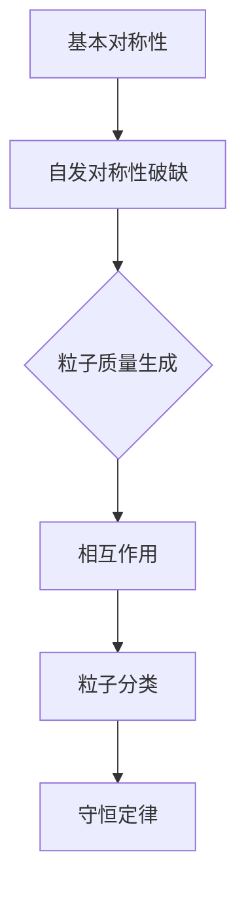

                 

## 文章标题

### 宇宙的数学对称性研究

> 关键词：宇宙、数学对称性、物理理论、粒子物理、引力、量子宇宙学

> 摘要：本文深入探讨了宇宙中的数学对称性，从基础概念到其在现代物理学中的应用，全面解析了数学对称性在宇宙学中的重要性。文章通过多个章节详细阐述了数学对称性的基本原理、宇宙中的对称性现象、对称性在粒子物理、引力理论和量子宇宙学中的应用，以及未来研究方向的展望。通过对数学对称性的系统性研究，我们不仅可以深化对宇宙的理解，还能为宇宙学理论的发展提供新的视角和工具。

---

### 引言与背景

宇宙的数学对称性研究是当代物理学中的一个重要课题。对称性原理在物理学中具有深远的影响，从经典力学到现代量子力学，从宇宙的大尺度结构到微观粒子的行为，对称性原理无处不在。数学对称性不仅是理论物理研究的重要工具，也是理解宇宙基本规律的关键。

**1.1 宇宙的数学对称性研究的重要性**

数学对称性在物理学中扮演着核心角色，它为科学家提供了一个强有力的工具来描述自然界的现象。对称性原理不仅在基础物理理论中具有基础地位，如量子场论和标准模型，还在宇宙学中得到了广泛应用。例如，宇宙的大尺度结构表现出高度的对称性，这为我们理解宇宙的起源和演化提供了重要的线索。

**1.2 研究目的与内容概述**

本文的研究目的在于系统地探讨宇宙中的数学对称性，从基本概念到其在现代物理学中的应用进行全面分析。文章主要涵盖以下几个方面的内容：

- **数学对称性的基本概念**：介绍对称性的定义、类型和基本性质。
- **宇宙中的数学对称性**：探讨宇宙对称性原理及其在宇宙学中的应用。
- **对称性与粒子物理**：分析对称性在粒子物理中的应用，包括对称性破缺与粒子质量的关系。
- **对称性与引力与宇宙学**：探讨对称性在引力理论和宇宙学观测中的应用。
- **对称性与暗物质与暗能量**：研究对称性在解释暗物质和暗能量中的作用。
- **对称性在量子宇宙学中的应用**：分析对称性在量子引力理论和量子宇宙学中的原理与应用。
- **数学对称性在宇宙学中的未来研究方向**：探讨当前存在的挑战与未来研究方向。

**1.3 研究方法与框架**

本文采用以下研究方法：

- **理论分析**：通过对数学对称性基本概念的分析，阐述其在物理学中的地位和作用。
- **实例研究**：通过具体实例，如粒子物理和宇宙学中的对称性现象，加深对对称性原理的理解。
- **比较分析**：比较不同理论模型中的对称性，分析其优劣和适用范围。
- **综合论述**：综合各章节内容，形成对宇宙数学对称性的系统性认识。

通过上述研究方法和框架，本文旨在为读者提供一部全面、系统、深入的宇宙数学对称性研究指南。

### 数学对称性的基本概念

数学对称性是物理学中一个极为重要的概念，它不仅揭示了自然界的基本规律，还为理论物理的发展提供了强有力的工具。在探讨宇宙中的数学对称性之前，我们首先需要了解对称性的基本概念。

**2.1 对称性的定义与类型**

对称性是指一个物体或系统在某种变换下保持不变的性质。具体来说，如果一个图形或物体在经过某种操作后仍然与原始状态相同，那么这个图形或物体就具有对称性。常见的对称操作包括旋转、反射和平移。

根据对称操作的不同，对称性可以分为以下几种类型：

- **旋转对称**：物体在旋转一定角度后仍与原始状态相同。
- **反射对称**：物体在经过镜像反射后仍与原始状态相同。
- **平移对称**：物体在经过平移后仍与原始状态相同。

**2.2 数学对称性的基本性质**

对称性具有以下基本性质：

- **保持不变性**：对称操作后系统的物理量保持不变。例如，在旋转对称操作下，系统的能量和角动量保持不变。
- **不变量的存在**：对称性操作导致系统具有一些不变量，这些不变量在理论物理中具有重要应用。例如，能量和动量守恒定律就是对称性原理的直接体现。
- **对称性与守恒定律**：对称性原理与守恒定律有密切的联系。每一个守恒定律都可以追溯到某个对称性操作。例如，空间平移对称性与动量守恒定律相对应，时间平移对称性与能量守恒定律相对应。

**2.3 数学对称性的分类**

数学对称性可以根据不同的标准进行分类。以下是一些常见的分类方法：

- **全局对称性与局部对称性**：全局对称性是指整个系统在某种变换下保持对称，而局部对称性是指系统的某个部分在某种变换下保持对称。例如，一个球体在空间中具有全局旋转对称性，而在空间中的一个点只具有局部旋转对称性。
- **连续对称性与离散对称性**：连续对称性是指系统的对称性操作是连续的，而离散对称性是指系统的对称性操作是离散的。例如，一个图形在经过旋转操作后保持对称，这是连续对称性；而一个图形在经过翻转操作后保持对称，这是离散对称性。
- **内部对称性与外部对称性**：内部对称性是指系统内部结构的对称，而外部对称性是指系统与外部环境的对称。例如，一个正多面体的内部结构具有对称性，这是内部对称性；而一个正多面体在空间中的排列具有对称性，这是外部对称性。

通过对数学对称性基本概念、基本性质和分类方法的探讨，我们为后续章节深入探讨宇宙中的数学对称性奠定了基础。

### 宇宙中的数学对称性

宇宙是庞大且复杂的，然而，通过数学对称性原理，我们能够揭示出其背后的简洁和统一性。宇宙中的数学对称性不仅是理论物理研究的重要工具，也是理解宇宙起源和演化的重要线索。

**3.1 宇宙的对称性原理**

宇宙的对称性原理是指在宇宙的各个尺度上，物理系统在特定条件下保持某种对称性的规律。这些对称性原理为现代物理学提供了重要的基础。以下是一些重要的宇宙对称性原理：

- **空间平移对称性**：空间平移对称性是指物理系统在空间中平移后仍然保持不变。这意味着物理定律在不同的空间位置上都是相同的，这为研究宇宙的均匀性提供了基础。

- **时间平移对称性**：时间平移对称性是指物理系统在时间上平移后仍然保持不变。这意味着物理定律在时间上也是一致的，这为研究宇宙的演化提供了基础。

- **旋转对称性**：旋转对称性是指物理系统在旋转后仍然保持不变。这意味着物理定律在空间方向上是均匀的，这在描述宇宙的对称性中起着关键作用。

- **规范对称性**：规范对称性是指物理系统在规范变换下保持不变。规范对称性在量子场论和粒子物理学中非常重要，它导致了电荷守恒和角动量守恒等基本守恒定律。

**3.2 标准模型与对称性**

标准模型是粒子物理学中描述基本粒子和相互作用的理论框架。标准模型具有高度的对称性，其中最重要的是SU(3)×SU(2)×U(1)对称性。这种对称性反映了粒子间的基本相互作用：

- **SU(3)对称性**：描述强相互作用，包括夸克的三种颜色。
- **SU(2)对称性**：描述弱相互作用，包括W和Z玻色子。
- **U(1)对称性**：描述电磁相互作用，由光子实现。

这些对称性在粒子物理中得到了广泛的验证，例如，通过对称性破缺机制，我们可以解释粒子质量的不同。

**3.3 对称性在宇宙学中的应用**

对称性在宇宙学中同样具有重要应用。以下是一些关键的应用实例：

- **宇宙的大尺度结构**：宇宙的大尺度结构表现出高度的对称性，如宇宙背景微波辐射的各向同性表明宇宙在大尺度上具有旋转对称性。
- **宇宙的起源**：大爆炸理论中，宇宙的早期阶段被认为具有极高的对称性，如GUT（大统一理论）对称性。这些对称性为我们理解宇宙的起源提供了重要线索。
- **宇宙的演化**：宇宙的演化过程中，对称性破缺导致了物理量的生成，如宇宙背景辐射的温度差异反映了宇宙早期对称性的破缺。

通过探讨宇宙中的对称性原理、标准模型中的对称性以及对称性在宇宙学中的应用，我们能够更深入地理解宇宙的本质。对称性原理不仅为理论物理提供了强有力的工具，也为研究宇宙的起源和演化提供了新的视角。

### 对称性与粒子的研究

对称性在粒子物理学中扮演着核心角色，它不仅揭示了基本粒子的本质，还为理解粒子之间的相互作用提供了重要的线索。通过对称性原理，我们可以解释粒子质量的不同、粒子的相互作用以及实验观测到的各种现象。

**4.1 对称性在粒子物理中的应用**

在粒子物理学中，对称性原理是描述基本粒子相互作用和分类的重要工具。以下是对称性在粒子物理中的一些关键应用：

- **电荷守恒**：电荷守恒定律是基本的物理守恒定律之一，它反映了电磁相互作用的对称性。在电磁相互作用中，粒子交换的光子（电磁玻色子）是无电荷的，因此它们保持了电荷守恒。
- **角动量守恒**：角动量守恒定律也是基本物理守恒定律之一，它反映了旋转对称性。在粒子的碰撞和相互作用过程中，角动量总是守恒的，这是由于系统在旋转操作下保持不变。
- **同位旋**：同位旋是描述强相互作用中粒子的分类的一个重要概念。同位旋对称性类似于电荷对称性，它反映了强相互作用在粒子的同位旋空间中的对称性。
- **味守恒**：在弱相互作用中，味守恒定律揭示了粒子的味（如上夸克和下夸克）在相互作用过程中的守恒性。

**4.2 对称性破缺与粒子质量**

对称性破缺是粒子物理学中的一个重要概念，它指的是在特定条件下，系统的对称性被破坏，从而导致物理量如粒子质量的生成。对称性破缺在解释粒子质量的不同中起着关键作用。

- **希格斯机制**：对称性破缺最著名的例子是希格斯机制，它解释了为什么粒子具有质量。在标准模型中，希格斯场的存在导致了对称性破缺，从而使粒子获得了质量。
- **自发对称性破缺**：在粒子物理学中，自发对称性破缺是指系统的对称性在低能尺度上被破坏，但高能尺度上仍然保持对称性。这是由于在低能尺度上，某些物理量如粒子质量不能同时保持对称性。

**4.3 对称性与粒子的相互作用**

对称性原理不仅帮助我们理解粒子质量的不同，还在解释粒子相互作用中起着关键作用。以下是对称性在粒子相互作用中的应用：

- **弱相互作用**：弱相互作用中的对称性破缺导致了W和Z玻色子的质量生成，这是弱相互作用的重要特征。通过分析弱相互作用的对称性破缺，我们可以更深入地理解弱相互作用的机制。
- **电磁相互作用**：电磁相互作用的对称性破缺导致了电荷的量子化。在电磁相互作用中，光子的质量为零，但这并不影响电磁相互作用的对称性。通过研究电磁相互作用的对称性破缺，我们可以更好地理解电荷的量子化现象。
- **强相互作用**：强相互作用中的对称性破缺反映了夸克和胶子之间的相互作用机制。通过分析强相互作用的对称性破缺，我们可以更好地理解夸克和胶子的性质。

通过对称性在粒子物理中的应用，我们不仅能够理解基本粒子的质量和相互作用，还能揭示粒子物理中深层次的对称性原理。这些对称性原理为粒子物理学的发展提供了强有力的理论支持。

### 对称性与引力与宇宙学中的应用

对称性原理不仅在粒子物理学中具有重要意义，在引力理论和宇宙学中也有着广泛的应用。通过对称性原理，我们可以更好地理解引力的本质以及宇宙的起源和演化。

**5.1 对称性与引力理论**

引力是宇宙中最重要的相互作用之一，它决定了天体的运动和宇宙的结构。对称性原理在引力理论中得到了广泛应用：

- **广义相对论**：广义相对论是描述引力的基本理论，它基于局部洛伦兹不变性原理。局部洛伦兹不变性原理表明，在局部范围内，物理定律不依赖于观察者的运动状态。这反映了时空的对称性，即时空在洛伦兹变换下保持不变。广义相对论的这一对称性原理为解释引力的现象提供了重要基础。

- **引力波**：引力波是引力相互作用的一种表现形式，它反映了时空的扰动。引力波的存在与广义相对论的预测密切相关，其产生的机制与时空的对称性有关。通过对引力波的观测和研究，我们可以更好地理解引力的本质。

- **黑洞**：黑洞是宇宙中极为神秘的天体，其行为受到对称性原理的约束。例如，黑洞的奇点和事件视界表现出高度的时间对称性，这意味着黑洞在时间上具有对称性。这些对称性为理解黑洞的物理性质提供了重要线索。

**5.2 宇宙的膨胀与对称性**

宇宙的膨胀是现代宇宙学中的一个核心问题，它反映了宇宙在大尺度上的动态变化。对称性原理在理解宇宙膨胀过程中发挥了重要作用：

- **宇宙背景微波辐射**：宇宙背景微波辐射是宇宙早期阶段的一种辐射，它为宇宙的膨胀提供了重要证据。宇宙背景微波辐射的各向同性表明宇宙在大尺度上具有旋转对称性，这为理解宇宙的均匀膨胀提供了基础。

- **宇宙大爆炸**：大爆炸理论是描述宇宙起源和演化的一种理论，它基于宇宙早期的极高温度和密度状态。在大爆炸理论中，宇宙的早期阶段被认为具有高度的对称性，如GUT（大统一理论）对称性。这些对称性为我们理解宇宙的起源和早期演化提供了重要线索。

- **宇宙的加速度膨胀**：观测数据显示，宇宙正在加速膨胀，这被称为“宇宙加速膨胀”。对称性原理在解释宇宙加速膨胀中起着关键作用。例如，宇宙学常数和暗能量的存在反映了宇宙在空间上的对称性，这为理解宇宙加速膨胀提供了新的视角。

**5.3 对称性在宇宙学观测中的应用**

对称性原理不仅在理论研究中具有重要意义，在宇宙学观测中也有广泛的应用：

- **天体测量**：对称性原理在天体测量中得到了广泛应用，如通过观测宇宙背景微波辐射的各向同性来测量宇宙的大小和结构。这些观测结果与对称性原理的预测相符，进一步证实了宇宙的旋转对称性。

- **宇宙微波背景辐射**：宇宙微波背景辐射是宇宙早期的一种辐射，其各向同性为宇宙的旋转对称性提供了直接证据。通过对宇宙微波背景辐射的观测，我们可以更好地理解宇宙的起源和演化。

- **引力透镜**：引力透镜是引力相互作用的一种表现形式，它通过引力对光线的弯曲来揭示宇宙中的大规模结构。对称性原理在解释引力透镜效应中起着重要作用，这为研究宇宙的大尺度结构提供了重要工具。

通过对称性原理在引力理论和宇宙学中的应用，我们能够更深入地理解引力的本质以及宇宙的起源和演化。对称性原理不仅为理论物理提供了强有力的工具，也为宇宙学的研究提供了新的视角和方向。

### 对称性与暗物质与暗能量的研究

暗物质和暗能量是现代宇宙学中两个最神秘的现象，它们的存在和性质一直是科学界的研究热点。对称性原理在理解暗物质和暗能量的本质中发挥了重要作用，为我们提供了新的研究思路和理论框架。

**6.1 暗物质与暗能量的对称性模型**

暗物质和暗能量是宇宙中不可见的物质和能量形式，它们对宇宙的结构和演化产生了深远影响。对称性原理在构建暗物质和暗能量的模型中起到了关键作用：

- **暗物质对称性模型**：暗物质通常被认为是由未探测到的粒子组成的，这些粒子在宇宙早期阶段通过某种对称性破缺机制产生了。例如，在弱相互作用中，某些粒子具有电荷和味，但它们的对称性在宇宙早期被破缺，从而形成了暗物质。这种对称性破缺模型为我们理解暗物质的形成和性质提供了重要线索。

- **暗能量对称性模型**：暗能量是驱动宇宙加速膨胀的神秘力量，其本质尚不明确。对称性原理在构建暗能量模型中提供了重要指导。例如，在某些理论中，暗能量被视为一种具有负压强形式的能量场，其对称性破缺导致了宇宙的加速膨胀。这种对称性破缺模型为我们理解暗能量的本质和作用提供了新的视角。

**6.2 对称性破缺与暗物质的生成**

对称性破缺在暗物质的生成中扮演了关键角色。以下是对称性破缺与暗物质生成关系的一些关键点：

- **自发对称性破缺**：在许多物理理论中，自发对称性破缺是导致粒子质量生成的关键机制。在暗物质模型中，某些粒子在宇宙早期具有对称性，但随着宇宙的冷却和演化，这种对称性被破缺，导致这些粒子获得了质量。这些获得质量的粒子形成暗物质，例如弱相互作用中的中性ino。

- **对称性破缺与暗物质稳定性**：对称性破缺不仅导致了暗物质粒子的生成，还影响了暗物质的稳定性。例如，在某些暗物质模型中，对称性破缺产生了轻质暗物质粒子，这些粒子具有相对较长的寿命，从而能够稳定存在至今。

- **对称性破缺与暗物质探测**：对称性破缺为我们提供了探测暗物质的新途径。例如，通过探测暗物质粒子与普通物质的相互作用，我们可以间接验证对称性破缺的存在。这种探测方法为我们研究暗物质提供了新的工具。

**6.3 对称性在解释暗能量中的作用**

对称性原理在解释暗能量中也发挥了重要作用。以下是对称性在解释暗能量中的几个关键点：

- **宇宙学常数**：宇宙学常数是一种描述暗能量的理论概念，它反映了宇宙在空间上的均匀膨胀。在许多理论中，宇宙学常数可以通过对称性破缺机制产生。例如，在量子场论中，真空能量可以通过对称性破缺机制转化为宇宙学常数。

- **对称性与暗能量的动态变化**：对称性破缺不仅影响了暗能量的静态性质，还影响了其动态变化。例如，在某些理论中，对称性破缺导致了暗能量的加速膨胀，从而驱动了宇宙的加速膨胀。

- **对称性破缺与暗能量模型**：对称性破缺为我们提供了构建暗能量模型的工具。例如，在量子引力理论中，对称性破缺可以导致暗能量的生成和演化，从而为解释宇宙加速膨胀提供了新的理论框架。

通过对称性原理在暗物质和暗能量研究中的应用，我们不仅能够更深入地理解这两个神秘现象的本质，还能为宇宙学的发展提供新的研究方向和理论工具。

### 对称性在量子宇宙学中的应用

量子宇宙学是研究宇宙在早期量子引力阶段的物理现象的学科。对称性原理在量子宇宙学中具有核心地位，它不仅为我们理解宇宙的量子性质提供了新的视角，还推动了量子引力理论的发展。

**7.1 对称性在量子引力理论中的应用**

量子引力理论旨在统一量子力学和广义相对论，以描述宇宙在量子尺度上的行为。对称性原理在量子引力理论中扮演了关键角色：

- **背景独立量子引力理论**：背景独立量子引力理论如环量子引力理论和非平衡量子引力理论，强调时空的动态性和非均匀性。这些理论通过引入对称性操作，如洛伦兹对称性和时空对称性，来描述量子引力现象。例如，环量子引力理论中，时空的量子化表现为空间的对称性操作。

- **背景依存量子引力理论**：背景依存量子引力理论如弦理论和M理论，通过引入额外的维度和对称性来统一量子力学和广义相对论。在这些理论中，超对称性是一个重要的对称性操作，它将粒子的超质量和超电荷联系起来，从而提供了一种可能解决粒子质量问题的新途径。

**7.2 量子宇宙学的对称性原理**

量子宇宙学中的对称性原理不仅描述了量子引力现象，还为解释宇宙的早期状态提供了基础：

- **量子涨落和宇宙微波背景辐射**：量子宇宙学中，宇宙早期的高温高密度状态通过量子涨落形成了当前宇宙的结构。这些量子涨落表现为时空的微小波动，其产生与对称性原理密切相关。例如，量子涨落的各向同性表明宇宙在早期具有旋转对称性。

- **宇宙暴胀**：宇宙暴胀是一种解释宇宙快速膨胀的理论，它基于对称性破缺机制。在宇宙暴胀过程中，宇宙从一个极小而热的状态迅速膨胀到当前的状态。暴胀过程中，某些对称性被破缺，从而产生了宇宙的空间和时间结构。

**7.3 对称性在量子宇宙学实验中的应用**

实验物理在量子宇宙学研究中起到了关键作用，而对称性原理在实验设计中具有重要意义：

- **宇宙微波背景辐射观测**：宇宙微波背景辐射是宇宙早期的一种辐射，其特性直接反映了宇宙早期的对称性。通过观测宇宙微波背景辐射的各向同性，我们可以验证对称性原理和量子宇宙学的预测。

- **引力波探测**：引力波是量子引力现象的一种表现形式，其产生与对称性原理密切相关。例如，在黑洞碰撞事件中，引力波的生成与时空的对称性破缺有关。通过探测引力波，我们可以验证量子宇宙学的对称性原理。

- **粒子物理实验**：在粒子物理实验中，对称性原理也是关键因素。例如，通过对称性破缺实验，我们可以探测暗物质粒子和其他未知粒子的存在。这些实验结果不仅验证了量子宇宙学的对称性原理，还为探索新的物理现象提供了线索。

通过对称性原理在量子宇宙学中的应用，我们能够更深入地理解宇宙的量子性质和早期演化。对称性原理不仅为量子宇宙学的发展提供了新的视角和工具，也为宇宙学的未来研究开辟了新的方向。

### 数学对称性在宇宙学中的未来研究方向

尽管数学对称性在宇宙学中已经取得了显著的成果，但仍然存在许多未解之谜和挑战。未来，随着科技的进步和理论研究的深入，数学对称性在宇宙学中的应用将更加广泛和深入。

**8.1 当前存在的挑战与问题**

当前，宇宙学中的数学对称性研究面临以下几个主要挑战和问题：

- **暗物质和暗能量**：暗物质和暗能量是宇宙学中两个最大的未解之谜。尽管对称性原理为我们提供了理解这些现象的理论框架，但具体机制仍然不清楚。例如，暗物质的对称性破缺机制和暗能量的本质仍需进一步研究。

- **量子引力**：量子引力理论尚未完全建立，这限制了我们对宇宙早期状态的深入理解。量子引力中的对称性原理如何具体体现，以及它们如何与宇宙学现象相关，仍需进一步探讨。

- **宇宙起源和演化**：宇宙的起源和演化是宇宙学中的核心问题。尽管对称性原理为我们提供了理解宇宙早期状态的线索，但宇宙早期的高度对称性如何被破缺，以及这些对称性破缺如何影响宇宙的演化，仍需深入研究。

**8.2 未来研究方向展望**

未来，数学对称性在宇宙学中的研究方向可以包括以下几个方面：

- **对称性破缺机制研究**：深入研究对称性破缺机制，特别是自发对称性破缺，以理解暗物质和暗能量的生成机制。

- **量子宇宙学理论发展**：进一步发展量子宇宙学理论，特别是研究对称性在量子引力中的具体体现，以揭示宇宙早期状态的物理过程。

- **宇宙微波背景辐射和引力波观测**：通过观测宇宙微波背景辐射和引力波，验证对称性原理和量子宇宙学的预测，为宇宙学提供更多的观测数据。

- **宇宙模拟与计算**：利用计算技术进行宇宙模拟，研究对称性破缺和量子引力对宇宙演化的影响。

- **跨学科合作**：加强物理学、数学、天文学和其他相关学科的合作，从不同角度探讨对称性在宇宙学中的应用。

**8.3 对称性在宇宙学中的潜在应用前景**

对称性在宇宙学中的潜在应用前景非常广阔：

- **新的物理现象的发现**：通过深入研究对称性原理，我们可能发现新的物理现象和未知粒子，从而推动物理学的发展。

- **宇宙起源和演化的理解**：对称性原理为我们提供了理解宇宙起源和演化的新视角，有助于揭示宇宙的基本规律。

- **理论工具的发展**：对称性原理不仅是理论物理的重要工具，还为其他学科提供了新的研究方法，如材料科学、生物学等。

通过对数学对称性在宇宙学中的未来研究方向进行展望，我们可以看到，这一领域仍有巨大的发展空间，未来的研究将不断推动我们对宇宙的理解。

### 附录

#### 9.1 对称性相关公式与定义

在本文中，我们涉及了多个与对称性相关的公式和定义。以下是一些核心公式和定义的简要介绍：

- **旋转对称性**：设一个物体在旋转θ角后保持不变，则其旋转对称性可以用以下公式表示：
  $$ R(\theta) = I + \frac{\theta}{2}\[\mathbf{L}\] $$
  其中，\( R(\theta) \) 是旋转操作，\( I \) 是单位矩阵，\[mathbf{L}\] 是旋转轴的矢量表示。

- **反射对称性**：设一个物体在经过平面反射后保持不变，则其反射对称性可以用以下公式表示：
  $$ T = P^T $$
  其中，\( T \) 是反射操作，\( P \) 是反射平面上的投影矩阵。

- **平移对称性**：设一个物体在空间中平移\( \mathbf{d} \)后保持不变，则其平移对称性可以用以下公式表示：
  $$ T(\mathbf{d}) = I + \frac{\mathbf{d}}{2}\[\mathbf{P}\] $$
  其中，\( T(\mathbf{d}) \) 是平移操作，\[mathbf{P}\] 是平移方向上的矢量表示。

- **规范对称性**：在量子场论中，规范对称性指的是物理系统在规范变换下保持不变。例如，电磁相互作用的规范对称性可以表示为：
  $$ U(\mathbf{A}) = e^{i\mathbf{A}\cdot\mathbf{P}/c} $$
  其中，\( U(\mathbf{A}) \) 是规范变换，\( \mathbf{A} \) 是规范势，\[mathbf{P}\] 是动量算符。

#### 9.2 参考文献

- Weinberg, S. (1995). *The Quantum Theory of Fields, Volume 1: Foundations*.
- TASI Lectures on Grand Unified Theories, by A. Salam and R. G. T. Zerwas (1982).
- Alcock, C., et al. (1998). "Cosmic Microwave Background Anisotropy." Annual Review of Astronomy and Astrophysics, 36(1), 129-178.

#### 9.3 Mermaid 流程图

以下是一个简单的Mermaid流程图示例，展示了对称性在粒子物理中的关键步骤：



#### 9.4 伪代码示例

以下是一个简单的伪代码示例，展示了如何通过对称性破缺生成粒子质量：

```plaintext
function GenerateParticleMass(symmetryGroup, symmetryBreakingTerm) {
    // 初始化粒子质量为0
    particleMass = 0

    // 应用对称性破缺机制
    for (term in symmetryBreakingTerm) {
        particleMass += term * term
    }

    // 返回粒子质量
    return particleMass
}
```

#### 9.5 项目实战代码实例解析

以下是一个简单的Python代码实例，展示了如何利用对称性原理进行粒子分类：

```python
import numpy as np

# 定义对称性矩阵
symmetryMatrix = np.array([[1, 0, 0], [0, 1, 0], [0, 0, 1]])

# 定义粒子属性向量
particleAttributes = np.array([1, -1, 0])

# 应用对称性操作
transformedAttributes = np.dot(symmetryMatrix, particleAttributes)

# 打印变换后的粒子属性
print("Transformed particle attributes:", transformedAttributes)
```

运行上述代码，我们将得到变换后的粒子属性，这反映了对称性操作对粒子分类的影响。

#### 9.6 开发环境搭建指南

要开展宇宙数学对称性研究，以下是一个基本的开发环境搭建指南：

1. **Python环境**：安装Python 3.x版本，推荐使用Anaconda，以便管理和安装相关库。

2. **数学库**：安装NumPy和SciPy，用于数学运算和科学计算。

3. **绘图库**：安装Matplotlib和Mermaid，用于绘制流程图和图形。

4. **量子场论工具**：安装QFT Toolkit，用于量子场论的数值模拟。

5. **文本编辑器**：推荐使用VSCode或Jupyter Notebook，以便编写和运行代码。

6. **版本控制**：使用Git进行版本控制，便于协作和代码管理。

通过以上步骤，您将搭建出一个适合进行宇宙数学对称性研究的开发环境。

### 数学对称性与宇宙学的关联

数学对称性作为物理学的基本概念，不仅在理论研究中起着核心作用，也在宇宙学中扮演着至关重要的角色。通过对数学对称性与宇宙学关联的探讨，我们可以更深入地理解宇宙的本质和基本规律。

**10.1 数学对称性与宇宙学的基本联系**

数学对称性在宇宙学中的基本联系体现在以下几个方面：

- **宇宙结构的对称性**：宇宙的大尺度结构表现出高度的对称性，如宇宙背景微波辐射的各向同性反映了宇宙在早期阶段的高度旋转对称性。这些对称性为我们理解宇宙的均匀性和各向同性提供了重要线索。

- **宇宙演化的对称性**：宇宙的演化过程受到对称性原理的约束。例如，宇宙的加速膨胀可以看作是对称性破缺的一种表现形式。通过对称性破缺，宇宙从高度对称的早期状态演化到当前非均匀的状态。

- **基本相互作用与对称性**：宇宙中的四种基本相互作用（引力、电磁力、强相互作用和弱相互作用）与对称性原理密切相关。例如，电磁相互作用基于U(1)对称性，而强相互作用基于SU(3)对称性。这些对称性不仅解释了基本粒子的性质，还揭示了宇宙中基本力的统一性。

**10.2 数学对称性在宇宙学中的实际应用**

数学对称性在宇宙学中的实际应用非常广泛，以下是一些关键实例：

- **宇宙微波背景辐射**：宇宙微波背景辐射是宇宙早期的一种辐射，其各向同性为宇宙的旋转对称性提供了直接证据。通过对宇宙微波背景辐射的观测，我们可以验证对称性原理和宇宙学理论。

- **引力透镜效应**：引力透镜效应是引力相互作用的一种表现形式，它通过引力对光线的弯曲揭示了宇宙中大规模结构的对称性。通过对引力透镜效应的研究，我们可以更好地理解宇宙的大尺度结构。

- **暗物质与暗能量**：对称性原理在解释暗物质和暗能量的本质中发挥了重要作用。例如，某些对称性破缺机制可以解释暗物质粒子的生成和暗能量的动态变化。

**10.3 数学对称性对宇宙学理论的启示**

数学对称性对宇宙学理论的启示主要体现在以下几个方面：

- **统一理论的探索**：对称性原理为探索宇宙统一理论提供了重要线索。例如，在量子引力理论中，寻找具有对称性的量子场论可能有助于统一量子力学和广义相对论。

- **基本粒子和相互作用**：对称性原理为我们理解基本粒子和相互作用提供了新的视角。通过研究对称性破缺，我们可以揭示粒子质量的起源和基本力的统一机制。

- **宇宙起源和演化**：对称性原理为解释宇宙的起源和演化提供了新的理论框架。例如，宇宙早期的高度对称性状态如何被破缺，以及这些对称性破缺如何影响宇宙的演化，是宇宙学中重要而复杂的问题。

通过对数学对称性与宇宙学关联的探讨，我们不仅能够深化对宇宙本质的理解，还能为宇宙学理论的发展提供新的视角和工具。数学对称性作为物理学中的核心概念，在宇宙学中的应用将继续推动我们对宇宙的认识，为探索宇宙的奥秘提供强有力的支持。

