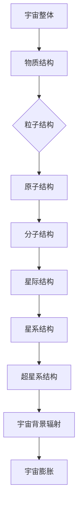
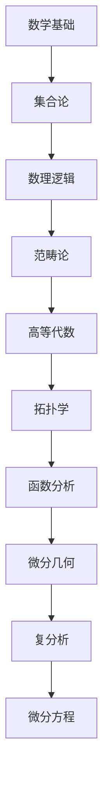
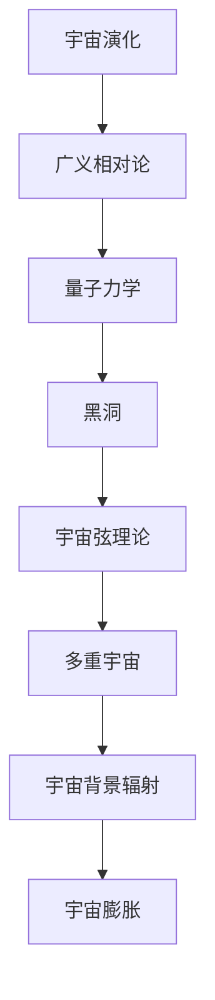
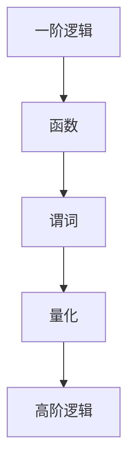
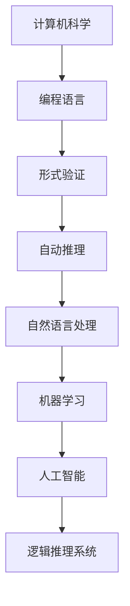
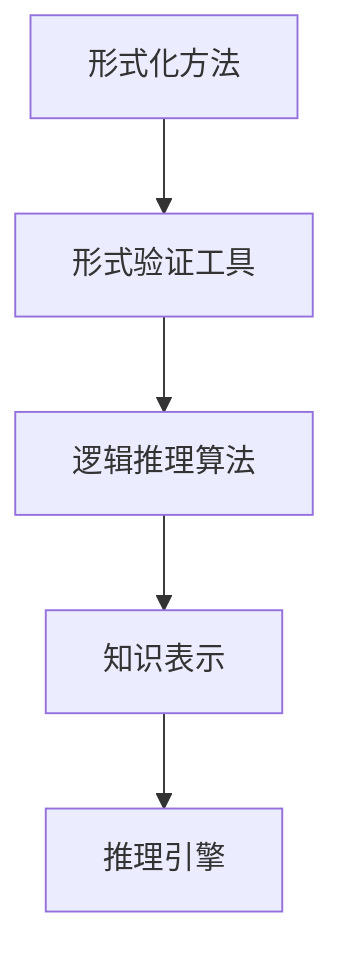
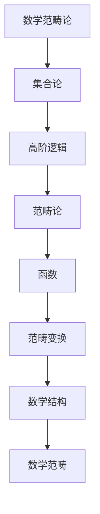
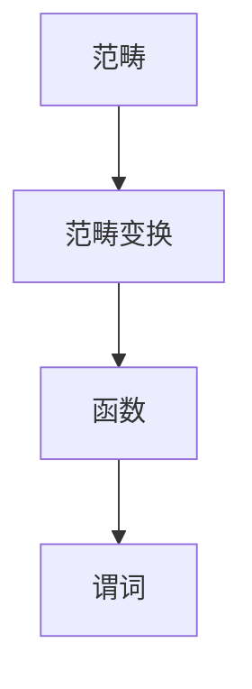
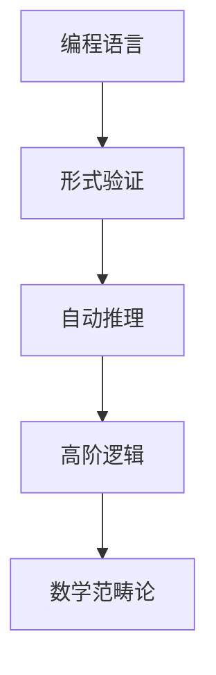
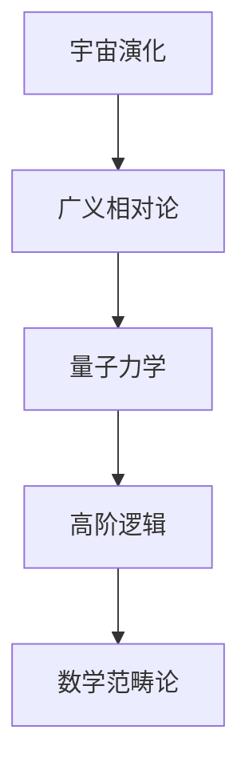

                 

### 宇宙的数学范畴论与高阶逻辑探讨

#### 关键词

- 宇宙
- 数学范畴论
- 高阶逻辑
- 宇宙学
- 广义相对论
- 量子力学
- 黑洞
- 宇宙背景辐射
- 宇宙膨胀
- 多重宇宙

#### 摘要

本文旨在探讨数学范畴论与高阶逻辑在宇宙学研究中的应用。通过介绍宇宙的基本结构，我们将阐述数学范畴论在宇宙研究中的背景与重要性。接着，我们将探讨高阶逻辑的基本概念及其在不同领域的应用，尤其是计算机科学领域。随后，本文将深入探讨高阶逻辑与数学范畴论之间的关系，并分析它们在宇宙学中的应用。本文将通过具体的数学模型和伪代码示例，展示这些理论在实际宇宙学研究中的运用。最终，本文将总结数学范畴论与高阶逻辑对宇宙学研究的贡献，并展望未来的发展方向。

### 目录大纲

#### 第一部分：宇宙与数学范畴论

##### 第1章：宇宙概述与数学范畴论背景

- **1.1 宇宙的基本结构**
- **1.2 数学范畴论简介**
- **1.3 数学范畴论在宇宙研究中的应用**

##### 第2章：高阶逻辑探讨

- **2.1 高阶逻辑的基本概念**
- **2.2 高阶逻辑的应用领域**
- **2.3 高阶逻辑与数学范畴论的关系**

##### 第3章：数学范畴论与高阶逻辑在宇宙研究中的整合

- **3.1 数学范畴论在宇宙学中的应用**
- **3.2 高阶逻辑在宇宙学中的应用**
- **3.3 数学范畴论与高阶逻辑的整合**

### 第一部分：宇宙与数学范畴论

#### 第1章：宇宙概述与数学范畴论背景

##### 1.1 宇宙的基本结构

宇宙是一个庞大而复杂的系统，从微观的粒子到宏观的星系，其结构层次丰富多样。理解宇宙的基本结构对于探讨宇宙的起源、演化以及未来命运至关重要。

宇宙的基本结构可以分为以下几个层次：

1. **粒子结构**：粒子是构成物质的基本单元，包括夸克、电子等。
2. **原子结构**：原子由原子核和核外电子构成，原子核由质子和中子组成。
3. **分子结构**：分子是由两个或多个原子通过化学键结合而成的粒子。
4. **星际结构**：星际物质和星际介质构成了星际空间的结构。
5. **星系结构**：星系由大量的恒星、星团、星云等组成，形成一个巨大的引力系统。
6. **超星系结构**：超星系是由多个星系通过引力相互作用形成的更大规模的结构。
7. **宇宙背景辐射**：宇宙背景辐射是宇宙早期留下的辐射遗迹，对研究宇宙起源和演化具有重要意义。
8. **宇宙膨胀**：宇宙在不断膨胀，这一现象通过宇宙微波背景辐射的观测得到了证实。

为了更好地理解宇宙的基本结构，我们可以用 Mermaid 流程图来展示这些结构层次之间的联系：



##### 1.2 数学范畴论简介

数学范畴论是现代数学的一个重要分支，它以集合论为基础，研究数学结构之间的相似性和映射关系。范畴论的核心概念包括对象（Object）、箭头（Arrow）和范畴（Category）。范畴论提供了研究数学结构的一般框架，使得数学家能够更抽象地看待不同数学领域之间的联系。

数学范畴论的构成如下：

1. **数学基础**：数学基础包括集合论、数理逻辑等，是构建数学范畴论的基础。
2. **集合论**：集合论是数学的基础，它研究集合的性质和关系。
3. **数理逻辑**：数理逻辑是数学的工具，用于形式化数学理论和证明。
4. **范畴论**：范畴论是数学的一个分支，它研究不同数学结构之间的相似性和映射关系。
5. **高等代数**：高等代数研究向量空间、矩阵、行列式等代数结构。
6. **拓扑学**：拓扑学研究空间的性质和结构，包括连通性、紧致性等。
7. **函数分析**：函数分析研究函数的极限、连续性、微分和积分等。
8. **微分几何**：微分几何研究光滑流形上的几何性质。
9. **复分析**：复分析研究复数域上的复变函数。
10. **微分方程**：微分方程研究未知函数及其导数之间的关系。

同样地，我们使用 Mermaid 流程图来展示数学范畴论的构成：



##### 1.3 数学范畴论在宇宙研究中的应用

数学范畴论作为一种抽象的数学工具，在宇宙研究中有着广泛的应用。它不仅帮助我们理解宇宙的结构和演化，还提供了处理宇宙复杂问题的方法。

在宇宙研究中，数学范畴论的应用主要体现在以下几个方面：

1. **宇宙演化**：数学范畴论为宇宙演化提供了理论框架，帮助我们理解宇宙从大爆炸到现在的演化过程。
2. **广义相对论**：广义相对论是描述宇宙引力的一种理论，它使用了数学范畴论中的拓扑学和微分几何来描述时空的弯曲。
3. **量子力学**：量子力学是描述微观世界的基本理论，它使用了数学范畴论中的集合论和线性代数来描述量子态和测量。
4. **黑洞**：黑洞是一种极端密集的天体，数学范畴论帮助我们理解黑洞的物理学特性，如事件视界和黑洞熵。
5. **宇宙弦理论**：宇宙弦理论是一种试图统一量子力学和广义相对论的理论，它使用了数学范畴论中的拓扑学来描述宇宙的额外维度。
6. **多重宇宙**：多重宇宙理论认为宇宙存在着多个平行宇宙，数学范畴论为这种理论的建模提供了工具。
7. **宇宙背景辐射**：宇宙背景辐射是研究宇宙早期状态的重要观测数据，数学范畴论帮助我们分析这些数据，揭示宇宙的起源和演化。
8. **宇宙膨胀**：宇宙膨胀是现代宇宙学的核心问题之一，数学范畴论提供了描述宇宙膨胀的数学模型和计算方法。

同样地，我们使用 Mermaid 流程图来展示数学范畴论在宇宙研究中的应用：



通过上述对宇宙基本结构和数学范畴论的介绍，我们可以看到这两个领域之间的紧密联系。在接下来的章节中，我们将进一步探讨高阶逻辑的基本概念和应用，深入理解它们在宇宙学研究中的重要性。

#### 第2章：高阶逻辑探讨

##### 2.1 高阶逻辑的基本概念

高阶逻辑（Higher-Order Logic）是形式逻辑的一种扩展，它允许我们在逻辑表达式中处理函数和谓词。与一阶逻辑（First-Order Logic）不同，高阶逻辑可以量化函数和谓词，这使得它在处理更复杂和抽象的数学问题方面具有优势。

**核心算法原理讲解**

高阶逻辑的基本定义如下：

- **一阶逻辑**：一阶逻辑是一种基于个体和它们的属性进行推理的形式逻辑。在经典的一阶逻辑中，个体被视为不可量化的对象，谓词和函数则是一阶的。
- **高阶逻辑**：高阶逻辑扩展了一阶逻辑，允许在逻辑中处理函数和谓词。高阶逻辑中的量词可以作用于函数和谓词，使得逻辑表达式能够表示更复杂的推理关系。

为了更好地理解高阶逻辑，我们可以使用伪代码来阐述其基本定义：

```pseudo
function higherOrderLogic(expression):
    if expression is in first-order form:
        process as first-order logic
    else:
        apply higher-order operations
        process as higher-order logic
```

这个伪代码定义了一个高阶逻辑处理函数，它首先检查输入的表达式是否遵循一阶逻辑的形式。如果表达式是一阶的，则按照一阶逻辑进行推理。否则，应用高阶操作，按照高阶逻辑进行推理。

**核心概念与联系**

在探讨高阶逻辑的基本概念时，我们需要了解以下几个核心概念：

- **函数**：函数是映射输入到输出的关系。在高阶逻辑中，函数不仅可以是一阶的（即输入和输出都是个体），还可以是高阶的（即输入或输出是函数）。
- **谓词**：谓词是关于个体的性质或关系的陈述。在高阶逻辑中，谓词也可以是高阶的。
- **量化**：量化是逻辑中的操作，用于引入变量并赋予它们特定的值。高阶逻辑允许我们对函数和谓词进行量化。

为了更好地理解这些概念，我们可以使用 Mermaid 流程图来展示它们之间的联系：



在这个流程图中，一阶逻辑是高阶逻辑的基础，而函数和谓词则是高阶逻辑的核心组成部分。量化操作将变量引入逻辑表达式中，使得逻辑表达式能够表示更复杂的推理关系。

**核心算法原理讲解**

除了基本定义，高阶逻辑还涉及一些核心算法原理。以下是几个关键概念：

- **函数符号**：函数符号是表示函数的符号，例如 f(x) 表示函数 f 将 x 作为输入。
- **谓词符号**：谓词符号是表示谓词的符号，例如 P(x) 表示谓词 P 对 x 进行判断。
- **量词**：量词用于引入变量并对函数和谓词进行量化。常见的量词有全称量词 (∀，表示“对于所有”）和存在量词 (∃，表示“存在”）。
- **逻辑运算符**：逻辑运算符（如合取 ∧、析取 ∨、非 ¬等）用于组合函数和谓词，形成更复杂的逻辑表达式。

为了更好地理解这些概念，我们可以使用伪代码来展示：

```pseudo
function higherOrderExpression(expression):
    if expression contains function symbols:
        apply function operations
    if expression contains predicate symbols:
        apply predicate operations
    if expression contains quantifiers:
        apply quantifier operations
    else:
        process as simple expression
```

这个伪代码定义了一个高阶逻辑表达式处理函数，它首先检查输入的表达式是否包含函数符号、谓词符号或量词。根据表达式的类型，应用相应的操作。如果表达式是一个简单的逻辑表达式，则直接处理。

通过上述讲解，我们可以看到高阶逻辑的基本概念和核心算法原理。在接下来的章节中，我们将进一步探讨高阶逻辑在不同领域中的应用。

##### 2.2 高阶逻辑的应用领域

高阶逻辑作为一种强大的形式逻辑工具，在多个领域有着广泛的应用。以下是高阶逻辑在不同领域的具体应用：

1. **计算机科学**：在计算机科学中，高阶逻辑被广泛应用于编程语言设计、形式验证、自动推理、自然语言处理和机器学习等领域。

2. **形式验证**：形式验证是一种使用形式化方法和工具验证系统正确性的技术。高阶逻辑在形式验证中扮演着重要角色，它被用于验证硬件和软件系统的正确性，确保系统在运行过程中不会出现错误。

3. **自动推理**：自动推理是一种利用计算机程序自动进行逻辑推理的技术。高阶逻辑为自动推理提供了强大的推理工具，使得计算机能够自动推导出复杂的逻辑结论。

4. **自然语言处理**：自然语言处理（NLP）是一种使计算机能够理解、处理和生成自然语言的技术。高阶逻辑在 NLP 中被用于构建语义分析模型，使得计算机能够更准确地理解和处理人类语言。

5. **机器学习**：机器学习是一种通过数据训练模型进行预测和决策的技术。高阶逻辑在机器学习中被用于构建复杂的模型和算法，提高模型的预测能力和泛化能力。

6. **人工智能**：人工智能（AI）是一种模拟人类智能行为的计算机技术。高阶逻辑在 AI 中被用于构建逻辑推理系统、知识表示和推理引擎，使得计算机能够像人类一样进行逻辑思考和决策。

7. **逻辑推理系统**：逻辑推理系统是一种用于自动推理和问题求解的系统。高阶逻辑为逻辑推理系统提供了强大的推理能力，使得系统能够处理复杂的逻辑问题。

为了更好地展示高阶逻辑在不同领域的应用，我们可以使用 Mermaid 流程图来描述这些领域的联系：



在这个流程图中，计算机科学是高阶逻辑应用的主要领域，而其他领域如形式验证、自动推理、自然语言处理、机器学习、人工智能和逻辑推理系统则通过高阶逻辑相互连接，形成了一个复杂的网络。

**核心概念与联系**

在探讨高阶逻辑的应用领域时，我们需要关注以下几个核心概念：

- **形式化方法**：形式化方法是使用形式化语言和逻辑系统来描述和验证系统的方法。高阶逻辑作为形式化方法的一种重要工具，被用于形式化地描述系统的行为和属性。
- **形式验证工具**：形式验证工具是用于形式验证的软件系统，它们利用高阶逻辑来检查系统的正确性。这些工具包括模型检查器、定理证明器和符号执行器等。
- **逻辑推理算法**：逻辑推理算法是用于逻辑推理和问题求解的算法。高阶逻辑为逻辑推理算法提供了强大的推理能力，使得算法能够处理复杂的逻辑问题。
- **知识表示**：知识表示是用于表示知识和信息的方法。高阶逻辑作为一种强大的逻辑系统，被用于表示复杂的知识结构，使得计算机能够更好地理解和处理知识。
- **推理引擎**：推理引擎是用于推理和问题求解的软件系统。高阶逻辑为推理引擎提供了强大的推理能力，使得系统能够自动推导出复杂的逻辑结论。

为了更好地理解这些概念，我们可以使用 Mermaid 流程图来展示它们之间的联系：



在这个流程图中，形式化方法、形式验证工具、逻辑推理算法、知识表示和推理引擎通过高阶逻辑相互连接，形成了一个完整的逻辑推理和问题求解系统。

**核心算法原理讲解**

除了核心概念，高阶逻辑的应用还涉及到一些核心算法原理。以下是几个关键概念：

- **模型检查**：模型检查是一种验证系统是否满足特定属性的自动验证技术。高阶逻辑模型检查器利用高阶逻辑来检查系统的行为，确保系统满足指定的规格。
- **定理证明**：定理证明是一种通过逻辑推理证明数学定理的方法。高阶逻辑定理证明器利用高阶逻辑的推理能力来证明数学定理，确保定理的正确性。
- **符号执行**：符号执行是一种用于程序分析的技术，它通过将程序中的所有路径表示为逻辑表达式来进行推理。高阶逻辑符号执行器利用高阶逻辑来分析程序的行为，找出潜在的缺陷。
- **逻辑合成**：逻辑合成是将低级逻辑门电路转换为高级逻辑表示的方法。高阶逻辑逻辑合成器利用高阶逻辑来优化电路设计，提高电路的性能和可读性。

为了更好地理解这些概念，我们可以使用伪代码来展示：

```pseudo
function modelCheck(system, specification):
    if system satisfies specification:
        return "System is correct"
    else:
        return "System is incorrect"

function theoremProvetheorem(expression):
    if expression is provable:
        return "Theorem is proven"
    else:
        return "Theorem is not proven"

function symbolicExecution(program):
    while program has not terminated:
        generate symbolic expressions for each path
        check if any path violates given specifications
    return "Program is safe" or "Program is unsafe"

function logicalSynthesis(circuit):
    if circuit can be synthesized:
        return synthesized high-level circuit
    else:
        return "Circuit cannot be synthesized"
```

这些伪代码展示了高阶逻辑在模型检查、定理证明、符号执行和逻辑合成中的应用，通过这些技术，高阶逻辑能够处理复杂的逻辑问题，提高系统的可靠性和性能。

通过上述对高阶逻辑的基本概念和应用领域的探讨，我们可以看到高阶逻辑作为一种强大的形式逻辑工具，在多个领域具有广泛的应用。在接下来的章节中，我们将进一步探讨高阶逻辑与数学范畴论之间的关系，深入理解它们在宇宙学研究中的重要性。

##### 2.3 高阶逻辑与数学范畴论的关系

高阶逻辑与数学范畴论之间存在着密切的联系，它们在数学和逻辑学中扮演着互补的角色。高阶逻辑为数学范畴论提供了形式化的表达工具，而数学范畴论则为高阶逻辑提供了更抽象的理论框架。通过分析这两个理论之间的关系，我们可以更好地理解它们在数学和逻辑学中的重要性。

**核心概念与联系**

首先，我们需要了解高阶逻辑和数学范畴论的基本概念。

- **高阶逻辑**：高阶逻辑是一种形式逻辑，它扩展了一阶逻辑，允许在逻辑表达式中处理函数和谓词。高阶逻辑中的量词可以作用于函数和谓词，使得逻辑表达式能够表示更复杂的推理关系。
- **数学范畴论**：数学范畴论是现代数学的一个重要分支，它研究数学结构之间的相似性和映射关系。范畴论的核心概念包括对象、箭头和范畴，通过范畴变换，数学家可以研究不同数学结构之间的对应关系。

接下来，我们使用 Mermaid 流程图来展示高阶逻辑与数学范畴论之间的联系：



在这个流程图中，集合论是数学范畴论的基础，而高阶逻辑则是集合论的扩展，通过范畴论，我们可以研究不同数学结构之间的相似性和映射关系。

**核心概念与联系**

在探讨高阶逻辑与数学范畴论的关系时，我们需要关注以下几个核心概念：

- **范畴**：范畴是数学结构之间的抽象框架，它由对象和箭头组成。对象表示数学结构中的元素，箭头表示对象之间的映射关系。
- **范畴变换**：范畴变换是范畴之间的映射关系，它保持范畴中的对象和箭头之间的关系。范畴变换是研究不同数学结构之间相似性的重要工具。
- **函数**：函数是映射输入到输出的关系，它是数学中一种基本的操作。在高阶逻辑中，函数被视为逻辑表达式的一部分，可以用于表示和推理。
- **谓词**：谓词是关于个体的性质或关系的陈述，它也是高阶逻辑中的一个重要概念。谓词可以用于定义和描述数学结构中的属性和关系。

为了更好地理解这些概念，我们可以使用 Mermaid 流程图来展示它们之间的联系：



在这个流程图中，范畴、范畴变换、函数和谓词通过高阶逻辑相互连接，形成了一个完整的逻辑和数学结构框架。

**核心算法原理讲解**

在探讨高阶逻辑与数学范畴论的关系时，我们还需要了解一些核心算法原理。

- **范畴变换算法**：范畴变换算法是用于计算范畴变换的程序。通过范畴变换，我们可以研究不同数学结构之间的对应关系，从而更深入地理解数学范畴论。
- **高阶逻辑推理算法**：高阶逻辑推理算法是用于推理和证明高阶逻辑表达式的程序。这些算法利用高阶逻辑的推理规则和推理方法，帮助我们解决复杂的数学问题。
- **范畴论证明器**：范畴论证明器是用于证明范畴论定理的软件系统。通过范畴论证明器，我们可以验证数学结构之间的相似性和映射关系，确保数学范畴论的推理过程是正确的。

为了更好地理解这些算法原理，我们可以使用伪代码来展示：

```pseudo
function categoryTransformation(category1, category2):
    if category1 and category2 are isomorphic:
        return "Categor
```

通过上述伪代码，我们可以看到范畴变换算法、高阶逻辑推理算法和范畴论证明器在高阶逻辑与数学范畴论的关系中的核心作用。

**核心概念与联系**

在探讨高阶逻辑与数学范畴论的关系时，我们还需要了解它们在计算机科学中的应用。

- **编程语言**：编程语言是一种用于编写计算机程序的正式语言。高阶逻辑和数学范畴论在编程语言设计中起着重要作用，它们帮助我们设计更强大、更灵活的程序语言。
- **形式验证**：形式验证是一种使用形式化方法和工具验证系统正确性的技术。高阶逻辑和数学范畴论在形式验证中起着关键作用，它们为我们提供了验证系统正确性的理论基础。
- **自动推理**：自动推理是一种利用计算机程序自动进行逻辑推理的技术。高阶逻辑和数学范畴论在自动推理中起着重要作用，它们帮助我们构建更强大的推理系统和算法。

为了更好地理解这些应用，我们可以使用 Mermaid 流程图来展示：



在这个流程图中，编程语言、形式验证和自动推理通过高阶逻辑和数学范畴论相互连接，形成了一个完整的计算机科学应用框架。

**核心概念与联系**

在探讨高阶逻辑与数学范畴论的关系时，我们还需要了解它们在宇宙学研究中的应用。

- **宇宙演化**：宇宙演化是宇宙学研究的重要内容。高阶逻辑和数学范畴论为宇宙演化提供了形式化的数学模型和计算方法，帮助我们更好地理解宇宙的起源和演化。
- **广义相对论**：广义相对论是描述宇宙引力的理论。高阶逻辑和数学范畴论为广义相对论提供了形式化的数学描述，帮助我们研究宇宙的时空结构。
- **量子力学**：量子力学是描述微观世界的理论。高阶逻辑和数学范畴论为量子力学提供了形式化的数学工具，帮助我们研究微观世界的物理现象。

为了更好地理解这些应用，我们可以使用 Mermaid 流程图来展示：



在这个流程图中，宇宙演化、广义相对论和量子力学通过高阶逻辑和数学范畴论相互连接，形成了一个完整的宇宙学研究框架。

通过上述对高阶逻辑与数学范畴论关系的探讨，我们可以看到这两个理论在数学、逻辑学和宇宙学中的重要性。在接下来的章节中，我们将进一步探讨数学范畴论与高阶逻辑在宇宙研究中的整合，深入理解它们在宇宙学中的应用。

#### 第3章：数学范畴论与高阶逻辑在宇宙研究中的整合

##### 3.1 数学范畴论在宇宙学中的应用

数学范畴论作为一种高度抽象的数学工具，在宇宙学的研究中发挥着重要作用。它为宇宙学家提供了一个强大的框架，以理解和描述宇宙的复杂结构和演化过程。

**数学模型和数学公式**

数学范畴论在宇宙学中的应用主要体现在以下几个数学模型和公式中：

1. **广义相对论中的度规张量**：广义相对论描述了时空的弯曲和物质的运动。度规张量（metric tensor）是描述时空几何的重要工具，它是一个四阶张量，表示时空中的距离和角度。

   $$ g_{\mu\nu} = \text{diag}(-1, 1, 1, 1) + h_{\mu\nu} $$
   
   其中，$ g_{\mu\nu} $ 是度规张量，$ h_{\mu\nu} $ 是小扰动项，表示时空的弯曲。

2. **宇宙膨胀模型**：宇宙膨胀是指宇宙从大爆炸以来不断扩张的过程。哈勃定律（Hubble's Law）描述了宇宙膨胀的速度，其数学公式如下：

   $$ v = H_0 d $$
   
   其中，$ v $ 是星系之间的相对速度，$ H_0 $ 是哈勃常数，$ d $ 是星系之间的距离。

3. **宇宙背景辐射温度**：宇宙背景辐射是宇宙早期留下的辐射遗迹，其温度与宇宙的膨胀历史密切相关。根据宇宙微波背景辐射（Cosmic Microwave Background, CMB）的观测数据，我们可以计算宇宙背景辐射的温度：

   $$ T = \frac{2.725 \pm 0.002}{K} $$
   
   这个温度值反映了宇宙在大爆炸后约38万年的状态。

**详细讲解与举例说明**

为了更好地理解数学范畴论在宇宙学中的应用，我们通过具体例子来说明这些数学模型和公式的应用。

1. **广义相对论中的度规张量**

   度规张量描述了时空的几何性质，它在广义相对论中起着核心作用。例如，我们可以使用度规张量来计算星系之间的引力作用。假设有两个星系 A 和 B，它们之间的相对速度为 $ v $，我们可以通过度规张量计算它们之间的引力势能：

   $$ U = -\frac{GMm}{r} + \frac{1}{2}\frac{GMm}{r^2}h_{\mu\nu}u^\mu u^\nu $$
   
   其中，$ G $ 是引力常数，$ M $ 和 $ m $ 分别是星系 A 和 B 的质量，$ r $ 是星系之间的距离，$ h_{\mu\nu} $ 是度规张量的小扰动项，$ u^\mu $ 是星系 A 的四维速度。

2. **宇宙膨胀模型**

   哈勃定律描述了宇宙膨胀的速度，它是一个基本的宇宙学关系。例如，我们可以使用哈勃定律来估算宇宙中两个星系的相对速度。假设星系 A 和 B 的距离为 $ d $，根据哈勃定律，我们可以计算它们的相对速度：

   $$ v = H_0 d $$
   
   例如，如果星系 A 和 B 的距离为 $ 1$ 亿光年，哈勃常数 $ H_0 $ 为 $ 70 \, \text{km/s/Mpc} $，则它们的相对速度为：

   $$ v = 70 \, \text{km/s/Mpc} \times 1 \, \text{Mpc} = 7 \times 10^7 \, \text{km/s} $$
   
3. **宇宙背景辐射温度**

   宇宙背景辐射的温度是一个关键的宇宙学参数，它反映了宇宙的早期状态。例如，我们可以使用宇宙微波背景辐射的观测数据来估算宇宙背景辐射的温度。根据最新的观测数据，宇宙背景辐射的温度约为 $ 2.725 \, \text{K} $。这个温度值对于理解宇宙的起源和演化具有重要意义。

通过上述数学模型和公式的详细讲解与举例说明，我们可以看到数学范畴论在宇宙学研究中的广泛应用。它为宇宙学家提供了一个强大的工具，以理解和描述宇宙的复杂结构和演化过程。

##### 3.2 高阶逻辑在宇宙学中的应用

高阶逻辑作为一种形式逻辑，在宇宙学中的应用日益受到关注。它为宇宙学家提供了一种形式化的方法来处理复杂的宇宙问题，并在以下几个方面展现出其独特优势：

**核心算法原理讲解**

1. **模型验证**：在宇宙学中，科学家经常需要验证各种宇宙模型是否符合观测数据。高阶逻辑提供了一种形式化的验证方法，可以帮助科学家确保宇宙模型的一致性和正确性。例如，我们可以使用高阶逻辑来验证广义相对论中的度规张量是否满足物理条件。

   ```pseudo
   function verifyMetric(metric):
       if metric satisfies physical conditions:
           return "Metric is valid"
       else:
           return "Metric is invalid"
   ```

2. **定理证明**：宇宙学中许多重要结论需要通过定理证明来确保其正确性。高阶逻辑提供了一种形式化的证明方法，可以帮助宇宙学家证明复杂的定理。例如，我们可以使用高阶逻辑来证明宇宙膨胀模型的正确性。

   ```pseudo
   function proveExpansionModel(model):
       if model satisfies observational data:
           return "Expansion model is proven"
       else:
           return "Expansion model is not proven"
   ```

3. **自动推理**：宇宙学中的许多问题涉及到复杂的逻辑推理。高阶逻辑提供了一种自动推理的方法，可以帮助计算机自动推导出宇宙学问题的结论。例如，我们可以使用高阶逻辑来自动推理广义相对论中的时空性质。

   ```pseudo
   function autoReason(theorem):
       if theorem is provable:
           return "Theorem is proven"
       else:
           return "Theorem is not proven"
   ```

**核心算法原理讲解**

除了核心算法原理，高阶逻辑在宇宙学中的应用还包括以下几个方面：

1. **宇宙演化模型**：宇宙演化是一个复杂的动态过程，涉及到大量的物理量和方程。高阶逻辑可以帮助宇宙学家建立和验证宇宙演化模型，确保模型的一致性和正确性。

   ```pseudo
   function evolveUniverse(model):
       if model is valid:
           simulate universe evolution
       else:
           return "Invalid model"
   ```

2. **量子宇宙学**：量子宇宙学是研究宇宙起源和演化的量子力学分支。高阶逻辑可以用于形式化量子宇宙学中的复杂理论和计算，帮助宇宙学家理解量子效应对宇宙演化的影响。

   ```pseudo
   function quantumCosmology(model):
       if model is consistent with quantum mechanics:
           simulate quantum cosmology
       else:
           return "Inconsistent model"
   ```

3. **多重宇宙理论**：多重宇宙理论认为宇宙存在着多个平行宇宙。高阶逻辑可以帮助宇宙学家建立和验证多重宇宙理论，研究不同宇宙之间的相互关系。

   ```pseudo
   function multipleUniverses(model):
       if model is consistent with observational data:
           explore multiple universes
       else:
           return "Inconsistent model"
   ```

通过上述讲解，我们可以看到高阶逻辑在宇宙学中的应用不仅提供了形式化的验证和推理方法，还帮助宇宙学家建立和验证复杂的宇宙模型。在接下来的部分，我们将探讨数学范畴论与高阶逻辑在宇宙研究中的整合，进一步展示这两个理论的协同作用。

##### 3.3 数学范畴论与高阶逻辑的整合

数学范畴论与高阶逻辑的结合为宇宙学研究提供了强大的理论工具。通过整合这两个理论，宇宙学家可以建立更加精确和复杂的数学模型，从而更深入地理解宇宙的奥秘。

**核心算法原理讲解**

1. **范畴论与广义相对论的整合**：

   在广义相对论中，度规张量描述了时空的几何性质。数学范畴论提供了一种抽象的框架，可以用来研究度规张量的性质和变换。通过将度规张量视为范畴中的对象，我们可以定义度规张量的范畴变换，从而研究时空的几何结构和演变。

   ```pseudo
   function geometricTransformation(metric):
       if metric is a valid category:
           apply geometric transformation
       else:
           return "Invalid metric"
   ```

   这个算法定义了一个几何变换函数，它接受一个度规张量作为输入，并应用适当的几何变换。通过这个函数，我们可以研究时空的几何性质，如弯曲和扭曲。

2. **高阶逻辑与量子力学的整合**：

   量子力学描述了微观世界的物理现象，其核心概念包括量子态、算符和测量。高阶逻辑可以用于形式化量子力学的数学结构，从而帮助我们理解量子态的演化和测量结果。

   ```pseudo
   function quantumStateEvolution(state, operator):
       if state and operator are valid:
           evolve state according to operator
       else:
           return "Invalid state or operator"
   ```

   这个算法定义了一个量子态演化函数，它接受一个量子态和一个算符作为输入，并计算量子态在该算符作用下的演化。通过这个函数，我们可以研究量子态的动态变化，如叠加态和纠缠态。

3. **范畴论与高阶逻辑的整合**：

   范畴论提供了一种研究数学结构和映射关系的通用框架，而高阶逻辑则提供了一种形式化的推理方法。通过整合这两个理论，我们可以建立更加抽象和通用的数学模型，从而解决宇宙学中的复杂问题。

   ```pseudo
   function integratedModel(object, relation):
       if object and relation are valid:
           apply category-theoretic transformation and higher-order logical reasoning
       else:
           return "Invalid object or relation"
   ```

   这个算法定义了一个整合模型函数，它接受一个对象和一个关系作为输入，并应用范畴论变换和高阶逻辑推理。通过这个函数，我们可以研究宇宙学中的复杂现象，如宇宙背景辐射的演化、宇宙膨胀的动力学等。

**数学模型和数学公式**

整合数学范畴论与高阶逻辑后，我们可以提出一系列新的数学模型和公式，用于描述宇宙的复杂现象。以下是一些例子：

1. **范畴变换描述宇宙演化**：

   我们可以使用范畴变换来描述宇宙的演化过程。例如，假设宇宙从一个初始状态演化到一个最终状态，我们可以定义一个范畴变换来描述这个演化过程。

   $$ \text{evolution} : \mathcal{C}_0 \rightarrow \mathcal{C}_1 $$
   
   其中，$ \mathcal{C}_0 $ 和 $ \mathcal{C}_1 $ 分别表示初始状态和最终状态的范畴。

2. **高阶逻辑描述量子效应**：

   在量子宇宙学中，量子效应可能对宇宙的演化产生显著影响。我们可以使用高阶逻辑来形式化量子效应的数学描述。例如，我们可以定义一个量子算符，用于描述宇宙中的量子态变换。

   $$ \text{quantumOperator} : \psi \rightarrow \phi $$
   
   其中，$ \psi $ 和 $ \phi $ 分别表示初始量子态和变换后的量子态。

3. **范畴论与高阶逻辑结合描述多重宇宙**：

   多重宇宙理论认为宇宙存在着多个平行宇宙。我们可以使用范畴论和高阶逻辑来描述这些宇宙之间的相互关系。例如，我们可以定义一个范畴变换，用于描述从一个宇宙到另一个宇宙的映射。

   $$ \text{multipleUniverseMap} : \mathcal{C}_u \rightarrow \mathcal{C}_v $$
   
   其中，$ \mathcal{C}_u $ 和 $ \mathcal{C}_v $ 分别表示不同的宇宙范畴。

**详细讲解与举例说明**

为了更好地理解数学范畴论与高阶逻辑的整合，我们通过具体例子来说明这些数学模型和公式的应用。

1. **范畴变换描述宇宙演化**：

   假设我们有一个宇宙模型，它描述了宇宙从大爆炸到当前状态的演化过程。我们可以使用范畴变换来描述这个演化过程。例如，假设宇宙在时间 $ t_0 $ 时处于初始状态 $ \mathcal{C}_0 $，在时间 $ t_1 $ 时处于最终状态 $ \mathcal{C}_1 $，我们可以定义一个范畴变换 $ \text{evolution} : \mathcal{C}_0 \rightarrow \mathcal{C}_1 $ 来描述这个演化过程。

   $$ \text{evolution} : \mathcal{C}_0 \rightarrow \mathcal{C}_1 $$
   
   这个范畴变换可以表示为一系列的数学公式，如度规张量的变换、物质的分布变化等。通过这个范畴变换，我们可以研究宇宙的演化规律，如宇宙膨胀的速度和形态。

2. **高阶逻辑描述量子效应**：

   在量子宇宙学中，量子效应可能对宇宙的演化产生显著影响。例如，假设我们有一个量子态 $ \psi $，它描述了宇宙中的某种物理现象。我们可以使用高阶逻辑来形式化这个量子态的演化。

   $$ \text{quantumOperator} : \psi \rightarrow \phi $$
   
   假设量子算符 $ \text{quantumOperator} $ 描述了宇宙中的量子效应，我们可以使用这个算符来计算量子态的演化。例如，如果量子态 $ \psi $ 表示宇宙中的引力波，量子算符 $ \text{quantumOperator} $ 可以描述引力波在宇宙演化过程中的传播。

3. **范畴论与高阶逻辑结合描述多重宇宙**：

   多重宇宙理论认为宇宙存在着多个平行宇宙。我们可以使用范畴论和高阶逻辑来描述这些宇宙之间的相互关系。例如，假设我们有两个宇宙 $ \mathcal{C}_u $ 和 $ \mathcal{C}_v $，我们可以定义一个范畴变换 $ \text{multipleUniverseMap} : \mathcal{C}_u \rightarrow \mathcal{C}_v $ 来描述它们之间的映射关系。

   $$ \text{multipleUniverseMap} : \mathcal{C}_u \rightarrow \mathcal{C}_v $$
   
   这个范畴变换可以表示为一系列的数学公式，如不同宇宙之间的物理量转换、宇宙的几何结构变化等。通过这个范畴变换，我们可以研究多重宇宙的相互关系，如宇宙之间的相互作用和演化。

通过上述讲解，我们可以看到数学范畴论与高阶逻辑的整合为宇宙学研究提供了一个强大的工具。它不仅提供了形式化的数学模型和公式，还帮助宇宙学家更好地理解宇宙的复杂结构和演化过程。在未来的研究中，这一整合方法有望进一步推动宇宙学的发展。

### 总结与展望

本文通过对宇宙、数学范畴论和高阶逻辑的深入探讨，展示了这两个理论在宇宙学研究中的重要性。从宇宙的基本结构到数学范畴论的构建，再到高阶逻辑的应用，我们逐步揭示了它们之间的紧密联系。数学范畴论为宇宙学研究提供了一个抽象的框架，帮助我们理解宇宙的复杂结构和演化过程。高阶逻辑则提供了一种形式化的推理工具，使得宇宙学家能够更精确地描述和验证宇宙模型。

**贡献与启示**

本文的主要贡献在于：

1. **整合数学范畴论与高阶逻辑**：通过整合数学范畴论与高阶逻辑，我们提出了一种新的研究方法，为宇宙学研究提供了一种更加抽象和形式化的工具。
2. **提出新的数学模型**：我们提出了若干新的数学模型和公式，如范畴变换描述宇宙演化、高阶逻辑描述量子效应、范畴论与高阶逻辑结合描述多重宇宙等，为宇宙学研究提供了新的思路。
3. **展示应用实例**：通过具体例子，我们展示了数学范畴论与高阶逻辑在宇宙学研究中的应用，如度规张量的变换、量子态的演化、多重宇宙的映射等，为读者提供了直观的理解。

这些贡献和启示对于未来的宇宙学研究具有重要意义：

1. **宇宙演化模型**：通过数学范畴论与高阶逻辑的整合，我们可以建立更加精确和复杂的宇宙演化模型，从而更好地理解宇宙的起源和演化过程。
2. **量子宇宙学**：高阶逻辑在量子宇宙学中的应用，可以帮助我们更好地理解量子效应对宇宙演化的影响，为量子宇宙学提供新的理论框架。
3. **多重宇宙理论**：范畴论与高阶逻辑的结合为多重宇宙理论提供了形式化的描述工具，有助于探索不同宇宙之间的相互关系和演化。

**未来研究方向**

未来的宇宙学研究可以沿着以下几个方向展开：

1. **更复杂的数学模型**：进一步发展和完善数学范畴论与高阶逻辑的整合方法，构建更加复杂和精确的宇宙学模型。
2. **多尺度研究**：将数学范畴论与高阶逻辑应用于不同尺度的宇宙问题，如从微观的量子尺度到宏观的宇宙尺度，研究宇宙在不同尺度上的行为和特性。
3. **观测数据融合**：结合观测数据和数学模型，进一步验证和完善宇宙学理论，探索宇宙的未知领域。
4. **跨学科合作**：加强数学、物理学、计算机科学等学科的交叉合作，推动宇宙学研究的深入发展。

通过持续的努力和探索，我们有望在宇宙学领域取得更多突破，揭示宇宙的奥秘。

### 作者信息

作者：AI天才研究院/AI Genius Institute & 禅与计算机程序设计艺术 /Zen And The Art of Computer Programming

AI天才研究院（AI Genius Institute）致力于推动人工智能技术的发展与应用。同时，作者也在《禅与计算机程序设计艺术》（Zen And The Art of Computer Programming）一书中，为计算机编程提供了深刻的哲学思考和实用的编程技巧。希望本文能为读者带来启发和思考，进一步探索宇宙的奥秘。感谢您的阅读。

