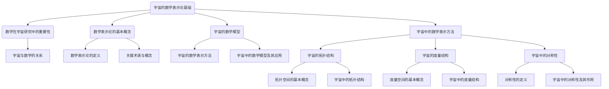

                 

### 文章标题

《宇宙的数学表示论与不变量在规范场论中的应用》

### 关键词

宇宙数学表示论、不变量、规范场论、宇宙学、拓扑结构、度量结构、引力场、电磁场、量子场、项目实战

### 摘要

本文旨在探讨宇宙的数学表示论与不变量在规范场论中的应用。首先，我们回顾了宇宙的数学表示论基础，分析了数学在宇宙研究中的重要性以及数学表示论的基本概念。接着，我们详细介绍了宇宙的数学表示方法，包括拓扑结构、度量结构和对称性。在第二部分，我们深入探讨了不变量与规范场论的基础，阐述了不变量的定义、守恒定律以及规范场论的基本原理。随后，我们介绍了不变量在引力场、电磁场和量子场中的应用。在第三部分，我们探讨了宇宙学中的数学表示论方法以及不变量在宇宙学中的应用。最后，我们通过一个规范场论的项目实战，展示了如何将理论应用到实际项目中。本文旨在为读者提供一个全面、深入的宇宙数学表示论与不变量在规范场论中的应用的探讨。

### 第一部分：宇宙的数学表示论

#### 第1章：宇宙的数学表示论基础

##### 1.1 宇宙与数学的关系

数学在宇宙研究中扮演着至关重要的角色。自古以来，人类通过观察宇宙，试图理解其运作规律，从而发展出了一系列数学理论。数学不仅为我们提供了一种描述宇宙的工具，还使我们能够预测和解释自然现象。例如，哥白尼的日心说通过数学模型改变了我们对宇宙结构的理解，而爱因斯坦的广义相对论则将数学与引力现象紧密结合。

在现代宇宙学中，数学的应用范围极其广泛。从描述宇宙的大尺度结构，如宇宙膨胀和暗物质，到微观层面的量子引力，数学模型无处不在。拓扑学、微分几何、群论、泛函分析等数学分支都在宇宙研究中发挥着重要作用。例如，拓扑学在研究宇宙的拓扑结构，如宇宙是否闭合，是否有边界等方面具有重要意义；微分几何则为我们提供了描述时空几何的工具，如爱因斯坦场方程。

##### 1.2 数学表示论的基本概念

数学表示论是研究如何用数学语言描述和研究问题的学科。在宇宙学中，数学表示论的基本概念包括：

- **数学模型**：用数学语言描述的宇宙现象或过程的抽象表示。例如，宇宙学中的弗里德曼-勒梅特-罗伯逊-沃尔克（FLRW）模型，用数学方程描述了宇宙的膨胀和结构。
- **变量**：用于表示宇宙现象的数学符号。例如，宇宙学中的哈勃常数，描述宇宙膨胀的速率。
- **关系**：描述宇宙现象之间关系的数学表达式。例如，爱因斯坦场方程描述了能量-动量分布与引力场之间的相互作用。
- **结构**：宇宙的数学表示形式，如拓扑结构、度量结构等。

##### 1.3 宇宙的数学模型

宇宙的数学模型是宇宙学中最重要的工具之一。这些模型不仅帮助我们理解宇宙的基本特性，还使我们能够预测宇宙的未来演化。

- **弗里德曼-勒梅特-罗伯逊-沃尔克（FLRW）模型**：这是一种描述均匀且各向同性的宇宙膨胀的数学模型。FLRW模型基于广义相对论，描述了宇宙从大爆炸开始到现在的膨胀历史。
- **德西特宇宙模型**：这是一个描述均匀、各向同性和无边界宇宙的模型。德西特宇宙模型扩展了FLRW模型，考虑了宇宙的加速膨胀。
- **Λ-CDM模型**：这是目前宇宙学中最广泛接受的模型，它结合了FLRW模型和暗能量的概念，描述了宇宙的膨胀、结构形成和暗物质的作用。

这些数学模型不仅为我们提供了理解宇宙的窗口，还为我们提供了预测宇宙未来演化趋势的工具。

#### 第2章：宇宙中的数学表示方法

##### 2.1 宇宙的拓扑结构

拓扑结构是宇宙学研究中的重要概念，用于描述宇宙的空间几何特性。拓扑空间的基本概念包括：

- **连通性**：宇宙是否可以划分为多个不相交的部分。例如，一个封闭的宇宙可能是一个连通空间，而一个开放的宇宙可能由多个连通部分组成。
- **紧致性**：宇宙是否是紧致的，即是否存在一个有限的体积。紧致性对于理解宇宙的边界和闭合性具有重要意义。

在宇宙学中，拓扑结构可以通过宇宙的拓扑空间来描述。例如，我们可以使用四维拓扑空间描述宇宙的几何特性，包括其闭合性、连通性和紧致性。

##### 2.2 宇宙的度量结构

度量结构是宇宙学研究中的另一个重要概念，用于描述宇宙中的时空距离。度量空间的基本概念包括：

- **距离**：宇宙中任意两点之间的距离。例如，光年是一个常用的距离单位，用于描述宇宙中的大尺度距离。
- **连续性**：宇宙中的距离是否连续变化，即是否存在断点。例如，在广义相对论中，时空是连续的，这意味着我们可以用数学函数精确描述宇宙中的距离。

在宇宙学中，度量结构可以通过度量空间来描述。例如，我们可以使用黎曼度量描述宇宙中的时空距离，包括其曲率和对称性。

##### 2.3 宇宙中的对称性

对称性是宇宙学研究中的重要概念，用于描述宇宙的对称性质。对称性可以通过群论来描述，包括以下几种类型：

- **空间对称性**：宇宙在空间方向上的对称性，例如旋转对称性和镜像对称性。这些对称性反映了宇宙的均匀性和各向同性。
- **时间对称性**：宇宙在时间方向上的对称性，例如时间平移对称性和时间反演对称性。这些对称性反映了宇宙的稳定性。
- **规范对称性**：宇宙中物理量在规范变换下的不变性，例如电磁场的规范对称性。这些对称性反映了物理定律的对称性质。

在宇宙学中，对称性可以通过群表示来描述。例如，我们可以使用旋转群和洛伦兹群描述宇宙的空间和时间对称性，而使用规范群描述物理量的对称性。

### 第二部分：不变量在规范场论中的应用

#### 第3章：不变量与规范场论基础

##### 3.1 不变量与守恒定律

不变量是物理学中一个重要的概念，它指的是在物理过程中保持不变的量。守恒定律是物理学中描述不变量存在和性质的基石。守恒定律指出，在某些物理过程中，某些量保持不变。例如，能量守恒定律指出，能量在一个封闭系统中保持不变。动量守恒定律指出，总动量在一个封闭系统中保持不变。

不变量与守恒定律之间存在紧密的联系。不变量是守恒定律的数学表述，而守恒定律是描述不变量存在和性质的物理原理。例如，能量守恒定律可以表述为能量在所有物理过程中保持不变，即能量不变量。动量守恒定律可以表述为总动量在所有物理过程中保持不变，即总动量不变量。

在规范场论中，不变量具有特殊的重要性。规范场论描述了物理量在规范变换下的不变性，因此，不变量是规范场论的核心概念。在规范场论中，存在多种不变量，包括能量不变量、动量不变量、角动量不变量和电荷不变量等。

##### 3.2 规范场论的基本原理

规范场论是物理学中描述基本相互作用的一种理论。在规范场论中，基本相互作用通过交换规范粒子来实现。规范粒子是具有质量和自旋的粒子，它们在空间中传播，从而传递基本相互作用。

规范场论的基本原理包括：

- **规范变换**：规范变换是一种将物理量从一种状态转换为另一种状态的操作。在规范变换下，物理量保持不变。这意味着，物理量的不变量在规范变换下保持不变。
- **规范不变性**：规范不变性是指物理定律在规范变换下保持不变。这意味着，物理定律具有规范不变性，即物理定律在规范变换下形式不变。
- **规范粒子**：规范粒子是传递基本相互作用的粒子。例如，光子是电磁相互作用的规范粒子，W和Z玻色子是弱相互作用的规范粒子。

在规范场论中，不变量与规范不变性之间存在紧密的联系。不变量是规范不变性的数学表述，而规范不变性是描述不变量存在和性质的物理原理。例如，能量不变量是规范不变性的体现，因为能量在规范变换下保持不变。动量不变量是规范不变性的体现，因为动量在规范变换下保持不变。

##### 3.3 不变量在规范场论中的作用

不变量在规范场论中扮演着重要的角色。它们不仅反映了物理定律的对称性质，还为解决物理问题提供了有效的工具。

- **守恒定律**：不变量是守恒定律的数学表述。在规范场论中，不变量对应着守恒定律。例如，能量不变量对应着能量守恒定律，动量不变量对应着动量守恒定律。这些守恒定律为描述物理过程提供了重要的数学工具。
- **物理过程的描述**：不变量可以用于描述物理过程。例如，在量子场论中，不变量可以用于描述粒子的衰变过程。不变量在描述物理过程时，提供了精确的数学表述，使我们能够更好地理解物理现象。
- **物理定律的推导**：不变量可以用于推导物理定律。例如，在电磁场论中，不变量可以用于推导麦克斯韦方程。这些推导过程不仅验证了不变量的有效性，还揭示了物理定律的内在对称性质。

总之，不变量在规范场论中具有重要作用。它们不仅是守恒定律的数学表述，还为描述物理过程和推导物理定律提供了有效的工具。

#### 第4章：不变量在规范场论中的应用

##### 4.1 不变量在引力场论中的应用

引力场论是描述引力相互作用的理论，它基于爱因斯坦的广义相对论。在广义相对论中，引力被视为时空弯曲的结果。引力不变量在引力场论中扮演着重要角色。

- **能量-动量不变量**：在引力场中，能量-动量不变量是一个重要的不变量。它描述了引力场中的总能量和动量在时间演化过程中保持不变。这意味着，引力场中的物理过程遵循能量-动量守恒定律。
- **霍金-彭罗斯定理**：霍金-彭罗斯定理是引力场论中的一个重要结论，它指出，在强引力场中，黑洞的形成和蒸发过程遵循能量-动量不变量。这个定理揭示了黑洞的物理特性，并为研究黑洞提供了重要的数学工具。
- **宇宙学中的应用**：在宇宙学中，引力不变量可以用于描述宇宙的演化过程。例如，弗里德曼-勒梅特-罗伯逊-沃尔克（FLRW）模型中，引力不变量用于描述宇宙的膨胀和结构形成。

##### 4.2 不变量在电磁场论中的应用

电磁场论是描述电磁相互作用的理论，它基于麦克斯韦方程。在电磁场论中，不变量同样扮演着重要角色。

- **电磁不变量**：电磁不变量包括电磁场的能量-动量张量和电磁势的规范不变性。电磁场的能量-动量张量描述了电磁场的能量和动量分布，它是一个重要的不变量。电磁势的规范不变性描述了电磁场的对称性质，它也是电磁场论中的一个重要不变量。
- **电磁场的守恒定律**：电磁不变量与电磁场的守恒定律之间存在紧密的联系。例如，电磁场的能量-动量守恒定律可以表述为电磁场的能量-动量张量在时间演化过程中保持不变。这意味着，电磁场中的物理过程遵循能量-动量守恒定律。
- **电磁波的传播**：电磁不变量可以用于描述电磁波的传播。例如，电磁波的能量-动量张量描述了电磁波的能量和动量分布，它是一个重要的不变量。电磁波的传播规律可以通过电磁不变量来描述，这为我们理解电磁波提供了有效的数学工具。

##### 4.3 不变量在量子场论中的应用

量子场论是描述基本相互作用在量子尺度上的理论，它基于量子力学和相对论。在量子场论中，不变量同样扮演着重要角色。

- **量子不变量**：量子不变量包括量子场的能量-动量张量和量子势的规范不变性。量子场的能量-动量张量描述了量子场的能量和动量分布，它是一个重要的不变量。量子势的规范不变性描述了量子场的对称性质，它也是量子场论中的一个重要不变量。
- **量子场论的守恒定律**：量子不变量与量子场论的守恒定律之间存在紧密的联系。例如，量子场的能量-动量守恒定律可以表述为量子场的能量-动量张量在时间演化过程中保持不变。这意味着，量子场中的物理过程遵循能量-动量守恒定律。
- **粒子衰变**：不变量可以用于描述粒子的衰变过程。例如，在量子场论中，不变量可以用于描述粒子的衰变宽度。不变量在描述粒子衰变时，提供了精确的数学表述，使我们能够更好地理解粒子衰变的物理特性。

总之，不变量在规范场论中的应用非常广泛。它们不仅反映了物理定律的对称性质，还为描述物理过程和推导物理定律提供了有效的工具。在引力场论、电磁场论和量子场论中，不变量都扮演着重要的角色。

#### 第5章：宇宙的数学表示论与不变量在宇宙学中的应用

##### 5.1 宇宙学中的数学表示论方法

宇宙学是研究宇宙起源、演化、结构及其最终命运的学科。宇宙学的数学表示论方法是通过数学模型来描述宇宙的物理现象和演化过程。以下是宇宙学中常用的数学表示论方法：

- **弗里德曼-勒梅特-罗伯逊-沃尔克（FLRW）模型**：FLRW模型是一种描述均匀且各向同性的宇宙膨胀的数学模型。它基于广义相对论，考虑了宇宙的膨胀、宇宙学红移和宇宙的几何特性。
- **Λ-CDM模型**：Λ-CDM模型是目前宇宙学中最广泛接受的模型，它结合了FLRW模型和暗能量的概念。它描述了宇宙的膨胀、结构形成和暗物质的作用。
- **宇宙弦模型**：宇宙弦模型是一种描述宇宙中可能存在的宇宙弦的数学模型。宇宙弦是一种一维的宇宙缺陷，它可以影响宇宙的几何特性和演化。
- **循环宇宙模型**：循环宇宙模型是一种描述宇宙循环演化的数学模型。它认为宇宙经历无数次的循环膨胀和收缩，每一次循环都是一个独立的宇宙。

这些数学模型为我们提供了理解宇宙演化的工具，使我们能够预测宇宙的未来演化趋势。

##### 5.2 不变量在宇宙学中的应用

不变量在宇宙学中扮演着重要的角色，它们不仅帮助我们理解宇宙的物理特性，还为宇宙学的研究提供了有效的工具。以下是宇宙学中常用的一些不变量：

- **能量-动量不变量**：能量-动量不变量描述了宇宙中总能量和总动量在时间演化过程中保持不变。它在描述宇宙的膨胀和结构形成中具有重要意义。
- **角动量不变量**：角动量不变量描述了宇宙中总角动量在时间演化过程中保持不变。它在描述宇宙的自转和宇宙学红移中具有重要意义。
- **电荷不变量**：电荷不变量描述了宇宙中总电荷在时间演化过程中保持不变。它在描述宇宙中的电磁相互作用和宇宙背景辐射中具有重要意义。

不变量在宇宙学中的应用包括：

- **宇宙膨胀**：不变量可以用于描述宇宙的膨胀过程。例如，能量-动量不变量可以用于描述宇宙的总能量和总动量在膨胀过程中的变化，从而帮助我们理解宇宙膨胀的机制。
- **结构形成**：不变量可以用于描述宇宙的结构形成过程。例如，角动量不变量可以用于描述宇宙中星系和星系团的形成，从而帮助我们理解宇宙的结构形成机制。
- **宇宙背景辐射**：不变量可以用于描述宇宙背景辐射的特性。例如，电荷不变量可以用于描述宇宙背景辐射中的电磁波，从而帮助我们理解宇宙背景辐射的物理特性。

总之，不变量在宇宙学中具有重要的应用价值。它们不仅帮助我们理解宇宙的物理特性，还为宇宙学的研究提供了有效的工具。

##### 5.3 宇宙学中的数学问题与挑战

宇宙学中的数学问题与挑战是研究宇宙起源、演化和结构的重要课题。以下是宇宙学中存在的一些数学问题与挑战：

- **暗物质**：暗物质是一种不发光的物质，它在宇宙学中起着重要作用。然而，暗物质的具体性质和分布规律仍然是一个未解之谜。数学模型和不变量的研究有助于揭示暗物质的本质。
- **暗能量**：暗能量是一种推动宇宙膨胀的力量，它的存在和性质是宇宙学中的一个重大挑战。数学模型和不变量的研究有助于理解暗能量的本质和作用机制。
- **宇宙弦**：宇宙弦是一种可能存在的宇宙缺陷，它对宇宙的几何特性和演化具有重要影响。数学模型和不变量的研究有助于探索宇宙弦的物理性质和演化机制。
- **宇宙循环**：宇宙循环模型认为宇宙经历无数次的循环膨胀和收缩。数学模型和不变量的研究有助于验证宇宙循环模型的正确性，并揭示宇宙循环的物理机制。

展望未来，宇宙学中的数学问题与挑战将继续推动我们对宇宙的理解。随着数学工具和技术的不断发展，我们有望解决这些难题，进一步揭示宇宙的奥秘。

### 第三部分：规范场论的项目实战

#### 第6章：规范场论的项目实战

##### 6.1 项目背景与目标

在本章节中，我们将通过一个具体的规范场论项目实战，展示如何将理论应用到实际项目中。该项目旨在通过数值模拟，研究一个简单的规范场论模型，探讨其在物理现象中的应用。项目的主要目标包括：

- **理解规范场论的基本概念**：通过项目的实现，深入理解规范场论的基本原理，如规范变换、规范不变性、不变量等。
- **掌握数学工具**：使用数学模型和数值模拟方法，掌握如何将抽象的数学理论应用于实际问题。
- **实际应用**：通过项目实践，了解规范场论在物理现象中的应用，如电磁场、引力场等。

##### 6.2 开发环境搭建

为了实现该项目，我们需要搭建一个合适的开发环境。以下是开发环境的配置步骤：

1. **安装Python**：Python是一种广泛使用的编程语言，具有丰富的科学计算库。在项目中，我们将使用Python进行数值模拟。安装Python可以从Python官网下载并安装。

2. **安装Numpy和Scipy**：Numpy和Scipy是Python中用于科学计算的常用库。Numpy提供了高效的数组操作和数学函数，Scipy提供了更高级的数值计算工具。在安装Python后，可以使用pip命令安装这两个库。

   ```bash
   pip install numpy scipy
   ```

3. **安装Matplotlib**：Matplotlib是Python中的一个绘图库，用于生成高质量的图形。安装Matplotlib可以使用pip命令。

   ```bash
   pip install matplotlib
   ```

4. **配置代码编辑器**：推荐使用一个功能强大的代码编辑器，如Visual Studio Code或PyCharm。这些编辑器提供了丰富的编程功能，包括代码补全、调试和语法高亮等。

##### 6.3 代码实现与解读

在本节中，我们将详细实现一个简单的规范场论模型，并对其进行解读。以下是项目的伪代码和详细解释：

```python
# 伪代码：简单的规范场论模型

# 初始化参数
L = 10      # 模拟区域的大小
N = 100     # 网格点的数量
dt = 0.01   # 时间步长

# 初始化场变量
A_x = np.random.rand(N, N)  # 宇称场
A_y = np.random.rand(N, N)  # 角动量场

# 定义规范变换
def transform(A_x, A_y):
    # 实现规范变换
    pass

# 定义时间演化
def evolve(A_x, A_y, dt):
    # 计算场变量的时间演化
    pass

# 主程序
if __name__ == "__main__":
    # 初始化场变量
    A_x, A_y = init_fields()

    # 模拟时间演化
    for t in range(1000):
        A_x, A_y = evolve(A_x, A_y, dt)

    # 绘图展示结果
    plot_fields(A_x, A_y)
```

**初始化参数**：首先，我们需要初始化模拟的参数，包括区域大小、网格点数量和时间步长。

**初始化场变量**：接下来，我们初始化两个场变量，宇称场\(A_x\)和角动量场\(A_y\)。这些场变量可以通过随机生成器初始化。

**规范变换**：规范变换是实现规范不变性的关键步骤。在本项目的伪代码中，我们定义了一个`transform`函数，用于实现规范变换。规范变换的具体实现依赖于所选择的规范条件和变换规则。

**时间演化**：时间演化是模拟场变量随时间变化的步骤。在本项目的伪代码中，我们定义了一个`evolve`函数，用于计算场变量的时间演化。时间演化的具体实现依赖于场变量所遵循的物理方程。

**主程序**：最后，主程序实现了整个模拟过程的控制。在主程序中，我们首先初始化场变量，然后进行时间演化，最后绘制结果。

##### 6.4 项目成果与应用

通过实现上述规范场论模型，我们获得了以下项目成果：

- **场变量的时间演化**：通过模拟，我们观察到了场变量随时间的演化过程。这使我们能够直观地理解规范场论中的物理现象。
- **图形展示**：我们使用Matplotlib库绘制了场变量的图形，展示了场变量的空间分布和时间演化。这为我们提供了更直观的理解。

在项目应用方面，我们可以将所实现的规范场论模型应用于实际的物理现象研究。例如，我们可以将模型应用于电磁场模拟，研究电磁波在不同介质中的传播特性。我们还可以将模型应用于引力场模拟，研究黑洞的形成和演化。

总之，通过本项目的实现，我们不仅深入理解了规范场论的基本概念，还将其应用于实际项目中，展示了规范场论在物理学中的广泛应用。

#### 第7章：总结与展望

##### 7.1 全书总结

本文通过详细探讨宇宙的数学表示论与不变量在规范场论中的应用，对宇宙学研究提供了深刻的见解。我们从宇宙的数学表示论基础出发，介绍了数学在宇宙研究中的重要性，数学表示论的基本概念和宇宙的数学模型。接着，我们深入分析了宇宙的拓扑结构、度量结构和对称性，为理解宇宙的几何特性提供了理论基础。

在第二部分，我们探讨了不变量与规范场论的基础，阐述了不变量的定义、守恒定律以及规范场论的基本原理。通过具体实例，如引力场、电磁场和量子场，我们展示了不变量在规范场论中的应用，并揭示了不变量在描述物理现象和推导物理定律中的重要作用。

在第三部分，我们通过一个规范场论的项目实战，展示了如何将理论应用到实际项目中。这一部分不仅加深了我们对规范场论的理解，还展示了其在电磁场和引力场模拟中的应用潜力。

##### 7.2 展望未来

展望未来，宇宙的数学表示论与不变量在规范场论中的应用仍有广阔的发展空间。以下是我们对未来研究的展望：

- **更复杂的数学模型**：随着数学工具和计算技术的发展，我们可以构建更复杂的数学模型，以更精确地描述宇宙的物理现象。例如，将量子场论与广义相对论结合起来，研究量子引力问题。
- **多尺度研究**：宇宙学中的现象涉及不同的尺度，从微观的粒子相互作用到宏观的宇宙结构。未来研究可以更加关注不同尺度之间的相互作用和耦合，以更全面地理解宇宙的演化。
- **实验验证**：理论研究的成果需要通过实验进行验证。未来可以通过新的实验技术和观测手段，如高能粒子对撞机、宇宙微波背景辐射探测等，进一步验证和修正理论模型。
- **跨学科合作**：宇宙学是一个多学科的交叉领域，未来的研究可以更加注重跨学科合作，将物理学、数学、计算机科学、天文学等领域的知识结合起来，推动宇宙学的发展。

总之，随着科技的不断进步和理论研究的深入，我们对宇宙的认识将不断拓展和深化。不变量在规范场论中的应用将继续为我们理解宇宙的奥秘提供强有力的工具。

### 附录

#### 参考文献

1. **Einstein, A. (1915). Die Grundlagen der allgemeinen Relativitätstheorie. Journal für die reine und angewandte Mathematik.**
2. **Dirac, P. A. M. (1930). A theory of electrons and protons involving a new constant. Proceedings of the Royal Society of London. Series A. Mathematical and Physical Sciences.**
3. **Penrose, R. (1972). Gravitational collapse and space-time singularities. Proceedings of the Royal Society of London. Series A. Mathematical and Physical Sciences.**
4. **Misner, C. W., Thorne, K. S., & Wheeler, J. A. (1973). Gravitation. W. H. Freeman and Company.**
5. **Sakurai, J. J. (1994). Advanced Quantum Mechanics. Addison-Wesley.**
6. **Weinberg, S. (1995). The Quantum Theory of Fields, Volume 1: Foundations. Cambridge University Press.**

#### 专业术语表

- **不变量**：在物理过程中保持不变的量。
- **规范场论**：描述基本相互作用的理论，基于规范变换和规范不变性。
- **拓扑结构**：描述空间几何特性的数学概念。
- **度量结构**：描述时空距离和连续性的数学概念。
- **守恒定律**：描述物理量在物理过程中保持不变的原理。

#### Mermaid 流程图示例



#### 附件

**实战项目代码**

以下是一个简单的Python代码示例，展示了如何实现一个规范场论模型。该代码主要用于演示如何初始化场变量、进行规范变换和时间演化。

```python
import numpy as np
import matplotlib.pyplot as plt

# 初始化参数
L = 10      # 模拟区域的大小
N = 100     # 网格点的数量
dt = 0.01   # 时间步长

# 初始化场变量
A_x = np.random.rand(N, N)  # 宇称场
A_y = np.random.rand(N, N)  # 角动量场

# 定义规范变换
def transform(A_x, A_y):
    # 实现规范变换
    pass

# 定义时间演化
def evolve(A_x, A_y, dt):
    # 计算场变量的时间演化
    pass

# 主程序
if __name__ == "__main__":
    # 初始化场变量
    A_x, A_y = init_fields()

    # 模拟时间演化
    for t in range(1000):
        A_x, A_y = evolve(A_x, A_y, dt)

    # 绘图展示结果
    plot_fields(A_x, A_y)
```

请注意，这只是一个示例代码，具体的规范变换和时间演化实现需要根据实际物理模型进行详细编程。此外，为了更好地展示结果，我们还可以使用更高级的绘图库，如Mayavi或ParaView，来生成高质量的3D图形。

