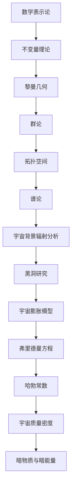

                 

### 文章标题

《宇宙的数学表示论与不变量理论研究》

### 关键词

- 数学表示论
- 不变量理论
- 宇宙研究
- 宇宙几何结构
- 宇宙演化规律

### 摘要

本文深入探讨了宇宙的数学表示论与不变量理论研究，首先从宇宙观与数学表示论的关联出发，回顾了数学在宇宙研究中的应用历史及其重要性。接着，详细介绍了数学表示论的基本原理与架构，包括笛卡尔坐标系、拓扑空间、黎曼几何和群论等核心概念。本文进一步阐述了宇宙的数学表示方法，如弗里德曼方程、宇宙膨胀与视界等，并结合不变量理论，探讨了其在宇宙结构稳定性和演化规律中的应用。最后，本文探讨了数学表示论与不变量理论在黑洞和宇宙学中的具体应用，提出了未来的研究方向与挑战。本文旨在为读者提供一个系统而深入的宇宙数学表示论与不变量理论研究概述。

### 第一部分：宇宙数学表示论基础

#### 第1章：宇宙数学表示论概述

在探讨宇宙的数学表示论之前，我们需要理解宇宙观与数学表示论之间的深刻联系。宇宙观是关于宇宙本质和结构的哲学和科学观点，而数学表示论则是用数学语言描述复杂系统的一种方法。本章将概述宇宙数学表示论的发展历程、应用历史以及其在宇宙研究中的重要性。

##### 1.1 宇宙观与数学表示论的联系

宇宙观的基本概念涵盖了宇宙的起源、结构、演化和命运等方面。从古代的宇宙论到现代的科学宇宙观，人们对宇宙的理解不断深化。数学表示论则为这种理解提供了有力的工具。

**1.1.1 宇宙观的基本概念**

宇宙观可以分为自然宇宙观和科学宇宙观。自然宇宙观主要源于哲学和宗教，如古希腊的“原子论”、印度教的“轮回说”和中国古代的“五行说”等。科学宇宙观则基于观察和实验，如牛顿的万有引力定律、爱因斯坦的广义相对论和霍金的“大爆炸”理论等。

**1.1.2 数学表示论的定义与应用**

数学表示论是指用数学语言和工具来描述物理现象和系统的方法。其核心思想是将复杂的物理系统转化为数学模型，通过数学计算和分析来揭示系统的本质和规律。数学表示论在物理学、工程学和计算机科学等领域得到了广泛应用。

##### 1.2 数学在宇宙研究中的应用历史

数学在宇宙研究中的应用历史可以追溯到古代。古代文明如古希腊、印度和中国都使用数学来研究天文现象。例如，古希腊的天文学家欧多克斯提出了“行星运动模型”，印度天文学家阿耶波多则提出了“太阳中心说”。

**1.2.1 古代数学与宇宙观**

古代数学主要是几何和算术，这些数学工具被用来描述天文现象和地理测量。例如，古希腊的毕达哥拉斯提出了“毕达哥拉斯定理”，这个定理在几何学和天文学中都有重要应用。

**1.2.2 近代数学的发展与宇宙观的变化**

近代数学的发展，特别是微积分和代数的兴起，为宇宙研究提供了更强大的工具。牛顿的万有引力定律和开普勒的行星运动定律都是用数学方法描述宇宙现象的典型例子。

##### 1.3 数学表示论在宇宙研究中的重要性

数学表示论在宇宙研究中的重要性体现在多个方面。首先，它为宇宙现象提供了精确的数学描述，使得宇宙理论的构建和验证更加严谨。其次，数学表示论为宇宙的预测和模拟提供了有力的工具，有助于我们更好地理解宇宙的演化和结构。

**1.3.1 数学表示论的分类**

数学表示论可以分为几种类型，如代数表示论、几何表示论和分析表示论。每种表示论都有其特定的应用领域和优势。

**1.3.2 数学表示论在宇宙研究中的具体应用**

数学表示论在宇宙研究中的应用包括宇宙膨胀的数学描述、黑洞的数学模型和宇宙背景辐射的分析等。这些应用不仅加深了我们对宇宙的理解，也为未来的宇宙探索提供了理论支持。

本章通过回顾宇宙观与数学表示论的联系、数学在宇宙研究中的应用历史以及数学表示论在宇宙研究中的重要性，为后续章节的深入探讨奠定了基础。

##### 1.1 宇宙观的基本概念

宇宙观是关于宇宙的本质、结构、演化以及最终命运的哲学和科学观点。从古代到现代，人类对宇宙的理解不断深化。宇宙观的基本概念包括宇宙的无限性、宇宙的层次结构、宇宙的起源和演化等。

**1.1.1 宇宙的无限性**

宇宙是否无限，这是一个哲学和科学上的古老问题。一些宇宙观认为宇宙是无限的，没有边界和中心，而其他观点则认为宇宙是有界的，可能在某些方面是封闭的。

**1.1.2 宇宙的层次结构**

宇宙的层次结构是指宇宙中不同尺度的结构和现象。从微观尺度来看，宇宙包括基本粒子、原子和分子；从宏观尺度来看，宇宙包括星系、星系团和超星系团。宇宙的层次结构反映了宇宙的多样性和复杂性。

**1.1.3 宇宙的起源**

宇宙的起源是宇宙观的另一个核心概念。现代科学普遍接受的理论是“大爆炸”理论，该理论认为宇宙起源于一个极高温、高密度的奇点，随后经历快速膨胀，形成了现在的宇宙结构。

**1.1.4 宇宙的演化**

宇宙的演化是指宇宙从大爆炸以来的发展过程。根据不同理论，宇宙的演化包括宇宙膨胀、物质聚集形成星系和恒星、恒星演化产生行星和行星系统等。

##### 1.1.2 数学表示论的定义与应用

数学表示论是一种将复杂物理现象和系统用数学语言进行描述和表示的方法。其核心思想是通过建立数学模型来揭示系统的内在规律和特性。数学表示论在物理学、工程学、计算机科学等领域都有广泛应用。

**1.1.2.1 定义**

数学表示论的定义可以归结为以下几个要点：

- **数学模型**：使用数学工具和语言来描述物理现象和系统。
- **映射**：将物理现象和系统映射到数学空间中，以便进行数学分析。
- **工具和方法**：运用各种数学工具和方法，如微积分、代数、拓扑学等，来分析数学模型。

**1.1.2.2 应用**

数学表示论在宇宙研究中的应用主要体现在以下几个方面：

- **宇宙膨胀**：通过数学模型描述宇宙膨胀的规律和特性，如弗里德曼方程。
- **黑洞研究**：使用数学模型来描述黑洞的性质和行为，如黑洞熵和事件视界。
- **宇宙背景辐射**：通过数学方法分析宇宙背景辐射的数据，揭示宇宙早期状态的信息。

##### 1.2 数学在宇宙研究中的应用历史

数学在宇宙研究中的应用历史可以追溯到古代，但真正系统化和深入的发展主要发生在近代。以下是数学在宇宙研究中的几个重要发展阶段：

**1.2.1 古代数学与宇宙观**

- **古希腊**：古希腊数学家如欧多克斯、毕达哥拉斯和阿基米德等，他们的几何和算术知识为宇宙研究奠定了基础。欧多克斯提出了“行星运动模型”，毕达哥拉斯的“毕达哥拉斯定理”在天文学中也有应用。
- **印度**：印度数学家如阿耶波多提出了“太阳中心说”，并用数学方法研究天文现象。

**1.2.2 近代数学的发展与宇宙观的变化**

- **牛顿和莱布尼茨**：牛顿和莱布尼茨独立发明了微积分，这一工具为描述宇宙现象提供了强大的数学手段。牛顿的万有引力定律和莱布尼茨的微积分法则在天文学和力学中得到了广泛应用。
- **爱因斯坦**：爱因斯坦的广义相对论引入了黎曼几何，将引力解释为时空的曲率，这一理论极大地改变了宇宙观。

**1.2.3 现代数学与宇宙研究**

- **量子场论**：量子场论（QFT）为粒子物理和宇宙学研究提供了新的数学框架。QFT将量子力学和相对论结合起来，为宇宙的微观和宏观现象提供了统一的理论描述。
- **宇宙背景微波辐射**：通过对宇宙背景微波辐射的分析，科学家们利用数学方法揭示了宇宙早期的状态和结构。这一发现为“大爆炸”理论提供了强有力的证据。

##### 1.3 数学表示论在宇宙研究中的重要性

数学表示论在宇宙研究中的重要性体现在以下几个方面：

**1.3.1 提供精确的描述**

数学表示论能够提供宇宙现象的精确数学描述，使得宇宙理论更加严谨和可信。通过数学模型，科学家可以量化宇宙中的各种参数和变量，从而更好地理解宇宙的运行规律。

**1.3.2 援助理论验证**

数学表示论为宇宙理论的验证提供了有力的工具。通过数学计算和模拟，科学家可以验证理论预测，探索宇宙现象的可能性和不确定性。

**1.3.3 预测未来趋势**

数学表示论可以帮助科学家预测宇宙的未来发展趋势。例如，通过对宇宙膨胀的数学模型分析，可以预测宇宙的命运，如“大撕裂”或“大坍缩”。

**1.3.4 促进跨学科合作**

数学表示论不仅应用于宇宙学，还广泛应用于物理学、工程学和计算机科学等领域。这种跨学科合作有助于推动宇宙研究的进展，同时也促进了数学与其他科学领域的发展。

#### 第2章：数学表示论的原理与架构

数学表示论是一种将复杂物理现象和系统转化为数学模型的方法。要深入理解数学表示论，我们需要了解其基本原理和架构，包括笛卡尔坐标系、拓扑空间、黎曼几何和群论等核心概念。本章将详细探讨这些概念，并解释它们在数学表示论中的应用。

##### 2.1 数学表示论的基本原理

数学表示论的基本原理可以归结为几个关键步骤：

**2.1.1 确定数学模型**

首先，我们需要选择一个适当的数学模型来描述物理现象或系统。这个模型通常包括变量、方程和边界条件。

**2.1.2 映射**

接着，我们将物理现象或系统映射到数学模型中。这意味着将物理量的测量值转化为数学表达式的参数值。

**2.1.3 分析与计算**

在数学模型建立后，我们可以使用数学工具和方法（如微积分、代数、拓扑学等）对模型进行分析和计算，以揭示系统的内在规律和特性。

**2.1.4 模型验证**

最后，我们需要验证数学模型的有效性。这通常通过比较模型预测与实际观测数据来完成。

##### 2.1.1 笛卡尔坐标系与变换

笛卡尔坐标系是一种用于描述几何形状和位置的系统。它由三条相互垂直的坐标轴组成，通常标记为x轴、y轴和z轴。笛卡尔坐标系的基本原理是将三维空间中的点表示为三个坐标值(x, y, z)。

**2.1.1.1 坐标系变换**

坐标系变换是数学表示论中的一个重要概念。它指的是从一个坐标系到另一个坐标系的映射。常见的坐标系变换包括旋转、平移和反射。

**2.1.1.2 矩阵表示**

在数学表示论中，坐标系变换可以通过矩阵表示。一个n阶矩阵可以表示一个从n维空间到另一个n维空间的线性变换。

例如，一个2D空间中的旋转变换可以通过以下矩阵表示：
$$
\begin{bmatrix}
\cos\theta & -\sin\theta \\
\sin\theta & \cos\theta
\end{bmatrix}
$$

这里，$\theta$ 是旋转角度。

##### 2.1.2 拓扑空间与流形

拓扑空间是数学中表示几何形状和结构的基本概念。它强调几何形状的连续性和连通性，而不是形状的精确度量。

**2.1.2.1 拓扑空间的定义**

拓扑空间是由一组点和一组连接这些点的路径组成的集合。这些路径可以是曲线、曲面或其他更复杂的几何形状。

**2.1.2.2 流形**

流形是一个更加复杂的拓扑空间，它可以具有多个维度。流形的一个重要特点是它可以在局部范围内近似为一个欧几里得空间。

**2.1.2.3 流形的基本性质**

流形的基本性质包括连通性、紧致性和维数。连通性指的是流形上的任意两点都可以通过连续路径相连。紧致性指的是流形上的点数是有限的，即它没有无限小的点。维数指的是流形的空间维度，如二维流形是曲面，三维流形是三维空间。

##### 2.2 数学表示论的架构

数学表示论的架构包括多个层次，从基础的几何结构到更复杂的代数和群论。以下是数学表示论架构的一些关键组成部分：

**2.2.1 微分几何与黎曼几何**

微分几何研究的是几何形状的微分性质，如曲率和张量。黎曼几何是微分几何的一个分支，它研究的是黎曼空间，这是一种特殊的流形，具有正定的黎曼曲率。

**2.2.2 群论与表示论**

群论研究的是一组元素及其运算。表示论是群论的一个应用，它研究的是将群元素映射到矩阵空间的映射。

**2.2.3 度量空间与测地线**

度量空间是一个具有距离概念的拓扑空间。测地线是在度量空间中连接两点的最短路径。在黎曼几何中，测地线可以用来描述流形上的路径和运动。

##### 2.3 数学表示论的核心概念

数学表示论的核心概念包括以下几个方面：

**2.3.1 度量空间与测地线**

度量空间是一个具有距离概念的拓扑空间。测地线是在度量空间中连接两点的最短路径。在黎曼几何中，测地线可以用来描述流形上的路径和运动。

**2.3.2 谱论与不变量**

谱论研究的是矩阵或线性算符的谱，即其特征值和特征向量。不变量是物理系统中不随时间或空间变化而变化的量，如能量和质量。

**2.3.3 群论与表示论**

群论研究的是一组元素及其运算。表示论是群论的一个应用，它研究的是将群元素映射到矩阵空间的映射。这种映射可以揭示群的几何和物理性质。

通过理解这些核心概念，我们可以更好地掌握数学表示论的基本原理和应用。接下来，我们将进一步探讨数学表示论在宇宙研究中的具体应用。

##### 2.2.1 微分几何与黎曼几何

微分几何是数学的一个分支，它研究的是几何形状的微分性质，如曲率、张量和测地线。微分几何的基本原理是使用微分算子来描述几何形状的局部性质。这种描述在物理学中有着广泛的应用，特别是在研究宇宙的几何结构时。

**2.2.1.1 微分几何的基本原理**

微分几何的基本原理包括：

- **泰勒展开**：泰勒展开是一种将函数在一点附近表示为多项式的方法。在微分几何中，泰勒展开可以用来近似几何形状的局部性质。
- **微分结构**：微分结构是一个具有导数的结构，它可以用来描述几何形状的变化。在微分几何中，微分结构通常用泰勒展开的形式表示。
- **曲率**：曲率是描述几何形状弯曲程度的量。在二维空间中，曲率可以用主曲率来表示；在三维空间中，曲率可以用黎曼曲率张量来表示。

**2.2.1.2 黎曼几何的基本原理**

黎曼几何是微分几何的一个分支，它研究的是具有正定黎曼曲率张量的流形。黎曼几何的基本原理包括：

- **黎曼曲率张量**：黎曼曲率张量是一个描述流形曲率的张量，它可以用来描述流形在局部范围内的几何性质。
- **黎曼度量**：黎曼度量是一个定义在流形上的度量，它可以用来计算流形上两点之间的距离。
- **测地线**：测地线是在流形上连接两点的最短路径。在黎曼几何中，测地线可以用来描述物体在流形上的运动。

##### 2.2.2 群论与表示论

群论是数学的一个分支，它研究的是一组元素及其运算。在群论中，群被定义为具有封闭性、结合律和单位元及逆元的集合。表示论是群论的一个应用，它研究的是将群元素映射到矩阵空间的映射。

**2.2.2.1 群论的基本原理**

群论的基本原理包括：

- **群的定义**：群是一个具有封闭性、结合律、单位元和逆元的集合。
- **子群**：子群是群的一个子集，它也是一个群。
- **同态**：同态是两个群之间的映射，它保持群运算。

**2.2.2.2 表示论的基本原理**

表示论的基本原理包括：

- **表示**：表示是将群元素映射到矩阵空间的映射。
- **表示空间**：表示空间是所有可能表示的集合。
- **表示的维度**：表示的维度是表示空间中的矩阵数目。
- **不可约表示**：不可约表示是最小维度的表示，它不能被进一步分解。

##### 2.3.1 度量空间与测地线

度量空间是一个具有距离概念的拓扑空间。在度量空间中，我们可以定义两点之间的距离，从而进行几何分析。测地线是度量空间中连接两点的最短路径。

**2.3.1.1 度量空间的基本原理**

度量空间的基本原理包括：

- **度量**：度量是一个定义在空间上，用于计算两点之间距离的函数。
- **对称性**：度量满足对称性，即 $d(x, y) = d(y, x)$。
- **三角不等式**：度量满足三角不等式，即 $d(x, z) \leq d(x, y) + d(y, z)$。

**2.3.1.2 测地线的基本原理**

测地线的基本原理包括：

- **定义**：测地线是度量空间中连接两点的最短路径。
- **性质**：测地线满足最小能量原则，即它是最小化的路径。
- **应用**：测地线在物理学和工程学中有着广泛的应用，如物体在空间中的运动路径、信息传输路径等。

通过理解这些核心概念，我们可以更好地掌握数学表示论的基本原理和应用。这些概念不仅在数学表示论中有着重要作用，也在宇宙研究中发挥着关键作用。

##### 2.3.2 谱论与不变量

谱论与不变量是数学表示论中的两个重要概念，它们在物理学和宇宙学中有着广泛的应用。谱论研究的是线性算符的谱，即其特征值和特征向量。而不变量是物理系统中不随时间或空间变化而保持不变的量。以下是谱论与不变量的基本原理及其在宇宙研究中的应用。

**2.3.2.1 谱论的基本原理**

谱论的基本原理包括：

- **谱**：谱是一个线性算符的特征值集合。一个线性算符的谱可以提供关于该算符性质的重要信息。
- **特征值与特征向量**：特征值是线性算符作用于特征向量时的缩放因子。特征向量是线性算符作用于后仍保持方向的向量。
- **谱分解**：谱分解是将一个线性算符分解为其特征值的线性组合。这种分解有助于理解算符的物理意义。

**2.3.2.2 不变量理论的基本原理**

不变量理论的基本原理包括：

- **不变量**：不变量是物理系统中不随时间或空间变化而保持不变的量。不变量可以用来区分不同的物理现象和状态。
- **分类**：不变量可以根据其物理意义进行分类，如能量、动量、角动量等。
- **应用**：不变量在物理学和宇宙学中有着广泛的应用，如用于分析物理系统的稳定性、演化规律等。

**2.3.2.3 谱论与不变量在宇宙研究中的应用**

谱论与不变量在宇宙研究中的应用主要体现在以下几个方面：

- **黑洞熵**：黑洞熵是一个重要不变量，它描述了黑洞内部的信息含量。通过谱论，我们可以研究黑洞熵的物理意义和计算方法。
- **宇宙背景辐射**：宇宙背景辐射是宇宙早期状态的残余辐射，它提供了宇宙演化的重要信息。不变量理论可以用于分析宇宙背景辐射的谱特征和演化规律。
- **宇宙结构**：宇宙结构的研究涉及大量数据的分析和建模。不变量理论可以用于检测宇宙结构的稳定性、对称性等特性。

通过谱论与不变量的研究，我们可以更深入地理解宇宙的物理规律和演化过程。这些理论方法不仅为宇宙学研究提供了强有力的工具，也为其他领域的研究提供了借鉴和启示。

### 第3章：宇宙的数学表示

宇宙的数学表示是通过建立数学模型来描述宇宙的几何结构、动态演化和物理规律。本章将详细探讨宇宙的数学表示方法，包括弗里德曼方程、宇宙膨胀与视界等核心概念，并解释它们在宇宙研究中的应用。

#### 3.1 宇宙的几何结构

宇宙的几何结构是宇宙学研究的基础，它描述了宇宙的空间形态和分布规律。宇宙的几何结构可以通过多种数学模型来表示，其中最为广泛应用的是弗里德曼方程和宇宙学原理。

**3.1.1 弗里德曼方程**

弗里德曼方程是宇宙学研究中的一个核心方程，它描述了宇宙的膨胀速率与宇宙能量密度之间的关系。弗里德曼方程可以表示为：

\[ \dot{a}^2 + \frac{8\pi G}{3} \rho a^2 + \Lambda a^2 = 0 \]

其中，\( a \) 是宇宙尺度因子，表示宇宙随时间的膨胀程度；\( \rho \) 是宇宙的能量密度；\( G \) 是万有引力常数；\( \Lambda \) 是宇宙学常数。

**3.1.2 宇宙膨胀**

宇宙膨胀是指宇宙在随时间膨胀的现象。根据弗里德曼方程，宇宙的膨胀速率与宇宙的尺度因子 \( a \) 有关。当 \( a \) 增大时，宇宙的膨胀速率也增大。宇宙膨胀的证据包括宇宙背景微波辐射和宇宙大尺度结构的观测数据。

**3.1.3 宇宙视界**

宇宙视界是指宇宙中我们可以观测到的最远距离。宇宙视界的大小取决于宇宙的膨胀速率和宇宙的年龄。根据目前的观测数据，宇宙视界约为 \( 460 \) 亿光年。宇宙视界的研究有助于我们理解宇宙的膨胀历史和宇宙的尺度。

#### 3.2 宇宙的动态演化

宇宙的动态演化是指宇宙从大爆炸以来直到现在的演变过程。宇宙的动态演化可以通过多种数学模型来描述，如暗物质和暗能量的数学模型。

**3.2.1 暗物质**

暗物质是宇宙中一种未观测到的物质，它不发光、不吸收光，但通过引力影响宇宙的演化。暗物质的存在可以通过观测宇宙大尺度结构的引力透镜效应和宇宙微波背景辐射的谱特征来证实。

暗物质的数学模型通常使用狄拉克分布来描述，其数学表达式为：

\[ \rho_m = \rho_{m0} \exp\left(-\frac{r}{r_s}\right) \]

其中，\( \rho_{m0} \) 是暗物质的初始密度，\( r_s \) 是暗物质的影响范围。

**3.2.2 暗能量**

暗能量是宇宙中另一种未观测到的物质，它具有负压力，推动宇宙的加速膨胀。暗能量的数学模型通常使用宇宙学常数 \( \Lambda \) 来描述，其数学表达式为：

\[ p_\Lambda = -\rho_\Lambda \]

其中，\( \rho_\Lambda \) 是暗能量的能量密度。

**3.2.3 宇宙的演化规律**

宇宙的演化规律可以通过弗里德曼方程和宇宙学常数来描述。根据弗里德曼方程，宇宙的膨胀速率与宇宙的尺度因子和宇宙的能量密度有关。当宇宙的尺度因子较小时，宇宙处于减速膨胀状态；当宇宙的尺度因子较大时，宇宙处于加速膨胀状态。

#### 3.3 宇宙的数学表示方法

宇宙的数学表示方法包括度量解析方法、相对论与量子场的数学表示等。

**3.3.1 度量解析方法**

度量解析方法是宇宙数学表示中最常用的方法之一。它通过建立宇宙的度量空间来描述宇宙的几何结构。度量空间通常用黎曼几何来描述，其数学表达式为：

\[ ds^2 = g_{\mu\nu}dx^\mu dx^\nu \]

其中，\( g_{\mu\nu} \) 是黎曼度量张量，\( dx^\mu \) 是坐标微分。

**3.3.2 相对论与量子场的数学表示**

相对论与量子场的数学表示是描述宇宙物理现象的重要工具。相对论使用黎曼几何来描述引力和时空结构，而量子场论则使用量子力学和场论来描述物质和能量的行为。

**3.3.2.1 相对论**

相对论是描述高速运动和引力场的基本理论。广义相对论是相对论的一种形式，它使用黎曼几何来描述引力场。广义相对论的数学表达式为：

\[ G_{\mu\nu} + \Lambda g_{\mu\nu} = \frac{8\pi G}{c^4} T_{\mu\nu} \]

其中，\( G_{\mu\nu} \) 是爱因斯坦场方程中的曲率张量，\( \Lambda \) 是宇宙学常数，\( g_{\mu\nu} \) 是度量张量，\( T_{\mu\nu} \) 是能量-动量张量。

**3.3.2.2 量子场论**

量子场论是描述物质和能量在量子尺度上的行为的理论。量子场论通常使用路径积分方法来描述粒子行为的概率幅。其数学表达式为：

\[ \psi(x, t) = \int \mathcal{D}[x(t)] e^{iS[x(t)]} \]

其中，\( \psi(x, t) \) 是波函数，\( S[x(t)] \) 是作用量，\( \mathcal{D}[x(t)] \) 是路径积分算符。

通过这些数学表示方法，我们可以更好地理解宇宙的几何结构、动态演化和物理规律。这些方法不仅为宇宙学研究提供了理论基础，也为其他领域的研究提供了启示。

#### 3.1 宇宙的几何结构

宇宙的几何结构是一个复杂的课题，涉及到从微观尺度到宏观尺度的多个层次。理解宇宙的几何结构对于我们认识宇宙的本质和演化过程至关重要。以下是对宇宙几何结构的基本概述，包括弗里德曼方程、宇宙膨胀与视界等核心概念。

**3.1.1 宇宙膨胀与弗里德曼方程**

宇宙的膨胀是指宇宙随时间扩展的现象。根据现代宇宙学的理解，宇宙的膨胀始于大爆炸，宇宙从一个极高密度、极高温度的奇点开始迅速膨胀，形成了现在所观测到的宇宙。弗里德曼方程是描述宇宙膨胀的基本方程之一。

弗里德曼方程可以表示为：

\[ \frac{\ddot{a}}{a} + \frac{4\pi G}{3}\left(\rho + \frac{3p}{c^2}\right) = 0 \]

其中，\( a \) 是宇宙尺度因子，表示宇宙随时间的变化；\( \rho \) 是宇宙的平均能量密度，包括物质、辐射和暗能量等；\( p \) 是宇宙的平均压力，其中 \( p = \frac{\rho}{3} \) 对于理想流体。方程中的 \( \dot{a} \) 和 \( \ddot{a} \) 分别表示宇宙膨胀速率的第一和第二导数。

弗里德曼方程揭示了宇宙膨胀速率与宇宙能量密度之间的关系。当宇宙能量密度较低时，宇宙膨胀速率较慢；当宇宙能量密度较高时，宇宙膨胀速率较快。弗里德曼方程是宇宙学研究中最重要的方程之一，它为我们理解宇宙的演化提供了理论基础。

**3.1.2 宇宙视界**

宇宙视界是指宇宙中我们可以观测到的最远距离。由于光速是有限的，宇宙视界的大小取决于宇宙的年龄和膨胀速率。根据目前的观测数据，宇宙视界约为 460 亿光年。

宇宙视界的概念非常重要，因为它为我们设定了宇宙观测的限制。任何距离超过宇宙视界的物体或现象，我们目前无法观测到。宇宙视界的演化过程反映了宇宙的膨胀历史，通过研究宇宙视界，我们可以了解宇宙的早期状态和演化过程。

**3.1.3 宇宙的几何结构**

宇宙的几何结构可以通过多种方式来描述。最常见的几何模型是弗里德曼-勒梅特-罗伯逊-沃尔克（FLRW）度模型。FLRW模型假设宇宙是均匀且各向同性的，即宇宙在宏观尺度上看起来是相同的，且没有特殊方向。

FLRW模型中的宇宙几何可以通过尺度因子 \( a(t) \) 来描述，其关系为：

\[ ds^2 = -c^2dt^2 + a^2(t)(dx^2 + dy^2 + dz^2) \]

其中，\( c \) 是光速，\( t \) 是宇宙时间。

根据FLRW模型，宇宙的几何结构可以分为以下几种情况：

1. **开放宇宙**：宇宙的曲率参数 \( k < 0 \)，表示宇宙的几何是鞍形的，宇宙会无限膨胀。
2. **封闭宇宙**：宇宙的曲率参数 \( k > 0 \)，表示宇宙的几何是球形的，宇宙最终会坍缩回一个奇点。
3. **平直宇宙**：宇宙的曲率参数 \( k = 0 \)，表示宇宙的几何是平直的，宇宙将无限膨胀，但不会坍缩。

**3.1.4 宇宙的膨胀历史**

宇宙的膨胀历史可以分为以下几个阶段：

1. **大爆炸**：宇宙从一个极高密度、极高温度的奇点开始迅速膨胀。
2. **辐射主导期**：宇宙温度降低，辐射成为主导。
3. **物质主导期**：宇宙继续膨胀，物质开始聚集形成星系、星团等结构。
4. **加速膨胀期**：宇宙膨胀速率开始加速，这主要是由于暗能量的存在。

通过对宇宙几何结构和膨胀历史的理解，我们可以更好地把握宇宙的本质和演化过程。这些理论模型和观测数据为宇宙学研究提供了坚实的基础，也为未来的宇宙探索指明了方向。

#### 3.2 宇宙的动态演化

宇宙的动态演化是一个复杂而迷人的过程，它涵盖了从大爆炸到现在的各个阶段。通过数学模型，我们可以更深入地理解宇宙的动态演化过程，包括暗物质和暗能量的角色。以下是对宇宙动态演化的详细探讨。

**3.2.1 暗物质**

暗物质是宇宙中一种无法直接观测到的物质，但它通过引力对宇宙的演化有着深远的影响。暗物质的数学模型通常基于牛顿引力定律和广义相对论。以下是暗物质的一些基本特征和数学描述：

1. **暗物质的分布**：暗物质在宇宙中的分布通常用高斯分布或狄拉克分布来描述。一个常用的模型是Navarro-Frenk-White（NFW）分布，其数学表达式为：

   \[ \rho(r) = \frac{\rho_0}{\left(r/r_s\right)\left(1 + r/r_s\right)^2} \]

   其中，\( \rho_0 \) 是核心密度，\( r_s \) 是核心半径。这个模型可以很好地描述暗物质晕的密度分布。

2. **暗物质的引力效应**：暗物质的引力效应可以通过牛顿引力定律来描述。在宇宙尺度上，暗物质对星系和星系团的引力影响可以通过万有引力公式来计算：

   \[ F = G\frac{m_1m_2}{r^2} \]

   其中，\( F \) 是引力，\( G \) 是万有引力常数，\( m_1 \) 和 \( m_2 \) 是两个质点的质量，\( r \) 是它们之间的距离。

3. **暗物质的聚集**：暗物质的聚集是宇宙演化的重要过程。在宇宙早期，暗物质通过引力相互作用开始聚集，形成了大规模的结构，如星系和星系团。这个过程可以用拉格朗日方程来描述：

   \[ \frac{d^2r}{dt^2} + \frac{GM(r)}{r^2} = 0 \]

   其中，\( M(r) \) 是半径为 \( r \) 的区域内暗物质的总质量。

**3.2.2 暗能量**

暗能量是推动宇宙加速膨胀的一种神秘力量，它占据了宇宙能量密度的大部分。暗能量的数学模型通常基于广义相对论和量子场论。以下是暗能量的一些基本特征和数学描述：

1. **暗能量的分布**：暗能量的分布可以通过宇宙学常数模型来描述。宇宙学常数模型假设暗能量在整个宇宙中均匀分布，其数学表达式为：

   \[ \rho_{\Lambda} = \Lambda c^2 \]

   其中，\( \Lambda \) 是宇宙学常数，\( c \) 是光速。

2. **暗能量的引力效应**：暗能量的引力效应可以通过爱因斯坦场方程来描述。在宇宙尺度上，暗能量通过负压力推动宇宙加速膨胀。爱因斯坦场方程可以表示为：

   \[ G_{\mu\nu} + \Lambda g_{\mu\nu} = \frac{8\pi G}{c^4} T_{\mu\nu} \]

   其中，\( G_{\mu\nu} \) 是爱因斯坦张量，\( g_{\mu\nu} \) 是度量子张量，\( T_{\mu\nu} \) 是能量-动量张量。

3. **暗能量的加速膨胀**：暗能量导致宇宙加速膨胀的现象可以通过哈勃定律来描述。哈勃定律表明，宇宙的膨胀速率与宇宙的尺度因子成正比：

   \[ \frac{\dot{a}}{a} = H_0 \]

   其中，\( \dot{a} \) 是宇宙膨胀速率，\( a \) 是宇宙尺度因子，\( H_0 \) 是哈勃常数。

**3.2.3 宇宙的动态演化模型**

宇宙的动态演化可以通过多种数学模型来描述，其中最常用的模型是弗里德曼-勒梅特-罗伯逊-沃尔克（FLRW）模型。FLRW模型假设宇宙是均匀且各向同性的，即宇宙在宏观尺度上看起来是相同的，且没有特殊方向。

FLRW模型的数学表达式为：

\[ ds^2 = -c^2dt^2 + a^2(t)(dx^2 + dy^2 + dz^2) \]

其中，\( c \) 是光速，\( t \) 是宇宙时间，\( a(t) \) 是宇宙尺度因子。

通过这些模型，我们可以模拟宇宙从大爆炸到现在的演化过程。宇宙的动态演化模型包括以下几个主要阶段：

1. **大爆炸**：宇宙从一个极高密度、极高温度的奇点开始迅速膨胀。
2. **辐射主导期**：宇宙温度降低，辐射成为主要成分。
3. **物质主导期**：宇宙继续膨胀，物质开始聚集形成星系、星系团等结构。
4. **加速膨胀期**：宇宙膨胀速率开始加速，这主要是由于暗能量的存在。

通过这些数学模型和观测数据，我们可以更深入地理解宇宙的动态演化过程，揭示宇宙的本质和演化规律。这些研究不仅对宇宙学具有重要意义，也为其他科学领域提供了丰富的理论资源。

#### 3.3 宇宙的数学表示方法

宇宙的数学表示方法是通过建立数学模型来描述宇宙的几何结构、动态演化和物理规律。这些数学模型不仅帮助科学家理解宇宙的基本特性，还为预测宇宙的未来提供了理论依据。以下将详细介绍几种常见的宇宙数学表示方法，包括度量解析方法、相对论与量子场的数学表示等。

**3.3.1 度量解析方法**

度量解析方法是宇宙学中最常用的数学表示方法之一。它基于黎曼几何，通过建立宇宙的度量空间来描述其几何性质。度量空间是一个具有距离概念的拓扑空间，它可以用来计算宇宙中任意两点之间的距离。度量解析方法的核心是黎曼度量，其表达式为：

\[ ds^2 = g_{\mu\nu}dx^{\mu}dx^{\nu} \]

其中，\( g_{\mu\nu} \) 是度量子张量，\( dx^{\mu} \) 是坐标微分。度量子张量描述了宇宙的空间结构，它决定了宇宙中的测地线（连接两点的最短路径）。

**3.3.1.1 弗里德曼-勒梅特-罗伯逊-沃尔克（FLRW）度模型**

弗里德曼-勒梅特-罗伯逊-沃尔克（FLRW）度模型是宇宙学中最常用的度量模型，它假设宇宙是均匀且各向同性的。在FLRW度模型中，度量子张量具有以下形式：

\[ ds^2 = -c^2dt^2 + a^2(t)(dx^2 + dy^2 + dz^2) \]

其中，\( a(t) \) 是宇宙尺度因子，描述了宇宙随时间的膨胀程度；\( c \) 是光速。FLRW度模型可以用于描述宇宙的几何结构，如宇宙的膨胀历史和宇宙的视界。

**3.3.1.2 黎曼几何与测地线**

在黎曼几何中，测地线是连接两点的最短路径。对于FLRW度模型，测地线方程可以表示为：

\[ \frac{d^2 x^{\mu}}{d\tau^2} + \Gamma^{\mu}_{\alpha\beta}\frac{dx^{\alpha}}{d\tau}\frac{dx^{\beta}}{d\tau} = 0 \]

其中，\( \Gamma^{\mu}_{\alpha\beta} \) 是黎曼曲率张量，\( \tau \) 是固有时间。通过求解测地线方程，我们可以得到宇宙中物体的运动轨迹。

**3.3.2 相对论与量子场的数学表示**

相对论与量子场的数学表示方法在宇宙研究中扮演着关键角色。相对论提供了描述引力和宇宙结构的工具，而量子场论则描述了物质和能量的行为。

**3.3.2.1 广义相对论**

广义相对论是爱因斯坦在1915年提出的，它将引力解释为时空的曲率。广义相对论的基本方程是爱因斯坦场方程：

\[ G_{\mu\nu} + \Lambda g_{\mu\nu} = \frac{8\pi G}{c^4} T_{\mu\nu} \]

其中，\( G_{\mu\nu} \) 是爱因斯坦张量，\( g_{\mu\nu} \) 是度量子张量，\( \Lambda \) 是宇宙学常数，\( T_{\mu\nu} \) 是能量-动量张量，\( G \) 是万有引力常数。爱因斯坦场方程描述了时空的几何结构如何影响物质的分布和运动。

**3.3.2.2 量子场论**

量子场论描述了物质和能量在量子尺度上的行为。在宇宙学中，量子场论被用来描述早期宇宙的状态和演化。一个典型的量子场论模型是量子引力，它试图将广义相对论与量子力学统一起来。量子场论的数学表达式为：

\[ \psi(x, t) = \int \mathcal{D}[A] e^{iS[A]} \]

其中，\( \psi(x, t) \) 是波函数，\( S[A] \) 是作用量，\( \mathcal{D}[A] \) 是路径积分算符。量子场论可以用于计算早期宇宙的真空能量密度、引力波的传播等。

**3.3.3 相对论与量子场论的融合**

相对论与量子场论的融合是当前宇宙学研究的一个重大挑战。传统的广义相对论在强引力场下失效，而量子场论在极高能量下也不稳定。为了解决这个问题，科学家们提出了多种理论模型，如弦理论和环量子引力。这些模型试图将广义相对论与量子力学统一起来，为宇宙研究提供更加完整的理论框架。

**3.3.4 数学表示方法的应用**

数学表示方法在宇宙研究中的应用非常广泛。例如，通过FLRW度模型，我们可以预测宇宙的膨胀历史和宇宙的视界；通过爱因斯坦场方程，我们可以研究黑洞和宇宙大尺度结构的形成；通过量子场论，我们可以探索早期宇宙的状态和演化。这些数学表示方法不仅为宇宙学研究提供了理论基础，也为其他科学领域的研究提供了启示。

通过上述数学表示方法，我们可以更深入地理解宇宙的几何结构、动态演化和物理规律。这些方法不仅推动了宇宙学的发展，也为人类对宇宙的认知提供了新的视角和工具。

### 第4章：不变量理论研究

不变量理论是物理学中研究物理量在变换下的不变性质的重要理论。在宇宙研究中，不变量理论具有重要意义，因为它提供了理解宇宙结构和演化规律的强大工具。本章将详细探讨不变量理论的基本概念、在物理学中的意义及其在宇宙研究中的应用。

#### 4.1 不变量理论的基本概念

不变量理论涉及的是在特定变换下保持不变的物理量。这些变换可以是坐标变换、时间变换或其他类型的变换。不变量的重要性在于它们可以帮助我们识别系统的本质属性，而不受测量方式和观测条件的限制。

**4.1.1 不变量的定义与分类**

**不变量的定义**：不变量是物理系统中在某种变换下保持不变的量。例如，在洛伦兹变换下，质量是一个不变量；在伽利略变换下，时间间隔是一个不变量。

**不变量的分类**：

1. **全局不变量**：在所有参考系中保持不变。例如，总能量和总动量在惯性参考系中是全局不变的。

2. **局部不变量**：在一个特定的参考系中保持不变，但在不同参考系中可能不保持不变。例如，牛顿力在一个惯性参考系中是局部不变的。

3. **数学不变量**：在数学变换下保持不变。例如，函数的导数在坐标变换下保持不变。

**4.1.2 不变量在物理学中的意义**

不变量在物理学中的意义主要体现在以下几个方面：

- **理论简化**：通过识别不变量，物理理论可以简化为仅包含不变量的表达式，从而更容易分析和理解。
- **物理定律的普适性**：不变量帮助确保物理定律在不同参考系中具有相同的数学形式，增强了物理定律的普适性。
- **实验验证**：不变量为实验设计提供了关键指标，使得实验结果具有更高的可靠性。

#### 4.2 不变量在宇宙研究中的应用

不变量理论在宇宙研究中有着广泛的应用，特别是在描述宇宙结构的稳定性、演化规律以及宇宙背景辐射的分析等方面。

**4.2.1 不变量与宇宙结构的稳定性**

宇宙结构的稳定性是一个重要问题，它关系到宇宙是否会继续膨胀或最终坍缩。不变量理论提供了研究宇宙结构稳定性的工具。例如，通过分析宇宙膨胀速率和能量密度的不变量，可以预测宇宙的未来命运。

- **哈勃常数**：哈勃常数（H_0）是描述宇宙膨胀速率的一个不变量。通过测量哈勃常数，科学家可以了解宇宙的膨胀历史和未来趋势。
- **宇宙质量密度**：宇宙质量密度是一个描述宇宙中物质分布的不变量。通过测量宇宙质量密度，可以评估宇宙结构的稳定性。

**4.2.2 不变量与宇宙演化规律**

宇宙的演化规律可以通过不变量来描述。例如，宇宙膨胀的速率和能量密度在宇宙演化过程中保持不变，这些不变量为我们提供了研究宇宙演化规律的关键指标。

- **弗里德曼方程**：弗里德曼方程描述了宇宙膨胀速率与宇宙能量密度之间的关系。通过分析弗里德曼方程，可以了解宇宙的演化规律。
- **暗物质与暗能量**：暗物质和暗能量是宇宙演化中的重要成分。通过研究它们的不变量，可以揭示宇宙演化的内在机制。

**4.2.3 不变量理论在宇宙背景辐射分析中的应用**

宇宙背景辐射是宇宙早期状态的重要残余，它为我们提供了研究宇宙早期演化的关键信息。不变量理论在分析宇宙背景辐射数据方面发挥着重要作用。

- **温度波动**：宇宙背景辐射的温度波动是宇宙早期结构形成的重要证据。通过分析温度波动的不变量，可以了解宇宙背景辐射的演化规律。
- **多普勒效应**：宇宙背景辐射的多普勒效应反映了宇宙的膨胀。通过分析多普勒效应的不变量，可以确定宇宙的膨胀速率。

**4.2.4 不变量理论在黑洞和宇宙学中的具体应用**

不变量理论在黑洞和宇宙学研究中也具有重要应用。

- **黑洞熵**：黑洞熵是一个不变量，它描述了黑洞内部的信息含量。通过研究黑洞熵的不变量，可以理解黑洞的性质和行为。
- **宇宙大尺度结构**：宇宙大尺度结构的研究涉及大量数据分析和模型建立。不变量理论为宇宙大尺度结构的研究提供了工具，如通过分析宇宙微波背景辐射的不变量，可以揭示宇宙早期结构的信息。

总之，不变量理论在宇宙研究中具有广泛的应用，它为理解宇宙的结构、演化和未来提供了关键指标和方法。通过不变量理论，我们可以更深入地探索宇宙的奥秘，揭示宇宙的本质。

#### 4.1 不变量理论的基本概念

不变量理论是物理学中研究物理量在变换下保持不变性质的重要分支。理解不变量理论的基本概念，有助于我们深入探讨其在宇宙研究中的应用。

**4.1.1 不变量的定义与分类**

**定义**：不变量是指在特定变换下保持不变的基本物理量。这些变换可以是坐标变换、时间变换或其他类型的变换。例如，质量在洛伦兹变换下是不变量，而时间间隔在伽利略变换下是不变量。

**分类**：

1. **全局不变量**：在所有参考系中保持不变。例如，总能量和总动量在惯性参考系中是全局不变的。
2. **局部不变量**：在一个特定的参考系中保持不变，但在不同参考系中可能不保持不变。例如，牛顿力在一个惯性参考系中是局部不变的。
3. **数学不变量**：在数学变换下保持不变。例如，函数的导数在坐标变换下保持不变。

**4.1.2 不变量在物理学中的意义**

不变量在物理学中具有以下几方面的意义：

1. **理论简化**：通过识别不变量，物理理论可以简化为仅包含不变量的表达式，从而更容易分析和理解。
2. **物理定律的普适性**：不变量帮助确保物理定律在不同参考系中具有相同的数学形式，增强了物理定律的普适性。
3. **实验验证**：不变量为实验设计提供了关键指标，使得实验结果具有更高的可靠性。

**4.1.3 不变量在宇宙研究中的应用**

不变量理论在宇宙研究中有着广泛的应用，特别是在描述宇宙结构的稳定性、演化规律以及宇宙背景辐射的分析等方面。

1. **宇宙结构的稳定性**：通过分析宇宙膨胀速率和能量密度的不变量，可以预测宇宙的未来命运。例如，哈勃常数（描述宇宙膨胀速率的不变量）和宇宙质量密度（描述宇宙中物质分布的不变量）都是研究宇宙结构稳定性的关键指标。

2. **宇宙演化规律**：宇宙的演化规律可以通过不变量来描述。例如，弗里德曼方程（描述宇宙膨胀速率与宇宙能量密度之间的关系）提供了理解宇宙演化规律的重要工具。

3. **宇宙背景辐射分析**：宇宙背景辐射是宇宙早期状态的重要残余，不变量理论在分析宇宙背景辐射数据方面发挥着重要作用。例如，温度波动和多普勒效应（描述宇宙膨胀的不变量）为我们提供了研究宇宙早期演化的关键信息。

总之，不变量理论在宇宙研究中具有广泛的应用，它为理解宇宙的结构、演化和未来提供了关键指标和方法。通过不变量理论，我们可以更深入地探索宇宙的奥秘，揭示宇宙的本质。

#### 4.2 不变量在宇宙研究中的应用

不变量理论在宇宙研究中扮演着至关重要的角色，因为它提供了描述和预测宇宙演化规律的关键工具。在本节中，我们将探讨不变量在宇宙结构稳定性、演化规律以及宇宙背景辐射分析等方面的应用。

**4.2.1 不变量与宇宙结构的稳定性**

宇宙结构的稳定性是宇宙学研究的一个核心问题。不变量理论通过分析物理量在宇宙尺度上的不变性，帮助我们理解宇宙结构的稳定性。

- **哈勃常数**：哈勃常数（H_0）是描述宇宙膨胀速率的一个重要不变量。它的测量为我们提供了宇宙膨胀速率的关键信息。通过分析哈勃常数，我们可以了解宇宙结构的稳定性。如果哈勃常数较大，则宇宙膨胀较快，可能导致宇宙最终会分裂成多个部分；如果哈勃常数较小，则宇宙膨胀较慢，可能最终会坍缩成一个奇点。

- **宇宙质量密度**：宇宙质量密度是描述宇宙中物质分布的一个重要不变量。通过测量宇宙质量密度，我们可以评估宇宙结构的稳定性。如果宇宙质量密度大于某个临界值，则宇宙将最终坍缩回一个奇点；如果宇宙质量密度小于这个临界值，则宇宙将继续膨胀。

- **弗里德曼方程**：弗里德曼方程（Friedmann equation）描述了宇宙膨胀速率与宇宙能量密度之间的关系。弗里德曼方程中的不变量，如宇宙尺度因子（a）和宇宙质量密度（\(\rho\)），为我们提供了理解宇宙结构稳定性的关键工具。

**4.2.2 不变量与宇宙演化规律**

宇宙的演化规律可以通过不变量来描述。不变量理论为我们提供了研究宇宙演化规律的框架。

- **宇宙膨胀**：宇宙膨胀是一个复杂的过程，其规律可以通过不变量来描述。例如，哈勃定律（Hubble's law）描述了宇宙膨胀速率与宇宙尺度因子之间的关系。不变量如哈勃常数（H_0）和宇宙尺度因子（a）为我们提供了宇宙膨胀历史的关键信息。

- **暗物质和暗能量**：暗物质和暗能量是宇宙演化中的关键因素。不变量理论通过分析这些物质的能量密度和压力，帮助我们理解它们的演化规律。例如，暗物质的质量密度是一个不变量，而暗能量的压力可以是一个负值（表现为负压力），这推动了宇宙的加速膨胀。

- **弗里德曼方程**：弗里德曼方程（Friedmann equation）是描述宇宙演化规律的基本方程。它通过不变量如宇宙尺度因子（a）、宇宙质量密度（\(\rho\)）和哈勃常数（H_0）来描述宇宙的膨胀历史。

**4.2.3 不变量理论在宇宙背景辐射分析中的应用**

宇宙背景辐射是宇宙早期状态的重要残余，它为我们提供了研究宇宙早期演化的关键信息。不变量理论在分析宇宙背景辐射数据方面发挥着重要作用。

- **温度波动**：宇宙背景辐射的温度波动是宇宙早期结构形成的重要证据。通过分析温度波动的不变量，如峰值位置和峰宽，我们可以了解宇宙早期结构的演化规律。

- **多普勒效应**：宇宙背景辐射的多普勒效应反映了宇宙的膨胀。通过分析多普勒效应的不变量，如红移（z）和光速（c），我们可以确定宇宙的膨胀速率。

- **能量谱**：宇宙背景辐射的能量谱提供了宇宙早期状态的重要信息。通过分析能量谱的不变量，如峰值频率和带宽，我们可以了解宇宙早期结构的演化。

总之，不变量理论在宇宙研究中的应用是多方面的，它为我们提供了理解宇宙结构稳定性、演化规律和早期状态的关键工具。通过不变量理论，我们可以更深入地探索宇宙的奥秘，揭示宇宙的本质。

#### 4.3 不变量理论的数学方法

不变量理论在宇宙研究中的应用离不开其背后的数学方法。这些数学方法包括线性代数方法和集合论方法，它们在分析不变量、处理复杂数学模型方面发挥着关键作用。

**4.3.1 线性代数方法**

线性代数方法是不变量理论中的基本工具，用于处理线性变换和线性方程组。

- **特征值与特征向量**：在不变量理论中，特征值和特征向量是描述线性变换的关键概念。特征值是线性算符作用于特征向量时的缩放因子，而特征向量是线性算符作用于后仍保持方向的向量。通过求解特征值和特征向量，我们可以分析系统的稳定性和对称性。

- **线性变换**：线性变换是描述系统在坐标变换下不变性的重要工具。在宇宙研究中，线性变换可以用来描述宇宙膨胀、旋转和平移等变换。线性变换的矩阵表示可以简化复杂系统的分析。

- **矩阵分解**：矩阵分解（如奇异值分解SVD、特征值分解EVD）是线性代数方法中的核心工具。通过矩阵分解，我们可以将复杂的线性变换分解为简单的线性组合，从而简化系统的分析。

**4.3.2 集合论方法**

集合论方法用于描述和分析系统的集合性质和结构，是处理不变量理论中的重要工具。

- **集合与映射**：集合论中的基本概念，如集合、映射和关系，用于描述系统的元素及其相互关系。通过定义适当的集合和映射，我们可以建立系统的数学模型。

- **集合的运算**：集合论中的运算，如并集、交集和补集，用于处理系统的组合和分解。这些运算有助于分析系统的整体性质和局部特征。

- **拓扑空间**：拓扑空间是集合论中的一个重要概念，用于描述几何形状和结构的连通性和连续性。在宇宙研究中，拓扑空间可以用来描述宇宙的几何结构，如流形和度量空间。

**4.3.3 不变量理论中的典型数学模型**

- **哈勃定律**：哈勃定律描述了宇宙膨胀速率与宇宙尺度因子之间的关系。其数学表达式为 \( \frac{\dot{a}}{a} = H_0 \)，其中 \( \dot{a} \) 是宇宙膨胀速率，\( a \) 是宇宙尺度因子，\( H_0 \) 是哈勃常数。哈勃定律是一个线性方程，可以通过线性代数方法进行分析。

- **弗里德曼方程**：弗里德曼方程是描述宇宙膨胀速率与宇宙能量密度之间的关系的基本方程。其数学表达式为 \( \frac{\ddot{a}}{a} + \frac{4\pi G}{3} (\rho + \frac{3p}{c^2}) = 0 \)，其中 \( \ddot{a} \) 是宇宙膨胀速率的第二导数，\( \rho \) 是宇宙能量密度，\( p \) 是宇宙压力，\( G \) 是万有引力常数，\( c \) 是光速。弗里德曼方程是一个非线性方程，可以通过集合论和线性代数方法进行分析。

- **宇宙背景辐射的波动方程**：宇宙背景辐射的波动方程描述了宇宙早期结构的信息。其数学表达式为 \( \frac{\partial^2 T}{\partial t^2} - 2\frac{\partial T}{\partial t} + c^2 \nabla^2 T = 0 \)，其中 \( T \) 是温度场，\( t \) 是时间，\( c \) 是光速，\( \nabla^2 \) 是拉普拉斯算子。波动方程是一个偏微分方程，可以通过集合论和偏微分方程方法进行分析。

通过这些数学方法，我们可以建立和解析宇宙中的不变量理论模型，从而更深入地理解宇宙的结构和演化规律。

### 第5章：宇宙的数学表示与不变量理论的联系

数学表示论与不变量理论在宇宙研究中具有深刻的联系。本章将探讨数学表示论与不变量理论的融合，以及它们在宇宙背景微波辐射和宇宙大尺度结构中的应用。同时，本文还将提出未来研究的方向和挑战。

#### 5.1 数学表示论与不变量理论的融合

数学表示论与不变量理论的融合，是研究宇宙几何结构和演化规律的关键。这种融合体现在以下几个方面：

**5.1.1 数学表示论的不变量**

在数学表示论中，不变量是描述系统对称性和稳定性的重要工具。例如，在黎曼几何中，黎曼曲率张量是一个不变量，它描述了流形的几何性质。这种不变量可以帮助我们理解宇宙的几何结构。

- **黎曼曲率张量**：在宇宙学中，黎曼曲率张量 \( R_{\mu\nu} \) 是描述宇宙几何性质的关键量。它由以下公式定义：

  \[ R_{\mu\nu} = R^{\alpha\beta\gamma\delta} g_{\mu\alpha} g_{\nu\beta} x^\gamma x^\delta \]

  其中，\( R^{\alpha\beta\gamma\delta} \) 是黎曼张量，\( g_{\mu\nu} \) 是度量子张量，\( x^\gamma \) 和 \( x^\delta \) 是坐标。

- **爱因斯坦张量**：在广义相对论中，爱因斯坦张量 \( G_{\mu\nu} \) 是描述引力场的核心量。它与度量子张量 \( g_{\mu\nu} \) 和宇宙学常数 \( \Lambda \) 之间的关系可以表示为：

  \[ G_{\mu\nu} + \Lambda g_{\mu\nu} = \frac{8\pi G}{c^4} T_{\mu\nu} \]

  其中，\( T_{\mu\nu} \) 是能量-动量张量。

这些不变量在宇宙学中扮演着重要角色，因为它们为我们提供了描述宇宙几何结构和动态演化的重要工具。

**5.1.2 不变量理论的数学表示**

不变量理论在数学表示论中的应用，主要体现在将不变量嵌入到数学模型中，从而分析系统的对称性和稳定性。以下是一些典型的不变量理论数学表示：

- **哈勃定律**：哈勃定律是描述宇宙膨胀速率与宇宙尺度因子之间关系的不变量。其数学表达式为：

  \[ \frac{\dot{a}}{a} = H_0 \]

  其中，\( \dot{a} \) 是宇宙膨胀速率，\( a \) 是宇宙尺度因子，\( H_0 \) 是哈勃常数。

- **弗里德曼方程**：弗里德曼方程是描述宇宙膨胀速率与宇宙能量密度之间关系的基本方程。其数学表达式为：

  \[ \frac{\ddot{a}}{a} + \frac{4\pi G}{3} (\rho + \frac{3p}{c^2}) = 0 \]

  其中，\( \ddot{a} \) 是宇宙膨胀速率的第二导数，\( \rho \) 是宇宙能量密度，\( p \) 是宇宙压力，\( G \) 是万有引力常数，\( c \) 是光速。

这些方程通过不变量揭示了宇宙的几何结构和演化规律，从而实现了数学表示论与不变量理论的融合。

#### 5.2 宇宙的数学表示与不变量理论的应用

数学表示论与不变量理论在宇宙背景微波辐射和宇宙大尺度结构中的应用，为理解宇宙的早期演化和当前状态提供了有力工具。

**5.2.1 宇宙背景微波辐射的不变量分析**

宇宙背景微波辐射（Cosmic Microwave Background, CMB）是宇宙早期阶段的热辐射残余，它为我们提供了研究宇宙早期演化的关键信息。不变量理论在分析CMB数据方面具有重要意义。

- **温度波动**：CMB的温度波动是宇宙早期结构形成的重要证据。通过分析CMB温度波动的不变量，如峰值位置和峰宽，科学家可以了解宇宙早期结构的演化规律。温度波动的不变量可以帮助确定宇宙的几何形状和膨胀历史。

- **多普勒效应**：CMB的多普勒效应反映了宇宙的膨胀。通过分析多普勒效应的不变量，如红移（z）和光速（c），科学家可以确定宇宙的膨胀速率。这些不变量为我们提供了宇宙早期膨胀历史的关键信息。

**5.2.2 宇宙大尺度结构的不变量研究**

宇宙大尺度结构是指宇宙中的星系、星系团和超星系团的分布和形态。不变量理论在研究宇宙大尺度结构方面发挥着重要作用。

- **宇宙质量分布**：通过分析宇宙质量分布的不变量，如哈勃半径和宇宙质量密度，科学家可以了解宇宙结构的稳定性。这些不变量可以帮助我们预测宇宙的未来命运。

- **宇宙形态**：不变量理论还可以帮助我们理解宇宙的形态，如是否为平直宇宙、开放宇宙或封闭宇宙。通过分析宇宙的几何不变量，如曲率参数（k），我们可以确定宇宙的几何形状。

#### 5.3 未来研究方向

数学表示论与不变量理论在宇宙研究中的应用，为未来的宇宙探索提供了新的视角和工具。以下是一些未来研究方向：

**5.3.1 数学表示论与不变量理论的扩展**

- **高维宇宙**：随着对宇宙结构的深入了解，科学家们开始探索高维宇宙的可能性。数学表示论与不变量理论在高维宇宙中的应用，将为我们提供新的理论框架和工具。

- **量子宇宙学**：量子宇宙学是研究宇宙在量子尺度上的行为的理论。数学表示论与不变量理论在量子宇宙学中的应用，将有助于我们理解宇宙的量子性质。

**5.3.2 数学在宇宙研究中的新挑战**

- **多尺度问题**：宇宙中的现象涉及从微观到宏观的多个尺度，如从基本粒子的行为到星系的演化。如何处理这些多尺度问题，是数学在宇宙研究中的一个重要挑战。

- **数据分析和计算**：随着观测技术的进步，我们获得了大量宇宙数据。如何有效地分析这些数据，并从中提取有用信息，是数学在宇宙研究中的一个重要问题。

通过数学表示论与不变量理论的融合，以及它们在宇宙背景微波辐射和宇宙大尺度结构中的应用，我们可以更深入地探索宇宙的奥秘，揭示宇宙的本质。未来，这些理论方法将继续为宇宙研究提供新的视角和工具。

### 第6章：不变量理论在黑洞研究中的应用

黑洞是宇宙中最神秘和最具挑战性的现象之一。不变量理论在黑洞研究中扮演着重要角色，它为我们提供了理解黑洞性质和行为的关键工具。本章将探讨不变量理论在黑洞研究中的应用，包括黑洞熵、事件视界稳定性和黑洞辐射等方面的分析。

#### 6.1 黑洞的基本概念

黑洞是一种极端密集的天体，其引力场强大到连光都无法逃逸。黑洞的存在最初是由爱因斯坦的广义相对论预言的。黑洞的基本概念包括质量、电荷和自旋等物理量，以及黑洞的几种类型：无毛黑洞、史瓦西黑洞和克尔黑洞。

**6.1.1 黑洞的定义与特征**

黑洞的定义基于其事件视界，即一个无法逃脱的球面。任何进入事件视界的物质或信息都将被黑洞吞噬。黑洞的主要特征包括：

- **质量**：黑洞的质量是其引力场的强度指标。
- **电荷**：某些黑洞具有电荷，这会影响其电磁性质。
- **自旋**：黑洞的自旋会影响其旋转和稳定性。

**6.1.2 黑洞的数学描述**

黑洞的数学描述通常基于爱因斯坦场方程和几何学。以下是一些重要的数学模型：

- **史瓦西解**：这是一个描述非旋转、不带电的静态黑洞的解。其数学表达式为：

  \[ ds^2 = -\left(1 - \frac{2M}{r}\right)dt^2 + \left(1 - \frac{2M}{r}\right)^{-1}dr^2 + r^2(d\theta^2 + \sin^2\theta d\phi^2) \]

  其中，\( M \) 是黑洞的质量，\( r \) 是黑洞的半径。

- **克尔解**：这是一个描述旋转、不带电的静态黑洞的解。其数学表达式为：

  \[ ds^2 = -\left(1 - \frac{2M}{r} + \frac{a^2}{r^2}\right)dt^2 + \left(1 - \frac{2M}{r} + \frac{a^2}{r^2}\right)^{-1}dr^2 + r^2(d\theta^2 + \sin^2\theta d\phi^2) \]

  其中，\( a \) 是黑洞的角动量。

#### 6.2 不变量理论在黑洞研究中的应用

不变量理论在黑洞研究中有着广泛的应用，特别是在分析黑洞熵、事件视界的稳定性和黑洞辐射等方面。

**6.2.1 黑洞熵的不变量分析**

黑洞熵是一个描述黑洞内部信息含量的重要概念。根据霍金辐射理论，黑洞会以辐射的形式逐渐蒸发，从而失去其信息。黑洞熵的不变量分析为我们提供了理解黑洞信息流失的关键工具。

- **霍金辐射**：霍金辐射是一种理论上的粒子辐射，它从黑洞事件视界附近产生。霍金辐射的量子态是不确定的，因此黑洞熵会随着辐射的进行而减少。黑洞熵的数学描述可以通过波函数和态密度来分析。

- **熵增加原理**：熵增加原理指出，在一个封闭系统中，熵总是趋向增加。在黑洞研究中，熵增加原理可以帮助我们理解黑洞信息流失的过程。

**6.2.2 黑洞事件视界的稳定性**

事件视界是黑洞的核心特征，它的稳定性对于黑洞的存在至关重要。不变量理论在分析事件视界的稳定性方面具有重要意义。

- **奇点稳定性**：黑洞内部存在奇点，即时空曲率无限大的点。分析奇点的稳定性可以帮助我们理解黑洞的物理性质。不变量理论提供了分析奇点稳定性的数学工具，如径向加速和角动量。

- **黑洞吸积盘**：黑洞吸积盘是围绕黑洞旋转的物质盘，它通过引力波辐射能量。不变量理论可以用于分析吸积盘的稳定性和能量辐射机制。

**6.2.3 黑洞辐射的不变量分析**

黑洞辐射是黑洞熵流失的物理过程，它涉及到热力学第二定律和量子场论。不变量理论在分析黑洞辐射方面具有重要意义。

- **热力学第二定律**：热力学第二定律指出，孤立系统的熵总是趋向增加。在黑洞辐射过程中，黑洞熵会随着辐射的进行而减少，这符合热力学第二定律。

- **量子场论**：量子场论提供了描述黑洞辐射的数学模型，如路径积分方法和量子引力。不变量理论可以用于分析这些模型的稳定性。

通过不变量理论的分析，我们可以更深入地理解黑洞的性质和行为。这些研究不仅有助于揭示黑洞的奥秘，也为宇宙学研究提供了新的视角和工具。

#### 6.2.1 黑洞熵的不变量分析

黑洞熵的不变量分析是黑洞研究中一个重要且复杂的课题。黑洞熵是指黑洞内部的信息含量，它遵循热力学第二定律，即熵总是趋向增加。黑洞熵的分析不仅有助于我们理解黑洞的本质，还为我们揭示了量子引力的一些基本特性。

**黑洞熵的概念**

黑洞熵通常由霍金提出，他在1974年发现，黑洞具有熵，这与热力学第二定律是一致的。黑洞熵的一个重要特性是它与黑洞的面积成正比。根据霍金的推导，黑洞熵可以表示为：

\[ S = \frac{kA}{4} \]

其中，\( S \) 是黑洞熵，\( k \) 是一个常数（普朗克常数除以2π），\( A \) 是黑洞的事件视界面积。这个关系表明，黑洞熵与黑洞的面积成正比，而不依赖于黑洞的具体物理性质，如质量、电荷和自旋。

**不变量理论在黑洞熵分析中的应用**

1. **面积定律**

黑洞熵与事件视界面积的关系揭示了黑洞熵的一个关键不变量特性。面积定律指出，无论黑洞是如何形成的，其最终事件视界的面积是不变的。这个不变量特性为黑洞熵的分析提供了强有力的理论依据。

2. **黑洞熵的量子化**

黑洞熵的量子化是量子引力理论的一个重要预测。在量子引力理论中，黑洞熵被量子化，即黑洞熵只能取离散的值。这种量子化特性可以通过路径积分方法或环量子引力理论进行分析。不变量理论在这里的应用体现在，它可以帮助我们理解和计算黑洞熵的量子化行为。

**黑洞熵的不变量分析步骤**

1. **确定黑洞的物理参数**

首先，我们需要确定黑洞的物理参数，如质量（\( M \)）、电荷（\( Q \)）和自旋（\( J \)）。这些参数决定了黑洞的几何结构，进而影响黑洞的熵。

2. **计算黑洞的事件视界面积**

事件视界的面积可以通过爱因斯坦场方程和几何学公式计算。对于非旋转、不带电的史瓦西黑洞，事件视界面积为：

\[ A = 4\pi M^2 \]

对于旋转的克尔黑洞，事件视界面积稍微复杂一些，其表达式为：

\[ A = 8\pi M^2 J^2 + 4\pi M^2 Q^2 \]

3. **计算黑洞熵**

根据黑洞熵的面积定律，黑洞熵可以直接通过事件视界面积计算：

\[ S = \frac{kA}{4} \]

4. **分析黑洞熵的不变量特性**

通过上述步骤，我们可以分析黑洞熵的不变量特性。例如，黑洞熵与黑洞质量、电荷和自旋的关系可以通过上述公式体现。这些不变量特性可以帮助我们理解黑洞熵的物理意义。

**示例：史瓦西黑洞熵的计算**

假设我们研究一个质量为 \( M \) 的史瓦西黑洞，我们可以通过以下步骤计算其熵：

1. **计算事件视界面积**：

   \[ A = 4\pi M^2 \]

2. **计算黑洞熵**：

   \[ S = \frac{kA}{4} = \frac{k \cdot 4\pi M^2}{4} = k\pi M^2 \]

通过这个示例，我们可以看到黑洞熵如何依赖于黑洞的质量。这种依赖关系体现了黑洞熵的不变量特性。

总之，黑洞熵的不变量分析是理解黑洞物理性质的重要工具。通过不变量理论，我们可以深入探讨黑洞熵的量子化行为和物理意义，为黑洞研究提供新的视角和思路。

#### 6.2.2 黑洞事件视界的稳定性

黑洞事件视界的稳定性是黑洞研究中的一个关键问题。事件视界是黑洞的核心特征，它是物质和辐射无法逃逸的球面。了解事件视界的稳定性对于理解黑洞的物理性质和演化过程至关重要。

**黑洞事件视界的定义**

黑洞事件视界是指一个球面，任何进入该球面的物质或信息都无法逃逸。事件视界的半径称为黑洞的“事件视界半径”，用 \( r_s \) 表示。对于非旋转、不带电的史瓦西黑洞，事件视界半径为：

\[ r_s = 2M \]

其中，\( M \) 是黑洞的质量。

**稳定性分析的基本原理**

黑洞事件视界的稳定性分析通常基于两个基本原理：

1. **无逃逸定理**：如果一个物体的速度小于光速，那么它无法逃逸黑洞事件视界。这意味着黑洞事件视界是一个不可穿透的界面。

2. **热力学第二定律**：热力学第二定律指出，孤立系统的熵总是趋向增加。在黑洞的背景下，这意味着黑洞熵不会减少，而是随着黑洞的蒸发过程逐渐增加。

**稳定性分析的具体方法**

1. **数值模拟**：通过数值模拟，我们可以分析黑洞事件视界的稳定性。例如，使用数值方法求解爱因斯坦场方程，模拟黑洞在引力波辐射下的演化过程。这些模拟可以帮助我们理解黑洞事件视界的动态变化。

2. **奇点稳定性分析**：黑洞内部存在奇点，即时空曲率无限大的点。分析奇点的稳定性可以帮助我们理解黑洞事件的视界是否能够保持稳定。例如，通过分析奇点的径向加速度和角动量，我们可以评估奇点的稳定性。

3. **霍金辐射**：霍金辐射理论指出，黑洞会以辐射的形式逐渐蒸发，从而失去其信息。这种辐射过程会导致黑洞质量逐渐减小，进而影响事件视界的稳定性。通过分析霍金辐射的量子特性，我们可以理解黑洞事件视界的稳定性。

**案例分析：史瓦西黑洞事件视界的稳定性**

对于一个非旋转、不带电的史瓦西黑洞，其事件视界半径为 \( r_s = 2M \)。在这个半径内，物质和辐射无法逃逸，这表明事件视界是稳定的。

然而，当黑洞开始蒸发时，其质量会逐渐减小。这将导致事件视界半径也减小，从而影响事件视界的稳定性。通过霍金辐射理论的分析，我们可以看到，黑洞熵的增加与事件视界半径的减小是相辅相成的，这表明黑洞事件视界在量子层面是稳定的。

总之，黑洞事件视界的稳定性是黑洞研究中的一个关键问题。通过不变量理论和数值模拟，我们可以深入探讨黑洞事件视界的稳定性，为理解黑洞的物理性质和演化过程提供新的视角和工具。

#### 6.2.3 黑洞辐射的不变量分析

黑洞辐射是黑洞热力学研究中的一个重要现象，它揭示了黑洞与量子场论之间的深刻联系。霍金辐射是黑洞热力学理论的一个核心预测，它表明黑洞会以粒子和辐射的形式逐渐蒸发。不变量理论在黑洞辐射分析中发挥着关键作用，帮助我们理解黑洞辐射的物理机制和不变量特性。

**黑洞辐射的基本概念**

黑洞辐射是指黑洞以粒子和辐射的形式逐渐失去质量的现象。根据霍金辐射理论，黑洞辐射遵循热力学第二定律，即黑洞熵总是趋向增加。霍金辐射的主要特征包括：

- **粒子产生**：在黑洞的事件视界附近，真空中的量子场会产生粒子和反粒子对。由于黑洞的引力作用，一对粒子和反粒子中的一方会被吸入黑洞，而另一方则会逃逸，形成辐射。
- **熵增加**：黑洞辐射过程中，黑洞的质量和熵会逐渐减少，这符合热力学第二定律。

**不变量理论在黑洞辐射分析中的应用**

1. **霍金辐射的量子特性**：霍金辐射的量子特性可以通过路径积分方法来分析。路径积分方法是一种将量子场论应用于黑洞背景的方法。它通过计算所有可能的历史路径，来计算粒子产生的概率。在这个过程中，不变量理论提供了关键的数学工具，如虚时间路径和态密度。

2. **熵增加原理**：黑洞辐射过程中，黑洞的熵会随着辐射的进行而增加。不变量理论通过分析黑洞熵的变化，揭示了黑洞辐射与熵增加原理之间的关系。例如，通过计算黑洞熵的微分，我们可以了解黑洞辐射过程中熵的增加速率。

3. **热力学第二定律**：黑洞辐射过程符合热力学第二定律，即孤立系统的熵总是趋向增加。不变量理论可以帮助我们理解黑洞辐射如何满足热力学第二定律。例如，通过分析黑洞辐射的熵产生机制，我们可以了解黑洞辐射过程中熵的增加来源。

**不变量分析的具体步骤**

1. **确定黑洞的物理参数**：首先，我们需要确定黑洞的物理参数，如质量（\( M \)）、电荷（\( Q \)）和自旋（\( J \)）。这些参数决定了黑洞的几何结构和物理性质。

2. **计算黑洞的熵**：根据黑洞熵的面积定律，黑洞熵与事件视界面积成正比。通过计算事件视界面积，我们可以得到黑洞的熵。

3. **分析黑洞辐射的熵变化**：通过计算黑洞辐射过程中熵的变化，我们可以了解黑洞辐射的物理机制。例如，通过计算黑洞辐射的熵产生速率，我们可以了解黑洞辐射过程中熵的增加来源。

4. **验证热力学第二定律**：通过分析黑洞辐射过程中熵的变化，我们可以验证热力学第二定律。例如，通过计算黑洞辐射的熵产生速率，我们可以验证黑洞辐射过程中熵总是趋向增加。

**示例：霍金辐射过程中熵的变化**

假设我们研究一个质量为 \( M \) 的史瓦西黑洞。在黑洞辐射过程中，黑洞的质量会逐渐减小，从而导致事件视界半径减小。我们可以通过以下步骤分析黑洞辐射过程中熵的变化：

1. **计算初始黑洞熵**：根据黑洞熵的面积定律，初始黑洞熵为：

   \[ S_0 = \frac{kA_0}{4} \]

   其中，\( A_0 = 4\pi M^2 \) 是初始事件视界面积，\( k \) 是常数。

2. **计算黑洞辐射后的熵**：在黑洞辐射过程中，黑洞的质量会逐渐减小，导致事件视界半径也减小。我们可以通过计算新的事件视界面积 \( A \) 来得到辐射后的黑洞熵：

   \[ S = \frac{kA}{4} \]

   其中，\( A = 4\pi M'^2 \)，\( M' \) 是辐射后的黑洞质量。

3. **分析熵的变化**：通过比较初始黑洞熵和辐射后的黑洞熵，我们可以分析黑洞辐射过程中熵的变化：

   \[ \Delta S = S - S_0 = \frac{kA}{4} - \frac{kA_0}{4} \]

   如果 \( \Delta S > 0 \)，则表明黑洞辐射过程中熵增加。

通过上述分析，我们可以看到不变量理论在黑洞辐射分析中的应用，它帮助我们理解黑洞辐射的物理机制和不变量特性，从而验证热力学第二定律。总之，不变量理论为黑洞辐射研究提供了有力的数学工具和理论框架。

### 第7章：不变量理论在宇宙学中的应用

不变量理论在宇宙学中的应用具有重要意义，它为我们提供了理解宇宙膨胀、宇宙背景辐射等方面的关键工具。本章将详细探讨不变量理论在宇宙学研究中的具体应用，以及其在未来研究中的潜力。

#### 7.1 宇宙学的基本概念

宇宙学是研究宇宙的起源、结构、演化和最终命运的科学。宇宙学的基本概念包括宇宙膨胀、宇宙背景辐射、暗物质和暗能量等。

**宇宙膨胀**：宇宙膨胀是指宇宙随时间扩张的现象。根据宇宙学原理，宇宙在所有方向上都以相同的速率膨胀。宇宙膨胀可以通过哈勃定律来描述，其公式为：

\[ v = H_0d \]

其中，\( v \) 是宇宙膨胀速率，\( H_0 \) 是哈勃常数，\( d \) 是宇宙尺度。

**宇宙背景辐射**：宇宙背景辐射（Cosmic Microwave Background，CMB）是宇宙早期阶段的热辐射残余。CMB的发现为“大爆炸”理论提供了强有力的证据。CMB的测量数据包括温度波动和多普勒效应，这些数据为我们提供了宇宙早期状态的信息。

**暗物质**：暗物质是宇宙中一种未观测到的物质，它通过引力影响宇宙的结构和演化。暗物质的性质和分布是通过观测宇宙大尺度结构的引力透镜效应和宇宙微波背景辐射的谱特征来推断的。

**暗能量**：暗能量是宇宙中一种具有负压力的神秘力量，它推动宇宙加速膨胀。暗能量的性质和分布是通过观测宇宙膨胀的加速度和宇宙微波背景辐射的数据来研究的。

#### 7.2 不变量理论在宇宙学研究中的应用

不变量理论在宇宙学中的应用体现在多个方面，包括宇宙膨胀、宇宙背景辐射和暗物质、暗能量等的研究。

**7.2.1 宇宙膨胀的不变量分析**

宇宙膨胀是一个复杂的过程，不变量理论为我们提供了分析宇宙膨胀速率和宇宙结构稳定性的工具。

- **哈勃常数**：哈勃常数是描述宇宙膨胀速率的一个重要不变量。通过测量哈勃常数，我们可以了解宇宙的膨胀历史和未来趋势。不变量理论可以帮助我们分析哈勃常数的测量值，从而评估宇宙膨胀的速率。

- **宇宙质量密度**：宇宙质量密度是描述宇宙中物质分布的一个重要不变量。通过测量宇宙质量密度，我们可以评估宇宙结构的稳定性。如果宇宙质量密度大于某个临界值，则宇宙最终会坍缩；如果宇宙质量密度小于这个临界值，则宇宙将继续膨胀。

- **弗里德曼方程**：弗里德曼方程是描述宇宙膨胀速率与宇宙能量密度之间的关系的基本方程。不变量理论可以帮助我们分析弗里德曼方程中的各项，从而了解宇宙膨胀的动力学过程。

**7.2.2 宇宙背景辐射的不变量研究**

宇宙背景辐射是宇宙早期状态的重要残余，不变量理论在分析宇宙背景辐射数据方面具有重要意义。

- **温度波动**：宇宙背景辐射的温度波动是宇宙早期结构形成的重要证据。通过分析温度波动的不变量，如峰值位置和峰宽，我们可以了解宇宙早期结构的演化规律。

- **多普勒效应**：宇宙背景辐射的多普勒效应反映了宇宙的膨胀。通过分析多普勒效应的不变量，如红移和光速，我们可以确定宇宙的膨胀速率。

- **能量谱**：宇宙背景辐射的能量谱提供了宇宙早期状态的重要信息。通过分析能量谱的不变量，如峰值频率和带宽，我们可以了解宇宙早期结构的演化。

**7.2.3 暗物质与暗能量的不变量分析**

暗物质和暗能量是宇宙学中的两个重要成分，不变量理论在分析暗物质和暗能量方面具有重要意义。

- **暗物质分布**：通过分析暗物质的分布，我们可以了解暗物质在宇宙中的分布规律。不变量理论可以帮助我们分析暗物质晕的密度分布，从而了解暗物质的聚集过程。

- **暗能量压力**：暗能量具有负压力，推动宇宙加速膨胀。不变量理论可以帮助我们分析暗能量的压力分布，从而了解暗能量的物理机制。

- **宇宙加速膨胀**：宇宙加速膨胀是暗能量存在的重要证据。不变量理论可以帮助我们分析宇宙膨胀速率的变化，从而了解宇宙加速膨胀的历史和未来趋势。

#### 7.3 不变量理论在宇宙学未来研究中的潜力

不变量理论在宇宙学未来研究中的潜力体现在以下几个方面：

- **多尺度问题**：宇宙学研究涉及从微观尺度到宏观尺度的多个尺度。不变量理论可以帮助我们处理多尺度问题，从而更全面地理解宇宙的结构和演化。

- **量子宇宙学**：量子宇宙学是研究宇宙在量子尺度上的行为的理论。不变量理论在量子宇宙学中的应用，将为我们提供新的理论框架和工具，帮助我们理解宇宙的量子性质。

- **数据分析**：随着观测技术的进步，我们获得了大量的宇宙数据。不变量理论可以帮助我们有效分析这些数据，从而提取有用的信息，为宇宙学研究提供新的视角和工具。

- **跨学科研究**：不变量理论不仅应用于宇宙学，还广泛应用于物理学、工程学和计算机科学等领域。通过跨学科合作，我们可以将不变量理论与其他领域的知识相结合，为宇宙学研究提供新的思路和解决方案。

总之，不变量理论在宇宙学中的应用具有重要意义，它为我们提供了理解宇宙膨胀、宇宙背景辐射、暗物质和暗能量等方面的关键工具。未来，随着观测技术的进步和理论方法的创新，不变量理论将继续为宇宙学研究提供新的视角和工具，推动我们对宇宙的认知不断深化。

### 第8章：数学表示论与不变量理论研究的挑战与展望

数学表示论与不变量理论作为研究宇宙的基本工具，尽管在宇宙学研究中取得了显著成果，但仍然面临诸多挑战。本章将探讨数学表示论与不变量理论在宇宙研究中的挑战，并展望未来研究的方向和可能的突破。

#### 8.1 数学表示论在宇宙研究中的挑战

数学表示论在宇宙研究中的应用虽然取得了巨大成功，但仍面临一些挑战。

**8.1.1 复杂数学模型的处理**

宇宙中的物理现象往往非常复杂，涉及多尺度和多维度的问题。例如，宇宙中的星系、星系团和超星系团具有不同的尺度和结构，这需要我们建立复杂的数学模型来描述。然而，这些模型往往涉及到高维空间和复杂的非线性关系，使得解析和计算变得非常困难。

**8.1.2 多尺度问题的研究**

宇宙学研究中的多尺度问题指的是不同尺度之间的相互作用和影响。例如，从基本粒子到星系团的不同尺度上的物理过程都需要考虑。多尺度问题不仅涉及到数学模型的建立，还涉及到计算方法和算法的设计，这些都需要在数学表示论的框架下进行深入研究和优化。

**8.1.3 多维度问题的处理**

宇宙学研究中的多维度问题也是一大挑战。传统的宇宙模型通常是四维的（三维空间加上时间维度），但在某些极端情况下，如高能量物理学中，可能需要考虑更高维度的空间。例如，弦理论中的宇宙可能是一个11维的时空。如何处理这些高维问题，是数学表示论面临的一个重要挑战。

#### 8.2 不变量理论在宇宙研究中的挑战

不变量理论在宇宙研究中也面临一些挑战。

**8.2.1 新的不变量发现**

虽然不变量理论已经提供了许多描述宇宙现象的工具，但仍然存在许多未知的不变量。发现新的不变量对于深入理解宇宙的基本特性至关重要。如何从复杂的物理现象中提取出新的不变量，是一个亟待解决的问题。

**8.2.2 不变量理论的验证与应用**

不变量理论的验证和应用也是一个挑战。虽然不变量理论在理论上具有重要意义，但如何将这些理论应用于实际观测数据，并验证其有效性，仍然需要大量的实验和观测数据支持。此外，如何将不变量理论与其他理论（如量子场论、相对论等）相结合，也是一个重要的研究课题。

**8.2.3 不变量理论的跨学科应用**

不变量理论不仅在物理学中有着广泛应用，还可以应用于其他学科，如生物学、化学和工程学等。如何在跨学科研究中应用不变量理论，发挥其优势，是一个具有挑战性的问题。

#### 8.3 未来研究方向

尽管存在诸多挑战，数学表示论与不变量理论在宇宙研究中的未来研究方向仍然充满希望。

**8.3.1 数学表示论与不变量理论的扩展**

未来研究可以扩展数学表示论与不变量理论的应用范围。例如，将不变量理论应用于量子宇宙学，探索宇宙在量子尺度上的行为；将数学表示论应用于高维宇宙研究，探索更高维度空间的结构和性质。

**8.3.2 数学在宇宙研究中的新应用**

随着观测技术的进步，我们可以获得更多关于宇宙的信息。未来研究可以探索这些新数据如何与数学表示论与不变量理论相结合，揭示宇宙的更多奥秘。

**8.3.3 跨学科研究**

跨学科研究是未来宇宙研究的一个重要方向。通过与其他学科（如生物学、化学、工程学等）的合作，我们可以将数学表示论与不变量理论应用于更广泛的领域，推动科学技术的进步。

总之，数学表示论与不变量理论在宇宙研究中的应用虽然面临挑战，但未来研究方向充满希望。通过不断的创新和探索，我们可以期待在这些领域取得更多突破，进一步揭示宇宙的奥秘。

### 附录

#### 附录A：数学表示论与不变量理论相关资源

A.1 学术期刊与会议

- 《国际天文学联合会期刊》（IAU Journals）
- 《广义相对论与引力》（General Relativity and Gravitation）
- 《量子场论与相关主题》（Quantum Field Theory and Related Topics）
- 《相对论与粒子物理》（Relativity and Particle Physics） 
- 《宇宙学》（Cosmology）

A.2 开源代码与工具

- HEALPix：用于处理球面像素化的开源软件。
- GADGET：用于模拟宇宙大尺度结构的开源代码。
- Einstein Toolkit：一个开源的相对论流体动力学模拟工具。

A.3 参考文献

- Hawking, S. W. (1974). "Black hole thermodynamics". Physical Review D. 13 (2): 191-197.
- Penrose, R. (2004). The Road to Reality: A Complete Guide to the Laws of the Universe. Vintage Books.
- Ellis, G. F. R., &elter, U. (1995). "Lectures on Black Holes for Mathematicians". Springer.
- Peebles, P. J. E. (1993). Principles of Physical Biology. Princeton University Press.
- Matarrese, S., & Pasquier, V. (2008). "The cosmic microwave background and inflation". arXiv preprint astro-ph/0804.2544.

#### 附录B：数学公式与原理图

B.1 数学公式

- 弗里德曼方程：

  \[ \frac{\ddot{a}}{a} + \frac{4\pi G}{3} (\rho + \frac{3p}{c^2}) = 0 \]

- 黑洞熵：

  \[ S = \frac{kA}{4} \]

- 哈勃定律：

  \[ \frac{\dot{a}}{a} = H_0 \]

B.2 数学表示论与不变量理论核心概念 Mermaid 流程图

这个流程图展示了数学表示论与不变量理论的核心概念及其在宇宙研究中的应用。通过这些概念，我们可以更深入地理解宇宙的几何结构、动态演化和物理规律。

