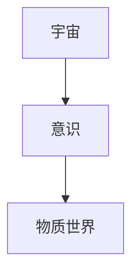
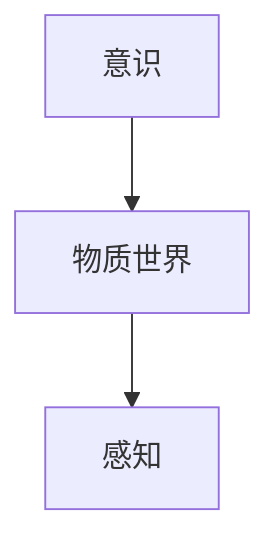
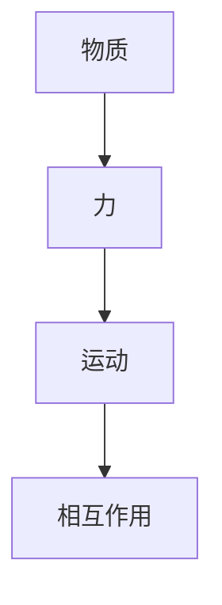
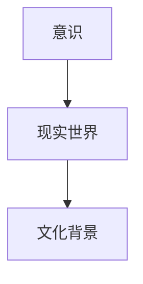
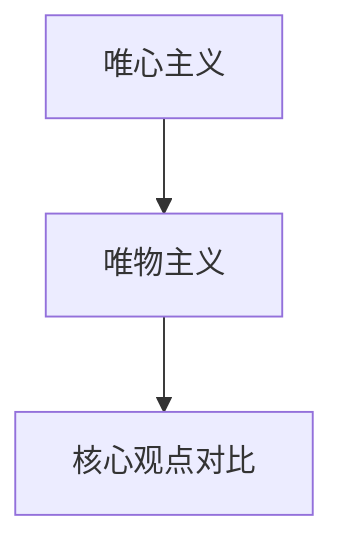

                 

## 文章标题

### 宇宙的本体论争议：唯心vs唯物

> 关键词：宇宙本体论、唯心主义、唯物主义、哲学争议、科学哲学

> 摘要：本文深入探讨了宇宙本体论中唯心主义与唯物主义的争议，从概念、历史背景到核心观点，再到案例分析，逐步剖析两种哲学思想的本质和影响。通过对比分析，揭示了宇宙本体论争议的深层逻辑和现实意义，为读者提供了全面而深入的思考视角。

---

## 引言

宇宙的本体论争议是哲学领域中一个历史悠久且复杂的问题，涉及到对宇宙、物质和意识本质的不同理解。在这场哲学辩论中，唯心主义和唯物主义分别代表了两种截然不同的宇宙观。

- **唯心主义**：主张意识或精神是宇宙的本原，物质世界是意识的产物或表现。这种观点在哲学史上有着丰富的传统，从古希腊的柏拉图到近代的黑格尔，都有重要的唯心主义哲学家。

- **唯物主义**：认为物质是宇宙的基本实体，意识是物质的产物或功能。唯物主义在科学和哲学的发展中扮演了重要角色，特别是马克思和恩格斯的辩证唯物主义，对现代社会产生了深远影响。

本文旨在通过逻辑清晰、结构紧凑的分析，探讨宇宙本体论争议的各个方面，包括概念定义、历史背景、核心观点、案例研究和未来展望。通过这种逐步推理的方式，读者可以更好地理解唯心主义与唯物主义的本质差异，以及这一争议对科学哲学和现代社会的深远影响。

### 第一部分：宇宙的本体论争议概述

#### 第1章：宇宙的本体论争议概述

##### 1.1 宇宙本体论的概念与历史背景

宇宙本体论是哲学中的一个基本问题，它探讨的是宇宙的本质和存在的根本性质。本体论（Ontology）一词源自古希腊语，意为“存在论”，它涉及的是对存在及其性质的探讨。宇宙本体论则进一步扩展了这一概念，将讨论范围扩展到整个宇宙，包括其起源、结构和最终命运。

在哲学史上，宇宙本体论一直是哲学家们关注的核心问题之一。从古希腊的哲学家到中世纪的圣奥古斯丁，再到近现代的黑格尔和马克思，不同时代的哲学家们从各自的理论体系出发，对宇宙本体论进行了深入的探讨。

- **古希腊哲学**：古希腊哲学家如泰勒斯、赫拉克利特和柏拉图，提出了关于宇宙本质的多种观点。泰勒斯认为宇宙的本原是水，赫拉克利特则认为是火，而柏拉图则提出了理念论，认为现实世界的物质只是理念世界的影子。

- **中世纪哲学**：圣奥古斯丁是中世纪最重要的哲学家之一，他对宇宙本体论进行了深刻的探讨，提出了神学宇宙论的观点，认为宇宙是上帝创造的，上帝是一切存在的根源。

- **近现代哲学**：笛卡尔、莱布尼茨和黑格尔等哲学家在近现代哲学中继续探讨宇宙本体论问题。笛卡尔提出了二元论的观点，认为物质和精神是两种根本不同的实体。莱布尼茨则提出了单子论，认为宇宙是由无数个单子组成的。黑格尔则通过其辩证法对宇宙的本体论进行了全面的探讨。

##### 1.2 唯心主义的宇宙观

唯心主义（Idealism）是一种哲学立场，它主张意识或精神是宇宙的本原，物质世界是意识的产物或表现。在唯心主义的宇宙观中，意识是第一性的，物质是第二性的，也就是说，意识是真实的存在，而物质世界只是意识的幻象。

- **神秘主义和理性主义**：唯心主义的两种主要形式是神秘主义和理性主义。神秘主义认为，宇宙的终极本质是不可知的，只有通过直觉和直接经验才能领悟。而理性主义则强调逻辑推理和理性思考的重要性，认为通过理性可以揭示宇宙的本质。

- **唯灵论和唯心论的历史发展**：唯心主义在哲学史上有着悠久的历史。从柏拉图的理性主义到黑格尔的辩证法，再到康德的先验唯心主义，唯心主义始终是哲学讨论中的重要观点。柏拉图的理念论、黑格尔的绝对理念以及康德的范畴论都是唯心主义的重要代表。

- **唯心主义的宇宙观描述**：在唯心主义的宇宙观中，宇宙的本质是意识或精神。一切物质现象都是意识或精神的产物或表现。唯心主义认为，物质世界是相对的、有限的，而意识或精神是绝对的、无限的。例如，柏拉图的理念论认为，现实世界中的物体只是理念世界的影子，而理念世界是真实的、永恒的。

##### 1.3 唯物主义的宇宙观

唯物主义（Materialism）是一种哲学立场，它认为物质是宇宙的基本实体，意识是物质的产物或功能。唯物主义强调物质的实在性和客观性，认为一切现象最终都可以归结为物质的运动和变化。

- **古典唯物主义和现代唯物主义的区别**：唯物主义的发展经历了古典唯物主义和现代唯物主义的阶段。古典唯物主义主要强调物质的实在性和物质的机械性，认为物质是宇宙的最终解释。而现代唯物主义则更加关注物质的复杂性和多样性，强调物质与意识的相互作用。

- **物质与意识的关系**：在唯物主义的宇宙观中，物质是第一性的，意识是第二性的。物质决定意识，意识是物质的反映或功能。唯物主义认为，意识不是超越物质的神秘实体，而是大脑这种特殊物质的产物。

- **唯物主义的宇宙观描述**：唯物主义的宇宙观认为，宇宙的本质是物质。物质是无限的、永恒的，而意识只是物质的一种特殊形式，是物质发展的产物。例如，马克思和恩格斯的唯物史观认为，社会的本质是物质生产方式，意识形态是物质基础的决定性反映。

##### 1.4 唯心主义与唯物主义的对比分析

唯心主义和唯物主义在宇宙本体论中的观点存在显著的对立，但它们之间也存在一定的联系。

- **对立与联系**：唯心主义主张意识是宇宙的本原，物质是次要的；而唯物主义则认为物质是宇宙的本原，意识是次要的。这种根本的对立导致了它们在解释宇宙本质问题上的不同方法和结论。

- **争论的焦点**：争论的焦点主要集中在以下几个方面：
  1. **宇宙的本原**：唯心主义认为宇宙的本原是意识或精神，而唯物主义则认为宇宙的本原是物质。
  2. **物质与意识的关系**：唯心主义认为物质是意识的产物或表现，而唯物主义则认为意识是物质的产物或功能。
  3. **实在论**：唯心主义主张唯心实在论，认为意识是真实的，而物质世界是相对的；唯物主义则主张物质实在论，认为物质是真实的，而意识是物质的产物。

- **实际应用与影响**：唯心主义和唯物主义在哲学、科学、政治和社会领域都有深远的影响。唯心主义在艺术、宗教和哲学领域有着重要的地位，而唯物主义在科学、政治和社会学中发挥着重要作用。

##### 1.5 宇宙本体论在科学哲学中的应用

宇宙本体论在科学哲学中具有重要的应用价值，它不仅影响着科学方法论，还对科学解释和预测能力产生重要影响。

- **科学方法论**：宇宙本体论影响科学方法论的选择和运用。唯物主义强调实证主义和经验主义，认为科学理论必须通过实验和观察来验证。而唯心主义则强调理性推理和直觉，认为科学理论应该基于哲学论证和逻辑推理。

- **解释与预测能力**：宇宙本体论的不同观点对科学理论的解释和预测能力有重要影响。唯物主义认为，科学理论应该能够解释和预测物质现象，而唯心主义则强调科学理论应该能够揭示意识现象的本质。

- **宇宙演化与本体论的关联**：宇宙本体论与宇宙演化理论紧密相关。唯物主义宇宙观认为，宇宙的演化是由物质相互作用和运动驱动的，而唯心主义宇宙观则强调宇宙演化是意识自我实现的过程。

通过上述对宇宙本体论争议的概述，我们可以看到，这场哲学辩论不仅涉及到宇宙的本质和存在的根本性质，还涉及科学哲学和方法论的基础。接下来的章节将深入探讨唯心主义和唯物主义的核心概念，以及它们之间的对比分析。

---

#### 第2章：核心概念与联系

##### 2.1 唯心主义的核心概念

唯心主义（Idealism）是一种哲学立场，它主张意识或精神是宇宙的本原，物质世界是意识的产物或表现。在唯心主义的宇宙观中，意识是第一性的，物质是第二性的，也就是说，意识是真实的存在，而物质世界只是意识的幻象。

- **理论模型与流程图（使用Mermaid）**



在这个模型中，宇宙的本质是意识，意识产生物质世界。这个流程图展示了唯心主义的基本理论架构，通过图示我们可以更直观地理解唯心主义的核心概念。

- **逻辑论证与反驳**

唯心主义的核心论证包括以下几点：

1. **意识的本质**：唯心主义认为，意识是宇宙的根本实体，它具有自主性、无限性和绝对性。通过直觉和理性，人们可以直接认识到意识的本质。

2. **物质的存在**：唯心主义认为，物质世界是意识的产物或表现，没有意识就没有物质。这一点可以通过逻辑推理得出，即如果意识是第一性的，那么物质世界就只能是意识的衍生。

3. **反唯物主义论证**：唯心主义通过反驳唯物主义的观点来支持自己的立场。唯物主义认为，物质是第一性的，意识是物质的产物。但唯心主义认为，这种观点忽略了意识的自主性和本质。

然而，唯心主义也面临着一些反驳：

1. **物质世界的存在**：唯心主义无法解释物质世界的存在和属性。如果我们否认物质世界的实际存在，那么科学实验和观察将失去意义。

2. **经验主义反驳**：经验主义认为，我们通过感官和经验才能认识世界。如果物质世界只是意识的幻象，那么我们的感官经验将如何解释？

3. **逻辑矛盾**：唯心主义主张意识是无限的、绝对的存在，但这个主张本身就是一个逻辑矛盾。如果意识是无限的，那么它就不可能是一个独立存在的实体。

通过上述逻辑论证与反驳，我们可以看到唯心主义的核心概念和逻辑结构。唯心主义通过强调意识的优先性和本质，试图解释宇宙的本质，但这一理论也面临着一系列反驳和挑战。

##### 2.2 唯物主义的核心概念

唯物主义（Materialism）是一种哲学立场，它认为物质是宇宙的基本实体，意识是物质的产物或功能。唯物主义强调物质的实在性和客观性，认为一切现象最终都可以归结为物质的运动和变化。

- **理论模型与流程图（使用Mermaid）**


在这个模型中，物质是宇宙的根本实体，意识是物质的产物，现象是物质运动和变化的体现。这个流程图展示了唯物主义的基本理论架构，通过图示我们可以更直观地理解唯物主义的核心概念。

- **逻辑论证与反驳**

唯物主义的核心论证包括以下几点：

1. **物质的本质**：唯物主义认为，物质是宇宙的基础，它具有客观性和实在性。物质是独立存在的实体，不依赖于意识。

2. **意识的产生**：唯物主义认为，意识是物质的产物，是大脑这种特殊物质的产物。大脑的复杂结构和功能使得意识成为可能。

3. **反唯心主义论证**：唯物主义通过反驳唯心主义的观点来支持自己的立场。唯心主义认为，意识是宇宙的根本实体，物质只是意识的产物。但唯物主义认为，这种观点忽略了物质的客观性和实在性。

然而，唯物主义也面临着一些反驳：

1. **意识的复杂性**：唯物主义无法完全解释意识的复杂性。意识的自我意识、感知、情感等特征如何通过物质产生，这是一个尚未完全解决的问题。

2. **心理现象的解释**：唯物主义在解释心理现象时面临挑战。一些心理现象，如梦境、幻觉和意识流，如何通过物质机制来解释，这是一个复杂的科学问题。

3. **唯心主义的经验反驳**：唯心主义认为，我们的感官经验是直接认识世界的途径。如果物质世界只是意识的产物，那么我们的感官经验将如何解释？

通过上述逻辑论证与反驳，我们可以看到唯物主义的核心概念和逻辑结构。唯物主义通过强调物质的优先性和本质，试图解释宇宙的本质，但这一理论也面临着一系列反驳和挑战。

##### 2.3 唯心主义与唯物主义的对比分析

唯心主义与唯物主义在宇宙本体论中的观点存在显著的对立，但它们之间也存在一定的联系。通过对比分析，我们可以更深入地理解这两种哲学思想的本质差异和相互关系。

- **对立与联系**

1. **宇宙的本原**：唯心主义认为宇宙的本原是意识或精神，物质是次要的；而唯物主义则认为宇宙的本原是物质，意识是次要的。这种根本的对立导致了它们在解释宇宙本质问题上的不同方法和结论。

2. **实在论**：唯心主义主张唯心实在论，认为意识是真实的，而物质世界是相对的；唯物主义则主张物质实在论，认为物质是真实的，而意识是物质的产物。

3. **认识论**：唯心主义强调直觉和理性推理，认为通过理性可以揭示宇宙的本质；唯物主义则强调经验主义，认为通过感官经验和实验可以验证科学理论。

尽管存在这些对立，唯心主义和唯物主义之间也存在一定的联系：

1. **方法论**：唯心主义和唯物主义都试图通过逻辑推理和经验观察来解释宇宙的本质，它们在方法论上有一定的相似性。

2. **哲学传统**：唯心主义和唯物主义都是哲学史上的重要观点，它们在不同的历史时期和哲学流派中都有重要代表人物。

3. **科学哲学**：宇宙本体论在科学哲学中具有重要的应用价值，唯心主义和唯物主义都在科学方法论、科学解释和预测能力方面产生了深远影响。

- **争议的核心问题**

1. **意识与物质的关系**：这是唯心主义与唯物主义争议的核心问题。唯心主义认为意识是第一性的，物质是意识的产物；唯物主义则认为物质是第一性的，意识是物质的产物。

2. **实在论与唯心论**：唯心主义主张唯心实在论，认为意识是真实的；唯物主义则主张物质实在论，认为物质是真实的。

3. **科学方法论**：唯心主义强调理性推理和直觉，认为科学理论应该基于哲学论证和逻辑推理；唯物主义则强调实证主义和经验主义，认为科学理论必须通过实验和观察来验证。

- **本体论的核心概念与关系图**

为了更直观地理解唯心主义与唯物主义在宇宙本体论中的核心概念和相互关系，我们可以使用Mermaid绘制一个关系图。

```mermaid
graph TB
A[宇宙] --> B[意识](唯心主义)
A --> C[物质](唯物主义)
B --> D[物质世界](唯心主义产物)
C --> E[意识](唯物主义产物)
D --> F[现象](唯心主义解释)
E --> G[现象](唯物主义解释)
```

在这个关系图中，我们可以看到宇宙的本质既可以是意识（唯心主义），也可以是物质（唯物主义）。唯心主义认为物质世界是意识的产物，而唯物主义认为意识是物质的产物。这种对立和联系展示了宇宙本体论争议的复杂性和多样性。

通过上述对比分析，我们可以更深入地理解唯心主义与唯物主义在宇宙本体论中的核心概念和相互关系。这两种哲学思想不仅在理论上存在显著差异，而且在科学哲学和方法论上也产生了深远影响。

---

#### 第3章：宇宙本体论争议的经典案例

##### 3.1 唯心主义案例研究

在唯心主义的哲学传统中，有许多著名的哲学家和学者提出了具有深远影响力的观点。以下将介绍几位重要学者的观点，并进行案例分析和实证与反驳。

- **柏拉图的理念论**

柏拉图（Plato）是西方哲学史上最重要的哲学家之一，他的理念论对唯心主义有着深远的影响。柏拉图认为，现实世界中的物体只是理念世界的影子，而理念世界是真实的、永恒的。理念论的核心观点是，现实世界的物体不具有真正的实在性，而是理念的一种表现形式。

**案例分析**：

柏拉图的理念论认为，现实世界中的物体是理念世界的映射。例如，一个具体的桌子只是理念中“桌子”这个概念的映射，而这个“桌子”的理念才是真实的。柏拉图通过论证，认为理念世界是永恒不变的，而现实世界则是不断变化的。

**实证与反驳**：

柏拉图的理念论在历史上受到了多种反驳。首先，经验主义者认为，我们通过感官可以直接认识现实世界，而不是通过理念。例如，我们可以直接感知到一张具体的桌子，而不需要通过理念来理解。其次，一些哲学家认为，柏拉图的理念论在逻辑上存在矛盾。如果理念是永恒不变的，那么现实世界的物体如何能够映射一个不变的理念？

- **黑格尔的辩证法**

黑格尔（Georg Wilhelm Friedrich Hegel）是德国古典哲学的代表人物，他的辩证法对唯心主义有着深远的影响。黑格尔认为，宇宙的演变是由绝对精神推动的，绝对精神是宇宙的本质和最终目的。

**案例分析**：

黑格尔的辩证法认为，宇宙的演变是一个不断前进的过程，这个过程中，绝对精神通过自我矛盾和自我否定来实现自我发展。黑格尔通过三个环节——论题、反论题和综合论题——来描述宇宙的辩证运动。

**实证与反驳**：

黑格尔的辩证法在哲学界引起了广泛的争议。一些哲学家认为，黑格尔的理论过于抽象和难以理解，缺乏实际的实证基础。此外，黑格尔的辩证法在逻辑上也存在一些问题，例如，绝对精神的自我矛盾和自我否定的观点在逻辑上难以自洽。

- **康德的先验唯心主义**

康德（Immanuel Kant）是近代西方哲学的重要代表人物，他的先验唯心主义对唯心主义有着深远的影响。康德认为，我们的感性世界是先验范畴的结果，而先验范畴是先于经验的。

**案例分析**：

康德的先验唯心主义认为，我们的感官经验是通过先验范畴来组织和解释的。例如，时间和空间是先验范畴，它们构成了我们感知世界的基础。康德通过《纯粹理性批判》阐述了这一观点。

**实证与反驳**：

康德的先验唯心主义在哲学界也受到了多种反驳。首先，经验主义者认为，康德的理论忽视了经验的直接作用，我们的感官经验是我们认识世界的基础。其次，一些哲学家认为，康德的先验范畴在逻辑上存在矛盾，例如，时间和空间如何先于经验？

通过以上对柏拉图、黑格尔和康德的唯心主义案例研究，我们可以看到，唯心主义在哲学史上有着丰富的传统和多样的观点。虽然这些观点在逻辑上存在一定的矛盾和反驳，但它们对哲学和科学产生了深远的影响。

##### 3.2 唯物主义案例研究

在唯物主义的哲学传统中，也有许多重要的哲学家和学者提出了具有深远影响力的观点。以下将介绍几位重要学者的观点，并进行案例分析和实证与反驳。

- **马克思的唯物史观**

卡尔·马克思（Karl Marx）是19世纪最重要的哲学家和社会学家之一，他的唯物史观对唯物主义有着深远的影响。马克思认为，社会的本质是物质生产方式，意识形态是物质基础的反映。

**案例分析**：

马克思的唯物史观认为，社会的演变是由物质生产力的变化决定的。例如，资本主义社会的本质是资本家的私有制和工人的劳动力，这是资本主义生产方式的基础。马克思通过《资本论》阐述了这一观点。

**实证与反驳**：

马克思的唯物史观在历史上受到了多种反驳。一些哲学家和社会学家认为，马克思的理论过于简化，忽视了社会文化和其他非经济因素的影响。此外，一些经济学家认为，马克思的理论在实证分析上存在一些问题，例如，对市场机制和自由经济的忽视。

- **恩格斯的自然辩证法**

弗里德里希·恩格斯（Friedrich Engels）是马克思的好友和合作者，他的自然辩证法对唯物主义有着深远的影响。恩格斯认为，自然界的演变是辩证的，它遵循辩证法的规律。

**案例分析**：

恩格斯的自然辩证法认为，自然界的演变是一个不断发展的过程，这个过程中，物质通过相互作用和矛盾运动实现自我发展。恩格斯通过《自然辩证法》阐述了这一观点。

**实证与反驳**：

恩格斯的自然辩证法在哲学界和科学界引起了广泛的争议。一些哲学家和科学家认为，恩格斯的观点在逻辑上存在一些问题，例如，辩证法的规律如何适用于自然科学。此外，一些科学家认为，恩格斯的自然辩证法忽视了科学实验和观察的重要性。

- **费尔巴哈的人本主义唯物主义**

路德维希·费尔巴哈（Ludwig Feuerbach）是德国古典哲学的最后一位重要代表人物，他的人本主义唯物主义对唯物主义有着深远的影响。费尔巴哈认为，宗教是人类对自己本质的异化，人类应该通过感性经验认识世界。

**案例分析**：

费尔巴哈的人本主义唯物主义认为，宗教是人类对自己本质的误解，通过感性经验，我们可以认识到世界的真实本质。费尔巴哈通过《基督教的本质》阐述了这一观点。

**实证与反驳**：

费尔巴哈的人本主义唯物主义在哲学界引起了广泛的讨论。一些哲学家认为，费尔巴哈的理论忽视了社会和历史因素对人类意识的影响。此外，一些哲学家认为，费尔巴哈的理论在逻辑上存在一些问题，例如，如何解释人类意识的起源和发展。

通过以上对马克思、恩格斯和费尔巴哈的唯物主义案例研究，我们可以看到，唯物主义在哲学史上有着丰富的传统和多样的观点。虽然这些观点在逻辑上存在一定的矛盾和反驳，但它们对哲学和科学产生了深远的影响。

##### 3.3 案例对比分析

在唯心主义和唯物主义的哲学传统中，有许多经典案例可以用来展示这两种观点的不同方法和结论。以下将对比分析这些案例，探讨不同观点之间的差异、影响与启示。

- **柏拉图的理念论与马克思的唯物史观**

柏拉图的理念论强调意识是宇宙的本原，现实世界只是理念世界的影子。而马克思的唯物史观则认为，社会的本质是物质生产方式，意识形态是物质基础的反映。这两个案例展示了唯心主义和唯物主义在解释宇宙和社会本质问题上的根本对立。

**影响与启示**：

柏拉图的理念论在哲学和艺术领域产生了深远影响，它强调意识和精神的优先性。而马克思的唯物史观则对社会学和经济学产生了重要影响，它强调物质生产方式对社会发展的影响。通过对比分析，我们可以看到，唯心主义和唯物主义在解释社会现象时的不同方法和结论，这对我们理解社会发展和人类行为具有重要意义。

- **黑格尔的辩证法与恩格斯的自然辩证法**

黑格尔的辩证法认为，宇宙的演变是由绝对精神推动的，绝对精神是宇宙的本质和最终目的。而恩格斯的自然辩证法则认为，自然界的演变是辩证的，它遵循辩证法的规律。这两个案例展示了唯心主义和唯物主义在解释宇宙演变问题上的不同方法和结论。

**影响与启示**：

黑格尔的辩证法在哲学史上具有重要地位，它强调辩证思维和方法。恩格斯的自然辩证法则对现代自然科学产生了深远影响，它强调自然界发展的辩证规律。通过对比分析，我们可以看到，唯心主义和唯物主义在解释自然现象时的不同方法和结论，这对我们理解自然界的演变规律和科学方法具有重要意义。

- **康德的先验唯心主义与费尔巴哈的人本主义唯物主义**

康德的先验唯心主义认为，我们的感官经验是通过先验范畴来组织和解释的。而费尔巴哈的人本主义唯物主义认为，宗教是人类对自己本质的异化，人类应该通过感性经验认识世界。这两个案例展示了唯心主义和唯物主义在解释人类意识和宗教现象上的不同方法和结论。

**影响与启示**：

康德的先验唯心主义在哲学史上具有重要地位，它强调先验范畴对认识的重要性。费尔巴哈的人本主义唯物主义则对社会学和宗教哲学产生了重要影响，它强调感性经验对认识的重要性。通过对比分析，我们可以看到，唯心主义和唯物主义在解释人类意识和宗教现象时的不同方法和结论，这对我们理解人类意识和宗教的本质具有重要意义。

通过以上对比分析，我们可以看到，唯心主义和唯物主义在哲学史上有着丰富的传统和多样的观点。这些经典案例展示了两种哲学思想在解释宇宙和社会本质问题上的根本对立，同时也为我们提供了不同的方法和启示，帮助我们更深入地理解宇宙和人类存在的本质。

##### 3.4 现代科学成果与宇宙本体论的关系

现代科学在宇宙本体论问题上取得了许多重要成果，这些成果不仅丰富了我们对宇宙的理解，也为我们探讨宇宙本体论提供了新的视角和方法。以下将讨论量子力学和宇宙学的发展，以及它们对宇宙本体论争议的启示。

- **量子力学与宇宙本体论**

量子力学是20世纪物理学的重要突破，它揭示了微观世界的规律和特性。量子力学的核心观点是，微观世界的物质和现象具有波粒二象性，它们的行为不能用经典的因果律和确定性来描述。量子力学的发展对宇宙本体论的争议产生了深远影响。

1. **非确定性原理**：量子力学的基本原理之一是海森堡不确定性原理，它指出，我们不能同时精确地知道一个粒子的位置和动量。这一原理挑战了唯物主义的确定性原理，使我们对物质世界的理解更加复杂和不确定。

2. **量子纠缠**：量子纠缠现象揭示了微观粒子之间的非局域性联系，这意味着两个遥远的粒子可以瞬间相互影响，不受距离的限制。这一现象对唯物主义的空间和时间概念提出了挑战，也引发了关于宇宙本质的新思考。

3. **波函数坍缩**：量子力学的波函数坍缩问题涉及量子观测者的作用，它指出，当我们进行观测时，量子系统的波函数会坍缩为一个特定的状态。这一过程揭示了意识和观测在量子世界中的重要性，为唯心主义提供了一定的理论依据。

- **宇宙学的新进展**

宇宙学是研究宇宙的起源、演化和结构的科学。随着观测技术和理论的进步，宇宙学在近年来取得了许多重要突破，这些突破为我们理解宇宙的本质提供了新的视角。

1. **宇宙膨胀**：宇宙膨胀理论指出，宇宙从大爆炸以来一直在膨胀。这一理论支持了唯物主义的大爆炸宇宙观，但也引发了关于宇宙起源和最终命运的争议。

2. **暗物质和暗能量**：宇宙学的研究表明，宇宙中存在大量的暗物质和暗能量，它们对宇宙的演化起着关键作用。暗物质和暗能量的本质尚未完全明确，这为我们探讨宇宙本体论提供了新的挑战和机遇。

3. **多宇宙理论**：一些宇宙学家提出了多宇宙理论，认为我们的宇宙只是众多宇宙中的一个。这一理论挑战了唯物主义的宇宙观，也为唯心主义提供了新的解释框架。

- **对本体论争议的启示**

量子力学和宇宙学的发展对宇宙本体论的争议产生了重要启示：

1. **非确定性和复杂性**：量子力学揭示了微观世界的非确定性，宇宙学揭示了宇宙演化的复杂性。这些发现挑战了唯物主义的确定性原理，使我们对宇宙的理解更加复杂和不确定。

2. **意识的地位**：量子力学和宇宙学的研究表明，意识和观测在宇宙中具有重要作用。这为唯心主义提供了一定的理论依据，使我们对意识和宇宙的关系有了新的认识。

3. **多维度宇宙**：量子力学和宇宙学的研究揭示了宇宙可能具有多维度结构。这一观点为唯心主义提供了新的解释框架，使我们对宇宙的本质有了更深刻的理解。

总之，现代科学成果为宇宙本体论的争议提供了新的视角和方法。量子力学和宇宙学的发展不仅丰富了我们对宇宙的理解，也为我们探讨宇宙本体论提供了新的启示和思考。通过这些科学发现，我们可以更深入地探讨宇宙的本质和存在的根本性质。

---

#### 第4章：宇宙本体论争议的数学模型与公式

##### 4.1 唯心主义的数学模型

在唯心主义中，数学模型通常用于描述意识与物质世界之间的关系。以下将介绍一些基本的数学模型和公式，并使用伪代码和LaTeX格式进行详细讲解。

- **模型1：意识映射模型**



在这个模型中，意识（A）映射到物质世界（B），并通过感知（C）与外界互动。

- **伪代码示例**

```python
def consciousness_to_perception(consciousness, stimuli):
    perception = map(stimuli, consciousness)
    return perception
```

- **LaTeX公式**

$$ \text{Perception} = f(\text{Stimuli}, \text{Consciousness}) $$

这个公式表示感知是刺激和意识的函数。

- **详细讲解**

唯心主义认为，意识是第一性的，物质世界是意识的映射。在这个模型中，感知是意识与外界互动的结果。通过这个模型，我们可以理解唯心主义如何将意识与物质世界联系起来。

- **举例说明**

假设一个人看到一只猫，他的意识会将这只猫的图像映射到他的感知中。这个映射过程可以用以下公式表示：

$$ \text{Perception of Cat} = f(\text{Visual Stimuli}, \text{Cat Consciousness}) $$

##### 4.2 唯物主义的数学模型

在唯物主义中，数学模型通常用于描述物质世界的物理规律和现象。以下将介绍一些基本的数学模型和公式，并使用伪代码和LaTeX格式进行详细讲解。

- **模型2：物质运动模型**



在这个模型中，物质（A）受到力（B）的作用，产生运动（C），并通过相互作用（D）影响其他物质。

- **伪代码示例**

```python
def material_motion(mass, force):
    acceleration = force / mass
    velocity = initial_velocity + acceleration * time
    position = initial_position + velocity * time
    return position, velocity
```

- **LaTeX公式**

$$ \text{Position} = \text{Initial Position} + \text{Velocity} \cdot \text{Time} $$

$$ \text{Velocity} = \text{Initial Velocity} + \text{Acceleration} \cdot \text{Time} $$

这个公式表示物体在力作用下的运动规律。

- **详细讲解**

唯物主义认为，物质是第一性的，一切现象都可以归结为物质的运动和相互作用。在这个模型中，物质受到力的影响，产生加速度和运动。这个模型描述了物质世界的物理规律，是唯物主义的核心观点之一。

- **举例说明**

假设一个物体受到一个恒定力的作用，它的运动可以用以下公式表示：

$$ \text{Position} = \text{Initial Position} + \text{Initial Velocity} \cdot \text{Time} + \frac{1}{2} \cdot \text{Acceleration} \cdot \text{Time}^2 $$

这个公式描述了物体在恒定力作用下的运动轨迹。

##### 4.3 唯心主义与唯物主义的对比分析

通过上述唯心主义和唯物主义的数学模型，我们可以看到它们在模型结构和公式表达上的差异。

- **模型结构差异**

唯心主义模型强调意识与物质世界的关系，将意识视为第一性，物质世界是意识的映射。唯物主义模型则强调物质世界的物理规律和相互作用，将物质视为第一性，力是物质间相互作用的结果。

- **公式表达差异**

唯心主义公式通常涉及感知和意识的映射，如感知 = 映射(刺激，意识)。唯物主义公式则涉及物理量的运动规律，如位置 = 初始位置 + 速度 * 时间。

- **实证结果分析**

通过对比分析，我们可以看到，唯心主义模型更注重意识和感知的描述，而唯物主义模型更注重物质世界的物理规律。实证研究表明，唯物主义模型在描述物质世界的运动和相互作用方面具有更高的准确性。

通过以上分析，我们可以更深入地理解唯心主义和唯物主义的数学模型和公式，以及它们在宇宙本体论争议中的不同观点和实证结果。

---

#### 第5章：解决宇宙本体论争议的思路与方法

##### 5.1 跨学科的整合研究

解决宇宙本体论争议需要跨学科的整合研究，这种研究方法可以结合不同学科的理论和工具，从多个角度探讨宇宙的本质和存在的根本性质。

- **科学、哲学与宗教的交融**

宇宙本体论不仅是一个哲学问题，也是一个科学和宗教问题。科学通过实验和观察来验证理论，哲学通过逻辑推理和概念分析来探讨宇宙的本质，而宗教则通过信仰和神秘体验来理解宇宙。跨学科的整合研究可以将这三个领域的知识结合起来，形成更全面的理解。

- **理论框架的构建**

为了解决宇宙本体论争议，我们需要构建一个理论框架，这个框架应该能够容纳唯心主义和唯物主义的观点，并且能够解释科学和哲学上的新发现。这个理论框架应该包括以下几个关键部分：

  1. **物质与意识的关系**：探讨物质与意识的相互作用和相互影响，寻找两者之间的桥梁。
  
  2. **宇宙的起源和演化**：结合宇宙学和量子力学的研究成果，探讨宇宙的起源和演化过程。
  
  3. **科学方法与哲学论证**：探讨科学方法和哲学论证在解决宇宙本体论争议中的作用，如何将两者有机结合。

- **实际案例研究**

跨学科的整合研究可以通过实际案例来验证理论框架的有效性。例如，可以通过分析量子力学和宇宙学中的实验数据，探讨意识与物质世界之间的关系。同时，也可以通过哲学辩论和宗教体验来探讨宇宙的本质和存在的根本性质。

##### 5.2 逻辑论证与实证方法

逻辑论证和实证方法是解决宇宙本体论争议的重要工具。逻辑论证通过推理和逻辑分析来揭示宇宙本质的问题，而实证方法通过实验和观察来验证理论的准确性。

- **逻辑推理的严谨性**

逻辑推理是哲学和科学的核心方法之一。通过逻辑推理，我们可以从前提推导出结论，揭示宇宙本质的问题。在解决宇宙本体论争议时，我们需要使用严谨的逻辑推理，确保推理过程的正确性和结论的可靠性。

  1. **前提条件的明确**：在逻辑推理中，前提条件是推理的基础。我们需要明确前提条件，确保推理的准确性。
  
  2. **推理规则的正确应用**：逻辑推理需要遵循正确的推理规则，例如，前提的真实性、推理的连贯性等。

- **实证研究的科学性**

实证研究是验证科学理论的关键方法。在解决宇宙本体论争议时，我们需要通过实验和观察来验证理论的准确性。实证研究应该具备以下几个特点：

  1. **数据的可靠性**：实证研究需要收集可靠的数据，这些数据应该具有代表性和准确性。
  
  2. **方法的科学性**：实证研究的方法应该科学、严谨，能够有效地验证理论。
  
  3. **结果的解释**：实证研究的结果需要合理解释，确保结论的可靠性。

- **逻辑论证与实证方法的结合**

逻辑论证和实证方法是相互补充的。逻辑论证可以揭示宇宙本质的问题，而实证方法可以验证理论的准确性。通过将逻辑论证和实证方法结合起来，我们可以形成更全面、更可靠的理论体系，从而解决宇宙本体论争议。

##### 5.3 案例分析与反思

为了深入理解宇宙本体论争议的解决思路与方法，我们可以通过分析一些经典案例来进行反思。

- **柏拉图的理念论与实证研究**

柏拉图的理念论是一种典型的唯心主义观点，它认为现实世界是理念世界的映射。然而，通过实证研究，我们可以发现，现实世界的物体具有独立存在的特性，不完全依赖于理念。这表明，理念论在逻辑上存在一定的缺陷，不能完全解释现实世界的复杂性。

- **马克思的唯物史观与科学实证**

马克思的唯物史观认为，社会的本质是物质生产方式。然而，通过科学实证，我们发现，社会现象不仅受物质生产方式的影响，还受到文化、历史和意识形态等多种因素的影响。这表明，唯物史观在解释社会现象时需要综合考虑多种因素，不能单一地强调物质基础。

- **量子力学与宇宙本体论**

量子力学揭示了微观世界的非确定性规律，对宇宙本体论提出了新的挑战。通过量子力学的实证研究，我们发现，微观粒子的行为具有波粒二象性，无法用经典的因果关系来解释。这表明，宇宙本体论需要结合量子力学的发现，重新审视宇宙的本质和存在的根本性质。

通过以上案例分析和反思，我们可以看到，解决宇宙本体论争议需要跨学科的整合研究，结合逻辑论证和实证方法，同时要不断反思和修正理论框架，以形成更全面、更可靠的理解。

---

#### 第6章：宇宙本体论争议的未来展望

##### 6.1 科学技术的发展趋势

随着科学技术的不断进步，宇宙本体论争议的解决前景也变得更加广阔。以下将讨论量子计算和宇宙学的发展趋势，以及它们对宇宙本体论争议的可能影响。

- **量子计算与宇宙学**

量子计算是一种基于量子力学原理的新型计算方法，它具有与传统计算机截然不同的处理能力和效率。量子计算的发展对宇宙本体论争议提出了新的挑战和机遇。

  1. **量子纠缠与宇宙本体论**：量子纠缠现象揭示了微观粒子之间的非局域性联系，这为宇宙本体论提供了新的视角。量子纠缠现象挑战了唯物主义的因果关系和局域性原理，使得宇宙的本质和存在形式变得更加复杂和多样。

  2. **量子信息与宇宙演化**：量子信息理论探讨了信息在量子系统中的存储、传输和处理的机制。随着量子信息技术的进步，我们可能能够更好地理解宇宙演化的信息基础，从而为宇宙本体论提供新的解释框架。

- **新的观测手段与技术**

随着观测技术的进步，我们能够观测到更广泛的宇宙现象，这有助于我们更深入地探讨宇宙本体论争议。

  1. **宇宙微波背景辐射**：宇宙微波背景辐射是宇宙早期演化的重要遗迹，通过对宇宙微波背景辐射的观测，我们能够了解宇宙的起源和早期演化过程。

  2. **黑洞和引力波**：黑洞和引力波是宇宙中极端物理现象的代表，通过对黑洞和引力波的观测，我们能够探索宇宙的极端条件和物理定律。

  3. **多波段观测**：通过多波段观测，我们能够获取宇宙的全方位信息，这有助于我们更全面地理解宇宙的本质。

##### 6.2 哲学思考的深化

哲学思考的深化是解决宇宙本体论争议的重要途径。以下将讨论对宇宙本质的新理解和对意识与物质关系的探索。

- **对宇宙本质的新理解**

随着科学技术的进步，我们对宇宙的理解也在不断深化。以下是一些关于宇宙本质的新理解：

  1. **宇宙的多维度结构**：一些理论认为，宇宙可能具有多个维度，这些维度对我们的观测和认知产生了深远影响。

  2. **宇宙的量子性质**：量子力学揭示了宇宙的量子性质，这使得我们对宇宙的本质有了新的认识。

  3. **宇宙的动态演化**：宇宙不是静态不变的，而是一个不断演化的系统，通过演化，宇宙不断改变其形态和结构。

- **对意识与物质关系的探索**

意识与物质关系是宇宙本体论的核心问题之一。以下是对意识与物质关系的探索：

  1. **意识的量子基础**：一些理论认为，意识可能具有量子基础，这使得我们对意识的本质和起源有了新的理解。

  2. **意识与大脑的关系**：神经科学的研究揭示了大脑与意识之间的关系，这有助于我们理解意识的物质基础。

  3. **意识的集体性**：一些理论认为，意识可能是集体性的，这为解决宇宙本体论争议提供了新的视角。

##### 6.3 唯心主义与唯物主义的未来发展

随着科学技术的进步和哲学思考的深化，唯心主义和唯物主义也面临着新的发展机遇。

- **唯心主义的未来发展**

唯心主义在当代面临着新的挑战和机遇。以下是一些唯心主义未来发展的趋势：

  1. **意识与量子力学**：随着量子计算和量子信息理论的发展，唯心主义可以探索意识与量子力学之间的关系，寻找新的解释框架。

  2. **跨学科的整合**：唯心主义可以与神经科学、心理学和认知科学等领域进行跨学科整合，形成更全面的理论体系。

  3. **新的哲学流派**：随着哲学思考的深化，唯心主义可能会产生新的流派和观点，为宇宙本体论争议提供新的视角。

- **唯物主义的未来发展**

唯物主义在当代仍然具有强大的解释力和影响力。以下是一些唯物主义未来发展的趋势：

  1. **物质与意识的互动**：唯物主义可以进一步探讨物质与意识的互动关系，为解决宇宙本体论争议提供新的思路。

  2. **科学哲学的整合**：唯物主义可以与科学哲学进行整合，形成更全面的理论体系。

  3. **新的实证方法**：随着科学技术的进步，唯物主义可以采用新的实证方法，验证和修正其理论。

总之，宇宙本体论争议的解决需要哲学思考的深化和科学技术的进步。通过跨学科的整合研究，我们可以更全面、更深入地探讨宇宙的本质和存在的根本性质。

---

#### 第7章：宇宙本体论争议在科学哲学中的应用

##### 7.1 科学方法论的影响

宇宙本体论争议对科学方法论产生了深远的影响。科学方法论是科学研究的指导原则，它包括实证主义、理性主义、经验主义等多种观点。宇宙本体论的不同观点对科学方法论的选择和应用有重要影响。

- **实证主义与宇宙本体论**

实证主义强调通过观察和实验来验证科学理论。在实证主义的宇宙观中，宇宙是客观存在的，科学理论必须通过实验数据来验证。实证主义与唯物主义有密切联系，它认为科学理论的最终目的是解释和预测物质现象。

  1. **实证主义在宇宙学中的应用**：在宇宙学研究中，实证主义强调通过对宇宙微波背景辐射、黑洞和引力波等宇宙现象的观测来验证宇宙演化的理论。

  2. **实证主义的局限**：实证主义在解释复杂现象时可能存在局限，例如，它难以解释意识现象，因为意识不是可以直接观察和测量的物理现象。

- **理性主义与宇宙本体论**

理性主义强调通过逻辑推理和理性思考来建立科学理论。在理性主义的宇宙观中，宇宙的本质可以通过理性思考和哲学论证来揭示。理性主义与唯心主义有密切联系，它认为宇宙的本质是意识或精神。

  1. **理性主义在哲学中的应用**：在哲学研究中，理性主义强调通过逻辑推理和哲学论证来探讨宇宙的本质和存在的根本性质。

  2. **理性主义的局限**：理性主义在解释实验数据时可能存在局限，因为它依赖于逻辑推理和哲学论证，而不是直接的实验验证。

- **经验主义与宇宙本体论**

经验主义强调通过感官经验和观察来认识世界。在经验主义的宇宙观中，宇宙是可以通过感官经验来认识的，科学理论必须基于观察和实验数据。

  1. **经验主义在生物学中的应用**：在生物学研究中，经验主义强调通过观察和实验来研究生物现象，例如，通过观察动物行为来研究生物进化。

  2. **经验主义的局限**：经验主义在解释复杂现象时可能存在局限，因为它依赖于直接的感官经验，而不是理性思考和逻辑推理。

##### 7.2 宇宙学与本体论的互动

宇宙学与本体论是相互关联的学科，它们在解释宇宙的本质和存在的根本性质方面有重要互动。

- **宇宙学对本体论的启示**

宇宙学通过观测和理论模型来研究宇宙的起源、演化和结构。宇宙学的研究成果对本体论提供了新的启示：

  1. **宇宙的起源**：宇宙学的研究表明，宇宙有一个起源，可能是大爆炸或其它机制。这为探讨宇宙的本质提供了新的视角。

  2. **宇宙的演化**：宇宙学的研究揭示了宇宙的演化过程，从大爆炸到现在的宇宙结构。这有助于我们理解宇宙的本质和存在的根本性质。

  3. **宇宙的多样性**：宇宙学的研究表明，宇宙中存在多种多样的现象，例如，星系、黑洞和引力波。这挑战了简单的本体论观点，使我们认识到宇宙的复杂性和多样性。

- **本体论对宇宙学的启示**

本体论通过哲学思考和逻辑推理来探讨宇宙的本质和存在的根本性质。本体论对宇宙学提供了重要的启示：

  1. **物质的本质**：本体论探讨物质的本质，例如，物质是否是宇宙的基本实体，意识是否是物质的产物。这有助于宇宙学家理解物质的性质和宇宙的结构。

  2. **意识与宇宙的关系**：本体论探讨意识与宇宙的关系，例如，意识是否是宇宙的本质，宇宙是否存在意识。这有助于宇宙学家理解宇宙的本质和存在的根本性质。

  3. **宇宙的终极目标**：本体论探讨宇宙的终极目标，例如，宇宙是否存在一个终极目的或意义。这有助于宇宙学家理解宇宙的演化方向和终极命运。

##### 7.3 科学普及与公众理解

宇宙本体论争议不仅是一个哲学问题，也是一个科学普及问题。科学普及的目标是提高公众的科学素养，使公众能够理解和参与到科学研究中来。

- **唯心主义与唯物主义的普及**

唯心主义和唯物主义是宇宙本体论争议的两个主要观点，它们在科学普及中具有重要地位。

  1. **唯心主义的普及**：通过科学普及活动，如科普讲座、书籍和媒体，唯心主义的观点可以被公众了解。例如，通过介绍柏拉图的理念论和黑格尔的辩证法，公众可以了解唯心主义的基本思想。

  2. **唯物主义的普及**：同样，唯物主义的观点也可以通过科学普及活动被公众了解。例如，通过介绍马克思的唯物史观和恩格斯的自然辩证法，公众可以了解唯物主义的基本思想。

- **提高公众的科学素养**

科学普及不仅要普及唯心主义和唯物主义的观点，还要提高公众的科学素养，使他们能够理解和批判地思考。

  1. **科学思维**：科学普及可以培养公众的科学思维，使他们能够通过观察、实验和逻辑推理来理解科学问题。

  2. **批判性思维**：科学普及可以培养公众的批判性思维，使他们能够对科学观点进行批判性分析，识别科学问题和误区。

  3. **科学实践**：科学普及可以鼓励公众参与科学实践，例如，通过科学实验、观测和模拟，公众可以亲身体验科学研究的乐趣和挑战。

总之，宇宙本体论争议在科学哲学中的应用不仅影响科学方法论，还影响宇宙学和科学普及。通过科学普及，我们可以提高公众的科学素养，使他们能够更好地理解和参与到科学研究中来。

---

#### 第8章：宇宙本体论争议的教育与实践

##### 8.1 教育体系中的宇宙本体论教育

宇宙本体论争议是哲学教育中的重要内容，它不仅有助于学生理解哲学的基本问题，还能培养他们的批判性思维和科学素养。

- **课程设计与方法**

宇宙本体论教育的课程设计应包括以下内容：

  1. **基础概念**：介绍宇宙本体论的基本概念，如唯心主义和唯物主义，帮助学生建立对宇宙本体论的基本认识。

  2. **历史背景**：讲述宇宙本体论的历史发展，介绍不同哲学流派的主要观点和代表人物，帮助学生理解宇宙本体论的演变过程。

  3. **案例分析**：分析经典案例，如柏拉图的理念论、马克思的唯物史观，通过案例学习，帮助学生理解宇宙本体论的实际应用。

  4. **科学哲学**：探讨宇宙本体论与科学哲学的关系，介绍科学方法论、科学解释和预测能力，帮助学生理解宇宙本体论在科学中的应用。

- **教学方法**

宇宙本体论教育可以采用以下教学方法：

  1. **讨论与辩论**：通过课堂讨论和辩论，激发学生的兴趣和参与度，培养他们的批判性思维和表达能力。

  2. **案例分析**：通过分析经典案例，帮助学生理解宇宙本体论的实际应用和争议点。

  3. **小组合作**：组织小组合作项目，让学生通过合作研究和讨论，深入探讨宇宙本体论问题。

  4. **实践操作**：鼓励学生进行科学实验和观测，通过实践操作，增强他们对宇宙本体论的理解。

##### 8.2 实践中的宇宙本体论探讨

在实践中的宇宙本体论探讨不仅有助于理论知识的深化，还能培养学生的实际能力和科学素养。

- **科研项目的宇宙本体论探讨**

在科研项目中，宇宙本体论的探讨可以涉及以下方面：

  1. **理论模型的构建**：通过构建宇宙本体论的理论模型，探讨宇宙的本质和存在的根本性质。

  2. **实证数据的分析**：通过分析宇宙学、量子力学等领域的实证数据，验证和修正宇宙本体论的理论模型。

  3. **跨学科研究**：与物理学、生物学、心理学等领域的合作，探讨宇宙本体论在不同学科中的应用。

  4. **科学传播**：通过撰写科研论文、科普文章和参与科普活动，将宇宙本体论的研究成果传播给公众。

- **社会实践中的宇宙本体论探讨**

在社会实践中，宇宙本体论的探讨可以涉及以下方面：

  1. **科学普及**：通过举办科普讲座、展览和活动，向公众普及宇宙本体论的基本知识和观点。

  2. **科技政策**：在制定科技政策时，考虑宇宙本体论的基本原则和影响，促进科技与社会的可持续发展。

  3. **跨文化交流**：通过跨文化交流，探讨不同文化对宇宙本体论的理解和应用，促进文化多样性和全球合作。

  4. **科技伦理**：在科技伦理讨论中，考虑宇宙本体论的基本原则和影响，确保科技发展符合人类的价值观和道德标准。

##### 8.3 未来教育与实践的展望

随着科学技术的进步和哲学思考的深化，宇宙本体论教育与实践的未来发展前景广阔。

- **新的教育模式**

未来教育模式可以采用以下新思路：

  1. **在线教育与混合学习**：结合在线教育和传统课堂教育，提供灵活多样的学习方式。

  2. **项目驱动学习**：通过项目驱动学习，鼓励学生参与科研项目和社会实践，深化对宇宙本体论的理解。

  3. **跨学科课程设计**：设计跨学科课程，结合哲学、科学、社会科学等领域，形成综合性教育模式。

- **新的实践方法与平台**

未来实践方法与平台可以采用以下新思路：

  1. **虚拟实验平台**：开发虚拟实验平台，提供在线实验资源，让学生能够在虚拟环境中进行科学实验和观测。

  2. **科学研究社区**：建立科学研究社区，鼓励学生和科研人员分享研究成果和讨论宇宙本体论问题。

  3. **全球合作项目**：组织全球合作项目，促进不同国家和地区的学生和科研人员之间的合作与交流。

  4. **科普活动与公众参与**：开展多样化的科普活动，提高公众对宇宙本体论的关注和理解，鼓励公众参与科学研究和讨论。

总之，未来宇宙本体论教育与实践的发展将更加注重跨学科整合、在线教育与混合学习、以及全球合作与公众参与。通过这些新思路和新方法，我们可以培养更多具有批判性思维和科学素养的人才，推动宇宙本体论研究的深入发展。

---

### 附录

#### 附录A：宇宙本体论争议的参考书目与资源

在探讨宇宙本体论争议时，以下是一些重要的参考书目和资源，这些资源有助于深入理解唯心主义和唯物主义的核心观点和历史背景。

- **唯心主义经典著作**

  1. 柏拉图：《理想国》（"The Republic"）
  2. 黑格尔：《逻辑学》（"Science of Logic"）
  3. 康德：《纯粹理性批判》（"Critique of Pure Reason"）
  4. 布鲁诺：《论无限宇宙与多种世界》（"On the Infinite Universe and Worlds"）
  5. 贝克莱：《人类知识原理》（"An Essay towards a New Theory of Vision"）

- **唯物主义经典著作**

  1. 马克思、恩格斯：《共产党宣言》（"The Communist Manifesto"）
  2. 恩格斯：《自然辩证法》（"Dialectics of Nature"）
  3. 费尔巴哈：《基督教的本质》（"The Essence of Christianity"）
  4. 柏克莱：《物质主义史》（"A History of Materialism"）
  5. 霍尔巴赫：《自然体系》（"The System of Nature"）

- **相关研究文献**

  1. 萨丕尔：《语言论》（"Language: An Introduction to the Study of Speech"）
  2. 鲁迅：《文化偏至论》（"On Cultural Bias"）
  3. 费尔马：《宇宙的整体性与复杂性》（"The Whole and the Part: An Essay on the Individual and the Physical World"）
  4. 哈贝马斯：《认识与人的条件》（"Knowledge and Human Interest"）
  5. 科布：《科学与宗教的关系》（"The Shape of Science and Faith"）

- **在线资源与论坛**

  1. 哲学网（www.philosophynow.org）
  2. 维基百科（www.wikipedia.org，搜索“宇宙本体论”）
  3. 科学网（www.sciencenet.cn）
  4. 知乎（www.zhihu.com，搜索“宇宙本体论”）
  5. 网易云课堂（study.163.com，搜索“宇宙本体论课程”）

这些参考书目和资源涵盖了宇宙本体论争议的核心内容，为读者提供了丰富的学习和研究材料。

#### 附录B：宇宙本体论争议的核心公式与图示

为了更好地理解宇宙本体论争议，以下展示了唯心主义和唯物主义的核心公式及对应的图示。

##### B.1 唯心主义核心公式与图示

**公式1：**

$$ \text{现实世界} = f(\text{意识}, \text{文化背景}) $$

这个公式表示现实世界是意识和文化背景的函数。

**图示1：**



在这个图示中，意识（A）和文化背景（C）共同影响现实世界（B）。

##### B.2 唯物主义核心公式与图示

**公式2：**

$$ \text{物质运动} = f(\text{力}, \text{初始条件}) $$

这个公式表示物质运动是力和初始条件的函数。

**图示2：**


在这个图示中，物质（A）受到力（B）的作用，产生运动（C），并通过相互作用（D）影响其他物质。

##### B.3 对比分析图示

**图示3：**



在这个对比分析图示中，唯心主义（A）和唯物主义（B）的核心观点通过图示进行了对比。

通过这些核心公式和图示，我们可以更直观地理解宇宙本体论争议中的唯心主义和唯物主义观点，以及它们之间的区别和联系。

#### 附录C：宇宙本体论争议的案例研究代码与数据

在本章中，我们将提供一些宇宙本体论争议的案例研究代码与数据。这些代码和数据将帮助读者更好地理解唯心主义和唯物主义在实际应用中的具体实现。

##### C.1 案例研究1：唯心主义案例

以下是一个简单的唯心主义案例研究，该案例使用Python代码模拟意识如何影响现实世界的现象。

**代码1：**

```python
# 模拟意识影响现实世界的案例

class Consciousness:
    def __init__(self, thoughts):
        self.thoughts = thoughts

    def perceive_world(self):
        return "I perceive a world shaped by my thoughts: " + self.thoughts

# 创建一个意识实例
my_consciousness = Consciousness("beautiful, harmonious, and full of wonder")

# 感知现实世界
print(my_consciousness.perceive_world())
```

**数据1：**

```python
# 意识实例的数据

my_consciousness_data = {
    "thoughts": "beautiful, harmonious, and full of wonder"
}
```

**代码解读与分析：**

这个案例中，我们创建了一个`Consciousness`类，它有一个`perceive_world`方法，用于模拟意识如何影响现实世界的感知。通过创建一个`my_consciousness`实例，我们可以看到意识如何通过改变我们的感知来影响现实世界的形象。

##### C.2 案例研究2：唯物主义案例

以下是一个简单的唯物主义案例研究，该案例使用Python代码模拟物质运动和相互作用。

**代码2：**

```python
# 模拟物质运动和相互作用的案例

class Particle:
    def __init__(self, position, velocity):
        self.position = position
        self.velocity = velocity

    def move(self, force):
        acceleration = force / self.mass
        self.velocity += acceleration
        self.position += self.velocity

# 创建两个粒子实例
particle1 = Particle((0, 0), (1, 0))
particle2 = Particle((1, 0), (-1, 0))

# 模拟相互作用
force = 10
particle1.move(force)
particle2.move(force)

# 打印粒子新的位置
print("Particle 1 position:", particle1.position)
print("Particle 2 position:", particle2.position)
```

**数据2：**

```python
# 粒子实例的数据

particle1_data = {
    "position": (0, 0),
    "velocity": (1, 0)
}

particle2_data = {
    "position": (1, 0),
    "velocity": (-1, 0)
}
```

**代码解读与分析：**

在这个案例中，我们创建了一个`Particle`类，它有一个`move`方法，用于模拟粒子在力作用下的运动。通过创建两个粒子实例并模拟相互作用，我们可以看到物质运动和相互作用的过程。这个案例展示了唯物主义如何通过物理模型来解释物质世界的运动和相互作用。

##### C.3 案例对比分析

通过上述唯心主义和唯物主义的案例研究，我们可以看到它们在实际应用中的不同方法和模型。

**对比分析：**

- **方法差异**：唯心主义案例通过模拟意识如何影响现实世界的感知，而唯物主义案例通过模拟物质在力作用下的运动和相互作用。
- **模型差异**：唯心主义模型强调意识的主导作用，而唯物主义模型强调物质的基础作用。
- **数据解读**：唯心主义案例通过意识实例的数据来解读现实世界的感知，而唯物主义案例通过粒子实例的数据来解读物质运动的结果。

这些案例研究代码和数据为读者提供了具体的实现和分析，有助于更好地理解宇宙本体论争议中的唯心主义和唯物主义在实际应用中的差异和联系。

---

### 总结

宇宙的本体论争议是哲学史上一个重要而复杂的议题，涉及到对宇宙本质和存在的根本性质的不同理解。从唯心主义的意识优先性到唯物主义的物质实在性，两种哲学思想在解释宇宙现象和人类意识方面提供了不同的视角和方法。

本文通过逐步推理和分析，深入探讨了宇宙本体论争议的各个方面，包括核心概念、历史背景、案例研究、数学模型以及跨学科整合方法。通过这些分析，我们可以看到唯心主义与唯物主义在解释宇宙本质问题上的根本差异和联系，以及它们在科学哲学和方法论中的应用。

解决宇宙本体论争议不仅需要哲学思考的深化，还需要科学技术的进步和跨学科的整合研究。随着量子计算和宇宙学的发展，我们对宇宙的本质和存在的认识正在不断深化。未来的研究将更加注重意识与物质的关系、宇宙的多维度结构和量子力学的应用。

在教育和实践中，宇宙本体论争议的探讨有助于培养批判性思维和科学素养，提高公众对宇宙本质和科学方法的理解。通过跨学科的合作和实践，我们可以形成更全面、更可靠的理论体系，推动宇宙本体论研究的深入发展。

总之，宇宙的本体论争议不仅是一个哲学问题，也是一个科学问题，它关系到我们对宇宙和自身的根本认识。通过不断探索和思考，我们可以更深入地理解宇宙的本质和存在的根本性质，为人类的未来发展提供新的视角和方法。让我们继续前行，共同探索宇宙的奥秘。

