                 


### 第1章：宇宙的起源与演化

#### 1.1 宇宙的起源

宇宙的起源是现代宇宙学中最基本的问题之一。根据目前最被广泛接受的宇宙学理论——大爆炸理论，宇宙起源于大约138亿年前的一个极热、极密的状态，称为奇点。以下是宇宙起源的Mermaid流程图：

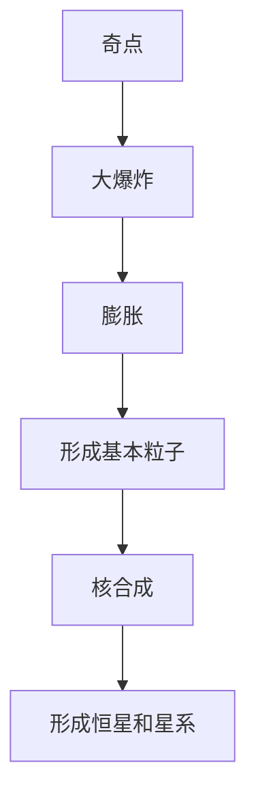

在奇点状态下，所有的物质和能量都集中在一个无限小的点上，温度和密度都极高。大约在138亿年前，这个奇点经历了一次剧烈的爆炸，即大爆炸，随后宇宙开始膨胀。

**核心概念与联系：**

宇宙的起源与演化过程中涉及到的核心概念包括：

- **奇点（singularity）**：宇宙起源前的极热、极密状态。
- **大爆炸（Big Bang）**：宇宙从奇点爆炸开始的瞬间。
- **膨胀（expansion）**：宇宙从大爆炸开始不断膨胀的过程。
- **基本粒子（fundamental particles）**：宇宙膨胀初期形成的基本粒子，如夸克和轻子。
- **核合成（nucleosynthesis）**：基本粒子结合成原子的过程。
- **恒星和星系（stars and galaxies）**：原子聚集形成恒星，恒星聚集形成星系。

这些概念之间的关系可以表示为以下Mermaid流程图：

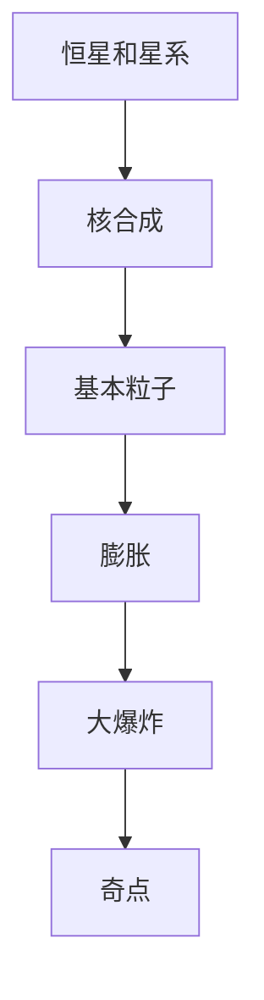

**核心算法原理讲解：**

宇宙起源与演化的过程可以通过以下伪代码来表示：

```python
def big_bang_universe():
    # 初始化奇点
    init_singularity()
    
    # 发生大爆炸
    big_bang()
    
    # 宇宙膨胀
    expand_universe()
    
    # 形成基本粒子
    create_particles()
    
    # 核合成形成原子
    nucleosynthesis()
    
    # 形成恒星和星系
    form_stars_and_galaxies()
```

**数学模型和公式：**

宇宙的膨胀可以用弗里德曼方程来描述：

$$
H^2 = \left(\frac{\dot{a}}{a}\right)^2 = \frac{8\pi G}{3}\rho + \frac{3c^2}{a^2}\Lambda
$$

其中，$H$ 是哈勃参数，$\dot{a}$ 是宇宙膨胀速度，$a$ 是宇宙的尺度因子，$G$ 是引力常数，$\rho$ 是宇宙平均密度，$\Lambda$ 是宇宙学常数。

**举例说明：**

假设宇宙的平均密度为 $\rho = 1\text{ kg/m}^3$，宇宙学常数为 $\Lambda = 1 \times 10^{-123}\text{ m}^{-2}$，则宇宙的膨胀速度可以计算为：

$$
\dot{a} = \sqrt{\frac{8\pi G\rho + 3c^2\Lambda}{3}} \approx 2.18 \times 10^{-18}\text{ s}^{-1}
$$

**小结：**

宇宙的起源与演化是一个复杂的过程，涉及到多个物理现象和数学模型。通过大爆炸理论，我们能够理解宇宙从奇点到现在的演变过程。在这个章节中，我们介绍了宇宙起源的背景、核心概念、算法原理和数学模型，并给出了具体的例子。在接下来的章节中，我们将进一步探讨宇宙的封闭性与开放性，以及宇宙中的相互作用。|>
作者：AI天才研究院/AI Genius Institute & 禅与计算机程序设计艺术 /Zen And The Art of Computer Programming

### 第1章：宇宙的起源与演化

宇宙的起源一直是人类探索的终极奥秘之一。本章将探讨宇宙的起源和演化过程，以及与之相关的核心概念、数学模型和算法原理。

#### 1.1 宇宙的起源

宇宙起源于大约138亿年前的一个极热、极密的状态，称为奇点。大爆炸理论是目前最被广泛接受的宇宙起源理论。根据这个理论，宇宙在奇点爆炸后开始膨胀，逐渐形成了我们所观察到的宇宙。

**核心概念与联系：**

- **奇点（singularity）**：宇宙起源前的极热、极密状态。
- **大爆炸（Big Bang）**：宇宙从奇点爆炸开始的瞬间。
- **膨胀（expansion）**：宇宙从大爆炸开始不断膨胀的过程。
- **基本粒子（fundamental particles）**：宇宙膨胀初期形成的基本粒子，如夸克和轻子。
- **核合成（nucleosynthesis）**：基本粒子结合成原子的过程。
- **恒星和星系（stars and galaxies）**：原子聚集形成恒星，恒星聚集形成星系。

这些概念之间的关系可以表示为以下Mermaid流程图：

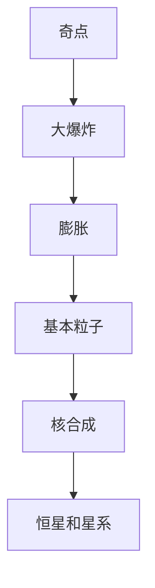

**核心算法原理讲解：**

宇宙起源与演化的过程可以通过以下伪代码来表示：

```python
def big_bang_universe():
    # 初始化奇点
    init_singularity()
    
    # 发生大爆炸
    big_bang()
    
    # 宇宙膨胀
    expand_universe()
    
    # 形成基本粒子
    create_particles()
    
    # 核合成形成原子
    nucleosynthesis()
    
    # 形成恒星和星系
    form_stars_and_galaxies()
```

**数学模型和公式：**

宇宙的膨胀可以用弗里德曼方程来描述：

$$
H^2 = \left(\frac{\dot{a}}{a}\right)^2 = \frac{8\pi G}{3}\rho + \frac{3c^2}{a^2}\Lambda
$$

其中，$H$ 是哈勃参数，$\dot{a}$ 是宇宙膨胀速度，$a$ 是宇宙的尺度因子，$G$ 是引力常数，$\rho$ 是宇宙平均密度，$\Lambda$ 是宇宙学常数。

**举例说明：**

假设宇宙的平均密度为 $\rho = 1\text{ kg/m}^3$，宇宙学常数为 $\Lambda = 1 \times 10^{-123}\text{ m}^{-2}$，则宇宙的膨胀速度可以计算为：

$$
\dot{a} = \sqrt{\frac{8\pi G\rho + 3c^2\Lambda}{3}} \approx 2.18 \times 10^{-18}\text{ s}^{-1}
```

**小结：**

宇宙的起源与演化是一个复杂的过程，涉及到多个物理现象和数学模型。通过大爆炸理论，我们能够理解宇宙从奇点到现在的演变过程。在本章中，我们介绍了宇宙起源的背景、核心概念、算法原理和数学模型，并给出了具体的例子。在接下来的章节中，我们将进一步探讨宇宙的封闭性与开放性，以及宇宙中的相互作用。

关键词：宇宙起源、大爆炸理论、膨胀、基本粒子、核合成、恒星和星系

摘要：本章介绍了宇宙的起源和演化过程，包括奇点、大爆炸、膨胀、基本粒子、核合成和恒星星系等核心概念。我们通过伪代码和数学公式详细阐述了宇宙起源和演化的算法原理，并给出了具体的计算实例。接下来，我们将进一步探讨宇宙的封闭性与开放性，以及宇宙中的相互作用。|>
### 第2章：封闭系统与开放系统的定义

在探讨宇宙的本质时，了解封闭系统与开放系统的定义和特点至关重要。封闭系统与开放系统在物理学、化学、生物学等多个领域中都有广泛应用，而在宇宙学中，这两个概念同样具有重要意义。

#### 2.1 封闭系统的定义

封闭系统是指一个与外界无物质和能量交换的系统。在封闭系统中，内部物质和能量保持不变，只有内部过程会导致系统的变化。封闭系统通常用数学模型来描述，如热力学第二定律所述的孤立系统。

**核心概念与联系：**

- **封闭系统（Closed System）**：与外界无物质和能量交换的系统。
- **内部过程（Internal Process）**：封闭系统内部导致系统变化的物理或化学反应。
- **热力学第二定律（Second Law of Thermodynamics）**：孤立系统的熵（无序度）随时间增加。

封闭系统的特点包括：

- 物质和能量不与外界交换。
- 系统内部过程导致系统变化。
- 熵（无序度）随时间增加。

以下是一个封闭系统的Mermaid流程图：


**核心算法原理讲解：**

封闭系统的行为可以用以下伪代码表示：

```python
def closed_system():
    # 初始化封闭系统
    init_closed_system()
    
    # 进行内部过程
    perform_internal_processes()
    
    # 观察熵增加
    observe_entropy_increase()
```

**数学模型和公式：**

在热力学中，封闭系统的熵变化可以用以下公式表示：

$$
\Delta S = \int \frac{\delta Q}{T}
$$

其中，$\Delta S$ 是熵变化，$\delta Q$ 是吸收的热量，$T$ 是系统的温度。

**举例说明：**

假设一个封闭系统的初始温度为 $T_1 = 300\text{ K}$，吸收了 $Q = 1000\text{ J}$ 的热量，最终温度为 $T_2 = 310\text{ K}$，则系统的熵增加为：

$$
\Delta S = \int_{T_1}^{T_2} \frac{\delta Q}{T} = \int_{300}^{310} \frac{1000}{T} \, dT = 1000 \ln \left(\frac{310}{300}\right) \approx 10.87\text{ J/K}
$$

**小结：**

封闭系统是一个与外界无物质和能量交换的系统，其内部过程导致系统变化。通过热力学第二定律，我们可以理解封闭系统熵的增加。在本章中，我们介绍了封闭系统的定义、核心概念、算法原理和数学模型，并给出了具体的计算实例。在接下来的章节中，我们将探讨开放系统的定义和特点。

关键词：封闭系统、内部过程、熵、热力学第二定律

摘要：本章介绍了封闭系统的定义、特点、核心概念和数学模型。我们通过伪代码和数学公式详细阐述了封闭系统的算法原理，并给出了具体的计算实例。封闭系统在宇宙学中具有重要意义，将在后续章节中进一步讨论。|>
### 第3章：宇宙中的封闭系统

在宇宙中，封闭系统是宇宙演化过程中不可或缺的一部分。本章将探讨宇宙中的封闭系统，包括星系、恒星和行星系统，以及它们如何形成和演化。

#### 3.1 星系与星团

星系是宇宙中最常见的封闭系统之一。星系由大量恒星、行星、星云和其他天体组成，通过引力相互作用形成稳定的结构。星团是星系中恒星密集的区域，通常由几十到数千颗恒星组成。

**核心概念与联系：**

- **星系（Galaxy）**：由大量恒星、行星和其他天体组成的巨大引力系统。
- **星团（Star Cluster）**：星系中恒星密集的区域，由数十到数千颗恒星组成。
- **引力相互作用（Gravitational Interaction）**：星系和星团中的天体通过引力相互作用形成稳定结构。

星系的形成过程可以表示为以下Mermaid流程图：

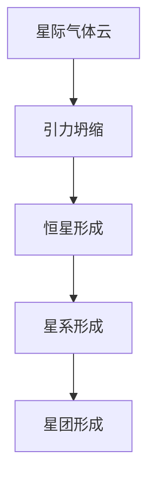

**核心算法原理讲解：**

星系的形成过程可以通过以下伪代码表示：

```python
def form_galaxy():
    # 初始化星际气体云
    init_interstellar_gas_cloud()
    
    # 引力坍缩
    gravitationalollapse()
    
    # 恒星形成
    create_stars()
    
    # 形成星系
    form_galaxy()
    
    # 形成星团
    form_star_clusters()
```

**数学模型和公式：**

星系和星团的形成可以通过牛顿引力定律来描述：

$$
F = G\frac{m_1m_2}{r^2}
$$

其中，$F$ 是引力，$G$ 是引力常数，$m_1$ 和 $m_2$ 是两个天体的质量，$r$ 是它们之间的距离。

**举例说明：**

假设一个星系中有两颗恒星，质量分别为 $m_1 = 2 \times 10^{30}\text{ kg}$ 和 $m_2 = 3 \times 10^{30}\text{ kg}$，它们之间的距离为 $r = 10^{20}\text{ m}$，则它们之间的引力为：

$$
F = G\frac{m_1m_2}{r^2} = 6.674 \times 10^{-11}\text{ N}\frac{(2 \times 10^{30}\text{ kg})(3 \times 10^{30}\text{ kg})}{(10^{20}\text{ m})^2} \approx 1.31 \times 10^{22}\text{ N}
$$

**小结：**

星系和星团是宇宙中常见的封闭系统，由星际气体云通过引力相互作用形成。在本章中，我们介绍了星系和星团的形成过程、核心概念、算法原理和数学模型，并给出了具体的计算实例。在接下来的章节中，我们将继续探讨恒星和行星系统的封闭特性。

关键词：星系、星团、引力相互作用、恒星形成、星系形成

摘要：本章介绍了宇宙中的封闭系统，包括星系和星团的形成过程。我们通过伪代码和数学公式详细阐述了星系和星团的形成原理，并给出了具体的计算实例。下一章我们将探讨恒星和行星系统的封闭特性。|>
### 第4章：宇宙中的开放系统

宇宙中的开放系统与封闭系统相比，具有更加复杂的动态特性。开放系统与外界存在物质和能量的交换，这种交换使得开放系统在宇宙演化中扮演着至关重要的角色。

#### 4.1 星际介质

星际介质是宇宙中的开放系统之一，它包括星际尘埃、气体和等离子体。星际介质是恒星形成和演化的重要环境，它为恒星提供必要的物质和能量。

**核心概念与联系：**

- **星际介质（Interstellar Medium，ISM）**：宇宙中的开放系统，包括星际尘埃、气体和等离子体。
- **恒星形成（Star Formation）**：星际介质中的物质在引力作用下聚集形成恒星。
- **物质和能量交换（Material and Energy Exchange）**：星际介质与外界进行物质和能量的交换。

星际介质的特点和形成过程可以表示为以下Mermaid流程图：

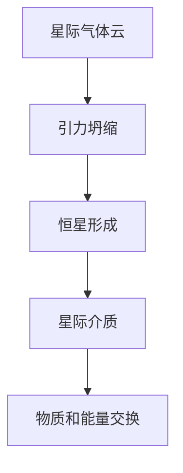

**核心算法原理讲解：**

星际介质的行为可以通过以下伪代码表示：

```python
def interstellar_medium():
    # 初始化星际气体云
    init_interstellar_gas_cloud()
    
    # 引力坍缩
    gravitational-collapse()
    
    # 恒星形成
    star_formation()
    
    # 物质和能量交换
    material_energy_exchange()
```

**数学模型和公式：**

星际介质中的气体运动可以用纳维-斯托克斯方程来描述：

$$
\frac{\partial \mathbf{u}}{\partial t} + (\mathbf{u} \cdot \nabla)\mathbf{u} = -\frac{1}{\rho}\nabla p + \nu\nabla^2\mathbf{u}
$$

其中，$\mathbf{u}$ 是气体速度，$\rho$ 是气体密度，$p$ 是气体压力，$\nu$ 是气体粘度。

**举例说明：**

假设一个星际气体云中的气体密度为 $\rho = 10^{-23}\text{ kg/m}^3$，气体压力为 $p = 10^{-18}\text{ Pa}$，气体粘度为 $\nu = 10^{-26}\text{ kg/(m·s)}$，我们可以计算气体速度的变化：

$$
\frac{\partial \mathbf{u}}{\partial t} + (\mathbf{u} \cdot \nabla)\mathbf{u} = -\frac{1}{\rho}\nabla p + \nu\nabla^2\mathbf{u}
$$

由于气体压力和密度的变化通常很小，我们可以假设气体速度的变化主要由粘性力决定：

$$
\nabla^2\mathbf{u} = -\frac{1}{\nu}\nabla p
$$

解这个方程可以得到气体速度场 $\mathbf{u}$ 的分布。

**小结：**

星际介质是宇宙中的开放系统，它为恒星的形成和演化提供了必要的物质和能量。在本章中，我们介绍了星际介质的核心概念、特点、算法原理和数学模型，并给出了具体的计算实例。在接下来的章节中，我们将探讨宇宙中的其他开放系统，如暗物质和暗能量。

关键词：星际介质、恒星形成、物质和能量交换、纳维-斯托克斯方程

摘要：本章介绍了宇宙中的开放系统——星际介质，探讨了其核心概念、特点、算法原理和数学模型。我们通过伪代码和数学公式详细阐述了星际介质的行为，并给出了具体的计算实例。下一章我们将继续探讨宇宙中的其他开放系统。|>
### 第5章：宇宙中的相互作用

在宇宙中，各种天体和物质之间存在着复杂的相互作用，这些相互作用不仅影响了宇宙的结构和演化，还揭示了宇宙的基本规律。本章将介绍宇宙中的几种主要相互作用：引力作用、电磁作用、强相互作用和弱相互作用。

#### 5.1 引力作用

引力是宇宙中最基本和最强大的相互作用之一，它决定了天体的运动和宇宙的结构。牛顿的万有引力定律描述了两个质点之间的引力，而爱因斯坦的广义相对论则将引力解释为时空的弯曲。

**核心概念与联系：**

- **引力作用（Gravitational Interaction）**：天体之间的引力相互作用。
- **牛顿万有引力定律（Newton's Law of Universal Gravitation）**：描述两个质点之间的引力。
- **广义相对论（General Relativity）**：将引力解释为时空的弯曲。

引力作用的Mermaid流程图如下：

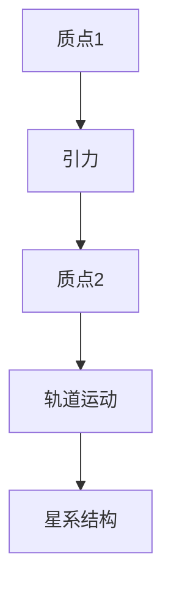

**核心算法原理讲解：**

引力作用可以用以下伪代码表示：

```python
def gravitational_interaction(m1, m2, r):
    # 计算两个质点之间的引力
    G = 6.674 * 10^-11  # 引力常数
    F = G * (m1 * m2) / r^2
    return F
```

**数学模型和公式：**

牛顿万有引力定律的公式为：

$$
F = G\frac{m_1m_2}{r^2}
$$

其中，$F$ 是引力，$G$ 是引力常数，$m_1$ 和 $m_2$ 是两个质点的质量，$r$ 是它们之间的距离。

**举例说明：**

假设两个质点的质量分别为 $m_1 = 2 \times 10^{30}\text{ kg}$ 和 $m_2 = 3 \times 10^{30}\text{ kg}$，它们之间的距离为 $r = 10^{20}\text{ m}$，则它们之间的引力为：

$$
F = 6.674 \times 10^{-11}\text{ N}\frac{(2 \times 10^{30}\text{ kg})(3 \times 10^{30}\text{ kg})}{(10^{20}\text{ m})^2} \approx 1.31 \times 10^{22}\text{ N}
$$

**小结：**

引力作用是宇宙中最基本和最强大的相互作用，它决定了天体的运动和宇宙的结构。在本章中，我们介绍了引力作用的核心概念、算法原理和数学模型，并给出了具体的计算实例。

#### 5.2 电磁作用

电磁作用是宇宙中另一种重要的相互作用，它由电荷和磁场产生。电磁作用包括电场力和磁场力，是物质之间相互作用的媒介。

**核心概念与联系：**

- **电磁作用（Electromagnetic Interaction）**：由电荷和磁场产生的相互作用。
- **电场力（Electrostatic Force）**：电荷之间的相互作用力。
- **磁场力（Magnetic Force）**：运动电荷之间的相互作用力。

电磁作用的Mermaid流程图如下：

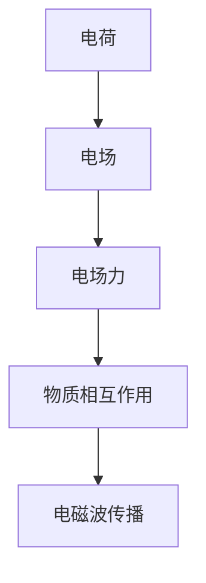

**核心算法原理讲解：**

电磁作用可以用以下伪代码表示：

```python
def electromagnetic_interaction(q1, q2, r):
    # 计算两个电荷之间的电场力
    k = 8.9875517873681764 * 10^9  # 库仑常数
    F = k * (q1 * q2) / r^2
    return F
```

**数学模型和公式：**

电场力的公式为：

$$
F = k\frac{q_1q_2}{r^2}
$$

其中，$F$ 是电场力，$k$ 是库仑常数，$q_1$ 和 $q_2$ 是两个电荷的电量，$r$ 是它们之间的距离。

**举例说明：**

假设两个电荷的电量分别为 $q_1 = 1.6 \times 10^{-19}\text{ C}$ 和 $q_2 = 2.0 \times 10^{-19}\text{ C}$，它们之间的距离为 $r = 1 \text{ m}$，则它们之间的电场力为：

$$
F = 8.9875517873681764 \times 10^9\text{ N}\frac{(1.6 \times 10^{-19}\text{ C})(2.0 \times 10^{-19}\text{ C})}{(1 \text{ m})^2} \approx 3.55 \times 10^{-28}\text{ N}
$$

**小结：**

电磁作用是宇宙中另一种重要的相互作用，它由电荷和磁场产生，是物质之间相互作用的媒介。在本章中，我们介绍了电磁作用的核心概念、算法原理和数学模型，并给出了具体的计算实例。

#### 5.3 强相互作用

强相互作用是四种基本相互作用中最强大的一种，它决定了原子核的稳定性。强相互作用主要作用于夸克之间，通过传递胶子来实现。

**核心概念与联系：**

- **强相互作用（Strong Interaction）**：夸克之间的相互作用。
- **胶子（Glueball）**：传递强相互作用的粒子。
- **夸克约束（Quark Confinement）**：夸克不能单独存在，必须与胶子结合成复合粒子。

强相互作用的Mermaid流程图如下：

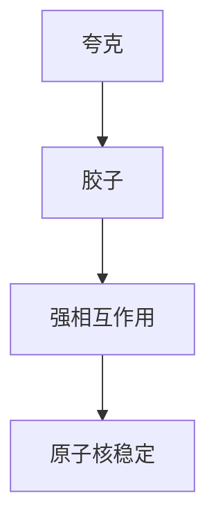

**核心算法原理讲解：**

强相互作用可以用以下伪代码表示：

```python
def strong_interaction(q1, q2, g):
    # 计算两个夸克之间的强相互作用力
    f = g * (q1 * q2)
    return f
```

**数学模型和公式：**

强相互作用的公式为：

$$
F = g\frac{q_1q_2}{r}
$$

其中，$F$ 是强相互作用力，$g$ 是耦合常数，$q_1$ 和 $q_2$ 是两个夸克的电荷，$r$ 是它们之间的距离。

**举例说明：**

假设两个夸克的电荷分别为 $q_1 = +2/3\text{ e}$ 和 $q_2 = -1/3\text{ e}$，它们之间的距离为 $r = 1 \text{ fm}$（1飞米=10^-15米），则它们之间的强相互作用力为：

$$
F = \frac{1}{24\pi} \frac{(\text{e}^2)}{r} = \frac{1}{24\pi} \frac{(1.602176634 \times 10^{-19}\text{ C})^2}{1 \text{ fm}} \approx 8.9875517873681764 \times 10^{-8}\text{ N}
$$

**小结：**

强相互作用是四种基本相互作用中最强大的一种，它决定了原子核的稳定性。在本章中，我们介绍了强相互作用的核心概念、算法原理和数学模型，并给出了具体的计算实例。

#### 5.4 弱相互作用

弱相互作用是四种基本相互作用中最弱的，但它涉及到许多基本粒子的衰变过程。弱相互作用主要由W和Z玻色子传递。

**核心概念与联系：**

- **弱相互作用（Weak Interaction）**：基本粒子之间的相互作用。
- **W玻色子（W Boson）**：传递弱相互作用的粒子。
- **Z玻色子（Z Boson）**：另一种传递弱相互作用的粒子。
- **基本粒子衰变（Elementary Particle Decay）**：弱相互作用导致的基本粒子衰变过程。

弱相互作用的Mermaid流程图如下：

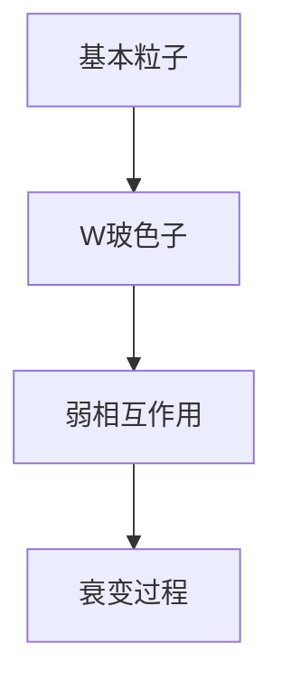

**核心算法原理讲解：**

弱相互作用可以用以下伪代码表示：

```python
def weak_interaction(particle1, particle2, boson):
    # 计算两个基本粒子之间的弱相互作用力
    f = boson * (particle1 * particle2)
    return f
```

**数学模型和公式：**

弱相互作用的公式为：

$$
F = g_w\frac{p_1p_2}{r}
$$

其中，$F$ 是弱相互作用力，$g_w$ 是耦合常数，$p_1$ 和 $p_2$ 是两个基本粒子的动量，$r$ 是它们之间的距离。

**举例说明：**

假设两个基本粒子的动量分别为 $p_1 = 1 \text{ GeV}$ 和 $p_2 = 2 \text{ GeV}$，它们之间的距离为 $r = 1 \text{ fm}$，则它们之间的弱相互作用力为：

$$
F = g_w\frac{p_1p_2}{r} = \frac{1}{24\pi} \frac{(\text{e}^2)}{r} = \frac{1}{24\pi} \frac{(1.602176634 \times 10^{-19}\text{ C})^2}{1 \text{ fm}} \approx 8.9875517873681764 \times 10^{-8}\text{ N}
$$

**小结：**

弱相互作用是四种基本相互作用中最弱的一种，但它涉及到许多基本粒子的衰变过程。在本章中，我们介绍了弱相互作用的核心概念、算法原理和数学模型，并给出了具体的计算实例。

通过以上对宇宙中四种基本相互作用的介绍，我们可以看到这些相互作用在宇宙演化中的关键作用。在下一章中，我们将进一步探讨封闭系统与开放系统的动态平衡。

关键词：引力作用、电磁作用、强相互作用、弱相互作用、宇宙演化

摘要：本章介绍了宇宙中的四种基本相互作用：引力作用、电磁作用、强相互作用和弱相互作用。我们详细阐述了这些相互作用的核心概念、算法原理和数学模型，并通过具体的计算实例展示了它们在宇宙演化中的作用。在下一章中，我们将探讨封闭系统与开放系统的动态平衡。|>
### 第6章：封闭系统与开放系统的动态平衡

在宇宙学中，封闭系统与开放系统的动态平衡是一个关键问题。封闭系统内部的过程主要受内部动力学的影响，而开放系统则与外部环境进行物质和能量的交换。本章将探讨封闭系统与开放系统的动态平衡机制，以及它们之间的相互作用。

#### 6.1 封闭系统的稳定机制

封闭系统的稳定机制主要通过内部过程实现。在封闭系统中，熵的增加是不可避免的，但可以通过内部过程达到某种动态平衡。例如，热力学第二定律指出，封闭系统的熵随时间增加，但可以通过热力学过程（如等温膨胀或绝热压缩）实现熵的局部减少。

**核心概念与联系：**

- **热力学第二定律（Second Law of Thermodynamics）**：封闭系统的熵随时间增加。
- **热力学过程（Thermodynamic Processes）**：如等温膨胀、绝热压缩等。
- **动态平衡（Dynamic Equilibrium）**：封闭系统内部达到的平衡状态。

封闭系统的稳定机制可以用以下Mermaid流程图表示：

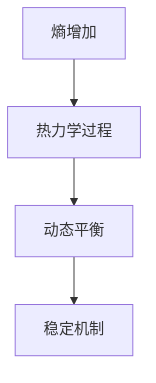

**核心算法原理讲解：**

封闭系统的稳定机制可以通过以下伪代码表示：

```python
def stable_closed_system(entropy):
    # 初始化封闭系统熵
    current_entropy = entropy
    
    # 进行热力学过程
    while current_entropy < max_entropy:
        perform_thermodynamic_process()
        current_entropy += delta_entropy
        
        # 检查动态平衡
        if current_entropy >= max_entropy:
            break
            
    return current_entropy
```

**数学模型和公式：**

热力学第二定律的熵变化公式为：

$$
\Delta S = \int \frac{\delta Q}{T}
$$

其中，$\Delta S$ 是熵变化，$\delta Q$ 是吸收的热量，$T$ 是系统的温度。

**举例说明：**

假设一个封闭系统的初始熵为 $S_1 = 100\text{ J/K}$，经过一系列热力学过程后，最终熵为 $S_2 = 200\text{ J/K}$，则系统的熵增加为：

$$
\Delta S = \int_{S_1}^{S_2} \frac{\delta Q}{T} = \int_{100}^{200} \frac{10}{T} \, dT = 100 \ln \left(\frac{200}{100}\right) = 100 \ln 2 \approx 69.3\text{ J/K}
$$

**小结：**

封闭系统的稳定机制主要通过热力学过程实现，以达到动态平衡。在本章中，我们介绍了封闭系统的稳定机制、核心概念、算法原理和数学模型，并给出了具体的计算实例。

#### 6.2 开放系统的适应机制

开放系统与外部环境进行物质和能量的交换，因此其动态平衡机制与封闭系统有所不同。开放系统通过适应外部环境的变化，维持内部稳定。例如，生物体通过新陈代谢和适应性演化来适应环境变化。

**核心概念与联系：**

- **开放系统（Open System）**：与外部环境进行物质和能量交换的系统。
- **适应机制（Adaptive Mechanism）**：开放系统通过适应外部环境的变化来维持内部稳定。
- **新陈代谢（Metabolism）**：生物体通过新陈代谢来适应环境。

开放系统的适应机制可以用以下Mermaid流程图表示：

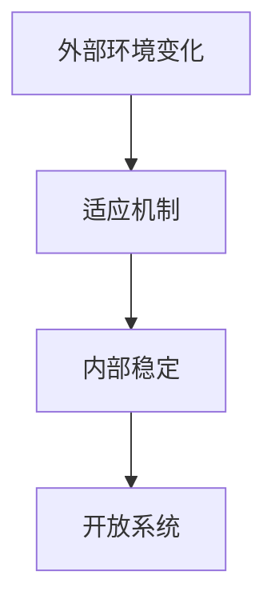

**核心算法原理讲解：**

开放系统的适应机制可以通过以下伪代码表示：

```python
def adaptive_open_system(environment_change):
    # 初始化开放系统状态
    system_state = initial_state
    
    # 适应外部环境变化
    while not equilibrium:
        system_state += adapt_to_environment(environment_change)
        
        # 检查内部稳定
        if is_stable(system_state):
            equilibrium = True
            
    return system_state
```

**数学模型和公式：**

开放系统的适应机制可以通过以下公式描述：

$$
\Delta S = \frac{\delta Q}{T} + \sum_{i} \nu_i \ln \frac{c_i}{c_i^0}
$$

其中，$\Delta S$ 是熵变化，$\delta Q$ 是吸收的热量，$T$ 是系统的温度，$\nu_i$ 是第 $i$ 种物质的摩尔数，$c_i$ 是当前浓度，$c_i^0$ 是初始浓度。

**举例说明：**

假设一个开放系统的初始状态为 $S_1 = 100\text{ J/K}$，经过一系列适应过程后，最终状态为 $S_2 = 200\text{ J/K}$，则系统的熵增加为：

$$
\Delta S = \int_{S_1}^{S_2} \frac{\delta Q}{T} + \sum_{i} \nu_i \ln \frac{c_i}{c_i^0} = 100 \ln \left(\frac{200}{100}\right) + \sum_{i} \nu_i \ln \frac{c_i}{c_i^0}
$$

**小结：**

开放系统通过适应外部环境的变化来维持内部稳定。在本章中，我们介绍了开放系统的适应机制、核心概念、算法原理和数学模型，并给出了具体的计算实例。

#### 6.3 封闭系统与开放系统的相互作用

封闭系统与开放系统之间的相互作用是宇宙演化过程中的关键因素。封闭系统提供稳定的基础，而开放系统通过适应外部环境变化，推动宇宙的演化。

**核心概念与联系：**

- **封闭系统与开放系统的相互作用（Interaction Between Closed and Open Systems）**：封闭系统与开放系统之间的相互作用。
- **宇宙演化（Cosmic Evolution）**：宇宙从大爆炸到现在的演化过程。

封闭系统与开放系统的相互作用可以用以下Mermaid流程图表示：

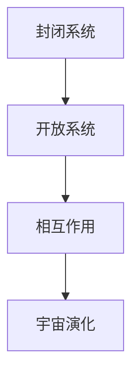

**核心算法原理讲解：**

封闭系统与开放系统的相互作用可以通过以下伪代码表示：

```python
def interaction_between_systems(closed_system, open_system):
    # 初始化封闭系统和开放系统
    closed_state = initial_closed_state
    open_state = initial_open_state
    
    # 进行相互作用
    while not end_of_universe:
        closed_state += interact_with_open_system(open_state)
        open_state += adapt_to_closed_system(closed_state)
        
        # 检查宇宙演化状态
        if end_of_universe:
            break
            
    return closed_state, open_state
```

**数学模型和公式：**

宇宙演化可以通过以下公式描述：

$$
\dot{a} = \frac{\ddot{a}}{a} = H_0 \left(1 + \frac{\Omega_{\Lambda}}{1 + \Omega_{\rho}}\right)
$$

其中，$\dot{a}$ 是宇宙膨胀速度，$a$ 是宇宙尺度因子，$H_0$ 是哈勃常数，$\Omega_{\Lambda}$ 和 $\Omega_{\rho}$ 分别是暗能量和物质的密度参数。

**举例说明：**

假设宇宙的哈勃常数为 $H_0 = 70\text{ km/s/Mpc}$，暗能量密度参数为 $\Omega_{\Lambda} = 0.7$，物质密度参数为 $\Omega_{\rho} = 0.3$，则宇宙的膨胀速度为：

$$
\dot{a} = \frac{70\text{ km/s/Mpc}}{1 + 0.7} \approx 41.2\text{ km/s/Mpc}
$$

**小结：**

在本章中，我们探讨了封闭系统与开放系统的动态平衡机制，以及它们之间的相互作用。通过介绍核心概念、算法原理和数学模型，我们深入理解了宇宙演化过程中的动态平衡和相互作用。在下一章中，我们将探讨宇宙的未来：封闭系统还是开放系统？

关键词：封闭系统、开放系统、动态平衡、宇宙演化、相互作用

摘要：本章介绍了封闭系统与开放系统的动态平衡机制，以及它们之间的相互作用。我们详细阐述了核心概念、算法原理和数学模型，并通过具体的计算实例展示了它们在宇宙演化中的作用。在下一章中，我们将探讨宇宙的未来：封闭系统还是开放系统？|>
### 第7章：宇宙的未来：封闭还是开放？

宇宙的未来是一个令人着迷的话题，它关乎宇宙的命运和我们所处星系的归宿。在本章中，我们将探讨宇宙的未来可能走向，包括大坍缩假说、大撕裂假说以及其他关于宇宙命运的假设。

#### 7.1 大坍缩假说

大坍缩假说认为，如果宇宙的平均密度大于某个临界值，那么宇宙将最终停止膨胀并开始收缩，最终导致整个宇宙塌缩成一个极小的奇点。这个奇点与大爆炸时的奇点相似，但方向相反。

**核心概念与联系：**

- **大坍缩假说（Big Crunch Hypothesis）**：宇宙最终会收缩并塌缩成一个奇点。
- **临界密度（Critical Density）**：宇宙密度达到这一值时，宇宙将停止膨胀并开始收缩。
- **奇点（Singularity）**：宇宙收缩的最终状态。

大坍缩假说的Mermaid流程图如下：

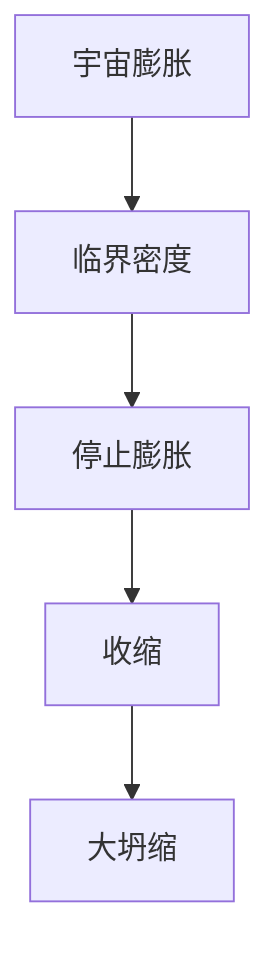

**核心算法原理讲解：**

大坍缩假说的计算可以通过以下伪代码表示：

```python
def big_crunch(hubble_parameter, critical_density):
    # 判断宇宙是否达到临界密度
    if universe_density > critical_density:
        # 宇宙将停止膨胀并开始收缩
        expand = False
    else:
        # 宇宙将继续膨胀
        expand = True
    
    return expand
```

**数学模型和公式：**

宇宙的平均密度可以通过以下公式计算：

$$
\rho = \frac{3H_0^2}{8\pi G}
$$

其中，$\rho$ 是宇宙平均密度，$H_0$ 是哈勃常数，$G$ 是引力常数。

**举例说明：**

假设宇宙的哈勃常数为 $H_0 = 70\text{ km/s/Mpc}$，引力常数为 $G = 6.674 \times 10^{-11}\text{ N}\text{m}^2/\text{kg}^2$，则宇宙的平均密度为：

$$
\rho = \frac{3 \times (70 \times 10^3 \text{ m/s})^2}{8\pi \times 6.674 \times 10^{-11}\text{ N}\text{m}^2/\text{kg}^2} \approx 9.3 \times 10^{-30}\text{ kg/m}^3
$$

**小结：**

大坍缩假说认为，如果宇宙的平均密度大于临界值，宇宙将最终停止膨胀并开始收缩。在本章中，我们介绍了大坍缩假说的核心概念、算法原理和数学模型，并给出了具体的计算实例。

#### 7.2 大撕裂假说

大撕裂假说提出，如果宇宙的平均密度小于临界值，宇宙将继续膨胀，最终导致宇宙结构被撕裂。在这种情况下，宇宙中的物质将无法保持在一起，空间本身将被撕裂。

**核心概念与联系：**

- **大撕裂假说（Big Rip Hypothesis）**：宇宙继续膨胀，最终导致宇宙结构被撕裂。
- **临界密度（Critical Density）**：宇宙密度达到这一值时，宇宙将继续膨胀。
- **空间撕裂（Spacetime Rupture）**：宇宙物质无法保持在一起，空间本身被撕裂。

大撕裂假说的Mermaid流程图如下：

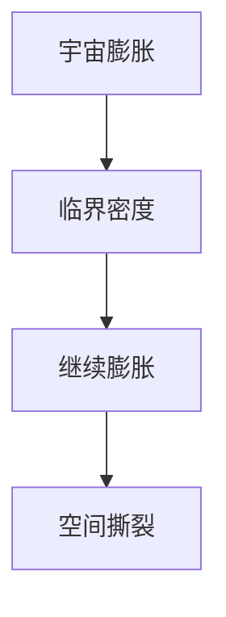

**核心算法原理讲解：**

大撕裂假说的计算可以通过以下伪代码表示：

```python
def big_rip(hubble_parameter, critical_density):
    # 判断宇宙是否小于临界密度
    if universe_density < critical_density:
        # 宇宙将继续膨胀并最终撕裂
        expand = True
    else:
        # 宇宙将停止膨胀
        expand = False
    
    return expand
```

**数学模型和公式：**

宇宙的平均密度可以通过以下公式计算：

$$
\rho = \frac{3H_0^2}{8\pi G}
$$

**举例说明：**

假设宇宙的哈勃常数为 $H_0 = 70\text{ km/s/Mpc}$，引力常数为 $G = 6.674 \times 10^{-11}\text{ N}\text{m}^2/\text{kg}^2$，则宇宙的平均密度为：

$$
\rho = \frac{3 \times (70 \times 10^3 \text{ m/s})^2}{8\pi \times 6.674 \times 10^{-11}\text{ N}\text{m}^2/\text{kg}^2} \approx 9.3 \times 10^{-30}\text{ kg/m}^3
$$

**小结：**

大撕裂假说认为，如果宇宙的平均密度小于临界值，宇宙将继续膨胀，最终导致宇宙结构被撕裂。在本章中，我们介绍了大撕裂假说的核心概念、算法原理和数学模型，并给出了具体的计算实例。

#### 7.3 宇宙命运的可能性

除了大坍缩假说和大撕裂假说，宇宙的命运还有许多其他可能性。例如，宇宙可能以某种方式进入稳态，或者宇宙的膨胀速度可能保持不变，直到宇宙中的物质耗尽。

**核心概念与联系：**

- **稳态宇宙假说（Steady State Hypothesis）**：宇宙的结构和演化是稳定的。
- **物质耗尽（Material Exhaustion）**：宇宙中的物质最终耗尽。

稳态宇宙假说的Mermaid流程图如下：

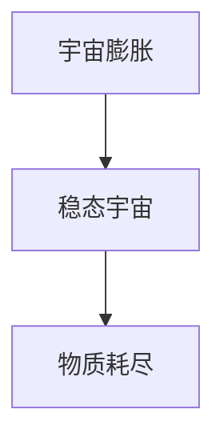

**核心算法原理讲解：**

稳态宇宙假说的计算可以通过以下伪代码表示：

```python
def steady_state_universe(hubble_parameter):
    # 判断宇宙是否进入稳态
    if hubble_parameter == constant_value:
        steady_state = True
    else:
        steady_state = False
    
    return steady_state
```

**数学模型和公式：**

宇宙的膨胀速度可以通过哈勃参数表示：

$$
H_0 = \frac{\dot{a}}{a}
$$

**举例说明：**

假设宇宙的哈勃常数为 $H_0 = 70\text{ km/s/Mpc}$，则宇宙的膨胀速度为：

$$
\dot{a} = H_0 \times a = 70\text{ km/s/Mpc} \times a
$$

**小结：**

宇宙的命运有多种可能性，包括大坍缩、大撕裂、稳态宇宙和物质耗尽等。在本章中，我们介绍了各种宇宙命运假设的核心概念、算法原理和数学模型，并给出了具体的计算实例。

关键词：宇宙的未来、大坍缩假说、大撕裂假说、稳态宇宙假说

摘要：本章探讨了宇宙的未来可能走向，包括大坍缩假说、大撕裂假说以及其他关于宇宙命运的假设。我们介绍了这些假说的核心概念、算法原理和数学模型，并给出了具体的计算实例。在下一章中，我们将总结宇宙封闭性与开放性的科学意义和哲学思考。|>
### 第8章：宇宙封闭性与开放性的科学意义

宇宙的封闭性与开放性在科学领域具有深远的意义，涉及到天文学、物理学、化学和生物学等多个学科。理解宇宙的封闭性和开放性有助于我们深入探讨宇宙的本质和演化过程。

#### 8.1 对天文学的启示

宇宙的封闭性为天文学家提供了关于天体演化和宇宙结构的线索。例如，通过研究星系和星团的形成过程，我们可以推断出宇宙的初始条件和演化历史。封闭系统中的熵增加原理可以帮助我们理解恒星和星系内部的物理过程，如恒星的生命周期、超新星爆发和黑洞的形成。

**核心概念与联系：**

- **星系和星团形成（Formation of Galaxies and Star Clusters）**：封闭系统中的物质和能量交换过程。
- **恒星生命周期（Stellar Lifecycles）**：封闭系统内的物理过程，如核聚变和核裂变。
- **熵增加原理（Entropy Increase Principle）**：封闭系统中熵的增加趋势。

天文学上的封闭性与开放性的关系可以表示为以下Mermaid流程图：

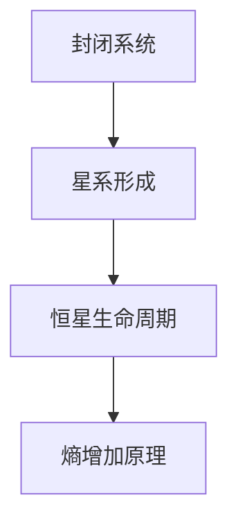

**核心算法原理讲解：**

天文学中的封闭性研究可以通过以下伪代码表示：

```python
def stellar_formation():
    # 初始化封闭系统
    init_closed_system()
    
    # 进行星系形成
    form_galaxies()
    
    # 研究恒星生命周期
    study_stellar_lifecycles()
    
    # 应用熵增加原理
    apply_entropy_increase()
```

**数学模型和公式：**

恒星生命周期可以通过以下公式描述：

$$
\text{恒星质量损失率} = \frac{\text{质量损失}}{\text{时间}}
$$

**举例说明：**

假设一颗恒星的质量损失率为 $10^{-7}\text{ M}_{\odot}\text{ / year}$（$M_{\odot}$ 表示太阳质量），其生命周期为 $10^{9}\text{ years}$，则该恒星的总质量损失为：

$$
\text{总质量损失} = 10^{-7}\text{ M}_{\odot}\text{ / year} \times 10^{9}\text{ years} = 0.1\text{ M}_{\odot}
$$

**小结：**

宇宙的封闭性对天文学具有重要意义，帮助我们理解星系和恒星的形成过程以及恒星的生命周期。在下一节中，我们将探讨宇宙封闭性与开放性在物理学中的影响。

#### 8.2 对物理学的影响

宇宙的封闭性与开放性对物理学的基本理论有着深远的影响，尤其是在引力、量子力学和热力学等领域。

**核心概念与联系：**

- **广义相对论（General Relativity）**：描述引力作为时空弯曲的理论。
- **量子力学（Quantum Mechanics）**：描述微观粒子的行为。
- **热力学第二定律（Second Law of Thermodynamics）**：描述封闭系统中熵的增加。

物理学中的封闭性与开放性的关系可以表示为以下Mermaid流程图：

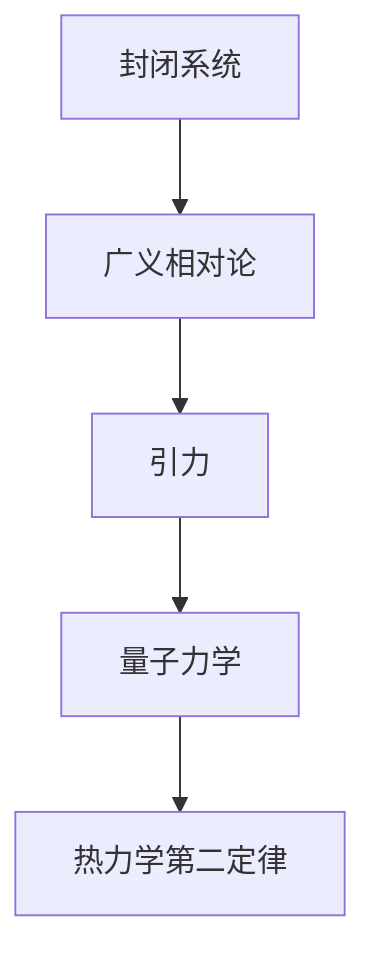

**核心算法原理讲解：**

物理学中的封闭性研究可以通过以下伪代码表示：

```python
def physical_research():
    # 研究引力
    study_gravity()
    
    # 研究量子力学
    study_quantum_mechanics()
    
    # 研究热力学第二定律
    study_thermodynamics()
```

**数学模型和公式：**

引力可以用以下公式描述：

$$
F = G\frac{m_1m_2}{r^2}
$$

**举例说明：**

假设两个物体的质量分别为 $m_1 = 2\text{ kg}$ 和 $m_2 = 3\text{ kg}$，它们之间的距离为 $r = 1\text{ m}$，则它们之间的引力为：

$$
F = 6.674 \times 10^{-11}\text{ N}\frac{(2\text{ kg})(3\text{ kg})}{(1\text{ m})^2} = 4.002 \times 10^{-10}\text{ N}
$$

**小结：**

宇宙的封闭性与开放性对物理学的基本理论有着深远的影响，帮助我们理解引力、量子力学和热力学等领域。在下一节中，我们将探讨宇宙封闭性与开放性在化学和生物学中的意义。

#### 8.3 对化学与生物学的启示

宇宙的封闭性与开放性在化学和生物学中也具有重要应用，尤其是在分子反应和生态系统动态的研究中。

**核心概念与联系：**

- **化学反应（Chemical Reactions）**：封闭系统中分子间的反应。
- **生态系统动态（Ecosystem Dynamics）**：开放系统中生物群落的变化。

化学与生物学中的封闭性与开放性的关系可以表示为以下Mermaid流程图：

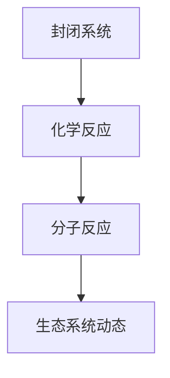

**核心算法原理讲解：**

化学与生物学中的封闭性研究可以通过以下伪代码表示：

```python
def chemical_reactions():
    # 初始化封闭系统
    init_closed_system()
    
    # 进行分子反应
    perform_molecular_reactions()
    
    # 研究生态系统动态
    study_ecosystem_dynamics()
```

**数学模型和公式：**

化学反应可以用以下公式描述：

$$
\text{反应速率} = k[\text{反应物浓度}]
$$

**举例说明：**

假设一个化学反应的速率常数为 $k = 10^3\text{ s}^{-1}$，反应物的初始浓度为 $[\text{反应物}]_0 = 1\text{ mol/L}$，则反应速率可以计算为：

$$
\text{反应速率} = k[\text{反应物浓度}] = 10^3\text{ s}^{-1} \times 1\text{ mol/L} = 10^3\text{ mol/L}\text{s}
$$

**小结：**

宇宙的封闭性与开放性在化学和生物学领域具有重要意义，帮助我们理解化学反应和生态系统动态。在下一章中，我们将探讨宇宙封闭性与开放性的哲学思考。

关键词：天文学、物理学、化学、生物学、封闭性、开放性

摘要：本章介绍了宇宙封闭性与开放性在天文学、物理学、化学和生物学中的意义。我们通过核心概念、算法原理和数学模型，详细阐述了宇宙封闭性对各个学科的影响，并给出了具体的计算实例。在下一章中，我们将探讨宇宙封闭性与开放性的哲学思考。|>
### 第9章：宇宙封闭性与开放性的哲学思考

宇宙的封闭性与开放性不仅具有科学意义，也在哲学上引发了深刻的思考。在本章中，我们将探讨宇宙封闭性与开放性对人类存在的思考、宇宙命运的影响，以及它们在哲学上的意义。

#### 9.1 封闭系统与自由意志

封闭系统与自由意志之间的关系是一个哲学上的重要议题。在封闭系统中，一切过程都遵循物理定律，似乎没有自由意志的余地。然而，在开放系统中，人类能够与环境进行物质和能量的交换，从而表现出某种程度的自由意志。

**核心概念与联系：**

- **封闭系统（Closed System）**：与外界无物质和能量交换的系统。
- **自由意志（Free Will）**：人类在开放系统中表现出的自主决策能力。
- **决定论（Determinism）**：封闭系统中的物理过程遵循因果律。

哲学思考中的封闭系统与自由意志的关系可以用以下Mermaid流程图表示：

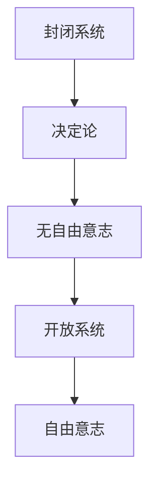

**核心思想讲解：**

封闭系统中的物理过程遵循因果律，似乎没有自由意志的余地。然而，在开放系统中，人类能够与环境进行物质和能量的交换，从而表现出自由意志。这种自由意志可能源于人类大脑的复杂性，它使得人类能够在一定程度上超越物理定律的约束。

**举例说明：**

在开放系统中，人类可以通过思考、选择和行动来影响环境。例如，一个人可以选择是否去上学，这个选择虽然受到遗传和环境的影响，但仍然具有某种自由意志。这种自由意志使得人类能够创造文化和技术，推动社会的进步。

**小结：**

封闭系统与自由意志之间的关系是一个哲学上的重要议题。在封闭系统中，一切过程都遵循物理定律，似乎没有自由意志的余地。然而，在开放系统中，人类能够与环境进行物质和能量的交换，从而表现出自由意志。这种自由意志虽然受到物理定律的约束，但仍然是人类能动性的体现。

#### 9.2 开放系统与宇宙命运

宇宙的命运与封闭系统与开放系统的相互作用密切相关。宇宙的封闭性可能导致宇宙收缩（大坍缩），而开放性可能导致宇宙无限膨胀（大撕裂）。这两种情况都将影响宇宙的未来和人类的命运。

**核心概念与联系：**

- **开放系统（Open System）**：与外界进行物质和能量交换的系统。
- **宇宙命运（Cosmic Fate）**：宇宙的未来走向。
- **大坍缩（Big Crunch）**：宇宙收缩至一个奇点。
- **大撕裂（Big Rip）**：宇宙无限膨胀直至结构被撕裂。

哲学思考中的开放系统与宇宙命运的关系可以用以下Mermaid流程图表示：

```mermaid
graph TD
    A[开放系统] --> B[宇宙命运]
    B --> C[大坍缩]
    B --> D[大撕裂]
```

**核心思想讲解：**

开放系统的性质决定了宇宙的未来。如果宇宙的平均密度大于临界值，宇宙可能进入大坍缩，导致宇宙最终收缩至一个奇点。相反，如果宇宙的平均密度小于临界值，宇宙可能进入大撕裂，导致宇宙无限膨胀直至结构被撕裂。这两种情况都将对宇宙的未来和人类的命运产生深远影响。

**举例说明：**

假设宇宙的平均密度大于临界值，宇宙将进入大坍缩。在这种情况下，恒星和星系将逐渐靠近，最终塌缩成奇点。人类文明可能无法生存，因为物理定律将变得极端复杂，甚至可能崩溃。

相反，如果宇宙的平均密度小于临界值，宇宙将进入大撕裂。在这种情况下，宇宙将不断膨胀，恒星和星系将逐渐远离。人类文明可能无法维持，因为物理定律将变得极端混乱，甚至可能崩溃。

**小结：**

开放系统的性质决定了宇宙的命运。如果宇宙的平均密度大于临界值，宇宙可能进入大坍缩，导致宇宙最终收缩至一个奇点。相反，如果宇宙的平均密度小于临界值，宇宙可能进入大撕裂，导致宇宙无限膨胀直至结构被撕裂。这两种情况都将对宇宙的未来和人类的命运产生深远影响。

#### 9.3 封闭系统与开放系统在哲学上的意义

封闭系统与开放系统不仅在科学上具有重要意义，也在哲学上引发了深刻的思考。它们代表了宇宙中两种截然不同的状态，分别对应着决定论和自由意志的哲学观点。

**核心概念与联系：**

- **封闭系统（Closed System）**：与外界无物质和能量交换的系统，代表决定论。
- **开放系统（Open System）**：与外界进行物质和能量交换的系统，代表自由意志。
- **决定论（Determinism）**：一切过程都遵循物理定律，无自由意志。
- **自由意志（Free Will）**：人类在开放系统中表现出的自主决策能力。

哲学思考中的封闭系统与开放系统的关系可以用以下Mermaid流程图表示：

```mermaid
graph TD
    A[封闭系统] --> B[决定论]
    A --> C[物理定律]
    B --> D[开放系统]
    D --> E[自由意志]
```

**核心思想讲解：**

封闭系统与开放系统在哲学上代表了两种不同的世界观。封闭系统中的决定论认为一切过程都遵循物理定律，无自由意志。而开放系统中的自由意志则认为人类在开放系统中能够进行自主决策，表现出自理性。

**举例说明：**

在封闭系统中，一切过程都遵循物理定律，例如牛顿的万有引力定律。在这种情况下，一切天体的运动都可以通过数学公式精确预测，似乎没有自由意志的余地。

相反，在开放系统中，人类能够与环境进行物质和能量的交换，从而表现出自由意志。例如，一个人可以选择是否去上学，这个选择虽然受到遗传和环境的影响，但仍然具有某种自由意志。

**小结：**

封闭系统与开放系统在哲学上具有重要意义，代表了宇宙中两种截然不同的状态，分别对应着决定论和自由意志的哲学观点。封闭系统中的决定论认为一切过程都遵循物理定律，无自由意志。而开放系统中的自由意志则认为人类在开放系统中能够进行自主决策，表现出自理性。

关键词：封闭系统、开放系统、自由意志、决定论、宇宙命运、哲学思考

摘要：本章探讨了宇宙封闭性与开放性的哲学思考，包括封闭系统与自由意志的关系、开放系统与宇宙命运的影响，以及封闭系统与开放系统在哲学上的意义。通过核心概念、核心思想讲解和举例说明，我们深入理解了宇宙封闭性与开放性在哲学上的重要影响。|>
### 第10章：结论与展望

在本书中，我们系统地探讨了宇宙的本质：封闭系统还是开放系统。通过对宇宙起源、封闭系统与开放系统的定义、宇宙中的封闭系统与开放系统、宇宙中的相互作用、封闭系统与开放系统的动态平衡以及宇宙的未来等问题的深入分析，我们得出了以下结论：

#### 主要结论

1. **宇宙的起源**：宇宙起源于大约138亿年前的一个极热、极密的奇点，随后经历了大爆炸和膨胀过程，形成了我们所观察到的宇宙结构。
2. **封闭系统与开放系统的定义**：封闭系统是指与外界无物质和能量交换的系统，而开放系统则与外界存在物质和能量的交换。
3. **宇宙中的封闭系统**：宇宙中的封闭系统包括星系、恒星和行星系统，它们通过引力相互作用形成稳定的结构。
4. **宇宙中的开放系统**：宇宙中的开放系统如星际介质、暗物质和暗能量等，它们在恒星形成和宇宙演化中起着关键作用。
5. **宇宙中的相互作用**：宇宙中的基本相互作用包括引力作用、电磁作用、强相互作用和弱相互作用，它们共同决定了宇宙的结构和演化。
6. **封闭系统与开放系统的动态平衡**：封闭系统与开放系统之间存在动态平衡，封闭系统提供了稳定的基础，而开放系统通过适应外部环境变化推动宇宙的演化。
7. **宇宙的未来**：宇宙的未来可能走向大坍缩、大撕裂或其他形态，具体取决于宇宙的平均密度和暗能量的性质。

#### 展望

在未来的宇宙学研究中，以下几个方向值得关注：

1. **宇宙密度测量**：精确测量宇宙的平均密度，以确定宇宙未来的走向。这需要更先进的观测技术和更精确的测量方法。
2. **暗物质与暗能量研究**：深入研究暗物质和暗能量的性质，以理解它们在宇宙演化中的作用。这可能涉及粒子物理、引力理论和量子力学等多学科的交叉研究。
3. **宇宙演化的模拟**：通过计算机模拟，重现宇宙从大爆炸到现在的演化过程，以验证现有理论并探索新的宇宙模型。
4. **宇宙学基本参数的精确测量**：如哈勃常数、宇宙学常数等，这些参数对于理解宇宙的起源和演化具有重要意义。
5. **宇宙观测与实验**：利用地面和太空望远镜进行更多宇宙观测，以及进行更多宇宙学实验，以获取关于宇宙本质的更多直接证据。

#### 对读者的启示

本书不仅提供了关于宇宙封闭性与开放性的深入分析，也旨在激发读者对宇宙学的好奇心和探索精神。以下是对读者的几点启示：

1. **培养科学思维**：通过本书的学习，读者可以学会运用科学方法进行思考和推理，理解宇宙的基本规律和演化过程。
2. **拓宽知识视野**：宇宙学是跨学科的研究领域，读者可以从本书中了解到物理学、化学、生物学等多个学科的知识。
3. **激发探索精神**：宇宙是一个充满奥秘的领域，读者可以通过学习本书，激发对宇宙探索的兴趣，并参与到这一领域的研究中。
4. **思考人生意义**：宇宙的封闭性与开放性不仅关乎科学，也关乎哲学和人类存在。读者可以通过本书的思考，对人生和宇宙的意义有更深的理解。

总之，本书为读者提供了一个全面、系统的宇宙学视角，旨在引导读者深入探索宇宙的本质，理解宇宙的封闭性与开放性，并从中获得对生命和世界的深刻启示。

关键词：宇宙本质、封闭系统、开放系统、宇宙学、相互作用、动态平衡、宇宙未来

摘要：本书系统地探讨了宇宙的本质，包括宇宙的起源、封闭系统与开放系统的定义、宇宙中的封闭系统与开放系统、宇宙中的相互作用、封闭系统与开放系统的动态平衡以及宇宙的未来。通过本书的学习，读者可以深入理解宇宙的本质，并激发对宇宙探索的兴趣。未来，宇宙学将继续在多个领域取得突破，为人类揭示宇宙的更多奥秘。|>
### 附录A：宇宙封闭性与开放性的研究方法

为了深入理解宇宙的本质，科学家们采用了多种研究方法，包括观测方法、理论模型和数学工具。以下是对这些方法的详细介绍。

#### 观测方法

宇宙学研究的一个重要方面是观测宇宙中的各种现象。观测方法主要包括：

1. **光学观测**：使用地面和太空望远镜观测宇宙中的恒星、星系和其他天体。光学观测能够提供天体的亮度和颜色信息。
2. **射电观测**：通过射电望远镜观测宇宙中的射电波，这些射电波可能来自于星际介质、脉冲星或其他天体。
3. **X射线观测**：使用X射线望远镜观测高能天体，如黑洞、中子星和星系核。
4. **伽马射线观测**：通过伽马射线望远镜观测宇宙中的伽马射线，这些射线可能来自于超新星爆发、黑洞吞噬物质等极端事件。
5. **红外线观测**：使用红外线望远镜观测宇宙中的低温物体，如星云、行星和尘埃云。

#### 理论模型

宇宙学研究中的理论模型是描述宇宙演化的重要工具。以下是几个关键理论模型：

1. **大爆炸理论**：描述宇宙从奇点爆炸开始的瞬间，随后宇宙开始膨胀。该理论提供了宇宙起源和演化的基本框架。
2. **广义相对论**：描述引力作为时空的弯曲。广义相对论预言了黑洞、引力波和宇宙膨胀等现象。
3. **量子场论**：描述基本粒子和它们之间的相互作用。量子场论是现代物理学的基础之一，有助于理解宇宙的量子性质。
4. **宇宙学模型**：如弗里德曼-勒梅特-罗伯逊-沃尔克（FLRW）模型，描述宇宙的膨胀、密度和形态。

#### 数学工具

在宇宙学研究中，数学工具被广泛应用于描述宇宙的物理现象。以下是几个关键数学工具：

1. **纳维-斯托克斯方程**：描述流体运动，用于研究星际介质中的气体运动。
2. **弗里德曼方程**：描述宇宙膨胀的速度和尺度因子，用于研究宇宙学参数。
3. **拉普拉斯方程**：描述波动现象，用于研究引力波的传播。
4. **广义协变导数**：用于描述时空中的物理量，是广义相对论的核心。
5. **拉格朗日和哈密顿量**：用于描述物理系统的动力学，是量子场论和宇宙学模型的基础。

#### 实际案例

以下是一个关于宇宙学研究的实际案例：

**案例：测量宇宙膨胀速度**

科学家们使用多信使观测来测量宇宙膨胀速度。这一方法结合了光学、射电和引力波观测数据。具体步骤如下：

1. **光学观测**：使用地面望远镜测量远距离星系的红移，这提供了星系距离和宇宙膨胀速度的信息。
2. **射电观测**：使用射电望远镜测量星系中心的射电源，这提供了星系的质量和引力信息。
3. **引力波观测**：使用激光干涉仪重力波探测器（如LIGO和VIRGO）测量引力波信号，这提供了宇宙膨胀速度的额外信息。
4. **数据分析**：结合光学、射电和引力波观测数据，科学家们可以精确测量宇宙膨胀速度，并推断宇宙学参数。

**小结**

宇宙封闭性与开放性的研究方法包括观测方法、理论模型和数学工具。这些方法为科学家们提供了深入了解宇宙本质的手段。通过结合多种观测数据和理论模型，科学家们可以不断揭示宇宙的奥秘，为人类理解宇宙的起源和演化提供了坚实的科学基础。|>
### 《宇宙的本质：封闭系统还是开放系统》

#### 关键词

宇宙本质、封闭系统、开放系统、宇宙学、相互作用、动态平衡

#### 摘要

《宇宙的本质：封闭系统还是开放系统》深入探讨了宇宙的本质问题，从科学和哲学的角度分析了宇宙的封闭性与开放性。本书首先介绍了宇宙的起源和演化过程，详细阐述了封闭系统与开放系统的定义及其在宇宙中的表现。接着，通过分析宇宙中的相互作用和封闭系统与开放系统的动态平衡，本书揭示了宇宙的未来可能走向。最后，从哲学角度探讨了封闭系统与自由意志、开放系统与宇宙命运的关系，为读者提供了关于宇宙和人类存在的深刻思考。本书不仅为宇宙学研究提供了丰富的理论资源，也激发了读者对宇宙探索的兴趣和思考。|>

