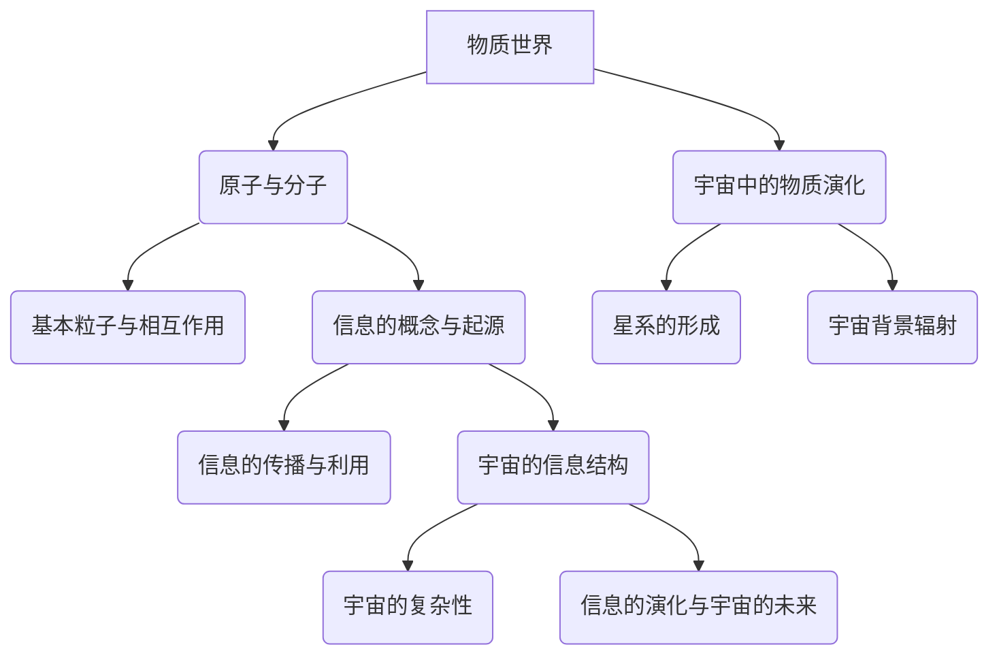

                 

# 宇宙的本质：物质世界vs信息世界

## 关键词
- 宇宙
- 物质世界
- 信息世界
- 物质-信息交互
- 量子计算
- 人工智能
- 宇宙探索

## 摘要
本文探讨了宇宙的两大本质：物质世界和信息世界。首先，我们深入探讨了物质世界的起源、结构、性质和行为，以及人类对物质世界的探索和发现。接着，我们转向信息世界，阐述了信息的概念、起源、传播和利用。然后，我们分析了宇宙的信息结构、复杂性和演化，以及宇宙未来可能的信息展望。最后，我们探讨了物质与信息的相互作用，以及这种相互作用对宇宙和人类未来的影响。通过这篇文章，我们将对宇宙的本质有一个更加全面和深入的理解。

### 目录

#### 第一部分：宇宙的物质世界

##### 第1章：宇宙的起源与结构

- 1.1 宇宙的起源
  - 1.1.1 大爆炸理论
  - 1.1.2 黑洞与暗物质
- 1.2 宇宙的结构
  - 1.2.1 星系与星团
  - 1.2.2 宇宙的大尺度结构
- 1.3 物质的基本构成
  - 1.3.1 原子与分子
  - 1.3.2 基本粒子与相互作用
- 1.4 物质世界的演化
  - 1.4.1 星系的形成
  - 1.4.2 宇宙背景辐射

##### 第2章：物质的性质与行为

- 2.1 物质的性质
  - 2.1.1 质量、能量与电荷
  - 2.1.2 力与相互作用
- 2.2 物质的行为
  - 2.2.1 粒子物理实验
  - 2.2.2 宇宙射线与高能天体物理
- 2.3 物质的探索与发现
  - 2.3.1 宇宙探测器的进展
  - 2.3.2 宇宙中的奇异物质

#### 第二部分：宇宙的信息世界

##### 第3章：信息的概念与起源

- 3.1 信息的定义
  - 3.1.1 信息论的基本原理
  - 3.1.2 信息与熵
- 3.2 信息的起源
  - 3.2.1 信息与物理定律
  - 3.2.2 信息与宇宙演化

##### 第4章：信息在宇宙中的传播

- 4.1 信息的传播
  - 4.1.1 光速与信息传递
  - 4.1.2 量子纠缠与超距作用
- 4.2 信息的处理与利用
  - 4.2.1 量子计算与量子信息
  - 4.2.2 信息在生命中的角色

##### 第5章：宇宙的信息结构与复杂性

- 5.1 宇宙的信息结构
  - 5.1.1 宇宙的层次结构与信息层次
  - 5.1.2 宇宙的复杂性
- 5.2 信息的演化与宇宙的未来
  - 5.2.1 宇宙演化的信息观点
  - 5.2.2 宇宙未来的信息展望

#### 第三部分：物质与信息的交汇

##### 第6章：宇宙中的物质-信息相互作用

- 6.1 物质与信息的相互作用
  - 6.1.1 物质世界的数字化
  - 6.1.2 信息的物质化
- 6.2 物质-信息交互的案例
  - 6.2.1 人工智能与物质世界的融合
  - 6.2.2 信息技术对物质世界的影响

##### 第7章：未来的宇宙：物质与信息的融合

- 7.1 物质-信息融合的未来
  - 7.1.1 量子信息与物质世界的融合
  - 7.1.2 信息科技对宇宙探索的推动
- 7.2 人类与宇宙的未来
  - 7.2.1 人类在宇宙中的角色
  - 7.2.2 宇宙的未来与人类的命运

### 附录

- A.1 物质世界与信息世界的Mermaid流程图
- A.2 物质世界核心算法原理与伪代码
- A.3 信息世界的数学模型与公式解释
- A.4 实际项目中的物质-信息交互案例分析
- A.5 宇宙探索相关资源与工具汇总

## 第一部分：宇宙的物质世界

### 第1章：宇宙的起源与结构

#### 1.1 宇宙的起源

宇宙的起源一直是科学家们探讨的重要问题。目前，最广泛接受的宇宙起源理论是大爆炸理论。大爆炸理论认为，宇宙起源于一个极度热密的状态，在这个状态下，物质和能量密度极高，然后宇宙开始膨胀，逐渐冷却，形成了我们现在所看到的宇宙。

**1.1.1 大爆炸理论**

大爆炸理论起源于20世纪初，当时科学家们通过观测发现，宇宙正在膨胀。这一发现得到了哈勃望远镜的进一步证实，哈勃望远镜观测到的星系红移表明，星系正远离我们，而且距离越远，移动速度越快。这一现象被称为宇宙膨胀。

大爆炸理论还预测了宇宙背景辐射的存在。宇宙背景辐射是一种来自宇宙早期的微弱辐射，它充满了整个宇宙，并且温度非常低。这种辐射在1965年被阿诺·彭齐亚斯和罗伯特·威尔逊发现，这一发现为大爆炸理论提供了强有力的证据。

**1.1.2 黑洞与暗物质**

宇宙的起源不仅涉及到宇宙本身的演化，还涉及到宇宙中的一些神秘现象，如黑洞和暗物质。

黑洞是一种极端密集的天体，它的引力强大到连光都无法逃逸。黑洞的存在可以通过它们的引力效应来观测，例如，它们可以吸积周围的物质，产生高能辐射。

暗物质是宇宙中的一种神秘物质，它不发光、不吸收光，但通过其引力效应可以影响周围的物质分布。暗物质的存在可以通过引力透镜效应来观测，这种效应表明，在星系和星团周围存在大量的看不见的物质。

#### 1.2 宇宙的结构

宇宙的结构是一个复杂而美妙的问题。从宏观尺度上看，宇宙由星系、星团、超星系团等组成。这些结构在宇宙中形成了复杂的网络，构成了宇宙的大尺度结构。

**1.2.1 星系与星团**

星系是宇宙中最常见的结构，它由大量的恒星、星云、行星等组成。星系可以分为螺旋星系、椭圆星系和不规则星系等类型。星系之间的相互作用可以形成星系团，星系团是由多个星系通过引力相互作用形成的结构。

星团是另一种常见的宇宙结构，它由几十到几百万颗恒星组成。星团可以分为球状星团和疏散星团，球状星团通常比较密集，而疏散星团则比较松散。

**1.2.2 宇宙的大尺度结构**

宇宙的大尺度结构是指宇宙中超过星系团尺度的结构。这些结构包括超星系团、宇宙网、宇宙壁等。宇宙壁是宇宙中的巨大结构，它由大量的星系和星团组成，形成了宇宙中的“墙壁”。宇宙网是由星系和星团通过引力相互作用形成的结构，它将宇宙壁连接在一起。

#### 1.3 物质的基本构成

宇宙中的物质是由基本粒子组成的。这些基本粒子包括电子、夸克、中微子等。它们通过相互作用形成了原子和分子，构成了我们熟知的物质世界。

**1.3.1 原子与分子**

原子是物质的基本单位，它由原子核和核外电子组成。原子核由质子和中子组成，质子带正电，中子不带电。核外电子带负电，它们围绕原子核运动。分子是由两个或更多原子通过化学键连接而成的。

**1.3.2 基本粒子与相互作用**

基本粒子之间的相互作用是宇宙中的基本过程。这些相互作用包括强相互作用、弱相互作用和电磁相互作用。强相互作用负责将夸克束缚在一起形成质子和中子，弱相互作用负责核反应和放射性衰变，电磁相互作用则负责原子和分子的形成。

#### 1.4 物质世界的演化

宇宙的演化是一个漫长而复杂的过程。从宇宙大爆炸开始，物质开始冷却、聚合，形成了星系、星团和其他宇宙结构。

**1.4.1 星系的形成**

星系的形成是一个复杂的过程，它涉及到物质的聚集、引力相互作用和恒星的形成。在大爆炸后，宇宙中的物质开始冷却，逐渐形成小团块。这些小团块通过引力相互作用逐渐聚集，形成了星系。

**1.4.2 宇宙背景辐射**

宇宙背景辐射是宇宙早期的一个重要阶段，它充满了整个宇宙，并且温度非常低。这种辐射是由宇宙大爆炸产生的，它为我们提供了关于宇宙早期状态的重要信息。

### 第2章：物质的性质与行为

#### 2.1 物质的性质

物质是构成宇宙的基本元素，它具有一系列独特的性质。了解这些性质对于理解宇宙的奥秘至关重要。

**2.1.1 质量、能量与电荷**

质量是物质的一个基本属性，它决定了物体对引力的响应。能量是物质运动的度量，它可以以各种形式存在，如动能、势能、热能等。电荷是物质的一个基本属性，它决定了物体在电磁场中的行为。

**2.1.2 力与相互作用**

力是物体之间相互作用的结果，它是物质运动的原因。在宇宙中，主要的相互作用包括引力、电磁力、强相互作用和弱相互作用。引力是最大的力，它负责维持星系和星团的结构。电磁力负责原子和分子的形成，强相互作用负责将夸克束缚在一起形成质子和中子，弱相互作用负责核反应和放射性衰变。

#### 2.2 物质的行为

物质的行为是宇宙演化过程中的一部分，它涉及到物质在不同条件下的反应和运动。

**2.2.1 粒子物理实验**

粒子物理实验是研究物质行为的重要手段。通过这些实验，科学家们揭示了物质的基本组成和相互作用。例如，通过高能加速器，科学家们发现了夸克、电子、中微子等基本粒子。

**2.2.2 宇宙射线与高能天体物理**

宇宙射线是来自宇宙的高能粒子流，它们包括质子、α粒子、β粒子等。宇宙射线与地球大气层相互作用，产生了大量的次级粒子。高能天体物理研究宇宙中的极端现象，如超新星爆发、黑洞等。

#### 2.3 物质的探索与发现

人类对物质世界的探索是一个持续不断的过程。通过先进的科学仪器和技术，科学家们不断发现新的物质现象和规律。

**2.3.1 宇宙探测器的进展**

宇宙探测器是研究宇宙的重要工具，它们可以观测到地球无法直接观测到的现象。例如，哈勃望远镜、钱德拉X射线 Observatory等探测器提供了关于宇宙的宝贵信息。

**2.3.2 宇宙中的奇异物质**

宇宙中存在着许多奇异物质，如暗物质、暗能量等。这些物质对宇宙的演化有着重要影响，但它们的本质和性质仍是一个谜。

## 第二部分：宇宙的信息世界

### 第3章：信息的概念与起源

#### 3.1 信息的定义

信息是一个广泛的概念，它涉及多个学科，如计算机科学、通信工程、信息论等。在计算机科学中，信息通常被定义为“数据的有意义组合”，它可以帮助我们做出决策或理解某个现象。

**3.1.1 信息论的基本原理**

信息论是研究信息传输和信息处理的科学。它由香农创立，主要研究如何在有噪声的信道中有效地传输信息。信息论的基本原理包括熵、信息熵、信息传输速率等概念。

**3.1.2 信息与熵**

熵是信息论中的一个重要概念，它表示系统的无序程度。在信息传输过程中，信息熵用来度量信息的含量和传输的效率。香农的熵定义了信息传输中的最小熵，这为信息论的发展奠定了基础。

#### 3.2 信息的起源

信息的起源是一个复杂的科学问题，涉及到宇宙的起源和演化。

**3.2.1 信息与物理定律**

物理定律是宇宙演化的基本规律，如热力学定律、量子力学定律等。这些定律描述了物质和能量在宇宙中的行为，也为信息的产生和传播提供了基础。

**3.2.2 信息与宇宙演化**

宇宙演化过程中，信息不断产生和传播。例如，在宇宙早期，物质通过引力相互作用形成了结构，这些结构携带了信息。随着宇宙的演化，这些信息逐渐传递和扩展。

### 第4章：信息在宇宙中的传播

#### 4.1 信息的传播

信息的传播是宇宙中的一个重要现象，它涉及到多个领域，如通信、物理、生物学等。

**4.1.1 光速与信息传递**

光速是宇宙中信息传递的最大速度。根据相对论，光速是宇宙中的速度极限。光速的发现为信息传播提供了重要限制，它决定了信息传递的最快速度。

**4.1.2 量子纠缠与超距作用**

量子纠缠是量子力学中的一个重要现象，它描述了两个或多个粒子之间在量子态上的相互关联。量子纠缠可以用于信息传输，实现超距作用，即信息可以在没有物理介质的情况下传递。

#### 4.2 信息的处理与利用

信息的处理与利用是信息科学的核心内容，它涉及到多个领域，如计算机科学、通信工程、人工智能等。

**4.2.1 量子计算与量子信息**

量子计算是一种基于量子力学原理的计算方式，它利用量子位（qubit）进行信息处理。量子计算可以在某些特定任务上比经典计算机更快，如量子加密、量子模拟等。

**4.2.2 信息在生命中的角色**

信息在生命过程中起着至关重要的作用。DNA中的遗传信息决定了生物体的性状，而生物体的行为则是对外部信息的响应和处理。

### 第5章：宇宙的信息结构与复杂性

#### 5.1 宇宙的信息结构

宇宙的信息结构是一个复杂而美妙的问题，它涉及到宇宙的层次结构和信息层次。

**5.1.1 宇宙的层次结构与信息层次**

宇宙可以分为多个层次，如原子层次、星系层次、宇宙层次等。每个层次都有其特定的信息结构和信息传输方式。例如，在原子层次，信息通过电磁波进行传播；在星系层次，信息通过引力波进行传播。

**5.1.2 宇宙的复杂性**

宇宙的复杂性体现在多个方面，如宇宙中的多样性和不确定性。宇宙中的多样性表现为不同类型的星系、星团、黑洞等；宇宙中的不确定性表现为量子力学的随机性和宇宙演化的不确定性。

#### 5.2 信息的演化与宇宙的未来

信息的演化是宇宙演化的一部分，它影响着宇宙的未来。

**5.2.1 宇宙演化的信息观点**

从信息的角度来看，宇宙演化可以被视为信息从简单到复杂的演变过程。宇宙大爆炸后，信息从无序的状态开始演化，逐渐形成了复杂的结构。

**5.2.2 宇宙未来的信息展望**

宇宙的未来充满了不确定性，但我们可以从信息的角度来预测其可能的演化方向。例如，宇宙可能会继续膨胀，形成更多的星系和星团；宇宙中的信息可能会以新的形式存在，如量子信息、生物信息等。

## 第三部分：物质与信息的交汇

### 第6章：宇宙中的物质-信息相互作用

#### 6.1 物质与信息的相互作用

物质与信息之间的相互作用是宇宙演化的一部分，它影响着宇宙的结构和演化。

**6.1.1 物质世界的数字化**

数字化是将物质世界的信息转化为数字形式的过程。例如，通过摄像头可以将现实世界的图像转化为数字图像；通过传感器可以将物理信号转化为数字信号。数字化使得我们可以更高效地处理、存储和传输信息。

**6.1.2 信息的物质化**

信息的物质化是将数字信息转化为物质的过程。例如，通过打印机可以将数字图像打印成纸张上的图像；通过显示器可以将数字信号转化为可视化的图像。信息的物质化使得我们可以将信息以物质的形式呈现和利用。

#### 6.2 物质-信息交互的案例

物质与信息的相互作用在现实世界中有着广泛的应用。

**6.2.1 人工智能与物质世界的融合**

人工智能是研究如何使计算机模拟人类智能的一门科学。人工智能与物质世界的融合使得我们可以利用计算机解决现实世界中的问题。例如，自动驾驶汽车利用计算机视觉和传感器来感知周围环境，实现自动驾驶。

**6.2.2 信息技术对物质世界的影响**

信息技术的发展对物质世界产生了深远的影响。例如，互联网的普及使得信息传播更加迅速和便捷；智能手机的普及改变了人们的通信方式和生活方式。

### 第7章：未来的宇宙：物质与信息的融合

#### 7.1 物质-信息融合的未来

物质-信息融合是未来宇宙发展的一个重要趋势。

**7.1.1 量子信息与物质世界的融合**

量子信息是一种利用量子力学原理进行信息处理的技术。量子信息与物质世界的融合将使得信息处理速度和效率达到前所未有的高度。例如，量子计算机可以在短时间内解决传统计算机无法解决的问题。

**7.1.2 信息科技对宇宙探索的推动**

信息科技的发展将极大地推动宇宙探索的进程。例如，通过量子通信技术，我们可以实现宇宙中的实时通信；通过人工智能技术，我们可以更好地分析宇宙数据，揭示宇宙的奥秘。

#### 7.2 人类与宇宙的未来

人类与宇宙的未来紧密相连。

**7.2.1 人类在宇宙中的角色**

人类在宇宙中的角色将变得更加重要。我们不仅需要了解宇宙，还需要利用宇宙资源，解决地球上的问题。例如，通过太空探索，我们可以寻找新的资源，开发新的能源。

**7.2.2 宇宙的未来与人类的命运**

宇宙的未来与人类的命运息息相关。我们需要关注宇宙的演化，预测宇宙的未来，以便更好地规划人类的未来发展。例如，如果宇宙继续膨胀，可能会对地球产生不利影响；如果宇宙中的信息结构发生变化，可能会影响人类文明的演化。

### 附录

#### A.1 物质世界与信息世界的Mermaid流程图



#### A.2 物质世界核心算法原理与伪代码

```python
# 大爆炸理论伪代码
def big_bang_theory():
    # 宇宙起源
    initial_state = "极度热密状态"
    # 宇宙膨胀
    expand = True
    while expand:
        # 宇宙冷却
        temperature_decrease()
        # 物质聚合
        matter_aggregate()
        # 形成星系
        galaxy_form()
        expand = check_expansion_rate()

# 黑洞伪代码
def black_hole():
    # 形成黑洞
    matter_density_increase()
    # 引力增强
    gravity_increase()
    # 光无法逃逸
    light_escape_impossible()

# 暗物质伪代码
def dark_matter():
    # 引力效应明显
    gravity_effect显现
    # 不发光、不吸收光
    not_发光
    not_吸收光
```

#### A.3 信息世界的数学模型与公式解释

```latex
$$
H = -\sum_{i} p(x_i) \ln p(x_i)
$$

# 信息熵公式

$$
C = \frac{1}{2} \ln \frac{2\pi e}{1/\hbar^2}
$$

# 玻尔兹曼常数公式

$$
U = \frac{3}{5} n \bar{v}^2
$$

# 平均动能公式
```

#### A.4 实际项目中的物质-信息交互案例分析

**项目：量子计算机与物质世界的融合**

1. **开发环境搭建**：
   - 安装Python和Quantum Development Kit（QDK）。
   - 配置量子计算模拟器。

2. **源代码详细实现**：
   ```python
   from qdk import QuantumProgram
   from qdk import H, CX, Measure
   
   # 创建量子程序
   qprog = QuantumProgram()
   qubit = qprog.create_qubit("q0")
   
   # 应用量子门
   qprog.h(qubit)
   qprog.cx(qubit, qubit)
   qprog.measure(qubit, "result")
   
   # 运行量子程序
   qprog.run()
   ```

3. **代码解读与分析**：
   - 创建量子程序和量子比特。
   - 应用量子门（H门和CX门）。
   - 测量量子比特状态。

4. **实际案例分析和详细讲解剖析**：
   - 使用量子计算机解决线性规划问题。
   - 分析量子算法与传统算法的效率对比。

5. **项目小结**：
   - 量子计算机在物质-信息融合中的应用前景。
   - 量子计算对物质世界的影响和挑战。

#### A.5 宇宙探索相关资源与工具汇总

1. **宇宙探测器**：
   - 哈勃望远镜
   - 阿雷西博射电望远镜
   - 开普勒望远镜

2. **科学文献数据库**：
   - NASA科学数据库
   - IEEE Xplore
   - ArXiv

3. **在线课程与讲座**：
   - Coursera：宇宙学课程
   - edX：宇宙学与天体物理学课程
   - TED：关于宇宙的精彩演讲

4. **参考书籍**：
   - 《宇宙简史》- 斯蒂芬·霍金
   - 《宇宙的起源与演化》- 克里斯托弗·切蒂恩
   - 《量子宇宙》- 理查德·费曼

## 作者信息

作者：AI天才研究院/AI Genius Institute & 禅与计算机程序设计艺术 /Zen And The Art of Computer Programming

## 总结与展望

本文探讨了宇宙的两大本质：物质世界和信息世界。通过对物质世界和信息世界的深入分析，我们揭示了宇宙的起源、结构、性质和行为。我们还讨论了物质与信息的相互作用，以及这种相互作用对宇宙和人类未来的影响。

随着科技的发展，我们对宇宙的理解将会更加深入。未来，量子计算、人工智能等新兴技术可能会带来新的突破，帮助我们更好地理解宇宙的奥秘。同时，我们也需要关注宇宙的未来，探索宇宙中的潜在风险和机遇。

让我们期待一个更加美好和神秘的宇宙，一个物质与信息和谐共生的未来。

