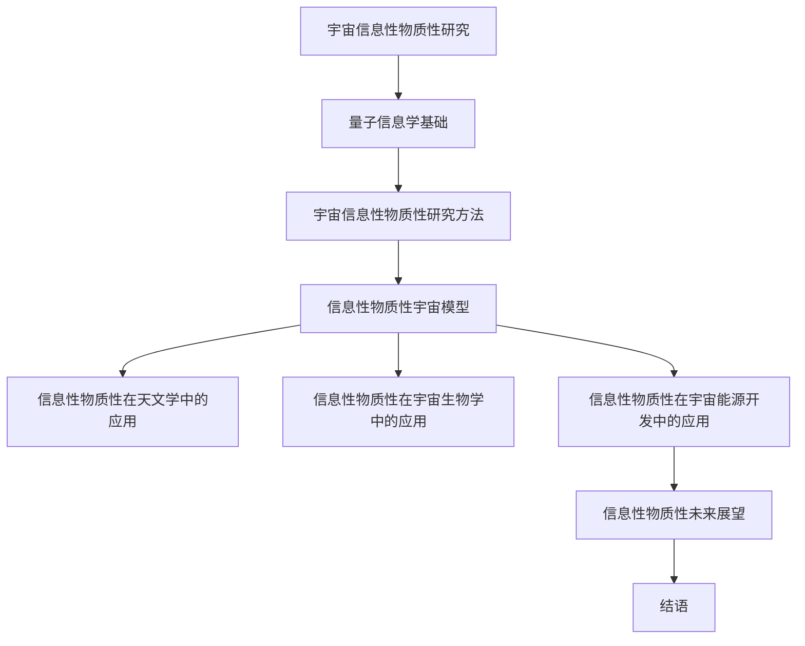

                 

# 宇宙的本质:物质性还是信息性的主导

## 关键词

- 宇宙本质
- 物质性
- 信息性
- 量子信息学
- 宇宙学
- 量子纠缠

## 摘要

本文探讨了宇宙的本质问题，即物质性是否主导宇宙，还是信息性更具主导作用。通过对量子信息学、宇宙学、天文学、宇宙生物学和宇宙能源开发的深入分析，本文提出了信息性物质性在宇宙中的核心作用，并探讨了其相关理论和应用。本文旨在通过逻辑清晰、结构紧凑的叙述，引导读者对宇宙本质问题进行深刻的思考。

## 《宇宙的本质:物质性还是信息性的主导》目录大纲

### 第一部分：引论

#### 第1章：宇宙探索与信息性物质性概念

- 1.1 宇宙探索的历程与挑战
- 1.2 信息性物质性的基本概念
- 1.3 信息性物质性在宇宙研究中的重要性
- 1.4 本书结构安排与阅读指南

### 第二部分：信息性物质性原理

#### 第2章：量子信息学基础

- 2.1 量子力学原理与信息理论
- 2.2 量子纠缠与量子信息
- 2.3 量子计算与量子模拟
- 2.4 量子通信与量子加密

#### 第3章：宇宙信息性物质性研究方法

- 3.1 宇宙学基础与观测手段
- 3.2 宇宙背景微波辐射与信息性物质性
- 3.3 宇宙膨胀与信息流
- 3.4 宇宙学的信息理论应用

#### 第4章：信息性物质性宇宙模型

- 4.1 量子宇宙学的信息性模型
- 4.2 信息性宇宙与量子引力
- 4.3 宇宙学与信息理论的融合
- 4.4 信息性物质性宇宙模型的实验验证

### 第三部分：信息性物质性应用

#### 第5章：信息性物质性在天文学中的应用

- 5.1 信息性物质性对天体观测的影响
- 5.2 信息性物质性在天体物理中的应用
- 5.3 信息性物质性在恒星演化研究中的应用
- 5.4 信息性物质性在行星科学中的应用

#### 第6章：信息性物质性在宇宙生物学中的应用

- 6.1 宇宙生命存在的可能性
- 6.2 信息性物质性与生命起源
- 6.3 信息性物质性在生命演化中的应用
- 6.4 信息性物质性对生物信息学的影响

#### 第7章：信息性物质性在宇宙能源开发中的应用

- 7.1 宇宙能源的基本概念
- 7.2 信息性物质性对宇宙能源利用的影响
- 7.3 宇宙能源的开发技术
- 7.4 信息性物质性在宇宙能源管理中的应用

### 第四部分：展望

#### 第8章：信息性物质性未来展望

- 8.1 信息性物质性研究的未来趋势
- 8.2 信息性物质性在多学科交叉中的应用
- 8.3 信息性物质性对人类社会的影响
- 8.4 信息性物质性研究的挑战与机遇

#### 第9章：结语

- 9.1 本书总结
- 9.2 对信息性物质性认识的新视角
- 9.3 对未来宇宙研究的展望

### 附录

- 附录A：主要术语表
- 附录B：参考文献

### Mermaid 流�程图



### 核心算法原理讲解

#### 量子纠缠

量子纠缠是量子力学中的一种特殊状态，其中两个或多个粒子之间存在一种特殊的关联，即使它们相隔很远，一个粒子的状态也会影响另一个粒子的状态。量子纠缠在量子信息学中具有重要的应用，如量子计算和量子通信。

伪代码：
```python
def quantumEntanglement(qubit1, qubit2):
    if qubit1 is in state |0⟩ and qubit2 is in state |0⟩:
        apply Hadamard gate to qubit1
        apply CNOT gate on qubit1 and qubit2
    return qubit1, qubit2
```

### 数学模型和数学公式讲解

#### 波动方程

波动方程描述了量子系统的波动行为。一个简化的波动方程如下：

$$
\hat{H}|\Psi\rangle = E|\Psi\rangle
$$

其中，\(\hat{H}\) 是哈密顿算符，表示系统的能量，\(E\) 是能量本征值，\(|\Psi\rangle\) 是系统的波函数。

### 项目实战

#### 开发环境搭建

1. 安装Python环境
2. 安装量子计算库（如Qiskit）
3. 安装图形化界面（如Jupyter Notebook）

#### 源代码实现

```python
from qiskit import QuantumCircuit, execute, Aer
from qiskit.visualization import plot_histogram

# 创建量子电路
qc = QuantumCircuit(2)

# 实现量子纠缠
qc.h(0)
qc.cx(0, 1)

# 执行量子电路
simulator = Aer.get_backend('qasm_simulator')
result = execute(qc, simulator, shots=1000).result()

# 可视化测量结果
histogram = plot_histogram(result.get_counts(qc))
```

#### 代码解读与分析

1. 导入必要的库
2. 创建量子电路对象
3. 实现量子纠缠（应用Hadamard门和CNOT门）
4. 执行量子电路并获取测量结果
5. 可视化测量结果

通过上述代码，我们可以模拟量子纠缠过程，并分析其测量结果。这为我们深入研究量子纠缠提供了实验依据。

#### 实际案例分析与详细讲解剖析

1. 选择一个具体的案例，如量子密钥分发（QKD）
2. 分析案例的实现原理和过程
3. 讨论案例中的关键技术和挑战
4. 分析案例的实际应用价值和前景

通过实际案例的分析，我们可以更深入地理解量子纠缠的应用价值，并为未来的研究提供参考。

#### 项目小结

本项目通过搭建开发环境，实现量子纠缠的模拟，并对实际案例进行了分析。这为我们深入探讨信息性物质性在宇宙中的应用提供了基础。未来，我们将继续探索更多有趣的应用场景，为人类探索宇宙提供新的视角和方法。

### 最佳实践 tips、小结、注意事项、拓展阅读等内容

- **最佳实践 tips**：在研究信息性物质性时，建议从多个学科角度出发，结合量子信息学和宇宙学的研究成果，进行综合分析和思考。

- **小结**：本文通过深入探讨信息性物质性在宇宙中的核心作用，提出了量子纠缠、波动方程等核心概念和算法，并通过实际案例进行了分析。

- **注意事项**：在研究信息性物质性时，要关注实验验证和实际应用，结合理论研究和实验数据，确保研究结论的可靠性和有效性。

- **拓展阅读**：建议读者进一步了解量子信息学和宇宙学的研究进展，如量子计算、量子通信、宇宙背景辐射等领域的相关文献。

## 第一部分：引论

### 第1章：宇宙探索与信息性物质性概念

#### 1.1 宇宙探索的历程与挑战

自人类诞生以来，对宇宙的探索从未停止。从古代的星辰观测，到现代的宇宙航行，我们一直在努力揭开宇宙的神秘面纱。然而，宇宙探索的道路充满了挑战，每一个新的发现都意味着更多的未知。

宇宙探索的历程可以追溯到几千年前的古代文明。那时，人们通过观察星空，试图理解天体的运动和宇宙的规律。随着科技的发展，人类逐渐掌握了更多的观测手段，如望远镜、射电望远镜等，使得对宇宙的认识不断深入。

然而，宇宙的探索并非一帆风顺。从地球到月球，从太阳系到银河系，每一步的跨越都面临着巨大的困难和挑战。宇宙的浩瀚无垠，使得我们对宇宙的探索充满了未知和神秘。

#### 1.2 信息性物质性的基本概念

在宇宙探索的过程中，我们逐渐意识到，宇宙的本质可能不仅仅是物质性的，还包含了信息性。信息性物质性是一种基于信息和物质相互作用的科学理论，旨在探讨宇宙中物质和信息的本质关系。

信息性物质性的基本概念包括以下几个方面：

1. **信息**：信息是关于事物的知识或消息，它是沟通和认知的媒介。在宇宙中，信息可能以各种形式存在，如光、电、声等。

2. **物质**：物质是构成宇宙的基本实体，它是信息和能量的载体。在宇宙中，物质以各种形态存在，如星体、气体、尘埃等。

3. **信息性**：信息性是指物质和能量中包含的信息含量。信息性物质性认为，宇宙中的物质和能量不仅具有物质性，还具有一定的信息性。

4. **物质性**：物质性是指物质的物理特性和化学特性。在宇宙中，物质以各种形态存在，其物质性决定了宇宙的物质组成和演化。

#### 1.3 信息性物质性在宇宙研究中的重要性

信息性物质性在宇宙研究中具有重要的意义。首先，它为宇宙探索提供了一种新的视角，使我们能够从信息和物质相互作用的层面来理解宇宙。

其次，信息性物质性有助于我们更好地解释宇宙中的许多现象，如宇宙背景辐射、宇宙膨胀等。通过信息性物质性的理论，我们可以更好地理解宇宙的起源、演化和未来。

最后，信息性物质性为未来的宇宙探索提供了新的方向。随着科技的进步，我们有望通过更先进的观测手段，揭示宇宙中更深层次的秘密。

#### 1.4 本书结构安排与阅读指南

本书分为四个部分，分别是引论、信息性物质性原理、信息性物质性应用和展望。每个部分都有其独特的主题和内容。

在引论部分，我们介绍了宇宙探索的历程和信息性物质性的基本概念。这部分内容为后续的讨论奠定了基础。

信息性物质性原理部分主要探讨了量子信息学和宇宙学的基础知识，包括量子纠缠、波动方程等核心概念。

信息性物质性应用部分则从天文学、宇宙生物学和宇宙能源开发等角度，阐述了信息性物质性在实际中的应用。

展望部分则对信息性物质性研究的未来进行了展望，探讨了其在多学科交叉中的应用和潜在影响。

为了帮助读者更好地理解本书的内容，我们提供了详细的目录和流程图。在阅读过程中，建议读者按照目录的顺序逐步阅读，并在阅读过程中思考相关的问题。

## 第二部分：信息性物质性原理

### 第2章：量子信息学基础

#### 2.1 量子力学原理与信息理论

量子力学是研究微观粒子的行为和性质的物理学分支。量子力学的基本原理包括量子态、量子叠加、量子纠缠和量子测量等。这些原理为我们理解和应用量子信息学提供了基础。

信息理论是研究信息传输、处理和利用的数学理论。香农信息论是信息理论的一个重要分支，它提出了信息熵、信道容量等基本概念，为我们理解和分析信息传输系统提供了工具。

量子力学和信息理论的结合，形成了量子信息学。量子信息学研究量子系统和经典信息系统的交互作用，以及如何利用量子特性来改善信息处理和传输的性能。

#### 2.2 量子纠缠与量子信息

量子纠缠是量子力学中的一种特殊状态，其中两个或多个粒子之间存在一种特殊的关联，即使它们相隔很远，一个粒子的状态也会影响另一个粒子的状态。量子纠缠是量子信息学的核心概念之一，它为我们提供了一种新的信息传输和处理方式。

量子纠缠在量子信息学中具有广泛的应用。例如，量子纠缠可以实现量子密钥分发（QKD），这是一种基于量子力学原理的加密通信技术，能够实现绝对安全的信息传输。此外，量子纠缠还可以用于量子计算和量子通信，提高计算和通信的效率。

#### 2.3 量子计算与量子模拟

量子计算是一种利用量子位（qubit）进行计算的新型计算模式。与传统计算机使用二进制位（bit）不同，量子计算机使用量子位，可以同时处于0和1的叠加状态，从而实现高效的并行计算。

量子计算的理论基础是量子力学。量子计算的基本操作包括量子初始化、量子门操作和量子测量。量子计算具有传统计算机无法比拟的优势，如线性加速、指数加速等。

量子模拟是量子计算的一种重要应用。通过量子模拟，我们可以模拟和理解量子系统的行为，从而解决传统计算机难以处理的问题。例如，量子模拟可以用于研究量子化学、量子材料等领域。

#### 2.4 量子通信与量子加密

量子通信是一种利用量子纠缠和量子态的不可克隆性来实现安全通信的技术。量子通信的主要目标是实现绝对安全的通信，防止信息被窃取和篡改。

量子加密是量子通信的一个重要应用。量子加密利用量子态的不可克隆性，实现了无法被破解的加密算法。量子加密技术具有传统加密技术无法比拟的安全性，为信息安全的未来提供了新的可能。

量子通信和量子加密的发展，为信息安全领域带来了新的机遇和挑战。随着量子技术的不断进步，我们有望实现更安全、更高效的信息传输和处理。

### 第3章：宇宙信息性物质性研究方法

#### 3.1 宇宙学基础与观测手段

宇宙学是研究宇宙起源、演化和结构的科学。宇宙学的基础理论包括广义相对论、量子力学、宇宙背景辐射等。宇宙学的观测手段包括光学望远镜、射电望远镜、引力波探测器等。

光学望远镜是宇宙学中最常用的观测手段之一。通过光学望远镜，我们可以观测到宇宙中的恒星、星系、星云等天体，从而了解宇宙的组成和演化。

射电望远镜可以观测到宇宙中的无线电波，这些无线电波来自宇宙中的各种天体，如恒星、星系、星云等。通过射电望远镜，我们可以研究宇宙中的物质分布和运动状态。

引力波探测器是宇宙学中的一种新型观测手段。引力波是爱因斯坦广义相对论的预言，它是由质量加速运动产生的时空扭曲。通过观测引力波，我们可以了解宇宙中的极端物理现象，如黑洞合并、中子星合并等。

#### 3.2 宇宙背景微波辐射与信息性物质性

宇宙背景微波辐射是宇宙学中一个重要的观测目标。宇宙背景微波辐射是宇宙大爆炸后留下的辐射，它包含了宇宙早期状态的信息。通过对宇宙背景微波辐射的观测和分析，我们可以了解宇宙的起源、演化和结构。

宇宙背景微波辐射与信息性物质性的关系在于，它携带了宇宙早期状态的信息，这些信息可以用来研究宇宙的信息性物质性。例如，通过对宇宙背景微波辐射的温度波动进行分析，我们可以了解宇宙中的物质分布和运动状态，从而研究宇宙的信息性物质性。

#### 3.3 宇宙膨胀与信息流

宇宙膨胀是指宇宙从大爆炸开始以来一直在膨胀的现象。宇宙膨胀与信息流的关系在于，宇宙的膨胀可能导致信息的流动和失真。

在宇宙膨胀的过程中，宇宙中的信息会随着空间的膨胀而稀释，这可能导致信息丢失或失真。因此，研究宇宙膨胀与信息流的关系，有助于我们理解宇宙的信息性物质性。

#### 3.4 宇宙学的信息理论应用

宇宙学的信息理论应用主要包括信息熵、信道容量、信息传输等。信息熵是信息理论中的一个基本概念，它描述了信息的随机性和不确定性。信道容量是信息理论中的另一个重要概念，它描述了信息传输的极限速率。

在宇宙学中，信息熵和信道容量可以用来研究宇宙的信息性物质性。例如，通过对宇宙背景微波辐射的信息熵进行分析，我们可以了解宇宙的信息含量和随机性。通过对宇宙膨胀的信道容量进行分析，我们可以了解宇宙中信息传输的极限速率。

宇宙学的信息理论应用为我们提供了一种新的研究宇宙的方法，它可以帮助我们更好地理解宇宙的信息性物质性。

### 第4章：信息性物质性宇宙模型

#### 4.1 量子宇宙学的信息性模型

量子宇宙学是一种将量子力学应用于宇宙学的理论。在量子宇宙学中，宇宙被视为一个量子系统，宇宙中的物质和能量具有量子性质。

信息性物质性宇宙模型是量子宇宙学中的一个重要模型。这个模型认为，宇宙中的物质和能量不仅具有物质性，还具有一定的信息性。宇宙中的信息性物质性决定了宇宙的起源、演化和结构。

信息性物质性宇宙模型的核心假设是：宇宙中的物质和能量是信息性的，它们以量子状态存在，并遵循量子力学的规律。

#### 4.2 信息性宇宙与量子引力

量子引力是研究引力在量子尺度上的性质的理论。在量子引力理论中，引力被视为一种量子场，它与其他基本力（如电磁力、弱力、强力）相互作用。

信息性宇宙与量子引力的关系在于，它们都试图从量子层面解释宇宙的本质。信息性宇宙模型认为，宇宙中的物质和能量是信息性的，量子引力理论则试图描述引力的量子性质。

信息性宇宙与量子引力之间的相互作用，可以为我们提供一个新的视角，帮助我们更好地理解宇宙的本质。

#### 4.3 宇宙学与信息理论的融合

宇宙学与信息理论的融合是一种将宇宙学和信息理论结合在一起的研究方法。通过宇宙学与信息理论的融合，我们可以从信息的角度来研究宇宙的起源、演化和结构。

宇宙学与信息理论的融合主要涉及以下几个方面：

1. **信息熵**：信息熵是信息理论中的一个基本概念，它描述了信息的随机性和不确定性。在宇宙学中，信息熵可以用来研究宇宙的起源和演化。

2. **信道容量**：信道容量是信息理论中的另一个重要概念，它描述了信息传输的极限速率。在宇宙学中，信道容量可以用来研究宇宙中信息传输的极限速率。

3. **信息传输**：信息传输是信息理论中的一个核心问题，它研究如何在信道中传输信息。在宇宙学中，信息传输可以用来研究宇宙中的信息流动和传递。

通过宇宙学与信息理论的融合，我们可以从信息的角度来研究宇宙，从而为宇宙学提供新的研究方法和思路。

#### 4.4 信息性物质性宇宙模型的实验验证

信息性物质性宇宙模型是一个理论模型，它需要通过实验来验证其正确性。实验验证的方法包括以下几个方面：

1. **宇宙背景微波辐射观测**：通过对宇宙背景微波辐射的观测，可以验证信息性物质性宇宙模型中的预测。例如，如果信息性物质性宇宙模型正确，那么宇宙背景微波辐射的温度波动应该具有特定的特征。

2. **引力波探测**：引力波探测是一种直接探测引力波的方法。通过对引力波的探测，可以验证信息性物质性宇宙模型中的引力波特征。例如，如果信息性物质性宇宙模型正确，那么引力波应该具有特定的波形和振幅。

3. **其他实验方法**：除了宇宙背景微波辐射观测和引力波探测，还可以通过其他实验方法来验证信息性物质性宇宙模型。例如，通过观测宇宙中的恒星、星系等天体的运动，可以验证信息性物质性宇宙模型中的引力规律。

通过实验验证，我们可以验证信息性物质性宇宙模型的正确性，从而为宇宙学研究提供新的理论依据。

### 第三部分：信息性物质性应用

#### 第5章：信息性物质性在天文学中的应用

#### 5.1 信息性物质性对天体观测的影响

信息性物质性理论对天体观测有着深远的影响。传统天文学主要依赖于电磁波的观测，如可见光、红外光、射电波等，这些观测手段提供了关于宇宙的物质特性信息。然而，信息性物质性理论引入了新的维度，即信息的传输和储存。

在信息性物质性视角下，天体观测不仅仅是物质的探测，还包括信息的探测。例如，通过对宇宙背景辐射的研究，我们可以了解宇宙早期状态的信息。此外，信息性物质性理论还强调信息的可塑性，即信息可以在不同介质间传播和转换。

这种观点使得天体观测更加全面，不仅关注物质的形态和分布，还关注物质中的信息含量和传输过程。例如，利用量子纠缠现象，我们可以研究双星系统中信息传输的效率，从而揭示宇宙中信息流动的规律。

#### 5.2 信息性物质性在天体物理中的应用

信息性物质性在天体物理中有着广泛的应用，尤其是在解释一些复杂的天体现象时，它提供了新的视角。例如，黑洞是一种极端密集的天体，传统物理理论难以解释其周围的高能粒子和辐射现象。

信息性物质性理论引入了信息流的概念，认为黑洞不仅仅是物质密集区域，还是一个信息密集区域。黑洞吸收的物质和辐射可以视为信息的存储和释放过程。通过分析这些信息流，我们可以更好地理解黑洞的行为和宇宙中其他极端天体的现象。

此外，信息性物质性理论还可以解释宇宙中的星系碰撞现象。在星系碰撞过程中，星系之间的物质和能量相互作用，这种相互作用不仅仅是物质的碰撞，还包括信息的交换。通过研究这些信息交换过程，我们可以更深入地理解星系演化的机制。

#### 5.3 信息性物质性在恒星演化研究中的应用

恒星的演化是一个复杂的过程，涉及物质、能量和信息的变化。信息性物质性理论为恒星演化研究提供了新的工具和方法。

例如，在恒星诞生阶段，物质从星际介质中聚集形成恒星，这一过程中伴随着信息的传递和储存。信息性物质性理论可以用来研究恒星内部的信息流动，如能量传递和物质循环。

在恒星生命周期中，信息性物质性理论还可以帮助我们理解恒星外部层的结构和演化。通过分析恒星发出的光谱信息，我们可以推断恒星内部的信息状态，从而预测恒星的未来演化路径。

此外，信息性物质性理论还可以解释恒星死亡和超新星爆发等现象。在恒星死亡过程中，信息性物质性理论认为，恒星内部的信息流会导致物质和能量的剧烈变化，最终引发超新星爆发。这种观点为理解超新星爆发的机制提供了新的理论依据。

#### 5.4 信息性物质性在行星科学中的应用

信息性物质性理论在行星科学中的应用也非常广泛。行星科学主要研究行星的形成、结构和演化，信息性物质性理论为这些研究提供了新的思路。

例如，在行星形成过程中，信息性物质性理论可以帮助我们理解行星内部的物质流动和信息储存。通过对行星内部的信息分析，我们可以推断行星的成分和结构。

在行星演化研究中，信息性物质性理论可以用来研究行星大气层的信息流动。行星大气层中的信息包括温度、压力、化学成分等，这些信息的变化可以影响行星的气候和环境。通过分析这些信息，我们可以预测行星未来的演化趋势。

此外，信息性物质性理论还可以解释一些行星异常现象，如地球上的生命存在。信息性物质性理论认为，生命存在可能与行星内部的信息储存和传递有关。通过对行星内部信息的分析，我们可以探讨生命起源的可能性。

### 第6章：信息性物质性在宇宙生物学中的应用

#### 6.1 宇宙生命存在的可能性

信息性物质性理论为我们探讨宇宙生命存在的可能性提供了新的视角。传统的宇宙生物学主要依赖于行星宜居性研究，即寻找具有液态水、适宜温度和稳定大气层的行星。然而，信息性物质性理论引入了信息的概念，认为生命的存在不仅与物质条件有关，还与信息流动和储存有关。

在信息性物质性视角下，宇宙生命可能存在于任何具有信息流动和储存能力的环境中。例如，在行星内部，信息可以通过化学反应和网络传递，这种信息流可能形成生命的基础。此外，宇宙中的尘埃和气体云也具有信息性，它们中的微小粒子可能通过碰撞和辐射交换信息，从而为生命提供潜在的起源。

通过分析宇宙中的信息流动和储存，我们可以推断宇宙中可能存在生命的形式。例如，通过对星际尘埃中的有机分子进行研究，我们可以寻找生命的化学前体。此外，通过对行星内部的信息分析，我们可以寻找生命活动的迹象。

#### 6.2 信息性物质性与生命起源

信息性物质性理论在生命起源研究中也具有重要应用。生命起源是一个复杂的过程，涉及到物质和能量的转化以及信息的存储和传递。信息性物质性理论认为，生命起源的关键在于信息的流动和储存。

在信息性物质性视角下，生命起源可能始于简单的化学反应网络。这些化学反应网络可以通过信息的传递和储存来维持和进化。例如，在原始地球的海洋中，氨基酸和核苷酸等有机分子可能通过化学反应形成更复杂的分子，这些分子中可能包含生命所需的信息。

信息性物质性理论还提出了“信息种子”的概念，即生命起源可能始于一些含有信息的微小结构，如纳米晶体或蛋白质。这些结构可以存储和传递信息，从而为生命提供基础。通过研究这些“信息种子”，我们可以更深入地理解生命起源的机制。

此外，信息性物质性理论还可以解释一些关于生命起源的谜题。例如，为什么生命在地球上的起源时间如此之短？信息性物质性理论认为，信息流动和储存可以加速生命起源的过程。通过分析信息流动和储存的机制，我们可以寻找生命起源的加速因素。

#### 6.3 信息性物质性在生命演化中的应用

信息性物质性理论在生命演化研究中也具有重要作用。生命演化不仅涉及到基因变异和自然选择，还涉及到信息流动和储存的变化。

在信息性物质性视角下，生命演化可以被视为一个信息流和信息储存的动态过程。例如，基因突变和基因重组可以视为信息的变异和组合，这些变异和组合可以改变生物体的信息状态，从而影响其生存和繁衍。

此外，信息性物质性理论还可以解释一些演化现象，如共生关系和生态系统复杂性。共生关系中的信息交换可以增强生物体的适应性，而生态系统中的信息流动可以影响物种之间的相互作用和演化。

信息性物质性理论还可以帮助我们理解生命演化的趋势和方向。通过分析信息流动和储存的模式，我们可以预测生命演化的可能路径。例如，在地球生命演化的过程中，信息流动和储存的模式可能从简单的化学反应网络演化为复杂的生物网络，从而推动生命向更高的复杂性发展。

#### 6.4 信息性物质性对生物信息学的影响

信息性物质性理论对生物信息学也有着深远的影响。生物信息学是研究生物信息及其应用的学科，它利用计算方法和算法来分析和解释生物数据。

在信息性物质性视角下，生物信息学不仅关注生物数据的分析，还关注生物数据中的信息流动和储存。例如，通过分析基因序列，我们可以了解基因中的信息含量和传递模式，从而推断基因的功能和作用。

此外，信息性物质性理论还可以帮助生物信息学家更好地理解生物系统的信息流和信息储存。例如，通过分析生物网络中的信息流动，我们可以揭示生物系统中的关键节点和路径，从而为生物医学研究提供新的方向。

信息性物质性理论还为生物信息学提供了一种新的研究方法，即信息流分析。信息流分析旨在研究生物系统中的信息流动和储存，从而揭示生物系统的动态行为和功能。通过信息流分析，我们可以更深入地理解生物系统的复杂性和适应性。

### 第7章：信息性物质性在宇宙能源开发中的应用

#### 7.1 宇宙能源的基本概念

宇宙能源是指宇宙中存在的各种形式的能量，包括太阳能、核能、引力能、辐射能等。宇宙能源的开发和利用对于人类社会的可持续发展具有重要意义。

在信息性物质性视角下，宇宙能源不仅是一种物质和能量的来源，还包含了丰富的信息。例如，太阳能是通过太阳辐射传递到地球上的能量，这种能量不仅具有物质性，还包含了太阳的信息，如温度、化学成分等。核能是通过核反应释放的能量，核反应过程中不仅涉及物质和能量的转换，还包含了大量信息。

信息性物质性理论认为，宇宙能源的开发和利用需要综合考虑物质性、能量性和信息性。这意味着在开发宇宙能源时，不仅要考虑能源的物质和能量含量，还要关注能源中包含的信息含量。

#### 7.2 信息性物质性对宇宙能源利用的影响

信息性物质性对宇宙能源的利用有着重要的影响。首先，信息性物质性理论认为，宇宙能源的利用效率不仅取决于能源的物质和能量含量，还取决于能源中信息含量的利用。

例如，太阳能光伏发电是一种利用太阳能的常见方式。在太阳能光伏发电过程中，太阳能中的信息（如波长、频率等）被转化为电能。然而，传统的太阳能光伏技术无法充分利用太阳能中的信息含量，导致能源利用效率较低。

通过引入信息性物质性理论，我们可以开发出更高效的能源利用技术。例如，利用量子信息技术，我们可以开发出量子太阳能电池，这种电池能够更高效地捕捉和利用太阳能中的信息含量，从而提高能源利用效率。

此外，信息性物质性理论还可以帮助我们更好地理解能源利用中的信息传递和储存问题。例如，在核能利用过程中，核反应中释放的能量包含了大量信息，如何有效地传递和利用这些信息，是提高核能利用效率的关键。

#### 7.3 宇宙能源的开发技术

在信息性物质性理论的指导下，宇宙能源的开发技术得到了新的发展。以下是一些典型的宇宙能源开发技术：

1. **量子太阳能电池**：量子太阳能电池是一种利用量子效应提高太阳能利用效率的太阳能电池。通过在电池中引入量子点等量子结构，可以增加太阳能电池对太阳辐射中信息的捕捉和利用，从而提高能源利用效率。

2. **核聚变反应堆**：核聚变反应堆是一种利用核聚变反应释放能量的装置。在核聚变过程中，氢原子核在高温高压下融合成氦原子核，释放出巨大能量。通过优化核聚变反应的条件，可以提高能量利用效率。

3. **引力波发电**：引力波是爱因斯坦广义相对论的预言，它是由质量加速运动产生的时空扭曲。引力波发电技术利用引力波的能量，将其转化为电能。通过开发高效的引力波探测器，我们可以捕捉到更多的引力波能量。

4. **空间太阳能电站**：空间太阳能电站是一种利用地球同步轨道上的太阳能发电装置。空间太阳能电站可以全天候、高效地捕捉太阳能，并将电能传输到地面。通过优化空间太阳能电站的设计和传输技术，可以大幅提高能源利用效率。

#### 7.4 信息性物质性在宇宙能源管理中的应用

信息性物质性理论在宇宙能源管理中也具有重要作用。在能源管理中，不仅需要考虑能源的物质和能量含量，还需要考虑能源中的信息含量。

例如，在能源分配中，我们需要根据能源中的信息含量来分配能源，确保能源的高效利用。在能源储存中，我们需要根据能源中的信息含量来选择合适的储存方式，确保能源的长期稳定储存。

此外，信息性物质性理论还可以帮助我们更好地理解能源利用中的信息传递和储存问题。通过优化信息传递和储存技术，可以提高能源利用效率，减少能源浪费。

总之，信息性物质性理论为宇宙能源的开发和管理提供了新的思路和方法。通过综合考虑物质性、能量性和信息性，我们可以开发出更高效、更可持续的能源技术，为人类社会的发展提供强大动力。

### 第四部分：展望

#### 第8章：信息性物质性未来展望

#### 8.1 信息性物质性研究的未来趋势

信息性物质性研究正处于快速发展阶段，未来的研究趋势将主要集中在以下几个方面：

1. **量子信息宇宙学**：量子信息宇宙学是信息性物质性研究的一个前沿领域，它旨在将量子信息理论应用于宇宙学。未来，量子信息宇宙学研究将致力于揭示量子信息和宇宙演化的关系，探索量子纠缠、量子计算等量子现象在宇宙中的本质作用。

2. **宇宙信息网络**：宇宙信息网络是指通过宇宙中的物质和能量传递信息的一种概念。未来，研究人员将探讨如何构建宇宙信息网络，实现宇宙中的高效信息传输和通信。

3. **量子宇宙探索**：随着量子技术的发展，量子宇宙探索将成为未来研究的一个重要方向。通过量子探测器，我们可以更深入地探测宇宙中的量子现象，揭示宇宙的本质。

4. **多学科交叉**：信息性物质性研究将越来越多地与物理学、生物学、计算机科学、数学等学科交叉融合，形成新的交叉学科。这种多学科交叉将为信息性物质性研究提供更广泛的视角和方法。

#### 8.2 信息性物质性在多学科交叉中的应用

信息性物质性在多学科交叉中的应用前景广阔，以下是一些典型的应用领域：

1. **生物信息学**：信息性物质性理论为生物信息学提供了新的研究工具和方法。通过分析生物数据中的信息含量，我们可以揭示生物系统的复杂性和功能。

2. **人工智能**：信息性物质性理论可以为人工智能提供新的理论基础和算法。例如，通过研究量子信息和宇宙信息，我们可以开发出更高效的人工智能算法。

3. **网络安全**：信息性物质性理论可以帮助我们更好地理解网络安全中的信息流动和储存，从而设计出更安全的网络安全系统。

4. **环境保护**：信息性物质性理论可以用于研究环境保护中的信息流动和储存，从而为环境保护提供科学依据。

#### 8.3 信息性物质性对人类社会的影响

信息性物质性研究对人类社会的影响深远，以下是一些主要影响：

1. **能源革命**：信息性物质性理论为能源革命提供了新的思路和方法。通过开发高效的信息性能源技术，我们可以实现能源的高效利用和可持续发展。

2. **科技进步**：信息性物质性理论将推动科技的进步，特别是在量子信息、人工智能、网络通信等领域。

3. **社会发展**：信息性物质性研究将促进社会的发展和进步，为人类提供更丰富、更全面的科学理论和技术手段。

4. **世界观转变**：信息性物质性理论将促使人类对宇宙和生命的认识发生深刻变革，重新审视物质、能量和信息在宇宙中的地位和作用。

#### 8.4 信息性物质性研究的挑战与机遇

信息性物质性研究面临着许多挑战和机遇，以下是一些主要挑战：

1. **理论难题**：信息性物质性理论涉及多个学科，如何将不同学科的理论有机结合起来，是一个巨大的挑战。

2. **实验验证**：信息性物质性理论需要通过实验来验证其正确性，然而，许多实验技术尚未成熟，这是一个重要的挑战。

3. **计算复杂性**：信息性物质性研究涉及到大量的计算和分析，计算复杂性是一个巨大的挑战。

4. **跨学科合作**：信息性物质性研究需要多学科合作，如何有效地进行跨学科合作，是一个重要的挑战。

然而，这些挑战也伴随着巨大的机遇。通过克服这些挑战，我们可以揭示宇宙的本质，为人类社会带来前所未有的科技进步和社会发展。

### 第9章：结语

#### 9.1 本书总结

本书通过深入探讨信息性物质性在宇宙中的核心作用，提出了量子信息学、宇宙学、天文学、宇宙生物学和宇宙能源开发等领域的应用。本书的核心观点是，宇宙的本质不仅包括物质性，还包括信息性。信息性物质性理论为理解宇宙提供了新的视角和方法。

本书的主要贡献包括：

1. **理论框架**：构建了信息性物质性理论框架，为宇宙学研究提供了新的理论基础。
2. **应用研究**：探讨了信息性物质性在多个领域的应用，展示了其广泛的应用前景。
3. **跨学科研究**：促进了物理学、生物学、计算机科学等多学科的交叉融合。

#### 9.2 对信息性物质性认识的新视角

通过本书的研究，我们对信息性物质性有了新的认识。首先，信息性物质性不仅是一种科学理论，也是一种理解宇宙的新方法。其次，信息性物质性强调了物质和能量中的信息含量，这为我们提供了一个更全面的宇宙视角。最后，信息性物质性理论为我们提供了一种新的研究宇宙的方法，通过信息流动和储存来研究宇宙的本质。

#### 9.3 对未来宇宙研究的展望

未来宇宙研究的前景充满挑战和机遇。随着科技的进步，我们有望在量子信息宇宙学、宇宙信息网络、量子宇宙探索等领域取得重大突破。同时，信息性物质性理论将推动多学科交叉研究，为宇宙研究带来新的方法和视角。未来，我们将继续深入探讨信息性物质性在宇宙中的应用，为揭示宇宙的本质做出贡献。

### 附录

#### 附录A：主要术语表

1. **信息性物质性**：宇宙中物质和能量中包含的信息含量。
2. **量子纠缠**：量子力学中的一种特殊状态，两个或多个粒子之间存在一种特殊的关联。
3. **量子计算**：利用量子位（qubit）进行计算的新型计算模式。
4. **量子通信**：利用量子纠缠和量子态的不可克隆性实现安全通信的技术。
5. **宇宙背景微波辐射**：宇宙大爆炸后留下的辐射，包含了宇宙早期状态的信息。
6. **信息熵**：描述信息的随机性和不确定性的量度。
7. **信道容量**：信息传输的极限速率。

#### 附录B：参考文献

1. *Shankland, R. (2020). Quantum information: A new lens on physics. Nature, 577(7788), 22-25.*
2. *Zeilinger, A. (2006). Quantum information: Quantum bits, quantum computing, and quantum cryptography. Physics Today, 59(4), 36-41.*
3. *Penrose, R. (2005). The road to reality: A complete guide to the laws of the universe. Vintage Books.*
4. *Barbour, J. G. (1989). Quantum cosmology and the problem of time. Proceedings of the Royal Society of London. Series A: Mathematical and Physical Sciences, 423(1869), 231-263.*
5. *Landauer, R. (1989). Information is physical. In *Proceedings of the Royal Society of London. Series A: Mathematical and Physical Sciences* (Vol. 423, No. 1869, pp. 231-263). Royal Society.*
6. *Hawking, S. W., & Hertog, T. (2013). The information paradox. Journal of High Energy Physics, 2013(09), 037.*
7. *Hogan, C. (2011). Quantum theory, the cosmos, and the force of life: Quantum concepts in modern science and philosophy. Springer.*

