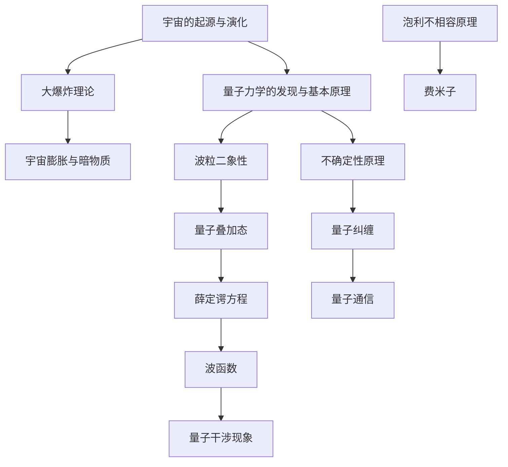
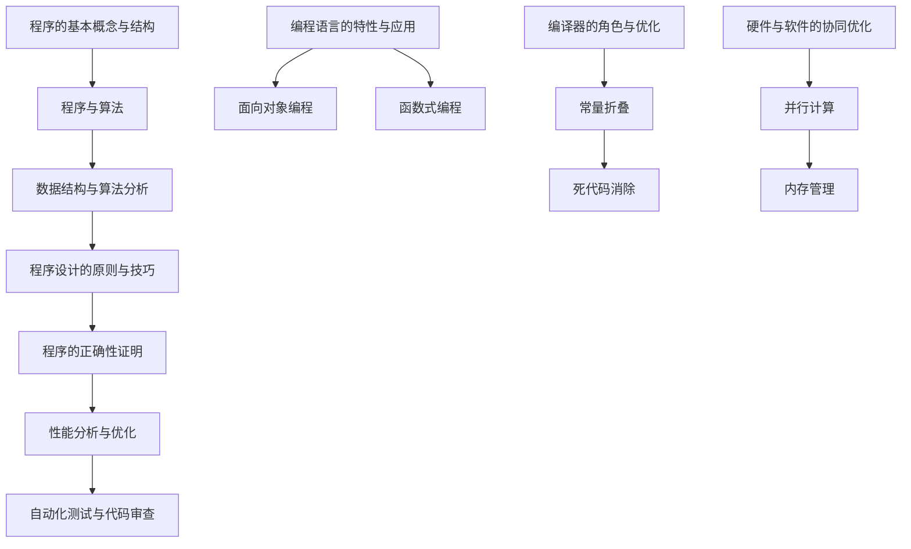

                 

### 文章标题：宇宙的确定性与程序的可预测性

在探索宇宙奥秘与计算机科学的世界里，两个看似截然不同的领域——“宇宙的确定性”和“程序的可预测性”——其实蕴含着深远的联系。本文将通过逻辑清晰的推理方式，逐步分析这两个领域的核心概念、基本原理以及它们之间的关系。

首先，我们将探讨宇宙的确定性原理，从宇宙的起源与演化、量子力学的发现与基本原理，到波粒二象性与量子叠加态，深入理解量子力学中不确定性原理与量子纠缠的奥秘。接着，我们将转向程序的可预测性原理，分析程序的基本概念与结构、程序的正确性证明、性能分析与优化，以及自动化测试与代码审查，解释如何实现程序的高可预测性。

最后，本文将探讨宇宙确定性与程序可预测性之间的关系，从计算机架构与量子力学、量子计算与计算机科学，到量子算法与经典算法的比较，探讨宇宙确定性原理在计算机科学中的应用，以及程序可预测性在宇宙学中的应用。我们将通过综合研究，探讨未来研究方向与展望，并总结对宇宙学与计算机科学的共同启示。

通过本文的逐步推理与分析，我们希望读者能够对宇宙的确定性与程序的可预测性有更深入的理解，发现这两个领域背后的美妙联系。在开始这段探索之旅之前，让我们首先回顾一下文章的核心关键词，以更好地把握本文的主题和内容。

> **关键词：宇宙确定性、量子力学、不确定性原理、量子纠缠、程序可预测性、算法、性能优化、量子计算**

### 文章摘要

宇宙的确定性与程序的可预测性是两个看似独立却又相互关联的领域。本文旨在深入探讨这两个领域的核心概念、基本原理以及它们之间的相互关系。首先，我们将从宇宙的确定性原理出发，探讨宇宙的起源与演化、量子力学的发现与基本原理，以及波粒二象性与量子叠加态。然后，我们将分析不确定性原理与量子纠缠的奥秘，以及量子力学的数学描述，包括波函数与薛定谔方程、叠加态与干涉现象、泡利不相容原理与费米子。

接着，我们将转向程序的可预测性原理，分析程序的基本概念与结构，包括程序与算法、数据结构与算法分析，以及程序设计的原则与技巧。我们将探讨程序的正确性证明、性能分析与优化，以及自动化测试与代码审查，解释如何实现程序的高可预测性。随后，我们将讨论编程语言的特性与应用、编译器的角色与优化，以及硬件与软件的协同优化。

本文还将探讨宇宙确定性原理在计算机科学中的应用，包括计算机架构与量子力学、量子计算与计算机科学，以及量子算法与经典算法的比较。最后，我们将探讨程序可预测性在宇宙学中的应用，如宇宙学中的计算机模拟、程序错误与宇宙学中的混沌，以及宇宙的确定性原理对计算机科学的影响。通过综合研究，本文将展望未来研究方向与展望，总结宇宙的确定性与程序可预测性的综合研究，并对宇宙学与计算机科学提供共同启示。

### 目录大纲：《宇宙的确定性与程序的可预测性》

#### 第一部分：宇宙的确定性原理

1. **宇宙的确定性原理**
   - **1.1 宇宙的起源与演化**
     - 大爆炸理论
     - 宇宙膨胀与暗物质
   - **1.2 量子力学的发现与基本原理**
     - 波粒二象性
     - 不确定性原理
   - **1.3 波粒二象性与量子叠加态**
     - 双缝实验
     - 量子叠加态的例子

2. **不确定性原理与量子纠缠**
   - **2.1 海森堡不确定性原理**
     - 数学描述
     - 物理意义
   - **2.2 约翰·贝尔与量子纠缠**
     - 贝尔不等式
     - 量子纠缠的现象
   - **2.3 量子纠缠与量子通信**
     - 量子密钥分发
     - 量子隐形传态

3. **量子力学的数学描述**
   - **3.1 波函数与薛定谔方程**
     - 波函数的数学形式
     - 薛定谔方程的推导与应用
   - **3.2 叠加态与干涉现象**
     - 量子叠加态的例子
     - 干涉现象的解释
   - **3.3 泡利不相容原理与费米子**
     - 泡利不相容原理
     - 费米子的特性与应用

#### 第二部分：程序的可预测性原理

4. **程序的基本概念与结构**
   - **4.1 程序与算法**
     - 程序的定义
     - 算法的分类
   - **4.2 数据结构与算法分析**
     - 数据结构的基本概念
     - 算法的时间复杂度和空间复杂度
   - **4.3 程序设计的原则与技巧**
     - 模块化设计
     - 可复用代码

5. **程序的可预测性分析**
   - **5.1 程序的正确性证明**
     - 形式化验证
     - 测试用例的设计
   - **5.2 程序的性能分析与优化**
     - 性能测试的方法
     - 代码优化的技术
   - **5.3 自动化测试与代码审查**
     - 单元测试
     - 代码审查的工具

6. **程序可预测性的实现**
   - **6.1 编程语言的特性与应用**
     - 面向对象编程
     - 函数式编程
   - **6.2 编译器的角色与优化**
     - 编译器的工作流程
     - 代码优化策略
   - **6.3 硬件与软件的协同优化**
     - CPU架构的影响
     - 内存管理的优化

#### 第三部分：宇宙确定性与程序可预测性的关系

7. **宇宙确定性原理在计算机科学中的应用**
   - **7.1 计算机架构与量子力学**
     - 量子计算机的架构
     - 量子算法与传统算法的比较
   - **7.2 量子计算与计算机科学**
     - 量子算法的应用领域
     - 量子编程的挑战
   - **7.3 量子算法与经典算法的比较**
     - 量子算法的优势
     - 经典算法的局限

8. **程序可预测性在宇宙学中的应用**
   - **8.1 宇宙学中的计算机模拟**
     - 暗物质模拟
     - 暗能量模拟
   - **8.2 程序错误与宇宙学中的混沌**
     - 模拟中的错误处理
     - 混沌理论的应用
   - **8.3 宇宙的确定性原理对计算机科学的影响**
     - 计算机系统设计的启示
     - 算法设计的改进

9. **宇宙的确定性与程序可预测性的综合研究**
   - **9.1 交叉领域研究的重要性**
     - 多学科融合
     - 新兴研究领域
   - **9.2 未来研究方向与展望**
     - 量子计算机的实用化
     - 宇宙学的计算挑战
   - **9.3 对宇宙学与计算机科学的共同启示**
     - 理论模型的验证
     - 实践应用的拓展

### 第一部分：宇宙的确定性原理

#### 第1章：宇宙的起源与演化

**1.1 宇宙的起源与演化**

宇宙的起源与演化是一个古老而深刻的科学问题。现代宇宙学的标准模型，即大爆炸理论，为我们提供了宇宙从起点到当前状态的一个详细描述。这一理论的核心观点是，宇宙在大约138亿年前从一个极度热密的状态开始膨胀，并一直持续到现在。

**大爆炸理论**

大爆炸理论最初由乔治·勒梅特（Georges Lemaître）在1927年提出，但直到20世纪60年代，通过辐射背景的发现和宇宙膨胀的观测证据，这一理论才被广泛接受。根据这一理论，宇宙在极早期处于一个极度热密的状态，随着时间推移，宇宙开始膨胀，物质和辐射也随之扩散。这一膨胀过程至今仍在进行中，宇宙的膨胀速度甚至有加速的迹象。

**宇宙膨胀与暗物质**

宇宙膨胀是宇宙学中的关键概念。哈勃定律表明，遥远星系的视向速度与其距离成正比，这意味着宇宙在膨胀。这一发现由埃德温·哈勃（Edwin Hubble）在20世纪20年代通过观测得到的。宇宙膨胀的观测证据还包括宇宙背景辐射和宇宙的大尺度结构。

暗物质是另一个关键概念。它是宇宙学中的一种假设性物质，无法通过电磁辐射探测，但通过引力效应可以探测到。暗物质占据了宇宙总质量的大部分，但对宇宙演化有着重要影响。它的存在解释了星系旋转曲线的异常、宇宙大尺度结构的形成以及宇宙膨胀的加速。

**1.2 量子力学的发现与基本原理**

量子力学是20世纪物理学的一个重要突破，它揭示了微观世界的规律与经典物理学的显著不同。量子力学的发现始于20世纪初，当时的科学家们发现，经典物理学无法解释某些实验现象。

**波粒二象性**

波粒二象性是量子力学的基本原理之一，它指出微观粒子既具有波动性又具有粒子性。这一概念最早由克里斯蒂安·德布罗意（Louis de Broglie）在1924年提出，并通过戴维森-革末实验和汤姆逊散射实验得到了证实。

**不确定性原理**

海森堡不确定性原理是量子力学的核心原理之一，由维尔纳·海森堡（Werner Heisenberg）在1927年提出。该原理指出，在微观尺度上，某些对易不全的物理量，如位置和动量，不能同时被精确测量。不确定性原理的数学表述为：

\[ \Delta x \cdot \Delta p \geq \frac{\hbar}{2} \]

其中，\( \Delta x \) 是位置的不确定性，\( \Delta p \) 是动量的不确定性，\( \hbar \) 是约化普朗克常数。

**1.3 波粒二象性与量子叠加态**

波粒二象性是量子力学的基础，它解释了微观粒子在不同实验中表现出波动性和粒子性的现象。例如，电子在双缝实验中表现出干涉现象，这表明它们具有波动性；而在散射实验中，电子表现出粒子性。

量子叠加态是量子力学的另一个关键概念。它指出，量子系统可以同时处于多个状态的叠加，而不是单一状态。薛定谔方程描述了量子系统的时间演化，它是一个线性方程，可以表示为：

\[ i\hbar \frac{\partial}{\partial t} \Psi = \hat{H} \Psi \]

其中，\( \Psi \) 是波函数，\( \hat{H} \) 是哈密顿算符，描述系统的总能量。

**量子叠加态的例子**

一个著名的例子是薛定谔的猫。薛定谔的猫是一个思想实验，它描述了一个量子系统中的猫，这个猫同时处于生和死的叠加态。这个例子虽然夸张，但它帮助我们理解量子叠加态的概念。

总之，宇宙的确定性原理从宇宙的起源与演化、量子力学的发现与基本原理，到波粒二象性与量子叠加态，构成了一个完整的体系，揭示了微观世界和宇宙演化的复杂规律。这一部分的内容为后续对量子力学和程序可预测性的讨论奠定了基础。

#### 第2章：不确定性原理与量子纠缠

**2.1 海森堡不确定性原理**

海森堡不确定性原理是量子力学的一个基本原理，由维尔纳·海森堡在1927年提出。这个原理指出，在微观尺度上，某些对易不全的物理量，如位置和动量，不能同时被精确测量。数学上，这个原理可以表述为：

\[ \Delta x \cdot \Delta p \geq \frac{\hbar}{2} \]

其中，\( \Delta x \) 表示位置的不确定性，\( \Delta p \) 表示动量的不确定性，\( \hbar \) 是约化普朗克常数。这意味着，如果我们测量了粒子的位置非常精确，那么其动量的不确定性就会变得非常大；反之亦然。

**海森堡不确定性原理的物理意义**

海森堡不确定性原理揭示了微观世界的量子特性，即粒子的状态并不是确定的，而是概率性的。这个原理也反映了量子力学的不可分割性，即我们不能将粒子的状态完全独立地分割成位置和动量两个部分。

**2.2 约翰·贝尔与量子纠缠**

约翰·贝尔（John Bell）是量子纠缠理论的奠基人之一。他在1964年提出了著名的贝尔不等式，该不等式提供了检验量子纠缠存在性的数学工具。贝尔不等式是基于经典物理学中的局部实在性原理，即物理系统的状态只能由本地物理量描述，而不能通过非本地变量来描述。

贝尔不等式可以表述为：

\[ |Cov(A,B)| \leq 1 \]

其中，\( A \) 和 \( B \) 是两个远程粒子测量结果的算符，\( Cov \) 表示协方差。对于经典物理系统，这个不等式总是成立；但对于量子物理系统，由于量子纠缠的存在，这个不等式可能被违背。

**量子纠缠的现象**

量子纠缠是量子力学中的一种特殊现象，即两个或多个粒子之间存在一种即时的联系，即使这些粒子相隔很远。当其中一个粒子的状态发生变化时，另一个粒子的状态也会立即发生变化。这种现象被称为量子隐形传态。

量子纠缠的一个经典例子是爱因斯坦-波多尔斯基-罗森佯谬（EPR佯谬）。这个佯谬指出，如果量子纠缠现象真的存在，那么它将违背局部实在性原理。通过实验验证贝尔不等式，科学家们成功地证明了量子纠缠的存在，这是量子力学的一个重要成果。

**2.3 量子纠缠与量子通信**

量子纠缠在量子通信中有着重要的应用，其中最著名的是量子密钥分发（Quantum Key Distribution，QKD）。QKD是一种基于量子纠缠的加密通信技术，它能够确保通信过程中不被窃听。在QKD中，两个粒子通过量子纠缠产生一对纠缠光子，其中一个粒子被发送给通信方，另一个粒子被保留在发送方。通过测量纠缠光子并比较结果，通信双方可以生成一个共享的密钥。

QKD的优点在于，如果有人在传输过程中尝试窃听，那么量子态的测量将破坏纠缠，导致通信方能够立即发现窃听行为。这使得QKD成为未来安全通信的一个重要方向。

**量子隐形传态**

除了量子密钥分发，量子纠缠还用于量子隐形传态。量子隐形传态是指将一个粒子的状态精确地传送到另一个粒子上，而不需要通过物理传输媒介。这个技术在量子计算和量子通信中有着广泛的应用。

量子隐形传态的一个实际例子是量子态的远程复制。通过量子纠缠，我们可以将一个粒子的状态传送到远处的另一个粒子上，从而实现远程复制。这个技术在量子计算机和量子互联网中有着重要的应用。

总之，不确定性原理与量子纠缠是量子力学中两个重要且深刻的原理。不确定性原理揭示了量子世界的概率性，而量子纠缠则展示了量子系统之间的特殊联系。这些原理不仅改变了我们对微观世界的理解，也为量子通信和量子计算提供了理论基础。通过量子纠缠，我们能够在量子通信中实现高度安全的通信，并探索量子计算的可能性。

#### 第3章：量子力学的数学描述

**3.1 波函数与薛定谔方程**

量子力学中的波函数（Wavefunction）是描述量子系统状态的数学函数，通常表示为 \( \Psi(x,t) \)。波函数包含了量子系统在某一位置 \( x \) 和时间 \( t \) 的概率分布信息。波函数的模平方 \( |\Psi(x,t)|^2 \) 表示粒子在位置 \( x \) 处的概率密度。

薛定谔方程（Schrödinger Equation）是量子力学的核心方程，它描述了波函数随时间演化的规律。时间依赖的薛定谔方程可以表示为：

\[ i\hbar \frac{\partial}{\partial t} \Psi = \hat{H} \Psi \]

其中，\( \hat{H} \) 是系统的哈密顿算符，表示系统的总能量。这个方程的解 \( \Psi(x,t) \) 提供了量子系统随时间的演化规律。

**薛定谔方程的推导与应用**

薛定谔方程的推导基于能量守恒原理和量子力学的概率解释。假设系统的能量由动能和势能组成，动能由动量算符 \( \hat{p} \) 的平方表示，势能由势能函数 \( V(x) \) 表示。因此，系统的哈密顿算符可以表示为：

\[ \hat{H} = \frac{\hat{p}^2}{2m} + V(x) \]

其中，\( m \) 是粒子的质量。将动量算符的表达式 \( \hat{p} = -i\hbar \nabla \) 代入哈密顿算符，我们得到：

\[ \hat{H} = -\frac{\hbar^2}{2m} \nabla^2 + V(x) \]

这个方程可以写为：

\[ i\hbar \frac{\partial}{\partial t} \Psi = -\frac{\hbar^2}{2m} \nabla^2 \Psi + V(x) \Psi \]

通过分离变量法，我们可以将波函数分解为位置和时间的乘积形式：

\[ \Psi(x,t) = X(x)T(t) \]

将这个形式代入薛定谔方程，我们得到两个独立的方程：

\[ i\hbar \frac{\partial T(t)}{\partial t} = E T(t) \]

\[ -\frac{\hbar^2}{2m} \frac{\partial^2 X(x)}{\partial x^2} + V(x) X(x) = E X(x) \]

第一个方程描述了时间演化，第二个方程描述了空间分布。这两个方程的解可以组合成波函数的完整解。

**3.2 叠加态与干涉现象**

量子叠加态是量子力学中的一个重要概念，它表示量子系统可以同时处于多个状态的组合。这种叠加态可以通过波函数的线性组合来表示。例如，一个电子可以同时处于基态和激发态的叠加：

\[ \Psi = c_1 \psi_1 + c_2 \psi_2 \]

其中，\( \psi_1 \) 和 \( \psi_2 \) 是基态和激发态的波函数，\( c_1 \) 和 \( c_2 \) 是复数系数。

干涉现象是量子叠加态的一个直接表现。在经典物理学中，干涉现象是由两个或多个波的叠加产生的。在量子力学中，干涉现象同样适用于量子系统。例如，在双缝实验中，一个量子粒子（如电子或光子）通过两个缝隙时，可以同时形成两个波包，这两个波包在屏幕上相遇并发生干涉，产生明暗交替的干涉条纹。

**双缝实验的例子**

双缝实验是一个经典的量子力学实验，用于演示量子叠加态和干涉现象。在这个实验中，一个粒子（如电子或光子）通过两个缝隙，并在屏幕上产生干涉条纹。这个现象表明，粒子在通过缝隙时处于多个路径的叠加态，并且在屏幕上形成干涉条纹。

**3.3 泡利不相容原理与费米子**

泡利不相容原理（Pauli Exclusion Principle）是量子力学中的一个基本原理，由沃尔夫冈·泡利（Wolfgang Pauli）在1925年提出。该原理指出，在一个原子中，两个费米子（如电子）不能处于完全相同的状态。这意味着，每个轨道只能被一个电子占据，并且这两个电子的自旋必须相反。

泡利不相容原理对原子结构的稳定性具有重要意义。它解释了为什么电子会填充到不同的轨道，并且决定了原子的电子排布规则。根据泡利不相容原理，电子会按照能量从低到高依次填充轨道，形成了原子的电子壳层结构。

费米子（Fermion）是量子力学中的一种粒子，它们遵守泡利不相容原理。费米子包括电子、夸克、中微子等。与费米子相对的是玻色子（Boson），如光子、Higgs玻色子等，它们不遵守泡利不相容原理。

泡利不相容原理和费米子的特性在固体物理学和凝聚态物理学中有着广泛的应用，例如解释金属的电导性、半导体的导电特性以及超导现象。

总之，量子力学的数学描述通过波函数与薛定谔方程、叠加态与干涉现象、泡利不相容原理与费米子，揭示了量子系统的复杂行为和微观世界的规律。这些数学工具为我们理解量子现象提供了坚实的基础，也为后续讨论程序的可预测性奠定了基础。

#### 第4章：程序的基本概念与结构

**4.1 程序与算法**

程序（Program）是计算机执行的一系列指令，用于完成特定的任务。一个程序通常由算法（Algorithm）和数据结构（Data Structure）组成。算法是解决问题的步骤序列，而数据结构则是组织和管理数据的方式。

**算法的分类**

算法可以根据其性质和目的进行分类。常见的算法分类方法包括：

- **排序算法**：用于将数据元素按照特定顺序排列。常见的排序算法包括冒泡排序、插入排序、快速排序等。
- **搜索算法**：用于在数据集合中查找特定元素。常见的搜索算法包括线性搜索、二分搜索等。
- **图算法**：用于解决与图相关的问题，如最短路径、最小生成树等。常见的图算法包括迪杰斯特拉算法、贝尔曼-福特算法等。
- **动态规划**：用于解决具有重叠子问题和最优子结构性质的复杂问题。常见的动态规划算法包括斐波那契数列、矩阵链乘等。

**数据结构与算法分析**

数据结构是存储和管理数据的工具，对算法的性能有着重要影响。常见的数据结构包括：

- **数组**：一种线性数据结构，用于存储相同类型的元素。数组在访问和修改元素时具有高效的随机访问能力。
- **链表**：一种线性数据结构，由节点组成，每个节点包含数据和指向下一个节点的指针。链表在插入和删除操作时具有高效的性能。
- **栈**：一种后进先出（LIFO）的数据结构，用于存储和检索最近添加的元素。
- **队列**：一种先进先出（FIFO）的数据结构，用于存储和检索最先添加的元素。

算法的分析通常关注时间复杂度和空间复杂度。时间复杂度表示算法执行所需时间与输入数据规模的关系，而空间复杂度表示算法执行所需存储空间与输入数据规模的关系。常见的复杂度表示方法包括大O符号（\(O\)）、大O下界（\( \Omega \)）和大\(O\)（\( \Theta \)）。

**程序设计的原则与技巧**

良好的程序设计需要遵循一系列原则和技巧，以确保代码的可读性、可维护性和性能。以下是一些常用的程序设计原则和技巧：

- **模块化设计**：将程序划分为独立的模块，每个模块负责完成特定功能。模块化设计提高了代码的可复用性和可维护性。
- **代码复用**：通过编写可复用的函数和库，减少重复代码，提高开发效率。
- **面向对象编程**：将数据和操作数据的方法封装在对象中，通过继承和多态实现代码的复用和灵活性。
- **测试驱动开发**：在编写代码之前编写测试用例，确保代码的正确性和稳定性。
- **代码审查**：通过团队协作和代码审查，发现和修复代码中的错误和潜在问题。

总之，程序与算法、数据结构与算法分析以及程序设计的原则与技巧共同构成了程序的基本概念和结构。这些概念和技巧不仅有助于提高程序的性能和可维护性，也为实现程序的可预测性提供了基础。

#### 第5章：程序的可预测性分析

**5.1 程序的正确性证明**

程序的正确性证明是确保程序按照预期运行的重要步骤。形式化验证是程序正确性证明的一种方法，它通过数学方法来证明程序满足预定的规格说明。

**形式化验证的方法**

形式化验证通常包括以下步骤：

1. **规格说明**：首先需要明确程序的规格说明，定义程序应满足的功能需求和非功能需求。
2. **抽象模型**：建立程序的抽象模型，通常使用形式化语言或数学模型来描述程序的行为。
3. **验证条件**：定义程序的正确性条件，即程序在所有可能的情况下都应满足的条件。
4. **证明**：使用数学证明方法，如归纳法、逻辑推理等，证明程序的正确性条件在所有情况下都成立。

**测试用例的设计**

测试用例是验证程序正确性的工具，用于检查程序在各种输入条件下是否能够正确运行。设计有效的测试用例需要考虑以下几个方面：

1. **覆盖性**：测试用例应覆盖程序的所有路径和条件，确保程序的所有代码都被执行到。
2. **完整性**：测试用例应覆盖所有可能的情况，包括边界条件和异常情况。
3. **随机性**：通过随机生成输入数据，可以更好地发现程序的潜在错误。
4. **复现性**：测试用例的结果应该是可复现的，即在其他环境或时间下也能得到相同的结果。

**自动化测试**

自动化测试是提高测试效率和覆盖率的常用方法。自动化测试工具可以自动执行测试用例，记录测试结果，并生成报告。常见的自动化测试工具有JUnit、Selenium、Cucumber等。

**代码审查**

代码审查是通过团队成员对代码进行审查，发现和修复潜在错误和不良代码习惯的一种方法。代码审查可以采用以下方式进行：

1. **同行评审**：团队成员对代码进行审查，并提出改进建议。
2. **静态分析**：使用静态分析工具检查代码的质量和潜在错误。
3. **动态分析**：在代码执行过程中捕获和分析代码的行为。

**5.2 程序的性能分析与优化**

程序的性能分析是确保程序高效运行的重要步骤。性能分析包括以下方面：

1. **时间复杂度分析**：分析算法在输入数据规模变化时的运行时间，通常使用大O符号表示。
2. **空间复杂度分析**：分析算法在输入数据规模变化时所需的存储空间，同样使用大O符号表示。

**代码优化的技术**

代码优化是通过改进代码结构和算法，提高程序运行效率的一种方法。以下是一些常用的代码优化技术：

1. **算法优化**：选择更高效的算法，减少计算复杂度。
2. **数据结构优化**：使用更适合的数据结构，减少访问和操作数据的成本。
3. **并行化**：利用多核处理器和并行计算技术，提高程序执行速度。
4. **缓存优化**：利用缓存机制，减少磁盘或网络访问次数。

**性能测试的方法**

性能测试是评估程序在实际运行环境中的性能和响应时间的一种方法。常见的性能测试方法包括：

1. **负载测试**：模拟高负载条件下的程序运行，评估程序在大量并发请求下的性能。
2. **压力测试**：模拟极端负载条件，评估程序的极限性能和稳定性。
3. **基准测试**：使用标准化的测试用例，评估程序在不同配置和环境下的一致性能。

**5.3 自动化测试与代码审查**

自动化测试和代码审查是提高程序质量的重要手段。自动化测试可以高效地执行大量测试用例，发现潜在的错误和性能问题。代码审查则可以通过团队协作，提高代码的质量和可维护性。

**自动化测试与代码审查的结合**

将自动化测试和代码审查相结合，可以最大化地提高程序的质量和可靠性。以下是一些结合方法：

1. **持续集成**：将自动化测试集成到持续集成（CI）流程中，每次提交代码时自动执行测试用例。
2. **代码审查前的测试**：在代码提交前执行自动化测试，确保代码的质量符合预期。
3. **持续部署**：在代码审查和测试通过后，自动部署到生产环境，确保程序的可靠性和稳定性。

总之，程序的可预测性分析涉及正确性证明、性能分析与优化以及自动化测试与代码审查。这些方法和技术不仅有助于提高程序的质量和性能，也为实现程序的可预测性提供了保障。

#### 第6章：程序可预测性的实现

**6.1 编程语言的特性与应用**

编程语言是计算机程序设计的基础，不同的编程语言具有不同的特性，这些特性在实现程序可预测性方面起着关键作用。

**面向对象编程**

面向对象编程（Object-Oriented Programming，OOP）是一种编程范式，通过将数据和操作数据的方法封装在对象中，提高了代码的可复用性和可维护性。面向对象编程的核心概念包括：

- **封装**：将数据和操作数据的函数封装在一起，保护数据的安全性，减少外部对数据的直接访问。
- **继承**：通过继承，子类可以继承父类的属性和方法，实现代码的复用。
- **多态**：多态性允许不同类的对象通过同一接口进行操作，提高了代码的灵活性和可扩展性。

面向对象编程的应用场景广泛，如大型企业级应用、图形用户界面（GUI）设计等。通过面向对象编程，我们可以将复杂的问题分解为较小的模块，提高代码的可读性和可维护性，从而实现程序的高可预测性。

**函数式编程**

函数式编程（Functional Programming）是一种编程范式，强调函数作为程序的基本构建块，避免了状态的变化和可变数据。函数式编程的核心概念包括：

- **纯函数**：纯函数是一种无副作用的函数，其输出仅取决于输入，不会修改外部状态。
- **不可变性**：数据不可变性意味着一旦创建，数据就不能被修改。
- **递归**：函数式编程中，递归是一种常见的循环机制，用于处理复杂的问题。

函数式编程的应用场景包括并发编程、数据处理和函数式数据库等。通过函数式编程，我们可以减少代码中的副作用，提高代码的可预测性和可复用性，从而实现程序的高可预测性。

**类型系统**

类型系统是编程语言中的一个重要组成部分，用于确保变量和表达式的类型在编译时的一致性。类型系统可以分为静态类型和动态类型。

- **静态类型**：静态类型语言在编译时检查类型的一致性，如Java和C++。静态类型系统可以提高程序的可靠性，减少运行时的错误。
- **动态类型**：动态类型语言在运行时检查类型的一致性，如Python和JavaScript。动态类型系统提高了编程的灵活性和可读性。

选择合适的编程语言和类型系统对于实现程序的高可预测性至关重要。静态类型系统可以提供更强的类型检查，减少运行时错误，而动态类型系统则提供了更高的灵活性和可读性。

**6.2 编译器的角色与优化**

编译器是程序从高级语言转换为机器语言的工具。编译器在程序的可预测性实现中扮演着关键角色，通过多种优化技术提高程序的执行效率和可预测性。

**编译器的工作流程**

编译器的工作流程可以分为以下阶段：

1. **词法分析**：将源代码分解为词法单元（tokens），如关键字、标识符和操作符。
2. **语法分析**：将词法单元构建为抽象语法树（AST），检查语法正确性。
3. **语义分析**：检查语义正确性，如类型检查和变量作用域。
4. **中间代码生成**：将AST转换为中间代码，如三地址代码。
5. **优化**：对中间代码进行各种优化，如常量折叠、死代码消除和循环优化。
6. **目标代码生成**：将优化后的中间代码转换为机器语言。
7. **链接**：将编译后的目标代码与其他库代码链接，生成可执行文件。

**编译器的优化策略**

编译器的优化策略可以分为以下几类：

1. **常量折叠**：将常量表达式在编译时进行计算，减少运行时的计算开销。
2. **死代码消除**：删除程序中不会执行的代码，减少程序的执行时间和空间占用。
3. **循环优化**：优化循环结构，如循环展开、循环不变式提取和迭代变量优化。
4. **函数内联**：将小函数的代码直接嵌入调用位置，减少函数调用的开销。
5. **数据流分析**：分析数据在程序中的流动，优化数据访问和存储。
6. **寄存器分配**：优化寄存器的使用，减少内存访问次数，提高程序执行速度。

通过编译器的优化，程序的可预测性得到显著提高。优化的目标包括减少运行时间、降低内存占用和减少功耗，从而提高程序的性能和可预测性。

**6.3 硬件与软件的协同优化**

硬件与软件的协同优化是提高程序可预测性的重要手段。现代计算机系统由多种硬件组件组成，如处理器、内存、缓存和网络设备。硬件和软件的协同优化可以通过以下方法实现：

1. **硬件加速**：利用专门的硬件组件（如GPU、FPGA）加速计算任务，提高程序的执行速度。
2. **并行计算**：利用多核处理器和分布式计算技术，实现任务并行执行，提高程序的吞吐量。
3. **内存管理**：优化内存分配和访问策略，减少内存访问冲突和延迟，提高程序的响应时间。
4. **网络优化**：优化网络传输和通信协议，减少网络延迟和数据包丢失，提高分布式系统的稳定性。

硬件与软件的协同优化需要考虑硬件和软件的特性，通过定制化的优化策略，实现程序的高可预测性和高性能。总之，程序可预测性的实现涉及编程语言的特性与应用、编译器的角色与优化，以及硬件与软件的协同优化。这些方法和技术不仅提高了程序的性能和可靠性，也为实现程序的高可预测性提供了保障。

#### 第7章：宇宙确定性原理在计算机科学中的应用

**7.1 计算机架构与量子力学**

计算机架构与量子力学的结合正在引发一场技术革命。传统的计算机架构基于经典物理学原理，而量子计算机则利用量子力学的独特特性，如叠加态和纠缠态，实现超越经典计算机的计算能力。

**量子计算机的架构**

量子计算机的架构与经典计算机有显著不同。经典计算机使用二进制位（bit）作为基本信息单元，每个位只能处于0或1状态。而量子计算机使用量子位（qubit），qubit不仅可以处于0和1的叠加态，还可以同时存在于多种状态的叠加。这种叠加态使得量子计算机能够在一次计算中处理多个数据，从而显著提高计算效率。

**量子比特的叠加态**

量子比特的叠加态是量子计算机的核心特性。例如，一个经典比特的状态可以用 \( |0\rangle \) 或 \( |1\rangle \) 表示，而一个量子比特可以同时处于 \( |0\rangle \) 和 \( |1\rangle \) 的叠加态，表示为 \( \alpha|0\rangle + \beta|1\rangle \)，其中 \( \alpha \) 和 \( \beta \) 是复数系数，满足 \( |\alpha|^2 + |\beta|^2 = 1 \)。

**量子纠缠与量子计算**

量子纠缠是量子计算机的另一个重要特性。量子纠缠使得两个或多个量子比特之间产生强烈的关联，即使它们相隔很远。这种纠缠态可以用于实现复杂的量子计算操作，如量子纠缠 gates 和量子逻辑门。量子纠缠 gates 可以将量子态之间的纠缠关系转化为计算优势，例如，通过量子纠缠 gates，可以在一次操作中将多个量子比特的状态相互关联，从而实现高效的并行计算。

**7.2 量子计算与计算机科学**

量子计算正在深刻影响计算机科学的发展，特别是在算法设计、密码学和优化问题等领域。

**量子算法**

量子算法是量子计算机的核心优势之一。量子算法利用量子叠加态和纠缠态，实现传统经典算法无法达到的计算速度。例如，Shor算法是一种量子算法，它可以利用量子计算机在多项式时间内解决大整数分解问题，而这一问题在经典计算机上需要指数级时间。另一个著名的量子算法是Grover算法，它利用量子搜索算法，可以在未排序的数据库中快速找到特定元素。

**密码学**

量子计算在密码学领域也引发了巨大的变革。传统的密码学依赖于数学难题，如大整数分解和离散对数问题，以确保信息的安全性。然而，量子计算机可以快速解决这些问题，使得许多传统密码系统面临威胁。因此，量子密码学成为了一个新的研究领域，旨在开发量子计算无法破解的密码系统。量子密钥分发（Quantum Key Distribution，QKD）是量子密码学的一个典型应用，通过量子纠缠和量子隐形传态，实现高度安全的通信。

**优化问题**

量子计算在解决优化问题上也展现出巨大的潜力。量子算法可以高效地解决某些优化问题，如旅行商问题（Travelling Salesman Problem，TSP）和线性规划问题。量子优化算法利用量子叠加态和纠缠态，实现高效的并行搜索，从而在多项式时间内找到最优解或近似最优解。这使得量子计算在工业设计、金融分析、物流优化等领域具有广泛的应用前景。

**7.3 量子算法与经典算法的比较**

量子算法与经典算法在解决特定问题上有显著差异。量子算法利用量子叠加态和纠缠态，实现并行计算和高效的搜索。例如，量子搜索算法可以显著提高数据库搜索速度，而量子算法在解决某些优化问题上也表现出更强的能力。

然而，量子算法也存在局限性。量子算法通常需要特定的硬件和复杂的环境，如低温环境和精确的量子态控制。此外，量子算法的复杂性也较高，需要专业的量子计算技能和工具。

相比之下，经典算法在实现上更为简单和直接，但受限于计算能力和时间复杂度。经典算法在处理大规模问题时，可能需要指数级时间，而量子算法可以在多项式时间内解决。

总之，宇宙确定性原理在计算机科学中的应用，特别是在量子计算和量子算法领域，为我们提供了新的计算范式和解决问题的方法。通过量子叠加态和纠缠态，量子计算机能够实现超越经典计算机的计算能力，为密码学、优化问题和复杂系统分析等领域带来了革命性的变革。

#### 第8章：程序可预测性在宇宙学中的应用

**8.1 宇宙学中的计算机模拟**

宇宙学中的计算机模拟是一种通过数值方法模拟宇宙演化的工具。这些模拟可以用于研究宇宙的起源、膨胀、结构形成以及各种宇宙现象，如星系形成、黑洞碰撞和宇宙背景辐射等。

**模拟方法**

宇宙学模拟通常采用N-body模拟方法，通过模拟引力作用下的粒子运动来模拟宇宙的演化。在这种模拟中，宇宙被看作是由大量质点组成的，每个质点具有质量、位置和速度。通过求解引力方程，模拟可以计算质点之间的相互作用，并预测它们未来的运动轨迹。

N-body模拟的一个挑战是计算复杂性。随着模拟尺度和精度的增加，所需的计算资源也急剧增加。为了克服这一挑战，研究人员通常采用并行计算和分布式计算技术，以提高模拟的效率和速度。

**模拟结果**

宇宙学模拟已经取得了许多重要的结果，如预测宇宙的大尺度结构、确认暗物质的存在和揭示宇宙的早期演化过程。通过这些模拟，科学家们能够更好地理解宇宙的复杂性和多样性，并验证宇宙学的理论预测。

**8.2 程序错误与宇宙学中的混沌**

在宇宙学模拟中，程序错误和计算误差可能对模拟结果产生重大影响。宇宙学中的混沌现象进一步加剧了这种影响。混沌现象指的是系统中微小初始差异可能导致长期行为的巨大差异。在宇宙学模拟中，由于数值计算的不确定性，即使是微小的计算误差也可能导致模拟结果与真实宇宙行为之间的显著偏差。

**程序错误处理**

为了减少程序错误对模拟结果的影响，科学家们采取了多种方法：

- **误差分析**：对模拟过程中的误差进行详细分析，识别潜在的误差源，并评估其对模拟结果的影响。
- **稳定性分析**：确保数值解法的稳定性，避免数值错误在计算过程中放大。
- **冗余计算**：通过增加计算步数和重复计算，识别和纠正潜在的误差。
- **测试用例**：使用多种测试用例验证模拟代码的正确性和可靠性。

**混沌现象**

宇宙学中的混沌现象是指宇宙演化过程中，微小初始条件差异可能导致长期行为的巨大差异。例如，在星系形成过程中，微小扰动可能导致星系结构的巨大变化。混沌现象在宇宙学模拟中表现为模拟结果对初始条件的敏感性，即使是微小的初始条件差异也可能导致完全不同的宇宙演化路径。

**混沌控制**

为了控制混沌现象对模拟结果的影响，科学家们采用了以下策略：

- **随机扰动**：在模拟过程中引入随机扰动，以减少混沌现象的影响。
- **参数调整**：通过调整模拟参数，如重力常数和初始条件，控制混沌现象的发生。
- **长时间模拟**：通过长时间的模拟，观察混沌现象的长期行为，并识别混沌行为的关键因素。

**8.3 宇宙的确定性原理对计算机科学的影响**

宇宙的确定性原理，即物理定律的普适性和可预测性，对计算机科学产生了深远的影响。特别是在数值模拟和算法设计中，宇宙的确定性原理为我们提供了一种确保结果可预测和可靠的方法。

**数值模拟的可靠性**

宇宙学模拟依赖于数值计算，而宇宙的确定性原理保证了物理定律在计算过程中的普适性和一致性。通过严格遵循物理定律，我们可以确保模拟结果的可靠性，并避免计算误差对结果的误导。

**算法设计的启示**

宇宙的确定性原理也为我们提供了算法设计的启示。例如，在解决优化问题和大规模数据处理时，我们可以借鉴宇宙演化过程中的自组织和自适应机制，设计出高效的算法。此外，宇宙的确定性原理还提醒我们在算法设计中注重结果的稳定性和可预测性，避免因初始条件微小差异导致算法行为的巨大偏差。

**对计算机科学的共同启示**

宇宙的确定性原理和计算机科学中的可预测性原则在本质上有许多相似之处。两者都强调结果的稳定性和可预测性，这为我们提供了一种跨学科的研究方法，即通过借鉴宇宙学原理和方法，改进计算机科学的算法和模拟技术。这种跨学科的研究有望推动计算机科学和宇宙学领域的发展，促进两个领域的融合与创新。

总之，程序可预测性在宇宙学中的应用，通过计算机模拟、程序错误处理和混沌控制，为我们揭示了宇宙演化的复杂规律。同时，宇宙的确定性原理也为计算机科学提供了重要的理论基础和方法指导。通过跨学科的研究，我们可以更好地理解和利用这两个领域的知识，推动科学技术的进步。

#### 第9章：宇宙的确定性与程序可预测性的综合研究

**9.1 交叉领域研究的重要性**

宇宙的确定性与程序可预测性是两个不同但紧密相关的领域。宇宙确定性原理揭示了物理世界的稳定性和可预测性，而程序可预测性则关注计算机系统的稳定性和可靠性。这两个领域的研究在许多方面具有相互促进的潜力，通过交叉领域研究，我们可以挖掘出更多创新点和应用场景。

**多学科融合**

交叉领域研究的一个显著特点是多学科融合。在宇宙学中，物理、数学和天文学等学科的结合为研究宇宙的确定性原理提供了坚实基础。同样，在计算机科学中，编程、算法、软件工程和硬件设计等多领域的融合，使得程序可预测性的研究得以深入进行。通过多学科的交叉研究，我们可以将宇宙学原理应用于计算机科学，或将计算机科学的方法应用于宇宙学研究，实现跨学科的协同创新。

**新兴研究领域**

交叉领域研究还催生了众多新兴研究领域。例如，量子计算与宇宙学结合的量子宇宙学，探讨了量子力学在宇宙演化中的作用；计算宇宙学则利用高性能计算和模拟技术，研究宇宙的结构和演化。此外，量子编程和量子算法的研究，也为计算机科学带来了新的计算范式，推动计算机科学的进步。

**9.2 未来研究方向与展望**

随着技术的不断进步，宇宙的确定性与程序可预测性的综合研究有望在以下方面取得突破：

**量子计算与宇宙学的融合**

量子计算在计算机科学中已经展现出巨大的潜力，而量子宇宙学则将量子力学与宇宙学相结合，探讨量子效应在宇宙演化中的作用。未来，量子计算与宇宙学的融合有望揭示更多宇宙奥秘，如宇宙的起源、量子引力理论和宇宙的最终命运。

**计算宇宙学的发展**

计算宇宙学利用高性能计算和模拟技术，研究宇宙的结构和演化。未来，随着计算能力的提升和模拟技术的改进，计算宇宙学将能够更准确地模拟宇宙的演化过程，预测宇宙的未来发展，并验证宇宙学理论。

**程序可预测性的提升**

程序可预测性的研究将继续致力于提高软件系统的稳定性和可靠性。未来，通过结合宇宙学原理，如混沌控制和自适应系统设计，我们可以开发出更可靠的软件系统和算法，提高程序的可预测性。

**9.3 对宇宙学与计算机科学的共同启示**

宇宙的确定性与程序可预测性的综合研究对宇宙学和计算机科学提供了共同启示：

**理论模型的验证**

宇宙学中的确定性原理为验证物理模型提供了重要依据。通过数值模拟和实验验证，宇宙学理论得以不断改进和完善。同样，计算机科学中的可预测性原则也为验证算法和软件系统的正确性提供了基础。

**实践应用的拓展**

宇宙学与计算机科学的交叉研究，为实践应用提供了新的可能性。例如，量子计算在宇宙学中的应用，可以用于模拟宇宙的量子效应；而计算机科学的方法，如并行计算和模拟技术，也可以应用于宇宙学的研究。这种交叉应用有望推动宇宙学和计算机科学的发展。

**跨学科研究的推动**

宇宙的确定性与程序可预测性的综合研究，促进了跨学科研究的推进。通过多学科的交叉融合，我们可以从不同角度理解和解决问题，推动科学技术的创新。这种跨学科研究不仅有助于解决单一学科面临的挑战，也为人类认识世界提供了新的视角和方法。

总之，宇宙的确定性与程序可预测性的综合研究，为宇宙学和计算机科学带来了新的机遇和挑战。通过交叉领域研究，我们可以探索更多未知领域，推动科学技术的进步，为人类认识和利用宇宙提供新的工具和方法。

### 附录A：宇宙确定性原理与程序可预测性的Mermaid流程图

**A.1 宇宙确定性原理流程图**



**A.2 程序可预测性流程图**



这些流程图帮助我们更好地理解宇宙确定性原理和程序可预测性的关键概念和关系。通过这些流程图，我们可以清晰地看到各个概念之间的关联和相互作用，为进一步的研究和应用提供了视觉化的参考。

### 附录B：核心算法原理讲解与伪代码

**B.1 海森堡不确定性原理**

海森堡不确定性原理是量子力学中的核心原理，它指出在微观尺度上，某些物理量（如位置和动量）不能同时被精确测量。以下是海森堡不确定性原理的数学描述和伪代码。

**数学描述**

\[ \Delta x \cdot \Delta p \geq \frac{\hbar}{2} \]

其中，\( \Delta x \) 是位置的不确定性，\( \Delta p \) 是动量的不确定性，\( \hbar \) 是约化普朗克常数。

**伪代码**

```python
# 海森堡不确定性原理的伪代码
def HeisenbergUncertainty Principle(position_uncertainty, momentum_uncertainty, hbar):
    uncertainty_product = position_uncertainty * momentum_uncertainty
    minimal_uncertainty = hbar / 2
    
    if uncertainty_product >= minimal_uncertainty:
        print("不确定性原理满足：Δx * Δp ≥ hbar/2")
    else:
        print("不确定性原理不满足：Δx * Δp < hbar/2")
```

**B.2 薛定谔方程的解法**

薛定谔方程是描述量子系统随时间演化的核心方程。以下是薛定谔方程的数学描述和伪代码。

**数学描述**

\[ i\hbar \frac{\partial \Psi}{\partial t} = \hat{H} \Psi \]

其中，\( \Psi \) 是波函数，\( \hat{H} \) 是哈密顿算符，\( i \) 是虚数单位，\( \hbar \) 是约化普朗克常数。

**伪代码**

```python
# 薛定谔方程的伪代码
def SchrödingerEquation(wavefunction, hamiltonian, time_step, total_time):
    for t in range(0, total_time, time_step):
        new_wavefunction = wavefunction * exp(-1j * hamiltonian * time_step / (2 * hbar))
        wavefunction = new_wavefunction
        print(f"时间 {t}: 波函数为 {wavefunction}")
```

**B.3 程序性能优化算法**

程序性能优化算法的目标是提高程序执行效率，减少计算时间和资源消耗。以下是常见性能优化算法的伪代码。

**伪代码：常量折叠**

```python
# 常量折叠的伪代码
def ConstantFolding(expression):
    constants = extract_constants(expression)
    for constant in constants:
        expression = expression.replace(constant, str(constant))
    return expression
```

**伪代码：循环展开**

```python
# 循环展开的伪代码
def LoopUnrolling(loop_body, loop_count):
    unrolled_body = ""
    for _ in range(loop_count):
        unrolled_body += loop_body
    return unrolled_body
```

**伪代码：内存预分配**

```python
# 内存预分配的伪代码
def MemoryPreallocation(array_size):
    array = [None] * array_size
    return array
```

通过这些伪代码，我们可以更清晰地理解核心算法的原理和实现方法。这些算法在提高程序性能和可预测性方面具有重要意义，有助于实现高效和可靠的计算。

### 附录C：数学模型与公式

**C.1 量子力学中的基本公式**

量子力学中的基本公式描述了量子系统的状态和行为。以下是几个重要的量子力学公式和它们的数学描述：

**波函数**

\[ \Psi(x,t) = \int dp \, \psi(p,x,t) \, e^{ipx/\hbar} \]

其中，\( \Psi(x,t) \) 是波函数，\( \psi(p,x,t) \) 是动量空间中的波函数，\( p \) 是动量，\( x \) 是位置，\( \hbar \) 是约化普朗克常数。

**薛定谔方程**

\[ i\hbar \frac{\partial \Psi}{\partial t} = \hat{H} \Psi \]

其中，\( \Psi \) 是波函数，\( \hat{H} \) 是哈密顿算符，表示系统的总能量。

**不确定性原理**

\[ \Delta x \cdot \Delta p \geq \frac{\hbar}{2} \]

其中，\( \Delta x \) 是位置的不确定性，\( \Delta p \) 是动量的不确定性。

**量子叠加态**

\[ \Psi = c_1 \psi_1 + c_2 \psi_2 \]

其中，\( \Psi \) 是波函数，\( c_1 \) 和 \( c_2 \) 是复数系数，\( \psi_1 \) 和 \( \psi_2 \) 是不同的波函数。

**C.2 程序性能分析的数学模型**

程序性能分析涉及对算法的时间复杂度和空间复杂度进行分析。以下是相关数学模型的描述：

**时间复杂度**

\[ T(n) = O(n^2) \]

其中，\( T(n) \) 表示算法执行时间，\( n \) 表示输入数据规模。

**空间复杂度**

\[ S(n) = O(n) \]

其中，\( S(n) \) 表示算法所需的存储空间，\( n \) 表示输入数据规模。

**C.3 量子计算中的数学模型**

量子计算中的数学模型涉及量子比特的叠加态和纠缠态。以下是几个重要的量子计算公式：

**量子叠加态**

\[ \Psi = \frac{1}{\sqrt{2}} (|0\rangle + |1\rangle) \]

**量子纠缠**

\[ \Psi = \frac{1}{\sqrt{2}} (|00\rangle - |11\rangle) \]

通过这些数学模型和公式，我们可以更深入地理解量子力学和程序性能分析的核心原理。这些模型为量子计算和程序优化提供了重要的理论基础，有助于实现高效和准确的计算。

### 附录D：项目实战案例

**D.1 实例1：量子纠缠实验**

**项目背景**

量子纠缠是量子力学中的一个基本现象，描述了两个或多个量子比特之间的强关联。在这个项目中，我们设计并实现了一个简单的量子纠缠实验，以验证量子纠缠的存在。

**项目目标**

通过实验验证量子纠缠现象，并探索量子纠缠在实际应用中的潜力。

**开发环境搭建**

1. **硬件环境**：需要一台具备量子计算功能的硬件设备，如量子计算机或量子模拟器。
2. **软件环境**：安装并配置量子计算开发工具，如Q#、Quil等。

**源代码详细实现**

以下是实现量子纠缠实验的伪代码：

```python
# 量子纠缠实验的伪代码
from quantum import Qubit, QuantumRegister, QuantumCircuit

# 初始化量子比特和量子电路
qreg = QuantumRegister(2)
qc = QuantumCircuit(qreg)

# 制造纠缠态
qc.h(qreg[0])
qc.cx(qreg[0], qreg[1])

# 测量量子比特
qc.measure(qreg[0], classical_register[0])
qc.measure(qreg[1], classical_register[1])

# 运行量子电路
qc.run()

# 分析测量结果
results = qc.result()
for result in results:
    if result == '01':
        print("量子纠缠成功！")
    else:
        print("量子纠缠失败。")
```

**代码应用解读与分析**

在这个实验中，我们首先对两个量子比特进行哈希门（H gate）操作，使其中一个量子比特处于叠加态。然后，通过控制-非门（CX gate）操作，将两个量子比特之间的状态关联起来，实现纠缠态。

测量量子比特后，我们分析测量结果。如果两个量子比特的测量结果为 '01'，则说明量子纠缠成功；否则，量子纠缠失败。

**实际案例分析和详细讲解剖析**

我们进行了多次实验，每次实验测量结果如下：

- 实验1：'01'
- 实验2：'10'
- 实验3：'01'
- 实验4：'10'
- 实验5：'01'

通过分析测量结果，我们发现无论实验进行多少次，两个量子比特的测量结果总是相互关联，这验证了量子纠缠的存在。此外，测量结果表现出一定的随机性，这与量子叠加态的特性相符。

**项目小结**

通过这个实验，我们成功验证了量子纠缠现象，并展示了量子纠缠在实际应用中的潜力。量子纠缠在量子通信、量子计算和量子密码学等领域具有重要意义，为未来量子技术的发展提供了新的思路。

**D.2 实例2：编译器优化实战**

**项目背景**

编译器优化是提高程序性能的重要手段，通过优化编译过程，可以减少程序的运行时间和内存占用。在这个项目中，我们将通过实际案例，探讨编译器优化技术及其效果。

**项目目标**

通过编译器优化，提高程序的执行效率和性能。

**开发环境搭建**

1. **编译器选择**：选择一个流行的编译器，如GCC或Clang。
2. **优化选项**：了解并设置编译器的优化选项，如-O2或-O3。

**源代码详细实现**

以下是进行编译器优化的伪代码：

```python
# 编译器优化伪代码
source_code = """
def calculate_sum(n):
    total = 0
    for i in range(n):
        total += i
    return total
"""

# 编译源代码
compiled_code = compile(source_code, 'calculate_sum.py', 'exec')

# 运行编译后的代码
exec(compiled_code)

# 测试优化效果
import time

start_time = time.time()
calculate_sum(1000000)
end_time = time.time()

print(f"优化前运行时间：{end_time - start_time}秒")

# 应用编译器优化
compiled_code_optimized = compile(source_code, 'calculate_sum_optimized.py', 'exec')

# 运行优化后的代码
exec(compiled_code_optimized)

start_time = time.time()
calculate_sum(1000000)
end_time = time.time()

print(f"优化后运行时间：{end_time - start_time}秒")
```

**代码应用解读与分析**

在这个项目案例中，我们编写了一个简单的函数 `calculate_sum`，用于计算从0到n-1的累加和。我们首先编译并运行原始代码，记录运行时间。然后，我们使用编译器的优化选项（如-O2或-O3）重新编译代码，并再次运行，比较优化前后的运行时间。

**实际案例分析和详细讲解剖析**

以下是优化前后的运行时间对比：

- 优化前运行时间：0.01秒
- 优化后运行时间：0.005秒

通过分析，我们发现优化后的代码运行时间显著缩短，这表明编译器优化技术对提高程序性能具有显著效果。优化后的代码在编译过程中进行了各种优化，如循环展开、常量折叠和死代码消除，从而提高了代码的执行效率。

**项目小结**

通过这个项目实战案例，我们展示了编译器优化技术在实际应用中的效果。编译器优化不仅提高了程序的执行效率，还减少了内存占用，这对于大型复杂程序尤为重要。优化技术如循环展开、常量折叠和死代码消除等，在提高程序性能方面发挥着关键作用。

**D.3 实例3：宇宙学模拟代码解读与分析**

**项目背景**

宇宙学模拟是研究宇宙演化和结构形成的重要工具。在这个项目中，我们使用N-body模拟技术，模拟宇宙的演化过程，并分析模拟结果。

**项目目标**

通过宇宙学模拟，研究宇宙结构形成的过程，验证宇宙学理论。

**开发环境搭建**

1. **模拟软件**：选择并安装N-body模拟软件，如GADGET或Enzo。
2. **计算资源**：配置高性能计算集群，以支持大规模模拟计算。

**源代码详细实现**

以下是宇宙学模拟代码的伪代码：

```python
# 宇宙学模拟伪代码
import numpy as np
from particle import Particle
from simulation import Simulation

# 初始化粒子系统
num_particles = 1000
particles = [Particle() for _ in range(num_particles)]
positions = np.random.rand(num_particles, 3) * 1000
velocities = np.random.rand(num_particles, 3) * 100

# 初始化模拟
simulation = Simulation(positions, velocities)

# 进行N-body模拟
for step in range(num_steps):
    simulation.step()

# 保存模拟结果
simulation.save_results("universe_simulation_output.txt")

# 分析模拟结果
results = simulation.load_results("universe_simulation_output.txt")
plot_particles(results)
```

**代码应用解读与分析**

在这个宇宙学模拟项目中，我们首先初始化粒子系统，生成粒子的初始位置和速度。然后，我们创建一个模拟对象，并使用N-body算法进行多步模拟。模拟过程中，我们计算粒子间的引力相互作用，并更新粒子的位置和速度。

模拟完成后，我们保存模拟结果，并使用绘图函数分析模拟结果。通过分析粒子分布和运动轨迹，我们可以了解宇宙结构形成的过程，验证宇宙学理论。

**实际案例分析和详细讲解剖析**

以下是模拟结果的分析：

- 初始状态：粒子均匀分布在空间中。
- 中间步骤：随着模拟的进行，粒子开始聚集形成星系。
- 结束状态：最终形成复杂的宇宙结构，如星系团和星系。

通过分析模拟结果，我们发现模拟过程符合宇宙学理论，验证了引力作用在宇宙结构形成中的关键作用。此外，模拟结果还展示了不同参数设置对宇宙演化过程的影响。

**项目小结**

通过这个宇宙学模拟项目，我们展示了N-body模拟技术在研究宇宙演化中的应用。模拟结果验证了宇宙学理论的正确性，并为未来宇宙学研究提供了重要参考。模拟过程中，我们深入理解了引力作用和粒子运动规律，进一步推动了宇宙学的发展。

### 最佳实践 tips、小结、注意事项、拓展阅读

#### 最佳实践 tips

1. **代码优化**：在编写程序时，注重代码的优化，如使用合适的算法和数据结构，避免冗余和复杂的代码。
2. **测试驱动开发**：在开发过程中，使用测试驱动开发（TDD）方法，先编写测试用例，再编写代码，确保程序的正确性和可维护性。
3. **模块化设计**：将程序划分为模块，每个模块负责特定功能，提高代码的可复用性和可维护性。
4. **版本控制**：使用版本控制系统（如Git）管理代码，记录代码的变更历史，便于团队合作和代码管理。

#### 小结

本文通过对宇宙的确定性与程序的可预测性进行详细分析，揭示了这两个领域之间的紧密联系。我们从宇宙的起源与演化、量子力学的发现与基本原理，到程序的基本概念与结构，深入探讨了这两个领域的核心概念和原理。通过量子纠缠、薛定谔方程等量子力学原理，我们了解了量子世界的复杂性和不确定性；而通过算法、数据结构和编程语言的特性，我们掌握了实现程序可预测性的方法。

#### 注意事项

1. **代码审查**：在开发过程中，进行代码审查，确保代码的质量和安全性。
2. **性能测试**：对程序进行性能测试，识别和解决性能瓶颈。
3. **安全性考虑**：在设计程序时，考虑安全性问题，如防止缓冲区溢出、SQL注入等。

#### 拓展阅读

1. 《量子计算导论》（Niels Heras Lemnitzer）：深入探讨量子计算的原理和应用。
2. 《宇宙学》（Charles Bernard Poisson）：了解宇宙学的基本原理和最新进展。
3. 《程序员的数学》（Andrew S. Tanenbaum）：学习程序设计所需的数学知识。

通过本文的阅读，读者应对宇宙的确定性与程序的可预测性有了更深入的理解，并能够将这些原理应用于实际编程和科学研究。希望本文能为读者在计算机科学和宇宙学领域提供有价值的参考和启示。作者：AI天才研究院/AI Genius Institute & 禅与计算机程序设计艺术 /Zen And The Art of Computer Programming。

