                 

## 文章标题

《宇宙的确定性与量子不确定性》

### 关键词

- 宇宙学
- 量子力学
- 确定性原理
- 不确定性原理
- 量子计算
- 引力理论

### 摘要

本文旨在探讨宇宙的确定性与量子不确定性之间的深刻联系。通过对经典物理学和量子力学的确定性原理与不确定性原理的比较分析，本文揭示了量子力学在宇宙尺度上的重要现象，如量子纠缠和量子隧穿。此外，本文还探讨了量子不确定性与宇宙学的关系，包括量子引力理论和宇宙演化中的不确定性。通过深入研究和讨论，本文为理解宇宙的本质提供了新的视角和启示。

## 《宇宙的确定性与量子不确定性》目录大纲

### 第一部分：宇宙的确定性原理

#### 第1章：宇宙的确定性原理概述

##### 1.1 宇宙的确定性原理定义

##### 1.2 爱因斯坦与确定性原理

##### 1.3 经典物理与量子力学中的确定性原理对比

#### 第2章：经典物理中的确定性原理

##### 2.1 经典力学中的确定性原理

###### 2.1.1 牛顿定律与运动轨迹的确定性

###### 2.1.2 经典力学中的确定性原理应用

#### 第3章：量子力学中的确定性原理

##### 3.1 波函数与量子态

###### 3.1.1 波函数的确定性描述

###### 3.1.2 量子态的叠加与干涉现象

##### 3.2 不确定性原理

###### 3.2.1 海森堡不确定性原理

###### 3.2.2 不确定性原理的数学表达

#### 第4章：量子力学的确定性解释

##### 4.1 量子力学的确定性解释研究

###### 4.1.1 多世界解释

###### 4.1.2 相对论量子场论解释

### 第二部分：量子不确定性现象

#### 第5章：量子纠缠现象

##### 5.1 量子纠缠定义

###### 5.1.1 量子纠缠的特性

###### 5.1.2 量子纠缠的实验验证

#### 第6章：量子隧穿现象

##### 6.1 量子隧穿原理

###### 6.1.1 量子隧穿的概率解释

###### 6.1.2 量子隧穿的应用实例

#### 第7章：量子纠缠与量子计算

##### 7.1 量子计算机的基本原理

###### 7.1.1 量子比特与经典比特的对比

###### 7.1.2 量子计算的优势与挑战

#### 第8章：量子不确定性与宇宙学

##### 8.1 量子不确定性在宇宙学中的应用

###### 8.1.1 黑洞与量子不确定性

###### 8.1.2 量子宇宙学的探索

### 第三部分：宇宙的确定性与不确定性关系

#### 第9章：量子引力和宇宙学

##### 9.1 量子引力的基本理论

###### 9.1.1 量子引力的概念与挑战

###### 9.1.2 量子引力与宇宙学的关系

#### 第10章：宇宙的确定性与不确定性关系探讨

##### 10.1 宇宙学中的确定性原理探讨

###### 10.1.1 宇宙背景辐射的确定性

###### 10.1.2 宇宙结构的确定性

##### 10.2 量子不确定性与宇宙学的结合

###### 10.2.1 宇宙学中的量子效应

###### 10.2.2 量子不确定性对宇宙演化的影响

#### 第11章：未来的研究方向与展望

##### 11.1 量子不确定性研究的未来方向

###### 11.1.1 量子引力的进一步探索

###### 11.1.2 量子不确定性与宇宙学的深入结合

##### 11.2 对宇宙理解的新挑战

###### 11.2.1 黑暗物质与黑暗能量的不确定性

###### 11.2.2 宇宙起源与演化的不确定性

## 附录：相关公式与伪代码

### A.1 经典力学基本公式

### A.2 量子力学基本公式

### A.3 量子计算伪代码示例

#### A.3.1 量子态初始化

#### A.3.2 量子门操作

#### A.3.3 量子测量操作

### 第一部分：宇宙的确定性原理

### 第1章：宇宙的确定性原理概述

#### 1.1 宇宙的确定性原理定义

在物理学中，确定性原理指的是在某些物理体系中，系统的状态和未来演化可以通过初始条件和物理定律唯一确定。这一原理在经典物理学中得到了广泛应用和验证。然而，随着量子力学的发现，确定性原理在微观世界中遇到了挑战。

#### 1.2 爱因斯坦与确定性原理

爱因斯坦是一位坚定的确定论者，他对量子力学的非确定性特征表示怀疑。在著名的EPR悖论中，爱因斯坦与他的同事鲍尔和罗森试图证明量子力学的不完备性，并强调确定性的重要性。

#### 1.3 经典物理与量子力学中的确定性原理对比

在经典物理学中，确定性原理表现为物体运动轨迹的确定性。牛顿定律通过初始条件和作用力可以精确预测物体的运动。而在量子力学中，确定性原理被不确定性原理所取代。海森堡不确定性原理表明，粒子的位置和动量不能同时被精确测量。

### 第2章：经典物理中的确定性原理

#### 2.1 经典力学中的确定性原理

经典力学中的确定性原理基于牛顿定律，这些定律描述了物体的运动规律。牛顿第一定律（惯性定律）指出，物体在没有外力作用时保持静止或匀速直线运动。牛顿第二定律（F=ma）描述了力和加速度之间的关系。牛顿第三定律（作用与反作用定律）说明了力的相互性。

#### 2.1.1 牛顿定律与运动轨迹的确定性

牛顿定律可以通过初始条件和作用力来确定物体的运动轨迹。例如，如果知道一个物体的初始位置和速度，以及它所受的所有外力，那么我们可以精确地预测它未来的运动状态。

```latex
\frac{d^2x}{dt^2} = F/m
```

这里，\( x(t) \) 是物体的位置，\( v(t) \) 是速度，\( F \) 是作用力，\( m \) 是质量。

#### 2.1.2 经典力学中的确定性原理应用

经典力学在宏观世界中的确定性原理得到了广泛应用。例如，天体物理学中利用牛顿定律预测行星运动；工程学中通过力学分析设计建筑物和机械系统。

### 第3章：量子力学中的确定性原理

#### 3.1 波函数与量子态

在量子力学中，波函数提供了粒子状态的确定性描述。波函数是一个复值函数，通常表示为 \( \Psi(x,t) \)，它包含了粒子在空间中的位置和动量的概率分布。

#### 3.1.1 波函数的确定性描述

波函数的模平方 \( |\Psi(x,t)|^2 \) 表示粒子在位置 \( x \) 出现的概率。因此，通过波函数，我们可以得到粒子在某一位置出现的概率分布。

```latex
P(x) = |\Psi(x,t)|^2
```

#### 3.1.2 量子态的叠加与干涉现象

量子态可以通过叠加原理表示。一个量子态可以同时是多个状态的线性组合。当两个或多个量子态相互作用时，会出现干涉现象，这导致量子态的概率分布发生变化。

```latex
\Psi(x,t) = \sum_i c_i \psi_i(x,t)
```

这里，\( c_i \) 是复数系数，\( \psi_i(x,t) \) 是各个基态的波函数。

### 第3章：量子力学中的确定性原理

#### 3.2 不确定性原理

量子力学中的不确定性原理由海森堡提出，表明在某些对易子不为零的物理量（如位置和动量）上，不能同时精确测量。不确定性原理可以用以下数学表达式描述：

```latex
\Delta x \Delta p \geq \hbar/2
```

这里，\( \Delta x \) 是位置的不确定性，\( \Delta p \) 是动量的不确定性，\( \hbar \) 是约化普朗克常数。

#### 3.2.1 海森堡不确定性原理

海森堡不确定性原理表明，粒子的位置和动量不能同时被精确测量。这意味着在微观尺度上，确定性的概念不再适用。

#### 3.2.2 不确定性原理的数学表达

不确定性原理可以用数学形式来描述。对易子（commutator）是量子力学中描述物理量不确定性的工具。两个物理量 \( A \) 和 \( B \) 的对易子定义为：

```latex
[A, B] = AB - BA
```

对于位置 \( x \) 和动量 \( p \) 的对易子，有：

```latex
[x, p] = i\hbar
```

这里，\( i \) 是虚数单位。

### 第4章：量子力学的确定性解释

#### 4.1 量子力学的确定性解释研究

量子力学的确定性解释是物理学中一个长期存在的问题。尽管量子力学本身是非确定性的，但人们一直在探索是否存在一种方式，使得量子系统的行为在宏观尺度上表现出确定性。

#### 4.1.1 多世界解释

多世界解释是一种量子力学的确定性解释。根据多世界解释，量子系统的演化遵循量子力学定律，但每一个量子事件都会导致宇宙分裂成多个平行宇宙，每个宇宙都有自己的历史和现实。在这种解释中，宇宙的确定性是通过平行宇宙的存在实现的。

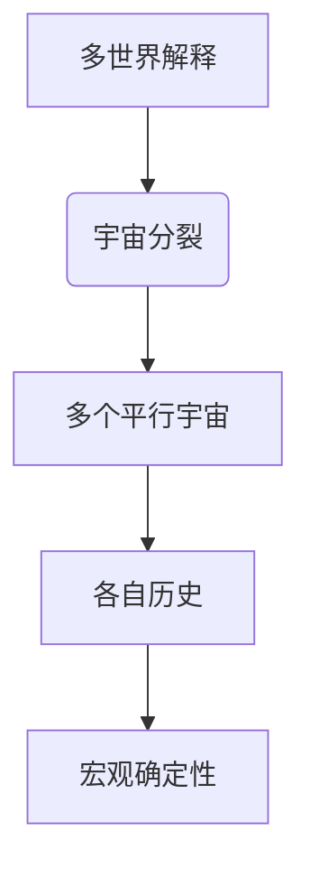

#### 4.1.2 相对论量子场论解释

相对论量子场论（QFT）是另一种尝试将量子力学与广义相对论统一的理论框架。在QFT中，量子场可以产生粒子，这些粒子的行为可以通过场方程来确定。尽管QFT本身是非定域的，但一些研究者试图通过特定的场论解释实现量子力学的宏观确定性。

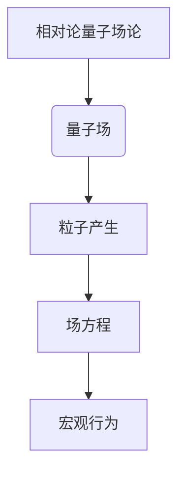

### 第5章：量子纠缠现象

#### 5.1 量子纠缠定义

量子纠缠是量子力学中的一种奇特现象，其中两个或多个量子系统在量子态上相互关联，即使它们之间没有直接相互作用。量子纠缠的一个关键特性是纠缠态中的粒子之间的非局域性，即一个粒子的状态变化会即时影响到与之纠缠的另一个粒子。

#### 5.1.1 量子纠缠的特性

量子纠缠具有以下主要特性：

1. 非局域性：纠缠态中的粒子之间的信息传递是瞬时的，不受距离限制。
2. 鲁棒性：量子纠缠具有高度鲁棒性，即使纠缠粒子受到外部干扰，它们之间的纠缠关系仍然存在。
3. 不可克隆性：无法精确复制一个量子纠缠态，这是量子计算和量子通信中的一个重要特性。

#### 5.1.2 量子纠缠的实验验证

量子纠缠的实验验证主要通过量子态的测量来实现。以下是一些著名的量子纠缠实验：

1. 非定域性实验：爱因斯坦-波多尔斯基-罗森（EPR）实验验证了量子纠缠中的非局域性。
2. 量子态隐形传输实验：通过量子纠缠，可以实现量子态从一个位置传输到另一个位置。
3. 量子密钥分发实验：利用量子纠缠实现安全的量子通信。

### 第6章：量子隧穿现象

#### 6.1 量子隧穿原理

量子隧穿是量子力学中的一种现象，其中粒子具有足够的能量穿越一个原本不可能克服的势垒。量子隧穿在微观世界中具有重要意义，例如在半导体物理和量子电子学中。

#### 6.1.1 量子隧穿的概率解释

量子隧穿可以用概率解释。根据量子力学，粒子穿过势垒的概率与其能量和势垒高度有关。当粒子的能量足够高时，它有可能穿越势垒。

```latex
P(Tunneling) = \frac{e^{-S/kT}}{\sqrt{2\pi \hbar^2/m^2}}
```

这里，\( S \) 是粒子的波函数穿过势垒的衰减长度，\( k \) 是玻尔兹曼常数，\( T \) 是温度，\( \hbar \) 是约化普朗克常数，\( m \) 是粒子的质量。

#### 6.1.2 量子隧穿的应用实例

量子隧穿在许多实际应用中具有重要作用：

1. 超导隧道二极管：用于电子器件中的量子隧道效应。
2. 激光器：通过量子隧穿实现电子的激发。
3. 半导体量子点：用于量子计算和量子通信。

### 第7章：量子纠缠与量子计算

#### 7.1 量子计算机的基本原理

量子计算机是利用量子力学原理进行计算的新型计算机。量子计算机中的基本单元是量子比特（qubit），它与经典比特不同，可以同时处于多个状态。

#### 7.1.1 量子比特与经典比特的对比

量子比特（qubit）与经典比特的主要区别在于它们的状态表示。经典比特只能处于0或1状态，而量子比特可以同时处于0和1的叠加态。

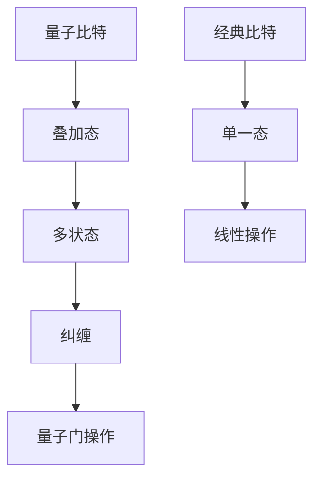

#### 7.1.2 量子计算的优势与挑战

量子计算具有以下优势：

1. 并行计算能力：量子计算机可以利用量子叠加原理进行并行计算，显著提高计算速度。
2. 量子纠错：量子计算机具有更强的纠错能力，能够处理噪声和误差。

然而，量子计算也面临一些挑战：

1. 量子态的保持：量子比特容易受到外界干扰，导致量子态的失真。
2. 量子门的精确控制：精确控制量子门的操作是量子计算的另一个挑战。

### 第8章：量子不确定性与宇宙学

#### 8.1 量子不确定性在宇宙学中的应用

量子不确定性在宇宙学中具有重要意义。例如，在宇宙起源和演化中，量子不确定性可能导致宇宙中的随机性和非均匀性。

#### 8.1.1 黑洞与量子不确定性

黑洞是宇宙中的一种极端现象，其性质与量子不确定性密切相关。根据量子力学，黑洞可能有量子性质，如霍金辐射，这表明黑洞并不是完全不可逃逸的。

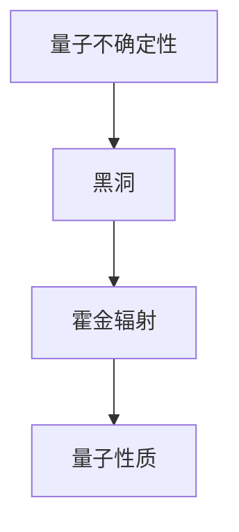

#### 8.1.2 量子宇宙学的探索

量子宇宙学是研究宇宙起源和演化的量子力学理论。量子宇宙学试图将量子力学与广义相对论结合起来，以解释宇宙的早期状态和演化。

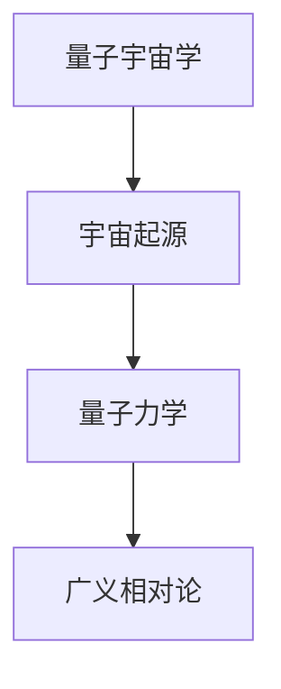

### 第9章：量子引力和宇宙学

#### 9.1 量子引力的基本理论

量子引力是试图将量子力学与广义相对论统一的理论。量子引力旨在描述宇宙中微观尺度的引力现象。

#### 9.1.1 量子引力的概念与挑战

量子引力面临以下挑战：

1. 统一理论：量子引力需要与标准模型和宇宙学理论统一起来。
2. 黑洞与引力波：量子引力需要解释黑洞的性质和引力波的传播。

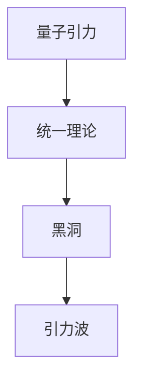

#### 9.1.2 量子引力与宇宙学的关系

量子引力与宇宙学的关系体现在：

1. 宇宙起源：量子引力可能解释宇宙的起源和早期演化。
2. 宇宙结构：量子引力可能影响宇宙的大尺度结构。

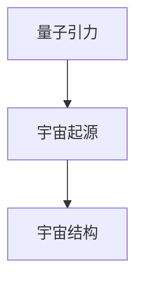

### 第10章：宇宙的确定性与不确定性关系探讨

#### 10.1 宇宙学中的确定性原理探讨

在宇宙学中，确定性原理体现在宇宙背景辐射和宇宙结构的确定性和均匀性。然而，随着研究的深入，我们发现了宇宙中的非均匀性和量子效应。

#### 10.1.1 宇宙背景辐射的确定性

宇宙背景辐射是宇宙早期状态的重要证据。通过对宇宙背景辐射的研究，我们可以了解宇宙的早期演化和热历史。

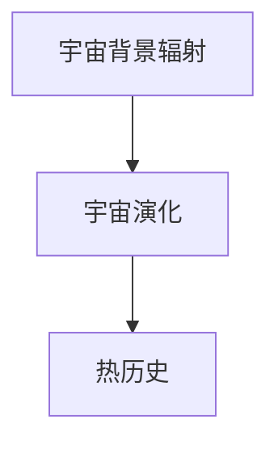

#### 10.1.2 宇宙结构的确定性

宇宙结构的研究揭示了宇宙的大尺度特征，如星系团、超星系团和宇宙背景辐射。然而，宇宙结构中也存在非均匀性和量子效应。

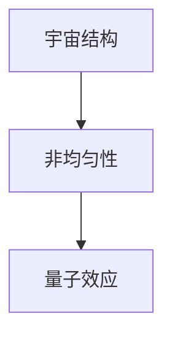

#### 10.2 量子不确定性与宇宙学的结合

量子不确定性与宇宙学的结合体现在：

1. 宇宙起源：量子不确定性可能导致宇宙中的随机性和非均匀性。
2. 宇宙演化：量子不确定性可能影响宇宙的演化过程，如引力波的传播和黑洞的形成。

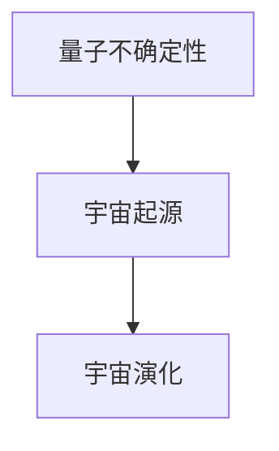

### 第11章：未来的研究方向与展望

#### 11.1 量子不确定性研究的未来方向

量子不确定性研究的未来方向包括：

1. 量子引力：进一步探索量子引力的理论框架，如弦理论和量子场论。
2. 宇宙学：将量子不确定性原理应用于宇宙学，研究宇宙的起源和演化。

#### 11.1.1 量子引力的进一步探索

量子引力的进一步探索可能揭示宇宙的基本结构和引力场的本质。例如，弦理论试图将引力与其他基本力统一在一起。

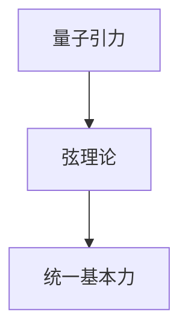

#### 11.1.2 量子不确定性与宇宙学的深入结合

量子不确定性与宇宙学的深入结合将有助于我们更好地理解宇宙的本质。未来的研究可能揭示宇宙中的新现象和新规律。

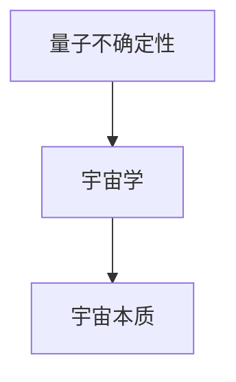

### 第12章：对宇宙理解的新挑战

#### 12.1 黑暗物质与黑暗能量的不确定性

宇宙中存在大量的黑暗物质和黑暗能量，它们对宇宙演化和结构的影响仍然不清楚。未来研究可能揭示黑暗物质和黑暗能量的本质和性质。

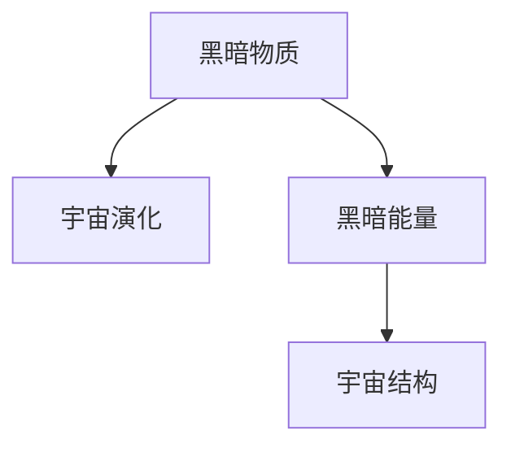

#### 12.2 宇宙起源与演化的不确定性

宇宙起源和演化中的不确定性仍然是我们面临的重要问题。未来研究可能揭示宇宙的起源和演化过程中的关键过程和机制。

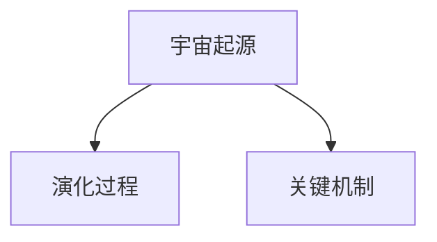

## 附录：相关公式与伪代码

### A.1 经典力学基本公式

#### A.1.1 牛顿第二定律

```latex
\frac{d^2x}{dt^2} = F/m
```

#### A.1.2 动能和势能

```latex
K = \frac{1}{2}mv^2
V = -\frac{k}{r}
```

### A.2 量子力学基本公式

#### A.2.1 波函数

```latex
\Psi(x,t) = \int dp \, \psi(p,t) e^{ipx/\hbar}
```

#### A.2.2 海森堡不确定性原理

```latex
\Delta x \Delta p \geq \hbar/2
```

### A.3 量子计算伪代码示例

#### A.3.1 量子态初始化

```python
def initialize_qubit():
    # 初始化量子比特为叠加态
    state = (1/sqrt(2)) * (|0> + |1>)
    return state
```

#### A.3.2 量子门操作

```python
def Hadamard_gate(qubit):
    # 实现Hadamard门操作
    state = qubit * (1/sqrt(2)) * (|0> + |1>)
    return state
```

#### A.3.3 量子测量操作

```python
def measure(qubit):
    # 实现量子测量操作
    if qubit == |0>:
        return 0
    elif qubit == |1>:
        return 1
```

