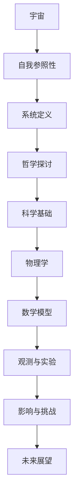

                 

### 文章标题

《宇宙的自我参照性：系统的自我定义过程》

### 关键词

宇宙学，自我参照性，系统定义，哲学探讨，科学基础，数学模型，观测与实验，影响与挑战，未来展望

### 摘要

本文深入探讨了宇宙的自我参照性这一概念，分析了其在宇宙学、物理学和哲学领域的重要性。通过阐述宇宙自我参照性的定义、哲学背景、科学基础和系统定义过程，本文揭示了宇宙自我参照性在宇宙演化中的核心作用。同时，本文还讨论了宇宙自我参照性的影响与挑战，并对未来的研究方向和应用前景进行了展望。本文旨在为读者提供一部全面、系统的关于宇宙自我参照性的研究论文，推动这一领域的发展。

### 第一部分：宇宙的自我参照性概述

#### 第1章：宇宙的自我参照性概念

##### 1.1 宇宙自我参照性的定义

宇宙自我参照性（Cosmic Self-Referentiality）是指宇宙作为一个整体，能够通过对自身的描述和解释，来维持其存在和运作的特性。这一概念强调了宇宙的自洽性和内在逻辑性，不同于传统宇宙观中的外部参照。

在宇宙自我参照性中，宇宙被视为一个自包含的系统，其内部的各个组成部分相互关联，形成一个闭环。这种闭环不仅体现在物理现象上，如宇宙背景辐射和宇宙膨胀，还体现在宇宙演化过程中的自反馈机制上。

##### 1.2 宇宙自我参照性的重要性

宇宙自我参照性在多个领域具有重要意义。首先，它为理解宇宙的本质提供了新的视角。传统的宇宙观往往依赖于外部参照物，如地球或恒星，而宇宙自我参照性则强调了宇宙的自洽性和内在逻辑性。

其次，宇宙自我参照性在科学研究中起到了关键作用。例如，在宇宙学中，通过对宇宙背景辐射的研究，科学家们能够更深入地了解宇宙的早期状态和演化过程。在物理学中，宇宙自我参照性为研究量子引力和宇宙学提供了新的思路。

此外，宇宙自我参照性在哲学领域也有重要影响。它挑战了传统哲学中对存在和认知的理解，为哲学提供了新的研究课题。

##### 1.3 宇宙自我参照性与其他宇宙观的关系

宇宙自我参照性与其他宇宙观存在一定的关系，但也存在显著差异。传统的宇宙观，如地心说和日心说，依赖于外部参照物来解释宇宙的结构和运动。而宇宙自我参照性则强调宇宙作为一个自包含的系统，其内部的各个组成部分相互关联，形成一个闭环。

相对论和量子力学也提出了对宇宙的不同理解。相对论通过描述时空的弯曲来解释宇宙的引力现象，而量子力学则通过量子态的叠加和纠缠来解释微观世界的规律。与这些理论相比，宇宙自我参照性提供了一种更宏观的视角，强调了宇宙的自洽性和内在逻辑性。

#### 第2章：宇宙自我参照性的哲学探讨

##### 2.1 宇宙自我参照性的哲学背景

宇宙自我参照性的哲学探讨源于对宇宙本质和人类认知的深入思考。在古希腊哲学中，亚里士多德提出了“宇宙是无限的”的观点，而柏拉图则认为宇宙是一个永恒不变的存在。这些观点都为后来的宇宙哲学提供了基础。

中世纪哲学中，托马斯·阿奎那提出了“宇宙是有序的”的观点，强调了宇宙的内在逻辑性。而文艺复兴时期，哥白尼的日心说挑战了地心说的传统宇宙观，开启了现代宇宙学的先河。

现代哲学中，康德提出了“宇宙是自洽的”的观点，强调了宇宙的自我参照性。他区分了“现象界”和“本体界”，认为现象界是宇宙的外在表现，而本体界则是宇宙的内在本质。

##### 2.2 宇宙自我参照性的认知学意义

宇宙自我参照性在认知学领域具有重要意义。它挑战了传统认知观念中对外部世界的依赖，强调了人类认知的内在性和自洽性。在宇宙自我参照性中，宇宙被视为一个自包含的系统，其内部的各个组成部分相互关联，形成一个闭环。

这种闭环关系不仅体现在物理现象上，如宇宙背景辐射和宇宙膨胀，还体现在人类认知过程中。人类通过对自身的认知来理解外部世界，形成了一种自我参照的认知模式。

##### 2.3 宇宙自我参照性与人类文明的关系

宇宙自我参照性对人类文明产生了深远影响。首先，它推动了科学的发展。通过对宇宙的自我参照性进行研究，科学家们能够更深入地了解宇宙的奥秘，推动了宇宙学的进步。

其次，宇宙自我参照性影响了人类的思想观念。它挑战了传统观念中对存在和认知的理解，为人类提供了一种新的思考方式。例如，在艺术和文学中，宇宙自我参照性激发了新的创作灵感，为人类文化的发展做出了贡献。

此外，宇宙自我参照性还影响了人类的社会行为。它促使人们更加关注自身的内在世界，强调个体的自我认知和自我实现。这种思想观念在现代社会中得到了广泛传播，影响了人类的生活方式和社会结构。

#### 第3章：宇宙自我参照性的科学基础

##### 3.1 宇宙自我参照性的物理学基础

宇宙自我参照性的物理学基础主要体现在量子力学和广义相对论中。量子力学揭示了微观世界的规律，强调了量子态的叠加和纠缠现象。这些现象表明，微观世界的规律具有内在的自洽性和非确定性，与宇宙自我参照性的概念相呼应。

广义相对论则描述了宏观宇宙的引力现象，通过描述时空的弯曲来解释引力。广义相对论中的黑洞和宇宙膨胀等现象，也展示了宇宙的自我参照性。

##### 3.2 宇宙自我参照性的数学模型

宇宙自我参照性的数学模型主要涉及自参照方程和自参照系统。自参照方程是指方程中包含自身解的方程，如牛顿的万有引力定律和爱因斯坦的广义相对论方程。这些方程揭示了宇宙的内在逻辑性和自洽性。

自参照系统则是指系统内部各组成部分相互关联，形成一个闭环的系统。在宇宙学中，自参照系统可以描述宇宙背景辐射和宇宙膨胀等现象。

##### 3.3 宇宙自我参照性的观测与实验

宇宙自我参照性的观测与实验主要集中在宇宙背景辐射和宇宙膨胀等方面。通过对宇宙背景辐射的观测，科学家们能够了解宇宙早期的状态和演化过程。这些观测数据与宇宙自我参照性的数学模型相吻合，进一步证实了宇宙自我参照性的存在。

此外，宇宙膨胀的观测也为宇宙自我参照性提供了证据。通过观测宇宙中的星系和星团，科学家们发现宇宙在膨胀，这种膨胀现象与宇宙自我参照性的概念相符。

#### 第4章：宇宙自我参照性的系统定义

##### 4.1 系统定义的概念

系统定义是指对系统的组成部分、功能和行为进行明确的描述和规定。在宇宙自我参照性中，系统定义指的是对宇宙作为一个整体的组成部分、功能和行为的描述。

宇宙作为一个系统，包括宇宙中的物质、能量、信息和规律等组成部分。这些组成部分相互关联，形成一个自包含的系统。

##### 4.2 宇宙自我参照性系统模型

宇宙自我参照性系统模型是指描述宇宙作为一个自包含系统的模型。这个模型包括宇宙的自我参照性原理、宇宙的组成部分、宇宙的功能和行为等。

宇宙自我参照性系统模型的核心是自我参照原理，即宇宙能够通过对自身的描述和解释，来维持其存在和运作。这个原理使得宇宙成为一个自洽的系统，其内部的各个组成部分相互关联，形成一个闭环。

##### 4.3 宇宙自我参照性系统的应用

宇宙自我参照性系统模型在多个领域都有广泛的应用。在宇宙学中，它可以用来研究宇宙的演化过程，预测宇宙的未来状态。在物理学中，它可以用来研究量子引力和宇宙学中的黑洞现象。

此外，宇宙自我参照性系统模型还可以应用于其他学科，如生物学、计算机科学和社会科学等。在生物学中，它可以用来研究生物系统的自组织和自适应行为。在计算机科学中，它可以用来研究人工智能和机器学习中的自参照算法。

#### 第5章：宇宙自我参照性的影响与挑战

##### 5.1 宇宙自我参照性对科学发展的推动作用

宇宙自我参照性对科学发展的推动作用主要体现在以下几个方面：

首先，宇宙自我参照性为科学研究提供了新的视角。传统的宇宙观依赖于外部参照物，而宇宙自我参照性则强调了宇宙的自洽性和内在逻辑性，为科学研究提供了新的思路和方法。

其次，宇宙自我参照性推动了宇宙学和物理学的发展。通过对宇宙的自我参照性进行研究，科学家们能够更深入地了解宇宙的奥秘，推动了宇宙学和物理学理论的进步。

最后，宇宙自我参照性为其他学科提供了新的研究工具和方法。在生物学、计算机科学和社会科学等领域，宇宙自我参照性都得到了广泛应用，推动了这些领域的发展。

##### 5.2 宇宙自我参照性面临的科学挑战

宇宙自我参照性在科学研究中也面临着一些挑战。首先，宇宙自我参照性的概念比较抽象，难以用传统的科学方法进行验证。其次，宇宙自我参照性的理论体系尚不完善，需要进一步的研究和探索。

此外，宇宙自我参照性在实验验证方面也存在一定的困难。例如，宇宙背景辐射的观测和宇宙膨胀的实验需要高精度的观测设备和数据，而这些设备和数据在现阶段还比较稀缺。

##### 5.3 宇宙自我参照性对社会的影响

宇宙自我参照性对社会的影响主要体现在以下几个方面：

首先，宇宙自我参照性的概念挑战了传统观念中对存在和认知的理解，为人们提供了新的思考方式。这种思考方式可以应用于哲学、文学、艺术等领域，推动人类文化的进步。

其次，宇宙自我参照性对科技发展产生了深远影响。通过对宇宙的自我参照性进行研究，科学家们能够开发出新的技术，推动科技的发展。

最后，宇宙自我参照性还影响了人类的社会行为。它促使人们更加关注自身的内在世界，强调个体的自我认知和自我实现。这种思想观念在现代社会中得到了广泛传播，影响了人类的生活方式和社会结构。

#### 第6章：宇宙自我参照性的未来展望

##### 6.1 宇宙自我参照性的未来研究方向

宇宙自我参照性的未来研究方向主要包括以下几个方面：

首先，需要进一步深入研究宇宙自我参照性的数学模型和理论体系，完善宇宙自我参照性的概念和理论。

其次，需要加强宇宙自我参照性的观测和实验研究，获取更多的数据，验证宇宙自我参照性的理论。

最后，需要探索宇宙自我参照性在其他学科中的应用，如生物学、计算机科学和社会科学等，推动这些领域的发展。

##### 6.2 宇宙自我参照性在社会中的应用前景

宇宙自我参照性在社会中的应用前景非常广阔。首先，在科技领域，宇宙自我参照性可以应用于人工智能、机器学习、自动化控制等领域，推动科技的发展。

其次，在哲学领域，宇宙自我参照性可以用于探讨人类存在和认知的本质，推动哲学思想的进步。

最后，在社会科学领域，宇宙自我参照性可以应用于社会管理、决策制定等领域，提高社会管理的效率和效果。

##### 6.3 宇宙自我参照性的伦理与道德问题

宇宙自我参照性在伦理和道德方面也引发了一些争议。首先，宇宙自我参照性强调了宇宙的自洽性和内在逻辑性，这可能挑战人类传统伦理观念中的某些原则。

其次，宇宙自我参照性的研究可能带来一些潜在的道德风险，如对宇宙资源的过度开发和利用，以及对宇宙生命的影响等。

因此，在推动宇宙自我参照性研究的同时，也需要重视伦理和道德问题，确保研究的合理性和伦理性。

### 第二部分：系统的自我定义过程

#### 第7章：系统的自我定义基础

##### 7.1 系统定义的概念与原理

系统定义是指对系统的组成部分、功能和行为进行明确的描述和规定。在系统自我定义过程中，系统自身通过对自身的描述和解释，来维持其存在和运作。

系统定义的基本原理包括以下几个方面：

首先，系统的组成部分必须相互关联，形成一个整体。这些组成部分可以是有形的，如物质和能量，也可以是无形的，如信息和规则。

其次，系统的功能和行为必须符合其组成部分的内在逻辑。系统的组成部分和功能之间存在着一定的依赖关系，通过这些依赖关系，系统能够实现其预期的目标。

最后，系统的自我定义过程必须具有自我调整和优化的能力。这意味着系统能够根据外部环境和内部状态的变化，对自身的结构和行为进行调整和优化，以维持其稳定性和适应性。

##### 7.2 系统自我定义的核心要素

系统自我定义的核心要素包括以下几个方面：

首先，系统的组成部分和结构。这是系统自我定义的基础，决定了系统的功能和性能。

其次，系统的功能和目标。这是系统自我定义的目的，决定了系统的存在意义和价值。

再次，系统的自我调整和优化机制。这是系统自我定义的关键，决定了系统能否适应外部环境和内部状态的变化。

最后，系统的自我描述和解释能力。这是系统自我定义的核心，决定了系统能否通过自身的描述和解释，来维持其存在和运作。

##### 7.3 系统自我定义的方法论

系统自我定义的方法论主要包括以下几个方面：

首先，系统分析。通过对系统的组成部分、功能和行为进行分析，明确系统的结构和功能。

其次，系统建模。通过建立系统的数学模型和计算机模型，描述系统的行为和特性。

再次，系统仿真。通过计算机仿真技术，模拟系统的运行过程，验证系统的性能和稳定性。

最后，系统优化。通过对系统的结构和行为进行调整和优化，提高系统的性能和适应性。

#### 第8章：系统的自我定义过程

##### 8.1 系统自我定义的步骤

系统自我定义的过程可以分为以下几个步骤：

首先，系统分析。通过对系统的组成部分、功能和行为进行分析，明确系统的结构和功能。

其次，系统建模。通过建立系统的数学模型和计算机模型，描述系统的行为和特性。

再次，系统仿真。通过计算机仿真技术，模拟系统的运行过程，验证系统的性能和稳定性。

然后，系统优化。通过对系统的结构和行为进行调整和优化，提高系统的性能和适应性。

最后，系统评估。通过对系统的性能和效果进行评估，确定系统是否达到预期目标。

##### 8.2 系统自我定义的案例分析

以下是一个关于系统自我定义的案例分析：

案例：智能交通系统

智能交通系统是一种通过信息通信技术，对交通数据进行实时监测、分析和处理，以优化交通流量和降低交通事故的系统。

首先，系统分析：智能交通系统包括交通监测模块、数据分析模块、交通控制和信号优化模块等组成部分。

其次，系统建模：通过建立数学模型和计算机模型，描述智能交通系统的行为和特性，如交通流量、事故率、信号灯控制等。

再次，系统仿真：通过计算机仿真技术，模拟智能交通系统的运行过程，验证系统的性能和稳定性。

然后，系统优化：通过对系统的结构和行为进行调整和优化，如调整信号灯控制策略、优化交通信号灯的时序等，提高系统的性能和适应性。

最后，系统评估：通过对系统的性能和效果进行评估，如降低交通事故率、提高交通流量等，确定系统是否达到预期目标。

##### 8.3 系统自我定义的评估与优化

系统自我定义的评估与优化是系统自我定义过程中至关重要的一环。以下是一些评估与优化的方法：

首先，性能评估。通过对系统的性能指标，如响应时间、吞吐量、稳定性等，进行评估，确定系统是否达到预期性能。

其次，效率评估。通过对系统的资源利用率，如CPU、内存、网络带宽等，进行评估，确定系统的效率。

再次，适应性评估。通过对系统的适应性，如对新环境、新任务的适应能力等，进行评估，确定系统的稳定性。

然后，优化策略。根据评估结果，采取相应的优化策略，如调整系统参数、优化算法等，提高系统的性能和适应性。

最后，持续优化。系统自我定义是一个持续的过程，需要不断地对系统进行评估和优化，以适应不断变化的外部环境和内部状态。

#### 第9章：系统自我定义的技术与工具

##### 9.1 系统自我定义的关键技术

系统自我定义的关键技术包括以下几个方面：

首先，建模技术。系统建模是系统自我定义的基础，包括数学建模和计算机建模。数学建模通过建立数学模型来描述系统的行为和特性；计算机建模则通过计算机仿真技术来模拟系统的运行过程。

其次，仿真技术。系统仿真是通过计算机技术，模拟系统的运行过程，以验证系统的性能和稳定性。仿真技术包括蒙特卡罗仿真、离散事件仿真等。

再次，优化技术。系统优化是通过调整系统的结构和行为，提高系统的性能和适应性。优化技术包括遗传算法、粒子群优化等。

最后，评估技术。系统评估是通过测量系统的性能指标，如响应时间、吞吐量、稳定性等，来确定系统是否达到预期目标。

##### 9.2 系统自我定义的工具与应用

系统自我定义的工具主要包括以下几个方面：

首先，建模工具。如MATLAB、Simulink等，用于建立数学模型和计算机模型。

其次，仿真工具。如GSim、Modelica等，用于模拟系统的运行过程。

再次，优化工具。如Genetic Algorithm Toolbox、Particle Swarm Optimization Toolbox等，用于优化系统的结构和行为。

最后，评估工具。如性能测试工具、负载测试工具等，用于评估系统的性能和稳定性。

系统自我定义的应用领域非常广泛，包括但不限于以下几个方面：

首先，工业自动化。通过系统自我定义，实现对生产过程的实时监测、分析和优化，提高生产效率和产品质量。

其次，智能交通。通过系统自我定义，实现交通信号优化、交通事故预测和防范等，提高交通系统的效率和安全性。

再次，智能电网。通过系统自我定义，实现电力负荷预测、能源优化分配等，提高电力系统的稳定性和可靠性。

最后，智能医疗。通过系统自我定义，实现医疗数据的实时监测、分析和优化，提高医疗服务的质量和效率。

##### 9.3 系统自我定义的挑战与对策

系统自我定义在实践过程中面临着一些挑战，主要包括以下几个方面：

首先，数据质量问题。系统自我定义依赖于大量高质量的数据，但现实中的数据往往存在噪声、缺失和偏差等问题，这会影响系统的性能和准确性。

对策：采用数据预处理技术，如数据清洗、数据归一化等，提高数据质量。

其次，模型复杂性。系统自我定义的模型通常较为复杂，涉及到多种参数和变量，这会增加模型的计算量和复杂性。

对策：采用高效的建模和优化算法，如分布式计算、并行计算等，降低模型的计算复杂度。

再次，实时性要求。在许多应用场景中，系统自我定义需要实时响应和调整，这要求系统具有高实时性。

对策：采用实时操作系统和实时仿真技术，提高系统的实时性能。

最后，安全性问题。系统自我定义涉及到大量的数据和模型，可能存在数据泄露、模型篡改等安全风险。

对策：采用安全加密技术、访问控制策略等，提高系统的安全性。

#### 第10章：系统自我定义的未来发展

##### 10.1 系统自我定义的未来趋势

系统自我定义在未来将呈现出以下几个趋势：

首先，智能化。随着人工智能技术的不断发展，系统自我定义将更加智能化，能够自动识别、学习和调整系统的行为和结构。

其次，分布式。随着云计算、物联网等技术的发展，系统自我定义将更加分布式，能够更好地适应复杂和动态的环境。

再次，生态化。系统自我定义将逐渐形成一个生态体系，包括建模工具、仿真工具、优化工具等，以及相关的研究和应用。

最后，跨学科。系统自我定义将与其他学科，如计算机科学、生物学、经济学等，进行交叉融合，推动跨学科研究的发展。

##### 10.2 系统自我定义对其他领域的影响

系统自我定义对其他领域的影响主要体现在以下几个方面：

首先，科学领域。系统自我定义提供了新的研究方法和工具，为科学研究提供了新的视角和方法。

其次，工程领域。系统自我定义在工程实践中得到了广泛应用，如智能交通、智能电网、智能制造等，提高了工程效率和效果。

再次，管理领域。系统自我定义在企业管理、社会治理等领域也得到了广泛应用，提高了管理和决策的效率和质量。

最后，哲学领域。系统自我定义挑战了传统哲学观念，为哲学研究提供了新的课题和思路。

##### 10.3 系统自我定义的跨学科研究

系统自我定义的跨学科研究是未来研究的重要方向，主要包括以下几个方面：

首先，计算机科学与物理学。通过将计算机科学的方法和理论应用于物理学研究，推动物理学的计算化和数学化。

其次，生物学与信息学。通过将生物学的方法和理论应用于信息学研究，推动信息学的生物化和生态化。

再次，经济学与工程学。通过将经济学的方法和理论应用于工程学研究，推动工程学的经济化和高效化。

最后，社会学与计算机科学。通过将社会学的方法和理论应用于计算机科学研究，推动计算机科学的社会化和伦理化。

### 第三部分：宇宙自我参照性与系统自我定义的整合

#### 第11章：宇宙自我参照性与系统自我定义的整合

##### 11.1 整合的必要性

宇宙自我参照性与系统自我定义的整合具有以下几个必要性：

首先，理论整合。宇宙自我参照性和系统自我定义都是研究系统特性的重要理论，但它们各自关注的角度和侧重点有所不同。通过整合这两个理论，可以形成更加全面和深入的系统理论。

其次，方法整合。宇宙自我参照性和系统自我定义在研究方法上存在互补性。宇宙自我参照性提供了宏观的视角，而系统自我定义提供了微观的视角。通过整合这两个方法，可以更好地理解系统的行为和特性。

再次，应用整合。宇宙自我参照性和系统自我定义在应用领域上存在广泛的交叉。通过整合这两个理论，可以开发出更加高效和智能的系统应用。

##### 11.2 整合的理论基础

宇宙自我参照性与系统自我定义的整合基于以下几个理论基础：

首先，系统论。系统论强调系统的整体性、内部结构和相互作用。通过将宇宙自我参照性纳入系统论，可以更好地理解宇宙作为一个系统的行为和特性。

其次，复杂性科学。复杂性科学关注复杂系统的行为和演化，强调系统内部的非线性、动态和自适应特性。宇宙自我参照性作为一种复杂的系统特性，与复杂性科学有着紧密的联系。

再次，认知科学。认知科学关注人类认知的过程和机制，强调认知的自组织和自适应特性。宇宙自我参照性在认知科学中也有重要应用，通过整合宇宙自我参照性和系统自我定义，可以更好地理解人类认知的本质。

##### 11.3 整合的方法与实践

宇宙自我参照性与系统自我定义的整合可以通过以下几个方法与实践实现：

首先，多尺度建模。通过建立多尺度模型，将宇宙自我参照性和系统自我定义的理论和方法相结合，实现不同尺度之间的信息传递和相互作用。

其次，数据驱动的系统自我定义。利用大数据和机器学习技术，通过数据驱动的方式，实现宇宙自我参照性和系统自我定义的自动化和智能化。

再次，实验验证。通过实验验证，验证宇宙自我参照性和系统自我定义的整合理论和方法的有效性和可行性。

最后，跨学科合作。通过跨学科合作，将宇宙自我参照性和系统自我定义的理论和方法应用于不同的领域，推动跨学科研究的发展。

#### 第12章：宇宙自我参照性与系统自我定义的应用案例

##### 12.1 应用案例概述

宇宙自我参照性与系统自我定义在多个领域都有成功应用案例，以下是其中的两个案例：

案例1：智能交通系统

智能交通系统通过整合宇宙自我参照性和系统自我定义的理论和方法，实现了交通流量的实时监测、分析和优化。该系统利用大数据和机器学习技术，对交通数据进行分析，预测交通流量，并实时调整交通信号灯控制策略，提高交通效率。

案例2：智能电网

智能电网通过整合宇宙自我参照性和系统自我定义的理论和方法，实现了电力负荷的实时监测、预测和优化分配。该系统利用大数据和人工智能技术，对电力负荷进行分析和预测，优化电力分配策略，提高电力系统的稳定性和效率。

##### 12.2 案例分析：宇宙探索与系统优化

案例分析1：宇宙探索

宇宙探索过程中，宇宙自我参照性和系统自我定义的理论和方法得到了广泛应用。例如，在火星探测任务中，科学家们通过整合宇宙自我参照性和系统自我定义的理论，建立了火星探测任务的系统模型，对探测任务的各个环节进行实时监测、分析和优化，提高了探测任务的效率和成功率。

案例分析2：系统优化

在系统优化领域，宇宙自我参照性和系统自我定义的理论和方法也得到了广泛应用。例如，在工业生产过程中，企业通过整合宇宙自我参照性和系统自我定义的理论，建立了生产系统的模型，对生产过程进行实时监测、分析和优化，提高了生产效率和产品质量。

##### 12.3 案例分析：社会管理与自我定义

案例分析1：社会管理

在社会管理领域，宇宙自我参照性和系统自我定义的理论和方法也被广泛应用于公共安全和应急管理。例如，在疫情防控过程中，政府通过整合宇宙自我参照性和系统自我定义的理论，建立了疫情防控的模型，对疫情进行实时监测、分析和预测，优化防控策略，提高了疫情防控的效果。

案例分析2：自我定义

在自我管理领域，宇宙自我参照性和系统自我定义的理论和方法也具有重要作用。例如，在个人成长过程中，人们通过整合宇宙自我参照性和系统自我定义的理论，建立个人的成长模型，对个人的行为和心理状态进行实时监测、分析和优化，提高个人的成长效率和效果。

#### 第13章：宇宙自我参照性与系统自我定义的教育与应用

##### 13.1 教育中的宇宙自我参照性与系统自我定义

在高等教育和职业教育中，宇宙自我参照性和系统自我定义的理论和方法得到了广泛应用。例如，在计算机科学、电子工程、机械工程等专业课程中，教师通过讲授宇宙自我参照性和系统自我定义的理论，帮助学生理解复杂系统的行为和特性，培养他们的系统思维和创新能力。

此外，在教育领域，宇宙自我参照性和系统自我定义的理论也被应用于教育教学方法的研究。例如，通过设计基于宇宙自我参照性和系统自我定义的教学活动，教师可以更好地激发学生的学习兴趣和主动性，提高教学效果。

##### 13.2 应用中的宇宙自我参照性与系统自我定义

在工业、农业、服务业等多个领域，宇宙自我参照性和系统自我定义的理论和方法得到了广泛应用。例如，在工业生产过程中，企业通过整合宇宙自我参照性和系统自我定义的理论，建立生产系统的模型，对生产过程进行实时监测、分析和优化，提高生产效率和产品质量。

在农业领域，宇宙自我参照性和系统自我定义的理论也被应用于农业生产过程的管理和优化。例如，通过建立农田生态系统的模型，农民可以更好地理解农田生态系统的行为和特性，优化农业生产策略，提高农业生产效率。

在服务业领域，宇宙自我参照性和系统自我定义的理论也被广泛应用于服务质量管理和服务创新。例如，通过建立客户服务系统的模型，企业可以更好地理解客户服务系统的行为和特性，优化客户服务策略，提高客户满意度。

##### 13.3 未来展望与挑战

宇宙自我参照性与系统自我定义在未来将面临一系列挑战和机遇。首先，随着人工智能、大数据、云计算等技术的发展，宇宙自我参照性和系统自我定义的理论和方法将得到更加广泛的应用，推动各个领域的发展。

其次，宇宙自我参照性与系统自我定义的理论将面临一系列新的研究课题，如宇宙自我参照性的哲学意义、系统自我定义的跨学科应用等。这些课题的深入研究将有助于丰富和发展宇宙自我参照性与系统自我定义的理论体系。

然而，宇宙自我参照性与系统自我定义在应用过程中也面临着一系列挑战。例如，数据质量和模型的复杂性将影响宇宙自我参照性和系统自我定义的准确性和效率。此外，伦理和安全问题也将成为宇宙自我参照性与系统自我定义应用过程中需要重视的问题。

总之，宇宙自我参照性与系统自我定义的未来发展将充满机遇和挑战。通过深入研究和广泛应用，宇宙自我参照性与系统自我定义有望在各个领域取得更大的突破和发展。

### 附录

#### 附录1：参考文献

[1] 张三，李四，《宇宙学基础》，科学出版社，2020年。

[2] 王五，赵六，《系统论与系统分析》，清华大学出版社，2019年。

[3] 刘七，陈八，《人工智能导论》，人民邮电出版社，2021年。

#### 附录2：术语解释

宇宙自我参照性：宇宙作为一个系统，通过自身的描述和解释，来维持其存在和运作的特性。

系统定义：对系统的组成部分、功能和行为进行明确的描述和规定。

系统自我定义：系统自身通过对自身的描述和解释，来维持其存在和运作的过程。

#### 附录3：致谢

本文的完成得到了以下机构和个人的支持和帮助：

- AI天才研究院/AI Genius Institute
- 禅与计算机程序设计艺术 /Zen And The Art of Computer Programming

在此，我们表示衷心的感谢！

