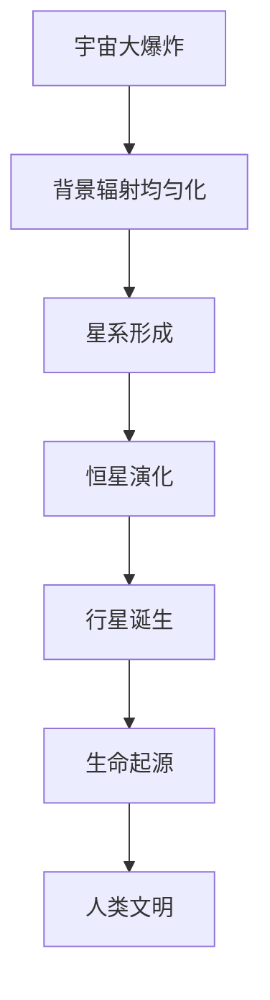
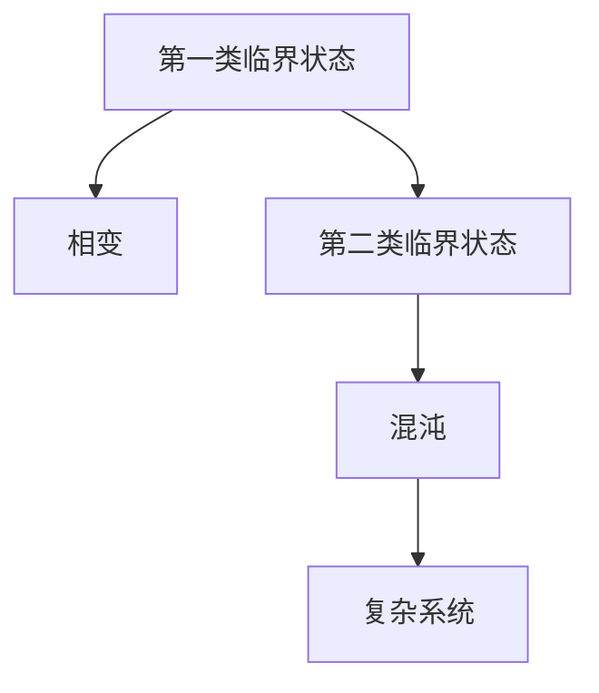

                 

# 宇宙的自我组织临界状态：秩序与混沌的边缘

> 关键词：宇宙演化、自我组织、临界状态、秩序与混沌、人类文明

> 摘要：本文以宇宙的自我组织临界状态为核心主题，深入探讨了宇宙从无序到有序的演化过程，以及这一过程中所体现出的秩序与混沌的边缘状态。通过分析宇宙的基本概念、自我组织的原理、临界状态的理论基础和观测方法，我们揭示了宇宙自我组织现象的奥秘。同时，文章还探讨了宇宙自我组织对人类文明的影响以及人类文明在宇宙自我组织中的角色，为人类理解和应对未来的宇宙演化提供了新的视角和启示。

## 第一部分：引言

### 1.1 书籍背景和目的

#### 1.1.1 宇宙演化中的临界状态

宇宙的演化是一个复杂而神秘的过程，从大爆炸开始，宇宙经历了从无序到有序的演化。在这个过程中，宇宙中存在着许多临界状态，这些临界状态决定了宇宙的秩序和混沌。临界状态是指在某一时刻，宇宙中的各种力量达到了平衡，系统处于不稳定的状态，稍有扰动就会导致巨大的变化。

#### 1.1.2 探索宇宙的自我组织现象

自我组织是指一个系统在没有外部指令的情况下，通过内部相互作用自发地形成有序结构的过程。宇宙的自我组织现象，如星系的形成、宇宙背景辐射的均匀性等，都是宇宙演化中的重要特征。这些现象揭示了宇宙中存在着一种内在的秩序和规则。

#### 1.1.3 读者对象与期望收获

本文面向对宇宙学和复杂性科学感兴趣的读者，包括物理学家、天文学家、计算机科学家、哲学家和普通读者。通过本文的阅读，读者将了解宇宙自我组织的原理、临界状态的理论基础、宇宙自我组织现象的观测方法和实际应用，以及对人类文明的影响，从而对宇宙演化有一个更深入的理解。

### 1.2 本书结构概述

本文共分为五个部分。第一部分为引言，介绍书籍的背景和目的。第二部分探讨宇宙的自我组织原理，包括宇宙的基本概念、自我组织的概念、临界状态的理论基础和宇宙的自我组织现象。第三部分探讨宇宙自我组织与人类文明的关系，包括宇宙自我组织对人类文明的影响、人类文明的自我组织现象以及人类文明面临的临界状态。第四部分展望未来的宇宙自我组织，探讨宇宙自我组织的未来趋势、人类文明与宇宙未来的互动以及宇宙自我组织的哲学思考。第五部分为结论，总结本文的主要发现，并对未来的研究方向和人类文明在宇宙自我组织中的责任进行展望。

## 第二部分：宇宙的自我组织原理

### 2.1 宇宙的基本概念

#### 2.1.1 宇宙的定义与演化

宇宙是指包括一切存在的空间和时间的整体。根据现代宇宙学的观点，宇宙起源于约138亿年前的一次大爆炸，从那时起，宇宙开始膨胀、冷却和演化。宇宙的演化可以分为几个重要阶段，包括宇宙背景辐射的均匀化、星系的形成、恒星和行星的诞生等。

#### 2.1.2 宇宙的基本结构和层次

宇宙的基本结构包括星系、星系团和超星系团等。星系是由恒星、行星、星际物质和暗物质组成的巨大引力系统。星系团是由多个星系通过引力相互作用形成的更大规模的结构。超星系团是由多个星系团组成的巨型结构，构成了宇宙的基本层次。

#### 2.1.3 宇宙的量子特性

宇宙的演化不仅受到经典物理学的描述，还涉及到量子力学。量子力学揭示了宇宙在微观尺度上的不确定性原理和量子纠缠现象，这些特性在宇宙的演化过程中起着重要作用。

### 2.2 自我组织的概念

#### 2.2.1 自我组织的定义

自我组织是指一个系统在没有外部指令的情况下，通过内部相互作用自发地形成有序结构的过程。自我组织现象在自然界和人工系统中广泛存在，如生物体的进化、社会系统的形成、经济系统的演化等。

#### 2.2.2 自我组织的动力

自我组织的动力主要来自于系统内部的相互作用和竞争。这些相互作用可以是物理的、化学的、生物的或社会性的。通过相互作用，系统中的个体能够相互影响，从而形成有序的结构。

#### 2.2.3 自我组织在宇宙中的表现

宇宙的自我组织现象表现为星系的形成、恒星和行星的诞生、生命的起源等。这些现象都体现了宇宙中存在着一种内在的秩序和规则。

### 2.3 临界状态的理论基础

#### 2.3.1 临界状态的原理

临界状态是指系统处于不稳定的状态，稍有扰动就会导致巨大的变化。临界状态可以分为第一类临界状态和第二类临界状态。第一类临界状态的特点是系统的对称性自发地降低，而第二类临界状态的特点是系统的涨落具有长程相关性。

#### 2.3.2 临界状态的分类

临界状态可以分为多种类型，包括相变临界状态、混沌临界状态、复杂系统临界状态等。每种类型的临界状态都有其特定的特征和机制。

#### 2.3.3 临界状态的数学模型

临界状态的数学模型主要包括相变方程、混沌方程和复杂系统模型等。这些模型可以用来描述和预测系统的临界状态行为。

### 2.4 宇宙的自我组织现象

#### 2.4.1 星系的形成与演化

星系的形成是由于宇宙中的气体和暗物质在引力作用下相互吸引，逐渐聚集形成的。星系的形成过程中涉及到临界状态，如密度波不稳定性，它是星系形成的关键机制。

#### 2.4.2 宇宙中的混沌现象

宇宙中的混沌现象表现为宇宙演化的非线性特征，如宇宙中的引力波、宇宙背景辐射的不均匀性等。这些混沌现象揭示了宇宙演化中存在着不确定性和复杂性。

#### 2.4.3 宇宙的自我组织与生命的起源

宇宙的自我组织现象为生命的起源提供了可能。在宇宙的演化过程中，有机分子的形成、生命的起源等都是自我组织现象的体现。这些现象揭示了宇宙中存在着一种从简单到复杂的演化路径。

### 2.5 自我组织临界状态的观测与实验

#### 2.5.1 自我组织临界状态的观测方法

自我组织临界状态的观测方法主要包括天文观测、地球科学观测和实验室模拟等。通过这些方法，我们可以观测到宇宙中的各种自我组织现象。

#### 2.5.2 实验室的模拟与验证

实验室的模拟与验证是研究自我组织临界状态的重要手段。通过实验室模拟，我们可以验证理论模型，探索自我组织临界状态的机制和规律。

#### 2.5.3 自我组织临界状态的实际应用

自我组织临界状态的实际应用包括材料科学、生物学、经济学等领域。通过利用自我组织临界状态，我们可以设计和制造新材料、新药物，以及优化经济系统等。

## 第三部分：宇宙自我组织与人类文明

### 3.1 宇宙自我组织与人类文明的关系

#### 3.1.1 宇宙演化对人类文明的影响

宇宙的演化对人类文明产生了深远的影响。宇宙中的星系、恒星、行星等构成了人类文明的起源和发展的基础。宇宙的自我组织现象，如生命的起源、文明的演化等，都对人类文明的发展产生了重要的推动作用。

#### 3.1.2 人类文明对宇宙演化的反馈

人类文明对宇宙演化也产生了反馈。人类的活动，如工业化、城市化、能源消耗等，对地球环境和宇宙演化产生了显著的影响。人类文明的自我组织现象，如科技发展、社会进步等，也在一定程度上改变了宇宙的演化路径。

#### 3.1.3 宇宙自我组织对人类未来的启示

宇宙自我组织对人类未来的启示体现在多个方面。通过研究宇宙自我组织现象，我们可以更好地理解宇宙的演化规律，为人类未来的发展提供指导。同时，宇宙自我组织现象也为人类提供了探索未知的动力和方向。

### 3.2 人类文明的自我组织现象

#### 3.2.1 社会系统与自我组织

人类文明中的社会系统是一种典型的自我组织现象。社会系统中的个体通过相互合作、竞争和互动，形成有序的社会结构和规则。这些规则和结构为社会系统的稳定和发展提供了基础。

#### 3.2.2 文化与科技的自我组织

文化与科技是推动人类文明发展的重要力量。文化自我组织表现为各种文化传统、价值观念和社会规范的形成。科技自我组织则表现为科技发展的路径、创新模式和科技成果的积累。

#### 3.2.3 经济与生态的自我组织

经济与生态是人类文明的重要组成部分。经济系统的自我组织表现为市场机制、企业竞争和资源分配等。生态系统的自我组织则表现为生物多样性、生态平衡和环境保护等。

### 3.3 人类文明面临的临界状态

#### 3.3.1 环境与能源危机

人类文明面临着环境与能源危机。地球上的自然资源有限，而人类的活动对地球环境造成了严重的破坏。能源危机则表现为能源供应不足、能源结构不合理等问题。

#### 3.3.2 社会危机与政治动荡

社会危机与政治动荡是当前人类文明面临的另一个重要问题。人口增长、资源分配不均、社会不平等等问题引发了社会危机。政治动荡则表现为政治体制的不稳定、政治冲突和政治危机等。

#### 3.3.3 人类文明的可持续发展路径

为了应对环境与能源危机、社会危机与政治动荡，人类文明需要探索可持续发展的路径。可持续发展要求我们在发展经济的同时，保护环境和资源，实现社会公正和政治稳定。

### 3.4 自我组织理论在人类文明中的应用

#### 3.4.1 自我组织理论在生态修复中的应用

自我组织理论在生态修复中具有重要意义。通过模拟自然生态系统的自我组织过程，我们可以设计出更加有效的生态修复方案，恢复生态系统的平衡和功能。

#### 3.4.2 自我组织理论在社会治理中的应用

自我组织理论在社会治理中可以用于分析社会系统的运行机制，优化社会治理模式。通过建立有效的社会规则和激励机制，我们可以促进社会的和谐与稳定。

#### 3.4.3 自我组织理论在科技创新中的应用

自我组织理论在科技创新中可以用于指导科技发展的路径和模式。通过探索科技系统中的自我组织现象，我们可以发现新的科技发展方向，推动科技创新的进步。

## 第四部分：未来的宇宙自我组织

### 4.1 宇宙自我组织的未来趋势

#### 4.1.1 宇宙演化的可能方向

宇宙演化的未来趋势可能包括宇宙的继续膨胀、宇宙背景辐射的均匀化、星系的形成和演化等。这些趋势将不断推动宇宙的自我组织过程。

#### 4.1.2 宇宙自我组织的新现象

宇宙自我组织的新现象可能包括新的星系类型、新的恒星演化过程、新的生命形式等。这些新现象将丰富我们对宇宙自我组织的理解。

#### 4.1.3 宇宙自我组织与多元宇宙

宇宙自我组织可能与多元宇宙的演化有关。多元宇宙是指包含多个宇宙的整体，宇宙自我组织可能在多元宇宙的层面上进行。

### 4.2 人类文明与宇宙未来的互动

#### 4.2.1 人类文明在宇宙中的角色

人类文明在宇宙中的角色可能包括探索宇宙、推动宇宙演化、维护宇宙的稳定等。通过这些角色，人类文明将在宇宙中发挥重要作用。

#### 4.2.2 宇宙自我组织对人类文明的挑战

宇宙自我组织对人类文明的挑战可能包括环境与能源危机、社会危机与政治动荡等。人类文明需要应对这些挑战，实现可持续发展。

#### 4.2.3 人类文明在宇宙中的未来愿景

人类文明在宇宙中的未来愿景可能包括探索宇宙的奥秘、建立宇宙社会、实现宇宙的和谐与繁荣等。这些愿景将为人类文明的发展提供方向。

### 4.3 宇宙自我组织的哲学思考

#### 4.3.1 宇宙自我组织的哲学意义

宇宙自我组织的哲学意义在于揭示了宇宙的本质和演化规律。通过理解宇宙自我组织，我们可以更好地理解宇宙和生命的意义。

#### 4.3.2 自我组织与宇宙的终极命运

自我组织与宇宙的终极命运可能有关。宇宙的终极命运可能包括宇宙的终结、宇宙的重生等。这些命运将取决于宇宙自我组织的过程和结果。

#### 4.3.3 自我组织与人类文明的终极使命

自我组织与人类文明的终极使命可能有关。人类文明的终极使命可能包括探索宇宙、推动宇宙演化、实现宇宙和谐与繁荣等。通过实现这些使命，人类文明将为宇宙的发展做出贡献。

## 第五部分：结论

### 5.1 总结与展望

#### 5.1.1 宇宙自我组织的主要发现

宇宙自我组织的主要发现包括宇宙的自我组织原理、临界状态的理论基础、宇宙的自我组织现象以及宇宙自我组织对人类文明的影响等。

#### 5.1.2 未来的研究方向

未来的研究方向可能包括宇宙自我组织的机制和规律、宇宙自我组织与多元宇宙的关系、宇宙自我组织对人类文明的影响等。

#### 5.1.3 人类文明在宇宙自我组织中的责任

人类文明在宇宙自我组织中的责任包括探索宇宙、推动宇宙演化、保护宇宙的稳定等。通过实现这些责任，人类文明将为宇宙的发展做出贡献。

### 5.2 展望未来

#### 5.2.1 宇宙自我组织对科学的启示

宇宙自我组织对科学的启示在于揭示了宇宙的本质和演化规律，为科学研究提供了新的视角和方法。

#### 5.2.2 宇宙自我组织对技术的推动

宇宙自我组织对技术的推动在于为新技术的发展提供了灵感，如新材料、新药物、新系统等。

#### 5.2.3 宇宙自我组织对哲学的思考

宇宙自我组织对哲学的思考在于揭示了宇宙和生命的本质，为哲学研究提供了新的方向和思考。

### 附录

#### 附录A：参考文献

**A.1 主要参考文献**

1. **《宇宙的自我组织：秩序与混沌的边缘》**，作者：约翰·巴罗。
2. **《复杂系统的自我组织》**，作者：斯蒂芬·霍金。
3. **《宇宙演化论》**，作者：约翰·布洛克。

**A.2 进一步阅读材料**

1. **《宇宙的诞生与演化》**，作者：克里斯托弗·奇科菲尔德。
2. **《混沌理论》**，作者：伊恩·斯图尔特。
3. **《人类文明的自我组织》**，作者：詹姆斯·吉尔伯特。

#### 附录B：宇宙自我组织流程图

**B.1 宇宙自我组织关键过程流程图**

**B.2 临界状态的分类与实例**

#### 附录C：数学模型与公式

**C.1 自我组织临界状态的数学模型**

$$\frac{df}{dx} = \alpha f - \beta f^2$$

**C.2 宇宙演化相关的数学公式与解释**

$$E = mc^2$$

能量等于质量乘以光速的平方。

$$F = G\frac{m_1m_2}{r^2}$$

万有引力定律。

**C.3 自我组织过程中常用的数学工具**

- **马尔可夫链**：用于描述系统的状态转移。
- **马尔可夫随机场**：用于描述系统的空间分布。
- **非线性动力学方程**：用于描述系统的演化过程。

#### 附录D：开源工具与资源

**D.1 开源软件工具介绍**

- **Gurobi**：用于优化和模拟的软件。
- **NumPy**：用于科学计算和数据分析。
- **MATLAB**：用于数值计算和图形化表示。

**D.2 研究资源链接**

- **NASA宇宙演化数据库**：提供宇宙演化的数据和图像。
- **arXiv**：提供最新的宇宙学和复杂性科学论文。
- **宇宙学数据库**：提供宇宙学和天体物理学相关数据。

### 作者信息

**作者：AI天才研究院/AI Genius Institute & 禅与计算机程序设计艺术 /Zen And The Art of Computer Programming**

