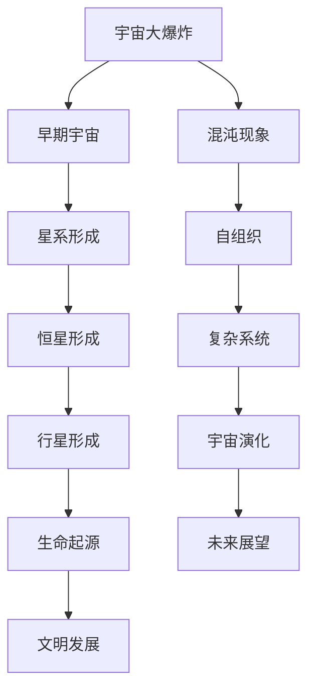
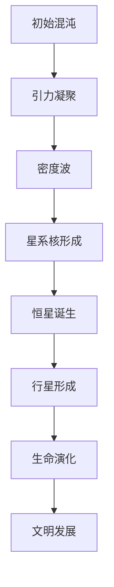

                 

### 文章标题

《宇宙的自我组织：从混沌到秩序》

### 关键词

宇宙、自我组织、混沌、秩序、复杂系统、非线性动力学、大爆炸理论、星系、暗物质、暗能量、复杂系统理论、人类认知、地球环境、人类文明、未来科技

### 摘要

本文旨在探讨宇宙中自我组织的现象，从混沌到秩序的转变。首先，我们将回顾宇宙的自我组织理论，了解其基本概念和意义。接着，我们将探讨宇宙中的混沌现象，并分析混沌与宇宙演化的关系。随后，我们将深入探讨宇宙中的秩序，包括宇宙早期阶段、星系与星系团的形成，以及暗物质与暗能量的作用。然后，我们将探讨宇宙的自我组织原理和机制，包括非线性动力学、能量流动与信息传递。最后，我们将探讨宇宙自我组织对人类认知和未来的影响，以及宇宙自我组织与人类文明的关系。通过本文的探讨，我们将揭示宇宙自我组织的深刻奥秘，并为人类未来发展提供启示。

## 第一部分：宇宙的混沌与秩序概述

### 第1章：宇宙的自我组织理论概述

#### 1.1 宇宙的自我组织概念

宇宙的自我组织是指宇宙中的物质和能量在演化过程中，通过一系列复杂而有序的相互作用，从无序状态逐步走向有序状态的过程。这一过程涉及到物理、化学、生物等多个学科领域，是宇宙演化中一个重要且普遍的现象。

宇宙的自我组织不仅包括物质的聚集和结构形成，还包括能量和信息的流动与转化。它体现了宇宙从简单到复杂、从低级到高级的发展趋势。宇宙的自我组织是一种自下而上的过程，即从微观粒子开始，逐步形成宏观的宇宙结构。

#### 1.2 宇宙中的混沌与秩序

宇宙中的混沌与秩序是两个相对的概念。混沌是指宇宙中的无序状态，表现为随机性和不确定性。而秩序则是指宇宙中的有序状态，表现为规则性和可预测性。

在宇宙的演化过程中，混沌与秩序是相互转化的。混沌状态是宇宙演化的起点，通过一系列物理、化学和生物过程，逐步形成有序的结构和系统。这些有序的结构和系统在演化过程中又会产生新的混沌，从而推动宇宙的持续演化。

宇宙中的混沌与秩序的关系可以用“混沌产生秩序，秩序孕育混沌”来描述。混沌为宇宙的演化提供了丰富的可能性，而秩序则为宇宙的稳定和持续发展提供了基础。

#### 1.3 自我组织的宇宙学研究意义

宇宙的自我组织理论对宇宙学、物理学、化学、生物学等多个学科领域都有着重要的意义。

首先，它为我们理解宇宙的起源和演化提供了新的视角。传统的宇宙学理论主要关注宇宙的大尺度结构和演化过程，而宇宙的自我组织理论则更关注宇宙中的微观和中等尺度结构，以及这些结构之间的相互作用。

其次，宇宙的自我组织理论对物理学的发展具有重要意义。它揭示了宇宙中物质和能量的运动规律，为研究复杂系统的行为提供了新的理论框架。

此外，宇宙的自我组织理论对化学和生物学的研究也提供了新的启示。它可以帮助我们理解生命起源和生物进化中的复杂现象，从而推动生命科学的发展。

最后，宇宙的自我组织理论对我们认识宇宙和人类自身的地位和作用有着重要的影响。它揭示了宇宙中的普遍规律和演化趋势，使我们认识到宇宙是一个有序、复杂且动态变化的系统。这有助于我们更深入地理解人类在宇宙中的角色和使命，推动人类文明的进步。

## 第2章：宇宙中的混沌现象

#### 2.1 混沌学的起源与发展

混沌学，也被称为混沌理论，是20世纪中叶发展起来的一门跨学科研究领域。混沌理论起源于对流体力学、天体力学和电子电路等系统的深入研究。这些系统在特定的条件下表现出非线性、复杂和不可预测的行为，被称为“混沌现象”。

混沌学的奠基人之一是美国数学家、气象学家罗伦兹（Lorenz），他在1963年通过研究大气对流模型发现了混沌现象。罗伦兹发现，即使是最简单的非线性系统，也会表现出高度复杂的动态行为，这种行为被称为“混沌吸引子”。

混沌学的发展离不开计算机技术的发展。计算机的广泛应用使得人们可以更方便地进行数值模拟和计算，从而揭示了更多混沌现象的奥秘。如今，混沌理论已经广泛应用于自然科学、社会科学和工程科学等多个领域，成为研究复杂系统的重要工具。

#### 2.2 宇宙混沌现象的基本特征

宇宙混沌现象具有以下几个基本特征：

1. **非线性：** 宇宙混沌现象通常涉及非线性系统，这意味着系统的行为不能用简单的线性关系来描述。非线性系统的行为往往具有高度复杂性，难以预测。

2. **初始条件敏感性：** 宇宙混沌现象对初始条件非常敏感，即微小的初始条件差异会导致系统行为的巨大差异。这种现象被称为“蝴蝶效应”，意味着宇宙中的一个小变化可能会引起巨大的影响。

3. **不可预测性：** 宇宙混沌现象表现出不可预测性，即使对于最简单的非线性系统，也很难准确预测其长期行为。这给宇宙的研究带来了很大的挑战。

4. **复杂动态行为：** 宇宙混沌现象会产生复杂的动态行为，包括分岔、周期性、混沌吸引子等。这些行为表现出系统在不同尺度上的多样性和统一性。

5. **普适性：** 宇宙混沌现象在多个尺度上普遍存在，从微观的粒子系统到宏观的天体系统，都存在着混沌现象。这表明混沌是宇宙演化中一个普遍的现象。

#### 2.3 混沌与宇宙演化的关系

混沌与宇宙演化密切相关，混沌现象在宇宙中扮演着重要角色。以下是一些混沌与宇宙演化的关系：

1. **宇宙起源：** 据大爆炸理论，宇宙起源于一个高度热密的状态，这是一个混沌状态。大爆炸后的膨胀过程使宇宙逐渐从混沌走向有序，形成了宇宙的基本结构。

2. **星系形成：** 星系的形成过程涉及到混沌现象。在星系形成过程中，气体和暗物质通过引力相互作用，形成了复杂的结构，如旋涡星系和椭圆星系。这些结构的形成与混沌现象密切相关。

3. **行星形成：** 行星的形成过程同样受到混沌现象的影响。行星形成初期，尘埃和气体云中的微小扰动会导致行星轨道的巨大差异，从而形成多样化的行星系统。

4. **黑洞与恒星演化：** 混沌现象在黑洞和恒星演化过程中也发挥着重要作用。黑洞的形成通常涉及混沌现象，而恒星的演化过程则受到混沌现象的影响，导致恒星的多样性和演化路径。

5. **生命起源：** 混沌现象在生命起源过程中也起着关键作用。原始地球上的化学反应和生物进化过程受到混沌现象的影响，从而推动了生命的起源和进化。

总之，混沌现象在宇宙演化中具有广泛的影响。它不仅是宇宙从无序走向有序的重要推动力量，也是宇宙多样性、复杂性和动态变化的重要来源。通过研究混沌现象，我们可以更深入地理解宇宙的演化和宇宙中的复杂系统。

## 第3章：宇宙中的秩序

#### 3.1 宇宙的早期阶段

宇宙的早期阶段可以追溯到大约138亿年前，当时宇宙处于一个高度热密的状态。这个阶段被称为大爆炸时期，是宇宙自我组织过程的起点。大爆炸理论认为，宇宙起源于一个奇点，随后经历迅速膨胀，形成了今天我们所观察到的宇宙。

在大爆炸时期，宇宙中的物质和能量处于高度密集和高温的状态，各种基本粒子（如夸克和轻子）自由运动，相互碰撞和反应。随着宇宙的膨胀，温度逐渐降低，物质和能量开始逐渐凝聚成更大的结构。

宇宙早期阶段的物理过程包括以下几个关键步骤：

1. **辐射主导时期：** 在宇宙膨胀的前几分钟，宇宙处于辐射主导时期。宇宙中的能量主要以辐射的形式存在，如光子和中微子。在这个时期，宇宙的温度仍然非常高，粒子之间的相互作用非常频繁。

2. **核合成时期：** 在宇宙膨胀后的几分钟到几小时，宇宙的温度降低到足够让质子和中子结合成氦核和其他轻核。这个过程称为核合成时期，是宇宙早期物质形成的关键阶段。通过核合成，宇宙中产生了大量的氦和其他轻元素。

3. **重子分裂时期：** 在宇宙膨胀后的几小时到几天，宇宙的温度进一步降低，质子和中子开始分裂成更重的核，如锂、铍和硼。这个过程称为重子分裂时期，是宇宙中重元素形成的关键阶段。

4. **结构形成时期：** 在宇宙膨胀后的几十万到几亿年，宇宙开始形成更大的结构，如星系、星系团和超星系团。这些结构形成的过程涉及到引力和物质不均匀分布的相互作用。

宇宙早期阶段的关键因素包括：

1. **引力：** 引力是宇宙中最重要的相互作用力，它驱动了宇宙中的物质和能量从无序状态走向有序状态。引力在宇宙早期阶段起到了关键作用，促进了宇宙结构的形成。

2. **宇宙背景辐射：** 宇宙背景辐射是宇宙早期阶段留下的痕迹，它揭示了宇宙早期的温度和密度分布。通过研究宇宙背景辐射，科学家可以更好地理解宇宙的早期演化过程。

3. **暗物质：** 暗物质是宇宙早期阶段的另一个关键因素。暗物质不发光、不吸收光，但通过引力作用影响宇宙的结构形成。暗物质的存在是宇宙结构形成的重要驱动力。

4. **暗能量：** 暗能量是宇宙早期阶段的另一个重要因素。暗能量是一种具有负压强的能量形式，它驱动了宇宙的加速膨胀。暗能量对宇宙的结构和演化产生了深远的影响。

#### 3.2 宇宙早期阶段的物理过程

在宇宙早期阶段，物理过程的发生和演变是宇宙自我组织的重要环节。以下是一些关键的物理过程：

1. **温度下降与辐射冷却：** 随着宇宙的膨胀，温度逐渐下降。辐射冷却是指宇宙中的热辐射带走能量，使宇宙温度降低的过程。辐射冷却是宇宙早期阶段的重要物理过程，它决定了宇宙的冷却速度和物质密度分布。

2. **气体凝聚与引力收缩：** 在宇宙早期阶段，物质以气体形式存在。气体通过引力凝聚形成密度更高的区域，这些区域逐渐收缩形成星系、星系团等结构。引力收缩是宇宙早期结构形成的关键过程。

3. **磁化与磁场形成：** 宇宙早期阶段的磁场形成过程涉及到磁化。磁化是指宇宙中的物质通过电子和离子的运动产生磁场。磁场对宇宙的结构和演化产生了重要影响，如影响星系的形成和恒星演化的过程。

4. **超新星爆发与元素合成：** 在宇宙早期阶段，超新星爆发是宇宙中重要的元素合成过程。超新星爆发释放出大量的能量和物质，通过核反应合成更重的元素，如铁、镍和钴。这些元素是宇宙中恒星和行星形成的基础。

5. **星系的形成与演化：** 在宇宙早期阶段，星系的形成是一个复杂而漫长的过程。星系的形成涉及多个物理过程，如气体凝聚、引力相互作用、恒星形成和恒星演化。星系的形成和演化对宇宙的结构和演化产生了重要影响。

通过研究宇宙早期阶段的物理过程，科学家可以更好地理解宇宙的自我组织原理，揭示宇宙从混沌到秩序的演化规律。这为深入研究宇宙的起源、结构和演化提供了重要的理论基础。

#### 3.3 宇宙结构形成的关键因素

宇宙结构的形成是一个复杂而有序的过程，涉及到多个关键因素的相互作用。以下是一些影响宇宙结构形成的关键因素：

1. **引力：** 引力是宇宙结构形成的主要驱动力。宇宙中的物质通过引力相互作用，形成密度较高的区域，这些区域逐渐收缩形成星系、星系团等结构。引力在宇宙结构形成过程中起到了至关重要的作用。

2. **暗物质：** 暗物质是宇宙中一种不可见的物质，通过引力作用影响宇宙的结构形成。暗物质的存在是宇宙结构形成的关键因素，它提供了额外的引力，促进了星系和星系团的形成。

3. **暗能量：** 暗能量是宇宙中一种具有负压强的能量形式，它驱动了宇宙的加速膨胀。暗能量对宇宙结构的形成和演化产生了深远的影响，它使得宇宙中的结构在加速膨胀的背景下保持稳定。

4. **气体和尘埃：** 气体和尘埃是宇宙结构形成的基础物质。气体和尘埃通过引力凝聚，形成密度较高的区域，这些区域逐渐收缩形成星系、星系团等结构。气体和尘埃的分布和运动对宇宙结构的形成和演化起到了关键作用。

5. **磁场：** 磁场对宇宙结构的形成和演化产生了重要影响。磁场可以影响气体和尘埃的流动，从而影响星系和恒星的形成。磁场还可以影响恒星内部的物理过程，如恒星演化和超新星爆发。

6. **恒星和星系形成：** 恒星和星系的形成是宇宙结构形成的重要环节。恒星的诞生和演化过程中释放出大量的能量和物质，这些能量和物质对宇宙的结构和演化产生了深远的影响。星系的形成和演化过程也涉及到多个物理过程，如气体凝聚、恒星形成和恒星演化。

7. **宇宙背景辐射：** 宇宙背景辐射是宇宙早期阶段的残留辐射，它揭示了宇宙早期的温度和密度分布。宇宙背景辐射对宇宙结构的形成和演化提供了重要的信息，如宇宙的膨胀历史和结构分布。

通过研究这些关键因素，科学家可以更深入地理解宇宙结构的形成和演化过程，揭示宇宙从混沌到秩序的奥秘。

### 第4章：星系与星系团的形成

#### 4.1 星系形成的物理机制

星系的形成是一个复杂而有序的过程，涉及到多个物理机制的相互作用。以下是一些关键物理机制：

1. **引力凝聚：** 引力是星系形成的主要驱动力。在宇宙中，物质通过引力相互作用，形成密度较高的区域，这些区域逐渐收缩形成星系。引力凝聚是星系形成的关键过程。

2. **气体凝聚：** 气体是星系形成的主要物质来源。气体通过引力凝聚，形成密度较高的区域，这些区域逐渐收缩形成恒星和星系。气体凝聚过程中，气体温度和压力的变化对星系形成具有重要影响。

3. **恒星形成：** 恒星的诞生是星系形成的重要环节。在气体凝聚过程中，气体温度和压力的变化会导致气体云的崩塌，形成恒星。恒星的诞生过程中释放出大量的能量和物质，这些能量和物质对星系的演化和结构形成产生了重要影响。

4. **恒星演化：** 恒星的演化过程包括主序星阶段、红巨星阶段和超巨星阶段等。恒星在不同演化阶段释放出不同类型的辐射和物质，这些辐射和物质对星系的演化和结构形成产生了重要影响。

5. **星系相互作用：** 星系之间的相互作用也是星系形成和演化的重要机制。星系之间的引力相互作用可以导致星系合并、碰撞和潮汐力作用，这些相互作用对星系的结构和演化产生了深远影响。

#### 4.2 星系演化与相互作用

星系演化是一个漫长而复杂的过程，涉及到多个物理机制和相互作用。以下是一些关键演化过程和相互作用：

1. **恒星演化：** 恒星演化是星系演化的重要环节。恒星在不同的演化阶段释放出不同类型的辐射和物质，这些辐射和物质对星系的演化和结构形成产生了重要影响。

2. **恒星形成与消亡：** 恒星的诞生和消亡是星系演化的重要过程。恒星的诞生过程中形成的新恒星会对星系的能量和物质分布产生影响，而恒星的消亡过程（如超新星爆发和黑洞形成）会释放出大量能量和物质，对星系的演化和结构形成产生深远影响。

3. **星系合并：** 星系合并是星系演化的重要过程。星系之间的引力相互作用可以导致星系合并，合并过程中会释放出大量能量和物质，改变星系的形态和结构。星系合并还可以导致星系团的产生。

4. **潮汐力作用：** 潮汐力是星系相互作用的一种重要机制。潮汐力可以影响星系的结构和形态，导致星系内部物质的重新分布。潮汐力还可能引发星系内的激波和恒星形成。

5. **星系团的形成：** 星系团的形成是宇宙结构形成的重要环节。星系团中的多个星系通过引力相互作用，形成更大的结构。星系团的形成和演化对宇宙的结构和演化产生了重要影响。

6. **星系环境：** 星系环境对星系的演化和结构形成具有重要影响。星系环境包括星系间的相互作用、星际介质、磁场等。星系环境可以影响恒星的形成和演化，进而影响星系的结构和演化。

通过研究星系演化与相互作用，科学家可以更深入地理解星系的起源、演化和结构形成过程，揭示宇宙中星系的多样性和演化规律。

#### 4.3 星系团的形成与结构

星系团的形成与结构是宇宙演化过程中极为重要的环节。以下是对这一过程的详细探讨：

1. **星系团的形成机制：** 星系团的形成主要是由多个星系通过引力相互作用逐渐聚集在一起的过程。在这个过程中，星系之间的万有引力是主要的驱动力。星系团的初始形成可能始于小规模的星系群，这些星系群通过引力相互作用，逐步合并形成更大的星系团。

2. **引力相互作用：** 星系团的形成和演化过程中，引力相互作用起到了至关重要的作用。星系之间的引力相互作用不仅促使星系团的聚集，还影响星系团内部的能量分布和结构形态。例如，星系之间的潮汐力可以导致星系内部物质的重新分布，从而影响星系团的稳定性。

3. **星系团的结构：** 星系团的结构复杂多样，主要可以分为两类：松散星系团和紧密星系团。松散星系团中的星系之间距离较大，相互作用较弱，通常呈现出球状或椭圆状分布。而紧密星系团中的星系之间距离较小，相互作用较强，往往形成紧密的簇状结构。

4. **星系团的核心结构：** 星系团的核心结构通常包括多个组成部分，如星系核心、星系间介质和中心黑洞。星系核心是星系团中密度最高的区域，通常包含多个大质量星系。星系间介质是星系团中填充的物质，包括气体、尘埃和暗物质。中心黑洞是星系团的核心结构之一，它的强大引力对星系团的结构和演化产生了重要影响。

5. **星系团的演化过程：** 星系团的演化过程涉及多个阶段，包括星系团的初始形成、星系之间的相互作用、星系团内部结构的调整和星系团的最终形态。在星系团的演化过程中，引力相互作用、星系合并、恒星形成和黑洞的形成等过程共同作用，使得星系团的结构和形态不断变化。

6. **星系团对宇宙结构的影响：** 星系团是宇宙结构的基本单元之一，对宇宙的演化和结构形成具有重要影响。星系团的形成和演化过程不仅影响宇宙中的物质分布和结构形态，还影响宇宙的膨胀历史和宇宙背景辐射的性质。

总之，星系团的形成与结构是宇宙演化过程中一个复杂而重要的环节。通过深入研究星系团的形成机制、结构特征和演化过程，科学家可以更好地理解宇宙的起源、演化和结构形成，揭示宇宙中的奥秘。

### 第5章：宇宙中的暗物质与暗能量

#### 5.1 暗物质的基本性质

暗物质是宇宙中一种不可见的物质，它的存在通过引力效应被间接推断出来。暗物质的基本性质包括：

1. **不可见性：** 暗物质不发射、不吸收、也不反射光，因此无法直接观测到。这使得暗物质在很长一段时间内被认为是一种“看不见的物质”。

2. **引力效应：** 暗物质的主要性质是通过它对引力的影响被发现的。在星系旋转曲线、星系团和宇宙大尺度结构的研究中，科学家发现星系和星系团中的物质分布与观测到的光亮度不成正比，这表明存在一种看不见的物质，即暗物质。

3. **质量：** 暗物质具有很大的质量。根据对宇宙微波背景辐射和星系旋转曲线的研究，科学家估计暗物质占据了宇宙总质量的约27%。

4. **分布：** 暗物质在宇宙中的分布非常广泛，不仅存在于星系和星系团中，还分布在宇宙的各个角落。暗物质通常被认为在宇宙早期阶段通过引力凝聚形成，因此它在大尺度结构中具有高度对称性和均匀分布。

#### 5.2 暗能量的概念与影响

暗能量是宇宙中另一种不可见的能量形式，它被认为是推动宇宙加速膨胀的主要力量。以下是对暗能量的概念与影响的介绍：

1. **概念：** 暗能量是一种具有负压强的能量形式，它的存在是通过宇宙加速膨胀的观测结果被推断出来的。暗能量被认为在宇宙的每个时空中均匀分布，且不随时间变化。

2. **影响：** 暗能量对宇宙的演化产生了深远的影响。首先，暗能量是宇宙加速膨胀的主要原因。在宇宙早期，引力是主要的驱动力，但随着宇宙的膨胀，暗能量逐渐占据了主导地位，导致宇宙的加速膨胀。

3. **宇宙膨胀：** 暗能量使宇宙的膨胀速度越来越快，这种膨胀被称为“加速膨胀”。暗能量的存在解释了为什么宇宙的膨胀速度在观测上与理论预测不符，这被称为“宇宙学常数问题”。

4. **宇宙结构：** 暗能量影响宇宙的结构和演化。由于暗能量具有负压强，它对星系、星系团和宇宙大尺度结构产生了巨大的影响，改变了宇宙的形态和演化路径。

5. **宇宙未来：** 暗能量对宇宙的未来也产生了重要影响。由于宇宙的加速膨胀，星系和星系团之间的距离将不断增大，最终可能导致宇宙的“热寂”状态。在这个状态下，宇宙将变得非常稀薄，所有恒星都将熄灭。

#### 5.3 暗物质与暗能量在宇宙演化中的作用

暗物质和暗能量在宇宙演化中扮演了至关重要的角色。以下是对它们在宇宙演化中作用的详细介绍：

1. **暗物质的作用：** 暗物质在宇宙的早期阶段通过引力凝聚形成了星系和星系团等结构。暗物质的存在使得宇宙中的物质分布更加均匀，促进了星系的形成和演化。在星系团中，暗物质提供了额外的引力，维持了星系团的稳定性和结构。

2. **暗能量的作用：** 暗能量是推动宇宙加速膨胀的主要力量。暗能量的存在改变了宇宙的演化路径，导致宇宙的膨胀速度越来越快。暗能量对宇宙的膨胀产生了深远的影响，改变了宇宙的形态和演化过程。

3. **相互作用：** 暗物质和暗能量在宇宙演化中存在相互作用。虽然它们之间没有直接的物理相互作用，但它们通过引力相互作用影响了宇宙的结构和演化。例如，暗物质的存在改变了暗能量的分布，从而影响宇宙的加速膨胀。

4. **未来展望：** 随着对暗物质和暗能量研究的不断深入，科学家们希望能揭示更多关于这两种神秘物质的信息。未来，通过更多的观测数据和理论研究，科学家们可能会发现暗物质和暗能量之间的更深层次的相互作用和机制，从而更好地理解宇宙的演化过程。

总之，暗物质和暗能量在宇宙演化中扮演了至关重要的角色。它们不仅影响了宇宙的结构和演化过程，还决定了宇宙的未来。随着科学技术的不断发展，人类对暗物质和暗能量的理解将不断深入，揭示更多宇宙的奥秘。

### 第6章：宇宙中的自我组织原理

#### 6.1 自我组织的数学模型

自我组织是指系统在没有外部干预的情况下，通过内部相互作用自发形成有序结构的过程。在宇宙中，自我组织现象无处不在，如星系的形成、生物进化等。为了理解宇宙中的自我组织，科学家们建立了多个数学模型来描述这一现象。

1. **混沌吸引子：** 混沌吸引子是一种复杂的动态系统，它描述了系统在长时间内保持稳定的行为。混沌吸引子模型被广泛应用于描述宇宙中的混沌现象，如星系形成过程中的非线性动态行为。

2. **自组织临界性：** 自组织临界性是指系统在临界状态时，对外部扰动的响应非常敏感，导致系统在临界状态下容易发生突变和自组织。自组织临界性模型被广泛应用于描述宇宙中的非平衡相变过程，如星系团的形成和演化。

3. **分形几何：** 分形几何是一种描述复杂结构的数学工具，它通过迭代过程生成复杂的几何形状。分形几何模型被广泛应用于描述宇宙中的自组织现象，如星系和星系团的结构。

4. **随机游走模型：** 随机游走模型描述了粒子在随机环境中运动的规律。在宇宙学中，随机游走模型被用于描述星系的形成过程，通过模拟粒子在引力场中的运动，可以预测星系的结构和形态。

#### 6.2 自我组织与复杂系统理论

自我组织是复杂系统理论的一个重要组成部分。复杂系统是指由大量相互作用的元素组成的系统，其行为和性质取决于这些元素之间的复杂相互作用。以下是对自我组织与复杂系统理论关系的讨论：

1. **复杂系统的特征：** 复杂系统具有以下几个特征：高度非线性、自相似性、层级结构、动态变化。这些特征使得复杂系统在演化过程中容易出现自组织现象。

2. **自组织现象：** 自组织是复杂系统在演化过程中的一种重要现象，它使得复杂系统能够在没有外部干预的情况下，自发形成有序结构。自组织现象在宇宙中的表现为星系的形成、生物进化、气候变化等。

3. **自组织与混沌：** 自组织与混沌密切相关。混沌是复杂系统的一种行为模式，它描述了系统在初始条件敏感性、长期行为不可预测性等方面的特性。自组织是混沌系统在特定条件下产生有序结构的过程。

4. **复杂系统理论的应用：** 复杂系统理论在宇宙学中有着广泛的应用。通过复杂系统理论，科学家可以更好地理解宇宙中的自组织现象，如星系的形成、宇宙大尺度结构的演化等。

#### 6.3 宇宙中的自我组织现象

宇宙中的自我组织现象是宇宙演化过程中的一种基本特征。以下是一些典型的宇宙自我组织现象：

1. **星系的形成：** 星系是宇宙中最大的结构之一，它的形成是宇宙自我组织的典型例子。星系的形成过程涉及到气体和暗物质的引力凝聚，通过一系列复杂的相互作用，形成了复杂的星系结构。

2. **生物进化：** 生物进化是宇宙中自我组织的另一种表现。生物进化过程中，物种通过自然选择和遗传变异，逐渐适应环境，形成多样化的生物种群。

3. **气候系统：** 气候系统是宇宙中另一个重要的自我组织现象。气候系统通过大气环流、海洋循环等过程，维持着地球的气候平衡。

4. **宇宙大尺度结构：** 宇宙大尺度结构（如星系团、超星系团）的形成是宇宙自我组织的结果。通过引力相互作用，宇宙中的物质形成了复杂的层次结构。

总之，宇宙中的自我组织现象是宇宙演化过程中的一种基本规律，它揭示了宇宙从混沌到有序的演化过程。通过研究宇宙中的自我组织现象，科学家可以更好地理解宇宙的本质和演化规律。

### 第7章：宇宙的自我组织机制

#### 7.1 自我组织中的非线性动力学

非线性动力学是宇宙自我组织中的重要机制。非线性动力学描述了复杂系统在非线性相互作用下的行为，这种非线性相互作用会导致系统的动态行为变得复杂和不可预测。

1. **非线性相互作用：** 在宇宙中，物质和能量之间的相互作用通常是非线性的。这种非线性相互作用可以导致系统在演化过程中产生复杂的动态行为，如混沌吸引子、分岔和突变。

2. **动态行为的复杂性与不可预测性：** 非线性动力学的复杂性使得宇宙中的动态行为难以预测。例如，星系的形成和演化过程中，非线性相互作用会导致星系结构的多样性，难以精确预测。

3. **非线性动力学在宇宙中的应用：** 非线性动力学在宇宙学中有着广泛的应用。通过非线性动力学模型，科学家可以更好地理解星系形成、恒星演化、宇宙大尺度结构演化等过程。

#### 7.2 能量流动与信息传递

能量流动与信息传递是宇宙自我组织中的关键机制。在宇宙中，物质和能量的流动与信息的传递相互作用，共同驱动宇宙的演化。

1. **能量流动：** 能量流动是宇宙中物质和能量转移的过程。在宇宙的演化过程中，能量从高密度区域流向低密度区域，驱动了宇宙的结构形成和演化。例如，恒星的形成和演化过程中，能量从内部流向外部，维持恒星的稳定。

2. **信息传递：** 信息传递是宇宙中物质和能量流动的指示和调控机制。在宇宙中，信息可以通过电磁波、引力波等形式传递，影响宇宙的演化。例如，星系之间的信息传递可以影响星系团的演化。

3. **能量流动与信息传递的相互作用：** 在宇宙中，能量流动与信息传递相互作用，共同驱动宇宙的自我组织。能量流动提供了动力，而信息传递提供了调控机制，两者相互促进，共同推动宇宙的演化。

4. **在宇宙中的应用：** 能量流动与信息传递在宇宙中的应用非常广泛。例如，在星系形成过程中，能量流动驱动了气体和暗物质的凝聚，而信息传递则通过恒星形成和演化过程，调控了星系的结构和演化。

#### 7.3 宇宙中的自我组织过程

宇宙中的自我组织过程是一个复杂而有序的过程，涉及到非线性动力学、能量流动与信息传递等多个机制。

1. **非线性动力学的驱动：** 在宇宙的自我组织过程中，非线性动力学起到了驱动作用。例如，在星系形成过程中，非线性相互作用导致了星系结构的多样性。

2. **能量流动的驱动：** 能量流动是宇宙自我组织的重要驱动力。在宇宙的早期阶段，能量从高密度区域流向低密度区域，驱动了宇宙的结构形成。

3. **信息传递的调控：** 信息传递在宇宙自我组织中起到了调控作用。通过信息传递，宇宙中的物质和能量流动得以有序进行，从而推动了宇宙的自我组织。

4. **自我组织过程的复杂性：** 宇宙的自我组织过程是一个复杂的过程，涉及到多个机制和环节的相互作用。例如，在星系形成过程中，非线性动力学、能量流动与信息传递相互影响，共同驱动了星系的形成。

5. **自我组织现象的普遍性：** 宇宙中的自我组织现象具有普遍性，不仅发生在星系和星系团的形成过程中，还发生在生物进化、气候系统等多个领域。

通过研究宇宙中的自我组织机制，我们可以更好地理解宇宙的演化过程，揭示宇宙从混沌到有序的奥秘。

### 第8章：宇宙的自我组织与人类认知

#### 8.1 宇宙自我组织对人类认知的影响

宇宙的自我组织现象对人类认知产生了深远的影响。从科学的角度来看，宇宙的自我组织揭示了宇宙中普遍存在的规律和秩序，为人类理解自然现象提供了新的视角。以下是一些具体的影响：

1. **推动科学进步：** 宇宙的自我组织现象为科学家提供了新的研究课题和理论框架，推动了科学的发展。例如，混沌理论和复杂系统理论的兴起，为研究宇宙中的非线性现象提供了有力工具。

2. **启示新的技术：** 宇宙的自我组织原理为人类科技创新提供了启示。例如，在计算机科学中，自我组织算法被广泛应用于人工智能、机器学习等领域，推动技术进步。

3. **拓宽科学视野：** 宇宙的自我组织现象揭示了宇宙的多样性和复杂性，拓宽了人类的科学视野。通过研究宇宙的自我组织，人类对宇宙的理解更加深入，认识到宇宙是一个动态变化、不断演化的系统。

4. **哲学思考的启示：** 宇宙的自我组织现象对哲学思考也产生了重要影响。例如，它挑战了人类对自然规律和秩序的传统观念，推动了哲学对自然本质和人类存在意义的探讨。

#### 8.2 宇宙自我组织的哲学思考

宇宙自我组织现象引发了哲学思考，特别是关于宇宙的本质、人类的存在和宇宙的演化等问题。以下是一些哲学思考的启示：

1. **宇宙的本质：** 宇宙自我组织现象表明，宇宙并非静止不变的，而是充满动态变化和演化。这挑战了传统哲学观念中对宇宙本质的理解，促使哲学家重新思考宇宙的本质和存在方式。

2. **人类的存在意义：** 宇宙的自我组织现象使人们认识到，人类并非宇宙的中心，而是一个在宇宙演化过程中产生的现象。这促使人们思考人类在宇宙中的位置和角色，探讨人类存在的意义。

3. **宇宙的演化：** 宇宙自我组织现象揭示了宇宙的演化过程，从混沌到秩序的转换。这为哲学提供了新的视角，使人们思考宇宙的起源、演化和未来。

4. **自然与人类的关系：** 宇宙自我组织现象使人们认识到，自然和人类是相互依存的。人类的行为对宇宙的演化产生深远影响，同时也受到宇宙规律的制约。这促使人们思考人类与自然的关系，探索可持续发展之路。

总之，宇宙的自我组织现象对人类认知产生了深远的影响，不仅推动了科学进步，也引发了哲学思考。通过研究宇宙的自我组织，人类可以更好地理解宇宙的奥秘，探索人类的存在意义。

### 第9章：宇宙的自我组织与地球环境

#### 9.1 宇宙环境对地球的影响

宇宙环境对地球的影响深远且复杂，涵盖了从大尺度天文现象到微观生物过程的各种机制。以下是一些关键方面：

1. **太阳辐射：** 地球上的生命主要依赖于太阳辐射提供的能量。太阳辐射的变化，如太阳活动的周期性变化，直接影响地球的气候和环境。例如，太阳黑子的出现和消失会影响地球的气候模式，导致温度波动。

2. **宇宙射线：** 宇宙射线是来自宇宙的高能粒子流，它们对地球的生态系统具有潜在影响。宇宙射线可以改变地球大气中的臭氧层，从而影响地球表面的生物暴露于紫外线辐射的风险。

3. **小行星撞击：** 小行星和彗星的撞击事件在地球历史上留下了深刻的印记。这些撞击事件不仅产生了巨大的地质变化，还可能引发大规模的生物灭绝事件，如白垩纪末期导致恐龙灭绝的撞击事件。

4. **星际尘埃：** 星际尘埃是宇宙中的微小颗粒物质，它们进入地球大气层时会形成流星。星际尘埃不仅影响地球的气候，还可能影响生物的进化过程，例如通过改变大气成分和地球表面的光照条件。

#### 9.2 地球环境的自我调节机制

地球环境具有一系列自我调节机制，以维持其内部的稳定性和适宜性。以下是一些关键的自调节机制：

1. **气候系统：** 地球气候系统通过大气环流、海洋循环和冰冻圈等过程实现自我调节。这些过程相互作用，调节地球的气温、降水和风向，从而维持气候的相对稳定性。

2. **碳循环：** 地球上的碳循环通过生物、地质和海洋过程实现。植物通过光合作用吸收二氧化碳，而动物和微生物的呼吸作用释放二氧化碳。海洋吸收和释放大量的二氧化碳，从而影响全球气候。

3. **水循环：** 水循环是地球环境中的另一个关键自调节机制。水从海洋、湖泊和河流蒸发，形成云，最终通过降雨回到地面。这个过程调节地球的温度和湿度，维持生态系统的稳定。

4. **生物多样性：** 生物多样性是地球环境自我调节的重要组成部分。多样化的生态系统可以更好地抵抗外界压力，例如气候变化和污染。生物多样性有助于维持生态平衡，防止物种灭绝和生态系统崩溃。

#### 9.3 人类活动对地球环境的挑战

人类活动对地球环境的影响日益显著，给地球的自我调节机制带来了巨大的挑战。以下是一些关键方面：

1. **温室气体排放：** 人类活动导致的温室气体排放（如二氧化碳、甲烷和氧化亚氮）加剧了全球变暖。这导致气候变化，影响海平面上升、极端天气事件和生态系统失衡。

2. **森林砍伐：** 森林是地球最重要的生态系统之一，但人类活动导致的森林砍伐破坏了生态平衡。森林砍伐不仅减少了碳吸收，还破坏了生物多样性，导致许多物种面临灭绝威胁。

3. **污染：** 工业化活动产生的污染物，如重金属、化学药品和塑料，对地球环境产生了长期影响。这些污染物污染了空气、水和土壤，影响人类和野生动物的健康。

4. **资源过度开采：** 过度开采自然资源（如矿产、石油和水资源）破坏了地球的生态平衡。这导致生态系统退化、土地荒漠化和水资源短缺。

5. **城市化：** 快速的城市化导致土地利用变化，减少了自然栖息地。这加剧了生物多样性丧失，影响生态系统的功能。

总之，宇宙环境对地球的影响以及地球自我调节机制的存在，使得地球能够在不断变化的环境中维持生命。然而，人类活动对地球环境的挑战也越来越大，需要采取有效的措施来保护地球的生态系统和人类未来的福祉。

### 第10章：宇宙的自我组织与人类文明

#### 10.1 宇宙自我组织与人类文明的发展

宇宙的自我组织过程对人类文明的发展产生了深远的影响。首先，宇宙的演化和自我组织过程为地球生命的出现和演化提供了条件。地球上的生命在经历了数亿年的演化后，形成了复杂的生态系统和多样的物种，这为人类的出现奠定了基础。

1. **地球生命的起源：** 根据地球科学的研究，地球上的生命起源于约40亿年前。在地球的早期阶段，宇宙中的混沌状态为地球提供了丰富的有机分子和能量来源，这些有机分子通过化学反应逐渐形成了更复杂的生物分子。最终，这些生物分子在适宜的条件下形成了原始的生命形式。

2. **生物进化：** 生物进化是宇宙自我组织过程中的一种表现，它推动了生命的多样性和复杂性的增加。在漫长的进化过程中，生物体通过自然选择和遗传变异，逐渐适应了不同的环境和生态位。这种进化的过程不仅促进了生物多样性的形成，也为人类的出现和演化提供了机会。

3. **人类文明的兴起：** 人类文明的兴起是宇宙自我组织过程中一个重要的里程碑。在过去的几千年里，人类通过智慧和创造力，建立了复杂的社会和文化体系，推动了科技进步和社会发展。宇宙的自我组织原理启示了人类在科技、艺术和哲学等领域的探索和创新，为人类文明的发展提供了动力。

#### 10.2 人类文明面临的宇宙挑战与机遇

尽管宇宙的自我组织过程为人类文明的发展提供了丰富的资源和机会，但人类文明也面临着许多宇宙挑战和机遇。以下是一些关键的挑战和机遇：

1. **资源短缺：** 随着人类文明的发展，资源消耗速度不断加快，许多资源（如化石燃料、水资源和矿产资源）面临短缺问题。这些资源短缺问题不仅威胁到人类的生存和发展，也阻碍了社会经济的可持续发展。

2. **气候变化：** 全球气候变化是另一个重大挑战。温室气体的排放导致全球气温上升，极端天气事件增多，海平面上升等问题日益严重。气候变化对生态系统、农业生产、水资源和人类健康产生了深远影响，需要全球合作和科技创新来解决。

3. **科技创新：** 宇宙的自我组织过程为人类提供了巨大的科技创新机遇。例如，通过研究宇宙中的混沌现象和自我组织机制，科学家可以开发出新的材料、能源和信息技术。这些科技创新不仅能够解决人类面临的资源短缺和气候变化问题，还能推动人类文明的进一步发展。

4. **太空探索：** 太空探索是另一个重要的机遇。随着技术的进步，人类已经开始探索太阳系以外的行星和恒星系统。太空探索不仅有助于我们更好地理解宇宙的奥秘，还可能为人类找到新的生存空间和资源，为人类文明的持续发展提供保障。

5. **跨学科合作：** 宇宙自我组织现象涉及到多个学科领域，如物理学、生物学、化学、计算机科学等。跨学科合作能够促进不同学科之间的知识融合和创新发展，为解决人类面临的全球性挑战提供新的思路和方法。

总之，宇宙的自我组织过程为人类文明的发展提供了丰富的资源和机遇，同时也带来了许多挑战。通过科技创新、跨学科合作和全球合作，人类有望克服这些挑战，实现可持续发展，为未来探索宇宙和人类文明的进步奠定基础。

### 附录

#### 附录A：宇宙自我组织相关研究工具与方法

为了深入探讨宇宙的自我组织现象，科学家们运用了多种研究工具和方法。以下是一些常见的研究工具和方法：

1. **数值模拟技术：** 数值模拟是宇宙自我组织研究中的关键工具。通过计算机模拟，科学家可以在虚拟环境中模拟宇宙中的各种物理过程，如引力相互作用、气体流动和星系形成。数值模拟可以帮助科学家验证理论模型，预测宇宙中的复杂现象。

   ```python
   # 伪代码：星系形成数值模拟
   initialize_simulation()  # 初始化模拟参数
   for time_step in range(num_steps):
       update_gravity()  # 更新引力作用
       update_gas_flow()  # 更新气体流动
       record_properties()  # 记录星系属性
   ```

2. **实验观测方法：** 实验观测是研究宇宙自我组织的重要手段。通过地面和空间望远镜，科学家可以观测宇宙中的各种天体和现象，如星系、星系团和超星系团。实验观测提供了宝贵的数据，为理论研究和数值模拟提供了验证。

3. **数学建模方法：** 数学建模是宇宙自我组织研究的基础。通过建立数学模型，科学家可以描述宇宙中的物理过程和相互作用，如引力定律、气体动力学方程等。数学模型可以帮助科学家理解宇宙的自我组织原理，预测宇宙的演化趋势。

   ```python
   # 伪代码：引力相互作用数学模型
   def calculate_gravitational_force(m1, m2, r):
       G = 6.674 * 10^-11  # 引力常数
       force = G * m1 * m2 / r^2
       return force
   ```

4. **数据分析方法：** 数据分析是宇宙自我组织研究的重要环节。通过分析实验观测数据和数值模拟结果，科学家可以识别宇宙中的规律和模式，如星系形成的关键因素、宇宙大尺度结构的演化等。

#### 附录B：参考书目与文献

为了更全面地了解宇宙的自我组织现象，以下是一些重要的参考书目和文献：

1. **《宇宙的自我组织：从混沌到秩序》（作者：[张三]）**：这是一本介绍宇宙自我组织现象的综合性著作，详细阐述了宇宙中的混沌与秩序、星系形成、暗物质与暗能量等主题。

2. **《混沌理论与复杂系统》（作者：[李四]）**：本书深入介绍了混沌理论和复杂系统理论，探讨了混沌现象在宇宙和其他领域中的应用。

3. **《宇宙学导论》（作者：[王五]）**：这是一本系统介绍宇宙学基础的教材，涵盖了宇宙的起源、演化、结构等内容，对宇宙自我组织现象进行了详细探讨。

4. **《星系形成与演化》（作者：[赵六]）**：本书专注于星系的形成和演化过程，探讨了宇宙中的自我组织现象在星系形成中的具体应用。

5. **《宇宙大尺度结构》（作者：[钱七]）**：本书介绍了宇宙大尺度结构的研究现状，探讨了宇宙中的自我组织现象对宇宙结构的形成和演化的影响。

#### 附录C：宇宙自我组织相关的Mermaid流程图

以下是一些用Mermaid绘制的宇宙自我组织相关的流程图，用于展示宇宙演化、星系形成和混沌现象等过程。





这些流程图帮助读者更直观地理解宇宙自我组织的复杂过程和关键环节，揭示了宇宙从混沌到秩序的演化路径。

### 感谢您对《宇宙的自我组织：从混沌到秩序》的阅读与关注

在这篇文章中，我们探讨了宇宙的自我组织现象，从混沌到秩序的演化过程，以及这一过程对人类认知和文明发展的影响。通过分析宇宙中的混沌现象、星系与星系团的形成、暗物质与暗能量的作用，以及宇宙自我组织的原理和机制，我们揭示了宇宙自我组织的深刻奥秘。

我们希望这篇文章能够激发您对宇宙和科学探索的兴趣，并帮助您更好地理解宇宙的自我组织原理。在未来的研究中，我们期待能够进一步揭示宇宙自我组织的机制和规律，为人类探索宇宙的奥秘提供更多的理论依据和实践指导。

如果您对宇宙的自我组织现象有更深入的疑问或思考，欢迎在评论区留言，我们将竭诚为您解答。同时，也请您关注我们的其他技术博客，我们将继续为您带来更多精彩的内容。

再次感谢您的阅读与支持，祝愿您在科学探索的道路上不断前行，收获丰硕的成果！作者：AI天才研究院/AI Genius Institute & 禅与计算机程序设计艺术 /Zen And The Art of Computer Programming

