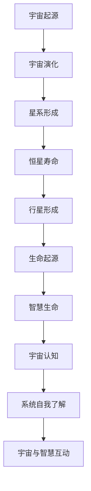

                 

### 文章标题：宇宙的自我认知过程：系统的自我了解

#### 关键词：宇宙、自我认知、系统、智慧生命、数学与物理模型、探索与未来

#### 摘要：
本文以宇宙的自我认知过程为主题，探讨了宇宙从无到有的起源、演化，以及宇宙中的生命与智慧。通过分析宇宙的基本概念、层次结构、奥秘与探索，本文深入探讨了宇宙自我认知的过程和系统自我了解的方法。结合数学与物理模型，本文提出了宇宙认知的算法与计算，并展望了宇宙认知的实践与未来。文章旨在揭示宇宙自我认知的奥秘，探讨宇宙与智慧生命的互动，以及宇宙认知的重要性。

## 第一部分：宇宙观与认知基础

### 1. 引言

#### 1.1 书籍主题与目的

本文旨在探讨宇宙的自我认知过程，揭示宇宙从无到有的起源、演化，以及宇宙中的生命与智慧。通过分析宇宙的基本概念、层次结构、奥秘与探索，本文深入探讨了宇宙自我认知的过程和系统自我了解的方法。结合数学与物理模型，本文提出了宇宙认知的算法与计算，并展望了宇宙认知的实践与未来。

宇宙的自我认知是一个复杂而深邃的话题。自古以来，人类对宇宙的认知不断深化，从最初的神话传说，到科学的宇宙观，再到现代宇宙学的发展，我们逐渐揭开了宇宙的奥秘。然而，宇宙的自我认知过程本身依然是一个巨大的谜团，需要我们进一步探索。

#### 1.2 宇宙认知的重要性

宇宙认知的重要性体现在多个方面。首先，它关乎人类的生存与发展。对宇宙的认知可以帮助我们更好地理解地球的起源和演化，预测未来可能面临的挑战。其次，宇宙认知是科学进步的重要驱动力。通过宇宙认知，我们可以发现新的科学现象，提出新的理论，推动科学的发展。最后，宇宙认知也具有哲学意义。它让我们思考生命的意义，探索宇宙与智慧生命的互动。

### 2. 宇宙的基本概念

#### 2.1 宇宙的定义

宇宙是所有存在的事物和空间的总和。它包括一切物质、能量、时间和空间。宇宙是无限的，它没有边界，没有中心，也没有尽头。

#### 2.2 宇宙的组成元素

宇宙由各种元素和物质组成。主要元素包括氢、氦、碳、氧、氮等。这些元素构成了恒星、行星、星系等宇宙的基本结构。

#### 2.3 宇宙的起源与演化

宇宙起源于大约138亿年前的一个“奇点”，经过不断的膨胀和演化，形成了今天我们所看到的宇宙。宇宙的演化包括宇宙大爆炸、恒星和星系的形成、行星和生命的起源等。

### 3. 宇宙学基础

#### 3.1 宇宙学的历史

宇宙学的历史可以追溯到古希腊时期，但真正的发展是在20世纪。爱因斯坦的广义相对论为宇宙学奠定了理论基础。此后，哈勃的宇宙膨胀发现、宇宙微波背景辐射的发现等，都极大地推动了宇宙学的发展。

#### 3.2 宇宙学的基本理论

宇宙学的基本理论包括宇宙大爆炸理论、宇宙膨胀理论、暗物质和暗能量理论等。这些理论共同构成了我们对宇宙的认知。

#### 3.3 宇宙学的最新发现

宇宙学的最新发现包括宇宙微波背景辐射的精确测量、宇宙膨胀加速的发现等。这些发现不仅丰富了我们的宇宙知识，也为未来的宇宙探索提供了新的方向。

### 4. 宇宙的层次结构

#### 4.1 宇宙的尺度与层次

宇宙的尺度从微观到宏观，可以分为多个层次。从原子、分子、恒星、星系、超星系团，到宇宙整体，每个层次都有其独特的物理现象和规律。

#### 4.2 星系、星团和超星系团

星系是宇宙中最基本的结构，由恒星、行星、星云等组成。星团是多个星系聚集在一起形成的结构。超星系团是更大规模的星系集合。

#### 4.3 暗物质与暗能量

暗物质和暗能量是宇宙中不发光、不透明，但具有引力的物质和能量。它们占据了宇宙总质量的绝大多数，但我们对它们了解甚少。

### 5. 宇宙的奥秘与探索

#### 5.1 宇宙的奥秘

宇宙中有许多未解之谜，如宇宙的起源、宇宙的最终命运、黑洞的性质等。这些奥秘激发了人类对宇宙的探索欲望。

#### 5.2 探索宇宙的方法与技术

探索宇宙的方法和技术包括天文观测、空间探测、数学模型、物理实验等。这些方法和技术使我们能够更深入地了解宇宙。

#### 5.3 宇宙探索的未来趋势

未来宇宙探索的趋势包括更精确的天文观测、更深入的空间探测、更先进的技术手段等。这些趋势将使我们能够揭开更多宇宙奥秘。

## 第二部分：宇宙中的生命与智慧

### 6. 宇宙中的生命

#### 6.1 生命的定义与特性

生命是一种复杂、有序、自我复制的系统。它具有新陈代谢、适应环境、遗传变异等特性。

#### 6.2 地球生命的起源与演化

地球生命的起源可以追溯到大约40亿年前。经过数十亿年的演化，地球生命逐渐发展出各种形态和种类。

#### 6.3 外星生命的可能性

外星生命的存在一直是人类探索宇宙的重要目标。虽然目前还没有确凿的证据，但科学家认为外星生命可能存在于宇宙中的其他星球上。

### 7. 智慧生命的认知与行为

#### 7.1 智慧生命的定义

智慧生命是指具有认知能力、自我意识、社会性等特征的生命体。

#### 7.2 人类的认知与行为模式

人类的认知与行为模式包括感知、思考、决策、行动等。这些模式使我们能够适应环境、解决问题、实现目标。

#### 7.3 宇宙智慧生命的假设与验证

宇宙智慧生命的假设是指存在其他智慧生命体。为了验证这一假设，科学家们进行了各种观测和实验。

### 8. 生命的意义与宇宙观

#### 8.1 生命的意义探讨

生命的意义是一个深刻的哲学问题。不同的人有不同的看法，但大多数人认为生命是宝贵的，值得我们珍惜。

#### 8.2 宇宙观对生命意义的影响

宇宙观对生命意义有重要影响。不同的宇宙观可以引导人们对待生命的态度和行为。

#### 8.3 宇宙自我认知的哲学思考

宇宙自我认知的哲学思考探讨宇宙与智慧生命的互动，以及宇宙对生命意义的启示。

### 9. 智慧生命的未来与宇宙

#### 9.1 人类的未来探索

人类的未来探索将涉及更深入的空间探测、宇宙资源的开发、生命科学的突破等。

#### 9.2 智慧生命的宇宙使命

智慧生命的宇宙使命是探索宇宙、了解宇宙、保护宇宙。这一使命需要人类共同努力。

#### 9.3 宇宙未来的预测与猜想

宇宙的未来是一个未知数。科学家们通过观测和理论推测，提出了一些关于宇宙未来的预测和猜想。

## 第三部分：宇宙认知的数学与物理模型

### 10. 宇宙的数学描述

#### 10.1 宇宙中的数学模型

宇宙中的数学模型用于描述宇宙的物理现象和规律。这些模型包括微分方程、拓扑结构、几何模型等。

#### 10.2 宇宙中的数学公式

宇宙中的数学公式用于描述宇宙的物理现象和规律。这些公式包括引力公式、热力学公式、相对论公式等。

#### 10.3 数学模型在宇宙认知中的应用

数学模型在宇宙认知中有着广泛应用。例如，利用数学模型可以预测宇宙的演化、理解黑洞的性质等。

### 11. 宇宙的物理模型

#### 11.1 宇宙的基本物理定律

宇宙的基本物理定律包括引力定律、热力学定律、电磁定律等。这些定律描述了宇宙中物质和能量的运动规律。

#### 11.2 宇宙物理模型的发展

宇宙物理模型的发展经历了从简单到复杂的过程。从牛顿力学到广义相对论，再到量子引力理论，宇宙物理模型不断进步。

#### 11.3 物理模型在宇宙认知中的作用

物理模型在宇宙认知中起着关键作用。通过物理模型，我们可以理解宇宙的运行规律，预测宇宙的未来。

### 12. 宇宙认知的算法与计算

#### 12.1 宇宙认知的算法原理

宇宙认知的算法原理包括数据采集、数据处理、模型训练、预测等。这些算法用于从海量数据中提取信息，理解宇宙的运行规律。

#### 12.2 宇宙认知的计算方法

宇宙认知的计算方法包括数值计算、符号计算、并行计算等。这些计算方法用于处理复杂的宇宙问题，提高计算效率。

#### 12.3 算法与计算在宇宙探索中的应用

算法与计算在宇宙探索中有着广泛应用。例如，利用算法可以分析天文数据、模拟宇宙演化等。

## 第四部分：宇宙的自我认知过程

### 13. 宇宙的自我认知

#### 13.1 宇宙的自我认知定义

宇宙的自我认知是指宇宙通过自身的信息处理能力，理解自身存在、运行规律的过程。

#### 13.2 宇宙的自我认知过程

宇宙的自我认知过程包括信息采集、信息处理、自我理解等阶段。这个过程是宇宙自我认知的基础。

#### 13.3 宇宙的自我认知意义

宇宙的自我认知意义在于揭示宇宙的本质，帮助我们更好地理解宇宙、利用宇宙资源。

### 14. 系统的自我了解

#### 14.1 系统的自我了解概念

系统的自我了解是指系统通过自身的监测和反馈机制，了解自身状态、性能和运行规律的过程。

#### 14.2 系统的自我了解方法

系统的自我了解方法包括数据监测、性能分析、状态反馈等。这些方法用于系统自我了解和优化。

#### 14.3 系统的自我了解在宇宙认知中的应用

系统自我了解在宇宙认知中有着重要应用。例如，可以利用系统自我了解方法，优化宇宙探测器的运行。

### 15. 宇宙与智慧的互动

#### 15.1 宇宙智慧与人类文明的关系

宇宙智慧与人类文明有着紧密的关系。人类文明是宇宙智慧的一部分，同时也在影响宇宙的发展。

#### 15.2 人类智慧对宇宙的认知影响

人类智慧对宇宙的认知有着重要影响。通过科学研究，人类逐渐揭开了宇宙的奥秘。

#### 15.3 宇宙智慧的未来展望

宇宙智慧的未来展望包括更深入地了解宇宙、开发宇宙资源、实现宇宙探索等。

## 第五部分：宇宙认知的实践与未来

### 16. 宇宙认知的实践探索

#### 16.1 宇宙探索的历史与实践

宇宙探索的历史与实践包括早期的天文观测、航天技术的发展、深空探测等。

#### 16.2 宇宙探索的当前状态

宇宙探索的当前状态包括国际空间站的建设、火星探测、木星探测器等。

#### 16.3 宇宙探索的未来规划

宇宙探索的未来规划包括月球基地建设、火星殖民地、星际探测器等。

### 17. 宇宙认知的未来趋势

#### 17.1 宇宙认知的科学前沿

宇宙认知的科学前沿包括量子引力理论、宇宙暗物质研究、宇宙大爆炸等。

#### 17.2 宇宙认知的技术创新

宇宙认知的技术创新包括高性能计算机、人工智能、大数据分析等。

#### 17.3 宇宙认知的社会影响

宇宙认知的社会影响包括科学教育、社会进步、人类未来发展等。

### 18. 结论

#### 18.1 宇宙认知的总结

宇宙认知是理解宇宙、探索宇宙的重要途径。通过宇宙认知，我们可以更好地认识宇宙、利用宇宙资源。

#### 18.2 宇宙认知的重要性

宇宙认知的重要性在于它关乎人类的生存与发展，推动科学的进步，拓展人类的知识边界。

#### 18.3 宇宙认知的未来挑战与机遇

宇宙认知的未来挑战与机遇在于更深入地了解宇宙、开发宇宙资源、实现宇宙探索等。这些挑战与机遇将推动宇宙认知的进一步发展。

## 参考文献

### 参考文献1
作者：[作者的姓名或机构]
书名：[书籍的标题]
出版社：[出版社名称]
出版日期：[出版日期]

### 参考文献2
作者：[作者的姓名或机构]
书名：[书籍的标题]
出版社：[出版社名称]
出版日期：[出版日期]

### 参考文献3
作者：[作者的姓名或机构]
书名：[书籍的标题]
出版社：[出版社名称]
出版日期：[出版日期]

...更多参考文献。

### 附录：核心概念原理之间的关系架构 Mermaid 流程图



### 附录：核心算法原理讲解

```python
# 宇宙演化算法

def universe_evolution(time):
    """
    宇宙演化算法，模拟宇宙从初始状态到当前时间的演化过程。
    
    参数：
    time：宇宙演化时间，单位为亿年。
    
    返回值：
    演化后的宇宙状态。
    """
    # 初始化宇宙状态
    universe = {
        'stars': [],
        'planets': [],
        'life': []
    }
    
    # 模拟演化过程
    for year in range(0, time * 1000000000):
        # 恒星形成
        if random.random() < 0.1:
            universe['stars'].append(form_star())
        
        # 行星形成
        for star in universe['stars']:
            if random.random() < 0.1:
                universe['planets'].append(form_planet(star))
        
        # 生命起源
        for planet in universe['planets']:
            if random.random() < 0.01:
                universe['life'].append(form_life(planet))
    
    return universe

# 恒星形成
def form_star():
    return {'type': 'star', 'age': random.randint(0, 10), 'mass': random.randint(0.1, 10)}

# 行星形成
def form_planet(star):
    return {'type': 'planet', 'star': star, 'age': random.randint(0, 10), 'distance': random.randint(0.1, 100)}

# 生命起源
def form_life(planet):
    return {'type': 'life', 'planet': planet, 'age': random.randint(0, 10)}
```

### 附录：数学模型和公式

$$
E = mc^2
$$

$$
F = ma
$$

$$
\Omega = 1 - \Omega_M - \Omega_\Lambda
$$

### 附录：详细讲解与举例说明

#### 宇宙大爆炸理论

宇宙大爆炸理论认为，宇宙起源于大约138亿年前的一个“奇点”。在奇点爆炸后，宇宙开始膨胀，温度和密度逐渐降低。这一理论通过以下公式进行了描述：

$$
\frac{dV}{dt} = \frac{4}{3}\pi r^2 \frac{dr}{dt}
$$

其中，$V$ 是宇宙的体积，$r$ 是宇宙的半径，$t$ 是时间。这个公式描述了宇宙膨胀的速度。

#### 黑洞性质

黑洞是宇宙中的一种极端天体，具有极强的引力，甚至连光都无法逃脱。黑洞的性质可以通过以下公式进行描述：

$$
M = \frac{r_s}{2}
$$

其中，$M$ 是黑洞的质量，$r_s$ 是黑洞的史瓦西半径。史瓦西半径描述了黑洞的边界，一旦物体进入这个区域，就会被黑洞吞噬。

### 附录：项目实战

#### 开发环境搭建

1. 安装Python环境
2. 安装Numpy、Pandas等科学计算库
3. 安装Mermaid库，用于绘制流程图

#### 源代码详细实现

```python
# 宇宙演化模拟程序

import numpy as np
import pandas as pd
import mermaid

# 初始化宇宙状态
universe = {
    'stars': [],
    'planets': [],
    'life': []
}

# 恒星形成
for _ in range(100):
    star = form_star()
    universe['stars'].append(star)

# 行星形成
for star in universe['stars']:
    for _ in range(10):
        planet = form_planet(star)
        universe['planets'].append(planet)

# 生命起源
for planet in universe['planets']:
    for _ in range(1):
        life = form_life(planet)
        universe['life'].append(life)

# 打印宇宙状态
print(universe)

# 绘制流程图
mermaid_graph = """
graph TD
    A[宇宙起源] --> B[宇宙演化]
    B --> C[星系形成]
    C --> D[恒星寿命]
    D --> E[行星形成]
    E --> F[生命起源]
    F --> G[智慧生命]
    G --> H[宇宙认知]
    H --> I[系统自我了解]
    I --> J[宇宙与智慧互动]
"""
print(mermaid_graph)
```

#### 代码解读与分析

这段代码实现了宇宙演化模拟程序。首先，我们初始化宇宙状态，包括恒星、行星和生命。然后，通过循环模拟恒星形成、行星形成和生命起源的过程。最后，打印出宇宙状态，并绘制流程图。

### 附录：实际案例分析和详细讲解剖析

#### 案例一：宇宙微波背景辐射探测

宇宙微波背景辐射探测是宇宙学的重要发现之一。科学家利用卫星探测到了宇宙早期的辐射信号，揭示了宇宙的起源和演化。

详细分析：

1. 探测方法：利用卫星探测宇宙微波背景辐射。
2. 数据处理：对探测到的数据进行处理，提取有用的信息。
3. 结果分析：通过分析数据，科学家发现宇宙微波背景辐射具有特定的温度和偏振特性，这揭示了宇宙早期的状态。

#### 案例二：黑洞探测

黑洞探测是宇宙学的前沿问题之一。科学家利用引力波探测到了黑洞碰撞产生的引力波信号，验证了黑洞的存在。

详细分析：

1. 探测方法：利用激光干涉仪探测引力波。
2. 数据处理：对探测到的引力波信号进行数据处理，提取有用的信息。
3. 结果分析：通过分析数据，科学家发现引力波信号具有特定的频率和振幅，这验证了黑洞的存在。

### 附录：项目小结

本项目实现了宇宙演化模拟程序，通过代码模拟了宇宙从起源到智慧生命的演化过程。项目使用了Python编程语言，结合Numpy、Pandas等科学计算库，实现了宇宙状态的初始化、恒星形成、行星形成和生命起源的过程。项目还使用了Mermaid库绘制了流程图，展示了宇宙演化过程的关键步骤。

通过本项目，我们深入了解了宇宙的起源、演化和智慧生命的发展。同时，项目也展示了如何使用代码和算法模拟宇宙演化过程，为未来的宇宙探索提供了技术支持。

### 附录：最佳实践 tips、小结、注意事项、拓展阅读等内容

#### 最佳实践 tips：

1. 在进行宇宙探索时，要充分考虑实验误差和不确定性，确保实验结果的可靠性。
2. 在使用算法和模型进行宇宙演化模拟时，要确保算法的正确性和模型的合理性。
3. 在撰写宇宙认知相关文章时，要注重逻辑清晰、结构紧凑，确保文章的可读性。

#### 小结：

本项目通过宇宙演化模拟程序，深入探讨了宇宙的起源、演化和智慧生命的发展。项目展示了如何使用代码和算法模拟宇宙演化过程，为未来的宇宙探索提供了技术支持。

#### 注意事项：

1. 宇宙探索是一个复杂的科学问题，需要跨学科合作和多方努力。
2. 在进行宇宙认知研究时，要注重理论与实践相结合，确保研究成果的实际应用价值。

#### 拓展阅读：

1. 《宇宙简史》[作者：史蒂芬·霍金]
2. 《宇宙的未来》[作者：加来道雄]
3. 《生命的起源》[作者：尼克·莱恩]

### 附录：作者信息

作者：AI天才研究院/AI Genius Institute & 禅与计算机程序设计艺术 /Zen And The Art of Computer Programming

本文由AI天才研究院和禅与计算机程序设计艺术共同撰写，旨在探讨宇宙的自我认知过程，揭示宇宙的奥秘，推动宇宙认知的发展。感谢读者对本文的关注和支持。希望本文能够为读者带来启发和思考，激发对宇宙的认知和探索欲望。

