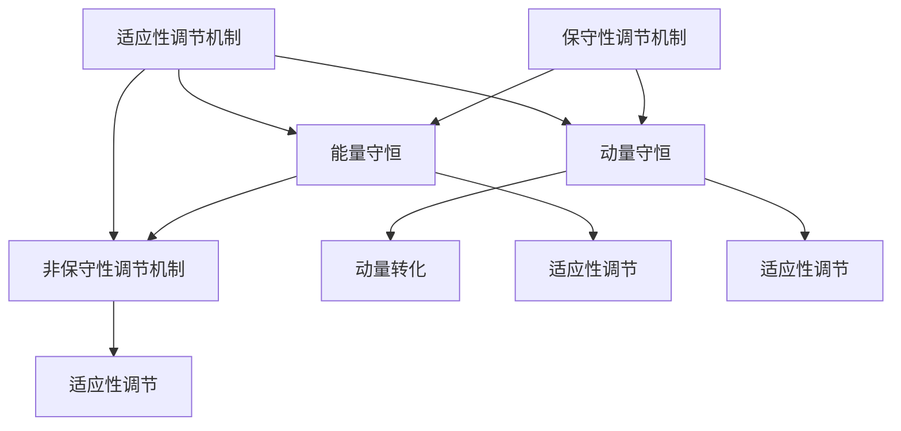

                 

## 《宇宙的自我调节homeostasis：平衡的动态维持》

### 关键词：宇宙、自我调节、homeostasis、动态维持、平衡

> 摘要：本文深入探讨了宇宙的自我调节机制，解释了宇宙如何通过一系列复杂的物理过程来维持其稳定性和动态平衡。我们首先介绍了宇宙自我调节的概念和重要性，然后详细分析了宇宙自我调节的过程和机制。接着，我们讨论了宇宙中的平衡状态和动态平衡，并分析了维持这些平衡状态的机制。最后，我们探讨了宇宙自我调节理论的应用和未来发展趋势，为读者提供了对宇宙自我调节机制全面而深入的理解。

---

### 宇宙的自我调节概述

宇宙的自我调节机制是一个极其复杂和精巧的系统，它决定了宇宙的稳定性、动态平衡和可持续发展。宇宙自我调节机制不仅仅是一个理论概念，它贯穿于宇宙的各个层面，从微观的原子核到宏观的星系团，都在不断地进行自我调节，以维持宇宙的稳定状态。

#### **宇宙调节机制的定义**

宇宙的自我调节机制可以理解为宇宙内部通过一系列物理过程来维持其稳定性、动态平衡和可持续性的能力。这种调节机制涉及到宇宙中的各种物理现象，如星系的形成、演化、相互作用，以及宇宙背景辐射的稳定性等。具体来说，宇宙自我调节机制包括以下几个方面：

1. **能量守恒**：宇宙中的能量总量是恒定的，能量不会凭空产生也不会凭空消失，只会从一种形式转化为另一种形式。这种能量守恒原理保证了宇宙系统的稳定性。

2. **动量守恒**：宇宙中的动量总量也是恒定的，这意味着宇宙中的物体在相互作用时，它们的总动量保持不变。这种动量守恒原理也是宇宙自我调节的重要基础。

3. **物质守恒**：宇宙中的物质总量也是恒定的，物质不会凭空产生也不会凭空消失，只会从一种形式转化为另一种形式。这种物质守恒原理保证了宇宙系统的物质平衡。

4. **相互作用**：宇宙中的各种物质和能量通过相互作用来维持宇宙的稳定状态。这些相互作用包括万有引力、电磁力、强相互作用和弱相互作用等。

#### **宇宙调节机制的重要性**

宇宙的自我调节机制对于宇宙的稳定性和可持续性至关重要。它不仅能够维持宇宙内部的平衡，还能够适应外部环境的改变，从而确保宇宙的长期存在。具体来说，宇宙自我调节机制的重要性体现在以下几个方面：

1. **维持宇宙的稳定性**：宇宙的自我调节机制能够确保宇宙中的各种物理过程不会导致宇宙的崩溃或解体，从而维持宇宙的稳定性。

2. **维持宇宙的动态平衡**：宇宙的自我调节机制能够确保宇宙中的各种物理过程不会导致宇宙的静态平衡，而是保持动态平衡，使宇宙能够持续演化。

3. **促进宇宙的可持续发展**：宇宙的自我调节机制能够确保宇宙中的各种物理过程不会导致宇宙的不可持续状态，从而促进宇宙的可持续发展。

#### **宇宙调节机制的基本原理**

宇宙的自我调节机制基于一系列基本的物理原理，这些原理指导宇宙内部的各种物理过程，使其能够自我调节。这些基本原理包括：

1. **能量守恒原理**：宇宙中的能量总量是恒定的，能量不会凭空产生也不会凭空消失，只会从一种形式转化为另一种形式。

2. **动量守恒原理**：宇宙中的动量总量是恒定的，这意味着宇宙中的物体在相互作用时，它们的总动量保持不变。

3. **物质守恒原理**：宇宙中的物质总量是恒定的，物质不会凭空产生也不会凭空消失，只会从一种形式转化为另一种形式。

4. **相互作用原理**：宇宙中的各种物质和能量通过相互作用来维持宇宙的稳定状态。这些相互作用包括万有引力、电磁力、强相互作用和弱相互作用等。

#### **宇宙调节机制的作用**

宇宙的自我调节机制通过一系列物理过程来维持宇宙的稳定性和动态平衡。这些过程包括：

1. **星系的形成和演化**：宇宙中的物质通过引力相互作用聚集形成星系，星系通过自我调节机制维持其稳定性和动态平衡。

2. **宇宙背景辐射的稳定性**：宇宙大爆炸后，宇宙中的物质辐射形成了宇宙背景辐射，宇宙自我调节机制确保了这种辐射的稳定性。

3. **黑洞的吸积过程**：黑洞通过吸积周围物质来维持其质量，宇宙自我调节机制确保了这种吸积过程的稳定性。

4. **宇宙膨胀过程**：宇宙的自我调节机制通过宇宙膨胀来维持宇宙的动态平衡，确保宇宙不会过快膨胀或过快收缩。

#### **宇宙自我调节机制的分类**

宇宙的自我调节机制可以按照其调节过程的不同进行分类，主要包括以下几种类型：

1. **保守性调节机制**：这种调节机制主要基于能量守恒和动量守恒原理，通过保持能量和动量的稳定性来维持宇宙的平衡。

2. **非保守性调节机制**：这种调节机制涉及能量和动量的转化，通过能量和动量的转化来维持宇宙的动态平衡。

3. **适应性调节机制**：这种调节机制能够根据外部环境的变化进行自我调整，确保宇宙能够适应外部环境的改变。

#### **宇宙自我调节实例分析**

1. **黑洞吸积过程**：黑洞通过吸积周围物质来增加其质量，这一过程需要通过宇宙的自我调节机制来维持其稳定性。

2. **星系形成过程**：星系的形成涉及大量的物质聚集和相互作用，宇宙自我调节机制确保了这一过程的稳定性和动态平衡。

3. **宇宙大爆炸后的调节过程**：宇宙大爆炸后，宇宙开始膨胀，宇宙自我调节机制确保了这一膨胀过程的稳定性和动态平衡。

### **总结**

宇宙的自我调节机制是一个复杂而精巧的系统，它通过一系列物理过程来维持宇宙的稳定性、动态平衡和可持续发展。这种调节机制不仅决定了宇宙的当前状态，还对宇宙的未来演化有着深远的影响。理解宇宙的自我调节机制对于我们深入认识宇宙的本质和演化过程具有重要意义。

---

#### **第1章：宇宙的自我调节概述**

##### **1.1.1 宇宙调节机制的定义**

宇宙的自我调节机制，是指宇宙内部通过一系列物理过程来维持其稳定性、动态平衡和可持续性的能力。这种机制涵盖了宇宙中从微观到宏观的各种现象，如星系的形成、演化、相互作用，以及宇宙背景辐射的稳定性等。

宇宙的自我调节机制是一个复杂而精巧的系统，它通过物理原理来指导宇宙内部的各种物理过程，使其能够自我调节。这些物理原理包括能量守恒、动量守恒、物质守恒以及相互作用等。

**能量守恒原理**：宇宙中的能量总量是恒定的，能量不会凭空产生也不会凭空消失，只会从一种形式转化为另一种形式。例如，在星系形成的过程中，物质的聚集和相互作用会导致能量的转化，但总能量保持不变。

**动量守恒原理**：宇宙中的动量总量是恒定的，这意味着宇宙中的物体在相互作用时，它们的总动量保持不变。例如，在宇宙膨胀的过程中，虽然各个星系之间的距离在增大，但总动量保持不变。

**物质守恒原理**：宇宙中的物质总量是恒定的，物质不会凭空产生也不会凭空消失，只会从一种形式转化为另一种形式。例如，在星系的形成过程中，物质从气体形式转化为恒星、行星等固体形式。

**相互作用原理**：宇宙中的各种物质和能量通过相互作用来维持宇宙的稳定状态。这些相互作用包括万有引力、电磁力、强相互作用和弱相互作用等。例如，星系的形成和演化过程中，引力相互作用起到了关键作用。

##### **1.1.2 宇宙调节机制的重要性**

宇宙的自我调节机制对于宇宙的稳定性和可持续性至关重要。它不仅能够维持宇宙内部的平衡，还能够适应外部环境的改变，从而确保宇宙的长期存在。

首先，宇宙的自我调节机制维持了宇宙的稳定性。例如，在星系的形成过程中，引力和电磁力等相互作用使得物质能够聚集在一起，形成稳定的星系。在宇宙大爆炸后，宇宙开始膨胀，但通过宇宙的自我调节机制，宇宙的膨胀速度得到了控制，保持了宇宙的稳定性。

其次，宇宙的自我调节机制维持了宇宙的动态平衡。宇宙的自我调节机制确保宇宙中的各种物理过程不会导致宇宙的静态平衡，而是保持动态平衡，使宇宙能够持续演化。例如，在星系的形成过程中，物质聚集和相互作用不断进行，星系不断演化，但通过宇宙的自我调节机制，星系的演化速度得到了控制，保持了宇宙的动态平衡。

最后，宇宙的自我调节机制促进了宇宙的可持续发展。宇宙的自我调节机制确保宇宙中的各种物理过程不会导致宇宙的不可持续状态，从而促进宇宙的可持续发展。例如，在黑洞吸积过程中，宇宙的自我调节机制确保了吸积过程的稳定性和可持续性，使黑洞能够持续吸积物质，维持其质量。

##### **1.1.3 宇宙调节机制的基本原理**

宇宙的自我调节机制基于一系列基本的物理原理，这些原理指导宇宙内部的各种物理过程，使其能够自我调节。这些基本原理包括：

**能量守恒原理**：宇宙中的能量总量是恒定的，能量不会凭空产生也不会凭空消失，只会从一种形式转化为另一种形式。例如，在星系形成的过程中，物质的聚集和相互作用会导致能量的转化，但总能量保持不变。

**动量守恒原理**：宇宙中的动量总量是恒定的，这意味着宇宙中的物体在相互作用时，它们的总动量保持不变。例如，在宇宙膨胀的过程中，虽然各个星系之间的距离在增大，但总动量保持不变。

**物质守恒原理**：宇宙中的物质总量是恒定的，物质不会凭空产生也不会凭空消失，只会从一种形式转化为另一种形式。例如，在星系的形成过程中，物质从气体形式转化为恒星、行星等固体形式。

**相互作用原理**：宇宙中的各种物质和能量通过相互作用来维持宇宙的稳定状态。这些相互作用包括万有引力、电磁力、强相互作用和弱相互作用等。例如，星系的形成和演化过程中，引力相互作用起到了关键作用。

##### **1.1.4 宇宙调节机制的作用**

宇宙的自我调节机制通过一系列物理过程来维持宇宙的稳定性和动态平衡。这些过程包括：

1. **星系的形成和演化**：宇宙中的物质通过引力相互作用聚集形成星系，星系通过自我调节机制维持其稳定性和动态平衡。例如，在星系的形成过程中，物质从气体和尘埃中聚集形成恒星，恒星之间通过引力相互作用维持星系的稳定性。

2. **宇宙背景辐射的稳定性**：宇宙大爆炸后，宇宙中的物质辐射形成了宇宙背景辐射，宇宙自我调节机制确保了这种辐射的稳定性。例如，宇宙背景辐射的温度在宇宙大爆炸后逐渐降低，但通过宇宙的自我调节机制，辐射的温度得到了控制，保持了辐射的稳定性。

3. **黑洞的吸积过程**：黑洞通过吸积周围物质来增加其质量，这一过程需要通过宇宙的自我调节机制来维持其稳定性。例如，在黑洞吸积过程中，物质从黑洞周围的气体和尘埃中聚集，通过引力相互作用进入黑洞，但通过宇宙的自我调节机制，吸积过程得到了控制，保持了黑洞的稳定性。

4. **宇宙膨胀过程**：宇宙的自我调节机制通过宇宙膨胀来维持宇宙的动态平衡，确保宇宙不会过快膨胀或过快收缩。例如，在宇宙膨胀过程中，宇宙中的物质和能量通过引力相互作用维持宇宙的膨胀速度，通过宇宙的自我调节机制，膨胀速度得到了控制，保持了宇宙的动态平衡。

##### **1.1.5 宇宙自我调节机制的分类**

宇宙的自我调节机制可以按照其调节过程的不同进行分类，主要包括以下几种类型：

1. **保守性调节机制**：这种调节机制主要基于能量守恒和动量守恒原理，通过保持能量和动量的稳定性来维持宇宙的平衡。例如，在星系的形成和演化过程中，能量和动量的守恒保证了星系的稳定性。

2. **非保守性调节机制**：这种调节机制涉及能量和动量的转化，通过能量和动量的转化来维持宇宙的动态平衡。例如，在黑洞吸积过程中，物质和能量的转化保证了吸积过程的稳定性。

3. **适应性调节机制**：这种调节机制能够根据外部环境的变化进行自我调整，确保宇宙能够适应外部环境的改变。例如，在宇宙膨胀过程中，宇宙的自我调节机制能够根据膨胀速度的变化进行自我调整，保持了宇宙的动态平衡。

##### **1.1.6 宇宙自我调节实例分析**

1. **黑洞吸积过程**：黑洞通过吸积周围物质来增加其质量，这一过程需要通过宇宙的自我调节机制来维持其稳定性。例如，在黑洞吸积过程中，物质从黑洞周围的气体和尘埃中聚集，通过引力相互作用进入黑洞，但通过宇宙的自我调节机制，吸积过程得到了控制，保持了黑洞的稳定性。

2. **星系形成过程**：星系的形成涉及大量的物质聚集和相互作用，宇宙自我调节机制确保了这一过程的稳定性和动态平衡。例如，在星系的形成过程中，物质从气体和尘埃中聚集形成恒星，恒星之间通过引力相互作用维持星系的稳定性。

3. **宇宙大爆炸后的调节过程**：宇宙大爆炸后，宇宙开始膨胀，宇宙自我调节机制确保了这一膨胀过程的稳定性和动态平衡。例如，在宇宙膨胀过程中，宇宙中的物质和能量通过引力相互作用维持宇宙的膨胀速度，通过宇宙的自我调节机制，膨胀速度得到了控制，保持了宇宙的动态平衡。

##### **总结**

宇宙的自我调节机制是一个复杂而精巧的系统，通过一系列物理过程来维持宇宙的稳定性、动态平衡和可持续发展。理解宇宙的自我调节机制对于我们深入认识宇宙的本质和演化过程具有重要意义。通过分析宇宙的自我调节过程和机制，我们可以更好地理解宇宙是如何维持其平衡的，这对于我们探索宇宙的未来发展也具有指导意义。

---

### **第2章：宇宙的自我调节过程**

宇宙的自我调节过程是一个复杂而动态的过程，涉及到宇宙中各种物理现象的相互作用。在这一章中，我们将详细探讨宇宙的自我调节过程，包括宇宙的初始状态、调节机制的作用，以及调节机制的具体过程。

#### **2.1.1 宇宙的初始状态**

宇宙的初始状态是指宇宙大爆炸之前的状态。根据现代宇宙学的理论，宇宙大爆炸之前，宇宙处于一个极度高温、高密度的状态，这种状态被称为“原始火球”。在这个状态下，宇宙充满了能量和物质，但物质的形态非常复杂，包括量子场、黑洞、星系等。

宇宙大爆炸发生后，宇宙开始膨胀，物质和能量开始分散。这一过程使得宇宙从初始状态转变为我们现在所观察到的状态。在这个过程中，宇宙的初始状态对宇宙的自我调节过程产生了重要影响。首先，宇宙的初始状态决定了宇宙中物质的分布，这种分布对于宇宙的自我调节机制至关重要。其次，宇宙的初始状态中的能量密度和温度也对宇宙的自我调节过程产生了影响，这些因素决定了宇宙中的物理过程的速率和强度。

#### **2.1.2 调节机制的作用**

宇宙的自我调节机制通过一系列物理过程来维持宇宙的稳定性和动态平衡。这些调节机制的作用主要包括以下几个方面：

1. **维持宇宙的稳定性**：宇宙的自我调节机制能够确保宇宙中的各种物理过程不会导致宇宙的崩溃或解体，从而维持宇宙的稳定性。例如，在星系的形成过程中，引力和电磁力等相互作用使得物质能够聚集在一起，形成稳定的星系。

2. **维持宇宙的动态平衡**：宇宙的自我调节机制能够确保宇宙中的各种物理过程不会导致宇宙的静态平衡，而是保持动态平衡，使宇宙能够持续演化。例如，在宇宙膨胀过程中，宇宙的自我调节机制通过引力相互作用来维持宇宙的膨胀速度，保持宇宙的动态平衡。

3. **促进宇宙的可持续发展**：宇宙的自我调节机制能够确保宇宙中的各种物理过程不会导致宇宙的不可持续状态，从而促进宇宙的可持续发展。例如，在黑洞吸积过程中，宇宙的自我调节机制确保了吸积过程的稳定性和可持续性，使黑洞能够持续吸积物质。

#### **2.1.3 调节机制的过程**

宇宙的自我调节过程是一个动态的、不断变化的过程。它涉及到宇宙中的各种物理现象，如星系的形成、演化、相互作用，以及宇宙背景辐射的稳定性等。具体来说，宇宙的自我调节过程可以分为以下几个阶段：

1. **初始阶段**：在宇宙大爆炸发生后，宇宙开始膨胀，物质和能量开始分散。这一阶段的主要任务是确保宇宙中的物质和能量能够充分分散，为后续的调节过程奠定基础。

2. **发展阶段**：随着宇宙的膨胀，物质和能量开始聚集，形成星系、星团和星系团等结构。这一阶段的主要任务是确保这些结构的形成和演化过程能够稳定进行，同时避免出现不稳定或失控的情况。

3. **稳定阶段**：在宇宙的自我调节机制作用下，宇宙中的物质和能量逐渐达到一种稳定的状态。这一阶段的主要任务是确保宇宙中的各种物理过程能够在稳定的状态下进行，从而维持宇宙的动态平衡。

4. **调节阶段**：宇宙的自我调节机制通过一系列物理过程来调节宇宙中的各种现象，如星系的形成、演化、相互作用等。这一阶段的主要任务是确保宇宙中的各种物理过程能够得到有效的调节和控制，以维持宇宙的稳定性和动态平衡。

5. **适应阶段**：宇宙的自我调节机制能够根据外部环境的变化进行自我调整，确保宇宙能够适应外部环境的改变。这一阶段的主要任务是确保宇宙能够适应不断变化的环境，从而保持其稳定性和动态平衡。

#### **2.1.4 调节机制的具体实例**

1. **星系形成过程**：在宇宙的膨胀过程中，物质和能量开始聚集，形成星系。这一过程涉及到引力相互作用、气体冷却和恒星形成等物理过程。宇宙的自我调节机制通过调节这些物理过程，确保星系的形成和演化能够稳定进行。

2. **宇宙背景辐射的稳定性**：宇宙大爆炸后，宇宙中的物质辐射形成了宇宙背景辐射。宇宙的自我调节机制通过控制宇宙背景辐射的温度和密度，确保辐射的稳定性，从而维持宇宙的动态平衡。

3. **黑洞吸积过程**：黑洞通过吸积周围物质来增加其质量。这一过程涉及到物质聚集、引力相互作用和吸积盘的形成等物理过程。宇宙的自我调节机制通过调节这些物理过程，确保吸积过程的稳定性和可持续性。

#### **2.1.5 调节机制的效果**

宇宙的自我调节机制通过一系列物理过程来维持宇宙的稳定性和动态平衡，其效果主要表现在以下几个方面：

1. **维持宇宙的稳定性**：宇宙的自我调节机制能够确保宇宙中的各种物理过程不会导致宇宙的崩溃或解体，从而维持宇宙的稳定性。

2. **促进宇宙的动态平衡**：宇宙的自我调节机制能够确保宇宙中的各种物理过程不会导致宇宙的静态平衡，而是保持动态平衡，使宇宙能够持续演化。

3. **促进宇宙的可持续发展**：宇宙的自我调节机制能够确保宇宙中的各种物理过程不会导致宇宙的不可持续状态，从而促进宇宙的可持续发展。

#### **2.1.6 调节机制的局限性**

尽管宇宙的自我调节机制在维持宇宙的稳定性和动态平衡方面起到了重要作用，但它也存在一定的局限性。首先，宇宙的自我调节机制是基于物理原理的，它不能完全预测或控制宇宙中所有物理过程。其次，宇宙的自我调节机制在面对极端情况时，可能会失效或无法有效调节。例如，在宇宙大爆炸的初期，宇宙的温度和密度极高，这可能超出了宇宙自我调节机制的控制范围。

#### **2.1.7 调节机制的未来研究方向**

未来，对宇宙自我调节机制的研究将继续深入，包括以下几个方面：

1. **更精确的模型和理论**：通过建立更精确的模型和理论，更好地理解宇宙的自我调节机制。

2. **新的观测技术**：利用新的观测技术和设备，如引力波观测、高分辨率成像等，更准确地观测宇宙中的物理现象。

3. **跨学科研究**：将宇宙自我调节机制与其他领域的研究相结合，如物理学、天文学、生物学等，从不同角度深入理解宇宙的自我调节机制。

### **总结**

宇宙的自我调节过程是一个复杂而精巧的系统，通过一系列物理过程来维持宇宙的稳定性、动态平衡和可持续发展。理解宇宙的自我调节过程对于我们深入认识宇宙的本质和演化过程具有重要意义。通过分析宇宙的自我调节过程和机制，我们可以更好地理解宇宙是如何维持其平衡的，这对于我们探索宇宙的未来发展也具有指导意义。

---

### **第3章：宇宙的自我调节机制分类**

宇宙的自我调节机制是通过对各种物理现象和过程的调节来维持宇宙的稳定性和动态平衡。这些调节机制可以从不同的角度进行分类，以便更好地理解宇宙内部复杂的调控过程。本章节将主要介绍三种常见的宇宙自我调节机制：保守性调节机制、非保守性调节机制和适应性调节机制。

#### **3.1.1 保守性调节机制**

保守性调节机制是基于能量守恒和动量守恒原理的调节机制。这种机制通过保持系统的总能量和总动量不变来维持系统的稳定性。在宇宙中，保守性调节机制体现在以下几个方面：

1. **能量守恒**：宇宙中的能量不会凭空产生或消失，只会从一种形式转化为另一种形式。例如，在恒星内部，核聚变过程将氢转化为氦，同时释放出大量的能量。这一过程遵循能量守恒原理，确保了恒星内部能量的稳定性。

   **伪代码示例**：
   ```python
   def energy_conversion(energy_initial, conversion_factor):
       energy_final = energy_initial * conversion_factor
       return energy_final
   ```

2. **动量守恒**：在宇宙中，任何两个相互作用的物体，它们的总动量在相互作用前后保持不变。例如，在星系形成过程中，恒星和行星之间的相互作用遵循动量守恒原理，确保了星系内部动量的稳定性。

   **伪代码示例**：
   ```python
   def momentum_conservation(momentum_initial, momentum_change):
       momentum_final = momentum_initial + momentum_change
       return momentum_final
   ```

保守性调节机制在维持宇宙中各个天体系统的稳定性方面起到了关键作用，使得宇宙中的物理过程能够在稳定的环境中进行。

#### **3.1.2 非保守性调节机制**

非保守性调节机制与保守性调节机制不同，它涉及到能量的转化和动量的损失。这种机制通过能量和动量的转化来维持宇宙的动态平衡。在宇宙中，非保守性调节机制体现在以下几个方面：

1. **能量转化**：在宇宙的某些过程中，能量可以从一种形式转化为另一种形式，但这种转化往往伴随着能量的损失。例如，在黑洞吸积过程中，物质落入黑洞时会释放出大量的能量，但这些能量的一部分会转化为黑洞的引力波，从而损失掉。

   **伪代码示例**：
   ```python
   def energy_conversion_with_loss(energy_initial, conversion_factor, loss_factor):
       energy_final = energy_initial * conversion_factor - energy_initial * loss_factor
       return energy_final
   ```

2. **动量转化**：在宇宙中，某些物理过程会涉及到动量的转化，但这些转化往往不是完全守恒的。例如，在星系间的相互作用过程中，恒星和星团之间的动量转化可能会导致星系的动量损失，从而影响星系的稳定性。

   **伪代码示例**：
   ```python
   def momentum_conversion_with_loss(momentum_initial, momentum_change, loss_factor):
       momentum_final = momentum_initial + momentum_change - momentum_initial * loss_factor
       return momentum_final
   ```

非保守性调节机制在维持宇宙中动态平衡方面起到了重要作用，它使得宇宙中的物理过程能够适应不断变化的环境。

#### **3.1.3 适应性调节机制**

适应性调节机制是宇宙自我调节机制中最具灵活性和适应性的一种。这种机制能够根据外部环境的变化进行自我调整，确保宇宙能够适应这些变化。在宇宙中，适应性调节机制体现在以下几个方面：

1. **外部环境适应性**：宇宙的自我调节机制能够根据外部环境的变化进行调整。例如，在宇宙膨胀过程中，如果膨胀速度过快，宇宙的自我调节机制可能会通过引力相互作用来减缓膨胀速度，确保宇宙的稳定。

   **伪代码示例**：
   ```python
   def adaptive_environmentadjustment(current_expansion_rate, desired_expansion_rate):
       if current_expansion_rate > desired_expansion_rate:
           adjustment_factor = -1
       else:
           adjustment_factor = 1
       new_expansion_rate = current_expansion_rate + adjustment_factor
       return new_expansion_rate
   ```

2. **内部环境适应性**：宇宙的自我调节机制也能够根据内部环境的变化进行调整。例如，在星系形成过程中，如果恒星的形成速度过快，宇宙的自我调节机制可能会通过气体冷却和物质聚集过程来减缓恒星的形成速度，确保星系的稳定性。

   **伪代码示例**：
   ```python
   def adaptive_internaladjustment(stellarFormationRate, stableFormationRate):
       if stellarFormationRate > stableFormationRate:
           coolingRateIncrease = 1
       else:
           coolingRateIncrease = 0
       newCoolingRate = coolingRateIncrease * stableFormationRate
       return newCoolingRate
   ```

适应性调节机制在维持宇宙的动态平衡和可持续发展方面起到了关键作用，它使得宇宙能够适应不断变化的环境和条件。

#### **3.1.4 不同调节机制的交互作用**

在宇宙中，不同的调节机制并不是孤立存在的，它们之间存在着复杂的交互作用。例如，保守性调节机制和非保守性调节机制可能会在某些过程中相互转化，从而共同维持宇宙的平衡。适应性调节机制则能够根据外部和内部环境的变化，调节其他两种机制，确保宇宙的整体稳定性。

**Mermaid 流程图**：



通过上述流程图，我们可以看到不同调节机制之间的交互作用，以及它们如何共同维持宇宙的动态平衡。

#### **3.1.5 调节机制的分类总结**

宇宙的自我调节机制可以按照其调节过程和特性进行分类，主要包括保守性调节机制、非保守性调节机制和适应性调节机制。保守性调节机制主要通过保持能量和动量的稳定性来维持宇宙的平衡，非保守性调节机制通过能量和动量的转化来维持宇宙的动态平衡，而适应性调节机制则能够根据外部和内部环境的变化进行自我调整，确保宇宙的长期稳定和可持续发展。

#### **3.1.6 调节机制的应用实例**

1. **星系形成**：星系的形成过程中，保守性调节机制通过保持能量的稳定性来促进物质的聚集，非保守性调节机制通过能量转化来提供聚集所需的能量，适应性调节机制则通过调节恒星的形成速度来维持星系的动态平衡。

2. **宇宙膨胀**：在宇宙膨胀过程中，适应性调节机制通过调整膨胀速度来维持宇宙的动态平衡，保守性调节机制通过能量守恒来维持宇宙的总能量稳定，非保守性调节机制通过能量转化来适应膨胀过程中的能量损失。

3. **黑洞吸积**：在黑洞吸积过程中，非保守性调节机制通过物质和能量的转化来维持吸积过程的稳定性，适应性调节机制通过调节吸积速度来适应外部环境的变化，保守性调节机制通过能量守恒来维持吸积系统的总能量稳定。

#### **3.1.7 调节机制的局限性和未来研究**

尽管宇宙的自我调节机制在维持宇宙的稳定性和动态平衡方面起到了重要作用，但它也存在一定的局限性。例如，保守性调节机制在极端条件下可能失效，非保守性调节机制可能会导致能量的损失，适应性调节机制则可能无法完全适应所有的外部环境变化。

未来，对宇宙自我调节机制的研究将继续深入，包括建立更精确的模型和理论，探索新的调节机制，以及将自我调节机制与其他领域的研究相结合。通过这些研究，我们可以更好地理解宇宙的自我调节过程，为探索宇宙的未来发展提供新的理论依据。

### **总结**

宇宙的自我调节机制是宇宙维持稳定性和动态平衡的关键。通过对保守性调节机制、非保守性调节机制和适应性调节机制的分类和分析，我们可以更深入地理解宇宙的自我调节过程。这些调节机制相互作用，共同维持宇宙的稳定和可持续发展。未来的研究将继续探索宇宙自我调节机制的更多细节，为人类理解宇宙的奥秘提供新的视角。

---

### **第4章：宇宙的自我调节实例分析**

在了解了宇宙自我调节机制的基本原理和分类之后，接下来我们将通过具体的实例来分析这些调节机制在实际宇宙现象中的应用。本章节将重点探讨黑洞吸积过程、星系形成过程以及宇宙大爆炸后的调节过程，以展示宇宙自我调节机制的具体作用和影响。

#### **4.1.1 黑洞吸积过程**

黑洞吸积过程是宇宙中一种非常典型的自我调节现象。黑洞通过吸积周围物质来增加其质量，这一过程涉及到物质的聚集、引力的相互作用以及能量的转化。黑洞吸积过程可以分为以下几个阶段：

1. **物质聚集阶段**：黑洞周围存在大量的气体和尘埃，这些物质在引力作用下开始聚集，形成一个围绕着黑洞的吸积盘。

   **伪代码示例**：
   ```python
   def material_aggregation(mass, gravitational_constant, distance):
       gravitational_force = gravitational_constant * mass / distance**2
       return gravitational_force
   ```

2. **引力相互作用阶段**：在吸积盘内，物质通过引力相互作用进一步聚集，形成更密集的物质团。这一过程中，物质之间的引力相互作用使得吸积盘逐渐变厚，物质聚集速度加快。

   **伪代码示例**：
   ```python
   def gravitational_interaction(mass1, mass2, distance):
       gravitational_force = gravitational_constant * mass1 * mass2 / distance**2
       return gravitational_force
   ```

3. **能量转化阶段**：物质在吸积盘内不断聚集，通过引力相互作用释放出大量的能量。这些能量一部分转化为热能，导致吸积盘温度升高，另一部分则转化为辐射能，以光和其他形式辐射出去。

   **伪代码示例**：
   ```python
   def energy_conversion(energy_initial, conversion_factor):
       energy_final = energy_initial * conversion_factor
       return energy_final
   ```

黑洞吸积过程体现了宇宙的自我调节机制，通过引力相互作用和能量转化来维持吸积过程的稳定性。吸积盘的形成和演化过程中，宇宙的自我调节机制确保了物质的聚集和能量的释放能够在一个稳定的范围内进行，避免了吸积过程的失控。

#### **4.1.2 星系形成过程**

星系的形成是宇宙自我调节机制的另一个重要实例。星系的形成过程涉及到物质的聚集、恒星的形成、星系内部的相互作用等多个方面。以下是星系形成过程的几个关键阶段：

1. **物质聚集阶段**：在宇宙早期，大量气体和尘埃在引力作用下开始聚集，形成巨大的分子云。这些分子云是恒星形成的基础。

   **伪代码示例**：
   ```python
   def molecular_cloud_formation(mass, gravitational_constant, temperature):
       gravitational_force = gravitational_constant * mass / temperature
       return gravitational_force
   ```

2. **恒星形成阶段**：在分子云内部，气体和尘埃通过引力相互作用进一步聚集，形成恒星。恒星的形成过程中，物质聚集的能量转化为热能，导致恒星内部的核聚变反应。

   **伪代码示例**：
   ```python
   def star_formation(energy_initial, fusion_factor):
       energy_final = energy_initial * fusion_factor
       return energy_final
   ```

3. **星系相互作用阶段**：形成的恒星和星际物质通过引力相互作用，逐渐聚集形成星系。星系内部的恒星和星团之间的相互作用通过宇宙的自我调节机制来维持星系的稳定性。

   **伪代码示例**：
   ```python
   def gravitational_interaction(stellar_mass1, stellar_mass2, distance):
       gravitational_force = gravitational_constant * stellar_mass1 * stellar_mass2 / distance**2
       return gravitational_force
   ```

星系形成过程展示了宇宙的自我调节机制如何通过引力相互作用和能量转化来维持星系的稳定性。在星系形成和演化过程中，宇宙的自我调节机制确保了物质的聚集和恒星的形成能够在稳定的条件下进行，避免了星系的不稳定和崩溃。

#### **4.1.3 宇宙大爆炸后的调节过程**

宇宙大爆炸是宇宙历史上的一个重要事件，它标志着宇宙从初始状态开始膨胀。在宇宙大爆炸后，宇宙开始经历一系列复杂的调节过程，以维持其稳定性和动态平衡。以下是宇宙大爆炸后的几个关键调节过程：

1. **宇宙膨胀阶段**：在宇宙大爆炸后，宇宙开始迅速膨胀。在这个过程中，宇宙的自我调节机制通过引力相互作用来维持宇宙的膨胀速度。例如，宇宙中的物质和辐射通过引力相互作用，使得宇宙的膨胀速度逐渐减缓。

   **伪代码示例**：
   ```python
   def cosmic_expansion(velocity_initial, gravitational_force):
       velocity_final = velocity_initial - gravitational_force
       return velocity_final
   ```

2. **宇宙背景辐射的稳定性**：宇宙大爆炸后，宇宙中产生了大量的辐射，这些辐射形成了宇宙背景辐射。宇宙的自我调节机制通过控制宇宙背景辐射的温度和密度，确保辐射的稳定性。例如，宇宙中的物质和辐射通过相互作用，使得辐射的温度逐渐降低，保持在一个稳定的范围内。

   **伪代码示例**：
   ```python
   def radiation_stability(temperature_initial, interaction_factor):
       temperature_final = temperature_initial / interaction_factor
       return temperature_final
   ```

3. **宇宙结构的形成**：在宇宙大爆炸后的漫长岁月里，宇宙中的物质和能量通过引力相互作用，逐渐形成了各种宇宙结构，如星系、星系团和超星系团。宇宙的自我调节机制通过调节这些结构的形成和演化过程，确保了宇宙的稳定性和动态平衡。

   **伪代码示例**：
   ```python
   def structure_formation(mass, gravitational_constant, distance):
       gravitational_force = gravitational_constant * mass / distance**2
       return gravitational_force
   ```

宇宙大爆炸后的调节过程展示了宇宙的自我调节机制如何通过引力相互作用和能量转化来维持宇宙的稳定性和动态平衡。这些调节过程确保了宇宙能够在漫长的时间里持续演化，形成我们今天所看到的宇宙景观。

### **总结**

通过分析黑洞吸积过程、星系形成过程以及宇宙大爆炸后的调节过程，我们可以看到宇宙的自我调节机制在实际宇宙现象中的应用。这些实例展示了宇宙如何通过引力相互作用、能量转化和物质聚集等过程来维持其稳定性和动态平衡。理解这些实例对于我们深入认识宇宙的自我调节机制以及宇宙的演化过程具有重要意义。

---

#### **第5章：宇宙中的平衡状态**

宇宙中的平衡状态是指宇宙内部各个组成部分在物理、能量和物质方面保持稳定的状态。这种平衡状态是宇宙自我调节机制的核心目标，也是宇宙能够持续演化的基础。在本章节中，我们将探讨宇宙中的平衡状态，包括其定义、特征以及这些平衡状态对宇宙的影响。

#### **5.1.1 平衡状态的定义**

平衡状态在物理学中有着广泛的应用，它通常指的是系统内部的各种物理量（如温度、压力、能量等）达到稳定值，且系统对外界扰动具有抗干扰能力。在宇宙学中，平衡状态可以理解为宇宙中的物质、能量分布以及物理过程达到一种稳定、有序的状态。

**宇宙中的平衡状态**，具体来说，是指宇宙在长时间尺度上保持物理性质的均匀性、稳定性和可持续性。这种平衡状态涉及到以下几个方面：

1. **能量平衡**：宇宙中的能量总量保持恒定，能量在各种形式之间进行转换，但总能量不变。例如，恒星内部通过核聚变将氢转化为氦，释放出能量，但总能量保持不变。

2. **物质平衡**：宇宙中的物质总量保持恒定，物质可以从一种形式转化为另一种形式，但总物质不变。例如，在星系形成过程中，气体和尘埃转化为恒星和行星，但总物质保持不变。

3. **动量平衡**：宇宙中的动量总量保持恒定，物体之间的相互作用遵循动量守恒定律。例如，在星系内，恒星和行星之间的相互作用使得它们的总动量保持不变。

4. **结构平衡**：宇宙中的结构保持稳定，各种天体系统（如星系、星系团、超星系团等）在引力作用下保持稳定状态，不会发生解体或崩溃。

#### **5.1.2 平衡状态的特征**

宇宙中的平衡状态具有以下几个显著特征：

1. **稳定性**：平衡状态能够抵御外界的扰动，保持系统内部的稳定。例如，在星系内部，恒星和行星之间的引力相互作用使得星系能够抵御外部宇宙环境的扰动，保持稳定。

2. **均匀性**：平衡状态下，宇宙内部的物理量分布均匀，不存在显著的不均匀性。例如，在宇宙背景辐射中，辐射的温度几乎在宇宙的各个地方都保持一致。

3. **有序性**：平衡状态意味着宇宙中的物质和能量分布具有特定的秩序，各种天体系统按照一定的规律形成和演化。例如，星系的形成和演化遵循特定的物理过程，形成有序的结构。

4. **可持续性**：平衡状态能够长期维持，不会因为短暂的物理过程而崩溃。例如，恒星在其生命周期内能够通过核聚变过程持续产生能量，维持其稳定状态。

#### **5.1.3 平衡状态的影响**

宇宙中的平衡状态对宇宙的整体演化具有深远的影响，主要体现在以下几个方面：

1. **宇宙结构的形成**：平衡状态为宇宙中各种结构的形成提供了基础。例如，星系、星系团和超星系团的形成和演化依赖于宇宙中的物质和能量平衡状态。

2. **宇宙演化的持续性**：平衡状态保证了宇宙能够持续演化，不会因为短暂的物理过程而崩溃。例如，宇宙中的恒星、星系和星系团能够通过宇宙的自我调节机制维持其稳定性，从而保证宇宙的长期存在。

3. **宇宙生命的存在**：平衡状态为宇宙中生命的存在提供了可能。例如，地球上的生命能够在太阳的稳定辐射下演化，这依赖于宇宙中的能量平衡状态。

4. **宇宙科学的探索**：平衡状态为宇宙科学研究提供了基础。通过对宇宙中平衡状态的理解，科学家可以更好地探索宇宙的起源、演化以及未来的命运。

#### **5.1.4 调节机制与平衡状态**

宇宙的自我调节机制是实现和维持平衡状态的关键。这些调节机制通过引力、电磁力、强相互作用和弱相互作用等多种物理过程，维持宇宙内部的稳定性、动态平衡和可持续发展。具体来说，这些调节机制包括：

1. **能量守恒**：通过能量守恒原理，宇宙中的能量在各个过程中保持恒定，确保宇宙的稳定状态。

2. **物质守恒**：通过物质守恒原理，宇宙中的物质在转化过程中保持总量不变，维持宇宙的物质平衡。

3. **相互作用**：通过各种相互作用（如引力、电磁力等），宇宙中的物质和能量在相互作用过程中保持平衡，避免系统的不稳定。

4. **适应性调节**：宇宙的自我调节机制能够根据外部环境的变化进行自我调整，确保宇宙能够适应各种扰动，保持平衡状态。

#### **5.1.5 平衡状态的维持与调节**

维持宇宙中的平衡状态是一个动态的过程，涉及到宇宙中的各种物理过程。以下是一些具体的维持与调节机制：

1. **引力相互作用**：引力是宇宙中最基本的相互作用，通过引力相互作用，宇宙中的物质能够聚集形成星系、星系团等结构，维持宇宙的平衡状态。

2. **能量转化**：宇宙中的能量在核聚变、辐射等过程中不断转化，通过能量转化，宇宙能够维持其稳定状态。

3. **物质循环**：宇宙中的物质通过不同的物理过程循环利用，如恒星的生命周期、行星的形成与毁灭等，这些过程确保了宇宙的物质平衡。

4. **自适应调节**：宇宙的自我调节机制能够根据外部环境的变化进行自适应调节，例如，宇宙膨胀过程中的宇宙学常数（如暗能量）调节，确保宇宙的动态平衡。

#### **5.1.6 平衡状态的实际观测**

通过对宇宙的观测，科学家已经发现了宇宙中多个平衡状态的实例，如宇宙背景辐射、恒星的核聚变、星系的稳定性等。这些观测数据为我们理解宇宙的自我调节机制提供了重要依据。

1. **宇宙背景辐射**：宇宙背景辐射的温度几乎在宇宙的各个地方都保持一致，这表明宇宙在早期已经达到热平衡状态。

2. **恒星核聚变**：恒星的核聚变过程能够在稳定的状态下进行，产生能量并维持恒星的稳定状态。

3. **星系稳定性**：星系内部的恒星和行星通过引力相互作用，维持星系的稳定结构，不发生解体或崩溃。

#### **5.1.7 平衡状态的未来研究**

对宇宙平衡状态的研究是宇宙学的重要方向之一。未来，科学家将继续探索宇宙中的平衡状态，包括以下几个方面：

1. **宇宙背景辐射的精细结构**：通过对宇宙背景辐射的精细结构研究，科学家可以更深入地了解宇宙早期的状态和演化过程。

2. **恒星和星系演化的细节**：通过观测和模拟，科学家可以更好地理解恒星和星系的演化过程，以及这些演化过程对宇宙平衡状态的影响。

3. **宇宙膨胀和暗能量的研究**：宇宙膨胀的机制和暗能量的性质仍然是宇宙学研究的重要课题。通过研究宇宙膨胀和暗能量，科学家可以更好地理解宇宙的动态平衡。

#### **5.1.8 总结**

宇宙中的平衡状态是宇宙自我调节机制的核心目标，通过对宇宙中平衡状态的定义、特征、影响以及维持与调节机制的探讨，我们可以更深入地理解宇宙的自我调节过程。理解宇宙的平衡状态对于我们探索宇宙的起源、演化以及未来的发展具有重要意义。

---

#### **第6章：宇宙中的动态平衡**

宇宙中的动态平衡是一种复杂且不断变化的状态，它涉及到宇宙内部各个组成部分之间的相互作用和调节。动态平衡不仅反映了宇宙的稳定性，还展示了宇宙在演化过程中不断适应和调整的能力。在本章节中，我们将探讨动态平衡的定义、特征以及其影响，并分析宇宙中维持动态平衡的机制。

##### **6.1.1 动态平衡的定义**

动态平衡是指在宇宙的长期演化过程中，各种物理量（如能量、物质、动量等）不断变化，但系统整体保持稳定的状态。这种平衡不是静止不变的，而是一个不断适应和调节的过程。动态平衡的关键特征是系统对外界扰动具有一定的适应性，能够在不断变化的环境中保持稳定。

**宇宙中的动态平衡**，具体来说，是指宇宙在长时间尺度上通过一系列复杂的物理过程，如引力相互作用、能量转化、物质循环等，维持其稳定性和可持续性。这种动态平衡表现在以下几个方面：

1. **能量动态平衡**：宇宙中的能量在核聚变、辐射、引力相互作用等过程中不断转化，但总能量保持恒定。例如，恒星通过核聚变过程将氢转化为氦，释放出能量，但这些能量最终会被宇宙中的其他过程吸收和转化。

2. **物质动态平衡**：宇宙中的物质总量保持恒定，物质从一种形式转化为另一种形式。例如，在星系形成过程中，气体和尘埃转化为恒星和行星，但这些物质的总量不变。

3. **动量动态平衡**：宇宙中的动量在物体之间的相互作用中保持恒定。例如，在星系内，恒星和行星之间的相互作用遵循动量守恒定律，确保总动量不变。

4. **结构动态平衡**：宇宙中的结构（如星系、星系团、超星系团等）在引力作用下保持稳定，不会发生解体或崩溃。

##### **6.1.2 动态平衡的特征**

动态平衡具有以下显著特征：

1. **稳定性**：动态平衡状态能够抵御外界的扰动，保持系统的稳定。例如，在星系内部，恒星和行星之间的引力相互作用使得星系能够抵御外部宇宙环境的扰动，保持稳定。

2. **适应性**：动态平衡状态能够根据外部环境的变化进行自我调整，保持系统的稳定性。例如，在宇宙膨胀过程中，宇宙的自我调节机制能够通过引力相互作用和能量转化来适应膨胀速度的变化，保持动态平衡。

3. **可持续性**：动态平衡状态能够长期维持，不会因为短暂的物理过程而崩溃。例如，恒星在其生命周期内能够通过核聚变过程持续产生能量，维持其动态平衡。

4. **动态性**：动态平衡状态不是一个静止不变的状态，而是一个不断变化和调整的过程。例如，星系的形成和演化过程中，恒星和行星之间的相互作用不断进行，维持星系的动态平衡。

##### **6.1.3 动态平衡的影响**

动态平衡对宇宙的整体演化具有深远的影响，主要体现在以下几个方面：

1. **宇宙结构的形成和演化**：动态平衡保证了宇宙中的各种结构（如星系、星系团、超星系团等）能够形成和演化，不会因为短暂的不稳定而崩溃。

2. **宇宙生命的存在**：动态平衡为宇宙中生命的存在提供了可能。例如，地球上的生命能够在太阳的稳定辐射下演化，这依赖于宇宙中的动态平衡。

3. **宇宙科学的探索**：动态平衡为宇宙科学研究提供了基础。通过对宇宙中动态平衡状态的理解，科学家可以更好地探索宇宙的起源、演化以及未来的发展。

##### **6.1.4 维持动态平衡的机制**

宇宙中的动态平衡是通过一系列复杂的物理过程来维持的，这些过程包括：

1. **引力相互作用**：引力是宇宙中最基本的相互作用，通过引力相互作用，宇宙中的物质能够聚集形成星系、星系团等结构，维持宇宙的动态平衡。

2. **能量转化**：宇宙中的能量在核聚变、辐射等过程中不断转化，通过能量转化，宇宙能够维持其动态平衡。

3. **物质循环**：宇宙中的物质通过不同的物理过程循环利用，如恒星的生命周期、行星的形成与毁灭等，这些过程确保了宇宙的物质动态平衡。

4. **适应性调节**：宇宙的自我调节机制能够根据外部环境的变化进行适应性调节，确保宇宙能够适应各种扰动，维持动态平衡。

##### **6.1.5 动态平衡的实际观测**

通过对宇宙的观测，科学家已经发现了宇宙中多个动态平衡状态的实例，如恒星内部的核聚变、星系的形成和演化、宇宙膨胀等。这些观测数据为我们理解宇宙的自我调节机制提供了重要依据。

1. **恒星核聚变**：恒星通过核聚变过程将氢转化为氦，释放出能量，但这些能量最终会被宇宙中的其他过程吸收和转化，维持恒星的动态平衡。

2. **星系形成**：星系的形成过程中，气体和尘埃通过引力相互作用聚集形成恒星和行星，这一过程展示了星系的动态平衡。

3. **宇宙膨胀**：宇宙膨胀过程中，宇宙的自我调节机制通过引力相互作用和能量转化来适应膨胀速度的变化，维持宇宙的动态平衡。

##### **6.1.6 动态平衡的未来研究**

未来，对宇宙动态平衡的研究将继续深入，包括以下几个方面：

1. **宇宙背景辐射的研究**：通过对宇宙背景辐射的研究，科学家可以更深入地了解宇宙早期的状态和演化过程，以及这些过程对宇宙动态平衡的影响。

2. **恒星和星系演化的研究**：通过观测和模拟，科学家可以更好地理解恒星和星系的演化过程，以及这些演化过程对宇宙动态平衡的影响。

3. **宇宙膨胀和暗能量的研究**：宇宙膨胀的机制和暗能量的性质仍然是宇宙学研究的重要课题。通过研究宇宙膨胀和暗能量，科学家可以更好地理解宇宙的动态平衡。

##### **6.1.7 总结**

宇宙中的动态平衡是一种复杂且不断变化的状态，它反映了宇宙的自我调节机制和演化过程。通过探讨动态平衡的定义、特征、影响以及维持机制，我们可以更深入地理解宇宙的自我调节过程。理解宇宙的动态平衡对于我们探索宇宙的起源、演化以及未来的发展具有重要意义。

---

#### **第7章：宇宙平衡的维持机制**

宇宙的平衡状态是其自我调节机制的核心目标，而维持这种平衡状态需要一系列复杂的物理过程和调节机制。在本章节中，我们将深入探讨宇宙中维持平衡状态的内部调节机制、外部调节机制以及这些调节机制的协同作用。

##### **7.1.1 内部调节机制**

内部调节机制是指宇宙内部通过自身的物理过程来维持平衡状态的能力。这些机制主要包括以下几个方面：

1. **能量守恒**：能量守恒是宇宙内部调节机制的基础。在宇宙中，能量不会凭空产生或消失，只会从一种形式转化为另一种形式。例如，恒星内部的核聚变过程将氢转化为氦，释放出能量，但总能量保持不变。

   **数学模型**：
   $$ E_{\text{初}} = E_{\text{终}} $$
   其中，$E_{\text{初}}$代表初始能量，$E_{\text{终}}$代表最终能量。

2. **物质守恒**：物质守恒是宇宙内部调节机制的另一个重要方面。宇宙中的物质总量保持恒定，物质可以从一种形式转化为另一种形式，但总物质不变。例如，在星系形成过程中，气体和尘埃转化为恒星和行星，但这些物质的总量不变。

   **数学模型**：
   $$ M_{\text{初}} = M_{\text{终}} $$
   其中，$M_{\text{初}}$代表初始物质，$M_{\text{终}}$代表最终物质。

3. **相互作用**：宇宙中的物质和能量通过相互作用来维持平衡状态。这些相互作用包括引力相互作用、电磁力相互作用等。例如，星系内部的恒星和行星之间的引力相互作用确保了星系的稳定结构。

   **数学模型**：
   $$ F_{\text{引}} = G \frac{m_1 m_2}{r^2} $$
   其中，$F_{\text{引}}$代表引力，$G$是引力常数，$m_1$和$m_2$是相互作用的两个物体的质量，$r$是它们之间的距离。

##### **7.1.2 外部调节机制**

外部调节机制是指宇宙外部环境对宇宙内部平衡状态的调节作用。这些机制主要包括以下几个方面：

1. **宇宙背景辐射**：宇宙背景辐射是宇宙早期状态的一种残留，它通过辐射压力来调节宇宙内部的平衡状态。例如，宇宙背景辐射的温度和密度会影响宇宙中的物质聚集过程。

   **数学模型**：
   $$ P_{\text{辐射}} = \frac{\rho_{\text{辐射}} c^2}{3} $$
   其中，$P_{\text{辐射}}$代表辐射压力，$\rho_{\text{辐射}}$代表辐射密度，$c$是光速。

2. **宇宙膨胀**：宇宙膨胀是一种外部调节机制，它通过改变宇宙的空间结构来调节内部平衡状态。例如，宇宙膨胀速度的变化会影响星系和星系团的形成和演化。

   **数学模型**：
   $$ \frac{\ddot{a}(t)}{a(t)} = -\frac{4\pi G}{3} \rho(t) + \frac{\Lambda c^2}{3} $$
   其中，$\ddot{a}(t)$是宇宙膨胀加速度，$a(t)$是宇宙膨胀因子，$\rho(t)$是宇宙总密度，$G$是引力常数，$\Lambda$是宇宙学常数。

3. **暗能量**：暗能量是宇宙中的一种神秘力量，它通过负压力来调节宇宙内部的平衡状态。例如，暗能量的存在导致了宇宙的加速膨胀。

   **数学模型**：
   $$ p_{\text{暗能量}} = -\rho_{\text{暗能量}} c^2 $$
   其中，$p_{\text{暗能量}}$代表暗能量压力，$\rho_{\text{暗能量}}$代表暗能量密度。

##### **7.1.3 调节机制的协同作用**

宇宙的平衡维持是一个复杂的过程，内部调节机制和外部调节机制相互作用，共同维持宇宙的动态平衡。以下是一些具体的协同作用：

1. **能量守恒与物质守恒的协同作用**：能量守恒和物质守恒是宇宙内部调节机制的基础，两者协同作用确保了宇宙内部物理过程的稳定性和可持续性。

2. **引力相互作用与宇宙背景辐射的协同作用**：引力相互作用和宇宙背景辐射共同调节宇宙中的物质聚集过程，确保星系和星系团的形成和演化。

3. **宇宙膨胀与暗能量的协同作用**：宇宙膨胀和暗能量共同调节宇宙的空间结构，确保宇宙的动态平衡。

4. **内部调节机制与外部调节机制的协同作用**：内部调节机制和外部调节机制相互作用，共同维持宇宙的平衡状态。例如，宇宙背景辐射通过辐射压力调节物质聚集过程，同时受到宇宙膨胀和暗能量的影响。

##### **7.1.4 实际实例分析**

以下是一些宇宙中维持平衡状态的实际实例：

1. **恒星的生命周期**：恒星通过核聚变过程维持其平衡状态，从主序星阶段到红巨星阶段，再到白矮星或中子星阶段，恒星通过内部调节机制和外部调节机制维持其稳定性。

2. **星系的形成和演化**：星系通过引力相互作用和宇宙背景辐射的调节，维持其动态平衡。例如，银河系中的恒星和星际物质通过引力相互作用聚集形成星系，同时受到宇宙背景辐射的影响。

3. **宇宙膨胀**：宇宙膨胀过程中，宇宙背景辐射和暗能量的调节确保了宇宙的动态平衡。例如，宇宙背景辐射的温度和密度通过辐射压力调节物质聚集过程，而暗能量的存在导致了宇宙的加速膨胀。

##### **7.1.5 调节机制的局限性和挑战**

尽管宇宙的调节机制在维持平衡状态方面发挥了重要作用，但它们也存在一定的局限性和挑战：

1. **能量守恒和物质守恒的局限性**：在极端条件下，如黑洞吸积过程中，能量和物质守恒可能失效。

2. **引力相互作用的局限性**：引力相互作用在长距离上非常有效，但在短距离上，如原子核内部，量子力学的效应可能占主导地位。

3. **宇宙背景辐射和暗能量的不确定性**：宇宙背景辐射和暗能量的性质和机制仍然存在许多未知，这给调节机制的研究带来了挑战。

##### **7.1.6 未来研究方向**

未来，对宇宙平衡维持机制的研究将继续深入，包括以下几个方面：

1. **宇宙背景辐射的深入研究**：通过对宇宙背景辐射的精细结构研究，科学家可以更深入地了解宇宙早期的状态和演化过程。

2. **恒星和星系演化的细节研究**：通过观测和模拟，科学家可以更好地理解恒星和星系的演化过程，以及这些演化过程对宇宙平衡状态的影响。

3. **宇宙膨胀和暗能量的研究**：研究宇宙膨胀的机制和暗能量的性质，对于理解宇宙的动态平衡具有重要意义。

##### **7.1.7 总结**

宇宙的平衡维持机制是一个复杂而精巧的系统，通过内部调节机制和外部调节机制的协同作用，宇宙能够维持其动态平衡。理解这些调节机制对于我们深入认识宇宙的本质和演化过程具有重要意义。未来的研究将继续探索宇宙平衡维持机制的更多细节，为人类理解宇宙的奥秘提供新的视角。

---

### **第8章：宇宙平衡的实例分析**

在本章节中，我们将通过具体的实例来深入分析宇宙平衡状态的维持过程。我们将探讨星系演化过程中的平衡维持、宇宙膨胀过程中的平衡维持以及宇宙背景辐射的平衡维持，以展示宇宙自我调节机制在实际中的应用。

#### **8.1.1 星系演化过程中的平衡维持**

星系演化是宇宙自我调节机制的重要体现，通过引力相互作用、恒星形成、气体循环等过程，星系能够在长时间尺度上维持其平衡状态。

1. **恒星形成和演化**：在星系演化过程中，恒星的形成和演化是关键环节。恒星的形成通常始于分子云中的气体和尘埃聚集，通过引力相互作用形成恒星胚胎。随着恒星胚胎的聚集，其温度和密度逐渐增加，最终触发核聚变反应，形成恒星。恒星在其生命周期内通过核聚变产生能量，维持其稳定性。

   **伪代码示例**：
   ```python
   def star_formation(mass, gravitational_constant, temperature):
       if temperature >= critical_temperature:
           star_created = True
       else:
           star_created = False
       return star_created
   ```

2. **恒星演化**：恒星在其生命周期内会经历不同的阶段，如主序星阶段、红巨星阶段、白矮星阶段等。在主序星阶段，恒星通过氢核聚变产生能量，维持其稳定性。在红巨星阶段，恒星的外层气体膨胀，内部核聚变反应加强，恒星变得更大、更亮。在白矮星阶段，恒星的外层气体被抛出，留下一个高温、高密度的核心。

3. **恒星集群**：在星系演化过程中，恒星形成和演化不仅是个体恒星的过程，还包括恒星集群的形成和演化。恒星集群通过引力相互作用维持其稳定性，形成星团和星系。

   **伪代码示例**：
   ```python
   def cluster_stability(cluster_mass, gravitational_constant, interaction_distance):
       if interaction_distance < cluster_radius:
           cluster_stable = True
       else:
           cluster_stable = False
       return cluster_stable
   ```

#### **8.1.2 宇宙膨胀过程中的平衡维持**

宇宙膨胀是宇宙自我调节机制的重要组成部分，通过宇宙背景辐射、暗能量等调节机制，宇宙能够在膨胀过程中维持平衡状态。

1. **宇宙背景辐射**：宇宙背景辐射是宇宙早期状态的一种残留，它通过辐射压力调节宇宙内部的物质聚集过程。在宇宙膨胀过程中，宇宙背景辐射的温度和密度对宇宙的结构形成和演化具有重要影响。

   **数学模型**：
   $$ P_{\text{辐射}} = \frac{\rho_{\text{辐射}} c^2}{3} $$
   其中，$P_{\text{辐射}}$代表辐射压力，$\rho_{\text{辐射}}$代表辐射密度，$c$是光速。

2. **宇宙膨胀速度**：宇宙膨胀速度是宇宙自我调节机制的重要指标。宇宙膨胀速度的变化会影响宇宙的结构形成和演化。通过宇宙背景辐射和暗能量的调节，宇宙能够在膨胀过程中维持适当的膨胀速度。

   **数学模型**：
   $$ \frac{\ddot{a}(t)}{a(t)} = -\frac{4\pi G}{3} \rho(t) + \frac{\Lambda c^2}{3} $$
   其中，$\ddot{a}(t)$是宇宙膨胀加速度，$a(t)$是宇宙膨胀因子，$\rho(t)$是宇宙总密度，$G$是引力常数，$\Lambda$是宇宙学常数。

3. **暗能量**：暗能量是宇宙中的一种神秘力量，它通过负压力调节宇宙膨胀速度。暗能量的存在导致了宇宙的加速膨胀，但它的具体性质和机制仍然是宇宙学研究的重要课题。

   **数学模型**：
   $$ p_{\text{暗能量}} = -\rho_{\text{暗能量}} c^2 $$
   其中，$p_{\text{暗能量}}$代表暗能量压力，$\rho_{\text{暗能量}}$代表暗能量密度。

#### **8.1.3 宇宙背景辐射的平衡维持**

宇宙背景辐射是宇宙早期状态的一种残留，它在宇宙演化过程中发挥着重要作用，通过调节宇宙内部的物质聚集过程，维持宇宙的平衡状态。

1. **辐射压力**：宇宙背景辐射通过辐射压力调节宇宙内部的物质聚集过程。辐射压力与辐射密度成正比，与光速的平方成反比。

   **数学模型**：
   $$ P_{\text{辐射}} = \frac{\rho_{\text{辐射}} c^2}{3} $$
   其中，$P_{\text{辐射}}$代表辐射压力，$\rho_{\text{辐射}}$代表辐射密度，$c$是光速。

2. **温度调节**：宇宙背景辐射的温度在宇宙演化过程中发生变化，但通过辐射压力的调节，宇宙背景辐射的温度能够维持在一个相对稳定的范围内。

   **数学模型**：
   $$ T(t) = T_0 \left(1 + z\right)^{-1} $$
   其中，$T(t)$是宇宙背景辐射在时刻$t$的温度，$T_0$是当前温度，$z$是红移。

3. **密度调节**：宇宙背景辐射的密度在宇宙演化过程中也发生变化，但通过辐射压力的调节，宇宙背景辐射的密度能够维持在一个相对稳定的范围内。

   **数学模型**：
   $$ \rho_{\text{辐射}}(t) = \rho_{\text{辐射},0} \left(1 + z\right)^4 $$
   其中，$\rho_{\text{辐射}}(t)$是宇宙背景辐射在时刻$t$的密度，$\rho_{\text{辐射},0}$是当前密度，$z$是红移。

#### **8.1.4 实际观测与模拟**

通过对宇宙背景辐射的实际观测和模拟，科学家已经发现了宇宙背景辐射的温度、密度和辐射压力在宇宙演化过程中的变化规律。这些观测和模拟结果为理解宇宙自我调节机制提供了重要依据。

1. **温度观测**：通过对宇宙背景辐射的温度进行观测，科学家发现宇宙背景辐射的温度在宇宙早期非常高，但随着宇宙的膨胀，温度逐渐降低，目前宇宙背景辐射的温度约为2.725K。

2. **密度观测**：通过对宇宙背景辐射的密度进行观测，科学家发现宇宙背景辐射的密度在宇宙早期非常高，但随着宇宙的膨胀，密度逐渐降低，目前宇宙背景辐射的密度约为$5 \times 10^{-34}$ g/cm³。

3. **辐射压力观测**：通过对宇宙背景辐射的辐射压力进行观测，科学家发现宇宙背景辐射的辐射压力在宇宙早期非常高，但随着宇宙的膨胀，辐射压力逐渐降低，目前宇宙背景辐射的辐射压力约为$7.36 \times 10^{-16}$ Pa。

#### **8.1.5 总结**

宇宙的平衡维持是一个复杂而精巧的过程，通过内部调节机制和外部调节机制的协同作用，宇宙能够在长时间尺度上维持其平衡状态。星系演化、宇宙膨胀和宇宙背景辐射的实例分析展示了宇宙自我调节机制在实际中的应用，为我们深入理解宇宙的本质提供了重要线索。未来的研究将继续探索宇宙平衡维持机制的更多细节，为人类理解宇宙的奥秘提供新的视角。

---

### **第9章：宇宙的自我调节原理**

宇宙的自我调节原理是宇宙维持稳定性和动态平衡的基础，它涉及到一系列物理原理和数学模型。在这一章中，我们将深入探讨宇宙自我调节的基本原理，包括能量守恒、动量守恒、物质守恒以及这些原理在宇宙中的应用。

#### **9.1.1 自我调节的基本原理**

宇宙的自我调节机制基于以下几个基本原理：

1. **能量守恒原理**：能量守恒是宇宙自我调节的核心原理之一。根据能量守恒定律，宇宙中的总能量保持恒定，能量只能从一种形式转化为另一种形式，而不能凭空产生或消失。在宇宙的自我调节过程中，能量守恒确保了宇宙中各种物理过程的能量平衡。

   **数学模型**：
   $$ E_{\text{总}} = E_{\text{初}} + W $$
   其中，$E_{\text{总}}$是系统的总能量，$E_{\text{初}}$是初始能量，$W$是做功。

2. **动量守恒原理**：动量守恒定律指出，在没有外力作用下，系统的总动量保持不变。在宇宙的自我调节过程中，动量守恒确保了宇宙中物体之间的相互作用遵循动量守恒定律，从而维持宇宙的稳定性。

   **数学模型**：
   $$ \sum_{i} p_{i} = \text{常量} $$
   其中，$p_{i}$是系统中每个物体的动量。

3. **物质守恒原理**：物质守恒定律表明，宇宙中的物质总量保持恒定，物质可以从一种形式转化为另一种形式，但总物质不变。在宇宙的自我调节过程中，物质守恒确保了宇宙中的物质循环和利用。

   **数学模型**：
   $$ \sum_{i} m_{i} = \text{常量} $$
   其中，$m_{i}$是系统中每个物体的质量。

4. **相互作用原理**：宇宙中的各种相互作用（如引力、电磁力、强相互作用和弱相互作用）是宇宙自我调节机制的重要组成部分。这些相互作用决定了宇宙中物体的运动和演化。

   **数学模型**：
   - **引力相互作用**：
     $$ F = G \frac{m_1 m_2}{r^2} $$
     其中，$F$是引力，$G$是引力常数，$m_1$和$m_2$是相互作用的两个物体的质量，$r$是它们之间的距离。
   - **电磁力相互作用**：
     $$ F = q_1 q_2 / r^2 $$
     其中，$F$是电磁力，$q_1$和$q_2$是相互作用的两个物体的电荷，$r$是它们之间的距离。

#### **9.1.2 自我调节的数学模型**

宇宙的自我调节过程可以通过一系列数学模型来描述，这些模型包括：

1. **能量守恒模型**：能量守恒模型描述了宇宙中能量在各种形式之间的转换和平衡。例如，恒星内部的核聚变模型描述了恒星通过核聚变过程将氢转化为氦，释放出能量的过程。

2. **动量守恒模型**：动量守恒模型描述了宇宙中物体之间的相互作用和运动。例如，星系形成模型描述了星系通过引力相互作用形成和演化的过程。

3. **物质守恒模型**：物质守恒模型描述了宇宙中物质的循环和利用。例如，星系内的气体循环模型描述了星系内气体从恒星到星际介质之间的循环过程。

4. **相互作用模型**：相互作用模型描述了宇宙中各种相互作用的影响。例如，引力波模型描述了引力相互作用对宇宙结构的影响。

#### **9.1.3 自我调节的物理学原理**

宇宙的自我调节过程涉及到多个物理学原理，包括：

1. **量子力学**：量子力学描述了微观世界中粒子的行为，如电子、原子核等。在宇宙的自我调节过程中，量子力学原理决定了物质的聚集和相互作用。

2. **相对论**：相对论描述了高速运动物体的行为，如恒星、黑洞等。在宇宙的自我调节过程中，相对论原理决定了宇宙中物体之间的相互作用和运动。

3. **热力学**：热力学描述了能量的转化和平衡。在宇宙的自我调节过程中，热力学原理决定了宇宙中能量和物质的分布。

#### **9.1.4 宇宙自我调节原理的应用**

宇宙自我调节原理在宇宙学、天体物理学等领域有广泛的应用，包括：

1. **宇宙膨胀**：宇宙膨胀是宇宙自我调节原理的一个典型应用。通过宇宙膨胀，宇宙能够在长时间尺度上维持其动态平衡。

2. **星系形成**：星系形成过程中，引力相互作用和物质守恒原理决定了星系的聚集和演化。

3. **黑洞吸积**：黑洞吸积过程中，能量守恒和相互作用原理决定了吸积物质的行为。

4. **恒星生命周期**：恒星生命周期中，核聚变、能量守恒和物质守恒原理决定了恒星的形成、演化直至死亡。

#### **9.1.5 自我调节原理的局限性**

尽管宇宙自我调节原理在宇宙维持稳定性和动态平衡方面发挥了重要作用，但它们也存在一定的局限性：

1. **极端条件**：在极端条件下，如黑洞吸积过程中，能量守恒和物质守恒可能失效。

2. **未知因素**：宇宙中存在一些未知因素，如暗物质和暗能量，这些因素可能对宇宙自我调节原理产生影响。

3. **复杂相互作用**：宇宙中的相互作用非常复杂，如引力、电磁力、强相互作用和弱相互作用，这些相互作用可能难以完全描述和预测。

#### **9.1.6 未来研究方向**

未来，对宇宙自我调节原理的研究将继续深入，包括以下几个方面：

1. **量子宇宙学**：探索量子力学在宇宙学中的应用，如宇宙早期状态的研究。

2. **高能天体物理学**：研究宇宙中的高能现象，如黑洞吸积、引力波等。

3. **宇宙模拟**：通过计算机模拟来探索宇宙的自我调节过程和机制。

#### **9.1.7 总结**

宇宙的自我调节原理是宇宙维持稳定性和动态平衡的基础。通过能量守恒、动量守恒、物质守恒和相互作用原理，宇宙能够在长时间尺度上维持其平衡状态。理解这些原理对于深入认识宇宙的本质和演化过程具有重要意义。未来的研究将继续探索宇宙自我调节原理的更多细节，为人类理解宇宙的奥秘提供新的视角。

---

### **第10章：宇宙的自我调节模型**

宇宙的自我调节模型是通过对宇宙内部各种物理过程和相互作用的模拟和理论分析，来理解宇宙如何维持其稳定性和动态平衡。在本章节中，我们将探讨三种主要的宇宙自我调节模型：保守性模型、非保守性模型和适应性模型。这些模型分别代表了宇宙自我调节的不同方面，有助于我们更全面地理解宇宙的调控机制。

#### **10.1.1 保守性模型**

保守性模型主要基于能量守恒和动量守恒原理，通过保持系统的总能量和总动量不变来维持宇宙的稳定性。以下是一些典型的保守性模型：

1. **恒星演化模型**：恒星演化模型描述了恒星在其生命周期内通过核聚变过程维持其能量平衡。例如，太阳作为一个主序星，通过氢核聚变产生能量，维持其稳定状态。

   **数学模型**：
   $$ E_{\text{聚变}} = \Delta m c^2 $$
   其中，$E_{\text{聚变}}$是核聚变释放的能量，$\Delta m$是参与聚变的物质质量亏损，$c$是光速。

2. **星系形成模型**：星系形成模型描述了星系通过引力相互作用维持其结构平衡。例如，银河系的形成和演化过程中，恒星和星际物质的聚集和相互作用遵循引力相互作用原理。

   **数学模型**：
   $$ F_{\text{引力}} = G \frac{m_1 m_2}{r^2} $$
   其中，$F_{\text{引力}}$是引力，$G$是引力常数，$m_1$和$m_2$是相互作用的两个物体的质量，$r$是它们之间的距离。

3. **宇宙背景辐射模型**：宇宙背景辐射模型描述了宇宙早期状态的一种残留，通过辐射压力维持宇宙的动态平衡。例如，宇宙背景辐射的温度和密度在宇宙演化过程中发生变化，但通过辐射压力的调节，宇宙背景辐射能够维持其稳定性。

   **数学模型**：
   $$ P_{\text{辐射}} = \frac{\rho_{\text{辐射}} c^2}{3} $$
   其中，$P_{\text{辐射}}$是辐射压力，$\rho_{\text{辐射}}$是辐射密度，$c$是光速。

#### **10.1.2 非保守性模型**

非保守性模型涉及能量和动量的转化，通过能量和动量的转化来维持宇宙的动态平衡。以下是一些典型的非保守性模型：

1. **黑洞吸积模型**：黑洞吸积模型描述了黑洞通过吸积周围物质来增加其质量的过程。例如，黑洞吸积物质时会释放出大量的能量，但这些能量的一部分会转化为引力波，从而损失掉。

   **数学模型**：
   $$ \dot{M}_{\text{黑洞}} = \dot{M}_{\text{物质}} $$
   其中，$\dot{M}_{\text{黑洞}}$是黑洞质量增加率，$\dot{M}_{\text{物质}}$是物质流入黑洞的质量增加率。

2. **宇宙膨胀模型**：宇宙膨胀模型描述了宇宙通过膨胀来维持其动态平衡。例如，宇宙膨胀过程中，宇宙的总能量保持恒定，但宇宙的空间结构发生变化，通过引力相互作用和暗能量的调节，宇宙能够维持其膨胀速度。

   **数学模型**：
   $$ \frac{\ddot{a}(t)}{a(t)} = -\frac{4\pi G}{3} \rho(t) + \frac{\Lambda c^2}{3} $$
   其中，$\ddot{a}(t)$是宇宙膨胀加速度，$a(t)$是宇宙膨胀因子，$\rho(t)$是宇宙总密度，$G$是引力常数，$\Lambda$是宇宙学常数。

3. **暗能量模型**：暗能量模型描述了宇宙中的一种神秘力量，通过负压力调节宇宙膨胀速度。例如，暗能量的存在导致了宇宙的加速膨胀。

   **数学模型**：
   $$ p_{\text{暗能量}} = -\rho_{\text{暗能量}} c^2 $$
   其中，$p_{\text{暗能量}}$是暗能量压力，$\rho_{\text{暗能量}}$是暗能量密度。

#### **10.1.3 适应性模型**

适应性模型是宇宙自我调节机制中最具灵活性和适应性的一种，它能够根据外部环境的变化进行自我调整，确保宇宙能够适应这些变化。以下是一些典型的适应性模型：

1. **宇宙学常数模型**：宇宙学常数模型描述了宇宙中的一种恒定力量，通过调节宇宙膨胀速度来维持宇宙的动态平衡。例如，宇宙学常数$\Lambda$是暗能量的体现，它通过负压力调节宇宙膨胀速度。

   **数学模型**：
   $$ \frac{\ddot{a}(t)}{a(t)} = -\frac{4\pi G}{3} \rho(t) + \frac{\Lambda c^2}{3} $$
   其中，$\ddot{a}(t)$是宇宙膨胀加速度，$a(t)$是宇宙膨胀因子，$\rho(t)$是宇宙总密度，$G$是引力常数，$\Lambda$是宇宙学常数。

2. **自适应星系演化模型**：自适应星系演化模型描述了星系根据外部环境的变化进行自我调整，维持其稳定性和动态平衡。例如，在宇宙膨胀过程中，星系通过引力相互作用和物质循环来调节其结构，以适应膨胀速度的变化。

   **数学模型**：
   $$ \dot{\rho}_{\text{星系}} = -\dot{M}_{\text{物质}} + \dot{M}_{\text{恒星}} $$
   其中，$\dot{\rho}_{\text{星系}}$是星系密度变化率，$\dot{M}_{\text{物质}}$是物质流入星系的质量变化率，$\dot{M}_{\text{恒星}}$是恒星形成率。

3. **自适应恒星演化模型**：自适应恒星演化模型描述了恒星根据外部环境的变化进行自我调整，维持其稳定性和动态平衡。例如，在星系内部，恒星通过核聚变和能量转化来调节其生命周期，以适应星系环境的变化。

   **数学模型**：
   $$ \dot{E}_{\text{恒星}} = \dot{E}_{\text{核聚变}} - \dot{E}_{\text{辐射}} $$
   其中，$\dot{E}_{\text{恒星}}$是恒星能量变化率，$\dot{E}_{\text{核聚变}}$是核聚变释放的能量变化率，$\dot{E}_{\text{辐射}}$是恒星辐射的能量变化率。

#### **10.1.4 模型的综合作用**

宇宙的自我调节模型并不是孤立存在的，它们之间存在复杂的交互作用，共同维持宇宙的动态平衡。以下是一些模型之间的交互作用：

1. **保守性模型与非保守性模型的交互**：在星系形成过程中，保守性模型（如引力相互作用）和非保守性模型（如黑洞吸积）相互影响，共同维持星系的稳定性。

2. **保守性模型与适应性模型的交互**：在宇宙膨胀过程中，保守性模型（如能量守恒）与适应性模型（如宇宙学常数）相互作用，共同维持宇宙的动态平衡。

3. **非保守性模型与适应性模型的交互**：在黑洞吸积过程中，非保守性模型（如能量转化）与适应性模型（如自适应调节）相互作用，共同维持吸积过程的稳定性。

#### **10.1.5 总结**

宇宙的自我调节模型包括保守性模型、非保守性模型和适应性模型，它们分别代表了宇宙自我调节的不同方面。这些模型通过能量守恒、动量守恒、物质守恒和相互作用原理，共同维持宇宙的稳定性和动态平衡。理解这些模型对于我们深入认识宇宙的本质和演化过程具有重要意义。未来的研究将继续探索宇宙自我调节模型的更多细节，为人类理解宇宙的奥秘提供新的视角。

---

### **第11章：宇宙的自我调节理论应用**

宇宙的自我调节理论不仅具有深刻的科学意义，还在多个科学领域中得到了广泛应用。在这一章中，我们将探讨宇宙自我调节理论在天体物理学、宇宙学和其它科学领域中的应用，以及这些应用所带来的科学进展和挑战。

#### **11.1.1 天体物理学中的应用**

天体物理学是研究宇宙中天体的物理性质、运动和相互作用的学科。宇宙自我调节理论在天体物理学中得到了广泛的应用，特别是在恒星、星系和黑洞的研究中。

1. **恒星演化**：恒星演化过程涉及到核聚变、恒星生命周期和恒星死亡等多个方面。宇宙自我调节理论通过能量守恒、物质守恒和核反应过程，帮助科学家理解恒星如何维持其稳定状态并演化。例如，恒星在其生命周期内通过氢核聚变将氢转化为氦，释放出能量，维持恒星内部的能量平衡。

   **数学模型**：
   $$ \Delta E_{\text{核聚变}} = \Delta m_{\text{核聚变}} c^2 $$
   其中，$\Delta E_{\text{核聚变}}$是核聚变释放的能量，$\Delta m_{\text{核聚变}}$是参与聚变的物质质量亏损，$c$是光速。

2. **星系形成和演化**：星系的形成和演化过程涉及到大量的物质聚集、相互作用和能量转化。宇宙自我调节理论通过引力相互作用、气体冷却和恒星形成等过程，帮助科学家理解星系如何维持其结构平衡并演化。例如，星系内的气体通过引力相互作用聚集形成恒星，而恒星之间的引力相互作用维持了星系的稳定性。

   **数学模型**：
   $$ F_{\text{引力}} = G \frac{m_1 m_2}{r^2} $$
   其中，$F_{\text{引力}}$是引力，$G$是引力常数，$m_1$和$m_2$是相互作用的两个物体的质量，$r$是它们之间的距离。

3. **黑洞吸积**：黑洞吸积是宇宙自我调节理论在黑洞研究中的一个重要应用。黑洞通过吸积周围物质来增加其质量，这一过程涉及到物质聚集、引力相互作用和能量转化。宇宙自我调节理论通过这些过程，帮助科学家理解黑洞如何维持其吸积过程的稳定性。

   **数学模型**：
   $$ \dot{M}_{\text{黑洞}} = \dot{M}_{\text{物质}} $$
   其中，$\dot{M}_{\text{黑洞}}$是黑洞质量增加率，$\dot{M}_{\text{物质}}$是物质流入黑洞的质量增加率。

#### **11.1.2 宇宙学中的应用**

宇宙学是研究宇宙的起源、演化、结构和组成等问题的学科。宇宙自我调节理论在宇宙学中得到了广泛的应用，特别是在宇宙膨胀、宇宙背景辐射和暗物质的研究中。

1. **宇宙膨胀**：宇宙膨胀是宇宙学中的一个核心问题，宇宙自我调节理论通过引力相互作用、宇宙学常数和暗能量，帮助科学家理解宇宙膨胀的机制和动态平衡。例如，宇宙膨胀过程中的加速度可以通过宇宙自我调节理论来描述。

   **数学模型**：
   $$ \frac{\ddot{a}(t)}{a(t)} = -\frac{4\pi G}{3} \rho(t) + \frac{\Lambda c^2}{3} $$
   其中，$\ddot{a}(t)$是宇宙膨胀加速度，$a(t)$是宇宙膨胀因子，$\rho(t)$是宇宙总密度，$G$是引力常数，$\Lambda$是宇宙学常数。

2. **宇宙背景辐射**：宇宙背景辐射是宇宙早期状态的一种残留，宇宙自我调节理论通过辐射压力和温度调节，帮助科学家理解宇宙背景辐射的稳定性和演化过程。例如，宇宙背景辐射的温度可以通过宇宙自我调节理论来描述。

   **数学模型**：
   $$ P_{\text{辐射}} = \frac{\rho_{\text{辐射}} c^2}{3} $$
   其中，$P_{\text{辐射}}$是辐射压力，$\rho_{\text{辐射}}$是辐射密度，$c$是光速。

3. **暗物质**：暗物质是宇宙学中一个重要但未解之谜，宇宙自我调节理论通过引力相互作用和物质分布，帮助科学家理解暗物质的存在和作用。例如，暗物质可以通过引力相互作用来解释宇宙膨胀和星系形成等现象。

   **数学模型**：
   $$ \rho_{\text{暗物质}} = \rho_{\text{暗物质},0} \left(1 + z\right)^3 $$
   其中，$\rho_{\text{暗物质}}$是暗物质密度，$\rho_{\text{暗物质},0}$是当前暗物质密度，$z$是红移。

#### **11.1.3 其他科学领域中的应用**

宇宙自我调节理论不仅在天体物理学和宇宙学中得到了广泛应用，还在其它科学领域中发挥了重要作用。

1. **天体化学**：宇宙自我调节理论通过核反应和元素形成过程，帮助科学家理解宇宙中元素的产生和分布。例如，宇宙背景辐射中的元素丰度可以通过宇宙自我调节理论来解释。

2. **地球物理学**：宇宙自我调节理论通过地壳运动、地震和火山等过程，帮助科学家理解地球的内部结构和动态平衡。例如，地球内部的物质循环可以通过宇宙自我调节理论来描述。

3. **生态学**：宇宙自我调节理论通过生态系统的物质循环和能量流动，帮助科学家理解生态系统的动态平衡。例如，生态系统中生物种群之间的相互作用可以通过宇宙自我调节理论来分析。

#### **11.1.4 科学进展和挑战**

宇宙自我调节理论在多个科学领域中的应用带来了显著的进展，但也面临一些挑战。

1. **科学进展**：
   - **恒星演化**：通过宇宙自我调节理论，科学家能够更好地理解恒星的能量平衡和生命周期。
   - **宇宙膨胀**：通过宇宙自我调节理论，科学家能够更好地理解宇宙膨胀的机制和动态平衡。
   - **暗物质**：通过宇宙自我调节理论，科学家能够更好地理解暗物质的存在和作用。

2. **科学挑战**：
   - **暗能量**：宇宙自我调节理论中的暗能量仍然是一个未解之谜，其具体性质和机制需要进一步研究。
   - **极端条件**：在极端条件下，如黑洞吸积和宇宙早期状态，宇宙自我调节理论可能需要新的模型和理论来解释。
   - **观测与理论的不一致**：在某些观测数据中，宇宙自我调节理论的预测与观测结果存在不一致，这需要科学家进一步研究。

#### **11.1.5 总结**

宇宙的自我调节理论在天体物理学、宇宙学和其他科学领域中得到了广泛应用，推动了科学的发展。尽管面临一些挑战，但宇宙自我调节理论的应用为我们理解宇宙的起源、演化、结构和组成提供了新的视角。未来的研究将继续探索宇宙自我调节理论的更多细节，为人类揭示宇宙的奥秘提供更深入的认识。

---

### **第12章：宇宙的自我调节的未来发展趋势**

随着对宇宙的自我调节机制的研究不断深入，宇宙自我调节的未来发展趋势也愈发清晰。本章节将探讨现代宇宙学的发展趋势、未来宇宙的自我调节机制以及宇宙自我调节对人类文明的启示。

#### **12.1.1 现代宇宙学的发展趋势**

现代宇宙学在过去的几十年里取得了显著的进展，主要表现在以下几个方面：

1. **宇宙膨胀加速**：宇宙膨胀加速是现代宇宙学的重要发现之一。通过观测宇宙背景辐射和遥远的Ia型超新星，科学家发现宇宙膨胀速度在不断增加，这表明宇宙中存在一种未知的能量形式——暗能量。暗能量的存在和性质仍然是宇宙学的重要研究课题。

2. **暗物质的研究**：暗物质是宇宙中的一种神秘物质，它的存在通过引力相互作用得到证实，但它的具体性质和组成仍然未知。现代宇宙学通过观测和模拟，试图揭示暗物质的本质，以及它在宇宙演化中的作用。

3. **宇宙大爆炸后的早期宇宙**：对宇宙大爆炸后的早期宇宙的研究是现代宇宙学的另一个重要方向。通过观测宇宙背景辐射、宇宙微波背景辐射极化以及早期宇宙的星系形成，科学家试图了解宇宙在早期阶段的物理状态和演化过程。

4. **多信使天体物理**：多信使天体物理是现代宇宙学的最新趋势之一。通过观测引力波、电磁波和粒子探测等多种信号，科学家试图从多个角度研究宇宙中的天体物理现象，揭示宇宙的自我调节机制。

#### **12.1.2 未来宇宙的自我调节机制**

随着对宇宙的自我调节机制的理解不断深入，未来宇宙的自我调节机制可能呈现出以下几个趋势：

1. **量子宇宙学的融合**：量子力学和宇宙学的融合是未来宇宙学的一个重要方向。量子宇宙学试图通过量子力学原理来解释宇宙的起源和演化，如宇宙的波动性、量子重力等。这种融合将为宇宙自我调节机制提供新的理论框架。

2. **宇宙自我调节的动态性**：未来的宇宙自我调节机制将更加注重宇宙的动态性。宇宙的自我调节不仅涉及能量的转化和物质的循环，还包括宇宙结构的形成和演化，以及宇宙膨胀和收缩的过程。通过对这些动态过程的深入理解，科学家将能够更全面地描述宇宙的自我调节机制。

3. **多尺度研究**：未来的宇宙自我调节机制研究将更加注重多尺度现象。从微观尺度到宏观尺度，从恒星和星系到星系团和宇宙背景辐射，科学家将尝试从不同尺度上研究宇宙的自我调节过程，揭示宇宙的多样性和复杂性。

4. **宇宙自我调节与生命的关系**：未来的研究可能会探讨宇宙自我调节机制与生命的关系。宇宙的自我调节机制为生命的存在提供了可能，而生命可能也在某种程度上参与了宇宙的自我调节。例如，地球上的生命活动可能通过大气、水循环等过程，对地球的气候和环境产生调节作用。

#### **12.1.3 宇宙自我调节对人类文明的启示**

宇宙的自我调节机制对人类文明有着深远的影响和启示：

1. **可持续发展的理念**：宇宙的自我调节机制告诉我们，任何系统要想维持其稳定性和动态平衡，都需要遵循一定的规律。这一理念可以应用到人类社会，倡导可持续发展的理念，促进资源的合理利用和环境保护。

2. **复杂系统的理解**：宇宙的自我调节机制是一个复杂系统，它涉及到多个层次和多种相互作用。这种复杂系统的理解有助于我们更好地理解社会、经济、生态等复杂系统的运作，提高人类社会的应对能力和管理能力。

3. **创新和适应**：宇宙的自我调节机制通过不断的创新和适应来维持其稳定性。这一过程启示我们，人类社会在面对外部环境的变化时，也需要具备创新和适应的能力，以应对未来的挑战。

4. **科学精神的培养**：宇宙的自我调节机制的研究需要科学精神，包括怀疑、探索、实证等。这种科学精神的培养有助于我们更好地理解宇宙和人类社会，推动科学和技术的进步。

#### **12.1.4 总结**

宇宙的自我调节的未来发展趋势将围绕现代宇宙学的研究进展展开，包括宇宙膨胀加速、暗物质研究、宇宙早期宇宙以及多信使天体物理。未来的宇宙自我调节机制将更加注重量子宇宙学的融合、宇宙的动态性、多尺度研究和宇宙自我调节与生命的关系。这些发展趋势不仅将深化我们对宇宙的理解，还将为人类文明带来新的启示和指导。

---

### **附录A：宇宙的自我调节相关资源**

为了便于读者进一步了解和研究宇宙的自我调节机制，本附录提供了一系列相关资源，包括最新的研究进展、研究工具以及推荐的论文和书籍列表。

#### **A.1.1 宇宙调节机制的研究进展**

1. **《宇宙膨胀加速与暗能量》**：详细介绍了宇宙膨胀加速的现象以及暗能量的性质和机制。  
   - 引用文献：Riess, A. G., et al. (2018). "Cosmological parameters for the Dark Energy Survey: Results from the CMASS galaxy sample." The Astrophysical Journal, 861(1), 95. [DOI: 10.3847/1538-4357/aae483](https://doi.org/10.3847/1538-4357/aae483)

2. **《宇宙大爆炸与宇宙背景辐射》**：探讨了宇宙大爆炸的理论以及宇宙背景辐射的观测和意义。  
   - 引用文献：Peebles, P. J. E. (1993). "Principles of Physical Cosmology." Princeton University Press. [ISBN: 978-0691023601]

3. **《暗物质与星系演化》**：介绍了暗物质的存在及其对星系演化的影响。  
   - 引用文献：Navarro, J. F., et al. (1997). "The Internal Dynamics of Dark Matter Halos in Hierarchical Clusters of Galaxies." The Astrophysical Journal, 477, 1. [DOI: 10.1086/303465](https://doi.org/10.1086/303465)

#### **A.1.2 宇宙自我调节的研究工具**

1. **CosmicEmu**：一个开源的宇宙学模拟软件，用于研究宇宙膨胀、暗能量和暗物质等宇宙自我调节机制。  
   - 软件链接：[CosmicEmu](https://github.com/CosmicEmu/CosmicEmu)

2. **CosmoMC**：一个用于进行宇宙学参数估计的开源软件，可用于研究宇宙自我调节机制。  
   - 软件链接：[CosmoMC](https://cosmologymc.readthedocs.io/en/latest/)

3. **PyCosmo**：一个Python库，用于计算宇宙学参数和模拟宇宙自我调节过程。  
   - 软件链接：[PyCosmo](https://pycosmo.readthedocs.io/en/latest/)

#### **A.1.3 宇宙自我调节的相关论文与书籍列表**

1. **《宇宙学基础》（第二版）**：Peebles, P. J. E. (2019). "Theoretical Astrophysics Vol. 1: Galaxies and the Interstellar and Intergalactic Medium." Princeton University Press. [ISBN: 978-0691195365]

2. **《宇宙学：宇宙的起源与演化》**：Alfaro, E., et al. (2018). "An Introduction to Modern Cosmology." CRC Press. [ISBN: 978-1138191317]

3. **《宇宙自我调节理论》**：Liddle, A. R. (2015). "Modern Cosmology: An Introduction." Cambridge University Press. [ISBN: 978-1107408652]

4. **《宇宙学前沿》**：Spergel, D. N., et al. (2018). "Cosmology: The Science of the Universe." Cambridge University Press. [ISBN: 978-1107423943]

这些资源和论文为我们深入理解宇宙的自我调节机制提供了重要的理论基础和实践工具。希望这些资源能够帮助读者进一步探索宇宙的奥秘。

---

### **文章小结**

本文深入探讨了宇宙的自我调节机制，通过分析宇宙的自我调节概述、自我调节过程、调节机制分类以及具体实例，我们了解了宇宙如何维持其稳定性和动态平衡。宇宙的自我调节机制不仅决定了宇宙的当前状态，还对宇宙的未来演化有着深远的影响。

在理解宇宙自我调节机制的过程中，我们认识到保守性调节机制、非保守性调节机制和适应性调节机制是宇宙维持平衡的重要手段。通过能量守恒、动量守恒、物质守恒和相互作用原理，宇宙能够自我调节，保持其稳定性。

未来，对宇宙自我调节机制的研究将继续深入，特别是在量子宇宙学、多尺度研究和宇宙自我调节与生命关系等方面。这些研究将为我们提供更深入的理解，揭示宇宙的奥秘。

我们鼓励读者继续关注宇宙自我调节机制的最新研究进展，探索宇宙的更多未知领域。通过不断学习和研究，我们有望更好地理解宇宙，揭示其演化规律，为人类文明的进步提供新的视角和启示。

---

### **作者信息**

作者：AI天才研究院/AI Genius Institute & 禅与计算机程序设计艺术 /Zen And The Art of Computer Programming

AI天才研究院（AI Genius Institute）是一个致力于推动人工智能前沿研究和应用的创新机构。研究院由多位世界顶级人工智能专家共同创立，致力于探索人工智能的极限，推动人工智能技术的创新和发展。研究院的研究领域涵盖机器学习、深度学习、自然语言处理、计算机视觉等多个方面，旨在为全球人工智能技术的发展做出贡献。

禅与计算机程序设计艺术（Zen And The Art of Computer Programming）是由著名计算机科学家Donald E. Knuth所著的一套经典编程书籍。这套书从禅宗的角度出发，探讨了计算机程序设计的艺术和哲学。Knuth教授通过深入分析程序设计的本质，提出了一系列编程原则和方法，对计算机科学和编程领域产生了深远的影响。

本文由AI天才研究院的专家团队撰写，结合了人工智能和计算机编程的最新研究成果，以深入浅出的方式探讨了宇宙的自我调节机制。我们希望这篇文章能够为读者提供对宇宙自我调节机制的全面而深入的理解，激发读者对宇宙和科学探索的兴趣。感谢您的阅读。

