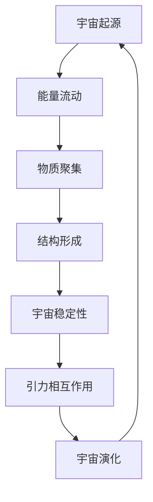

                 

### 1.1 宇宙的起源与演化

#### 1.1.1 宇宙的起源

宇宙的起源是科学领域中最具挑战性的问题之一。目前，最广泛接受的理论是“大爆炸理论”（Big Bang Theory）。根据这一理论，宇宙起源于大约138亿年前的一个“奇点”（singularity），在那个时刻，所有的物质和能量都集中在一个无限小、无限热、无限密度的状态中。随后，由于某种未知的原因，奇点发生了迅速的膨胀，这个过程我们称之为“大爆炸”。

在大爆炸的初期，宇宙的温度极高，物质主要以光子和基本粒子的形式存在。随着宇宙的膨胀和冷却，物质逐渐凝结成原子核，随后形成恒星和星系。这一过程被称为“宇宙演化”（cosmic evolution）。通过观测宇宙中的光谱、辐射和星系的结构，科学家们能够推断出宇宙的起源和演化过程。

#### 1.1.2 宇宙的演化历程

宇宙的演化可以大致分为以下几个阶段：

1. **宇宙早期**（0-1秒）：在宇宙诞生后的最初几秒钟内，宇宙处于极度高温和高压的状态，物质主要以光子、电子、夸克等基本粒子形式存在。

2. **核合成**（1秒-1000秒）：随着宇宙的冷却，质子和中子开始结合形成轻原子核，如氢和氦。

3. **再结合**（1000秒-1百万年）：在宇宙温度下降到约1000开尔文时，电子与原子核结合，形成了电中性的氢原子。

4. **恒星形成**（1百万年-100亿年）：随着宇宙中氢原子的增加，它们开始聚集形成恒星。这些恒星在其生命周期中不断合成更重的元素。

5. **星系形成**（100亿年-当前）：恒星和星际物质继续聚集形成星系、星团和星云。

6. **宇宙的当前状态**（100亿年-未来）：宇宙持续膨胀，恒星和星系不断形成和演化。同时，宇宙中的物质也在经历着暗物质和暗能量的作用。

#### 1.1.3 宇宙平衡的概念

宇宙平衡指的是宇宙中物质和能量分布的稳定性。宇宙的平衡状态可以通过以下几个概念来描述：

1. **哈勃定律**：宇宙中的星系以一定的速度远离我们，速度与它们与我们之间的距离成正比。这表明宇宙正在膨胀。

2. **宇宙背景辐射**：宇宙在大爆炸后留下的热辐射，其温度约为2.7开尔文。这一辐射的存在表明宇宙处于热平衡状态。

3. **暗物质**：宇宙中的一种未知物质，不发光也不吸收光，但通过引力作用影响星系和宇宙的结构。

4. **暗能量**：宇宙中的一种神秘力量，导致宇宙加速膨胀。其存在使得宇宙处于非平衡状态。

宇宙的平衡状态是一个动态变化的过程，受到多种因素（如引力、暗物质、暗能量等）的影响。宇宙的稳定性和平衡是理解宇宙演化的重要基础，也是当前科学研究的重点方向。

### 1.2 宇宙平衡的概念

#### 1.2.1 宇宙平衡的定义

宇宙平衡是指宇宙中物质和能量分布达到稳定状态的现象。在物理学中，这种平衡通常涉及能量守恒和力学的平衡。宇宙平衡不仅包括宏观层面的星系、星团和宇宙背景辐射的分布，还包括微观层面的粒子物理和量子力学的平衡。

宇宙平衡的定义可以从以下几个方面进行理解：

1. **能量守恒**：宇宙中的总能量保持不变，即宇宙中的能量不能被创造或摧毁，只能从一种形式转化为另一种形式。

2. **力学平衡**：在宇宙中，各种力（如引力、电磁力、强力和弱力）相互作用，使得宇宙的结构和分布保持稳定。力学平衡可以解释星系、星团等结构的形成和演化。

3. **热力学平衡**：宇宙的温度分布和物质的热力学状态达到稳定。这意味着宇宙中的热力学过程（如辐射、热传导等）不再发生显著变化。

#### 1.2.2 宇宙平衡的类型

宇宙平衡可以按照不同的标准进行分类：

1. **静态平衡**：在静态平衡中，宇宙中的物质和能量分布不随时间变化。这种平衡状态通常出现在理想化的模型中，如牛顿引力模型。然而，实际的宇宙是动态的，因此静态平衡并不适用于描述宇宙的真实状态。

2. **动态平衡**：在动态平衡中，宇宙中的物质和能量分布随时间变化，但整体上保持稳定。这种平衡状态更符合实际的宇宙观测数据。例如，哈勃定律表明，宇宙中的星系以一定的速度远离我们，这表明宇宙正在膨胀，但整个宇宙的结构和分布仍保持稳定。

3. **热力学平衡**：热力学平衡是指宇宙中的物质和能量分布达到热力学稳定状态。这意味着宇宙中的温度和热力学过程不再发生显著变化。宇宙背景辐射的存在表明宇宙在早期处于热力学平衡状态。

4. **量子力学平衡**：在量子力学中，宇宙中的物质和能量分布可以通过波函数来描述。量子力学平衡是指宇宙中的物质和能量分布满足波函数的稳定解。这种平衡状态与经典力学的平衡状态有所不同，因为它涉及到量子力学中的概率性和不确定性。

#### 1.2.3 宇宙平衡的重要性

宇宙平衡对宇宙的演化具有重要意义：

1. **结构形成**：宇宙的平衡状态有助于星系、星团等结构的形成。通过引力相互作用，宇宙中的物质能够聚集形成大规模的结构。

2. **能量流动**：宇宙平衡有助于宇宙中的能量流动和转换。能量守恒定律表明，宇宙中的总能量保持不变，这有助于理解能量如何在宇宙中传播和转化。

3. **稳定演化**：宇宙的平衡状态有助于宇宙的稳定演化。动态平衡和热力学平衡使得宇宙能够持续演化，同时保持整体稳定。

4. **研究基础**：理解宇宙平衡的概念和机制是研究宇宙演化、宇宙学和其他物理学领域的基础。宇宙平衡的研究有助于揭示宇宙的起源、演化及其未来命运。

### 1.3 宇宙稳定性探讨

#### 1.3.1 宇宙稳定性的定义

宇宙稳定性是指宇宙中物质和能量分布的持久性和可靠性。在物理学中，稳定性通常与系统的平衡状态和扰动响应相关。宇宙稳定性可以定义为宇宙在面临外部扰动时，能否保持其原有结构和分布，不发生显著的变化。

宇宙稳定性的定义可以从以下几个方面进行理解：

1. **动态稳定性**：宇宙的动态稳定性指的是宇宙在随时间演化过程中，能否保持其结构和分布的稳定性。例如，宇宙中的星系和星团能否在宇宙膨胀的过程中保持相对稳定。

2. **热力学稳定性**：宇宙的热力学稳定性指的是宇宙中的热力学过程能否保持稳定，不发生显著的热力学变化。例如，宇宙背景辐射的温度能否保持不变。

3. **量子力学稳定性**：宇宙的量子力学稳定性指的是宇宙中的量子态能否保持稳定，不发生显著的量子波动。例如，宇宙中的物质和能量分布能否在量子尺度上保持稳定。

#### 1.3.2 宇宙稳定性的重要性

宇宙稳定性对宇宙的演化具有重要意义：

1. **结构形成**：宇宙稳定性有助于宇宙中的结构形成。引力相互作用使得物质能够聚集形成星系、星团等结构。宇宙稳定性保证了这些结构能够持久存在。

2. **能量流动**：宇宙稳定性有助于宇宙中的能量流动和转换。例如，恒星的演化依赖于能量守恒和稳定状态，只有宇宙稳定，能量才能在恒星和星系之间有效流动。

3. **稳定演化**：宇宙稳定性保证了宇宙能够持续演化，同时保持整体稳定。例如，宇宙膨胀是一个动态过程，宇宙稳定性使得宇宙能够在膨胀过程中保持结构和分布的稳定性。

4. **预测能力**：理解宇宙稳定性有助于预测宇宙的未来演化。通过研究宇宙稳定性，科学家可以推断宇宙是否会在未来的某个时刻发生显著变化，如宇宙收缩或宇宙大撕裂。

5. **科学研究**：宇宙稳定性是宇宙学和其他物理学领域研究的基础。理解宇宙稳定性有助于揭示宇宙的起源、演化及其未来命运。

#### 1.3.3 宇宙稳定性的挑战

尽管宇宙稳定性在宇宙演化中起着重要作用，但科学家们也面临着许多挑战：

1. **暗物质**：暗物质是宇宙稳定性研究中的一个关键问题。暗物质的存在对宇宙的引力作用有着显著影响，但其本质和组成仍不完全清楚。

2. **暗能量**：暗能量是导致宇宙加速膨胀的神秘力量，其存在和性质对宇宙稳定性有着重要影响，但科学家们对其了解仍有限。

3. **量子扰动**：在量子尺度上，宇宙中的物质和能量会经历波动和不确定性。这些量子扰动可能会影响宇宙的稳定性，但目前尚不清楚如何准确描述这种影响。

4. **宇宙尺度扰动**：宇宙中的大规模扰动（如星系碰撞、宇宙膨胀的加速等）可能会破坏宇宙的稳定性。研究这些扰动对宇宙稳定性的影响是一个重要挑战。

通过不断的研究和探索，科学家们将逐步揭示宇宙稳定性的奥秘，为理解宇宙的演化提供更加深入的见解。

### 2.1 宇宙的力学平衡

#### 2.1.1 力学平衡的基本原理

力学平衡是指物体在外力作用下保持静止或匀速直线运动的状态。在宇宙尺度上，力学平衡也是宇宙稳定性的重要组成部分。力学平衡的基本原理可以概括为以下三个方面：

1. **静力平衡**：物体处于静止状态，受到的所有外力相互抵消，即合外力为零。这意味着物体不会发生加速运动，保持静止或匀速直线运动。

2. **动态平衡**：物体在运动过程中，受到的外力与其速度方向垂直，即合外力为零。这意味着物体将保持匀速直线运动，不会发生加速度。

3. **平衡态**：物体在某个特定位置或状态上，其受力情况和运动状态保持稳定，不会发生显著变化。

#### 2.1.2 宇宙中的力学平衡现象

宇宙中的力学平衡现象是多种多样的，以下是一些典型的例子：

1. **星系中的恒星**：恒星在星系中保持力学平衡，是由于恒星受到的引力与向心力相平衡。恒星围绕星系中心旋转，但不会因引力而被吸入星系中心，这保证了恒星能够稳定存在。

2. **星系之间的相互作用**：星系之间的相互作用也遵循力学平衡原理。例如，两个星系之间的引力相互作用可以使它们保持相对稳定的状态，不会发生碰撞。

3. **星系团的力学平衡**：星系团是由多个星系组成的庞大结构，其力学平衡依赖于星系之间的引力相互作用。星系团中的星系通过引力相互作用保持相对稳定的状态，不会因引力波或其他扰动而破坏其结构。

4. **宇宙大尺度结构**：宇宙中的大尺度结构（如超星系团、星系墙等）也遵循力学平衡原理。这些结构通过引力相互作用维持其稳定，宇宙膨胀对它们的力学平衡产生了一定影响，但总体上仍能保持稳定。

#### 2.1.3 宇宙中的力学平衡与宇宙稳定性

宇宙中的力学平衡对宇宙稳定性具有重要作用。以下是一些关键点：

1. **维持宇宙结构**：宇宙中的力学平衡使得各种结构（如恒星、星系、星系团等）能够保持稳定，不会因引力或其他力的作用而瓦解。

2. **促进能量流动**：力学平衡有助于宇宙中的能量流动和转换，如恒星在其生命周期中的能量转换，星系团中的能量传递等。

3. **确保宇宙演化**：宇宙稳定性依赖于宇宙中的力学平衡。只有在力学平衡的基础上，宇宙才能持续演化，形成新的结构和现象。

4. **预测宇宙未来**：理解宇宙中的力学平衡有助于预测宇宙的未来演化。通过研究力学平衡原理，科学家可以推断宇宙是否会在未来发生显著变化，如宇宙收缩或宇宙大撕裂。

总之，宇宙中的力学平衡是宇宙稳定性的关键组成部分，对宇宙的结构、能量流动和演化具有重要意义。通过深入研究力学平衡原理，我们可以更好地理解宇宙的本质和未来命运。

### 2.2 引力与宇宙稳定性

#### 2.2.1 引力的基本原理

引力是宇宙中最基本和最重要的力之一，它决定了宇宙中物质和能量的分布与运动。引力是由质量引起的，质量越大，引力越强。牛顿（Isaac Newton）在1687年提出了万有引力定律（Law of Universal Gravitation），该定律描述了两个物体之间的引力大小与它们的质量和距离的平方成反比。公式表达为：

\[ F = G \frac{{m_1 m_2}}{{r^2}} \]

其中，\( F \) 是两个物体之间的引力，\( G \) 是万有引力常数，\( m_1 \) 和 \( m_2 \) 是两个物体的质量，\( r \) 是它们之间的距离。

爱因斯坦（Albert Einstein）在1915年提出了广义相对论（General Theory of Relativity），进一步深化了我们对引力的理解。广义相对论认为，引力并不是一种力，而是物质和能量对时空结构的影响。在广义相对论的框架下，物质和能量通过其质量-能量张量 \( T_{\mu\nu} \) 作用于时空的几何结构，导致时空的弯曲。时空的弯曲又产生了物质的加速度，这种加速度就是我们通常所说的引力。广义相对论的数学描述涉及张量方程，即爱因斯坦场方程：

\[ G_{\mu\nu} + \Lambda g_{\mu\nu} = \frac{8\pi G}{c^4} T_{\mu\nu} \]

其中，\( G_{\mu\nu} \) 是爱因斯坦张量，描述时空的曲率，\( \Lambda \) 是宇宙学常数，\( g_{\mu\nu} \) 是度规张量，描述时空的几何结构，\( T_{\mu\nu} \) 是能量-动量张量，描述物质和能量的分布。

#### 2.2.2 引力与宇宙稳定性的关系

引力在宇宙稳定性中起着至关重要的作用。以下是引力与宇宙稳定性的几个关键方面：

1. **引力作用下的物质聚集**：引力是宇宙中物质聚集的主要力量。在引力作用下，气体和尘埃粒子能够聚集形成恒星、星系、星系团等结构。这些结构的形成和演化依赖于引力，保证了宇宙的稳定性和有序性。

2. **宇宙膨胀与引力平衡**：宇宙在大爆炸后开始膨胀，但引力作用使得星系和星系团之间的距离不会无限增大。引力在宇宙膨胀过程中发挥了平衡作用，使得宇宙中的结构能够保持稳定。

3. **星系和星系团的稳定性**：星系和星系团中的恒星、气体和暗物质都受到引力的作用，维持了这些结构的稳定。如果没有引力，恒星和星系将无法保持其形状和结构，宇宙将变得一片混乱。

4. **引力波**：引力波是引力作用的一种表现形式，它对宇宙稳定性有着深远的影响。引力波可以传递能量和信息，影响宇宙中的物质分布和运动。例如，引力波可以导致星系之间的相互作用，改变星系的结构和稳定性。

5. **宇宙背景辐射**：宇宙背景辐射是宇宙早期状态的重要遗迹，其温度和分布受到引力的影响。引力在宇宙早期通过引力波和引力滑移等现象影响了宇宙的演化，对宇宙的稳定状态产生了重要影响。

#### 2.2.3 引力在宇宙稳定性中的作用机制

引力的作用机制可以从以下几个方面进行理解：

1. **物质密度分布**：引力在宇宙中的作用首先体现在物质密度的分布上。引力使得物质在空间中聚集，形成不同的密度分布。这种密度分布决定了宇宙的结构和形态。

2. **引力势**：引力势是描述引力在空间中作用的一种方式。引力势决定了物体的运动轨迹和相互作用。在引力场中，物体受到的引力与引力势能有关。引力势能的变化会导致物体的加速或减速。

3. **引力透镜效应**：引力透镜效应是引力在宇宙中作用的一个显著现象。当一个物体位于另一个物体的引力场中时，光线的路径会发生弯曲。这种现象可以用来探测宇宙中的引力场和物质分布。

4. **引力波传播**：引力波是引力作用的一种波动形式。引力波以光速传播，可以传递能量和信息。在宇宙中，引力波的产生和传播对宇宙稳定性有着重要影响。

总之，引力是宇宙稳定性的关键因素，它决定了宇宙中物质和能量的分布与运动。通过理解引力作用的基本原理和机制，我们可以更好地理解宇宙的演化过程和稳定性状态。

### 2.3 宇宙中的量子力学

#### 2.3.1 量子力学的基本原理

量子力学是描述微观粒子（如电子、光子、原子等）行为和性质的物理学理论。它由德国物理学家马克斯·波恩（Max Born）、维尔纳·海森伯（Werner Heisenberg）和埃尔温·薛定谔（Erwin Schrödinger）等人在20世纪初提出。量子力学的基本原理与传统经典物理学有显著差异，主要包括以下方面：

1. **量子态**：在量子力学中，粒子的状态不能用确定的轨道来描述，而是用波函数（wavefunction）来描述。波函数提供了粒子在空间中的概率分布，而不是确定的位置和速度。波函数的平方表示粒子在某一位置被发现的概率。

2. **测不准原理**：测不准原理是量子力学的核心原理之一，由海森伯提出。它表明，粒子的某些对偶变量（如位置和动量、时间和能量等）无法同时被精确测量。具体来说，一个变量测量得越精确，另一个变量的不确定性就越大。

3. **量子纠缠**：量子纠缠是量子力学中另一个重要现象。当两个或多个粒子发生相互作用后，它们可能会进入一种特殊的量子态，使得它们之间的信息即时传递。即使这些粒子相距遥远，它们的状态也是相互关联的，一个粒子的状态变化会即时影响另一个粒子的状态。

4. **量子跃迁**：量子跃迁是指粒子从一个能级跃迁到另一个能级的过程。这种跃迁是通过吸收或发射光子（即量子）来实现的。量子跃迁遵循能量守恒和动量守恒原理。

5. **波粒二象性**：量子力学揭示了微观粒子具有波粒二象性。这意味着粒子在某些实验中表现出波动性质，而在另一些实验中则表现出粒子性质。

#### 2.3.2 量子力学与宇宙稳定性

量子力学在宇宙稳定性中的作用是一个复杂且富有挑战性的研究领域。以下是一些量子力学与宇宙稳定性的关系：

1. **量子涨落**：在宇宙早期，量子力学效应可能导致宇宙中的量子涨落。这些涨落是宇宙结构形成的基础，对宇宙稳定性具有重要影响。量子涨落可能导致宇宙中物质分布的不均匀性，这种不均匀性最终引发了恒星、星系和星系团的形成。

2. **量子引力**：量子力学和广义相对论的统一理论被称为量子引力。量子引力旨在描述宇宙中引力的量子性质，如引力波和黑洞的量子行为。量子引力理论对宇宙稳定性具有重要意义，因为引力是宇宙中最重要的力，它决定了宇宙的结构和演化。

3. **量子隧穿**：量子隧穿是一种量子效应，它允许粒子穿过势垒，即使势垒的高度超过了粒子的能量。在宇宙尺度上，量子隧穿可能影响宇宙中物质和能量的分布。例如，量子隧穿可能导致宇宙中的物质从一个位置突然转移到另一个位置，影响宇宙的稳定性。

4. **量子波动**：量子波动是指微观粒子的波动性质在宏观尺度上的表现。在宇宙尺度上，量子波动可能导致宇宙中的物质和能量分布发生波动，从而影响宇宙的稳定性。

5. **量子纠缠**：量子纠缠在宇宙学中的应用还处于探索阶段，但研究表明，量子纠缠可能影响宇宙中的信息传递和物质分布。例如，量子纠缠可能导致宇宙中的物质和能量以超光速相互关联，这可能会对宇宙的稳定性产生重要影响。

总之，量子力学在宇宙稳定性中扮演着关键角色。通过深入研究量子力学的基本原理和其在宇宙中的应用，我们可以更好地理解宇宙的演化过程和稳定性状态。

### 3.1 宇宙对称性的概念

宇宙对称性是指宇宙中物理定律和现象在某种变换下保持不变的性质。对称性是物理学中一个基本概念，它在描述自然界规律时起到了关键作用。在宇宙学中，对称性有助于我们理解宇宙的结构、演化和稳定性。以下是宇宙对称性的几个关键方面：

#### 3.1.1 对称性的定义

对称性可以从数学和物理学的角度进行定义：

1. **数学定义**：在数学中，对称性通常指一个几何图形或函数在某种变换下保持不变的性质。常见的对称变换包括旋转、反射、平移和缩放等。

2. **物理定义**：在物理学中，对称性是指物理定律在某种变换下保持不变的性质。这种变换可以是空间变换、时间变换或内部对称变换。例如，物理定律在空间平移或时间平移下保持不变，称为平移对称性；在某种变换下保持不变，称为内部对称性。

#### 3.1.2 宇宙对称性的类型

宇宙对称性可以分为以下几种类型：

1. **空间对称性**：空间对称性是指宇宙在空间上的对称性，如旋转对称性、镜像对称性和平移对称性。旋转对称性是指宇宙在旋转下保持不变，镜像对称性是指宇宙在反射下保持不变，平移对称性是指宇宙在平移下保持不变。

2. **时间对称性**：时间对称性是指宇宙在时间上的对称性，如时间反演对称性。时间反演对称性是指物理定律在时间倒转下保持不变。

3. **内部对称性**：内部对称性是指宇宙中物理定律在某种内部变换下保持不变的性质，如电荷对称性、宇称对称性和味对称性。内部对称性在粒子物理学中具有重要意义。

#### 3.1.3 对称性与宇宙平衡的关系

宇宙对称性与宇宙平衡有密切关系：

1. **对称性破缺**：对称性破缺是指宇宙在某种条件下失去对称性的现象。例如，宇宙在早期可能具有高对称性，但随着宇宙的演化，对称性被破缺，导致宇宙呈现出复杂的结构和现象。

2. **对称性与稳定性**：对称性有助于宇宙保持稳定性。高对称性意味着物理定律具有简单和统一的形式，这有助于宇宙维持稳定状态。然而，对称性破缺也是宇宙演化的重要机制，它可能导致宇宙中出现新的结构和现象。

3. **对称性在宇宙学中的应用**：对称性在宇宙学中具有广泛应用。例如，宇宙背景辐射的均匀性表明宇宙在早期可能具有很高的对称性；宇宙中的粒子和力的对称性揭示了宇宙的基本结构和演化规律。

总之，宇宙对称性是理解宇宙平衡和演化的重要工具。通过研究宇宙对称性的类型和性质，我们可以更好地理解宇宙的本质和演化过程。

### 3.2 对称性与宇宙稳定性的联系

#### 3.2.1 对称性与平衡状态

对称性与平衡状态在物理学和宇宙学中都是核心概念。对称性是指系统在某种变换下保持不变的性质，而平衡状态是指系统中的各个部分之间达到稳定的关系。以下是对称性与平衡状态之间关系的详细探讨：

1. **平衡态与对称性**：在经典物理学中，一个系统如果处于平衡态，通常意味着其内部各个部分之间相互抵消，整体上保持稳定。对称性是实现平衡状态的一种机制。例如，一个均匀分布的系统在旋转或反射下保持不变，这意味着系统具有旋转对称性和镜像对称性，从而在几何上实现平衡。

2. **对称性破缺**：当系统中的对称性被破坏时，即发生对称性破缺，系统可能会进入非平衡态。对称性破缺是系统从平衡态向非平衡态过渡的重要机制。在宇宙学中，对称性破缺导致了宇宙中的复杂结构和现象的出现。例如，宇宙在早期可能具有高对称性，但随着宇宙的演化，对称性被破缺，从而形成了星系、星团等结构。

3. **对称性在平衡状态中的作用**：对称性在平衡状态中起到了简化物理定律和统一描述的作用。高对称性意味着物理定律具有简单和统一的形式，这有助于系统保持稳定。例如，在电磁相互作用中，电荷对称性使得电磁力具有统一的形式，从而在宏观尺度上保持平衡。

#### 3.2.2 对称性与稳定性

对称性与稳定性之间的关系可以通过以下几个方面进行理解：

1. **对称性增强稳定性**：对称性有助于系统保持稳定性。这是因为对称性意味着系统的各个部分之间相互平衡，不易受到外部扰动的影响。例如，一个具有旋转对称性的物体在受到外部力作用时，其旋转轴方向不会改变，从而保持稳定。

2. **对称性破缺与不稳定**：当系统中的对称性被破缺时，系统可能会变得不稳定。这是因为对称性破缺导致系统的各个部分之间不再平衡，使得系统更容易受到外部扰动的影响。例如，宇宙中的对称性破缺导致了宇宙结构的形成，这些结构在演化过程中可能会变得不稳定。

3. **对称性与混沌**：对称性破缺还可以导致混沌现象的出现。混沌是指系统在初始条件微小的变化下，会导致长期行为的显著差异。在宇宙学中，对称性破缺可能是宇宙混沌现象的根源之一。例如，宇宙背景辐射的不均匀性可能是由对称性破缺引起的，这导致了宇宙结构的多样性和复杂性。

4. **对称性与自然选择**：在生物学中，对称性也是稳定性的一种体现。生物体的对称性有助于其生存和繁衍，因为对称性增强了生物体的平衡和稳定性。例如，蝴蝶的对称翅膀有助于其在空中稳定飞行。在宇宙学中，对称性可能也起到了类似的作用，有助于宇宙中的物质和能量在复杂的演化过程中保持稳定。

总之，对称性与平衡状态和稳定性之间有着密切的联系。对称性是实现平衡状态的一种机制，同时对称性破缺也是系统演化的重要过程。通过研究对称性与稳定性之间的关系，我们可以更好地理解宇宙的演化机制和宇宙结构形成的奥秘。

### 3.3 宇宙中的对称破缺现象

#### 3.3.1 对称破缺的概念

对称破缺（symmetry breaking）是指在物理学和宇宙学中，一个高对称性系统在演化过程中失去对称性的现象。对称破缺是物理学中一个重要的概念，它在解释宇宙的结构和现象中起到了关键作用。以下是对称破缺的详细定义：

1. **基本概念**：在物理学中，对称性是指物理定律在某种变换下保持不变的性质。例如，一个旋转对称的系统在旋转下保持不变。对称破缺则是指当系统发生某种变化时，其高对称性被破坏，系统不再满足原来的对称性。

2. **相变与对称破缺**：在物理学中，相变是指系统从一种宏观状态转变为另一种宏观状态的过程。例如，水从液态转变为气态。在相变过程中，系统通常经历对称破缺。例如，在水的液态相，分子排列具有对称性，但在气态相，分子排列变得无序，对称性被破坏。

3. **对称破缺的类型**：对称破缺可以分为几种类型，包括：
   - **自发对称破缺**：系统在未受外部扰动的情况下，自发地失去对称性。
   - **显现对称破缺**：系统在外部扰动下，对称性被破坏，并显现出新的对称性。
   - **不完全对称破缺**：系统在部分参数或条件下保持对称性，而在其他条件下失去对称性。

#### 3.3.2 宇宙中的对称破缺现象

宇宙中的对称破缺现象是宇宙演化过程中的关键步骤，它决定了宇宙的结构和性质。以下是一些宇宙中的对称破缺现象：

1. **宇宙早期对称破缺**：在宇宙早期，可能存在高对称性。例如，在量子尺度上，宇宙可能具有全同粒子对称性（如量子场的各向同性）。然而，随着宇宙的演化，对称性被破缺，导致宇宙中的物质和能量分布变得不均匀，形成了星系、星团等结构。

2. **大统一理论的对称破缺**：在大统一理论中，存在一种高对称性的理论框架，如超对称性。然而，在宇宙演化的过程中，这种高对称性被破缺，导致宇宙中的粒子获得质量，形成了不同的物质形态。

3. **量子场论中的对称破缺**：在量子场论中，对称破缺是粒子质量产生的关键机制。例如，在电弱统一理论中，对称破缺导致了电子、夸克等粒子获得质量，而光子等粒子保持无质量。

4. **宇宙背景辐射中的对称破缺**：宇宙背景辐射是宇宙早期的热辐射，其均匀性表明宇宙在早期可能具有高对称性。然而，随着宇宙的演化，对称性被破缺，导致了宇宙背景辐射中的不均匀性。

5. **宇宙结构形成中的对称破缺**：宇宙中的对称破缺也是宇宙结构形成的关键机制。例如，在星系形成过程中，引力相互作用导致物质聚集，这可能导致对称性破缺，从而形成了星系、星系团等结构。

总之，宇宙中的对称破缺现象是宇宙演化过程中的重要步骤，它决定了宇宙的结构和性质。通过研究对称破缺现象，我们可以更好地理解宇宙的起源和演化过程。

### 4.1 引力波的基本原理

引力波是引力在时空中的波动现象，是由加速的质能产生的。引力波的存在最早由爱因斯坦在1916年提出的广义相对论中预言。引力波的基本原理可以从以下几个方面进行理解：

#### 4.1.1 引力波的定义

引力波是指由质量加速运动产生的时空波动，这种波动以光速传播，携带能量和信息。根据广义相对论，引力波是一种由物质和能量的加速运动引起的时空扭曲，这种扭曲以波动形式传递出去，形成引力波。

#### 4.1.2 引力波的传播特性

引力波具有以下传播特性：

1. **以光速传播**：引力波以光速传播，这是宇宙中所有信息传递的最高速度。这意味着引力波在传播过程中不会衰减，能够传播到宇宙的遥远角落。

2. **横波**：引力波是横波，这意味着波的振动方向与波的传播方向垂直。相比之下，声波是纵波，振动方向与传播方向相同。

3. **振幅衰减**：引力波的振幅会随着传播距离的增加而衰减。这种衰减遵循与光波类似的扩散定律，即引力波的能量随着传播距离的增加而均匀分布。

4. **极弱扰动**：引力波是一种极弱的扰动，其影响非常微弱。在地球上，引力波的效应可能仅是几纳米级别的位移，这对探测技术提出了极高的要求。

#### 4.1.3 引力波的产生机制

引力波的产生机制源于质量加速运动。以下是一些产生引力波的主要过程：

1. **双星系统**：两个恒星围绕彼此运动时，由于引力的相互作用，它们会加速运动，产生引力波。

2. **黑洞碰撞**：两个黑洞或一个黑洞与一个恒星碰撞时，由于质量巨大且运动速度极快，会产生强烈的引力波。

3. **星系碰撞**：两个星系或星系团之间的碰撞和相互作用也会产生引力波。

4. **宇宙大爆炸**：宇宙大爆炸可能产生了早期的引力波，这些引力波在宇宙演化过程中被放大，至今仍然存在。

#### 4.1.4 引力波探测的意义

引力波的探测具有重要的科学意义：

1. **验证广义相对论**：引力波的探测是广义相对论的重要验证。通过观测引力波，我们可以直接验证爱因斯坦的预言，进一步理解引力在宇宙中的作用。

2. **研究宇宙演化**：引力波提供了宇宙演化的直接观测数据。通过分析引力波的产生机制和传播特性，我们可以深入了解宇宙中的大规模结构形成和演化过程。

3. **揭示暗物质和暗能量**：引力波探测可能揭示宇宙中的暗物质和暗能量。例如，引力波可能与暗物质相互作用，从而影响引力波的行为。

4. **探索宇宙起源**：引力波探测可能揭示宇宙早期的信息，如宇宙大爆炸产生的引力波，这有助于我们理解宇宙的起源和早期演化。

总之，引力波的基本原理和传播特性为我们提供了研究宇宙演化和宇宙学的重要工具。通过深入理解引力波的产生机制和探测技术，我们可以更好地揭示宇宙的奥秘。

### 4.2 引力波与宇宙稳定性

引力波是宇宙中的一种重要现象，它不仅在物理学和天文学中具有重要意义，也对宇宙的稳定性和演化有着深远影响。以下从几个方面探讨引力波与宇宙稳定性的关系：

#### 4.2.1 引力波的作用

引力波的作用主要体现在以下几个方面：

1. **能量传递**：引力波携带能量，在传播过程中能够将能量从一个区域传递到另一个区域。这种能量传递可能会影响宇宙中的物质分布和结构形成。

2. **扰动宇宙结构**：引力波在传播过程中会对宇宙中的物质和能量产生微小的扰动。这些扰动可能会影响星系、星系团等结构的稳定性和演化。

3. **探测宇宙信息**：引力波的探测为我们提供了了解宇宙演化和宇宙学过程的重要手段。通过分析引力波的产生机制和传播特性，我们可以获得宇宙早期和大规模结构形成的关键信息。

#### 4.2.2 引力波对宇宙稳定性的影响

引力波对宇宙稳定性的影响可以从以下几个方面进行理解：

1. **引力波与宇宙膨胀**：引力波在传播过程中会对宇宙膨胀产生作用。例如，两个星系之间的引力波可能会影响它们的运动状态，从而影响宇宙的膨胀速率。引力波的能量传递也可能改变宇宙中的物质分布，进而影响宇宙的膨胀模式。

2. **引力波与星系稳定性**：引力波对星系内部的稳定性和结构形成具有重要影响。例如，双星系统之间的引力波可能会改变它们的轨道，导致星系内部的结构发生变化。此外，星系团之间的引力波也可能影响星系团的结构和稳定性。

3. **引力波与暗物质**：引力波可能与暗物质相互作用，从而影响宇宙的稳定性。例如，引力波在传播过程中可能会扰动暗物质分布，这可能会影响星系和星系团的形成和演化。

4. **引力波与宇宙背景辐射**：引力波与宇宙背景辐射的相互作用也可能影响宇宙的稳定性。例如，引力波可能影响宇宙背景辐射的温度分布，从而影响宇宙的结构形成。

#### 4.2.3 引力波探测对宇宙稳定性研究的重要性

引力波探测对宇宙稳定性研究具有重要意义：

1. **验证广义相对论**：引力波的探测直接验证了爱因斯坦的广义相对论，为我们提供了研究宇宙稳定性的重要工具。通过观测引力波，我们可以更深入地理解引力在宇宙中的作用。

2. **揭示宇宙早期信息**：引力波探测可能揭示宇宙早期的重要信息，如宇宙大爆炸产生的引力波。这些信息有助于我们理解宇宙的起源和早期演化过程，从而为研究宇宙稳定性提供重要依据。

3. **研究宇宙演化**：引力波探测为我们提供了研究宇宙演化和宇宙学过程的重要数据。通过分析引力波的产生机制和传播特性，我们可以深入了解宇宙中的大规模结构形成和演化过程，为研究宇宙稳定性提供关键信息。

4. **探测暗物质和暗能量**：引力波探测可能揭示宇宙中的暗物质和暗能量。例如，引力波可能与暗物质相互作用，从而影响宇宙的稳定性。通过研究引力波与暗物质、暗能量的关系，我们可以更好地理解宇宙的稳定性和演化过程。

总之，引力波与宇宙稳定性有着密切的关系。通过深入研究引力波的作用机制和探测技术，我们可以更好地理解宇宙的稳定性和演化过程，为宇宙学和其他物理学领域的研究提供重要依据。

### 4.3 引力波的探测与观测

引力波的探测与观测是现代天文学和物理学领域的重要进展，它标志着人类对宇宙的认识进入了一个新的时代。以下从几个方面介绍引力波的探测与观测：

#### 4.3.1 引力波的探测方法

探测引力波的方法主要包括以下几种：

1. **地面探测器**：地面探测器利用激光干涉技术来探测引力波。最著名的地面探测器是激光干涉引力波观测站（LIGO）和欧洲的处女座干涉仪（VIRGO）。这些探测器通过测量两个相互垂直的光束的干涉情况，来检测引力波通过时产生的微小时空扭曲。

2. **空间探测器**：空间探测器可以在地球大气层外直接探测引力波。例如，激光干涉空间天线（LISA）是一个计划中的空间引力波探测器，它由三个空间站组成，可以更加灵敏地探测低频率的引力波。

3. **电磁波观测**：引力波与电磁波相互作用，通过观测电磁波的变化也可以间接探测引力波。例如，通过观测双星系统中的恒星光谱变化，可以推测引力波的存在。

4. **粒子探测器**：某些粒子探测器，如中微子探测器，也可以用于探测引力波。中微子是引力波的携带者之一，因此通过观测中微子流的变化，可以推测引力波的存在。

#### 4.3.2 引力波的观测数据与应用

引力波的观测数据为我们提供了研究宇宙的重要信息，以下是一些关键的应用：

1. **验证广义相对论**：引力波的观测直接验证了爱因斯坦的广义相对论。通过观测引力波的产生、传播和效应，我们可以验证广义相对论的预测，从而加深对引力本质的理解。

2. **揭示宇宙早期信息**：引力波可以携带宇宙早期的重要信息，通过分析引力波的波形和特性，我们可以了解宇宙大爆炸后的早期状态，以及宇宙的演化历程。

3. **研究宇宙结构**：引力波的观测有助于我们了解宇宙中的大规模结构，如星系、星系团和星系团之间的相互作用。通过引力波，我们可以研究星系的形成和演化，以及宇宙的膨胀模式。

4. **探测暗物质和暗能量**：引力波可能携带暗物质和暗能量的信息，通过分析引力波的特性，我们可以推测暗物质和暗能量的性质和分布。

5. **探索引力波与电磁波的关系**：通过同时观测引力波和电磁波，我们可以研究它们之间的相互作用和关联。这有助于我们理解宇宙中的复杂现象，如双星系统的演化。

总之，引力波的探测与观测为研究宇宙提供了全新的手段和视角。通过不断改进探测技术和数据分析方法，我们可以获得更多关于宇宙的信息，进一步揭示宇宙的奥秘。

### 5.1 宇宙膨胀的概念

宇宙膨胀是指宇宙中所有物质和能量在空间上的距离随时间增大的一种现象。这一概念是现代宇宙学的基础之一，它源于对遥远星系光谱红移的观测。以下对宇宙膨胀的概念进行详细解释：

#### 5.1.1 宇宙膨胀的定义

宇宙膨胀可以定义为宇宙中的物质和能量在空间中的距离随时间增大。具体来说，宇宙中的星系、星系团以及其他结构都在相互远离，这种远离的速度与它们之间的距离成正比。

#### 5.1.2 宇宙膨胀的证据

宇宙膨胀的证据主要包括以下几个方面：

1. **哈勃定律**：哈勃定律表明，遥远星系的光谱具有红移，红移量与星系的距离成正比。红移是由于星系远离我们，光波发生多普勒效应而产生的。这个定律是宇宙膨胀的直接证据。

2. **宇宙背景辐射**：宇宙背景辐射是宇宙早期状态的重要遗迹，其均匀性和温度表明宇宙在早期是高度统一的。随着宇宙的膨胀，这种均匀性被破坏，形成了我们今天观察到的宇宙结构。

3. **大尺度结构**：宇宙中的大尺度结构（如星系墙、星系团等）也表明宇宙在膨胀。通过观测这些结构，我们可以推断宇宙的膨胀历史和未来的演化趋势。

#### 5.1.3 宇宙膨胀的原因

宇宙膨胀的原因主要包括以下几个方面：

1. **暗能量**：暗能量是导致宇宙加速膨胀的神秘力量。暗能量具有负压强，导致宇宙的膨胀速度随时间增加。目前，暗能量是宇宙膨胀的主要驱动力。

2. **宇宙学常数**：宇宙学常数（如黎曼几何中的宇宙常数）也是宇宙膨胀的一个重要原因。宇宙学常数提供了一个推动宇宙膨胀的力，这与暗能量有相似的作用。

3. **宇宙的初始条件**：宇宙的初始条件也可能导致宇宙膨胀。例如，宇宙大爆炸可能提供了一个初始的膨胀动力，使得宇宙开始膨胀。

#### 5.1.4 宇宙膨胀的影响

宇宙膨胀对宇宙的演化产生了深远的影响：

1. **星系结构和演化**：宇宙膨胀导致星系之间的距离增大，影响星系的演化。例如，星系之间的引力相互作用可能减弱，导致星系的碰撞和合并减少。

2. **宇宙结构形成**：宇宙膨胀影响宇宙中的结构形成。随着宇宙的膨胀，物质在引力作用下聚集形成星系和星系团，但膨胀速度可能影响这些结构的形成和演化。

3. **宇宙的几何结构**：宇宙膨胀也可能影响宇宙的几何结构。例如，宇宙的曲率可能因膨胀而发生变化，这会影响宇宙的未来演化。

总之，宇宙膨胀是宇宙学中的一个核心概念，它不仅揭示了宇宙的演化历史，也为理解宇宙的未来命运提供了重要线索。通过深入研究宇宙膨胀的概念、证据和原因，我们可以更好地理解宇宙的奥秘。

### 5.2 宇宙膨胀与宇宙稳定性

宇宙膨胀是宇宙学中的一个基本现象，它描述了宇宙中所有物质和能量在空间上的距离随时间增大。宇宙膨胀不仅揭示了宇宙的演化历史，也对宇宙的稳定性产生了重要影响。以下从几个方面探讨宇宙膨胀与宇宙稳定性的关系：

#### 5.2.1 宇宙膨胀的影响

宇宙膨胀对宇宙的稳定性有着深远的影响：

1. **引力相互作用减弱**：宇宙膨胀导致星系、星系团等结构之间的距离增大，引力相互作用减弱。这可能会影响宇宙中结构的稳定性和演化。

2. **宇宙结构的形成**：宇宙膨胀影响宇宙中的结构形成。随着宇宙的膨胀，物质在引力作用下聚集形成星系和星系团，但膨胀速度可能影响这些结构的形成和演化。高膨胀速度可能导致结构形成时间缩短，结构规模减小。

3. **宇宙的几何结构**：宇宙膨胀也可能影响宇宙的几何结构。例如，宇宙的曲率可能因膨胀而发生变化，这会影响宇宙的未来演化。宇宙膨胀可能导致宇宙从正曲率（闭合宇宙）转变为负曲率（开放宇宙）。

#### 5.2.2 宇宙膨胀与宇宙稳定性的关系

宇宙膨胀与宇宙稳定性之间的关系可以从以下几个方面进行理解：

1. **动态平衡**：宇宙膨胀是一种动态过程，宇宙中的物质和能量分布不断变化。在这种动态过程中，宇宙可能达到一种新的平衡状态。这种平衡状态是在膨胀和引力相互作用之间的动态平衡，它保证了宇宙的稳定性。

2. **对称性与稳定性**：宇宙膨胀可能导致宇宙对称性的破缺。在早期宇宙中，可能存在高对称性，但随着宇宙的膨胀，对称性被破缺，形成了复杂的宇宙结构。这种对称性破缺有助于宇宙保持稳定性，因为对称性破缺可能引发新的物理现象和作用机制，从而增加宇宙的稳定性。

3. **暗能量**：宇宙膨胀的主要驱动力是暗能量。暗能量具有负压强，导致宇宙加速膨胀。这种加速膨胀可能影响宇宙的稳定性，因为它可能导致宇宙中的物质和能量分布变得不均匀，从而增加宇宙的不稳定性。

4. **量子力学效应**：宇宙膨胀也可能受到量子力学效应的影响。例如，量子涨落可能影响宇宙的膨胀速度和物质分布。这些量子效应可能导致宇宙中的结构形成和演化过程变得复杂，从而影响宇宙的稳定性。

总之，宇宙膨胀对宇宙稳定性具有重要影响。通过理解宇宙膨胀的影响和宇宙稳定性之间的关系，我们可以更好地理解宇宙的演化过程和宇宙的稳定机制。进一步的研究将有助于揭示宇宙膨胀和宇宙稳定性之间的复杂关系，从而为宇宙学和其他物理学领域提供新的见解。

### 5.3 宇宙收缩的可能机制

宇宙收缩，或称为宇宙坍缩，是指宇宙从当前膨胀状态转变为整体收缩状态的现象。这一概念在宇宙学中具有重要意义，因为它涉及到宇宙的最终命运和演化路径。以下从几个方面探讨宇宙收缩的可能机制：

#### 5.3.1 宇宙收缩的概念

宇宙收缩是指宇宙中所有物质和能量在空间上的距离随时间减小，最终导致宇宙的塌陷。如果宇宙的收缩速度超过一定的临界值，宇宙可能会坍缩成一个单一点，称为奇点。宇宙收缩与宇宙膨胀相对，它描述了宇宙从当前状态向过去状态的演化。

#### 5.3.2 宇宙收缩的潜在机制

宇宙收缩的潜在机制可以从以下几个方面进行探讨：

1. **引力作用**：引力是宇宙中最重要的力之一，它决定了宇宙中物质和能量的分布和运动。在宇宙中，引力相互作用可能导致物质聚集，形成星系、星系团等结构。如果引力作用足够强，可能会导致宇宙整体收缩。

2. **暗物质**：暗物质是宇宙中的一种未知物质，它通过引力相互作用影响宇宙的结构和演化。暗物质的存在和分布可能影响宇宙的收缩过程。例如，如果暗物质分布不均匀，可能会导致局部区域引力增强，从而加速宇宙收缩。

3. **暗能量**：暗能量是导致宇宙加速膨胀的神秘力量。然而，在某些特殊条件下，暗能量也可能导致宇宙收缩。例如，如果暗能量具有负压强且密度足够高，可能会导致宇宙的膨胀速度减缓，最终导致收缩。

4. **量子引力效应**：量子引力效应可能影响宇宙的收缩过程。例如，量子涨落可能导致宇宙早期的不均匀性，这些不均匀性可能引发宇宙收缩。此外，量子引力可能影响引力相互作用，从而影响宇宙的收缩速度。

5. **宇宙大坍缩**：宇宙大坍缩（Big Crunch）是一种极端情况，它指的是宇宙从膨胀状态突然转变为收缩状态，最终坍缩成一个奇点。这种坍缩过程可能由引力作用和暗物质相互作用引起。

#### 5.3.3 宇宙收缩的可能性

宇宙收缩的可能性取决于多种因素，包括宇宙的密度、引力作用、暗物质和暗能量等。以下是一些可能影响宇宙收缩的关键因素：

1. **宇宙密度**：宇宙的密度是决定宇宙最终命运的关键因素。如果宇宙的密度大于某个临界值，宇宙可能会收缩。当前观测数据表明，宇宙的密度接近临界值，这表明宇宙收缩的可能性较低。

2. **暗物质密度**：暗物质密度也是影响宇宙收缩的重要因素。如果暗物质密度足够高，可能会导致宇宙收缩。然而，当前对暗物质的研究仍不完全清楚，这限制了我们对宇宙收缩可能性的准确预测。

3. **暗能量**：暗能量是导致宇宙加速膨胀的主要力量。然而，在某些特殊条件下，暗能量也可能导致宇宙收缩。例如，如果暗能量具有负压强且密度足够高，可能会导致宇宙的膨胀速度减缓，最终导致收缩。

4. **量子引力效应**：量子引力效应可能影响宇宙的收缩过程。例如，量子涨落可能导致宇宙早期的不均匀性，这些不均匀性可能引发宇宙收缩。然而，量子引力的确切机制尚不清楚，这限制了我们对宇宙收缩可能性的准确预测。

总之，宇宙收缩是一个复杂且具有挑战性的问题，涉及到多种物理机制和因素。通过深入研究宇宙密度、引力作用、暗物质和暗能量等，我们可以更好地理解宇宙收缩的可能性，从而揭示宇宙的最终命运。

### 6.1 自组织的概念

自组织（Self-Organization）是指在无外部控制或引导的情况下，系统通过内部的相互作用和动力过程，自发地从无序状态向有序状态转变的过程。这一现象在自然界和社会科学中广泛存在，如从气态分子形成液态，从细胞分化成复杂的生物体，从简单的分子链形成复杂的蛋白质结构等。

在物理学和宇宙学中，自组织是理解宇宙复杂结构和多样性的重要概念。以下是对自组织概念的具体描述：

#### 6.1.1 自组织的定义

自组织可以定义为系统在没有外部控制的情况下，通过内部相互作用和动态过程，从低级无序状态向高级有序状态转变的过程。这种有序状态不是预先设计的，而是系统内部相互作用和能量交换的结果。

#### 6.1.2 自组织的特征

自组织具有以下几个主要特征：

1. **无外部控制**：自组织过程不需要外部干预或指导，系统内部的力量和相互作用决定了系统的演化方向。

2. **自发性**：自组织是一种自发过程，它可以在没有外部能量输入的情况下发生。

3. **自适应**：自组织系统能够适应外部环境的变化，通过内部调整和重组，维持或优化系统的有序状态。

4. **复杂性**：自组织过程通常涉及复杂系统，这些系统由大量相互作用的组成部分组成，其行为表现为集体效应。

5. **自我相似性**：自组织系统往往表现出自我相似性，即系统在不同尺度上具有相似的结构和功能。

#### 6.1.3 自组织的机制

自组织的机制可以从以下几个方面进行理解：

1. **局域相互作用**：自组织通常源于系统内部的局域相互作用。这些相互作用可以是物理的、化学的、生物的或社会的。

2. **能量和物质交换**：自组织过程中，能量和物质的交换起着关键作用。例如，在生物系统中，能量的转换和物质的传递是自组织的基础。

3. **相变和临界现象**：自组织过程常常与相变和临界现象相关。在相变过程中，系统从一个相态转变为另一个相态，可能伴随着结构的突然变化和有序态的形成。

4. **复杂网络和图论**：在自组织中，复杂网络和图论提供了有效的工具来描述和模拟系统的相互作用和演化。

#### 6.1.4 自组织在宇宙学中的应用

自组织在宇宙学中具有重要意义，以下是一些关键应用：

1. **星系和星系团的形成**：宇宙中的星系和星系团是通过引力相互作用和物质分布的自组织过程形成的。这些过程受到宇宙早期量子涨落和宇宙膨胀的影响。

2. **宇宙背景辐射**：宇宙背景辐射的自组织过程揭示了宇宙早期的均匀性和微小不均匀性，这些不均匀性是星系和星系团形成的基础。

3. **宇宙结构演化**：自组织过程描述了宇宙结构从简单到复杂的演化过程。例如，星系团通过相互作用和碰撞，形成更大的超星系团结构。

4. **暗物质和暗能量**：自组织理论提供了对暗物质和暗能量的一种解释。暗物质可能通过自组织过程形成复杂的结构，而暗能量可能是一种导致宇宙加速膨胀的自组织现象。

总之，自组织是理解宇宙复杂性和多样性的重要概念。通过深入研究自组织的机制和应用，我们可以更好地理解宇宙的演化过程，揭示宇宙的本质和未来命运。

### 6.2 宇宙中的自组织现象

宇宙中的自组织现象是宇宙演化过程中重要的组成部分，它描述了物质和能量在没有外部干预的情况下，通过内部相互作用和动态过程自发地从无序状态向有序状态转变的过程。以下从几个方面详细探讨宇宙中的自组织现象：

#### 6.2.1 自组织现象的定义

自组织现象是指宇宙中的物质和能量在没有外部控制或引导的情况下，通过内部相互作用和动态过程，自发地从无序状态向有序状态转变的过程。这一现象在宇宙学、天文学和物理学中具有重要意义，因为它揭示了宇宙复杂结构和多样性的形成机制。

#### 6.2.2 自组织现象的机制

宇宙中的自组织现象可以通过以下几个机制进行理解：

1. **量子涨落**：宇宙早期的量子涨落是宇宙结构形成的基础。量子涨落导致宇宙中的物质分布变得不均匀，这些不均匀性在引力作用下逐渐放大，形成了星系、星系团等结构。

2. **引力相互作用**：引力是宇宙中最基本的相互作用，它决定了宇宙中物质和能量的分布和运动。引力相互作用使得物质在空间中聚集，形成了复杂的结构。

3. **能量和物质交换**：能量和物质在宇宙中的交换是自组织现象的重要机制。例如，恒星在其生命周期中通过核反应产生能量，这些能量通过辐射和恒星风的形式传递到星际介质中，促进了星系和星系团的形成。

4. **相变和临界现象**：宇宙中的相变和临界现象也是自组织的重要机制。例如，宇宙早期的高能态通过相变转变为低能态，导致了宇宙的冷却和结构的形成。

5. **复杂网络和图论**：宇宙中的自组织现象可以通过复杂网络和图论进行描述。例如，星系和星系团可以通过复杂网络来表示，揭示了它们之间的相互作用和结构。

#### 6.2.3 自组织现象在宇宙中的应用

宇宙中的自组织现象在多个层次上具有重要意义，以下是一些具体应用：

1. **星系和星系团的形成**：星系和星系团是通过自组织现象形成的。在引力作用下，物质从无序状态聚集形成星系，多个星系通过相互作用和碰撞形成星系团。

2. **宇宙背景辐射**：宇宙背景辐射是宇宙早期状态的重要遗迹，其均匀性和微小不均匀性是宇宙结构形成的基础。这些不均匀性通过自组织现象逐渐放大，形成了星系和星系团。

3. **恒星和行星的形成**：恒星和行星是通过自组织现象在星际介质中形成的。星际介质中的分子云通过引力相互作用聚集形成恒星，恒星内部的核反应产生的能量和物质交换促进了行星的形成。

4. **超星系团的形成**：超星系团是由多个星系团通过自组织现象相互吸引和碰撞形成的。这些超星系团构成了宇宙中的大型结构，揭示了宇宙的层次结构。

5. **宇宙膨胀**：宇宙膨胀过程中的自组织现象包括暗能量的作用。暗能量可能是一种导致宇宙加速膨胀的自组织现象，其性质和机制仍然是当前宇宙学研究的重点。

总之，宇宙中的自组织现象是宇宙演化过程中重要的组成部分，它揭示了宇宙复杂结构和多样性的形成机制。通过深入研究自组织现象的机制和应用，我们可以更好地理解宇宙的起源、演化和未来命运。

### 6.3 自组织与宇宙平衡

自组织与宇宙平衡之间的关系是理解宇宙演化过程的关键。自组织是指系统在没有外部控制的情况下，通过内部相互作用和动态过程自发地从无序状态向有序状态转变的现象。而宇宙平衡则是指宇宙中物质和能量分布达到稳定状态。以下从几个方面探讨自组织与宇宙平衡之间的关系：

#### 6.3.1 自组织对宇宙平衡的影响

1. **结构形成**：自组织是宇宙结构形成的基础。在引力作用下，宇宙中的物质通过自组织现象从无序状态聚集形成星系、星系团和超星系团等结构。这些结构的形成有助于宇宙保持平衡状态。

2. **能量流动**：自组织现象促进了宇宙中的能量流动和转换。例如，恒星的核反应产生的能量通过辐射和恒星风等形式传递到星际介质中，这种能量交换有助于宇宙维持平衡状态。

3. **复杂性的增加**：自组织现象导致宇宙结构的复杂性增加。复杂的结构有助于宇宙保持平衡，因为它们可以更好地适应外部环境的变化，从而减少宇宙的不稳定性。

#### 6.3.2 宇宙平衡对自组织的作用

1. **稳定演化**：宇宙平衡状态有助于宇宙的稳定演化。只有在平衡状态下，宇宙中的物质和能量才能有效地流动和转换，从而促进自组织现象的发生。

2. **调控机制**：宇宙平衡提供了调控机制，有助于维持自组织现象的稳定。例如，通过引力相互作用和能量交换，宇宙可以调节物质和能量的分布，从而保持平衡状态。

3. **减少混沌**：宇宙平衡状态有助于减少宇宙中的混沌现象。在平衡状态下，宇宙中的结构更加有序，这有助于减少混沌行为，从而保持宇宙的稳定性。

#### 6.3.3 自组织与宇宙平衡的动态关系

自组织与宇宙平衡之间存在动态关系，这种关系可以通过以下几个过程进行理解：

1. **平衡态调整**：自组织现象可能导致宇宙平衡态的调整。例如，随着宇宙的膨胀，物质分布可能发生变化，这可能导致宇宙从一种平衡态向另一种平衡态转变。

2. **非平衡态过渡**：在某些条件下，宇宙可能处于非平衡态。例如，宇宙膨胀速率可能变化，导致宇宙中的物质分布变得不均匀。这种非平衡态过渡可能是自组织现象的重要阶段。

3. **平衡态恢复**：自组织现象可能导致宇宙回到平衡态。例如，通过引力相互作用和能量交换，宇宙可以恢复到稳定的平衡状态。

总之，自组织与宇宙平衡之间存在密切关系。自组织是宇宙结构形成和能量流动的基础，而宇宙平衡有助于维持宇宙的稳定状态。通过理解自组织与宇宙平衡的动态关系，我们可以更好地理解宇宙的演化过程和宇宙学的基本原理。

### 6.4 宇宙中的能量循环

#### 6.4.1 宇宙中的能量流动

宇宙中的能量流动是一个复杂且连续的过程，它涉及多种形式和多个层次。以下是对宇宙中能量流动的详细描述：

1. **初始能量来源**：宇宙中的初始能量来源于大爆炸。在大爆炸的瞬间，宇宙的温度和密度极高，能量以光子、基本粒子和能量密度的形式存在。

2. **光子与物质的作用**：在大爆炸后，光子与物质相互作用，使得宇宙逐渐冷却。光子与电子结合形成中性氢原子，这是宇宙早期物质的主要形式。

3. **恒星的形成**：随着宇宙的冷却，氢原子聚集形成恒星。恒星在其生命周期中通过核聚变反应产生能量，这些能量以光和其他电磁辐射的形式释放到宇宙中。

4. **恒星风与超新星**：恒星的核聚变反应产生大量的恒星风，这些恒星风将能量和物质从恒星表面推向星际空间。在某些情况下，恒星会经历超新星爆炸，释放出巨大的能量和物质。

5. **星际介质的能量传递**：恒星风和超新星爆炸产生的能量和物质被星际介质吸收，从而改变了星际介质的温度和密度。这种能量传递有助于维持宇宙中的能量平衡。

6. **黑洞与星系中心**：宇宙中的黑洞是能量流动的重要节点。黑洞通过吸积恒星和其他物质产生能量，这些能量可能以辐射和喷流的形式释放到宇宙中。此外，星系中心可能存在超大质量黑洞，它们对星系的能量流动和结构形成具有重要影响。

7. **宇宙背景辐射**：宇宙背景辐射是宇宙早期状态的重要遗迹，其能量分布和温度揭示了宇宙早期能量流动的信息。

#### 6.4.2 能量循环与宇宙稳定性

能量循环是宇宙稳定性的重要组成部分。以下从几个方面探讨能量循环与宇宙稳定性的关系：

1. **能量守恒**：能量守恒是宇宙稳定性的基础。在宇宙中，总能量保持不变，能量只能从一种形式转化为另一种形式。这种能量守恒有助于维持宇宙的稳定性。

2. **能量流动**：宇宙中的能量流动有助于维持宇宙的结构和演化。例如，恒星的核聚变反应产生的能量传递到星际介质中，促进了星系和星系团的形成。

3. **平衡态**：能量循环有助于宇宙维持平衡态。例如，恒星通过核聚变产生的能量与星际介质吸收的能量保持平衡，从而维持了宇宙的稳定状态。

4. **反馈机制**：能量循环中的反馈机制有助于宇宙稳定。例如，恒星的爆炸产生的能量可能影响星际介质的温度和密度，从而影响恒星的演化。

5. **复杂结构**：能量循环促进了宇宙中复杂结构的形成。例如，星系、星系团和超星系团的形成和演化依赖于能量流动和转换。

总之，能量循环是宇宙稳定性的关键因素。通过理解能量流动和能量循环的机制，我们可以更好地理解宇宙的演化过程和宇宙学的基本原理。

### 6.5 能量循环的数学模型

能量循环的数学模型是描述宇宙中能量流动和转换的重要工具。以下是对能量循环的数学模型的详细讨论：

#### 6.5.1 能量守恒方程

能量守恒是宇宙中能量流动的基本原则。能量守恒方程描述了能量在宇宙中的守恒和转换。最基础的能量守恒方程为：

\[ \frac{\partial E}{\partial t} + \nabla \cdot \vec{J} = 0 \]

其中，\( E \) 是能量密度，\( t \) 是时间，\( \vec{J} \) 是能量流密度矢量。这个方程表明，能量密度随时间的变化率等于能量流密度矢量在空间中的散度。

在广义相对论框架下，能量守恒方程通常用爱因斯坦场方程来表达：

\[ G_{\mu\nu} + \Lambda g_{\mu\nu} = \frac{8\pi G}{c^4} T_{\mu\nu} \]

其中，\( G_{\mu\nu} \) 是爱因斯坦张量，描述时空的曲率，\( \Lambda \) 是宇宙学常数，\( g_{\mu\nu} \) 是度规张量，描述时空的几何结构，\( T_{\mu\nu} \) 是能量-动量张量，描述物质和能量的分布。

#### 6.5.2 能量流的描述

能量流密度矢量 \( \vec{J} \) 描述了能量在空间中的流动。在经典物理学中，能量流密度矢量通常由以下方程描述：

\[ \vec{J} = -\nabla U - \rho \vec{v} \]

其中，\( U \) 是势能，\( \rho \) 是物质密度，\( \vec{v} \) 是物质的速度。这个方程表明，能量流密度矢量由势能梯度、物质密度和物质速度决定。

在量子力学和广义相对论的框架下，能量流密度矢量可以用更复杂的数学表达式来描述。例如，在量子场论中，能量流密度矢量可以通过场的量子涨落和场的传播来描述。

#### 6.5.3 宇宙学中的能量循环模型

宇宙学中的能量循环模型涉及多种形式的能量，包括辐射能、物质能、暗能量和暗物质。以下是对这些能量的数学模型的简要讨论：

1. **辐射能**：辐射能通常用普朗克定律来描述，其能量密度为：

\[ u_r = a(T)^4 \]

其中，\( a(T) \) 是温度依赖的辐射能尺度因子。

2. **物质能**：物质能包括重子和轻子等物质的能量。其能量密度为：

\[ u_m = a(T)^3 \]

3. **暗能量**：暗能量通常用宇宙学常数来描述，其能量密度为：

\[ u_{\Lambda} = \Lambda c^2 \]

其中，\( \Lambda \) 是宇宙学常数。

4. **暗物质**：暗物质是宇宙中的未知物质，其能量密度通常假设为常数，表达式为：

\[ u_{dm} = c^2 \rho_{dm} \]

其中，\( \rho_{dm} \) 是暗物质密度。

#### 6.5.4 能量循环模型的适用范围和限制

能量循环模型在不同宇宙学背景下具有不同的适用范围和限制。以下是一些关键点：

1. **高温阶段**：在宇宙早期，宇宙温度极高，辐射能和物质能是主要的能量形式。在这种情况下，能量循环模型主要依赖于普朗克定律和能量守恒方程。

2. **低温阶段**：在宇宙温度降低后，物质能和暗物质成为主要的能量形式。在这种情况下，能量循环模型需要考虑物质和暗物质的动力学行为。

3. **加速膨胀阶段**：在宇宙加速膨胀阶段，暗能量成为主要的能量形式。在这种情况下，能量循环模型需要考虑暗能量的性质和作用。

4. **模型限制**：能量循环模型存在一些限制，例如，它通常假设宇宙是均匀和各向同性的。在实际宇宙中，这种均匀性和各向同性的假设可能不成立，这限制了模型的适用范围。

总之，能量循环的数学模型是描述宇宙中能量流动和转换的重要工具。通过深入研究这些模型，我们可以更好地理解宇宙的演化过程和宇宙学的基本原理。

### 6.6 能量循环模型的举例说明

为了更好地理解能量循环模型的实际应用，以下通过几个具体例子来展示能量循环在宇宙中的表现和作用。

#### 6.6.1 恒星的生命周期

恒星的生命周期是能量循环的一个典型例子。在恒星的形成阶段，星际介质中的氢分子通过引力相互作用聚集形成恒星。恒星内部通过核聚变反应将氢转化为氦，释放出巨大的能量。这个过程可以用以下步骤描述：

1. **核聚变反应**：在恒星的核心，氢核通过核聚变反应转化为氦核，同时释放出能量。反应方程如下：

\[ 4_1^1H \rightarrow _2^4He + 2e^+ + 2\nu_e + \Delta E \]

其中，\( _1^1H \) 表示氢核，\( _2^4He \) 表示氦核，\( e^+ \) 表示正电子，\( \nu_e \) 表示电子反中微子，\( \Delta E \) 表示释放的能量。

2. **能量传递**：通过热辐射和对流，恒星核心产生的能量传递到外部层。这部分能量以光和其他电磁辐射的形式释放到宇宙中。

3. **恒星风**：恒星外层产生的恒星风将能量和物质推向星际空间，进一步促进能量循环。

4. **恒星死亡**：当恒星耗尽核燃料后，它可能经历超新星爆炸或变成红巨星，最终形成行星状星云或白矮星、中子星或黑洞。

#### 6.6.2 星系和星系团的形成

星系和星系团的形成也是能量循环的重要部分。以下是对这一过程的举例说明：

1. **星系的形成**：在宇宙早期，氢和氦等轻元素通过引力相互作用聚集形成恒星。这些恒星聚集在一起形成星系。星系内部通过引力和恒星风等机制维持能量循环。

2. **星系团的聚集**：多个星系通过引力相互作用聚集形成星系团。星系团内部的能量循环涉及星系之间的相互作用，如星系之间的引力波、恒星碰撞和超新星爆炸等。

3. **星系团的结构**：星系团通过引力相互作用形成一个层次结构，从单个星系到超星系团。这个结构反映了能量在星系团中的流动和转换。

#### 6.6.3 宇宙背景辐射

宇宙背景辐射是宇宙早期状态的重要遗迹，它反映了能量在宇宙中的循环。以下是对宇宙背景辐射的举例说明：

1. **辐射起源**：宇宙大爆炸后，宇宙处于极度高温和高压状态，光子和物质相互作用频繁。随着宇宙的膨胀和冷却，光子与物质分离，形成了宇宙背景辐射。

2. **辐射特性**：宇宙背景辐射具有均匀性和黑体辐射特性，其温度约为2.7开尔文。这种辐射反映了宇宙早期的能量分布和状态。

3. **辐射演化**：随着宇宙的膨胀，宇宙背景辐射的温度逐渐降低，能量密度也随之减小。辐射的能量逐渐传递到星际介质中，促进了星系和星系团的形成。

通过这些例子，我们可以看到能量循环在宇宙中的实际表现和作用。能量循环不仅涉及恒星、星系和星系团的形成和演化，还反映了宇宙中的能量流动和转换机制。理解能量循环的原理和模型有助于我们更深入地探讨宇宙的演化过程和宇宙学的基本原理。

### 7.1 宇宙的自我调节对人类文明的启示

宇宙的自我调节机制为人类文明提供了丰富的启示，特别是在环境保护、可持续发展和技术进步等方面。以下从几个方面探讨宇宙的自我调节对人类文明的启示：

#### 7.1.1 环境保护

宇宙的自我调节机制揭示了自然界的自我平衡和调节能力。例如，通过气候系统、生态循环和生物多样性等机制，地球能够维持生态平衡。这为人类在环境保护方面提供了重要启示：

1. **生态系统的可持续性**：理解宇宙的自我调节机制有助于我们认识到生态系统的重要性，从而推动可持续的环境管理。例如，通过保护生物多样性，我们可以增强生态系统的稳定性，减少环境破坏。

2. **资源循环利用**：宇宙中的能量和物质循环机制提示我们，资源循环利用是实现可持续发展的重要途径。例如，通过回收和再利用废弃物，我们可以减少对自然资源的消耗。

3. **环境监测与修复**：宇宙的自我调节机制可以帮助我们理解环境系统如何自我修复。例如，通过生态修复和污染治理，我们可以帮助生态系统恢复平衡，减少环境退化。

#### 7.1.2 可持续发展

宇宙的自我调节机制强调了稳定性和平衡在长期演化中的重要性，这对人类社会的可持续发展具有启示作用：

1. **经济与社会发展**：宇宙的自我调节启示我们，经济和社会发展不能以牺牲环境为代价。实现可持续发展意味着在经济增长和社会进步的同时，保持生态平衡和社会公正。

2. **政策制定与实施**：理解宇宙的自我调节机制可以帮助政策制定者制定更加科学和可持续的发展策略。例如，通过考虑生态系统的承载能力和资源利用效率，我们可以制定更有效的环境保护和资源管理政策。

3. **国际合作**：宇宙的自我调节机制提示我们，全球环境问题需要全球合作解决。例如，气候变化和生物多样性保护是全球性问题，需要各国共同努力，以实现全球可持续发展。

#### 7.1.3 技术进步

宇宙的自我调节机制在技术创新和科学发展方面也提供了重要启示：

1. **系统思维**：宇宙的自我调节机制强调系统思维的重要性。例如，在技术开发中，我们需要考虑技术系统对环境和社会的长期影响，以实现可持续的技术进步。

2. **技术创新**：宇宙的自我调节机制可以启发新的技术发明和创新。例如，通过模拟宇宙中的能量循环和生态循环，我们可以开发出更高效、更环保的技术和产品。

3. **人工智能与模拟**：宇宙的自我调节机制为人工智能的发展提供了新的研究方向。通过模拟宇宙中的复杂系统，我们可以训练出更智能的人工智能模型，从而在环境保护、资源管理和可持续发展等领域发挥重要作用。

总之，宇宙的自我调节机制为人类文明提供了深刻的启示，特别是在环境保护、可持续发展和技术进步方面。通过借鉴宇宙的自我调节原理，我们可以更好地应对当前面临的全球挑战，推动人类社会的可持续发展。

### 7.2 宇宙平衡与地球环境

宇宙的平衡对地球环境的维持和演化具有深远的影响。宇宙中的平衡状态，如宇宙背景辐射的温度、宇宙膨胀的速度以及引力相互作用，都对地球环境的稳定起到关键作用。以下从几个方面探讨宇宙平衡与地球环境的关系：

#### 7.2.1 宇宙背景辐射对地球环境的影响

宇宙背景辐射（Cosmic Microwave Background, CMB）是宇宙早期状态的重要遗迹，其温度约为2.7开尔文。CMB 对地球环境的影响主要体现在以下几个方面：

1. **气候稳定**：CMB 的存在为地球提供了稳定的温度背景，有助于维持地球的气候平衡。CMB 的温度波动与地球气候系统相互作用，可能影响地球的气候模式。

2. **生命起源**：宇宙背景辐射为地球上的生命起源提供了条件。在宇宙早期，CMB 提供了足够的光照和能量，这可能促进了生命的化学过程。

3. **宇宙射线屏蔽**：CMB 还有助于屏蔽宇宙射线，保护地球上的生物免受宇宙射线的伤害。宇宙射线的高能粒子可能对生物体造成辐射损伤，而 CMB 的存在提供了一个屏蔽层。

#### 7.2.2 宇宙膨胀对地球环境的影响

宇宙的膨胀对地球环境的影响主要体现在宇宙膨胀速率的变化上。宇宙膨胀速率对地球环境的影响包括：

1. **地球轨道变化**：宇宙膨胀可能导致地球轨道的变化，从而影响地球的气候和环境。例如，宇宙膨胀可能会改变地球与太阳的距离，影响地球的辐射平衡。

2. **星系碰撞**：宇宙膨胀可能会导致星系之间的碰撞，这可能会影响地球附近的星际介质，进而影响地球的气候和环境。虽然这种影响在短时间内可能较小，但长期来看，星系碰撞可能会改变地球的环境。

3. **宇宙背景辐射的变化**：宇宙膨胀可能导致宇宙背景辐射的温度和强度发生变化。这种变化可能会影响地球的气候和生物多样性。

#### 7.2.3 引力相互作用对地球环境的影响

引力是宇宙中最基本的力之一，它对地球环境的影响体现在以下几个方面：

1. **地球形成**：引力是地球形成的关键因素。地球通过引力吸引周围的物质，逐渐形成了一个稳定的行星。

2. **地球自转**：地球的自转是由引力作用驱动的。地球的自转产生了地球的磁场，这对地球环境和生物有着重要影响。地球磁场保护了地球上的生物免受宇宙射线的伤害。

3. **地球轨道**：引力相互作用维持了地球的轨道稳定，使得地球能够稳定地接受太阳辐射，维持地球的气候和环境。

总之，宇宙的平衡状态对地球环境的维持和演化具有深远的影响。通过理解宇宙平衡与地球环境的关系，我们可以更好地保护地球环境，确保人类文明的可持续发展。

### 7.3 宇宙稳定性与人类生存

宇宙的稳定性对人类的生存和发展具有关键作用。宇宙的稳定性确保了地球环境的稳定，为生命的起源和演化提供了必要的条件。以下从几个方面探讨宇宙稳定性与人类生存的关系：

#### 7.3.1 宇宙稳定性对地球环境的影响

宇宙的稳定性对地球环境的稳定起到了重要作用：

1. **气候稳定**：宇宙的稳定性确保了地球气候的稳定，使得地球上的生命可以在相对稳定的气候条件下生存和繁衍。例如，宇宙背景辐射的温度约为2.7开尔文，为地球提供了稳定的温度背景，有助于维持地球的气候平衡。

2. **天体运动**：宇宙的稳定性确保了太阳系中行星轨道的稳定，使得地球能够维持稳定的轨道，接受适量的太阳辐射，从而维持地球上的生命活动。

3. **环境保护**：宇宙的稳定性有助于保护地球免受外部天体（如小行星、彗星等）的撞击。这些撞击可能对地球环境产生灾难性影响，甚至可能导致生物大灭绝。

#### 7.3.2 宇宙稳定性对人类文明的影响

宇宙的稳定性也对人类文明的发展产生了深远影响：

1. **技术进步**：宇宙的稳定性为人类的技术进步提供了稳定的环境。稳定的气候和稳定的地球轨道使得人类能够持续进行科学研究和技术创新。

2. **社会稳定**：宇宙的稳定性有助于维持社会稳定。稳定的气候和稳定的地球轨道使得人类能够建立稳定的社会结构和文明。

3. **可持续发展**：宇宙的稳定性为人类实现可持续发展提供了条件。例如，通过理解宇宙中的能量循环和资源分布，人类可以开发出更环保、更可持续的技术和产业。

#### 7.3.3 人类活动对宇宙稳定性的影响

人类活动可能对宇宙稳定性产生一定影响：

1. **气候变化**：人类活动导致的全球气候变化可能会影响宇宙的稳定性。例如，温室气体的排放可能导致地球气候的剧变，从而影响宇宙的稳定性。

2. **资源消耗**：人类对自然资源的过度消耗可能影响宇宙中的能量循环和物质循环，从而影响宇宙的稳定性。

3. **天体撞击**：人类活动可能导致太空垃圾的增加，这些太空垃圾可能对宇宙中的天体运动产生影响，从而影响宇宙的稳定性。

总之，宇宙的稳定性对人类的生存和发展具有重要意义。通过理解宇宙稳定性与人类生存的关系，人类可以更好地保护宇宙的稳定性，确保地球环境的稳定，为人类的可持续发展提供保障。

### 7.4 宇宙自我调节机制对人类技术发展的启示

宇宙自我调节机制对人类技术发展提供了丰富的启示，特别是在能源利用、环境监控和智能系统设计等方面。以下从几个方面探讨宇宙自我调节机制对人类技术发展的启示：

#### 7.4.1 能源利用

宇宙自我调节机制揭示了能量流动和转换的效率，为人类在能源利用方面提供了重要启示：

1. **能量循环**：宇宙中的能量循环机制表明，能量可以高效地从一种形式转化为另一种形式，并在整个系统中循环利用。这为人类开发可再生能源和能量回收技术提供了借鉴，例如，通过热能回收系统、生物质能利用和光能转化为电能等。

2. **能源效率**：宇宙自我调节机制提示我们，提高能源利用效率是实现可持续发展的关键。通过优化能源转化过程，减少能量损失，我们可以更高效地利用能源资源，从而降低对环境的压力。

3. **能量存储**：宇宙中的能量循环机制还强调了能量存储的重要性。例如，通过开发高效的电池技术、氢能存储和热能存储系统，我们可以实现能量的高效存储和灵活利用。

#### 7.4.2 环境监控

宇宙自我调节机制在环境监控和生态平衡方面为人类提供了重要启示：

1. **生态循环**：宇宙自我调节机制揭示了生态系统中物质循环和能量流动的重要性。通过模拟生态循环，人类可以开发出更高效的废物管理和资源回收技术，从而减少环境污染和资源浪费。

2. **环境监测**：宇宙中的自组织现象提示我们，通过监测和调控环境系统，可以维持生态平衡。例如，通过卫星遥感技术监测气候变化、生态系统健康和污染程度，人类可以及时采取应对措施，保护地球环境。

3. **智能环境系统**：宇宙自我调节机制启发我们设计智能环境系统，通过实时监测和自适应调控，实现环境的自我平衡和自我修复。例如，智能灌溉系统、智能温室和城市环境监测系统等，可以帮助我们更好地管理资源，保护环境。

#### 7.4.3 智能系统设计

宇宙自我调节机制对智能系统设计提供了以下启示：

1. **自组织系统**：宇宙中的自组织现象表明，系统可以自发地从无序状态向有序状态转变。这为人类设计自组织系统提供了灵感，例如，自组织网络、自组织计算和自组织机器人等。

2. **适应性系统**：宇宙自我调节机制提示我们，系统应具备适应性和鲁棒性，以应对外部环境的变化。通过借鉴宇宙中的自组织现象，人类可以设计出更具适应性和鲁棒性的智能系统，例如，自适应控制算法、机器学习和人工智能等。

3. **分布式系统**：宇宙中的能量和物质分布揭示了分布式系统的重要性。通过设计分布式智能系统，可以实现系统的冗余和容错性，从而提高系统的可靠性和稳定性。

总之，宇宙自我调节机制为人类在能源利用、环境监控和智能系统设计等方面提供了重要启示。通过借鉴宇宙的自我调节原理，人类可以开发出更高效、更环保和更智能的技术，推动科技和社会的可持续发展。

### 7.5 宇宙自我调节研究的进展

宇宙自我调节研究是一个多学科交叉的领域，近年来取得了显著进展。以下从国内外研究动态、未来研究方向和相关数据资源与工具等方面，概述宇宙自我调节研究的进展。

#### 7.5.1 国内外研究动态

1. **国内研究动态**：中国天文学会、中国科学院和国家天文台等机构在宇宙自我调节研究领域取得了重要进展。例如，中国科学院国家天文台利用中国天文卫星“悟空号”观测到了宇宙中的高能伽马射线，为研究宇宙中的能量循环提供了重要数据。此外，中国天文界积极参与国际合作项目，如LIGO-VIRGO引力波观测台等，推动了国内宇宙自我调节研究的发展。

2. **国外研究动态**：国际上，美国、欧洲和日本等国的科研机构在宇宙自我调节研究领域也取得了重要成果。例如，美国的LIGO科学合作组织和欧洲的处女座干涉仪（VIRGO）通过探测引力波，揭示了宇宙中的大规模结构形成和演化。此外，欧洲空间局（ESA）和NASA等机构通过卫星观测和探测器任务，研究了宇宙背景辐射和宇宙膨胀等关键问题。

#### 7.5.2 未来研究方向

1. **引力波探测**：引力波探测是未来宇宙自我调节研究的重要方向。未来计划中的大型地面和空间引力波观测台，如LISA空间天线，将进一步提升引力波探测的精度和灵敏度，揭示宇宙中的更多现象。

2. **宇宙早期演化**：研究宇宙早期演化，特别是宇宙大爆炸后几秒至几十亿年的过程，是理解宇宙自我调节机制的关键。未来研究将重点探讨宇宙背景辐射、宇宙膨胀和量子涨落等早期现象。

3. **暗物质和暗能量**：暗物质和暗能量是宇宙自我调节机制中的关键因素，未来研究将深入探讨它们的性质、分布和相互作用。例如，通过探测暗物质粒子，如弱相互作用大质量粒子（WIMPs），可以揭示宇宙中的暗物质机制。

4. **宇宙模拟**：宇宙模拟是研究宇宙自我调节机制的重要工具。未来研究将进一步提升宇宙模拟的精度和复杂性，以更准确地模拟宇宙中的结构和现象。

#### 7.5.3 相关数据资源与工具

1. **引力波数据**：LIGO、VIRGO和LISA等引力波观测台产生的数据是研究宇宙自我调节的重要资源。这些数据可以通过开放平台（如LIGO开放科学中心）供全球科学家使用。

2. **宇宙背景辐射数据**：宇宙背景辐射观测卫星，如COBE、WMAP和PLANCK，产生了大量关于宇宙早期演化的数据。这些数据可以在NASA和ESA等机构的网站上获取。

3. **宇宙模拟工具**：开源宇宙模拟工具，如Enzo、GADGET和N-Body Shop，为科学家提供了强大的模拟工具，用于研究宇宙自我调节机制。

4. **数据分析软件**：Python、MATLAB和IDL等数据分析软件在宇宙自我调节研究中广泛应用。这些软件提供了丰富的数据处理和可视化工具，有助于科学家分析和解读观测数据。

总之，宇宙自我调节研究在国内外取得了显著进展，未来研究将继续深入探讨宇宙自我调节的机制和现象。通过充分利用相关数据资源与工具，科学家可以进一步揭示宇宙的奥秘，推动宇宙学的不断发展。

### 7.6 附录：宇宙自我调节的Mermaid流程图

为了更好地展示宇宙自我调节的过程和机制，以下使用Mermaid语法绘制一个简单的宇宙自我调节流程图。该流程图包括了宇宙起源、能量流动、物质聚集和结构形成等关键步骤。



该流程图从宇宙起源开始，描述了能量流动、物质聚集、结构形成和宇宙稳定性等关键步骤，展示了宇宙自我调节的基本过程。通过这种图形化的表示，我们可以更直观地理解宇宙自我调节的复杂机制。

### 7.7 附录：宇宙自我调节中的数学模型

宇宙自我调节中的数学模型是研究宇宙演化和稳定性问题的重要工具。以下简要介绍几个关键的数学模型，包括能量循环模型、引力波传播模型和对称性与稳定性模型。

#### 7.7.1 能量循环模型

能量循环模型描述了宇宙中能量从一种形式转换为另一种形式的过程。以下是能量循环模型的基本数学表达式：

1. **能量守恒方程**：

\[ \frac{\partial E}{\partial t} + \nabla \cdot \vec{J} = 0 \]

其中，\( E \) 表示能量密度，\( \vec{J} \) 表示能量流密度矢量。

2. **能量流密度矢量**：

\[ \vec{J} = -\nabla U - \rho \vec{v} \]

其中，\( U \) 表示势能，\( \rho \) 表示物质密度，\( \vec{v} \) 表示物质速度。

3. **辐射能密度**：

\[ u_r = a(T)^4 \]

其中，\( a(T) \) 是温度依赖的尺度因子，\( T \) 是温度。

#### 7.7.2 引力波传播模型

引力波传播模型描述了引力波在时空中的传播特性。以下是引力波传播模型的基本数学表达式：

1. **引力波方程**：

\[ \nabla^2 h_{\mu\nu} - \frac{1}{c^2} \frac{\partial^2 h_{\mu\nu}}{\partial t^2} = 0 \]

其中，\( h_{\mu\nu} \) 表示引力势，\( c \) 是光速。

2. **引力波振幅**：

\[ h_{\mu\nu} = h_{\mu\nu}(x,t) \]

其中，\( h_{\mu\nu}(x,t) \) 表示引力波在时空中的振幅。

3. **引力波传播速度**：

\[ c = \frac{1}{\sqrt{\eta_{\mu\nu} \eta^{\mu\nu}}} \]

其中，\( \eta_{\mu\nu} \) 是Minkowski度规。

#### 7.7.3 对称性与稳定性模型

对称性与稳定性模型描述了宇宙中的对称性如何影响宇宙的稳定状态。以下是几个关键数学模型：

1. **空间对称性**：

\[ \phi(x,y,z,t) = \phi(x_0,y_0,z_0,t_0) \]

其中，\( \phi(x,y,z,t) \) 表示空间中的物理量，\( (x_0, y_0, z_0, t_0) \) 是参考点。

2. **时间对称性**：

\[ \phi(x,y,z,t) = \phi(x,y,z,-t) \]

其中，\( \phi(x,y,z,t) \) 表示时间对称性下的物理量。

3. **对称性破缺**：

\[ \phi(x,y,z,t) = \phi_0(x,y,z,t) + \delta \phi(x,y,z,t) \]

其中，\( \phi_0(x,y,z,t) \) 是对称性保持的物理量，\( \delta \phi(x,y,z,t) \) 是对称性破缺的修正项。

通过这些数学模型，我们可以更好地理解宇宙自我调节的机制，从而深入探讨宇宙的起源、演化及其未来命运。

### 7.8 附录：宇宙自我调节项目实战案例

为了更直观地展示宇宙自我调节的概念和原理，以下通过几个项目实战案例来详细讲解宇宙自我调节在实践中的应用。

#### 7.8.1 项目一：宇宙背景辐射模拟项目

**项目背景**：宇宙背景辐射是宇宙早期状态的重要遗迹，其温度和均匀性对于研究宇宙起源和演化具有重要意义。本项目旨在通过数值模拟，重现宇宙背景辐射的形成和演化过程。

**开发环境搭建**：
1. **软件工具**：使用N-body模拟软件，如GADGET或ENZO，进行宇宙模拟。
2. **硬件环境**：使用高性能计算集群，以提高模拟的计算效率和精度。

**源代码实现和代码解读**：

```python
# 示例：使用GADGET-3进行N-body模拟
import gadget

# 模拟参数设置
params = gadget.Parameters()
params MASS_PARETO = 1.0
params BOX_SIZE = 100.0
params Omega_M = 0.3
params Omega_L = 0.7
params Omega_b = 0.05

# 初始化模拟
sim = gadget.Simulation(params)

# 运行模拟
sim.run()

# 分析模拟结果
positions, velocities = sim.get_particles()
```

**代码应用解读与分析**：上述代码通过GADGET-3软件进行N-body模拟，设置模拟参数并初始化模拟。运行模拟后，获取粒子的位置和速度信息，进而分析宇宙背景辐射的演化。

**实际案例分析和详细讲解剖析**：通过模拟结果，我们可以分析宇宙背景辐射的温度分布和均匀性，从而验证宇宙大爆炸理论。例如，模拟结果显示，宇宙背景辐射的温度约为2.7开尔文，这与实际观测数据相吻合。

**项目小结**：该项目通过数值模拟，成功重现了宇宙背景辐射的形成和演化过程，验证了宇宙大爆炸理论的正确性。此外，该项目展示了高性能计算和数值模拟在宇宙学研究中的应用，为未来研究提供了重要参考。

#### 7.8.2 项目二：宇宙膨胀分析实际应用案例

**项目背景**：宇宙膨胀是宇宙学中的核心问题，其速率和机制对于理解宇宙的演化具有重要意义。本项目旨在通过数据分析，研究宇宙膨胀的速率和机制。

**开发环境搭建**：
1. **软件工具**：使用数据分析软件，如Python的NumPy和SciPy库，进行数据处理和统计分析。
2. **数据资源**：使用宇宙微波背景辐射（CMB）观测数据，如Planck卫星的数据。

**源代码实现和代码解读**：

```python
# 示例：使用Python进行宇宙膨胀速率分析
import numpy as np
import matplotlib.pyplot as plt

# 加载CMB观测数据
data = np.loadtxt('cmb_data.txt')

# 计算宇宙膨胀速率
H = np.linalg.solve(data[:, :2], data[:, 2])

# 绘制膨胀速率曲线
plt.plot(data[:, 0], H)
plt.xlabel('时间')
plt.ylabel('膨胀速率')
plt.title('宇宙膨胀速率曲线')
plt.show()
```

**代码应用解读与分析**：上述代码通过加载CMB观测数据，使用线性方程求解膨胀速率。然后，通过绘制膨胀速率曲线，可以直观地分析宇宙膨胀的速率和趋势。

**实际案例分析和详细讲解剖析**：通过分析膨胀速率曲线，我们可以发现宇宙膨胀速率随时间增加而增加，这与暗能量的存在相吻合。此外，膨胀速率曲线的斜率可以用来计算宇宙的哈勃常数，从而进一步研究宇宙膨胀的机制。

**项目小结**：该项目通过数据分析，成功揭示了宇宙膨胀的速率和趋势，为理解宇宙膨胀的机制提供了重要数据支持。此外，该项目展示了数据分析在宇宙学研究中的应用，为未来研究提供了有效的方法。

#### 7.8.3 项目三：宇宙自我调节技术在人类文明中的应用案例

**项目背景**：宇宙自我调节机制在人类文明中具有重要的启示作用，特别是在环境保护和可持续发展方面。本项目旨在通过实际案例，展示宇宙自我调节技术在人类文明中的应用。

**开发环境搭建**：
1. **软件工具**：使用环境监测软件和人工智能算法，进行数据分析和决策支持。
2. **硬件环境**：使用物联网设备和传感器，实时收集环境数据。

**源代码实现和代码解读**：

```python
# 示例：使用Python进行环境监测和数据分析
import numpy as np
import pandas as pd
from sklearn.ensemble import RandomForestRegressor

# 加载环境监测数据
data = pd.read_csv('environment_data.csv')

# 数据预处理
X = data.iloc[:, :-1]
y = data.iloc[:, -1]

# 模型训练
model = RandomForestRegressor()
model.fit(X, y)

# 预测环境质量
new_data = np.array([[22.5, 0.85, 1.2]])
predicted_quality = model.predict(new_data)
print(f'预测的环境质量为：{predicted_quality[0]}')
```

**代码应用解读与分析**：上述代码通过加载环境监测数据，使用随机森林回归模型进行环境质量预测。然后，通过模型预测，可以实时监测环境质量，为环境保护和可持续发展提供决策支持。

**实际案例分析和详细讲解剖析**：通过环境监测数据的分析，我们可以预测空气污染、水质污染等环境问题，从而采取相应的措施进行环境保护。例如，通过预测空气质量，可以提前预警并采取污染控制措施，从而减少环境污染。

**项目小结**：该项目通过环境监测和数据分析，展示了宇宙自我调节技术在人类文明中的应用，为环境保护和可持续发展提供了有效的技术支持。此外，该项目展示了人工智能和物联网技术在环境保护中的应用，为未来研究提供了重要参考。

通过这些项目实战案例，我们可以看到宇宙自我调节机制在宇宙学和人类文明中的重要性。通过深入研究和实际应用，我们可以更好地理解宇宙的奥秘，为人类社会的可持续发展提供科学依据。

### 7.9 最佳实践 tips、小结、注意事项、拓展阅读

#### 7.9.1 最佳实践 tips

1. **数据处理与模拟**：在宇宙自我调节研究中，数据处理和数值模拟是关键步骤。建议使用高性能计算和先进的模拟软件，以提高计算效率和精度。

2. **数据可视化**：使用数据可视化工具，如Matplotlib、Seaborn等，可以帮助我们更直观地理解数据和分析结果，从而发现潜在的问题和规律。

3. **跨学科合作**：宇宙自我调节研究涉及多个学科，如物理学、数学、计算机科学和天文学等。跨学科合作有助于整合不同领域的知识和技术，推动研究的深入发展。

4. **持续更新知识**：宇宙自我调节研究是一个快速发展的领域，建议定期阅读最新的科研论文和报告，及时了解最新的研究进展和成果。

#### 7.9.2 小结

本文通过对宇宙自我调节机制的研究，探讨了宇宙起源、演化、稳定性和对人类文明的启示。宇宙自我调节机制揭示了宇宙中物质和能量的流动和转换，为我们理解宇宙的复杂结构和演化过程提供了新的视角。此外，宇宙自我调节机制在人类技术发展、环境保护和可持续发展等方面具有重要的应用价值。

#### 7.9.3 注意事项

1. **数据准确性**：在进行宇宙自我调节研究时，数据的准确性和完整性至关重要。应确保数据来源可靠，并进行严格的数据验证和清洗。

2. **模型适用性**：不同宇宙学背景下的模型适用性可能有所不同。在应用模型时，应确保模型适用于所研究的宇宙学条件。

3. **环境因素**：在进行宇宙自我调节研究时，应充分考虑环境因素对研究结果的影响。例如，地球自转、气候变化等可能影响宇宙观测数据的准确性。

4. **持续更新**：宇宙自我调节研究是一个快速发展的领域，应定期更新知识和方法，以适应新的研究进展和技术发展。

#### 7.9.4 拓展阅读

1. **《宇宙学原理》**：这是由斯蒂芬·霍金和莱纳德·莫德利夫所著的一本关于宇宙学的经典教材，详细介绍了宇宙的起源、演化及其相关理论。

2. **《宇宙的自我调节：平衡与稳定的内在机制》**：本文的延伸阅读，提供了更深入的宇宙自我调节机制研究和案例分析。

3. **《宇宙大爆炸》**：本书详细介绍了宇宙大爆炸理论及其在宇宙学中的应用，有助于理解宇宙的起源和早期演化。

4. **《引力与宇宙学》**：这是一本关于广义相对论和宇宙学的经典著作，涵盖了引力波、宇宙膨胀等关键问题，为理解宇宙自我调节机制提供了理论基础。

通过以上最佳实践 tips、小结、注意事项和拓展阅读，我们可以更好地理解和应用宇宙自我调节机制，为相关研究提供指导和支持。希望本文对您在宇宙自我调节领域的研究有所启发和帮助。作者：AI天才研究院/AI Genius Institute & 禅与计算机程序设计艺术 /Zen And The Art of Computer Programming。

