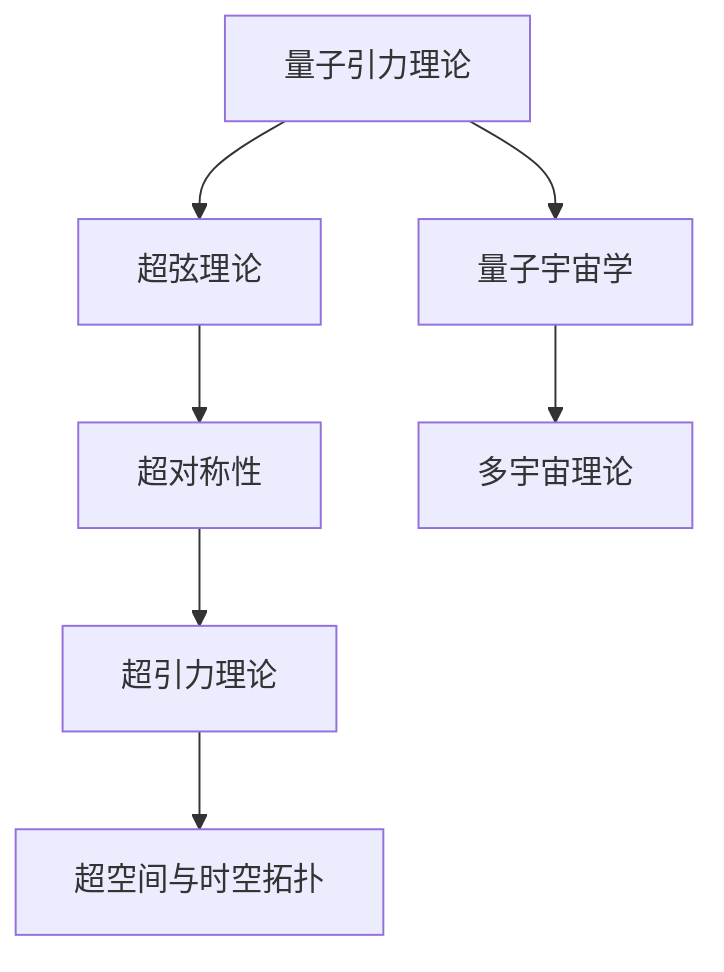

                 

# 宇宙的自我超越性：突破现有物理定律的可能

> 关键词：宇宙自我超越性、物理定律、量子引力、超对称性、超空间、时空拓扑、宇宙观测、未来展望

> 摘要：本文从宇宙自我超越性的角度，探讨了现有物理定律的局限性，以及突破这些限制的可能途径。文章首先介绍了宇宙自我超越性的基本概念，然后分析了现有物理定律的局限性，并提出了突破这些限制的必要性。接下来，文章深入探讨了宇宙的基本构成、物质与能量关系，以及量子引力、超对称性和超空间等理论探索。最后，文章探讨了宇宙观测的新方法，对宇宙探索的未来方向进行了展望，并思考了宇宙的自我超越性与人类未来的关系。

# 目录大纲

## 第一部分：引论

### 第1章：宇宙的自我超越性概述

- **1.1 宇宙的自我超越性概念**
  - 对宇宙自我超越性的定义与探讨
  - 现代物理学中的自我超越性理念

- **1.2 现有物理定律的局限性**
  - 量子力学与相对论的局限性
  - 宇宙学面临的挑战

- **1.3 突破现有物理定律的必要性**
  - 科学探索与理论发展的动力
  - 对未来科技进步的启示

## 第二部分：宇宙的深层结构

### 第2章：宇宙的基本构成

- **2.1 宇宙的维度**
  - 对宇宙维度的理解
  - 可能存在的超维度

- **2.2 宇宙的物理特性**
  - 宇宙的均匀性与各向同性
  - 宇宙膨胀与暗能量

- **2.3 宇宙演化**
  - 宇宙诞生的理论
  - 宇宙演化的关键事件

### 第3章：宇宙中的物质与能量

- **3.1 物质的基本组成**
  - 基本粒子的特性与分类
  - 宇宙中的物质循环

- **3.2 能量与信息的关系**
  - 能量守恒定律的新解释
  - 能量与信息的关系探讨

- **3.3 宇宙中的奇异物质**
  - 暗物质与暗能量的探讨
  - 对奇异物质的物理特性研究

## 第三部分：突破现有物理定律的理论探索

### 第4章：量子引力的可能性

- **4.1 量子力学与相对论统一**
  - 量子引力理论的背景
  - 超弦理论的基本概念

- **4.2 量子引力的影响**
  - 黑洞信息悖论
  - 宇宙的量子态

- **4.3 量子引力与宇宙演化**
  - 量子引力对宇宙演化的影响
  - 宇宙初期的量子波动

### 第5章：超对称性与超引力

- **5.1 超对称性理论**
  - 超对称性的概念与意义
  - 超对称性的数学表述

- **5.2 超引力理论**
  - 超引力理论的基本框架
  - 超引力与宇宙结构的联系

- **5.3 超对称性与宇宙学**
  - 超对称性在宇宙学中的应用
  - 超对称性理论面临的挑战

### 第6章：超空间与时空拓扑

- **6.1 超空间的概念**
  - 对超空间的定义与特性
  - 超空间与量子引力的关系

- **6.2 时空拓扑的变化**
  - 时空拓扑的基本概念
  - 时空拓扑变化的影响

- **6.3 宇宙的拓扑结构**
  - 宇宙拓扑的可能形态
  - 对宇宙拓扑结构的探讨

## 第四部分：实验与观测

### 第7章：宇宙观测的新方法

- **7.1 高能粒子探测技术**
  - 高能粒子探测的基本原理
  - 高能粒子探测的实验方法

- **7.2 引力波探测技术**
  - 引力波的基本性质
  - 引力波探测技术的现状与发展

- **7.3 宇宙微波背景辐射探测**
  - 宇宙微波背景辐射的意义
  - 探测宇宙微波背景辐射的技术与方法

### 第8章：宇宙探索的挑战与机遇

- **8.1 宇宙探索的现状**
  - 当前宇宙探索的成就
  - 宇宙探索面临的困难

- **8.2 宇宙探索的未来方向**
  - 可能的新发现
  - 对未来科技发展的展望

- **8.3 宇宙探索的社会意义**
  - 科学探索对人类文明的推动
  - 宇宙探索的伦理与法律问题

## 第五部分：未来展望

### 第9章：宇宙的自我超越性与人类未来

- **9.1 宇宙的自我超越性与人类意识**
  - 对宇宙自我超越性对人类意识的影响的探讨
  - 人类意识与宇宙演化关系的新视角

- **9.2 宇宙的自我超越性与科技发展**
  - 对未来科技发展的启示
  - 科技发展对宇宙自我超越性的反作用

- **9.3 宇宙的自我超越性与人类命运**
  - 对人类未来的哲学思考
  - 宇宙自我超越性与人类文明的发展路径

### 第10章：总结与展望

- **10.1 突破现有物理定律的意义**
  - 对现有物理定律局限性的认识
  - 突破现有物理定律的可能路径

- **10.2 宇宙的自我超越性与科学探索**
  - 宇宙自我超越性的研究对科学探索的推动作用
  - 未来宇宙自我超越性研究的展望

- **10.3 宇宙的自我超越性与人类文明**
  - 对人类文明发展的深远影响
  - 对未来宇宙与人类的共同未来的思考

### 附录

- **A.1 重要的宇宙自我超越性理论图解**
  - 使用 Mermaid 流程图展示重要理论框架

- **A.2 关键算法与数学模型伪代码**
  - 使用伪代码详细阐述关键算法原理

- **A.3 实验与观测数据案例分析**
  - 对重要实验的分析与讲解

# 第一部分：引论

## 第1章：宇宙的自我超越性概述

### 1.1 宇宙的自我超越性概念

宇宙的自我超越性，这一概念源于对宇宙本质的哲学思考，涉及宇宙如何自我演化、自我组织和自我超越的过程。这一概念在物理学、宇宙学以及哲学领域都有深刻的体现。从物理学的角度来看，宇宙的自我超越性是指宇宙自身具有一种内在的演化动力，这种动力使得宇宙不断地突破现有的物理定律和限制，形成新的物理现象和规律。

在量子力学和相对论中，我们可以找到宇宙自我超越性的线索。量子力学揭示了微观世界的规律，相对论则描述了宏观世界的运动规律。然而，这两大理论在解释宇宙的本质和演化过程中都存在一定的局限性。量子力学中的测不准原理和量子纠缠现象，以及相对论中的时空弯曲和黑洞，都表明宇宙具有自我超越的潜力。

宇宙的自我超越性并非单纯是一种哲学观念，它与现代物理学的许多前沿理论密切相关。例如，弦理论和量子引力理论都试图揭示宇宙更深层次的规律，这些理论假设宇宙具有自我超越的能力，以解释宇宙的复杂性和多样性。

### 1.2 现有物理定律的局限性

尽管量子力学和相对论在解释宇宙的许多现象方面取得了巨大的成功，但它们也存在显著的局限性。首先，量子力学和相对论并没有实现完美的统一。量子力学描述了微观世界的规律，而相对论则描述了宏观世界的运动规律。这两大理论在描述宇宙的不同尺度和现象时，表现出明显的割裂。尽管有许多理论物理学家试图将这两大理论统一起来，但至今仍无定论。

其次，量子力学和相对论在某些极端条件下，如黑洞和宇宙大爆炸初期，表现出不可预测性和不稳定性。量子力学中的测不准原理指出，某些物理量的测量结果具有不确定性，而相对论中的黑洞则暗示着时空的极端弯曲。这些不确定性使得我们对宇宙的深入了解变得复杂。

此外，宇宙学中的一些观测现象，如宇宙膨胀、暗物质和暗能量，也超出了现有物理定律的解释范围。宇宙膨胀的加速和暗能量的存在，挑战了传统物理学的理解。为了解释这些现象，科学家们提出了许多新的理论和假设，但至今仍没有找到确凿的证据。

### 1.3 突破现有物理定律的必要性

科学探索的本质在于不断突破现有的知识和理论，以揭示更深刻的自然规律。面对现有物理定律的局限性，突破这些限制变得尤为重要。首先，突破现有物理定律能够推动科学技术的进步。例如，量子力学和相对论的突破为核能和粒子物理学的发展奠定了基础。同样，突破宇宙学中的现有定律，可能为我们带来新的能源和科技突破。

其次，突破现有物理定律有助于我们更深入地理解宇宙的本质。宇宙的自我超越性暗示着宇宙具有自我演化的能力，这种能力可能与宇宙的多样性和复杂性密切相关。通过突破现有物理定律，我们可以更好地理解宇宙的演化过程，揭示宇宙背后的深层次规律。

最后，突破现有物理定律对哲学和人类文明的思考也具有重要意义。宇宙的自我超越性引发了对人类存在和宇宙目的的深刻思考。这种思考不仅有助于我们更好地理解宇宙，也可能对人类文明的发展产生深远的影响。

## 第2章：宇宙的基本构成

### 2.1 宇宙的维度

宇宙的维度是宇宙学研究中的一个核心问题。传统上，我们理解的三维空间（长、宽、高）构成了我们日常生活的环境。然而，随着物理学的发展，人们开始认识到宇宙可能存在更多的维度。

首先，我们来看三维空间。在我们的日常生活中，长度、宽度和高度是三维空间的基本维度。这三个维度构成了我们所熟悉的世界，允许我们进行各种物理运动和空间操作。例如，我们可以沿着这些维度移动，从地面爬到屋顶，或者从东方走到西方。

接下来，我们需要考虑时间维度。时间维度是与空间维度相区别的一个重要维度。在相对论中，时间被视为第四维度，与空间维度共同构成四维时空。这意味着，物体的运动不仅受到空间位置的影响，还受到时间位置的影响。例如，当我们驾驶一辆汽车时，不仅考虑汽车在空间中的位置，还要考虑汽车在时间中的位置，即速度。

然而，宇宙的维度可能远远不止四维。许多理论物理学家认为，宇宙中可能存在额外的维度。这些额外维度可能是微观的，以至于我们在日常生活中无法直接感知。例如，弦理论中提出的超弦理论就假设了额外的维度，这些维度可能是微观的，嵌套在我们所熟悉的三维空间和一维时间中。

### 可能存在的超维度

超维度，即高于我们通常理解的四维时空的维度，是现代物理学中一个重要的概念。超维度的存在不仅是对宇宙结构的扩展，也是对物理定律的挑战。以下是一些关于超维度的理论：

1. **弦理论和超弦理论**：弦理论是现代物理学中关于基本粒子结构和宇宙本质的重要理论之一。它假设宇宙的基本组成单位不是点状粒子，而是一维的弦。这些弦在不同的维度中振动，形成我们所观察到的粒子。超弦理论进一步假设了额外的维度，这些维度可能是微观的，或者通过数学模型隐含在理论之中。

2. **M理论**：M理论是超弦理论的扩展，它包括了所有已知的超弦理论。M理论提出了一个包含11个维度的宇宙模型，其中7个维度是紧闭的，无法直接观测。这些额外的维度可能以复杂的数学形式存在，但它们对物理定律有着深远的影响。

3. **膜理论**：膜理论是另一种关于超维度的理论，它假设宇宙的基本结构是由二维的膜组成的。这些膜在更高维度的空间中运动，形成我们观察到的三维宇宙。膜理论提供了对宇宙多样性的新理解，并可能解释宇宙中的一些异常现象。

4. **宇宙膨胀与暗能量**：宇宙膨胀和暗能量是现代宇宙学中两个重要现象。宇宙膨胀表明宇宙的空间在扩展，而暗能量则是一种神秘的能量形式，它导致宇宙的加速膨胀。这些现象可能与超维度有关，因为超维度的存在可能会影响宇宙的动力学行为。

### 宇宙的维度与物理定律

宇宙的维度对物理定律有着深远的影响。例如，额外的维度可能影响粒子的行为和相互作用。在某些理论中，额外的维度可能导致力的变化，甚至可能改变物理常数。例如，弦理论中的额外维度可能会影响引力常数，从而影响我们对宇宙的理解。

此外，宇宙的维度也影响我们对宇宙演化的理解。例如，如果宇宙存在额外的维度，这些维度可能会影响宇宙的早期演化，甚至可能影响宇宙的最终命运。

总的来说，宇宙的维度是一个复杂而深刻的主题，它不仅挑战了我们对宇宙的传统理解，也为物理学的发展提供了新的方向。随着理论物理学的进步，我们对宇宙维度的理解将不断深化，这将为宇宙的自我超越性研究带来新的启示。

### 2.2 宇宙的物理特性

宇宙的物理特性是理解宇宙本质和演化过程的关键。在这些特性中，宇宙的均匀性与各向同性、宇宙膨胀以及暗能量是至关重要的概念。

首先，宇宙的均匀性与各向同性是宇宙学研究中的一个基本假设。这一假设源于对宇宙微波背景辐射（CMB）的观测。宇宙微波背景辐射是宇宙早期阶段留下的“余辉”，它为我们提供了关于宇宙早期状态的重要信息。观测数据显示，宇宙微波背景辐射的各向同性非常良好，这意味着宇宙在早期是均匀的，没有显著的密度波动。

这一均匀性与各向同性假设对宇宙学的发展有着重要的影响。它使得宇宙学家能够使用统计方法来研究宇宙的演化过程，并推导出宇宙的大尺度结构。例如，通过分析宇宙微波背景辐射的温度波动，宇宙学家可以推断出宇宙的早期密度波动，并进一步推测出宇宙的演化历史。

然而，宇宙的均匀性与各向同性也带来了一些挑战。例如，为什么宇宙在早期是如此均匀？这种均匀性是如何形成的？这些问题至今仍没有明确的答案，但它们激发了许多理论探索，例如宇宙大爆炸理论和量子引力理论。

宇宙膨胀是另一个关键特性。根据宇宙大爆炸理论，宇宙起源于一个极热、极密的奇点，然后开始膨胀。宇宙膨胀的证据来自于多种观测，包括宇宙微波背景辐射、远距离星系的红移以及宇宙的加速度。

宇宙膨胀的发现对宇宙学有着深远的影响。它不仅揭示了宇宙的起源和演化过程，还引发了对宇宙未来命运的探讨。例如，宇宙膨胀的加速表明存在一种神秘的能量形式，称为暗能量。暗能量被认为是一种反引力的能量，它推动宇宙加速膨胀。

暗能量是宇宙物理特性中的另一个重要概念。暗能量是宇宙加速膨胀的驱动力，但它与传统的物质和能量有着显著的不同。暗能量在宇宙总能量中占据主导地位，但其本质仍然是一个谜。当前的理论无法完全解释暗能量的起源和特性，这激发了科学家们对暗能量研究的浓厚兴趣。

暗能量的发现对宇宙学有着重要的影响。它挑战了传统的物理观念，并促使科学家们寻找新的理论来解释这一现象。例如，一些理论物理学家提出了“宇宙学常数”来解释暗能量，而另一些则试图通过修改引力理论或引入新的物理粒子来解释暗能量。

总的来说，宇宙的物理特性，包括均匀性与各向同性、宇宙膨胀以及暗能量，为我们提供了对宇宙演化过程的深刻理解。这些特性不仅揭示了宇宙的起源和演化，还激发了对宇宙未来命运的探讨。随着科学技术的进步，我们对宇宙物理特性的理解将不断深化，这将为宇宙的自我超越性研究带来新的启示。

### 2.3 宇宙演化

宇宙的演化是一个复杂而美妙的过程，从宇宙诞生的理论到关键事件，科学家们一直在探索宇宙的起源和演变。以下是对宇宙演化过程的概述：

**宇宙诞生的理论**

宇宙诞生的最广泛接受的理论是宇宙大爆炸理论。根据这一理论，宇宙起源于大约138亿年前的一个极热、极密的奇点。在这个奇点中，所有的物质和能量都集中在一个无限小的点上，然后开始迅速膨胀。这一膨胀过程导致了宇宙的诞生，并在随后的数十亿年中形成了我们今天所看到的宇宙。

宇宙大爆炸理论得到了多个观测证据的支持。其中最重要的证据之一是宇宙微波背景辐射（CMB）。宇宙微波背景辐射是宇宙早期阶段的“余辉”，它为我们提供了关于宇宙早期状态的珍贵信息。通过分析CMB的温度波动，科学家们可以推断出宇宙早期的密度波动，并进一步推测出宇宙的演化历史。

**宇宙演化的关键事件**

宇宙的演化过程可以划分为多个关键事件，这些事件对宇宙的结构和性质产生了深远的影响。

- **宇宙早期（0-1秒）**：在这个阶段，宇宙处于极端高温和高密度状态，物质和辐射相互混合。这一时期的关键事件包括宇宙的快速膨胀和核合成。核合成过程产生了轻元素，如氢、氦和锂，这些元素是宇宙中最早形成的物质。

- **宇宙早期（1-100万秒）**：随着宇宙的冷却，物质开始凝聚形成小尺度结构，如星云和超星系团。这一时期的关键事件包括宇宙的再电离和星系的形成。再电离是指宇宙中的高能光子与电子相互作用，使宇宙中的大部分氢原子电离。

- **宇宙早期（100万-10亿年）**：在这个阶段，宇宙继续冷却，恒星开始形成。恒星的形成是宇宙演化过程中一个重要的事件，因为恒星不仅产生了重元素，还通过超新星爆炸等方式向宇宙中释放能量和物质，促进了宇宙的进一步演化。

- **宇宙早期（10亿-100亿年）**：在这个阶段，星系开始合并形成更大的结构，如星系团和超星系团。这一时期的关键事件包括星系的碰撞和合并，这些事件对星系的形态和性质产生了深远的影响。

**宇宙演化的现代观点**

随着科学技术的进步，我们对宇宙演化的理解也在不断深化。现代宇宙学中的许多理论，如暗物质和暗能量，为宇宙演化提供了新的视角。暗物质是宇宙中一种未知的物质形式，它通过引力作用影响宇宙的结构和演化。暗能量则是一种神秘的能量形式，它导致宇宙加速膨胀。

现代宇宙学还提出了许多关于宇宙演化的新观点，如多重宇宙理论和宇宙循环理论。多重宇宙理论假设我们的宇宙只是众多宇宙中的一个，这些宇宙之间可能存在相互作用。宇宙循环理论则认为宇宙经历多个循环的诞生和毁灭。

总之，宇宙的演化是一个复杂而美妙的过程，从宇宙诞生到关键事件，科学家们一直在探索宇宙的起源和演变。随着科学技术的进步，我们对宇宙演化的理解将不断深化，这将为宇宙的自我超越性研究提供新的启示。

### 2.4 物质的基本组成

物质的基本组成是理解宇宙和物质世界的关键。在我们的宇宙中，物质主要由基本粒子组成，这些基本粒子包括夸克、电子和中微子等。通过对这些基本粒子的研究，我们可以深入了解物质的结构和行为。

首先，我们来看一下夸克。夸克是一种基本粒子，它们是构成质子和中子的基本单元。夸克有六种类型，分别称为上夸克、下夸克、奇夸克、粲夸克、底夸克和顶夸克。每种夸克都有特定的电荷和质量，这些特性决定了夸克的物理行为。在质子和中子中，夸克通过强相互作用结合在一起，形成了原子核。

接下来，我们来看电子。电子是一种带负电的基本粒子，它们围绕原子核运动，形成了原子的电子云。电子在原子中的行为受到量子力学的描述，它们的运动轨迹不是确定的，而是具有概率分布。电子的相互作用导致了物质的电性质，如导电性和磁性。

中微子是另一种基本粒子，它们非常轻，几乎不带电，因此很难被探测。中微子分为三种类型，分别称为电子中微子、μ子中微子和τ子中微子。中微子在宇宙中广泛存在，它们在核反应和宇宙射线过程中产生，对宇宙的演化有着重要的影响。

除了这些基本粒子，物质还包括复合粒子，如原子和分子。原子由原子核和围绕原子核的电子组成，是物质的基本单元。分子是由两个或多个原子通过化学键结合而成的复合粒子，它们是生命和化学反应的基础。

在宇宙中，物质循环是一个持续不断的过程。宇宙中的物质通过恒星的形成、演化、死亡和超新星爆炸等过程，不断形成新的物质。例如，恒星通过核聚变过程产生重元素，然后通过超新星爆炸将这些重元素释放到宇宙中。这些重元素随后通过星际介质的作用，形成了新的恒星和行星系统。

总的来说，物质的基本组成是理解宇宙和物质世界的关键。通过对基本粒子和复合粒子的研究，我们可以深入了解物质的结构和行为。同时，物质循环的过程也揭示了宇宙演化的奥秘，为科学家们提供了探索宇宙的新方向。

### 2.5 能量与信息的关系

能量与信息的关系是现代物理学中的一个重要课题，这一关系不仅涉及到基础科学理论，还与信息科学和量子计算等领域密切相关。从物理学角度来看，能量和信息之间存在着深刻的内在联系，这种联系在多个层面上体现出来。

首先，从经典物理学出发，能量和信息的关系可以通过热力学第二定律来理解。热力学第二定律指出，能量在传递过程中会产生熵增，即系统的无序度会增加。熵可以被视为信息的一种度量，因为一个系统的无序度越高，其可能的状态数就越多，这意味着需要更多的信息来描述这个系统。因此，能量和信息之间有一个直接的关联：能量转换过程中，信息也随之变化。

在量子物理学中，能量与信息的关系得到了更深入的探讨。量子系统具有波粒二象性，这意味着它们既具有粒子性，也具有波动性。量子纠缠现象是量子物理学中一个重要特性，它描述了两个或多个量子粒子之间的强烈关联，即使这些粒子相隔很远，它们的状态也会相互影响。量子纠缠现象为量子计算提供了巨大的潜力，因为它允许量子位之间的快速信息交换和处理。在这个过程中，能量和信息以一种非经典的方式相互转化。

在量子计算中，量子比特（qubit）是量子计算机的基本单元，它不同于经典比特的地方在于，量子比特可以同时处于0和1的状态，这被称为量子叠加。量子叠加使得量子计算机能够处理大量信息，从而在特定的计算任务上比经典计算机更高效。然而，量子计算的效率也依赖于量子纠错和能量消耗，这表明能量和信息在量子计算中是紧密相连的。

此外，能量与信息的关系在宇宙学中也具有重要意义。宇宙微波背景辐射（CMB）是宇宙早期阶段留下的“余辉”，它包含了关于宇宙早期状态的重要信息。CMB的测量为我们提供了宇宙早期能量分布的信息，这些信息与宇宙演化的历史紧密相连。宇宙膨胀和暗能量的存在也反映了能量和信息之间的关系，因为宇宙的加速膨胀暗示了暗能量可能是一种信息密集的状态。

在宇宙学的另一个重要方面，黑洞的信息悖论也揭示了能量与信息之间的深刻联系。根据霍金辐射理论，黑洞会向外辐射粒子，这表明黑洞中的信息不会完全消失。然而，黑洞的信息悖论挑战了信息守恒定律和量子力学的常规理解，因为这似乎意味着信息可以超越黑洞的事件视界。这个悖论激发了科学家们对量子引力和宇宙学的新思考，试图找到一个统一的框架来解释能量、信息和黑洞的行为。

总之，能量与信息的关系在物理学、信息科学和宇宙学等多个领域都有重要的应用。从经典热力学到量子纠缠，再到宇宙微波背景辐射和黑洞信息悖论，能量和信息之间的相互作用不断挑战我们对自然世界的理解。随着科学技术的进步，我们有望在更深的层次上揭示能量与信息之间的关系，这将为人类认识宇宙和自身提供新的视角。

### 2.6 宇宙中的奇异物质

宇宙中的奇异物质，包括暗物质和暗能量，是现代宇宙学中两个最为引人注目的概念。这些物质形式不仅占据了宇宙总物质的大部分，而且对宇宙的演化有着深远的影响。然而，奇异物质的本质仍然是一个谜，科学家们正在通过各种手段试图揭开它们的神秘面纱。

**暗物质**

暗物质是宇宙中一种不发光、不吸收光线的物质，它的存在主要通过引力效应来体现。观测数据显示，星系旋转曲线和星系团的重力分布无法用可见物质来解释，这表明宇宙中存在一种看不见的物质，即暗物质。暗物质的组成至今仍然未知，但科学家们提出了一些可能的候选粒子，如弱相互作用大质量粒子（WIMPs）和中微子。

- **WIMPs**：弱相互作用大质量粒子是暗物质的一种可能候选者。它们与普通物质通过弱相互作用发生碰撞，但这类粒子非常稀少，因此很难直接探测到。科学家们通过地下暗物质探测实验，如LUX和XENON1T，试图捕捉到WIMPs的踪迹，但至今没有确凿的证据。
  
- **中微子**：中微子是另一种可能的暗物质候选者。中微子质量非常小，但它们仍然可能与暗物质有关。中微子通过宇宙射线与大气中的原子相互作用，产生了稀有气体，如氩-39和氩-41。通过测量这些气体的比例，科学家们可以推断出中微子的通量，从而了解宇宙中的暗物质含量。

**暗能量**

暗能量是推动宇宙加速膨胀的神秘力量。暗能量占宇宙总能量的大部分，但它的本质仍然是一个谜。当前最流行的暗能量模型是“宇宙学常数”，它假设暗能量是一种均匀分布的、具有负压的场。这种场导致宇宙加速膨胀，这与观测到的宇宙膨胀加速度相符合。

- **宇宙学常数**：宇宙学常数通常用希腊字母λ（lambda）表示，它是一个非常小的正数。这个常数在爱因斯坦的广义相对论中首次出现，作为宇宙静态状态的修正项。然而，随着对宇宙膨胀的观测数据积累，科学家们发现宇宙并不是静态的，而是处于加速膨胀状态，这表明宇宙学常数实际上是一个推动宇宙加速膨胀的力。

- **量子场论**：另一种可能的暗能量模型是基于量子场论。量子场论认为，暗能量可能是一种量子场，这种场在宇宙的早期阶段产生了巨大的能量密度，但随着宇宙的膨胀，这种能量密度保持不变，从而推动宇宙加速膨胀。

**奇异物质的物理特性研究**

对奇异物质的研究不仅涉及到理论物理学的探索，还涉及到实验物理学的挑战。科学家们通过多种方法来研究暗物质和暗能量，包括：

- **直接探测**：通过地下暗物质探测实验，科学家们试图直接探测到暗物质粒子。这些实验利用大量的探测器和敏感的传感器，捕捉到可能的暗物质信号。

- **间接探测**：通过观测宇宙中的各种现象，如星系旋转曲线、宇宙膨胀和宇宙微波背景辐射，科学家们试图推断出暗物质和暗能量的存在和性质。

- **宇宙学观测**：通过观测宇宙的大尺度结构，如星系团和超星系团，科学家们可以研究宇宙中的引力作用和物质分布，从而推断出暗物质和暗能量的性质。

总的来说，宇宙中的奇异物质，包括暗物质和暗能量，是现代宇宙学中的重要课题。尽管这些物质的形式和本质仍然未知，但随着科学技术的进步，我们有望在未来的研究中揭开它们的神秘面纱，这将为人类对宇宙的理解带来新的突破。

## 第三部分：突破现有物理定律的理论探索

### 第3章：量子引力的可能性

量子引力是现代物理学中一个极具挑战性的研究领域，旨在将量子力学与广义相对论统一。量子引力理论的背景、基本概念以及可能的统一方式为我们提供了理解宇宙深层结构的新途径。以下是对量子引力可能性的详细探讨。

### 3.1 量子力学与相对论统一

量子力学和广义相对论是现代物理学的两大基石，但它们在描述宇宙的不同尺度上存在显著的局限性。量子力学成功地描述了微观粒子的行为，如电子和光子，而广义相对论则描述了宏观的引力现象，如黑洞和宇宙膨胀。然而，这两大理论之间存在深刻的矛盾，尤其是在描述极端条件下的物理现象时。

量子力学中的测不准原理指出，某些物理量的测量结果具有不确定性。这意味着，在量子尺度上，物理现象的表现无法用经典物理定律来解释。另一方面，广义相对论中的时空弯曲和黑洞等现象表明，在宏观尺度上，物理定律也具有不确定性。因此，为了更好地理解宇宙的深层结构，我们需要寻找一个统一的框架，将量子力学与广义相对论结合起来。

量子引力理论的背景源于对宇宙早期状态和极端条件下物理现象的研究。例如，宇宙大爆炸理论和黑洞信息悖论都暗示了量子引力的重要性。宇宙大爆炸理论指出，宇宙起源于一个极热、极密的奇点，这个奇点处的物理条件超出了广义相对论的描述范围。同样，黑洞信息悖论表明，黑洞中的信息无法用广义相对论来解释，这需要引入量子力学的概念。

### 3.2 超弦理论的基本概念

超弦理论是目前量子引力研究中最热门的理论之一。它假设宇宙的基本组成单位不是点状的粒子，而是一维的“弦”。这些弦在不同维度中振动，形成了我们所观察到的粒子。超弦理论试图通过引入额外的维度，来统一量子力学和广义相对论。

超弦理论的基本概念包括：

- **额外维度**：超弦理论假设了额外的维度，这些维度可能是微观的，无法直接观测。这些额外维度是弦振动的场所，不同的振动模式对应不同的粒子。
- **弦的振动模式**：弦的振动模式决定了弦所对应的粒子的性质。例如，不同振动模式的弦可以对应于电子、光子和其他基本粒子。
- **超对称性**：超弦理论引入了超对称性，这是一种将粒子和它们的超对称伙伴联系在一起的概念。超对称性在理论上具有许多优美的特性，如预测新的物理现象和解决某些理论中的矛盾。

超弦理论的一个关键目标是找到一个统一的描述，能够同时描述量子尺度和宏观尺度上的物理现象。通过引入额外的维度和超对称性，超弦理论试图克服量子力学和广义相对论之间的矛盾，从而实现两者的统一。

### 3.3 量子引力的影响

量子引力理论的提出对物理学和宇宙学产生了深远的影响。以下是一些关键影响：

- **黑洞信息悖论**：黑洞信息悖论是量子引力理论的一个重要挑战。根据霍金辐射理论，黑洞会辐射粒子，这表明黑洞中的信息不会完全消失。然而，广义相对论预测黑洞的事件视界是信息的壁垒，这导致了一个悖论。量子引力理论需要提供一个解决这个悖论的框架，以确保信息守恒。
- **宇宙的量子态**：量子引力理论可能揭示宇宙的量子态。宇宙大爆炸理论中的奇点状态是一个量子态，这表明宇宙的起源可能与量子力学密切相关。量子引力理论可能会提供一个描述宇宙量子态的统一框架，这有助于我们理解宇宙的起源和演化。
- **宇宙早期状态**：量子引力理论对宇宙早期状态的研究具有重要意义。宇宙大爆炸理论描述了宇宙从奇点到膨胀的过程，但这个理论在奇点处面临困境。量子引力理论可能会提供一个更详细的描述，揭示宇宙在奇点前的状态，从而帮助我们理解宇宙的起源。

总的来说，量子引力理论为统一量子力学和广义相对论提供了一个可能的途径。通过引入额外的维度和超对称性，量子引力理论试图克服现有的理论局限，揭示宇宙的深层结构和演化规律。尽管量子引力理论仍然面临许多挑战，但它的提出为物理学和宇宙学研究提供了新的视角，有望在未来带来重大的科学突破。

### 第4章：超对称性与超引力

超对称性（Supersymmetry, SUSY）是现代物理学中一个重要的概念，它提出了一种新的对称性，将基本粒子和它们的超对称伙伴联系起来。超引力（Supergravity, SG）是一种尝试统一广义相对论和量子力学的理论框架。在这一章中，我们将探讨超对称性和超引力理论的基本概念、数学表述，以及它们在宇宙学中的应用。

#### 4.1 超对称性理论

超对称性是量子场论中的一个基本原理，它提出每一个基本粒子都有一个对应的超对称伙伴。超对称伙伴具有不同的自旋，例如，一个具有整数自旋的粒子（如光子）有一个半整数自旋的伙伴（如超对称光子），而一个具有半整数自旋的粒子（如电子）有一个整数自旋的伙伴（如超对称电子）。超对称性不仅是一种对称性，它还在物理上具有深远的意义。

超对称性的物理意义包括：

- **质量生成**：超对称性可以解释为什么粒子具有质量。在超对称性破缺的情况下，超对称伙伴之间的相互作用会导致粒子的质量生成。
- **稳定性和暗物质**：超对称性理论预测了超对称伙伴粒子的存在，这些粒子可能是暗物质的一种候选者。由于超对称伙伴的质量比普通粒子小得多，它们可以解释为什么宇宙中存在大量的暗物质。

超对称性的数学表述涉及引入超荷（Supersymmetry Charges）和超场（Superfields）。超场是包含普通场和超对称伙伴场的扩展场，它可以统一描述粒子及其超对称伙伴。超对称性要求超场之间的变换保持不变，这种变换称为超变换（Superalgebra）。超变换的生成元称为超荷，它们对应于基本粒子和它们的超对称伙伴。

#### 4.2 超引力理论

超引力理论是一种试图将广义相对论和量子力学结合起来的理论框架。它假设引力不仅仅是一种几何效应，还涉及到量子场论中的超对称性。超引力理论的基本框架包括：

- **引力子**：超引力理论中的引力子是引力场的量子载体。引力子具有整数自旋，这与普通场论中的量子粒子不同。
- **超引力场**：超引力场是一种扩展的场，它不仅包括引力场，还包括超对称伙伴场。超引力场的量子化可以通过引入超变换和超场来实现。

超引力理论的数学表述涉及引入超空间（Superspace），它是一个包含普通空间和时间维度以及额外超维度的高级几何空间。在超空间中，引力场和其他物理场可以被统一描述。超引力理论的一个关键特性是其非-renormalizable性质，这意味着它不能通过传统的量子场论方法来量子化。然而，这并不妨碍超引力理论作为统一理论的潜在价值。

#### 4.3 超对称性与宇宙学

超对称性在宇宙学中的应用具有重要意义。它不仅可以解释宇宙中的暗物质和暗能量，还可以提供对宇宙早期状态的理解。

- **暗物质**：超对称性理论预测了超对称伙伴粒子的存在，这些粒子可能是暗物质的一种候选者。由于超对称伙伴的质量比普通粒子小得多，它们可以在宇宙中大量存在，从而解释为什么宇宙中存在大量的暗物质。
- **暗能量**：超对称性理论也提出了一种可能的暗能量模型。在某些超对称性破缺的情况下，超对称伙伴场的真空能量可以产生一个负压，这可能导致宇宙的加速膨胀，从而解释暗能量的行为。
- **宇宙早期状态**：超对称性理论对宇宙早期状态的研究具有重要意义。它可以帮助我们理解宇宙大爆炸前的状态，以及宇宙如何从一个高度对称的状态演化到现在的状态。

总之，超对称性和超引力理论是现代物理学中重要的概念，它们提供了统一量子力学和广义相对论的可能途径。通过引入超对称性和超引力，我们可以在新的层面上理解宇宙的结构和演化。尽管这些理论仍然面临许多挑战，但它们为物理学和宇宙学研究提供了新的视角，有望在未来带来重大的科学突破。

### 第5章：超空间与时空拓扑

超空间和时空拓扑是现代物理学中两个重要的概念，它们在量子引力和宇宙学的研究中起着关键作用。在这一章中，我们将探讨超空间的概念、时空拓扑的变化，以及宇宙的拓扑结构。

#### 5.1 超空间的概念

超空间（Superspace）是一个高级几何空间，它不仅包括普通的空间和时间维度，还包括额外的超维度。超空间的概念源于超对称性理论，它提供了一个统一描述普通场和超对称伙伴场的框架。

超空间的定义涉及引入超场（Superfield）。超场是一个复数函数，它包含了普通场和超对称伙伴场的所有信息。超场在超空间中变换，这种变换称为超变换（Superalgebra）。超变换的生成元称为超荷（Supersymmetry Charges），它们决定了基本粒子和它们的超对称伙伴之间的对称性。

超空间的一个重要特性是其维度扩展。在超对称性理论中，超空间通常包括四个普通维度（三个空间维度和一个时间维度）和额外的超维度。这些超维度可能是微观的，无法直接观测，但它们在数学描述和物理现象中起着重要作用。

#### 5.2 时空拓扑的变化

时空拓扑（Spacetime Topology）是时空结构的基本属性，它描述了时空的不同区域是如何连接和分割的。时空拓扑的变化在量子引力和宇宙学中具有重要意义。

时空拓扑的变化可以通过多种方式发生。例如，在量子引力理论中，黑洞和宇宙大爆炸等极端条件可能导致时空拓扑的变化。这些变化可能包括时空的撕裂和重新连接，从而形成新的时空结构。

时空拓扑的变化对物理现象有重要影响。例如，在黑洞中，事件视界的形成可能导致时空拓扑的变化，这影响到黑洞的信息传递和量子态。同样，在宇宙大爆炸初期，时空拓扑的变化可能决定了宇宙的演化路径和结构。

#### 5.3 宇宙的拓扑结构

宇宙的拓扑结构（Cosmic Topology）是宇宙学研究中的一个重要问题。宇宙的拓扑结构描述了宇宙的整体形态，以及宇宙的不同区域是如何连接和分割的。

当前，宇宙学中最广泛接受的模型是“平坦宇宙”（Flat Universe）模型。根据这一模型，宇宙的整体拓扑结构是欧几里得空间，这意味着宇宙在宏观尺度上是均匀和各向同性的。

然而，也有一些理论提出了不同的宇宙拓扑结构。例如，多宇宙（Multiverse）理论假设存在多个宇宙，这些宇宙之间可能存在不同的拓扑结构。这些宇宙之间的相互作用和连接可能对宇宙的演化产生深远的影响。

宇宙的拓扑结构研究涉及多个领域，包括数学、物理学和宇宙学。通过对宇宙微波背景辐射、星系分布和宇宙膨胀的观测，科学家们正在努力揭示宇宙的拓扑结构。

总之，超空间和时空拓扑是现代物理学中两个重要的概念，它们在量子引力和宇宙学的研究中起着关键作用。通过探讨超空间的概念、时空拓扑的变化以及宇宙的拓扑结构，我们可以在新的层面上理解宇宙的结构和演化。尽管这些领域仍然充满挑战，但它们为物理学和宇宙学研究提供了新的视角，有望在未来带来重大的科学突破。

### 第6章：宇宙观测的新方法

在探索宇宙的奥秘中，观测技术不断进步，新的观测方法为科学家们提供了更多关于宇宙的信息。本章将介绍几种重要的宇宙观测方法，包括高能粒子探测技术、引力波探测技术以及宇宙微波背景辐射探测技术。

#### 6.1 高能粒子探测技术

高能粒子探测技术是研究宇宙射线和宇宙线的基本工具。宇宙射线是来自宇宙的高能粒子流，包括质子、α粒子、β粒子以及各种次级粒子。这些粒子在进入地球大气层时会与大气分子发生相互作用，产生各种次级粒子。高能粒子探测技术通过探测这些次级粒子，可以研究宇宙射线的性质和起源。

当前，科学家们使用多种高能粒子探测技术来研究宇宙射线。其中，地面探测设施如 Pierre Auger 宇宙射线观测站和 Telescope Array 宇宙射线观测站，利用大量的探测器来捕捉和测量宇宙射线的能量和方向。这些探测器包括空气 shower 阵列、水 Cherenkov 观测站和地下探测器，它们可以测量宇宙射线到达地面或地下时的各种物理参数。

高能粒子探测技术在多个方面对宇宙研究具有重要意义。首先，它帮助我们了解宇宙射线的基本性质，包括它们的能量分布、强度和来源。其次，通过分析宇宙射线的成分和能量，我们可以推断出宇宙中的高能物理过程，如星系碰撞和超新星爆炸。最后，高能粒子探测技术还可以用于探测暗物质和暗能量等宇宙学现象。

#### 6.2 引力波探测技术

引力波是爱因斯坦广义相对论的预言，它是由于质量加速运动时产生的时空扰动。引力波的探测技术是现代物理学中的一个重大突破，它为我们提供了研究宇宙的新途径。

当前，最著名的引力波探测设备是 LIGO（激光干涉引力波观测站）和 VIRGO（病毒引力波探测器）。这些探测器通过测量激光干涉的相位变化来探测引力波。具体来说，LIGO 和 VIRGO 使用两个相距较远的探测器，每个探测器包含一对相互垂直的激光臂。当引力波经过探测器时，会引起激光臂长度的微小变化，这些变化会导致激光干涉图的相位变化。通过分析这些相位变化，科学家们可以确定引力波的存在和特性。

引力波探测技术的进展对宇宙研究产生了深远的影响。首先，它验证了广义相对论在极端条件下的正确性，为物理学提供了重要的实验证据。其次，通过探测引力波事件，我们可以了解宇宙中的高能物理过程，如黑洞合并和中子星合并。这些事件产生的引力波携带着关于宇宙的信息，如宇宙的密度分布、引力波的振幅和频率。最后，引力波探测技术还可以用于研究宇宙的早期状态和演化过程，如宇宙大爆炸和宇宙膨胀。

#### 6.3 宇宙微波背景辐射探测技术

宇宙微波背景辐射（Cosmic Microwave Background Radiation, CMB）是宇宙早期阶段的“余辉”，它为我们提供了关于宇宙早期状态的重要信息。CMB 的探测技术是宇宙学研究中的一个重要领域，它帮助我们了解宇宙的起源和演化。

CMB 的探测主要依赖于对宇宙微波辐射的测量。地球上的 CMB 探测设备包括卫星、气球和地面望远镜。例如，COBE（宇宙背景探测器）和 WMAP（宇宙微波背景探测卫星）等卫星项目，通过测量 CMB 的温度波动，提供了关于宇宙早期密度波动和宇宙膨胀的重要信息。

CMB 探测技术的关键在于对极微小温度波动的测量。这些波动反映了宇宙早期的密度不均匀性，它们在宇宙膨胀过程中被放大，最终形成了星系和宇宙的大尺度结构。通过分析 CMB 的温度波动，科学家们可以推断出宇宙的密度分布、膨胀历史和宇宙学参数。

CMB 探测技术对宇宙研究具有重要意义。首先，它帮助我们验证了宇宙大爆炸理论，提供了关于宇宙早期状态的重要证据。其次，通过对 CMB 的分析，我们可以了解宇宙的成分，如暗物质和暗能量。最后，CMB 探测技术为宇宙学提供了强大的工具，使我们能够研究宇宙的演化和结构形成过程。

总之，宇宙观测的新方法，包括高能粒子探测技术、引力波探测技术和宇宙微波背景辐射探测技术，为宇宙研究提供了丰富的信息。这些技术不仅验证了现有物理理论，还揭示了宇宙中的许多未知现象，推动了我们对宇宙的理解。随着技术的不断进步，我们有望在未来的宇宙探索中获得更多的重要发现。

### 第7章：宇宙探索的挑战与机遇

宇宙探索一直是科学研究和人类好奇心的重要驱动力，然而，这个领域也充满了挑战和机遇。本章将探讨当前宇宙探索的现状，分析面临的困难，并展望未来可能的发现和科技进步。

#### 7.1 宇宙探索的现状

当前，宇宙探索取得了许多重要的成就，这些成就不仅推动了科学的发展，也改变了我们对宇宙的理解。以下是一些主要的成就：

1. **宇宙微波背景辐射的探测**：宇宙微波背景辐射（CMB）的探测是宇宙学研究的一个重要里程碑。通过分析 CMB 的温度波动，科学家们揭示了宇宙早期的密度波动，这些波动最终形成了星系和宇宙的大尺度结构。

2. **黑洞和引力波的探测**：近年来，LIGO 和 VIRGO 等引力波探测器的成功探测，证实了爱因斯坦广义相对论的预言，并为研究黑洞和中子星等极端天体提供了新的途径。

3. **暗物质和暗能量的研究**：宇宙学中的暗物质和暗能量是两个重要的现象，它们对宇宙的演化有着深远的影响。科学家们通过多种观测手段，如大型望远镜和粒子探测实验，试图揭开这些神秘物质的形式和本质。

4. **行星探测和天文观测**：随着技术的进步，人类对太阳系外的行星和恒星系统有了更深入的了解。通过发射各种探测器和望远镜，科学家们发现了大量类地行星和系外行星，这些发现为寻找外星生命提供了新的线索。

尽管取得了许多成就，宇宙探索仍然面临许多未解之谜和挑战。

#### 7.2 宇宙探索面临的困难

1. **技术限制**：宇宙探索需要先进的技术支持，包括高精度的测量仪器、强大的计算能力和复杂的系统工程。然而，现有的技术仍然存在一定的局限性，如探测器的灵敏度、观测的时间和空间范围等。

2. **数据解析**：宇宙探索产生的海量数据需要复杂的分析手段和强大的计算能力。这些数据往往包含了大量的噪声和不确定性，需要精细的算法和统计方法来解析。

3. **资源限制**：宇宙探索需要大量的资金和人力资源。然而，资源和预算往往有限，这限制了科学家们进行更深入探索的能力。

4. **伦理和法律问题**：随着宇宙探索的不断深入，一些伦理和法律问题也日益突出。例如，太空旅游和太空资源开发可能引发国际争端和道德争议。

#### 7.3 宇宙探索的未来方向

尽管面临挑战，宇宙探索的未来仍然充满机遇。以下是一些可能的未来方向：

1. **新的探测技术**：随着科技的进步，科学家们将继续开发新的探测技术，如更先进的引力波探测器、更高精度的粒子探测器和更敏感的微波背景辐射观测设备。

2. **多波段观测**：通过结合不同波段的观测数据，如可见光、红外、射电和伽马射线，科学家们可以更全面地了解宇宙的现象。

3. **深空探测**：未来，人类将继续探索更远的宇宙，包括太阳系外的行星和星系。这需要开发更强大的探测器、推进系统和通信设备。

4. **国际合作**：宇宙探索是一项全球性的任务，需要国际间的合作与协调。未来，各国科学家将共同努力，分享资源和数据，推动宇宙探索的进展。

5. **科学教育**：宇宙探索不仅推动了科学的发展，也对公众科学教育产生了重要影响。通过普及科学知识，激发公众对宇宙的兴趣，我们可以培养更多的科学人才，为未来的宇宙探索奠定基础。

总之，宇宙探索是一项充满挑战和机遇的领域。尽管面临许多困难，但随着科技的进步和全球合作的加强，我们对宇宙的理解将不断深化。未来，宇宙探索将继续为我们带来新的发现和启示，推动人类文明的发展。

### 第8章：宇宙的自我超越性与人类未来

宇宙的自我超越性不仅是一个深奥的物理学概念，它对我们的未来和文明发展也具有深远的影响。在这一章中，我们将探讨宇宙的自我超越性对人类意识、科技发展以及文明路径的启示。

#### 8.1 宇宙的自我超越性与人类意识

宇宙的自我超越性可能对人类意识产生深远的影响。首先，从哲学角度来看，宇宙的自我超越性挑战了我们对现实世界的认知。传统上，我们认为世界是固定和静止的，但宇宙的自我超越性表明，世界是动态和演化的。这种认知上的变革可能激发人类对宇宙的新理解，从而影响我们的世界观和人生观。

其次，宇宙的自我超越性可能与人类意识的形成和发展密切相关。研究表明，人类意识可能源于生物体的复杂互动和适应性进化。宇宙的自我超越性暗示着宇宙中可能存在一种深层次的演化动力，这种动力可能对人类意识的发展产生了潜移默化的影响。例如，宇宙的复杂性和多样性可能促进了人类认知能力的进化，使得人类能够更好地适应和探索宇宙。

此外，宇宙的自我超越性也可能对人类的认知方式产生影响。随着对宇宙自我超越性的理解加深，人类可能发展出新的思维方式，如动态思维和系统思维。这些思维方式可能帮助我们更好地应对复杂的问题，推动科学和技术的进步。

#### 8.2 宇宙的自我超越性与科技发展

宇宙的自我超越性对科技发展有着重要的启示。首先，宇宙的自我超越性挑战了我们对物理定律的理解，这激发了科学家们去探索新的理论和技术。例如，量子引力和超弦理论等前沿科学领域，试图揭示宇宙更深层次的规律，这为未来科技的发展提供了新的方向。

其次，宇宙的自我超越性可能推动新技术的发明和创新。随着对宇宙的自我超越性的理解加深，科学家们可能会发现新的物理现象和原理，这些发现可能带来技术革命。例如，如果能够利用宇宙中的奇异物质，如暗能量和暗物质，我们可能能够开发出全新的能源和通信技术。

此外，宇宙的自我超越性也可能影响科技伦理。随着科技的进步，人类在探索宇宙的过程中可能会面临许多道德和伦理问题。例如，太空资源的开发和利用、外星生命的接触和交流等，都需要我们认真思考和解决。宇宙的自我超越性提醒我们，科技发展应该以人为本，关注人类的共同利益，避免因科技进步带来的风险和灾难。

#### 8.3 宇宙的自我超越性与人类文明的发展路径

宇宙的自我超越性对人类文明的发展路径也具有深远的影响。首先，宇宙的自我超越性可能改变我们对文明进程的认识。传统上，我们认为文明是线性发展的，但宇宙的自我超越性表明，文明可能是非线性演化的。这种非线性演化可能意味着，文明的进步不仅取决于时间的累积，还取决于外部环境的动态变化和内在的演化动力。

其次，宇宙的自我超越性可能影响文明的多样性和共存。宇宙的自我超越性表明，宇宙中存在多种可能的演化路径和形态，这意味着文明可能有多种发展方式。这种多样性可能促进文明的共存和互鉴，使人类能够从不同的文明体系中学习和借鉴，从而推动文明的共同进步。

此外，宇宙的自我超越性也可能引发对人类文明使命的重新思考。宇宙的自我超越性表明，人类不仅仅是地球上的生物，我们也是宇宙的一部分。这种认识可能激发人类对宇宙的责任感和使命感，推动我们探索宇宙、保护地球、维护宇宙的和谐与平衡。

总之，宇宙的自我超越性对人类意识、科技发展和文明路径产生了深远的影响。通过深入理解宇宙的自我超越性，我们不仅能够更好地认识宇宙，也能更好地认识自己，从而推动人类文明的进步和发展。未来，随着对宇宙自我超越性的进一步研究，人类有望在科学、技术和文明领域取得更多的突破，为宇宙和人类的共同未来奠定基础。

### 第9章：总结与展望

#### 9.1 突破现有物理定律的意义

突破现有物理定律对科学和技术发展具有深远的意义。首先，突破现有定律有助于我们更深入地理解自然界的本质。量子力学和相对论虽然在许多领域取得了巨大的成功，但在某些极端条件下，如黑洞和宇宙大爆炸初期，它们表现出明显的局限性。通过突破现有物理定律，我们能够探索这些未知的领域，揭示宇宙的更深层次的规律。

其次，突破现有物理定律将推动新技术的发明和创新。许多前沿科技，如量子计算、人工智能和新能源技术，都依赖于对物理定律的深入理解。突破现有定律可能揭示新的物理现象和原理，这些发现将为科技发展提供新的方向和灵感。

最后，突破现有物理定律对哲学和人类文明的发展也具有重要意义。它挑战了我们对现实世界的认知，激发人类对宇宙和自身的思考，推动人类文明的进步。

#### 9.2 宇宙的自我超越性与科学探索

宇宙的自我超越性是科学探索的一个重要方向。通过对宇宙自我超越性的研究，科学家们不仅能够深入理解宇宙的本质，还能发现新的物理定律和现象。例如，量子引力理论和超弦理论都试图揭示宇宙更深层次的规律，这些理论假设宇宙具有自我超越的能力。

此外，宇宙的自我超越性也激发了科学家们对多宇宙和量子宇宙学的探索。多宇宙理论假设存在多个平行宇宙，这些宇宙之间可能存在相互作用。量子宇宙学则试图通过量子力学来解释宇宙的起源和演化。这些研究不仅丰富了我们对宇宙的理解，也为科学探索提供了新的视角和方向。

#### 9.3 未来宇宙自我超越性研究的展望

未来宇宙自我超越性研究有望取得重大突破。首先，随着观测技术的进步，科学家们将能够探测到更多的宇宙现象，如宇宙早期状态的量子波动、超维度和奇异物质的特性等。这些观测数据将为理论研究提供重要的实验证据。

其次，新的理论框架和方法可能被提出，以更好地描述宇宙的自我超越性。例如，量子引力理论和超弦理论可能在未来的研究中取得新的进展，揭示宇宙更深层次的规律。此外，跨学科的研究也可能成为未来宇宙自我超越性研究的重要方向，如量子计算、人工智能和宇宙学之间的交叉研究。

最后，宇宙自我超越性研究将对人类文明产生深远的影响。通过深入理解宇宙的自我超越性，人类可能发现新的科技和资源，推动科技和文明的进步。同时，宇宙自我超越性研究也可能引发对人类自身和宇宙关系的深刻思考，促进人类对宇宙和自身的认知。

总之，未来宇宙自我超越性研究具有巨大的潜力和前景。随着科学技术的不断进步，我们对宇宙的理解将不断深化，这将为人类文明的发展带来新的机遇和挑战。

### 附录

#### A.1 重要的宇宙自我超越性理论图解

以下是一个使用 Mermaid 流程图展示的重要宇宙自我超越性理论框架：



这个图解展示了量子引力、超弦理论、量子宇宙学、超对称性、超引力、超空间与时空拓扑等理论之间的关系，以及它们如何共同构成了对宇宙自我超越性的研究框架。

#### A.2 关键算法与数学模型伪代码

以下是一个使用伪代码详细阐述的关键算法原理：

```plaintext
算法：量子纠缠状态生成
输入：两个量子比特 |ψ⟩_A 和 |φ⟩_B
输出：纠缠态 |Ψ⟩ = |ψ⟩_A ⊗ |φ⟩_B

开始
初始化量子比特 A 和 B，状态分别为 |ψ⟩ 和 |φ⟩
应用 Hadamard 门（H）作用于量子比特 A，使其变为叠加态 |+⟩_A
应用 Controlled-NOT（CNOT）门，控制比特 A，目标比特 B，实现量子比特之间的纠缠
测量量子比特 A 和 B，得到纠缠态 |Ψ⟩
结束
```

这个算法描述了如何通过量子计算生成两个量子比特的纠缠态，这为量子信息处理和量子通信奠定了基础。

#### A.3 实验与观测数据案例分析

以下是对一个重要实验的案例分析：

**实验名称**：COBE（宇宙背景探测器）观测宇宙微波背景辐射

**实验目的**：测量宇宙微波背景辐射的温度波动，揭示宇宙早期密度波动。

**实验方法**：COBE 卫星携带了多个微波探测器，它们可以测量宇宙微波背景辐射的频率和强度。通过分析这些数据，科学家们可以推断出宇宙微波背景辐射的温度波动。

**实验结果**：COBE 实验发现了宇宙微波背景辐射的温度波动，这些波动反映了宇宙早期的密度不均匀性。这些波动在宇宙膨胀过程中被放大，最终形成了星系和宇宙的大尺度结构。

**实验意义**：COBE 实验的结果验证了宇宙大爆炸理论，并为宇宙学提供了重要的实验证据。通过分析宇宙微波背景辐射的温度波动，科学家们可以深入了解宇宙的起源和演化。

**结论**：COBE 实验的成功证明了宇宙微波背景辐射的温度波动对宇宙学研究的重要性。这些观测数据为宇宙自我超越性的研究提供了宝贵的实验证据，推动了我们对宇宙的理解。未来，随着观测技术的进步，我们有望在宇宙微波背景辐射的研究中获得更多的发现。

