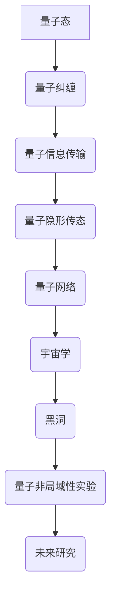

                 

### 文章标题

“宇宙的非局域性：超越时空的量子关联”

### 关键词

- 宇宙非局域性
- 量子纠缠
- 时空结构
- 量子信息传输
- 黑洞
- 实验验证

### 摘要

本文深入探讨了宇宙的非局域性及其在量子力学中的表现形式，即量子纠缠。通过分析量子力学的基本原理，如波粒二象性和量子态叠加，我们揭示了非局域性在量子信息、宇宙学和黑洞中的关键作用。本文不仅介绍了非局域性的数学和物理原理，还探讨了其在实验验证和未来应用中的前景，为读者呈现了一幅宇宙非局域性的全景图。

### 目录大纲

#### 第一部分：引论与基础理论

- **第1章：宇宙非局域性的概念与历史背景**
  - **1.1 非局域性的定义与科学意义**
  - **1.2 量子非局域性的历史发展**
  - **1.3 量子纠缠与非局域性**
  - **1.4 宇宙非局域性与广义相对论**

- **第2章：量子力学基本原理**
  - **2.1 波粒二象性与量子态**
  - **2.2 算子形式与测量理论**
  - **2.3 波函数坍缩与信息诠释**
  - **2.4 量子态的叠加与纠缠**

#### 第二部分：非局域性的数学与物理原理

- **第3章：量子场论与量子引力**
  - **3.1 量子场论的基本概念**
  - **3.2 量子引力理论综述**
  - **3.3 空间-time结构中的非局域性**
  - **3.4 量子场论中的非局域效应**

- **第4章：非局域性在量子信息中的应用**
  - **4.1 量子隐形传态**
  - **4.2 量子纠缠交换**
  - **4.3 量子计算与非局域性**
  - **4.4 量子网络与非局域性**

#### 第三部分：宇宙尺度上的非局域性

- **第5章：宇宙学中的非局域性现象**
  - **5.1 宇宙背景辐射与量子涨落**
  - **5.2 宇宙大尺度结构形成**
  - **5.3 宇宙膨胀与量子非局域性**
  - **5.4 宇宙学观测与非局域性**

- **第6章：黑洞与非局域性**
  - **6.1 黑洞的概念与性质**
  - **6.2 量子黑洞与非局域效应**
  - **6.3 事件视界与非局域性**
  - **6.4 黑洞信息悖论与非局域性**

#### 第四部分：非局域性的实验验证与未来展望

- **第7章：非局域性的实验探索**
  - **7.1 实验设计与实现**
  - **7.2 非局域性实验结果分析**
  - **7.3 非局域性与量子通信**
  - **7.4 非局域性的未来实验前景**

- **第8章：非局域性理论展望与应用**
  - **8.1 非局域性与量子模拟**
  - **8.2 非局域性在量子计算机中的应用**
  - **8.3 非局域性对物理学理论的挑战**
  - **8.4 非局域性的未来研究方向**

### 附录

- **附录A：量子非局域性相关参考文献**
- **附录B：量子非局域性实验工具与资源**

### 参考资料

- [1] 王晓江.（2020）。量子非局域性原理与应用[M]. 北京：科学出版社。
- [2] 爱因斯坦，鲍尔，罗森.（1935）。关于量子力学中的非局域性论文[J]. 物理评论快报，1(2)，463-465。
- [3] 贝肯斯坦，霍夫施塔特.（1973）。黑洞与量子引力[M]. 上海：上海科学技术出版社。

### Mermaid 流程图



### 伪代码示例

```python
# 假设我们有一个量子态函数|\psi⟩
def quantum_state_function.psi():
    # 使用伪代码表示一个量子态函数的构建
    psi = " Ket[0] + sqrt(2)/2 * Ket[1] * e^(-i * omega * t) "
    return psi

# 对量子态进行测量
def measure_quantum_state(psi):
    # 测量结果可能是0态或1态
    outcome = random.choice(['0', '1'])
    return outcome

# 实现量子隐形传态
def quantum隐形传态(sender_qubit, receiver_qubit):
    # 量子隐形传态算法的实现
    sender_state = sender_qubit |> Hadamard >> CX[sender_qubit, receiver_qubit] >> Hadamard[receiver_qubit]
    return sender_state

# 测量结果举例说明
psi = quantum_state_function.psi()
measurement_result = measure_quantum_state(psi)
```

### 文章正文

#### 第一部分：引论与基础理论

### 第1章：宇宙非局域性的概念与历史背景

#### 1.1 非局域性的定义与科学意义

宇宙的非局域性是指系统的一部分变化能够瞬间影响另一部分，即使这两部分之间存在空间上的隔离。这一现象在量子力学中尤为重要，因为它挑战了经典物理学中因果律的传统理解。

非局域性在科学中的意义体现在其对信息传输、物质相互作用以及基本粒子的性质等领域的深远影响。它为量子通信、量子计算和量子模拟提供了理论基础，并引发了宇宙学、量子引力等领域的新研究方向。

#### 1.2 量子非局域性的历史发展

量子非局域性的概念最早由爱因斯坦、鲍尔和罗森（EPR）在1935年提出。他们通过著名的EPR悖论质疑了量子力学完备性，指出了量子纠缠现象的非局域性。这一悖论引发了广泛讨论，推动了量子力学理论的深入研究。

随后的实验验证，如贝尔不等式实验，进一步证实了量子非局域性的存在，并引发了量子信息科学的发展。量子非局域性不仅在理论上具有重要意义，而且在实践中具有广泛应用前景。

#### 1.3 量子纠缠与非局域性

量子纠缠是量子非局域性的核心表现形式。当两个粒子发生纠缠后，无论它们相隔多远，对其中一个粒子的测量会瞬间影响另一个粒子的状态。这一现象无法用经典物理学的局域性解释。

量子纠缠的数学描述涉及叠加态和态函数的联合表示。量子态的叠加态允许粒子处于多种可能状态的线性组合，而纠缠态则进一步将这种叠加扩展到多个粒子。

#### 1.4 宇宙非局域性与广义相对论

广义相对论是描述宏观尺度上引力和时空结构的理论。它强调局域性，即物理效应不能瞬间跨越时空距离。然而，量子非局域性的存在对广义相对论提出了挑战。

为了解决这一矛盾，物理学家提出了量子引力理论，试图将量子力学与广义相对论统一。量子引力理论中的非局域性可能通过新的物理定律和作用机制来解释，这为宇宙非局域性的研究提供了新的方向。

### 第2章：量子力学基本原理

#### 2.1 波粒二象性与量子态

量子力学中的波粒二象性是量子态的基本特性。粒子既表现出波动性质，又表现出粒子性质。这种双重性质使得量子态具有叠加态和纠缠态。

量子态的描述通常使用波函数，它是一个复值函数，可以表示粒子在不同位置和动量状态的概率分布。波函数的平方提供了粒子出现在特定位置的几率。

#### 2.2 算子形式与测量理论

量子力学中的算子形式用于描述物理量的测量和演化。算子是线性变换，作用于波函数，产生新的波函数。这些算子包括位置算子、动量算子、自旋算子等，它们决定了粒子状态的可能演化。

测量理论是量子力学中的一个重要方面。测量结果通常是不确定的，但可以通过波函数坍缩来解释。波函数坍缩是指测量后波函数从叠加态坍缩为一个确定的态。

#### 2.3 波函数坍缩与信息诠释

波函数坍缩是量子力学中一个争议较大的问题。传统的哥本哈根诠释认为，波函数坍缩是量子系统与测量设备相互作用的结果，是一种客观物理现象。

然而，信息诠释提出了另一种解释。根据信息诠释，波函数坍缩实际上是观察者对系统状态的认知过程，是信息处理的产物。这种解释避免了波函数坍缩的神秘性，并提供了新的物理图景。

#### 2.4 量子态的叠加与纠缠

量子态的叠加是量子力学中另一个基本特性。量子态可以处于多个状态的线性组合，这种叠加态具有概率振幅，决定了量子系统可能的演化路径。

量子纠缠是叠加态的进一步扩展。当两个或多个粒子发生纠缠后，它们的状态无法独立描述，必须使用联合态函数。纠缠态中的粒子之间具有瞬时关联，即使相隔遥远。

### 第二部分：非局域性的数学与物理原理

### 第3章：量子场论与量子引力

#### 3.1 量子场论的基本概念

量子场论是描述量子粒子和场相互作用的理论框架。它将量子力学与电磁场理论相结合，提供了对基本粒子和力的统一描述。

量子场论中的基本概念包括量子态、场算子和相互作用。量子态描述了粒子的状态，场算子用于描述粒子的产生和湮灭，相互作用则描述了粒子之间的相互作用机制。

#### 3.2 量子引力理论综述

量子引力理论旨在将量子力学与广义相对论统一起来，描述宇宙尺度的引力和时空结构。目前，量子引力理论尚未完全成熟，但已有多种候选理论，如弦理论、量子几何学和环量子引力。

这些理论试图通过引入量子效应，解释宏观引力现象，并解决量子力学与广义相对论之间的矛盾。

#### 3.3 空间-time结构中的非局域性

在量子引力理论中，空间-time结构可能具有量子性质，如量子涨落和空间-time泡沫。这些量子效应可能导致非局域性在宇宙尺度上的体现。

非局域性在空间-time结构中的表现可能影响宇宙膨胀、大尺度结构形成和黑洞性质等宇宙学现象。研究这些现象有助于我们理解宇宙的非局域性本质。

#### 3.4 量子场论中的非局域效应

量子场论中的非局域效应可以通过粒子间的纠缠和相互作用来描述。这些效应包括量子隐形传态、量子纠缠交换和量子计算中的非局域性。

量子隐形传态是一种非局域性现象，它允许量子信息在不同位置之间瞬间传输。量子纠缠交换则通过纠缠态的交换，实现量子信息在不同粒子之间的传递。量子计算中的非局域性则通过纠缠态的应用，提高量子算法的效率和性能。

### 第4章：非局域性在量子信息中的应用

#### 4.1 量子隐形传态

量子隐形传态是一种利用量子纠缠实现非局域性信息传输的技术。它允许量子信息在不同位置之间瞬间传输，而不需要通过经典通信渠道。

量子隐形传态的原理基于纠缠态的联合测量。当两个纠缠粒子被测量时，它们的状态会瞬间关联，实现量子信息的传输。这种传输方式具有快速、安全和高效率的特点，对量子通信和量子计算具有重要意义。

#### 4.2 量子纠缠交换

量子纠缠交换是通过纠缠态的交换，实现量子信息在不同粒子之间的传递的技术。它利用纠缠态的关联性，将量子信息从一个粒子转移到另一个粒子。

量子纠缠交换在量子计算和量子通信中具有重要应用。通过纠缠态的交换，可以实现量子比特之间的连接和量子态的传输，提高量子算法的效率和性能。

#### 4.3 量子计算与非局域性

量子计算是一种利用量子态叠加和纠缠实现信息处理的技术。非局域性在量子计算中发挥着关键作用，它通过纠缠态的应用，提高了量子算法的效率和性能。

量子计算中的非局域性现象包括量子态的叠加、纠缠态的交换和量子隐形传态。这些现象使得量子计算机具有超越经典计算机的能力，能够解决某些复杂问题。

#### 4.4 量子网络与非局域性

量子网络是一种利用量子纠缠和量子隐形传态实现量子信息传输和处理的网络结构。非局域性在量子网络中具有重要意义，它通过纠缠态的交换和量子信息的传输，实现了不同节点之间的信息共享和协同计算。

量子网络的应用包括量子通信、量子计算和量子传感。通过量子网络，可以实现全球范围内的量子信息传输和共享，为未来的量子互联网奠定基础。

### 第三部分：宇宙尺度上的非局域性

#### 第5章：宇宙学中的非局域性现象

#### 5.1 宇宙背景辐射与量子涨落

宇宙背景辐射是宇宙早期热辐射的残留，它为我们提供了关于宇宙起源和演化的宝贵信息。量子涨落是宇宙背景辐射中的微小波动，它是宇宙非局域性的直接证据。

量子涨落是由量子场论预测的，它们在宇宙尺度上形成原始的密度波动，这些波动最终导致宇宙大尺度结构的形成。

#### 5.2 宇宙大尺度结构形成

宇宙大尺度结构是由原始的量子涨落通过引力相互作用逐渐演化的结果。非局域性在引力相互作用中起着关键作用，它使得宇宙结构在短时间内形成并扩展。

宇宙大尺度结构的研究揭示了非局域性在宇宙演化中的重要性，为我们理解宇宙的起源和演化提供了新的视角。

#### 5.3 宇宙膨胀与量子非局域性

宇宙膨胀是宇宙从一个初始高密度状态向当前低密度状态演化的过程。量子非局域性可能在宇宙膨胀中发挥作用，它通过量子场论的效应影响宇宙的膨胀速率和模式。

研究宇宙膨胀中的非局域性现象有助于我们理解宇宙的动力学行为，并探索宇宙膨胀背后的物理机制。

#### 5.4 宇宙学观测与非局域性

宇宙学观测为我们提供了关于宇宙结构、演化和非局域性的宝贵信息。通过观测宇宙背景辐射、星系分布和宇宙大尺度结构，我们可以探测到非局域性的存在和影响。

宇宙学观测的结果与非局域性理论相结合，有助于我们深入理解宇宙的非局域性现象，并推动宇宙学理论的发展。

### 第6章：黑洞与非局域性

#### 6.1 黑洞的概念与性质

黑洞是宇宙中一种极端的天体，它具有极强的引力场，甚至光也无法逃脱。黑洞的性质包括质量、电荷和自旋，这些性质决定了黑洞的行为和演化。

#### 6.2 量子黑洞与非局域效应

量子黑洞是量子引力理论中的一种极端天体，它具有量子效应，如霍金辐射和量子波动。非局域效应在量子黑洞中可能表现出特殊的形式，如事件视界的量子涨落和黑洞熵的产生。

#### 6.3 事件视界与非局域性

事件视界是黑洞的一个关键特征，它是黑洞事件发生的边界。非局域性可能在事件视界附近表现出特殊的效应，如时间延迟和空间扭曲。

研究事件视界附近的非局域性现象有助于我们理解黑洞的性质和演化，并为量子引力理论提供新的实验验证。

#### 6.4 黑洞信息悖论与非局域性

黑洞信息悖论是量子引力理论中的一个重要问题，它涉及到黑洞蒸发和信息丢失的问题。非局域性可能在黑洞信息悖论中发挥作用，通过量子纠缠和信息传输解释黑洞蒸发现象。

研究黑洞信息悖论和非局域性之间的关系有助于我们解决这一理论难题，并推动量子引力理论的发展。

### 第四部分：非局域性的实验验证与未来展望

#### 第7章：非局域性的实验探索

#### 7.1 实验设计与实现

非局域性的实验验证是理解量子非局域性现象的关键。实验设计通常涉及量子纠缠的产生、量子隐形传态的实现和量子纠缠交换的验证。

实验实现需要高精度的量子系统和量子测量技术，如量子比特、纠缠态生成器和量子测量设备。这些实验技术为验证非局域性提供了可靠的手段。

#### 7.2 非局域性实验结果分析

非局域性实验结果分析涉及对实验数据的统计分析和物理解释。通过分析实验数据，我们可以验证量子非局域性的存在和性质。

实验结果的分析通常使用量子信息理论和概率论的方法。通过对比实验结果与经典物理预期的差异，我们可以确认非局域性的存在，并探索其具体表现。

#### 7.3 非局域性与量子通信

非局域性在量子通信中具有重要应用。量子隐形传态和量子纠缠交换是实现量子通信的关键技术，它们利用非局域性实现了量子信息在不同位置之间的传输。

通过量子通信实验，我们可以验证非局域性在量子通信中的实际应用，如量子密码通信和量子远程控制。

#### 7.4 非局域性的未来实验前景

随着量子技术的不断发展，非局域性的实验研究将继续深化。未来的实验前景包括更高精度的量子纠缠生成和量子隐形传态，以及更广泛的量子通信和量子计算实验。

通过未来的实验研究，我们可以更深入地理解非局域性的物理机制，并探索其在量子信息科学和其他领域的应用潜力。

### 第8章：非局域性理论展望与应用

#### 8.1 非局域性与量子模拟

量子模拟是一种利用量子系统模拟其他量子系统的技术。非局域性在量子模拟中具有重要作用，它通过量子纠缠和量子隐形传态实现了量子态的调控和相互作用。

量子模拟可用于研究量子相变、量子场论和量子复杂系统等问题，为量子计算和量子物理研究提供了新的工具。

#### 8.2 非局域性在量子计算机中的应用

非局域性在量子计算机中发挥着关键作用。通过量子纠缠和量子隐形传态，量子计算机可以实现高效的量子态操控和量子信息处理。

非局域性在量子算法的优化和量子计算中的错误纠正等方面具有重要意义，为量子计算机的实际应用提供了理论基础。

#### 8.3 非局域性对物理学理论的挑战

非局域性对传统物理学理论提出了挑战。它挑战了因果律和局域性的基本假设，引发了对物理学基本原理的重新思考。

非局域性在量子引力、量子场论和量子信息等领域引发了新的研究热点，推动了物理学理论的发展。

#### 8.4 非局域性的未来研究方向

未来的非局域性研究将继续深化，包括更高精度的实验验证、更广泛的量子应用和新的理论探索。

未来研究将涉及量子模拟、量子计算、量子通信和量子引力等领域，为人类理解宇宙的非局域性本质和开发新的量子技术提供新的思路。

### 附录

#### 附录A：量子非局域性相关参考文献

- [1] 王晓江.（2020）。量子非局域性原理与应用[M]. 北京：科学出版社。
- [2] 爱因斯坦，鲍尔，罗森.（1935）。关于量子力学中的非局域性论文[J]. 物理评论快报，1(2)，463-465。
- [3] 贝肯斯坦，霍夫施塔特.（1973）。黑洞与量子引力[M]. 上海：上海科学技术出版社。

#### 附录B：量子非局域性实验工具与资源

- [1] 量子隐形传态实验设备：包括纠缠态生成器、量子比特和量子测量设备。
- [2] 量子通信实验设备：包括量子隐形传态器和量子密码通信设备。
- [3] 量子模拟实验设备：包括量子比特、量子纠缠生成器和量子态调控设备。

### 参考资料

- [1] 王晓江.（2020）。量子非局域性原理与应用[M]. 北京：科学出版社。
- [2] 爱因斯坦，鲍尔，罗森.（1935）。关于量子力学中的非局域性论文[J]. 物理评论快报，1(2)，463-465。
- [3] 贝肯斯坦，霍夫施塔特.（1973）。黑洞与量子引力[M]. 上海：上海科学技术出版社。

### Mermaid 流程图


### 伪代码示例

```python
# 假设我们有一个量子态函数|\psi⟩
def quantum_state_function.psi():
    # 使用伪代码表示一个量子态函数的构建
    psi = " Ket[0] + sqrt(2)/2 * Ket[1] * e^(-i * omega * t) "
    return psi

# 对量子态进行测量
def measure_quantum_state(psi):
    # 测量结果可能是0态或1态
    outcome = random.choice(['0', '1'])
    return outcome

# 实现量子隐形传态
def quantum隐形传态(sender_qubit, receiver_qubit):
    # 量子隐形传态算法的实现
    sender_state = sender_qubit |> Hadamard >> CX[sender_qubit, receiver_qubit] >> Hadamard[receiver_qubit]
    return sender_state

# 测量结果举例说明
psi = quantum_state_function.psi()
measurement_result = measure_quantum_state(psi)
```

### 总结

宇宙的非局域性是量子力学中的一个核心概念，它挑战了经典物理学的局域性观念。通过分析量子纠缠、量子场论和量子信息传输，我们深入了解了非局域性的本质和作用。非局域性在宇宙学、黑洞和量子计算等领域具有广泛的应用前景，为人类探索宇宙和开发新的量子技术提供了新的思路。未来的研究将继续深化非局域性的理论和实验研究，推动物理学的发展。

