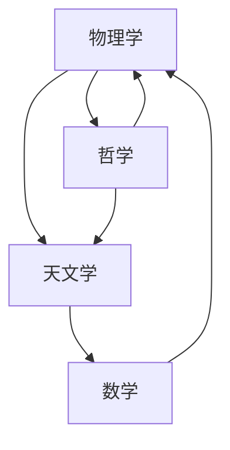

                 


### 文章标题

《宇宙观念在不同学科中的交叉与融合》

### 关键词

宇宙观念、科学革命、物理学、天文学、哲学、交叉学科、融合

### 摘要

本文旨在探讨宇宙观念在不同学科中的交叉与融合。通过回顾宇宙观念的历史变迁，分析其在物理学、天文学和哲学中的核心作用，本文揭示了宇宙观念在多个学科中的相互影响和融合趋势。文章首先介绍了宇宙观念的起源与发展，随后详细阐述了物理学中的宇宙观念，包括宇宙结构理论、粒子物理学和量子力学。接着，文章探讨了天文学中的宇宙观念，如星系和恒星的形成与演化，以及宇宙中的星系团与超星系团。在哲学视角下，本文分析了宇宙观念与存在论和认识论的关系。最后，文章讨论了宇宙观念在多个学科中的交叉与融合，包括物理学与哲学、天文学与数学的交叉，以及生物科学与宇宙观念的融合。通过对这些交叉与融合的探讨，本文提出了宇宙观念的未来发展趋势，并对人类文明和科学教育提出了启示。

#### 第一部分：引论

### 第1章：宇宙观念的起源与发展

## 1.1 宇宙观念的历史变迁

### 1.1.1 古代宇宙观念

宇宙观念的起源可以追溯到古代文明，那时的人们对宇宙的认识相对简单。在古代宇宙观念中，宇宙通常被视为一个有层次的、固定的结构，其中地球位于中心，其他天体围绕地球旋转。

- 古希腊哲学中的宇宙观念：古希腊哲学家对宇宙的思考产生了深远的影响。泰勒斯认为水是宇宙的根源，赫拉克利特则认为宇宙是由永恒的火焰构成。柏拉图提出了理念论，认为宇宙由理性和现实两个层次构成。亚里士多德则提出了地心说，认为地球是宇宙的中心。

- 中国古代宇宙观念：中国古代哲学中也有丰富的宇宙观念。道家认为宇宙是由道构成，宇宙的本质是道的运动和变化。儒家则强调宇宙的和谐与秩序，认为天地万物都有其特定的位置和角色。

- 古印度宇宙观念：古印度哲学中的宇宙观念也极具特色。印度教认为宇宙是一个轮回的过程，由创造、维持和毁灭三个阶段构成。佛教则强调宇宙的缘起性，认为一切现象都是因缘和合的结果。

### 1.1.2 中世纪宇宙观念

中世纪宇宙观念受到宗教和哲学的影响。基督教哲学中的宇宙观念认为上帝是宇宙的创造者和维持者，宇宙是上帝的有形化。阿拉伯哲学家如阿尔-法拉比和阿尔-哥尔基也对宇宙观念做出了贡献。

- 地心说与日心说的争论：在中世纪，地心说和日心说的争论激烈。地心说认为地球是宇宙的中心，所有天体围绕地球旋转。而日心说则认为太阳是宇宙的中心，地球和其他行星围绕太阳旋转。哥白尼的日心说最终战胜了地心说。

### 1.1.3 现代宇宙观念的诞生

现代宇宙观念的诞生与科学革命密切相关。伽利略和牛顿的贡献为宇宙观念的现代化奠定了基础。

- 伽利略的贡献：伽利略通过望远镜的观测，揭示了天体的真实面貌。他发现木星的四颗卫星，支持了日心说。他还研究了自由落体运动和斜抛运动，提出了加速度的概念。

- 牛顿的贡献：牛顿提出了万有引力定律，解释了天体运动的规律。他的《自然哲学的数学原理》标志着现代物理学的诞生。

- 现代宇宙观念的诞生：随着科学革命的深入，人们对宇宙的认识逐渐从静态的、有固定层次的结构转变为动态的、不断演化的过程。大爆炸理论提出了宇宙起源和演化的新视角，黑洞理论则揭示了宇宙中极端条件下的现象。

## 1.2 科学革命与宇宙观念的变革

科学革命不仅改变了人类对自然世界的认识，也深刻影响了宇宙观念的变革。

- 科学革命的影响：科学革命打破了传统的哲学和宗教观念，推动了实证科学的发展。科学家们开始通过实验和观测来验证理论，推动了科学方法的普及。

- 伽利略与牛顿的贡献：伽利略和牛顿是科学革命的代表人物。伽利略的实验和观测揭示了自然界的规律，牛顿的万有引力定律则将天体运动和地面物体运动统一在一起。

- 宇宙观念的现代化：科学革命促使人们对宇宙的认识发生了根本性的变革。宇宙不再是固定不变的结构，而是不断演化的过程。大爆炸理论和黑洞理论的提出，进一步拓展了人们对宇宙的认识。

## 1.3 宇宙观念的现代化

现代化宇宙观念的形成是科学革命的重要成果。

- 现代宇宙观念的核心概念：现代宇宙观念强调宇宙的动态演化、宇宙的无限性、宇宙的复杂性。宇宙不再是一个单一的、有固定层次的结构，而是由多个层次、多种物质和能量构成的复杂系统。

- 现代宇宙观念的影响：现代化宇宙观念深刻影响了物理学、天文学和哲学等领域。它推动了宇宙起源和演化研究的发展，也促使人们对宇宙的本质和人类在宇宙中的地位进行深刻的思考。

## 结论

宇宙观念的起源与发展是一个漫长而复杂的过程。从古代宇宙观念到现代化宇宙观念，人类对宇宙的认识不断深化。科学革命为宇宙观念的现代化奠定了基础，现代宇宙观念的形成又推动了宇宙科学的发展。在未来，随着科学技术的进步，人们对宇宙的认识将继续拓展，宇宙观念也将不断更新和变革。

### 第二部分：物理学与宇宙观念

#### 第2章：物理学中的宇宙观念

## 2.1 宇宙结构的基本理论

宇宙结构理论是物理学中研究宇宙整体结构和演化的科学。它为我们理解宇宙的起源、发展和未来提供了重要的理论框架。

### 2.1.1 大爆炸理论

大爆炸理论是现代宇宙学的基础。它认为宇宙起源于大约138亿年前的一个极热、极密集的状态，从那时起，宇宙开始膨胀，冷却，形成了今天我们所观察到的宇宙结构。

- **核心概念**：
  - **宇宙的起源**：宇宙从一个极其热密的状态开始膨胀。
  - **宇宙膨胀**：宇宙不断膨胀，冷却，形成了今天我们所观察到的宇宙结构。
  - **宇宙背景辐射**：宇宙膨胀过程中释放出的辐射，为我们提供了宇宙早期的信息。

- **数学模型**：
  - **宇宙膨胀方程**：描述宇宙膨胀速率和膨胀历史的方程。
  - **宇宙密度参数**：描述宇宙物质密度与临界密度之比的参数。

- **大爆炸理论的验证**：
  - **宇宙微波背景辐射**：大爆炸理论预言了宇宙微波背景辐射的存在，这一辐射为我们提供了宇宙早期的信息。
  - **宇宙膨胀速率**：通过对遥远星系的观测，我们可以测量宇宙的膨胀速率，这为验证大爆炸理论提供了重要证据。

### 2.1.2 黑洞理论

黑洞是宇宙中的一种极端现象，它是如此密集和强大，以至于连光也无法逃脱。黑洞理论描述了黑洞的形成、演化和性质。

- **核心概念**：
  - **黑洞的形成**：黑洞是由大质量恒星在核心塌缩时形成的。
  - **黑洞的性质**：黑洞具有极强的引力，甚至连光也无法逃脱。
  - **黑洞的事件视界**：事件视界是黑洞的一个边界，一旦物体进入事件视界，就再也无法逃脱。

- **数学模型**：
  - **爱因斯坦场方程**：描述引力场的基本方程。
  - **黑洞的解**：描述黑洞内部结构的解。

- **黑洞理论的验证**：
  - **黑洞的观测**：通过观测星系中心的超大质量黑洞，我们可以验证黑洞理论。
  - **引力波**：黑洞合并时产生的引力波为我们提供了直接证据，证实了黑洞的存在。

### 2.1.3 宇宙膨胀理论

宇宙膨胀理论是描述宇宙如何从一个极热密的状态膨胀到今天的结构。它帮助我们理解宇宙的演化和未来。

- **核心概念**：
  - **宇宙膨胀**：宇宙从一个极热密的状态开始膨胀。
  - **宇宙加速膨胀**：近年来观测到的宇宙加速膨胀现象。
  - **暗能量**：一种神秘的力量，推动宇宙加速膨胀。

- **数学模型**：
  - **宇宙膨胀方程**：描述宇宙膨胀速率和膨胀历史的方程。
  - **暗能量模型**：描述暗能量的方程。

- **宇宙膨胀理论的验证**：
  - **宇宙微波背景辐射**：宇宙膨胀理论预言了宇宙微波背景辐射的存在，这一辐射为我们提供了宇宙早期的信息。
  - **遥远星系的观测**：通过对遥远星系的观测，我们可以测量宇宙的膨胀速率，这为验证宇宙膨胀理论提供了重要证据。

## 2.2 宇宙观念在粒子物理学中的应用

粒子物理学是研究基本粒子和它们之间相互作用的一门科学。宇宙观念在粒子物理学中的应用帮助我们理解宇宙的基本构成。

### 2.2.1 宇宙射线与粒子物理学

宇宙射线是由宇宙中的高能粒子组成的，它们穿过地球大气层，为我们提供了宇宙中的粒子信息。

- **核心概念**：
  - **宇宙射线的来源**：宇宙射线可能来自太阳系以外的星体。
  - **宇宙射线的组成**：宇宙射线包括各种基本粒子，如质子、中子、电子等。
  - **宇宙射线与粒子相互作用**：宇宙射线与大气层中的粒子相互作用，产生了各种次级粒子。

- **数学模型**：
  - **宇宙射线模型**：描述宇宙射线组成的模型。
  - **粒子相互作用模型**：描述宇宙射线与粒子相互作用的模型。

- **宇宙射线与粒子物理学的验证**：
  - **宇宙射线的观测**：通过对宇宙射线的观测，我们可以研究宇宙中的粒子现象。
  - **粒子加速器的实验**：在粒子加速器中，我们可以模拟宇宙射线中的粒子相互作用，验证粒子物理学理论。

### 2.2.2 宇宙微波背景辐射

宇宙微波背景辐射是宇宙早期留下的余辉，它为我们提供了宇宙早期的信息。

- **核心概念**：
  - **宇宙微波背景辐射的来源**：宇宙微波背景辐射是宇宙大爆炸后冷却产生的。
  - **宇宙微波背景辐射的组成**：宇宙微波背景辐射由电磁波组成，具有极低的能量。
  - **宇宙微波背景辐射的观测**：通过对宇宙微波背景辐射的观测，我们可以研究宇宙的早期结构。

- **数学模型**：
  - **宇宙微波背景辐射模型**：描述宇宙微波背景辐射的模型。
  - **黑体辐射模型**：描述宇宙微波背景辐射性质的模型。

- **宇宙微波背景辐射的验证**：
  - **宇宙微波背景辐射的观测**：通过卫星和地面望远镜，我们可以观测到宇宙微波背景辐射，验证宇宙微波背景辐射的存在。
  - **宇宙膨胀理论的验证**：宇宙微波背景辐射的观测结果为宇宙膨胀理论提供了重要证据。

### 2.2.3 宇宙中的基本粒子

宇宙中的基本粒子是构成宇宙的基本单元。粒子物理学的研究帮助我们了解这些基本粒子的性质和相互作用。

- **核心概念**：
  - **基本粒子的分类**：基本粒子包括夸克、轻子、力介子等。
  - **基本粒子的相互作用**：基本粒子之间通过强相互作用、弱相互作用和电磁相互作用相互影响。
  - **基本粒子的探测**：通过高能加速器和探测器，我们可以探测到基本粒子的性质。

- **数学模型**：
  - **标准模型**：描述基本粒子和它们相互作用的模型。
  - **量子场论**：描述基本粒子和它们相互作用的理论框架。

- **基本粒子与宇宙观念的关系**：
  - **宇宙早期状态**：宇宙早期状态决定了基本粒子的形成和演化。
  - **宇宙结构的形成**：基本粒子的相互作用和聚集形成了宇宙的结构。

## 2.3 量子力学与宇宙观念

量子力学是研究微观世界的物理现象的理论，它与宇宙观念的融合为我们提供了新的视角。

### 2.3.1 量子力学的宇宙观

量子力学揭示了微观世界的奇异规律，它对宇宙观念产生了深远的影响。

- **核心概念**：
  - **量子态**：微观粒子的状态是量子化的，可以用波函数描述。
  - **量子纠缠**：微观粒子之间存在一种特殊的关联，称为量子纠缠。
  - **量子跃迁**：微观粒子可以通过量子跃迁从一个状态转移到另一个状态。

- **量子力学的宇宙观**：
  - **宇宙的非确定性**：量子力学揭示了宇宙的非确定性，即宇宙的状态不是完全确定的，而是概率性的。
  - **宇宙的量子性质**：宇宙的基本结构和演化可能具有量子性质，如量子引力和量子宇宙学。

### 2.3.2 量子引力理论

量子引力理论是试图将量子力学与广义相对论统一的理论，它对宇宙观念的变革具有重要意义。

- **核心概念**：
  - **量子引力**：量子引力试图解释引力的量子性质。
  - **弦理论**：弦理论是量子引力的一种可能方案，它认为基本粒子是由一维的弦构成的。
  - **黑洞熵**：黑洞熵的研究揭示了量子引力与热力学之间的联系。

- **量子引力理论的影响**：
  - **宇宙的起源**：量子引力理论可能解释宇宙的起源和早期状态。
  - **宇宙的演化**：量子引力理论可能解释宇宙的演化过程，包括宇宙加速膨胀和宇宙背景辐射。

### 2.3.3 宇宙的量子力学解释

宇宙的量子力学解释试图将量子力学的原理应用于宇宙整体。

- **核心概念**：
  - **量子宇宙学**：量子宇宙学研究宇宙的量子性质和量子演化。
  - **多世界解释**：多世界解释认为宇宙中的所有可能历史都实际存在。
  - **量子计算**：量子计算是量子力学在信息处理领域的应用，它可能改变我们对宇宙的理解。

- **宇宙的量子力学解释**：
  - **宇宙的整体性**：量子力学揭示了宇宙的整体性，即宇宙中的所有部分是相互关联的。
  - **宇宙的非决定性**：量子力学揭示了宇宙的非决定性，即宇宙的状态不是完全确定的，而是概率性的。

## 结论

物理学中的宇宙观念为我们理解宇宙的起源、演化和未来提供了重要的理论框架。从大爆炸理论到黑洞理论，从宇宙膨胀理论到量子力学，物理学不断拓展我们对宇宙的认识。这些宇宙观念不仅在物理学内部产生了深远的影响，也与其他学科如天文学和哲学产生了交叉和融合，推动了宇宙科学的进步。随着科学技术的不断进步，我们对宇宙的理解将继续深化，宇宙观念也将不断更新和变革。

#### 第三部分：天文学与宇宙观念

### 第3章：天文学中的宇宙观念

## 3.1 天体观测与宇宙观念的发展

天体观测是人类认识宇宙的重要手段，它的历史与宇宙观念的发展紧密相连。

### 3.1.1 光学望远镜的发明

光学望远镜的发明是天体观测史上的里程碑，它使得人类能够观测到更遥远、更微弱的天体。

- **核心概念**：
  - **光学望远镜**：使用透镜或反射镜收集和聚焦光线的设备。
  - **分辨率**：光学望远镜的分辨率决定了它能够观测到的天体细节。
  - **视场**：光学望远镜的视场决定了它能够覆盖的视野范围。

- **光学望远镜的发明**：
  - **伽利略望远镜**：1608年，伽利略发明了第一台光学望远镜，它能够放大物体，使人类首次观测到了月球表面的细节。
  - **胡克望远镜**：1609年，胡克发明了第二台光学望远镜，它使用了反射镜来收集光线，提高了望远镜的分辨率。

- **光学望远镜的发展**：
  - **大型望远镜**：随着技术的进步，人类建造了越来越多的大型望远镜，如哈勃空间望远镜和凯克望远镜，它们提供了更高的分辨率和更广阔的视场。

### 3.1.2 无线电望远镜的使用

无线电望远镜的发明使得人类能够观测到光学望远镜无法探测到的无线电波，从而揭示了宇宙的更多秘密。

- **核心概念**：
  - **无线电望远镜**：使用天线来收集和放大无线电波的设备。
  - **频率**：无线电望远镜能够接收的无线电波频率范围。
  - **干涉测量**：使用多个天线进行干涉测量，提高了观测的分辨率。

- **无线电望远镜的使用**：
  - **射电天文学**：射电天文学是研究宇宙中的无线电波的科学，它揭示了宇宙中的中性氢云、脉冲星、黑洞等天体。
  - **星际分子云**：无线电望远镜能够观测到星际分子云，这些分子云是恒星形成的摇篮。

### 3.1.3 天体物理学的进步

天体物理学的进步使得人类能够更深入地理解宇宙的结构和演化。

- **核心概念**：
  - **天体物理学**：研究宇宙中天体的物理性质和演化过程。
  - **光谱分析**：通过分析天体的光谱，可以了解其化学成分、温度和运动状态。
  - **恒星演化**：恒星从诞生到死亡的过程，包括主序星、红巨星、白矮星等阶段。

- **天体物理学的进步**：
  - **恒星形成**：通过观测星际分子云和年轻恒星，天文学家揭示了恒星形成的过程。
  - **黑洞研究**：通过对黑洞的观测和理论分析，天文学家对黑洞的性质和演化有了更深入的了解。
  - **宇宙大尺度结构**：通过观测宇宙中的大尺度结构，如星系团和超星系团，天文学家对宇宙的演化有了更全面的认知。

## 3.2 宇宙中的星系与恒星

星系和恒星是宇宙中最常见的天体，它们构成了宇宙的基本结构。

### 3.2.1 星系的分类

星系是恒星、星团、星云和星际物质的集合体，根据它们的形态和结构可以分为不同类型。

- **核心概念**：
  - **星系**：由大量恒星和其他天体组成的系统。
  - **螺旋星系**：具有明显螺旋结构的星系，如银河系。
  - **椭圆星系**：具有椭圆形状的星系，如M87。
  - **不规则星系**：没有明显结构的星系，如 NGC 5471。

- **星系的分类**：
  - **形态分类**：根据星系的形态，将星系分为螺旋星系、椭圆星系和不规则星系。
  - **结构分类**：根据星系的结构，将星系分为核心星系、盘星系和星系团。

### 3.2.2 恒星的演化

恒星是宇宙中最常见的天体，它们的演化过程揭示了宇宙的奥秘。

- **核心概念**：
  - **恒星**：由等离子体组成的巨大球体，通过核聚变产生能量。
  - **主序星**：恒星生命周期中最稳定阶段，核聚变在核心进行。
  - **红巨星**：恒星生命周期中的一个阶段，核心开始收缩，外层膨胀。
  - **白矮星**：恒星演化的最终阶段，核心冷却，亮度减弱。

- **恒星的演化**：
  - **恒星形成**：恒星由星际分子云中的气体和尘埃凝聚而成。
  - **主序星阶段**：恒星在主序星阶段，核聚变稳定进行，恒星保持稳定状态。
  - **红巨星阶段**：恒星耗尽核心的氢燃料，核心开始收缩，外层膨胀。
  - **白矮星阶段**：恒星最终演化成白矮星，核心冷却，亮度减弱。

### 3.2.3 星系的形成与演化

星系的形成和演化是宇宙学研究的重点，它揭示了宇宙的结构和演化历史。

- **核心概念**：
  - **星系形成**：星系由星际物质在引力作用下凝聚而成。
  - **星系演化**：星系随着时间演化，形态和结构发生变化。
  - **星系团**：由多个星系组成的系统，如室女座星系团。
  - **超星系团**：由多个星系团组成的更大尺度结构，如本星系群。

- **星系的形成与演化**：
  - **星系形成**：星际物质在引力作用下凝聚成恒星和星系。
  - **星系演化**：星系随着时间演化，形态和结构发生变化，形成星系团和超星系团。
  - **星系碰撞与合并**：星系之间的相互作用会导致星系的碰撞和合并，形成更大的星系结构。

## 3.3 宇宙中的星系团与超星系团

星系团和超星系团是宇宙中的大尺度结构，它们揭示了宇宙的宏观演化。

### 3.3.1 星系团的结构与性质

星系团是由多个星系组成的系统，具有复杂的结构。

- **核心概念**：
  - **星系团**：由多个星系组成的系统。
  - **星系团中心**：星系团中质量最大的星系通常位于中心。
  - **星系团的质量分布**：星系团的质量分布不均匀，通常在中心区域密度较高。

- **星系团的结构与性质**：
  - **星系团的分类**：根据星系团的形态和结构，可以将星系团分为椭圆星系团和螺旋星系团。
  - **星系团的形成**：星系团由多个星系在引力作用下凝聚而成。
  - **星系团的质量**：星系团的总质量远大于单个星系的质量。

### 3.3.2 超星系团的形成

超星系团是由多个星系团组成的更大尺度结构，它揭示了宇宙的大尺度演化。

- **核心概念**：
  - **超星系团**：由多个星系团组成的更大尺度结构。
  - **星系团之间的相互作用**：超星系团中的星系团之间通过引力相互作用，形成复杂的结构。
  - **超星系团的演化**：超星系团随着时间演化，形态和结构发生变化。

- **超星系团的形成**：
  - **超星系团的引力凝聚**：超星系团由多个星系团在引力作用下凝聚而成。
  - **超星系团的演化**：超星系团随着时间演化，形态和结构发生变化，形成更大的宇宙结构。

### 3.3.3 宇宙的大尺度结构

宇宙的大尺度结构是由星系团和超星系团组成的，它揭示了宇宙的宏观演化。

- **核心概念**：
  - **宇宙的大尺度结构**：由星系团和超星系团组成的宇宙结构。
  - **宇宙的大尺度结构模型**：宇宙的大尺度结构模型描述了宇宙的大尺度演化。
  - **宇宙的膨胀**：宇宙在大尺度上持续膨胀，星系团和超星系团随着时间不断演化。

- **宇宙的大尺度结构**：
  - **星系团的分布**：星系团在宇宙中的分布不是均匀的，存在星系团的聚集现象。
  - **宇宙的大尺度结构模型**：通过观测和理论分析，天文学家提出了宇宙的大尺度结构模型，如宇宙网模型和宇宙泡沫模型。

## 结论

天文学中的宇宙观念通过对天体观测和理论分析，揭示了宇宙的结构和演化。从光学望远镜的发明到无线电望远镜的使用，从恒星演化到星系团和超星系团的形成，天文学不断拓展我们对宇宙的认识。这些宇宙观念不仅在天文学内部产生了深远的影响，也与其他学科如物理学和哲学产生了交叉和融合，推动了宇宙科学的进步。随着科学技术的不断进步，我们对宇宙的理解将继续深化，宇宙观念也将不断更新和变革。

### 第四部分：哲学与宇宙观念

#### 第4章：哲学视角下的宇宙观念

## 4.1 哲学与宇宙观念的关系

哲学作为人类思考宇宙本质和存在方式的学科，与宇宙观念有着密切的联系。

### 4.1.1 古希腊哲学中的宇宙观念

古希腊哲学对宇宙观念的形成产生了深远的影响。

- **核心概念**：
  - **泰勒斯的宇宙观念**：泰勒斯认为宇宙的根源是水。
  - **赫拉克利特的宇宙观念**：赫拉克利特认为宇宙是由永恒的火焰构成。
  - **柏拉图的宇宙观念**：柏拉图提出了理念论，认为宇宙由理性和现实两个层次构成。

- **古希腊哲学中的宇宙观念**：
  - **宇宙的二元性**：柏拉图的理念论将宇宙分为理性和现实两个层次。
  - **宇宙的和谐**：古希腊哲学家认为宇宙是和谐的，每个事物都有其特定的位置和角色。
  - **宇宙的起源**：一些哲学家，如阿那克西曼德，提出了宇宙起源的理论。

### 4.1.2 中世纪哲学的宇宙观念

中世纪哲学受到宗教和基督教哲学的影响，形成了独特的宇宙观念。

- **核心概念**：
  - **地心说**：中世纪普遍接受地心说，认为地球是宇宙的中心。
  - **上帝创造宇宙**：基督教哲学认为宇宙是由上帝创造的，上帝是宇宙的创造者和维持者。

- **中世纪哲学的宇宙观念**：
  - **宇宙的固定性**：中世纪哲学家认为宇宙是固定不变的，天体按照固定的轨道运行。
  - **宇宙的等级制度**：中世纪哲学中存在宇宙的等级制度，认为人类处于宇宙的中心，是上帝的代理。

### 4.1.3 现代哲学的宇宙观念

现代哲学在科学革命的背景下，对宇宙观念进行了深刻的反思。

- **核心概念**：
  - **宇宙的非确定性**：现代哲学接受了量子力学中的非确定性原理。
  - **宇宙的多元性**：现代哲学认为宇宙可能存在多个平行宇宙。
  - **宇宙的复杂性**：现代哲学强调宇宙的复杂性，认为宇宙是一个复杂的系统。

- **现代哲学的宇宙观念**：
  - **宇宙的非确定性**：现代哲学家接受了量子力学的非确定性原理，认为宇宙的状态不是完全确定的，而是概率性的。
  - **宇宙的多元性**：一些现代哲学家提出了宇宙多元性的观点，认为宇宙可能存在多个平行宇宙。
  - **宇宙的复杂性**：现代哲学强调宇宙的复杂性，认为宇宙是一个复杂的系统，其运行遵循复杂的规律。

## 4.2 宇宙观念与存在论

存在论是哲学中研究存在本质和存在方式的学科，与宇宙观念有着紧密的联系。

### 4.2.1 存在论的基本问题

存在论探讨的是存在本身的问题，它涉及到存在的本质、存在的条件以及存在的意义。

- **核心概念**：
  - **存在的本质**：存在论探讨存在的本质是什么，是实体、现象还是关系。
  - **存在的条件**：存在论探讨存在所需的条件，如物质、能量、意识等。
  - **存在的意义**：存在论探讨存在的意义，即为什么存在，存在的目的是什么。

- **存在论的基本问题**：
  - **存在是什么**：哲学家们对存在进行了广泛的探讨，提出了不同的存在定义。
  - **存在是如何可能的**：哲学家们探讨了存在如何成为可能，如自然法则、宇宙起源等。
  - **存在为什么存在**：哲学家们探讨了存在的目的和意义，如人类的存在意义、宇宙的终极目的等。

### 4.2.2 宇宙观念的存在论分析

宇宙观念与存在论有着密切的联系，宇宙观念可以从存在论的角度进行分析。

- **核心概念**：
  - **宇宙的本质**：宇宙观念可以看作是对宇宙存在本质的探讨，如宇宙是否是物质的、能量的、意识的等。
  - **宇宙的条件**：宇宙观念也可以看作是对宇宙存在条件的探讨，如宇宙是否有边界、宇宙是否有起源等。
  - **宇宙的意义**：宇宙观念还可以看作是对宇宙存在意义的探讨，如宇宙的起源、宇宙的目的等。

- **宇宙观念的存在论分析**：
  - **宇宙的本质**：不同的宇宙观念反映了不同的存在本质，如唯物主义宇宙观念认为宇宙是物质的，唯心主义宇宙观念认为宇宙是意识的。
  - **宇宙的条件**：宇宙观念探讨了宇宙存在的条件，如大爆炸理论探讨了宇宙的起源条件，量子引力理论探讨了宇宙存在的物理条件。
  - **宇宙的意义**：宇宙观念探讨了宇宙存在的意义，如宗教宇宙观念认为宇宙的存在是为了实现神的意志，科学宇宙观念认为宇宙的存在是为了自然法则的实现。

### 4.2.3 宇宙观念与形而上学

形而上学是哲学中研究存在本质和存在方式的学科，与宇宙观念有着紧密的联系。

- **核心概念**：
  - **形而上学的本质**：形而上学探讨的是超越经验世界的存在本质，如存在、真理、实在等。
  - **形而上学的对象**：形而上学探讨的对象包括宇宙、生命、意识等。
  - **形而上学的目的**：形而上学的目的是寻找存在的本质和存在的意义。

- **宇宙观念与形而上学的联系**：
  - **宇宙观念是形而上学的研究对象**：宇宙观念涉及到宇宙的本质、存在条件和存在意义，这些都是形而上学的研究对象。
  - **形而上学为宇宙观念提供理论基础**：形而上学的理论可以为宇宙观念提供基础，如唯物主义形而上学为唯物主义宇宙观念提供理论基础。

## 4.3 宇宙观念与认识论

认识论是哲学中研究认识的本质和条件的学科，与宇宙观念有着密切的联系。

### 4.3.1 认识论的基本问题

认识论探讨的是人类如何认识世界，它涉及到认识的本质、认识的条件和认识的目的。

- **核心概念**：
  - **认识的本质**：认识论探讨认识的本质，即认识是如何产生的，是如何反映现实的。
  - **认识的条件**：认识论探讨认识的条件，如感官、经验、理性等。
  - **认识的目的**：认识论探讨认识的目的，即认识是为了什么，认识如何服务于人类的需要。

- **认识论的基本问题**：
  - **认识是如何产生的**：哲学家们探讨了认识的起源和过程，如感官如何产生认识，理性如何加工和解释认识。
  - **认识是如何反映现实的**：哲学家们探讨了认识与现实的关系，如认识是否能够完全反映现实，是否存在认识与现实的差距。
  - **认识为什么存在**：哲学家们探讨了认识存在的目的和意义，如认识如何服务于人类的生存和发展。

### 4.3.2 宇宙观念的认识论分析

宇宙观念与认识论有着密切的联系，宇宙观念可以从认识论的角度进行分析。

- **核心概念**：
  - **宇宙观念的认识论本质**：宇宙观念是人们对宇宙本质和存在方式的认知，它涉及到认识的本质和条件。
  - **宇宙观念的认识论条件**：宇宙观念的形成和验证需要依赖感官、经验和理性。
  - **宇宙观念的认识论目的**：宇宙观念的认识目的是为了更好地理解宇宙，服务于人类的生存和发展。

- **宇宙观念的认识论分析**：
  - **宇宙观念的起源**：宇宙观念的起源可以追溯到人类对宇宙的感官感知和理性思考。
  - **宇宙观念的验证**：宇宙观念的验证需要依赖科学实验和观测，如大爆炸理论、量子力学等。
  - **宇宙观念的认识论意义**：宇宙观念的认识意义在于帮助我们更好地理解宇宙，指导人类的科学研究和技术发展。

### 4.3.3 科学知识与宇宙观念的关系

科学知识与宇宙观念有着紧密的联系，科学知识是宇宙观念的重要基础。

- **核心概念**：
  - **科学知识**：科学知识是通过对自然现象的观察、实验和理论分析获得的。
  - **宇宙观念**：宇宙观念是人们对宇宙本质和存在方式的认知。

- **科学与宇宙观念的关系**：
  - **科学知识为宇宙观念提供证据**：科学知识通过实验和观测为宇宙观念提供了证据，如大爆炸理论的观测证据。
  - **宇宙观念指导科学研究**：宇宙观念指导科学家们进行科学研究，如现代宇宙观念指导天文学家研究宇宙的起源和演化。
  - **科学知识与宇宙观念的互动**：科学知识与宇宙观念相互影响，科学知识的进步可以推动宇宙观念的更新，宇宙观念的变革可以指导科学知识的发展。

## 结论

哲学视角下的宇宙观念揭示了宇宙的本质、存在方式和人类对宇宙的认识。从古希腊哲学到中世纪哲学，再到现代哲学，宇宙观念不断发展，反映了人类对宇宙认识的不断深化。哲学与宇宙观念的交叉与融合，不仅推动了宇宙科学的发展，也丰富了哲学的内涵。未来，随着科学技术的进步，哲学与宇宙观念的融合将继续深化，为人类认识宇宙提供新的视角和理论框架。

### 第五部分：宇宙观念在多个学科中的交叉

#### 第5章：宇宙观念在多个学科中的交叉

## 5.1 物理学与哲学的交叉

物理学与哲学的交叉为研究宇宙观念提供了新的视角。

### 5.1.1 物理学中的哲学问题

物理学研究中的许多问题都具有哲学意义。

- **核心概念**：
  - **实在性**：物理学探讨的是客观存在的实在性，如量子力学中的波函数坍缩问题。
  - **因果律**：物理学中的因果关系如何解释，如广义相对论中的时间膨胀问题。
  - **概率性**：物理学中的概率性如何与确定性的哲学观念结合，如量子力学中的概率波函数。

- **物理学中的哲学问题**：
  - **量子力学的哲学问题**：量子力学中的波函数坍缩问题引发了关于实在性和因果律的哲学探讨。
  - **广义相对论的哲学问题**：广义相对论中的时间膨胀问题引发了关于时间和空间的哲学探讨。
  - **量子引力理论的哲学问题**：量子引力理论如何统一量子力学和广义相对论，这是物理学和哲学共同关注的问题。

### 5.1.2 哲学对物理学的挑战

哲学对物理学的挑战促使物理学不断反思和进步。

- **核心概念**：
  - **实在性**：哲学质疑物理学的实在性，如量子力学中的波函数是否真实存在。
  - **因果律**：哲学质疑物理学的因果律，如量子力学中的非确定性如何与因果律结合。
  - **可知性**：哲学质疑物理学的可知性，如物理学的理论是否能够完全揭示宇宙的真相。

- **哲学对物理学的挑战**：
  - **量子力学的实在性问题**：哲学质疑量子力学中的波函数是否真实存在，这引发了关于实在性的哲学讨论。
  - **量子力学的因果性问题**：哲学质疑量子力学中的因果关系如何解释，这引发了关于因果律的哲学讨论。
  - **量子引力理论的统一性问题**：哲学质疑量子引力理论如何统一量子力学和广义相对论，这引发了关于宇宙观念的哲学讨论。

### 5.1.3 量子力学与宇宙观念的交融

量子力学与宇宙观念的交融为我们提供了新的宇宙观。

- **核心概念**：
  - **量子力学的宇宙观**：量子力学揭示了宇宙的微观规律，如量子纠缠和量子隧道效应。
  - **量子宇宙学**：量子宇宙学研究宇宙的量子性质和量子演化。
  - **多世界解释**：多世界解释认为宇宙中的所有可能历史都实际存在。

- **量子力学与宇宙观念的交融**：
  - **量子引力理论**：量子引力理论试图将量子力学与广义相对论统一，这为我们提供了新的宇宙观。
  - **宇宙的非确定性**：量子力学揭示了宇宙的非确定性，即宇宙的状态不是完全确定的，而是概率性的。
  - **宇宙的量子性质**：量子力学揭示了宇宙的量子性质，如量子纠缠和量子隧穿效应。

## 5.2 天文学与数学的交叉

天文学与数学的交叉为研究宇宙提供了精确的工具。

### 5.2.1 天文学中的数学方法

数学在天文学中扮演了重要的角色。

- **核心概念**：
  - **天体力学**：天体力学使用数学方法研究天体的运动和轨道。
  - **天体物理学**：天体物理学使用数学模型描述天体的物理性质和演化过程。
  - **数值模拟**：数值模拟使用数学方法模拟天体的行为和宇宙的演化。

- **天文学中的数学方法**：
  - **牛顿力学**：牛顿力学使用数学方程描述天体的运动和引力相互作用。
  - **广义相对论**：广义相对论使用数学方程描述引力场和时空的弯曲。
  - **统计力学**：统计力学使用数学模型描述天体的热力学性质和能量分布。

### 5.2.2 数学在天文学中的应用

数学在天文学中的应用极大地推动了天文学的发展。

- **核心概念**：
  - **光谱分析**：光谱分析使用数学方法分析天体的光谱，了解其化学成分和温度。
  - **星系动力学**：星系动力学使用数学模型研究星系的运动和结构。
  - **宇宙学**：宇宙学使用数学方程描述宇宙的膨胀和结构演化。

- **数学在天文学中的应用**：
  - **星系团和超星系团的结构分析**：数学模型帮助天文学家研究星系团和超星系团的结构和演化。
  - **宇宙微波背景辐射的测量**：数学模型帮助天文学家测量宇宙微波背景辐射，验证宇宙学理论。
  - **黑洞和宇宙大爆炸的研究**：数学模型帮助天文学家研究黑洞和宇宙大爆炸的物理过程。

### 5.2.3 天体物理学中的数学模型

数学模型在天体物理学中具有核心地位。

- **核心概念**：
  - **恒星演化模型**：恒星演化模型使用数学方程描述恒星从诞生到死亡的过程。
  - **黑洞模型**：黑洞模型使用数学方程描述黑洞的物理性质和行为。
  - **宇宙膨胀模型**：宇宙膨胀模型使用数学方程描述宇宙的膨胀历史和未来。

- **天体物理学中的数学模型**：
  - **大爆炸理论**：大爆炸理论使用数学模型描述宇宙的起源和早期演化。
  - **星系形成模型**：星系形成模型使用数学模型描述星系的形成和结构演化。
  - **暗物质和暗能量模型**：暗物质和暗能量模型使用数学模型描述宇宙中的暗物质和暗能量的性质和作用。

## 5.3 生物科学与宇宙观念

生物科学与宇宙观念的交叉为研究生命在宇宙中的地位提供了新的视角。

### 5.3.1 生物与宇宙的关系

生物与宇宙的关系是一个深奥的课题。

- **核心概念**：
  - **生物起源**：生物起源研究生命是如何从非生命物质中产生的。
  - **生命的宇宙分布**：生命的宇宙分布研究生命在宇宙中的分布和存在形式。
  - **生命的演化**：生命的演化研究生命如何在宇宙中演化和发展。

- **生物与宇宙的关系**：
  - **生命起源**：研究生命起源，如原始地球上的化学反应如何导致生命的诞生。
  - **生命的宇宙分布**：研究生命在宇宙中的分布，如地球外生命的可能性。
  - **生命的演化**：研究生命如何在宇宙中演化，如生物多样性的形成。

### 5.3.2 宇宙观念在生物科学中的应用

宇宙观念在生物科学中的应用为研究生命提供了新的理论框架。

- **核心概念**：
  - **进化论**：进化论认为生命是通过自然选择和遗传变异演化的。
  - **生态系统**：生态系统研究生物与环境的相互作用。
  - **生命信息**：生命信息研究生命如何传递和存储遗传信息。

- **宇宙观念在生物科学中的应用**：
  - **进化论与宇宙观念**：宇宙观念为进化论提供了新的视角，如宇宙的演化和生命的演化。
  - **生态系统与宇宙观念**：宇宙观念为生态系统研究提供了新的理论框架，如宇宙的演化和生态系统的演化。
  - **生命信息与宇宙观念**：宇宙观念为生命信息研究提供了新的视角，如宇宙的信息结构和生命的信息结构。

### 5.3.3 生物宇宙学的新视角

生物宇宙学提供了一种新的视角，将生命置于宇宙的背景下进行研究。

- **核心概念**：
  - **生物宇宙学**：生物宇宙学研究生命与宇宙的关系。
  - **宇宙生命的可能性**：宇宙生命的可能性研究宇宙中是否存在其他生命形式。
  - **生命的宇宙意义**：生命的宇宙意义研究生命在宇宙中的地位和作用。

- **生物宇宙学的新视角**：
  - **宇宙生命的分布**：研究宇宙生命的分布，如地球外生命的可能性。
  - **宇宙生命的演化**：研究宇宙生命的演化，如宇宙生命如何适应和演化。
  - **宇宙生命的意义**：研究宇宙生命的意义，如生命在宇宙中的角色和作用。

## 结论

宇宙观念在多个学科中的交叉与融合为我们提供了丰富的视角和理论框架。物理学与哲学的交叉推动了宇宙观念的深化，天文学与数学的交叉提供了精确的工具，生物科学与宇宙观念的交叉扩展了我们对生命的理解。这些交叉与融合不仅推动了科学的发展，也为哲学提供了新的思考方向。未来，随着科学技术的进步，宇宙观念将在更多学科中产生深刻的交叉与融合，为人类认识宇宙和生命提供新的视角和理论框架。

### 第六部分：宇宙观念的未来展望

#### 第6章：宇宙观念的未来发展

## 6.1 宇宙观念的演变趋势

宇宙观念随着科学技术的进步和人类认识的深化而不断演变。

### 6.1.1 新科学革命的影响

新科学革命，特别是量子力学和相对论的出现，对宇宙观念产生了深远的影响。

- **核心概念**：
  - **量子力学**：量子力学揭示了微观世界的规律，挑战了经典物理学的观念。
  - **相对论**：相对论改变了我们对时间和空间的理解，提出了时空的相对性和弯曲性。

- **新科学革命的影响**：
  - **宇宙观念的变革**：量子力学和相对论的革命性成果改变了我们对宇宙的认识，宇宙不再是固定和简单的结构。
  - **科学研究范式**：新科学革命推动了科学研究范式的转变，从定性描述到定量分析，从经典物理到量子物理。

### 6.1.2 人工智能在宇宙观念研究中的应用

人工智能在宇宙观念研究中发挥着越来越重要的作用。

- **核心概念**：
  - **机器学习**：机器学习是一种人工智能技术，通过算法从数据中学习，进行预测和决策。
  - **深度学习**：深度学习是机器学习的一个分支，通过多层神经网络进行复杂的数据分析和模式识别。

- **人工智能在宇宙观念研究中的应用**：
  - **数据分析**：人工智能可以处理和分析大量的宇宙观测数据，帮助天文学家发现新的天体现象。
  - **预测模型**：人工智能可以建立宇宙演化的预测模型，为宇宙学提供新的理论框架。
  - **智能望远镜**：人工智能可以帮助设计智能望远镜系统，实现自动化观测和数据分析。

### 6.1.3 未来宇宙观念的预测

未来宇宙观念的预测依赖于当前的科学进展和技术趋势。

- **核心概念**：
  - **宇宙膨胀**：宇宙膨胀可能是永恒的，也可能是暂时的。
  - **暗能量**：暗能量可能决定了宇宙的未来演化。
  - **多世界解释**：多世界解释可能揭示宇宙的更多可能性。

- **未来宇宙观念的预测**：
  - **宇宙膨胀的持续**：未来宇宙可能继续膨胀，也可能是加速膨胀。
  - **暗能量的作用**：暗能量可能主导宇宙的未来演化，影响星系的形态和分布。
  - **宇宙的多样性和复杂性**：未来宇宙可能展现出更多样化和复杂的结构，如多维宇宙或多世界。

## 6.2 宇宙观念与人类文明

宇宙观念对人类文明有着深远的影响，它不仅塑造了人类对世界的理解，也指导了科学技术的进步。

### 6.2.1 宇宙观念对人类文明的启示

宇宙观念为人类文明提供了重要的启示。

- **核心概念**：
  - **宇宙的起源**：宇宙起源的研究启示人类对生命的起源和存在意义的思考。
  - **宇宙的演化**：宇宙演化的研究启示人类对自然界的认知和环境保护。
  - **宇宙的多样性**：宇宙的多样性启示人类探索未知和追求知识的渴望。

- **宇宙观念对人类文明的启示**：
  - **科学精神**：宇宙观念鼓励人类追求科学和真理，推动科学技术的进步。
  - **宇宙意识**：宇宙观念提升人类的宇宙意识，使人类认识到自己在宇宙中的地位和责任。
  - **全球合作**：宇宙观念推动全球合作，促进国际科学交流和合作研究。

### 6.2.2 宇宙观念在科学教育中的角色

宇宙观念在科学教育中扮演着重要的角色。

- **核心概念**：
  - **科学素养**：宇宙观念培养学生的科学素养，激发学生对科学的兴趣。
  - **科学方法论**：宇宙观念教育学生科学方法论，帮助他们理解和应用科学原理。
  - **跨学科学习**：宇宙观念促进跨学科学习，培养学生综合运用多学科知识解决问题的能力。

- **宇宙观念在科学教育中的角色**：
  - **激发学习兴趣**：宇宙观念通过展示宇宙的奥秘和美丽，激发学生对科学的兴趣。
  - **科学素养培养**：宇宙观念教育学生如何进行科学研究和创新，培养他们的科学素养。
  - **跨学科教育**：宇宙观念鼓励学生运用多学科知识，如物理学、天文学、哲学等，进行综合分析和研究。

### 6.2.3 宇宙观念与人类社会的未来

宇宙观念对人类社会的未来有着重要的影响。

- **核心概念**：
  - **科技进步**：宇宙观念推动科技进步，促进人类社会的发展。
  - **社会价值观**：宇宙观念影响社会价值观，塑造人类对自然和生命的看法。
  - **可持续发展**：宇宙观念促进可持续发展，引导人类保护地球和宇宙环境。

- **宇宙观念与人类社会的未来**：
  - **科技进步**：宇宙观念推动人类探索宇宙，开发新的技术和资源，促进科技进步。
  - **社会价值观**：宇宙观念提升人类的宇宙意识，促进全球合作和和谐发展。
  - **可持续发展**：宇宙观念鼓励人类保护地球和宇宙环境，实现可持续发展。

## 结论

宇宙观念的未来发展将依赖于科学技术的进步和人类认识的深化。新科学革命、人工智能等技术的进步将推动宇宙观念的变革，为人类认识宇宙提供新的视角和理论框架。宇宙观念不仅对人类文明有着深远的影响，也对科学教育和人类社会的发展起着重要作用。未来，随着科学技术的进步，宇宙观念将继续深化，为人类认识宇宙和实现可持续发展提供重要的理论支持。

### 附录

#### 附录A：宇宙观念相关研究资源与工具

宇宙观念的研究需要丰富的资源和工具。

### A.1 宇宙观念研究的重要期刊与图书

**期刊**：
1. **《天体物理学杂志》**：发表宇宙学、天体物理学等领域的高质量研究论文。
2. **《国际天文学联合会学报》**：涵盖天文学、天体物理学、空间科学等领域的重要研究成果。
3. **《自然》**：发表自然科学领域的最新研究进展，包括宇宙学、天体物理学等。

**图书**：
1. **《宇宙简史》**：作者史蒂芬·霍金，详细介绍宇宙的起源、演化和未来。
2. **《黑洞与时间弯曲》**：作者基普·索恩，深入探讨黑洞、引力波和宇宙学。
3. **《宇宙的起源与命运》**：作者安德烈·林德，探讨宇宙学的理论框架和最新研究进展。

### A.2 宇宙观念研究的在线资源

**在线资源**：
1. **NASA**：美国国家航空航天局的官方网站，提供丰富的宇宙观念研究和观测数据。
2. **宇宙在线**：一个提供宇宙学、天体物理学等研究信息的在线平台。
3. **国家天文台**：中国国家天文台的官方网站，提供天文学研究和科普信息。

### A.3 宇宙观念研究的重要网站与论坛

**网站**：
1. **宇宙观念研究网**：提供宇宙学、天体物理学等研究论文和讨论。
2. **天文学论坛**：一个讨论天文学和宇宙学问题的在线论坛。
3. **量子宇宙学论坛**：讨论量子力学与宇宙观念交叉领域的研究问题。

**论坛**：
1. **物理学论坛**：涵盖物理学各个领域的问题讨论，包括宇宙学。
2. **哲学论坛**：探讨哲学与宇宙观念的关系，如存在论和认识论。
3. **科学教育论坛**：讨论科学教育和宇宙观念教育的相关问题。

#### 附录B：宇宙观念交叉学科关系Mermaid流程图



#### 附录C：宇宙观念相关核心算法与数学模型伪代码

```python
# 伪代码：大爆炸理论
def big_bang_theory():
    # 宇宙从热密状态开始
    initial_state = "hot and dense"
    print("初始状态：", initial_state)

    # 宇宙膨胀
    expand宇宙 = True
    while expand宇宙:
        print("宇宙在膨胀...")
        # 膨胀时间增加
        time += 1
        # 宇宙温度和密度随时间变化
        temperature = calculate_temperature(time)
        density = calculate_density(time)

    # 宇宙达到当前状态
    print("当前状态：", "膨胀结束，温度为", temperature, "，密度为", density)

# 伪代码：宇宙膨胀模型
def universe_expansion_model():
    # 初始条件
    initial_time = 0
    initial_density = 1
    initial_temperature = 1e9

    # 宇宙膨胀方程
    H = initial_temperature / (initial_density * c)

    # 宇宙演化过程
    for time in range(initial_time, current_time):
        # 计算当前时间步的膨胀速率
        H = calculate_expansion_rate(H, time)

    # 输出膨胀历史
    print("膨胀历史：", H)

# 伪代码：星系形成模型
def galaxy_formation_model():
    # 初始条件
    initial_density = 1e-28
    initial_temperature = 1e3

    # 星系形成过程
    while initial_density > 1e-29:
        # 模拟星系形成过程中的密度变化
        initial_density = simulate_density_change(initial_density)

        # 模拟星系形成过程中的温度变化
        initial_temperature = simulate_temperature_change(initial_temperature)

    # 输出星系形成结果
    print("星系形成结果：", "密度为", initial_density, "，温度为", initial_temperature)

# 伪代码：暗物质模型
def dark_matter_model():
    # 初始条件
    initial_density = 1e-25
    initial_temperature = 1e2

    # 暗物质演化过程
    while initial_density > 1e-26:
        # 模拟暗物质密度变化
        initial_density = simulate_density_change(initial_density)

        # 模拟暗物质温度变化
        initial_temperature = simulate_temperature_change(initial_temperature)

    # 输出暗物质模型结果
    print("暗物质模型结果：", "密度为", initial_density, "，温度为", initial_temperature)
```

#### 附录D：宇宙观念研究注意事项与拓展阅读

**注意事项**：
1. 宇宙观念研究涉及多个学科，需要具备广泛的科学知识和跨学科思维。
2. 宇宙观念研究需要依赖先进的观测设备和计算技术，如望远镜、卫星、超级计算机等。
3. 宇宙观念研究需要关注最新的科学进展和技术趋势，如量子力学、相对论、人工智能等。

**拓展阅读**：
1. 霍金，S. (1988). 《时间简史》。湖南科学技术出版社。
2. 林德，A. (1994). 《混沌与量子宇宙学》。上海科学技术出版社。
3. 古斯，A. (1997). 《创世大爆炸》。四川科学技术出版社。
4. 索恩，K. (2006). 《黑洞与时间弯曲》。湖南科学技术出版社。

### 附录E：宇宙观念研究常见问题解答

**Q1. 宇宙观念是什么？**
宇宙观念是人们对宇宙本质、存在方式及其与人类关系的基本认识和观念。

**Q2. 宇宙观念的发展历史是怎样的？**
宇宙观念的发展经历了从古代的朴素观念到现代的科学理论，包括古希腊哲学、中世纪宗教观念和现代科学革命。

**Q3. 宇宙观念在物理学中扮演什么角色？**
宇宙观念在物理学中是基础性的，它影响了物理学的基本理论和模型，如量子力学、相对论和宇宙学。

**Q4. 宇宙观念与哲学有什么关系？**
哲学探讨存在的本质和意义，宇宙观念为哲学提供了研究基础，哲学则对宇宙观念进行了深入的哲学思考和批判。

**Q5. 如何进行宇宙观念的研究？**
进行宇宙观念研究需要跨学科的知识和方法，包括观测、实验、理论建模和数据分析。

**Q6. 宇宙观念对人类社会有什么影响？**
宇宙观念对人类社会有着深远的影响，它影响科学教育、科技进步和人类文明的发展。

### 附录F：宇宙观念研究最佳实践建议

**1. 保持好奇心和探索精神。**
保持对宇宙的好奇心和探索精神，不断提出新的问题和假设，推动科学研究。

**2. 跨学科学习与合作。**
学习多个学科的知识，如物理学、天文学、哲学等，进行跨学科研究和合作，以获得更全面的宇宙观念。

**3. 利用先进的观测和计算技术。**
利用先进的望远镜、卫星和超级计算机等工具，进行宇宙观测和数据分析，以获取更精确的宇宙信息。

**4. 关注最新的科学进展。**
关注最新的科学进展和技术趋势，及时更新自己的宇宙观念和研究方法。

**5. 注重科学伦理和可持续性。**
在进行宇宙观念研究时，注重科学伦理和可持续性，保护地球和宇宙环境，推动科学发展与人类文明和谐发展。

