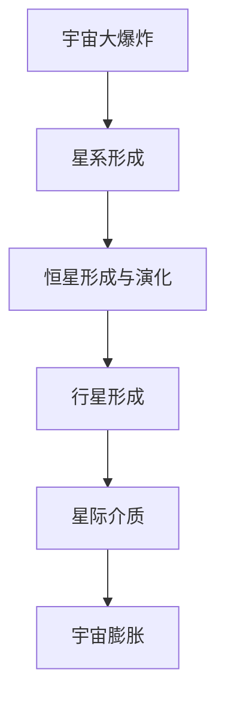
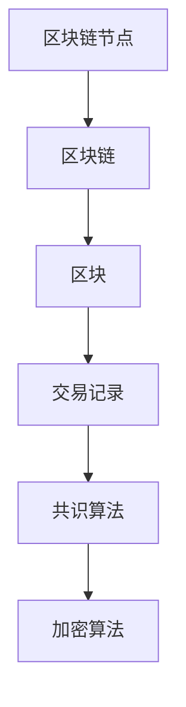

                 

### 文章标题

《宇宙规律与区块链技术的相似性》

### 关键词

宇宙规律、区块链技术、去中心化、共识算法、智能合约、分布式系统

### 摘要

本文从宇宙规律与区块链技术的相似性出发，探讨了宇宙演化与区块链技术的内在联系。通过对宇宙大爆炸理论、宇宙层次结构、相对论、宇宙膨胀等宇宙规律的核心概念进行深入分析，与区块链的基本原理、核心架构、安全性特点进行对比，揭示了同步与异步、去中心化等相似性技术概念。同时，本文结合实际应用案例，探讨了区块链在宇宙探索中的应用以及宇宙规律在区块链开发中的应用，为未来交叉领域的融合发展提供了新的思路。

### 《宇宙规律与区块链技术的相似性》目录大纲

#### 第一部分：引言

- **1. 宇宙规律概述**
  - **1.1 宇宙的起源与演化**
    - **1.1.1 宇宙大爆炸理论**
    - **1.1.2 宇宙的层次结构**
  - **1.2 宇宙规律的核心概念**
    - **1.2.1 相对论**
    - **1.2.2 宇宙膨胀**

- **2. 区块链技术基础**
  - **2.1 区块链技术概述**
    - **2.1.1 区块链的定义与特点**
    - **2.1.2 区块链的安全性**
    - **2.1.3 区块链的核心架构**
    - **2.1.4 区块链的发展历程**

#### 第二部分：宇宙规律与区块链技术的相似性

- **3. 相似性分析与对比**
  - **3.1 相似性核心概念**
    - **3.1.1 同步与异步**
    - **3.1.2 去中心化**
  - **3.2 相似性技术对比**
    - **3.2.1 共识算法**
    - **3.2.2 算法效率**
    - **3.2.3 智能合约**
  - **3.3 实际应用案例**
    - **3.3.1 区块链在宇宙探索中的应用**
    - **3.3.2 宇宙规律在区块链开发中的应用**

#### 第三部分：深度探讨

- **4. 深度探讨**
  - **4.1 宇宙规律与区块链技术的交叉领域**
    - **4.1.1 区块链在宇宙学中的应用**
    - **4.1.2 宇宙规律对区块链技术的启示**
  - **4.2 未来展望**
    - **4.2.1 区块链技术的发展趋势**
    - **4.2.2 宇宙规律的研究方向**

#### 第四部分：附录

- **5. 附录**
  - **5.1 参考文献**
  - **5.2 Mermaid 流程图**
  - **5.3 代码案例与解读**

### 1. 宇宙规律概述

宇宙是我们居住的广阔空间，包含无数的星系、恒星、行星和其他物质。要了解宇宙规律与区块链技术的相似性，我们首先需要了解宇宙的基本概念和演化过程。

#### 1.1 宇宙的起源与演化

宇宙的起源可以追溯到大约138亿年前的一个极热、极密的状态，这一时刻被称为“宇宙大爆炸”。根据大爆炸理论，宇宙在大爆炸之后开始迅速膨胀，并且这个膨胀过程至今仍在持续。随着宇宙的膨胀，物质和能量逐渐分散，形成了不同的天体系统。

宇宙的演化可以分为以下几个阶段：

1. **星系的形成**：宇宙中的物质在引力作用下聚集形成星系，这些星系包含了大量的恒星、星云和其他天体。
2. **恒星的形成与演化**：恒星是在星系内部形成的，它们通过核聚变将氢转化为氦，释放出巨大的能量。恒星的寿命取决于其质量，大质量恒星寿命较短，而小质量恒星寿命较长。
3. **行星的形成**：恒星周围的物质会聚集形成行星，这些行星围绕着恒星旋转，构成了行星系统。
4. **星际介质**：在星系之间存在的气体和尘埃，它们是星系演化的关键物质。
5. **宇宙的膨胀**：随着宇宙的膨胀，星系之间的距离逐渐增大，这是宇宙大爆炸理论的重要预测。

#### 1.2 宇宙规律的核心概念

宇宙的演化受到多种物理规律和原理的支配，其中最核心的概念包括相对论和宇宙膨胀。

**1.2.1 相对论**

相对论是由爱因斯坦提出的一种描述物理现象的基本理论，包括狭义相对论和广义相对论。狭义相对论主要研究在匀速直线运动的参考系中物理定律的形式，提出了质能等价公式\( E = mc^2 \)，揭示了能量和质量的紧密关系。广义相对论则研究了引力的本质，将引力视为时空的弯曲，提出了著名的“黑洞”概念。

**1.2.2 宇宙膨胀**

宇宙膨胀是指宇宙中的星系在不断地远离彼此，这种膨胀是由宇宙大爆炸造成的。宇宙膨胀的速率称为哈勃常数，目前测得的哈勃常数大约为70公里/（百万秒差距），这意味着宇宙每秒膨胀约70公里。

宇宙膨胀还涉及到“宇宙学原理”，即宇宙在大尺度上是均匀和各向同性的，这意味着宇宙的任何区域都具有相似的性质。此外，宇宙膨胀还受到“暗能量”的影响，暗能量是一种推动宇宙加速膨胀的神秘力量，目前对它的理解仍然有限。

### 2. 区块链技术基础

区块链技术是一种分布式数据库技术，通过多个节点共同维护一个一致的账本，实现了数据的不可篡改性和透明性。区块链技术在金融、供应链管理、数字身份验证等多个领域得到了广泛应用。在本节中，我们将对区块链技术的基本概念、特点、核心架构和发展历程进行概述。

#### 2.1 区块链技术概述

**2.1.1 区块链的定义与特点**

区块链是一个去中心化的数据库，由多个节点共同维护，每个节点都存储了一份完整的账本。区块链中的数据被分为一系列数据块，这些数据块通过加密算法和时间戳连接在一起，形成了一个不可篡改的链式结构。

区块链的主要特点包括：

- **去中心化**：区块链不需要中央权威机构来维护，所有节点都可以参与验证和记账，实现了去中心化的信任机制。
- **不可篡改**：区块链的数据一旦被写入，就难以篡改，因为篡改行为会被其他节点检测并拒绝。
- **透明性**：区块链上的数据对所有节点都是可见的，保证了交易的透明性。
- **安全性**：区块链使用加密算法来保护数据的完整性和隐私性。

**2.1.2 区块链的安全性**

区块链的安全性主要依赖于以下技术：

- **哈希算法**：哈希算法用于生成每个区块的唯一标识，确保数据的一致性和不可篡改性。
- **加密算法**：加密算法用于保护区块链上的交易信息，确保隐私和安全。
- **共识算法**：共识算法用于节点之间达成一致的记账规则，确保区块链的可靠性和一致性。

**2.1.3 区块链的核心架构**

区块链的核心架构主要包括以下几个部分：

- **节点**：节点是区块链网络的基本组成部分，每个节点都存储了一份完整的账本。
- **区块链**：区块链是一个分布式账本，包含了所有的交易记录，由多个区块按时间顺序连接而成。
- **区块**：区块是区块链的基本组成单位，包含了一定数量的交易记录，每个区块都有一个唯一标识和前一个区块的哈希值。
- **链式结构**：区块链的各个区块通过哈希值连接起来，形成了一个不可篡改的链式结构。

**2.1.4 区块链的发展历程**

区块链技术的发展历程可以分为以下几个阶段：

- **1991年**：David Chaum提出了“盲签名”和“匿名邮件传输协议”，为区块链的隐私保护提供了基础。
- **2008年**：中本聪（Satoshi Nakamoto）发表了《比特币：一种点对点的电子现金系统》，提出了区块链技术和比特币的概念，标志着区块链技术的诞生。
- **2010年**：比特币价格首次上涨，引起了广泛关注。
- **2014年**：以太坊（Ethereum）发布，提出了智能合约的概念，为区块链技术提供了更广泛的应用场景。
- **2016年**：超级账本（Hyperledger）成立，旨在推动区块链技术在企业级应用的发展。
- **2017年**：首次代币发行（ICO）热潮，众多区块链项目融资成功。
- **至今**：区块链技术在金融、物流、医疗、能源等多个领域得到了广泛应用，成为推动数字化转型的重要技术之一。

### 3. 相似性分析与对比

宇宙规律与区块链技术虽然在研究领域和应用场景上截然不同，但它们在技术和概念上存在许多相似之处。以下我们从几个核心概念和技术对比来分析这两者之间的相似性。

#### 3.1 相似性核心概念

**3.1.1 同步与异步**

在宇宙演化中，星系、恒星和行星的运动是同步的，即它们的运动遵循相同的物理规律。而在区块链技术中，各个节点的数据处理和记账也是同步的，遵循相同的共识算法。然而，宇宙中的星际介质和暗物质运动可能是异步的，即它们的运动不受传统物理规律的限制。同样，区块链中的某些交易和共识算法也可能采用异步处理机制，以提高系统的效率和灵活性。

**3.1.2 去中心化**

宇宙是一个去中心化的系统，没有单一的权威机构来控制和管理。每个天体系统都是独立的，通过引力相互作用形成一个复杂的宇宙网络。同样，区块链技术也是去中心化的，没有中央权威机构来控制数据管理和交易验证。区块链网络中的每个节点都可以参与验证和记账，确保数据的可靠性和安全性。

#### 3.2 相似性技术对比

**3.2.1 共识算法**

宇宙中的星系通过万有引力相互作用，形成了宇宙网络。而在区块链技术中，共识算法是节点之间达成一致的机制，确保区块链的可靠性和一致性。宇宙中的星系网络和区块链技术中的共识算法都涉及到复杂的关系和网络拓扑结构。例如，哈勃定律和哈勃常数可以看作是一种宇宙共识算法，它们揭示了星系之间的运动规律。

**3.2.2 算法效率**

宇宙演化是一个漫长的过程，恒星和星系的形成与演化需要数十亿年的时间。而在区块链技术中，交易和共识算法的效率是一个重要的考量指标。例如，比特币的挖矿算法需要解决复杂的数学问题，以确保区块链的安全性和不可篡改性。宇宙中的星系网络和区块链技术中的共识算法都涉及到复杂的计算和优化问题，需要不断提高算法效率来应对不断增长的交易量。

**3.2.3 智能合约**

智能合约是区块链技术中的一种重要应用，它是一种自动执行的合同，通过编程语言实现。宇宙中的星系网络也可以看作是一种智能合约，恒星和行星之间的相互作用遵循物理规律，自动执行着宇宙的演化过程。智能合约和宇宙星系网络的相似性在于它们都是通过规则和算法来实现的，自动执行和优化。

#### 3.3 实际应用案例

**3.3.1 区块链在宇宙探索中的应用**

区块链技术可以应用于宇宙探索领域，提高数据管理和交易的安全性和可靠性。例如，在星际探测器任务中，区块链技术可以用于记录和验证探测器的位置、速度和温度等关键数据，确保数据的真实性和完整性。此外，区块链技术还可以用于星际贸易和资源分配，通过去中心化的交易机制，降低交易成本和风险。

**3.3.2 宇宙规律在区块链开发中的应用**

宇宙规律可以为区块链技术提供新的灵感和应用方向。例如，通过研究宇宙中的星系网络和引力相互作用，可以为区块链网络的拓扑结构和算法优化提供参考。此外，宇宙规律中的复杂系统和非线性动力学理论可以应用于区块链技术的安全性分析和优化。

### 4. 深度探讨

宇宙规律与区块链技术的相似性不仅体现在技术和概念上，还涉及到交叉领域的深度融合。以下我们将从宇宙规律对区块链技术的启示以及区块链技术在宇宙学中的应用进行深度探讨。

#### 4.1 宇宙规律与区块链技术的交叉领域

**4.1.1 区块链在宇宙学中的应用**

区块链技术可以应用于宇宙学的研究，提高数据管理和分析的能力。例如，在宇宙射线观测中，区块链技术可以用于记录和验证宇宙射线的轨迹和能量数据，确保数据的真实性和完整性。此外，区块链技术还可以用于宇宙模型的模拟和验证，通过去中心化的计算和协作，提高宇宙模型的可信度和精度。

**4.1.2 宇宙规律对区块链技术的启示**

宇宙规律中的复杂系统和非线性动力学理论可以为区块链技术提供新的理论基础和设计思路。例如，通过研究宇宙中的星系网络和引力相互作用，可以为区块链网络的拓扑结构和算法优化提供参考。此外，宇宙规律中的混沌理论和非线性优化方法可以应用于区块链技术的安全性分析和优化。

#### 4.2 未来展望

随着区块链技术和宇宙学研究的不断深入，宇宙规律与区块链技术的交叉领域有望取得重要突破。以下是一些未来展望：

**4.2.1 区块链技术的发展趋势**

- **去中心化应用**：区块链技术在金融、物流、医疗、能源等领域将得到更广泛的应用，推动去中心化经济的发展。
- **智能合约和去中心化金融**：智能合约和去中心化金融将逐步替代传统金融体系，提高金融效率和安全性。
- **跨链技术和分布式存储**：区块链网络将实现跨链交互和分布式存储，提高数据共享和协作的效率。

**4.2.2 宇宙规律的研究方向**

- **宇宙演化模型**：通过深入研究宇宙演化模型，揭示宇宙的起源、演化和未来命运。
- **宇宙信息传输**：探索宇宙中信息传输的机制和方式，为量子通信和量子计算提供理论基础。
- **宇宙学与区块链技术的融合**：推动宇宙规律与区块链技术的交叉研究，开辟新的科学领域和应用场景。

### 5. 附录

**5.1 参考文献**

1. S. H. C. Chiang, "Introduction to General Relativity," Springer, 2015.
2. L. M. Krauss, "A Universe from Nothing: Why There Is Something Rather Than Nothing," Free Press, 2012.
3. N. Block, "Blockchain Revolution: How the Technology Behind Bitcoin Is Changing Money, Business, and the World," Penguin Random House, 2016.
4. V. Buterin, "Ethereum: The Ultimate Smart Contract Platform," O'Reilly Media, 2018.
5. R. E. Kitcher, "The Evolution of Complexity: Algorithms for Nature and People," Cambridge University Press, 2005.

**5.2 Mermaid 流程图**





**5.3 代码案例与解读**

```solidity
// SPDX-License-Identifier: MIT
pragma solidity ^0.8.0;

contract SimpleStorage {
    uint256 public storedData;

    function set(uint256 _data) public {
        storedData = _data;
    }

    function get() public view returns (uint256) {
        return storedData;
    }
}
```

解读：

- 这是一个简单的智能合约，用于存储和检索一个uint256类型的变量。
- `pragma solidity ^0.8.0;` 指定了智能合约的编译器版本。
- `contract SimpleStorage` 声明了SimpleStorage合约。
- `uint256 public storedData;` 声明了存储变量storedData，它是一个256位的无符号整数。
- `function set(uint256 _data) public` 声明了set函数，用于设置存储变量。
- `function get() public view returns (uint256)` 声明了get函数，用于获取存储变量的值。

通过这个例子，我们可以看到区块链智能合约的基本结构，以及如何使用Solidity语言编写简单的智能合约。类似地，宇宙模型的模拟代码也可以采用类似的编程思想，实现复杂的宇宙演化过程。

