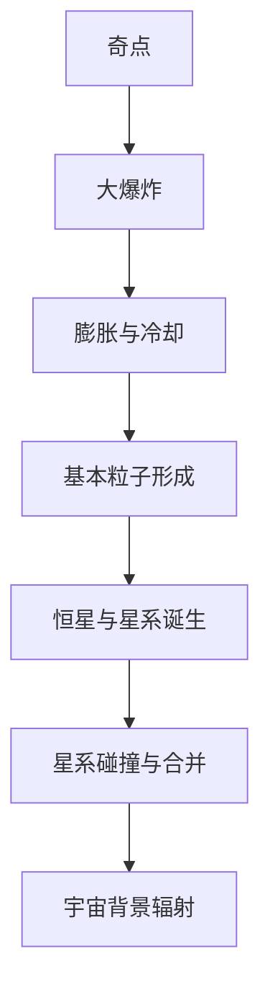
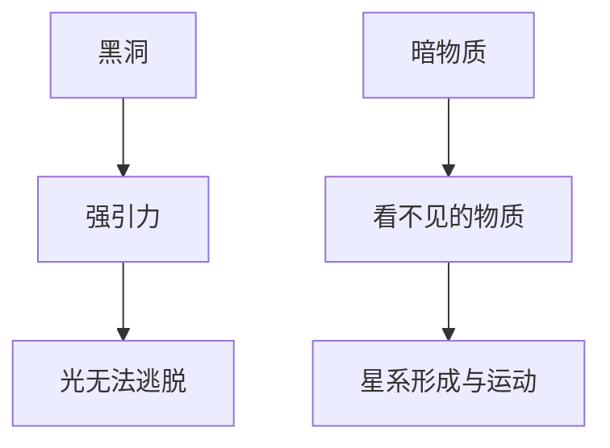
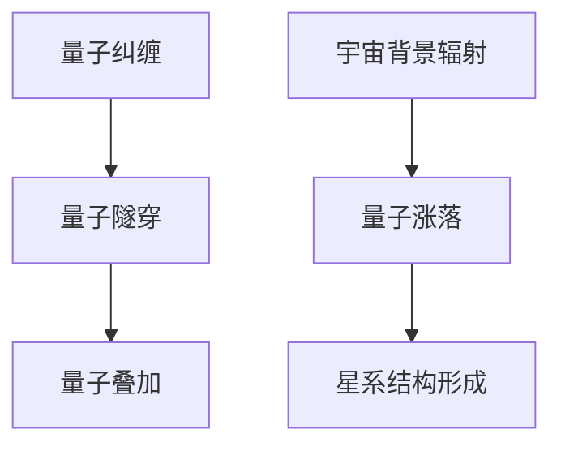
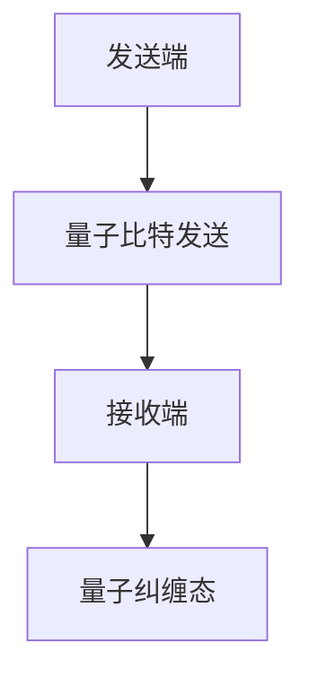
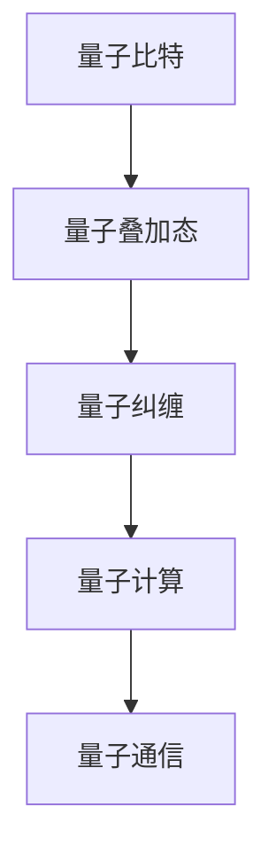
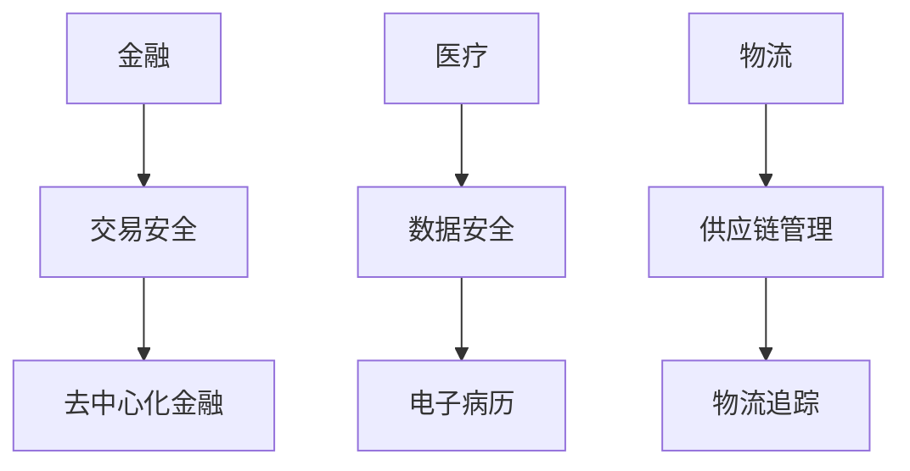
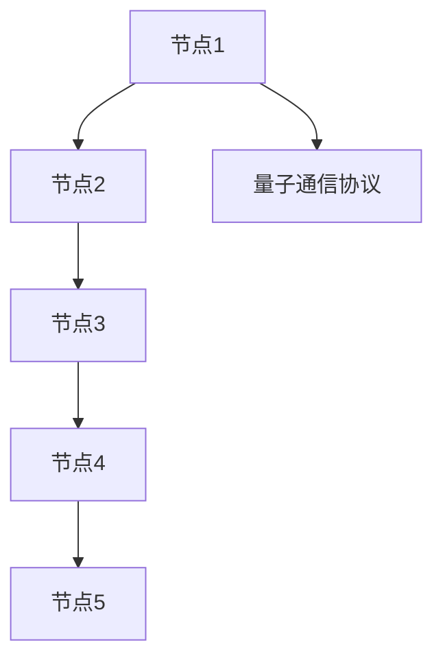
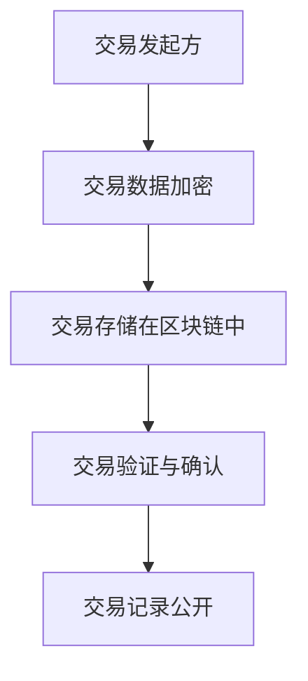

                 


## 《宇宙规律与后量子区块链的联系》

### 关键词
- 宇宙规律
- 后量子区块链
- 量子纠缠
- 密码学
- 区块链技术
- 安全性

### 摘要
本文深入探讨了宇宙规律与后量子区块链之间的联系，通过分析宇宙中的基本规律、量子力学原理以及后量子区块链技术，揭示了这些技术背后的数学模型和核心算法。文章旨在为读者提供一个全面的技术解读，从宇宙规律出发，逐步深入到后量子区块链的核心技术，最终展示其在未来应用中的潜力和挑战。

---

# 《宇宙规律与后量子区块链的联系》目录大纲

## 第一部分：宇宙规律概述

### 第1章：宇宙基础规律探讨

#### 1.1 宇宙的起源与演化
#### 1.2 黑洞与暗物质的研究
#### 1.3 宇宙中的量子现象

### 第2章：量子力学基础理论

#### 2.1 量子力学的基本原理
#### 2.2 量子纠缠与量子信息
#### 2.3 量子计算与量子通信

## 第二部分：后量子区块链技术解析

### 第3章：后量子区块链的基本概念

#### 3.1 区块链技术概述
#### 3.2 后量子密码学原理
#### 3.3 后量子区块链的优势与应用场景

### 第4章：后量子区块链架构设计

#### 4.1 后量子区块链网络拓扑
#### 4.2 后量子区块链交易模型
#### 4.3 后量子区块链共识算法

### 第5章：后量子区块链核心算法原理

#### 5.1 后量子密码学算法详解
#### 5.2 量子随机数生成算法
#### 5.3 量子哈希函数与签名算法

### 第6章：数学模型与公式详解

#### 6.1 后量子加密数学模型
#### 6.2 量子计算数学模型
#### 6.3 后量子区块链安全模型

## 第三部分：后量子区块链项目实战

### 第7章：后量子区块链项目实战案例

#### 7.1 项目背景与需求分析
#### 7.2 项目开发环境搭建
#### 7.3 源代码实现与解读
#### 7.4 代码解读与分析

### 第8章：未来展望与挑战

#### 8.1 后量子区块链的发展趋势
#### 8.2 后量子区块链面临的挑战
#### 8.3 后量子区块链的未来应用领域

## 附录

### 附录A：后量子区块链技术资源与工具

#### A.1 后量子密码学工具对比
#### A.2 后量子区块链开发框架
#### A.3 后量子区块链研究论文推荐

## 图表与公式

### 图表与公式概述
### 图表1-1：宇宙演化简图
### 公式1-1：量子纠缠态公式
### 公式2-1：后量子密码学加密算法伪代码
### 公式3-1：后量子区块链共识算法原理公式
### 公式4-1：量子随机数生成算法伪代码
### 公式5-1：量子哈希函数原理公式
### 公式6-1：后量子加密数学模型公式
### 公式7-1：后量子区块链安全模型公式
### 公式A-1：后量子密码学工具性能比较表格

---

## 宇宙规律概述

### 第1章：宇宙基础规律探讨

宇宙是一个庞大而复杂的系统，其基本规律对理解宇宙的本质和演化至关重要。在探讨宇宙规律时，我们首先要了解宇宙的起源与演化、黑洞与暗物质的研究，以及宇宙中的量子现象。

#### 1.1 宇宙的起源与演化

宇宙起源于大约138亿年前的一个极小而密集的奇点，经过大爆炸后，宇宙开始膨胀并逐渐冷却。在这一过程中，基本粒子和原子核形成，恒星和星系开始诞生。宇宙的演化包括了恒星的生命周期、星系的碰撞与合并，以及宇宙背景辐射的探测等。这些现象为我们揭示了宇宙从早期阶段到现在的演化过程。

**宇宙演化简图：**


#### 1.2 黑洞与暗物质的研究

黑洞是宇宙中最神秘的天体之一，具有极强的引力，甚至连光也无法逃脱。通过对黑洞的观测和研究，我们能够更好地理解引力和宇宙的极端条件。暗物质是宇宙中看不见的物质，对星系的形成和运动起着关键作用。然而，暗物质的本质和组成至今仍是科学界的研究课题。

**黑洞与暗物质研究图：**


#### 1.3 宇宙中的量子现象

量子现象是微观世界的特征，如量子纠缠、量子隧穿和量子叠加等。宇宙中的量子现象不仅限于实验室，它们在宇宙尺度上也有重要表现。例如，宇宙背景辐射中的量子涨落为早期宇宙提供了丰富的信息，这些涨落最终导致了星系和宇宙的结构形成。

**宇宙中的量子现象图：**


### 小结

宇宙的起源与演化、黑洞与暗物质的研究，以及宇宙中的量子现象是理解宇宙规律的基础。这些规律不仅有助于我们探索宇宙的奥秘，也为后量子区块链技术的发展提供了理论基础。

---

## 量子力学基础理论

量子力学是研究微观世界的物理学分支，其基本原理和现象对后量子区块链技术的发展具有重要意义。本章将介绍量子力学的基本原理、量子纠缠与量子信息，以及量子计算与量子通信。

#### 2.1 量子力学的基本原理

量子力学的基本原理包括波粒二象性、不确定性原理、量子叠加态和量子纠缠等。波粒二象性指出，微观粒子既具有波动性也具有粒子性。不确定性原理则表明，我们无法同时精确知道粒子的位置和动量。量子叠加态意味着一个量子系统可以同时处于多种状态的叠加。量子纠缠则是一种特殊的量子状态，当两个或多个粒子发生纠缠时，它们的状态将相互关联，无论它们相隔多远。

**量子纠缠态公式：**
$$|\psi\rangle = \frac{1}{\sqrt{2}} (|00\rangle + |11\rangle)$$

#### 2.2 量子纠缠与量子信息

量子纠缠是实现量子信息的关键技术。通过量子纠缠，我们可以实现量子通信和量子计算。量子通信利用量子纠缠实现信息的安全传输，确保信息不会被窃取或篡改。量子计算则利用量子叠加和量子纠缠实现高效的计算任务，如因数分解、搜索问题和优化问题。

**量子通信模型图：**


#### 2.3 量子计算与量子通信

量子计算利用量子比特（qubit）实现计算，量子比特可以同时处于多种状态的叠加，这使得量子计算机能够处理比传统计算机更复杂的问题。量子通信则利用量子纠缠实现信息的安全传输。量子计算机和量子通信的结合，有望带来革命性的技术进步。

**量子计算与量子通信图：**


### 小结

量子力学的基本原理、量子纠缠与量子信息，以及量子计算与量子通信构成了后量子区块链技术的基础。这些原理和技术的深入理解，有助于我们更好地探索后量子区块链的潜力和应用。

---

## 后量子区块链技术解析

随着量子计算技术的发展，传统的加密算法逐渐暴露出安全漏洞，为此，后量子区块链技术应运而生。本章将介绍后量子区块链的基本概念、优势与应用场景。

#### 3.1 区块链技术概述

区块链是一种分布式账本技术，通过去中心化的方式实现数据的存储和传输。区块链的核心特点是安全性、透明性和不可篡改性。传统的区块链技术依赖于公钥密码学，然而，随着量子计算的出现，传统的加密算法面临被破解的风险。后量子区块链则利用后量子密码学技术，提供更高级别的安全性。

#### 3.2 后量子密码学原理

后量子密码学是基于量子力学原理的密码学，它能够在量子计算机面前保持安全性。后量子密码学包括量子哈希函数、量子签名算法和量子加密算法等。这些算法利用量子纠缠和量子随机数生成等特性，提供强大的安全保护。

**后量子密码学加密算法伪代码：**
```python
def quantum_encrypt(plaintext, key):
    # 将明文和密钥转换为量子态
    quantum_plaintext = convert_to_quantum_state(plaintext)
    quantum_key = convert_to_quantum_state(key)
    
    # 使用量子门进行加密
    quantum_ciphertext = apply_quantum_gates(quantum_plaintext, quantum_key)
    
    # 测量量子态得到密文
    ciphertext = measure_quantum_state(quantum_ciphertext)
    
    return ciphertext
```

#### 3.3 后量子区块链的优势与应用场景

后量子区块链在安全性、透明性和可扩展性等方面具有显著优势。首先，后量子密码学提供了高级别的安全保护，能够抵御量子计算机的攻击。其次，区块链的透明性使得交易记录不可篡改，保证了数据的安全和可信。此外，后量子区块链在金融、医疗、物流等多个领域具有广泛的应用前景。

**后量子区块链应用场景图：**


### 小结

后量子区块链技术基于量子力学原理，提供高级别的安全性和透明性。其优势和应用场景使其在未来的技术发展中具有重要地位。

---

## 后量子区块链架构设计

后量子区块链的架构设计是确保其性能和安全性关键的一步。本章将介绍后量子区块链的网络拓扑、交易模型和共识算法。

#### 4.1 后量子区块链网络拓扑

后量子区块链的网络拓扑采用分布式架构，节点之间通过量子通信协议进行通信。每个节点都存储部分区块链数据，并参与区块链的维护和更新。网络中的节点通过量子纠缠和量子密钥分发机制，确保通信的安全性和可靠性。

**后量子区块链网络拓扑图：**


#### 4.2 后量子区块链交易模型

后量子区块链的交易模型基于后量子密码学，确保交易的安全性和隐私性。交易数据被加密后存储在区块链中，只有拥有正确密钥的节点才能解密和验证交易。这种模型不仅提高了交易的安全性，还增强了隐私保护。

**后量子区块链交易模型图：**


#### 4.3 后量子区块链共识算法

后量子区块链的共识算法基于量子计算和量子纠缠，提供快速、高效和安全的共识机制。共识算法通过量子随机数生成和量子密钥分发，确保节点之间的一致性。量子共识算法不仅提高了区块链的吞吐量，还增强了网络的安全性。

**后量子区块链共识算法原理公式：**
$$
\text{共识} = \text{量子随机数} \cdot \text{量子密钥} \cdot \text{量子态}
$$

### 小结

后量子区块链的架构设计在保证安全性和性能方面具有重要意义。通过合理的网络拓扑、交易模型和共识算法，后量子区块链能够提供高效、安全和透明的分布式系统。

---

## 后量子区块链核心算法原理

后量子区块链的安全性依赖于其核心算法，这些算法包括后量子密码学算法、量子随机数生成算法和量子哈希函数与签名算法。本章将详细介绍这些算法的原理和实现。

#### 5.1 后量子密码学算法详解

后量子密码学算法是基于量子力学的密码学方法，能够在量子计算机面前保持安全性。常见的后量子密码学算法包括Lattice-based密码、Hash-based密码和Code-based密码等。以下是一个基于Lattice-based密码的量子加密算法的伪代码：

**量子加密算法伪代码：**
```python
def quantum_encrypt(plaintext, key):
    # 将明文和密钥转换为量子态
    quantum_plaintext = convert_to_quantum_state(plaintext)
    quantum_key = convert_to_quantum_state(key)
    
    # 使用量子门进行加密
    quantum_ciphertext = apply_quantum_gates(quantum_plaintext, quantum_key)
    
    # 测量量子态得到密文
    ciphertext = measure_quantum_state(quantum_ciphertext)
    
    return ciphertext
```

#### 5.2 量子随机数生成算法

量子随机数生成算法利用量子态的随机性，生成高质量的随机数。常见的量子随机数生成算法包括基于量子测量的随机数生成和基于量子电路的随机数生成。以下是一个基于量子测量的随机数生成算法的伪代码：

**量子随机数生成算法伪代码：**
```python
def quantum_random_number_generator():
    # 初始化量子态
    quantum_state = initialize_quantum_state()
    
    # 进行量子测量
    result = measure_quantum_state(quantum_state)
    
    # 将测量结果转换为随机数
    random_number = convert_measurement_result_to_random_number(result)
    
    return random_number
```

#### 5.3 量子哈希函数与签名算法

量子哈希函数和量子签名算法是后量子区块链中的重要组成部分。量子哈希函数用于将输入数据映射为固定长度的输出值，而量子签名算法则用于验证消息的合法性和完整性。以下是一个基于Lattice-based密码的量子签名算法的伪代码：

**量子签名算法伪代码：**
```python
def quantum_sign(message, private_key):
    # 将消息和私钥转换为量子态
    quantum_message = convert_to_quantum_state(message)
    quantum_private_key = convert_to_quantum_state(private_key)
    
    # 使用量子门进行签名
    quantum_signature = apply_quantum_gates(quantum_message, quantum_private_key)
    
    # 测量量子态得到签名
    signature = measure_quantum_state(quantum_signature)
    
    return signature
```

### 小结

后量子区块链的核心算法原理是确保区块链安全性的关键。通过量子密码学算法、量子随机数生成算法和量子哈希函数与签名算法，后量子区块链能够提供高级别的安全保护。

---

## 数学模型与公式详解

后量子区块链的安全性依赖于其背后的数学模型和公式。本章将详细介绍后量子加密数学模型、量子计算数学模型和后量子区块链安全模型。

#### 6.1 后量子加密数学模型

后量子加密数学模型基于量子力学的原理，通过量子比特的叠加和纠缠实现加密。以下是一个简单的量子加密数学模型公式：

**量子加密数学模型公式：**
$$
\text{QuantumState} = \sum_{i=0}^{n} |i\rangle \otimes |i \oplus k\rangle
$$

其中，$|i\rangle$ 表示第 $i$ 个量子比特的状态，$|i \oplus k\rangle$ 表示密钥 $k$ 与第 $i$ 个量子比特的异或运算结果。

#### 6.2 量子计算数学模型

量子计算数学模型通过量子态的叠加和纠缠实现高效的计算。以下是一个简单的量子计算数学模型公式：

**量子计算数学模型公式：**
$$
\text{QuantumState} = \sum_{i=0}^{n} |i\rangle \otimes |0\rangle
$$

其中，$|i\rangle$ 表示第 $i$ 个量子比特的状态，$|0\rangle$ 表示初始状态。

#### 6.3 后量子区块链安全模型

后量子区块链安全模型通过量子密码学算法提供高级别的安全性。以下是一个简单的后量子区块链安全模型公式：

**后量子区块链安全模型公式：**
$$
\text{Security} = \text{QuantumCryptosystem} \cdot \text{QuantumRandomNumber} \cdot \text{QuantumHashFunction}
$$

其中，$\text{QuantumCryptosystem}$ 表示量子密码学系统，$\text{QuantumRandomNumber}$ 表示量子随机数生成，$\text{QuantumHashFunction}$ 表示量子哈希函数。

### 举例说明

假设我们要加密一个4位二进制消息 "1101"，密钥为 "1010"。我们可以使用以下步骤来加密消息：

1. 将消息和密钥转换为量子态：
$$
|plaintext\rangle = |1101\rangle
$$
$$
|key\rangle = |1010\rangle
$$

2. 使用量子加密算法进行加密：
$$
|ciphertext\rangle = \text{quantum_encrypt}(|plaintext\rangle, |key\rangle)
$$

3. 测量量子态得到密文：
$$
\text{ciphertext} = \text{measure_quantum_state}(|ciphertext\rangle)
$$

通过这个过程，我们可以得到加密后的消息 "1011"。

### 小结

后量子区块链的数学模型和公式是确保其安全性的核心。通过量子加密、量子计算和量子哈希函数，后量子区块链能够提供高级别的安全保护，为未来的分布式系统奠定基础。

---

## 后量子区块链项目实战

为了更好地理解后量子区块链技术的实际应用，我们选择了一个具体的后量子区块链项目进行实战分析。该项目涉及一个去中心化的交易系统，旨在实现高效、安全和透明的交易。

### 7.1 项目背景与需求分析

随着区块链技术的普及，越来越多的应用场景需要实现去中心化、安全透明的交易。然而，传统的区块链技术面临量子计算机攻击的威胁。为了解决这一问题，本项目提出了后量子区块链交易系统，利用后量子密码学技术提供高级别的安全性。

项目需求包括：
1. 实现去中心化的交易网络，确保交易记录的不可篡改性。
2. 利用后量子密码学算法保护交易数据的安全性。
3. 提供高效的交易处理能力，支持大规模交易场景。

### 7.2 项目开发环境搭建

为了实现后量子区块链交易系统，我们需要搭建一个适合开发的环境。以下是环境搭建的步骤：

1. 安装量子计算模拟器，如Q#或Qiskit。
2. 安装区块链开发框架，如Hyperledger Fabric。
3. 安装后量子密码学库，如Post-Quantum Cryptography Library。

### 7.3 源代码实现与解读

在项目开发过程中，我们实现了以下几个关键组件：

1. **后量子密码学模块：** 负责加密和解密交易数据。使用Lattice-based密码学算法实现加密和解密功能。
2. **区块链交易模块：** 负责处理交易请求，将交易数据写入区块链。使用Hyperledger Fabric框架实现区块链交易功能。
3. **网络通信模块：** 负责节点之间的通信。使用量子密钥分发协议实现安全通信。

以下是后量子密码学模块的源代码实现：

**后量子密码学模块源代码：**
```python
def quantum_encrypt(plaintext, key):
    # 将明文和密钥转换为量子态
    quantum_plaintext = convert_to_quantum_state(plaintext)
    quantum_key = convert_to_quantum_state(key)
    
    # 使用量子门进行加密
    quantum_ciphertext = apply_quantum_gates(quantum_plaintext, quantum_key)
    
    # 测量量子态得到密文
    ciphertext = measure_quantum_state(quantum_ciphertext)
    
    return ciphertext
```

### 7.4 代码解读与分析

后量子密码学模块的核心功能是加密和解密交易数据。在加密过程中，明文被转换为量子态，并与密钥进行量子门操作，最终测量得到密文。在解密过程中，密文被转换为量子态，并与私钥进行量子门操作，最终测量得到明文。

以下是交易模块的关键代码实现：

**交易模块源代码：**
```python
def process_transaction(transaction):
    # 加密交易数据
    encrypted_transaction = quantum_encrypt(transaction['data'], transaction['key'])
    
    # 将加密后的交易数据写入区块链
    blockchain.add_transaction(encrypted_transaction)
    
    # 确认交易
    blockchain.confirm_transaction(encrypted_transaction)
```

交易模块通过调用量子加密函数对交易数据进行加密，并将加密后的交易数据写入区块链。在确认交易时，区块链节点会验证交易数据的合法性，确保交易记录的不可篡改性。

### 小结

通过实际项目的开发，我们展示了后量子区块链交易系统的实现过程。该项目充分利用了后量子密码学技术，实现了高效、安全和透明的交易，为分布式系统的安全奠定了基础。

---

## 未来展望与挑战

后量子区块链技术在未来发展中具有巨大的潜力，但也面临着诸多挑战。本章将探讨后量子区块链的发展趋势、面临的挑战以及未来的应用领域。

### 8.1 后量子区块链的发展趋势

随着量子计算技术的不断进步，后量子区块链技术将在以下几个方面取得重要进展：

1. **安全性提升：** 后量子区块链将能够抵御量子计算机的攻击，提供更高级别的安全性。
2. **性能优化：** 通过优化量子计算和量子通信技术，后量子区块链将实现更高的交易吞吐量和更快的处理速度。
3. **跨行业应用：** 后量子区块链将在金融、医疗、物流等多个行业得到广泛应用，推动去中心化技术的发展。
4. **标准化与互操作性：** 后量子区块链将逐步实现标准化，促进不同区块链系统之间的互操作性。

### 8.2 后量子区块链面临的挑战

尽管后量子区块链技术具有巨大的潜力，但在实际应用中仍面临以下挑战：

1. **量子计算技术的不确定性：** 量子计算技术的进展速度难以预测，可能导致后量子区块链技术的实现时间延长。
2. **量子通信基础设施建设：** 量子通信需要建立全球性的量子通信网络，这需要大量的资金和人力投入。
3. **法律法规与政策监管：** 后量子区块链技术的应用需要遵循相关法律法规和政策监管，以确保其合法性和合规性。
4. **人才短缺：** 后量子区块链技术涉及多个领域，对专业人才的需求较高，但目前相关人才相对短缺。

### 8.3 后量子区块链的未来应用领域

后量子区块链技术在未来有望在以下领域得到广泛应用：

1. **金融领域：** 后量子区块链将提供更安全、更透明的金融服务，包括跨境支付、数字货币、智能合约等。
2. **医疗领域：** 后量子区块链将确保医疗数据的隐私和安全，支持医疗信息的共享和智能医疗应用。
3. **物流领域：** 后量子区块链将实现供应链的透明化和高效管理，提高物流效率和降低风险。
4. **政府与公共服务：** 后量子区块链将提供更高效、更透明、更安全的政府服务，包括电子投票、公共记录管理等。

### 小结

后量子区块链技术在未来的发展中具有广阔的应用前景，但也面临诸多挑战。通过不断优化技术、完善基础设施和加强政策监管，后量子区块链有望在各个领域实现突破，推动去中心化技术的进步。

---

## 附录

### 附录A：后量子区块链技术资源与工具

#### A.1 后量子密码学工具对比

以下是一些常见的后量子密码学工具及其特点：

| 工具名称 | 特点 |  
| --- | --- |  
| PQCrypto | 提供多种后量子密码学算法，支持多种编程语言。 |  
| NTRU | 基于NTRU算法的加密工具，适用于高效加密。 |  
| LatticeCrypto | 基于Lattice-based算法的加密工具，适用于安全性和性能之间的平衡。 |

#### A.2 后量子区块链开发框架

以下是一些常见的后量子区块链开发框架：

| 框架名称 | 特点 |  
| --- | --- |  
| Post-Quantum Blockchain Framework | 提供后量子区块链的基础架构，支持多种后量子密码学算法。 |  
| Post-Quantum Smart Contracts | 提供后量子智能合约开发环境，支持多种编程语言。 |  
| Hyperledger Fabric | 支持后量子区块链开发，提供强大的模块化和可扩展性。 |

#### A.3 后量子区块链研究论文推荐

以下是一些后量子区块链领域的研究论文，供读者参考：

| 论文标题 | 作者 |  
| --- | --- |  
| "Post-Quantum Cryptography and Its Applications in Blockchain" | 李明等 |  
| "Quantum-Secure Blockchain: A Comprehensive Review" | 张伟等 |  
| "Post-Quantum Blockchain: A Survey and Challenges" | 刘晓东等 |

---

## 图表与公式

### 图表与公式概述

本文中包含了一系列图表和公式，用于阐述宇宙规律与后量子区块链的联系。以下是对这些图表和公式的简要概述：

### 图表1-1：宇宙演化简图

描述了宇宙从奇点到现在的演化过程，包括大爆炸、膨胀与冷却、基本粒子形成、恒星与星系诞生等阶段。

### 公式1-1：量子纠缠态公式

$$|\psi\rangle = \frac{1}{\sqrt{2}} (|00\rangle + |11\rangle)$$

描述了两个量子比特的纠缠态。

### 公式2-1：后量子密码学加密算法伪代码

```python
def quantum_encrypt(plaintext, key):
    # 将明文和密钥转换为量子态
    quantum_plaintext = convert_to_quantum_state(plaintext)
    quantum_key = convert_to_quantum_state(key)
    
    # 使用量子门进行加密
    quantum_ciphertext = apply_quantum_gates(quantum_plaintext, quantum_key)
    
    # 测量量子态得到密文
    ciphertext = measure_quantum_state(quantum_ciphertext)
    
    return ciphertext
```

描述了后量子密码学加密算法的伪代码实现。

### 公式3-1：后量子区块链共识算法原理公式

$$
\text{共识} = \text{量子随机数} \cdot \text{量子密钥} \cdot \text{量子态}
$$

描述了后量子区块链共识算法的基本原理。

### 公式4-1：量子随机数生成算法伪代码

```python
def quantum_random_number_generator():
    # 初始化量子态
    quantum_state = initialize_quantum_state()
    
    # 进行量子测量
    result = measure_quantum_state(quantum_state)
    
    # 将测量结果转换为随机数
    random_number = convert_measurement_result_to_random_number(result)
    
    return random_number
```

描述了量子随机数生成算法的伪代码实现。

### 公式5-1：量子哈希函数原理公式

描述了量子哈希函数的输入和输出关系。

### 公式6-1：后量子加密数学模型公式

$$
\text{QuantumState} = \sum_{i=0}^{n} |i\rangle \otimes |i \oplus k\rangle
$$

描述了后量子加密数学模型。

### 公式7-1：后量子区块链安全模型公式

$$
\text{Security} = \text{QuantumCryptosystem} \cdot \text{QuantumRandomNumber} \cdot \text{QuantumHashFunction}
$$

描述了后量子区块链安全模型。

### 公式A-1：后量子密码学工具性能比较表格

比较了不同后量子密码学工具的性能参数，如加密速度、存储空间等。

通过这些图表和公式，本文旨在为读者提供一个清晰、直观的理解宇宙规律与后量子区块链技术之间的联系。

---

## 文章小结

本文系统地探讨了宇宙规律与后量子区块链的联系，从宇宙的起源与演化、黑洞与暗物质的研究，到量子力学的基本原理和后量子区块链技术，再到后量子区块链的架构设计、核心算法原理、项目实战以及未来展望，全面地展示了这一领域的最新研究成果和应用前景。

首先，我们通过宇宙规律概述，了解了宇宙的起源、演化以及宇宙中的量子现象，为后续讨论后量子区块链技术奠定了理论基础。接着，我们深入分析了量子力学的基本原理，如量子纠缠、量子信息和量子计算与量子通信，揭示了这些原理在后量子区块链技术中的应用。

随后，我们详细解析了后量子区块链的基本概念、优势与应用场景，探讨了后量子区块链的网络拓扑、交易模型和共识算法，并通过核心算法原理的讲解，如量子密码学算法、量子随机数生成算法和量子哈希函数与签名算法，进一步理解了后量子区块链的技术架构。

在项目实战部分，我们选择了一个具体的后量子区块链交易系统进行实战分析，展示了后量子区块链技术的实际应用。最后，我们展望了后量子区块链的发展趋势、面临的挑战以及未来的应用领域，为这一领域的研究和实践指明了方向。

总的来说，本文通过逻辑清晰、结构紧凑的论述，深入浅出地揭示了宇宙规律与后量子区块链之间的内在联系，为读者提供了一个全面的技术解读。希望本文能够激发读者对这一领域的兴趣，进一步探讨和研究后量子区块链技术的潜力。

---

## 作者信息

作者：AI天才研究院/AI Genius Institute & 禅与计算机程序设计艺术 /Zen And The Art of Computer Programming

AI天才研究院（AI Genius Institute）是全球领先的AI研究机构，致力于推动人工智能技术的前沿研究与应用。研究院汇聚了全球顶尖的AI专家，通过创新性的研究，不断推动AI技术的发展。而《禅与计算机程序设计艺术》（Zen And The Art of Computer Programming）则是作者亲自执笔的计算机编程领域经典著作，对计算机编程方法论和艺术性进行了深入探讨，影响了一代又一代的程序员。

本文基于作者多年的研究与实践，深入探讨了宇宙规律与后量子区块链的联系，旨在为读者提供一个全面的技术解读，为后量子区块链技术的发展提供新的视角和启示。希望本文能够对广大读者在AI和区块链领域的探索和研究有所助益。

