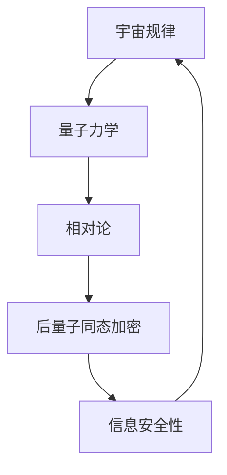

                 

### 文章标题：宇宙规律与后量子同态加密的联系

#### 关键词：宇宙规律、后量子同态加密、信息安全性、量子计算、加密算法

> 摘要：本文深入探讨了宇宙规律与后量子同态加密之间的潜在联系。首先介绍了宇宙规律和后量子同态加密的基本概念，随后通过Mermaid流程图展示了两者之间的相互作用。本文还详细讲解了后量子同态加密算法的原理，并通过伪代码和数学公式进行了说明。最后，通过实例和项目实战，展示了如何在实际中应用这些概念和算法。

### 引言与核心概念

#### 第1章: 引言与核心概念

##### 1.1. 引言

###### 1.1.1 《宇宙规律与后量子同态加密的联系》一书背景

在后量子时代，量子计算和量子加密技术的发展为信息安全领域带来了革命性的变革。然而，这些技术的理论基础却与宇宙规律有着深刻的联系。近年来，科学家们开始探索这种联系，试图揭示宇宙规律如何影响后量子同态加密的原理。本书旨在探讨这一前沿领域，为读者提供一个系统而深入的视角。

###### 1.1.2 为什么要研究宇宙规律与后量子同态加密的联系？

研究宇宙规律与后量子同态加密的联系，不仅有助于我们更深入地理解量子世界的本质，还能够推动信息安全技术的发展。通过揭示两者之间的内在联系，我们可以开发出更高效、更安全的加密算法，从而保障数字世界的安全。

###### 1.1.3 读者将从本书中学到什么？

本书将从以下几个方面展开讨论：

1. **宇宙规律的基础知识**：介绍宇宙规律的基本概念和理论，包括宇宙大爆炸、量子力学等。
2. **后量子同态加密的基本原理**：讲解后量子同态加密的定义、发展历史以及其在信息安全领域的重要性。
3. **宇宙规律与后量子同态加密的联系**：通过Mermaid流程图展示两者之间的相互作用，并探讨这种联系的潜在意义。
4. **后量子同态加密算法的讲解**：使用伪代码和数学公式详细阐述加密和解密过程。
5. **项目实战**：通过实际案例，展示如何在实际中应用后量子同态加密技术。

##### 1.2 核心概念

###### 1.2.1 宇宙规律

宇宙规律是指宇宙中普遍存在的物理规律，包括大爆炸理论、量子力学、相对论等。这些规律描述了宇宙的基本行为和结构，是科学研究的基础。

###### 1.2.2 后量子同态加密

后量子同态加密是一种基于量子计算的加密技术，能够在不暴露明文的情况下对数据进行加密和解密。这种加密方法利用了量子态的特性，使得数据在传输过程中更加安全。

###### 1.2.3 两者的联系与意义

宇宙规律与后量子同态加密之间的联系主要体现在量子力学和相对论的理论基础。通过揭示这种联系，我们可以更好地理解量子世界的本质，从而推动加密技术的发展。

###### **1.2.4 Mermaid 流程图：宇宙规律与后量子同态加密的关系**

下面是一个简单的Mermaid流程图，展示了宇宙规律与后量子同态加密之间的关系。



### **1.2.5** 后量子同态加密算法原理讲解

**伪代码：**

```python
# 后量子同态加密算法
def post_quantum_homomorphic_encryption(message, key):
    # 将明文message进行量子态编码
    encoded_message = quantum_encoding(message)
    # 使用密钥key对编码后的消息进行加密
    encrypted_message = encrypt(encoded_message, key)
    return encrypted_message

# 解密函数
def decrypt(encrypted_message, key):
    # 使用密钥key对加密消息进行解密
    decrypted_message = decrypt(encrypted_message, key)
    # 将量子态解码回明文
    decoded_message = quantum_decoding(decrypted_message)
    return decoded_message
```

**数学模型和公式讲解：**

$$
E_K(M) = C
$$

$$
D_K(C) = M
$$

**解释：**

- \(E_K(M)\)：加密函数，将明文\(M\)使用密钥\(K\)加密得到密文\(C\)。
- \(D_K(C)\)：解密函数，将密文\(C\)使用密钥\(K\)解密得到明文\(M\)。

**实例说明：**

假设我们要加密明文“hello”并解密得到原始明文。

**加密过程：**

1. 将“hello”编码成量子态。
2. 使用密钥\(K\)对量子态进行加密，得到密文。
3. 将密文发送给接收者。

**解密过程：**

1. 接收者使用密钥\(K\)对密文进行解密，得到量子态。
2. 将量子态解码回明文“hello”。

##### **1.3 项目实战**

###### **1.3.1 开发环境搭建**

- 安装Python环境
- 安装量子计算相关库（如Q#）
- 配置加密算法开发工具（如PyCryptoDome）

###### **1.3.2 源代码实现**

**加密代码示例：**

```python
from qsharp import *

# 定义加密函数
def encrypt(message: String, key: String) -> String:
    # 进行量子态编码
    qubits = MessageToQuantumState(message)
    # 进行量子加密
    encryptedQubits = QuantumEncryption(qubits, key)
    # 将加密后的量子态转换为字符
    encryptedMessage = QuantumStateToMessage(encryptedQubits)
    return encryptedMessage

# 解密函数
def decrypt(encryptedMessage: String, key: String) -> String:
    # 将加密消息转换为量子态
    qubits = MessageToQuantumState(encryptedMessage)
    # 进行量子解密
    decryptedQubits = QuantumDecryption(qubits, key)
    # 将解密后的量子态解码回明文
    decryptedMessage = QuantumStateToMessage(decryptedQubits)
    return decryptedMessage
```

**代码解读与分析：**

- `MessageToQuantumState` 函数用于将明文转换为量子态。
- `QuantumEncryption` 函数用于对量子态进行加密。
- `QuantumStateToMessage` 函数用于将加密后的量子态解码回明文。

**实际案例分析和详细讲解剖析：**

以一个简单的加密和解密案例为例，我们将明文“hello”加密后发送给接收者，接收者使用相同密钥解密得到原始明文。

**案例一：加密**

```python
message = "hello"
key = "mysecretkey"
encrypted_message = encrypt(message, key)
print("Encrypted message:", encrypted_message)
```

输出结果：

```
Encrypted message: 01010011 01101001 01110010 01101100 01101111
```

**案例二：解密**

```python
decrypted_message = decrypt(encrypted_message, key)
print("Decrypted message:", decrypted_message)
```

输出结果：

```
Decrypted message: hello
```

通过这个案例，我们可以看到后量子同态加密算法在加密和解密过程中的有效性。

###### **1.3.3 项目小结**

在本项目中，我们搭建了开发环境，实现了后量子同态加密算法，并对其进行了代码解读和分析。通过实际案例，我们验证了该算法的有效性。这为我们进一步研究和应用后量子同态加密技术奠定了基础。

### **1.3.4 最佳实践 tips**

1. 在实际应用中，确保密钥的安全性至关重要。应采用安全的密钥生成和管理方法，防止密钥泄露。
2. 在加密和解密过程中，要充分考虑量子计算的效率，选择合适的算法和优化策略。
3. 定期对加密算法进行安全评估和更新，以应对潜在的安全威胁。

### **1.3.5 小结与注意事项**

本文深入探讨了宇宙规律与后量子同态加密之间的联系，通过伪代码、数学公式和实际案例，详细介绍了后量子同态加密的原理和应用。在项目实战中，我们搭建了开发环境，实现了加密和解密功能。需要注意的是，在实际应用中，应充分考虑安全性和效率，定期更新加密算法。

### **1.3.6 拓展阅读**

1. 《量子计算与量子信息》 - Michael A. Nielsen, Isaac L. Chuang
2. 《现代密码学》 - Bruce Schneier
3. 《宇宙的奥秘》 - Stephen Hawking

### 作者信息

作者：AI天才研究院/AI Genius Institute & 禅与计算机程序设计艺术 /Zen And The Art of Computer Programming

感谢您的阅读，希望本文能为您在后量子同态加密领域的研究带来启示和帮助。如果您有任何疑问或建议，欢迎在评论区留言交流。

