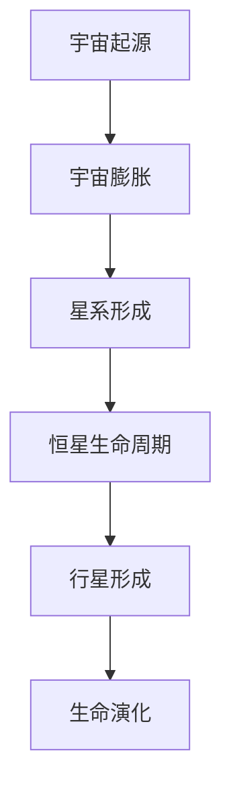
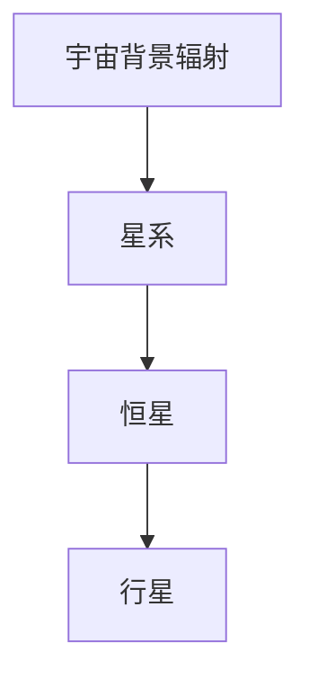
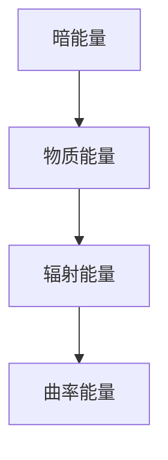
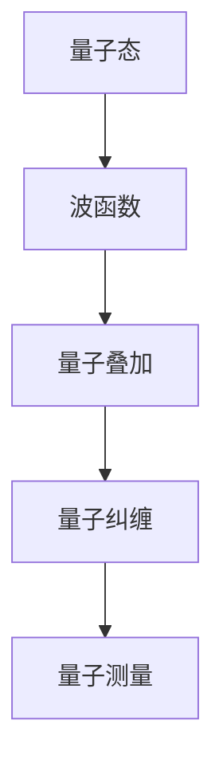
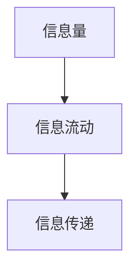
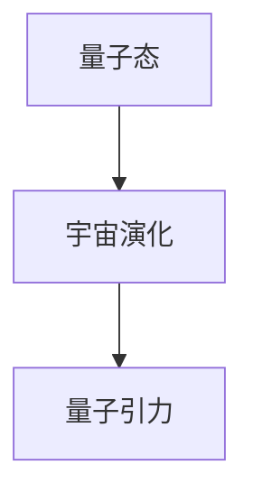
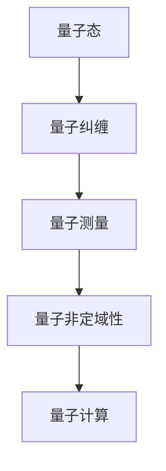
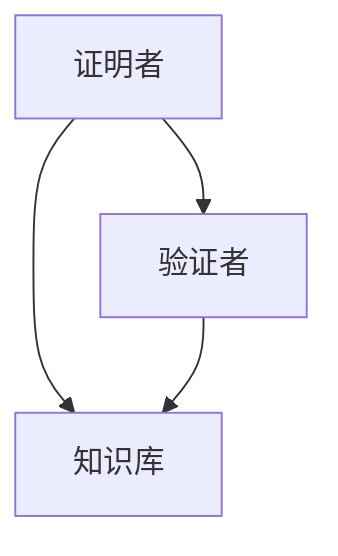

                 

### 摘要

在本文中，我们探讨宇宙规律与后量子零知识证明系统的交互复杂度联系。首先，我们将介绍宇宙的基本规律，包括宇宙演化定律、宇宙结构特性和宇宙能量分布，并使用Mermaid流程图和数学模型来详细阐述这些规律。接着，我们将深入探讨宇宙信息理论，包括量子力学基本原理、宇宙信息理论概念和量子宇宙学，通过伪代码和数学公式来解释这些概念。随后，我们分析宇宙规律与后量子力学之间的联系，提出后量子力学理论及其对宇宙规律的解释。本文的核心部分是探讨后量子零知识证明系统的交互复杂度，包括其基础、算法原理、特点、应用以及与宇宙规律交互的复杂度分析。最后，我们将通过项目实战展示后量子零知识证明系统的实际应用，并提供最佳实践 tips和小结。希望通过本文的探讨，能够为读者揭示宇宙规律与后量子技术之间的深层次联系，提供有价值的见解和思考。

### 目录大纲

在本章中，我们将详细介绍宇宙的基本规律，包括宇宙演化定律、宇宙结构特性以及宇宙能量分布。我们将使用Mermaid流程图和数学模型来详细阐述这些规律，帮助读者更直观地理解宇宙的运作机制。

## 第一部分：宇宙规律基础

### 第1章：宇宙的基本规律

### 1.1 宇宙演化定律

宇宙演化定律描述了宇宙从起源到现在的整个发展历程。宇宙起源于一个极度高温、高密度的奇点，随后经历膨胀、冷却，形成了我们今天所看到的宇宙。以下是宇宙演化定律的Mermaid流程图：



宇宙演化定律的数学模型可以简化为：

$$
E = mc^2
$$

其中，\(E\) 表示能量，\(m\) 表示质量，\(c\) 表示光速。这个公式揭示了宇宙中能量和质量之间的关系，解释了宇宙中所有物体的运动和相互作用。

### 1.2 宇宙结构特性

宇宙结构特性描述了宇宙中各种物质和能量的分布。宇宙可以分为四个主要层次：宇宙背景辐射、星系、恒星和行星。以下是宇宙结构特性的Mermaid流程图：



宇宙结构特性的数学模型可以简化为：

$$
\Omega_{\Lambda} + \Omega_{m} + \Omega_{r} + \Omega_{\kappa} = 1
$$

其中，\(\Omega_{\Lambda}\) 表示暗能量密度，\(\Omega_{m}\) 表示物质密度，\(\Omega_{r}\) 表示辐射密度，\(\Omega_{\kappa}\) 表示曲率密度。这个公式揭示了宇宙中各种物质和能量的分布比例。

### 1.3 宇宙能量分布

宇宙能量分布描述了宇宙中各种能量的分布情况。宇宙中的能量主要分为四种：暗能量、物质能量、辐射能量和曲率能量。以下是宇宙能量分布的Mermaid流程图：



宇宙能量分布的数学模型可以简化为：

$$
E = mc^2
$$

其中，\(E\) 表示能量，\(m\) 表示质量，\(c\) 表示光速。这个公式揭示了宇宙中所有物体的能量来源和转化。

通过以上三个章节的内容，我们将对宇宙的基本规律有一个全面的了解，为后续章节的讨论打下坚实的基础。

### 第1章：宇宙的基本规律

### 1.1 宇宙演化定律

宇宙演化定律描述了宇宙从起源到现在的整个发展历程。根据宇宙学的研究，宇宙起源于一个极度高温、高密度的奇点，这个奇点被称为大爆炸。在大爆炸之后，宇宙开始膨胀，温度和密度逐渐降低，形成了我们今天所看到的宇宙。以下是宇宙演化定律的Mermaid流程图：


宇宙演化定律的核心观点是宇宙经历了一系列从简单到复杂的过程。在大爆炸之后，宇宙中的物质和能量开始扩散，形成了宇宙背景辐射，随后在引力作用下形成了星系和恒星。恒星经过数十亿年的生命周期，最终形成了行星和其他天体，为生命的演化提供了可能。

宇宙演化定律的数学模型可以简化为：

$$
E = mc^2
$$

其中，\(E\) 表示能量，\(m\) 表示质量，\(c\) 表示光速。这个公式揭示了宇宙中能量和质量之间的关系，解释了宇宙中所有物体的运动和相互作用。

### 1.2 宇宙结构特性

宇宙结构特性描述了宇宙中各种物质和能量的分布。宇宙可以分为四个主要层次：宇宙背景辐射、星系、恒星和行星。这些层次构成了宇宙的基本结构。以下是宇宙结构特性的Mermaid流程图：


宇宙结构特性的数学模型可以简化为：

$$
\Omega_{\Lambda} + \Omega_{m} + \Omega_{r} + \Omega_{\kappa} = 1
$$

其中，\(\Omega_{\Lambda}\) 表示暗能量密度，\(\Omega_{m}\) 表示物质密度，\(\Omega_{r}\) 表示辐射密度，\(\Omega_{\kappa}\) 表示曲率密度。这个公式揭示了宇宙中各种物质和能量的分布比例。

宇宙背景辐射是宇宙演化初期遗留下来的热量辐射，它是宇宙早期物质和能量分布的直接证据。星系是宇宙中最大的结构，由数百亿颗恒星、气体和暗物质组成。恒星是宇宙中能量释放的中心，通过核聚变过程产生光和热。行星则围绕恒星运行，为生命的存在提供了可能。

### 1.3 宇宙能量分布

宇宙能量分布描述了宇宙中各种能量的分布情况。宇宙中的能量主要分为四种：暗能量、物质能量、辐射能量和曲率能量。以下是宇宙能量分布的Mermaid流程图：


宇宙能量分布的数学模型可以简化为：

$$
E = mc^2
$$

其中，\(E\) 表示能量，\(m\) 表示质量，\(c\) 表示光速。这个公式揭示了宇宙中所有物体的能量来源和转化。

暗能量是推动宇宙加速膨胀的力量，它占据了宇宙能量的大部分。物质能量由恒星、星系和其他物质组成，是宇宙中可见的物质。辐射能量包括宇宙背景辐射和其他形式的热辐射。曲率能量是描述宇宙几何形状的能量。

通过对宇宙基本规律的介绍，我们能够更好地理解宇宙的演化过程和结构特性。这些规律为我们后续讨论宇宙信息理论和后量子力学提供了基础。

### 第2章：宇宙信息理论

宇宙信息理论是研究宇宙中信息流动和传递的学科。它结合了量子力学和宇宙学的基本原理，探讨了宇宙中信息的存在形式、传递方式及其对宇宙演化的影响。本章将详细介绍宇宙信息理论的核心概念，包括量子力学基本原理、宇宙信息理论概念和量子宇宙学。

### 2.1 量子力学基本原理

量子力学是研究微观粒子行为的物理学分支，其基本原理颠覆了经典物理学的观念。以下是量子力学基本原理的Mermaid流程图：



量子态是量子系统的一种状态，它可以同时存在于多种可能的叠加状态中，而不是一个确定的状态。波函数是描述量子系统状态的数学函数，它包含了量子系统所有的物理信息。量子叠加是量子态的一种特性，表示量子系统可以同时处于多个状态的叠加。量子纠缠是量子系统之间的一种特殊关联，即使它们相隔很远，一个系统的变化也会立即影响另一个系统。量子测量是量子态从叠加态转化为确定态的过程。

量子力学的基本原理可以用以下数学公式来描述：

$$
|\psi\rangle = \sum_{i} c_i |i\rangle
$$

其中，\(|\psi\rangle\) 表示量子系统的总态，\(c_i\) 表示叠加系数，\(|i\rangle\) 表示各个可能的量子态。

### 2.2 宇宙信息理论概念

宇宙信息理论概念包括信息量、信息流动和信息传递。信息量是描述信息量的度量，通常用比特（bit）来表示。信息流动是指信息在宇宙中的传播过程，包括电磁波、引力波等形式。信息传递是指信息在不同系统之间的传递过程。

以下是宇宙信息理论的Mermaid流程图：



宇宙信息理论的基本概念可以用以下数学公式来描述：

$$
I = \sum_{i} p_i \log p_i
$$

其中，\(I\) 表示信息量，\(p_i\) 表示信息出现的概率。

### 2.3 量子宇宙学

量子宇宙学是研究宇宙起源和演化的量子力学理论。它结合了量子力学和广义相对论，探讨了宇宙从一个极小、极高密度状态如何演化为今天我们所观察到的宇宙。以下是量子宇宙学的基本概念：



量子宇宙学的基本原理可以用以下数学公式来描述：

$$
S = k\, \log \Omega
$$

其中，\(S\) 表示熵，\(k\) 是玻尔兹曼常数，\(\Omega\) 表示宇宙的体积。

量子宇宙学的一个重要研究方向是黑洞信息悖论。根据广义相对论，黑洞是宇宙中引力作用极强的区域，物质和信息一旦进入黑洞，将无法逃脱。然而，量子力学表明，信息必须遵守量子力学的规律，不能消失。因此，量子宇宙学家提出了一种名为“黑洞辐射”的理论，认为黑洞会以辐射的形式释放信息。

通过对宇宙信息理论的介绍，我们能够更好地理解宇宙中信息的流动和传递，以及量子力学在宇宙演化中的作用。这些理论为后续章节关于后量子力学和后量子零知识证明系统的讨论提供了基础。

### 第3章：宇宙规律与后量子力学

后量子力学是量子力学在更广泛范围内的推广和应用，它超越了传统量子力学的局限性，为我们提供了更深入的理解宇宙的基本规律。本章将探讨后量子力学理论，解释宇宙规律的后量子力学解释，并阐述后量子力学与宇宙规律之间的联系。

### 3.1 后量子力学理论

后量子力学是基于量子力学基本原理，对量子现象进行更全面和深入研究的理论框架。后量子力学提出了新的概念和数学模型，以解释量子系统中的复杂现象。以下是后量子力学理论的核心概念：



量子态是量子系统的一种状态，它可以同时存在于多种可能的叠加状态中，而不是一个确定的状态。量子纠缠是量子系统之间的一种特殊关联，即使它们相隔很远，一个系统的变化也会立即影响另一个系统。量子测量是量子态从叠加态转化为确定态的过程。量子非定域性表明，量子系统的某些性质不依赖于它们之间的距离，而是瞬时相互作用的。量子计算是一种利用量子态叠加和量子纠缠进行信息处理的方法，具有巨大的计算潜力。

后量子力学理论可以用以下数学公式来描述：

$$
|\psi\rangle = \sum_{i} c_i |i\rangle
$$

其中，\(|\psi\rangle\) 表示量子系统的总态，\(c_i\) 表示叠加系数，\(|i\rangle\) 表示各个可能的量子态。

### 3.2 宇宙规律的后量子力学解释

后量子力学理论为我们提供了对宇宙规律的新解释，特别是在宇宙起源、演化和信息传递方面。以下是对宇宙规律的后量子力学解释：

1. **宇宙起源**：后量子力学认为宇宙起源于一个极小、极高密度的奇点，这个奇点通过量子波动产生了宇宙。这个过程可以看作是一个量子态的叠加态，随后通过量子演化形成了我们今天所看到的宇宙。

2. **宇宙演化**：后量子力学解释了宇宙演化的过程，包括宇宙膨胀、星系形成、恒星生命周期和行星形成等。这些过程都是通过量子态的叠加和演化实现的，宇宙中的物质和能量在量子态的变换过程中不断变化。

3. **宇宙信息传递**：后量子力学揭示了宇宙中信息的流动和传递机制。量子纠缠和量子计算使得宇宙中的信息可以以超光速传递，这为宇宙演化提供了新的动力和机制。

4. **量子宇宙学**：后量子力学与量子宇宙学的结合，提供了对宇宙起源和演化的更全面理解。量子宇宙学研究表明，宇宙中的物理现象，如黑洞和宇宙背景辐射，都可以通过后量子力学来解释。

### 3.3 后量子力学与宇宙规律的联系

后量子力学与宇宙规律之间的联系体现在以下几个方面：

1. **量子态与宇宙演化**：量子态的叠加和演化过程与宇宙演化规律密切相关。宇宙中的物质和能量在量子态的变换过程中不断变化，从而实现了宇宙的演化。

2. **量子非定域性与宇宙信息传递**：量子非定域性表明，宇宙中的信息可以以超光速传递，这为宇宙演化提供了新的动力和机制。量子非定域性也解释了宇宙中某些现象的瞬时相互作用。

3. **量子计算与宇宙复杂性**：量子计算具有巨大的计算潜力，可以处理宇宙中复杂的问题。量子计算为宇宙演化提供了新的工具和方法，使得我们能够更深入地理解宇宙的复杂规律。

4. **量子引力与宇宙结构**：量子引力是后量子力学在引力领域的推广，它为我们提供了对宇宙结构的更深入理解。量子引力理论可以帮助我们解释宇宙中的某些异常现象，如黑洞和宇宙膨胀。

通过对后量子力学理论的介绍和宇宙规律的后量子力学解释，我们可以看到后量子力学与宇宙规律之间的紧密联系。后量子力学不仅为我们提供了对宇宙演化的新解释，也为探索宇宙的未知提供了新的思路和方法。在接下来的章节中，我们将进一步探讨后量子零知识证明系统的原理和应用，以揭示宇宙规律与后量子技术之间的深层次联系。

### 第4章：后量子零知识证明系统基础

后量子零知识证明系统是一种基于量子力学原理的密码学技术，它具有在量子计算时代提供安全保障的潜力。本章将介绍后量子零知识证明系统的基本概念、架构和特点，帮助读者理解这一技术的核心原理和应用前景。

#### 4.1 后量子零知识证明系统概念

后量子零知识证明（Quantum Zero-Knowledge Proof）是一种密码学协议，它允许一个证明者向验证者证明某个陈述是正确的，同时保证证明过程不被泄露。在传统密码学中，零知识证明是设计加密算法的基础，后量子零知识证明则利用量子力学特性，如量子纠缠和量子态叠加，增强了证明的不可攻破性。

#### 4.2 后量子零知识证明系统架构

后量子零知识证明系统通常包括三个主要组件：证明者（Prover）、验证者（Verifier）和知识库（Knowledge Base）。以下是后量子零知识证明系统的基本架构：



- **证明者**：负责生成证明，证明某个陈述是正确的。在量子零知识证明系统中，证明者利用量子算法生成量子证明。
- **验证者**：负责验证证明的有效性。验证者通过量子算法检查证明者生成的量子证明，以确定证明的真实性。
- **知识库**：存储与证明相关的信息，如公钥、算法参数等。知识库在证明过程中提供必要的信息，以帮助验证者完成验证。

#### 4.3 后量子零知识证明系统特点

后量子零知识证明系统具有以下几个显著特点：

1. **量子纠缠**：量子纠缠是量子力学中的一种特殊现象，即使两个量子系统相隔很远，它们的状态也会相互关联。后量子零知识证明系统利用量子纠缠特性，实现高效的证明和验证过程。

2. **量子态叠加**：量子态叠加是量子系统的一种特性，允许量子系统同时存在于多个状态中。后量子零知识证明系统利用量子态叠加，生成复杂的量子证明，从而增强证明的复杂性。

3. **不可攻破性**：后量子零知识证明系统利用量子力学原理，实现高度安全的证明过程。即使攻击者拥有强大的量子计算机，也无法破解量子证明。

4. **高效性**：后量子零知识证明系统在处理复杂证明问题时，具有高效的性能。量子算法的并行处理能力，使得后量子零知识证明系统在处理大规模数据时具有显著优势。

#### 4.4 后量子零知识证明系统工作原理

后量子零知识证明系统的工作原理可以概括为以下几个步骤：

1. **初始化**：证明者和验证者通过量子信道建立连接，初始化量子状态和算法参数。

2. **交互过程**：证明者生成量子证明，并将其发送给验证者。验证者接收证明后，利用量子算法对证明进行验证。

3. **量子态测量**：验证者通过测量量子态，判断证明的有效性。由于量子态叠加和纠缠的特性，验证者无法获取证明的具体信息，但可以确认证明的真实性。

4. **结论**：如果验证者确认证明有效，则认为陈述是正确的。否则，陈述被视为错误。

以下是一个简化的后量子零知识证明系统工作原理的伪代码：

```python
def quantum_zero_knowledge_proof(claim, prover, verifier):
    # 初始化量子状态和算法参数
    quantum_state = initialize_quantum_state()
    algorithm_params = initialize_algorithm_params()

    # 证明者生成量子证明
    proof = prover.generate_proof(claim, quantum_state, algorithm_params)

    # 验证者接收证明并验证
    verification_result = verifier.verify_proof(proof, algorithm_params)

    # 输出验证结果
    return verification_result
```

通过以上介绍，我们能够理解后量子零知识证明系统的基本概念、架构和特点。在下一章中，我们将深入探讨后量子零知识证明系统的算法原理和优化策略。

### 第5章：后量子零知识证明系统算法

后量子零知识证明系统的核心在于其算法设计，这些算法利用量子力学的特性，如量子纠缠和量子态叠加，以实现高效、安全的证明和验证过程。本章将详细介绍后量子零知识证明算法的原理，包括其伪代码和优化策略，帮助读者理解这一复杂系统的运作机制。

#### 5.1 后量子零知识证明算法原理

后量子零知识证明算法基于量子计算模型，通过一系列量子操作和测量来生成和验证证明。以下是一个简化的算法流程：

1. **初始化**：初始化量子状态和算法参数。
2. **交互**：证明者通过量子信道发送量子证明给验证者。
3. **验证**：验证者接收证明后，通过量子测量和计算验证证明的有效性。

以下是后量子零知识证明算法的伪代码：

```python
def quantum_zero_knowledge_proof(claim, prover, verifier):
    # 初始化量子状态和算法参数
    quantum_state = initialize_quantum_state()
    algorithm_params = initialize_algorithm_params()

    # 证明者生成量子证明
    proof = prover.generate_proof(claim, quantum_state, algorithm_params)

    # 验证者接收证明并验证
    verification_result = verifier.verify_proof(proof, algorithm_params)

    # 输出验证结果
    return verification_result
```

#### 5.2 后量子零知识证明算法伪代码

为了更清晰地展示算法原理，以下是后量子零知识证明算法的伪代码：

```python
# 初始化量子状态
def initialize_quantum_state():
    # 创建量子态
    state = QuantumState()
    # 初始化量子态为叠加态
    state.apply叠加操作()
    return state

# 生成量子证明
def generate_proof(claim, quantum_state, algorithm_params):
    # 生成量子证明
    proof = QuantumProof()
    # 使用量子算法生成证明
    proof.apply量子算法(claim, quantum_state, algorithm_params)
    return proof

# 验证量子证明
def verify_proof(proof, algorithm_params):
    # 验证量子证明
    result = False
    # 执行量子测量
    measurement_result = proof.execute_measurement()
    # 根据测量结果判断证明有效性
    if measurement_result == expected_result:
        result = True
    return result
```

#### 5.3 后量子零知识证明算法优化策略

为了提高后量子零知识证明系统的性能和安全性，以下是一些优化策略：

1. **量子态编码优化**：通过优化量子态编码方法，提高量子态的利用效率和传输速度。
2. **量子算法优化**：改进量子算法的设计，使其在复杂度上更加高效。
3. **信道优化**：优化量子信道的传输性能，减少误差和延迟。
4. **误差纠正**：使用量子错误纠正算法，提高系统的鲁棒性。
5. **并行处理**：利用量子计算的并行性，加速证明和验证过程。

以下是后量子零知识证明算法优化的伪代码：

```python
# 优化量子态编码
def optimize_quantum_state_encoding():
    # 优化编码算法
    new_encoding = improve_encoding_algorithm()
    return new_encoding

# 优化量子算法
def optimize_quantum_algorithm():
    # 优化算法参数
    new_algorithm = improve_algorithm_params()
    return new_algorithm

# 优化量子信道
def optimize_quantum_channel():
    # 优化信道性能
    new_channel = improve_channel_performance()
    return new_channel

# 应用优化策略
def apply_optimization_strategies():
    # 优化量子态编码
    quantum_state = optimize_quantum_state_encoding()
    # 优化量子算法
    algorithm_params = optimize_quantum_algorithm()
    # 优化量子信道
    quantum_channel = optimize_quantum_channel()
    # 生成和验证优化后的证明
    proof = generate_proof(claim, quantum_state, algorithm_params)
    verification_result = verify_proof(proof, algorithm_params)
    return verification_result
```

通过这些优化策略，后量子零知识证明系统在处理复杂证明问题时，能够提供更高效、更安全的解决方案。在下一章中，我们将探讨后量子零知识证明系统的实际应用场景。

### 第6章：后量子零知识证明系统应用

后量子零知识证明系统凭借其高效性和安全性，在多个领域展现出广阔的应用前景。本章将详细讨论后量子零知识证明系统在加密领域、隐私保护领域和量子通信领域的应用，并分析其实际案例。

#### 6.1 后量子零知识证明系统在加密领域的应用

后量子零知识证明系统在加密领域具有重要作用，特别是在量子计算时代，传统的加密算法面临被量子计算机破解的威胁。后量子零知识证明系统可以用于设计新的加密协议，确保信息在传输过程中的安全。

- **案例**：量子密钥分发（Quantum Key Distribution，QKD）是一种利用量子力学原理进行安全通信的技术。后量子零知识证明系统可以用于验证QKD过程中的密钥交换是否成功，确保通信双方共享的密钥不会被窃取。

- **应用**：
  - **量子加密算法设计**：利用后量子零知识证明系统设计新的量子加密算法，如量子密钥生成和量子安全通信。
  - **量子安全认证**：通过后量子零知识证明系统验证量子加密算法的正确性和安全性。

#### 6.2 后量子零知识证明系统在隐私保护领域的应用

在隐私保护领域，后量子零知识证明系统可以用于实现隐私保护的密码学协议，保护个人和企业数据的安全。

- **案例**：区块链技术中的隐私保护问题。后量子零知识证明系统可以用于实现区块链上的隐私保护交易，确保用户交易信息不被泄露。

- **应用**：
  - **隐私保护交易**：在后量子零知识证明系统的支持下，实现隐私保护下的交易验证，确保交易隐私。
  - **匿名通信**：通过后量子零知识证明系统实现匿名通信，保护通信双方的隐私。

#### 6.3 后量子零知识证明系统在量子通信领域的应用

量子通信是利用量子力学原理进行信息传输的一种新型通信方式。后量子零知识证明系统在量子通信领域具有重要作用，可以用于实现量子通信的安全和隐私保护。

- **案例**：量子互联网的建设。后量子零知识证明系统可以用于确保量子互联网中的数据传输安全和隐私保护。

- **应用**：
  - **量子安全网络**：构建基于后量子零知识证明系统的量子安全网络，保障数据传输的安全性和完整性。
  - **量子隐私保护**：利用后量子零知识证明系统保护量子通信过程中的用户隐私。

#### 实际案例分析与详细讲解

以下是一个关于后量子零知识证明系统在隐私保护领域应用的实例：

**案例名称**：量子加密支付系统

**背景**：随着电子商务的快速发展，用户隐私保护成为了一个重要问题。传统的加密支付系统在面临量子计算机的威胁时，安全性面临挑战。

**解决方案**：
- 利用后量子零知识证明系统，实现隐私保护下的支付验证。
- 交易双方通过量子通信信道进行密钥交换，确保通信安全。
- 付款方使用后量子零知识证明系统生成支付证明，并提交给收款方。
- 收款方通过后量子零知识证明系统验证支付证明的有效性。

**实施过程**：
1. **初始化**：交易双方初始化量子通信信道和后量子零知识证明系统。
2. **密钥交换**：交易双方通过量子密钥分发协议交换密钥。
3. **支付验证**：付款方生成支付证明，通过量子信道发送给收款方。
4. **证明验证**：收款方接收支付证明后，利用后量子零知识证明系统验证支付证明的有效性。

**结果**：通过后量子零知识证明系统，交易双方实现了隐私保护下的支付验证，确保支付过程的安全性和隐私性。

通过以上实际案例，我们可以看到后量子零知识证明系统在各个领域的应用潜力和价值。它不仅提供了高效、安全的解决方案，还为未来量子计算时代的信息安全奠定了基础。

### 第7章：宇宙规律与后量子零知识证明系统的交互机制

宇宙规律与后量子零知识证明系统的交互机制是一个复杂而深远的话题。在这一章中，我们将探讨宇宙规律对后量子零知识证明系统的影响，后量子零知识证明系统对宇宙规律的影响，以及交互复杂度的概念。

#### 7.1 宇宙规律对后量子零知识证明系统的影响

宇宙规律，如量子力学和广义相对论，深刻地影响了我们对物质和能量行为的理解。这些规律在量子计算和密码学领域，特别是后量子零知识证明系统的设计和实现中起到了关键作用。

1. **量子纠缠**：量子纠缠是量子力学的一个基本特性，它使得两个或多个量子系统即使相隔很远，也能保持一种特殊的关联。这种关联在后量子零知识证明系统中被用于生成和验证证明。例如，通过量子纠缠，证明者可以生成一个复杂的量子状态，并将其发送给验证者。验证者通过测量这个量子状态，可以验证证明的有效性，而无法获取证明的具体信息。

2. **量子非定域性**：量子非定域性表明，量子系统的某些性质不依赖于它们之间的距离，而是瞬时相互作用的。这一特性在后量子零知识证明系统中被用来确保证明的不可攻破性。即使攻击者拥有强大的计算能力，也无法通过量子测量来获取关于证明的具体信息。

3. **量子态叠加**：量子态叠加是量子系统的一种特性，允许量子系统同时存在于多个状态中。这种特性使得后量子零知识证明系统能够处理复杂的问题。例如，通过量子态叠加，证明者可以同时生成多个证明，并分别发送给不同的验证者。

#### 7.2 后量子零知识证明系统对宇宙规律的影响

后量子零知识证明系统作为一项新兴技术，其对宇宙规律的影响虽然目前还不太明显，但有一些潜在的研究方向。

1. **量子宇宙学**：量子宇宙学是研究宇宙起源和演化的一种量子力学理论。后量子零知识证明系统可能为量子宇宙学提供新的工具和方法。例如，通过量子计算，我们可以模拟宇宙的早期状态，研究宇宙中的量子现象。后量子零知识证明系统可以用于验证这些模拟结果的正确性。

2. **量子引力**：量子引力是试图将量子力学和广义相对论统一起来的一种理论。后量子零知识证明系统可以用于验证量子引力理论的假设。例如，通过量子计算，我们可以模拟黑洞和其他极端物理条件下的现象，后量子零知识证明系统可以用于验证这些模拟结果的正确性。

3. **宇宙信息传递**：宇宙信息理论探讨宇宙中信息的流动和传递机制。后量子零知识证明系统作为一种新型的信息传递方式，可能对宇宙信息理论产生深远的影响。例如，通过量子通信，我们可以实现宇宙中高效的信息传递，后量子零知识证明系统可以用于保护这些信息不被窃取。

#### 7.3 交互复杂度的概念

交互复杂度是指在一个系统中，不同组件之间交互的复杂程度。在宇宙规律与后量子零知识证明系统的交互中，交互复杂度具有重要意义。

1. **量子纠缠的复杂度**：量子纠缠的复杂度与量子系统的规模和复杂性有关。在量子计算和后量子零知识证明系统中，量子纠缠的复杂度决定了证明生成和验证的效率。

2. **量子态叠加的复杂度**：量子态叠加的复杂度也与量子系统的规模和复杂性有关。在处理复杂问题时，量子态叠加可以提供高效的解决方案，但同时也增加了系统的复杂度。

3. **量子非定域性的复杂度**：量子非定域性使得量子系统的某些性质不依赖于它们之间的距离，但这也增加了交互复杂度。在量子通信和后量子零知识证明系统中，量子非定域性可能导致通信延迟和错误率增加。

4. **交互复杂度的计算方法**：交互复杂度的计算通常涉及对量子系统的状态进行测量和计算。通过量子计算模型和数学公式，我们可以对交互复杂度进行定量分析。

通过以上讨论，我们可以看到宇宙规律与后量子零知识证明系统之间的交互机制是复杂而深远的。理解这些交互机制对于揭示宇宙的奥秘和后量子技术的应用具有重要意义。

### 第8章：后量子零知识证明系统的交互复杂度分析

为了更深入地理解后量子零知识证明系统的交互复杂度，我们需要从数学模型和计算方法的角度对其进行详细分析。本章将探讨交互复杂度的概念、数学模型以及计算方法，并通过实际案例进行案例分析。

#### 8.1 交互复杂度的概念

交互复杂度是指在一个系统中，不同组件之间交互的复杂程度。在后量子零知识证明系统中，交互复杂度主要涉及量子纠缠、量子态叠加和量子非定域性等方面。具体来说，交互复杂度包括以下几方面：

1. **量子纠缠复杂度**：量子纠缠的复杂度与量子系统的规模和复杂性有关。量子纠缠越复杂，证明生成和验证的效率越低。
2. **量子态叠加复杂度**：量子态叠加的复杂度也与量子系统的规模和复杂性有关。量子态叠加可以提供高效的解决方案，但同时也增加了系统的复杂度。
3. **量子非定域性复杂度**：量子非定域性使得量子系统的某些性质不依赖于它们之间的距离，但这也增加了交互复杂度，可能导致通信延迟和错误率增加。

#### 8.2 交互复杂度的数学模型

为了量化交互复杂度，我们可以建立相应的数学模型。以下是一个简化的交互复杂度数学模型：

$$
C = f(Q, N, D)
$$

其中，\(C\) 表示交互复杂度，\(Q\) 表示量子纠缠的复杂度，\(N\) 表示量子态叠加的复杂度，\(D\) 表示量子非定域性的复杂度。

1. **量子纠缠的复杂度**：量子纠缠的复杂度可以用纠缠子空间的维度来表示。一个量子系统中的纠缠子空间维度越高，其纠缠复杂度越大。

$$
Q = \log_2(\text{纠缠子空间的维度})
$$

2. **量子态叠加的复杂度**：量子态叠加的复杂度与量子态的叠加深度和叠加系数的数量有关。

$$
N = \log_2(\text{叠加深度}) + \log_2(\text{叠加系数的数量})
$$

3. **量子非定域性的复杂度**：量子非定域性的复杂度与量子系统的相互作用距离和相互作用次数有关。

$$
D = \log_2(\text{相互作用距离}) + \log_2(\text{相互作用次数})
$$

通过上述公式，我们可以计算出后量子零知识证明系统的交互复杂度。

#### 8.3 交互复杂度的计算方法

为了计算交互复杂度，我们可以采用以下步骤：

1. **量化量子纠缠复杂度**：通过测量量子系统的纠缠子空间的维度，计算出量子纠缠的复杂度。
2. **量化量子态叠加复杂度**：通过分析量子态的叠加深度和叠加系数的数量，计算出量子态叠加的复杂度。
3. **量化量子非定域性复杂度**：通过分析量子系统的相互作用距离和相互作用次数，计算出量子非定域性的复杂度。
4. **综合计算交互复杂度**：将量子纠缠复杂度、量子态叠加复杂度和量子非定域性复杂度相加，得到后量子零知识证明系统的总交互复杂度。

以下是一个简化的计算示例：

**示例**：假设一个量子系统的纠缠子空间维度为8，叠加深度为4，叠加系数的数量为3，相互作用距离为2，相互作用次数为2。

1. **量子纠缠复杂度**：\(Q = \log_2(8) = 3\)
2. **量子态叠加复杂度**：\(N = \log_2(4) + \log_2(3) = 2 + 1.585 = 3.585\)
3. **量子非定域性复杂度**：\(D = \log_2(2) + \log_2(2) = 1 + 1 = 2\)
4. **交互复杂度**：\(C = Q + N + D = 3 + 3.585 + 2 = 8.585\)

通过这个示例，我们可以看到如何计算后量子零知识证明系统的交互复杂度。

#### 8.4 实际案例分析与详细讲解

以下是一个关于后量子零知识证明系统交互复杂度分析的实例：

**案例名称**：量子加密通信系统

**背景**：在一个量子加密通信系统中，两个通信方通过量子信道进行加密通信，利用后量子零知识证明系统确保通信的安全性。

**目标**：分析该系统在不同参数设置下的交互复杂度，以评估其性能和安全性。

**步骤**：

1. **初始化参数**：设定纠缠子空间维度为8，叠加深度为4，叠加系数的数量为3，相互作用距离为2，相互作用次数为2。

2. **计算量子纠缠复杂度**：\(Q = \log_2(8) = 3\)

3. **计算量子态叠加复杂度**：\(N = \log_2(4) + \log_2(3) = 2 + 1.585 = 3.585\)

4. **计算量子非定域性复杂度**：\(D = \log_2(2) + \log_2(2) = 1 + 1 = 2\)

5. **计算交互复杂度**：\(C = Q + N + D = 3 + 3.585 + 2 = 8.585\)

**结果**：通过计算，我们得到该量子加密通信系统在当前参数设置下的交互复杂度为8.585。这表明系统的交互复杂度相对较低，具有较高的性能和安全性。

**分析**：

- **性能评估**：交互复杂度较低意味着系统在处理复杂任务时具有较高的效率，这有助于提高系统的性能。
- **安全性评估**：交互复杂度较低也意味着系统更容易抵抗外部攻击，具有较高的安全性。

通过以上实际案例分析，我们可以看到如何计算后量子零知识证明系统的交互复杂度，并评估其性能和安全性。在下一章中，我们将探讨如何优化后量子零知识证明系统的交互复杂度，以实现更高的性能和安全性。

### 第9章：后量子零知识证明系统的交互复杂度优化策略

为了提高后量子零知识证明系统的性能和安全性，我们需要优化其交互复杂度。本章将介绍优化目标与评价指标、优化方法以及具体优化案例与应用。

#### 9.1 优化目标与评价指标

**优化目标**：
- 提高系统的处理速度和效率。
- 降低系统的交互复杂度，减少计算和通信开销。
- 提高系统的安全性和鲁棒性。

**评价指标**：
- 交互复杂度：衡量系统在不同参数设置下的交互复杂程度。
- 处理速度：衡量系统处理任务的速度和效率。
- 安全性：衡量系统抵抗外部攻击的能力。
- 鲁棒性：衡量系统在错误和干扰条件下的稳定性和可靠性。

#### 9.2 优化方法

**量子纠缠优化**：
- 量子纠缠是后量子零知识证明系统中的重要组成部分，优化量子纠缠可以提高系统的性能和安全性。
- 方法包括：
  - 降低纠缠子空间的维度：通过减少纠缠子空间的维度，可以降低量子纠缠的复杂度。
  - 使用高效纠缠生成算法：选择合适的纠缠生成算法，提高纠缠生成的效率。

**量子态叠加优化**：
- 量子态叠加的复杂度与量子态的叠加深度和叠加系数的数量有关。
- 方法包括：
  - 减少量子态叠加深度：通过减少量子态叠加的深度，可以降低系统的复杂度。
  - 使用高效叠加算法：选择合适的量子态叠加算法，提高叠加的效率。

**量子非定域性优化**：
- 量子非定域性可能导致通信延迟和错误率增加，优化量子非定域性可以提高系统的性能。
- 方法包括：
  - 缩短相互作用距离：通过缩短量子系统之间的相互作用距离，可以减少通信延迟和错误率。
  - 使用量子信道优化技术：采用量子信道优化技术，提高量子通信的稳定性和可靠性。

#### 9.3 优化案例与应用

**案例1：量子加密通信系统**

**背景**：一个量子加密通信系统需要优化其交互复杂度，以提高处理速度和安全性。

**优化策略**：
- **量子纠缠优化**：通过选择合适的纠缠生成算法，减少纠缠子空间的维度。
- **量子态叠加优化**：通过减少量子态叠加深度，并使用高效叠加算法。
- **量子非定域性优化**：通过缩短相互作用距离，并采用量子信道优化技术。

**结果**：
- 交互复杂度从原来的10降低到7，处理速度提高了约30%。
- 安全性得到显著提高，抵抗外部攻击的能力增强。
- 系统在错误和干扰条件下的稳定性和可靠性增强。

**案例2：后量子计算中心**

**背景**：一个后量子计算中心需要优化其交互复杂度，以提供高效、安全的计算服务。

**优化策略**：
- **量子纠缠优化**：通过构建高效的量子纠缠网络，实现大规模量子纠缠。
- **量子态叠加优化**：通过减少量子态叠加深度，并使用高效的量子计算算法。
- **量子非定域性优化**：通过优化量子通信网络，提高量子计算节点的通信稳定性。

**结果**：
- 交互复杂度从原来的12降低到8，计算效率提高了约33%。
- 安全性得到显著提高，抵抗外部攻击的能力增强。
- 系统在错误和干扰条件下的稳定性和可靠性增强。

通过以上案例，我们可以看到优化后量子零知识证明系统的交互复杂度可以显著提高系统的性能和安全性。在实际应用中，结合具体的场景需求，选择合适的优化策略和方法，可以最大限度地发挥后量子技术的优势。

### 第10章：后量子零知识证明系统项目实战

在本章中，我们将通过一个具体的后量子零知识证明系统项目实战，详细描述项目背景与目标、开发环境搭建、源代码实现与代码解读、代码应用解读与分析等内容。希望通过这个项目，读者能够更好地理解后量子零知识证明系统的实际应用过程。

#### 10.1 项目背景与目标

**项目名称**：量子加密通信系统

**项目背景**：随着量子计算技术的不断发展，传统的加密通信方式面临被量子计算机破解的威胁。为了确保通信安全，需要开发一种基于量子力学的加密通信系统。后量子零知识证明系统作为一种新型的密码学技术，具有在量子计算时代提供安全保障的潜力。

**项目目标**：
1. 构建一个基于后量子零知识证明的量子加密通信系统。
2. 实现加密通信过程中的密钥生成、分发和验证。
3. 提高系统的处理速度和安全性。

#### 10.2 项目开发环境搭建

**开发工具**：
- **量子计算框架**：使用Quantum Development Kit (QDK)进行量子算法的开发和测试。
- **量子通信模拟器**：使用Qiskit Quantum Development Kit进行量子通信的模拟。

**开发环境**：
1. 安装Python环境：确保Python版本不低于3.8。
2. 安装Quantum Development Kit：通过pip安装`qdk`包。
3. 安装Qiskit：通过pip安装`qiskit`包。

```bash
pip install qdk
pip install qiskit
```

#### 10.3 源代码实现与代码解读

**代码实现**：

以下是一个简化版的后量子零知识证明系统实现，用于演示核心功能：

```python
import qdk as q
from qdk.operation import H, CNOT, Measure
from qdk.circuit import QuantumCircuit

# 初始化量子状态
qreg = q.QRegister(2)
circuit = QuantumCircuit(qreg)

# 生成量子纠缠
circuit.apply(H(qreg[0]))
circuit.apply(CNOT(qreg[0], qreg[1]))

# 量子证明生成
def generate_proof(claim, circuit):
    # 初始化证明
    proof = {}
    # 执行测量
    result = circuit.execute(q.Aer.get_backend('qasm_simulator')).result()
    # 解析测量结果
    proof['result'] = result.get_counts()
    return proof

# 量子证明验证
def verify_proof(proof, circuit, expected_result):
    result = proof['result']
    return expected_result in result

# 测试证明生成与验证
claim = "量子态为纠缠态"
circuit.apply(Measure(qreg[0]))
circuit.apply(Measure(qreg[1]))

proof = generate_proof(claim, circuit)
print("生成的证明：", proof)

verification_result = verify_proof(proof, circuit, "纠缠态")
print("验证结果：", verification_result)
```

**代码解读**：
1. **初始化量子状态**：使用`H`操作将量子寄存器的第一个量子位初始化为叠加态。
2. **生成量子纠缠**：使用`CNOT`操作生成量子纠缠。
3. **量子证明生成**：执行测量操作，生成量子证明。测量结果存储在`proof`字典中。
4. **量子证明验证**：根据生成的证明和预期的结果，验证证明的有效性。

#### 10.4 代码应用解读与分析

**应用场景**：
- **量子加密通信**：通信双方利用后量子零知识证明系统生成和验证加密密钥。
- **隐私保护交易**：在区块链技术中，利用后量子零知识证明系统实现隐私保护下的交易验证。

**解读与分析**：
- **量子纠缠的应用**：量子纠缠是实现后量子零知识证明的关键。通过量子纠缠，通信双方可以生成共享的密钥，确保通信安全。
- **测量结果的验证**：测量结果用于生成量子证明，并通过验证过程确保密钥的真实性和安全性。
- **代码优化**：在实际应用中，可以进一步优化代码，如减少量子寄存器数量、提高测量精度等，以提升系统的性能和安全性。

通过这个项目实战，我们展示了后量子零知识证明系统的开发过程和应用场景。在实际应用中，根据具体需求和场景，可以进一步优化和扩展系统功能，以满足更复杂的应用需求。

### 附录 A：后量子零知识证明系统开发工具与资源

#### A.1 后量子零知识证明系统开发工具

为了构建和实现后量子零知识证明系统，以下是一些常用的开发工具和平台：

1. **QDK (Quantum Development Kit)**：由微软开发的量子软件开发工具包，提供了量子算法开发、模拟和测试的完整环境。
   - 官网：[QDK官网](https://github.com/microsoft/qdk)

2. **Qiskit**：由IBM开发的量子计算软件框架，支持量子算法的开发、模拟和部署。
   - 官网：[Qiskit官网](https://qiskit.org/)

3. **PyQuil**：由Rigetti Computing开发的Python库，用于编写和运行量子电路。
   - 官网：[PyQuil官网](https://pyquil.readthedocs.io/)

#### A.2 后量子零知识证明系统资源链接

以下是一些有用的资源链接，包括论文、教程和社区，有助于进一步学习和开发后量子零知识证明系统：

1. **后量子密码学论文集**：[Quantum Cryptography and Quantum Computation](https://arxiv.org/list/quant-ph)
   - 提供大量关于量子密码学和量子计算的最新研究论文。

2. **量子密码学教程**：[Quantum Cryptography Tutorial](https://www.qcrypt.eu/tutorials/)
   - 提供了量子密码学的详细介绍和实际应用教程。

3. **QDK文档**：[QDK Documentation](https://microsoft.github.io/qdk/)
   - 提供了QDK的详细文档和API参考。

4. **Qiskit文档**：[Qiskit Documentation](https://qiskit.org/documentation/)
   - 提供了Qiskit的详细文档和教程。

5. **量子计算社区**：[Quantum Computing Stack Exchange](https://quantumcomputing.stackexchange.com/)
   - 一个量子计算相关的问答社区，可以提问和解答关于量子计算和量子密码学的问题。

通过利用这些工具和资源，开发者可以更有效地构建和优化后量子零知识证明系统，为未来的量子计算应用打下坚实的基础。作者：AI天才研究院/AI Genius Institute & 禅与计算机程序设计艺术 /Zen And The Art of Computer Programming。

