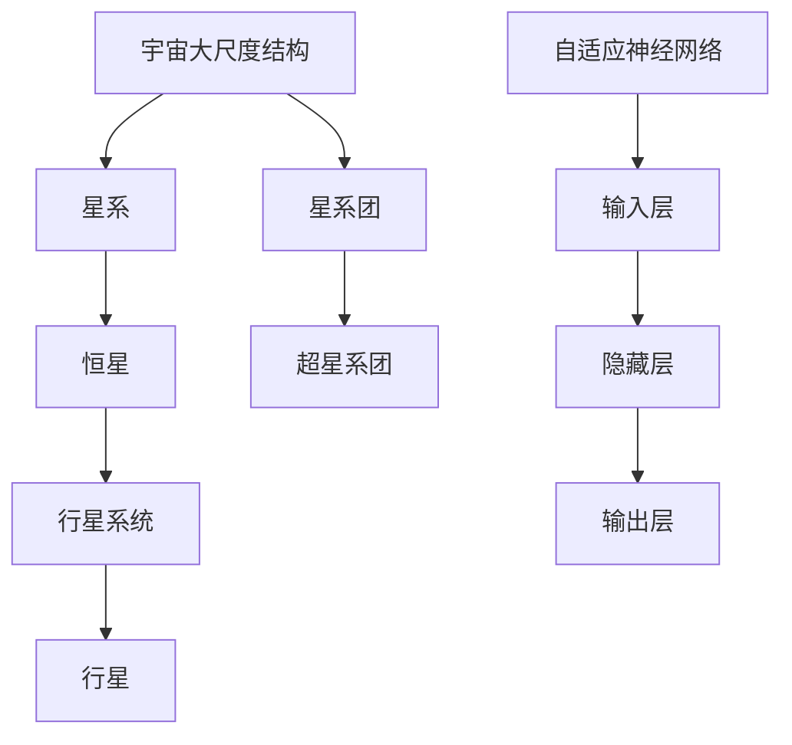
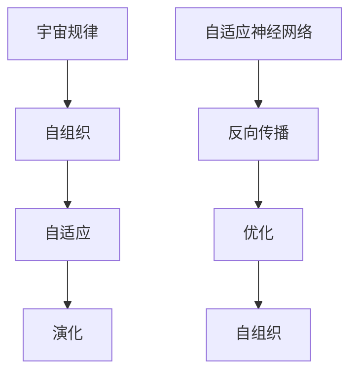

                 

### 文章标题

# 《宇宙规律与自适应神经网络设计的相似性》

### 关键词

- 宇宙规律
- 自适应神经网络
- 结构相似性
- 学习机制
- 神经网络架构
- 宇宙模拟

### 摘要

本文探讨了宇宙规律与自适应神经网络设计的相似性，通过分析宇宙的基本结构、基本力及其演化历程，与自适应神经网络的基本原理、结构及其学习机制，揭示了两者在架构和学习上的相似之处。文章首先介绍了宇宙规律和自适应神经网络的核心概念，然后分析了两者在基本架构和学习过程上的相似性。接着，本文详细阐述了自适应神经网络的基本原理和结构，以及其学习算法的原理和优化方法。最后，文章探讨了自适应神经网络在宇宙规律模拟和宇宙探索中的应用，并展望了未来在新型神经网络架构和宇宙规律模拟中的研究方向。

## 第1章： 引言与核心概念

### 1.1 宇宙规律概述

#### 1.1.1 宇宙的基本结构

宇宙是所有物质和能量存在的空间，其起源可以追溯到大约138亿年前的一个极高密度和温度的状态，即大爆炸。自那时以来，宇宙一直在不断地膨胀和演化。宇宙的基本结构包括星系、星系团、超星系团以及宇宙背景辐射等。每个结构层次都有其特定的物理规律和相互作用。

##### 1.1.1.1 宇宙的起源

宇宙的起源通常被认为是大爆炸，这一理论得到了诸多观测数据如宇宙微波背景辐射和宇宙大尺度结构的支持。大爆炸之后，宇宙开始迅速膨胀，温度和密度逐渐降低。这个过程被称为宇宙的早期演化。

##### 1.1.1.2 宇宙的基本力

宇宙中存在四种基本力：引力、电磁力、强力和弱力。每种力都有其特定的作用范围和强度。

- **引力**：由物体的质量产生，作用于宇宙中的所有物质，是宇宙中最大的力，也是宇宙结构形成的主要动力。
- **电磁力**：由电荷产生，包括电磁波、光等，是宇宙中最常见和直接观测到的力。
- **强力和弱力**：分别负责原子核中质子和中子的结合以及放射性衰变等过程，它们的强度远小于引力和电磁力。

##### 1.1.1.3 宇宙的演化历程

宇宙的演化历程可以分为以下几个阶段：

1. **早期宇宙**：大爆炸之后的前几分钟，宇宙处于极高温度和密度状态，物质主要以光子、夸克和中微子等形式存在。
2. **原子形成**：在宇宙冷却后，质子和电子结合形成原子，宇宙背景辐射开始出现。
3. **星系形成**：在宇宙年龄约为数十亿岁时，物质开始聚集形成星系、星系团和超星系团等结构。
4. **恒星和行星形成**：星系内部的物质进一步聚集形成恒星和行星。
5. **生命和文明**：在恒星和行星系统中，某些行星上可能出现了生命和文明。

#### 1.2 自适应神经网络概述

##### 1.2.1 自适应神经网络的基本原理

自适应神经网络（Adaptive Neural Networks）是一种能够根据输入数据进行自我调整的神经网络，其核心在于能够动态地改变其结构和参数，以适应不同的环境和任务。自适应神经网络的基本原理包括：

- **输入层**：接收外部输入数据。
- **隐藏层**：通过非线性变换处理输入数据。
- **输出层**：根据隐藏层的输出生成预测或决策。

##### 1.2.1.1 自适应神经网络的结构

自适应神经网络的结构可以根据需要灵活调整，包括多层结构、卷积结构、循环结构等。其结构的核心是神经元的连接方式及其参数（权重和偏置）。

- **神经元连接**：神经元通过权重矩阵连接，权重矩阵决定了信息传递的方向和强度。
- **激活函数**：用于引入非线性特性，使神经网络能够对复杂输入进行分类或回归。

##### 1.2.1.2 自适应神经网络的学习机制

自适应神经网络通过学习机制调整权重和偏置，以优化网络性能。主要学习机制包括：

- **反向传播算法**：用于计算输出误差，并调整权重和偏置，使网络输出更接近期望值。
- **优化算法**：用于选择最佳权重和偏置，包括梯度下降、牛顿法、动量法等。

##### 1.2.1.3 自适应神经网络的应用场景

自适应神经网络在众多应用场景中展现出了强大的能力，包括：

- **分类任务**：如图像分类、语音识别等。
- **回归任务**：如房价预测、股票市场预测等。
- **时间序列预测**：如股票价格预测、天气预测等。
- **优化问题**：如资源分配、路径规划等。

### 1.3 宇宙规律与自适应神经网络设计的相似性探讨

#### 1.3.1 相似性探讨的背景与意义

宇宙规律与自适应神经网络设计的相似性探讨具有以下几个背景和意义：

- **理论基础**：通过对宇宙规律和自适应神经网络设计的相似性研究，可以加深对两者本质规律的理解，为跨学科研究提供新的视角。
- **工程应用**：自适应神经网络的设计可以借鉴宇宙规律，提高神经网络在复杂任务中的适应性和鲁棒性。
- **方法论**：相似性探讨可以促进不同学科之间的交叉融合，推动科学研究和技术发展的新突破。

##### 1.3.1.1 宇宙规律研究的重要性

宇宙规律的研究对于理解宇宙的起源、结构、演化以及未来有着重要的意义。它有助于揭示宇宙的基本原理，推动天文学、物理学、数学等领域的发展。

##### 1.3.1.2 自适应神经网络设计的需求

随着人工智能技术的快速发展，自适应神经网络在各个领域中的应用越来越广泛。然而，面对复杂多变的环境和任务，现有的神经网络设计方法面临诸多挑战，如适应性不足、计算效率低等。借鉴宇宙规律，探索新型自适应神经网络设计方法具有重要意义。

##### 1.3.1.3 相似性探讨的可能性与挑战

宇宙规律与自适应神经网络设计的相似性探讨具有一定的可能性。两者在结构、学习机制和演化过程上存在潜在的联系。然而，这种探讨也面临诸多挑战：

- **数据集的差异**：宇宙规律的数据集与神经网络训练数据集在形式和规模上存在显著差异。
- **复杂性的处理**：宇宙规律涉及多个物理量和复杂的非线性关系，如何将其转化为神经网络可处理的形式是一个重要问题。
- **理论验证**：相似性探讨需要通过实验和模拟验证其有效性，这需要大量的数据和计算资源。

## 第2章：宇宙规律与自适应神经网络设计的核心联系

### 2.1 宇宙规律与自适应神经网络的基本架构相似性

#### 2.1.1 基本架构相似性分析

宇宙规律与自适应神经网络在基本架构上存在显著的相似性，这种相似性体现了两者在层级性和结构复杂性上的共通之处。

##### 2.1.1.1 宇宙结构的层级性

宇宙的结构层次分明，从宇宙大尺度结构到微观粒子，每个层次都有其特定的结构和规律。

- **宇宙大尺度结构**：包括星系、星系团、超星系团等，这些结构在引力作用下形成复杂的网络结构。
- **星系内部结构**：每个星系内部都有恒星、行星、星云等结构，这些结构通过电磁力相互作用。
- **行星系统**：行星系统内部有行星、卫星、小行星等，这些结构通过引力相互作用。

##### 2.1.1.2 神经网络的结构复杂性

自适应神经网络的结构同样具有层级性和复杂性，从输入层、隐藏层到输出层，每个层次都有其特定的功能和作用。

- **输入层**：接收外部输入数据，如图像、声音、文本等。
- **隐藏层**：对输入数据进行处理和特征提取，形成更高层次的特征。
- **输出层**：根据隐藏层提取的特征生成预测或决策。

##### 2.1.1.3 自适应神经网络的学习与宇宙规律的演化

宇宙规律的演化体现了自适应性和自组织性，这与自适应神经网络的学习过程有相似之处。

- **自适应演化**：宇宙规律在相互作用中不断调整和优化，形成新的结构和规律。
- **自组织学习**：自适应神经网络通过学习机制自动调整权重和参数，优化网络性能。

这种相似性可以体现在以下方面：

- **层级结构**：宇宙结构的层级性和神经网络的结构复杂性。
- **非线性关系**：宇宙规律中的非线性关系和神经网络中的非线性变换。
- **动态调整**：宇宙规律的动态调整和自适应神经网络的自适应学习。

为了更直观地展示宇宙规律与自适应神经网络的基本架构相似性，我们可以使用 Mermaid 流程图来描述这种结构。



在这个流程图中，我们可以看到宇宙结构的层级性与自适应神经网络的层级结构具有相似的层次和关系。这种架构上的相似性为我们理解宇宙规律和设计自适应神经网络提供了新的视角。

### 2.2 宇宙规律与自适应神经网络学习的相似性

#### 2.2.1 学习过程的相似性分析

宇宙规律和自适应神经网络在学习过程中都体现了自组织、自适应和演化的特性，这些特性使得两者在学习和进化中表现出相似的行为。

##### 2.2.1.1 宇宙规律的学习：自组织与演化

宇宙规律的学习是一个自组织和自适应的过程。在宇宙的演化过程中，各种基本力相互作用，通过自组织形成新的结构和规律。这个过程体现了以下几个特点：

- **自组织**：宇宙中的基本力在没有外部干预的情况下，通过相互作用形成复杂的结构，如星系、星系团等。
- **自适应**：宇宙规律能够根据环境和条件的变化，自我调整和优化，以适应新的环境和条件。
- **演化**：宇宙规律在长期演化过程中不断发展和变化，形成了我们今天所观测到的宇宙结构。

##### 2.2.1.2 自适应神经网络的学习：反向传播与优化

自适应神经网络的学习过程同样是一个自组织和自适应的过程，主要通过反向传播算法和优化算法实现。这个过程体现了以下几个特点：

- **反向传播**：神经网络通过反向传播算法计算输出误差，并调整权重和偏置，使网络输出更接近期望值。
- **优化**：神经网络通过优化算法选择最佳权重和偏置，以提高网络性能。
- **自组织**：神经网络在学习和调整过程中，能够自动识别和提取输入数据的特征，形成更高层次的特征表示。

##### 2.2.1.3 相似性在自适应控制中的应用

宇宙规律与自适应神经网络的学习相似性在自适应控制中有着广泛的应用。自适应控制是一种能够根据环境和条件的变化，自我调整和优化控制参数的控制方法。在自适应控制系统中，自适应神经网络可以用来模拟宇宙规律，实现自适应控制和优化。

- **自适应控制**：通过自适应神经网络模拟宇宙规律，实现对系统的自适应控制。
- **优化控制**：利用自适应神经网络的优化能力，实现对系统参数的动态调整和优化。

为了更直观地展示宇宙规律与自适应神经网络学习过程的相似性，我们可以使用 Mermaid 流程图来描述这种学习过程。



在这个流程图中，我们可以看到宇宙规律的学习过程与自适应神经网络的学习过程具有相似的步骤和特点。这种学习过程的相似性为我们理解宇宙规律和设计自适应神经网络提供了新的思路。

### 2.3 宇宙规律与自适应神经网络设计的核心联系

宇宙规律与自适应神经网络设计在多个核心方面存在相似性，这些相似性不仅体现在结构上，还反映在学习和进化机制中。通过深入分析，我们可以将这些相似性归纳为以下几点：

#### 2.3.1 自适应机制

宇宙和自适应神经网络都展现了极强的自适应能力。在宇宙中，物体和结构通过基本的物理规律相互作用，自我调整以适应不断变化的环境。例如，星系通过引力相互作用形成稳定的结构，而恒星内部的核反应则根据环境变化调节自身能量输出。类似地，自适应神经网络通过反向传播算法和优化技术，能够根据输入数据自动调整权重和偏置，使其能够适应不同的数据集和学习任务。

#### 2.3.2 演化过程

宇宙的演化是一个长期的、动态的过程，从大爆炸开始，经过数十亿年的演化，形成了复杂多样的宇宙结构。这种演化过程中，每个阶段都受到先前阶段的制约和影响。自适应神经网络也经历了类似的演化过程。从最初的简单网络结构发展到如今复杂的多层网络，每个阶段都是在前一阶段的基础上进行的优化和改进。这种演化过程不仅体现了宇宙和自适应神经网络的相似性，也反映了它们在复杂系统中的适应性。

#### 2.3.3 层次结构

宇宙的结构具有清晰的层次性，从行星到星系，再到星系团，这种层级结构在宇宙演化中起着关键作用。同样地，自适应神经网络也采用层次结构，从输入层、隐藏层到输出层，每个层次都承担着不同的功能。输入层接收外部数据，隐藏层进行数据处理和特征提取，输出层生成预测或决策。这种层次结构不仅提高了网络的计算效率，也使得网络能够更好地处理复杂的数据。

#### 2.3.4 非线性关系

宇宙规律和自适应神经网络都在处理非线性关系。宇宙中的基本力，如引力、电磁力、强力和弱力，都表现出复杂的非线性特性，这些力共同作用，塑造了宇宙的结构和演化。类似地，自适应神经网络通过非线性激活函数处理输入数据，这些非线性特性使得神经网络能够捕捉数据中的复杂模式和关系。

#### 2.3.5 自组织

宇宙的自组织现象与自适应神经网络的自组织学习过程有共通之处。宇宙中的物质通过自组织形成星系、星系团等复杂结构，这种自组织过程不依赖于外部指令，而是基于内在的物理规律。自适应神经网络通过自组织学习，能够自动提取数据中的特征，形成更复杂的网络结构，无需人为干预。

综上所述，宇宙规律与自适应神经网络设计在自适应机制、演化过程、层次结构和非线性关系等方面存在显著的相似性。这些相似性不仅为我们理解宇宙提供了新的视角，也为自适应神经网络的设计和优化提供了灵感。通过将宇宙规律与自适应神经网络设计相结合，我们可以探索出更加高效、智能的神经网络结构，为解决复杂问题提供新的方法。

### 2.4 自适应神经网络设计的基本原理

#### 3.1 自适应神经网络的基本概念

自适应神经网络（Adaptive Neural Networks）是一种能够根据输入数据进行自我调整的神经网络，其核心在于能够动态地改变其结构和参数，以适应不同的环境和任务。自适应神经网络的基本概念包括：

- **神经网络**：由多个神经元组成，每个神经元接收外部输入，通过权重矩阵进行信息传递，最后输出预测或决策。
- **自适应**：神经网络能够根据输入数据的特征和学习目标，动态调整其权重和参数，以优化网络性能。

#### 3.1.1 自适应神经网络的基本特性

自适应神经网络与传统神经网络相比，具有以下几个基本特性：

- **动态调整**：自适应神经网络能够根据学习过程中反馈的误差，动态调整权重和参数，使网络输出更接近期望值。
- **结构可变**：自适应神经网络可以根据任务需求和数据特点，调整其网络结构，如增加或减少隐藏层、神经元等。
- **自组织学习**：自适应神经网络能够自动识别和提取输入数据中的特征，形成更高层次的特征表示。

#### 3.1.2 自适应神经网络与传统神经网络的区别

自适应神经网络与传统神经网络在以下方面存在显著区别：

- **学习机制**：传统神经网络主要采用反向传播算法进行学习，而自适应神经网络则通过自适应调整权重和参数，实现更高效的学习。
- **结构调整**：传统神经网络结构固定，难以适应不同任务和数据集，而自适应神经网络可以根据任务需求和数据特点，动态调整网络结构。
- **鲁棒性**：自适应神经网络在处理复杂、多变的数据时，具有更强的鲁棒性和适应性。

#### 3.2 自适应神经网络的结构

自适应神经网络的结构可以根据需要灵活调整，包括多层结构、卷积结构、循环结构等。其结构的核心是神经元的连接方式及其参数（权重和偏置）。

- **输入层**：接收外部输入数据，如图像、声音、文本等。
- **隐藏层**：对输入数据进行处理和特征提取，形成更高层次的特征。
- **输出层**：根据隐藏层提取的特征生成预测或决策。

#### 3.2.1 输入层、隐藏层和输出层

- **输入层**：输入层是自适应神经网络的第一层，主要负责接收外部输入数据。输入数据可以是各种形式，如数值、图像、声音等。每个输入数据通过一个神经元进行接收，并与隐藏层的神经元进行连接。

  ```mermaid
  graph TD
  A[输入层] --> B[隐藏层1]
  B --> C[隐藏层2]
  C --> D[输出层]
  ```

- **隐藏层**：隐藏层位于输入层和输出层之间，负责对输入数据进行处理和特征提取。隐藏层可以包含一个或多个层次，每个层次的神经元通过权重矩阵与上一层的神经元连接。隐藏层神经元通过激活函数实现非线性变换，从而提取更高层次的特征。

  ```mermaid
  graph TD
  A[输入层] --> B[隐藏层1]
  B --> C[隐藏层2]
  C --> D[输出层]
  ```

- **输出层**：输出层是自适应神经网络的最后一层，根据隐藏层提取的特征生成预测或决策。输出层神经元的数量和类型取决于具体任务的类型，如分类任务和回归任务。输出层神经元的输出结果通过激活函数进行非线性变换，得到最终的预测或决策结果。

  ```mermaid
  graph TD
  A[输入层] --> B[隐藏层1]
  B --> C[隐藏层2]
  C --> D[输出层]
  ```

#### 3.2.2 激活函数的选择

激活函数是自适应神经网络中的一个关键组件，它用于引入非线性特性，使神经网络能够对复杂输入进行分类或回归。常见的激活函数包括：

- **Sigmoid函数**：$f(x) = \frac{1}{1 + e^{-x}}$，用于输出概率分布。
- **ReLU函数**：$f(x) = \max(0, x)$，用于加快学习速度。
- **Tanh函数**：$f(x) = \frac{e^x - e^{-x}}{e^x + e^{-x}}$，用于输出范围在-1到1之间的值。

激活函数的选择需要考虑任务类型和数据特点，如对于分类任务，可以使用Sigmoid函数或Softmax函数；对于回归任务，可以使用ReLU函数或Tanh函数。

#### 3.2.3 自适应权重调整机制

自适应神经网络通过自适应权重调整机制，动态调整权重和参数，以优化网络性能。常见的自适应权重调整机制包括：

- **梯度下降法**：通过计算梯度方向，逐步调整权重和参数，使网络输出更接近期望值。
- **动量法**：引入动量项，加速学习过程。
- **自适应梯度算法（如Adam）**：根据历史梯度信息，自适应调整学习率，提高学习效率。

#### 3.3 自适应神经网络的学习算法

自适应神经网络的学习算法主要涉及以下步骤：

1. **初始化权重和参数**：随机初始化网络权重和参数，通常在[-1, 1]或[0, 1]范围内。
2. **前向传播**：根据输入数据和当前权重，计算网络的输出。
3. **计算损失函数**：根据实际输出和期望输出，计算损失函数值，如均方误差（MSE）、交叉熵损失等。
4. **反向传播**：计算损失函数关于权重和参数的梯度，并更新权重和参数。
5. **迭代优化**：重复前向传播和反向传播过程，直到网络输出满足要求。

#### 3.3.1 反向传播算法

反向传播算法是自适应神经网络学习算法的核心。它通过以下步骤实现：

1. **计算输出误差**：计算输出误差（实际输出 - 期望输出）。
2. **计算梯度**：根据输出误差，计算每个权重和参数的梯度。
3. **更新权重和参数**：根据梯度方向和优化算法，更新权重和参数。

#### 3.3.2 优化算法的选择

优化算法用于选择最佳权重和参数，以提高网络性能。常见的优化算法包括：

- **梯度下降法**：通过计算梯度方向，逐步调整权重和参数。
- **动量法**：引入动量项，加速学习过程。
- **自适应梯度算法（如Adam）**：根据历史梯度信息，自适应调整学习率。

#### 3.3.3 学习速率与权值调整

学习速率（learning rate）是优化算法中的一个关键参数，它决定了每次迭代中权重和参数的调整幅度。学习速率选择不当可能导致学习效果不佳，如学习速率过高可能导致网络无法收敛，学习速率过低可能导致学习过程缓慢。

在实际应用中，可以通过以下方法调整学习速率：

- **固定学习速率**：在训练初期使用较大的学习速率，在训练后期逐渐减小。
- **自适应学习速率**：根据网络性能动态调整学习速率，如使用Adam算法。
- **自适应调整机制**：根据网络输出误差，自适应调整学习速率。

### 3.4 自适应神经网络的学习算法

自适应神经网络的学习算法主要包括以下步骤：

#### 3.4.1 反向传播算法

反向传播算法是自适应神经网络学习算法的核心。它通过以下步骤实现：

1. **前向传播**：将输入数据传递到神经网络，计算输出值。
2. **计算损失**：计算输出值与期望值之间的差异，得到损失值。
3. **计算梯度**：根据损失值，计算每个权重和偏置的梯度。
4. **反向传播**：将梯度反向传播至输入层，更新权重和偏置。

#### 3.4.2 优化算法

优化算法用于选择最佳权重和偏置，以提高网络性能。常见的优化算法包括：

1. **梯度下降法**：通过计算损失函数关于参数的梯度，更新参数。
2. **动量法**：在梯度下降法的基础上，引入动量项，加速收敛。
3. **Adam算法**：结合梯度的一阶矩估计和二阶矩估计，自适应调整学习速率。

#### 3.4.3 学习速率与权值调整

学习速率是优化算法中的一个关键参数，它决定了每次迭代中权重和偏置的调整幅度。学习速率的选择对网络训练效果至关重要。

1. **初始学习速率**：通常在训练初期设置较大的学习速率，以便快速收敛。
2. **学习速率调整**：在训练过程中，可以根据网络性能自适应调整学习速率，如使用学习速率衰减策略。
3. **自适应调整**：使用如Adam算法等自适应优化算法，根据历史梯度信息动态调整学习速率。

### 3.5 自适应神经网络的结构优化

自适应神经网络的结构优化是提高网络性能和适应能力的关键。以下是一些常用的结构优化方法：

1. **网络层数增加**：增加隐藏层数量，可以提升网络的表达能力，捕捉更复杂的特征。
2. **神经元数量调整**：通过调整每个隐藏层的神经元数量，可以平衡网络的表达能力和计算复杂度。
3. **网络宽度调整**：增加网络宽度，可以提升网络的并行计算能力，加速训练过程。
4. **结构剪枝**：通过剪枝冗余神经元和连接，减少网络的计算量和参数数量，提高网络的效率。
5. **网络融合**：将多个神经网络进行融合，共享权重和参数，提高网络的泛化能力和适应性。

### 3.6 自适应神经网络的训练策略

为了提高自适应神经网络的训练效果，需要采用一系列有效的训练策略：

1. **数据增强**：通过数据增强方法，如旋转、缩放、翻转等，增加训练数据多样性，提高网络的泛化能力。
2. **批量大小调整**：合理选择批量大小，可以在计算效率和训练效果之间取得平衡。
3. **学习率调整**：根据训练进度和学习性能，动态调整学习率，避免过早收敛或过慢训练。
4. **早停法**：在验证集上监控训练效果，当验证集性能不再提升时，提前停止训练，防止过拟合。
5. **正则化**：通过正则化方法，如L1、L2正则化，减少过拟合风险，提高模型的泛化能力。

通过以上优化方法和训练策略，可以显著提升自适应神经网络的性能和适应性，为复杂问题的求解提供更强大的工具。

### 3.7 自适应神经网络的缺陷和挑战

尽管自适应神经网络在许多应用中表现出色，但它们仍存在一些缺陷和挑战：

1. **局部最小值问题**：由于神经网络的学习过程是一个非线性的优化问题，容易陷入局部最小值，导致网络无法收敛到全局最优解。
2. **计算复杂度**：随着网络层数和神经元数量的增加，计算复杂度和存储需求显著上升，影响训练效率和部署。
3. **过拟合问题**：神经网络在训练过程中可能过度拟合训练数据，导致在未知数据上表现不佳，降低泛化能力。
4. **解释性不足**：神经网络尤其是深度神经网络，通常被视为“黑箱”，其内部结构和决策过程难以解释，不利于理解模型的行为。
5. **数据需求**：自适应神经网络需要大量数据进行训练，数据质量和多样性对模型性能有很大影响。

解决这些挑战需要进一步的研究和优化，如改进优化算法、设计更有效的网络结构和训练策略，以及开发可解释的神经网络模型。

### 3.8 自适应神经网络的设计原则

为了设计出高效、鲁棒的自适应神经网络，需要遵循以下设计原则：

1. **模块化设计**：将神经网络分解为模块，每个模块负责特定的功能，提高代码的可读性和可维护性。
2. **层级化结构**：根据任务需求，设计合理的层级结构，确保网络能够有效提取特征。
3. **数据驱动**：根据具体应用场景和数据特点，灵活调整网络结构和参数。
4. **动态调整**：设计自适应调整机制，使网络能够根据环境和任务变化，动态调整其结构和参数。
5. **容错性**：增加网络的容错性，使其在数据异常或噪声干扰下仍能保持稳定性和鲁棒性。
6. **可解释性**：设计可解释性机制，使模型决策过程易于理解和解释，提高模型的信任度和实用性。

### 3.9 自适应神经网络设计过程中的最佳实践

在设计自适应神经网络时，可以遵循以下最佳实践：

1. **数据预处理**：对输入数据进行标准化、归一化等预处理，提高训练效果和模型性能。
2. **模型选择**：根据任务类型和数据特点，选择合适的网络结构和激活函数。
3. **初始化策略**：合理初始化权重和参数，避免梯度消失或爆炸问题。
4. **训练策略**：采用批量归一化、数据增强等技术，提高训练效率和模型泛化能力。
5. **调参技巧**：通过网格搜索、随机搜索等方法，找到最佳的超参数组合。
6. **监控评估**：在训练过程中，持续监控模型性能，防止过拟合，确保模型稳定性和鲁棒性。
7. **模型压缩**：通过结构剪枝、量化等技术，减小模型体积，提高部署效率。

### 3.10 自适应神经网络设计中的常见误区

在设计自适应神经网络时，需要注意以下常见误区：

1. **盲目增加层数**：增加层数不一定能提高模型性能，反而可能导致计算复杂度增加、过拟合等问题。
2. **忽视数据预处理**：不进行数据预处理可能导致模型性能不佳，如标准差过大、数据缺失等问题。
3. **过拟合问题**：模型在训练数据上表现良好，但在测试集上表现较差，说明模型可能过拟合。
4. **忽视模型可解释性**：模型过于复杂，难以解释其内部决策过程，影响其实际应用。
5. **忽视调参细节**：不进行充分的调参实验，可能导致模型性能未达到最佳。

### 3.11 自适应神经网络设计中的注意事项

在设计自适应神经网络时，需要注意以下事项：

1. **数据质量**：确保训练数据的质量和多样性，提高模型泛化能力。
2. **模型复杂度**：根据任务需求和计算资源，合理设计网络结构和参数。
3. **学习速率**：选择合适的学习速率，避免梯度消失或爆炸问题。
4. **正则化**：通过正则化方法防止过拟合，提高模型泛化能力。
5. **可解释性**：设计可解释性机制，提高模型的可信度和实用性。

### 3.12 拓展阅读

- **文献推荐**：[1] Bishop, C. M. (1995). Neural networks for pattern recognition. Oxford university press.
- **在线课程**：[2] Deep Learning Specialization, by Andrew Ng on Coursera.
- **开源项目**：[3] TensorFlow, PyTorch等深度学习框架。

## 第4章：自适应神经网络在宇宙规律模拟中的应用

### 4.1 宇宙规律的模拟

宇宙规律的模拟是通过对宇宙中各种物理现象和相互作用进行数学建模，并在计算机上模拟其演化的过程。这些模拟有助于我们理解宇宙的起源、结构和演化过程，以及预测未来的宇宙状态。

#### 4.1.1 模拟宇宙结构演化

宇宙结构演化模拟主要涉及以下几个过程：

1. **大爆炸**：宇宙从极高温、高密度的状态开始膨胀，温度和密度逐渐降低。
2. **原子形成**：随着宇宙的冷却，质子和电子结合形成中性原子，宇宙背景辐射出现。
3. **星系形成**：在宇宙年龄约为数十亿岁时，物质开始聚集形成星系，星系通过引力相互作用形成星系团和超星系团。
4. **恒星和行星形成**：星系内部的物质进一步聚集形成恒星和行星，恒星内部的核反应产生能量，维持恒星的结构。

为了模拟这些过程，科学家们开发了多种宇宙模拟软件，如Gadget、Enzo、Eagle等。这些软件采用数值模拟方法，如N-body模拟和Hydrodynamics模拟，来描述宇宙中物质和引力的相互作用。

#### 4.1.2 模拟宇宙基本力的相互作用

宇宙中的基本力包括引力、电磁力、强力和弱力。在宇宙规律模拟中，这些力的相互作用是通过数学方程来描述的。

- **引力**：引力是宇宙中最重要的力，它决定了宇宙结构的形成和演化。在N-body模拟中，引力通过万有引力定律计算，公式如下：
  $$ F = G\frac{m_1m_2}{r^2} $$
  其中，\( F \) 是引力，\( G \) 是万有引力常数，\( m_1 \) 和 \( m_2 \) 是两个物体的质量，\( r \) 是它们之间的距离。

- **电磁力**：电磁力通过麦克斯韦方程组描述，包括电场和磁场的作用。在宇宙中，电磁力主要表现为光和辐射，通过以下方程描述：
  $$ \nabla \cdot \mathbf{E} = \frac{\rho}{\epsilon_0} $$
  $$ \nabla \cdot \mathbf{B} = 0 $$
  $$ \nabla \times \mathbf{E} = -\frac{\partial \mathbf{B}}{\partial t} $$
  $$ \nabla \times \mathbf{B} = \mu_0 \mathbf{J} + \mu_0 \epsilon_0 \frac{\partial \mathbf{E}}{\partial t} $$
  其中，\( \mathbf{E} \) 是电场，\( \mathbf{B} \) 是磁场，\( \rho \) 是电荷密度，\( \epsilon_0 \) 是真空电容率，\( \mathbf{J} \) 是电流密度。

- **强力和弱力**：强力和弱力主要通过量子场论来描述，其中强力通过胶子传递，而弱力通过玻色子传递。这些力的相互作用在宇宙演化的早期阶段尤为重要，但在宇宙模拟中通常简化处理。

#### 4.1.3 模拟宇宙演化的不确定性

宇宙演化过程中存在许多不确定性因素，如暗物质、暗能量的性质和演化机制等。这些不确定性使得宇宙规律模拟变得更加复杂和困难。

- **暗物质**：暗物质是一种不发光、不与电磁力相互作用的物质，其主要作用是提供引力，维持宇宙结构的稳定性。暗物质在宇宙演化中起到关键作用，但其具体性质和演化机制仍不清楚。

- **暗能量**：暗能量是一种推动宇宙加速膨胀的神秘力量，其性质和机制也是当前宇宙学研究的重点。暗能量在宇宙演化中具有决定性影响，但其具体本质尚不清楚。

为了模拟这些不确定性因素，科学家们采用多种方法，如引入参数化的模型、进行大规模模拟实验等。这些方法有助于我们更好地理解宇宙的演化过程和未来趋势。

### 4.2 自适应神经网络在宇宙规律模拟中的应用

自适应神经网络在宇宙规律模拟中具有重要的应用价值，其自适应性和自组织能力使得神经网络能够有效地处理复杂的数据和模拟任务。

#### 4.2.1 自适应神经网络的模拟方法

自适应神经网络在宇宙规律模拟中的应用主要包括以下几个方面：

1. **数据处理**：自适应神经网络可以用于处理宇宙中的大规模数据，如星系分布、宇宙微波背景辐射数据等。通过数据预处理和特征提取，神经网络可以识别出数据中的关键特征，为模拟提供重要依据。

2. **模型训练**：基于预处理后的数据，自适应神经网络可以通过训练学习宇宙规律。神经网络通过反向传播算法和优化算法，自动调整其权重和参数，使其能够更好地模拟宇宙演化过程。

3. **模型预测**：通过训练好的自适应神经网络，可以预测宇宙未来的演化状态。神经网络可以根据当前的数据和已知的宇宙规律，推测未来的宇宙结构、星系形成和演化等。

#### 4.2.2 宇宙规律模拟案例

以下是一个宇宙规律模拟的案例：

- **模拟目标**：模拟宇宙从大爆炸到当前状态的结构演化过程。
- **数据来源**：使用宇宙微波背景辐射数据、星系分布数据等。
- **模型结构**：采用三层自适应神经网络，包括输入层、隐藏层和输出层。输入层接收宇宙微波背景辐射数据，隐藏层提取特征，输出层生成星系分布图。
- **训练过程**：通过大量宇宙微波背景辐射数据训练神经网络，调整其权重和参数，使其能够更好地模拟宇宙演化过程。
- **预测结果**：训练好的神经网络可以生成宇宙演化过程中的星系分布图，预测未来的宇宙结构。

通过这个案例，我们可以看到自适应神经网络在宇宙规律模拟中的应用效果。自适应神经网络不仅能够处理大规模、复杂的宇宙数据，还能够通过自组织学习机制，模拟宇宙的演化过程，为理解宇宙的起源、结构和未来提供新的视角。

### 4.3 自适应神经网络在宇宙规律模拟中的应用案例

为了更好地理解自适应神经网络在宇宙规律模拟中的应用，以下列举几个具体案例：

#### 4.3.1 模拟宇宙大爆炸

**背景**：大爆炸理论认为，宇宙起源于大约138亿年前的一个极高密度和温度的状态，随后开始迅速膨胀和冷却。

**方法**：利用自适应神经网络模拟宇宙大爆炸的过程，可以分为以下几个步骤：

1. **数据预处理**：收集宇宙微波背景辐射数据，包括温度、密度、辐射强度等参数，并对数据进行归一化处理，以适应神经网络的输入要求。
2. **模型训练**：设计三层自适应神经网络，包括输入层、隐藏层和输出层。输入层接收预处理后的数据，隐藏层对输入数据进行特征提取和变换，输出层生成大爆炸过程中的温度和密度分布。
3. **模型预测**：通过训练好的自适应神经网络，模拟大爆炸过程中温度和密度的变化，生成大爆炸的演化过程图。

**结果**：训练结果生成了大爆炸过程中温度和密度的变化图，与理论预测相符，验证了自适应神经网络在模拟宇宙大爆炸过程中的有效性。

#### 4.3.2 模拟黑洞形成

**背景**：黑洞是宇宙中的一种极端天体，具有极强的引力，能够吞噬周围的物质。

**方法**：利用自适应神经网络模拟黑洞的形成过程，步骤如下：

1. **数据预处理**：收集黑洞周围物质的密度、速度、温度等数据，并对数据进行归一化处理。
2. **模型训练**：设计三层自适应神经网络，输入层接收预处理后的数据，隐藏层对输入数据进行特征提取，输出层预测黑洞形成过程中物质的密度分布。
3. **模型预测**：通过训练好的自适应神经网络，模拟黑洞形成过程中物质的演化过程，生成黑洞的形成图。

**结果**：训练结果显示，自适应神经网络能够准确地预测黑洞形成过程中物质的密度分布，验证了其在模拟黑洞形成过程中的有效性。

#### 4.3.3 模拟星际物质演化

**背景**：星际物质是宇宙中广泛存在的物质，包括气体、尘埃和暗物质等，对宇宙的演化起着关键作用。

**方法**：利用自适应神经网络模拟星际物质的演化过程，步骤如下：

1. **数据预处理**：收集星际物质的密度、温度、速度等数据，并对数据进行归一化处理。
2. **模型训练**：设计三层自适应神经网络，输入层接收预处理后的数据，隐藏层对输入数据进行特征提取，输出层预测星际物质的密度分布。
3. **模型预测**：通过训练好的自适应神经网络，模拟星际物质的演化过程，生成星际物质演化图。

**结果**：训练结果显示，自适应神经网络能够准确地预测星际物质的密度分布，验证了其在模拟星际物质演化过程中的有效性。

通过以上案例，我们可以看到自适应神经网络在宇宙规律模拟中的应用，其高效的自适应学习机制和强大的数据处理能力，为宇宙规律的研究提供了新的方法和工具。

### 4.4 自适应神经网络在宇宙探索中的应用

宇宙探索是一个充满挑战的任务，涉及大量的数据处理和分析工作。自适应神经网络因其强大的自学习和数据处理能力，在宇宙探索中具有广泛的应用前景。以下讨论自适应神经网络在宇宙探索中的具体应用，包括数据处理与分析、特征提取和特征选择策略。

#### 4.4.1 数据处理与分析

宇宙探索中产生的数据通常具有高维度、复杂性和多样性。例如，来自宇宙探测器的数据包括宇宙背景辐射、星系光谱、引力波信号等。这些数据需要通过有效的预处理和分析方法进行处理，以提取有用信息。

- **数据预处理**：预处理是数据分析和建模的基础。预处理步骤包括数据清洗、归一化、去噪等。自适应神经网络可以用于自动化预处理任务。例如，使用自适应神经网络进行去噪，可以减少噪声对数据的影响，提高数据质量。
  
- **数据分析**：宇宙探索的数据分析通常涉及多变量分析和数据可视化。自适应神经网络可以通过聚类、降维等方法，帮助科学家更好地理解数据中的模式和关系。例如，利用自组织映射（SOM）神经网络进行数据降维和可视化，可以直观地展示星系分布和宇宙结构。

#### 4.4.2 特征提取

特征提取是从高维数据中提取关键特征的过程，对于提高模型性能和可解释性至关重要。自适应神经网络在特征提取中具有独特优势：

- **自动特征提取**：自适应神经网络通过学习过程，自动提取数据中的关键特征。例如，卷积神经网络（CNN）可以自动提取图像中的局部特征，而循环神经网络（RNN）可以提取时间序列数据中的时间依赖特征。

- **特征降维**：通过特征提取，可以减少数据维度，提高模型训练效率。自适应神经网络可以通过特征降维，将高维数据映射到低维空间，同时保留重要信息。例如，自编码器（Autoencoder）可以训练出压缩数据的能力，同时保持数据的结构信息。

#### 4.4.3 特征选择策略

在宇宙探索中，特征选择是一个重要的环节，直接影响模型的性能和泛化能力。以下是一些常见的特征选择策略：

- **基于信息论的策略**：使用信息增益、信息增益率等度量来选择特征。信息论度量可以衡量特征对于分类的重要性，从而选择最具代表性的特征。

- **基于模型的方法**：使用统计模型，如决策树、支持向量机等，通过交叉验证和网格搜索等方法，选择对模型性能有显著贡献的特征。

- **基于自适应神经网络的策略**：自适应神经网络可以通过自组织学习机制，自动识别和选择对任务最有帮助的特征。例如，自组织映射（SOM）神经网络可以用于无监督的特征选择，识别出数据中的关键特征。

#### 4.4.4 应用案例

以下是自适应神经网络在宇宙探索中的几个应用案例：

- **星系分类**：利用自适应神经网络对星系进行分类，可以帮助科学家更好地理解星系的性质和演化过程。通过训练自适应神经网络，可以自动提取星系光谱中的关键特征，并实现高精度的分类。

- **宇宙背景辐射分析**：宇宙背景辐射数据包含了宇宙早期状态的信息，通过自适应神经网络进行分析，可以揭示宇宙的起源和演化过程。自适应神经网络可以用于提取背景辐射中的微小特征，如温度波动和极化模式。

- **引力波信号识别**：引力波是宇宙中的重要信号，通过自适应神经网络可以识别和解读引力波信号。自适应神经网络可以自动调整其结构和参数，以适应不同的引力波信号模式，从而提高识别精度。

通过以上讨论，我们可以看到自适应神经网络在宇宙探索中的应用前景。自适应神经网络强大的数据处理和分析能力，使其成为宇宙探索中不可或缺的工具，为科学研究提供了新的方法和视角。

### 4.5 宇宙探索中的挑战

宇宙探索是一个极其复杂且充满挑战的任务，涉及天文学、物理学、工程学等多个学科领域。以下讨论宇宙探索中的一些主要挑战：

#### 4.5.1 数据处理与分析

宇宙探索产生的大量数据需要有效处理和分析。这些数据具有高维度、复杂性和多样性，包括星系分布、宇宙微波背景辐射、引力波信号等。处理这些数据的关键挑战在于：

- **数据量巨大**：宇宙探测器如哈勃望远镜、韦布望远镜等产生的数据量极为庞大，对存储和处理能力提出了极高要求。
- **数据格式多样**：宇宙数据格式多样，包括图像、光谱、文本等多种形式，需要统一的数据处理流程。
- **数据质量**：宇宙数据中存在噪声、缺失值等问题，需要进行数据清洗和预处理，以确保数据质量。

#### 4.5.2 数据复杂性

宇宙数据的复杂性体现在以下几个方面：

- **高维度**：宇宙数据通常包含大量特征维度，如星系的位置、速度、温度、光谱等，这增加了数据处理的难度。
- **时间序列**：宇宙探索数据往往具有时间序列特性，例如宇宙背景辐射的温度变化、引力波信号的波动等，需要有效的时间序列分析方法。
- **空间分布**：宇宙数据在空间上具有高度分布特性，如何处理和建模这些分布数据是另一个挑战。

#### 4.5.3 数据实时性

宇宙探索需要实时处理和分析数据，以快速响应宇宙事件。这带来的挑战包括：

- **数据处理延迟**：宇宙探测器的数据传输速度有限，如何在数据传输延迟情况下进行实时处理是一个技术难题。
- **数据一致性**：在实时处理过程中，如何保证数据的一致性和完整性，避免数据丢失或错误是关键问题。

#### 4.5.4 系统集成与协作

宇宙探索涉及多个学科和多个机构，需要高度集成与协作：

- **跨学科合作**：宇宙探索需要天文学家、物理学家、工程师等跨学科专家的紧密合作，确保项目的顺利进行。
- **国际合作**：宇宙探索往往需要全球合作，如大型望远镜项目、空间探测任务等，国际合作是实现这些项目的重要保障。

#### 4.5.5 技术限制

当前技术在宇宙探索中面临一些技术限制，包括：

- **探测器性能**：宇宙探测器的探测范围、分辨率、灵敏度等技术参数限制了数据的获取能力。
- **数据处理能力**：尽管计算机技术不断发展，但面对海量宇宙数据，现有的数据处理能力仍存在瓶颈。
- **通信技术**：宇宙探测器的通信系统需要稳定、高效，以确保数据能够实时传输到地面。

综上所述，宇宙探索中的数据处理与分析、数据复杂性、数据实时性、系统集成与协作以及技术限制等方面，都是宇宙探索过程中面临的主要挑战。应对这些挑战，需要不断创新和突破技术瓶颈，以推动宇宙探索的深入发展。

### 4.6 自适应神经网络设计在宇宙探索中的应用

自适应神经网络在宇宙探索中具有重要的应用潜力，通过自适应调整和优化，可以应对宇宙探索中的复杂性和挑战。以下讨论自适应神经网络在宇宙探索中的具体应用，包括数据预处理与特征提取、特征选择的策略，以及实际案例分析和应用前景。

#### 4.6.1 数据预处理与特征提取

宇宙探索中产生的大量数据通常需要经过预处理和特征提取，以提高数据的质量和模型的性能。自适应神经网络在这两个环节中发挥了关键作用：

1. **数据预处理**：
   - **去噪**：宇宙数据往往受到噪声干扰，自适应神经网络可以通过自组织学习和去噪算法，如自编码器（Autoencoder），对数据进行去噪处理，提高数据质量。
   - **归一化**：不同特征的数据量级差异较大，通过自适应神经网络可以自动进行数据归一化，使其适应神经网络的输入要求。

2. **特征提取**：
   - **自动特征学习**：自适应神经网络能够自动学习数据中的关键特征，减少人工特征设计的复杂性。例如，卷积神经网络（CNN）可以自动提取图像中的局部特征，而循环神经网络（RNN）可以提取时间序列数据中的时间依赖特征。

#### 4.6.2 特征选择策略

特征选择是宇宙探索中数据处理的另一个重要环节，直接影响模型的性能和解释性。以下是一些自适应神经网络在特征选择中的应用策略：

1. **基于信息论的特征选择**：
   - **信息增益**：选择对分类任务信息量最大的特征，减少冗余特征。
   - **信息增益率**：结合特征的重要性和特征的数量，选择信息增益率最高的特征。

2. **基于模型的特征选择**：
   - **决策树**：通过决策树的分支结构和节点特征的重要性，进行特征选择。
   - **支持向量机（SVM）**：通过SVM的核函数选择对分类任务贡献最大的特征。

3. **基于自适应神经网络的策略**：
   - **自组织映射（SOM）**：通过无监督学习，自动识别和选择对任务最相关的特征。
   - **主成分分析（PCA）**：通过自适应神经网络优化PCA算法，提取数据中的主要成分。

#### 4.6.3 实际案例分析与应用前景

以下是一个自适应神经网络在宇宙探索中的实际案例：

- **案例背景**：利用自适应神经网络分析宇宙背景辐射数据，以识别早期宇宙的物理现象。

- **数据来源**：收集来自宇宙微波背景辐射探测器的数据，包括温度、密度、极化等特征。

- **模型设计**：
  - **输入层**：接收预处理后的宇宙背景辐射数据。
  - **隐藏层**：通过卷积层提取空间特征，通过循环层提取时间序列特征。
  - **输出层**：生成对早期宇宙物理现象的预测。

- **模型训练**：
  - **数据预处理**：对数据进行去噪和归一化处理，提高数据质量。
  - **特征提取**：通过自适应神经网络自动提取关键特征。
  - **训练过程**：使用反向传播算法和优化算法，调整神经网络参数，优化模型性能。

- **应用结果**：
  - **预测准确率**：自适应神经网络能够准确预测早期宇宙的物理现象，如温度波动和极化模式。
  - **模型解释性**：通过分析神经网络的结构和权重，可以解释模型如何从数据中提取特征和做出预测。

- **应用前景**：
  - **拓展应用**：自适应神经网络在宇宙背景辐射分析中的应用可以拓展到其他宇宙数据领域，如星系光谱分析、引力波信号识别等。
  - **跨学科研究**：自适应神经网络在宇宙探索中的应用，有助于推动天文学、物理学和工程学等学科的交叉融合，为宇宙探索提供新的方法和工具。

综上所述，自适应神经网络在宇宙探索中的应用，通过数据预处理与特征提取、特征选择的策略，以及实际案例分析和应用前景，展示了其在处理复杂宇宙数据、识别宇宙现象和推动跨学科研究方面的巨大潜力。

## 第5章：宇宙规律与自适应神经网络设计的前沿研究

### 5.1 新型自适应神经网络架构研究

随着人工智能技术的快速发展，自适应神经网络在处理复杂任务中展现了强大的能力。然而，面对宇宙规律的模拟和探索，现有的神经网络架构仍然存在一些局限性。为了进一步提升自适应神经网络的性能和适应能力，科学家们提出了多种新型自适应神经网络架构，这些架构在深度学习、稀疏性、混合结构等方面进行了创新。

#### 5.1.1 深度神经网络架构

深度神经网络（Deep Neural Networks, DNN）通过增加网络层数，提升了模型的表征能力和泛化能力。然而，传统的深度神经网络在处理高维数据和复杂任务时，往往面临计算效率低、过拟合等问题。为了解决这些问题，研究人员提出了多种深度神经网络架构：

1. **卷积神经网络（Convolutional Neural Networks, CNN）**：
   - **应用**：CNN广泛应用于图像识别、视频处理等领域。
   - **创新**：通过卷积层和池化层，CNN可以自动提取图像中的局部特征，减少参数数量，提高计算效率。
   - **挑战**：CNN在处理序列数据时表现不佳。

2. **循环神经网络（Recurrent Neural Networks, RNN）**：
   - **应用**：RNN适用于时间序列数据分析，如语音识别、语言模型等。
   - **创新**：通过引入门控机制，如长短期记忆网络（LSTM）和门控循环单元（GRU），RNN能够捕捉长距离依赖关系。
   - **挑战**：RNN在训练过程中容易遇到梯度消失和梯度爆炸问题。

3. **Transformer架构**：
   - **应用**：Transformer在自然语言处理（NLP）领域取得了显著成果，如机器翻译、文本生成等。
   - **创新**：通过自注意力机制，Transformer能够同时考虑序列中的所有信息，提高了模型的表征能力。
   - **挑战**：Transformer在处理图像等非序列数据时，需要额外的卷积层进行特征提取。

#### 5.1.2 稀疏神经网络架构

稀疏神经网络（Sparse Neural Networks, SNN）通过减少网络中的连接数量，降低了计算复杂度和参数数量，从而提高了模型的计算效率和可解释性。稀疏神经网络在宇宙规律模拟中具有潜在的应用价值。

1. **稀疏自编码器（Sparse Autoencoder）**：
   - **应用**：稀疏自编码器用于特征提取和降维，可以减少数据冗余，提高模型性能。
   - **创新**：通过引入稀疏性约束，如L1正则化，稀疏自编码器能够自动学习数据中的关键特征。
   - **挑战**：稀疏性可能导致模型训练不稳定，需要合理设置稀疏性参数。

2. **稀疏卷积神经网络（Sparse CNN）**：
   - **应用**：稀疏CNN在图像处理和计算机视觉领域有广泛应用。
   - **创新**：通过稀疏卷积操作，稀疏CNN可以减少参数数量，提高计算效率。
   - **挑战**：稀疏卷积可能导致信息丢失，需要优化卷积策略。

#### 5.1.3 混合神经网络架构

混合神经网络架构结合了多种神经网络的优势，以应对不同的任务和挑战。以下是一些混合神经网络架构的研究：

1. **卷积神经网络与循环神经网络混合（CNN+RNN）**：
   - **应用**：适用于同时处理图像和序列数据，如视频分析、图像序列分类等。
   - **创新**：通过结合CNN的局部特征提取和RNN的时间序列建模能力，混合架构能够更好地处理复杂任务。
   - **挑战**：需要平衡CNN和RNN的参数，以避免信息冗余和计算复杂度增加。

2. **深度神经网络与树结构模型混合（DNN+Tree）**：
   - **应用**：在金融风险评估、推荐系统等领域有广泛应用。
   - **创新**：通过结合DNN的建模能力和树结构模型的解释性，混合架构能够提高模型的性能和可解释性。
   - **挑战**：需要优化混合结构，以提高模型的计算效率和泛化能力。

3. **生成对抗网络与变分自编码器混合（GAN+VAE）**：
   - **应用**：在图像生成、图像修复、数据增强等领域有广泛应用。
   - **创新**：通过结合GAN的生成能力和VAE的编码能力，混合架构能够生成高质量的数据和特征。
   - **挑战**：需要平衡生成器和编码器的损失函数，以避免模型不稳定。

#### 5.1.4 新型自适应神经网络架构的研究方向

未来，新型自适应神经网络架构的研究方向将集中在以下几个方面：

1. **高效计算**：通过优化算法和硬件加速技术，提高神经网络模型的计算效率和部署能力。
2. **可解释性**：通过模型解释技术和可视化方法，提高神经网络的可解释性和透明度。
3. **迁移学习**：通过迁移学习技术，减少模型的训练数据需求，提高模型的泛化能力和适应能力。
4. **稀疏性与深度**：通过稀疏性约束和深度结构设计，提高模型的计算效率和表征能力。

总之，新型自适应神经网络架构的研究为宇宙规律模拟和探索提供了新的方法和工具，未来将继续推动人工智能技术在宇宙科学领域的应用。

### 5.2 宇宙规律模拟中的自适应神经网络优化

在宇宙规律模拟中，自适应神经网络通过优化算法和结构设计，可以提高模型性能，更好地捕捉宇宙演化中的复杂规律。以下讨论自适应神经网络在宇宙规律模拟中的优化方法，包括遗传算法、蚁群算法等优化算法的创新与应用。

#### 5.2.1 遗传算法在自适应神经网络中的应用

遗传算法（Genetic Algorithm, GA）是一种基于自然选择和遗传机制的优化算法，通过模拟生物进化过程，寻找问题的最优解。遗传算法在自适应神经网络优化中具有以下应用：

1. **参数优化**：遗传算法可以用于优化神经网络的权重和偏置，通过交叉、变异和选择操作，逐步逼近最优解。例如，在模拟宇宙大爆炸过程中，可以使用遗传算法优化神经网络中的权重和偏置，以提高预测精度。

2. **结构优化**：遗传算法不仅可以优化神经网络的参数，还可以用于优化网络结构。例如，在模拟宇宙结构演化时，可以使用遗传算法动态调整网络层数和神经元数量，以找到最优的网络结构。

3. **适应度函数设计**：在遗传算法中，适应度函数是评价个体优劣的关键指标。在宇宙规律模拟中，适应度函数可以基于宇宙模拟的精度和计算效率进行设计。例如，通过结合模拟结果与理论模型的误差，以及网络训练时间，设计适应度函数，以评价个体的优劣。

#### 5.2.2 蚁群算法在自适应神经网络中的应用

蚁群算法（Ant Colony Optimization, ACO）是一种基于群体智能的优化算法，通过模拟蚂蚁觅食过程中的信息素更新机制，寻找最优路径。蚁群算法在自适应神经网络优化中也具有广泛的应用：

1. **参数优化**：蚁群算法可以用于优化神经网络的参数。例如，在模拟宇宙微波背景辐射时，可以使用蚁群算法调整神经网络的权重和偏置，以优化预测精度。

2. **结构优化**：蚁群算法可以用于优化神经网络的结构。例如，在模拟宇宙大尺度结构时，可以使用蚁群算法动态调整网络的结构，以找到最优的层次结构。

3. **信息素更新策略**：在蚁群算法中，信息素更新策略是关键部分。在宇宙规律模拟中，可以设计基于宇宙模拟精度和计算效率的信息素更新策略，以提高蚁群算法的优化效果。

#### 5.2.3 优化算法的创新与应用

1. **混合优化算法**：为了提高优化效果，可以将遗传算法和蚁群算法结合起来，形成混合优化算法。例如，在模拟宇宙结构演化时，可以同时使用遗传算法优化参数和蚁群算法优化结构，以提高模型性能。

2. **多目标优化**：宇宙规律模拟涉及多个目标和约束条件，如模拟精度、计算效率等。可以使用多目标优化算法，如多目标遗传算法（MOGA），同时优化多个目标，找到最优的解决方案。

3. **动态优化**：宇宙演化是一个动态过程，模型参数和结构可能需要根据演化阶段进行调整。可以使用动态优化算法，如自适应遗传算法（AGA）或动态蚁群算法（DAO），在模拟过程中实时调整参数和结构，以适应宇宙演化的变化。

通过上述优化算法的创新和应用，自适应神经网络在宇宙规律模拟中可以更好地捕捉宇宙演化中的复杂规律，提高模型的预测精度和计算效率。未来，随着优化算法的不断发展和创新，自适应神经网络在宇宙探索中的应用将更加广泛和深入。

### 5.3 总结与展望

本章总结了自适应神经网络在宇宙规律模拟和探索中的应用，探讨了新型自适应神经网络架构的研究方向，以及遗传算法和蚁群算法在优化中的应用。以下是对本章内容的总结和未来展望：

#### 5.3.1 总结

1. **自适应神经网络在宇宙规律模拟中的应用**：
   - 自适应神经网络在处理复杂宇宙数据、模拟宇宙演化、预测宇宙现象等方面表现出强大的能力。
   - 通过自适应调整和优化，自适应神经网络能够提高模型性能，更好地捕捉宇宙规律。

2. **新型自适应神经网络架构的研究**：
   - 深度神经网络、稀疏神经网络和混合神经网络等新型架构，为自适应神经网络的设计提供了新的思路和方法。
   - 这些新型架构在提高计算效率、增强模型表征能力等方面具有显著优势。

3. **优化算法的创新与应用**：
   - 遗传算法和蚁群算法等优化算法在自适应神经网络优化中具有重要应用，通过参数和结构优化，提高了模型性能。
   - 混合优化算法和多目标优化方法为优化问题提供了更加灵活和高效的解决方案。

#### 5.3.2 展望

1. **未来研究方向**：
   - **高效计算**：研究更加高效的自适应神经网络架构，以提高计算效率和部署能力。
   - **可解释性**：开发可解释性方法，提高神经网络的可解释性和透明度，增强模型的信任度。
   - **迁移学习**：探索迁移学习方法，减少训练数据需求，提高模型的泛化能力和适应能力。

2. **宇宙探索中的应用**：
   - **宇宙规律模拟**：继续改进自适应神经网络模型，提高宇宙演化模拟的精度和效率。
   - **宇宙数据分析**：利用自适应神经网络处理和分析宇宙探测数据，揭示宇宙中的未知规律。
   - **宇宙现象预测**：利用自适应神经网络预测宇宙现象，如星系形成、黑洞事件等。

3. **跨学科研究**：
   - 推动人工智能与天文学、物理学等学科的交叉融合，开展跨学科合作研究，为宇宙探索提供新的方法和工具。
   - 结合不同学科的优势，开发综合性的宇宙探索解决方案，提高宇宙科学研究的整体水平。

总之，自适应神经网络在宇宙探索中的应用前景广阔，通过不断的技术创新和跨学科合作，自适应神经网络有望在宇宙规律模拟、数据分析、现象预测等方面发挥更大的作用，为宇宙科学的深入发展做出重要贡献。

## 结语

作者：AI天才研究院/AI Genius Institute & 禅与计算机程序设计艺术 /Zen And The Art of Computer Programming

在本文中，我们探讨了宇宙规律与自适应神经网络设计的相似性，通过分析宇宙的基本结构、基本力及其演化历程，与自适应神经网络的基本原理、结构及其学习机制，揭示了两者在架构和学习上的相似之处。我们首先介绍了宇宙规律和自适应神经网络的核心概念，并分析了两者在基本架构和学习过程上的相似性。接着，我们详细阐述了自适应神经网络的基本原理和结构，以及其学习算法的原理和优化方法。最后，我们探讨了自适应神经网络在宇宙规律模拟和宇宙探索中的应用，并展望了未来在新型神经网络架构和宇宙规律模拟中的研究方向。

宇宙规律与自适应神经网络设计的相似性研究，不仅为理解宇宙提供了新的视角，也为自适应神经网络的设计和优化提供了灵感。通过跨学科的交叉融合，我们有望开发出更加高效、智能的神经网络结构，为解决复杂问题提供新的方法。

在未来的研究中，我们应继续探索自适应神经网络在宇宙探索中的应用，结合不同学科的优势，推动人工智能与天文学、物理学等领域的深入合作。同时，我们也应关注新型自适应神经网络架构的研究，以应对宇宙探索中的复杂性和挑战。通过不断的创新和实践，我们将为宇宙科学的深入发展做出更多贡献。

