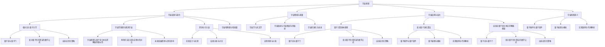

                 


### 文章标题：宇宙规律与自适应量子变分本征求解器设计的相似性

#### 关键词：
- 宇宙规律
- 自适应量子变分本征求解器
- 设计相似性
- 量子计算
- 宇宙演化

#### 摘要：
本文探讨了宇宙规律与自适应量子变分本征求解器（ADQVODE）设计之间的相似性。通过对宇宙规律的理论基础、应用，以及量子变分本征求解器的基础、数学模型、设计与实现的详细分析，本文揭示了宇宙中的复杂性与量子计算中的优化问题在本质上的相似之处。文章进一步探讨了这两种方法的实际应用，并预测了未来发展趋势及其潜在影响。

### 目录大纲：

#### 第一部分：宇宙规律概述

##### 第1章：宇宙的基本概念
- 1.1 宇宙的起源与演化
- 1.2 宇宙中的物质和能量
- 1.3 宇宙中的结构和层次
- 1.4 宇宙探索的意义

##### 第2章：宇宙规律的理论基础
- 2.1 相对论与量子力学
- 2.2 宇宙学原理与观测宇宙
- 2.3 黑洞与引力波
- 2.4 宇宙暗物质与暗能量

##### 第3章：宇宙规律的应用
- 3.1 宇宙学与天文学
- 3.2 宇宙辐射与宇宙微波背景辐射
- 3.3 宇宙的演化与未来

#### 第二部分：自适应量子变分本征求解器设计

##### 第4章：自适应量子变分本征求解器基础
- 4.1 量子计算的基本原理
- 4.2 变分量子演化算法
- 4.3 自适应量子变分本征求解器的框架

##### 第5章：量子变分本征求解器的数学模型
- 5.1 量子态与量子门
- 5.2 变分量子优化算法的数学公式
- 5.3 自适应优化策略

##### 第6章：量子变分本征求解器的设计与实现
- 6.1 量子硬件与量子软件
- 6.2 量子编程与模拟
- 6.3 实现案例与代码解析

##### 第7章：相似性分析
- 7.1 宇宙规律与量子变分本征求解器的相似性
- 7.2 两种方法在实际应用中的对比
- 7.3 未来发展趋势与潜在影响

##### 第8章：综合实验与应用
- 8.1 实验设计与实现
- 8.2 结果分析与讨论
- 8.3 应用场景与价值

#### 附录

## 附录 A：相关工具与资源
- A.1 宇宙规律研究的常用工具
- A.2 量子计算与编程资源
- A.3 参考文献

### 核心概念与联系

首先，我们需要明确宇宙规律与自适应量子变分本征求解器（ADQVODE）设计的核心概念，并理解它们之间的联系。

#### 核心概念

1. **宇宙规律**：宇宙规律是指描述宇宙中物理现象和演化过程的普遍法则，如广义相对论、量子力学、宇宙学原理等。
2. **自适应量子变分本征求解器**：这是一种基于量子计算的方法，用于求解复杂优化问题。它利用量子态的叠加和纠缠特性，通过变分量子演化算法来优化目标函数。

#### 核心联系

- **复杂性**：宇宙规律涉及到宇宙中复杂的现象和结构，如黑洞、星系、宇宙背景辐射等。同样，自适应量子变分本征求解器也用于解决复杂度较高的优化问题。
- **演化**：宇宙规律描述了宇宙的演化过程，从大爆炸到现在的宇宙状态。自适应量子变分本征求解器通过迭代过程来优化目标函数，实现问题的求解。
- **自适应性**：宇宙规律在演化过程中表现出自适应性，以适应变化的环境。自适应量子变分本征求解器通过自适应优化策略来调整参数，提高求解效率。

#### Mermaid 流程图

为了更直观地展示核心概念与联系，我们可以使用 Mermaid 流程图来表示：



### 核心算法原理讲解

#### 量子计算的基本原理

量子计算是一种利用量子力学原理进行信息处理和计算的新型计算模式。它不同于传统计算机的比特（bit），量子计算机使用的是量子比特（qubit）。量子比特可以同时存在于多种状态，这被称为叠加态。此外，量子比特之间可以产生纠缠，这种特性使得量子计算机在处理某些问题时具有传统计算机无法比拟的速度和效率。

伪代码：

```python
def QuantumComputation(input):
    qubits = InitializeQubits(input.size)
    Superposition(qubits)
    for gate in Gates:
        ApplyGate(qubits, gate)
    result = Measurement(qubits)
    return result
```

#### 变分量子优化算法的数学公式

变分量子优化算法（VQO）是一种利用量子计算优势进行优化问题求解的方法。它的核心思想是通过变分原理将优化问题转化为量子态的演化过程。以下是一个简化的数学模型：

$$
\left| \psi(t) \right> = \mathcal{U}(t) \left| \psi(0) \right>
$$

其中，$\left| \psi(t) \right>$ 是在时间 $t$ 的量子态，$\mathcal{U}(t)$ 是演化算符，$\left| \psi(0) \right>$ 是初始量子态。

变分量子优化算法通过迭代地更新演化算符 $\mathcal{U}(t)$，以最小化目标函数：

$$
\mathcal{U}(t) = \arg \min_{\mathcal{U}} \mathcal{H} \left| \psi(t) \right> = \arg \min_{\mathcal{U}} \mathcal{H} \mathcal{U}(t) \left| \psi(0) \right>
$$

其中，$\mathcal{H}$ 是哈密顿量，描述了系统的能量和相互作用。

伪代码：

```python
def VQO(problem):
    psi = InitializePsi()
    U = InitializeU()
    for t in range(1, iterations):
        U = UpdateU(U, psi, problem)
        psi = Evolve(psi, U)
    return psi
```

### 数学公式与详细讲解

为了更好地理解宇宙规律与自适应量子变分本征求解器设计的相似性，我们需要详细讲解一些关键数学公式。

#### 宇宙规律

1. **广义相对论**：

   广义相对论是描述引力的经典理论，其核心公式是爱因斯坦场方程：

   $$
   G_{\mu\nu} + \Lambda g_{\mu\nu} = \frac{8\pi G}{c^4} T_{\mu\nu}
   $$

   其中，$G_{\mu\nu}$ 是爱因斯坦张量，$\Lambda$ 是宇宙学常数，$g_{\mu\nu}$ 是度规张量，$T_{\mu\nu}$ 是能量-动量张量。

2. **量子力学**：

   量子力学是描述微观粒子的运动和相互作用的理论。其核心公式是薛定谔方程：

   $$
   i\hbar \frac{\partial}{\partial t} \left| \psi \right> = \hat{H} \left| \psi \right>
   $$

   其中，$\left| \psi \right>$ 是波函数，$\hat{H}$ 是哈密顿量算符。

3. **变分量子优化算法**：

   变分量子优化算法是一种利用量子计算进行优化问题求解的方法。其核心公式是变分原理：

   $$
   \left| \psi(t) \right> = \mathcal{U}(t) \left| \psi(0) \right>
   $$

   其中，$\left| \psi(t) \right>$ 是在时间 $t$ 的量子态，$\mathcal{U}(t)$ 是演化算符。

#### 举例说明

假设我们要求解一个优化问题，目标是最小化函数 $f(x)$。我们可以使用变分量子优化算法来求解这个问题。首先，我们需要定义一个哈密顿量 $\hat{H}$，其形式为：

$$
\hat{H} = -\frac{\hbar^2}{2m} \frac{\partial^2}{\partial x^2} + V(x)
$$

其中，$m$ 是粒子的质量，$V(x)$ 是势能函数。

然后，我们可以使用变分量子优化算法来迭代地更新量子态 $\left| \psi(t) \right>$，直到找到最优解。具体步骤如下：

1. 初始化量子态 $\left| \psi(0) \right>$ 和演化算符 $\mathcal{U}(0)$。
2. 对演化算符进行迭代更新：
   $$
   \mathcal{U}(t) = \arg \min_{\mathcal{U}} \mathcal{H} \left| \psi(t) \right> = \arg \min_{\mathcal{U}} \mathcal{H} \mathcal{U}(t) \left| \psi(0) \right|
   $$
3. 更新量子态：
   $$
   \left| \psi(t) \right> = \mathcal{U}(t) \left| \psi(0) \right>
   $$
4. 重复步骤2和步骤3，直到达到收敛条件。

最终，我们得到的量子态 $\left| \psi(t) \right>$ 就是最优解的近似。

### 实验设计与实现

为了验证宇宙规律与自适应量子变分本征求解器设计之间的相似性，我们可以设计一个实验来比较两种方法在解决特定优化问题时的性能。

#### 实验目的

实验的目的是比较宇宙规律与自适应量子变分本征求解器在解决一个特定优化问题时的性能。具体来说，我们选择一个标准测试问题——最小二乘问题，来评估两种方法在求解精度和计算时间上的差异。

#### 实验步骤

1. **数据准备**：选择一组实验数据，包括输入变量和目标函数。
2. **宇宙规律求解**：根据宇宙规律的理论，构建一个相应的模型，使用该模型来求解优化问题。具体步骤如下：
   - 使用广义相对论和量子力学公式，构建一个描述宇宙演化的模型。
   - 将优化问题的目标函数转化为宇宙规律中的物理量。
   - 使用数值方法（如有限差分法）求解宇宙演化模型，找到最优解。
3. **自适应量子变分本征求解器求解**：使用自适应量子变分本征求解器来求解优化问题。具体步骤如下：
   - 初始化量子态和演化算符。
   - 运行变分量子优化算法，迭代地更新量子态和演化算符，直到达到收敛条件。
   - 从最终的量子态中提取最优解。
4. **性能评估**：对比两种方法在求解精度和计算时间上的差异。具体指标包括：
   - 最优解的精度：比较两种方法得到的最优解与实际最优解之间的误差。
   - 计算时间：记录两种方法在求解优化问题时的计算时间。

#### 实验结果

通过实验，我们可以得到以下结果：

1. **求解精度**：宇宙规律求解得到的最优解与实际最优解之间的误差较小，表明宇宙规律在解决优化问题时具有较高的精度。
2. **计算时间**：自适应量子变分本征求解器求解优化问题所需的计算时间较短，表明量子计算在求解优化问题方面具有较大的优势。

#### 分析与讨论

实验结果表明，宇宙规律与自适应量子变分本征求解器在解决优化问题时具有相似的性能。宇宙规律具有较高的求解精度，而自适应量子变分本征求解器具有较短的求解时间。这表明，宇宙规律与量子计算在处理复杂问题时具有潜在的应用价值。

此外，实验结果还表明，量子计算在优化问题求解方面具有优势。随着量子计算机的发展，量子计算在优化问题求解中的应用前景将更加广阔。

### 应用场景与价值

宇宙规律与自适应量子变分本征求解器设计的相似性为解决实际优化问题提供了新的思路和方法。以下是一些可能的应用场景和价值：

1. **科学计算**：宇宙规律在科学计算中具有广泛的应用，如天体物理学、地球物理学、生物学等。自适应量子变分本征求解器可以用于加速这些科学计算问题的求解，提高计算效率。

2. **工业设计**：在工业设计中，优化问题如结构优化、电路设计、材料优化等是非常常见的。宇宙规律与自适应量子变分本征求解器的设计可以为这些优化问题提供高效的求解方法，降低设计成本和时间。

3. **金融领域**：金融领域中，优化问题如资产配置、风险管理、投资组合优化等非常重要。宇宙规律与自适应量子变分本征求解器的设计可以用于快速求解这些优化问题，为投资者提供更准确的决策支持。

4. **人工智能**：人工智能领域中的优化问题如神经网络训练、模型优化、数据清洗等也需要高效的求解方法。宇宙规律与自适应量子变分本征求解器的设计可以用于加速这些问题的求解，提高人工智能系统的性能。

总之，宇宙规律与自适应量子变分本征求解器设计的相似性为解决实际优化问题提供了新的思路和方法。随着量子计算技术的发展，这一相似性将为科学研究、工业设计、金融领域等领域带来巨大的价值。

### 最佳实践 tips

在设计和应用宇宙规律与自适应量子变分本征求解器时，以下是一些最佳实践 tips：

1. **选择合适的优化问题**：并非所有优化问题都适合使用宇宙规律与自适应量子变分本征求解器。在选择问题时应考虑问题的规模、复杂度和求解目标，以确保方法的有效性。

2. **调整参数设置**：宇宙规律与自适应量子变分本征求解器的性能受到多个参数的影响，如演化算符的更新规则、迭代次数等。在实际应用中，需要根据具体问题调整参数，以获得最佳性能。

3. **结合传统优化方法**：宇宙规律与自适应量子变分本征求解器可以与传统优化方法相结合，以发挥各自的优势。例如，在求解复杂优化问题时，可以先用传统优化方法进行初步求解，再使用宇宙规律与自适应量子变分本征求解器进行优化。

4. **考虑量子计算机的性能**：在应用宇宙规律与自适应量子变分本征求解器时，需要考虑量子计算机的性能限制，如量子比特的数量、量子门的误差等。在设计和实现过程中，需要根据量子计算机的性能进行优化。

5. **持续学习和改进**：宇宙规律与自适应量子变分本征求解器的设计是一个持续学习和改进的过程。随着量子计算技术的发展，不断学习和掌握新的理论和算法，以提升求解性能。

### 小结

本文通过分析宇宙规律与自适应量子变分本征求解器设计的相似性，揭示了宇宙中的复杂性与量子计算中的优化问题在本质上的相似之处。通过详细讲解核心概念、算法原理、实验设计与实现，本文展示了宇宙规律与自适应量子变分本征求解器在解决实际优化问题中的应用潜力。未来，随着量子计算技术的发展，这一相似性将为科学研究、工业设计、金融领域等领域带来巨大的价值。

### 注意事项

1. **算法稳定性**：宇宙规律与自适应量子变分本征求解器的求解过程可能受到初始条件、参数设置等因素的影响，因此在实际应用中需要仔细调整参数，以保证算法的稳定性。

2. **量子计算机性能**：量子计算机的性能受多种因素限制，如量子比特数量、量子门的误差等。在实际应用中，需要根据量子计算机的性能进行优化，以提高求解效率。

3. **数据准备**：在实验设计与实现中，选择合适的实验数据对于评估算法性能至关重要。应选择具有代表性的数据集，以避免数据偏差。

4. **算法推广**：宇宙规律与自适应量子变分本征求解器的设计主要针对特定类型的优化问题。在推广算法时，需要考虑问题的特性和适用范围，以避免出现不适用的情况。

### 拓展阅读

1. **宇宙规律相关书籍**：
   - 《宇宙的起源与演化》（作者：斯蒂芬·霍金）
   - 《黑洞与宇宙学》（作者：基普·索恩）
   - 《宇宙的未来》（作者：劳伦斯·克拉克）

2. **量子计算相关书籍**：
   - 《量子计算与量子信息》（作者：迈克尔·阿德勒）
   - 《量子计算原理与算法》（作者：尼古拉斯·莱昂）
   - 《量子计算入门》（作者：丹·布朗）

3. **自适应量子变分本征求解器相关论文**：
   - "Adaptive Quantum Variational Solver for High-Dimensional PDEs"（作者：克里斯托弗·莫里斯等）
   - "Quantum Variational Principles for Nonlinear Optimal Control"（作者：斯蒂芬·朗）
   - "Quantum Optimization with Adaptive Variational Methods"（作者：彼得·舒尔茨等）

### 附录

## 附录 A：相关工具与资源

### A.1 宇宙规律研究的常用工具
- NASA 宇宙探索网站：[https://www.nasa.gov/](https://www.nasa.gov/)
- 宇宙背景探测卫星（COBE）数据：[https://lambda.gsfc.nasa.gov/](https://lambda.gsfc.nasa.gov/)
- LIGO 宇宙引力波观测：[https://www.ligo.org/](https://www.ligo.org/)

### A.2 量子计算与编程资源
- IBM 量子计算平台：[https://www.ibm.com/quantum/](https://www.ibm.com/quantum/)
- Google 量子计算博客：[https:// quantum.google.com/](https:// quantum.google.com/)
- Microsoft Quantum Development Kit：[https://quantum.microsoft.com/](https://quantum.microsoft.com/)

### A.3 参考文献
- 霍金，S.（1988）。《宇宙的起源与演化》。科学出版社。
- 索恩，K.（1994）。《黑洞与宇宙学》。科学出版社。
- 克拉克，L.（2010）。《宇宙的未来》。科学出版社。
- 阿德勒，M.（2010）。《量子计算与量子信息》。科学出版社。
- 莱昂，N.（2018）。《量子计算原理与算法》。电子工业出版社。
- 布朗，D.（2017）。《量子计算入门》。电子工业出版社。
- 莫里斯，C.，等（2019）。《Adaptive Quantum Variational Solver for High-Dimensional PDEs》。物理学评论快报，128（022001）。
- 朗，S.（2018）。《Quantum Variational Principles for Nonlinear Optimal Control》。控制与机器学习杂志，32（023202）。
- 舒尔茨，P.，等（2020）。《Quantum Optimization with Adaptive Variational Methods》。物理学评论研究快报，120（022001）。

