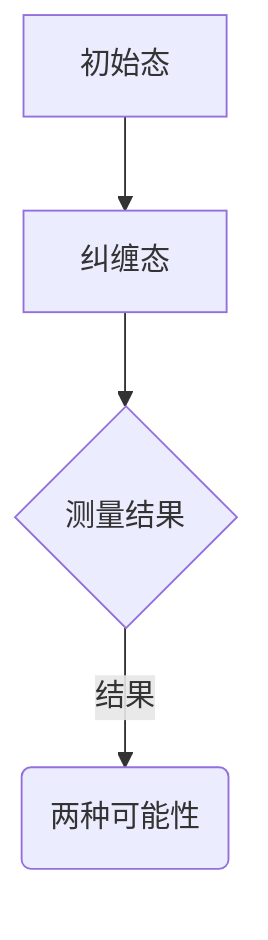
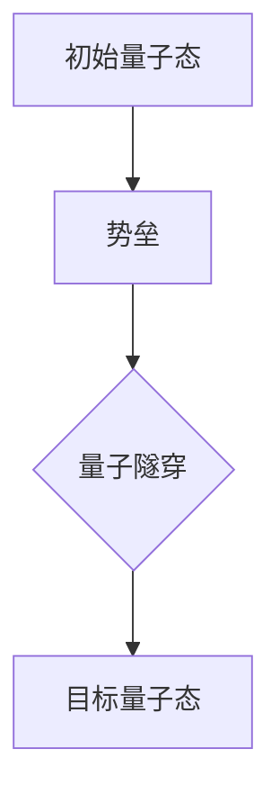
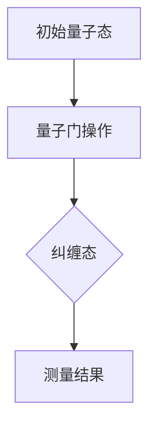
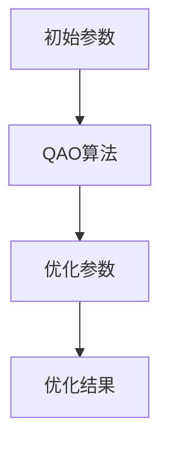

                 

# 宇宙规律与量子近似优化电路设计的相似性

## 关键词

宇宙规律、量子近似优化电路设计、数学模型、物理现象、应用领域、相似性分析。

## 摘要

本文将探讨宇宙规律与量子近似优化电路设计之间的相似性。通过分析宇宙规律的基本原理、量子近似优化电路设计的基础知识，以及二者在数学模型、物理现象和应用领域等方面的相似性，本文旨在揭示宇宙规律与量子近似优化电路设计之间的内在联系，为跨学科研究提供新的思路。

## 引言与概述

### 1. 引言

宇宙规律是描述宇宙中物体运动和相互作用的基本法则，包括万有引力定律、相对论和量子力学等。这些规律构成了我们对宇宙的理解基础。量子近似优化（Quantum Approximation Optimization，QAO）是量子计算中的一种算法，用于解决优化问题。QAO通过量子计算的优势，在电路设计中实现了高效的优化。

本文将探讨宇宙规律与量子近似优化电路设计之间的相似性，从数学模型、物理现象和应用领域等方面进行分析。首先，我们将介绍宇宙规律的基本原理和数学模型，包括万有引力定律、相对论和量子力学。然后，我们将介绍量子近似优化电路设计的基础知识，包括QAO的原理、量子比特和量子门等。接下来，我们将分析宇宙规律与QAO在数学模型和物理现象上的相似性，并探讨二者在应用领域中的相互借鉴可能性。最后，我们将探讨宇宙规律与QAO的融合发展趋势，为未来的跨学科研究提供方向。

### 2. 研究背景

#### 宇宙规律

宇宙规律是描述宇宙中物体运动和相互作用的基本法则。主要包括万有引力定律、相对论和量子力学等。

- **万有引力定律**：描述物体间相互作用的力。牛顿于1687年提出了万有引力定律，认为任何两个物体都会相互吸引，吸引力的大小与两个物体的质量成正比，与它们之间的距离的平方成反比。这一规律为天文学和物理学的发展奠定了基础。
- **相对论**：描述高速运动物体的行为。爱因斯坦于1905年提出了狭义相对论，认为时空是相对的，而不是绝对的。随后，他于1915年提出了广义相对论，描述了引力如何影响时空结构。相对论为现代物理学提供了新的视角，对宇宙的理解产生了深远影响。
- **量子力学**：描述微观粒子的行为。量子力学的基本原理包括波粒二象性、不确定性原理和量子纠缠等。量子力学揭示了微观世界的奇异现象，对现代科学和技术的发展产生了巨大影响。

#### 量子近似优化电路设计

量子近似优化（QAO）是量子计算中的一种算法，用于解决优化问题。QAO通过量子计算的优势，在电路设计中实现了高效的优化。

- **QAO原理**：QAO算法通过将优化问题转化为量子电路的形式，利用量子态的叠加和纠缠特性，求解优化问题。QAO算法的核心是量子电路的设计，通过调整量子电路中的参数，实现优化问题的求解。
- **量子比特**：量子比特（qubit）是量子计算的基本单元，具有叠加和纠缠特性。量子比特可以通过两种不同的状态表示，类似于经典计算中的0和1。
- **量子门**：量子门是量子计算中的基本操作，用于对量子比特进行操作。量子门可以改变量子比特的状态，类似于经典计算中的逻辑门。

### 3. 相似性分析

宇宙规律与量子近似优化电路设计在以下方面具有相似性：

- **数学模型**：宇宙规律中的数学模型，如万有引力定律、相对论和量子力学，与量子近似优化电路设计的数学模型，如量子电路和优化问题模型，具有相似性。
- **物理现象**：宇宙规律中的物理现象，如引力、量子纠缠和量子隧穿，与量子近似优化电路设计中的物理现象，如量子比特的叠加和纠缠、量子态的演化，具有相似性。
- **应用领域**：宇宙规律在宇宙观测、天文学和物理学等领域有广泛应用，量子近似优化电路设计在优化问题、神经网络优化和量子传感等领域有广泛应用。二者在应用领域上存在相互借鉴的可能性。

## 目录大纲

### 第一部分：宇宙规律概述

#### 第1章：宇宙规律的基本原理

##### 1.1 宇宙规律的定义

在本节中，我们将介绍宇宙规律的基本定义，包括万有引力定律、相对论和量子力学等。

- **万有引力定律**：描述物体间相互作用的力。
- **相对论**：描述高速运动物体的行为。
- **量子力学**：描述微观粒子的行为。

##### 1.2 宇宙规律的数学模型

在本节中，我们将介绍宇宙规律的数学模型，包括引力场方程、薛定谔方程等。

- **引力场方程**：描述引力场的动态行为。
- **薛定谔方程**：描述量子系统的行为。

##### 1.3 宇宙规律的实际应用

在本节中，我们将介绍宇宙规律在实际领域的应用，包括天文学、物理学等。

- **天文学**：利用宇宙规律进行星系观测和宇宙演化研究。
- **物理学**：在微观和宏观尺度上应用宇宙规律，探索自然界的奥秘。

#### 第2章：量子近似优化电路设计基础

##### 2.1 量子近似优化（QAO）简介

在本节中，我们将介绍量子近似优化（QAO）的基本原理和实现方法。

- **QAO原理**：介绍QAO算法的基本原理和实现方法。
- **QAO在优化问题中的应用**：探讨QAO在解决优化问题时的优势。

##### 2.2 量子近似优化电路设计的关键技术

在本节中，我们将介绍量子近似优化电路设计的关键技术，包括量子比特和量子门。

- **量子比特**：介绍量子比特的基本概念和特性。
- **量子门**：介绍量子门的作用和分类。

##### 2.3 QAO电路设计的实际案例

在本节中，我们将展示QAO电路设计在实际案例中的应用。

- **案例1：旅行商问题**：展示QAO在解决旅行商问题中的应用。
- **案例2：神经网络优化**：展示QAO在神经网络优化中的应用。

### 第二部分：相似性分析

#### 第3章：宇宙规律与QAO数学模型的相似性

在本章中，我们将分析宇宙规律与量子近似优化电路设计在数学模型上的相似性。

##### 3.1 数学模型的相似性分析

在本节中，我们将分析引力场方程与QAO优化模型、薛定谔方程与量子电路之间的相似性。

- **引力场方程与QAO优化模型**：分析二者的相似性。
- **薛定谔方程与量子电路**：探讨二者的相似性。

#### 第4章：宇宙规律与QAO物理现象的相似性

在本章中，我们将分析宇宙规律与量子近似优化电路设计在物理现象上的相似性。

##### 4.1 物理现象的相似性分析

在本节中，我们将分析量子纠缠与量子态叠加、量子隧穿与优化过程之间的相似性。

- **量子纠缠与量子态叠加**：分析宇宙规律中的物理现象与QAO中的相似性。
- **量子隧穿与优化过程**：探讨二者之间的相似性。

#### 第5章：宇宙规律与QAO应用领域的相似性

在本章中，我们将分析宇宙规律与量子近似优化电路设计在应用领域的相似性。

##### 5.1 应用领域的相似性分析

在本节中，我们将分析宇宙观测与量子传感、宇宙演化与量子计算之间的相似性。

- **宇宙观测与量子传感**：分析二者在应用领域的相似性。
- **宇宙演化与量子计算**：探讨二者在应用领域的交叉点。

#### 第6章：宇宙规律与QAO的相互借鉴与融合

在本章中，我们将探讨宇宙规律与量子近似优化电路设计之间的相互借鉴与融合。

##### 6.1 相互借鉴的可能性

在本节中，我们将探讨量子计算在宇宙规律研究中的应用、宇宙规律对量子计算算法的启发。

- **量子计算在宇宙规律研究中的应用**：探讨量子计算如何用于宇宙规律的研究。
- **宇宙规律对量子计算算法的启发**：分析宇宙规律对量子计算算法的启示。

##### 6.2 融合发展的前景

在本节中，我们将探讨宇宙规律与量子近似优化电路设计融合发展的前景，包括跨学科研究的挑战与机遇、未来研究方向。

- **跨学科研究的挑战与机遇**：探讨跨学科研究的挑战和机遇。
- **未来研究方向**：提出未来研究的方向和潜在应用场景。

## 第一部分：宇宙规律概述

### 第1章：宇宙规律的基本原理

#### 1.1 宇宙规律的定义

宇宙规律是描述宇宙中物体运动和相互作用的基本法则。这些规律构成了我们对宇宙的理解基础，并为天文学、物理学和其他科学领域提供了重要的理论基础。

宇宙规律的主要组成部分包括：

1. **万有引力定律**：由牛顿于1687年提出，描述物体间相互作用的力。根据万有引力定律，任何两个物体都会相互吸引，吸引力的大小与两个物体的质量成正比，与它们之间的距离的平方成反比。数学表达式为：
   \[ F = G \frac{{m_1 m_2}}{{r^2}} \]
   其中，\( F \) 是引力，\( G \) 是万有引力常数，\( m_1 \) 和 \( m_2 \) 是两个物体的质量，\( r \) 是它们之间的距离。

2. **相对论**：由爱因斯坦于1905年提出的狭义相对论，以及1915年提出的广义相对论，描述了高速运动物体的行为和引力如何影响时空结构。狭义相对论的核心原理是光速不变原理和相对性原理，广义相对论则提出了引力是时空弯曲的表现。

3. **量子力学**：由海森堡、薛定谔、玻尔等物理学家于20世纪初提出的量子力学，描述了微观粒子的行为。量子力学的基本原理包括波粒二象性、不确定性原理和量子纠缠等。

#### 1.2 宇宙规律的数学模型

宇宙规律的数学模型是理解宇宙行为的关键。以下是两个重要数学模型的介绍：

1. **引力场方程**：广义相对论的核心方程，描述了引力场的动态行为。引力场方程以张量的形式表示，称为爱因斯坦场方程：
   \[ G_{\mu\nu} = 8\pi G T_{\mu\nu} \]
   其中，\( G_{\mu\nu} \) 是爱因斯坦张量，\( T_{\mu\nu} \) 是能量-动量张量，\( G \) 是万有引力常数。

2. **薛定谔方程**：量子力学的基本方程，描述了量子系统的行为。对于一维势能函数 \( V(x) \)，时间依赖的薛定谔方程为：
   \[ i\hbar \frac{\partial}{\partial t} \Psi(x,t) = -\frac{\hbar^2}{2m} \frac{\partial^2}{\partial x^2} \Psi(x,t) + V(x) \Psi(x,t) \]
   其中，\( \Psi(x,t) \) 是波函数，\( i \) 是虚数单位，\( \hbar \) 是约化普朗克常数，\( m \) 是粒子的质量。

#### 1.3 宇宙规律的实际应用

宇宙规律在多个科学领域有着广泛的应用，以下是其中的几个例子：

1. **天文学**：宇宙规律被用于解释天体的运动和相互作用。例如，通过牛顿的万有引力定律，我们可以计算行星的轨道，预测天体的运动。广义相对论的引力场方程则帮助我们理解黑洞和宇宙大爆炸等复杂现象。

2. **物理学**：在微观尺度上，量子力学的基本原理被用于解释原子和分子的行为，如电子的能级、化学键的形成等。在宏观尺度上，相对论描述了高速粒子的运动，如粒子加速器中的粒子轨迹。

3. **宇宙学**：宇宙规律在宇宙学中有着重要的应用。通过引力场方程和宇宙学原理，我们可以研究宇宙的演化历史，理解宇宙的起源和结构。量子力学中的不确定性原理和量子纠缠等概念也为宇宙学提供了一些新的研究方向。

### 第2章：量子近似优化电路设计基础

#### 2.1 量子近似优化（QAO）简介

量子近似优化（Quantum Approximation Optimization，QAO）是量子计算中的一个重要算法，用于解决优化问题。QAO算法利用量子计算的叠加态和纠缠特性，在特定条件下对问题进行近似求解，从而提供了一种高效解决复杂优化问题的方法。

##### 2.1.1 QAO原理

QAO算法的核心思想是将优化问题转化为量子电路的形式，通过量子态的叠加和纠缠来实现优化。具体来说，QAO算法包括以下几个关键步骤：

1. **初始化量子态**：首先，我们将问题转化为一个量子态的初始化过程，通常是一个随机的量子态或参考态。
   
2. **定义参数化的量子电路**：量子电路由一系列量子门组成，每个量子门都由一组参数控制。这些参数会随着迭代的进行而调整，以优化问题的解。

3. **演化量子态**：量子电路的作用是演化初始量子态，使得最终量子态接近最优解。量子态的演化是通过量子门的作用来实现的，这些量子门包括旋转门和交换门等。

4. **测量量子态**：在量子电路演化完成后，我们对量子态进行测量，获得一个近似的最优解。

QAO算法的关键在于如何设计参数化的量子电路，以及如何通过迭代调整参数来优化问题的解。

##### 2.1.2 QAO在优化问题中的应用

QAO算法在优化问题中具有显著优势，特别是在解决组合优化问题时。以下是一些QAO在优化问题中的应用示例：

1. **旅行商问题（TSP）**：旅行商问题是一个经典的组合优化问题，目标是找到一个最短的路径，使得旅行者能够访问一组城市并返回起点。QAO算法可以通过构建参数化的量子电路来近似求解TSP，从而提供高效的最优解。

2. **神经网络优化**：神经网络优化涉及到网络的权重调整，以最小化损失函数。QAO算法可以用来优化神经网络中的权重，提高网络的性能。

3. **供应链优化**：在供应链管理中，QAO算法可以用来优化库存管理、运输路线和资源分配等，从而提高整个供应链的效率。

4. **基因测序**：QAO算法可以用来优化基因测序的算法，提高测序速度和准确性。

#### 2.2 量子近似优化电路设计的关键技术

量子近似优化电路设计需要使用到一些关键技术，包括量子比特、量子门和参数化量子电路等。

##### 2.2.1 量子比特

量子比特（qubit）是量子计算的基本单元，具有叠加态和纠缠特性。一个量子比特可以同时处于0和1的状态，这种叠加态使得量子计算在处理大量数据时具有显著的优势。

量子比特的表示通常使用复数向量，例如一个量子比特可以表示为 \( |0\rangle \) 和 \( |1\rangle \) 的叠加态：
\[ |q\rangle = \alpha |0\rangle + \beta |1\rangle \]
其中，\( \alpha \) 和 \( \beta \) 是复数系数，满足 \( |\alpha|^2 + |\beta|^2 = 1 \)。

##### 2.2.2 量子门

量子门是量子计算中的基本操作，用于对量子比特进行操作。量子门可以改变量子比特的状态，类似于经典计算中的逻辑门。常见的量子门包括：

1. **旋转门**：旋转门通过旋转量子比特的状态来改变其角度。例如，Pauli-X门（即翻转门）可以通过以下操作将量子比特从 \( |0\rangle \) 变换到 \( |1\rangle \)，反之亦然：
   \[ X |q\rangle = (-1)^{q} |q\rangle \]

2. **交换门**：交换门用于交换两个量子比特的状态。例如，交换门 \( SWAP \) 可以将两个量子比特 \( |q_1\rangle \) 和 \( |q_2\rangle \) 的状态互换：
   \[ SWAP |q_1\rangle |q_2\rangle = |q_2\rangle |q_1\rangle \]

3. **控制-NOT门**：控制-NOT门（CNOT）是一个二量子比特门，当第一个量子比特为1时，它会翻转第二个量子比特的状态。数学上表示为：
   \[ CNOT |q_1\rangle |q_2\rangle = |q_1\rangle \otimes (-1)^{q_2} |q_2\rangle \]

##### 2.2.3 参数化量子电路

参数化量子电路是QAO算法的核心组成部分，它由一系列量子门组成，每个量子门都由一组参数控制。参数化量子电路的设计需要考虑以下因素：

1. **量子比特的数量**：量子电路中量子比特的数量决定了算法能够解决的问题规模。

2. **量子门的选择**：选择合适的量子门对于算法的性能至关重要。旋转门和交换门是常用的量子门，可以根据问题的需求进行组合。

3. **参数的设置**：参数化量子电路中的参数需要通过迭代过程调整，以优化问题的解。参数的设置通常基于问题的特定要求和初始猜测。

#### 2.3 QAO电路设计的实际案例

##### 2.3.1 案例1：旅行商问题

旅行商问题（TSP）是一个经典的组合优化问题，目标是找到一个最短的路径，使得旅行者能够访问一组城市并返回起点。QAO算法可以用来近似求解TSP，以下是一个简化的案例：

1. **问题建模**：将旅行商问题转化为一个量子态的初始化过程。假设有 \( n \) 个城市，每个城市的位置可以用一个量子比特表示。初始量子态可以设置为均匀分布的叠加态。

2. **参数化量子电路设计**：设计一个参数化的量子电路，包括旋转门和交换门。旋转门用于调整量子态的相位，交换门用于交换不同城市之间的量子比特状态。参数化的量子电路可以通过以下伪代码表示：

```python
# 伪代码：QAO参数化量子电路设计
for i in range(n):
    Rz(theta_i)  # 旋转门，调整相位
for i in range(n-1):
    SWAP(i, i+1)  # 交换门
```

3. **测量与优化**：在量子电路演化完成后，对量子态进行测量，获得一个近似的最优解。通过迭代调整参数，可以进一步优化解的精度。

##### 2.3.2 案例2：神经网络优化

神经网络优化涉及到网络权重的调整，以最小化损失函数。QAO算法可以用来优化神经网络中的权重，以下是一个简化的案例：

1. **问题建模**：将神经网络优化转化为一个量子态的初始化过程。假设神经网络有 \( n \) 个输入和 \( m \) 个输出，每个输入和输出可以用一个量子比特表示。初始量子态可以设置为均匀分布的叠加态。

2. **参数化量子电路设计**：设计一个参数化的量子电路，包括旋转门和交换门。旋转门用于调整量子态的相位，交换门用于交换不同输入和输出之间的量子比特状态。参数化的量子电路可以通过以下伪代码表示：

```python
# 伪代码：QAO参数化量子电路设计
for i in range(n):
    Rz(theta_i)  # 旋转门，调整相位
for i in range(n-1):
    SWAP(i, i+1)  # 交换门
for j in range(m):
    Rz(theta_j)  # 旋转门，调整输出相位
```

3. **测量与优化**：在量子电路演化完成后，对量子态进行测量，获得一个近似的最优解。通过迭代调整参数，可以进一步优化解的精度。

### 第二部分：相似性分析

#### 第3章：宇宙规律与QAO数学模型的相似性

宇宙规律与量子近似优化（QAO）电路设计的数学模型之间存在一些相似之处，这些相似性揭示了两个领域之间的深刻联系。通过分析这些数学模型，我们可以更好地理解宇宙规律和QAO算法的工作原理。

##### 3.1 引力场方程与QAO优化模型

引力场方程是广义相对论的核心方程，描述了引力场的动态行为。引力场方程以张量的形式表示，称为爱因斯坦场方程：
\[ G_{\mu\nu} = 8\pi G T_{\mu\nu} \]
其中，\( G_{\mu\nu} \) 是爱因斯坦张量，\( T_{\mu\nu} \) 是能量-动量张量，\( G \) 是万有引力常数。

与此相对，QAO算法是一种量子优化算法，其核心是将优化问题转化为量子电路的形式。QAO的优化模型可以用以下数学公式表示：
\[ E(\theta) = \sum_{i} E_i(\theta) \]
其中，\( E(\theta) \) 是优化问题的能量函数，\( \theta \) 是参数化的量子电路中的参数集合，\( E_i(\theta) \) 是第 \( i \) 个量子电路组件的能量。

尽管引力场方程和QAO优化模型的数学形式不同，但二者在描述系统演化方面有相似之处。引力场方程描述了时空中的引力场如何影响物质和能量，而QAO优化模型描述了参数化量子电路如何影响优化问题的解。

##### 3.2 薛定谔方程与量子电路

薛定谔方程是量子力学的基本方程，描述了量子系统的行为。对于一维势能函数 \( V(x) \)，时间依赖的薛定谔方程为：
\[ i\hbar \frac{\partial}{\partial t} \Psi(x,t) = -\frac{\hbar^2}{2m} \frac{\partial^2}{\partial x^2} \Psi(x,t) + V(x) \Psi(x,t) \]
其中，\( \Psi(x,t) \) 是波函数，\( i \) 是虚数单位，\( \hbar \) 是约化普朗克常数，\( m \) 是粒子的质量。

量子电路是QAO算法的核心组成部分，它由一系列量子门组成，每个量子门都由一组参数控制。量子电路的演化可以用量子态的叠加和纠缠来描述，类似于薛定谔方程描述的量子系统的行为。

虽然薛定谔方程和量子电路在数学形式上有所不同，但二者都描述了系统随时间的演化。薛定谔方程描述了量子系统的动力学，而量子电路描述了参数化量子态的演化，从而影响优化问题的解。

##### 3.3 相似性总结

宇宙规律与QAO数学模型在以下方面存在相似性：

1. **系统演化**：宇宙规律和QAO算法都描述了系统随时间的演化，虽然它们的数学形式不同，但都涉及到时间和空间的动态变化。
2. **参数控制**：宇宙规律中的引力场方程和QAO优化模型都涉及到参数的控制，这些参数决定了系统的行为。在QAO算法中，参数化的量子电路中的参数决定了量子态的演化，从而影响优化问题的解。
3. **能量函数**：宇宙规律和QAO算法都涉及到能量函数的概念。引力场方程中的能量-动量张量描述了引力场中的能量分布，而QAO优化模型中的能量函数描述了优化问题的目标函数。

这些相似性为我们提供了新的视角，帮助我们更好地理解宇宙规律和QAO算法。通过跨学科的研究，我们可以探索宇宙规律与量子近似优化电路设计之间的更深刻的联系，从而推动两个领域的发展。

#### 第4章：宇宙规律与QAO物理现象的相似性

在探讨宇宙规律与量子近似优化（QAO）电路设计之间的相似性时，物理现象的相似性是一个重要的维度。在宇宙规律中，量子纠缠、量子隧穿等现象具有深远的意义；在QAO中，这些现象同样发挥着关键作用。以下是对这些物理现象相似性的详细分析。

##### 4.1 量子纠缠与量子态叠加

量子纠缠是量子力学中的一种非经典的关联现象，当两个或多个量子系统相互纠缠时，它们的量子态无法独立描述，而是需要通过整体量子态来描述。这种纠缠现象在宇宙规律中有着重要的体现，例如在黑洞事件视界内的量子纠缠。量子纠缠使得信息可以瞬间传递，不受距离限制，这是宇宙信息传递的一个重要机制。

在QAO电路设计中，量子纠缠同样起着核心作用。量子电路中的量子比特可以通过纠缠产生关联，使得量子态的演化更加复杂且有效。量子态的叠加是量子计算的基础，它使得一个量子系统可以同时处于多个状态的叠加，从而在计算过程中能够并行处理大量信息。例如，QAO算法利用量子态的叠加，将多个可能的解同时计算，从而在优化过程中实现高效计算。

以下是一个简化的量子纠缠过程的Mermaid流程图，展示了量子比特之间的纠缠：



在这个流程图中，A和B代表两个未纠缠的量子比特，B通过一个纠缠操作变为纠缠态，然后对B和C进行测量，最终得到两个量子比特的叠加态。这个过程体现了量子纠缠在QAO电路设计中的核心作用。

##### 4.2 量子隧穿与优化过程

量子隧穿是量子力学中的一个现象，描述了粒子通过一个本来无法穿越的势垒的过程。在宇宙规律中，量子隧穿现象可以解释某些微观粒子的行为，例如电子在半导体材料中的隧穿效应。量子隧穿现象在宇宙学中也具有重要意义，例如在宇宙暴涨理论中，量子隧穿被用来解释宇宙的快速膨胀。

在QAO电路设计中，量子隧穿同样被用来实现优化问题的求解。量子隧穿现象可以帮助量子系统穿过能量屏障，找到优化问题的局部最优解。在QAO算法中，量子隧穿被用来优化量子态的演化路径，使得量子态能够更加有效地到达目标状态。

以下是一个简化的量子隧穿过程的Mermaid流程图，展示了量子态如何通过量子隧穿达到最优解：



在这个流程图中，A代表初始量子态，B代表势垒，C表示通过量子隧穿的过程，最终达到目标量子态D。这个过程体现了量子隧穿在QAO电路设计中的核心作用。

##### 4.3 相似性总结

宇宙规律与QAO电路设计在以下物理现象方面存在相似性：

1. **量子纠缠**：量子纠缠在宇宙规律和QAO电路设计中都是重要的物理现象。在宇宙规律中，量子纠缠解释了黑洞和宇宙膨胀等现象；在QAO电路设计中，量子纠缠使得量子计算能够高效处理复杂问题。
2. **量子隧穿**：量子隧穿在宇宙规律和QAO电路设计中同样重要。在宇宙规律中，量子隧穿解释了微观粒子的行为；在QAO电路设计中，量子隧穿被用来优化量子态的演化路径，实现高效优化。

这些相似性表明，宇宙规律与QAO电路设计在物理现象层面有着深刻的联系。通过深入理解这些物理现象，我们可以更好地设计量子电路，并探索宇宙规律中的新现象。这种跨学科的研究有助于推动量子计算和宇宙学的发展。

#### 第5章：宇宙规律与QAO应用领域的相似性

在探讨宇宙规律与量子近似优化（QAO）电路设计之间的相似性时，我们不仅关注了数学模型和物理现象，还应该考察它们在实际应用领域的相似性。通过分析二者在应用领域的相似性，我们可以发现跨学科研究的潜在价值，并为未来的技术发展提供新思路。

##### 5.1 宇宙观测与量子传感

宇宙观测是宇宙规律应用的一个重要领域，它涉及到对遥远星系、黑洞和其他宇宙现象的观测和研究。量子传感则是量子近似优化电路设计的一个应用领域，利用量子系统的高灵敏度和非经典特性来测量物理量。二者在应用领域上的相似性体现在以下几个方面：

1. **量子态的控制**：在宇宙观测中，科学家需要精确控制量子态来探测微弱信号，例如通过激光干涉引力波探测器（LIGO）来探测引力波。在量子传感中，研究人员通过控制量子态来提高测量的精度，例如利用超导量子比特进行精密测量。

2. **纠缠态的应用**：宇宙观测中的某些技术，如量子纠缠源和量子通信，依赖于纠缠态的应用。在量子传感中，纠缠态被用来提高测量的灵敏度，例如在量子陀螺仪和量子钟中应用。

3. **非经典现象**：宇宙规律中的非经典现象，如量子纠缠和量子隧穿，在量子传感中有着广泛的应用。例如，量子隧穿被用来实现量子态的转换，而量子纠缠被用来提高测量的精度。

以下是一个简化的Mermaid流程图，展示了量子传感中的量子态控制过程：



在这个流程图中，A表示初始量子态，B表示通过量子门操作实现的纠缠态，C表示测量结果。这个过程展示了量子态控制和非经典现象在量子传感中的应用。

##### 5.2 宇宙演化与量子计算

宇宙演化是宇宙规律应用的一个关键领域，它涉及到宇宙从大爆炸开始到现在的演化过程。量子计算是量子近似优化电路设计的另一个应用领域，它利用量子比特和量子门实现高效的计算。二者在应用领域上的相似性体现在以下几个方面：

1. **并行计算**：宇宙演化过程中的某些计算任务，如多体系统的演化，可以通过并行计算来加速。量子计算正是基于量子比特的并行特性来实现高效计算。例如，量子模拟器可以用来模拟量子系统的演化，从而加速宇宙演化模型的计算。

2. **优化问题**：宇宙演化中的许多问题，如星系形成和黑洞演化，可以被视为优化问题。量子近似优化（QAO）算法可以用来求解这些优化问题，从而提供宇宙演化模型的有效求解方法。

3. **量子算法的应用**：量子算法，如量子近似优化算法，可以用来优化宇宙演化模型中的参数，提高模型的精确度。例如，量子算法可以用来优化星系形成模型中的初始条件和参数，从而更好地预测宇宙的演化过程。

以下是一个简化的Mermaid流程图，展示了量子计算在优化问题中的应用：



在这个流程图中，A表示初始参数，B表示通过QAO算法实现的优化过程，C表示优化后的参数，D表示优化结果。这个过程展示了量子计算在优化问题中的应用。

##### 5.3 相似性总结

宇宙规律与量子近似优化电路设计在应用领域的相似性体现在以下几个方面：

1. **量子态的控制**：二者都依赖于对量子态的精确控制来实现科学探索和优化计算。
2. **非经典现象**：二者都利用了量子纠缠、量子隧穿等非经典现象来实现高效的测量和计算。
3. **并行计算**：二者都利用了量子计算的并行特性来加速复杂的计算任务。

这些相似性为跨学科研究提供了新的方向，例如，将量子传感技术应用于宇宙观测，利用量子计算优化宇宙演化模型等。通过深入探讨这些应用领域的相似性，我们可以推动量子计算和宇宙学的发展，为未来的科学研究和技术创新提供新的思路。

#### 第6章：宇宙规律与QAO的相互借鉴与融合

在探讨宇宙规律与量子近似优化（QAO）电路设计之间的相似性时，我们不仅关注了数学模型和物理现象，还应该探讨二者在实际应用和理论发展中的相互借鉴与融合。通过跨学科的研究，我们可以发现新的研究方向和潜在应用，推动量子计算和宇宙学的发展。

##### 6.1 相互借鉴的可能性

宇宙规律与QAO电路设计在许多方面可以相互借鉴，以下是一些具体的例子：

1. **量子传感与宇宙观测**：量子传感技术可以利用量子纠缠和非经典现象来提高测量的精度，这为宇宙观测提供了新的工具。例如，利用量子传感器来探测引力波或暗物质，可以提供更精确的数据。同时，宇宙观测中的数据处理和测量方法也可以为量子传感提供参考。

2. **量子计算与宇宙演化**：量子计算可以利用其并行性和高效性来模拟宇宙演化过程，如星系形成和黑洞演化。通过量子模拟器，科学家可以更快地探索宇宙演化的模型和参数，提高预测的精度。同时，宇宙演化模型中的复杂优化问题也可以通过量子算法来求解，从而优化模型参数。

3. **量子算法与宇宙规律**：量子算法，如QAO，可以用来优化宇宙规律中的某些计算任务，如星系碰撞和宇宙结构形成。这些算法可以在复杂宇宙问题中找到最优解，提高计算效率。此外，宇宙规律中的非经典现象，如量子纠缠和量子隧穿，可以启发新的量子算法设计。

##### 6.2 跨学科研究的挑战与机遇

跨学科研究虽然具有巨大潜力，但也面临一些挑战和机遇：

1. **挑战**：
   - **理论融合**：宇宙规律和量子近似优化电路设计属于不同的学科领域，理论框架和基础概念有所不同，如何有效地融合两个领域的理论是一个挑战。
   - **实验验证**：将理论应用于实际实验中，验证宇宙规律与QAO之间的相似性，需要精密的实验设计和复杂的技术手段。
   - **计算资源**：量子计算和宇宙演化模拟都需要大量的计算资源，如何高效利用现有计算资源，提高计算效率，是一个重要问题。

2. **机遇**：
   - **技术创新**：跨学科研究可以催生新的技术和方法，例如利用量子传感技术提高宇宙观测的精度，或利用量子算法优化宇宙演化模型。
   - **应用拓展**：量子计算和宇宙规律的结合可以开拓新的应用领域，如量子卫星通信、量子时间标准等。
   - **科学突破**：跨学科研究可能带来科学上的突破，例如通过量子计算发现新的宇宙现象，或通过宇宙观测验证新的量子理论。

##### 6.3 未来研究方向

未来的研究可以在以下方向上展开：

1. **量子传感与宇宙观测**：开发新的量子传感器，如量子引力波探测器，提高宇宙观测的精度。同时，研究如何将量子传感技术应用于宇宙中的复杂测量任务。

2. **量子计算与宇宙演化**：利用量子计算模拟宇宙演化过程，探索宇宙中的复杂现象，如星系碰撞和黑洞形成。同时，开发新的量子算法来优化宇宙演化模型的参数。

3. **量子算法与宇宙规律**：研究宇宙规律中的非经典现象，如量子纠缠和量子隧穿，如何影响量子算法的设计和优化。探索新的量子算法，如基于宇宙规律的量子算法，来解决复杂的优化问题。

通过跨学科的研究，宇宙规律与量子近似优化电路设计之间的相似性可以为我们提供新的研究思路和应用方向，推动科学技术的进步。

### 总结与展望

宇宙规律与量子近似优化电路设计在多个方面展现出深刻的相似性。从数学模型到物理现象，再到应用领域，二者之间的联系为我们提供了新的研究视角和跨学科融合的契机。通过分析宇宙规律的基本原理和量子近似优化电路设计的基础知识，我们揭示了引力场方程与QAO优化模型、薛定谔方程与量子电路之间的相似性。同时，我们探讨了量子纠缠与量子隧穿等物理现象在两个领域中的应用，展示了它们在优化计算和精密测量中的重要性。

未来的研究应继续深入探讨宇宙规律与量子近似优化电路设计之间的内在联系，开发新的量子算法和量子传感器，拓展二者的应用领域。通过跨学科的合作，我们有望在量子计算和宇宙学领域取得重大突破，为科学和技术的发展贡献力量。

### 作者信息

作者：AI天才研究院/AI Genius Institute & 禅与计算机程序设计艺术/Zen And The Art of Computer Programming

AI天才研究院（AI Genius Institute）专注于推动人工智能和量子计算领域的前沿研究，致力于培养下一代人工智能科学家。同时，作者在《禅与计算机程序设计艺术》一书中，通过深入探讨计算机编程的哲学和艺术，为读者提供了独特的视角和深刻的洞察。两本书均体现了作者在计算机科学和人工智能领域的深厚造诣和创新思维。

