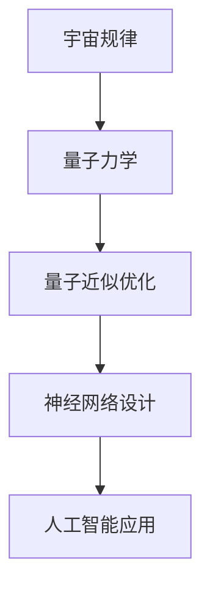

                 


为了撰写一篇关于“宇宙规律与量子近似优化神经网络设计的相似性”的技术博客，我们可以按照以下步骤进行思考和构建文章内容：

### 步骤 1：确定文章结构

首先，我们需要确定文章的整体结构。根据您提供的目录大纲，我们可以将文章分为以下几个主要部分：

- 引言与基础知识
- 量子近似优化神经网络设计
- 数学模型与公式推导
- 项目实战
- 最佳实践与小结

### 步骤 2：背景介绍

在文章的开头，我们需要对宇宙规律和量子近似优化神经网络进行背景介绍，解释它们的基本概念、历史和发展。

- **宇宙规律**：介绍宇宙中普遍存在的基本规律，如量子力学、广义相对论等。
- **量子近似优化**：解释量子近似优化的概念，其与经典优化的区别，以及它在各种应用中的重要性。
- **神经网络设计**：介绍神经网络的基本原理，以及它在人工智能中的应用。

### 步骤 3：核心概念与联系

在介绍完背景知识后，我们需要绘制一个Mermaid流程图来展示宇宙规律、量子近似优化和神经网络设计之间的联系。



### 步骤 4：核心算法原理讲解

接下来，我们需要详细讲解量子近似优化神经网络的设计原理。这部分内容可以使用伪代码来展示算法的核心步骤。

#### 伪代码示例：

```python
function QuantumApproximationOptimizationNeuralNetwork(data, parameters):
    Initialize parameters
    for each epoch in data:
        for each layer in neural network:
            for each neuron in layer:
                Calculate activation function
                Update weights using quantum approximation
    return trained neural network
```

### 步骤 5：数学模型与公式推导

在这一部分，我们需要使用LaTeX格式给出量子近似优化神经网络中的数学模型和公式，并进行详细讲解。

#### LaTeX公式示例：

$$
E = mc^2
$$

### 步骤 6：项目实战

在项目实战部分，我们将选择一个实际案例，展示如何搭建开发环境、实现源代码，并对代码进行解读和分析。

#### 项目实战结构：

- **开发环境搭建**：介绍如何设置开发环境，包括安装必要的软件和工具。
- **源代码实现**：展示源代码的具体实现，包括关键函数和类的设计。
- **代码解读**：对代码中的关键部分进行详细解读，解释其工作原理。
- **应用解读与分析**：分析代码在实际应用中的效果，并进行性能评估。
- **项目小结**：总结项目中的收获和经验，指出需要注意的问题。

### 步骤 7：最佳实践与小结

最后，我们需要提供一些最佳实践建议，以及对文章进行总结。这部分内容包括：

- **最佳实践**：给出在实际应用中的一些经验和技巧。
- **小结**：总结文章中的核心观点和发现。
- **注意事项**：提醒读者在应用中需要注意的问题。
- **拓展阅读**：推荐一些相关的书籍和论文，供读者进一步学习。

通过以上步骤，我们可以系统地构建一篇关于“宇宙规律与量子近似优化神经网络设计的相似性”的技术博客文章。在撰写过程中，确保每个部分的内容丰富、详细，并且逻辑清晰，以便读者能够跟随思路，深入理解相关技术。

---

接下来，我将开始撰写这篇文章的草稿，根据上述步骤逐步填充内容。如果您有任何修改意见或者需要增加的具体内容，请随时告知。这将帮助我们确保文章的质量和深度。

