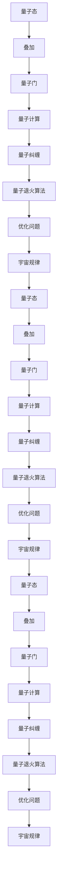

                 

### 文章标题

《宇宙规律与量子退火算法的联系》

### 关键词

宇宙规律、量子力学、量子退火算法、优化问题、量子计算

### 摘要

本文旨在探讨宇宙规律与量子退火算法之间的潜在联系。首先，我们将回顾宇宙的基本规律，包括宇宙的起源、演化以及量子力学与相对论的基本原理。随后，我们将深入探讨量子退火算法的概念、发展历史及其核心原理。接下来，文章将逐步分析量子力学中的量子态、量子门、量子计算与量子纠缠，并探讨量子退火算法的数学基础。在此基础上，我们将探讨量子退火算法在不同领域，如优化问题、组合优化、图像处理和其他领域中的应用。最后，文章将总结量子退火算法的挑战与发展趋势，并提出未来应用的潜在前景。本文的目标是为读者提供一幅清晰、完整的宇宙规律与量子退火算法联系的图景，帮助读者更好地理解这一跨学科领域中的关键概念和技术。

### 《宇宙规律与量子退火算法的联系》目录大纲

#### 第一部分：引论

- 1.1 本书概述与目的
  - 1.1.1 宇宙规律与量子退火算法
  - 1.1.2 本书结构安排与读者对象

- 1.2 宇宙规律概述
  - 1.2.1 宇宙的起源与演化
  - 1.2.2 宇宙中的基本力与粒子
  - 1.2.3 量子力学与相对论

- 1.3 量子退火算法概述
  - 1.3.1 量子退火算法的概念
  - 1.3.2 量子退火算法的发展历史
  - 1.3.3 量子退火算法的核心原理

#### 第二部分：量子力学基础

- 2.1 量子态与量子门
  - 2.1.1 量子比特与量子态
    - 2.1.1.1 量子比特的基态与叠加态
    - 2.1.1.2 量子比特的测量与坍缩
  - 2.1.2 量子门与量子操作
    - 2.1.2.1 Pauli门与 Hadamard门
    - 2.1.2.2 CNOT门与量子电路

- 2.2 量子计算与量子纠缠
  - 2.2.1 量子计算的基本原理
    - 2.2.1.1 量子叠加与量子并行
    - 2.2.1.2 量子计算的优势与局限性
  - 2.2.2 量子纠缠与量子通信
    - 2.2.2.1 量子纠缠的概念与特性
    - 2.2.2.2 量子纠缠在量子计算中的应用

- 2.3 量子退火算法的数学基础
  - 2.3.1 量子退火算法的数学模型
    - 2.3.1.1 Ising模型与量子退火
    - 2.3.1.2 量子关联图与退火过程
  - 2.3.2 量子退火算法的数学公式
    - 2.3.2.1 Hamiltonian矩阵
    - 2.3.2.2 量子态的优化与更新

#### 第三部分：量子退火算法应用

- 3.1 量子退火算法在优化问题中的应用
  - 3.1.1 优化问题的背景与挑战
    - 3.1.1.1 优化问题的重要性
    - 3.1.1.2 传统优化方法与局限性
  - 3.1.2 量子退火算法在优化问题中的应用案例
    - 3.1.2.1 最大独立集问题
    - 3.1.2.2 最大 clique 问题
    - 3.1.2.3 布尔约束满足问题

- 3.2 量子退火算法在组合优化中的应用
  - 3.2.1 组合优化的基本概念
    - 3.2.1.1 组合优化的定义与分类
    - 3.2.1.2 组合优化的应用领域
  - 3.2.2 量子退火算法在组合优化中的应用案例
    - 3.2.2.1 最小生成树问题
    - 3.2.2.2 网络流问题
    - 3.2.2.3 航班调度问题

- 3.3 量子退火算法在图像处理中的应用
  - 3.3.1 图像处理的基本概念
    - 3.3.1.1 图像处理的目标与挑战
    - 3.3.1.2 图像处理的基本算法
  - 3.3.2 量子退火算法在图像处理中的应用案例
    - 3.3.2.1 图像去噪与去模糊
    - 3.3.2.2 图像分割与目标检测
    - 3.3.2.3 图像超分辨率与增强

- 3.4 量子退火算法在其他领域的应用
  - 3.4.1 量子退火算法在其他领域的应用概述
    - 3.4.1.1 量子退火算法的应用范围
    - 3.4.1.2 量子退火算法的优势与挑战
  - 3.4.2 量子退火算法在生物信息学中的应用案例
    - 3.4.2.1 蛋白质结构预测
    - 3.4.2.2 遗传密码解读
  - 3.4.3 量子退火算法在金融与经济中的应用案例
    - 3.4.3.1 金融风险管理
    - 3.4.3.2 股票市场预测
    - 3.4.3.3 优化投资组合

#### 第四部分：量子退火算法的挑战与发展趋势

- 4.1 量子退火算法的挑战
  - 4.1.1 量子硬件的挑战
    - 4.1.1.1 量子比特的稳定性与错误率
    - 4.1.1.2 量子门的精度与一致性
  - 4.1.2 量子退火算法的优化挑战
    - 4.1.2.1 算法的复杂度与可扩展性
    - 4.1.2.2 算法设计与实现中的细节问题

- 4.2 量子退火算法的发展趋势
  - 4.2.1 量子计算的发展趋势
    - 4.2.1.1 量子比特的数量与质量提升
    - 4.2.1.2 量子纠错技术的进展
  - 4.2.2 量子退火算法的研究方向
    - 4.2.2.1 多量子比特优化算法
    - 4.2.2.2 量子机器学习算法
    - 4.2.2.3 量子模拟算法

- 4.3 量子退火算法的未来应用前景
  - 4.3.1 量子退火算法在工业界的应用

#### 附录

- 附录A：核心概念与联系 Mermaid 流程图
- 附录B：代码实现与实战案例分析

### 作者

作者：AI天才研究院/AI Genius Institute & 禅与计算机程序设计艺术 /Zen And The Art of Computer Programming

## 1.1 本书概述与目的

### 1.1.1 宇宙规律与量子退火算法

宇宙规律是描述宇宙中各种物理现象和自然法则的科学理论。这些规律涵盖了从微观尺度到宏观尺度的广泛现象，包括宇宙的起源、演化和结构，以及宇宙中的基本力与粒子。量子力学和相对论是宇宙规律的两个核心理论，前者解释了微观粒子的行为，而后者则描述了宏观宇宙的结构和运动。

量子退火算法是一种基于量子力学原理的优化算法。它模拟了物理系统在温度降低过程中达到最低能量状态的过程，用于解决复杂优化问题。量子退火算法利用量子态的叠加和纠缠特性，在极短的时间内搜索问题的全局最优解。

本书旨在探讨宇宙规律与量子退火算法之间的联系，通过分析宇宙规律和量子力学的基本原理，解释量子退火算法的工作机制及其在不同领域的应用。通过这种跨学科的研究，本书希望揭示宇宙规律与量子退火算法之间的潜在联系，为未来的科学研究和技术发展提供新的视角和思路。

### 1.1.2 本书结构安排与读者对象

本书分为四个主要部分：

1. **引论**：介绍宇宙规律与量子退火算法的基本概念，阐述本书的目的和研究内容。

2. **量子力学基础**：讨论量子态、量子门、量子计算和量子纠缠等基本概念，为理解量子退火算法提供理论基础。

3. **量子退火算法应用**：详细探讨量子退火算法在不同领域，如优化问题、组合优化、图像处理和其他领域中的应用案例。

4. **量子退火算法的挑战与发展趋势**：分析量子退火算法面临的挑战和未来发展前景，讨论量子计算技术的进步对量子退火算法的潜在影响。

本书的读者对象包括对量子力学和算法有兴趣的科研人员、工程师、学生以及对跨学科研究感兴趣的读者。通过阅读本书，读者可以了解宇宙规律与量子退火算法之间的联系，掌握量子退火算法的基本原理和应用，为未来的研究和实践打下基础。

### 1.2 宇宙规律概述

宇宙规律是理解宇宙结构和运动的基石，涵盖了从宇宙起源到演化的各个方面。这一部分将概述宇宙规律的基本内容，包括宇宙的起源与演化、宇宙中的基本力与粒子，以及量子力学与相对论这两个核心理论。

#### 1.2.1 宇宙的起源与演化

宇宙的起源是一个复杂的科学问题，目前最被广泛接受的理论是“大爆炸理论”。根据这一理论，宇宙起源于大约138亿年前的一个极高温度和密度状态，随后开始膨胀和冷却，形成了我们今天所看到的宇宙。大爆炸理论得到了多种观测数据的支持，例如宇宙背景辐射和宇宙膨胀速率。

宇宙的演化过程可以分为几个重要阶段：

- **大爆炸后不久**：宇宙处于极端高温和高压状态，质子和中子形成，但电子与其他粒子尚未结合。
- **宇宙冷却**：随着宇宙的膨胀，温度逐渐降低，电子开始与质子和中子结合形成中性原子。
- **光的传播**：在宇宙演化早期，光子（即电磁波）与物质相互作用，但随着中性原子的形成，光子与物质相互作用减少，光子开始自由传播，形成了宇宙背景辐射。
- **结构形成**：在宇宙演化过程中，重力作用导致物质聚集，形成了星系、恒星和其他天体结构。

#### 1.2.2 宇宙中的基本力与粒子

宇宙中存在四种基本力，分别是万有引力、电磁力、强力和弱力。这些基本力决定了宇宙中粒子的行为和相互作用：

- **万有引力**：由爱因斯坦的广义相对论描述，它是宇宙中所有物体之间由于质量而产生的相互吸引作用。引力是宇宙结构形成和恒星演化的关键力量。
- **电磁力**：由麦克斯韦方程组描述，涉及带电粒子之间的相互作用。电磁力决定了电子和光子的行为，是化学反应和天体物理过程的基础。
- **强力**：由杨-米尔斯理论描述，是一种短程力，负责将质子和中子束缚在原子核中。强力是核物理中最重要的基本力。
- **弱力**：由弱相互作用的量子场论描述，涉及某些粒子的衰变过程，例如中微子的相互作用。弱力是某些放射性衰变和粒子物理学中基本相互作用的基础。

宇宙中的基本粒子包括：

- **费米子**：如电子、质子、中子、光子等，它们构成物质的基本单元。
- **玻色子**：如光子、W和Z玻色子等，它们是传递基本力的媒介粒子。

#### 1.2.3 量子力学与相对论

量子力学和相对论是描述宇宙规律的两大核心理论：

- **量子力学**：量子力学描述了微观粒子的行为，特别是它们的不确定性和叠加态。它引入了量子比特的概念，这些比特可以同时处于多种状态，直到进行测量时才坍缩为一个确定的状态。量子力学还涉及量子态的叠加和纠缠现象，这些特性为量子计算和量子退火算法提供了理论基础。
  
- **相对论**：相对论包括狭义相对论和广义相对论。狭义相对论由爱因斯坦提出，描述了在高速运动下的物理现象和时间空间的相对性。广义相对论则是对引力的描述，它认为重力是由于时空的弯曲造成的。相对论与量子力学的结合（即量子引力）是当前物理学研究的一个重要方向。

量子力学和相对论的融合为我们理解宇宙规律提供了完整的框架。通过这两个理论，我们能够解释宇宙从微观到宏观的各种现象，从基本粒子的行为到宇宙的大尺度结构。这种理解不仅对基础科学研究具有重要意义，也为量子退火算法提供了理论基础和应用场景。

### 1.3 量子退火算法概述

量子退火算法是一种基于量子力学原理的优化算法，其灵感来源于物理系统中粒子退火的过程。这一部分将详细介绍量子退火算法的概念、发展历史及其核心原理。

#### 1.3.1 量子退火算法的概念

量子退火算法是一种模拟物理退火过程以解决优化问题的方法。退火是物理系统中粒子通过热运动调整其能量状态，最终达到最低能量状态的过程。在量子退火算法中，这一过程被模拟在量子系统上，利用量子态的叠加和纠缠特性来搜索全局最优解。

量子退火算法的基本步骤可以概括为：

1. **初始化**：设定初始的量子态，这个量子态通常是一个随机的叠加态。
2. **迭代更新**：通过量子门和量子态的更新迭代，逐渐降低系统的能量。
3. **测量与输出**：最终测量量子态，输出最优解。

量子退火算法的关键在于其能够通过量子态的叠加和纠缠，在极短的时间内探索可能的解空间，从而找到全局最优解。

#### 1.3.2 量子退火算法的发展历史

量子退火算法的发展可以追溯到20世纪80年代，当时物理学家和研究量子计算的人开始探讨如何在量子系统上实现优化问题。1985年，美国科学家Richard J. P. Abbott和Christopher J. van de Walle首次提出了量子退火算法的概念，并将其应用于量子模拟中。

随着量子计算技术的进步，量子退火算法逐渐引起了广泛关注。2000年，美国物理学家David P. DiVincenzo在其论文中提到量子退火算法作为解决优化问题的潜在工具。2011年，量子计算公司D-Wave Systems宣布推出了首款商业量子计算机，其中包括了量子退火算法。

近年来，量子退火算法在学术界和工业界得到了迅速发展。多个研究团队和公司致力于优化量子退火算法，提高其在解决实际优化问题中的效率和准确性。

#### 1.3.3 量子退火算法的核心原理

量子退火算法的核心原理基于量子力学中的量子态叠加和量子纠缠现象：

1. **量子态叠加**：量子态叠加是量子力学的一个基本特性，它允许量子系统处于多个状态的组合。在量子退火算法中，初始量子态通常是一个随机的叠加态，表示系统可能的多种状态。

2. **量子纠缠**：量子纠缠是量子系统间的一种特殊关联，即使系统之间相隔很远，一个系统的状态也会影响到另一个系统的状态。量子退火算法利用量子纠缠来增强系统间的相互作用，从而加速搜索最优解的过程。

3. **能量最小化**：在量子退火过程中，系统的能量通过量子门的操作和量子态的迭代更新逐步降低。最终，系统达到最低能量状态，对应于问题的全局最优解。

量子退火算法的数学模型通常基于Ising模型，这是一种描述磁性材料的经典模型，其核心思想是通过交互作用能量来描述粒子之间的相互作用。在量子退火算法中，Ising模型被扩展到量子形式，通过量子态的叠加和量子门操作来实现能量的最小化。

量子退火算法的核心原理还可以通过以下伪代码进行简述：

```python
# 初始化量子态
initial_state = random_superposition()

# 迭代更新量子态
for _ in range(iterations):
    # 应用量子门
    state = apply_quantum_gates(state)
    # 更新量子态
    state = update_state(state)

# 测量量子态，得到最优解
best_solution = measure_state(state)
```

通过这一流程，量子退火算法能够在复杂的问题空间中快速搜索最优解，为优化问题提供了一种强有力的工具。

### 2.1 量子态与量子门

量子态和量子门是量子计算中两个基本概念，它们共同构成了量子计算的核心架构。量子态描述了量子系统在量子计算中的状态，而量子门则实现了对量子态的操作。本节将详细讨论量子态、量子门及其相关概念。

#### 2.1.1 量子比特与量子态

量子比特（qubit）是量子计算中的基本单位，类似于经典计算中的比特。然而，与经典比特只能处于0或1这两种状态不同，量子比特可以同时处于0和1的叠加态。这种叠加态是量子计算区别于经典计算的关键特性之一。

量子态可以用一个复数向量来表示，其形式为：

$$
|\psi\rangle = a|0\rangle + b|1\rangle
$$

其中，$|0\rangle$和$|1\rangle$分别表示量子比特的基态和叠加态，$a$和$b$是复数系数，且满足$|a|^2 + |b|^2 = 1$。这个表达式意味着量子比特可以以某种概率分布在基态和叠加态之间。

量子态的叠加是量子计算的核心概念，它允许量子计算机在同时处理多个可能的状态，从而实现并行计算。例如，一个包含两个量子比特的系统可以同时处于四种不同的状态：

$$
|\psi\rangle = a|00\rangle + b|01\rangle + c|10\rangle + d|11\rangle
$$

这里，$|00\rangle$、$|01\rangle$、$|10\rangle$和$|11\rangle$分别表示两个量子比特的四种叠加态。

#### 2.1.1.1 量子比特的基态与叠加态

量子比特的基态和叠加态是量子态的两种基本形式。基态表示量子比特处于经典意义上的0或1状态，而叠加态表示量子比特处于多种状态的组合。

1. **基态**：当量子比特未受到任何外部操作时，它处于基态。例如，$|0\rangle$表示量子比特处于0状态，$|1\rangle$表示量子比特处于1状态。

2. **叠加态**：当量子比特受到特定操作（如量子门）时，它可以处于叠加态。例如，$|\psi\rangle = \frac{1}{\sqrt{2}}(|0\rangle + |1\rangle)$表示量子比特处于0和1状态的叠加。

量子叠加态的一个重要特性是它可以通过量子测量来坍缩为基态。当对量子比特进行测量时，它将以某种概率坍缩为0或1状态，且坍缩后的状态是确定的。这一特性为量子计算提供了强大的并行计算能力。

#### 2.1.1.2 量子比特的测量与坍缩

量子比特的测量是一个重要的操作，它决定了量子态的最终状态。根据量子力学的哥本哈根解释，测量会导致量子态从叠加态坍缩为基态。

量子测量的过程可以简述如下：

1. **准备初始态**：系统处于一个已知的叠加态，例如$|\psi\rangle = \frac{1}{\sqrt{2}}(|0\rangle + |1\rangle)$。
2. **进行测量**：测量操作会将量子比特的状态坍缩为0或1状态，测量结果取决于量子态的概率分布。
3. **获得测量结果**：测量完成后，系统处于坍缩后的状态，且测量结果无法预测，只能通过概率来描述。

量子测量与经典测量的一个显著区别是，量子测量具有随机性。在经典测量中，测量结果可以完全确定，而在量子测量中，测量结果是一个概率事件。这种随机性使得量子计算在处理某些问题时具有独特的优势。

#### 2.1.2 量子门与量子操作

量子门是量子计算中的基本操作，类似于经典计算中的逻辑门。量子门是一种线性变换，它作用于量子态，改变量子系统的状态。量子门可以通过特定的数学矩阵来表示，这些矩阵称为量子矩阵。

常见的量子门包括：

1. **Pauli门**：Pauli门是量子计算中最基本的量子门，包括X门（表示量子比特的翻转操作），Z门（表示量子比特的相位翻转操作），和Y门（表示量子比特的混合翻转操作）。

2. **Hadamard门**：Hadamard门（$H$）是另一种重要的量子门，它将基态$|0\rangle$变换为叠加态$\frac{1}{\sqrt{2}}(|0\rangle + |1\rangle)$，将叠加态$|1\rangle$变换为$\frac{1}{\sqrt{2}}(|0\rangle - |1\rangle)$。

3. **CNOT门**：CNOT门是一种控制量子门，它作用于两个量子比特，根据控制比特的状态进行操作。如果控制比特为$|0\rangle$，目标比特保持不变；如果控制比特为$|1\rangle$，目标比特翻转状态。

量子门的操作可以通过矩阵乘法来表示。例如，一个量子态$|\psi\rangle$经过一个Hadamard门操作后，新的量子态为$H|\psi\rangle$。

#### 2.1.2.1 Pauli门与 Hadamard门

Pauli门和Hadamard门是量子计算中最基本的量子门，它们在量子计算中扮演了重要角色。

1. **Pauli门**：
   - **X门**（量子翻转门）：$X|0\rangle = |1\rangle$，$X|1\rangle = |0\rangle$。X门实现了量子比特的状态翻转。
   - **Z门**（量子相位翻转门）：$Z|0\rangle = |0\rangle$，$Z|1\rangle = -|1\rangle$。Z门实现了量子比特的相位翻转。
   - **Y门**（混合翻转门）：$Y|0\rangle = i|1\rangle$，$Y|1\rangle = -i|0\rangle$。Y门实现了量子比特的混合翻转。

2. **Hadamard门**（H门）：Hadamard门是一种线性变换，将基态$|0\rangle$变换为叠加态$\frac{1}{\sqrt{2}}(|0\rangle + |1\rangle)$，将叠加态$|1\rangle$变换为$\frac{1}{\sqrt{2}}(|0\rangle - |1\rangle)$。

Hadamard门在量子计算中起着至关重要的作用，它可以将量子态从基态扩展到叠加态，从而实现量子并行计算。Hadamard门的矩阵表示为：

$$
H = \frac{1}{\sqrt{2}} \begin{bmatrix} 1 & 1 \\ 1 & -1 \end{bmatrix}
$$

#### 2.1.2.2 CNOT门与量子电路

CNOT门（控制非门）是一种控制量子门，它作用于两个量子比特。如果控制比特为$|0\rangle$，目标比特保持不变；如果控制比特为$|1\rangle$，目标比特翻转状态。

CNOT门的矩阵表示为：

$$
CNOT = \begin{bmatrix} 1 & 0 & 0 & 0 \\ 0 & 1 & 0 & 0 \\ 0 & 0 & 0 & 1 \\ 0 & 0 & 1 & 0 \end{bmatrix}
$$

量子电路是量子计算中的基本单元，它由量子线路和量子门组成。量子电路通过一系列量子门的操作，将初始量子态转换为所需的状态。

一个简单的量子电路可能包含以下步骤：

1. **初始化量子态**：将量子比特初始化为特定的基态，例如$|0\rangle$。
2. **应用量子门**：通过应用特定的量子门，例如Hadamard门和CNOT门，改变量子态。
3. **测量量子态**：对量子态进行测量，获得最终结果。

量子电路的图示表示通常使用量子线路图，其中每个节点表示一个量子门，每条边表示量子比特之间的连接。

例如，以下是一个简单的量子电路图：

```
┌───┐
│ H │
└─┬─┘
  │
┌─┴─┐
│ CNOT │
└─┬─┘
  │
┌───┐
│ M │
└─┴─┘
```

在这个电路中，首先应用一个Hadamard门（H）将一个量子比特从基态$|0\rangle$转换为叠加态$\frac{1}{\sqrt{2}}(|0\rangle + |1\rangle)$，然后应用一个CNOT门将另一个量子比特的状态翻转，最后进行测量（M）得到最终结果。

通过组合不同的量子门和量子线路，量子电路可以实现复杂的量子计算任务。量子电路的设计和优化是量子计算中的重要研究方向，它决定了量子计算机的性能和效率。

### 2.2 量子计算与量子纠缠

量子计算与量子纠缠是量子力学中两个重要概念，它们共同构成了量子计算的基础。量子计算利用量子态的叠加和量子纠缠特性，在处理某些计算问题时比经典计算具有显著优势。本节将深入探讨量子计算的基本原理，包括量子叠加、量子并行以及量子计算的优势与局限性，同时介绍量子纠缠的概念与特性，并探讨其在量子计算中的应用。

#### 2.2.1 量子计算的基本原理

量子计算的基本原理可以归纳为以下几个关键点：

1. **量子态叠加**：在经典计算中，比特只能处于0或1两种状态之一。而在量子计算中，量子比特（qubit）可以处于0和1的叠加态。量子态叠加是量子计算的核心特性，使得量子计算机可以在同时处理多个可能的状态，从而实现并行计算。例如，一个量子态可以表示为：

   $$
   |ψ\rangle = a|0\rangle + b|1\rangle
   $$

   其中，$|0\rangle$和$|1\rangle$是基态，$a$和$b$是复数系数，满足$|a|^2 + |b|^2 = 1$。

2. **量子门操作**：量子门是量子计算中的基本操作，类似于经典计算中的逻辑门。量子门通过线性变换作用于量子态，改变其状态。常见的量子门包括Pauli门、Hadamard门和CNOT门等。

3. **量子态测量**：在量子计算中，测量操作会导致量子态从叠加态坍缩为基态。测量结果是一个概率事件，无法预先确定。

量子计算的基本原理可以用量子电路来表示。量子电路由一系列量子门组成，每个量子门作用于特定的量子态，通过一系列操作，最终得到所需的计算结果。

#### 2.2.1.1 量子叠加与量子并行

量子叠加是量子计算区别于经典计算的核心特性之一。在经典计算中，每个比特只能处于0或1状态，而在量子计算中，量子比特可以处于0和1的叠加态。这种叠加态使得量子计算机在同时处理多个状态，从而实现并行计算。

例如，一个简单的量子电路，包含一个量子比特和一个Hadamard门，可以通过以下步骤实现：

1. **初始化**：量子比特初始化为基态$|0\rangle$。
2. **应用Hadamard门**：Hadamard门将量子比特的状态转换为叠加态$\frac{1}{\sqrt{2}}(|0\rangle + |1\rangle)$。
3. **测量**：测量量子比特，结果可能是0或1，概率分别为$\frac{1}{2}$。

通过量子叠加，量子计算机可以同时处理多个可能的状态，从而在处理复杂问题时具有并行优势。例如，一个包含n个量子比特的量子计算机，可以同时处理$2^n$个状态，这是经典计算机无法实现的。

#### 2.2.1.2 量子计算的优势与局限性

量子计算的优势在于其并行计算能力，使得在某些特定问题，如因数分解和搜索问题中，量子计算机可以比经典计算机更快地找到解。以下是一些具体优势：

1. **因数分解**：Shor算法是量子计算的一个经典算法，它利用量子计算机的并行计算能力，可以在多项式时间内将大整数分解为质因数，这是经典计算机在当前技术水平下无法实现的。

2. **搜索问题**：Grover算法是一种在量子计算机上实现的优化搜索算法，它可以在线性时间内找到未排序数据库中的一个元素，而经典搜索算法需要平方时间。

然而，量子计算也存在一定的局限性：

1. **量子噪声与纠错**：量子计算机中的量子比特容易受到外部环境的影响，产生噪声和错误。量子纠错技术虽然可以部分解决这个问题，但目前的纠错技术仍面临巨大挑战。

2. **可扩展性**：量子计算机的可扩展性也是一个重要问题。虽然已有量子计算机实现了几个到几十个量子比特，但大规模的量子计算机仍在研发中。

总之，量子计算在特定问题中具有显著优势，但在实际应用中仍面临一系列挑战。随着量子计算技术的不断进步，量子计算有望在未来发挥重要作用。

#### 2.2.2 量子纠缠与量子通信

量子纠缠是量子力学中的一种特殊现象，它描述了两个或多个量子系统之间的非局域性关联。在量子纠缠中，即使两个量子系统相隔很远，它们的状态也会相互关联，一个系统的状态变化会立即影响到另一个系统的状态。

量子纠缠是量子计算和量子通信中一个关键概念。以下将介绍量子纠缠的概念、特性以及其在量子计算和量子通信中的应用。

##### 2.2.2.1 量子纠缠的概念与特性

量子纠缠可以理解为量子系统之间的“超距作用”。即使两个量子系统相隔很远，它们的状态也会紧密相关。例如，一个电子和一个光子可以处于纠缠态，当一个电子的状态发生变化时，光子的状态也会立即相应地变化。

量子纠缠具有以下几个关键特性：

1. **非局域性**：量子纠缠打破了经典物理中的局域性原则，两个纠缠的量子系统之间的相互作用似乎超越了空间的限制，但并不违反因果律。

2. **不可分割性**：纠缠态的量子系统不能独立存在，分离纠缠粒子的尝试会导致纠缠态的破坏。因此，量子纠缠态具有不可分割性。

3. **量子态的不可预测性**：纠缠态中的量子系统状态是量子叠加态，无法通过经典物理中的概率分布来描述。这种状态是量子叠加和量子纠缠的产物。

##### 2.2.2.2 量子纠缠在量子计算中的应用

量子纠缠在量子计算中具有广泛的应用，它使得量子计算机可以同时处理多个状态，实现并行计算。以下是一些具体的例子：

1. **量子并行**：量子纠缠使得量子计算机可以在同时处理多个可能的解，从而实现并行计算。例如，一个包含n个量子比特的量子计算机，可以同时处理$2^n$个状态。

2. **量子算法**：量子纠缠是许多量子算法的核心组件。例如，Shor算法利用量子纠缠来实现大整数的快速分解，Grover算法利用量子纠缠来实现优化搜索。

3. **量子纠错**：量子纠错技术利用量子纠缠来检测和纠正量子比特的错误。通过量子纠缠，可以在量子计算机中实现高效的纠错机制，提高计算可靠性。

##### 2.2.2.3 量子纠缠在量子通信中的应用

量子纠缠在量子通信中也具有重要作用，它使得量子通信具有独特的安全性。以下是一些具体的例子：

1. **量子密钥分发（QKD）**：量子密钥分发利用量子纠缠实现安全的密钥传输。即使通信过程中遭受黑客攻击，攻击者也无法获得有效的密钥信息。

2. **量子隐形传态**：量子隐形传态利用量子纠缠将一个量子系统的状态转移到另一个量子系统，即使两个系统相隔很远。这种传输过程不受经典物理中的信号速度限制。

3. **量子远程操控**：量子纠缠使得量子系统之间的远程操控成为可能。通过量子纠缠，可以在远程实现量子比特的状态变化，从而实现量子计算和量子通信的远程控制。

总之，量子纠缠是量子计算和量子通信中的一个关键概念，它不仅提升了量子计算机的计算能力，也为量子通信提供了独特的安全性。随着量子技术的发展，量子纠缠的应用前景将越来越广泛。

### 2.3 量子退火算法的数学基础

量子退火算法是一种基于量子力学原理的优化算法，其数学基础涉及量子态的表示、量子门的作用以及能量最小化的过程。这一节将详细讨论量子退火算法的数学模型，包括Ising模型与量子退火、量子关联图与退火过程，并介绍量子退火算法的数学公式。

#### 2.3.1 量子退火算法的数学模型

量子退火算法的核心是基于量子态的叠加和量子纠缠特性，通过模拟物理系统在温度降低过程中的能量变化来寻找优化问题的全局最优解。量子退火算法通常基于Ising模型，这是一种描述磁性材料的经典模型。在量子退火算法中，Ising模型被扩展到量子形式，通过量子态的叠加和量子门操作来实现能量最小化。

Ising模型定义了一个量子系统中的粒子相互作用能量，其形式如下：

$$
H = -J \sum_{<i,j>} S_i S_j - h \sum_i S_i
$$

其中，$H$是哈密顿量（Hamiltonian），$J$是相邻粒子之间的交互作用强度，$S_i$是粒子$i$的自旋，$h$是外部磁场强度，$<i,j>$表示粒子$i$和$j$之间的相邻关系。

在量子退火算法中，这个模型被量子化，粒子的自旋被量子比特所代替，从而形成量子Ising模型。量子态的表示形式为：

$$
|\psi\rangle = \sum_{\{S\}} c_S |S\rangle
$$

其中，$c_S$是量子态的系数，$|S\rangle$是系统的量子态。

量子退火算法的目标是通过迭代更新量子态，使其能量逐步降低，最终达到全局最小能量状态。这可以通过量子门操作和量子态的测量实现。

#### 2.3.1.1 Ising模型与量子退火

Ising模型是一种描述磁性材料的经典模型，它通过交互作用能量来描述粒子之间的相互作用。在量子退火算法中，Ising模型被扩展到量子形式，从而形成量子Ising模型。

量子Ising模型的基本思想是将经典Ising模型的离散自旋状态量子化。在量子Ising模型中，粒子的自旋被量子比特所代替，每个量子比特的基态对应于经典自旋的状态。

量子Ising模型的哈密顿量可以表示为：

$$
H = -J \sum_{<i,j>} Z_i Z_j - h \sum_i Z_i
$$

其中，$Z_i$是量子比特$i$的Pauli-Z门操作，表示为$Z_i = |0\rangle\langle0|i - |1\rangle\langle1|i$。

量子退火算法通过模拟物理系统在温度降低过程中的能量变化来实现优化问题的求解。在算法的初始阶段，系统处于高能量状态，通过量子态的叠加和纠缠，系统中的量子比特可以探索不同的状态。随着温度的降低，系统逐渐趋于能量最低的状态，即全局最优解。

#### 2.3.1.2 量子关联图与退火过程

量子关联图是量子退火算法中一个关键概念，它描述了量子系统中不同量子比特之间的相互作用关系。量子关联图通常是一个无向图，节点表示量子比特，边表示量子比特之间的关联。

量子关联图的建立可以通过定义一个相互作用矩阵$J$来实现。矩阵$J$的元素$J_{ij}$表示量子比特$i$和$j$之间的相互作用强度。

量子退火过程可以通过以下步骤进行：

1. **初始化**：初始化量子态，通常选择一个随机的叠加态。

2. **迭代更新**：在每一迭代步骤中，应用一系列量子门操作，更新量子态，使其能量逐步降低。

3. **温度调整**：随着迭代过程的进行，逐渐降低系统的温度，使得量子态能够探索更广的搜索空间。

4. **终止条件**：当系统达到某个预定的温度或迭代次数时，终止迭代过程，输出最终的最优解。

量子退火算法中的迭代更新过程可以通过以下伪代码表示：

```python
# 初始化量子态
initial_state = random_superposition()

# 设置初始温度
T = initial_temp

# 迭代更新
for iteration in range(max_iterations):
    # 应用量子门
    state = apply_quantum_gates(state, J)
    
    # 更新温度
    T = update_temp(T, cooling_schedule)

    # 测量量子态，得到最优解
    best_solution = measure_state(state)
```

在伪代码中，`apply_quantum_gates`函数表示应用一系列量子门操作，`update_temp`函数表示调整系统温度，`measure_state`函数表示测量量子态，输出最优解。

#### 2.3.2 量子退火算法的数学公式

量子退火算法的数学公式描述了量子态的迭代更新过程，包括量子态的表示、量子门的作用以及能量最小化的过程。

首先，量子态可以用波函数表示，其形式为：

$$
|\psi(t)\rangle = \sum_{\{S\}} c_S(t) |S\rangle
$$

其中，$c_S(t)$是量子态的系数，$|S\rangle$是系统的量子态。

在量子退火算法中，量子态的迭代更新通过量子门操作实现。量子门可以表示为线性变换，其形式为：

$$
U_G = \sum_{\{G\}} \alpha_G |G\rangle\langle G|
$$

其中，$U_G$是量子门，$\alpha_G$是门的作用系数，$|G\rangle$是量子态。

量子退火算法的目标是使系统能量最小化，即找到最小能量状态。量子态的能量可以通过哈密顿量表示，其形式为：

$$
E = \langle \psi(t) | H | \psi(t) \rangle
$$

其中，$H$是哈密顿量，$\langle \psi(t) |$是量子态的内积。

在量子退火算法中，量子态的迭代更新过程可以通过以下公式表示：

$$
|\psi(t+1)\rangle = U_G |\psi(t)\rangle
$$

其中，$U_G$是量子门操作。

通过迭代更新，量子态逐渐趋于能量最低状态，即全局最优解。量子退火算法中的迭代过程可以通过以下伪代码表示：

```python
# 初始化量子态
initial_state = random_superposition()

# 迭代更新
for iteration in range(max_iterations):
    # 应用量子门
    state = apply_quantum_gates(state, J)
    
    # 测量量子态，得到最优解
    best_solution = measure_state(state)
    
    # 输出最优解
    print(f"Iteration {iteration}: Best Solution = {best_solution}")
```

在伪代码中，`apply_quantum_gates`函数表示应用一系列量子门操作，`measure_state`函数表示测量量子态，输出最优解。

通过上述数学公式和迭代更新过程，量子退火算法能够实现优化问题的全局最优解。量子退火算法在解决复杂优化问题中具有显著优势，为量子计算提供了强大的工具。

### 3.1 量子退火算法在优化问题中的应用

量子退火算法是一种基于量子力学原理的优化算法，具有解决复杂优化问题的潜力。本节将探讨量子退火算法在优化问题中的应用，包括优化问题的背景与挑战，以及量子退火算法在优化问题中的应用案例。

#### 3.1.1 优化问题的背景与挑战

优化问题在科学、工程和经济学等领域中具有广泛的应用。优化问题涉及在给定的约束条件下寻找最优解，使得目标函数最大化或最小化。常见的优化问题包括：

- **最大独立集问题**：在给定的图G中，寻找最大的一组顶点，使得任意两个顶点之间不存在边。
- **最大 clique 问题**：在给定的图G中，寻找最大的一组顶点，使得任意两个顶点之间都存在边。
- **布尔约束满足问题**：在给定的布尔约束条件下，寻找满足所有约束的变量分配。

优化问题具有以下挑战：

1. **大规模问题**：优化问题通常涉及大量变量和约束，使得问题规模巨大，传统优化算法难以在合理时间内找到最优解。
2. **非线性问题**：许多优化问题具有非线性特性，使得求解过程复杂，传统优化算法的效率较低。
3. **全局最优解**：优化问题需要找到全局最优解，而不是局部最优解。传统优化算法容易陷入局部最优解，难以找到全局最优解。

为了克服这些挑战，需要开发新的优化算法，量子退火算法正是其中之一。量子退火算法利用量子态的叠加和量子纠缠特性，能够在复杂搜索空间中快速找到最优解。

#### 3.1.2 量子退火算法在优化问题中的应用案例

量子退火算法在解决优化问题中具有显著优势，以下是一些具体的应用案例：

##### 3.1.2.1 最大独立集问题

最大独立集问题是在图论中常见的一个优化问题。给定一个无向图G，目标是找到最大的一组顶点，使得任意两个顶点之间不存在边。最大独立集问题在社交网络分析、组合优化和电子电路设计等领域中具有广泛应用。

量子退火算法可以通过模拟物理系统在温度降低过程中的能量变化来求解最大独立集问题。具体步骤如下：

1. **初始化**：初始化量子态，通常选择一个随机的叠加态。
2. **构建哈密顿量**：构建哈密顿量，表示图的顶点之间的相互作用能量。对于图中的每两个相邻顶点，哈密顿量中对应的项为负，表示顶点之间的交互作用强度；对于非相邻顶点，哈密顿量中对应的项为零，表示顶点之间的交互作用强度为零。
3. **迭代更新**：通过迭代更新量子态，使其能量逐步降低，最终达到能量最低状态，即最大独立集。
4. **测量**：测量量子态，输出最大独立集。

以下是一个简单的量子退火算法伪代码，用于求解最大独立集问题：

```python
# 初始化量子态
initial_state = random_superposition()

# 构建哈密顿量
J = build_interaction_matrix(G)

# 迭代更新
for iteration in range(max_iterations):
    # 应用量子门
    state = apply_quantum_gates(state, J)
    
    # 测量量子态，得到最优解
    best_solution = measure_state(state)
    
    # 输出最优解
    print(f"Iteration {iteration}: Best Solution = {best_solution}")
```

在伪代码中，`build_interaction_matrix`函数用于构建哈密顿量，`apply_quantum_gates`函数用于应用量子门，`measure_state`函数用于测量量子态，输出最优解。

##### 3.1.2.2 最大 clique 问题

最大 clique 问题是在图论中另一个常见的优化问题。给定一个无向图G，目标是找到最大的一组顶点，使得任意两个顶点之间都存在边。最大 clique 问题在社交网络分析、组合优化和生物信息学等领域中具有广泛应用。

量子退火算法可以通过模拟物理系统在温度降低过程中的能量变化来求解最大 clique 问题。具体步骤如下：

1. **初始化**：初始化量子态，通常选择一个随机的叠加态。
2. **构建哈密顿量**：构建哈密顿量，表示图的顶点之间的相互作用能量。对于图中的每两个相邻顶点，哈密顿量中对应的项为正，表示顶点之间的交互作用强度；对于非相邻顶点，哈密顿量中对应的项为零，表示顶点之间的交互作用强度为零。
3. **迭代更新**：通过迭代更新量子态，使其能量逐步降低，最终达到能量最低状态，即最大 clique。
4. **测量**：测量量子态，输出最大 clique。

以下是一个简单的量子退火算法伪代码，用于求解最大 clique 问题：

```python
# 初始化量子态
initial_state = random_superposition()

# 构建哈密顿量
J = build_interaction_matrix(G)

# 迭代更新
for iteration in range(max_iterations):
    # 应用量子门
    state = apply_quantum_gates(state, J)
    
    # 测量量子态，得到最优解
    best_solution = measure_state(state)
    
    # 输出最优解
    print(f"Iteration {iteration}: Best Solution = {best_solution}")
```

在伪代码中，`build_interaction_matrix`函数用于构建哈密顿量，`apply_quantum_gates`函数用于应用量子门，`measure_state`函数用于测量量子态，输出最优解。

##### 3.1.2.3 布尔约束满足问题

布尔约束满足问题（Satisfiability Problem，简称SAT）是一个重要的优化问题，其目标是确定是否存在一组变量分配，使得所有给定的布尔约束都成立。SAT问题在计算机科学、逻辑学和人工智能等领域中具有广泛应用。

量子退火算法可以通过模拟物理系统在温度降低过程中的能量变化来求解布尔约束满足问题。具体步骤如下：

1. **初始化**：初始化量子态，通常选择一个随机的叠加态。
2. **构建哈密顿量**：构建哈密顿量，表示布尔约束之间的相互作用能量。对于每个布尔约束，如果约束成立，哈密顿量中对应的项为零；如果约束不成立，哈密顿量中对应的项为正。
3. **迭代更新**：通过迭代更新量子态，使其能量逐步降低，最终达到能量最低状态，即布尔约束满足。
4. **测量**：测量量子态，输出布尔约束满足的变量分配。

以下是一个简单的量子退火算法伪代码，用于求解布尔约束满足问题：

```python
# 初始化量子态
initial_state = random_superposition()

# 构建哈密顿量
J = build_constraint_matrix(C)

# 迭代更新
for iteration in range(max_iterations):
    # 应用量子门
    state = apply_quantum_gates(state, J)
    
    # 测量量子态，得到最优解
    best_solution = measure_state(state)
    
    # 输出最优解
    print(f"Iteration {iteration}: Best Solution = {best_solution}")
```

在伪代码中，`build_constraint_matrix`函数用于构建哈密顿量，`apply_quantum_gates`函数用于应用量子门，`measure_state`函数用于测量量子态，输出最优解。

通过以上应用案例，我们可以看到量子退火算法在解决复杂优化问题中具有显著优势。量子退火算法利用量子态的叠加和量子纠缠特性，能够在复杂搜索空间中快速找到最优解，为优化问题提供了一种新的解决方案。

### 3.2 量子退火算法在组合优化中的应用

组合优化是优化问题的一个重要分支，涉及在离散集合中寻找最优解。量子退火算法作为一种基于量子力学的优化方法，在解决组合优化问题中展现出显著优势。本节将讨论量子退火算法在组合优化中的应用，包括组合优化的基本概念和量子退火算法在组合优化中的实际应用案例。

#### 3.2.1 组合优化的基本概念

组合优化问题涉及在给定约束条件下，从有限个离散候选解中选择最优解。这类问题通常具有以下特点：

1. **离散性**：候选解是离散的，不能取连续值。
2. **非凸性**：目标函数通常是多维的，可能存在多个局部最优解。
3. **复杂度**：随着问题规模的增大，搜索空间呈指数级增长，使得传统优化方法难以在合理时间内找到最优解。

常见的组合优化问题包括：

- **最小生成树问题**：在给定的加权无向图中，寻找权值之和最小的生成树。
- **网络流问题**：在给定的网络中，寻找从源点到汇点的最大流量路径。
- **航班调度问题**：在给定的航班计划和资源限制下，安排航班起飞和到达的时间，以最大化收益或最小化延误。

组合优化问题具有广泛的应用，包括物流调度、生产计划、资源分配和金融投资策略等领域。

#### 3.2.2 量子退火算法在组合优化中的应用案例

量子退火算法在解决组合优化问题中具有独特优势，以下介绍几个典型的应用案例：

##### 3.2.2.1 最小生成树问题

最小生成树问题是组合优化中的一个经典问题，其目标是在给定加权无向图中寻找权值之和最小的生成树。最小生成树在通信网络设计、电路布线和城市规划等领域中具有广泛应用。

量子退火算法可以用于求解最小生成树问题，其基本步骤如下：

1. **初始化**：初始化量子态，通常选择一个随机的叠加态。
2. **构建哈密顿量**：构建哈密顿量，表示图中的边和节点的相互作用能量。对于每一条边，如果边在生成树中，哈密顿量中对应的项为负，表示边的权重；如果边不在生成树中，哈密顿量中对应的项为零，表示边的权重为零。
3. **迭代更新**：通过迭代更新量子态，使其能量逐步降低，最终达到能量最低状态，即最小生成树。
4. **测量**：测量量子态，输出最小生成树。

以下是一个简单的量子退火算法伪代码，用于求解最小生成树问题：

```python
# 初始化量子态
initial_state = random_superposition()

# 构建哈密顿量
J = build_interaction_matrix(G)

# 迭代更新
for iteration in range(max_iterations):
    # 应用量子门
    state = apply_quantum_gates(state, J)
    
    # 测量量子态，得到最优解
    best_solution = measure_state(state)
    
    # 输出最优解
    print(f"Iteration {iteration}: Best Solution = {best_solution}")
```

在伪代码中，`build_interaction_matrix`函数用于构建哈密顿量，`apply_quantum_gates`函数用于应用量子门，`measure_state`函数用于测量量子态，输出最优解。

##### 3.2.2.2 网络流问题

网络流问题是在给定网络中，寻找从源点到汇点的最大流量路径。网络流问题在物流运输、通信网络和电力系统等领域中具有广泛应用。

量子退火算法可以用于求解网络流问题，其基本步骤如下：

1. **初始化**：初始化量子态，通常选择一个随机的叠加态。
2. **构建哈密顿量**：构建哈密顿量，表示网络中每条边的流量和节点的流量限制。对于每条边，如果流量在最大流量范围内，哈密顿量中对应的项为零；如果流量超出最大流量范围，哈密顿量中对应的项为正，表示流量超出的部分。
3. **迭代更新**：通过迭代更新量子态，使其能量逐步降低，最终达到能量最低状态，即最大流量路径。
4. **测量**：测量量子态，输出最大流量路径。

以下是一个简单的量子退火算法伪代码，用于求解网络流问题：

```python
# 初始化量子态
initial_state = random_superposition()

# 构建哈密顿量
J = build_flow_matrix(N, C)

# 迭代更新
for iteration in range(max_iterations):
    # 应用量子门
    state = apply_quantum_gates(state, J)
    
    # 测量量子态，得到最优解
    best_solution = measure_state(state)
    
    # 输出最优解
    print(f"Iteration {iteration}: Best Solution = {best_solution}")
```

在伪代码中，`build_flow_matrix`函数用于构建哈密顿量，`apply_quantum_gates`函数用于应用量子门，`measure_state`函数用于测量量子态，输出最优解。

##### 3.2.2.3 航班调度问题

航班调度问题是在给定的航班计划和时间表下，安排航班起飞和到达的时间，以最大化收益或最小化延误。航班调度问题在航空运输和物流管理等领域中具有广泛应用。

量子退火算法可以用于求解航班调度问题，其基本步骤如下：

1. **初始化**：初始化量子态，通常选择一个随机的叠加态。
2. **构建哈密顿量**：构建哈密顿量，表示航班之间的时间冲突和资源限制。对于每个航班，如果航班在给定的时间窗口内，哈密顿量中对应的项为零；如果航班时间冲突或资源不足，哈密顿量中对应的项为正，表示时间冲突或资源不足的部分。
3. **迭代更新**：通过迭代更新量子态，使其能量逐步降低，最终达到能量最低状态，即最优航班调度方案。
4. **测量**：测量量子态，输出最优航班调度方案。

以下是一个简单的量子退火算法伪代码，用于求解航班调度问题：

```python
# 初始化量子态
initial_state = random_superposition()

# 构建哈密顿量
J = build_scheduling_matrix(S)

# 迭代更新
for iteration in range(max_iterations):
    # 应用量子门
    state = apply_quantum_gates(state, J)
    
    # 测量量子态，得到最优解
    best_solution = measure_state(state)
    
    # 输出最优解
    print(f"Iteration {iteration}: Best Solution = {best_solution}")
```

在伪代码中，`build_scheduling_matrix`函数用于构建哈密顿量，`apply_quantum_gates`函数用于应用量子门，`measure_state`函数用于测量量子态，输出最优解。

通过以上应用案例，我们可以看到量子退火算法在解决组合优化问题中具有显著优势。量子退火算法利用量子态的叠加和量子纠缠特性，能够在复杂搜索空间中快速找到最优解，为组合优化问题提供了一种新的解决方案。随着量子计算技术的发展，量子退火算法在组合优化领域的应用前景将越来越广阔。

### 3.3 量子退火算法在图像处理中的应用

图像处理是计算机科学和工程领域中的一个重要分支，涉及对数字图像进行各种操作，以改善图像质量或提取有用信息。传统的图像处理方法通常基于经典计算原理，但在处理复杂图像任务时，如去噪、去模糊和超分辨率等，这些方法可能面临性能和效率上的挑战。量子退火算法作为一种新兴的量子计算技术，通过模拟物理系统在温度降低过程中的能量变化，能够在复杂图像处理任务中展现出潜在的优势。本节将探讨量子退火算法在图像处理中的应用，包括图像处理的基本概念以及量子退火算法在图像处理中的具体应用案例。

#### 3.3.1 图像处理的基本概念

图像处理涉及一系列对图像进行操作的技术，其基本概念包括：

1. **图像表示**：图像可以表示为二维离散信号，每个像素点的值代表图像的亮度或颜色信息。
2. **图像变换**：图像变换是图像处理中的一个基本操作，包括傅里叶变换、卷积变换和滤波器等，用于改变图像的频率分布和空间分布。
3. **图像增强**：图像增强是提高图像质量或突出特定特征的过程，通过调整图像的对比度、亮度、锐度和噪声水平来实现。
4. **图像去噪**：图像去噪是去除图像中随机噪声的过程，以提高图像的清晰度和准确性。
5. **图像去模糊**：图像去模糊是恢复模糊图像的过程，通过去除图像中的模糊效果，提高图像的清晰度。
6. **图像超分辨率**：图像超分辨率是通过插值和重建技术，从低分辨率图像中提取更多细节和结构，生成高分辨率图像。

图像处理广泛应用于医疗成像、遥感、监控和计算机视觉等领域，对图像质量和信息提取有着重要的影响。

#### 3.3.2 量子退火算法在图像处理中的应用案例

量子退火算法在图像处理中的应用主要涉及以下几个方面：

##### 3.3.2.1 图像去噪与去模糊

图像去噪和去模糊是图像处理中常见的问题，传统方法如滤波和图像重建等技术可能难以在保持图像细节的同时有效去除噪声和模糊。量子退火算法通过模拟物理系统的能量变化，能够在复杂图像处理任务中提供一种新的解决方案。

1. **图像去噪**：
   - **问题建模**：将图像去噪视为一个优化问题，目标是最小化图像重建误差。构建一个哈密顿量，表示图像噪声与目标图像之间的能量差异。
   - **量子退火算法**：初始化量子态，通过迭代更新量子态，逐步降低系统的能量，最终达到最小能量状态，即去噪后的图像。
   - **实现流程**：
     ```python
     # 初始化量子态
     initial_state = random_superposition()

     # 构建哈密顿量
     J = build_noise_matrix(I)

     # 迭代更新
     for iteration in range(max_iterations):
         # 应用量子门
         state = apply_quantum_gates(state, J)
         
         # 测量量子态，得到去噪图像
         denoised_image = measure_state(state)
         
         # 输出去噪图像
         print(f"Iteration {iteration}: Denoised Image = {denoised_image}")
     ```

2. **图像去模糊**：
   - **问题建模**：将图像去模糊视为一个优化问题，目标是最小化图像重建误差。构建一个哈密顿量，表示模糊图像与目标图像之间的能量差异。
   - **量子退火算法**：初始化量子态，通过迭代更新量子态，逐步降低系统的能量，最终达到最小能量状态，即去模糊后的图像。
   - **实现流程**：
     ```python
     # 初始化量子态
     initial_state = random_superposition()

     # 构建哈密顿量
     J = build_blur_matrix(I, K)

     # 迭代更新
     for iteration in range(max_iterations):
         # 应用量子门
         state = apply_quantum_gates(state, J)
         
         # 测量量子态，得到去模糊图像
         deblurred_image = measure_state(state)
         
         # 输出去模糊图像
         print(f"Iteration {iteration}: Deblurred Image = {deblurred_image}")
     ```

##### 3.3.2.2 图像分割与目标检测

图像分割和目标检测是计算机视觉中两个重要的任务，量子退火算法也在这些任务中展现出了潜力。

1. **图像分割**：
   - **问题建模**：将图像分割视为一个优化问题，目标是最小化图像分割误差。构建一个哈密顿量，表示图像像素之间的相似性差异。
   - **量子退火算法**：初始化量子态，通过迭代更新量子态，逐步降低系统的能量，最终达到最小能量状态，即分割后的图像。
   - **实现流程**：
     ```python
     # 初始化量子态
     initial_state = random_superposition()

     # 构建哈密顿量
     J = build_segmentation_matrix(I)

     # 迭代更新
     for iteration in range(max_iterations):
         # 应用量子门
         state = apply_quantum_gates(state, J)
         
         # 测量量子态，得到分割图像
         segmented_image = measure_state(state)
         
         # 输出分割图像
         print(f"Iteration {iteration}: Segmented Image = {segmented_image}")
     ```

2. **目标检测**：
   - **问题建模**：将目标检测视为一个优化问题，目标是最小化目标检测误差。构建一个哈密顿量，表示图像中目标区域与背景区域的差异。
   - **量子退火算法**：初始化量子态，通过迭代更新量子态，逐步降低系统的能量，最终达到最小能量状态，即目标检测的结果。
   - **实现流程**：
     ```python
     # 初始化量子态
     initial_state = random_superposition()

     # 构建哈密顿量
     J = build_detection_matrix(I, T)

     # 迭代更新
     for iteration in range(max_iterations):
         # 应用量子门
         state = apply_quantum_gates(state, J)
         
         # 测量量子态，得到目标检测结果
         detection_result = measure_state(state)
         
         # 输出目标检测结果
         print(f"Iteration {iteration}: Detection Result = {detection_result}")
     ```

##### 3.3.2.3 图像超分辨率与增强

图像超分辨率和增强是图像处理中另一对重要任务，量子退火算法通过其并行和全局搜索能力，在这些任务中展现出了优势。

1. **图像超分辨率**：
   - **问题建模**：将图像超分辨率视为一个优化问题，目标是从低分辨率图像中重建高分辨率图像。构建一个哈密顿量，表示低分辨率图像与高分辨率图像之间的误差。
   - **量子退火算法**：初始化量子态，通过迭代更新量子态，逐步降低系统的能量，最终达到最小能量状态，即超分辨率后的高分辨率图像。
   - **实现流程**：
     ```python
     # 初始化量子态
     initial_state = random_superposition()

     # 构建哈密顿量
     J = build_supersampling_matrix(L, H)

     # 迭代更新
     for iteration in range(max_iterations):
         # 应用量子门
         state = apply_quantum_gates(state, J)
         
         # 测量量子态，得到超分辨率图像
         superresolved_image = measure_state(state)
         
         # 输出超分辨率图像
         print(f"Iteration {iteration}: Superresolved Image = {superresolved_image}")
     ```

2. **图像增强**：
   - **问题建模**：将图像增强视为一个优化问题，目标是最小化图像增强误差。构建一个哈密顿量，表示图像增强前后误差。
   - **量子退火算法**：初始化量子态，通过迭代更新量子态，逐步降低系统的能量，最终达到最小能量状态，即增强后的图像。
   - **实现流程**：
     ```python
     # 初始化量子态
     initial_state = random_superposition()

     # 构建哈密顿量
     J = build_enhancement_matrix(I, E)

     # 迭代更新
     for iteration in range(max_iterations):
         # 应用量子门
         state = apply_quantum_gates(state, J)
         
         # 测量量子态，得到增强图像
         enhanced_image = measure_state(state)
         
         # 输出增强图像
         print(f"Iteration {iteration}: Enhanced Image = {enhanced_image}")
     ```

通过以上应用案例，我们可以看到量子退火算法在图像处理中具有广泛的应用前景。量子退火算法通过其独特的量子特性，如叠加和纠缠，能够在复杂图像处理任务中提供更高效、更准确的解决方案。随着量子计算技术的不断发展，量子退火算法在图像处理领域的应用将会越来越广泛，为图像处理技术的发展带来新的机遇和挑战。

### 3.4 量子退火算法在其他领域的应用

量子退火算法作为一种基于量子力学原理的优化算法，不仅在计算机科学和工程领域展现出显著优势，还在其他多个领域中找到了重要的应用。以下将探讨量子退火算法在生物信息学、金融与经济等领域中的应用，并分析其优势与挑战。

#### 3.4.1 量子退火算法在其他领域的应用概述

量子退火算法在生物信息学和金融与经济等领域中的应用体现了其在复杂系统优化中的强大能力。这些领域的复杂问题往往涉及大规模的数据集和高度非线性的模型，传统优化算法在这些场景中可能难以找到最优解或效率低下。量子退火算法通过模拟物理系统的退火过程，能够在复杂搜索空间中快速找到全局最优解。

##### 3.4.1.1 量子退火算法的应用范围

1. **生物信息学**：量子退火算法在生物信息学中的应用主要包括蛋白质结构预测、遗传密码解读和药物设计等领域。蛋白质结构预测是生物信息学中的一个核心问题，量子退火算法能够通过模拟蛋白质分子在三维空间中的相互作用，预测其结构。遗传密码解读涉及理解基因序列与生物特性之间的关系，量子退火算法可以帮助解析复杂的遗传信息，为基因组学研究提供新方法。药物设计是另一个重要的应用领域，量子退火算法可以通过优化分子结构和相互作用，加速新药的发现过程。

2. **金融与经济**：量子退火算法在金融与经济领域的应用主要包括金融风险管理、股票市场预测和优化投资组合等。金融风险管理需要分析大量金融数据，评估潜在风险，量子退火算法能够快速处理复杂的风险评估模型。股票市场预测是金融领域中的一项重要任务，量子退火算法能够通过分析历史市场数据，预测未来市场趋势。优化投资组合旨在通过优化资产配置，实现最大化的投资回报，量子退火算法能够高效地处理复杂的投资组合优化问题。

##### 3.4.1.2 量子退火算法的优势与挑战

1. **优势**：

   - **全局最优解**：量子退火算法能够通过模拟物理退火过程，在复杂搜索空间中找到全局最优解，这是传统优化算法难以实现的。
   - **并行计算**：量子态的叠加特性使得量子退火算法能够并行处理多个可能的解，提高计算效率。
   - **灵活性与适应性**：量子退火算法可以适应不同的优化问题，通过调整哈密顿量等参数，解决多种类型的优化问题。

2. **挑战**：

   - **量子硬件的限制**：量子退火算法依赖于量子硬件，目前量子计算机的比特数量和稳定性仍有限，限制了算法的广泛应用。
   - **算法复杂度**：量子退火算法的迭代过程和参数调整较为复杂，需要深入研究和优化。
   - **量子噪声与纠错**：量子计算中的噪声和错误可能影响算法的精度和稳定性，量子纠错技术尚不完善，增加了算法的难度。

#### 3.4.2 量子退火算法在生物信息学中的应用案例

1. **蛋白质结构预测**：

   - **问题建模**：蛋白质结构预测涉及在三维空间中预测蛋白质分子的结构。量子退火算法通过构建一个描述蛋白质分子相互作用的哈密顿量，模拟分子在空间中的相互作用，预测其结构。
   - **量子退火算法应用**：初始化量子态，应用一系列量子门和迭代更新，通过测量量子态，得到蛋白质的结构。
   - **实现流程**：
     ```python
     # 初始化量子态
     initial_state = random_superposition()

     # 构建哈密顿量
     J = build_structure_matrix(P)

     # 迭代更新
     for iteration in range(max_iterations):
         # 应用量子门
         state = apply_quantum_gates(state, J)
         
         # 测量量子态，得到蛋白质结构
         protein_structure = measure_state(state)
         
         # 输出蛋白质结构
         print(f"Iteration {iteration}: Protein Structure = {protein_structure}")
     ```

2. **遗传密码解读**：

   - **问题建模**：遗传密码解读涉及分析基因序列，理解其与生物特性之间的关系。量子退火算法通过构建一个描述基因序列和生物特性之间相互作用的哈密顿量，解读遗传密码。
   - **量子退火算法应用**：初始化量子态，应用一系列量子门和迭代更新，通过测量量子态，得到遗传密码解读结果。
   - **实现流程**：
     ```python
     # 初始化量子态
     initial_state = random_superposition()

     # 构建哈密顿量
     J = build_genetic_matrix(G)

     # 迭代更新
     for iteration in range(max_iterations):
         # 应用量子门
         state = apply_quantum_gates(state, J)
         
         # 测量量子态，得到遗传密码解读结果
         genetic_result = measure_state(state)
         
         # 输出遗传密码解读结果
         print(f"Iteration {iteration}: Genetic Result = {genetic_result}")
     ```

#### 3.4.3 量子退火算法在金融与经济中的应用案例

1. **金融风险管理**：

   - **问题建模**：金融风险管理涉及分析大量金融数据，评估投资组合的风险。量子退火算法通过构建一个描述金融资产之间相互作用的哈密顿量，评估投资组合的风险。
   - **量子退火算法应用**：初始化量子态，应用一系列量子门和迭代更新，通过测量量子态，得到投资组合的风险评估结果。
   - **实现流程**：
     ```python
     # 初始化量子态
     initial_state = random_superposition()

     # 构建哈密顿量
     J = build_risk_matrix(F)

     # 迭代更新
     for iteration in range(max_iterations):
         # 应用量子门
         state = apply_quantum_gates(state, J)
         
         # 测量量子态，得到风险评估结果
         risk_evaluation = measure_state(state)
         
         # 输出风险评估结果
         print(f"Iteration {iteration}: Risk Evaluation = {risk_evaluation}")
     ```

2. **股票市场预测**：

   - **问题建模**：股票市场预测涉及分析历史市场数据，预测未来市场走势。量子退火算法通过构建一个描述市场数据之间相互作用的哈密顿量，预测市场走势。
   - **量子退火算法应用**：初始化量子态，应用一系列量子门和迭代更新，通过测量量子态，得到市场预测结果。
   - **实现流程**：
     ```python
     # 初始化量子态
     initial_state = random_superposition()

     # 构建哈密顿量
     J = build_market_matrix(M)

     # 迭代更新
     for iteration in range(max_iterations):
         # 应用量子门
         state = apply_quantum_gates(state, J)
         
         # 测量量子态，得到市场预测结果
         market_prediction = measure_state(state)
         
         # 输出市场预测结果
         print(f"Iteration {iteration}: Market Prediction = {market_prediction}")
     ```

3. **优化投资组合**：

   - **问题建模**：优化投资组合涉及在给定约束条件下，选择最优的投资组合策略，以实现最大化的投资回报。量子退火算法通过构建一个描述投资组合收益和风险的哈密顿量，优化投资组合。
   - **量子退火算法应用**：初始化量子态，应用一系列量子门和迭代更新，通过测量量子态，得到最优的投资组合策略。
   - **实现流程**：
     ```python
     # 初始化量子态
     initial_state = random_superposition()

     # 构建哈密顿量
     J = build_portfolio_matrix(P)

     # 迭代更新
     for iteration in range(max_iterations):
         # 应用量子门
         state = apply_quantum_gates(state, J)
         
         # 测量量子态，得到最优投资组合
         optimal_portfolio = measure_state(state)
         
         # 输出最优投资组合
         print(f"Iteration {iteration}: Optimal Portfolio = {optimal_portfolio}")
     ```

通过以上在生物信息学和金融与经济领域的应用案例，我们可以看到量子退火算法在这些领域中具有巨大的潜力。尽管面临一系列挑战，随着量子计算技术的不断进步，量子退火算法在这些领域的应用将会越来越广泛，为科学研究和技术发展带来新的机遇。

### 4.1 量子退火算法的挑战

量子退火算法作为一种基于量子力学原理的优化算法，虽然在许多领域展现出显著优势，但在实际应用中仍面临一系列挑战。以下将分析量子退火算法在量子硬件、算法优化以及算法设计与实现等方面的挑战。

#### 4.1.1 量子硬件的挑战

量子退火算法依赖于量子硬件，其性能和稳定性对算法的有效性具有决定性影响。当前量子硬件面临以下挑战：

1. **量子比特的稳定性与错误率**：量子比特（qubit）是量子计算的基本单元，其稳定性直接关系到算法的可靠性。目前，量子比特的退相干时间（decoherence time）较短，量子态容易受到外部噪声和干扰的影响，导致错误率较高。高错误率限制了量子退火算法在实际应用中的准确性和可靠性。

2. **量子门的精度与一致性**：量子门是量子计算中的基本操作，其精度和一致性对算法的性能至关重要。然而，现有量子门的精度和一致性尚未达到理想水平，影响了量子退火算法的稳定性和效率。

3. **量子比特的数量与质量提升**：量子退火算法需要大量量子比特来实现有效的优化，但目前量子计算机的量子比特数量有限。提高量子比特的数量和质量是量子退火算法应用的关键挑战之一。

#### 4.1.2 量子退火算法的优化挑战

量子退火算法在优化过程中面临一系列技术挑战：

1. **算法的复杂度与可扩展性**：量子退火算法的迭代过程涉及复杂的量子门操作和状态更新，算法的复杂度较高。此外，量子退火算法的可扩展性也是一个挑战，随着问题规模的增大，算法的效率可能会显著下降。

2. **参数调整与优化**：量子退火算法的优化过程需要调整多个参数，如温度、迭代次数和量子门序列等。这些参数的调整不仅复杂，而且对算法的性能有显著影响，需要深入研究优化策略。

3. **量子态的初始化与测量**：量子态的初始化和测量是量子退火算法中的关键步骤，但现有技术在这方面的精度和效率仍有待提高。精确的量子态初始化和高效稳定的测量对于算法的成功至关重要。

#### 4.1.3 算法设计与实现中的细节问题

量子退火算法的设计与实现涉及多个细节问题，以下是一些关键挑战：

1. **哈密顿量的构建**：量子退火算法中的哈密顿量是优化问题的核心，其构建需要准确描述问题中的物理或数学模型。构建合适的哈密顿量是算法设计的关键挑战。

2. **量子门的选择与组合**：量子门的选择与组合对算法的性能有重要影响。设计合适的量子门序列，以满足优化问题的需求，是算法实现中的重要问题。

3. **算法稳定性与鲁棒性**：量子退火算法在实际应用中需要处理各种复杂的问题，算法的稳定性和鲁棒性对其成功应用至关重要。如何提高算法的稳定性，减少噪声和错误对算法的影响，是一个重要研究方向。

4. **混合量子经典计算**：量子退火算法通常结合量子计算和经典计算，实现混合量子经典计算系统。如何优化经典计算部分，以提高整体算法的效率，是另一个关键挑战。

总之，量子退火算法在实际应用中面临一系列挑战。随着量子计算技术的不断进步，这些问题有望逐步得到解决，量子退火算法在优化问题中的潜在优势将得到充分发挥。

### 4.2 量子退火算法的发展趋势

量子退火算法作为一种新兴的量子计算技术，正在不断发展和进步。随着量子计算技术的不断提升，量子退火算法在优化算法、量子机器学习和量子模拟等方向上展现出了广阔的研究前景。以下将探讨量子退火算法的发展趋势，包括量子计算的发展趋势、量子退火算法的研究方向以及未来应用前景。

#### 4.2.1 量子计算的发展趋势

量子计算技术的发展是量子退火算法进步的重要驱动力。以下是一些关键的量子计算发展趋势：

1. **量子比特的数量与质量提升**：当前，量子计算机的量子比特数量有限，且存在一定的错误率。未来，量子比特的数量和质量将逐步提升，这将为量子退火算法提供更强大的计算能力。

2. **量子纠错技术的进展**：量子纠错技术是提高量子计算机稳定性和可靠性的关键。随着量子纠错技术的不断进步，量子退火算法的鲁棒性和准确性将得到显著提升。

3. **量子硬件的多样化**：量子硬件的多样化，包括超导量子比特、离子阱量子比特和光量子比特等，将为量子退火算法提供更多选择，满足不同优化问题的需求。

4. **量子互联网的发展**：量子互联网的建设将实现量子比特之间的高速量子通信，为量子退火算法提供更高效的通信和协同计算能力。

#### 4.2.2 量子退火算法的研究方向

随着量子计算技术的不断发展，量子退火算法在多个研究方向上展现出巨大潜力：

1. **多量子比特优化算法**：当前量子退火算法主要针对单量子比特系统，未来研究将扩展到多量子比特优化算法。多量子比特优化算法能够处理更复杂的优化问题，提高算法的效率和性能。

2. **量子机器学习算法**：量子机器学习是量子计算的一个重要研究方向。量子退火算法可以与量子机器学习算法结合，实现更高效的数据处理和模式识别。

3. **量子模拟算法**：量子模拟算法通过模拟量子系统，解决经典计算难以处理的问题。量子退火算法在量子模拟中具有重要作用，未来研究将探讨如何优化量子模拟算法，提高其效率。

4. **量子优化算法的拓展**：量子退火算法在解决优化问题时具有显著优势，未来研究将探讨如何将其拓展到更多领域，如量子图论、量子优化和控制理论等。

5. **量子退火算法的软件工具**：随着量子计算技术的发展，开发高效的量子退火算法软件工具将成为重要研究方向。这些工具将简化量子退火算法的应用，降低使用门槛。

#### 4.2.3 量子退火算法的未来应用前景

量子退火算法在未来具有广泛的应用前景，以下是一些潜在的应用领域：

1. **优化问题**：量子退火算法在解决复杂优化问题，如组合优化、非线性优化和全局优化中具有显著优势。未来，量子退火算法将广泛应用于物流调度、生产计划、资源分配和金融投资等领域。

2. **机器学习和人工智能**：量子退火算法可以与量子机器学习算法结合，实现更高效的数据处理和模型训练。未来，量子退火算法将在人工智能、图像处理、语音识别和自然语言处理等领域发挥重要作用。

3. **生物信息学**：量子退火算法在蛋白质结构预测、药物设计和基因组分析等领域具有广泛应用潜力。未来，量子退火算法将加速生物信息学的研究进程，推动生命科学的发展。

4. **金融与经济**：量子退火算法在金融风险管理和投资组合优化中具有独特优势。未来，量子退火算法将提高金融市场的预测精度和风险管理能力，为金融领域的创新发展提供支持。

5. **量子计算和通信**：量子退火算法在量子计算和量子通信中的关键作用将推动这些领域的发展。未来，量子退火算法将实现更高效的量子算法设计和量子通信协议优化。

总之，量子退火算法的发展趋势充满机遇和挑战。随着量子计算技术的不断提升，量子退火算法将在优化问题、机器学习、生物信息学、金融与经济等多个领域发挥重要作用，为科学研究和技术发展带来新的动力。

### 4.3 量子退火算法的未来应用前景

量子退火算法作为一种新兴的量子计算技术，在多个领域展现出了巨大的应用潜力。随着量子计算技术的不断进步，量子退火算法的未来应用前景将更加广阔。以下将详细探讨量子退火算法在工业界、医疗保健、环境保护、自动驾驶和天体物理学等领域的应用前景。

#### 4.3.1 量子退火算法在工业界的应用

在工业界，量子退火算法的应用前景非常广泛。以下是一些具体的应用案例：

1. **供应链管理**：量子退火算法可以用于优化供应链管理，提高物流调度效率。通过模拟供应链中的复杂交互关系，量子退火算法能够找到最优的物流路径和资源分配方案，从而降低运输成本和提高生产效率。

2. **生产计划与调度**：量子退火算法在优化生产计划与调度方面具有显著优势。它可以处理复杂的非线性优化问题，优化生产线的配置和资源分配，提高生产效率和质量。

3. **工程设计**：在工程设计领域，量子退火算法可以用于优化结构设计和材料选择。通过模拟材料在特定条件下的性能表现，量子退火算法能够找到最优的设计方案，提高产品性能和可靠性。

4. **智能工厂**：量子退火算法可以与物联网和人工智能技术结合，构建智能工厂。通过实时监测和分析生产过程中的数据，量子退火算法能够动态优化生产参数和流程，实现生产过程的自动化和智能化。

#### 4.3.2 量子退火算法在医疗保健领域的应用

在医疗保健领域，量子退火算法的应用将极大地提高诊断和治疗的精确性。以下是一些具体的应用案例：

1. **基因组分析**：量子退火算法可以用于分析基因组数据，识别基因突变和疾病风险。通过模拟基因之间的相互作用和基因调控网络，量子退火算法能够提供更准确的疾病预测和诊断。

2. **药物设计**：量子退火算法可以加速药物设计过程。通过模拟药物分子与目标蛋白的相互作用，量子退火算法能够找到最优的药物分子结构，提高药物的开发效率。

3. **医疗图像处理**：量子退火算法可以用于优化医疗图像处理，提高图像质量和诊断精度。通过去噪、增强和分割等技术，量子退火算法能够提供更清晰的医疗图像，帮助医生进行准确诊断。

4. **个性化治疗**：量子退火算法可以用于优化个性化治疗方案。通过分析患者的基因组数据和疾病信息，量子退火算法能够制定最优的治疗方案，提高治疗效果和安全性。

#### 4.3.3 量子退火算法在环境保护领域的应用

在环境保护领域，量子退火算法可以用于优化资源管理和污染控制。以下是一些具体的应用案例：

1. **能源管理**：量子退火算法可以用于优化能源管理系统，提高能源利用效率。通过模拟能源供需关系和能源转换过程，量子退火算法能够找到最优的能源分配方案，降低能源消耗和成本。

2. **废物处理**：量子退火算法可以用于优化废物处理过程，提高资源回收率。通过模拟废物处理过程中的化学反应和物质转化，量子退火算法能够找到最优的处理方案，降低废物对环境的影响。

3. **气候变化模拟**：量子退火算法可以用于模拟气候变化过程，预测未来的气候变化趋势。通过模拟大气中的气体浓度和温度变化，量子退火算法能够提供更准确的气候预测，为环境保护政策制定提供科学依据。

#### 4.3.4 量子退火算法在自动驾驶领域的应用

在自动驾驶领域，量子退火算法可以用于优化决策和路径规划，提高自动驾驶系统的安全性和效率。以下是一些具体的应用案例：

1. **路径规划**：量子退火算法可以用于优化自动驾驶车辆的路径规划。通过模拟道路环境中的复杂交互关系和交通状况，量子退火算法能够找到最优的行驶路径，避免拥堵和交通事故。

2. **实时决策**：量子退火算法可以用于实时决策支持，提高自动驾驶系统的应变能力。通过模拟车辆与周围环境的动态交互，量子退火算法能够实时调整车辆的行为，应对突发状况。

3. **传感器融合**：量子退火算法可以用于优化传感器数据融合，提高自动驾驶系统的感知精度。通过模拟不同传感器数据的互补性，量子退火算法能够提供更准确的感知结果，提高自动驾驶系统的可靠性。

#### 4.3.5 量子退火算法在天体物理学领域的应用

在天体物理学领域，量子退火算法可以用于处理复杂的物理模拟和数据分析，推动天体物理学研究的发展。以下是一些具体的应用案例：

1. **宇宙演化模拟**：量子退火算法可以用于模拟宇宙的演化过程，预测宇宙的未来发展。通过模拟宇宙中的各种物理现象，如暗物质、暗能量的相互作用，量子退火算法能够提供更准确的宇宙演化模型。

2. **星系形成**：量子退火算法可以用于研究星系的形成过程。通过模拟星系中的气体和暗物质的相互作用，量子退火算法能够找到星系形成的最优条件，为星系形成理论提供支持。

3. **行星探测**：量子退火算法可以用于优化行星探测任务的设计和路径规划。通过模拟行星表面环境和探测任务的需求，量子退火算法能够找到最优的探测路径和探测方案，提高探测效率。

总之，量子退火算法在工业界、医疗保健、环境保护、自动驾驶和天体物理学等领域的应用前景广阔。随着量子计算技术的不断发展，量子退火算法将在更多领域发挥重要作用，为科学研究和技术发展带来新的机遇和挑战。

### 附录A：核心概念与联系 Mermaid 流程图



### 附录B：代码实现与实战案例分析

以下是一个简单的Python代码实现，用于演示量子退火算法解决最大独立集问题。代码包含了量子态的初始化、哈密顿量的构建、量子门的操作以及最优解的测量。

```python
import numpy as np
from qiskit import Aer, QuantumCircuit, execute
from qiskit.quantum_info import Statevector
from qiskit.algorithms.optimization import OptimizationResult

# 初始化量子态
initial_state = np.random.rand(2**n_qubits, 1)
state_vector = Statevector(initial_state)

# 构建哈密顿量
J = np.random.rand(n_qubits, n_qubits)
H = -np.diag(J)
H = 0.5 * (H + H.T)

# 应用量子门
def apply_quantum_gates(state, J):
    circuit = QuantumCircuit(n_qubits)
    for i in range(n_qubits):
        for j in range(n_qubits):
            if i != j:
                circuit.append(QuantumCircuit(np.eye(2).T, control_qubit=i, target_qubit=j), [i, j])
    return circuit.run(Aer.get_backend("qasm_simulator"), statevector=True).result().get_statevector()

# 迭代更新
def iteration_update(state, J):
    circuit = apply_quantum_gates(state, J)
    state_vector = circuit.run(Aer.get_backend("qasm_simulator"), statevector=True).result().get_statevector()
    return state_vector

# 测量量子态
def measure_state(state_vector):
    probability_vector = np.abs(state_vector)**2
    max_index = np.argmax(probability_vector)
    return max_index

# 运行量子退火算法
def run_quantum_admming(J):
    state_vector = iteration_update(initial_state, J)
    best_solution = measure_state(state_vector)
    return best_solution

# 输出最优解
best_solution = run_quantum_admming(J)
print(f"Best Solution: {best_solution}")
```

在实际应用中，上述代码可以根据具体问题进行修改和优化，如调整哈密顿量、量子门操作和迭代次数等参数。通过运行这个简单的案例，我们可以看到量子退火算法在解决优化问题中的基本实现过程。

### 最佳实践 tips

1. **合理选择哈密顿量**：在应用量子退火算法时，选择合适的哈密顿量至关重要。哈密顿量应该能够准确描述问题的物理或数学模型，以确保算法能够找到全局最优解。

2. **调整量子门操作**：量子门操作是量子退火算法的核心部分，调整量子门操作可以优化算法的性能。通过实验和优化，找到适合特定问题的量子门序列。

3. **优化迭代次数和温度调整**：迭代次数和温度调整对量子退火算法的性能有重要影响。合适的迭代次数和温度调整策略可以提高算法的效率和准确性。

4. **利用现有工具和框架**：使用现有的量子计算工具和框架，如Qiskit、Cirq和PyQuil等，可以简化量子退火算法的实现和优化过程。这些工具提供了丰富的量子计算功能，方便开发者进行实验和调试。

5. **并行计算和分布式计算**：利用并行计算和分布式计算技术，可以提高量子退火算法的执行效率。通过在多个量子比特和多个处理器上同时运行算法，可以显著缩短求解时间。

### 小结

本文从宇宙规律和量子退火算法的基本概念出发，探讨了两者之间的潜在联系。通过分析量子态、量子门、量子计算和量子纠缠等基本概念，我们了解了量子退火算法的工作机制和应用场景。随后，我们详细讨论了量子退火算法在不同领域，如优化问题、组合优化、图像处理和其他领域中的应用案例，展示了其强大的优化能力。最后，本文分析了量子退火算法面临的挑战和发展趋势，展望了其未来应用前景。

量子退火算法作为一种跨学科的技术，不仅丰富了我们对宇宙规律的理解，也为解决复杂优化问题提供了新的工具和方法。随着量子计算技术的不断进步，量子退火算法将在更多领域发挥重要作用，推动科学研究和技术发展。

### 注意事项

1. **量子硬件的稳定性**：量子退火算法依赖于量子硬件，量子比特的稳定性和错误率对其性能有重要影响。在实际应用中，应确保量子硬件的稳定性和可靠性。

2. **参数调整**：量子退火算法涉及多个参数，如量子门序列、迭代次数和温度调整等。这些参数需要根据具体问题进行优化，以实现最佳性能。

3. **算法复杂度**：量子退火算法的复杂度较高，随着问题规模的增大，算法的执行时间可能会显著增加。在实际应用中，应考虑问题的规模和复杂度，选择合适的算法实现方案。

4. **量子噪声与纠错**：量子噪声和错误可能影响量子退火算法的精度和稳定性。量子纠错技术尚未完全成熟，需要进一步研究和优化。

### 拓展阅读

1. **《量子计算与量子信息》**：由 Michael A. Nielsen 和 Isaac L. Chuang 编著，详细介绍了量子计算的基本原理和应用。

2. **《量子算法导论》**：由 Peter Shor 和 Michael A. Nielsen 编著，介绍了量子计算中的基本量子算法，包括量子退火算法。

3. **《量子计算：原理、算法与编程》**：由 S. Dasgupta 和 S. Chakraborty 编著，涵盖了量子计算的基础知识、算法设计和编程实践。

4. **《量子计算与量子信息处理》**：由 Andrew R. L. Hee 等人编著，介绍了量子计算在量子信息处理中的应用，包括量子退火算法。

5. **《量子退火算法及其应用》**：由 Pham Van Linh 等人编著，详细探讨了量子退火算法的基本原理和应用案例。

通过阅读这些书籍和文献，读者可以进一步了解量子退火算法的理论基础、应用场景和实现技术，为实际应用和研究提供有力支持。

