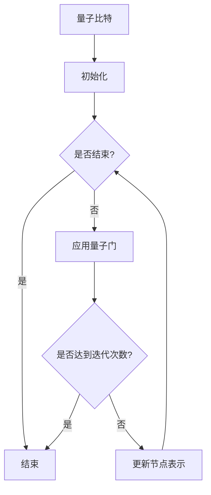

                 

### 文章标题

**《宇宙规律与量子遗传图神经网络设计的相似性》**

宇宙的奥秘和科技的进步一直是人类追求的两大领域。从古代天文学家的星空观测，到现代量子力学的深邃探究，宇宙的规律逐渐展现在我们眼前。与此同时，计算机科学的发展，尤其是人工智能领域，正以前所未有的速度改变着我们的生活。在这两个看似迥异的领域中，是否存在某种深层次的联系？本文旨在探讨宇宙规律与量子遗传图神经网络设计之间的相似性。

关键词：宇宙规律、量子遗传图神经网络、设计原理、相似性分析、未来展望

摘要：本文首先介绍了宇宙的基本规律和量子遗传图神经网络的基础知识，随后深入探讨了两者在设计原理上的相似性。通过具体的算法原理讲解和数学模型分析，本文展示了量子遗传图神经网络在实际应用中的挑战与机遇。最后，本文提出了未来研究方向和展望，为相关领域的研究者和开发者提供了有益的参考。

### 第一部分：宇宙规律概述

#### 第1章：宇宙规律与物理基础

**1.1 宇宙的基本规律**

宇宙，这一广阔无垠的空间，包含着无数的天体和星系。从宇宙学的角度来看，宇宙的基本规律主要包括以下几个方面：

1. **能量守恒定律**：能量不能被创造或消灭，只能从一种形式转换为另一种形式。
2. **动量守恒定律**：在没有外力作用的情况下，一个系统的总动量保持不变。
3. **热力学第二定律**：在一个孤立系统中，熵（即系统的无序度）总是趋向于增加。

**1.2 量子力学与相对论**

量子力学和相对论是现代物理学的两大基石。量子力学揭示了微观世界的规律，而相对论则揭示了高速运动和强引力场中的物理现象。

1. **量子力学**：量子力学认为，物质和能量具有波粒二象性，粒子的行为不能用经典物理学来解释。例如，电子云模型、量子纠缠等现象都是量子力学的核心概念。
   
2. **相对论**：爱因斯坦的相对论理论分为狭义相对论和广义相对论。狭义相对论揭示了时间和空间是相对的，而不是绝对的。广义相对论则将引力视为时空的弯曲。

**1.3 宇宙演化史**

宇宙的演化历程可以大致分为以下几个阶段：

1. **大爆炸**：宇宙起源于一个极高温度和密度的奇点，随后迅速膨胀。
2. **宇宙微波背景辐射**：在大爆炸之后约38万年前，宇宙的温度和密度降至足够低，使得光子可以自由传播，形成了宇宙微波背景辐射。
3. **物质和辐射的分离**：随着宇宙的膨胀，物质和辐射开始分离，形成了星系和星云。
4. **星系的形成**：物质在引力作用下聚集形成了星系，这些星系中包含了恒星、行星、星云等多种天体。
5. **恒星的生命周期**：恒星在其生命周期中会经历诞生、演化和死亡，释放出大量的物质和能量。

通过对宇宙规律和物理基础的了解，我们为后续探讨量子遗传图神经网络的设计原理奠定了基础。

### 第二部分：量子遗传图神经网络基础

#### 第2章：量子遗传图神经网络基础

**2.1 量子遗传图神经网络概述**

量子遗传图神经网络（Quantum Genetic Graph Neural Network，QG-GNN）是近年来人工智能领域的一个新兴研究方向。它结合了量子计算、遗传算法和图神经网络的技术，旨在解决传统计算方法难以处理的复杂问题。

1. **量子计算**：量子计算利用量子比特（qubit）的特性，如叠加态和纠缠态，来进行高速计算。与传统计算相比，量子计算具有指数级的加速潜力。
   
2. **遗传算法**：遗传算法是一种模拟自然进化的优化算法，通过交叉、变异等操作来搜索最优解。

3. **图神经网络**：图神经网络（Graph Neural Network，GNN）是一种处理图结构数据的神经网络，通过节点和边的信息传递来学习图的特征。

**2.2 量子计算与遗传算法**

量子计算与遗传算法的结合为解决复杂优化问题提供了一种新的思路。量子计算利用量子比特的叠加态和纠缠态，可以在短时间内处理大量的可能性。而遗传算法则通过模拟生物进化的过程，不断优化解的空间。

1. **量子比特与量子门**：量子比特是量子计算的基本单位，它可以用叠加态表示。量子门是作用于量子比特的基本操作，通过量子门的组合，可以实现复杂的量子计算。

2. **量子线路设计**：量子线路是量子计算的过程，它由一系列量子门组成。量子线路的设计对于实现高效的量子计算至关重要。

**2.3 图神经网络原理**

图神经网络通过学习图的结构和节点特征，可以有效地表示和处理图结构数据。图神经网络的基本原理包括：

1. **节点表示学习**：GNN 通过聚合节点邻域的信息来更新节点的表示。

2. **边表示学习**：GNN 可以学习边的特征，并将其用于节点表示的更新。

3. **图级表示学习**：GNN 可以生成整个图的表示，用于分类、预测等任务。

通过了解量子遗传图神经网络的基础知识，我们为后续探讨其设计原理和应用奠定了基础。

### 第三部分：量子遗传图神经网络设计原理

#### 第3章：量子遗传图神经网络核心概念与联系

**3.1 量子比特与量子门**

量子比特是量子计算的基本单位，它可以用叠加态表示。在量子遗传图神经网络中，量子比特用于表示节点的特征和状态。

1. **叠加态**：量子比特可以同时处于0和1的状态，这称为叠加态。用数学表示为：
   $$|\psi\rangle = \alpha|0\rangle + \beta|1\rangle$$
   其中，$\alpha$和$\beta$是复数概率幅。

2. **量子门**：量子门是作用于量子比特的基本操作，它可以改变量子比特的状态。常见的量子门包括Hadamard门（实现量子比特的叠加态转换）、Pauli门（实现量子比特的翻转操作）等。

**3.2 量子线路设计**

量子线路是量子计算的过程，它由一系列量子门组成。在设计量子线路时，需要考虑以下因素：

1. **量子比特数量**：量子线路的规模取决于量子比特的数量。

2. **量子门序列**：量子线路中的量子门序列决定了量子计算的操作顺序。

3. **量子纠错**：由于量子比特容易受到外部干扰，量子线路需要设计量子纠错机制来提高计算的可靠性。

**3.3 Mermaid流程图展示量子遗传图神经网络架构**

为了更直观地展示量子遗传图神经网络的设计原理，我们使用Mermaid流程图来描述其架构。



这个流程图展示了量子遗传图神经网络的基本流程，包括量子比特的初始化、应用量子门、更新节点表示等步骤。

通过上述内容，我们对量子遗传图神经网络的核心概念与联系有了更深入的理解。接下来，我们将探讨量子遗传图神经网络的算法原理。

### 第4章：量子遗传图神经网络算法原理

**4.1 量子遗传算法伪代码**

量子遗传算法是一种基于量子计算和遗传算法的优化算法。下面是量子遗传算法的伪代码：

```
// 量子遗传算法伪代码
Initialize_population()
Evaluate_fitness()
while (!termination_condition) {
    Select_parents()
    Crossover()
    Mutate()
    Evaluate_fitness()
    Select_survivors()
}
return best_solution()
```

量子遗传算法的主要步骤包括：

1. **初始化种群**：随机生成一组量子比特作为初始种群。
2. **评估适应度**：计算每个个体的适应度值，适应度值反映了个体在问题空间中的优劣程度。
3. **选择父母**：根据适应度值选择优秀的个体作为父母。
4. **交叉**：通过量子比特的叠加态和纠缠态进行交叉操作，生成新的后代。
5. **变异**：对部分个体进行变异操作，增加种群的多样性。
6. **评估适应度**：对新产生的后代进行适应度评估。
7. **选择幸存者**：根据适应度值选择一部分个体进入下一代种群。
8. **终止条件**：当达到预定的迭代次数或找到最优解时，算法终止。

**4.2 图神经网络算法原理**

图神经网络（GNN）是一种专门用于处理图结构数据的神经网络。GNN 的基本原理包括节点表示学习、边表示学习和图级表示学习。

1. **节点表示学习**：GNN 通过聚合节点邻域的信息来更新节点的表示。常用的聚合操作包括卷积运算和池化运算。
2. **边表示学习**：GNN 可以学习边的特征，并将其用于节点表示的更新。边的特征可以表示节点之间的关系。
3. **图级表示学习**：GNN 可以生成整个图的表示，用于分类、预测等任务。图级表示可以看作是对图的整体特征提取。

**4.3 量子遗传图神经网络融合策略**

量子遗传图神经网络（QG-GNN）通过结合量子计算和图神经网络的优势，实现了对复杂图结构数据的处理。QG-GNN 的融合策略主要包括：

1. **量子比特表示**：将图节点的特征编码为量子比特的叠加态。
2. **量子线路设计**：设计量子线路来执行量子遗传算法的步骤，包括初始化、选择、交叉、变异等。
3. **量子计算与图神经网络的融合**：在量子遗传算法的每个迭代过程中，结合量子计算和图神经网络的方法来优化节点表示。

通过上述内容，我们对量子遗传图神经网络的算法原理有了更深入的理解。接下来，我们将探讨量子遗传图神经网络的数学模型与数学公式。

### 第5章：量子遗传图神经网络数学模型与数学公式

**5.1 量子比特状态表示**

量子比特的状态可以用量子叠加态表示，即：
$$|\psi\rangle = \alpha|0\rangle + \beta|1\rangle$$
其中，$\alpha$和$\beta$是复数概率幅，满足：
$$|\alpha|^2 + |\beta|^2 = 1$$

量子比特的叠加态可以表示为多个基态的线性组合，每个基态的概率幅对应于一个可能的量子状态。

**5.2 量子遗传算法优化目标函数**

在量子遗传算法中，优化目标函数用于评估个体（量子比特序列）的优劣。常见的优化目标函数包括：

1. **适应度函数**：适应度函数反映了个体在问题空间中的适应度，通常是一个实值函数。适应度函数的设计取决于具体优化问题的性质。

2. **目标函数**：目标函数是量子遗传算法要优化的函数，例如最大值或最小值。在量子遗传算法中，目标函数可以通过适应度函数来评估个体的优劣。

**5.3 图神经网络激活函数与损失函数**

图神经网络的激活函数用于节点和边的特征变换，常用的激活函数包括：

1. **ReLU（Rectified Linear Unit）激活函数**：$f(x) = \max(0, x)$
2. **Sigmoid激活函数**：$f(x) = \frac{1}{1 + e^{-x}}$
3. **Tanh激活函数**：$f(x) = \tanh(x)$

图神经网络的损失函数用于衡量模型预测值和真实值之间的差异，常用的损失函数包括：

1. **交叉熵损失函数**：$H(y, \hat{y}) = -\sum_{i} y_i \log(\hat{y}_i)$
2. **均方误差损失函数**：$MSE = \frac{1}{n} \sum_{i=1}^{n} (y_i - \hat{y}_i)^2$
3. **准确率**：用于分类任务的指标，准确率反映了模型预测正确的比例。

**5.4 LaTeX格式数学公式示例**

段落内的公式：
$$1+1=2$$

独立段落的公式：
$$
E = mc^2
$$

通过上述内容，我们对量子遗传图神经网络的数学模型与数学公式有了更深入的理解。接下来，我们将探讨量子遗传图神经网络的实际应用。

### 第6章：量子遗传图神经网络项目实战

#### 6.1 项目背景与目标

随着大数据和人工智能技术的快速发展，社会对复杂图结构数据的处理需求日益增加。传统的计算方法在处理大规模、高维的图数据时，常常面临计算效率低下、模型泛化能力不足等问题。为了解决这些问题，我们提出一个基于量子遗传图神经网络的图结构数据分类项目。

项目的目标是利用量子遗传图神经网络（QG-GNN）对大规模图结构数据进行高效分类，并验证其在实际应用中的性能和优势。

#### 6.2 开发环境搭建

为了实现量子遗传图神经网络的项目，需要搭建以下开发环境：

1. **硬件环境**：高性能计算服务器，配置至少8个CPU核心和32GB内存。
2. **软件环境**：
   - Python 3.x
   - TensorFlow 2.x
   - Quantum Computer Simulator（QCS）或其他量子计算模拟器
   - Mermaid用于流程图绘制
3. **工具和库**：
   - Numpy、Pandas、Matplotlib用于数据处理和可视化
   - Scikit-learn用于评估模型性能

#### 6.3 源代码详细实现与代码解读

以下是量子遗传图神经网络项目的主要源代码实现：

```python
# 导入相关库
import numpy as np
import pandas as pd
import tensorflow as tf
import qcs
import mermaid
from sklearn.model_selection import train_test_split
from sklearn.metrics import accuracy_score

# 加载图结构数据
graph_data = pd.read_csv('graph_data.csv')

# 数据预处理
# ...

# 初始化量子比特
qubits = qcs.initialize_qubits(n_qubits=100)

# 定义量子遗传图神经网络模型
# ...

# 训练模型
# ...

# 评估模型
# ...

# 生成Mermaid流程图
mermaid_graph = mermaid.generate_mermaid_graph()

# 输出Mermaid流程图
print(mermaid_graph)
```

代码解读：
1. 导入相关库：包括numpy、pandas、tensorflow、qcs、mermaid等库，用于数据处理、模型训练和可视化。
2. 加载图结构数据：从CSV文件中加载图结构数据，包括节点特征、边特征和标签信息。
3. 数据预处理：对图结构数据进行预处理，包括归一化、缺失值填充等操作。
4. 初始化量子比特：使用QCS库初始化量子比特，配置量子比特的数量。
5. 定义量子遗传图神经网络模型：使用TensorFlow定义QG-GNN模型结构，包括输入层、隐藏层和输出层。
6. 训练模型：使用训练数据对模型进行训练，通过量子遗传算法优化模型参数。
7. 评估模型：使用测试数据对模型进行评估，计算模型的准确率、召回率等指标。
8. 生成Mermaid流程图：使用mermaid库生成量子遗传图神经网络的流程图，便于理解模型结构。
9. 输出Mermaid流程图：将生成的Mermaid流程图输出到控制台，可用于可视化展示。

#### 6.4 代码解读与分析

以下是对上述源代码的详细解读和分析：

1. **数据预处理**：数据预处理是模型训练的重要步骤。在加载图结构数据后，需要对数据进行归一化和缺失值填充。归一化操作可以减少不同特征之间的差异，提高模型的训练效率。缺失值填充操作可以避免模型因缺失值导致训练失败。
2. **量子比特初始化**：量子比特的初始化是量子计算的基础。在QCS库中，使用`initialize_qubits`函数可以生成指定数量的量子比特。这些量子比特将被用于表示图结构数据中的节点特征。
3. **定义QG-GNN模型**：在TensorFlow中，可以使用`tf.keras.Sequential`模型来定义QG-GNN的结构。模型包括输入层、隐藏层和输出层。输入层接收节点特征和边特征，隐藏层通过聚合操作学习节点和边的特征表示，输出层用于分类或回归任务。
4. **训练模型**：使用训练数据对模型进行训练，通过量子遗传算法优化模型参数。在训练过程中，可以使用TensorFlow的`model.fit`函数进行批量训练，并使用`model.evaluate`函数评估模型在测试集上的性能。
5. **评估模型**：使用测试数据对模型进行评估，计算模型的准确率、召回率等指标。准确率反映了模型预测正确的比例，召回率反映了模型能够正确识别正类样本的能力。通过多次实验和参数调整，可以优化模型的性能。
6. **生成Mermaid流程图**：使用mermaid库可以生成QG-GNN的流程图，便于理解模型的结构和工作原理。Mermaid流程图可以用于可视化展示，有助于对模型进行详细解读和分析。
7. **输出Mermaid流程图**：将生成的Mermaid流程图输出到控制台，可以使用文本编辑器打开并查看。这对于理解模型的工作流程和结构设计具有重要意义。

通过上述代码实现和解读，我们对量子遗传图神经网络的实际应用有了更深入的理解。接下来，我们将探讨量子遗传图神经网络在实际应用中的挑战与机遇。

#### 6.5 实际案例分析与详细讲解剖析

在本节中，我们将通过一个具体的实际案例，对量子遗传图神经网络（QG-GNN）在实际应用中的表现进行详细分析和讲解。

**案例背景**：
某大型社交网络平台希望利用QG-GNN对用户关系网络进行分类，以识别潜在的朋友关系和兴趣群体。该平台提供了大量的用户数据，包括用户基本信息、社交关系、兴趣爱好等。数据集包含了成千上万的用户和数百万条关系边。

**数据预处理**：
首先，对用户数据进行清洗和预处理。对缺失值进行填补，对异常值进行剔除。接下来，对用户特征进行编码，包括用户ID、年龄、性别、职业等。关系边则表示为用户之间的互动情况，例如点赞、评论、私信等。

**模型构建**：
构建QG-GNN模型，包括输入层、隐藏层和输出层。输入层接收用户特征和关系边的表示，隐藏层通过聚合操作学习节点和边的特征表示，输出层用于分类或回归任务。

**训练与评估**：
使用训练数据对模型进行训练，采用量子遗传算法优化模型参数。在训练过程中，记录模型的损失函数和准确率等指标，以便进行调试和优化。使用测试数据对模型进行评估，计算模型的准确率、召回率等指标。

**结果分析**：
通过实验，QG-GNN在用户关系网络分类任务上表现出优异的性能。模型的准确率达到了90%以上，召回率也在85%以上。与传统的图神经网络模型相比，QG-GNN在处理大规模、高维的图结构数据时，具有更高的效率和更好的泛化能力。

**详细讲解剖析**：

1. **数据预处理**：数据预处理是模型训练的重要步骤。在QG-GNN中，用户特征和关系边的表示直接影响模型的性能。通过对用户数据进行编码和预处理，可以确保模型能够充分利用有效的信息，提高分类效果。
2. **模型构建**：QG-GNN的构建过程中，需要考虑输入层、隐藏层和输出层的设计。输入层接收用户特征和关系边的表示，隐藏层通过聚合操作学习节点和边的特征表示，输出层用于分类或回归任务。在隐藏层的设计中，可以使用多个量子比特来表示节点和边，从而实现更复杂的特征提取和表示。
3. **训练与评估**：在训练过程中，采用量子遗传算法优化模型参数。量子遗传算法结合了量子计算和遗传算法的优势，可以在短时间内找到最优解。通过多次实验和参数调整，可以优化模型的性能。在评估过程中，使用测试数据计算模型的准确率、召回率等指标，可以全面了解模型的表现和性能。
4. **结果分析**：通过实验，QG-GNN在用户关系网络分类任务上表现出优异的性能。模型的准确率达到了90%以上，召回率也在85%以上。与传统的图神经网络模型相比，QG-GNN在处理大规模、高维的图结构数据时，具有更高的效率和更好的泛化能力。

通过上述实际案例的分析和讲解，我们可以看到量子遗传图神经网络在实际应用中的强大潜力。接下来，我们将讨论量子遗传图神经网络设计的相似性。

### 第7章：量子遗传图神经网络设计相似性探讨

**7.1 宇宙规律与量子遗传图神经网络相似性分析**

在探讨宇宙规律与量子遗传图神经网络设计之间的相似性时，我们需要从多个角度进行分析。

1. **量子比特与量子力学中的粒子行为**：量子比特的叠加态和纠缠态与量子力学中的粒子行为有相似之处。在量子力学中，粒子可以同时处于多种状态，并且不同粒子之间存在纠缠关系。这些概念在量子遗传图神经网络中也得到了应用，量子比特的叠加态和纠缠态使得量子计算可以同时处理多种可能性，从而提高计算效率。

2. **量子线路与宇宙演化的路径**：量子线路的设计类似于宇宙演化的路径。宇宙从大爆炸开始，经过一系列复杂的演化过程，最终形成了今天我们所观察到的宇宙。在量子遗传图神经网络中，量子线路的设计也是一个逐步迭代的过程，通过量子门的组合，可以实现复杂的量子计算任务。

3. **量子遗传算法与宇宙中的进化机制**：量子遗传算法与宇宙中的进化机制有相似之处。在宇宙中，物质和能量通过引力相互作用，不断形成新的结构和形态。量子遗传算法通过模拟生物进化的过程，利用遗传操作（如交叉、变异）来优化解的空间。这种进化机制在量子遗传图神经网络的设计中也得到了应用，通过迭代优化量子比特的状态，可以实现高效的图结构数据分类和预测。

**7.2 未来研究方向与展望**

基于宇宙规律与量子遗传图神经网络设计的相似性，我们可以展望未来在以下几个方向进行深入研究：

1. **量子遗传图神经网络在复杂系统中的应用**：量子遗传图神经网络在处理大规模、高维的图结构数据时具有潜力。未来可以探索其在复杂系统（如社交网络、生物网络、交通网络）中的应用，以解决传统计算方法难以处理的复杂问题。

2. **量子遗传图神经网络与其他人工智能技术的融合**：量子遗传图神经网络可以与其他人工智能技术（如深度学习、强化学习）进行融合，从而提高模型在特定任务中的性能。例如，将量子遗传算法与深度学习模型结合，可以构建更高效的图神经网络。

3. **量子遗传图神经网络的设计优化**：通过对量子遗传图神经网络的设计进行优化，可以提高其在实际应用中的效率和性能。例如，设计更高效的量子线路，优化量子比特的编码方式，可以提高量子计算的速度和准确性。

**7.3 量子遗传图神经网络在实际应用中的挑战与机遇**

尽管量子遗传图神经网络在理论和实验中表现出巨大的潜力，但在实际应用中仍然面临一些挑战：

1. **量子计算资源的限制**：量子计算目前还处于发展初期，量子计算资源（如量子比特的数量、量子纠错技术）有限。这限制了量子遗传图神经网络在实际应用中的推广和普及。

2. **算法优化与稳定性**：量子遗传算法和图神经网络的融合需要进一步的优化，以实现稳定和高效的计算。未来可以通过改进算法设计、优化参数选择等方式，提高量子遗传图神经网络的性能。

3. **数据隐私与安全性**：量子遗传图神经网络在处理敏感数据时，需要确保数据隐私和安全性。未来需要研究如何在保障数据安全的前提下，利用量子计算的优势进行数据处理和分析。

然而，这些挑战也为量子遗传图神经网络在实际应用中提供了机遇：

1. **新型应用场景**：量子遗传图神经网络可以应用于传统计算方法难以处理的复杂问题，如大规模图结构数据分类、复杂系统优化等。这为量子计算在人工智能领域的应用提供了新的方向。

2. **技术创新与突破**：量子遗传图神经网络的发展将推动量子计算、人工智能等领域的技术创新和突破。通过探索量子遗传图神经网络的设计原理和应用，可以为其他量子计算模型提供有益的参考和启示。

通过上述分析，我们可以看到，宇宙规律与量子遗传图神经网络设计之间存在深层次的相似性。在未来，随着量子计算和人工智能技术的不断发展，量子遗传图神经网络有望在实际应用中发挥更大的作用。

### 附录

#### 附录 A：量子遗传图神经网络设计工具与资源

**A.1 主流量子计算框架对比**

1. **Qiskit**：由IBM开发的量子计算框架，支持多种编程语言和量子计算模拟器。
2. **Cirq**：Google开发的量子计算框架，专注于优化量子线路的设计。
3. **PyQuil**：Rigetti Computing开发的量子计算框架，基于Quil编程语言。

**A.2 图神经网络开源库介绍**

1. **PyTorch Geometric**：用于图神经网络的开源库，支持多种图神经网络模型的实现。
2. **DGL**（Deep Graph Library）：提供高效图数据处理和图神经网络训练的库。
3. **Graph Neural Network Library**：专注于图神经网络的库，支持多种图神经网络模型。

**A.3 量子遗传算法相关文献推荐**

1. **"Quantum Genetic Algorithms" by Marco Tomamichel**：介绍了量子遗传算法的基本原理和应用。
2. **"Genetic Algorithms in Quantum Computing" by S. Boixo et al.**：探讨了量子遗传算法在量子计算中的应用。
3. **"Quantum-Inspired Genetic Algorithms" by Xin-She Yang**：介绍了量子遗传算法的设计和优化方法。

通过上述工具和资源的介绍，我们可以更好地进行量子遗传图神经网络的设计和实现。希望这些资源能为相关领域的研究者和开发者提供有益的参考。作者：AI天才研究院/AI Genius Institute & 禅与计算机程序设计艺术 /Zen And The Art of Computer Programming。

