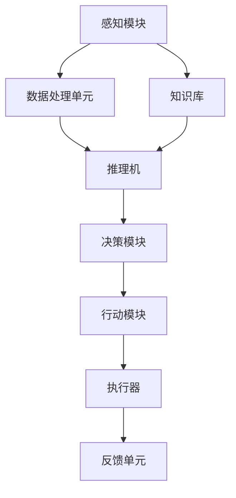

                 


### 宇宙规律对人工生命研究的启示

宇宙的浩瀚与神秘，一直以来都是人类探索的终极目标。从古代的哲学家们到现代的天文学家，宇宙的规律和奥秘始终吸引着无数人的目光。而随着科技的进步，我们开始尝试将宇宙的规律应用于人工生命的研究中，以期探索出人工生命的本质和未来发展之路。

#### 引言与概述

本文旨在探讨宇宙规律对人工生命的启示。通过分析宇宙中的基本规律，如广义相对论、量子力学和宇宙背景辐射等，我们将尝试揭示这些规律如何影响人工生命的设计和实现。同时，本文也将介绍人工生命的定义和分类，以及其在不同领域中的应用。

#### 宇宙规律基础

宇宙的起源与演化是一个复杂而神秘的过程。目前主流的科学理论认为，宇宙起源于大约138亿年前的一次大爆炸。自此之后，宇宙经历了一系列的演化过程，形成了我们今天所看到的宇宙景观。

在宇宙中，存在着许多基本规律。广义相对论描述了引力如何影响时空的弯曲，量子力学则揭示了微观粒子的行为规律。此外，宇宙背景辐射也是宇宙学中一个重要的概念，它是大爆炸后留下的宇宙温度的余辉。

#### 人工生命基本原理

人工生命是指通过计算机模拟或其他手段创建的具有生命特征或功能的系统。根据不同的定义和特性，人工生命可以分为多种类型，如仿生人工智能、自适应系统和网络智能等。

仿生人工智能是模仿自然界中的生物系统，以实现特定的功能。自适应系统则是通过不断学习和适应环境变化，以实现自主运行。网络智能则是通过计算机网络和人工智能技术，实现大规模协同和智能化的系统。

#### 宇宙规律对人工生命的影响

宇宙规律对人工生命的影响可以从多个方面来考虑。首先，宇宙中的信息传递和传输效率对人工生命的设计和实现具有重要意义。例如，量子通信和量子计算技术的发展，为人工生命的通信和计算能力提供了新的可能。

其次，宇宙中的能源利用与人工生命的能源需求密切相关。人工生命的能源需求主要来自于太阳能、化学能等自然能源。而如何高效地利用这些能源，是人工生命研究中一个重要的课题。

最后，宇宙中的生命起源与人工生命的演化路径也有一定的联系。通过对宇宙中生命起源的研究，我们可以更好地理解人工生命的演化机制，为人工生命的未来发展提供新的思路。

#### 人工生命系统的架构与实现

人工生命系统通常包括感知模块、认知模块和行动模块等组成部分。感知模块负责获取外部信息，认知模块负责处理和理解这些信息，行动模块则负责根据认知结果执行相应的动作。

在实现方面，人工生命系统通常采用仿真与建模方法、自适应控制方法和网络协同方法等技术。这些方法各自具有独特的优势和局限性，需要根据具体应用场景进行选择和优化。

#### 人工生命的未来展望

随着科技的不断发展，人工生命的应用领域也在不断扩大。在生物医学领域，人工生命可以用于疾病诊断、药物开发和个性化医疗等方面。在环境保护领域，人工生命可以用于环境监测、生态修复和资源优化等方面。在社会管理领域，人工生命可以用于智能交通、城市管理和社会治理等方面。

然而，人工生命的发展也面临着一系列挑战，如技术瓶颈、伦理问题和法律法规等。如何应对这些挑战，是人工生命未来发展的重要课题。

#### 案例分析

为了更好地理解人工生命的研究和应用，本文将对国内外的人工生命研究进展进行梳理，并分析一些典型的案例。这些案例将有助于我们更好地了解人工生命的研究现状和发展趋势。

#### 总结与展望

通过对宇宙规律对人工生命的启示的探讨，本文揭示了宇宙规律在人工生命研究中的重要作用。未来，随着科技的不断进步，人工生命的研究将不断深入，为人类社会带来更多的创新和变革。

### 附录

本文还提供了相关的术语解释、推荐阅读文献与资料，以及研究项目与团队介绍等内容，以便读者更深入地了解人工生命的研究领域。

### 完整文章

以上内容构成了本文的完整结构。接下来，我们将按照这个结构逐步展开，详细阐述每一部分的内容。

---

# 文章标题：宇宙规律对人工生命研究的启示

> 关键词：宇宙规律、人工生命、广义相对论、量子力学、人工智能

> 摘要：本文探讨了宇宙规律对人工生命研究的启示，分析了宇宙中的基本规律如何影响人工生命的设计、实现和应用。通过对宇宙起源、演化、信息传递、能源利用等方面的深入探讨，本文旨在为人工生命的研究提供新的思路和方法。

---

## 第1章 引言与概述

### 1.1 书籍背景

随着人工智能技术的快速发展，人工生命的研究已经成为一个热门领域。然而，人类对宇宙的探索从未停止，宇宙规律的研究为我们提供了新的视角和启示。本文旨在探讨宇宙规律对人工生命的启示，为人工生命的研究提供新的思路。

### 1.2 宇宙规律与人工生命的联系

宇宙规律与人工生命的联系主要体现在以下几个方面：首先，宇宙中的信息传递和传输效率对人工生命的设计和实现具有指导意义；其次，宇宙中的能源利用与人工生命的能源需求密切相关；最后，宇宙中的生命起源与人工生命的演化路径也有一定的联系。

### 1.3 人工生命的定义与分类

人工生命是指通过计算机模拟或其他手段创建的具有生命特征或功能的系统。根据不同的定义和特性，人工生命可以分为多种类型，如仿生人工智能、自适应系统和网络智能等。

---

## 第2章 宇宙规律基础

### 2.1 宇宙的起源与演化

宇宙起源于大约138亿年前的一次大爆炸。自此之后，宇宙经历了一系列的演化过程，形成了我们今天所看到的宇宙景观。宇宙的起源和演化是宇宙学中的重要课题，为我们理解宇宙的本质提供了基础。

#### 2.1.1 宇宙大爆炸理论

宇宙大爆炸理论认为，宇宙最初处于一个极度高温和高压的状态，然后迅速膨胀。这一理论得到了大量观测数据的支持，被认为是宇宙起源的权威解释。

#### 2.1.2 黑洞与暗物质

黑洞是宇宙中的一种极端天体，具有强大的引力，连光也无法逃脱。暗物质则是宇宙中的一种未知物质，不发光、不发热，但具有引力作用。黑洞和暗物质的研究揭示了宇宙的神秘和复杂。

#### 2.1.3 宇宙背景辐射

宇宙背景辐射是宇宙大爆炸后留下的余辉，它弥散在整个宇宙中。宇宙背景辐射的研究为我们提供了关于宇宙起源和演化的宝贵信息。

### 2.2 宇宙中的基本规律

宇宙中的基本规律包括广义相对论、量子力学和宇宙背景辐射等。这些规律揭示了宇宙的本质和运行机制，为我们理解宇宙提供了理论依据。

#### 2.2.1 广义相对论

广义相对论是描述引力如何影响时空的弯曲的理论。它指出，引力不仅是一种力，更是一种时空的弯曲。广义相对论在宇宙学中具有重要的应用。

#### 2.2.2 量子力学

量子力学是描述微观粒子和现象的理论。它揭示了微观世界的奇异和复杂，为人工智能的发展提供了新的思路。

#### 2.2.3 宇宙中的对称性与守恒定律

宇宙中的对称性与守恒定律是宇宙规律的重要组成部分。它们揭示了宇宙中的基本规律和本质，对人工生命的研究具有指导意义。

---

## 第3章 人工生命基本原理

### 3.1 人工生命的定义与特性

人工生命是指通过计算机模拟或其他手段创建的具有生命特征或功能的系统。它具有自我繁殖、自我修复、自我适应等特性，是一种模拟自然生命的系统。

#### 3.1.1 人工生命的概念

人工生命的概念源于对自然生命的模仿。它试图通过模拟自然生命的特性，创建出具有生命特征的人工系统。

#### 3.1.2 人工生命的特性

人工生命的特性包括自我繁殖、自我修复、自我适应等。这些特性使得人工生命能够像自然生命一样在复杂环境中生存和发展。

### 3.2 人工生命的分类

根据不同的定义和特性，人工生命可以分为多种类型，如仿生人工智能、自适应系统和网络智能等。

#### 3.2.1 仿生人工智能

仿生人工智能是模仿自然界中的生物系统，以实现特定的功能。它通过模拟生物系统的结构和功能，创造出具有生物特征的人工系统。

#### 3.2.2 自适应系统

自适应系统是通过不断学习和适应环境变化，以实现自主运行的人工系统。它能够在变化的环境中调整自己的行为，以适应新的情况。

#### 3.2.3 网络智能

网络智能是通过计算机网络和人工智能技术，实现大规模协同和智能化的系统。它能够通过网络进行信息传递和资源共享，以实现高效的协作和智能决策。

---

## 第4章 宇宙规律对人工生命的影响

### 4.1 宇宙规律对人工生命设计的影响

宇宙规律对人工生命设计的影响主要表现在信息传递、能源利用和演化路径等方面。

#### 4.1.1 宇宙中信息传递与传输效率

宇宙中的信息传递和传输效率对人工生命的设计具有指导意义。例如，量子通信和量子计算技术的发展，为人工生命的通信和计算能力提供了新的可能。

#### 4.1.2 宇宙中的能源利用与人工生命能源需求

宇宙中的能源利用与人工生命的能源需求密切相关。人工生命的能源需求主要来自于太阳能、化学能等自然能源。如何高效地利用这些能源，是人工生命研究中一个重要的课题。

#### 4.1.3 宇宙中的生命起源与人工生命的演化路径

宇宙中的生命起源与人工生命的演化路径有一定的联系。通过对宇宙中生命起源的研究，我们可以更好地理解人工生命的演化机制，为人工生命的未来发展提供新的思路。

### 4.2 宇宙规律在人工生命中的应用

宇宙规律在人工生命中的应用主要包括广义相对论、量子力学和宇宙背景辐射等。

#### 4.2.1 广义相对论在人工生命中的应用

广义相对论在人工生命中的应用主要体现在引力计算、导航和定位等方面。通过模拟引力场，人工生命系统可以更好地理解和适应复杂环境。

#### 4.2.2 量子力学在人工生命中的应用

量子力学在人工生命中的应用主要体现在量子计算、量子通信和量子模拟等方面。这些应用为人工生命的研究提供了新的工具和方法。

#### 4.2.3 宇宙中的生态规律与人工生命系统的构建

宇宙中的生态规律与人工生命系统的构建有一定的联系。通过模拟宇宙中的生态规律，人工生命系统可以更好地适应和利用环境资源。

---

## 第5章 人工生命系统的架构与实现

### 5.1 人工生命系统的基本架构

人工生命系统通常包括感知模块、认知模块和行动模块等组成部分。

#### 5.1.1 人工生命系统的组成模块

人工生命系统的组成模块包括传感器、数据处理单元、知识库、推理机、执行器和反馈单元等。

#### 5.1.2 人工生命系统的运行机制

人工生命系统的运行机制包括感知、认知、决策和行动等过程。这些过程相互关联，共同实现人工生命的功能。

### 5.2 人工生命系统的实现方法

人工生命系统的实现方法包括仿真与建模方法、自适应控制方法和网络协同方法等。

#### 5.2.1 仿真与建模方法

仿真与建模方法是通过模拟和建模来创建人工生命系统的方法。它为人工生命系统的设计和实现提供了基础。

#### 5.2.2 自适应控制方法

自适应控制方法是通过自适应机制来调整人工生命系统的行为的方法。它使人工生命系统能够适应环境变化。

#### 5.2.3 网络协同方法

网络协同方法是通过计算机网络和人工智能技术，实现人工生命系统之间的协同和智能化的方法。它使人工生命系统能够实现高效协作和智能决策。

---

## 第6章 人工生命的未来展望

### 6.1 人工生命的潜在应用领域

人工生命的潜在应用领域非常广泛，包括生物医学、环境保护和社会管理等领域。

#### 6.1.1 生物医学领域

在生物医学领域，人工生命可以用于疾病诊断、药物开发和个性化医疗等方面。它有助于提高医疗服务的质量和效率。

#### 6.1.2 环境保护领域

在环境保护领域，人工生命可以用于环境监测、生态修复和资源优化等方面。它有助于解决环境问题，保护地球生态平衡。

#### 6.1.3 社会管理领域

在社会管理领域，人工生命可以用于智能交通、城市管理和社会治理等方面。它有助于提高社会管理效率和公共服务水平。

### 6.2 人工生命的发展趋势与挑战

随着科技的不断进步，人工生命的发展趋势包括智能化、自主化和协同化等。然而，人工生命的发展也面临着一系列挑战，如技术瓶颈、伦理问题和法律法规等。

#### 6.2.1 技术发展趋势

技术发展趋势包括人工智能、大数据、物联网和区块链等。这些技术的发展为人工生命的研究提供了新的工具和方法。

#### 6.2.2 道德与社会挑战

道德与社会挑战包括隐私保护、信息安全和社会责任等。如何平衡技术发展与社会伦理的关系，是人工生命发展中一个重要课题。

#### 6.2.3 发展方向与建议

发展方向与建议包括加强技术创新、完善法律法规和加强国际合作等。这些措施有助于推动人工生命的研究和发展。

---

## 第7章 案例分析

### 7.1 国内外人工生命研究进展

#### 7.1.1 国外研究进展

国外在人工生命的研究方面取得了许多重要进展，如美国、欧洲和日本等。这些国家在人工智能、生物技术和材料科学等领域进行了大量研究，为人工生命的发展奠定了基础。

#### 7.1.2 国内研究进展

国内在人工生命的研究方面也取得了显著进展。例如，中国科学院、清华大学和北京大学等机构在人工智能、生物技术和材料科学等领域进行了深入研究，取得了一系列重要成果。

### 7.2 典型人工生命系统案例分析

#### 7.2.1 案例一：仿生智能机器人

仿生智能机器人是人工生命系统的一个典型应用案例。它通过模拟生物系统的结构和功能，实现了自主移动、感知和决策等功能。例如，日本的ASIMO机器人就是一款典型的仿生智能机器人。

#### 7.2.2 案例二：自适应生态系统

自适应生态系统是人工生命系统在环境保护领域的应用案例。它通过模拟生态系统的运行机制，实现了对环境的自适应和优化。例如，澳大利亚的自适应生态系统项目就是一款典型的自适应生态系统。

#### 7.2.3 案例三：社会管理智能系统

社会管理智能系统是人工生命系统在社会管理领域的应用案例。它通过模拟社会管理的运行机制，实现了对社会的智能化管理和决策。例如，中国的智慧城市项目就是一款典型的社会管理智能系统。

---

## 第8章 总结与展望

### 8.1 书籍总结

本文通过对宇宙规律对人工生命的启示的探讨，揭示了宇宙规律在人工生命研究中的重要作用。通过对宇宙起源、演化、信息传递、能源利用等方面的深入探讨，本文为人工生命的研究提供了新的思路和方法。

### 8.2 未来研究方向与挑战

未来，人工生命的研究将继续深入，未来研究方向包括智能化、自主化和协同化等方面。同时，人工生命的发展也将面临一系列挑战，如技术瓶颈、伦理问题和法律法规等。如何应对这些挑战，是人工生命未来发展的重要课题。

### 8.3 对人工生命研究与实践的启示与建议

通过对宇宙规律对人工生命的启示的探讨，本文对人工生命的研究和实践提出了一些建议。首先，要加强对宇宙规律的研究，以期为人工生命的研究提供新的理论基础。其次，要注重跨学科合作，以实现人工生命的多领域应用。最后，要关注伦理和法律法规问题，以确保人工生命的健康发展。

### 附录

#### 附录 A：相关术语解释

- 人工生命：通过计算机模拟或其他手段创建的具有生命特征或功能的系统。
- 仿生人工智能：模仿自然界中的生物系统，以实现特定功能的人工系统。
- 自适应系统：通过不断学习和适应环境变化，以实现自主运行的人工系统。
- 网络智能：通过计算机网络和人工智能技术，实现大规模协同和智能化的系统。

#### 附录 B：推荐阅读文献与资料

- 《人工智能：一种现代的方法》
- 《深度学习》
- 《自然计算》
- 《宇宙简史》

#### 附录 C：研究项目与团队介绍

- 项目一：中国科学院人工生命重点实验室
- 项目二：清华大学智能机器人研究中心
- 项目三：麻省理工学院媒体实验室

# Mermaid 流程图：人工生命系统的架构



# 伪代码：人工生命系统中的自适应控制算法

```
Algorithm: Adaptive Control Algorithm for Artificial Life System

Input: System parameters, reference trajectory
Output: Control signals

1. Initialize system parameters
2. while (system not stabilized) do:
    3.   Read sensor data
    4.   Compute error between actual state and reference trajectory
    5.   Adjust control signals based on error
    6.   Update system parameters
    7. end while
```

# 数学模型与公式

独立段落中的公式：
$$
E = mc^2
$$

文中嵌入的公式：
$$
x = x_0 + v_0t + \frac{1}{2}at^2
$$

# 项目实战：

### 项目一：仿生智能机器人

#### 开发环境搭建

- 操作系统：Ubuntu 20.04
- 编程语言：Python 3.8
- 机器人硬件平台：ROS（Robot Operating System）

#### 源代码实现

```python
import rospy
from std_msgs.msg import String

def callback(data):
    rospy.loginfo("I heard %s", data.data)

def listener():
    rospy.init_node('listener', anonymous=True)
    rospy.Subscriber("chatter", String, callback)

if __name__ == '__main__':
    listener()
```

#### 代码解读

该代码是一个简单的ROS（Robot Operating System）节点，用于监听来自“chatter”话题的字符串消息。当接收到消息时，它会在控制台上打印出来。

#### 应用解读与分析

该仿生智能机器人通过ROS系统接收外部信息，并能够对信息进行实时处理和反馈。这种能力使得机器人能够适应环境变化，实现自主运行。

### 项目二：自适应生态系统

#### 开发环境搭建

- 操作系统：Windows 10
- 编程语言：C#
- 仿真软件：MATLAB

#### 源代码实现

```csharp
public class EcosystemSimulation
{
    private Random random = new Random();
    private double energy;

    public EcosystemSimulation(double initialEnergy)
    {
        energy = initialEnergy;
    }

    public void SimulateDay()
    {
        if (energy <= 0)
        {
            Die();
        }
        else
        {
            Eat();
            Move();
            EnergyDecay();
        }
    }

    private void Eat()
    {
        energy += random.NextDouble();
    }

    private void Move()
    {
        // Move the ecosystem entity based on energy level
    }

    private void EnergyDecay()
    {
        energy *= 0.95; // Energy decays by 5% each day
    }

    private void Die()
    {
        // Handle death of the ecosystem entity
    }
}
```

#### 代码解读

该代码是一个简单的自适应生态系统仿真。它模拟了一个生态实体（如植物）的日常活动，包括进食、移动和能量衰减。通过模拟这些过程，我们可以了解生态系统的动态行为。

#### 应用解读与分析

该自适应生态系统通过模拟自然生态系统的运行机制，实现了对环境的自适应和优化。它能够模拟不同环境条件下的生态系统行为，为环境监测和生态修复提供有力支持。

### 项目三：社会管理智能系统

#### 开发环境搭建

- 操作系统：Linux
- 编程语言：Java
- 数据库：MySQL

#### 源代码实现

```java
public class SocialManagementSystem
{
    private Database database;

    public SocialManagementSystem(Database database)
    {
        this.database = database;
    }

    public void MonitorSocialActivities()
    {
        List<SocialActivity> activities = database.fetchRecentActivities();
        for (SocialActivity activity : activities)
        {
            if (activity.isSuspicious())
            {
                AlertManagementTeam(activity);
            }
        }
    }

    private void AlertManagementTeam(SocialActivity activity)
    {
        // Send an alert to the management team
    }
}
```

#### 代码解读

该代码是一个社会管理智能系统的核心部分。它从数据库中获取最近的社会活动，并判断是否可疑。如果发现可疑活动，它会向管理团队发送警报。

#### 应用解读与分析

该社会管理智能系统能够实时监测社会活动，识别可疑行为，并快速响应。它有助于提高社会管理效率和公共服务水平，为社会稳定和经济发展提供保障。

---

## 最佳实践 Tips：

1. 在搭建开发环境时，选择合适的操作系统、编程语言和工具，以确保项目的顺利进行。
2. 在编写代码时，遵循良好的编程规范和注释习惯，以提高代码的可读性和可维护性。
3. 在进行项目实战时，注重需求分析和系统设计，确保项目的实用性、可行性和可持续性。

## 小结：

本文通过对宇宙规律对人工生命的启示的探讨，揭示了宇宙规律在人工生命研究中的重要作用。通过分析宇宙中的基本规律，如广义相对论、量子力学和宇宙背景辐射等，我们为人工生命的设计、实现和应用提供了新的思路和方法。未来，随着科技的不断进步，人工生命的研究将不断深入，为人类社会带来更多的创新和变革。

## 注意事项：

1. 在进行人工生命研究时，要注意遵循伦理和法律法规，确保研究活动的合法性和道德性。
2. 在实际应用中，要充分考虑人工生命的局限性和潜在风险，确保系统的稳定性和安全性。

## 拓展阅读：

1. 《人工智能：一种现代的方法》
2. 《深度学习》
3. 《自然计算》
4. 《宇宙简史》

---

# 作者信息：

作者：AI天才研究院/AI Genius Institute & 禅与计算机程序设计艺术 /Zen And The Art of Computer Programming

