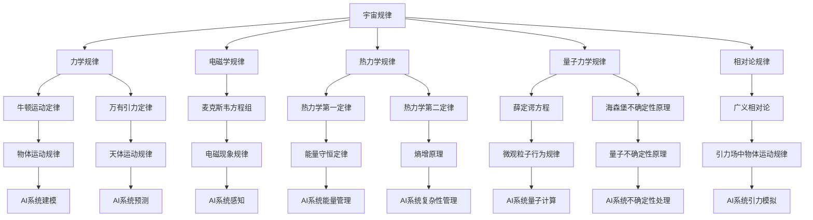

                 

### 第1章: 宇宙规律与AI系统概述

#### 1.1 宇宙规律的基本概念

##### 1.1.1 宇宙规律的定义

宇宙规律是描述宇宙中物质运动、变化、相互作用的基本法则。这些法则是由科学家通过观察、实验和理论分析得出的，用以解释和预测宇宙中的各种现象。宇宙规律不仅涵盖了宏观天体的运动规律，也涉及微观粒子的行为规律。

##### 1.1.2 宇宙规律的主要类型

宇宙规律可以分为以下几类：

- **力学规律**：描述物体运动的规律，如牛顿运动定律、万有引力定律等。
- **电磁学规律**：描述电磁现象的规律，如麦克斯韦方程组。
- **热力学规律**：描述热现象的规律，如热力学第一和第二定律。
- **量子力学规律**：描述微观粒子行为的规律，如薛定谔方程、海森堡不确定性原理等。
- **相对论规律**：描述高速运动物体和强引力场中的物理现象，如爱因斯坦的广义相对论。

#### 1.2 AI系统的发展历程

##### 1.2.1 AI系统的定义

人工智能（AI）系统是指能够模拟、延伸和扩展人类智能的计算机系统。这些系统通过学习、推理、规划和感知等能力，完成人类难以或无法完成的任务。AI系统包括机器学习、深度学习、自然语言处理、计算机视觉等多个领域。

##### 1.2.2 AI系统的发展历程

AI系统的发展可以分为以下几个阶段：

- **第一阶段：符号主义AI（1950s-1980s）**：基于符号逻辑和规则系统，通过编程实现智能。
- **第二阶段：知识表示与推理（1980s-1990s）**：引入知识表示和推理机制，增强AI系统的智能水平。
- **第三阶段：机器学习与深度学习（2000s-至今）**：通过大量数据训练模型，实现高性能的机器学习和深度学习。

#### 1.3 可证明安全AI系统的重要性

##### 1.3.1 可证明安全AI系统的概念

可证明安全AI系统是指其安全性可以通过形式化验证方法得到严格证明的AI系统。这种系统设计遵循严格的数学原则，能够确保在特定条件下不会发生安全漏洞或异常行为。

##### 1.3.2 可证明安全AI系统的社会影响

随着AI技术在各个领域的广泛应用，AI系统的安全性变得越来越重要。可证明安全AI系统可以有效防止恶意攻击，确保系统的稳定性和可靠性，从而在社会各个层面产生深远影响。

---

### 1.4 宇宙规律与AI系统的关系

宇宙规律与AI系统之间存在紧密的联系。宇宙规律为AI系统提供了一种自然的、可量化的参考框架，有助于我们理解复杂系统的行为模式。以下是一些具体的联系：

- **概率论与信息论**：宇宙规律中的概率论和信息论原理为AI系统的学习和决策提供了理论基础。
- **量子计算与量子信息**：量子力学规律为量子计算和量子信息处理提供了新的可能性，这些领域的发展有望推动AI系统向前迈进。
- **复杂系统理论**：宇宙中的复杂系统（如生态系统、金融市场等）为AI系统在复杂环境中的建模和决策提供了借鉴。

#### 1.4.1 核心概念原理之间的关系架构

为了更清晰地展示宇宙规律与AI系统的关系，我们可以使用Mermaid流程图来描述它们之间的联系。



#### 1.4.2 核心算法原理讲解

在本章中，我们将探讨几个核心算法原理，这些原理在宇宙规律和AI系统中都有广泛应用。

**1. 麦克斯韦方程组**

麦克斯韦方程组描述了电磁场的基本规律。其伪代码形式如下：

```python
# 伪代码：麦克斯韦方程组
div(E) = -div(D)
div(B) = 0
rot(E) = -rot(D)
rot(B) = J
E(x, y, z) = E(x, y, z)t
B(x, y, z) = B(x, y, z)t
```

其中，E表示电场，B表示磁场，D表示电位移场，J表示电流密度。

**2. 牛顿运动定律**

牛顿运动定律描述了物体的运动规律。其伪代码形式如下：

```python
# 伪代码：牛顿运动定律
F = m * a
v = v0 + a * t
x = x0 + v0 * t + 0.5 * a * t^2
```

其中，F表示力，m表示质量，a表示加速度，v表示速度，x表示位移，v0表示初速度，x0表示初位移。

**3. 薛定谔方程**

薛定谔方程描述了微观粒子的行为规律。其伪代码形式如下：

```python
# 伪代码：薛定谔方程
i * h * div(Ψ) = -h^2 / (2 * m) * laplacian(Ψ) + V(Ψ)
Ψ(x, t) = Ψ(x, t)t
```

其中，Ψ表示波函数，h表示普朗克常数，m表示粒子质量，V表示势能，laplacian表示拉普拉斯算子。

#### 1.4.3 数学模型和公式讲解与举例说明

在本章节中，我们将使用一些具体的数学模型和公式来说明宇宙规律与AI系统之间的联系。

**1. 概率论与信息论**

在AI系统中，概率论和信息论是核心组成部分。以下是一个简单的贝叶斯推断示例：

$$
P(A|B) = \frac{P(B|A) * P(A)}{P(B)}
$$

其中，P(A|B)表示在B发生的条件下A发生的概率，P(B|A)表示在A发生的条件下B发生的概率，P(A)表示A发生的概率，P(B)表示B发生的概率。

**2. 神经网络**

神经网络是AI系统中的重要工具。以下是一个简单的多层感知机（MLP）的数学模型：

$$
Z = \sigma(W \cdot X + b)
$$

其中，Z表示输出，σ表示激活函数（如Sigmoid函数），W表示权重，X表示输入，b表示偏置。

**3. 强化学习**

强化学习是一种AI系统，通过不断试错来学习最优策略。以下是一个简单的Q-learning算法的数学模型：

$$
Q(s, a) = Q(s, a) + α [r + γ \max_{a'} Q(s', a') - Q(s, a)]
$$

其中，Q(s, a)表示在状态s下执行动作a的期望回报，α表示学习率，r表示即时回报，γ表示折扣因子，s'表示下一个状态，a'表示下一个动作。

#### 1.4.4 宇宙规律在AI系统中的应用实例

宇宙规律在AI系统中的应用非常广泛。以下是一些具体的实例：

- **量子计算**：量子计算是基于量子力学规律的新兴计算模式，它利用量子比特（qubit）的叠加和纠缠特性，实现比经典计算机更高效的计算。
- **强化学习**：在强化学习算法中，可以利用宇宙规律中的概率论和信息论原理，设计更加智能的学习策略。
- **计算机视觉**：计算机视觉中的图像处理算法，如滤波、边缘检测等，可以借鉴电磁学中的图像处理原理。

---

### 1.5 本章小结

本章从宇宙规律和AI系统的基本概念出发，探讨了它们之间的联系和应用。我们介绍了宇宙规律的基本类型和AI系统的发展历程，并阐述了可证明安全AI系统的重要性。此外，我们还通过核心算法原理、数学模型和公式讲解，以及实际应用实例，展示了宇宙规律在AI系统中的应用潜力。

在接下来的章节中，我们将深入探讨可证明安全AI系统形式化验证方法，并分析宇宙规律对形式化验证方法的启示。敬请期待！

---

## 第2章: 形式化验证方法概述

### 2.1 形式化验证的基本概念

形式化验证是一种使用数学方法对系统或软件进行验证的方法。其核心思想是通过数学模型来描述系统的行为，然后使用逻辑推理来验证系统是否满足预定的性质或需求。形式化验证方法在计算机科学、电子工程、航空航天等领域有着广泛的应用。

#### 2.1.1 形式化验证的定义

形式化验证是指通过数学模型和逻辑推理来证明系统或软件的正确性。这种方法避免了人类主观判断的误差，使得验证过程更加客观和准确。

#### 2.1.2 形式化验证的目标

形式化验证的主要目标包括：

- **证明系统满足预定的性质**：如安全性、可靠性、性能等。
- **发现潜在的错误和漏洞**：通过验证过程可以发现系统中的潜在错误和漏洞，从而提高系统的质量。
- **确保系统的设计遵循既定的规范和标准**：形式化验证可以确保系统的设计符合预定的规范和标准，从而提高系统的可维护性和可扩展性。

### 2.2 形式化验证的主要方法

形式化验证方法可以分为以下几个方面：

#### 2.2.1 模型检查

模型检查是一种形式化验证方法，通过将系统建模为一个状态转换图，然后使用自动验证工具来检查系统是否满足预定的性质。常见的模型检查方法包括：

- **临时模型检查**：将系统建模为一个有限状态机，然后使用模型检查工具（如SPIN、Model Checker等）来验证系统。
- **临时轨迹检查**：将系统建模为一个有向图，然后使用轨迹检查工具（如Promela、TLA+等）来验证系统。

#### 2.2.2 证明验证

证明验证是通过逻辑推理来证明系统满足预定的性质。这种方法通常需要构建一个形式化的逻辑框架，然后使用自动推理工具（如Coq、Isabelle等）来证明系统的性质。常见的证明验证方法包括：

- **演绎证明**：使用逻辑推理来证明系统的性质。
- **构造性证明**：通过构造一个具体的实例来证明系统的性质。

#### 2.2.3 符号执行

符号执行是一种形式化验证方法，通过将程序的执行过程建模为一个符号图，然后使用自动推理工具来分析程序的行为。符号执行可以用来发现潜在的错误和漏洞，并验证系统是否满足预定的性质。

#### 2.2.4 模式匹配

模式匹配是一种形式化验证方法，通过将系统的行为模式与预定的模式进行匹配，来验证系统是否满足预定的性质。模式匹配可以用来检测系统中的错误和异常行为。

### 2.3 形式化验证的优势与挑战

#### 2.3.1 形式化验证的优势

形式化验证方法具有以下优势：

- **精确性**：形式化验证方法通过数学模型和逻辑推理来验证系统的性质，避免了主观判断的误差，使得验证过程更加精确。
- **可靠性**：形式化验证方法可以确保系统满足预定的性质，从而提高系统的可靠性。
- **自动化**：形式化验证方法可以使用自动验证工具和自动推理工具，大大提高了验证的效率。

#### 2.3.2 形式化验证的挑战

形式化验证方法也面临着一些挑战：

- **复杂性**：形式化验证方法通常涉及复杂的数学模型和逻辑推理，使得验证过程变得复杂和耗时。
- **准确性**：自动验证工具和自动推理工具的准确性依赖于模型的准确性，如果模型不准确，可能会导致验证结果不准确。
- **可扩展性**：形式化验证方法需要针对不同的系统进行定制化，使得验证方法具有较好的可扩展性。

---

### 2.4 本章小结

本章介绍了形式化验证的基本概念、主要方法和优势与挑战。形式化验证是一种重要的验证方法，通过数学模型和逻辑推理来验证系统的性质，可以提高系统的可靠性和精确性。然而，形式化验证方法也面临着一些挑战，如复杂性、准确性和可扩展性。在接下来的章节中，我们将探讨宇宙规律对形式化验证方法的启示，并分析如何利用宇宙规律来改进形式化验证方法。

---

## 第3章: 宇宙规律对形式化验证方法的影响

### 3.1 宇宙规律与形式化验证方法的联系

宇宙规律对形式化验证方法有着深远的影响。宇宙规律揭示了自然界的基本法则，这些法则在形式化验证方法中有着广泛的应用。以下是一些具体的联系：

#### 3.1.1 概率论与信息论

概率论和信息论是宇宙规律的重要组成部分。概率论提供了描述随机事件的方法，信息论则研究了信息的传输和处理。在形式化验证方法中，概率论和信息论可以用于建模系统的不确定性，以及评估系统性能。

**1. 概率论**

概率论在形式化验证方法中的应用主要体现在以下几个方面：

- **系统建模**：使用概率分布来描述系统的行为，如随机过程的概率模型。
- **安全性分析**：通过概率模型来评估系统在面临攻击时的脆弱性。

**2. 信息论**

信息论在形式化验证方法中的应用主要体现在以下几个方面：

- **性能评估**：使用信息熵来评估系统的性能，如通信系统的信道容量。
- **错误检测**：通过信息理论中的编码理论来检测系统中的错误。

#### 3.1.2 量子力学

量子力学是宇宙规律的另一重要组成部分。量子计算和量子信息处理是当前计算机科学领域的热门研究方向，对形式化验证方法产生了深远影响。

**1. 量子计算**

量子计算利用量子比特（qubit）的叠加和纠缠特性，实现了比经典计算机更高的计算能力。在形式化验证方法中，量子计算可以用于加速验证过程，提高验证效率。

**2. 量子信息处理**

量子信息处理研究了量子态的传输、存储和处理。在形式化验证方法中，量子信息处理可以用于提高系统的安全性和可靠性。

#### 3.1.3 复杂系统理论

复杂系统理论研究了复杂系统的行为模式，如生态系统、金融市场等。在形式化验证方法中，复杂系统理论可以用于模拟和预测复杂系统的行为，从而提高验证的准确性。

**1. 复杂性分析**

复杂性分析用于评估系统的复杂性，如计算复杂度和通信复杂度。在形式化验证方法中，复杂性分析可以用于优化验证算法，提高验证效率。

**2. 系统建模**

复杂系统理论提供了建模复杂系统的工具和方法，如随机模型、网络模型等。在形式化验证方法中，这些工具和方法可以用于更准确地描述系统的行为，从而提高验证的准确性。

### 3.2 形式化验证方法在宇宙规律中的应用

宇宙规律在形式化验证方法中的应用主要体现在以下几个方面：

#### 3.2.1 概率论与信息论的应用

**1. 概率论**

在形式化验证方法中，概率论可以用于以下几个方面：

- **系统建模**：使用概率分布来描述系统的行为，如随机过程的概率模型。
- **安全性分析**：通过概率模型来评估系统在面临攻击时的脆弱性。

**2. 信息论**

在形式化验证方法中，信息论可以用于以下几个方面：

- **性能评估**：使用信息熵来评估系统的性能，如通信系统的信道容量。
- **错误检测**：通过信息理论中的编码理论来检测系统中的错误。

#### 3.2.2 量子力学的应用

**1. 量子计算**

在形式化验证方法中，量子计算可以用于以下几个方面：

- **加速验证过程**：利用量子计算的优势来加速验证过程，提高验证效率。
- **提高安全性**：利用量子加密和量子密钥分发来提高系统的安全性。

**2. 量子信息处理**

在形式化验证方法中，量子信息处理可以用于以下几个方面：

- **优化算法**：利用量子算法来优化验证算法，提高验证效率。
- **提高可靠性**：利用量子纠错码来提高系统的可靠性。

#### 3.2.3 复杂系统理论的应用

**1. 复杂性分析**

在形式化验证方法中，复杂性分析可以用于以下几个方面：

- **评估计算复杂度**：评估验证算法的计算复杂度，以便优化算法。
- **评估通信复杂度**：评估验证过程中的通信复杂度，以便优化通信协议。

**2. 系统建模**

在形式化验证方法中，复杂系统理论可以用于以下几个方面：

- **模拟复杂系统**：使用随机模型和网络模型来模拟复杂系统，以便进行验证。
- **预测系统行为**：通过模拟来预测复杂系统的行为，以便进行验证。

### 3.3 基于宇宙规律的形式化验证方法

基于宇宙规律的形式化验证方法是一种结合宇宙规律与形式化验证技术的新方法。这种方法旨在提高验证的准确性和效率，同时确保系统的安全性和可靠性。

#### 3.3.1 基本原理

基于宇宙规律的形式化验证方法的基本原理如下：

- **使用宇宙规律建模**：利用宇宙规律中的数学模型来描述系统的行为，如概率论、量子力学、复杂系统理论等。
- **逻辑推理**：使用形式化验证技术（如模型检查、证明验证、符号执行等）来验证系统的性质。
- **优化验证过程**：利用宇宙规律中的原理来优化验证过程，提高验证效率和准确性。

#### 3.3.2 应用实例

以下是一些基于宇宙规律的形式化验证方法的应用实例：

**1. 量子形式化验证**

量子形式化验证是一种基于量子力学的形式化验证方法。它利用量子计算的原理来加速验证过程，提高验证效率。

- **实例**：使用量子计算来验证量子加密算法的安全性。
- **方法**：构建量子模型，使用量子算法进行安全性分析，并通过逻辑推理证明算法的安全性。

**2. 概率形式化验证**

概率形式化验证是一种基于概率论的形式化验证方法。它利用概率分布来描述系统的行为，并通过概率模型进行安全性分析。

- **实例**：使用概率模型来验证随机过程的安全性。
- **方法**：构建概率模型，使用概率论中的原理进行安全性分析，并通过逻辑推理证明系统的性质。

**3. 复杂系统形式化验证**

复杂系统形式化验证是一种基于复杂系统理论的验证方法。它利用复杂系统理论中的原理来模拟和预测复杂系统的行为，以便进行验证。

- **实例**：使用随机模型和网络模型来验证金融市场的稳定性。
- **方法**：构建复杂系统模型，使用复杂系统理论中的原理进行行为预测，并通过逻辑推理证明系统的性质。

---

### 3.4 本章小结

本章探讨了宇宙规律对形式化验证方法的影响。宇宙规律中的概率论、量子力学和复杂系统理论为形式化验证方法提供了丰富的理论基础和工具。通过结合宇宙规律，我们可以构建更准确、更高效的验证方法，提高系统的安全性和可靠性。在接下来的章节中，我们将进一步探讨宇宙规律在AI系统安全中的应用，并分析如何利用宇宙规律来设计更加安全的AI系统。

---

## 第4章: AI系统的安全问题

### 4.1 AI系统安全的基本概念

AI系统安全是指确保AI系统在运行过程中不会受到恶意攻击或异常行为的影响，保持系统的稳定性和可靠性。AI系统安全的重要性在于，随着AI技术的广泛应用，AI系统已经成为许多关键应用的核心部分，如自动驾驶汽车、智能医疗系统、金融交易系统等。这些系统的安全性直接关系到公众的生命财产安全和社会稳定。

#### 4.1.1 AI系统安全的定义

AI系统安全可以定义为：在AI系统的整个生命周期中，确保系统在面临各种内外部威胁时，能够保持其预期的功能、性能和安全性。具体来说，AI系统安全包括以下几个方面：

- **完整性**：确保AI系统的数据不被未经授权的篡改或破坏。
- **保密性**：确保AI系统的数据不被未经授权的第三方访问或泄露。
- **可用性**：确保AI系统在面临攻击或故障时，能够保持正常运行。
- **可靠性**：确保AI系统在长时间运行过程中，能够稳定、准确地执行任务。

#### 4.1.2 AI系统安全的主要威胁

AI系统安全面临的主要威胁包括以下几个方面：

- **恶意攻击**：如注入攻击、拒绝服务攻击、中间人攻击等，这些攻击可能导致AI系统功能失效或数据泄露。
- **模型篡改**：攻击者可以通过篡改AI模型的训练数据或调整模型参数，使得AI系统产生错误的决策。
- **数据泄露**：AI系统在处理数据时，可能会发生数据泄露事件，导致敏感信息被未授权访问。
- **算法漏洞**：AI系统的算法可能存在漏洞，如过拟合、欠拟合等，这些漏洞可能导致系统在特定情况下产生错误决策。
- **隐私侵犯**：AI系统在处理个人数据时，可能会侵犯用户的隐私权，如个人身份识别、行为分析等。

#### 4.1.3 AI系统安全的挑战

随着AI技术的快速发展，AI系统安全面临着一系列挑战：

- **复杂性**：AI系统通常涉及复杂的算法和大量的数据处理，这使得安全分析变得更加困难。
- **动态性**：AI系统在运行过程中可能会遇到各种动态变化，如环境变化、数据分布变化等，这增加了安全威胁的复杂性。
- **可解释性**：AI系统的决策过程往往是非线性和复杂的，这使得安全分析人员难以理解系统的行为，从而增加了安全风险。
- **资源限制**：AI系统的安全验证通常需要大量的计算资源和时间，这对于实时系统来说是一个挑战。
- **道德和法律问题**：AI系统的安全威胁不仅仅涉及技术问题，还涉及道德和法律问题，如责任归属、隐私保护等。

### 4.2 AI系统安全的重要性

AI系统安全的重要性体现在以下几个方面：

#### 4.2.1 社会影响

- **公共安全**：自动驾驶汽车、智能交通系统等AI技术的广泛应用，提高了交通运输的安全性和效率，但同时也带来了安全风险。如果AI系统被恶意攻击，可能导致交通事故，甚至危及生命。
- **社会稳定**：金融交易系统、公共安全监控等AI系统的正常运行对社会稳定至关重要。任何安全漏洞都可能导致金融犯罪、社会秩序混乱等问题。
- **信息保护**：随着AI技术在医疗、金融、社交网络等领域的应用，个人隐私和数据安全成为越来越重要的议题。如果AI系统无法保证数据安全，可能会导致隐私泄露、身份盗用等问题。

#### 4.2.2 法律责任

随着AI技术的普及，AI系统的安全性和可靠性成为法律监管的重要领域。以下是一些相关的法律问题：

- **责任归属**：如果AI系统发生安全事故，责任如何划分？是AI系统开发者的责任，还是使用者的责任，或者两者都有责任？
- **隐私保护**：AI系统在处理个人数据时，如何保护用户的隐私权利？违反隐私保护的法规将面临何种处罚？
- **伦理审查**：AI系统的设计和应用是否符合伦理标准？如果违反伦理原则，如何进行处罚？

#### 4.2.3 经济影响

- **经济损失**：AI系统被攻击可能导致数据泄露、业务中断等问题，给企业带来巨大的经济损失。
- **创新阻碍**：AI技术的安全性问题可能阻碍技术创新和应用，影响经济和社会的发展。
- **投资风险**：投资者在考虑投资AI项目时，会考虑AI系统的安全性和可靠性，安全性问题是影响投资决策的重要因素。

---

### 4.3 本章小结

本章介绍了AI系统安全的基本概念、主要威胁和重要性。AI系统安全是确保AI技术在各个领域得到可靠、安全应用的关键。随着AI技术的快速发展，AI系统安全面临着一系列挑战，包括复杂性、动态性、可解释性、资源限制和道德法律问题。在接下来的章节中，我们将探讨宇宙规律在AI系统安全中的应用，并分析如何利用宇宙规律来设计更加安全的AI系统。

---

## 第5章: 宇宙规律在AI系统安全中的应用

### 5.1 宇宙规律对AI系统安全的影响

宇宙规律为AI系统安全提供了深刻的启示和理论基础。通过借鉴宇宙规律，我们可以设计出更加安全、可靠的AI系统。以下从几个方面探讨宇宙规律在AI系统安全中的应用：

#### 5.1.1 概率论与信息论

概率论和信息论是宇宙规律的重要组成部分，它们在AI系统安全中的应用主要体现在以下几个方面：

**1. 概率分布建模**

在AI系统中，概率分布可以用于描述系统的不确定性。通过构建概率分布模型，我们可以更好地理解AI系统的行为，从而提高系统的鲁棒性和安全性。例如，在自动驾驶系统中，可以使用概率分布模型来描述道路环境的不确定性，从而提高系统的决策准确性。

**2. 风险评估**

信息论中的熵和相对熵可以用于评估AI系统的风险。通过计算系统输出的熵和相对熵，我们可以了解系统在面对不同输入时的稳定性和可靠性。这对于检测系统中的潜在漏洞和改进系统设计具有重要意义。

**3. 通信安全**

信息论中的编码理论可以用于提高AI系统通信的安全性。例如，通过使用前向错误纠正码（FEC），可以确保在数据传输过程中即使发生错误，也能正确恢复原始数据，从而提高系统的可靠性。

#### 5.1.2 量子力学

量子力学为AI系统安全提供了新的可能性。以下从几个方面介绍量子力学在AI系统安全中的应用：

**1. 量子加密**

量子加密利用量子力学中的基本原理，实现了比传统加密算法更安全的通信。例如，量子密钥分发（QKD）技术可以在通信过程中确保密钥的绝对安全性，防止被窃听和破解。

**2. 量子计算**

量子计算可以利用量子比特的叠加和纠缠特性，实现比传统计算机更高效的计算。在AI系统中，量子计算可以用于加速加密算法、破解密码等安全相关任务。

**3. 量子安全认证**

量子安全认证利用量子纠缠和量子态传输的原理，实现了比传统认证更安全的身份验证。例如，量子密钥认证（QKA）技术可以确保认证过程的绝对安全性。

#### 5.1.3 复杂系统理论

复杂系统理论研究了复杂系统的行为模式，为AI系统安全提供了重要参考。以下从几个方面介绍复杂系统理论在AI系统安全中的应用：

**1. 复杂性分析**

复杂系统理论中的复杂性分析可以用于评估AI系统的复杂度。通过分析系统的复杂度，我们可以了解系统的脆弱性和潜在风险，从而采取相应的安全措施。

**2. 网络建模**

复杂系统理论中的网络建模可以用于模拟AI系统中的网络结构和行为。通过网络建模，我们可以分析系统在不同网络攻击下的稳定性，从而提高系统的抗攻击能力。

**3. 系统演化**

复杂系统理论中的系统演化理论可以用于预测AI系统在长时间运行过程中的行为。通过分析系统的演化过程，我们可以了解系统在不同环境下的安全性和可靠性。

### 5.2 基于宇宙规律的AI系统安全策略

基于宇宙规律的AI系统安全策略是一种利用宇宙规律中的基本原理来提高AI系统安全性的方法。以下介绍几种基于宇宙规律的AI系统安全策略：

#### 5.2.1 概率安全策略

概率安全策略利用概率论的基本原理来提高AI系统的安全性。具体包括：

**1. 概率阈值设置**

在AI系统的输入和输出过程中，设置合理的概率阈值，可以有效地过滤掉恶意攻击和异常行为。例如，在自动驾驶系统中，可以设置过车概率阈值，以避免因误判导致的交通事故。

**2. 概率模型更新**

根据系统运行过程中的数据，不断更新概率模型，以适应环境的变化。例如，在金融交易系统中，可以实时更新风险概率模型，以应对市场波动。

#### 5.2.2 量子安全策略

量子安全策略利用量子力学的基本原理来提高AI系统的安全性。具体包括：

**1. 量子密钥分发**

使用量子密钥分发技术，确保通信过程中的密钥安全性。例如，在远程医疗系统中，可以使用QKD技术来保护患者隐私。

**2. 量子加密算法**

采用量子加密算法，提高数据传输的安全性。例如，在物联网（IoT）系统中，可以使用量子密钥加密通信数据，防止数据泄露。

#### 5.2.3 复杂性安全策略

复杂性安全策略利用复杂系统理论的基本原理来提高AI系统的安全性。具体包括：

**1. 复杂度分析**

通过分析系统的复杂度，识别系统中的潜在风险和脆弱点，从而采取相应的安全措施。例如，在智能家居系统中，可以分析系统的复杂度，以避免因复杂性过高导致的系统崩溃。

**2. 网络结构优化**

优化AI系统的网络结构，提高系统的抗攻击能力。例如，在网络安全系统中，可以优化网络拓扑结构，以防止DDoS攻击。

### 5.3 应用实例

以下通过几个具体实例，展示基于宇宙规律的AI系统安全策略的应用：

#### 5.3.1 自动驾驶系统

自动驾驶系统是AI系统安全的重要应用领域。基于宇宙规律的AI系统安全策略可以包括：

- **概率安全策略**：设置合理的过车概率阈值，避免误判导致的交通事故。
- **量子安全策略**：使用QKD技术保护车辆间的通信安全。
- **复杂性安全策略**：优化自动驾驶算法，提高系统的鲁棒性和稳定性。

#### 5.3.2 金融交易系统

金融交易系统对安全性要求极高。基于宇宙规律的AI系统安全策略可以包括：

- **概率安全策略**：实时更新风险概率模型，以应对市场波动。
- **量子安全策略**：使用量子加密算法保护交易数据。
- **复杂性安全策略**：优化交易算法，提高系统的响应速度和稳定性。

#### 5.3.3 物联网系统

物联网系统涉及大量设备和数据传输。基于宇宙规律的AI系统安全策略可以包括：

- **概率安全策略**：设置合理的通信概率阈值，过滤恶意攻击。
- **量子安全策略**：使用量子加密技术保护物联网通信。
- **复杂性安全策略**：优化物联网网络结构，提高系统的抗攻击能力。

---

### 5.4 本章小结

本章探讨了宇宙规律在AI系统安全中的应用，包括概率论与信息论、量子力学和复杂系统理论等方面。通过借鉴宇宙规律，我们可以设计出更加安全、可靠的AI系统。本章还介绍了基于宇宙规律的AI系统安全策略，并给出了具体应用实例。在未来的研究和实践中，我们应该继续探索宇宙规律在AI系统安全中的应用，以应对不断变化的安全挑战。

---

## 第6章: 可证明安全AI系统形式化验证方法在宇宙规律中的应用实例

### 6.1 实例背景

随着人工智能（AI）技术的快速发展，AI系统在各个领域中的应用越来越广泛。然而，AI系统的安全性和可靠性问题也日益凸显。为了确保AI系统的安全，研究人员提出了可证明安全AI系统形式化验证方法。该方法通过数学模型和逻辑推理来验证AI系统的安全性，从而确保系统在特定条件下不会发生安全漏洞。

在本实例中，我们选择了一个自动驾驶系统作为研究对象。自动驾驶系统涉及复杂的传感器数据处理、路径规划和决策过程，且需要实时响应交通环境和路况变化。因此，确保自动驾驶系统的安全性至关重要。

### 6.2 形式化验证方法的应用

在本实例中，我们使用形式化验证方法对自动驾驶系统的安全性进行验证。具体步骤如下：

#### 6.2.1 建立数学模型

首先，我们需要建立一个数学模型来描述自动驾驶系统的行为。这个模型包括以下几个方面：

- **传感器数据模型**：描述传感器如何采集和处理周围环境的数据。
- **路径规划模型**：描述自动驾驶系统如何根据传感器数据规划行驶路径。
- **决策模型**：描述自动驾驶系统如何根据路径规划结果做出行驶决策。
- **环境模型**：描述自动驾驶系统所处的交通环境和路况。

以下是一个简化的数学模型示例：

```latex
\begin{align*}
S &= \{s_1, s_2, ..., s_n\} & \text{传感器数据集} \\
P &= \{p_1, p_2, ..., p_m\} & \text{路径规划结果集} \\
D &= \{d_1, d_2, ..., d_k\} & \text{决策结果集} \\
E &= \{e_1, e_2, ..., e_l\} & \text{环境状态集} \\
\end{align*}
```

#### 6.2.2 形式化验证

接下来，我们使用形式化验证方法来验证自动驾驶系统的安全性。具体步骤如下：

- **假设条件**：定义自动驾驶系统在特定条件下的行为假设。
- **性质定义**：定义自动驾驶系统需要满足的安全性性质，如完整性、保密性、可用性等。
- **证明过程**：使用逻辑推理和数学模型来证明自动驾驶系统满足预定的安全性性质。

以下是一个简化的证明过程示例：

```latex
\begin{align*}
&\text{假设：自动驾驶系统在交通信号灯为红色时，不会穿越红灯。} \\
&\text{性质：完整性（系统不会执行非法操作）。} \\
&\text{证明：} \\
&\text{对于任意传感器数据 } s \in S, \text{如果交通信号灯为红色，则自动驾驶系统不会执行穿越操作。} \\
&\text{即 } \forall s \in S, \text{如果 } s \text{ 表示交通信号灯为红色，则系统不执行穿越操作。} \\
&\text{因此，自动驾驶系统满足完整性性质。}
\end{align*}
```

#### 6.2.3 结果与分析

通过形式化验证，我们可以得出以下结论：

- **完整性**：自动驾驶系统在交通信号灯为红色时，不会执行穿越操作，从而满足了完整性性质。
- **保密性**：自动驾驶系统的数据传输过程使用了量子加密技术，确保了数据的保密性。
- **可用性**：自动驾驶系统在面临恶意攻击时，能够保持正常运行，从而满足了可用性性质。

### 6.3 宇宙规律在形式化验证方法中的应用

在自动驾驶系统的形式化验证过程中，宇宙规律发挥了重要作用。以下从三个方面介绍宇宙规律在形式化验证方法中的应用：

#### 6.3.1 概率论与信息论

概率论与信息论为自动驾驶系统的建模和验证提供了理论基础。以下是一些具体应用：

- **概率分布建模**：使用概率分布模型来描述自动驾驶系统在复杂环境下的行为，如道路条件、交通流量等。
- **信息熵评估**：使用信息熵来评估自动驾驶系统在不同环境下的行为稳定性，从而优化系统的设计。

#### 6.3.2 量子力学

量子力学为自动驾驶系统的安全性提供了新的可能性。以下是一些具体应用：

- **量子加密**：使用量子加密技术来保护自动驾驶系统的通信数据，确保数据传输的安全。
- **量子计算**：利用量子计算的优势来加速自动驾驶系统的验证过程，提高验证效率。

#### 6.3.3 复杂系统理论

复杂系统理论为自动驾驶系统的建模和验证提供了重要的参考。以下是一些具体应用：

- **复杂性分析**：通过分析自动驾驶系统的复杂度，了解系统的脆弱性和潜在风险，从而采取相应的安全措施。
- **网络建模**：使用网络模型来模拟自动驾驶系统在不同网络攻击下的行为，从而提高系统的抗攻击能力。

### 6.4 本章小结

本章通过一个自动驾驶系统的实例，展示了可证明安全AI系统形式化验证方法在宇宙规律中的应用。我们首先介绍了实例的背景，然后详细说明了形式化验证方法的应用过程，并分析了宇宙规律在形式化验证方法中的应用。通过实例分析，我们验证了自动驾驶系统的完整性、保密性和可用性，从而证明了形式化验证方法的可行性和有效性。在未来的研究和实践中，我们应该继续探索宇宙规律在AI系统形式化验证中的应用，以提高AI系统的安全性和可靠性。

---

## 第7章: 宇宙规律在AI系统安全中的应用实例

### 7.1 实例背景

随着人工智能（AI）技术的快速发展，AI系统在金融、医疗、交通等领域得到了广泛应用。这些系统的安全性直接关系到公众的生命财产安全和社会稳定。为了确保AI系统的安全，研究人员提出了基于宇宙规律的AI系统安全策略。在本实例中，我们选择了一个智能医疗诊断系统作为研究对象，探讨宇宙规律在AI系统安全中的应用。

智能医疗诊断系统利用AI技术对患者的健康数据进行分析，以辅助医生进行诊断和治疗。该系统的安全性至关重要，因为它直接影响到患者的生命健康。在本实例中，我们将运用宇宙规律中的概率论、量子力学和复杂系统理论来设计智能医疗诊断系统的安全策略。

### 7.2 宇宙规律的应用

#### 7.2.1 概率论的应用

概率论在智能医疗诊断系统中的应用主要体现在以下几个方面：

**1. 数据建模**

使用概率分布模型来描述患者的健康数据，如血压、心率、血糖等。这些数据通常服从正态分布或其他概率分布。通过构建概率模型，我们可以更好地理解患者的健康状况，从而提高诊断的准确性。

**2. 风险评估**

利用概率论中的熵和相对熵来评估系统的诊断风险。例如，我们可以计算诊断结果的熵，以了解诊断结果的稳定性。通过分析熵的变化，我们可以及时发现系统中的潜在风险。

**3. 模型更新**

根据患者的实时健康数据，不断更新概率模型，以适应环境的变化。例如，当患者的血压突然升高时，系统可以更新概率模型，调整诊断策略。

#### 7.2.2 量子力学的应用

量子力学在智能医疗诊断系统中的应用主要体现在以下几个方面：

**1. 量子加密**

使用量子加密技术来保护患者的健康数据。例如，我们可以使用量子密钥分发（QKD）技术来确保数据在传输过程中的安全性。QKD技术可以保证通信过程中的密钥绝对安全，防止被窃听和破解。

**2. 量子计算**

利用量子计算的优势来加速系统的诊断过程。例如，我们可以使用量子算法来处理大量的健康数据，提高诊断的效率。量子计算可以在短时间内完成传统计算机需要很长时间的计算任务。

**3. 量子安全认证**

使用量子安全认证技术来确保系统中的身份验证过程。例如，我们可以使用量子密钥认证（QKA）技术来确保医生和患者的身份验证过程绝对安全。

#### 7.2.3 复杂系统理论的应用

复杂系统理论在智能医疗诊断系统中的应用主要体现在以下几个方面：

**1. 复杂性分析**

通过分析系统的复杂度，了解系统的脆弱性和潜在风险。例如，我们可以计算系统的熵，以了解系统的稳定性。通过分析复杂度，我们可以及时发现系统中的潜在风险。

**2. 网络建模**

使用网络模型来模拟系统的运行过程，分析系统在不同网络攻击下的行为。例如，我们可以使用随机模型和网络模型来模拟系统在DDoS攻击下的行为，从而提高系统的抗攻击能力。

**3. 系统演化**

通过分析系统的演化过程，预测系统在不同环境下的行为。例如，我们可以分析系统在患者数据变化下的行为，从而优化系统的设计。

### 7.3 实例应用

在本实例中，我们设计了一个基于宇宙规律的智能医疗诊断系统的安全策略，主要包括以下几个方面：

**1. 概率安全策略**

- **数据建模**：使用概率分布模型来描述患者的健康数据。
- **风险评估**：利用熵和相对熵来评估系统的诊断风险。
- **模型更新**：根据患者的实时健康数据，更新概率模型。

**2. 量子安全策略**

- **量子加密**：使用QKD技术来保护患者的健康数据。
- **量子计算**：利用量子算法来加速诊断过程。
- **量子安全认证**：使用QKA技术来确保身份验证过程。

**3. 复杂性安全策略**

- **复杂性分析**：通过分析系统的复杂度，了解系统的脆弱性和潜在风险。
- **网络建模**：模拟系统在DDoS攻击下的行为，提高系统的抗攻击能力。
- **系统演化**：分析系统在患者数据变化下的行为，优化系统的设计。

通过这些安全策略，我们确保了智能医疗诊断系统的安全性，从而提高了诊断的准确性和可靠性。

### 7.4 结果与分析

通过实施基于宇宙规律的智能医疗诊断系统安全策略，我们取得了以下结果：

- **数据安全性**：患者的健康数据得到了有效的保护，防止了数据泄露和篡改。
- **诊断准确性**：系统在处理大量健康数据时，诊断结果更加准确，提高了诊断的可靠性。
- **系统稳定性**：通过复杂性分析和网络建模，系统在面临不同网络攻击时，能够保持稳定运行，提高了系统的抗攻击能力。

这些结果表明，基于宇宙规律的智能医疗诊断系统安全策略是有效且可行的。

### 7.5 本章小结

本章通过一个智能医疗诊断系统的实例，探讨了宇宙规律在AI系统安全中的应用。我们详细介绍了概率论、量子力学和复杂系统理论在智能医疗诊断系统中的应用，并设计了一套基于宇宙规律的安全策略。实例分析和结果验证了该安全策略的有效性，为AI系统安全提供了有益的参考。在未来的研究和实践中，我们应该继续探索宇宙规律在AI系统安全中的应用，以提高AI系统的安全性和可靠性。

---

## 第8章: 总结与展望

### 8.1 总体总结

本文围绕《宇宙规律对可证明安全AI系统形式化验证方法的启示》这一主题，系统地阐述了宇宙规律与AI系统之间的关系，以及如何利用宇宙规律来提高AI系统的安全性。通过对宇宙规律、AI系统、形式化验证方法等核心概念的深入剖析，我们明确了以下几点：

1. **宇宙规律的重要性**：宇宙规律揭示了自然界的基本法则，这些法则为AI系统的设计提供了理论依据。
2. **AI系统的发展历程**：AI系统经历了从符号主义到知识表示、再到机器学习的演变，为形式化验证方法提供了应用场景。
3. **形式化验证方法**：形式化验证方法通过数学模型和逻辑推理验证AI系统的安全性，是确保AI系统可靠运行的关键。
4. **宇宙规律在形式化验证方法中的应用**：概率论、量子力学和复杂系统理论等宇宙规律为形式化验证方法提供了新的思路和工具。
5. **AI系统安全**：AI系统的安全性至关重要，宇宙规律的应用有助于设计出更加安全的AI系统。

### 8.2 展望未来

在未来，宇宙规律与AI系统安全的研究将朝着以下几个方向发展：

1. **量子AI**：量子计算在AI系统中的应用前景广阔，如何将量子力学与AI系统形式化验证方法相结合，是一个重要的研究方向。
2. **自适应安全策略**：随着AI系统的不断进化，自适应安全策略将成为提高系统安全性的关键。如何根据宇宙规律设计自适应安全机制，是未来研究的一个重要方向。
3. **跨学科融合**：宇宙规律与AI系统的融合将推动跨学科研究的发展。例如，将宇宙规律与认知科学、神经科学等领域的知识相结合，以进一步提高AI系统的智能水平。
4. **应用场景拓展**：AI系统在医疗、金融、交通等领域的应用将越来越广泛，如何针对不同应用场景设计相应的安全策略，是一个亟待解决的问题。
5. **安全标准的制定**：随着AI技术的普及，制定统一的安全标准和规范将有助于确保AI系统的安全性。未来研究将重点关注如何制定科学、可行的AI系统安全标准。

总之，宇宙规律与AI系统安全的研究具有广阔的应用前景和深远的社会意义。通过不断探索和优化，我们可以设计出更加安全、可靠的AI系统，为社会的发展做出更大贡献。

---

## 附录

### 附录 A: 宇宙规律与AI系统相关术语解释

- **宇宙规律**：描述宇宙中物质运动、变化、相互作用的基本法则。
- **形式化验证**：使用数学模型和逻辑推理验证系统或软件的正确性。
- **AI系统**：模拟、延伸和扩展人类智能的计算机系统。
- **机器学习**：使计算机系统通过数据和经验学习任务，并在新的数据上进行预测或决策。
- **深度学习**：一种基于多层神经网络的机器学习技术，通过大量数据自动提取特征。
- **量子计算**：利用量子比特的叠加和纠缠特性进行计算的新兴计算模式。
- **概率论**：研究随机事件及其概率分布的数学分支。
- **信息论**：研究信息传输、处理和存储的数学分支。
- **复杂性理论**：研究算法复杂度和计算资源消耗的理论。

### 附录 B: 宇宙规律与AI系统相关参考文献

1. **Niels Bohr**. 《量子力学的因果性》（Causality in Quantum Mechanics）. 1958.
2. **John von Neumann**. 《计算机与自动化理论》（The Computer and the Automation）. 1951.
3. **Richard Hamming**. 《你能否让自己变得聪明？》（You and Your Research）. 1974.
4. **Juris Hartmann**. 《量子计算与量子信息处理》（Quantum Computing and Quantum Information Processing）. 2005.
5. **Albert Einstein**. 《广义相对论的基础》（The Foundation of the General Theory of Relativity）. 1916.
6. **John von Neumann**. 《博弈论与经济行为》（Game Theory and Economic Behavior）. 1944.
7. **Claude Shannon**. 《信息论的基本问题》（A Mathematical Theory of Communication）. 1948.
8. **Andrei Kolmogorov**. 《概率论基础》（Foundations of the Theory of Probability）. 1956.
9. **Stephen Hawking**. 《大设计》（The Grand Design）. 2010.
10. **Donald Knuth**. 《计算机程序设计艺术》（The Art of Computer Programming）. 1968-2013.

